## 量化专题报告

# 多因子系列之十七：基于个股信息透明度和久期的分域研究

本篇从信息透明度和久期维度将股票划分成四个象限，并从风格特征、alpha 因子特征、业绩增速走势、公告事件前后的特质收益等角度描述了不同分域内股票的特征。我们进一步梳理了因子在不同分域内的表现差异，并针对不同分域构建了对应的低估成长策略。

从信息透明度衡量公司业绩的确定性。信息透明度越高的公司，投资者把握公司盈利的确定性越高。我们从三个维度刻画公司的信息透明度：（1）可追踪信息的丰富程度；（2）业绩的预测难易度；（3）业绩增速的波动幅度。公司的信息透明度越高，其股价能越快地消化基本面信息。

利用分析师对公司未来三年的业绩预测分布筛选长久期标的。利用分析师对公司未来三年的净利润预测值构建简化版的久期因子，筛选出远期现金流高于近期现金流的投资标的。从业绩增速变化来看，长久期标的池在未来有更高的概率出现高增速公司。

基于信息透明度和久期进行分域。我们将分析师覆盖的样本按信息透明度和久期进行分域，特征总结如下：

高信息透明度-长久期：类似“白马成长”，大市值，高估值，高增速，符合机构审美，信息提前反应较多，且公告后股价漂移明显；

高信息透明度-短久期：类似“白马价值”，大市值，低估值，成长性较弱，信息提前反应较多，但公告后股价漂移不明显；

低信息透明度-长久期：类似“黑马成长”，小市值，高估值，高弹性，信息提前反应较少，公告后股价漂移明显；

低信息透明度-短久期：类似“黑马价值”，小市值，经营波动大，机构持仓低，信息提前反应较少，且公告后股价漂移不明显。

## 因子分域表现规律：

在低信息透明度样本内，市场定价效率相对较低，基于错误定价逻辑的因子，如估值类因子、量价类因子对股票收益的预测能力较强；

在高信息透明度样本内，市场定价效率相对较高，估值类因子失效明显，超预期因子中基于市场反应构建的 ear/jor 因子表现更强，情绪类因子的多头收益突出。

不同分域内的低估成长策略。在“黑马成长”标的池内，基于 PB-ROE 选股策略，相对中证 800年化超额 14.97%，信息比 1.01；在“白马成长”标的池内，利用成交量波动和超预期因子构建的低估成长策略，相对中证 800年化超额收益 20.57%，信息比 1.23。

风险提示：量化专题报告的观点全部基于历史统计与量化模型，存在历史规律与量化模型失效的风险。

## 作者

## 分析师 李林井

执业证书编号：S0680520040002

邮箱：lilinjing@gszq.com

分析师 刘富兵

执业证书编号：S0680518030007

邮箱：liufubing@gszq.com

2、《量化分析报告：掘金 ETF：顺应智能化浪潮——国泰中证智能汽车主题 ETF 投资价值分析》2021-08-23

4、《量化专题报告：多因子系列之十六：基本面因子的收益分解》2021-08-21

## 前言

当前投资者对股票分域的主流方法包括市值、估值、行业等。但在金融实证分析领域，市值、估值作为风险代理变量，往往糅合了资产多个维度的风险。例如在投资小市值股票时，我们可能既承担了股票交易的流动性风险，也承担了公司基本面的不确定性风险。并且在不同的历史时期，风险因子背后的驱动因素也存在差别，这无疑增加了我们的分析难度。

同时，我们注意到主动投资者在对股票的分类时，常常提到“白马/黑马”、“价值/成长”等概念，但并没有非常统一的分类标准。从市场常用的描述来看，“白马”指信息公开、业绩确定性强的股票，“黑马”则是那些等待被挖掘的品种，那么我们可以用信息透明度相关的因子来刻画；“成长股”通常指公司业绩增速较高，估值相对也较高的股票，我们也可以利用成长类因子来描述。在本篇报告中，我们基于上述逻辑，从信息透明度和久期两个维度对股票进行分域，并讨论分域股票的相关特征：

信息透明度：公司信息透明度越高，则市场对公司业绩的把握越准确，股价消化信息的速度也越快；信息透明度越低，则股价消化信息的速度较慢，市场往往存在更明显的反应不足。

久期：我们引入久期来刻画公司的成长性：如果未来现金流更高，则代表公司未来的成长性更强。

如果对应到近几年的市场，多分析师覆盖、机构持仓较重、高ROE、业绩波动较小的股票，与我们定义的高信息透明度和短久期的股票较为相近，类似“白马价值”概念；多分析师覆盖同时未来现金流更高的股票，与我们定义的高信息透明度和长久期的股票较为相近，其成长属性更强，符合“白马成长”的概念；而分析师覆盖少或无分析师覆盖的股票，同时短期内表现出强劲业绩增长的股票，更符合“黑马成长”的概念。

## 一、刻画公司信息透明度

学术研究中刻画公司信息透明度的指标有很多，包括市值、机构持股、分析师分歧度、业绩惊喜幅度、盈利波动等等。我们在本篇报告则采用三个维度的指标，包括：

## 1.1 可追踪信息的丰富程度

分析师通常会就影响公司基本面的信息出具相应的研究报告。分析师除了在财报季出具财报点评报告，平时也会就与公司经营相关的重要事件做出点评。如果非财报季的覆盖报告越多，则说明公司除了财报外可供投资者追踪的信息越丰富。因此，我们计算过去一年月均分析师非财报点评报告数量，来刻画公司除财报外可供投资者追踪信息的多寡：

$$
reviewcoverage=mean\Big(\mathcal{H}\mathbb{X}\mathbb{X}^{\not+}\mathbb{X}\mathbb{X}\mathbb{X}^{\not+}\mathbb{X}\mathbb{X}\frac{\not\to\mathbb{X}}{\not\to\mathbb{X}}\mathbb{X}\frac{\not\to\mathbb{X}}{\not\to\mathbb{X}}\Big),i=1,\dots,12
$$

例如整车公司在该因子上的得分较高，原因在于分析师每个月都会对整车公司的月度汽车产销数据发布点评报告。

注：非财报点评报告：剔除业绩快报、财报公告日3日以内的报告。

## 1.2 业绩的预测难易度

即使公司有丰富的基本面信息可供追踪，但如果公司利用财务造假、业绩粉饰等手段操纵利润，也会大大降低公司信息透明度。我们统计过去三年，分析师最新的年度盈利预测与公告真实盈利的绝对偏离幅度，即分析师基于全年经营活动信息给出的预测的准确度，来衡量业绩的可预测性：

$$
absbiasmean=mean\left(\frac{abs\left(\frac{\sqrt{\pi}\cdot\hat{\mathcal{X}}\hat{\mathcal{L}}\hat{\mathcal{X}}\hat{\mathcal{L}}\hat{\mathcal{H}}\hat{\mathcal{H}}\hat{\mathcal{H}}\hat{\mathcal{M}}\hat{\mathcal{H}}_{i}}{\sqrt{\pi}\cdot\hat{\mathcal{L}}\hat{\mathcal{H}}\hat{\mathcal{X}}\hat{\mathcal{H}}\hat{\mathcal{H}}_{i}}-\mathcal{L}^{\Lambda\frac{\mathcal{L}}{\pi}}\frac{\hat{\mathcal{H}}\hat{\mathcal{L}}\hat{\mathcal{H}}\hat{\mathcal{H}}}{\sqrt{\pi}\cdot\hat{\mathcal{R}}\hat{\mathcal{R}}\hat{\mathcal{L}}\hat{\mathcal{H}}_{i}}\hat{\mathcal{H}}_{i}^{\prime}\right)}{\mathcal{L}^{\perp}\frac{\hat{\mathcal{L}}\hat{\mathcal{L}}}{\pi}\frac{\hat{\mathcal{H}}\hat{\mathcal{L}}\hat{\mathcal{H}}}{\sqrt{\pi}\cdot\hat{\mathcal{R}}\hat{\mathcal{L}}\hat{\mathcal{H}}}\hat{\mathcal{H}}_{i}}\right),i=1,2,3
$$

## 1.3 业绩增速的波动幅度

除了以上两个维度，我们还要面临的最大的不确定性，是来自于公司本身经营波动的风险。我们采用过去八个季度的净利润同比波动率来刻画：

$$
npqyoystd=std(npqyoy_{i}),\ i=1,2,\dots,8
$$

这三个因子本身具备一定的选股能力，长期来看，分析师非财报点评报告越多，预测准确度越高，业绩波动越小的公司，其股票在未来越能取得高收益。

图表1：信息透明度单因子分组表现（市值行业中性，市值加权）
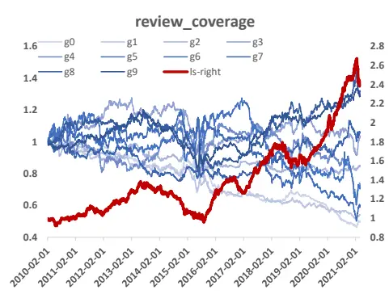
资料来源：Wind，国盛证券研究所

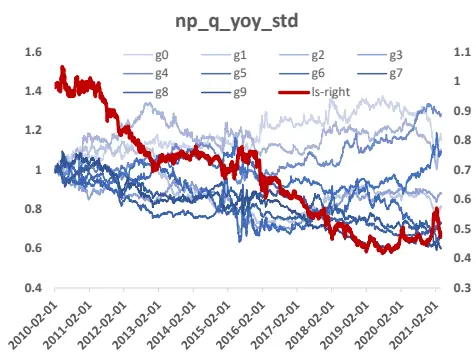

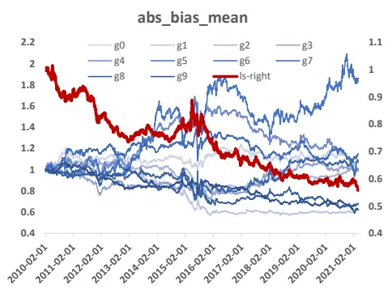

此外，我们在这里为什么不用分析师分歧度呢？

当前的一致预期数据显示，分析师近年来更倾向于覆盖行业龙头公司，导致头部公司的覆盖机构数量远远高于其他公司。而覆盖机构数量过多，会导致计算的盈利预测分歧度过大，由此刻画的信息透明度与我们的设计因子的初衷存在偏差。

## 二、刻画业绩的成长性

## 2.1 久期因子构建

我们利用分析师对公司未来三年净利润的预测构建了一个类似于债券“久期”属性的因子，来反映分析师对公司未来三年现金流的分布的预测，这也比较符合主动投资者在谈论成长股时的直觉感知，即远期的现金流高于近期的现金流，其成长属性越强。

我们做了三个假设来简化计算步骤：

1. 假设分析师预测的净利润能完全转化为现金流并流入企业；

2. 不考虑 3年后的现金流；

3. 假设贴现率为 0；

那么，简易版本的股票久期因子计算如下：

$$
duration=\frac{1\times np_{fy1}+2\times np_{fy2}+3\times np_{fy3}}{np_{fy1}+np_{fy2}+np_{fy3}}
$$

对单因子的测试显示，其对股票未来一个月的收益预测能力出现较大的波动。

图表2：久期因子分组收益表现（市值行业中性，市值加权）
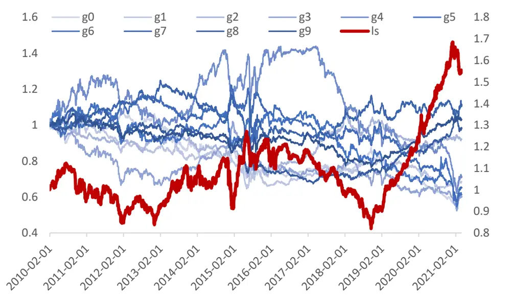
资料来源：Wind，国盛证券研究所

## 2.2 长久期公司的业绩增速迁移规律

为了说明按久期分组与我们传统成长因子分组效果的区别，我们回溯统计了按 duration与季度净利润同比 np_q_yoy 分组，从上一年 t(-1)到未来两年 t(2)，每组真实净利润增速的迁移比例。分组窗口覆盖2010年到2018年。

分组方法：我们在每月底将股票分别按 duration 和 np_q_yoy 按行业中性等分三组 g0、g1、g2，其中g0组因子值最小，g2组因子值最大。分组后，我们统计了不同久期的公司过去到未来真实净利润增速的分布，即下表中 t(-1)代表分组前一年，t(0)代表分组当年，t(1)代表分组后第一年，t(2)代表分组后第二年，每行比例加总为 100%。

左表为 duration 分组的统计结果，右表为 np_q_yoy 分组的结果。例如左表第三个统计显示，当前 duration 最高的 g2 组，在未来第一年 t(1)有 18%的比例进入业绩同比增速最高的组别，同时有 14%的比例进入业绩同比增速最低的组别，而落入中间区间的比例约为 7%左右。

图表3:分组净利润增速迁移比例

| 按duration分组 |  |  |  |  |  |  |  |  |  |  |  |
| --- | --- | --- | --- | --- | --- | --- | --- | --- | --- | --- | --- |
| t(-1) t(0) | g0 | g0 | 低净利润增速 g1 | g2 | g3 | g4 | g5 | g6 | g7 | 高净利润增速 g8 | g9 |
|  |  | 8% | 10% | 11% | 12% | 12% | 10% | 9% | 8% | 8% | 10% |
|  | g1 | 6% | 9% | 9% | 10% | 11% | 11% | 12% | 12% | 10% | 9% |
|  | g2 | 18% | 1% | 8% | 7% | 7% | 7% | 8% | 10% | 11% | 13% |
|  |  |  |  |  | 13% | 13% | 10% |  |  |  |  |
|  | g0 g1 | 10% | 11% | 12% |  |  |  | 9% | 8% | 6% | 7% |
| 8% |  | 9% | 10% | 11% 6% | 11% | 12% | 12% | 12% | 9% | 8% |  |
| t(1) | g2 | 15% | 9% | 7% |  | 7% | 7% | 8% | 10% | 14% | 17% |
|  | g0 | 10% | 11% | 12% | 12% | 13% | 11% | 10% | 8% | 7% | 7% |
|  | g1 | 9% | 10% | 10% | 10% | 11% | 11% | 12% | 11% | 9% | 8% |
|  | g2 | 14% | 9% | 7% | 7% | 7% | 7% | 8% | 10% | 14% | 18% |
| t(2) |  |  |  |  |  |  |  |  |  |  |  |
|  | g0 | 9% | 10% | 11% | 11% | 13% | 11% | 10% | 9% | 7% | 9% |
|  | g1 | 9% | 10% | 10% | 11% | 10% | 10% | 11% | 11% | 9% | 9% |
|  | g2 | 14% | 10% | 8% | 8% | 7% | 7% | 8% | 10% | 12% | 15% |

资料来源：Wind，国盛证券研究所

| 17% | 15% | 13% | 11% | 9% | 7% | 6% | 6% | 6% | 8% |
| --- | --- | --- | --- | --- | --- | --- | --- | --- | --- |
| 5% | 7% | 10% | 13% | 14% | 14% | 13% | 11% | 8% | 6% |
| 10% | 7% | 6% | 6% | 7% | 7% | 10% | 13% | 15% | 19% |
| 21% | 17% | 14% | 10% | 8% | 6% | 5% | 5% | 5% | 8% |
| 5%6% | 7%5% | 10% | 13% | 15% | 14% | 13% | 10% | 7% | 5% |
|  |  | 5% | 7% | 7% | 8% | 11% | 15% | 17% | 19% |
| 14% | 10% | 9% | 9% | 9% | 8% | 8% | 9% | 10% | 15% |
| 8% | 9% | 10% | 11% | 12% | 12% | 12% | 10% | 8% | 7% |
| 11% | 10% | 10% | 10% | 9% | 9% | 10% | 11% | 10% | 10% |
| 13% | 9% | 9% | 9% | 9% | 8% | 8% | 10% | 11% | 15% |
| 8% | 9% | 10% | 11% | 12% | 11% | 11% | 10% | 9% | 8% |
| 12% | 11% | 10% | 10% | 10% | 9% | 10% | 10% | 9% | 10% |

从统计结果来看，我们发现当前 duration 得分最高的 g2 组，在当年和上一年的业绩增速位于区间两端，即历史增速极高或者出现了严重的业绩增速下滑；同时，在未来一到两年进入高业绩增速的比例也相对较高，分别为 18%和 15%，高于右表中的g2组。即：

1.“长久期”公司（duration-g2）在未来两年进入最高增速区间和最低增速区间的比例高于“高增长”公司（np q yoy-g2）；

2. “长久期”公司（duration-g2）在当前或过去处于最低增速区间的比例高于“高增长”公司（np q yoy-g2）；

换言之，我们根据分析师的业绩预测能甄别出一批未来业绩高增速，或者经历困境有望实现反转的公司。如果我们用粗略的图示来示意，长久期公司的成长路径可能如同下图的蓝色趋势线，而高增长公司的成长路径更像黄色趋势线。

图表4：“长久期”公司与“高增长”公司的成长路径
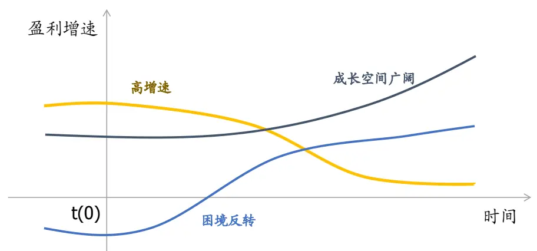
资料来源：国盛证券研究所

## 三、基于信息透明度和成长性的分域

基于以上因子构建，我们可以将市场上所有有分析师覆盖的股票按“信息透明度”-“久期”属性做四象限的划分。

由于我们在刻画信息透明度和成长性的时候，均用到了分析师的数据，本篇报告所有的选股样本均限定在最近 180 天内有分析师覆盖的股票域中，目前大概在 1700 只左右。无分析师覆盖的样本特征单独列出。如果我们将分析师覆盖的样本按信息透明度和久期进行 2X2分组，每组个股数量走势如下：

图表5：基于信息透明度和久期的双分组股票数量
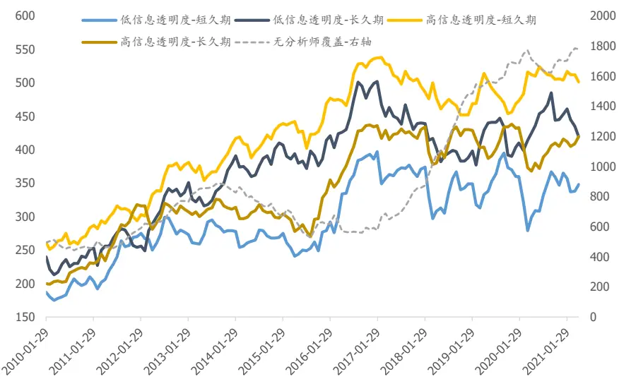
资料来源：Wind，国盛证券研究所

构建相应的流通市值加权组合，其净值走势如下：

图表6：分组流通市值加权组合净值走势
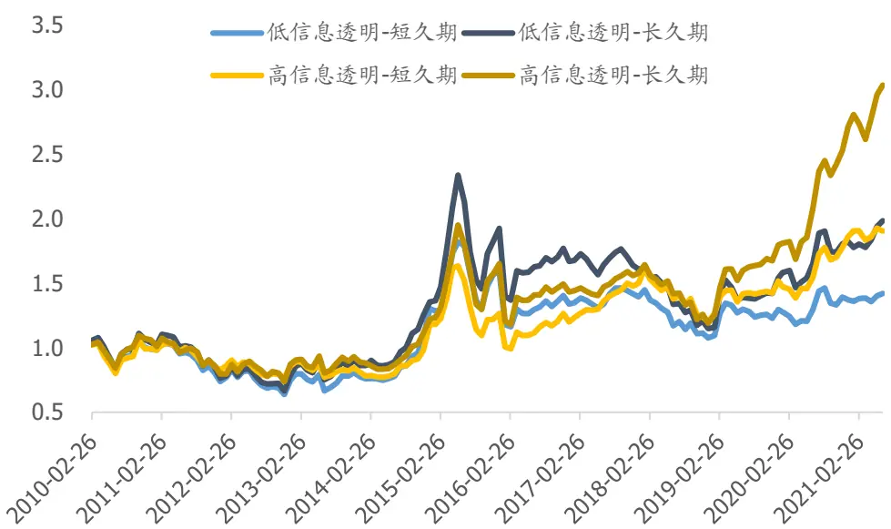
资料来源：Wind，国盛证券研究所

由于市场并没有统一认可的“白马/黑马”、“价值/成长”的标签，为了说明分域的合理性，下文我们统计了四个象限的股票在风格暴露、alpha 因子暴露、业绩增速变化、公告信息反映速度等维度的特征，考察这些特征是否符合我们的认知。我们先给出一个总体的画像：

图表7：信息透明度与久期分域股票特征总结
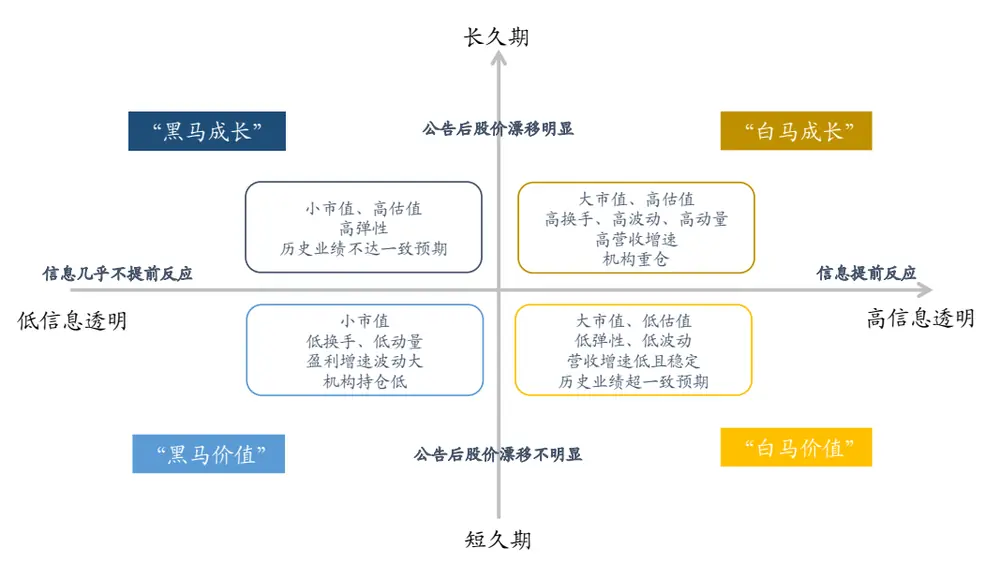
资料来源：国盛证券研究所整理

## 3.1 分域特征一：风格特征

我们将分析师覆盖样本池分别按信息透明度高低和久期长短按 4X4进行分组，考察每组在风格因子上的平均暴露值：

## 规模因子分布：

- 信息透明度与 size呈正相关：信息透明度越高的公司，当前市值越大；

- 久期与 size呈负相关：远期现金流越高的公司，当前市值越小。

## 量价因子分布：

- 高信息透明度-长久期的股票，呈现高动量、高波动和高换手特征；

- 高信息透明度-短久期的股票，呈现低 BETA、低波动和低换手特征；

低信息透明度-长久期的股票，在 BETA 因子上暴露最高，同时在波动率和流动性上暴露也较高；

- 低信息透明度-短久期的股票，呈现低动量和高BETA特征。

## 价值因子分布：

- 久期与估值类因子呈负相关：远期现金流越高的公司，当前估值越高；

从 value 因子暴露来看：长久期分组中，信息透明度越高的公司，当前市净率越高，即以净资产衡量越贵；在久期最短的分组中，信息透明度与 value的单调性不明显；

以 earningsyield因子暴露来看：短久期分组中，信息透明度越高的公司，市盈率相关指标越低，即以净利润衡量越便宜；长久期分组中，信息透明度与 earnings yield相关性减弱。

## 成长因子分布：

- 信息透明度较高的分组中，久期与成长因子呈正相关；

- 信息透明度较低的分组中，久期与成长因子相关性减弱；

## 杠杆因子分布：

- 低信息透明度-长久期的公司，在杠杆因子上暴露偏高；

- 高信息透明度-长久期的公司，在杠杆因子上暴露偏低。

图表8:信息透明度与久期分组在风格因子上的平均暴露值

| -1.69 |  |  |  |  |  |  | 0.32 |  |  |  |  |  |  |
| --- | --- | --- | --- | --- | --- | --- | --- | --- | --- | --- | --- | --- | --- |
|  | -1.08 | -0.79 | -0.55 | 0.02 |  |  |  | 0.87 | 0.86 | 0.83 | 0.60 |  |  |
|  | -1.17 | -0.90 | -0.74 | -0.31 |  |  |  | 0.89 | 0.92 | 0.88 | 0.79 |  |  |
|  | -1.21 | -1.00 | -0.88 | -0.52 |  |  |  | 0.85 | 0.89 | 0.93 | 0.90 |  |  |
|  | -1.29 | -1.07 | -0.93 | -0.68 |  |  |  | 0.82 | 0.89 | 0.94 | 0.95 |  |  |
|  | beta |  |  |  |  |  | momentum |  |  |  |  |  |  |
| 0.60 |  |  |  |  |  |  | -0.37 |  |  |  |  |  |  |
|  | 0.62 | 0.61 | 0.52 | 0.30 |  |  |  |  | -0.22 | -0.23 | -0.23 |  |  |
|  | 0.64 | 0.62 | 0.57 | 0.36 |  |  |  |  | -0.15 | -0.13 | -0.13 | 0.02 |  |
|  | 0.66 | 0.66 | 0.61 | 0.46 |  |  |  |  | -0.13 | -0.08 | -0.01 | 0.18 |  |
|  | 0.67 | 0.66 | 0.63 | 0.54 |  |  |  |  | -0.13 | -0.04 | 0.07 | 0.27 |  |
|  | vo | latility |  |  |  |  |  |  | liquidity |  |  |  |  |
| 0.33 |  |  |  |  |  |  | 0.63 |  |  |  |  |  |  |
|  | 0.24 | 0.11 | 0.05 | -0.03 |  |  |  |  |  | 0.70 | 0.64 | 0.57 | 0.40 |
|  | 0.29 | 0.20 | 0.17 | 0.19 | 0.72 | 0.72 |  |  |  | 0.68 | 0.59 |  |  |
|  | 0.38 | 0.36 | 0.33 | 0.42 | 0.76 | 0.82 |  |  |  | 0.77 | 0.78 |  |  |
|  | 0.51 | 0.52 | 0.58 | 0.68 | 0.76 | 0.83 |  |  |  | 0.86 | 0.99 |  |  |
|  | value |  |  |  |  |  |  | earnings yield |  |  |  |  |  |
| -0.22 |  |  |  |  |  |  | -0.59 |  |  |  |  |  |  |
|  | 0.07 | 0.16 | 0.13 | 0.09 |  |  |  |  | -0.41 | 0.02 | 0.20 |  |  |
|  | -0.01 | 0.03 | -0.08 | -0.32 |  |  |  |  | -0.34 | -0.10 | -0.04 | 0.01 |  |
|  | -0.11 | -0.15 | -0.30 | -0.58 |  |  |  |  | -0.57 | -0.39 | -0.34 | -0.38 |  |
|  | -0.18 | -0.25 | -0.44 | -0.77 |  |  |  |  | -0.92 | -0.75 | -0.66 | -0.76 |  |
|  | growth |  |  |  |  |  |  |  | leverage |  |  |  |  |
| -0.46 |  |  |  |  |  |  | -0.27 |  |  |  |  |  |  |
|  | 0.01 | 0.06 | 0.02 | 0.05 |  |  |  |  |  | -0.01 | -0.12 | -0.23 | -0.30 |
|  | 0.22 | 0.24 | 0.23 | 0.26 | -0.12 | -0.14 |  |  |  | -0.28 | -0.46 |  |  |
|  | 0.26 | 0.32 | 0.37 | 0.46 | -0.07 | -0.14 |  |  |  | -0.31 | -0.51 |  |  |
|  | -0.06 | 0.21 | 0.37 | 0.55 | 0.10 | -0.08 |  |  |  | -0.25 | -0.45 |  |  |

资料来源：Wind，国盛证券研究所

## 3.2 分域特征二：alpha 因子特征

我们从因子库中选取了一些其他因子，并统计其分组暴露。

增速和增速稳定性：

np_q_yoy：单季度净利润同比；np_q_yoy_std：单季度净利润同比波动率；

sales_q_yoy：单季度营业收入同比；sales_q_yoy_std：单季度营业收入同比波动率；

对比分布规律，我们发现：

低信息透明度的公司，除了久期最长的区间，其他区间的当前盈利增速总体高于高信息透明度的公司；此类公司财报已经呈现出高增长，但增速波动较大，可持续性存疑；

- 高信息透明度-长久期的公司，呈现出营收高增长，盈利增速较稳定的特征；

- 高信息透明度-短久期的公司，营收、盈利增速均较低，且增速较为稳定；

股价盈利相关性（ann_correlation）：年度个股盈利水平（Earnings/Capt0）与涨跌幅相关性；

该因子旨在考察个股股价走势与基本面的相关性。从分布规律来看，信息透明度高的公司，股价涨跌幅与盈利的相关性更高；

超分析师预期（consensus_surplus）：最近一期，个股真实净利润超分析师预测幅度；

- 高信息透明度-短久期的公司，分析师容易低估公司业绩；

- 低信息透明度-长久期的公司，分析师容易高估公司业绩；

## 机构持仓：

top_ten_io_to_float_a_share：前十大机构持仓占流通股比例；

delta_top_ten_io：前十大机构持仓变化值占流通股比例；

从机构资金来看，持仓集中于信息透明度高且久期长的股票池中，并且新流入的资金也集中于这一批股票。

图表9：信息透明度与久期分组在其他因子上的平均暴露值

|  |  |  |  |  | 0.475 |  |  |  |  |
| --- | --- | --- | --- | --- | --- | --- | --- | --- | --- |
|  | 0.121 | 0.051 | -0.035 | -0.055 |  | 1.057 | 0.216 | -0.300 | -0.589 |
|  | 0.256 | 0.141 | 0.026 | -0.002 |  | 1.034 | 0.318 | -0.229 | -0.608 |
|  | 0.197 | 0.171 | 0.076 | 0.020 |  | 0.998 | 0.314 | -0.226 | -0.600 |
|  | 0.001 | 0.043 | 0.005 | 0.011 |  | 1.075 | 0.318 | -0.173 | -0.535 |
|  | sales_q_yoy |  |  |  |  | sales_q_yoy_std |  |  |  |
| -0.190 |  |  |  |  | 0.273 |  |  |  |  |
|  | -0.025 | -0.043 | -0.090 | -0.073 |  | 0.507 | 0.203 | -0.061 | -0.302 |
|  | 0.104 | 0.077 | 0.045 | 0.100 |  | 0.561 | 0.326 | 0.063 | -0.274 |
|  | 0.099 | 0.157 | 0.174 | 0.267 |  | 0.536 | 0.356 | 0.151 | -0.124 |
|  | 0.029 | 0.110 | 0.187 | 0.385 |  | 0.520 | 0.411 | 0.258 | 0.056 |
|  | ann_correlation |  |  |  |  | consensus_surplus |  |  |  |
| 0.356 |  |  |  |  | -0.546 |  |  |  |  |
|  | 0.394 | 0.487 | 0.555 | 0.619 |  | -0.227 | -0.018 | 0.124 | 0.243 |
|  | 0.396 | 0.495 | 0.558 | 0.612 |  | -0.213 | -0.039 | 0.119 | 0.237 |
|  | 0.408 | 0.477 | 0.533 | 0.599 |  | -0.341 | -0.148 | 0.035 | 0.167 |
|  | 0.358 | 0.441 | 0.493 | 0.555 |  | -0.668 | -0.427 | -0.158 | 0.040 |
|  | top_ten_io_to_float_a_share |  |  |  |  | delta_top_ten_io |  |  |  |
| 0.002 |  |  |  |  | 0.000 |  |  |  |  |
|  | 0.008 | 0.012 | 0.017 | 0.026 |  | 0.000 | 0.000 | 0.000 | -0.001 |
|  | 0.011 | 0.017 | 0.025 | 0.043 |  | 0.000 | 0.002 | 0.002 | 0.001 |
|  | 0.012 | 0.023 | 0.031 | 0.052 |  | 0.001 | 0.003 | 0.003 | 0.006 |
|  | 0.011 | 0.021 | 0.032 | 0.054 |  | 0.001 | 0.002 | 0.005 | 0.009 |

资料来源：Wind，国盛证券研究所

## 3.3 分域特征三：未来业绩增长变化

我们继续回溯统计四象限中的公司，从上一年 t(-1)到未来两年 t(2)，每组真实净利润增速的迁移比例。看未来两年的业绩增速分布，我们发现：

- 低信息透明度-长久期的公司多分布于增速区间的两端；

- 低信息透明度-短久期的公司在不同区间内的分布相对均匀；

- 高信息透明度-长久期的公司多分布于增速区间的中游和中上游；

- 高信息透明度-短久期的公司多分布于增速区间的中游和中下游；

总体来说，“黑马成长”和无分析师覆盖的样本在未来更容易出现高增长公司。

图表10：信息透明度与久期分组净利润增速迁移比例

| 无覆盖 | g0 | g1 | g6 g7 g8 g9 |  |  |  |  |  |  |  |  |  |
| --- | --- | --- | --- | --- | --- | --- | --- | --- | --- | --- | --- | --- |
|  | 19% | 13% | 11% | 9% | 8% | 7% | 6% | 7% | 10% | 12% |  |  |
| 低信息透明-短久期t(-1)低信息透明-长久期 | 8% | 10% | 10% | 9% | 9% | 9% | 9% | 10% | 10% | 17% |  |  |
|  | 14% | 13% | 9% | 7% | 6% | 6% | 7% | 9% | 12% | 17% |  |  |
| 高信息透明-短久期 | 1% | 5% | 10% | 14% | 16% | 17% | 15% | 12% | 7% | 3% |  |  |
| 高信息透明-长久期 | 3% | 7% | 9% | 11% | 12% | 12% | 15% | 15% | 11% | 5% |  |  |
| 无覆盖 |  |  |  |  |  |  |  |  |  |  |  |  |
|  | 17% | 12% | 10% | 9% | 8% | 7% | 6% | 7% | 10% | 13% |  |  |
| 低信息透明-短久期t(0) 低信息透明-长久期 | 9% | 11% | 11% | 11% | 10% | 9% | 10% | 9% | 8% | 11% |  |  |
|  | 13% | 10% | 8% | 7% | 7% | 7% | 8% | 10% | 14% | 17% |  |  |
| 高信息透明-短久期 | 3% | 8% | 12% | 14% | 16% | 16% | 14% | 10% | 5% | 3% |  |  |
| 高信息透明-长久期 | 5% | 7% | 9% | 10% | 10% | 11% | 14% | 16% | 12% | 6% |  |  |
|  | 无覆盖 | 15% | 10% | 9% | 8% | 8% | 7% | 7% | 9% | 12% | 15% |  |
|  | 信息透明-短久期 |  | 10% | 12% | 12% | 11% | 11% | 10% | 10% | 9% | 8% | 8% |
| t(1)低信息透明-长久期高信息透明-短久期 | 信息透明-长久期 |  |  | 13% | 10% | 8% | 7% | 7% | 7% | 8% |  |  |
|  | 5% | 9% | 12% | 14% | 16% | 15% | 13% | 9% | 5% | 3% |  |  |
| 高信息透明-长久期无覆盖低信息透明-短久期t(2)低信息透明-长久期高信息透明-短久期高信息透明-长久期 | 7% | 9% | 9% | 10% | 10% | 12% | 13% | 14% | 10% | 6% |  |  |
|  | 14% | 10% | 8% | 8% | 8% | 7% | 8% | 9% | 12% | 14% |  |  |
|  | 10% | 11% | 11% | 11% | 11% | 9% | 9% | 10% | 8% | 10% |  |  |
|  | 13% | 11% | 9% | 8% | 7% | 8% | 8% | 11% | 12% | 13% |  |  |
|  | 5% | 9% | 12% | 13% | 15% | 14% | 12% | 9% | 5% | 5% |  |  |
|  | 8% | 9% | 10% | 11% | 11% | 11% | 13% | 12% | 9% | 7% |  |  |

资料来源：Wind，国盛证券研究所

## 3.4 分域特征四：盈余公告前后超额收益和股东特征

由于大部分基本面因子旨在获取股票在公司基本面信息公告后，市场反应不足带来的收益。为了对比不同样本的股票在信息反应上的速度，我们统计了不同分域下的股票，在业绩高增长事件公告前后的特质收益走势。

我们定义的高增长事件为：公司业绩快报和财报公告事件，季度净利润同比进入同一报告期前 20%（行业中性），并剔除了快报与季报间隔时间较短的样本。

在公告日前后 60个交易日内，高增长事件股票特质收益（剥离市场、风格和行业收益）如下：

图表11：单季度净利润同比前20%组公告日前后平均特质收益
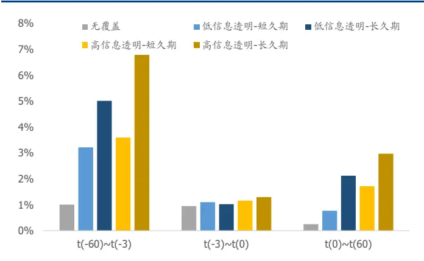
资料来源：Wind，国盛证券研究所

图表12：单季度净利润同比前20%组公告日前后特质收益走势
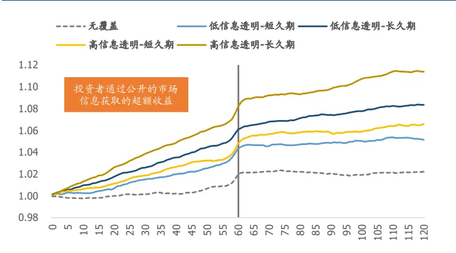
资料来源：Wind，国盛证券研究所

## 信息越公开透明，公告前反应的收益越高：

除去公告前 3个交易日内特质收益出现跃升（极有可能是一部分投资者提前获知了财报信息），所有有分析师覆盖的样本在公告前 60~3天的时间窗口内，已经开始有稳定的超额收益。同时，高信息透明度的样本在公告前的超额收益高于低信息透明度的样本。而没有分析师覆盖的样本，在公告前几乎没有超额收益。

## 久期越长，股票越受个人投资者的追捧：

限于精确数据不可得，我们暂且以股东户数的变化来反应个人投资者占比的变化。我们发现，高增速事件的公司在公告日后一个季度的股东户数相比与前一个季度均有上升，并且，长久期组的上升幅度远超过短久期组。从侧面反应长久期的高增长股票更受个人投资者的青睐。

图表13：单季度净利润同比前20%组公告前后股东户数环比时序图
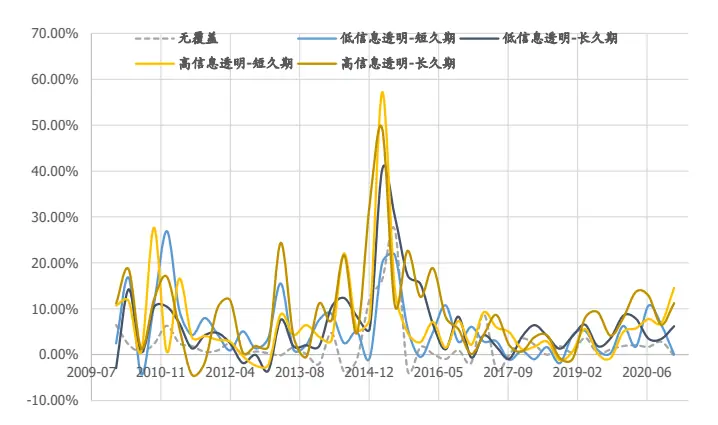
资料来源：Wind，国盛证券研究所

图表14:单季度净利润同比前20%组公告前后股东户数环比
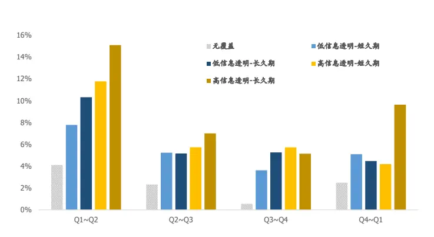
资料来源：Wind，国盛证券研究所

如果仅从这两个影响因素分析公告事件，双因素合力结果显示，“高信息透明度-长久期”样本的公告前超额收益最高，其次为“低信息透明度-长久期”样本，第三为“高信息透明度-短久期”样本；长久期样本在公告后的超额收益比短久期样本更高一些。

对四类股票公告前后收益特征的一种合理解释为，在公司信息从机构向个人投资者扩散的过程中，机构能通过丰富的研究资源和较强的研究能力，较为领先地预判公司的基本面信息，并能更早地建仓高信息透明度-长久期的股票，体现为“白马成长”的公告前就已有较高的超额收益；而个人投资者获取公司信息的能力相对较弱，建仓相对机构较晚，在公告之后继续买入且偏好买入长久期标的，在一定程度上支撑了“白马成长”和“黑马成长”公告后的股价漂移。

对我们多因子而言，大部分财报因子是在获取公告后市场反应不足的收益，而一致预期、机构重仓类因子则能提供市场更领先的信息，帮助我们获取公告前的超额收益。因此在未来，如何获取更领先、更高质量、覆盖域更广的预测数据，应当是基本面因子选股研究中的重要课题。

## 3.5 久期溢价与确定性溢价

通过对比长久期组合相对短久期组合的超额收益，我们发现：长周期来看，A 股市场过去两轮明显的久期溢价与金融条件指数走势相吻合。（宏观指数编制请读者参考国盛金工团队发布的报告《宏观经济量化系列之一：中国经济领先指数》。）

当金融条件越宽松，久期溢价越明显。对企业而言，宽松的金融条件有利于企业融资扩张，更利于投资长久期的项目，从而这类公司的股票相比于短久期的公司更具有吸引力；对投资者而言，当市场流动性偏宽松的时候，投资者更愿意持有长久期的资产。

图表15：久期溢价与金融条件指数
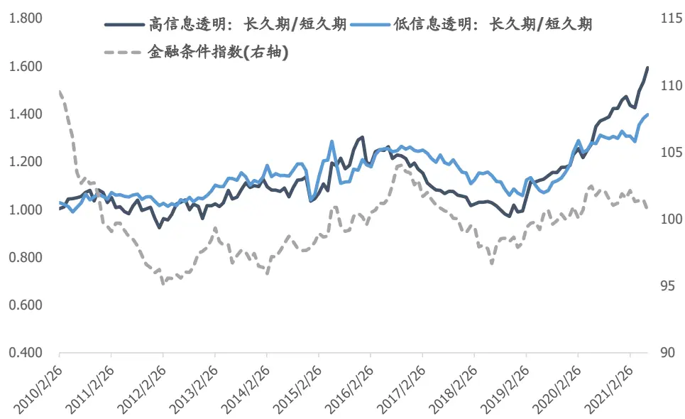
资料来源：Wind，国盛证券研究所

同时，对比高信息透明度组合相对于低信息透明度组合的超额收益，我们观察到 2015年以来 A股市场的确定性溢价与市场对宏观经济的预期也有一定的负相关关系。当经济领先指数上行，市场对经济预期较为乐观时，确定性溢价回落；而当领先指数下行，市场预期较为悲观时，确定性溢价上升。

图表16：确定性溢价与经济领先指数
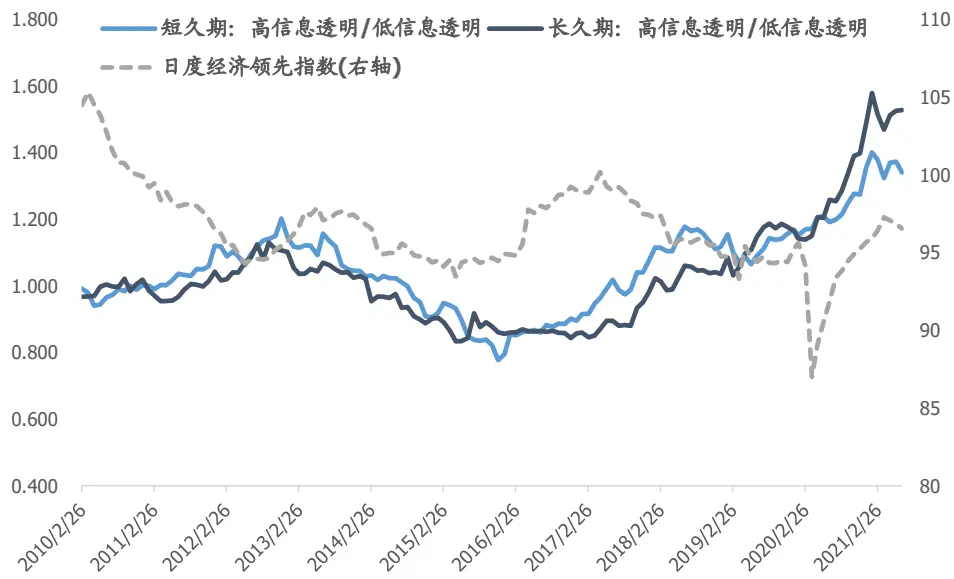
资料来源：Wind，国盛证券研究所

## 3.6 “核心资产”的属性变化

从上节内容我们发现从2019年至 2021年初，市场同时呈现出明显的久期溢价和确定性溢价。那么我们是否可以从这两个溢价角度来解释过去两年核心资产的强势表现呢？

我们统计了茅指数成分股中被划分到不同域的股票数量占比，如下所示。

图表17：茅指数成分比重变化
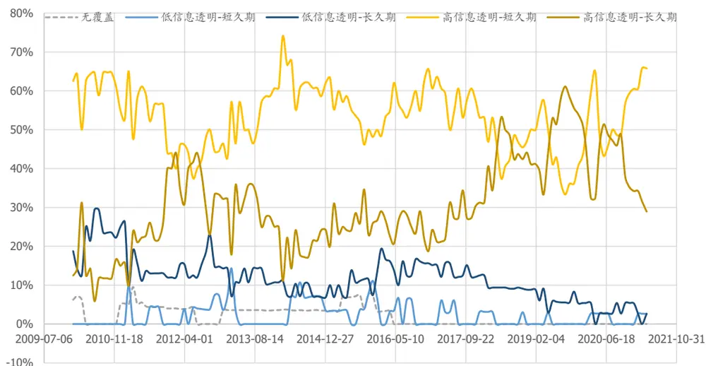
资料来源：Wind，国盛证券研究所

## 从信息透明度来看，大部分成分股被划分至“白马”范畴，能享受确定性溢价；

从久期来看，我们注意到2017年之前大部分茅指数成分股都被划分在高信息透明度-短久期分组，而 2017年开始，被划分到高信息透明度-长久期组合的成分股比重开始逐步上升，这意味着分析师对于茅指数成分股的远期业绩给出了更加乐观的预测，也意味着更多的成分股能享受久期溢价。

因此，在过去两年明显的确定性溢价和久期溢价的支撑下，核心资产的股价表现非常强势。

但是我们必须要指出一点，本篇报告在刻画公司的现金流时，做了过多的简化，尤其是对公司三年之后的现金流没有详细地量化，因此我们可能更严重地低估了这一批“核心资产”的久期。如何更加科学合理地量化股票久期也是我们未来研究的课题之一。

## 四、因子分域表现

通过上述分析，我们已经将市场上的股票划分成较为独立的四个象限。我们对比了不同象限里因子的选股能力，我们发现在信息透明度维度下，估值类因子、超预期类因子、量价因子和机构持仓因子的选股能力有较为明显的差别。我们将其中的一些规律总结如下。

## 4.1 估值类因子

估值类因子的 alpha 属性与市场的定价效率息息相关。我们之前在分析估值类因子的时候也提到，在定价效率较低的市场上，低估值股票更容易被过度低估，未来有估值修复的空间，因此在低效市场上估值因子能提供更多的alpha收益。

在本篇报告的定义下，高信息透明度分域是一个定价效率较高的市场，而低信息透明度分域是一个定价效率较低的市场，因此我们有理由相信，估值类因子在低信息透明的样本中有更强的选股效果。

我们选取了因子库中几类有代表性的估值因子，并考察在不同分域下，因子 ICIR和分组收益（市值行业中性，流通市值加权，相对中证 800超额）。因子定义如下：

图表18:估值类因子定义

| 因子 | 定义 |
| --- | --- |
| bp | 股东权益(报告期)/总市值 |
| dp_historical | 过去四个季度已实施现金分红总额/当前市值 |
| ep_fy1 | 市盈率倒数fy1 |
| ep_q_adv | 单季度市盈率倒数（考虑快报、预告） |
| sales_to_ev | 营业收入/EV |
| cf_to_ev | 经营性净现金流/EV |

资料来源：国盛证券研究所整理

从 ICIR来看，估值类因子在无分析师覆盖的样本内预测能力最强，在有分析师覆盖的样本中，低信息透明度分域内的预测能力要显著强于高信息透明度分域。

图表19:估值类因子分域因子月度ICIR
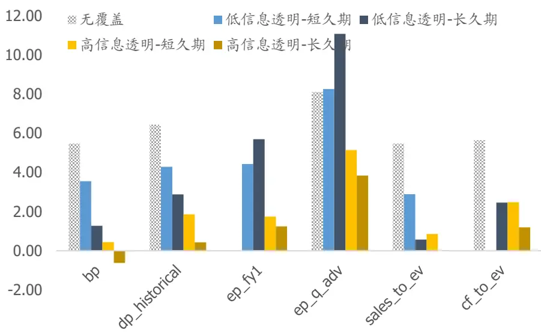
资料来源：Wind，国盛证券研究所

从分组超额收益来看，除了 ep_q_adv 因子，其他估值类因子在低信息透明度的分域里，分组收益的单调性更加明显。

图表20：估值类因子分域分五组年化超额收益（相对中证800，流通市值加权）
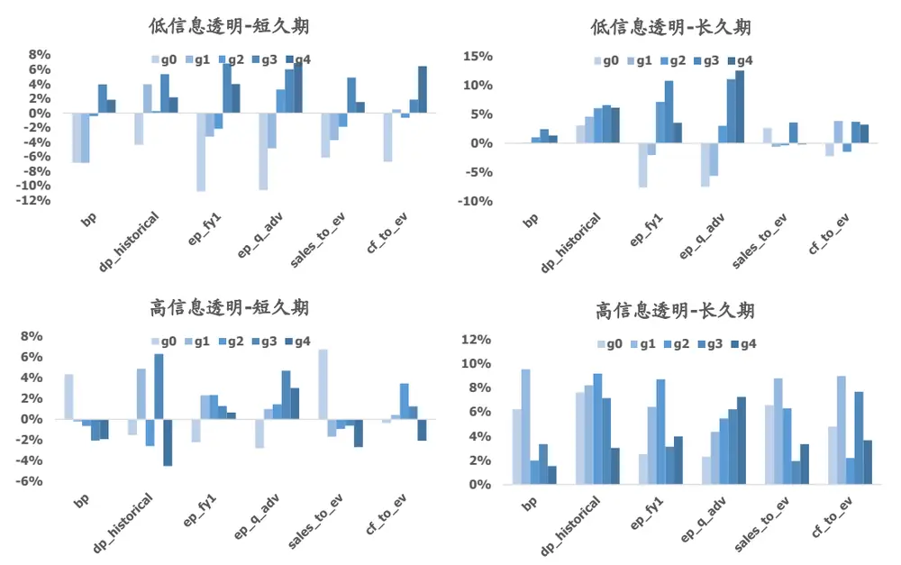
资料来源：Wind，国盛证券研究所

## 4.2 超预期类因子

常见的超预期定义有两类：根据市场对公告的反应来衡量信息的超预期程度，如 ear 和jor因子；根据财报信息来衡量业绩的超预期程度，如sue和 sur。

图表21：超预期因子定义

| 因子 | 定义 |
| --- | --- |
| Ear | 报告日前后特质收益 |
| Jor | 报告日第二天跳空幅度 |
| Sue | 净利润同比 delta-过去八个季度的净利润同比 delta 均值)/过去八个季度的净利润同比 delta 标准差 |
| Sur | 营业收入同比 delta-过去八个季度的营业收入同比 delta 均值)/过去八个季度的营业收入同比 delta 标准差 |

资料来源：国盛证券研究所整理

我们注意到，两类因子在不同的分域中表现有所区别，ear 因子在高信息透明度-长久期和高信息透明度-短久期分域内的 ICIR 值明显高于低信息透明度分域；sue 因子在高信息透明度-长久期分域内的ICIR值相对较低。

图表22:超预期类因子分域因子月度ICIR
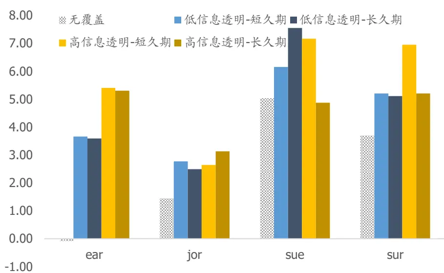
资料来源：Wind，国盛证券研究所

从分组的年化超额收益来看，ear 因子在高信息透明度分域的多头组合超额收益有明显优势；而 sue因子在低信息透明度分域的多头超额收益更高。

图表23：超预期类因子分域分五组年化超额收益（相对中证800，流通市值加权）
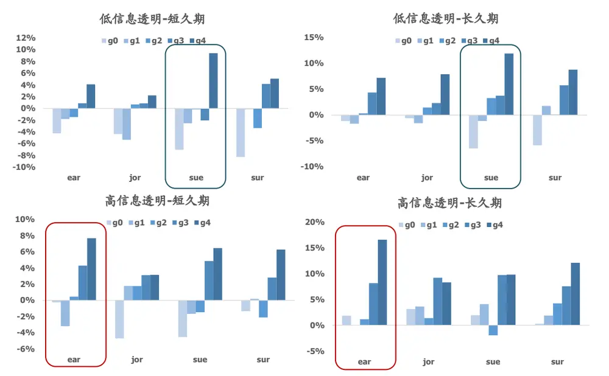
资料来源：Wind，国盛证券研究所

## 4.3 量价类因子

我们考察了常见的几类量价因子的分域表现，包括非流动性(illiq)、特质波动(ivol、ivr)、情绪因子(成交量波动等)、残差动量等：

图表24:量价类因子定义

| 因子 | 定义 |
| --- | --- |
| illiq | 每天一个亿成交量能推动的股价涨幅；正向 |
| ivol | 残差收益波动率；负向 |
| ivr | F-F三因子对个股收益率的解释程度；正向 |
| In_volume_std_1m | 过去一个月In(成交量)波动率；负向 |
| In_volume_std_3m | 过去三个月In(成交量)波动率；负向 |
| specific_mom1 | 一个月残差动量；负向 |
| specific_mom12 | 十二个月残差动量；正向 |

资料来源：国盛证券研究所整理

分域对比来看，illiq、ivol、ivr、成交量波动率以及一个月动量因子在低信息透明度的分组中对股价的预测能力越强；并且多基于反转的逻辑，即前期流动性越弱，残差波动率越低，成交量波动越小，过去一个月超额收益越低，股票未来一个月的收益越高；

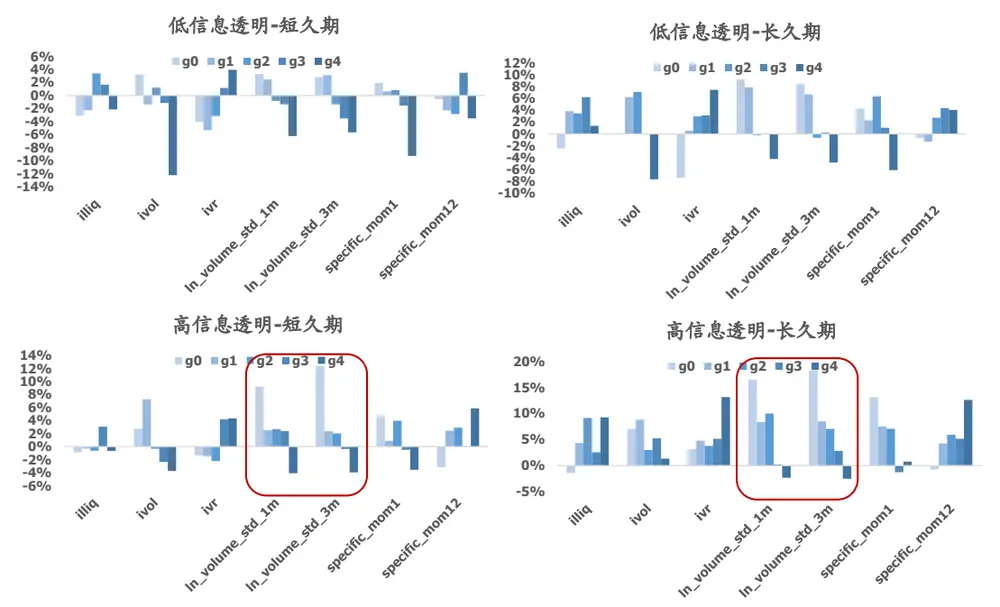
图表26：量价类因子分域分五组年化超额收益（相对中证800，流通市值加权）
资料来源：Wind，国盛证券研究所

图表25：量价类因子分域因子月度ICIR
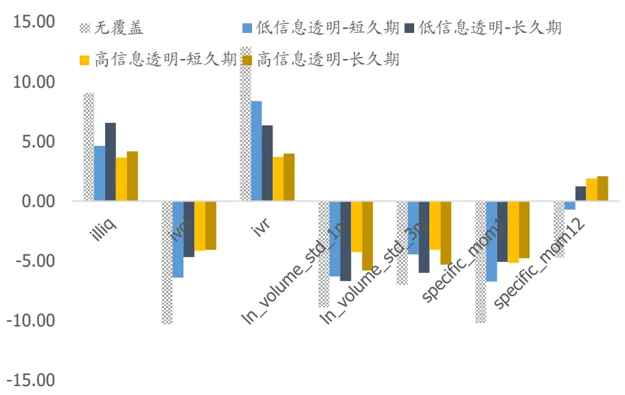
资料来源：Wind，国盛证券研究所

从分组收益分布来看，我们发现另一个有意思的现象是，情绪类指标在高效市场内的多头收益相当可观。我们认为，在高效市场，尤其是估值类因子失效的情形下，情绪类指标能在一定程度上起到估值的作用，即用成交量、换手率等情绪指标来衡量股票当前的买入性价比。

## 4.4 机构持仓类因子

我们也梳理了机构重仓因子的分域表现。因子定义如下：

图表27：机构持仓类因子定义

| 因子 | 定义 |
| --- | --- |
| delta_io_to_float_share | 根据基金年报和半年报披露持股数统计，基金总持股数环比变动/期初流通股数 |
| io_to_float_a_share | 根据基金年报和半年报披露持股数统计，基金总持股数占个股流通股比值 |
| top_ten_io_to_float_a_share | 根据基金披露前十大重仓股，重仓股数占个股流通股比值 |

资料来源：国盛证券研究所整理

从因子 ICIR 来看，机构重仓占比因子在低信息透明度样本内 ICIR 值较高；机构持仓环比变动因子在高信息透明度内与股票未来收益相关性最高。

图表28:机构持仓类因子分域因子月度ICIR
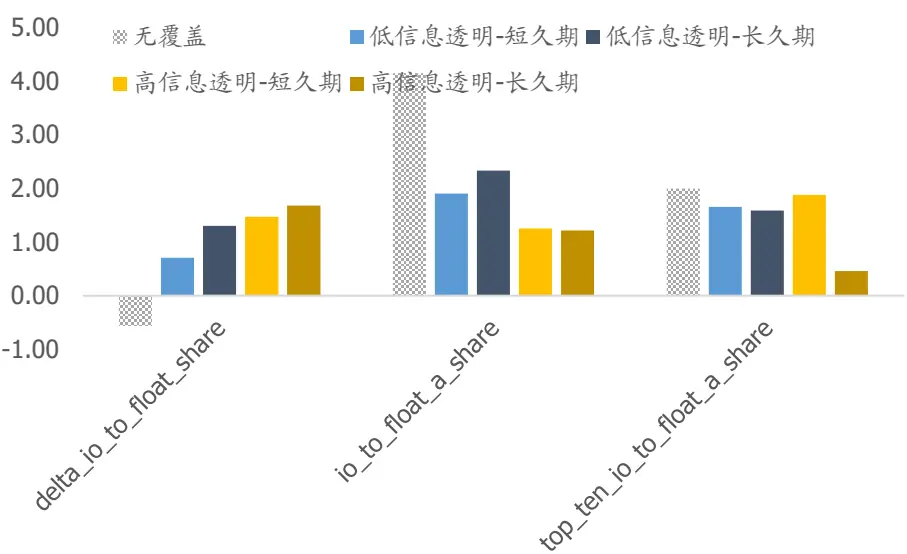
资料来源：Wind，国盛证券研究所

从分五组超额收益来看，在低信息透明度-长久期样本内，直接根据机构持仓占比做跟随策略即能有较高的超额收益；而在高信息透明度-长久期样本内，根据机构持仓占比变动做跟随策略，才能获取更高的超额收益。

图表29：机构持仓类因子分域分五组年化超额收益（相对中证800，流通市值加权）
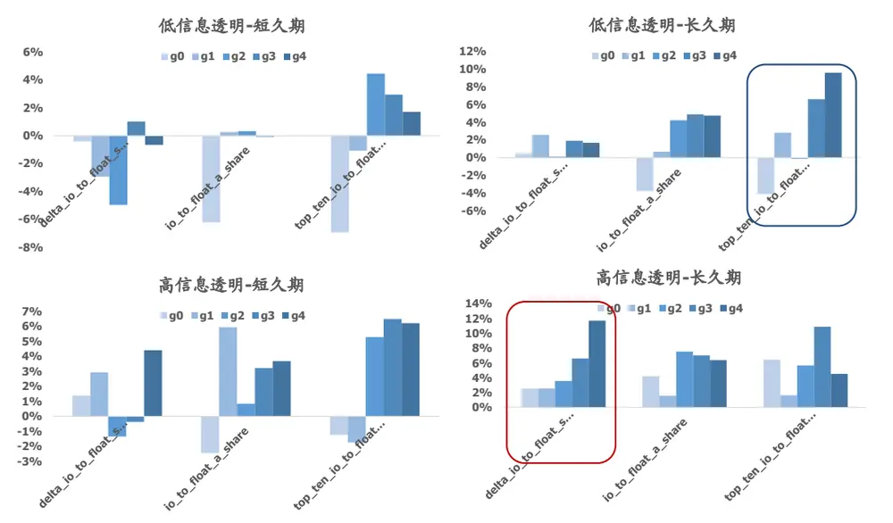
资料来源：Wind，国盛证券研究所

质量和成长类因子区分规律不明显，不再多做展示。

## 五、不同分域内的成长策略

本节我们针对“黑马成长”和“白马成长”样本，分别选取合适的因子构建选股策略。

## 5.1 低效市场里的 PB-ROE 策略

在“黑马成长”这样一个定价效率偏低的市场内，投资者获取错误定价带来的 alpha 相对较多，估值类因子的选股效果相对较好，我们在这部分样本池中运用经典的 PB-ROE选股策略就能获得不错的收益。

我们在低信息透明度-长久期样本中，根据 bp 和 roe 因子进行双向分组测试，发现横纵向均呈现出单调性：

图表 30:bp 与 roe 因子分组年化超额收益

| roe_q_adv |  |  |  |  |
| --- | --- | --- | --- | --- |
| bp | go | g1 | g2 | g3 |
|  | g0 | -6.3% | -8.0% | 0.4% 10.8% |
|  | g1 | -4.3% | -4.6% 4.2% | 16.6% |
|  | g2 | -5.6% 3.8% | 13.8% | 17.3% |

资料来源：Wind，国盛证券研究所

头部组合净值表现：月频调仓，在低信息透明-长久期样本中，分别根据 bp 和 roe 因子分组，按流通市值为权重持有头部组合。

图表31：pb-roe策略相对净值（相对中证800，流通市值加权）
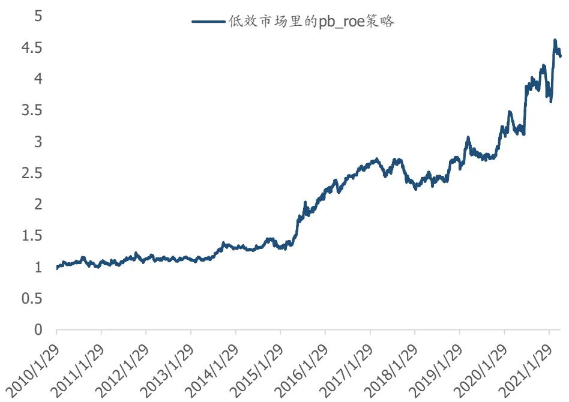
资料来源：Wind，国盛证券研究所

## 策略分年度绩效表现如下：

图表32:策略分年度绩效

| year | 总收益 | 年化绝对收益 | 年化波动率 | SR | 最大回撤 | 年化超额收益 | IR |
| --- | --- | --- | --- | --- | --- | --- | --- |
| 2010 | 1.75% | 1.99% | 30.76% | 0.06 | 26.04% | 0.91% | 0.06 |
| 2011 | -20.94% | -21.54% | 28.65% | -0.75 | 33.89% | 9.83% | 0.62 |
| 2012 | 10.24% | 10.64% | 26.00% | 0.41 | 26.40% | 4.81% | 0.40 |
| 2013 | 13.17% | 13.99% | 24.56% | 0.57 | 18.71% | 16.44% | 1.28 |
| 2014 | 49.54% | 51.27% | 21.19% | 2.42 | 14.27% | 0.68% | 0.05 |
| 2015 | 84.59% | 88.34% | 48.26% | 1.83 | 36.92% | 65.89% | 3.12 |
| 2016 | 7.06% | 7.30% | 33.26% | 0.22 | 20.11% | 26.40% | 1.90 |
| 2017 | 3.50% | 3.62% | 14.97% | 0.24 | 13.98% | -10.46% | -0.95 |
| 2018 | -16.26% | -16.81% | 24.73% | -0.68 | 28.90% | 15.78% | 1.18 |
| 2019 | 54.35% | 56.56% | 26.92% | 2.10 | 23.15% | 16.62% | 1.14 |
| 2020 | 60.66% | 63.51% | 26.87% | 2.36 | 15.77% | 28.55% | 1.82 |
| 2021 | 8.37% | 29.65% | 20.65% | 1.44 | 6.24% | 27.82% | 1.35 |
| Tot | 590.86% | 19.52% | 28.78% | 0.68 | 35.00% | 14.97% | 1.01 |

资料来源：Wind，国盛证券研究所

## 5.2 高效市场里的低估超预期策略

在“白马成长”这样一个定价效率较高的市场内，市场对公司业绩的确定性较高，因此我们更希望买入当前被低估，且能超市场预期的品种。我们考虑用成交量波动（ln_volume_std_3m）来替换估值，并用 ear因子来刻画超预期程度。

我们在高信息透明度-长久期样本中，根据ln_volume_std_3m 和 ear 因子进行双向分组测试，发现横纵向均有一定的单调性：

图表 33: In volume std 3m 与 ear 因子分组年化超额收益

| ear |  |  |  |  |  |
| --- | --- | --- | --- | --- | --- |
|  |  | g0 | g1 | g2 | g3 |
| In_volume_std_3m | g0 | -4.57% | -2.96% | 1.55% | 6.27% |
|  | g1 | -1.06% | 6.03% | 5.89% | 16.09% |
|  | g2 | 11.88% | 4.20% | 15.71% | 21.14% |

资料来源：Wind，国盛证券研究所

头部组合表现：月频调仓，在高信息透明-长久期样本中，分别根据 ln_volume_std_3m和 ear因子分组，按流通市值为权重持有头部组合。

图表34：低估超预期策略相对净值（相对中证800，流通市值加权）
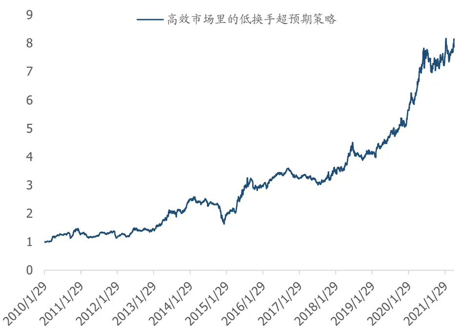
资料来源：Wind，国盛证券研究所

策略分年度绩效表现如下：

图表35:策略分年度绩效

| year | 总收益 | 年化绝对收益 | 年化波动率 | SR | 最大回撤 | 年化超额收益 | IR |
| --- | --- | --- | --- | --- | --- | --- | --- |
| 2010 | 48.11% | 56.18% | 27.01% | 2.08 | 17.54% | 52.17% | 3.00 |
| 2011 | -31.55% | -32.40% | 24.02% | -1.35 | 34.01% | -6.16% | -0.46 |
| 2012 | 7.99% | 8.30% | 24.90% | 0.33 | 17.96% | 1.59% | 0.09 |
| 2013 | 62.91% | 67.66% | 27.11% | 2.50 | 13.10% | 69.98% | 3.32 |
| 2014 | 5.83% | 6.00% | 21.58% | 0.28 | 15.85% | -29.91% | -1.74 |
| 2015 | 105.28% | 110.18% | 34.53% | 3.19 | 31.64% | 74.33% | 3.35 |
| 2016 | -2.68% | -2.77% | 28.16% | -0.10 | 21.64% | 13.07% | 1.14 |
| 2017 | 18.19% | 18.84% | 16.40% | 1.15 | 11.78% | 2.69% | 0.21 |
| 2018 | -10.60% | -10.97% | 26.39% | -0.42 | 26.57% | 24.07% | 1.59 |
| 2019 | 61.25% | 63.80% | 22.36% | 2.85 | 12.96% | 20.76% | 1.48 |
| 2020 | 83.46% | 87.63% | 30.45% | 2.88 | 20.20% | 48.49% | 2.68 |
| 2021 | 9.30% | 33.29% | 29.95% | 1.11 | 19.66% | 35.63% | 2.18 |
| Tot | 1188.39% | 26.59% | 26.31% | 1.01 | 19.66% | 20.57% | 1.23 |

资料来源：Wind，国盛证券研究所

## 六、总结与思考

基于信息透明度的高低和久期的长短，我们将截面上的股票池划分成四个象限。在多因子体系下，我们对截面的股票采用统一的打分体系给出 alpha 信号，但是在主动投资者的投资体系下，针对不同分域内的股票所采取的交易策略是有较大的区别的：

针对高信息透明度-长久期的“白马成长股”，主动投资者往往会淡化择时的操作，希望长期持有来获取业绩增长带来的收益，但这部分标的的估值更容易受到市场风格和情绪的影响。在盈利端，投资者应当警惕公司成长的长逻辑是否发生变化；在估值端，投资者可以适当放宽对估值的要求。

针对低信息透明度-长久期的“黑马成长股”，主动投资者的收益来源于两方面：在盈利层面，投资者需要投入更多的研究成本去获取超越市场的认知，准确把握此类黑马股的业绩爆发拐点；在交易层面，黑马成长股在业绩爆发期往往伴有明显的估值提升，投资者能获取“戴维斯双击”的收益。

对于量化投资者而言，我们从本篇分域研究，对市场上股票的特征分化有了更加清晰的认知，同时我们认为未来还可以尝试做以下工作：

1. 科学合理地量化股票的久期特征，包括准确的长期现金流预测和合适的贴现率选择；

2. 针对不同分域内的股票标的，开发不同的交易策略；

3. 研究如何融合上述策略，或者如何将策略因子化，融入现有的多因子框架；

4. 利用股票的分域特征反映基金经理的投资框架，从而标记基金经理的交易风格等。

## 参考文献

[1] Gao, Chao and Hu, Grace Xing and Zhang, Xiaoyan, Uncertainty Resolution Before Earnings Announcements (May 6, 2020). PBCSF-NIFR Research Paper, Available at SSRN: https://ssrn.com/abstract=3595953 or http://dx.doi.org/10.2139/ssrn.3595953.

[2] Brown, Stephen and Hillegeist, Stephen A., How Disclosure Quality Affects the Level of Information Asymmetry. Review of Accounting Studies, Forthcoming, Available at SSRN: https://ssrn.com/abstract=956256.

[3] Lettau, Martin and Wachter, Jessica A., Why is Long-Horizon Equity Less Risky? A Duration-Based Explanation of the Value Premium (January 2005). Available at SSRN: https://ssrn.com/abstract=661346 or http://dx.doi.org/10.2139/ssrn.661346.

[4] 沧海一土狗. 宏观因子与风格分化——兼论白马抱团的逻辑, 2021.

## 风险提示

量化专题报告的观点全部基于历史统计与量化模型，存在历史规律与量化模型失效的风险。

## 免责声明

国盛证券有限责任公司（以下简称“本公司”）具有中国证监会许可的证券投资咨询业务资格。本报告仅供本公司的客户使用。本公司不会因接收人收到本报告而视其为客户。在任何情况下，本公司不对任何人因使用本报告中的任何内容所引致的任何损失负任何责任。

本报告的信息均来源于本公司认为可信的公开资料，但本公司及其研究人员对该等信息的准确性及完整性不作任何保证。本报告中的资料、意见及预测仅反映本公司于发布本报告当日的判断，可能会随时调整。在不同时期，本公司可发出与本报告所载资料、意见及推测不一致的报告。本公司不保证本报告所含信息及资料保持在最新状态，对本报告所含信息可在不发出通知的情形下做出修改，投资者应当自行关注相应的更新或修改。

本公司力求报告内容客观、公正，但本报告所载的资料、工具、意见、信息及推测只提供给客户作参考之用，不构成任何投资、法律、会计或税务的最终操作建议,本公司不就报告中的内容对最终操作建议做出任何担保。本报告中所指的投资及服务可能不适合个别客户，不构成客户私人咨询建议。投资者应当充分考虑自身特定状况，并完整理解和使用本报告内容，不应视本报告为做出投资决策的唯一因素。

投资者应注意，在法律许可的情况下，本公司及其本公司的关联机构可能会持有本报告中涉及的公司所发行的证券并进行交易，也可能为这些公司正在提供或争取提供投资银行、财务顾问和金融产品等各种金融服务。

本报告版权归“国盛证券有限责任公司”所有。未经事先本公司书面授权，任何机构或个人不得对本报告进行任何形式的发布、复制。任何机构或个人如引用、刊发本报告，需注明出处为“国盛证券研究所”，且不得对本报告进行有悖原意的删节或修改。

## 分析师声明

本报告署名分析师在此声明：我们具有中国证券业协会授予的证券投资咨询执业资格或相当的专业胜任能力，本报告所表述的任何观点均精准地反映了我们对标的证券和发行人的个人看法，结论不受任何第三方的授意或影响。我们所得报酬的任何部分无论是在过去、现在及将来均不会与本报告中的具体投资建议或观点有直接或间接联系。

投资评级说明

| 投资建议的评级标准 |  | 评级 | 说明 |
| --- | --- | --- | --- |
| 评级标准为报告发布日后的6个月内公司股价（或行业指数）相对同期基准指数的相对市场表现。其中A股市场以沪深300指数为基准；新三板市场以三板成指（针对协议转让标的）或三板做市指数（针对做市转让标的）为基准；香港市场以摩根士丹利中国指数为基准，美股市场以标普500指数或纳斯达克综合指数为基准。 | 股票评级 | 买入 | 相对同期基准指数涨幅在15%以上 |
|  |  | 增持 | 相对同期基准指数涨幅在 5%~15%之间 |
|  |  | 持有 | 相对同期基准指数涨幅在-5%~+5%之间 |
|  |  | 减持 | 相对同期基准指数跌幅在5%以上 |
|  | 行业评级 | 增持 | 相对同期基准指数涨幅在10%以上 |
|  |  | 中性 | 相对同期基准指数涨幅在-10%~+10%之间 |
|  |  | 减持 | 相对同期基准指数跌幅在10%以上 |

## 国盛证券研究所

北京

地址：北京市西城区平安里西大街 26号楼 3层

上海

地址：上海市浦明路 868 号保利 One56 1 号楼 10 层

邮编：100032

邮编：200120

传真：010-57671718

邮箱：gsresearch@gszq.com

电话：021-38124100

邮箱：gsresearch@gszq.com

南昌

深圳

地址：南昌市红谷滩新区凤凰中大道 1115 号北京银行大厦

地址：深圳市福田区福华三路 100 号鼎和大厦 24楼

邮编：330038

传真：0791-86281485

邮编：518033

邮箱：gsresearch@gszq.com

邮箱：gsresearch@gszq.com