# Alpha 掘金系列之二

金融工程专题报告

证券研究报告

国金证券研究所

联系人：高智威

分析师：苏晨(执业 S1130522010001)

gaozhiw@gjzq.com.cn

suchen@gjzq.com.cn

## 基于高频快照数据的量价背离选股因子

## 量价背离现象与股票收益预测

利用股票的价格与成交量的信息构建的价量因子已经被证明可以预测股票的未来收益。根据逻辑分析和数据实证，我们发现，当量价出现背离时，无论当前股价处在上升还是下降通道，未来上涨的可能性均较高；同理，当量价趋同时，股价未来下跌的可能性较大。本篇报告是 Alpha 掘金系列报告的第二篇，我们将重点关注基于快照数据的股票价格与成交量的相关关系，构建高频量价背离因子，而后通过降频后，构建了满足机构投资者要求的中证 1000 指数增强策略。

## 量价背离因子在日频和周频预测上有效性显著

我们利用高频快照数据构建因子对日内价格与成交量的相关关系进行衡量，捕捉量价趋同/背离特征，共构建了 6 个因子。在日频维度上，CorrPV 因子、CorrRV 因子以及 CorrPM 因子 IC 相对较高，IC 均值在 3%以上。CorrPVPM 因子的多空组合年化收益率达到了 29.97%，夏普比率达到了 3.72。合成之后的因子的 IC 相比单因子有了一定的提升，达到4%以上，多空组合年化收益率为 41.19%，夏普比率为 3.80。中性化后的合成因子表现也大幅好于非中性化的因子，分位数组合 Top 组合的年化超额收益率从 11.82%提升至 15.52%。

为了满足大多数机构投资者的要求，我们进一步扩大因子预测周期，降低因子预测频率到周频。我们采用整体的方法，统计了过去一周单一股票的日内快照成交量与价格的背离，构建量价背离因子。中性化后的合成因子的 IC 均值为6.27%，多空组合的年化收益率达到了 38.88%，夏普比率达到了 4.08。

## 结合量价背离因子的中证1000 指数增强策略

周频量价背离因子具有显著的预测能力，但其对交易成本比较敏感，因此对因子预测的胜率和收益有较高的要求，所以我们选择将该因子与传统因子一起使用构建策略。合成后的量价背离增强因子的IC 达到了 7.66%，风险调整后 IC达到了 1.02，而作为对比的传统合成因子的 IC 仅为 5.91%，风险调整后 IC 为 0.79。

基于量价背离增强因子构建的增强策略相比基准优势非常明显，超额净值稳步增加。增强策略的年化收益率为9.51%，相比基准的年化超额收益率为 11.90%。策略的换手率为周度双边 92.43%，换手率相对较高。策略的信息比率达到了2.27。

我们进一步对比了不同手续费下策略的表现，可以看出，随着手续费的增加，策略收益逐步下降，但即便在严格的千分之三的手续费之下，策略的仍然可以获得 6.73%的年化超额收益率。当手续费可以降低至万分之五时，策略的年化超额收益率的提升至 20.14%，此时的信息比率达到了 3.93。

## 风险提示

1、以上结果通过历史数据统计、建模和测算完成，在政策、市场环境发生变化时模型存在失效的风险。

2、策略依据一定的假设通过历史数据回测得到，当交易成本提高或其他条件改变时，可能导致策略收益下降甚至出现亏损。

## 一、高频量价背离背后的 Alpha

传统多因子模型调仓频率相对较低，所用因子以基本面因子、低频量价因子为主，近些年来这类因子的收益波动也越来越大。而国内的私募等机构越来越重视基于高频量价数据的短线策略，相比传统因子，其收益的稳定性也具有一定的优势。国内的主要机构投资者（例如公募基金等），目前还无法采用这类短线交易策略，而这类高频量价因子在低频化后，仍然可以提供增量信息，并改善传统多因子模型。因此，高频量价因子越来越受到投资者的关注。

利用股票的价格与成交量的信息构建的价量因子已经被证明可以预测股票的未来收益，投资者通常可以通过观察股票价格与成交量的关系捕捉交易机会，传统的技术分析方法应用在高频方面也可以更好的提取有效特征。本篇报告是Alpha 掘金系列报告的第二篇，我们将重点关注基于快照数据的股票价格与成交量的相关关系，构建高频量价背离因子，而后通过降频后，构建了满足机构投资者要求的中证 1000 指数增强策略。

## 1.1 日内量价背离的衡量

股票价格和成交量在日内的变化各不相同，但以下四类情形相对比较典型，同时也反映了日内投资者的博弈的不同情况。当股票价格上涨，而成交量却逐步减少时，说明市场参与各方对股价后续的走势预期较为一致，此时股票还未达到预期价格，未来上涨的可能性较大；而当股票价格上涨，同时成交量放大，此时市场参与方分歧加大，乐观和悲观的投资者的数量都很多，市场情绪趋于“冷静”，股价到达拐点的可能性较大。同理，对于股价下跌的情况，当出现“缩量下跌”时，市场对股票后期的预期一致，进一步下跌的可能性较大；而如果出现“放量下跌”，则说明买卖双方均有较大量的挂单，投资者情绪逐步乐观，股价企稳反弹的可能性较高。

图表1：价升量跌
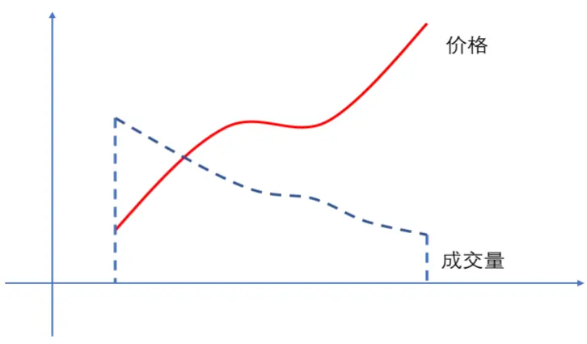
来源：国金证券研究所

图表2：价升量升
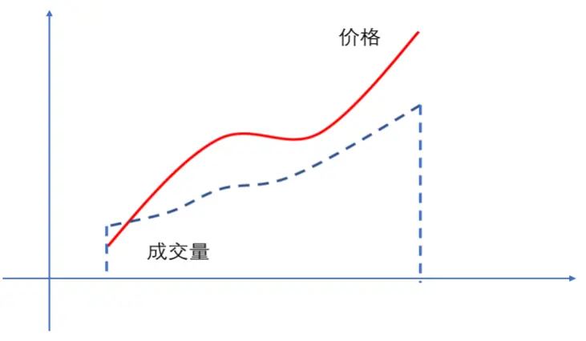
来源：国金证券研究所

图表3：价跌量跌
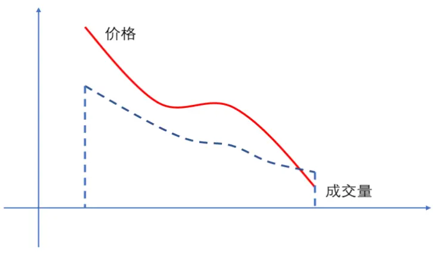
来源：国金证券研究所

图表4：价跌量升
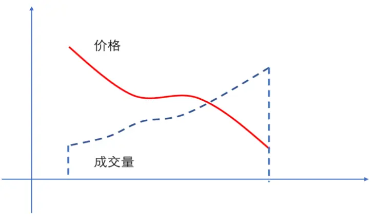
来源：国金证券研究所

结合上述对于量价的四种形态的分析，我们总结了不同形态下股价变动预期，见下表。可以看出，当量价出现背离时，无论当前股价处在上升还是下降通道，未来上涨的可能性均较高；同理，当量价趋同时，股价未来下跌的可能性较高。因此，通过分析股价与成交量之间的相关性，可以对未来价格走势进行预测。

图表5：不同量价形态下股价变动预期

| 量价相关性 | 量价形态 | 预期股价变动 |
| --- | --- | --- |
| 量价趋同 | 价升量升 | 下跌 |
| 量价趋同 | 价跌量跌 | 下跌 |
| 量价背离 | 价升量跌 | 上涨 |
| 量价背离 | 价跌量升 | 上涨 |

来源：国金证券研究所

## 1.2 日内快照数据与量价因子构建

传统的价格与成交量的研究往往是在相对较低的频率上进行分析，例如对于分钟级别数据而言，其会丧失分钟内重要的交易信息。因此，通过提高数据采样频率，可以从市场更微观的结构上获取额外信息，有获得更高超额收益的可能。下图展示的 A 股市场的高频数据分类。

图表6：高频数据分类
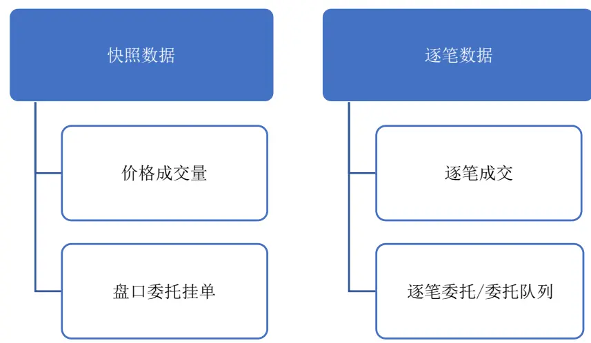
来源：上交所，深交所，国金证券研究所

快照数据是交易所 3 秒一次的最新市场行情，包括了价格、成交量以及成交笔数，以及委托挂单等信息。相比分钟级数据，快照数据的频率大幅提高，捕捉的交易信息更加完整，能够更精准刻画股票日内价格波动，能够展现价格、成交量及成交笔数在时序上的分布和变化。

基于上述优势，我们利用快照数据构建因子对日内价格与成交量的相关关系进行衡量，捕捉上文中提到的量价趋同/背离特征。衡量两个因素相关关系的直接方法就是计算相关系数。对于价格来说，我们选取快照成交价和快照收益率（即快照成交价相比上个快照成交价的变化）。对于成交量来说，我们不仅选取了快照成交量，而且选取了成交笔数，同时还计算了每笔成交量。我们共构建了如下六个因子：

$$
\begin{array}{rl}&{\begin{array}{c}{CorrPM-Corr(Price_{i}.Mateh_{i})}\\{CorrPV-Corr(Price_{i}.Volume_{i})}\end{array}}\\&{\begin{array}{c}{CorrPVH-Corr(Price_{i}.Volume_{i})}\\{CorrPVPH-Corr\Big(Price_{i}.Volume_{i}\Big)}\end{array}}\\&{\begin{array}{c}{CorrPVH-Corr\Big(Price_{i}.}\\{CorrRH-}\end{array}\Big.}\\{\begin{array}{c}{CorrPrM-Corr\Big(\frac{Price_{i}}{Price_{i-1}}-1,Match_{i}\Big)}\\{CorrRV-Corr\Big(\frac{Price_{i}}{Price_{i-1}}-1,Volume_{i}\Big)}\end{array}}\\&{\begin{array}{c}{CorrPM-Corr\Big(\frac{Price_{i}}{Price_{i-1}}-1,0.1\Big)}\\{CorrRVPM-Corr\Big(\frac{Price_{i}}{Price_{i-1}}-1,\frac{Volume_{i}}{Match_{i}}\Big)}\end{array}}\end{array}
$$

其中，Corr(…)代表两个变量之间的相关系数， $Price_{i}$ 表示 i 时刻快照成交价，Volume 表示 i 时刻快照成交量，Matcℎ表示 i 时刻快照成交笔数。当价格与成交量的相关系数为负时，意味着量价出现背离，按照此前推断，股价上涨的可能性较高，反之亦然。因此，上述因子取值与未来股票收益率应该存在负的相关关系。为了验证上述因子的预测能力，接下来，我们将对上述 6 个因子的有效性进行测试。

量价背离的特征最快可以在隔日收益率上体现，因此，我们首先测试了因子隔日收益率的预测能力，采用的方法是 IC测试和分位数组合测试（十组）。测试的时间段为 2016 年 1 月至 2022 年 8 月。后续我们还将进一步探讨因子降频的方法，以满足投资者的交易要求。

一般而言，这类量价因子在市值相对较小的股票上表现更好，因此，我们主要以中证 1000 指数成分股作为股票池进行因子有效性验证。同时，随着中证 1000 股指期货的上市，对冲工具的完善使得机构投资者对中证 1000 指数增强类产品的需求逐渐加大，因此本篇报告把重点放在中证 1000 指数增强策略上。在构建日频因子时，我们计算上一个交易日的因子值，然后以当日开盘价作为成交价。

## 二、量价背离因子日频有效性验证

## 2.1 日频因子 IC 与分位数组合表现

首先我们基于日频构建量价背离因子，即统计上个交易日内所有快照数据，构建上文中的6 个量价背离因子。我们对这些因子的有效性进行检验，首先我们检验了因子日频收益的预测能力。下表展示了 6 个因子的 IC 统计指标。可以看出，量价背离因子整体的 IC 均值为负，即日内价量背离时，隔日个股的收益率相对较高，符合上文中我们对量价背离因子的分析。其中，CorrPV 因子、CorrRV 因子以及 CorrPM 因子 IC 相对较高，IC 均值在3%以上。

图表7：量价背离因子IC指标（日频）

| 因子 | 平均值 | 标准差 | 最小值 | 最大值 | 风险调整后IC | t统计量 |
| --- | --- | --- | --- | --- | --- | --- |
| CorrPM | -3.10% | 8.43% | -28.73% | 36.90% | -0.37 | -14.83 |
| CorrPV | -3.79% | 8.37% | -26.37% | 35.80% | -0.45 | -18.22 |
| CorrPVPM | -2.17% | 5.27% | -26.82% | 20.03% | -0.41 | -16.57 |
| CorrRM | -2.08% | 9.56% | -31.32% | 29.94% | -0.22 | -8.78 |
| CorrRV | -3.13% | 8.54% | -29.83% | 26.18% | -0.37 | -14.75 |
| CorrRVPM | -1.22% | 4.92% | -19.23% | 26.65% | -0.25 | -9.96 |

来源：Wind，上交所，深交所，国金证券研究所

下图展示了因子的多空组合净值，可以看出，大部分因子在 2020 年之前表现较好，在 2020 年后，因子收益有下降的趋势，这也和众多机构逐步重视和使用高频因子导致因子有效性下降有关。CorrRV 因子和 CorrRVPM 因子的持续性相对较好，但 CorrRVPM 因子的收益相对偏低。从多空组合指标上来看，CorrPVPM 因子的多空组合年化收益率达到了29.97%，夏普比率达到了 3.72。

图表8：量价背离因子多空组合净值（日频）
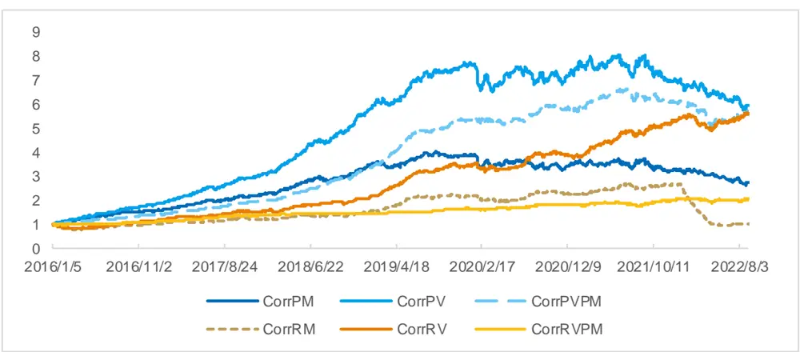
来源：Wind，上交所，深交所，国金证券研究所

图表9：量价背离因子多空组合指标（日频）

| 组合 | 年化收益率 | 波动率 | 夏普比率 | 最大回撤 |
| --- | --- | --- | --- | --- |
| CorrPM | 16.28% | 12.28% | 1.33 | 34.07% |
| CorrPV | 30.69% | 12.15% | 2.53 | 28.21% |
| CorrPVPM | 29.97% | 8.05% | 3.72 | 24.70% |
| CorrRM | 0.52% | 11.88% | 0.04 | 64.41% |
| CorrRV | 29.57% | 10.36% | 2.86 | 17.94% |
| CorrRVPM | 11.40% | 6.96% | 1.64 | 9.42% |

来源：Wind，上交所，深交所，国金证券研究所

## 2.2 日频合成因子表现

从上文可以看出，量价背离因子的单因子波动性较大，我们可以通过因子合成的方法降低单因子失效的风险。我们首先分析了 6 个因子的两两相关系数，从下表可以看出，成交量和成交笔数构建的因子相关性较高，例如 CorrPM 因子和 CorrPV 因子，其余因子的相关性较低。因此，通过因子合成有望提高因子的表现。

图表10：量价背离因子相关系数（日频）

| 因子 | CorrPM | CorrPV | CorrPVPM | CorrRM | CorrRV | CorrRVPM |
| --- | --- | --- | --- | --- | --- | --- |
| CorrPM | 1.00 | 0.86 | 0.13 | 0.24 | 0.20 | 0.04 |
| CorrPV | 0.86 | 1.00 | 0.47 | 0.31 | 0.31 | 0.10 |
| CorrPVPM | 0.13 | 0.47 | 1.00 | 0.20 | 0.21 | 0.14 |
| CorrRM | 0.24 | 0.31 | 0.20 | 1.00 | 0.88 | 0.20 |
| CorrRV | 0.20 | 0.31 | 0.21 | 0.88 | 1.00 | 0.42 |
| CorrRVPM | 0.04 | 0.10 | 0.14 | 0.20 | 0.42 | 1.00 |

来源：Wind，上交所，深交所，国金证券研究所

在进行因子合成时，我们首先对因子进行分位数变换标准化，然后选择了日频因子中表现相对较好的CorrPM、CorrPV、CorrPVPM 和 CorrRV 因子，以等权的方式合成量价背离合成因子 CorrFactor，同时我们也对该因子进行行业市值中性化处理，得到 CorrFactorAdjCI 因子。我们对上述两个因子的预测能力进行评估。

下表展示的是量价背离合成因子的 IC，可以看出，合成之后的因子的 IC 相比单因子有了一定的提升，达到 4%以上，而中性化后的因子的 IC 进一步提升。

图表11：量价背离合成因子IC指标（日频）

| 因子 | 平均值 | 标准差 | 最小值 | 最大值 | 风险调整后IC | t统计量 |
| --- | --- | --- | --- | --- | --- | --- |
| CorrFactor | 4.04% | 8.11% | -26.04% | 30.88% | 0.50 | 20.08 |
| CorrFactorAdjCl | 4.13% | 6.55% | -17.41% | 25.27% | 0.63 | 25.41 |

来源：Wind，上交所，深交所，国金证券研究所

从 CorrFactor 因子的多空净值来看，因子的稳定性也大幅改善，但因子收益在 2021 年下半年后有所下滑，但从今年上半年开始，因子收益企稳反弹。从分位数组合的年化收益率来看，单调性非常明显，但空头部分的收益略高于多头部分的收益。合成因子的多空组合年化收益率为 41.19%，夏普比率为 3.80。

图表12：量价背离合成因子多空组合净值（日频）
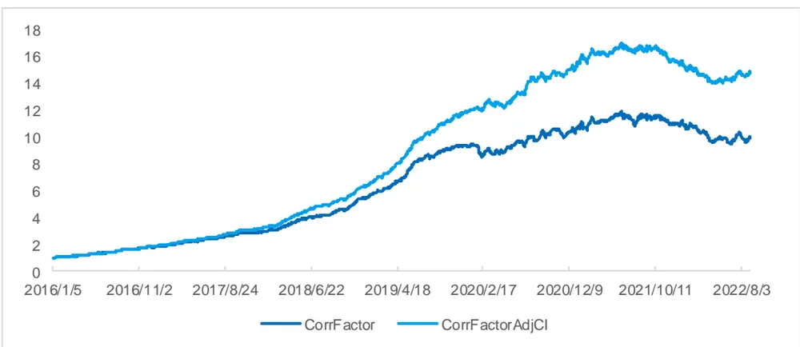
来源：Wind，上交所，深交所，国金证券研究所

中性化后的因子表现也大幅好于非中性化的因子。其中，分位数组合 Top 组合的年化超额收益率从 11.82%提升至

15.52%，多空组合的年化收益率提高至 49.83%，夏普比率达到了 5.74。

图表13：量价背离合成因子分位数组合年化收益率（日频）
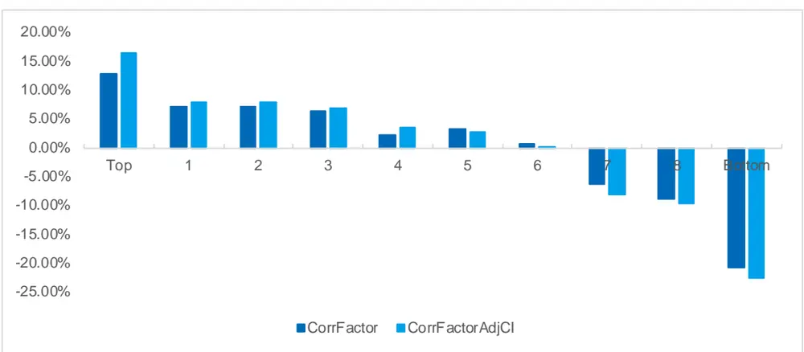
来源：Wind，上交所，深交所，国金证券研究所

图表14：CorrFactor分位数组合指标（日频）

| 组合 | 年化收益率 | 波动率 | 夏普比率 |  | 最大回撤 年化超额收益率 | 跟踪误差 | 信息比率 超额最大回撤 |  |
| --- | --- | --- | --- | --- | --- | --- | --- | --- |
| Top | 11.82% | 26.91% | 0.44 | 39.34% | 12.82% | 5.64% | 2.27 | 17.68% |
| 1 | 6.14% | 26.67% | 0.23 | 43.71% | 7.07% | 4.59% | 1.54 | 7.28% |
| 2 | 6.20% | 26.63% | 0.23 | 44.30% | 7.14% | 4.23% | 1.69 | 5.29% |
| 3 | 5.46% | 26.35% | 0.21 | 49.81% | 6.33% | 3.87% | 1.63 | 5.40% |
| 4 | 1.33% | 26.37% | 0.05 | 52.68% | 2.17% | 3.98% | 0.55 | 6.32% |
| 5 | 2.37% | 26.19% | 0.09 | 51.28% | 3.18% | 3.76% | 0.85 | 8.63% |
| 6 | -0.17% | 26.38% | -0.01 | 57.48% | 0.66% | 3.99% | 0.17 | 13.34% |
| 7 | -7.15% | 26.63% | -0.27 | 65.88% | -6.32% | 4.27% | -1.48 | 39.03% |
| 8 | -9.72% | 26.43% | -0.37 | 70.70% | -9.03% | 5.39% | -1.68 | 50.82% |
| Bottom | -21.12% | 26.14% | -0.81 | 84.20% | -20.67% | 7.33% | -2.82 | 79.32% |
| 市场 | -0.81% | 26.03% | -0.03 | 54.58% |  |  |  |  |
| L-S | 41.19% | 10.84% | 3.80 | 20.69% |  |  |  |  |

来源：Wind，上交所，深交所，国金证券研究所

图表15：CorrFactorAdjCI分位数组合指标（日频）

| 组合 | 年化收益率 | 波动率 | 夏普比率 |  | 最大回撤 年化超额收益率 | 跟踪误差 | 信息比率超额最大回撤 |  |
| --- | --- | --- | --- | --- | --- | --- | --- | --- |
| Top | 15.52% | 26.69% | 0.58 | 38.67% | 16.49% | 5.10% | 3.24 | 16.60% |
| 1 | 7.00% | 26.45% | 0.26 | 41.80% | 7.88% | 4.13% | 1.91 | 8.56% |
| 2 | 6.92% | 26.57% | 0.26 | 44.94% | 7.83% | 4.03% | 1.94 | 5.79% |
| 3 | 5.95% | 26.43% | 0.23 | 46.48% | 6.82% | 3.90% | 1.75 | 8.94% |
| 4 | 2.65% | 26.45% | 0.10 | 53.32% | 3.51% | 3.73% | 0.94 | 4.89% |
| 5 | 1.81% | 26.43% | 0.07 | 54.89% | 2.65% | 3.77% | 0.70 | 7.74% |
| 6 | -0.63% | 26.14% | -0.02 | 53.27% | 0.12% | 3.80% | 0.03 | 10.89% |
| 7 | -8.85% | 26.42% | -0.33 | 67.35% | -8.11% | 4.16% | -1.95 | 46.42% |
| 8 | -10.36% | 26.42% | -0.39 | 71.12% | -9.68% | 4.95% | -1.95 | 53.78% |
| Bottom | -23.06% | 25.93% | -0.89 | 86.53% | -22.62% | 6.06% | -3.73 | 82.20% |
| 市场 | -0.78% | 26.02% | -0.03 | 54.57% |  |  |  |  |
| L-S | 49.83% | 8.68% | 5.74 | 17.85% |  |  |  |  |

来源：Wind，上交所，深交所，国金证券研究所

我们也测试量价背离合成因子在不同股票池中的表现，可以看出，因子在中证 500 和中证 800 成分股中同样具有显著的选股能力，在中证 500 成分股中的 IC 均值达到了 4.32%，多空组合的年化收益率达到了 51.63%，夏普比率为 4.75。

图表16：CorrFactorAdjCI在不同股票池中多空组合净值（日频）
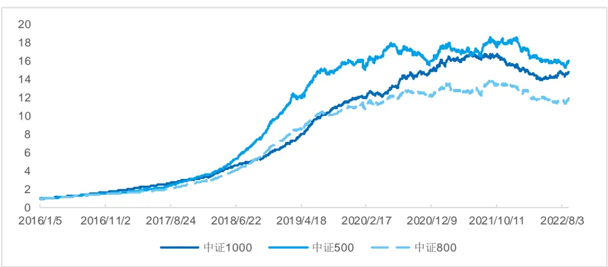
来源：Wind，上交所，深交所，国金证券研究所

图表17：CorrFactorAdjCI在不同股票池中指标（日频）

| 股票池 | IC 均值 | 风险调整后IC | IC-t 统计量 L-S 年化收益率 |  | L-S 波动率 | L-S 夏普比率 | L-S 最大回撤 |
| --- | --- | --- | --- | --- | --- | --- | --- |
| 中证 1000 | 4.13% | 0.63 | 25.41 | 49.83% | 8.68% | 5.74 | 17.85% |
| 中证500 | 4.32% | 0.55 | 22.28 | 51.63% | 10.87% | 4.75 | 17.90% |
| 中证800 | 3.83% | 0.52 | 20.90 | 45.16% | 9.32% | 4.85 | 18.85% |

来源：Wind，上交所，深交所，国金证券研究所

## 三、量价背离因子降频后表现

## 3.1 因子降频的方法

从上文的结果可以看出，量价背离的现象对隔日股票的收益率具有明显的预测作用，但对于大多数机构投资者来说，日频的预测周期相对较短，交易难以实现，且在手续费较高的情况下，比较难获得实际收益。在这种情况下，扩大因子预测周期，降低因子预测频率是一个重要的解决方法。综合考虑因子有效性的衰减以及交易的可行性，我们降低预测频率到周频对股票收益进行预测。

在这里，我们采用整体的方法，即计算了过去一周单一股票所有日内快照成交量与价格的相关系数，构建量价背离因子，构建方法与日频因子类似。这样做的好处是既保留了局部价格与成交量的相关信息，也降低频率，得到更长的预测周期。

在回测时，我们每周第一个交易日，利用上周所有交易日计算得到的因子值，以开盘价成交，对因子有效性进行测试。

## 3.2 周频因子 IC 与分位数组合表现

从下表的周频因子的表现可以看出，量价背离因子的 IC 均值差异较大，其中 CorrPVW 因子（W 后缀代表周频因子，下同）和 CorrPMW 因子的 IC 相对较高，IC 均值分别达到了-7.00%和-6.37%，而日频因子中表现较好的 CorrPVPM 因子在周频下表现较为一般。

图表18：量价背离因子IC指标（周频）

| 因子 | 平均值 | 标准差 | 最小值 | 最大值 | 风险调整的IC | t统计量 |
| --- | --- | --- | --- | --- | --- | --- |
| CorrPMW | -6.37% | 8.03% | -31.38% | 22.55% | -0.79 | -14.62 |
| CorrPVPMW | -1.31% | 5.22% | -20.58% | 17.71% | -0.25 | -4.61 |
| CorrPVW | -7.00% | 8.21% | -31.04% | 19.78% | -0.85 | -15.69 |
| CorrRMW | -2.94% | 9.34% | -29.42% | 32.24% | -0.31 | -5.79 |
| CorrRVPMW | -2.96% | 5.78% | -26.72% | 14.26% | -0.51 | -9.44 |
| CorrRVW | -4.14% | 8.90% | -26.39% | 28.65% | -0.47 | -8.57 |

来源：Wind，上交所，深交所，国金证券研究所

我们进一步研究了周频因子的多空组合的表现，可以看出，CorrPMW 因子和 CorrPVW 因子的多空组合表现优异，收益持续性相比日频因子更好，同时近几年因子也持续有效。CorrPVW 因子的多空组合年化收益率达到了 47.18%，夏普比率达到了 4.04。

我们认为，这主要是因为随着近些年高频因子在私募机构中的广泛使用，策略逐步拥挤，导致之前有效的日频因子对隔日股票收益率的预测的波动性逐步加大，甚至因子出现失效。而周频因子通过降低预测频率，可以在一定程度上平滑量价波动，从而提高预测的稳健性。

图表19：量价背离因子多空组合净值（周频）
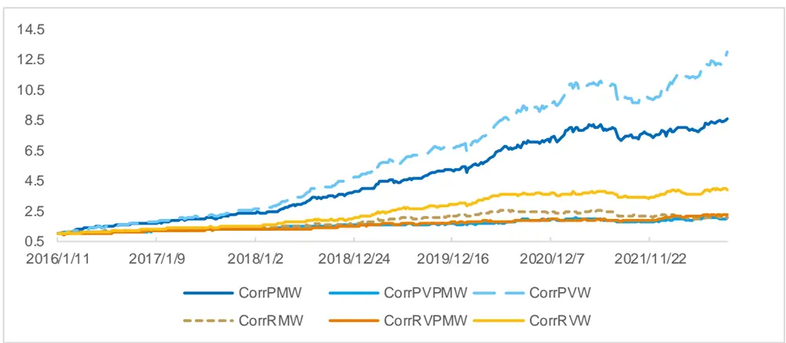
来源：Wind，上交所，深交所，国金证券研究所

图表20：价背离因子多空组合指标（周频）

| 因子 | 年化收益率 | 波动率 | 夏普比率 | 最大回撤 |
| --- | --- | --- | --- | --- |
| CorrPMW | 38.42% | 11.64% | 3.30 | 12.99% |
| CorrPVPMW | 11.39% | 8.33% | 1.37 | 13.33% |
| CorrPVW | 47.18% | 11.69% | 4.04 | 13.13% |
| CorrRMW | 11.76% | 10.79% | 1.09 | 23.97% |
| CorrRVPMW | 13.37% | 7.05% | 1.90 | 6.97% |
| CorrRVW | 22.93% | 10.26% | 2.23 | 11.49% |

来源：Wind，上交所，深交所，国金证券研究所

## 3.3 周频合成因子表现

同样，我们选取了周频因子中表现相对较好的 CorrPMW 因子和 CorrPVW 因子构建合成因子。从下表的相关性分析可以看出，成交笔数和成交量相关性较高，基于此构建的这两个因子的相关系数也较高，我们将这两个因子等权合成，得到代表这一类量价关系的因子 CorrFactorW，同时通过市值行业中性化得到 CorrFactorWAdjCI。

图表21：量价背离因子相关系数（周频）

| 因子 | CorrPMW | CorrPVPMW | CorrPVW | CorrRMW | CorrRVPMW | CorrRVW |
| --- | --- | --- | --- | --- | --- | --- |
| CorrPMW | 1.00 | 0.05 | 0.87 | 0.31 | 0.08 | 0.29 |
| CorrPVPMW | 0.05 | 1.00 | 0.40 | 0.12 | 0.06 | 0.13 |
| CorrPVW | 0.87 | 0.40 | 1.00 | 0.34 | 0.10 | 0.33 |
| CorrRMW | 0.31 | 0.12 | 0.34 | 1.00 | 0.22 | 0.89 |
| CorrRVPMW | 0.08 | 0.06 | 0.10 | 0.22 | 1.00 | 0.41 |
| CorrRVW | 0.29 | 0.13 | 0.33 | 0.89 | 0.41 | 1.00 |

来源：Wind，上交所，深交所，国金证券研究所

从因子的 IC 指标来看，中性化后的合成因子相比单因子，虽然 IC 均值提升不明显，但风险调整后 IC 达到了 0.93，说明因子的稳定性进一步提高。从多空净值来看，中性化后的合成因子的年化收益率低于中性化前的合成因子，但夏普比率大幅提升。CorrFactorWAdjCI 因子的多空组合的年化收益率达到了 38.88%，夏普比率达到了 4.08。

图表22：量价背离合成因子IC指标（周频）

| 因子 | 平均值 | 标准差 | 最小值 | 最大值 | 风险调整后IC | t统计量 |
| --- | --- | --- | --- | --- | --- | --- |
| CorrFactorW | 6.85% | 8.23% | -21.16% | 31.89% | 0.83 | 15.32 |
| CorrFactorWAdjCl | 6.27% | 6.74% | -11.58% | 23.35% | 0.93 | 17.13 |

来源：Wind，上交所，深交所，国金证券研究所

图表23：量价背离合成因子多空组合净值（周频）
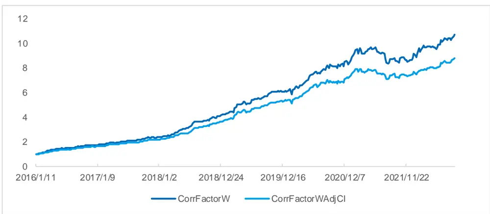
来源：Wind，上交所，深交所，国金证券研究所

从分位数组合的表现来看，两个因子从 Top 组合到 Bottom 组合的年化收益率单调性明显，但与日频因子类似，其 Top组合的收益略低于 Bottom 组合的收益。

图表24：量价背离合成因子分位数组合年化收益率（周频）
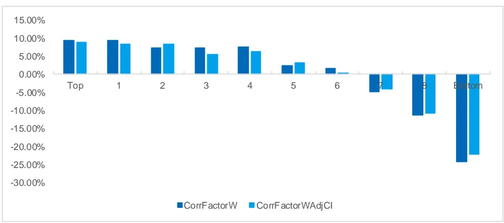
来源：Wind，上交所，深交所，国金证券研究所

图表25：CorrFactorW分位数组合指标（周频）

| 组合 | 年化收益率 | 波动率 | 夏普比率 |  | 最大回撤年化超额收益率 | 跟踪误差 | 信息比率超额最大回撤 |  |
| --- | --- | --- | --- | --- | --- | --- | --- | --- |
| Top | 8.84% | 25.53% | 0.35 | 41.86% | 9.39% | 6.04% | 1.55 | 9.97% |
| 1 | 9.10% | 24.44% | 0.37 | 40.45% | 9.46% | 4.37% | 2.16 | 6.12% |
| 2 | 6.81% | 24.53% | 0.28 | 42.53% | 7.19% | 4.37% | 1.65 | 4.64% |
| 3 | 6.84% | 24.93% | 0.27 | 45.58% | 7.33% | 4.02% | 1.82 | 5.48% |
| 4 | 7.12% | 24.41% | 0.29 | 45.87% | 7.47% | 4.49% | 1.66 | 4.28% |
| 5 | 1.72% | 25.30% | 0.07 | 49.13% | 2.30% | 3.79% | 0.61 | 7.41% |
| 6 | 1.03% | 25.51% | 0.04 | 47.50% | 1.65% | 4.18% | 0.40 | 9.86% |
| 7 | -5.40% | 25.97% | -0.21 | 59.88% | -4.73% | 4.78% | -0.99 | 30.50% |
| 组合 | 年化收益率 | 波动率 | 夏普比率 | 最大回撤 | 年化超额收益率 | 跟踪误差 | 信息比率超额最大回撤 |  |
| 8 | -11.87% | 25.55% | -0.46 | 65.68% | -11.37% | 5.48% | -2.08 | 55.62% |
| Bottom | -24.73% | 26.10% | -0.95 | 86.54% | -24.32% | 8.20% | -2.96 | 84.27% |
| 市场 | -0.50% | 24.71% | -0.02 | 52.30% |  |  |  |  |
| L-S | 43.01% | 12.04% | 3.57 | 13.84% |  |  |  |  |

来源：Wind，上交所，深交所，国金证券研究所

图表26：CorrFactorWAdjCI分位数组合指标（周频）

| 组合 | 年化收益率 | 波动率 | 夏普比率 | 最大回撤年化超额收益率 |  | 跟踪误差 | 信息比率超额最大回撤 |  |
| --- | --- | --- | --- | --- | --- | --- | --- | --- |
| Top | 8.30% | 25.69% | 0.32 | 41.57% | 8.93% | 5.32% | 1.68 | 10.16% |
| 1 | 8.00% | 24.42% | 0.33 | 39.55% | 8.34% | 4.17% | 2.00 | 6.88% |
| 2 | 7.91% | 24.88% | 0.32 | 42.57% | 8.37% | 4.12% | 2.03 | 5.56% |
| 3 | 5.05% | 24.69% | 0.20 | 45.60% | 5.47% | 3.70% | 1.48 | 4.43% |
| 4 | 5.84% | 24.57% | 0.24 | 47.38% | 6.22% | 3.93% | 1.58 | 7.47% |
| 5 | 2.73% | 25.04% | 0.11 | 47.80% | 3.22% | 4.01% | 0.80 | 4.08% |
| 6 | -0.20% | 25.20% | -0.01 | 50.21% | 0.33% | 3.95% | 0.08 | 10.17% |
| 7 | -4.76% | 25.53% | -0.19 | 58.04% | -4.19% | 4.32% | -0.97 | 28.96% |
| 8 | -11.40% | 25.50% | -0.45 | 67.10% | -10.90% | 5.00% | -2.18 | 54.21% |
| Bottom | -22.51% | 25.65% | -0.88 | 83.70% | -22.11% | 6.67% | -3.31 | 80.95% |
| 市场 | -0.47% | 24.70% | -0.02 | 52.30% |  |  |  |  |
| L-S | 38.88% | 9.53% | 4.08 | 10.38% |  |  |  |  |

来源：Wind，上交所，深交所，国金证券研究所

我们同样在不同股票池中测试了周频合成因子的表现，可以看出，在中证 500 和中证 800 成分股中，中性化后的合成因子均取得不错的多空收益。在中证 500 成分股中，多空组合的年化收益率为 34.49%，夏普比率达到了 3.33。在中证 800 成分股中，虽然多空组合的收益略有降低，但波动率下降更为明显，夏普比率达到了 3.54。

图表27：CorrFactorWAdjCI在不同股票池中多空组合净值（周频）
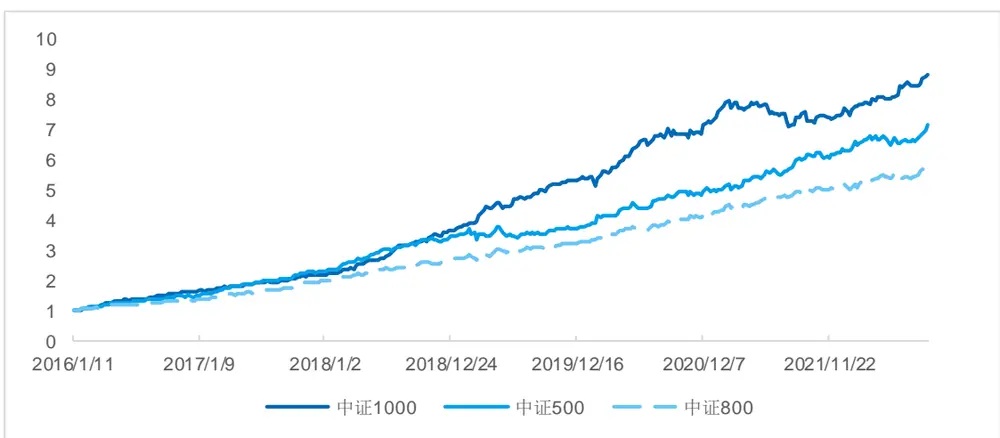
来源：Wind，上交所，深交所，国金证券研究所

图表28：CorrFactorWAdjCI在不同股票池中指标（周频）

| 组合 | IC均值 | 风险调整后IC | IC-t 统计量 L-S 年化收益率 |  | L-S 波动率 | L-S 夏普比率 | L-S 最大回撤 |
| --- | --- | --- | --- | --- | --- | --- | --- |
| 中证1000 | 6.27% | 0.93 | 17.13 | 38.88% | 9.53% | 4.08 | 10.38% |
| 中证500 | 6.12% | 0.79 | 14.59 | 34.49% | 10.37% | 3.33 | 10.49% |
| 中证800 | 5.19% | 0.71 | 13.09 | 30.27% | 8.54% | 3.54 | 4.87% |

来源：Wind，上交所，深交所，国金证券研究所

上述研究表明，通过整体的方法，将日内快照量价的信息进行整合，得到的量价背离因子在周频维度对股票收益率有明显的预测作用，同时也满足了机构客户对于交易的相关要求，这类高频信息低频化的方法也普遍用在其他类型的因子上。接下来，我们将利用构建的量价背离合成因子，结合其他因子一起，构建中证1000 指数增强策略。

## 四、结合量价背离因子的中证1000 指数增强策略

## 4.1 周频量价背离因子对传统因子的增强

上文的研究可以看出，周频量价背离因子具有显著的预测能力，但由于单一类型的因子波动性较大，同时，由于高换仓频率（日频、周频）的策略的换手率相对较高，其对交易成本比较敏感，因此对因子预测的胜率和收益有较高的要求，所以我们选择将该因子与传统因子一起使用构建策略，达到控制换手率，提高收益的效果。下面我们将周频量价背离因子与传统因子结合到一起，构建中证 1000 指数增强策略。

下图展示了周频量价背离合成因子（CorrFactorWAdjCI 因子）的 IC 时间序列，可以看出，因子的预测胜率非常高，达到了 84.37%。

图表29：周频量价背离合成因子IC序列
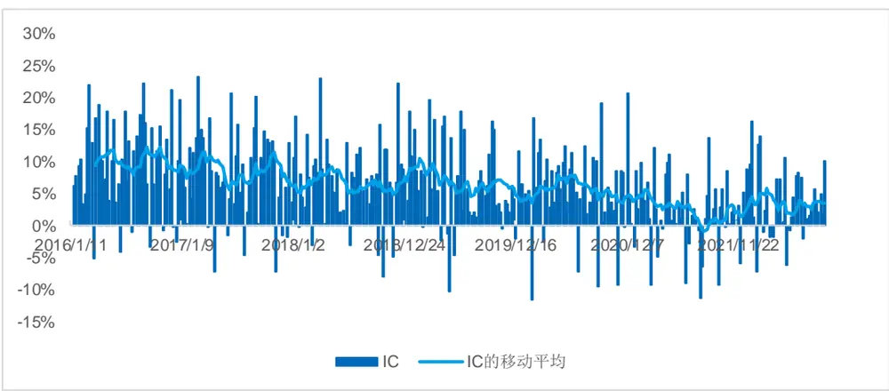
来源：Wind，上交所，深交所，国金证券研究所

我们进一步探究了周频量价背离合成因子与传统因子的相关性，可以看出，量价背离合成因子与大部分因子的相关性不高，其与技术因子（Technique_regM）因子相关系数最高，但也仅为 0.21。因此，基于日内高频量价数据的因子的确可以提供与传统因子不同的信息。

图表30：周频量价背离合成因子与传统因子相关系数
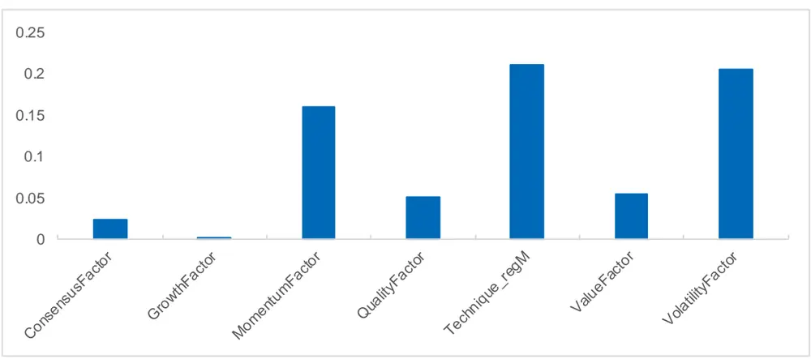
来源：Wind，上交所，深交所，国金证券研究所

在构建中证 1000 指数增强策略前，我们首先在该成分股池中，检验了各个类别因子的有效性。从下表可以看出，中小市值成长风格的中证 1000 股票池中，一致预期因子（ConsensusFactor）、成长因子（GrowthFactor）以及技术因子（Technique_regM）的预测能力相对较强。而量价背离因子表现仅次于技术因子，好于一致预期因子和成长因子。

我们将一致预期因子、成长因子、技术因子以及量价背离因子以等权的方式合成量价背离增强因子（CGTCAdj），同时，为了对比量价背离合成因子带来的增量信息，我们将前三个因子等权合成为传统合成因子（CGT）。从因子表现可以看出，量价背离增强因子的 IC 达到了 7.66%，相比单因子有了较大提高，风险调整后 IC 达到了 1.02，而传统合成因子的 IC 仅为 5.91%，风险调整后 IC 为 0.79。

图表31：中证1000成分股中因子IC指标（周频）

| 因子 | 平均值 | 标准差 | 最小值 | 最大值 | 风险调整后IC | t统计量 |
| --- | --- | --- | --- | --- | --- | --- |
| ConsensusFactor | 1.33% | 5.65% | -14.78% | 17.49% | 0.24 | 4.33 |
| GrowthFactor | 2.50% | 7.52% | -17.81% | 25.39% | 0.33 | 6.11 |
| Technique_regM | 7.18% | 8.28% | -16.79% | 28.32% | 0.87 | 15.98 |
| CorrFactorWAdjCI | 6.27% | 6.74% | -11.58% | 23.35% | 0.93 | 17.13 |
| CGT | 5.91% | 7.46% | -17.30% | 27.06% | 0.79 | 14.60 |
| CGTCAdj | 7.66% | 7.52% | -16.89% | 31.05% | 1.02 | 18.75 |

来源：Wind，上交所，深交所，国金证券研究所

我们进一步构建多空组合，从净值可以看出，量价背离增强因子的多空净值稳步增加，好于传统合成因子以及其他单因子，多空组合的年化收益率达到了 55.60%，夏普比率达到了 4.95，因子收益有较大的提高。而传统合成因子的多空组合的表现也好于单因子，但年化收益率仅为 43.57%，夏普比率为 3.73，逊于量价背离增强因子。

图表32：中证1000成分股中因子多空组合净值（周频）
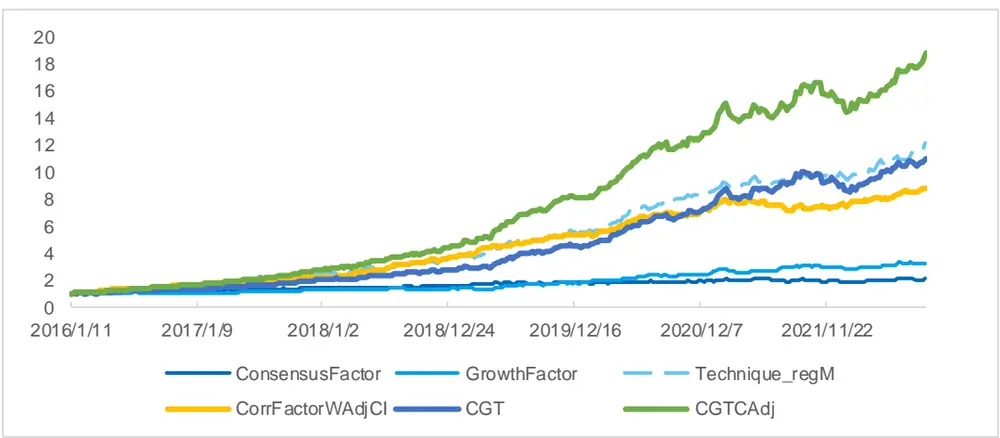
来源：Wind，上交所，深交所，国金证券研究所

图表33：中证1000成分股中因子多空组合指标（周频）

| 组合 | 年化收益率 | 波动率 | 夏普比率 | 最大回撤 |
| --- | --- | --- | --- | --- |
| ConsensusFactor | 11.76% | 9.08% | 1.29 | 13.50% |
| GrowthFactor | 19.64% | 10.50% | 1.87 | 13.78% |
| Technique_regM | 45.62% | 11.42% | 3.99 | 7.04% |
| CorrFactorWAdjCI | 43.01% | 12.04% | 3.57 | 13.84% |
| CGT | 43.57% | 11.67% | 3.73 | 14.91% |
| CGTCAdj | 55.60% | 11.24% | 4.95 | 13.20% |

来源：Wind，上交所，深交所，国金证券研究所

## 4.2 基于量价背离增强因子的中证 1000指数增强策略

上文构建的量价背离增强因子在中证 1000 股票池中有显著的预测能力，接下来，我们将构建中证 1000 增强策略。我们的回测期为 2016 年1 月至 2022 年8 月，按照周度方式进行调仓，即每周第一个交易日以开盘价成交，选取因子排名前 10%的股票等权构建组合，基准选择中证 1000 指数，交易费率为单边千分之二。

从下图的净值对比可以看出，量价背离增强策略相比基准优势非常明显，超额净值稳步增加。从指标上来看，增强策略的年化收益率为 9.51%，相比基准的年化超额收益率为 11.90%。策略的换手率为周度双边 92.43%，换手率相对较高。策略的信息比率达到了 2.27。

图表34：量价背离增强策略表现
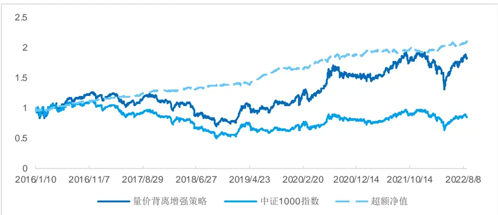
来源：Wind，上交所，深交所，国金证券研究所

图表35：量价背离增强策略指标

| 指标 | 量价背离增强策略 | 中证1000指数 |
| --- | --- | --- |
| 年化收益率 | 9.51% | -2.32% |
| 年化波动率 | 23.65% | 24.07% |
| 夏普比率 | 0.40 | -0.10 |
| 最大回撤 | 44.59% | 55.11% |
| 双边换手率（周度） | 92.43% |  |
| 年化超额收益率 | 11.90% | 1 |
| 跟踪误差 | 5.23% |  |
| 信息比率 | 2.27 |  |
| 超额最大回撤 | 5.29% |  |

来源：Wind，上交所，深交所，国金证券研究所

从策略分年度表现来看，策略在所有年份均超越基准取得正超额收益。其中，2016 年、2017 年、2019 年以及 2020年的超额收益率分别达到了 15.49%、12.25%、18.23%和 14.51%。今年截止8 月 29 日，策略取得的超额收益率为 7.78%。

图表36：量价背离增强策略分年度收益率
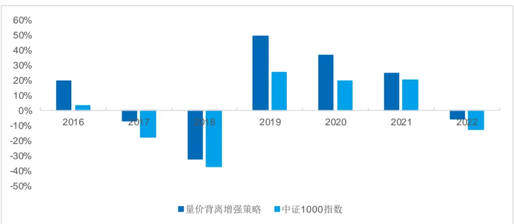
来源：Wind，上交所，深交所，国金证券研究所
注：2022 年收益截止 2022 年 8 月 29 日。

量价背离增强策略的换手率达到了周度双边 92.43%，因此其对手续费较为敏感。我们在不同手续费下对比了策略表现，见下图。可以看出，随着手续费的增加，策略收益逐步下降，但即便在严格的千分之三的手续费之下，策略的仍然可以获得 6.73%的年化超额收益率。当手续费可以降低至万分之五时，策略的年化超额收益率的提升至 20.14%，此时的

## 信息比率达到了 3.93。

图表37：不同手续费下策略超额净值对比
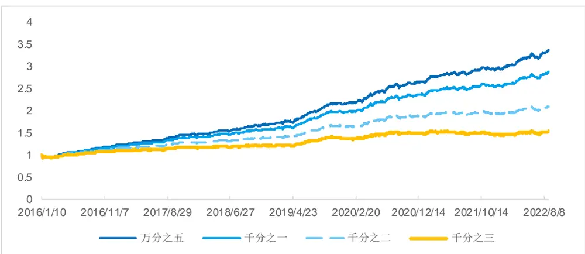
来源：Wind，上交所，深交所，国金证券研究所

图表38：不同手续费下策略指标对比

| 指标 | 万分之五 | 千分之一 | 千分之二 | 千分之三 |
| --- | --- | --- | --- | --- |
| 年化收益率 | 17.57% | 14.82% | 9.51% | 4.46% |
| 年化波动率 | 23.70% | 23.68% | 23.65% | 23.63% |
| 夏普比率 | 0.74 | 0.63 | 0.40 | 0.19 |
| 最大回撤 | 39.20% | 40.56% | 44.59% | 49.06% |
| 年化超额收益率 | 20.14% | 17.33% | 11.90% | 6.73% |
| 跟踪误差 | 5.13% | 5.15% | 5.23% | 5.39% |
| 信息比率 | 3.93 | 3.37 | 2.27 | 1.25 |
| 超额最大回撤 | 5.15% | 5.19% | 5.29% | 6.45% |

来源：Wind，上交所，深交所，国金证券研究所

## 五、总结

我们研究发现，当量价出现背离时，无论当前股价处在上升还是下降通道，未来上涨的可能性均较高。我们利用日内快照数据构建因子对日内价格与成交量的相关关系进行衡量，捕捉量价趋同/背离特征，共构建了 6 个因子。在日频维度上，CorrPV 因子、CorrRV 因子以及 CorrPM 因子 IC 相对较高，IC 均值在 3%以上。CorrPVPM 因子的多空组合年化收益率达到了 29.97%，夏普比率达到了 3.72。中性化后的合成因子表现大幅提高。我们采用整体的方法，统计了过去一周单一股票的日内快照成交量与价格的背离，构建周频量价背离因子。中性化后的周频合成因子的 IC 均值为6.27%，多空组合的年化收益率达到了 38.88%，夏普比率达到了 4.08。

我们选择将量价背离因子与传统因子一起使用构建策略。合成后的量价背离增强因子的 IC 达到了 7.66%，风险调整后IC 达到了 1.02，而作为对比的传统合成因子的 IC 仅为 5.91%，风险调整后 IC 为 0.79。基于量价背离增强因子构建的增强策略的年化收益率为 9.51%，相比基准的年化超额收益率为 11.90%。即便在严格的千分之三的手续费之下，策略的仍然可以获得6.73%的年化超额收益率。当手续费可以降低至万分之五时，策略的年化超额收益率的提升至20.14%，此时的信息比率达到了 3.93。

## 风险提示

1、以上结果通过历史数据统计、建模和测算完成，在政策、市场环境发生变化时模型存在失效的风险。

2、策略依据一定的假设通过历史数据回测得到，当交易成本提高或其他条件改变时，可能导致策略收益下降甚至出现亏损。

## 特别声明：

国金证券股份有限公司经中国证券监督管理委员会批准，已具备证券投资咨询业务资格。

本报告版权归“国金证券股份有限公司”（以下简称“国金证券”）所有，未经事先书面授权，任何机构和个人均不得以任何方式对本报告的任何部分制作任何形式的复制、转发、转载、引用、修改、仿制、刊发，或以任何侵犯本公司版权的其他方式使用。经过书面授权的引用、刊发，需注明出处为“国金证券股份有限公司”，且不得对本报告进行任何有悖原意的删节和修改。

本报告的产生基于国金证券及其研究人员认为可信的公开资料或实地调研资料，但国金证券及其研究人员对这些信息的准确性和完整性不作任何保证。本报告反映撰写研究人员的不同设想、见解及分析方法，故本报告所载观点可能与其他类似研究报告的观点及市场实际情况不一致，国金证券不对使用本报告所包含的材料产生的任何直接或间接损失或与此有关的其他任何损失承担任何责任。且本报告中的资料、意见、预测均反映报告初次公开发布时的判断，在不作事先通知的情况下，可能会随时调整，亦可因使用不同假设和标准、采用不同观点和分析方法而与国金证券其它业务部门、单位或附属机构在制作类似的其他材料时所给出的意见不同或者相反。

本报告仅为参考之用，在任何地区均不应被视为买卖任何证券、金融工具的要约或要约邀请。本报告提及的任何证券或金融工具均可能含有重大的风险，可能不易变卖以及不适合所有投资者。本报告所提及的证券或金融工具的价格、价值及收益可能会受汇率影响而波动。过往的业绩并不能代表未来的表现。

客户应当考虑到国金证券存在可能影响本报告客观性的利益冲突，而不应视本报告为作出投资决策的唯一因素。证券研究报告是用于服务具备专业知识的投资者和投资顾问的专业产品，使用时必须经专业人士进行解读。国金证券建议获取报告人员应考虑本报告的任何意见或建议是否符合其特定状况，以及（若有必要）咨询独立投资顾问。报告本身、报告中的信息或所表达意见也不构成投资、法律、会计或税务的最终操作建议，国金证券不就报告中的内容对最终操作建议做出任何担保，在任何时候均不构成对任何人的个人推荐。

在法律允许的情况下，国金证券的关联机构可能会持有报告中涉及的公司所发行的证券并进行交易，并可能为这些公司正在提供或争取提供多种金融服务。

本报告并非意图发送、发布给在当地法律或监管规则下不允许向其发送、发布该研究报告的人员。国金证券并不因收件人收到本报告而视其为国金证券的客户。本报告对于收件人而言属高度机密，只有符合条件的收件人才能使用。根据《证券期货投资者适当性管理办法》，本报告仅供国金证券股份有限公司客户中风险评级高于 C3 级(含 C3 级）的投资者使用；本报告所包含的观点及建议并未考虑个别客户的特殊状况、目标或需要，不应被视为对特定客户关于特定证券或金融工具的建议或策略。对于本报告中提及的任何证券或金融工具，本报告的收件人须保持自身的独立判断。使用国金证券研究报告进行投资，遭受任何损失，国金证券不承担相关法律责任。

若国金证券以外的任何机构或个人发送本报告，则由该机构或个人为此发送行为承担全部责任。本报告不构成国金证券向发送本报告机构或个人的收件人提供投资建议，国金证券不为此承担任何责任。

此报告仅限于中国境内使用。国金证券版权所有，保留一切权利。

上海

电话：021-60753903

北京

深圳

电话：010-66216979

传真：021-61038200

电话：0755-83831378

传真：010-66216793

传真：0755-83830558

邮箱：researchsh@gjzq.com.cn

邮箱：researchbj@gjzq.com.cn

邮箱：researchsz@gjzq.com.cn

邮编：201204

邮编：100053

邮编：518000

地址：上海浦东新区芳甸路 1088 号

地址：中国北京西城区长椿街 3 号 4 层

紫竹国际大厦 7 楼

地址：中国深圳市福田区中心四路 1-1 号

嘉里建设广场 T3-2402