# Alpha掘金系列之三

金融工程专题报告

证券研究报告

分析师：高智威(执业 S1130522110003)

gaozhiw@

## 高频非线性选股因子的线性化与失效因子的动态纠正

## 高频因子中非线性与失效问题普遍存在

随着因子选股模型研究的逐步深入，我们发现高频因子与股票预期收益之间常常并非是严格的线性关系，这类因子不能直接纳入多因子模型。另一方面，部分高频因子会出现阶段性失效的问题，从之前的单调因子变为不单调因子，我们需要对其进行动态纠正以转换为持续有效的因子。本篇报告是 Alpha 掘金系列的第三篇，我们将对非线性因子进行线性化处理，同时对失效因子进行纠正，使其纳入线性多因子模型中。

## 线性转换与纠正方法

研究发现，线性转换方法不仅可以对此前不单调的因子处理为单调的因子，同时也可以动态对部分时间段失效的因子进行纠正，使因子的有效性更加持续。我们分别对分段线性近似、线性插值、多项式拟合和分段线性回归等四种方法进行线性转换的测试，转换后因子的多空组合年化收益率相比转换前分别提升了 10.30%、11.37%、9.77%和 10.55%。在插值类方法中，线性插值优于分段线性近似，而在拟合类方法中，分段线性回归优于多项式拟合。其中，分段线性回归方法集合了另外三种转换方法的优点，而且使用该方法转换后，价格区间占比因子的 IC 水平和多空组合的年化收益率均值相对较高。因此，对于这类价格区间占比因子而言，最佳的转换方法是分段线性回归。

## 高频线性重构因子日频和周频预测能力显著

将分段线性回归处理后的价格区间因子等权合成为高频线性重构因子，并对其进行行业市值正交化。日频测试中，正交化后的高频线性重构因子 IC 均值为 3.13%，ICIR 为 0.51，多空组合年化收益率达到了 62.57%，夏普比率达到了7.67。

为了满足大多数机构投资者的需要，我们通过加权移动平均的方法降低因子预测频率到周频，并将降频处理后的因子等权合成为周频线性重构因子。行业市值正交化之后的周频线性重构因子 IC 均值达到 3.81%，ICIR 为 0.52，多空组合年化收益率为 28.39%，夏普比率为 2.89。

## 基于周频线性重构因子的中证1000 指数增强策略

正交化后的周频线性重构因子对股票未来收益具有显著的预测能力。我们基于这一因子构建了中证 1000 指数增强策略，策略实现了 7.53%的年化收益率，相比基准取得 11.03%的年化超额收益率，信息比率为 1.47。

为了提高策略的稳定性，我们还将正交化后的周频线性重构因子与传统因子以及周频量价背离因子一起构建策略。合成的线性重构增强因子 IC 均值达到 8.00%，多空组合年化收益率达到了 64.38%，夏普比率达到 5.35。基于线性重构增强因子的策略表现亮眼，年化收益率达到 18.83%，相比中证 1000 指数取得了 23.24%的年化超额收益率，信息比率达到 3.41。

## 风险提示

1、以上结果通过历史数据统计、建模和测算完成，在政策、市场环境发生变化时模型存在失效的风险。

2、策略依据一定的假设通过历史数据回测得到，当交易成本提高或其他条件改变时，可能导致策略收益下降甚至出现亏损。

## 一、高频因子中非线性因子与失效因子

多年来，学术界和业界广泛应用多因子模型，取得了丰硕的研究成果。但是，传统多因子模型的前提假设是因子数值与股票的预期收益之间呈现线性关系。随着因子选股模型研究的逐步深入，我们越来越重视高频数据，由此发现高频因子与股票预期收益之间常常并非是严格的线性关系，部分高频因子呈现出稳定的非线性特征。这类因子不能直接纳入多因子模型，但由于这些高频因子数量较多，且能够提供股票市场日内微观结构的额外信息，本身具有较高的研究意义，这类因子直接舍弃比较可惜。另一方面，有的高频因子会出现阶段性失效，从此前的单调因子变为不单调因子，我们需要对其进行动态纠正以转换为持续有效的因子。如何通过线性转换的方法将这两类因子应用起来是本篇报告研究的重点。

本篇报告是 Alpha 掘金系列的第三篇，我们将对非线性因子进行处理，从而使其线性化，同时对失效因子进行纠正，使其纳入线性多因子模型中。本文将介绍四种方法，分别是分段线性近似、线性插值、多项式拟合以及分段线性回归，如下表所示。应用这些线性转换方法，对原本单调线性的因子，其转换后信息损失应较低，同时可以将原本不单调的非线性因子，大幅改善其线性特征。为了验证线性转换方法的有效性，我们利用此前构建的基于高频快照数据的价格区间占比类因子，其中的若干因子具有明显的非线性特征。

图表1：因子线性转换体系示意图
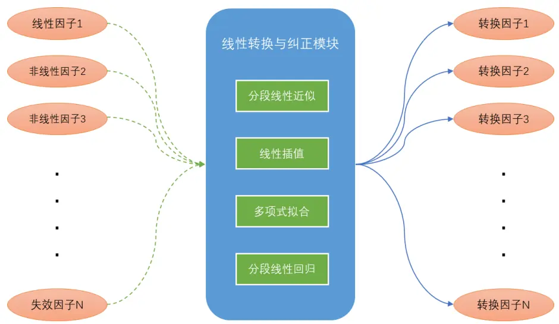
来源：国金证券研究所

我们基于快照数据中的高频量价数据构建了高低价格区间的成交笔数占比因子、成交量占比因子和平均每笔成交量因子。高价格区间包含处于全天的价格序列较高分位数的快照，而低价格区间则包含处于较低分位数的快照。

高低价格区间成交笔数占比因子是价格区间内所有快照的成交笔数累加与全天成交总笔数的比值。

$$
\frac{3}{159}\%+35\%+\frac{12}{187}\%+35\%=\frac{3}{15}\times5\%=\frac{\sum_{j=1}^{N}matchitems*I_{\{j\in set_{-}a\}}}{\sum_{j=1}^{N}matchitems}
$$

$I_{\{j\in set_{-}a\}}$ 表示快照所属区间的判断，其中，set a代表处于高低价格区间的快照集合。

高低价格区间成交量占比因子是价格区间内所有快照的成交量累加与全天总成交量的比值。

$$
\frac{1}{100}+11\times18\times175\times177\times17\times17\times17\times17\times17\times17\times17\times17\times17\times17\times17\times17\times17\times17\times17\times17\times17\times17\times17\times17\times17\times17\times17\times17\times17\times17\times17\times17\times17\times17\times17\times17\times17\times17\times17\times17\times17\times17\times17\times17\times17\times17\times17\times17\times17\times17\times17\times17\times17\times17\times17\times17\times17\times17\times17\times17\times17\times17\times17\times17\times17\times17\times17\times17\times17\times17\times17\times17\times17\times17\times17\times17\times17\times17\times17\times17\times17\times17\times17\times17\times17\times17\times17\times17\times17\times17\times17\times17\times17\times17\times17\times17\times17\times17\times17\times17\times17\times17\times17\times17\times17\times17\times17\times17\times17\times17\times17\times17\times17\times17\times17\times17\times17\times17\times17\times17\times17\times17\times17\times17\times1\times17\times17\times17\times17\times1\times17\times17\times1\times17\times17\times1\times17\times1\times17\times17\times1\times17\times1\times17\times1\times17\times1\times17\times1\times1\times11\times1\times1\times17\times1\times1\times10\times11\times1\times1\times11\times1\times1\times1\times1\times1\times1\times11
$$

高低价格区间平均每笔成交量因子是将目标价格区间内的平均每笔成交量与全天平均水平进行比较。

$$
\begin{array}{c}\aligned\ddot{\pi}_{2}^{\sharp}/(\mathcal{H})/(\mathcal{H})\cdot\mathcal{E}_{1}/\mathcal{I}+\mathcal{A}\notin\mathcal{E}_{1}/\dot{\mathcal{K}}\cdot\check{\Xi}^{\sharp}/\mathcal{H}\vec{\mathcal{I}}=\frac{\sum_{j=1}^{N}volume\mathrm{~\ast~}I_{\{j\in set_{-}a\}}\ \big/\ }{\sum_{j=1}^{N}volume\ \cdot\begin{array}{rcl}{\sum_{j=1}^{N}matchitems\ \ast I_{\{j\in set_{-}a\}}}&{}\end{array}};\end{array}
$$

我们将这三大类因子在中证 1000 和中证 800 股票池范围内进行分位数组合测试，我们注意到，很多因子的分位数组合年化超额收益率呈现明显的不单调的特征，例如低价格区间成交笔数与成交量占比因子。在这种情况下，因子的多空收益很低，且 Top 组合的收益也不理想，这类因子很难直接应用在传统多因子模型中。

图表2：低价格区间成交笔数因子（20%）分位数组合年化超额收益率
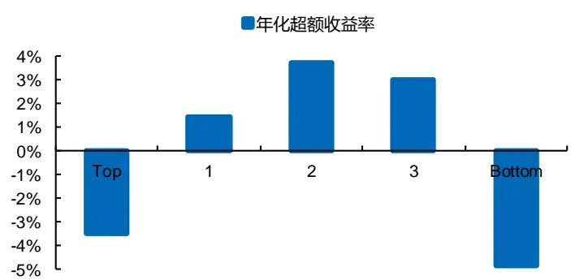
来源：Wind，上交所，深交所，国金证券研究所

图表3：低价格区间成交量因子（20%）分位数组合年化超额收益率
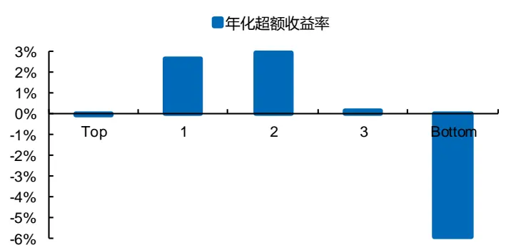
来源：Wind，上交所，深交所，国金证券研究所

低价格区间成交笔数与成交量占比因子能够分别反映股票日内价格低区间内投资者的成交聚集度和交易活跃度，二者均为符合经济学逻辑的有价值的因子。因此，我们亟需找到一些处理高频因子非线性特征的方法，完成非线性到线性关系的变换，从而使上述因子能够充分发挥其预测作用，提高多空组合的收益。

很多投资者会基于机器学习和人工智能方法处理这类非线性问题，但由于这些方法往往不是非常通俗易懂，并不是所有投资者都能接受，因此本报告开发了基于差值和回归的分段转换方法，避免了上述问题，也取得了较好的效果。在理论上，这些转换方法可以应用于任意非线性特征较为稳定的因子。接下来，我们将以高频价格区间占比因子为例，介绍四类转换方法的特点和有效性。

## 二、构建分段差值和回归的非线性转换方法

接下来，我们将依次介绍四种处理因子非线性特征的方法，并对转换后的因子进行测试，观察因子收益的线性特征是否改善，多空组合的表现是否提升。随后，我们将比较四种方法的转换效果，筛选出针对这类高频价格区间占比因子的最佳转换方法，并对其进行参数敏感性分析。对于价格区间占比因子，其利用的是高频快照数据，最快可以对下一交易日进行预测，我们将先以日频周期为例进行研究，后续将降频到周频，以满足大部分投资机构的要求。

## 2.1 分段线性近似方法

面对因子值与收益率之间的非线性关系，我们首先会产生一个朴素的想法，即把股票按因子值的大小分成若干组，用每组的平均收益代表组内股票的预期收益，然后根据过往的每组的收益率分布，在分布稳定的假设基础上，将不同组的因子值转化为未来收益率的预测值，从而达到线性转换的目的。

## 2.1.1 分段线性近似转换原理

首先我们需要对待转换因子的历史收益率的分布情况进行分析，即在每个交易日，按照因子值从高到低，等分等权构建 M个组合，并根据各组合在过去 N个交易日的收益情况，计算每个组合相对于全部股票等权基准的超额收益率，从而便得到了该因子在截面上的分组收益率的分布情况。

基于高频数据构建的因子，其统计特征一般较为稳定，因此我们假设该分布在未来一段时间内保持稳定，通过该分布情况来对未来不同分组的股票进行预测。为了化简问题，我们只选择边界、超额收益率的极大值点和极小值点对应的组合作为节点。在每个节点之间，利用线性插值进行近似，从而将全部因子值转化为超额收益率的预测值，完成线性转换。在这里，为了避免因子原始取值的统计分布可能出现时变的特征，我们使用因子值截面的百分位数，如下图所示。其中，Top 组合和 Bottom 组合为原始因子值排名最高和最低的两个组合，即边界。

图表4：分段线性近似方法示意图（M取5分组）
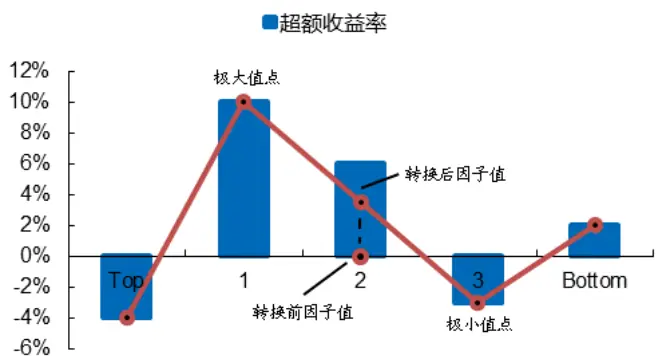
来源：国金证券研究所

根据收益率最高和最低分位数组合所处的位置，可以有不同的分段函数的构建方法，我们以上图的极大值点和极小值点所处位置的情况进行举例，其转换后因子值的计算公式为

$$
x_{transform}=\left\{\begin{array}{rl}{\displaystyle r_{top}+\frac{r_{max}-r_{top}}{x_{max}-x_{top}}\cdot\big(x-x_{top}\big),}&{\quad x>x_{max}}\\{\displaystyle r_{max}+\frac{r_{min}-r_{max}}{x_{min}-x_{max}}\cdot(x-x_{max}),}&{\quad x_{min}<x\leq x_{max}}\\{\displaystyle r_{min}+\frac{r_{bottom}-r_{min}}{x_{bottom}-x_{min}}\cdot(x-x_{min}),}&{\quad x\leq x_{min}}\end{array}\right.
$$

其中，x表示转换前因子值对应的百分位数， $x_{top}\notin\arg x_{bottom}$ 分别表示Top组合和Bottom组合因子值百分位数的中位数，$r_{top}\ kP_{bottom}$ 分别表示 Top 组合和 Bottom 组合过去 N个交易日的年化超额收益率，x 和x 分别表示极大值点和极小值点的组合因子值百分位数的中位数， $r_{max}\mathrm{\#}{\arg_{min}}$ 分别表示极大值点和极小值点的组合年化超额收益率。当极大值和极小值点的位置发生变化时，该分段方法也应该进行调整。

分段线性近似方法简单易操作，同时在各个子区间内，股票预期收益随着因子的排序数值线性变化，符合常规逻辑。
但是，我们仅获得了分组收益分布中的 4 个数据点（实际有 M个），其丢失的信息相对较多。

## 2.1.2 因子线性转换举例

我们选取了单调性较差的低价格区间成交笔数与低价格区间成交量占比因子进行举例，并评估线性转换的效果。测试股票池为中证 1000 和中证 800 股票池，回测时间范围为 2016 年 4 月至 2022 年 8 月，因子回测分组数量为 5 组，换仓频率为日频，每个交易日以开盘价进行成交。在进行分段线性近似时，我们先按照 M取 5 组，N取 60 个交易日的参数进行转换。

下表统计了分段线性近似转换前后低价格区间成交笔数占比因子的 IC。可以看出，IC 似乎整体有一定的下降，并没有明显提升，其中 30%价格区间因子的 IC 为 1.42%，ICIR 为 0.19。

图表5：分段线性近似转换前后低价格区间成交笔数占比因子的IC统计

| 因子 | 价格区间 | 转换前 |  |  | 转换后 |  |  |
| --- | --- | --- | --- | --- | --- | --- | --- |
|  |  | IC 均值 | ICIR | t统计量 | IC 均值 | ICIR | t统计量 |
| 低价格区间成交笔数因子 | 10% | 1.12% | 0.13 | 5.16 | 0.79% | 0.11 | 4.24 |
| 低价格区间成交笔数因子 | 20% | 1.65% | 0.19 | 7.42 | 1.08% | 0.14 | 5.69 |
| 低价格区间成交笔数因子 | 30% | 2.11% | 0.23 | 9.14 | 1.42% | 0.19 | 7.45 |

来源：Wind，上交所，深交所，国金证券研究所

我们进一步研究其分位数组合单调性的改善情况，从转换后低价格区间成交笔数占比因子（10%）的分位数组合表现可以看出，经过线性转换，Top 组合至 Bottom 组合的年化超额收益率现在呈现出明显单调递减的趋势，单调性大幅改善。

图表6：分段线性近似转换前（左）后（右）低价格区间成交笔数占比因子（10%）分位数组合表现
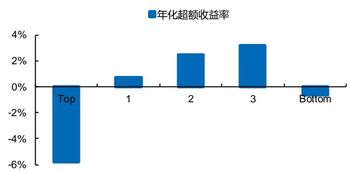
来源：Wind，上交所，深交所，国金证券研究所

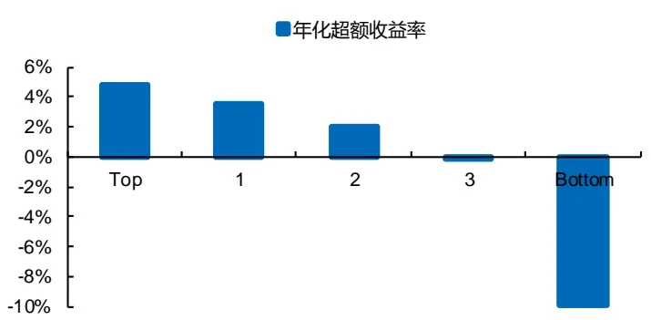
来源：Wind，上交所，深交所，国金证券研究所

图表7：分段线性近似转换前后低价格区间成交笔数占比因子的多空组合表现

| 因子 | 价格区间 | 转换前 |  | 转换后 |  |
| --- | --- | --- | --- | --- | --- |
|  |  | 年化收益率 | 夏普比率 | 年化收益率 | 夏普比率 |
| 低价格区间成交笔数因子 | 10% | -5.52% | -0.63 | 15.98% | 2.17 |
| 低价格区间成交笔数因子 | 20% | -0.08% | -0.01 | 14.28% | 1.91 |
| 低价格区间成交笔数因子 | 30% | 6.65% | 0.72 | 14.91% | 2.04 |

来源：Wind，上交所，深交所，国金证券研究所

从转换后低价格区间成交笔数占比因子（10%）的分位数组合的净值可以看出，经过线性转换，Top 组合的表现显著跑赢市场组合，而 Bottom 组合的表现显著跑输市场组合，两者区分度非常大。多空组合净值基本呈现稳步增加趋势，与转换前相比，多空组合的年化收益率实现了大幅提升。

从上表的统计可以看出，转换后低价格区间成交笔数占比因子的多空组合年化收益率和夏普比率较原始因子均有大幅的改善，其中，低价格区间成交笔数占比因子（10%）的多空年化收益率从-5.52%提升至 15.98%，夏普比率提升至 2.17。这说明，虽然 IC 没有明显提高，但线性化方法可以明显改善分组收益的单调性和多空组合表现。

图表8：分段线性近似转换前（左）后（右）低价格区间成交笔数占比因子（10%）分位数组合净值
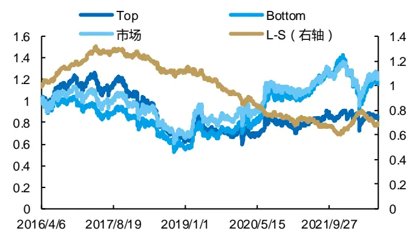
来源：Wind，上交所，深交所，国金证券研究所

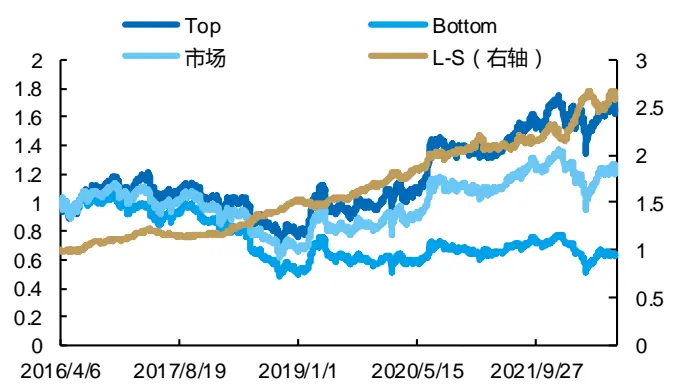
来源：Wind，上交所，深交所，国金证券研究所

接下来我们也对低价格区间成交量占比因子转换后的结果进行分析。分段线性近似转换前后低价格区间成交量占比因子的 IC 统计如下表所示。转换后的低价格区间成交量占比因子的 IC 同样没有明显改善，其中，30%价格区间因子的IC 为 1.66%，ICIR 为 0.22。

图表9：分段线性近似转换前后低价格区间成交量占比因子的IC统计

| IC均值 |  |  |  |
| --- | --- | --- | --- |
| 因子 价格区间 ICIR | 转换前 t统计量 | IC均值 | 转换后 ICIR |

| 低价格区间成交量因子 | 10% | 1.85% | 0.22 | 8.86 | 0.96% | 0.13 | 5.22 |
| --- | --- | --- | --- | --- | --- | --- | --- |
| 低价格区间成交量因子 | 20% | 2.28% | 0.27 | 10.65 | 1.35% | 0.18 | 7.06 |
| 低价格区间成交量因子 | 30% | 2.63% | 0.3 | 11.81 | 1.66% | 0.22 | 8.5 |

来源：Wind，上交所，深交所，国金证券研究所

从转换后低价格区间成交量占比因子（20%）的分位数组合表现可以看出，经过线性转换，Top 组合至 Bottom 组合的年化超额收益率也呈现出明显的单调递减的趋势，Top 组合至 Bottom 组合的差异也同样非常明显。

图表10：分段线性近似转换前（左）后（右）低价格区间成交量占比因子（20%）分位数组合表现
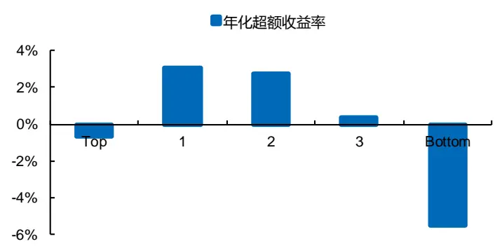
来源：Wind，上交所，深交所，国金证券研究所

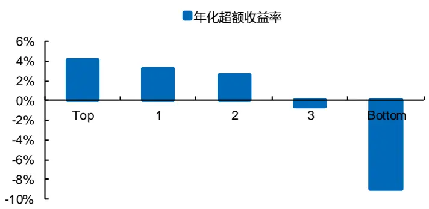
来源：Wind，上交所，深交所，国金证券研究所

从下表可以看出，经过分段线性近似方法转换，低价格区间成交量占比因子的多空组合表现整体也大幅改善，年化收益率基本都在 10%以上，夏普比率也整体有大幅提升。

值得一提的是，对于低价格区间成交量占比因子（20%），其多空净值在 2019 年 8 月之前平稳上升，但在 2019 年8月份之后，因子出现失效，多空净值下行。对于这类因子，经过分段线性近似的方法进行转换，因子失效的问题得到了明显改善，多空净值在 2019 年 8 月之前保持有效性，同时在之后净值继续平稳上升。这说明，这类方法不仅可以对此前不单调的因子进行线性转换，同时也可以动态对部分时间段失效的因子进行纠正，使因子的有效性更加持续。从指标上来看，低价格区间成交量占比因子（20%）的多空年化收益率从转换前的 4.78%提升至 13.96%。

图表11：分段线性近似转换前后低价格区间成交量占比因子的多空组合表现

| 因子 | 价格区间 | 转换前 |  | 转换后 |  |
| --- | --- | --- | --- | --- | --- |
|  |  | 年化收益率 | 夏普比率 | 年化收益率 | 夏普比率 |
| 低价格区间成交笔数因子 | 10% | 0.97% | 0.11 | 11.46% | 1.61 |
| 低价格区间成交笔数因子 | 20% | 4.78% | 0.56 | 13.96% | 1.92 |
| 低价格区间成交笔数因子 | 30% | 10.09% | 1.14 | 14.57% | 1.97 |

来源：Wind，上交所，深交所，国金证券研究所

图表12：分段线性近似转换前（左）后（右）低价格区间成交量占比因子（20%）的分位数组合净值
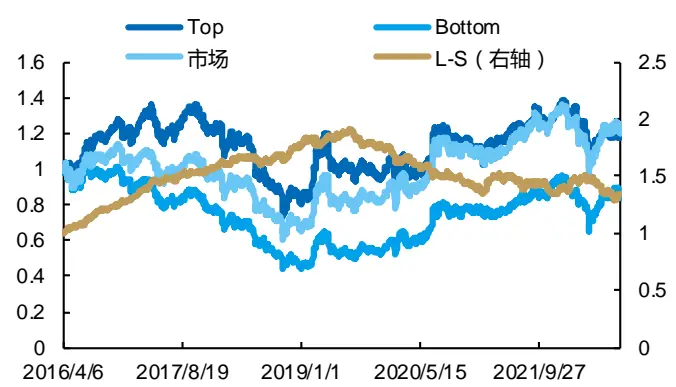
来源：Wind，上交所，深交所，国金证券研究所

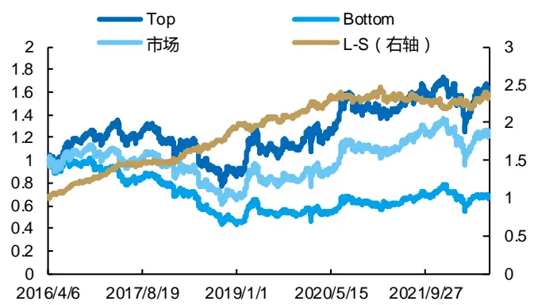
来源：Wind，上交所，深交所，国金证券研究所

## 2.1.3 不同参数对转换效果的影响

我们构建的分段线性近似方法，包含了两个参数，一个是分组个数 M，一个是回溯交易日数 N。上文我们主要按照因子分 5 组，根据过去 60 个交易日的收益情况进行回测。为了探讨参数对于结果的影响，我们尝试使用回溯过去 20、60 或 120 个交易日，同时分 5 组或 10 组的情况下，研究该转换方法的结果差别。

图表13：不同回溯交易日数N对转换后因子表现的影响(M取5组)

| 回溯交易日数N | L-S 平均年化收益率 |  | 因子平均 IC |  |
| --- | --- | --- | --- | --- |
|  | 转换前 | 转换后 | 转换前 | 转换后 |
| 20 日 | 13.93% | 14.81% | 2.16% | 1.26% |
| 60日 | 13.60% | 16.76% | 2.15% | 1.53% |
| 120日 | 12.70% | 18.78% | 2.10% | 1.79% |

来源：Wind，上交所，深交所，国金证券研究所

注：不同参数转换前的差别原因为回溯时间不同导致回测起始时间有差异。

上表统计了不同回溯交易日数 N下价格区间因子转换前后的多空组合年化收益率和 IC 的均值对比。可以看出，参数下，多空组合的收益和 IC 有一定的差异，但是差别不是很大，相对来说回溯过去 120 个交易日，其转换后因子的表现会更好。这主要是因为较长时间段的回溯期有助于降低局部噪声带来的波动，可以得到相对更加平稳的预期收益率分布。

此外，分组个数 M也是一个重要的因素，下表展示了不同分组个数下转换后因子的多空年化收益率均值和IC 均值对比。可以看出，不同分组个数下，转换后的多空年化收益率均有较大比例的提高，其中 10 组的情况下，多空年化收益率的提升比率超过 70%。这是因为，分组越多可以更好的区分股票并衡量不同股票间的差异，因子转换效果会提升。但分组过多会引入更多的随机性，不适用于插值方法，需要后续通过回归的方法来构建模型。

图表14：不同分组个数M对转换后因子表现的影响(N取120交易日）

|  | L-S 平均年化收益率 |  | 因子平均 IC |  |
| --- | --- | --- | --- | --- |
| 分组个数M | 转换前 | 转换后 | 转换前 | 转换后 |
| 5组 | 12.70% | 18.78% | 2.10% | 1.79% |
| 10 组 | 14.60% | 24.90% | 2.10% | 1.75% |

来源：Wind，上交所，深交所，国金证券研究所

注：不同分位数组合个数 M下多空组合平均年化收益率的差异在于测试因子时分组按照转换因子分位数组合个数 M来分组。

上述研究中也看到，两个参数对结果的影响并不大，后续我们也不倾向于做过多的参数优化。接下来，我们对全部三大类 18 个因子进行线性转换，研究其转换后的有效性。这些因子中，不仅包括了原始不单调的因子，也包括了原始单调性较好的因子。在 M取 10 组以及 N取 120日的参数下，转换后因子 IC均值的平均值为 1.75%，多空组合年化收益率的平均值达到 24.90%，相比转换前提升了 10.30%。值得一提的是，对于转换前单调的因子（例如高价格区间成交笔数因子），在转换后多空组合年化收益率至少可以维持之前的水平，甚至大幅提升。对于转换前不单调的因子（例如低价格区间成交笔数因子），转换后其多空组合年化收益率大幅改善，部分因子多空收益由负转正。

图表15：价格区间占比因子在分段线性近似转换前后的因子统计特征（M取10组，N取120日）

| 因子 | 价格区间 | 转换前是否单调 | L-S 年化收益率 |  | IC 均值（绝对值） |  |
| --- | --- | --- | --- | --- | --- | --- |
|  |  |  | 转换前 | 转换后 | 转换前 | 转换后 |
| 高价格区间成交笔数因子 | 70% | 是 | 9.19% | 25.16% | 1.78% | 1.92% |
|  | 80% | 是 | 9.54% | 22.88% | 1.93% | 1.95% |
|  | 90% | 是 | 7.68% | 23.64% | 2.12% | 1.85% |
| 低价格区间成交笔数因子 | 10% | 否 | -8.96% | 19.30% | 1.09% | 0.78% |
|  | 20% | 否 | -1.93% | 22.13% | 1.61% | 1.27% |
|  | 30% | 否 | 6.11% | 24.84% | 2.07% | 1.58% |
| 高价格区间成交量因子 | 70% | 是 | 25.67% | 31.70% | 2.58% | 2.25% |
|  | 80% | 是 | 24.44% | 27.71% | 2.64% | 2.22% |
|  | 90% | 是 | 19.48% | 25.54% | 2.67% | 2.12% |
| 低价格区间成交量因子 | 10% | 否 | -2.46% | 13.81% | 1.82% | 0.90% |
|  | 20% | 否 | 2.08% | 18.03% | 2.24% | 1.53% |
|  | 30% | 否 | 7.93% | 22.66% | 2.58% | 1.91% |
| 高价格区间平均每笔成交量 | 70% | 是 | 38.59% | 31.51% | 2.28% | 1.82% |
|  | 80% | 是 | 34.76% | 32.34% | 2.13% | 1.79% |
|  | 90% | 是 | 29.45% | 23.68% | 1.86% | 1.45% |
| 低价格区间平均每笔成交量 | 10% | 是 | 22.70% | 24.63% | 2.22% | 2.05% |
|  | 20% | 是 | 20.17% | 27.21% | 2.13% | 2.04% |
|  | 30% | 是 | 18.37% | 31.39% | 1.98% | 2.00% |
| 平均值 |  |  | 14.60% | 24.90% | 2.10% | 1.75% |

来源：Wind，上交所，深交所，国金证券研究所

## 2.2 线性插值方法

前文中，分段线性近似方法可以有效地将不单调的因子进行线性转换，但该方法未能将全部分组的数据用于建模，为了提高数据的利用率，我们考虑第二种转换方法——线性插值。该方法利用所有分组数据点，在数据点之间分别进行线性插值，从而弥补分段线性近似的不足。

## 2.2.1 线性插值的原理

根据上文中对分段线性近似方法参数的分析，后续我们将不再做参数上的优化，避免过拟合，基本选用分 10 组，回溯过去 120 个交易日来构建模型。

在使用线性插值方法进行转换时，每个交易日，按照因子值从高到低，等分等权构建 M个组合，并根据各个组合在过去 N个交易日的年化超额收益率，依次从第 1 个组合开始，将第 i 个组合与第 i+1 个组合的因子值百分位数的中位数与两个分组的超额收益率进行线性插值，这里假设第 i 个组合中股票因子值的百分位数的中位数对应了该分组的平均超额收益率。对于 M个分位数组合的情况，会得到 M-1 个分段的线性插值函数。

对于 M取 10 组的情况，由下图示意图可以做较好的展示。该方法充分利用了非线性关系的 10 个数据点，同时假设两两分区间内股票收益随因子的排序数值线性变化。值得一提的是，与分段线性拟合类似，分组数量过多可能引入更多的随机性，并造成模型过拟合。

图表16：线性插值方法示意图（M取10组）
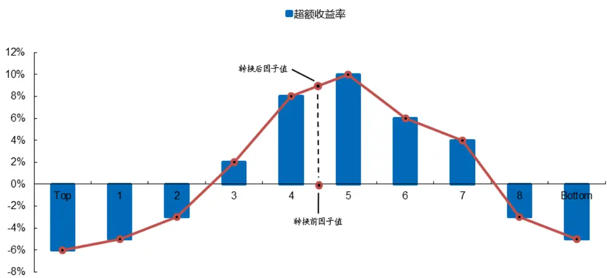
来源：国金证券研究所

得到每个分段的线性关系后，可以把原始因子值根据其截面上百分位数转换为对超额收益率的预测值，从而完成线性转换，两端区间外的数据将根据对应函数进行外延。可以看出，该方法使用到了 M个组合的收益率信息，相比分段线性近似，其对不同分组收益率的刻画更加精细，损失的信息相对较少。

## 2.2.2 线性插值转换效果探索

为了评估线性插值方法的效果，我们将全部三大类 18 个价格区间占比因子转换后进行测试。全部因子在转换后的 IC均值和多空组合年化收益率如下表所示。对于非线性特征明显的低价格区间成交笔数与低价格区间成交量占比因子，转换后多空组合的表现明显改善，甚至扭亏为盈。转换后的 18 个高频因子 IC 均值的平均水平为 1.71%，多空组合年化收益率的平均值达到 25.97%，与转换前相比提升了 11.37%。线性插值方法在提高多空组合的收益方面略优于分段线性近似方法。

图表17：价格区间占比因子在线性插值转换前后的的因子统计特征（M取10组，N取120日）

| 因子 | 价格区间 | 转换前是否线性 | L-S 年化收益率 |  | IC 均值（绝对值） |  |
| --- | --- | --- | --- | --- | --- | --- |
|  |  |  | 转换前 | 转换后 | 转换前 | 转换后 |
| 高价格区间成交笔数因子 | 70% | 是 | 9.19% | 24.94% | 1.78% | 1.77% |
|  | 80% | 是 | 9.54% | 23.13% | 1.93% | 1.81% |
|  | 90% | 是 | 7.68% | 25.31% | 2.12% | 1.86% |
| 低价格区间成交笔数因子 | 10% | 否 | -8.96% | 18.31% | 1.09% | 0.84% |
|  | 20% | 否 | -1.93% | 23.42% | 1.61% | 1.21% |
|  | 30% | 否 | 6.11% | 29.39% | 2.07% | 1.66% |
| 高价格区间成交量因子 | 70% | 是 | 25.67% | 31.31% | 2.58% | 2.20% |
|  | 80% | 是 | 24.44% | 27.88% | 2.64% | 2.13% |
|  | 90% | 是 | 19.48% | 25.93% | 2.67% | 2.04% |
| 低价格区间成交量因子 | 10% | 否 | -2.46% | 14.08% | 1.82% | 0.98% |
|  | 20% | 否 | 2.08% | 18.37% | 2.24% | 1.43% |
|  | 30% | 否 | 7.93% | 22.73% | 2.58% | 1.83% |
| 高价格区间平均每笔成交量 | 70% | 是 | 38.59% | 34.01% | 2.28% | 1.86% |
|  | 80% | 是 | 34.76% | 31.22% | 2.13% | 1.66% |
|  | 90% | 是 | 29.45% | 27.34% | 1.86% | 1.50% |
| 低价格区间平均每笔成交量 | 10% | 是 | 22.70% | 27.60% | 2.22% | 2.01% |
|  | 20% | 是 | 20.17% | 29.40% | 2.13% | 2.02% |
|  | 30% | 是 | 18.37% | 33.06% | 1.98% | 1.93% |
| 平均值 |  |  | 14.60% | 25.97% | 2.10% | 1.71% |

来源：Wind，上交所，深交所，国金证券研究所

## 2.3 多项式拟合方法

上述两种方法都是将股票进行分组（一般分组数不多于 10 组），通过不同分组的收益率构建线性插值，但这类方法无法对更加细节的股票收益率做刻画，局部收益率的信息损失较多。接下来介绍的两种方法将重点通过更加细化的股票分类，把握局部信息。将股票分组的组数大幅提高，可以引入更多局部信息，但分组提高后，不适用构建线性插值的方法，因此，我们将采用多项式拟合和分段线性回归的方法。

多项式拟合的方法可以很好的探究一些非线性的规律。从下图的分组股票收益的数据点可以看出，每个组的因子百分位数与股票超额收益率关系存在明显的非线性关系，除了线性回归外，二次回归通常只能拟合抛物线形状的非线性关系，而三次回归可以将局部高点和局部低点更好的拟合，因此，这里我们选择了三次多项式拟合的方法，即

$$
r_{i}=a+bx_{i}+c{x_{i}}^{2}+d{x_{i}}^{3}+\varepsilon_{i}
$$

其中， $r_{i}$ 为股票分组i的超额收益率， $x_{i}$ 为股票分组i的因子截面百分位数中位数，a b c d为通过最小二乘法拟合得到的多项式系数， $\varepsilon_{i}$ 为残差项。

## 2.3.1 多项式拟合的原理

在利用拟合的方法来涵盖更多的数据时，通常分组的个数比前两类方法更多。这里我们将股票池中的股票等分为M组，而 M取值远大于上述两种方法的 10 组。我们首先选取 M取100 组数据进行分组计算和拟合（即每组约为18 只股票），后续将探讨不同参数的敏感性。

每个交易日，按照因子值从高到低，等权构建 100 个分位数组合，然后根据各个分位数组合在过去 120 个交易日的超额收益，与每个分位数组合的因子值百分位数中位数构建多项式拟合。利用拟合得到的关系，将最新一期的因子值转换为超额收益率的预测值，从而完成线性化转换。

可以看出，多项式拟合的方法使用了 100 个分位数组合的数据，尽可能多地描绘出因子排序数值与股票超额收益率之间非线性关系的细节，把握了更多局部信息。值得一提的是，我们没有将每只股票的收益都作为单独的数据点，而是采用了一组股票的平均收益，这是考虑到单只股票收益数据存在较多噪声，通过分组取均值的方法可以做一些平滑，尽可能降低偶发因素。

图表18：多项式拟合方法示意图（M取100组）
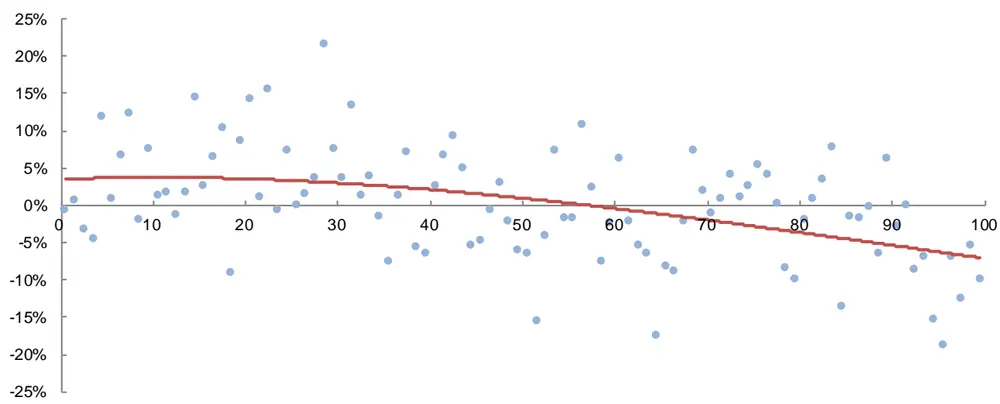
来源：国金证券研究所

## 2.3.2 多项式拟合转换效果探索

同样，为了评估多项式拟合转换方法的效果，我们将全部 18 个价格区间占比因子转换后进行因子 IC 测试和分位数组合测试，这里参数选取 M取 100 组和 N取 120个交易日，结果如下图所示。

图表19：价格区间占比因子在多项式拟合转换前后的因子统计特征（M取100组，N取120日）

| 因子 | 价格区间 | 转换前是否线性 | L-S年化收益率 |  | IC 均值（绝对值） |  |
| --- | --- | --- | --- | --- | --- | --- |
|  |  |  | 转换前 | 转换后 | 转换前 | 转换后 |
| 高价格区间成交笔数因子 | 70% | 是 | 9.19% | 19.56% | 1.78% | 1.45% |
|  | 80% | 是 | 9.54% | 21.24% | 1.93% | 1.51% |
|  | 90% | 是 | 7.68% | 21.33% | 2.12% | 1.55% |
| 低价格区间成交笔数因子 | 10% | 否 | -8.96% | 22.14% | 1.09% | 0.59% |
|  | 20% | 否 | -1.93% | 24.20% | 1.61% | 1.01% |
|  | 30% | 否 | 6.11% | 27.35% | 2.07% | 1.43% |
| 高价格区间成交量因子 | 70% | 是 | 25.67% | 24.79% | 2.58% | 1.77% |
|  | 80% | 是 | 24.44% | 24.10% | 2.64% | 1.78% |
|  | 90% | 是 | 19.48% | 25.39% | 2.67% | 1.76% |
| 低价格区间成交量因子 | 10% | 否 | -2.46% | 13.27% | 1.82% | 0.66% |
|  | 20% | 否 | 2.08% | 16.29% | 2.24% | 1.15% |
|  | 30% | 否 | 7.93% | 17.98% | 2.58% | 1.52% |
| 高价格区间平均每笔成交量 | 70% | 是 | 38.59% | 36.21% | 2.28% | 1.92% |
|  | 80% | 是 | 34.76% | 30.30% | 2.13% | 1.68% |
|  | 90% | 是 | 29.45% | 27.78% | 1.86% | 1.46% |
| 低价格区间平均每笔成交量 | 10% | 是 | 22.70% | 28.15% | 2.22% | 2.16% |
|  |  |  | 转换前 | 转换后 | 转换前 | 转换后 |
|  | 20% | 是 | 20.17% | 29.45% | 2.13% | 2.09% |
|  | 30% | 是 | 18.37% | 29.05% | 1.98% | 1.98% |
| 平均值 |  |  | 14.60% | 24.37% | 2.10% | 1.53% |

来源：Wind，上交所，深交所，国金证券研究所

对于单调性较差的低价格区间成交笔数与成交量占比因子，转换后多空组合的收益明显改善。转换后的 18 个高频因子 IC 均值的平均水平为 1.53%，多空组合年化收益率的平均值为 24.37%，与转换前相比提升了 9.77%。整体转换效果略逊于前两种方法。

## 2.4 分段线性回归方法

在将分组数量提高到 100 个数据点后，可以分段进行线性回归。这里我们借鉴分段线性近似的方法，主要考虑边界点、极大值和极小值点，把因子值区间分成若干段，但为了更好的包括局部信息，我们采用线性回归的方法代替线性插值。

## 2.4.1 分段线性回归的原理

在每个交易日，按照因子值从高到低的排序，等分等权构建 M个组合，进一步根据各个组合在过去 N个交易日的超额收益率，得到截面上 M个数据点。找到其中的极大值点和极小值点，以它们为界划分出 3 个子区间，在子区间内分别对数据点进行线性回归。基于得到的多段线性关系，通过股票因子值的百分位数，计算出各股票在其上的拟合值，即预期的股票超额收益率，完成线性转换。该方法的问题是过分依赖于极大值点和极小值点的划分，容易受极端值影响。

图表20：分段线性回归方法示意图（M取100组）
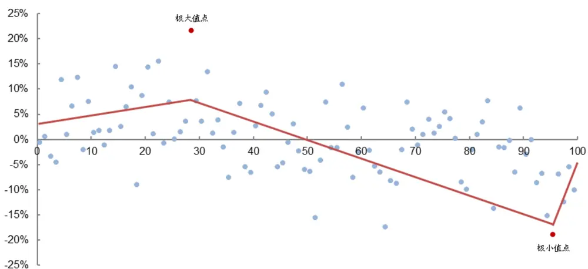
来源：国金证券研究所

## 2.4.2 分段线性回归转换效果探索

为了评估分段线性回归方法的效果，我们将全部 18 个高频价格区间占比因子进行线性转换，并进行因子 IC 测试和分位数组合测试，转换时仍然选用 M取 10 组和 N取 120日。

全部因子转换后的 IC 均值和多空组合年化收益情况如下表所示。转换后的 18 个高频因子 IC 均值的平均值为 1.76%，多空组合年化收益率的平均值达到 25.15%，与转换前相比提升了 10.55%。

图表21：价格区间占比因子在分段线性回归转换前后的因子统计特征（M取100组，N取120日）

| 因子 | 价格区间 | 转换前是否线性 | L-S 年化收益率 |  | IC 均值（绝对值） |  |
| --- | --- | --- | --- | --- | --- | --- |
|  |  |  | 转换前 | 转换后 | 转换前 | 转换后 |
| 高价格区间成交笔数因子 | 70% | 是 | 9.19% | 26.41% | 1.78% | 1.85% |
|  | 80% | 是 | 9.54% | 20.66% | 1.93% | 1.75% |
|  | 90% | 是 | 7.68% | 26.38% | 2.12% | 2.04% |
| 低价格区间成交笔数因子 | 10% | 否 | -8.96% | 20.01% | 1.09% | 0.75% |
|  | 20% | 否 | -1.93% | 21.27% | 1.61% | 1.37% |
|  | 30% | 否 | 6.11% | 24.41% | 2.07% | 1.75% |
| 高价格区间成交量因子 | 70% | 是 | 25.67% | 30.32% | 2.58% | 2.28% |
|  | 80% | 是 | 24.44% | 25.42% | 2.64% | 2.02% |
|  | 90% | 是 | 19.48% | 26.13% | 2.67% | 2.20% |
| 低价格区间成交量因子 | 10% | 否 | -2.46% | 12.37% | 1.82% | 0.96% |
|  | 20% | 否 | 2.08% | 23.60% | 2.24% | 1.66% |
|  | 30% | 否 | 7.93% | 20.55% | 2.58% | 1.93% |
| 高价格区间平均每笔成交量 | 70% | 是 | 38.59% | 35.39% | 2.28% | 1.98% |
|  | 80% | 是 | 34.76% | 29.93% | 2.13% | 1.67% |
|  | 90% | 是 | 29.45% | 24.57% | 1.86% | 1.40% |
| 低价格区间平均每笔成交量 | 10% | 是 | 22.70% | 25.50% | 2.22% | 2.06% |
|  | 20% | 是 | 20.17% | 30.05% | 2.13% | 2.05% |
|  | 30% | 是 | 18.37% | 29.73% | 1.98% | 2.02% |
| 平均值 |  |  | 14.60% | 25.15% | 2.10% | 1.76% |

来源：Wind，上交所，深交所，国金证券研究所

## 2.5 最优转换方法的选取与因子降频方法

## 2.5.1 四种方法转换效果对比

至此，我们已经对分段线性近似、线性插值、多项式拟合和分段线性回归等四种方法进行线性转换的原理进行了研究，并测试了不同方法对高频价格区间占比因子进行线性化的效果。为了综合考虑四种方法在该类因子上的适用性，我们对这四种方法的转换效果进行横向对比，如下表所示。

在插值类方法中，线性插值优于分段线性近似，而在拟合类方法中，分段线性回归优于多项式拟合。考虑到分段线性回归方法集合了另外三种转换方法的优点，而且使用该方法转换后，价格区间占比因子的 IC 水平和多空组合的年化收益率均值相对较高。因此，对于这类价格区间占比因子而言，最佳的转换方法是分段线性回归。

图表22：四种转换方法转换后因子IC和多空组合年化收益率

| 转换方法 | L-S 年化收益率均值 | 较转换前均值提升 | 因子IC均值 |
| --- | --- | --- | --- |
| 分段线性近似 | 24.90% | 10.30% | 1.75% |
| 线性插值 | 25.97% | 11.37% | 1.71% |
| 多项式拟合 | 24.37% | 9.77% | 1.53% |
| 分段线性回归 | 25.15% | 10.55% | 1.76% |

来源：Wind，上交所，深交所，国金证券研究所

## 2.5.2 分段线性回归的参数敏感性分析

分段线性回归中存在一个重要的参数，即分组个数 M（或每组包含的股票个数），目前设置为 100（即每组包括 18 只股票）。为了提高适用性，我们以每组包括的股票数进行展示。我们研究了每组包含的股票个数分别为 5、12、18、25、36、50、100、180 时转换后因子的表现。

我们计算了不同分组个数下（展示为每组包括的股票数），全部 18 个价格区间占比因子转换后的 IC 均值的平均值和多空组合年化收益率均值，如下图所示。可以看出，虽然每组股票数在较大范围内变动，但转换后因子的表现始终变化不大，这说明分段线性回归方法对这一参数并不敏感。因此，我们还是选取了此前的 M取 100 组，即每组包括 18只股票的方案。

图表23：分段线性回归的参数敏感性分析
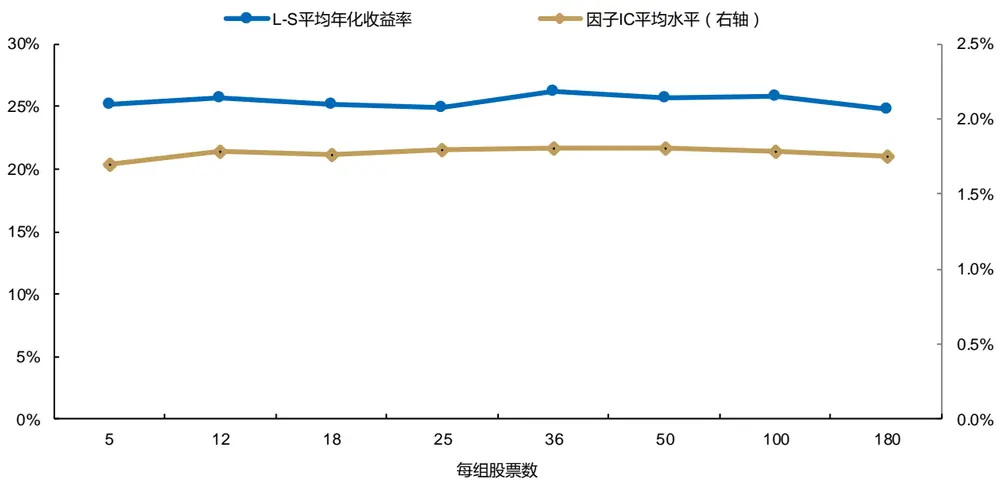
来源：Wind，上交所，深交所，国金证券研究所

## 2.5.3 日频因子降频方法

日频换仓往往伴随着高换手带来的高交易成本，因此单一日频因子的多头收益不足以覆盖交易成本。同时，为了满足大部分机构的交易限制和换手率等要求，我们对日频因子进行降频，使因子的预测周期更长。一种比较常用的方法是采用加权移动平均方法，回溯过去一周的因子数据进行计算。在这种方法的加权下，距离调仓日越近，因子值的权重越大。计算公式如下所示

$$
{S_{ma}}=\frac{\sum_{t=1}^{T}{S_{t}}*k^{T-t+1}}{\sum_{t=1}^{T}{k^{T-t+1}}}
$$

其中， $S_{t}$ 表示过去一周第 t日转换后的因子值，k为加权参数。（这里 T=5，k=0.8）

当然，我们也可以直接选取调仓日上一交易日的因子值预测未来一周的收益，我们后面会将这两种方法进行对比。我们首先将全部 18 个因子进行分段线性回归转换，然后根据上述方法进行降频处理，然后对因子的周频预测能力进行检验，股票池同样选取中证 1000 和中证 800 股票池，回测时间范围为 2016 年 7 月至 2022 年 8 月，分位数组合测试分 10 组，换仓频率为周频，换仓时间点为周初，交易价格为开盘价。

我们对比了加权移动平均法和直接采取最近交易日因子值的效果，如下表所示。我们发现两种方法差异也不大，这说明距离调仓日最近的一个交易日的数据的确起到关键作用。5 日加权移动平均降频得到的因子在 IC 和多空组合收益上略有优势，IC 均值的平均值达到 2.18%，ICIR 均值为 0.29，多空组合年化收益率均值达到 14.94%。

图表24：价格区间占比因子转换后周频统计特征

| 处理方式 | IC | ICIR | L-S 年化收益率 | L-S 夏普比率 |
| --- | --- | --- | --- | --- |
| 不处理 | 1.71% | 0.29 | 13.93% | 1.80 |
| 加权移动平均（5） | 2.18% | 0.29 | 14.94% | 1.57 |

来源：Wind，上交所，深交所，国金证券研究所

## 三、基于高频线性重构因子的中证1000 指数增强策略

## 3.1 合成高频线性重构因子

## 3.1.1 线性化后因子的相关性分析

我们最终采用分段线性回归的方法对全部价格区间占比因子进行转换，然后将转换后的因子构建合成因子，即高频线性重构因子。首先将转换后的全部 18 个因子按照其类型分为 6 组，每组内的 3 个因子只是价格区间的分位数不同，彼此之间的相关性非常强。因此，可以先将各组内的 3 个因子进行标准化处理后等权合成，形成 6 个大类因子，分别记作高价格区间成交笔数占比因子（MIH）、低价格区间成交笔数占比因子（MIL）、高价格区间成交量占比因子（VH）、低价格区间成交量占比因子（VL）、高价格区间平均每笔成交量因子（VPMH）以及低价格区间平均每笔成交量因子（VPML）。

接下来，对 6 个大类因子进行相关性分析。我们发现，高价格区间成交笔数占比因子与成交量占比因子之间的相关性非常高，低价格区间成交笔数占比因子与成交量占比因子之间的相关性较高，高、低价格区间平均每笔成交量因子之间的相关性也较高。考虑到这 6 个大类因子都属于价格区间占比同一类型，我们还是将他们等权合成，得到最终的高频线性重构因子，同时我们也做了行业和市值的正交化处理。

图表25：转换后大类因子的相关系数（日频）

| 因子 | MIH | MIL | VH | VL | VPMH | VPML |
| --- | --- | --- | --- | --- | --- | --- |
| MIH | 1.00 |  |  |  |  |  |
| MIL | 0.12 | 1.00 |  |  |  |  |
| VH | 0.69 | 0.12 | 1.00 |  |  |  |
| VL | 0.14 | 0.58 | 0.16 | 1.00 |  |  |
| VPMH | 0.05 | 0.02 | 0.25 | 0.12 | 1.00 |  |
| VPML | 0.06 | 0.04 | 0.21 | 0.15 | 0.32 | 1.00 |

来源：Wind，上交所，深交所，国金证券研究所

## 3.1.2 高频线性重构因子日频有效性

我们首先将转换后的日频因子构建合成因子进行测试，结果显示，高频线性重构因子的IC均值为3.12%，ICIR为0.37。高频线性重构因子多空组合的年化收益率达到了 52.88%，夏普比率为 4.95，多空净值的最大回撤为 16.95%。市值行业正交化后的因子表现更为亮眼，IC 均值为 3.13%，ICIR 为 0.51，多空组合年化收益率达到 62.57%，夏普比率达到7.67，多空净值的最大回撤仅为 8.36%。

图表26：高频线性重构因子日频IC统计和多空组合表现

| 因子 | IC 均值 | ICIR | L-S 年化收益率 | L-S 夏普比率 | L-S 最大回撤 |
| --- | --- | --- | --- | --- | --- |
| 高频线性重构因子 | 3.12% | 0.37 | 52.88% | 4.95 | 16.95% |
| 高频线性重构因子（正交化） | 3.13% | 0.51 | 62.57% | 7.67 | 8.36% |

来源：Wind，上交所，深交所，国金证券研究所

从高频线性重构因子的分位数组合表现可以看出，从 Top 组合至 Bottom 组合，年化收益率明显呈现单调递减的趋势，Top 组合至 Bottom 组合的差异非常明显，Top 组合收益与 Bottom 组合的收益较为对称。

图表27：高频线性重构因子日频分位数组合年化超额收益率
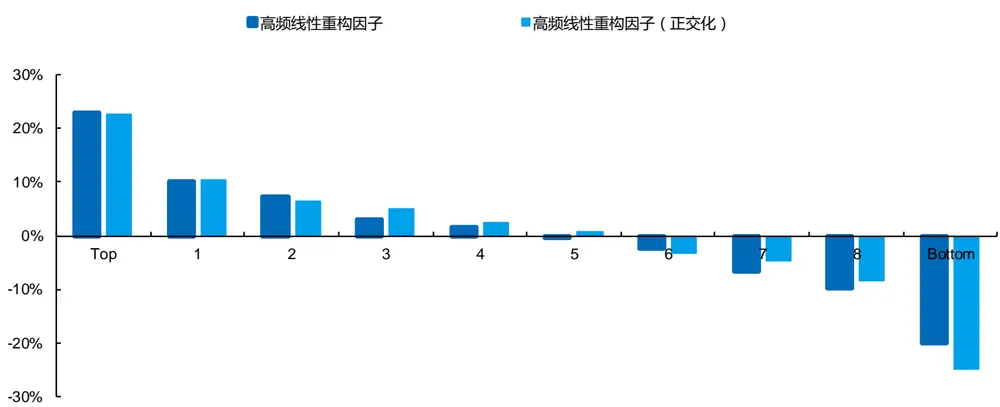
来源：Wind，上交所，深交所，国金证券研究所

图表28：高频线性重构因子日频多空组合净值
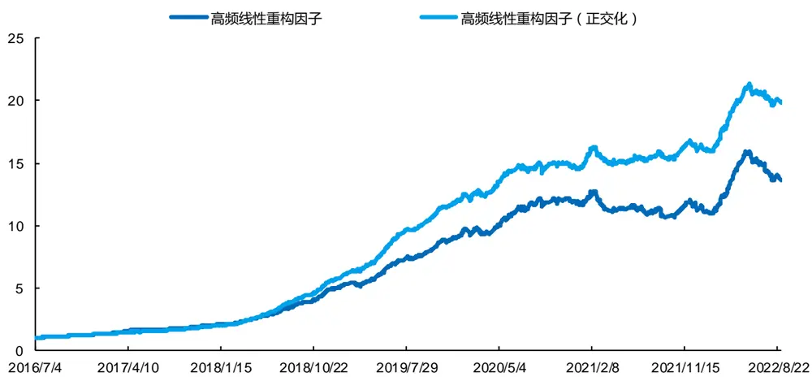
来源：Wind，上交所，深交所，国金证券研究所

对于高频线性重构因子，以及进行行业市值正交化得到的因子，在中证 1000 和中证 800 成分股中，多空组合的净值均基本呈现稳步增加趋势，但在去年 6 月开始因子收益有所下降。

## 3.1.3 降频后高频线性重构因子的构建与有效性

对于周频因子，我们首先对原始因子进行线性转换，然后采用加权平均的方法降频处理，最后通过上述方法合成并进行正交化处理。从结果可以看出，周频线性重构因子的 IC 均值为 3.81%，ICIR 为 0.37。周频线性重构因子多空组合的年化收益率为 27.51%，夏普比率为 2.16。正交化后的周频因子表现更佳，ICIR 达到 0.52，多空组合的年化收益率为 28.39%，夏普比率为 2.89，多空净值的最大回撤为 18.52%。

图表29：高频线性重构因子周频IC统计和多空组合表现

| 因子 | IC 均值 | ICIR | L-S 年化收益率 | L-S 夏普比率 | L-S 最大回撤 |
| --- | --- | --- | --- | --- | --- |
| 高频线性重构因子 | 3.81% | 0.37 | 27.51% | 2.16 | 26.58% |
| 高频线性重构因子（正交化） | 3.81% | 0.52 | 28.39% | 2.89 | 18.52% |

来源：Wind，上交所，深交所，国金证券研究所

图表30：高频线性重构因子周频分位数组合年化超额收益率
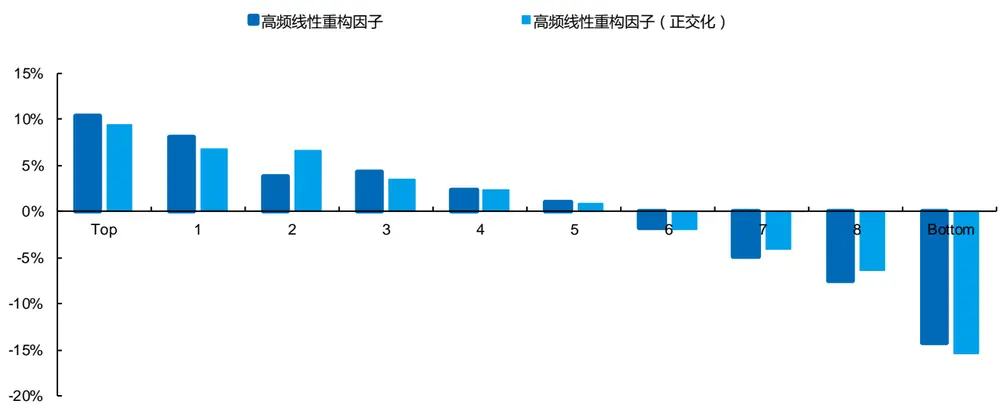
来源：Wind，上交所，深交所，国金证券研究所

周频线性重构因子的分位数组合表现如上图所示，从 Top 组合至 Bottom 组合，年化超额收益率明显呈现单调递减的趋势，但与日频因子对比，其多头收益略低于空头，也符合很多量价因子的特点。同时，周频因子的净值波动相对更大，在 2021 年 2 月之后，多空净值出现一定的回撤。

图表31：高频线性重构因子周频多空组合净值
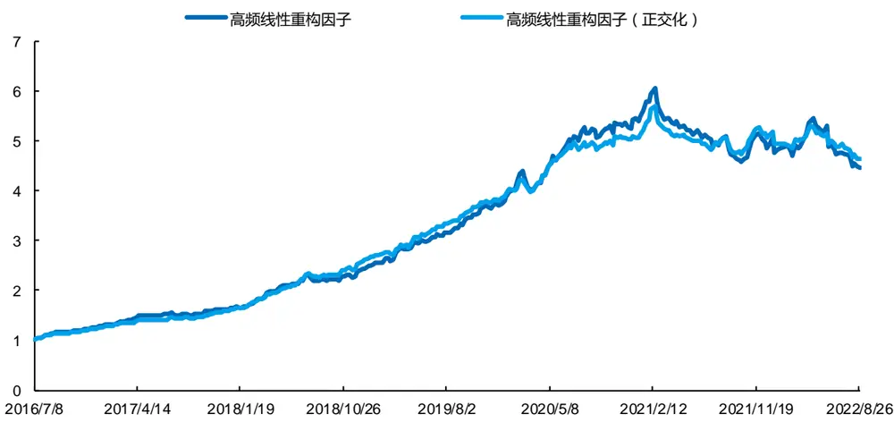
来源：Wind，上交所，深交所，国金证券研究所

## 3.2 基于高频线性重构因子的中证 1000 指数增强策略

从上文因子的结果可以看出，正交化后的高频线性重构因子具有显著预测能力。考虑到大部分投资机构的交易限制和换手率的要求，我们利用周频因子在 1000 成分股内选股构建指数增强策略。我们将正交化后的周频线性重构因子（VMRFactorWAdjCI）。

策略以中证 1000 指数作为基准，周频调仓，周初以开盘价成交，回测时间为 2016 年 7 月至 2022 年 8 月，选取因子取值前 5%的股票等权构建组合，交易费率为单边千分之二。考虑到高手续费带来的影响，我们增加了换手率控制措施。

图表32：高频线性重构中证1000指数增强策略表现
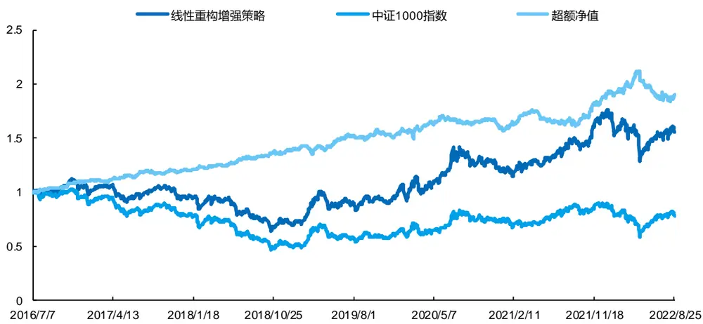
来源：Wind，上交所，深交所，国金证券研究所

从上图的净值表现可以看出，基于高频线性重构因子的中证 1000 指数增强策略相比基准有明显的优势。超额净值整体呈稳步增加趋势，但在 2022 年 4 月中旬后稍有下降。

整个回测时间段，增强策略的年化收益率为 7.53%，相比基准的年化超额收益率为 11.03%。策略的夏普比率为 0.35，信息比率为 1.47。通过换手率的控制，周度双边换手率仅为 28.41%。

图表33：高频线性重构中证1000指数增强策略指标

| 指标 | 线性重构增强策略 | 中证 1000 指数 |
| --- | --- | --- |
| 年化收益率 | 7.53% | -3.85% |
| 年化波动率 | 21.54% | 22.63% |
| 夏普比率 | 0.35 | -0.17 |
| 最大回撤 | 43.10% | 55.11% |
| 年化超额收益率 | 11.03% |  |
| 跟踪误差 | 7.52% |  |
| 信息比率 | 1.47 | 一 |
| 超额最大回撤 | 13.05% | 一 |
| 双边换手率（周度） | 28.41% | 一 |

来源：Wind，上交所，深交所，国金证券研究所

我们还统计了策略分年度的收益表现，如下图所示，在所有年份中，增强策略均超越基准取得了正超额收益。其中，2018 年、2019 年和 2021 年的超额收益率分别达到了 15.37%、11.51%和 20.08%。

图表34：高频线性重构中证1000指数增强策略分年度收益率
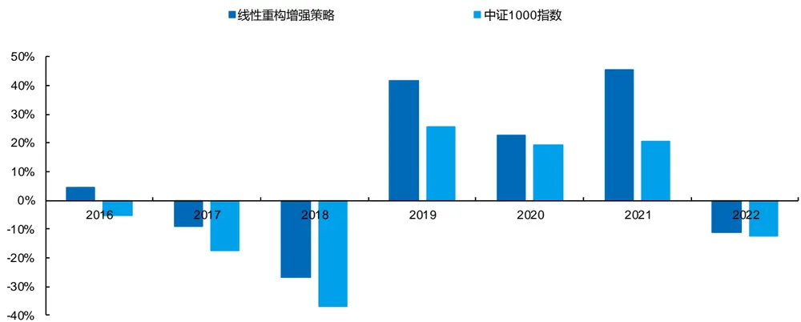
来源：Wind，上交所，深交所，国金证券研究所

## 3.3 结合传统因子的中证 1000 指数增强策略

由于单一类型的因子波动性较大，接下来，我们考虑将周频线性重构因子与传统因子以及周频量价背离因子结合到一起，构建中证 1000 指数增强策略，以提高策略的稳定性和收益。

我们首先分析了周频线性重构因子与传统因子以及周频量价背离因子的相关性。如下图所示，周频线性重构因子与传统因子的相关性整体不高，其与周频量价背离因子（CorrFactorWAdjCI）的相关系数最高，但也仅为 0.25。因此，周频线性重构因子确实可以提供额外的信息。

图表35：周频线性重构因子与其他类型因子的相关系数
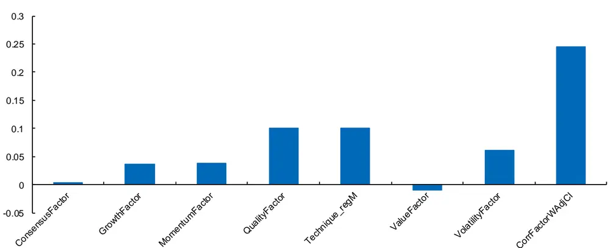
来源：Wind，上交所，深交所，国金证券研究所

在构建策略前，我们在中证 1000 股票池范围内对各个类别的因子进行了 IC 测试和分位数组合测试。传统因子中，一致预期因子（ConsensusFactor）、成长因子（GrowthFactor）和技术因子（Technique_regM）对股票未来收益的预测能力相对较强，将它们等权合成为传统合成因子（CGT）。周频线性重构因子（VMRFactorWAdjCI）和周频量价背离因子（CorrFactorWAdjCI）的表现仅次于技术因子，好于一致预期因子和成长因子。

我们将一致预期因子、成长因子、技术因子、周频量价背离因子以及周频线性重构因子以等权的方式合成为线性重构增强因子（CGTCVMR）。同时，为了对比分析周频线性重构因子带来的增量信息，我们将前面四个因子等权合成为量价背离增强因子（CGTC）。如下表所示，线性重构增强因子的 IC 均值达到 8.00%，多空组合的年化收益率达到 64.38%，夏普比率达到 5.35，相比单因子有了明显的提高。作为对照，量价背离增强因子的 IC 均值为 7.56%，多空组合年化收益率为 53.32%，夏普比率为 4.72。而传统合成因子的 IC 均值仅为 5.94%，多空组合年化收益率仅为 43.20%。

图表36：中证1000成分股中各因子IC和多空组合表现（周频）

| 因子 | IC 均值 | ICIR | L-S 年化收益率 | L-S 夏普比率 | L-S 最大回撤 |
| --- | --- | --- | --- | --- | --- |
| ConsensusFactor | 1.30% | 0.23 | 10.31% | 1.12 | 13.50% |
| GrowthFactor | 2.56% | 0.33 | 19.45% | 1.81 | 13.78% |
| Technique_regM | 7.20% | 0.91 | 44.94% | 4.03 | 7.04% |
| CorrFactorWAdjCl | 6.00% | 0.9 | 34.99% | 3.66 | 10.38% |
| VMRFactorWAdjCI | 4.35% | 0.56 | 33.00% | 3.09 | 14.38% |
| CGT | 5.94% | 0.79 | 43.20% | 3.69 | 14.91% |
| CGTC | 7.56% | 0.99 | 53.32% | 4.72 | 13.20% |
| CGTCVMR | 8.00% | 0.99 | 64.38% | 5.35 | 11.79% |

来源：Wind，上交所，深交所，国金证券研究所

从下图的多空组合净值表现可以看出，线性重构增强因子的多空净值稳步增加，远好于量价背离增强因子、传统合成因子和其他单因子。

图表37：中证1000成分股中各因子多空组合净值（周频）
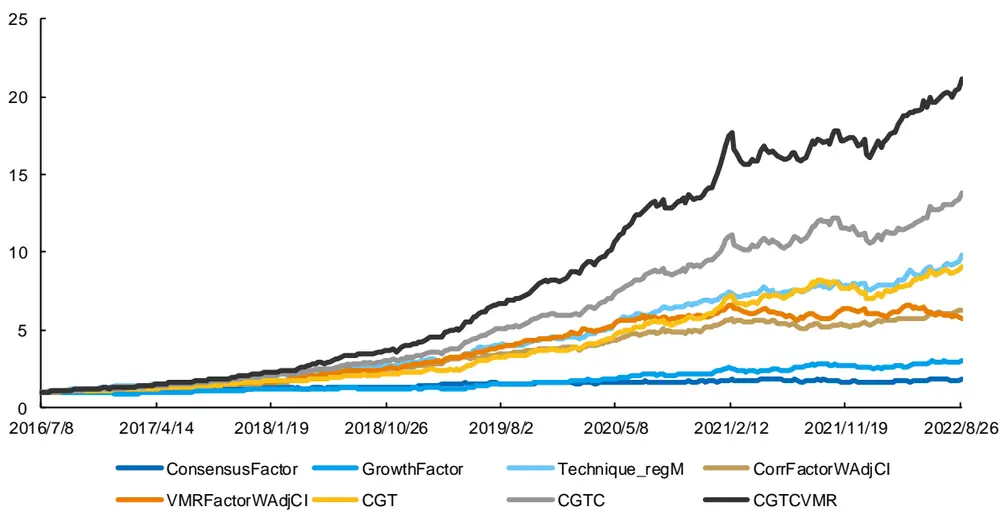
来源：Wind，上交所，深交所，国金证券研究所

最终，我们基于线性重构增强因子构建中证 1000 指数增强策略，周频调仓，周初以开盘价成交，回测时间为 2016 年7 月至 2022 年 8 月，选取因子取值前 5%的股票等权构建组合，交易费率为单边千分之二。我们同样增加了换手率控制措施。

从净值表现可以看出，基于线性重构增强因子的策略相比中证 1000 指数具有明显的优势，超额净值一直稳步增加，相比单一使用线性重构因子构建策略的超额净值更平稳。

图表38：线性重构增强策略表现
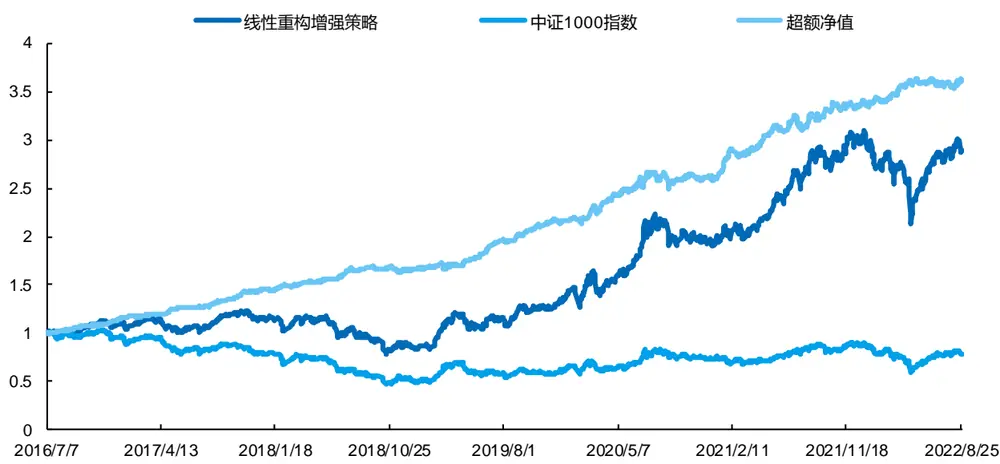
来源：Wind，上交所，深交所，国金证券研究所

整个回测时间段，基于线性重构增强因子的策略年化收益率达到 18.83%，相比中证 1000 指数的年化超额收益率高达23.24%。策略的夏普比率为 0.82，信息比率达到 3.41，换手率为周度双边 35.95%。

图表39：线性重构增强策略指标

| 指标 | 线性重构增强策略 | 中证 1000 指数 |
| --- | --- | --- |
| 年化收益率 | 18.83% | -3.85% |
| 年化波动率 | 22.94% | 22.63% |
| 夏普比率 | 0.82 | -0.17 |
| 最大回撤 | 36.18% | 55.11% |
| 年化超额收益率 | 23.24% |  |
| 跟踪误差 | 6.83% |  |
| 信息比率 | 3.41 |  |
| 超额最大回撤 | 6.58% | 一 |
| 双边换手率（周度） | 35.95% |  |

来源：Wind，上交所，深交所，国金证券研究所

我们进一步统计了策略分年度的收益表现，如下图所示，在所有年份，基于线性重构增强因子的策略均超越中证 1000指数取得了显著的正向超额收益。其中，2017 年、2019 年、2020 年和 2021 年的超额收益率分别达到了 26.65%、29.46%、21.03%和 30.48%。

图表40：线性重构增强策略分年度收益率
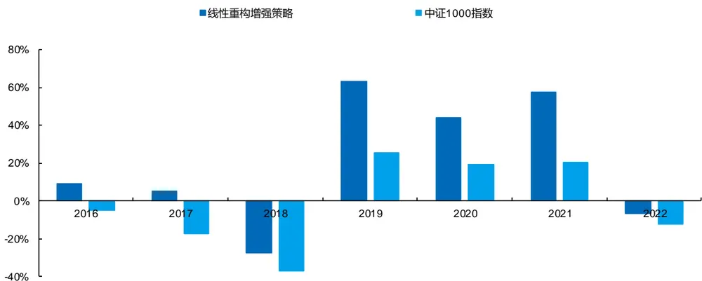
来源：Wind，上交所，深交所，国金证券研究所

## 四、总结

部分高频因子与股票预期收益之间常常并非是严格的线性关系，同时有的高频因子会出现阶段性失效。本篇报告对非线性因子进行线性化处理，同时对失效因子进行纠正，使其纳入线性多因子模型中。线性化的方法不仅可以对此前不单调的因子进行线性转换，同时也可以动态对部分时间段失效的因子进行纠正，使因子的有效性更加持续。我们对分段线性近似、线性插值、多项式拟合和分段线性回归等四种方法进行了线性转换的测试，转换后因子的多空组合年化收益率相比转换前分别提升 10.30%、11.37%、9.77%和 10.55%。

我们进一步将分段线性回归处理后的全部因子等权合成为高频线性重构因子，并对其进行行业市值正交化。日频测试中，正交化后的高频线性重构因子 IC 均值为 3.13%，ICIR 为 0.51，多空组合年化收益率达到了 62.57%，夏普比率达到了 7.67。为了满足大多数机构投资者的需要，我们降低因子预测频率到周频。行业市值正交化之后的周频线性重构因子 IC 均值达到 3.81%，ICIR 为 0.52，多空组合年化收益为 28.39%，夏普比率为 2.89。

正交化后的周频线性重构因子对股票未来收益具有显著的预测能力。我们基于这一因子构建中证1000指数增强策略，周频调仓，策略实现了 7.53%的年化收益率，相比基准取得 11.03%的年化超额收益率，信息比率为 1.47。为了提高策略的稳定性，我们还将正交化后的周频线性重构因子与传统因子以及周频量价背离因子一起使用构建策略。合成的线性重构增强因子 IC 均值达到 8.00%，多空组合年化收益率达到了 64.38%，夏普比率达到 5.35。基于线性重构增强因子的周频调仓策略表现亮眼，年化收益率达到 18.83%，相比中证 1000 指数取得了 23.24%的年化超额收益率，信息比率达到 3.41。

## 风险提示

1、以上结果通过历史数据统计、建模和测算完成，在政策、市场环境发生变化时模型存在失效的风险。

2、策略依据一定的假设通过历史数据回测得到，当交易成本提高或其他条件改变时，可能导致策略收益下降甚至出现亏损。

## 特别声明：

国金证券股份有限公司经中国证券监督管理委员会批准，已具备证券投资咨询业务资格。

形式的复制、转发、转载、引用、修改、仿制、刊发，或以任何侵犯本公司版权的其他方式使用。经过书面授权的引用、刊发，需注明出处为“国金证券股份有限公司”，且不得对本报告进行任何有悖原意的删节和修改。

本报告的产生基于国金证券及其研究人员认为可信的公开资料或实地调研资料，但国金证券及其研究人员对这些信息的准确性和完整性不作任何保证。本报告反映撰写研究人员的不同设想、见解及分析方法，故本报告所载观点可能与其他类似研究报告的观点及市场实际情况不一致，国金证券不对使用本报告所包含的材料产生的任何直接或间接损失或与此有关的其他任何损失承担任何责任。且本报告中的资料、意见、预测均反映报告初次公开发布时的判断，在不作事先通知的情况下，可能会随时调整，亦可因使用不同假设和标准、采用不同观点和分析方法而与国金证券其它业务部门、单位或附属机构在制作类似的其他材料时所给出的意见不同或者相反。

本报告仅为参考之用，在任何地区均不应被视为买卖任何证券、金融工具的要约或要约邀请。本报告提及的任何证券或金融工具均可能含有重大的风险，可能不易变卖以及不适合所有投资者。本报告所提及的证券或金融工具的价格、价值及收益可能会受汇率影响而波动。过往的业绩并不能代表未来的表现。

客户应当考虑到国金证券存在可能影响本报告客观性的利益冲突，而不应视本报告为作出投资决策的唯一因素。证券研究报告是用于服务具备专业知识的投资者和投资顾问的专业产品，使用时必须经专业人士进行解读。国金证券建议获取报告人员应考虑本报告的任何意见或建议是否符合其特定状况，以及（若有必要）咨询独立投资顾问。报告本身、报告中的信息或所表达意见也不构成投资、法律、会计或税务的最终操作建议，国金证券不就报告中的内容对最终操作建议做出任何担保，在任何时候均不构成对任何人的个人推荐。

在法律允许的情况下，国金证券的关联机构可能会持有报告中涉及的公司所发行的证券并进行交易，并可能为这些公司正在提供或争取提供多种金融服务。

本报告并非意图发送、发布给在当地法律或监管规则下不允许向其发送、发布该研究报告的人员。国金证券并不因收件人收到本报告而视其为国金证券的客户。本报告对于收件人而言属高度机密，只有符合条件的收件人才能使用。根据《证券期货投资者适当性管理办法》，本报告仅供国金证券股份有限公司客户中风险评级高于 C3 级(含 C3 级）的投资者使用；本报告所包含的观点及建议并未考虑个别客户的特殊状况、目标或需要，不应被视为对特定客户关于特定证券或金融工具的建议或策略。对于本报告中提及的任何证券或金融工具，本报告的收件人须保持自身的独立判断。使用国金证券研究报告进行投资，遭受任何损失，国金证券不承担相关法律责任。

若国金证券以外的任何机构或个人发送本报告，则由该机构或个人为此发送行为承担全部责任。本报告不构成国金证券向发送本报告机构或个人的收件人提供投资建议，国金证券不为此承担任何责任。

此报告仅限于中国境内使用。国金证券版权所有，保留一切权利。

上海

电话：021-60753903

北京

传真：021-61038200

深圳

电话：010-85950438

邮箱：researchbj@gjzq.com.cn

电话：0755-83831378

传真：0755-83830558

邮箱：researchsh@gjzq.com.cn

邮编：100005

邮箱：researchsz@gjzq.com.cn

邮编：201204

地址：上海浦东新区芳甸路 1088 号紫竹国际大厦 7 楼

地址：北京市东城区建内大街 26 号

邮编：518000

新闻大厦 8 层南侧

地址：中国深圳市福田区中心四路 1-1 号

嘉里建设广场 T3-2402