# Alpha掘金系列之四

金融工程专题报告

证券研究报告

金融工程组

分析师：高智威(执业 S1130522110003)

gaozhiw@gjzq.com.cn

## 基于逐笔成交数据的遗憾规避因子

## 日终收盘价对当日成交投资者的心理影响

根据行为金融学中的遗憾规避理论，非理性的投资者在做决策时，会倾向于避免产生后悔情绪并追求自豪感，避免承认之前的决策失误。当日收盘价作为一个重要的价量指标，在现有的 A 股高频量价数据研究中尚未被充分挖掘。在本篇报告中，我们经过探究发现，收盘价对于当日有过交易行为的投资者有着重要的心理影响，进而影响到后续的交易行为。投资者在收盘价低于其当日买入成本价时会更倾向于继续持有，且高于收盘价买入的成交量占比越高、相较于收盘价的价格偏离越大，股票面临更小的卖出压力，进而产生更高的预期收益；反之，投资者在收盘价高于当日卖出价时更倾向于坚持之前判断不再买回，且低于收盘价卖出的成交量占比越大、相较于收盘价的价格偏离越大，股票面临的买入动力越弱，进而产生更低的预期收益。利用此现象我们分别以成交量占比和成交价格偏离构建出了遗憾规避因子，在中证 1000 指数成分股上经过测试得到了较好的预测效果。

## 遗憾规避因子的改进

进一步思考，我们探究这一现象在小单投资者身上是否有更显著的效果，我们将小于当日日均订单成交量的订单定义为小单，发现小单成交中这一非理性现象更加明显，IC 均值均有一定程度提升，且在低于收盘价卖出类因子上提升效果更加明显。另外，由于尾盘期间（14:30-14:57）投资者的交易行为可能蕴含了更多信息，我们将因子改为仅考虑尾盘期间的交易，发现其预测效果得到进一步提升。最终将小单+尾盘两种改进方式进行结合，发现其优于任何一种单一改进方式。其中卖出反弹占比因子（LCVOLES）和卖出反弹价格偏离因子（LCPES）表现尤其突出，LCPES 的多空年化收益率达到 96.31%，夏普比率达到 8.77。

## 结合遗憾规避因子构建的中证1000指数增强策略

考虑到交易手续费对于实际收益的影响，我们将因子降为周频后进行合成，发现虽然其收益表现相较于日频因子有所下降，但合成因子 FRegretFactorW 的多空年化收益率依然达到 37.12%，夏普比率为 4.09。经过市值中性化后的因子FRegretFactorWAdjCI 多空年化收益率为 36.97%，夏普比率提升至 5.00。两者的多头组合年化超额收益率均达到了10%以上，风险调整后 IC 在 0.60 以上。

经过测试发现该因子与传统风格因子、前期报告中的量价背离因子和线性重构因子相关性都较低。在与 3 个有效的风格因子和量价背离因子、线性重构因子合成后，其 IC 均值达到 8.55%。利用六个因子合成构建中证 1000 指数增强策略，年化超额收益率达到 20.79%，信息比率为 4.05。

## 风险提示

1、以上结果通过历史数据统计、建模和测算完成，在政策、市场环境发生变化时模型存在失效的风险。

2、策略依据一定的假设通过历史数据回测得到，当交易成本提高或其他条件改变时，可能导致策略收益下降甚至出现亏损 。

## 一、遗憾规避因子的构建与日频有效性验证

在前期报告中，我们利用高频快照数据所构建的量价背离因子、经过线性转换和动态纠正的价格区间因子都取得了不错的效果，其反映的市场微观结构为投资者提供了新的 alpha 来源。随着高频因子受到投资者越来越广泛的关注，我们将在这个领域上持续发力，挖掘更多的 alpha 因子。本篇报告作为 Alpha 掘金系列报告的第四篇，我们利用高频逐笔成交数据，从订单号和买卖标志入手，构建出遗憾规避因子，并利用该因子所反映的投资者非理性情绪进一步改进提升效果。降频至周频后，构建出能够满足机构投资者要求的中证 1000 指数增强策略。

## 1.1 投资者成交后收盘价对投资者的心理作用

行为金融学作为因子的重要来源之一，目前已有的很多高频量价因子都以数据背后蕴含的投资者非理性行为作为逻辑基础。本文主要探究投资者日内在发生买卖行为后，当日收盘价对投资者会产生怎样的心理作用，又会怎样影响投资者后续的交易行为。

遗憾理论（Regret Theory），又称遗憾规避理论（Fear of Regret Theory），是行为金融学的重要理论之一。该理论认为，非理性的投资者在做决策时，会倾向于避免产生后悔情绪并追求自豪感，避免承认之前的决策失误。例如，投资者不愿卖出下跌浮亏的股票，是为了避免由于失败投资所导致的遗憾和痛苦心情。我们认为，同样地，当投资者卖掉手中股票后发现其开始不断上涨时，也会为了避免产生遗憾和后悔情绪，从而不会考虑再将其买回。依据此观点，我们提出如下推测：

考虑一位主动买入投资者在收盘后发现，其当天买入的股票收盘价已低于其成本价，由于处置效应的存在，投资者在浮亏的情况下会存在惜售心理。且高于收盘价买入的成交量占比越高、价格偏离越大，该股票的卖出抛压越小，会有更高的预期收益。反之，若一位主动卖出的投资者在收盘后发现其已卖出股票的收盘价高于其卖出价，他会倾向于继续坚持自己之前的判断，即便后续价格回升也不会考虑再次买回。且低于收盘价卖出的成交量占比越高、价格偏离越大，此类股票的买入动力越小，会有更低的预期收益。基于此假设，我们分别通过成交量占比和成交价格偏离两个维度共构建了 4 个因子以衡量投资者这种非理性的交易行为对股票预期收益带来的影响。

图表1：收盘价区分示意图
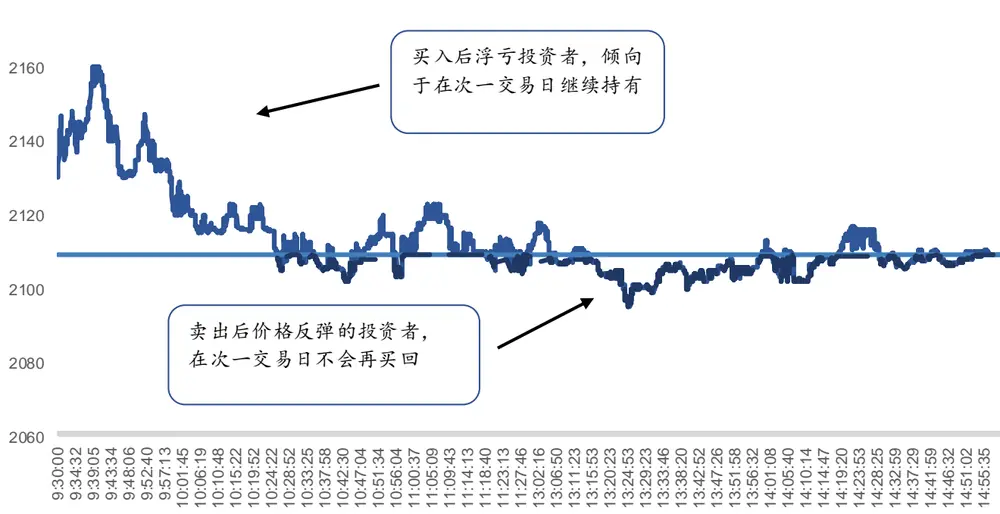
来源：Wind，上交所，深交所，国金证券研究所

## 1.2 遗憾规避因子的构建

本篇报告我们使用逐笔成交数据进行实证研究，该数据记录了市场中实时发生的买卖成交信息，包含成交的买卖双方订单号、成交价、成交量等数据，能以最细的粒度展示交易细节，为投资者提供了优质的 alpha 来源。下表为某股票在 2021 年 2 月 1 日的部分逐笔成交数据，其中卖单号和买单号分别为交易所针对该笔订单赋予的订单编号。

图表2：某股票逐笔成交数据示例

| 日期 | 时间 | 成交价格 | 成交量 | 卖单号 | 买单号 |
| --- | --- | --- | --- | --- | --- |
| 20210201 | 93000360 | 2,133.00 | 100 | 174497 | 173839 |
| 20210201 | 93000360 | 2,132.18 | 100 | 175399 | 174501 |
| 20210201 | 93000430 | 2,134.00 | 100 | 13061 | 175509 |
| 20210201 | 93000430 | 2,134.00 | 100 | 70208 | 175509 |
| 20210201 | 93000430 | 2,134.00 | 100 | 123651 | 175509 |
| 20210201 | 93000430 | 2,134.00 | 100 | 175520 | 175509 |
| 20210201 | 93000430 | 2,131.00 | 300 | 175822 | 173838 |
| 20210201 | 93000430 | 2,131.00 | 100 | 176237 | 173838 |
| 20210201 | 93000540 | 2,132.18 | 100 | 177246 | 176466 |
| 20210201 | 93000540 | 2,132.18 | 100 | 177799 | 178492 |

来源：Wind，上交所，深交所，国金证券研究所

由于实际交易中，买卖成交必然是一一对称的。为区分成交的实际买卖方向，我们根据买卖订单号的先后顺序，给每笔成交数据赋予买卖标志。若某笔交易是由买方先挂单，卖出方后提交订单并与买单撮合成交，则该笔交易实际为主动卖出，方向会被记录为卖，反之亦然。

我们根据每笔交易的成交量和买卖标志，基于上述针对收盘价对投资者行为的推测，构建了如下因子：买入浮亏占比因子（HCVOL）：

$$
HCVOL=\frac{\sum_{i}^{N}volume_{buyi}*I_{p_{buyi}>close}}{total_{-}volume}
$$

卖出反弹占比因子（LCVOL）：

$$
LCVOL=\frac{\sum_{i}^{N}volume_{selli}*I_{p_{selli}<close}}{total_{-}volume}
$$

买入浮亏偏离因子（HCP）：

$$
\frac{\sum_{i}^{N}\overline{price}_{buyi}*I_{buyi>close}}{close}-1
$$

卖出反弹偏离因子（LCP）：

$$
\frac{\sum_{i}^{N}\overline{price}_{sell}*I_{p_{sell}<close}}{close}-1
$$

上述因子的基本思路为：高于收盘价买入成交量占比越高，则投资者当天买入情绪较高，且浮亏占比较高，未来抛压较低，有着更高的预期收益。同理，高于收盘价买入的价格相较于收盘价偏离幅度越大，则投资者浮亏现象越严重，也会有更低的抛压，带来更高的预期收益。而低于收盘价卖出成交量占比越高、或价格相较于收盘价向下偏离越大的股票，投资者受到卖出行为的影响，不愿轻易再次买回，因此此类股票未来买入动力较低，有更低的预期收益。

根据以上思路，HCVOL 和 HCP 均应为正向因子，LCVOL 应为负向因子，而 LCP 由于所计算价格偏离为负数，此因子值越低，后续买入动力越弱，预期收益越低，应为正向因子。

由于 A 股的高频交易限制，我们此处计算得到日频因子后以次日开盘价作为买入价格，利用IC 均值、十分组测试方法，针对 2016 年 1 月至 2022 年8 月中证1000 所有成分股进行测试。我们首先对因子日频收益的预测能力进行检验，下表展示了 4 个因子的 IC 统计指标。可以看到，四个因子都展现出了一定的预测能力，T 值均大于 2，基本符合上文中的推测，其中 HCVOL, LCVOL, LCP 均表现较好，IC 均值均在 2%以上。

图表3：遗憾规避因子IC指标（日频）

| 因子 | 平均值 | 标准差 | 最小值 | 最大值 | 风险调整后IC | T统计量 |
| --- | --- | --- | --- | --- | --- | --- |
| HCVOL | 2.08% | 6.99% | -22.98% | 28.06% | 0.30 | 11.96 |
| LCVOL | 2.19% | 8.57% | -25.62% | 30.36% | 0.26 | 10.27 |
| HCP | 0.63% | 11.64% | -43.00% | 48.76% | 0.05 | 2.16 |
| LCP | 4.40% | 9.88% | -35.54% | 40.85% | 0.45 | 17.88 |

来源：Wind，上交所，深交所，国金证券研究所

我们根据十分位组合构建出了因子的多空组合净值，此处展示了多空净值曲线和几个关键指标。发现，四个因子在测试日期范围内均表现较好。其中虽然部分因子在 2021 年下半年至 2022 年上半年出现一定回撤，但近期又重新恢复上涨趋势。整体而言，稳定性和持续性均较好。另外从多空组合的指标上看，四个因子均获得了较高的年化收益率，HCVOL的夏普比率达到了 5.50。

图表4：遗憾规避因子多空组合净值（日频）
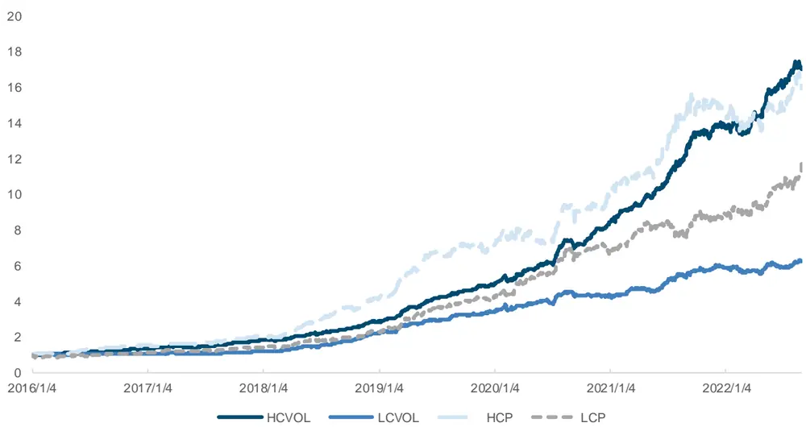
来源：Wind，上交所，深交所，国金证券研究所

图表5：遗憾规避因子多空组合指标（日频）

| 因子 | 年化收益率 | 波动率 | 夏普比率 | 最大回撤 | 多头组合年化超额收益率 |
| --- | --- | --- | --- | --- | --- |
| HCVOL | 53.07% | 9.65% | 5.50 | 6.66% | 14.24% |
| LCVOL | 31.67% | 11.24% | 2.82 | 8.42% | 10.29% |
| HCP | 51.59% | 16.13% | 3.20 | 13.24% | 20.57% |
| LCP | 44.68% | 14.88% | 3.00 | 12.46% | 0.64% |

来源：Wind，上交所，深交所，国金证券研究所

## 1.3 因子改进与效果对比

从上述结果可以看出，我们的推测基本成立，投资者在收盘价低于其买入成本价时会倾向于次日继续持有，且买贵的量越大（成交量占比），买入的成本越高（成交价格偏离），次日的抛压也就越低。反之，投资者在收盘价低于其卖出价格时倾向于继续坚持之前的卖出判断，且卖亏的量越大（成交量占比），卖出价格越低（成交价格偏离），次日的买回动力越弱。

## 1.3.1 小单改进

进一步地，我们思考，是否此类因子所反映的投资者行为在所有投资者身上均有同样的效果呢？如果将因子进行细分，大单和小单投资者的表现是否一致？由于小单交易普遍来自于个人投资者，其所展现的非理性行为与情绪会更加显著，可能会进一步加强由此带来的定价偏误，也给我们改进因子留下了机会。

目前 WIND 提供的交易统计数据是以 4 万元、20 万元、100 万元分别作为阈值将成交划分为小单、中单、大单和超大单。然而，在构建因子时，为了保证不同股票间的可比性，单纯用固定数值划分大小单显然不太合理。考虑到逐笔成交中的成交量可能会存在一笔大单被拆分成多个小单成交的情况，我们首先将同一订单号的成交进行汇总得到其真实订单成交量，以图表 1 数据为例，买单号为 175509 的订单实际成交量为 400，分别与 4 个不同的卖单成交，其实际成交量应记为 400。另外，若该笔成交为买单被拆分与多个卖单成交，则记为买方交易，反之为卖方交易，我们以此方式确定每笔成交的买卖方向。最终计算当日的所有实际交易量均值作为区分大小单的阈值，将4 个因子改为仅考虑小单进行测试。构建方式如下：

买入浮亏占比小单因子（HCVOLS）：

$$
HCVOLS=\frac{\sum_{i}^{N}volume_{buyi}*I_{p_{sell}>close}*I_{vol<vol_{mean}}}{total_{volume}}
$$

卖出反弹占比小单因子（LCVOLS）：

$$
LCVOLS=\frac{\sum_{i}^{N}volume_{sell}*I_{p_{sell}<close}*I_{vol<vol_{mean}}}{total_{v}volume}
$$

买入浮亏偏离小单因子（HCPS）：

$$
HCPS=\frac{\sum_{i}^{\mathbb{N}}\overline{{price}}_{buyi}*I_{p_{buyi}>close}*I_{vol<vol_{mean}}}{close}-1.
$$

卖出反弹偏离小单因子（LCPS）：

$$
\frac{\sum_{i}^{\mathbb{N}}\overline{price}_{sell}*I_{p_{sell}<close}*I_{vol*vol_{mean}}}{close}-1
$$

利用小单改进的 4 个因子 IC 指标和十分组测试的几个关键指标如下，可以看出相较于原因子，4 个小单因子的 IC均值均有一定程度改进，风险调整后 IC 也有不同程度上升。LCPS 的风险调整后 IC 达到 0.45。

图表6：小单改进遗憾规避因子IC指标（日频）

| 因子 | 平均值 | 标准差 | 最小值 | 最大值 | 风险调整后IC | T统计量 |
| --- | --- | --- | --- | --- | --- | --- |
| HCVOLS | 2.61% | 7.83% | -27.32% | 26.63% | 0.33 | 13.39 |
| LCVOLS | 3.07% | 8.53% | -26.58% | 33.05% | 0.36 | 14.45 |
| HCPS | 0.70% | 11.71% | -42.42% | 49.15% | 0.06 | 2.42 |
| LCPS | 4.50% | 9.95% | -35.55% | 39.97% | 0.45 | 18.17 |

来源：Wind，上交所，深交所，国金证券研究所

从多空组合指标来看，LCVOLS 和 LCPS 相较于原因子有较为明显的提升，多空夏普比率分别上升至 3.53 和 3.25，但HCVOLS 和 HCPS 的改进效果不佳。

图表7：小单改进遗憾规避因子多空组合净值（日频）
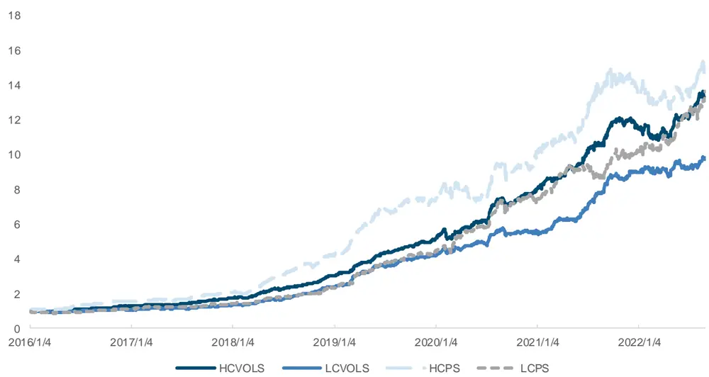
来源：Wind，上交所，深交所，国金证券研究所

图表8：小单改进遗憾规避因子多空组合指标（日频）

| 因子 | 年化收益率 | 波动率 | 夏普比率 | 最大回撤 | 多头组合年化超额收益率 |
| --- | --- | --- | --- | --- | --- |
| HCVOLS | 47.33% | 10.38% | 4.56 | 10.45% | 9.14% |
| LCVOLS | 40.76% | 11.53% | 3.53 | 8.11% | 14.37% |
| HCPS | 49.57% | 16.18% | 3.06 | 16.36% | 20.80% |
| LCPS | 48.04% | 14.80% | 3.25 | 15.17% | 2.57% |

来源：Wind，上交所，深交所，国金证券研究所

## 1.3.2 尾盘改进

由于 A 股的 T+1 交易机制，一般认为尾盘期间的交易行为蕴含了更多的私有信息，投资者尾盘期间的买入更不会受到短期波动的影响倾向于继续持有，尾盘期间的卖出也不会轻易买回。我们考虑将交易日下午 2:30（含）-2:57（不含）定义为尾盘，考察上述 4 个因子在尾盘期间的绩效表现。对于 HCVOL 和 LCVOL 所计算成交量占比，又可分为占尾盘期间成交量比例和占全天成交量比例。具体构建方式如下：

买入浮亏占比尾盘因子（全天）（HCVOLE1）

$$
HCVOLE1=\frac{\sum_{i}^{N}volume_{buyi}*I_{p_{buyi}>close}*I_{t\in[14:30,14:57)}}{total_{-}volume}
$$

买入浮亏占比尾盘因子（尾盘）（HCVOLE2）

$$
HCVOLE2=\frac{\sum_{i}^{N}volume_{buyi}*I_{p_{buyi}>close}*I_{t\in[14:30,14:57)}}{total\_volume_{end}}
$$

卖出反弹占比尾盘因子（全天）（LCVOLE1）

$$
LCVOLE1=\frac{\sum_{i}^{N}volume_{sell}*I_{p_{sell}<close}*I_{t\in[14:30,14:57)}}{total_{volume}}
$$

卖出反弹占比尾盘因子（尾盘）（LCVOLE2）

$$
LCVOLE2=\frac{\sum_{i}^{N}volume_{sell}*I_{p_{sell}<close}*I_{t\in[14:30,14:57)}}{total_{v}-volume_{end}}
$$

买入浮亏偏离尾盘因子（HCPE）

$$
\frac{\sum_{i}^{N}\overline{price}_{buyi}*I_{p_{buyi}>close}*I_{t\in[14:30,14:57)}}{close}-1
$$

卖出反弹偏离尾盘因子（LCPE）

$$
LCPE=\frac{\sum_{i}^{N}\overline{{price}}_{selli}*I_{p_{selli}<close}*I_{t\in[14:30,14:57)}}{close}-1.
$$

用尾盘改进的 6 个因子 IC 指标和十分组测试的几个关键指标如下，可以看出相较于原因子，6 个尾盘因子的 IC均值均有一定程度改进，其中买入浮亏占比因子的尾盘成交占尾盘比例效果较好，卖出反弹占比因子的尾盘成交占全天比例效果较好。

图表9：尾盘改进遗憾规避因子IC指标（日频）

| 因子 | 平均值 | 标准差 | 最小值 | 最大值 | 风险调整后IC | T统计量 |
| --- | --- | --- | --- | --- | --- | --- |
| HCV0LE1 | 1.48% | 5.29% | -21.35% | 22.54% | 0.28 | 11.21 |
| HCVOLE2 | 2.04% | 5.35% | -21.34% | 19.60% | 0.38 | 15.29 |
| LCV0LE1 | 2.68% | 6.16% | -19.42% | 26.57% | 0.44 | 17.48 |
| LCV0LE2 | 2.21% | 5.91% | -17.51% | 22.82% | 0.37 | 14.99 |
| HCPE | 1.05% | 7.97% | -34.26% | 30.30% | 0.13 | 5.30 |
| LCPE | 4.37% | 7.35% | -26.38% | 29.02% | 0.59 | 23.86 |

来源：Wind，上交所，深交所，国金证券研究所

从多空组合的各项指标来看，各因子的尾盘改进均表现出较明显的提升。其中 LCPE 的多空夏普比率达到 8.15，多头组合年化超额收益率为 13.70%。可以在一定程度上说明，尾盘期间的交易蕴含了更多额外信息，投资者后续也会更倾向于坚持自己之前的判断，不易受到收盘价干扰，使得遗憾规避因子在尾盘期间有更好的表现。

图表10：尾盘改进遗憾规避因子多空组合净值（日频）
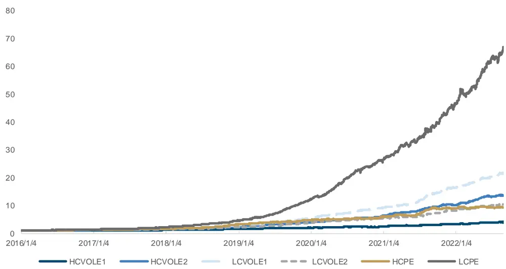
来源：Wind，上交所，深交所，国金证券研究所

图表11：尾盘改进遗憾规避因子多空组合指标（日频）

| 因子 | 年化收益率 | 波动率 | 夏普比率 |  | 最大回撤 多头组合年化超额收益率 |
| --- | --- | --- | --- | --- | --- |
| HCV0LE1 | 23.36% | 7.58% | 3.08 | 7.62% | -0.60% |
| HCV0LE2 | 48.02% | 7.57% | 6.35 | 3.84% | 16.65% |
| LCV0LE1 | 58.84% | 8.60% | 6.84 | 5.46% | 25.21% |
| LCV0LE2 | 42.51% | 8.32% | 5.11 | 4.80% | 21.10% |
| HCPE | 39.96% | 12.38% | 3.23 | 10.40% | 12.03% |
| LCPE | 88.03% | 10.80% | 8.15 | 5.77% | 13.70% |

来源：Wind，上交所，深交所，国金证券研究所

## 1.3.3 小单+尾盘改进

综上所述，本文所研究的遗憾规避因子能揭示投资者的非理性行为，且在小单投资者和尾盘期间表现更佳。接下来本文尝试使用小单+尾盘的双重限制模式进行改进，以提升因子效果。其中尾盘则根据上述测试效果，选取买入浮亏占比的尾盘成交占尾盘比例（HCVOLE2）和卖出反弹占比的尾盘成交占全天比例（HCVOLE1）进行构建。

此处不再赘述因子的具体构建方式，IC 和十分组测试指标列示如下，可以发现 4 个小单+尾盘改进因子最终均表现出较强的收益能力，优于之前的任何一种单一改进方式。其中 LCVOLES 和 LCPES 的表现尤其突出，LCPES 的多空年化收益率为 96.31%，夏普比率达到 8.77。

图表12：小单+尾盘改进遗憾规避因子IC指标（日频）

| 因子 | 平均值 | 标准差 | 最小值 | 最大值 | 风险调整后IC | T统计量 |
| --- | --- | --- | --- | --- | --- | --- |
| HCVOLES | 2.51% | 5.54% | -21.68% | 20.84% | 0.45 | 18.21 |
| LCVOLES | 3.48% | 5.89% | -17.60% | 26.17% | 0.59 | 23.75 |
| HCPES | 1.13% | 8.13% | -35.13% | 30.13% | 0.14 | 5.57 |
| LCPES | 4.51% | 7.51% | -25.31% | 30.82% | 0.60 | 24.14 |

来源：Wind，上交所，深交所，国金证券研究所

图表13：小单+尾盘改进遗憾规避因子多空组合净值（日频）
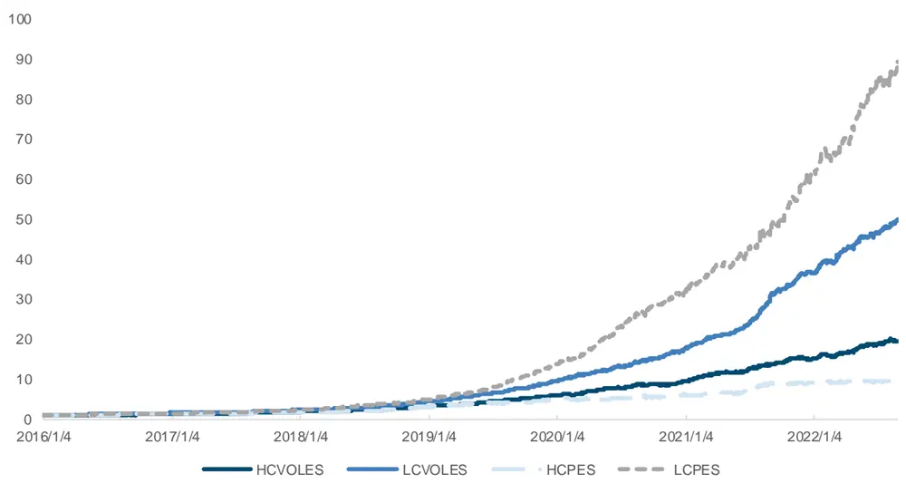
来源：Wind，上交所，深交所，国金证券研究所

图表14：小单+尾盘改进遗憾规避因子多空组合指标（日频）

| 因子 | 年化收益率 | 波动率 | 夏普比率 | 最大回撤 | 多头组合年化超额收益率 |
| --- | --- | --- | --- | --- | --- |
| HCVOLES | 56.11% | 7.76% | 7.23 | 5.05% | 21.93% |
| LCVOLES | 79.86% | 8.56% | 9.33 | 4.80% | 29.78% |
| HCPES | 40.25% | 12.52% | 3.21 | 10.51% | 12.71% |
| LCPES | 96.31% | 10.98% | 8.77 | 5.82% | 15.36% |

来源：Wind，上交所，深交所，国金证券研究所

此外，我们还考察了改进后四个因子的 IC 衰减情况，发现四个因子 IC 衰减速度存在较大差异，具体情况如下图所示。
相较于卖出反弹类因子，买入浮亏类两个因子的衰减速度较快。

图表15：HCVOLES 因子 IC 衰减
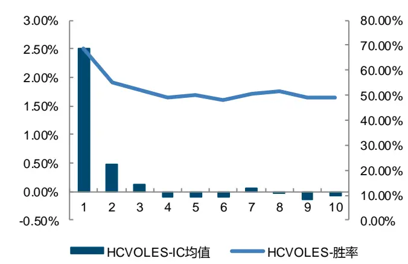
来源：Wind，上交所，深交所，国金证券研究所

图表16:LCVOLES 因子 IC 衰减
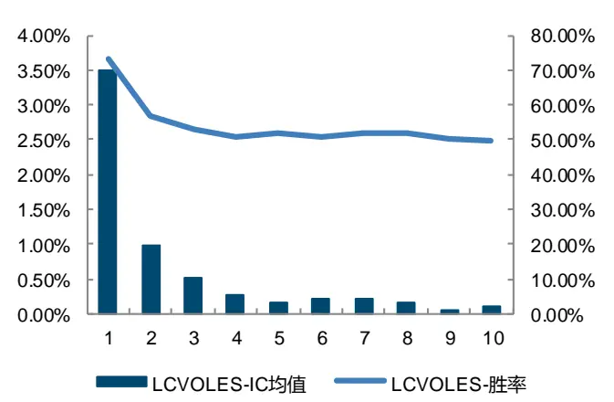
来源：Wind，上交所，深交所，国金证券研究所

图表17：HCPES 因子衰减
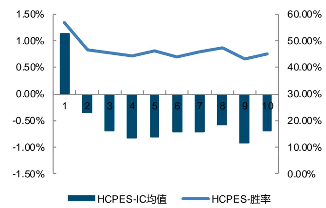
来源：Wind，上交所，深交所，国金证券研究所

图表18：LCPES 因子衰减
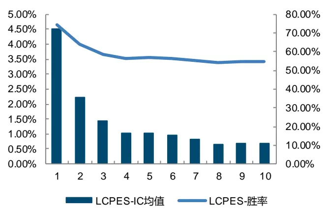
来源：Wind，上交所，深交所，国金证券研究所

## 1.4 思考与结论

由上述因子的构造过程和改进测试结果我们可以得到以下几点基本结论：

- 本文所推测的投资者的非理性情绪得到证实，买入浮亏的投资者会倾向于继续持有，卖出反弹的投资者更倾向于继续坚持自己的判断不再买回。且此现象会给股票的预期收益带来显著的影响。

- 4 个因子在加入小单限制后，IC 指标均得到一定程度提升，说明此类因子所蕴含的非理性情绪更易出现在小单（个人）投资者上。

- 4 个因子在仅考虑尾盘期间的交易之后收益均得到提升，说明尾盘期间的交易蕴含了更多的额外信息，投资者更倾向于坚持自己在尾盘的判断，后续不会轻易反向操作。

相较于卖出反弹类因子，买入浮亏类因子的 IC 衰减速度显著更快。我们认为这可能与投资者注意力分配不对称有关。由于买入后浮亏的股票会持续出现在投资者的账户中，投资者会持续给予关注并不断产生痛苦纠结的情绪，最终可能会忍痛卖出。但对于卖出后股票反弹的投资者，由于股票已经不在其账户中体现，投资者对于该股的关注度就会大幅减少，随着时间推移其更不可能买回。因此相较于买入浮亏类因子，卖出反弹类因子展现出了更强的持续性。

图表19：各因子多空夏普比率对比（日频）

| 多空夏普 | HCVOL | LCVOL | HCP | LCP |
| --- | --- | --- | --- | --- |
| 原因子 | 5.50 | 2.82 | 3.20 | 3.00 |
| 小单 | 4.56 | 3.53 | 3.06 | 3.25 |
| 尾盘 | 6.35 | 6.84 | 3.23 | 8.15 |
| 小单+尾盘 | 7.23 | 9.33 | 3.21 | 8.77 |

来源：Wind，上交所，深交所，国金证券研究所

## 1.5 日频合成因子表现

在得到上述经过小单+尾盘改进的 4 个因子后，我们进一步考虑通过因子合成的方式加强其收益表现和稳定性，以降低单个因子阶段性失效所带来的波动。我们首先考察 4 个因子的秩相关系数，由下表可以看出，HCVOL 和 LCVOL 有较强的负相关性，其余因子的相关性相对较低，我们考虑通过合成的方式改善投资组合的表现。

图表20：遗憾规避因子秩相关系数（日频）

|  | HCVOL | LCVOL | HCP | LCP |
| --- | --- | --- | --- | --- |
| HCVOL | 1.00 |  |  |  |
| LCVOL | -0.62 | 1.00 |  |  |
| HCP | 0.42 | -0.45 | 1.00 |  |
| LCP | 0.50 | -0.48 | 0.05 | 1.00 |

来源：Wind，上交所，深交所，国金证券研究所

在进行因子合成前，我们首先对因子进行分位数变换标准化，将四个因子进行等权合成。再对合成因子进行行业市值中性化处理后，得到了日频的合成因子。从下表展示的 IC 指标来看，相较于 4 个因子而言，合成后的风险调整 IC有一定程度提升，分别达到了 0.64 和 0.77。

图表21：遗憾规避合成因子IC指标（日频）

| 因子 | 平均值 | 标准差 | 最小值 | 最大值 | 风险调整后IC | T统计量 |
| --- | --- | --- | --- | --- | --- | --- |
| FRegretFactor | 4.04% | 6.29% | -24.45% | 24.99% | 0.64 | 25.81 |
| FRegretFactorAdjCI | 3.98% | 5.15% | -17.65% | 20.58% | 0.77 | 31.01 |

来源：Wind，上交所，深交所，国金证券研究所

同时多空净值的收益水平和稳定性也有一定提升，单调性也非常明显。合成因子的多空夏普比率达到了10.60，多头组合的年化超额收益率为 31.38%。经过市值行业中性化后的合成因子表现又有进一步提升，多空夏普比率为 12.17，多头组合的年化超额收益率为 31.49%。

图表22：遗憾规避合成因子多空组合净值（日频）
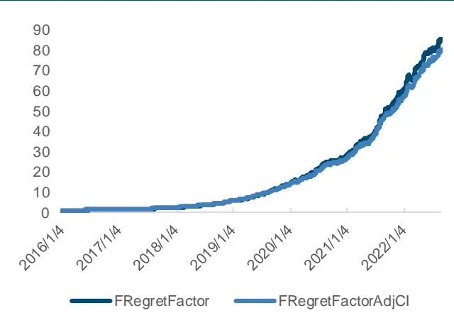
来源：Wind，上交所，深交所，国金证券研究所

图表23：遗憾规避合成因子分位数组合年化超额收益率(日频)
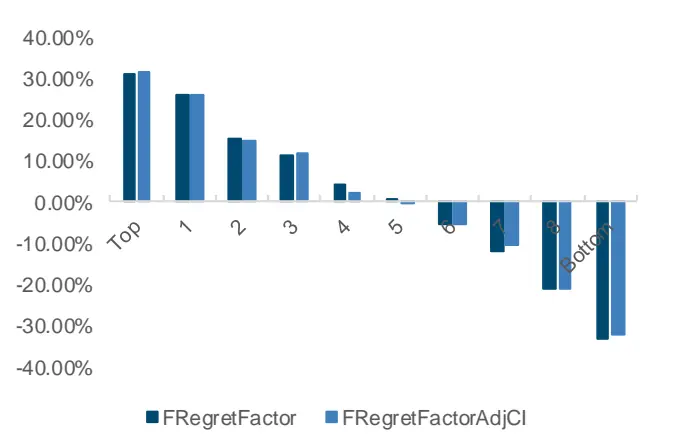
来源：Wind，上交所，深交所，国金证券研究所

图表24：FRegretFactor因子分位数组合指标（日频）

| 组合 | 年化收益率 | 波动率 | Sharpe 比率 |  | 最大回撤率年化超额收益率 | 跟踪误差 | 信息比率超额最大回撤率 |  |
| --- | --- | --- | --- | --- | --- | --- | --- | --- |
| Top | 33.11% | 27.66% | 1.20 | 30.86% | 31.38% | 6.21% | 5.05 | 5.60% |
| 1 | 27.75% | 27.00% | 1.03 | 34.54% | 25.97% | 4.55% | 5.71 | 3.68% |
| 2 | 17.09% | 26.73% | 0.64 | 37.40% | 15.40% | 4.08% | 3.77 | 3.62% |
| 3 | 13.17% | 26.54% | 0.50 | 43.48% | 11.50% | 3.81% | 3.02 | 3.26% |
| 4 | 6.22% | 26.16% | 0.24 | 51.75% | 4.54% | 3.75% | 1.21 | 6.09% |
| 5 | 1.74% | 25.85% | 0.07 | 52.57% | 0.05% | 3.74% | 0.01 | 7.85% |
| 6 | -3.48% | 25.80% | -0.13 | 55.10% | -5.10% | 3.92% | -1.30 | 30.57% |
| 7 | -10.63% | 26.13% | -0.41 | 66.59% | -12.05% | 4.01% | -3.01 | 59.41% |
| 8 | -19.38% | 25.64% | -0.76 | 81.10% | -20.78% | 4.48% | -4.64 | 79.01% |
| Bottom | -31.67% | 25.53% | -1.24 | 93.32% | -32.92% | 5.39% | -6.10 | 93.09% |
| 市场 | 1.60% | 25.93% | 0.06 | 52.90% |  |  |  |  |
| L-S | 94.93% | 8.95% | 10.60 | 5.35% |  |  |  |  |

来源：Wind，上交所，深交所，国金证券研究所

图表25：FRegretFactorAdjCI因子分位数组合指标（日频）

| 组合 | 年化收益率 | 波动率 | Sharpe 比率 | 最大回撤率年化超额收益率 |  | 跟踪误差 | 信息比率超额最大回撤率 |  |
| --- | --- | --- | --- | --- | --- | --- | --- | --- |
| Top | 33.39% | 27.23% | 1.23 | 29.86% | 31.49% | 5.49% | 5.74 | 4.48% |
| 1 | 28.00% | 26.84% | 1.04 | 32.05% | 26.13% | 4.17% | 6.27 | 3.04% |
| 2 | 16.61% | 26.47% | 0.63 | 38.68% | 14.80% | 3.90% | 3.80 | 3.71% |
| 组合 | 年化收益率 | 波动率 | Sharpe 比率 |  | 最大回撤率年化超额收益率 | 跟踪误差 | 信息比率超额最大回撤率 |  |
| 3 | 13.64% | 26.56% | 0.51 | 44.39% | 11.91% | 3.86% | 3.09 | 3.17% |
| 4 | 3.95% | 26.30% | 0.15 | 53.70% | 2.30% | 3.76% | 0.61 | 7.75% |
| 5 | 1.15% | 26.10% | 0.04 | 52.67% | -0.50% | 3.63% | -0.14 | 11.72% |
| 6 | -3.50% | 25.76% | -0.14 | 54.49% | -5.17% | 3.85% | -1.34 | 31.49% |
| 7 | -8.77% | 25.97% | -0.34 | 60.96% | -10.30% | 3.76% | -2.74 | 52.55% |
| 8 | -19.59% | 25.81% | -0.76 | 81.54% | -20.98% | 4.17% | -5.04 | 79.22% |
| Bottom | -30.89% | 25.53% | -1.21 | 92.92% | -32.16% | 5.00% | -6.43 | 92.61% |
| 市场 | 1.64% | 25.93% | 0.06 | 52.90% |  |  |  |  |
| L-S | 93.10% | 7.65% | 12.17 | 4.58% |  |  |  |  |

来源：Wind，上交所，深交所，国金证券研究所

## 二、遗憾规避因子降频后的表现

## 2.1 周频因子的 IC和分位数组合表现

由上述日频因子的表现可以看出，收盘价对投资者交易行为产生的心理影响对于次日股票收益率的横截面差异有较好的预测作用。但对于机构投资者来说，日频调仓的手续费较高，难以获得实际收益。因此我们上述日频因子降频至周频后，考察其表现。

考虑到因子衰减速度较快的特性，就具体降频方式而言，我们采用加权移动平均法，即对于最近连续的五个交易日，更近的交易日给予其更高的权重。在中证 1000 指数成分股上，以周频调仓的方式，每周第一个交易日的开盘价成交进行测试。其 IC 与分位数组合的主要指标如下，可以看出 4 个因子降为周频后表现基本都有所下降，其中 HCPES 由于衰减速度过快，在周频的调仓周期上直接失效。

图表26：遗憾规避因子IC指标（周频）

| 因子 | 平均值 | 标准差 | 最小值 | 最大值 | 风险调整后IC | T统计量 |
| --- | --- | --- | --- | --- | --- | --- |
| HCVOLES | 0.98% | 5.39% | -15.74% | 26.18% | 0.18 | 3.30 |
| LCVOLES | 1.77% | 6.76% | -20.41% | 27.61% | 0.26 | 4.78 |
| HCPES | -2.10% | 9.60% | -27.95% | 24.89% | -0.22 | -3.98 |
| LCPES | 5.24% | 8.67% | -20.56% | 26.11% | 0.60 | 11.01 |

来源：Wind，上交所，深交所，国金证券研究所

从多空组合指标来看，HCVOLES 的收益表现相比日频情况也大幅衰减，不过两个卖出反弹类因子 LCVOLES 和 LCPES依然保持了不错的收益表现，多空年化收益率分别为 17.77%和 36.04%。夏普比率为 1.93 和 3.05。

图表27：遗憾规避因子多空组合净值（周频）
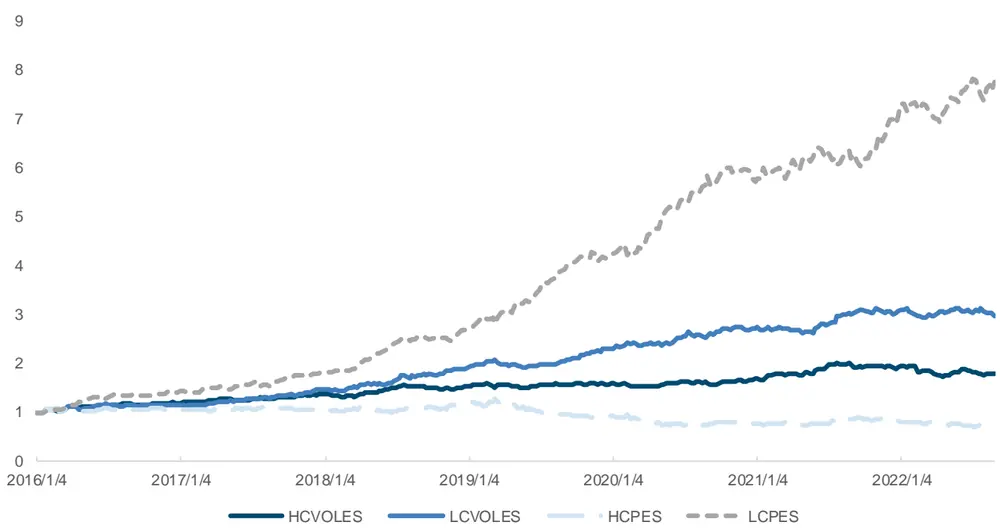
来源：Wind，上交所，深交所，国金证券研究所

图表28：遗憾规避因子多空组合指标（周频）

| 因子 | 年化收益率 | 波动率 | 夏普比率 | 最大回撤 | 多头组合年化超额收益率 |
| --- | --- | --- | --- | --- | --- |
| HCVOLES | 8.96% | 8.20% | 1.09 | 14.53% | 4.67% |
| LCVOLES | 17.77% | 9.23% | 1.93 | 7.49% | 6.16% |
| HCPES | -5.20% | 13.60% | -0.38 | 45.17% | -8.59% |
| LCPES | 36.04% | 11.80% | 3.05 | 6.19% | 6.46% |

来源：Wind，上交所，深交所，国金证券研究所

## 2.2 周频合成因子表现

从下表的相关系数可以看出，上述表现较好的 LCVOLES 和 LCPES 两个因子相关性较低，仅为-0.32。因此我们利用同样的方式，对两因子进行等权合成。

图表29：遗憾规避因子秩相关系数（周频）

|  | HCVOLES | LCVOLES | HCPES | LCPES |
| --- | --- | --- | --- | --- |
| HCVOLES | 1.00 |  |  |  |
| LCVOLES | -0.24 | 1.00 |  |  |
| HCPES | 0.29 | -0.31 | 1.00 |  |
| LCPES | 0.28 | -0.32 | -0.28 | 1.00 |

来源：Wind，上交所，深交所，国金证券研究所

从因子的各项指标来看，IC 均值均在 4%以上，风险调整后 IC 均达到 0.60 以上，较单个因子的 IC有一定提升。

图表30：遗憾规避合成因子IC指标（周频）

| 因子 | 平均值 | 标准差 | 最小值 | 最大值 | 风险调整后IC | T统计量 |
| --- | --- | --- | --- | --- | --- | --- |
| FRegretFactorW | 4.29% | 7.17% | -14.81% | 30.91% | 0.60 | 10.90 |
| FRegretFactorWAdjCI | 4.24% | 5.84% | -11.45% | 22.55% | 0.73 | 13.25 |

来源：Wind，上交所，深交所，国金证券研究所

从多空组合指标来看，十分组的单调性较好，FRegretFactorW 的多空年化收益率达到 37.12%，夏普比率为 4.09。将该因子进行行业市值中性化后，多空年化收益率为 36.97%，夏普比率提升至 5.00，两者的多头组合年化超额收益率也均达到了 10%以上。不过依然能明显看到，因子空头组合贡献了大多数多空收益。

图表31：遗憾规避合成因子多空组合净值（周频）
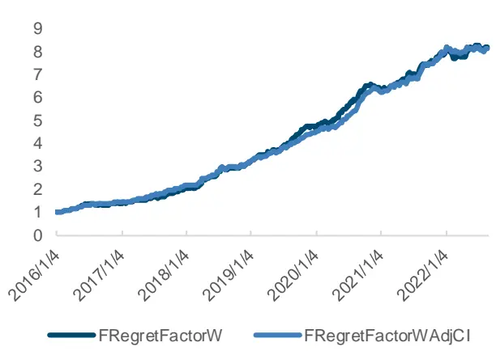
来源：Wind，上交所，深交所，国金证券研究所

图表32：遗憾规避合成因子分位数组合年化超额收益率(周频)
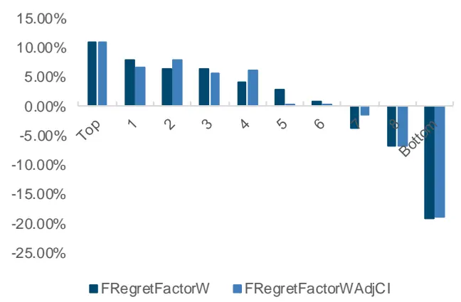
来源：Wind，上交所，深交所，国金证券研究所

图表33：FRegretFactorW因子分位数组合指标（周频）

| 组合 | 年化收益率 | 波动率 | Sharpe 比率 |  | 最大回撤率年化超额收益率 | 跟踪误差 | 信息比率超额最大回撤率 |  |
| --- | --- | --- | --- | --- | --- | --- | --- | --- |
| Top | 10.86% | 25.24% | 0.43 | 35.77% | 10.21% | 5.12% | 1.99 | 4.62% |
| 1 | 7.89% | 24.93% | 0.32 | 47.06% | 7.21% | 4.61% | 1.56 | 5.93% |
| 2 | 6.38% | 25.38% | 0.25 | 48.54% | 5.84% | 4.30% | 1.36 | 3.43% |
| 3 | 6.29% | 24.88% | 0.25 | 45.86% | 5.63% | 4.05% | 1.39 | 3.92% |
| 4 | 4.22% | 24.44% | 0.17 | 52.03% | 3.47% | 3.92% | 0.89 | 6.09% |
| 5 | 2.98% | 24.63% | 0.12 | 49.16% | 2.29% | 3.79% | 0.60 | 5.12% |
| 6 | 0.87% | 24.56% | 0.04 | 50.66% | 0.17% | 3.96% | 0.04 | 13.63% |
| 7 | -3.80% | 24.07% | -0.16 | 57.43% | -4.60% | 4.52% | -1.02 | 29.68% |
| 8 | -6.70% | 24.21% | -0.28 | 59.47% | -7.46% | 4.72% | -1.58 | 42.83% |
| Bottom | -19.15% | 22.86% | -0.84 | 81.78% | -20.09% | 5.76% | -3.49 | 77.82% |
| 市场 | 0.73% | 24.11% | 0.03 | 52.21% |  |  |  |  |
| L-S | 37.12% | 9.07% | 4.09 | 6.26% |  |  |  |  |

来源：Wind，上交所，深交所，国金证券研究所

图表34：FRegretFactorWAdjCI因子分位数组合指标（周频）

| 组合 | 年化收益率 | 波动率 | Sharpe 比率 | 最大回撤率年化超额收益率 |  | 跟踪误差 | 信息比率超额最大回撤率 |  |
| --- | --- | --- | --- | --- | --- | --- | --- | --- |
| Top | 11.03% | 24.84% | 0.44 | 37.81% | 10.25% | 4.25% | 2.41 | 4.38% |
| 1 | 6.59% | 24.92% | 0.26 | 49.31% | 5.88% | 4.04% | 1.45 | 5.73% |
| 2 | 7.98% | 24.95% | 0.32 | 44.37% | 7.27% | 4.13% | 1.76 | 2.76% |
| 3 | 5.69% | 24.63% | 0.23 | 49.46% | 4.92% | 3.81% | 1.29 | 5.29% |
| 4 | 6.12% | 24.27% | 0.25 | 46.93% | 5.26% | 3.53% | 1.49 | 4.54% |
| 5 | 0.02% | 24.63% | 0.00 | 50.45% | -0.70% | 3.73% | -0.19 | 13.54% |
| 6 | 0.28% | 24.87% | 0.01 | 50.83% | -0.40% | 3.93% | -0.10 | 11.12% |
| 7 | -1.56% | 24.32% | -0.06 | 57.26% | -2.37% | 4.22% | -0.56 | 17.90% |
| 8 | -6.69% | 24.02% | -0.28 | 58.84% | -7.54% | 4.49% | -1.68 | 41.41% |
| Bottom | -18.94% | 23.08% | -0.82 | 81.98% | -19.87% | 5.16% | -3.85 | 77.82% |
| 市场 | 0.79% | 24.10% | 0.03 | 52.21% |  |  |  |  |
| L-S | 36.97% | 7.40% | 5.00 | 3.97% |  |  |  |  |

来源：Wind，上交所，深交所，国金证券研究所

## 三、结合遗憾规避因子构建的中证1000指数增强策略

## 3.1 基于遗憾规避因子构建的中证 1000指数增强策略

为了探究本文构建的遗憾规避因子实际交易效果，我们首先基于该因子构建中证 1000 指数增强策略。回测期为 2016年 1 月至 2022 年 8 月，以每周第一个交易日的开盘价买入进行周频调仓。每次对前5%的股票等权买入，以中证 1000指数为基准进行比较。同时为有效降低换手率过高给策略收益带来的负面影响，我们加入换手率缓冲的调整方式降低调仓成本。在千分之二的手续费率下，测试结果如下。

图表35：基于遗憾规避因子的中证1000指数增强策略表现
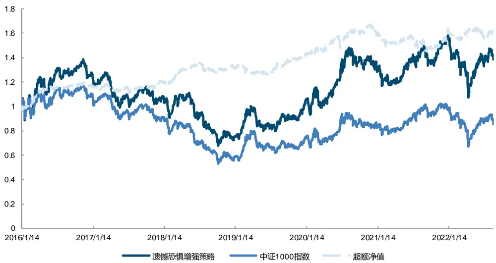
来源：Wind，上交所，深交所，国金证券研究所

可以看出，基于遗憾规避因子所构建的中证 1000 指数增强策略相较于基准有明显的优势，超额净值稳步上升。策略的年化超额收益率为 7.71%，信息比率为 1.01，超额最大回撤为 13.57%。

图表36：基于遗憾规避因子的中证1000指数增强策略指标

| 统计指标 | 遗憾规避增強策略 | 中证1000 指数 |
| --- | --- | --- |
| 年化收益率 | 5.02% | -2.28% |
| 年化波动率 | 25.18% | 23.96% |
| 夏普比率 | 0.20 | -0.10 |
| 最大回撤 | 51.12% | 55.11% |
| 双边换手率（周度） | 49.30% |  |
| 年化超额收益率 | 7.71% |  |
| 跟踪误差 | 7.61% |  |
| 信息比率 | 1.01 |  |
| 超额最大回撤 | 13.57% |  |

来源：Wind，上交所，深交所，国金证券研究所

## 3.2 遗憾规避因子与传统风格因子的相关性

进一步地，我们希望探究本文所发现的遗憾规避因子与其他类型因子之间的相关性，考察其是否提供了真正独立的alpha。我们首先计算了合成后的周频遗憾规避因子与传统风格因子间的秩相关系数，从如下数据可以看出，该因子与风格因子间相关性都较低，相关性最高的为动量因子，仅为 0.11。与前期报告中的量价背离因子和线性重构因子同样具有较低的相关性，其与线性重构因子的相关系数 0.11，也处于相对较低水平。

图表37：遗憾规避因子与其他类型因子的相关系数
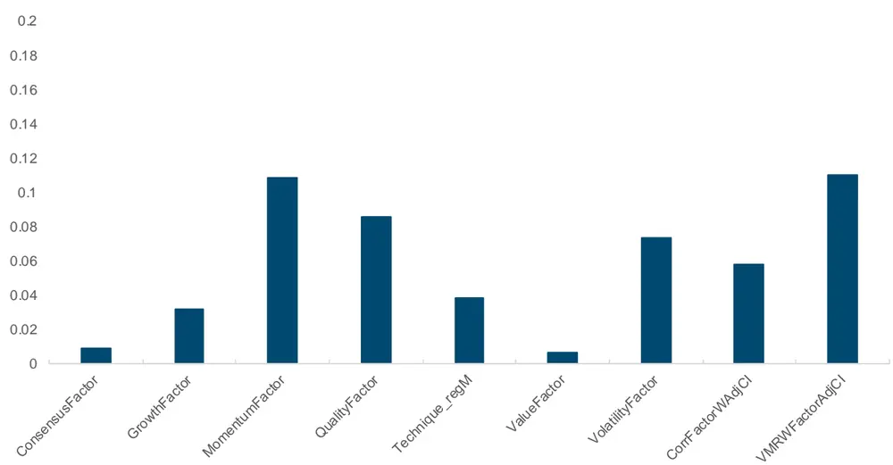
来源：Wind，上交所，深交所，国金证券研究所

为此，我们考虑将遗憾规避因子与在中证 1000 指数上表现较好的其他因子进行合成，构建中证 1000 指数增强策略。经过我们的检验，发现一致预期（Consensus）、成长（Growth）和技术（Technique_RegM）三个风格因子在中证 1000上表现较好，从下表可以看出，我们将三个因子合成（CGT）后得到的 IC 均值为 5.92%，风险调整后 IC 为 0.80。结合前期报告的研究成果，我们将三个因子与量价背离因子（CGTC）、线性重构因子进行合成（CGTCVmr），最后再与遗憾规避因子进行合成（CGTCVmrFRegret），测试此因子所带来的增量收益。发现最终的合成因子 IC 指标得到进一步提升，均值为 8.55%，风险调整后 IC 达到 1.06。

图表38：中证1000成分股中遗憾规避因子与其他因子IC指标（周频）

| 因子 | 平均值 | 标准差 | 最小值 | 最大值 | 风险调整的IC | t统计量 |
| --- | --- | --- | --- | --- | --- | --- |
| ConsensusFactor | 1.34% | 5.65% | -14.78% | 17.49% | 0.24 | 4.37 |
| GrowthFactor | 2.49% | 7.52% | -17.81% | 25.39% | 0.33 | 6.10 |
| Technique_regM | 7.19% | 8.27% | -16.79% | 28.32% | 0.87 | 16.04 |
| CorrFactorWAdjCl | 6.27% | 6.74% | -11.58% | 23.35% | 0.93 | 17.13 |
| VMRWFactorAdjCI | 4.31% | 8.00% | -26.73% | 23.76% | 0.54 | 9.54 |
| FRegretFactorWAdjCI | 4.24% | 5.84% | -11.45% | 22.55% | 0.73 | 13.25 |
| CGT | 5.92% | 7.44% | -16.98% | 26.94% | 0.80 | 14.67 |
| CGTC | 7.67% | 7.50% | -16.79% | 30.95% | 1.02 | 18.88 |
| CGTCVmr | 8.05% | 7.95% | -23.30% | 33.04% | 1.01 | 18.67 |
| CGTCVmrFRegret | 8.55% | 8.04% | -23.30% | 30.87% | 1.06 | 19.61 |

来源：Wind，上交所，深交所，国金证券研究所

我们将六因子组合进行十分组测试，从多空组合指标可以看出，CGTCVmrFRegret 的收益表现相较于 CGTCVmr 因子组合有明显提升，多空年化收益率达到 75.43%，夏普比率达到 6.68，且多头组合的年化超额收益率也达到了 23.50%。

图表39：中证1000成分股中遗憾规避因子与其他因子多空组合净值（周频）
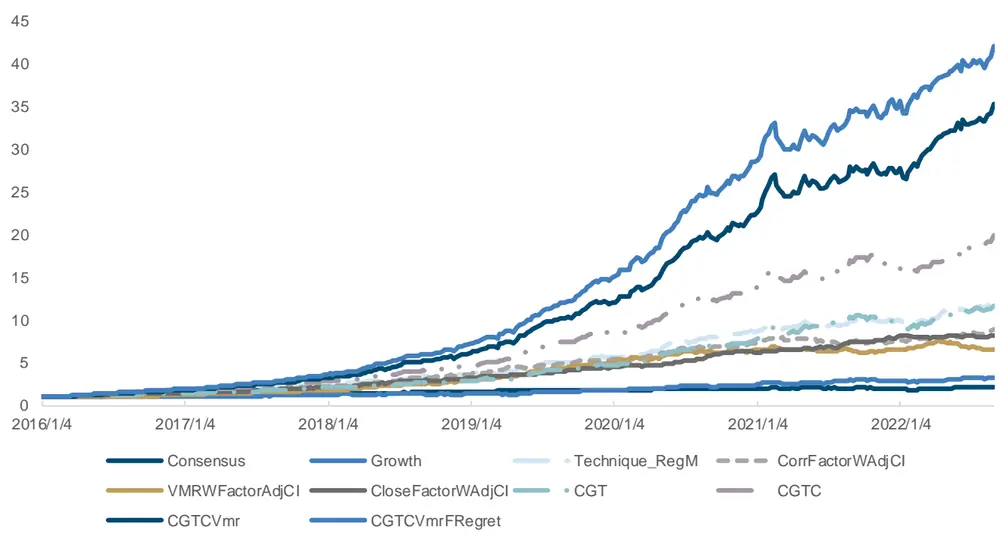
来源：Wind，上交所，深交所，国金证券研究所

图表40：中证1000成分股中遗憾规避因子与其他因子多空组合指标（周频）

| 因子 | 年化收益率 | 波动率 | 夏普比率 | 最大回撤 | 多头组合年化超额收益率 |
| --- | --- | --- | --- | --- | --- |
| ConsensusFactor | 11.92% | 9.08% | 1.31 | 13.50% | 5.91% |
| GrowthFactor | 19.32% | 10.51% | 1.84 | 13.78% | 6.06% |
| Technique_regM | 45.76% | 11.41% | 4.01 | 7.04% | 9.74% |
| CorrFactorWAdjCI | 38.75% | 9.52% | 4.07 | 10.38% | 8.90% |
| VMRWFactorAdjCI | 32.64% | 9.75% | 3.35 | 14.40% | 8.68% |
| FRegretFactorWAdjCI | 36.97% | 7.40% | 5.00 | 3.97% | 10.25% |
| CGT | 44.69% | 11.74% | 3.81 | 15.04% | 15.92% |
| CGTC | 56.74% | 11.17% | 5.08 | 13.41% | 18.99% |
| CGTCVmr | 70.89% | 11.63% | 6.09 | 9.83% | 22.19% |
| CGTCVmrFRegret | 75.43% | 11.30% | 6.68 | 9.44% | 23.50% |

来源：Wind，上交所，深交所，国金证券研究所

为进一步考察因子的实盘盈利能力，我们以合成了其他因子的遗憾规避因子构建中证 1000 指数增强策略。回测期为2016 年 1 月至 2022 年 8 月，以每周第一个交易日的开盘价买入进行周频调仓。每次对前 10%的股票等权买入，以中证 1000 指数为基准进行比较。同时为有效降低换手率过高给策略收益带来的负面影响，我们加入换手率缓冲的调整方式降低调仓成本。在千分之二的手续费率下，测试结果如下。可以看出，基于合成后因子构建的增强策略超额收益明显，超额净值稳定向上。增强策略的年化超额收益率为 20.79%，信息比率为 4.05，超额最大回撤为 3.82%。

图表41：基于遗憾规避因子与其他因子合成的中证1000指数增强策略表现
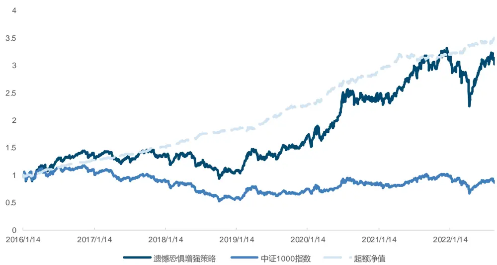
来源：Wind，上交所，深交所，国金证券研究所

图表42：基于遗憾规避因子与其他因子合成的中证1000指数增强策略指标

| 统计指标 | 遗憾规避增強策略 | 中证1000指数 |
| --- | --- | --- |
| 年化收益率 | 18.14% | -2.28% |
| 年化波动率 | 24.13% | 23.96% |
| 夏普比率 | 0.75 | -0.10 |
| 最大回撤 | 36.03% | 55.11% |
| 双边换手率（周度） | 50.71% |  |
| 年化超额收益率 | 20.79% |  |
| 跟踪误差 | 5.13% |  |
| 信息比率 | 4.05 |  |
| 超额最大回撤 | 3.82% |  |

来源：Wind，上交所，深交所，国金证券研究所

分年度来看，策略在所有年份均取得正的超额收益，且每一年的超额收益均在 5%以上，可见此因子自 2016 年以来保持了较好的稳定性。

图表43：基于遗憾规避因子与其他因子合成的中证1000指数增强策略分年度收益率
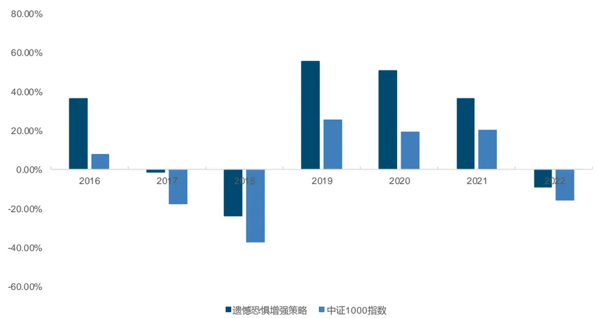
来源：Wind，上交所，深交所，国金证券研究所
注：2022 年数据截至 2022 年 8 月 31 日。

对于周度调仓的策略，手续费率直接影响了策略整体的收益表现。为此我们在不同手续费率的情况下进行了对比，同时也针对不同手续费率进行换手率缓冲的参数调优。从下图可以看出，随着手续费率提高，策略收益逐步下降，不过在较严格的千分之三手续费率下，年化超额收益率依然有 18.35%，信息比率达到 3.68，超额最大回撤为 5.31%。

图表44：不同手续费下策略超额净值对比
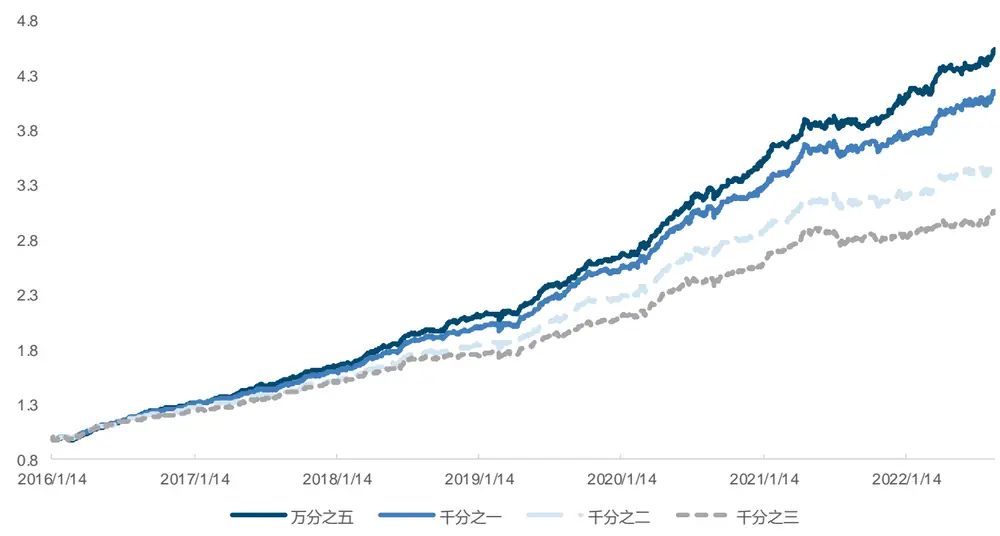
来源：Wind，上交所，深交所，国金证券研究所

图表45：不同手续费下策略指标对比

| 统计指标 | 万分之五 | 千分之一 | 千分之二 | 千分之三 |
| --- | --- | --- | --- | --- |
| 年化收益率 | 22.90% | 21.25% | 18.14% | 15.76% |
| 年化波动率 | 24.10% | 24.15% | 24.13% | 24.13% |
| 夏普比率 | 0.95 | 0.88 | 0.75 | 0.65 |
| 最大回撤 | 33.55% | 34.11% | 36.03% | 36.94% |
| 年化超额收益率 | 25.63% | 23.97% | 20.79% | 18.35% |
| 跟踪误差 | 5.05% | 5.11% | 5.13% | 4.98% |
| 信息比率 | 5.07 | 4.69 | 4.05 | 3.68 |
| 超额最大回撤 | 3.50% | 3.71% | 3.82% | 5.31% |

来源：Wind，上交所，深交所，国金证券研究所

## 四、总结

我们通过研究，发现日终收盘价作为一个重要的锚点价格，对投资者心理产生了重要的影响。买入价格高于当天收盘价的成交量占比越高、价格偏离幅度越大，股票次日面临的抛压越小，未来预期收益更高。卖出价格低于当天收盘价的成交量占比越高、价格偏离幅度越大，股票次日面临的买入动力越低，未来预期收益更低。我们将该现象构建为选股因子，发现在日频和周频上均取得了较好的效果。进一步利用小单和尾盘对因子进行改进，因子的预测效果得到大幅度提升。合成日频因子的多空年化收益率达到 94.93%，夏普比率为 10.60。在降频为周频后，多空年化收益率为37.12%，夏普比率为 4.09。中性化后多空年化收益率 36.97%，夏普比率达到 5.00。

通过考察合成后的遗憾规避因子与其他因子的相关系数，我们发现其独立性较强，提供了独特的 alpha 收益。通过将一致预期、成长、技术三类风格因子与前期报告中的量价背离因子、线性重构因子和本篇报告中的遗憾规避因子进行合成，我们构建了表现优异的中证 1000 指数增强策略。在 2016 年 1 月至 2022 年 8 月期间，手续费千分之二的情况下，策略的年化超额收益率达到 20.79%，信息比率达到 4.05。即便使用较严格的千分之三手续费，策略的年化超额收益率依然有 18.35%，信息比率为 3.68。

## 风险提示

1、以上结果通过历史数据统计、建模和测算完成，在政策、市场环境发生变化时模型存在失效的风险。

2、策略依据一定的假设通过历史数据回测得到，当交易成本提高或其他条件改变时，可能导致策略收益下降甚至出现亏损 。

## 特别声明：

国金证券股份有限公司经中国证券监督管理委员会批准，已具备证券投资咨询业务资格。

本报告版权归“国金证券股份有限公司”（以下简称“国金证券”）所有，未经事先书面授权，任何机构和个人均不得以任何方式对本报告的任何部分制作任何形式的复制、转发、转载、引用、修改、仿制、刊发，或以任何侵犯本公司版权的其他方式使用。经过书面授权的引用、刊发，需注明出处为“国金证券股份有限公司”，且不得对本报告进行任何有悖原意的删节和修改。

本报告的产生基于国金证券及其研究人员认为可信的公开资料或实地调研资料，但国金证券及其研究人员对这些信息的准确性和完整性不作任何保证。本报告反映撰写研究人员的不同设想、见解及分析方法，故本报告所载观点可能与其他类似研究报告的观点及市场实际情况不一致，国金证券不对使用本报告所包含的材料产生的任何直接或间接损失或与此有关的其他任何损失承担任何责任。且本报告中的资料、意见、预测均反映报告初次公开发布时的判断，在不作事先通知的情况下，可能会随时调整，亦可因使用不同假设和标准、采用不同观点和分析方法而与国金证券其它业务部门、单位或附属机构在制作类似的其他材料时所给出的意见不同或者相反。

本报告仅为参考之用，在任何地区均不应被视为买卖任何证券、金融工具的要约或要约邀请。本报告提及的任何证券或金融工具均可能含有重大的风险，可能不易变卖以及不适合所有投资者。本报告所提及的证券或金融工具的价格、价值及收益可能会受汇率影响而波动。过往的业绩并不能代表未来的表现。

客户应当考虑到国金证券存在可能影响本报告客观性的利益冲突，而不应视本报告为作出投资决策的唯一因素。证券研究报告是用于服务具备专业知识的投资者和投资顾问的专业产品，使用时必须经专业人士进行解读。国金证券建议获取报告人员应考虑本报告的任何意见或建议是否符合其特定状况，以及（若有必要）咨询独立投资顾问。报告本身、报告中的信息或所表达意见也不构成投资、法律、会计或税务的最终操作建议，国金证券不就报告中的内容对最终操作建议做出任何担保，在任何时候均不构成对任何人的个人推荐。

在法律允许的情况下，国金证券的关联机构可能会持有报告中涉及的公司所发行的证券并进行交易，并可能为这些公司正在提供或争取提供多种金融服务。

本报告并非意图发送、发布给在当地法律或监管规则下不允许向其发送、发布该研究报告的人员。国金证券并不因收件人收到本报告而视其为国金证券的客户。本报告对于收件人而言属高度机密，只有符合条件的收件人才能使用。根据《证券期货投资者适当性管理办法》，本报告仅供国金证券股份有限公司客户中风险评级高于 C3 级(含 C3 级）的投资者使用；本报告所包含的观点及建议并未考虑个别客户的特殊状况、目标或需要，不应被视为对特定客户关于特定证券或金融工具的建议或策略。对于本报告中提及的任何证券或金融工具，本报告的收件人须保持自身的独立判断。使用国金证券研究报告进行投资，遭受任何损失，国金证券不承担相关法律责任。

若国金证券以外的任何机构或个人发送本报告，则由该机构或个人为此发送行为承担全部责任。本报告不构成国金证券向发送本报告机构或个人的收件人提供投资建议，国金证券不为此承担任何责任。

此报告仅限于中国境内使用。国金证券版权所有，保留一切权利。

上海

电话：021-60753903

北京

传真：021-61038200

电话：010-85950438

深圳

邮箱：researchbj@gjzq.com.cn

电话：0755-83831378

传真：0755-83830558

邮箱：researchsh@gjzq.com.cn

邮编：100005

邮箱：researchsz@gjzq.com.cn

邮编：201204

地址：上海浦东新区芳甸路 1088 号

地址：北京市东城区建内大街 26 号

紫竹国际大厦 7 楼

邮编：518000

新闻大厦 8 层南侧

地址：中国深圳市福田区中心四路 1-1 号

嘉里建设广场 T3-2402