# Alpha掘金系列之五

金融工程专题报告

证券研究报告

金融工程组

分析师：高智威(执业 S1130522110003) 联系人：王小康

gaozhiw@gjzq.com.cn

wangxiaokang@gjzq.com.cn

## 如何利用ChatGPT 挖掘高频选股因子？

## ChatGPT 模型介绍及原理解析

GPT（Generative Pre-trained Transformer）是一种大语言模型（LLM），能够学习大量文本数据，并推断出文本中词语之间的关系。ChatGPT能够进行连续对话，综合上下文内容进行交流，能完成翻译、撰写邮件、代码等任务。该模型相较于传统 LSTM模型的改进之处在于其引用了Transformer 模型，对输入数据的不同部分给予不同权重。

ChatGPT 之所以能够获得如此高的智能水平，参数数量提升所带来的涌现现象（Scaling Law）和加入 RLHF（人类反馈的强化学习）所带来的对于人类偏好理解的提升起到了重要作用。RLHF训练共分为3步，首先聘请40名标注员对指令进行标注，对模型进行微调。然后对模型的不同输出结果进行排序，使其更符合人类预期，并利用排序结果训练一个打分模型（Reward Model）。最终采样新的指令作为输入数据，根据打分模型进一步优化模型的输出结果。结合打分模型训练，得到最终的 ChatGPT模型。

## ChatGPT提示工程介绍及使用指南

提示工程（PromptEngineering）主要用于开发和优化语言模型中的提示，有效地将 ChatGPT用于各种应用和研究主题。掌握并应用好提示工程的技能，不仅能够提高使用人工智能系统的准确性和效率，也能够降低成本并提升使用体验。最基本的提示公式包括角色、任务及指令三个部分，其主要目的在于使模型对于所需要的回答类型和回答方式有一定的指向性。提示的内容越详尽、精确，模型能够给出的回答更能符合我们的预期，从而更便捷得到我们需要的结果。除标准的提示公式外，也有多种针对不同任务类型的提示方式。一种独特的提示方式为思维链提示（Chain-of-Thought Prompting），其主要思路为将一个复杂问题拆分成多个步骤，引导模型逐步思考并进行纠偏，最终得到需要的结果。

## ChatGPT因子挖掘实战

ChatGPT 在量化研究领域同样拥有广泛的使用前景，我们以最常见的因子挖掘作为测试场景，考察模型经过一定的提示后，能否给出符合需求的结果。在中低频领域，ChatGPT给出了价和量的变异系数因子，我们利用 5日滚动数据构建因子并进行周度调仓测试。发现因子 IC指标表现较好，但多头组超额收益较低，难以成功构建投资策略。

另外，我们令ChatGPT模型尝试利用高频数据构建出独特因子，并限定其数据使用范围为委托价和委托量。模型经过一定指导后给出了买卖盘力量因子，经过测试发现买卖盘力量差异因子在日频上表现优异，多头年化超额收益率达到17.29%，但因子衰减速度较快。为符合交易实际，我们针对买盘和卖盘力量因子分别降至周频进行测试，发现虽然因子整体多空单调性一般，但多头组合表现尚可，多头年化超额收益率分别为9.77%和 10.20%。最终，我们利用相对表现较好的卖盘力量因子构建中证 1000 指数增强策略。发现在单边千分之二的手续费率下，策略的年化超额收益率为7.17%，信息比率为 0.57。

此外我们对于 ChatGPT代码能力进行测试，发现针对常用的量化研究所需框架、函数等能较准确的给出结果，但使用时需要注意代码细节，确保其符合实际需求。对模型所给代码进行微调可以大幅提升研究效率。

## 风险提示

1、ChatGPT 模型具有一定的随机性，在部分情况下可能回答错误，不符合用户需求与认知，并影响到用户判断。

2、以上因子测试结果通过历史数据统计、建模和测算完成，在政策、市场环境发生变化时模型存在失效的风险。

3、策略依据一定的假设通过历史数据回测得到，当交易成本提高或其他条件改变时，可能导致策略收益下降甚至出现亏损。

## 一、ChatGPT 模型介绍及原理解析

在前期系列报告中，我们利用高频数据已经构建出了一系列表现优异的选股因子。本篇报告作为Alpha掘金系列的第五篇，同时也是 ChatGPT量化研究系列的第一篇，将使用 ChatGPT探索其在量化研究领域的表现。经过测试，发现模型经过一定的引导能够挖掘出具有一定创新性的高频因子，最终得到了ChatGPT买卖盘力量因子。在将因子降至周频后，成功构建出了能够满足机构投资者要求的中证1000指数增强策略。

## 1.1 大语言模型与模型演进历程

ChatGPT（全名：Chat Generative Pre-trained Transformer）是由人工智能研究实验室 OpenAI 在 2022 年 11 月 30日发布的一款 AI 聊天程序，一经发布便在全球开启了一波 ChatGPT 热潮，短短 2 个月内用户数已过亿。该模型是一款人工智能技术驱动的自然语言处理工具，使用的是 GPT-3.5 架构的千亿参数大语言，能够进行连续对话、综合上下文内容进行交流的自然语言处理（NLP）模型，并通过强化学习进行训练，从而理解人类的语言来进行对话，甚至能完成撰写邮件、视频脚本、文案、翻译、代码，写论文等任务。ChatGPT 也是迄今为止AI大模型最接近商用落地的成果，输出内容非常接近人类的常识、认知、需求和价值观。这项新的科技革命正在持续升温，所覆盖的范围在新媒体、编程、教育、医疗、广告、电商平台等各行各业。然而针对二级市场投资研究领域，ChatGPT模型能带来怎样的变革，相关研究较少，本文将从量化研究领域为读者带来该模型的使用方法和效果演示。

GPT（Generative Pre-trained Transformer）作为一种大语言模型（LLM），能够学习大量文本数据，并推断出文本中词语之间的关系。随着过去几年计算能力的不断发展，输入数据集和参数空间（parameter space）的不断增加，LLM的能力也在不断提升。

语言模型的一项基本任务是预测一句话中的单个词，或根据上文推断下文。传统的LSTM（Long Short-Term Memory）模型在处理这类问题时存在两大缺陷：

⚫ 模型对于文本中不同词无法区分出重要程度的差异，即无法让某些词比其他词的权重更高。

⚫ 该模型对于长距离的信息不能有效提取和记忆，导致了大量信息丢失。

2017 年论文《Attention is All You Need》中 Transformer 的引入有效解决了上述问题。它通过跟踪序列数据中的关系来学习上下文并学习语句的含义，利用自注意力机制（Self-attention mechanism）给予输入数据的不同部分赋予不同权重，这一革新让LLM拥有了更大的成长空间，同时也能够处理更大的数据集。

2018年 6月发布的GPT-1模型就已经开始使用Transformer模型，该模型包括了编码器和解码器结构，参数数量大约为1.17 亿个。2019年2月GPT-2模型的参数数量已经达到 15亿，在自然语言处理领域取得了非常显著的进展。GPT-3模型的参数数量高达 1750亿，成为当时最先进的自然语言处理领域的最先进模型。2023年 3月发布的GPT-4模型，将传统的文本输入拓展到了图片，同时它的理解能力也得到了显著提升，在处理复杂问题时表现出了更高的准确性和洞察力。

图表1：ChatGPT模型演进历程
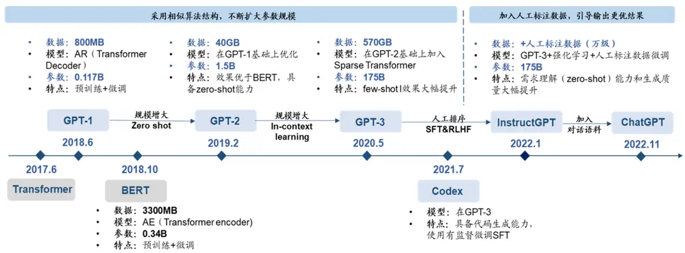
来源：《On the Comparability of Pre-trained Language Models》（Matthias，2020），《Evaluating Large Language Models Trained on Code》（Mark Chen，2021），OpenAI，BFT 智能机器人研究公众号，国金证券研究所

## 1.2 ChatGPT 模型表现优异背后的逻辑

ChatGPT 拥有如此高度的智能水平背后有着多重因素的共同作用，包括随着参数数量提升带来的涌现现象（scalinglaw）、加入 RLHF（人类反馈的强化学习）所带来的对于人类偏好理解的提升等都给模型提供了较强的提升作用。RLHF是一种用于增强语言模型性能的技术，利用关系网络和潜在因子来增强模型的表示能力和泛化能力。这种方式可以帮助其更好地理解和学习文本中的语义关系和结构，生成更加准确和流畅的文本。其训练基本步骤如下：

⚫从大量的包含人类真实意图的指令集合中采样，聘请 40名标注人员对这些指令进行标注，标注完成后在 ChatGPT中对模型进行微调。

⚫再次从指令集中采样作为输入数据，从 ChatGPT3.5 中得到多个不同结果，聘请标注员对这些输出的好坏顺序进行标注。得到输出顺序后，训练一个打分模型（rewardmodel），使得模型输出结果更能贴近人类最需要的答案。

⚫获得打分模型后，从指令集合中采样新的指令作为输入数据，根据打分模型进一步优化模型的输出结果。结合打分模型训练，得到最终的ChatGPT 模型。

图表2：RLHF（人类反馈的强化学习）过程示意图
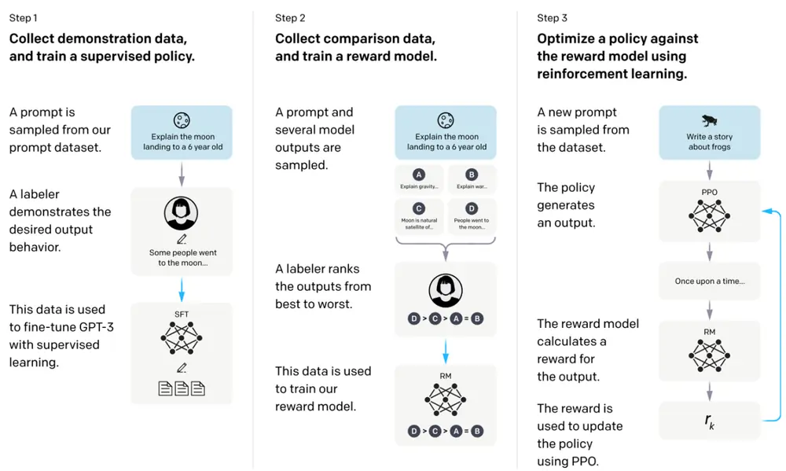
来源：https://openai.com/blog/chatgpt，国金证券研究所

在这种训练模式下，AI逐步具备了一些“常识”。自 GPT-2 开始，只需给模型投喂一些示例，就能使其举一反三给出需要的结果。基本的训练模式分类包括：

Zero-shot learning 指的是模型在没有经过训练数据的情况下，可以利用已有的知识和推理能力完成新任务。
例如，在翻译任务中如果模型训练过英文到法语的翻译任务，它可以无需训练来处理英文到德语的翻译任务。

⚫One-shot learning指的是模型在只有一组训练数据的情况下，可以学习并完成任务。例如，在人脸识别中，如果只提供一张某人的照片，模型可以学习识别该人的所有照片。

- Few-shot learning指的是模型在只有少量训练数据的情况下，可以学习并完成任务。例如，在自然语言推理中，如果只提供很少的相关语料，模型可以学习理解和推理其他类似语料的能力。

因此，ChatGPT由于巨大的参数量和大量的预训练，拥有极强的学习能力，可以在不同的任务中做到足够出色的表现。

## 二、ChatGPT提示工程介绍及使用指南

大语言模型能够处理的任务极其广泛，人类与其交流的灵活度和自由度也达到了空前的高度。然而如何正确与其对话、进行合适的提示对于获取最终需要的结果至关重要。提示工程（PromptEngineering）作为一门新兴学科，主要用于开发和优化语言模型中的提示，有效地将ChatGPT用于各种应用和研究主题。掌握并应用好提示工程的技能，不仅能够提高使用人工智能系统的准确性和效率，也能够降低成本并提升使用体验。对于研究人员而言，也有助于更好地理解模型的能力和局限性，通过交互和提示，更加方便准确地使ChatGPT给出我们需要的结果。

## 2.1 Prompt 提示公式

提示工程的核心是通过设计和提供有效提示或起始短语，指导ChatGPT语言模型的文本生成。一般的提示工程通常由以下3个元素组成：

⚫ 角色：模型在本文生成任务中应扮演的角色。

⚫ 任务：对模型需要生成的内容进行清晰简介的叙述。

⚫ 指令：在生成文本时应遵循的指令。

提示公式一般形式为：“作为一个【角色】，按照这些指示生成【任务】：【指令】”。如希望 ChatGPT 充当客服的角色完成日常的客户答疑等场景需求，则提示公式可以为：

⚫ 作为一名【客服人员】，请生成【客户询问的回复】：【这些回复应当专业、准确、简洁】。

限制提示方式的一个重要作用在于，这种方式能够向模型灌输一种“角色”，并且起到“约束行为”的作用，从而能使模型按照人类的期望完成回答。

此外，我们可以为模型设置更具体化的角色以满足我们的要求。如我们需要模型能给出一个足够专业的回答时，可以针对【角色】部分稍加修饰，以使模型的回复更具针对性。针对【指令】部分，我们也可以完善、丰富提示信息，进一步限制模型的回答范围，从而更便捷得到我们需要的结果。如：

⚫ 作为一名【资深的量化研究员】，请给出一个你认为行之有效的选股因子。【该因子必须：具有原创性、具有较强的逻辑支撑、且因子也应当有出色的业绩表现】。

图表3：ChatGPT生成因子示例1

wx作为一名资深的量化研究员，请给出一个你认为行之有效的选股因子。该因子必须：具有原创性、具有较强的逻辑支撑、且因子也应当有出色的业绩表现。

S作为一名量化研究员，我会选择一个基于机器学习技术的原创选股因子：利用自然语言处理技术从公司年报中提取关键词，通过计算关键词的情感得分来评估公司的财务健康和发展前景。

这个因子的逻辑支撑是，公司年报中的文字材料可以提供有关公司业务和经营环境的丰富信息，而这些信息可以用来预测公司未来的业绩表现。通过使用自然语言处理技术来分析公司年报，我们可以快速而准确地提取出关键词，并计算这些词的情感得分。这些得分可以用来评估公司的整体情绪和态度，以及市场前景和风险

这个选股因子的业绩表现也很出色。在我们的回测中，使用这个因子进行选股的组合表现优于市场平均水平，并取得了可观的超额收益。此外，我们还可以将这个因子与其他因子组合使用，以进一步提高投资组合的表现。

总之，利用自然语言处理技术从公司年报中提取关键词，并通过计算情感得分来评估公司的财务健康和发展前景，是一个具有原创性，逻辑支撑强，并目有出色业绩表现的选股因子

来源：ChatGPT，国金证券研究所

以此为基础，我们可以进一步限定因子类别、构建方式和使用数据，最终得到一个符合我们基本需要的因子。在下图示例中，我们将提示的【指令部分】进行拓展，针对其回答中可能存在的偏差进行限制，从而大大提升了因子的有效性。

## 图表4：ChatGPT生成因子示例2

WX作为一名资深的量化研究员，请构造出一个你认为行之有效的选股因子，并给出详细的构建方式。该因子必须：

1. 具有原创性

2. 具有较强的逻辑支撑

3. 使用逐笔成交数据中的日内高频量价数据构建

4. 利用高频数据隆频形成日频或周频因子

## 图表5：ChatGPT生成因子示例3

作为一名资深量化研究员，按照以下指令，构建一个选股因子：

1. 不要使用现有的技术指标去直接构建

2. 构建一个新的、独特的因子

3. 因子的构建逻辑不要太简单

4.考虑使用价量类数据去研究流动性

5. 请给出构建的详细步骤和计算方法

## S我可以提供一个基于逐笔成交数据的选股因子，称为”价格漂移率因子(Price Drift

1.原创性：该因子的构建是基于市场价格的时间序列漂移特征，结合量化交易中价格漂移(Price Drift) 理论得出的。

2. 逻辑支撑：根据价格漂移理论，市场中的价格是受到市场交易参与者的心理预期和实际交易行为的影响。当市场价格下跌时，交易参与者可能会在价格触及心理支撑位时出现买盘，从而支撑市场价格上涨：当市场价格上涨时，交易参与者可能会在价格触及心理压力位时出现卖盘，从而导致市场价格下跌。因此，可以通过计算市场价格在某一时刻前后的漂移情况，来判断市场交易者的心理预期和实际交易行为，并用此构建选股因子

3.业绩表现：我们可以利用该因子在历史数据上的表现来评估其有效性，我们可以回测过去一段时间内使用该因子的选股策略，并与市场基准指数进行比较。如果该因子的选股策略在历史数据上表现出色，那么该因子就可以被认为是有效的

4. 构建方式：该因子的构建方式如下：

- 首先，我们需要获取逐笔成交数据。

- 对于每一笔成交，记录成交价和成交量。

对于每个时间窗口 (如5分钟)，计算这段时间内市场价格的漂移率。漂移率的计算公式

漂移率 = (当前价格 - 前n个时间窗口的平均价格)/前n个时间窗口的平均价格

其中，n是一个参数，可以根据实际情况进行调整。

最后，对于每个股票，计算其在过去一段时间内漂移率的平均值，并将其作为选股因子的值。

5. 降频方式：由于该因子使用的是高频数据，我们需要将其降频形成日频或周频因子。我们可以在日内每隔一段时间计算漂移率，并将其记录下来。然后，在每个交易日结束后，取当天所有漂移率的平均值作为该股票的当日因子值：在每个交易周结束后，取本周所有交易日的漂移率平均值作为该股票的周度因子值

## S作为一名资深量化研究员，我将按照以下指令构建一个新的、独特的选股因子，并使用价量类数据去研究流动性。以下是我的详细步骤和计算方法

1. 我将选择使用股票的价格和成交量数据，因为这些是股票市场中最基本、最重要的数据之一。价格和成交量通常可以反映股票的流动性和市场情绪，也是很多交易策略的基础。

我将计算每个交易日的股票价格的滚动平均值和滚动标准差，并分别表示为MA和STD。同时，我也将计算每个交易日的成交量的滚动平均值和滚动标准差，并分别表示为VMA和VSTD。

3. 接下来，我将计算股票价格的流动性指标LI(LiquidityIndex)，它是MA和STD之间的比率，用于衡量价格的波动性和市场流动性。LI的计算公式如下

我将计算成交量的流动性指标VLI(VolumeLiquidityIndex)，它是VMA和VSTD之间的比率，用于衡量成交量的波动性和市场流动性。VLI的计算公式如下：VLI = VSTD / VMA

5. 我将使用LI和VLI两个流动性指标来构建新的选股因子，称为“流动性因子(LF)"。LF的计算公式如下：LF = LI * VLI

6.最后，我将对所有股票进行排名，选取LF值最高的股票作为买入信号，选取LF值最低的股票作为卖出信号。

总体来说，LF因子通过考虑股票价格和成交量的流动性指标，综合反映了股票市场的情况，可以作为一种有效的选股因子，用于寻找市场流动性较好的股票。

来源：ChatGPT，国金证券研究所

来源：ChatGPT，国金证券研究所

可以看出，经过详细的、严格的限制后，模型已经能给出一些基本符合要求的因子。在示例2中，模型不仅正确使用了逐笔成交数据中的字段，且根据提示中的限制条件，给出了使用计算均值的方法将因子进行降频的操作。示例3中，因子的构建方式可以明显看出模型参考了一些现有文献和研究结果，在其已有知识的基础上进行一定变形、组合得到了新的选股因子。

## 2.2 提示工程分类

除标准化的提示工程之外，我们可以使用多种类型的提示方式，使模型完成不同类型任务，满足用户的各类需求。

## 图表6：提示工程分类示例及说明

| 提示类型 | 提示示例 | 提示类型说明 |
| --- | --- | --- |
| 知识生成提示 | 将一些【新信息】与关于【特定主题】的现有知识 结合，生成新的知识。 | 使用模型里预先存在的知识，生成新的信息或回答问题。 |
| 情感分析提示 | 请对以下产品评论进行情感分析，并将其分类为积 极、消极或中立【插入评论】。 | 让模型判断一段输入文本的情感色彩或态度。 |
| 强化学习提示 | 翻译为【插入语言】。 | 使用强化学习将以下文本【文本】从【插入语言】通过向模型提供一组输入和奖励，并允许其根据所接受的 奖励调整行为，从而让模型从过去的行为中学习。 |
| 对抗性提示 | 生成难以被分类为具有【插入情感】情感的文本。 | 让模型生成的文本难以生成与所需一致的文本。 |

来源：国金证券研究所

针对其中情感分析类型，我们截取了两段不同的新闻热点，以供模型识别。发现由于神经网络模型本身具有一定的随机性，当输入文本没有特别明确的情感词时，模型给出的结果会有出一定的不确定性。但整体而言，仍能保证一定的准确率。

图表7：ChatGPT 情感分析示例1
图表8：ChatGPT 情感分析示例2
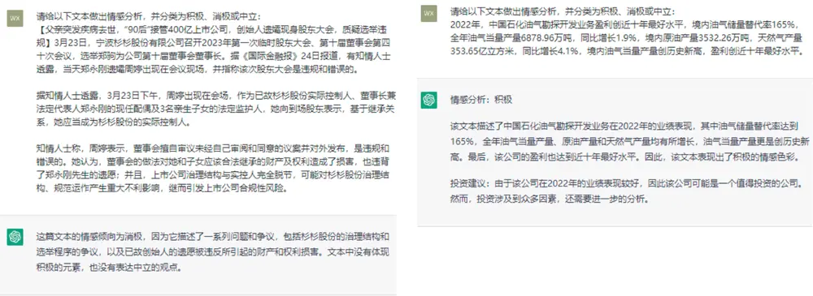
来源：每日经济新闻，ChatGPT，国金证券研究所
来源：e公司公众号，ChatGPT，国金证券研究所

## 2.3 思维链提示（Chain-of-Thought Prompting）

Wei et al(2022)发现利用思维链（Chain of thought）能够极大提升大语言模型在处理复杂逻辑问题上的表现。通过简单的思维链提示的方式就能大大提升一些通用任务、符号化的推理任务和算数任务的准确率。这种提示方式一般采用分步骤思考的方式（think step by step）进行，引导模型将中间推导过程展现出来。一般而言，思维链提示更多用于数学推理提升的演示，此处我们提供示例说明思维链提示的方式也能让模型对于量化研究领域提升其回答效果。

我们知道，IC指标（秩相关系数）作为一种因子评价方式被广泛使用，仍存在一些明显的漏洞。对于两个相同IC值得因子，若其因子值与收益率的相关性在不同区间范围内有着明显的差异，可能会导致使用该因子在投资时实际效果会大打折扣。如下图所示，我们给出了两个因子值排序和对应收益率的一一对应关系。两因子的 IC 值分别为：0.22和0.25。然而由图可知，A因子虽然IC值相对较低，但多头表现较好。而B因子虽IC值相对较高但多头组却表现最差。这一现象会使得根据因子进行实际投资时得到与 IC指标截然相反的效果。

图表9：A 因子 IC 指标示例 1
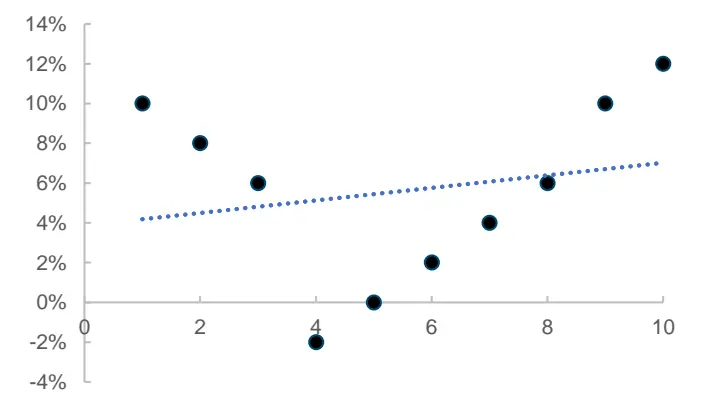
来源：国金证券研究所

图表10：B 因子IC 指标示例2
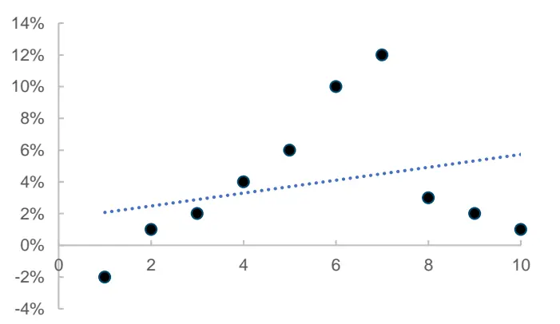
来源：国金证券研究所

一般而言，根据分组赋予 IC不同权重，多头组权重更高，求得加权IC是一个比较直接的解决方案。接下来我们利用思维链提示的方式引导 ChatGPT模型思考，判断其能否准确意识到这一问题。并根据此问题得出改进解决方案。

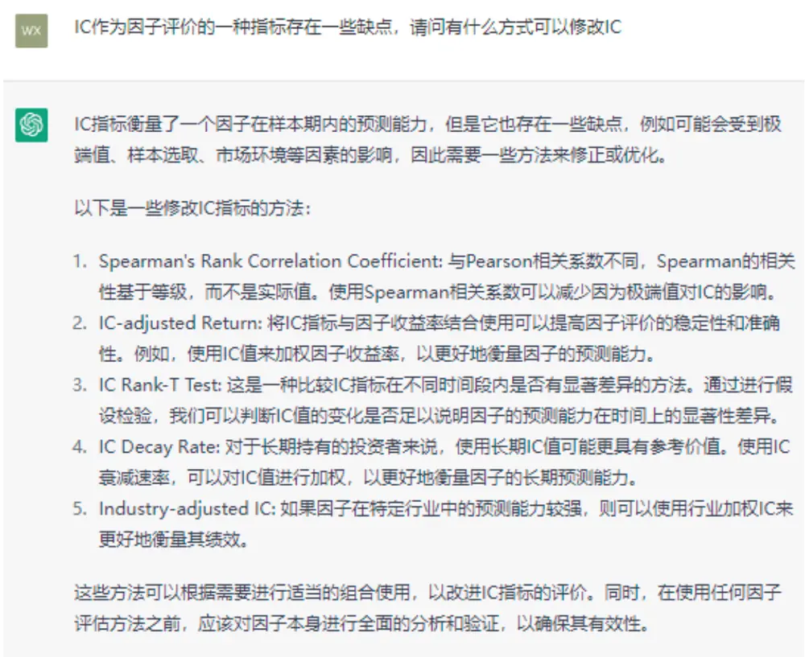
图表11：ChatGPT思维链提示示例1
来源：ChatGPT，国金证券研究所

我们首先尝试了直接询问ChatGPT，有什么方式可以改进IC指标，发现其回答在不经适当引导的情况下很难给出我们思考的问题和改进角度。

图表12：ChatGPT思维链提示示例2
图表13：ChatGPT思维链提示示例3
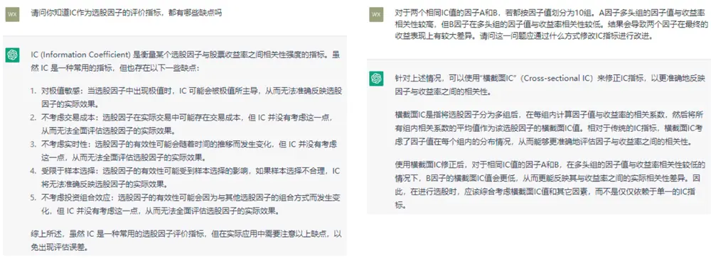
来源：ChatGPT，国金证券研究所
来源：ChatGPT，国金证券研究所

图表14：ChatGPT思维链提示示例4
图表15：ChatGPT思维链提示示例5
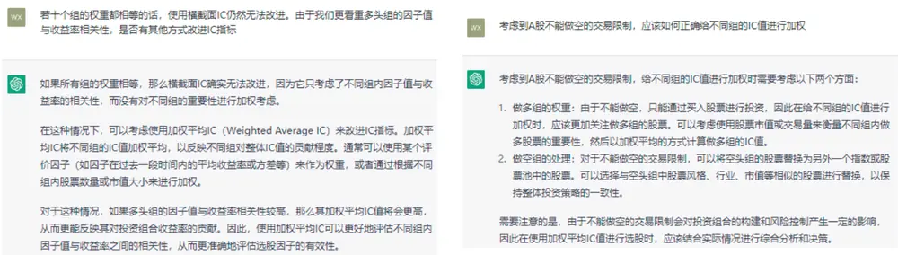
来源：ChatGPT，国金证券研究所
来源：ChatGPT，国金证券研究所

可以看出，经过我们的初步提示，ChatGPT已经认识到我们关注的 IC指标存在的问题并及时给出了一个解决方案：每组内分别计算 IC值，再将所有组内的相关系数求均值得到横截面 IC值。但其逻辑思维能力仍有一定漏洞，我们直接指出后，成功得到了想要的解决方式：计算加权平均 IC 来改进 IC 指标，以反映不同组对整体 IC 值的贡献程度。但由于其对于股票市场A股的做空限制可能认识不足，我们进一步提示后，ChatGPT最终给出了应当给做多组赋予更高权重的回答。但需要注意的是，ChatGPT被训练时接受了海量的文本和数据，其处理实际问题时仍存在一些“生搬硬套”的现象需要不断提示纠正。

## 三、ChatGPT 因子挖掘实战

由以上案例可以说明，ChatGPT在量化研究领域展现出了一定的实用价值。我们此处以常见的因子挖掘作为研究方向，考察经过一定程度的提示（prompt），模型是否能给出符合需求的结果。

## 3.1 周频变异系数因子构建与测试结果

首先我们在中低频上维度上对ChatGPT 的因子挖掘能力进行测试。此处考虑基于量价数据让ChatGPT模型给出一些独特、原创的因子。

图表16：ChatGPT生成因子示例4
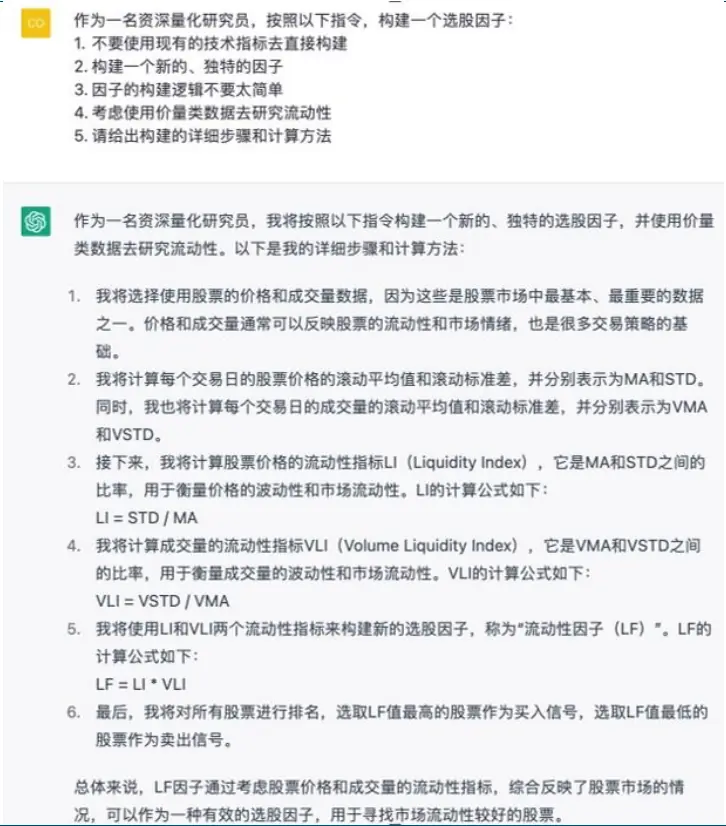
来源：ChatGPT，国金证券研究所

该因子在收盘价和成交量两个领域分别计算其变异系数，并相乘得到一个综合的选股因子。用来衡量股票的波动性和

流动性。此外，我们考虑对因子进行适当变形，将两者变异系数相除，得到新的变异系数因子（LI2VLI）。利用日频的量价数据，取过去 5天的价格和成交量变异系数进行计算，对该因子进行构建：

$$
LI={\frac{\sigma_{price}}{\mu_{price}}}
$$

$$
VLI=\frac{\sigma_{vol}}{\mu_{vol}}
$$

$$
LIxVLI=\mathrm{LI}*\mathrm{VLI}
$$

$$
LI2VLI=\mathrm{LI}/\mathrm{VLI}
$$

我们同样在 2016 年至 2022 年 8 月的区间范围内，中证 1000 指数成份股上进行测试。以周度频率进行调仓，每周初开盘价作为买入价格，每周最后一个交易日收盘价作为卖出价格，因子的 IC指标如下。初步来看，四个因子 IC的 T值均大于 2，IC 均值从 2.79%至 5.36%不等。可以说明价格和成交量的波动率均为越低越好，基本符合低波动异象的情况。

图表17：ChatGPT变异系数因子IC指标（周频）

| 因子 | 平均值 | 标准差 | 最小值 | 最大值 | 风险调整后IC | T统计量 |
| --- | --- | --- | --- | --- | --- | --- |
| LI | -5.36% | 12.25% | -47.76% | 43.04% | -0.44 | -8.07 |
| VLI | -2.79% | 6.83% | -34.60% | 18.19% | -0.41 | -7.53 |
| LIxVLI | -5.29% | 9.09% | -33.49% | 33.76% | -0.58 | -10.74 |
| LI2VLI | -3.11% | 12.24% | -35.95% | 49.06% | -0.25 | -4.69 |

来源：ChatGPT，Wind，国金证券研究所

我们根据十分位组合构建出了因子的多空组合净值，此处展示了多空净值曲线和几个关键指标。

图表18：ChatGPT变异系数因子多空组合净值（周频）
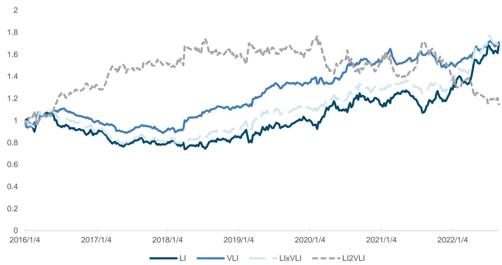
来源：ChatGPT，Wind，国金证券研究所

图表19：ChatGPT变异系数因子多空组合指标（周频）

| 因子 | 年化收益率 | 波动率 | 夏普比率 | 最大回撤 | 多头组合年化超额收益率 |
| --- | --- | --- | --- | --- | --- |
| LI | 8.35% | 16.42% | 0.51 | 31.43% | -1.09% |
| VLI | 8.40% | 9.75% | 0.86 | 20.04% | 2.75% |
| LIxVLI | 8.89% | 12.46% | 0.71 | 27.58% | 0.74% |
| LI2VLI | 2.06% | 15.87% | 0.13 | 35.14% | 0.74% |

来源：ChatGPT，Wind，国金证券研究所

从净值曲线可以看出，除 LI2VLI 因子外，其余因子的多空曲线走势较为平稳。不过对于我们更关注的多头组合年化超额收益率，发现虽然因子的 IC 指标整体表现较好，但多头表现欠佳，因子单调性整体不够明显。其中较高的 VLI因子，多头年化超额收益率为 2.75%，多头夏普比率为0.17。

## 3.2 高频买卖盘力量因子构建与测试结果

利用高频数据构建选股因子作为目前市场关注度较高的一个领域，拥挤度相对较低。且利用此类数据所能挖掘到的因子往往与传统因子有一定的独立性。我们此处限定 ChatGPT在高频领域进行挖掘，使用思维链提示的方式，探究模型的创新性和逻辑性水平。此处首先限定因子的数据使用范围，即结合高频数据里独有的委托量和委托价进行构建，并限制因子必须有一定的原创性，在经过一定程度的引导后，得到了买卖盘力量因子。

图表20：ChatGPT 高频因子挖掘示例1
图表21：ChatGPT高频因子挖掘示例2
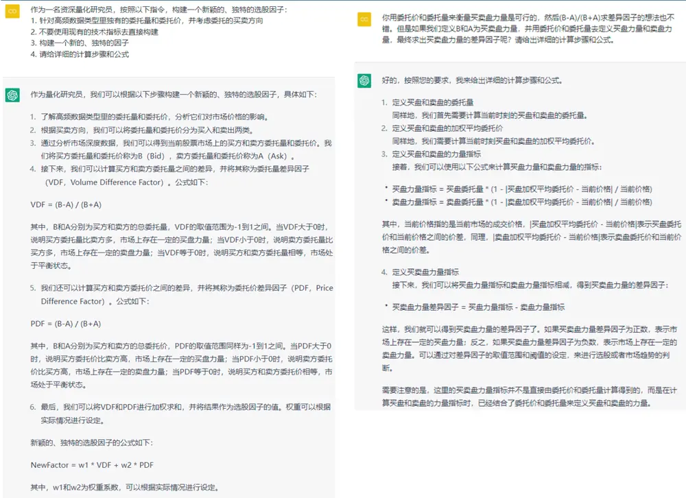
来源：ChatGPT，国金证券研究所
来源：ChatGPT，国金证券研究所

由此，我们根据模型所给出的因子构建方式，利用已有的 A 股 tick 数据进行构建并进行因子测试。使用与前期系列报告中相似的处理方式，对每只股票每天的 3 秒快照数据分别求出前十档的买入委托价、买入委托量和卖出委托价、卖出委托量，最终每个交易日求出均值得到买盘力量、卖盘力量和买卖盘力量差异因子。此处买卖盘力量差异因子我们考虑到逻辑合理性，需要做标准化以做到横截面可比，因此构建过程中我们对因子进行了修正。

$$
BForce=\mathrm{BVol}*(1-\frac{\overline{{pruce_{bud}}}}{\mathrm{price}})
$$

$$
SForce=\mathrm{SVol}*(\overline{{\frac{pruce_{ask}}{\mathrm{price}}}}-1)
$$

$$
BSForce=\frac{BForce-SForce}{BForce+SForce}
$$

我们首先对因子进行了日频调仓的测试，测试时间范围为2016年1 月-2022年 8月，股票范围为所有中证 1000指数成份股。以次日开盘价作为买入价格，测试结果如下：

图表22：ChatGPT买卖盘力量因子IC指标（日频）

| 因子 | 平均值 | 标准差 | 最小值 | 最大值 | 风险调整后IC | T统计量 |
| --- | --- | --- | --- | --- | --- | --- |
| BForce | -0.24% | 15.51% | -52.36% | 44.69% | -0.02 | -0.61 |
| SForce | -1.02% | 14.39% | -52.61% | 42.27% | -0.07 | -2.87 |
| BSForce | 1.13% | 6.49% | -21.02% | 26.37% | 0.17 | 7.00 |

来源：ChatGPT，上交所，深交所，Wind，国金证券研究所

可以看出，在日频的调仓频率下，表现相对较好的是卖盘力量因子（SForce）和买卖盘力量差异因子（BSForce），两者的T统计量均大于2，IC均值也在1%以上。我们根据十分位组合构建出了因子的多空净值，此处展示了多空净值曲线和一些关键指标。

图表23：ChatGPT买卖盘力量因子多空组合净值（日频）
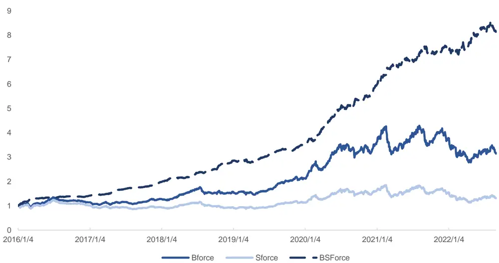
来源：ChatGPT，上交所，深交所，Wind，国金证券研究所

图表24：ChatGPT买卖盘力量因子多空组合指标（日频）

| 因子 | 年化收益率 | 波动率 | 夏普比率 | 最大回撤 | 多头组合年化超额收益率 |
| --- | --- | --- | --- | --- | --- |
| BForce | 18.74% | 19.47% | 0.96 | 35.25% | 11.17% |
| SForce | 4.06% | 18.88% | 0.22 | 38.71% | 6.57% |
| BSForce | 37.00% | 8.21% | 4.51 | 4.88% | 17.29% |

来源：ChatGPT，上交所，深交所，Wind，国金证券研究所

从多空组合的表现来看，虽然买盘力量因子的 IC值不如卖盘力量因子显著，但其多空组合差异更明显，多头也有11.17%的年化超额收益，多空力量因子由于其综合考虑了两个方向的因子并衡量了买卖盘力量失衡的特点，相较于单一方向的因子有明显提高，多空夏普比率为 4.51，多头年化超额收益率为 17.29%。可以说明，利用 ChatGPT 所给方式，日内tick 数据中的委托价和委托量所构建的买盘力量、卖盘力量能够有效预测次日的股票横截面收益率差异。

考虑到日频调仓的成本过高，对于实际投资的盈利水平影响较大，难以获得实际收益。我们此处进一步将因子降为周频测试其效果，在中证 1000 指数成份股上，每周第一个交易日的开盘价成交进行测试。由于买卖盘力量差异因子（BSForce）衰减速度过快，在第二天基本已经失效，我们此处仅使用卖盘力量和卖盘力量因子进行降频测试，其测试效果如下：

图表25：ChatGPT买卖盘力量因子多头组合净值（周频）
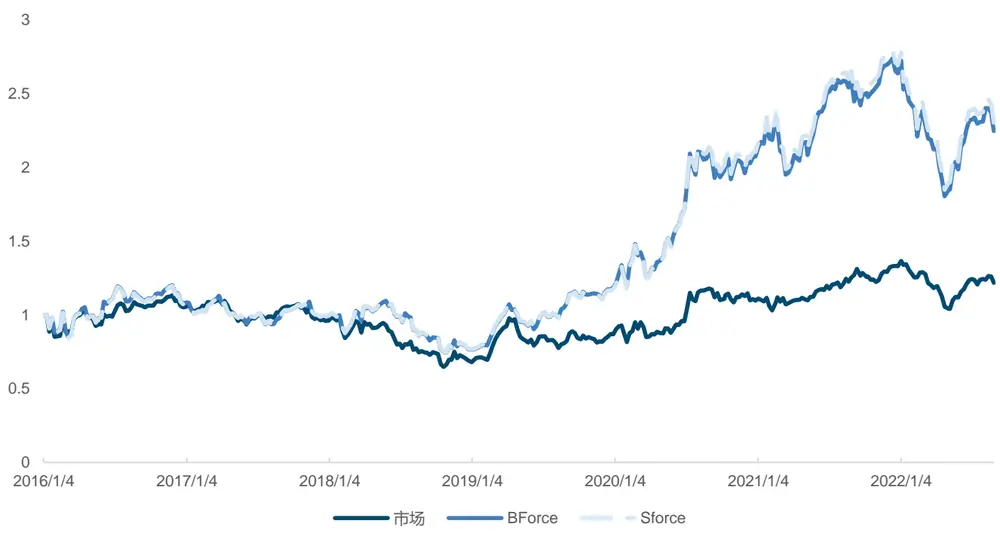
来源：ChatGPT，上交所，深交所，Wind，国金证券研究所

图表26：ChatGPT买卖盘力量因子多空组合指标（周频）

| 因子 | 年化收益率 | 波动率 | 夏普比率 | 最大回撤 | 多头组合年化超额收益率 |
| --- | --- | --- | --- | --- | --- |
| BForce | 6.52% | 20.78% | 0.31 | 38.81% | 9.77% |
| SForce | 8.27% | 20.66% | 0.40 | 37.18% | 10.20% |

来源：ChatGPT，上交所，深交所，Wind，国金证券研究所

两个因子在降为周频后，虽然多空单调性一般，但多头组合表现尚可。多头年化超额收益率分别为 9.77%和 10.20%，多头夏普比率分别为0.48和0.49。说明使用ChatGPT所给方式构建买盘力量和卖盘力量因子表现具有一定的持续性。但由于两因子的相关性较高，我们不再考虑做因子合成，直接使用表现较好的卖盘力量因子（SForce）构建中证1000指数增强策略。策略回测期为2016年 1月至2022年8 月，以每周第一个交易日的开盘价买入进行周频调仓。每次对前5%的股票等权买入，以中证 1000指数为基准进行比较。在单边千分之二的手续费率下，测试结果如下。

图表27：基于ChatGPT买卖盘力量因子的中证1000 指数增强策略表现
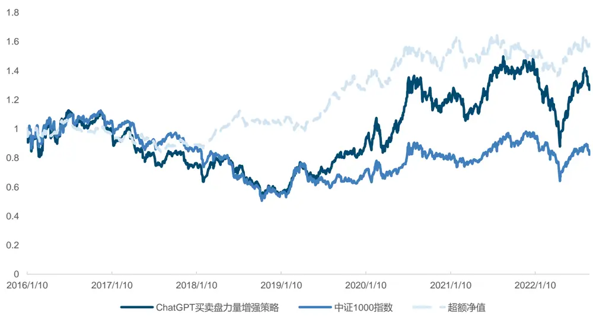
来源：ChatGPT，上交所，深交所，Wind，国金证券研究所

图表28：基于ChatGPT买卖盘力量因子的中证1000 指数增强策略指标

| 统计指标 | ChatGPT 买卖盘力量增强策略 | 中证 1000 指数 |
| --- | --- | --- |
| 年化收益率 | 3.65% | -2.89% |
| 年化波动率 | 27.69% | 24.09% |
| 夏普比率 | 0.13 | -0.12 |
| 最大回撤 | 53.78% | 55.11% |
| 双边换手率（周度） | 12.72% |  |
| 年化超额收益率 | 7.17% |  |
| 跟踪误差 | 12.52% |  |
| 信息比率 | 0.57 |  |
| 超额最大回撤 | 21.16% |  |

来源：ChatGPT，上交所，深交所，Wind，国金证券研究所

可以看出，ChatGPT买卖盘力量因子在2016和2017年表现相对较差，但后续年份基本都表现出了较高的超额收益。多头年化超额收益率为 7.17%，信息比率为 0.57。且因子的换手率相对较低，双边的周度换手率均值为12.72%，可以为现有的多因子组合提供一定的提升空间。

## 3.3 ChatGPT 代码输出测试：因子测试与组合优化

值得一提的是，ChatGPT不仅在文字、数学和表格类回答形式能给用户较好的反馈，其同样也可以直接输出代码从而帮助我们减少在量化研究中的代码工作量，同时也能为不熟悉编程的研究员提供很好的快速上手机会。因子测试作为因子量化研究中必不可少的重要环节，有着相对固定和成熟的框架，我们此处尝试令ChatGPT写出一个因子测试框架以观察其代码编写能力。

## 图表29：ChatGPT因子测试框架代码示例1

wx你好，请用python写出量化选股因子的回测框架，测试内容包括因子的IC指标（包括IC均值、IC标准差、ICIR等），因子的十分组年化超额收益率、夏普比率、最大回撤等指标。

G好的，以下是一个简单的Python量化选股因子回测框架，包括计算IC指标、十分组年化超额收益率，夏普比率和最大回撤等指标，需要注意的是，这个框架只是一个基础模板，具体的选股因子计算方法和数据来源需要根据实际情况进行修改和完善。

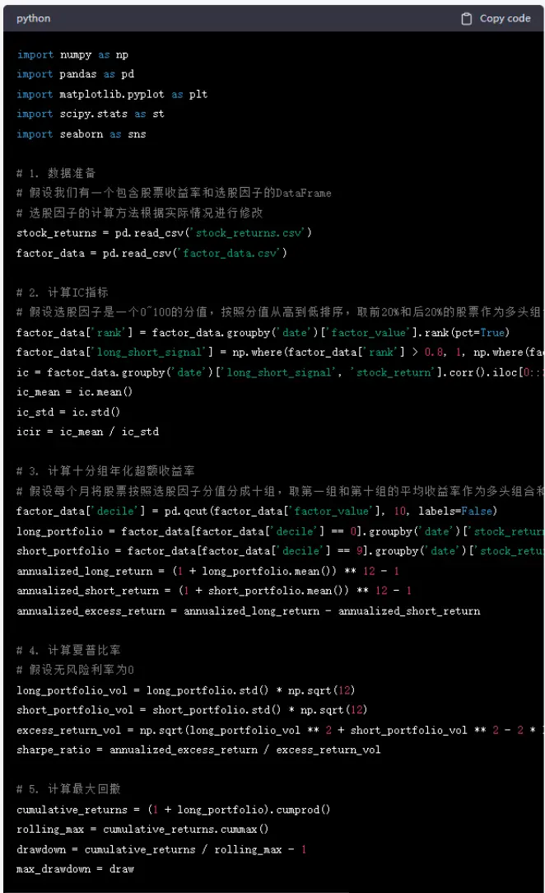

## 图表30：ChatGPT因子测试框架代码示例2

1. 因子IC值请使用因子值与下期收益率的秩相关系数计算，不要使用多空收益率计算。2. 对于年化收益率指标，请使用末期净值数据比初期净值数据的方式，利用几何算法计算。3.请同时加上画图代码，包括多空净值走势，十分组超额收益率单调性，多头、基准与空头净值走势三张折线图。

好的，以下是修改后的代码：
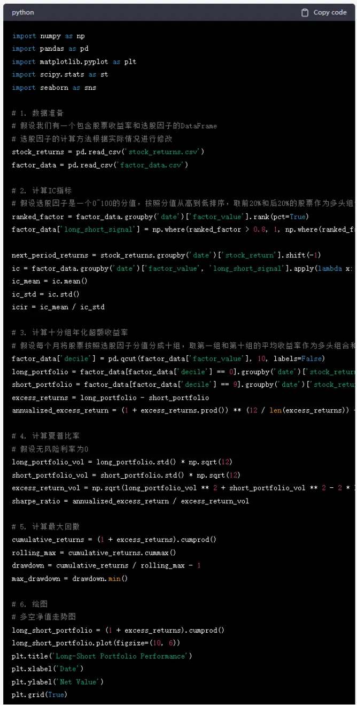
来源：ChatGPT,国金证券研究所
来源：ChatGPT,国金证券研究所

由上图可以看出，由于经过大量数据、文献、代码等海量知识的训练，ChatGPT模型已经能较完整的写出一个因子测试框架，包括了我们所需要的基本功能，如 IC 值指标计算、十分组测试等。然而，细究发现，我们推测由于其所接受到的训练大部分来自于海外文献和海外代码，在因子测试的常用操作中与国内业界常用做法并不相符。在经过指导纠正后，模型也未能准确地将我们的提示理解，可能已经陷入了其“知识盲区”，最终的IC 和年化收益率计算方式未能正确提供相应代码。

因此，若需使用 ChatGPT实现代码输出以提升效率，需格外注意其细节处理方式是否符合我们预期。在个别情况下可能会出现一些 bug仍需我们手动处理。同时，由于代码能否正常运行与我们的数据源格式有很大关系，我们仍需将数据源调整为 ChatGPT代码所默认的格式，或者修改相关数据处理代码以获得正常结果。

综上，我们更建议，对于一些并不熟悉的函数和模型，可以快速使用 ChatGPT 帮助我们了解其基本用法和思路。在

ChatGPT 所给代码的基础上进行修正，从而大大提升研究效率。我们以组合优化为例，令ChatGPT 分别写出了使用均值方差模型进行最大化夏普和使用Black-Litterman模型的组合优化代码。可以看出，ChatGPT比较准确地给出了相关库和函数的基本用法，有助于研究员快速掌握学习并进行修正调试使用。

wx请用python的scipy库写出量化组合优化的代码，优化模型为均值方差法，优化目标为最大化夏普。

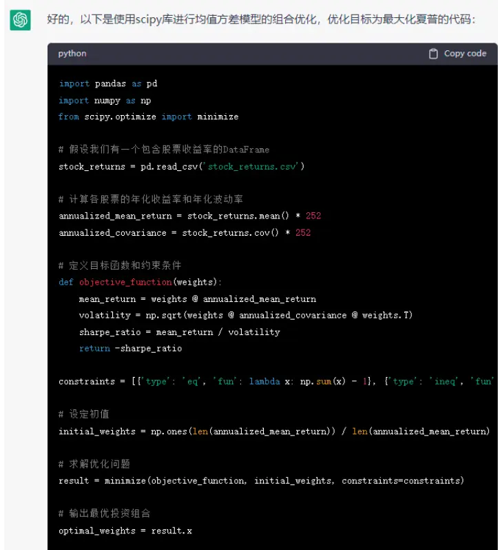

图表31：ChatGPT组合优化代码示例1
图表32：ChatGPT组合优化代码示例2
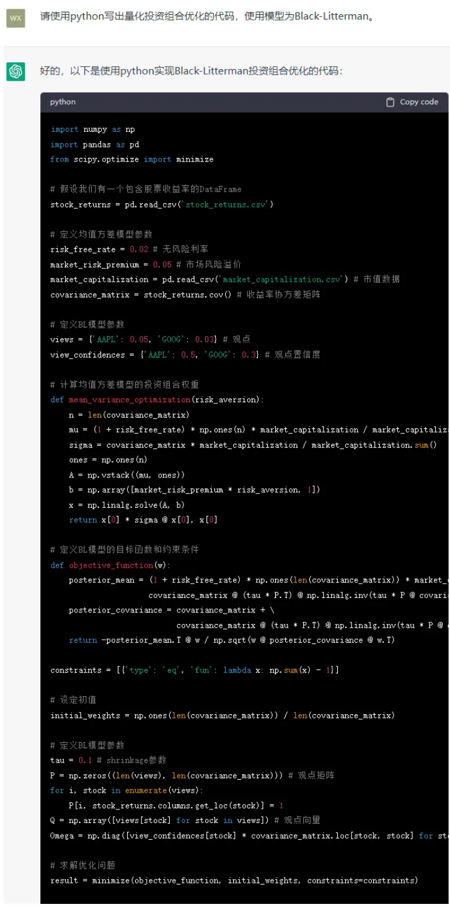
来源：ChatGPT，国金证券研究所
来源：ChatGPT，国金证券研究所

## 四、总结

通过研究、测试，我们发现 ChatGPT作为一种大语言模型，在量化研究领域也能提供很多不同形式的解决方案。从量化研究的概念和知识、到挖掘创新性高频因子和输出代码等工作都能在一定程度上提升研究人员的工作效率，帮助提供疑问解答和创新思路都能取得令人满意的效果。我们利用一定的提示工程方法和技巧，对ChatGPT加以引导和限制，发现模型能够结合其本身训练得到的知识加以改进创新，最终得到基本符合我们需求的高频因子。

我们对 ChatGPT买卖盘力量因子进行构建并测试，发现在日度的调仓频率下，买卖盘力量差异因子多头年化超额收益率达到 17.29%，最大回撤为4.88%。考虑交易实际，我们将因子进行降频，在周度的调仓频率下，买卖盘力量因子依然有10%左右的多头年化超额收益率。为考虑手续费对因子盈利性产生的影响，我们利用该因子构建了中证1000指数增强策略，在 2016年 1月至2022年8月期间，手续费率为单边千分之二的情况下，策略的年化超额收益率为 7.17%，信息比率为 0.57，作为一个具有相对独特数据来源的高频因子，ChatGPT 买卖盘力量因子可以为现有的多因子组合提供一定的提升空间。

最后，我们测试了ChatGPT输出代码的能力，发现其对于量化研究常用的框架、函数都能基本掌握，但在一些细节问题上仍然需要我们进行纠正微调。因此，对于一些并不熟悉的函数和模型，可以快速使用 ChatGPT 帮助我们了解其基本用法和思路。并在所给代码的基础上进行修正，从而大大提升研究效率。

## 风险提示

1、ChatGPT 模型具有一定的随机性，在部分情况下可能回答错误，不符合用户需求与认知，并影响到用户判断。

2、以上因子测试结果通过历史数据统计、建模和测算完成，在政策、市场环境发生变化时模型存在失效的风险。

3、策略依据一定的假设通过历史数据回测得到，当交易成本提高或其他条件改变时，可能导致策略收益下降甚至出现亏损 。

## 特别声明：

国金证券股份有限公司经中国证券监督管理委员会批准，已具备证券投资咨询业务资格。

形式的复制、转发、转载、引用、修改、仿制、刊发，或以任何侵犯本公司版权的其他方式使用。经过书面授权的引用、刊发，需注明出处为“国金证券股份有限公司”，且不得对本报告进行任何有悖原意的删节和修改。

本报告的产生基于国金证券及其研究人员认为可信的公开资料或实地调研资料，但国金证券及其研究人员对这些信息的准确性和完整性不作任何保证。本报告反映撰写研究人员的不同设想、见解及分析方法，故本报告所载观点可能与其他类似研究报告的观点及市场实际情况不一致，国金证券不对使用本报告所包含的材料产生的任何直接或间接损失或与此有关的其他任何损失承担任何责任。且本报告中的资料、意见、预测均反映报告初次公开发布时的判断，在不作事先通知的情况下，可能会随时调整，亦可因使用不同假设和标准、采用不同观点和分析方法而与国金证券其它业务部门、单位或附属机构在制作类似的其他材料时所给出的意见不同或者相反。

本报告仅为参考之用，在任何地区均不应被视为买卖任何证券、金融工具的要约或要约邀请。本报告提及的任何证券或金融工具均可能含有重大的风险，可能不易变卖以及不适合所有投资者。本报告所提及的证券或金融工具的价格、价值及收益可能会受汇率影响而波动。过往的业绩并不能代表未来的表现。

客户应当考虑到国金证券存在可能影响本报告客观性的利益冲突，而不应视本报告为作出投资决策的唯一因素。证券研究报告是用于服务具备专业知识的投资者和投资顾问的专业产品，使用时必须经专业人士进行解读。国金证券建议获取报告人员应考虑本报告的任何意见或建议是否符合其特定状况，以及（若有必要）咨询独立投资顾问。报告本身、报告中的信息或所表达意见也不构成投资、法律、会计或税务的最终操作建议，国金证券不就报告中的内容对最终操作建议做出任何担保，在任何时候均不构成对任何人的个人推荐。

在法律允许的情况下，国金证券的关联机构可能会持有报告中涉及的公司所发行的证券并进行交易，并可能为这些公司正在提供或争取提供多种金融服务。

本报告并非意图发送、发布给在当地法律或监管规则下不允许向其发送、发布该研究报告的人员。国金证券并不因收件人收到本报告而视其为国金证券的客户。本报告对于收件人而言属高度机密，只有符合条件的收件人才能使用。根据《证券期货投资者适当性管理办法》，本报告仅供国金证券股份有限公司客户中风险评级高于C3级(含C3级）的投资者使用；本报告所包含的观点及建议并未考虑个别客户的特殊状况、目标或需要，不应被视为对特定客户关于特定证券或金融工具的建议或策略。对于本报告中提及的任何证券或金融工具，本报告的收件人须保持自身的独立判断。使用国金证券研究报告进行投资，遭受任何损失，国金证券不承担相关法律责任。

若国金证券以外的任何机构或个人发送本报告，则由该机构或个人为此发送行为承担全部责任。本报告不构成国金证券向发送本报告机构或个人的收件人提供投资建议，国金证券不为此承担任何责任。

此报告仅限于中国境内使用。国金证券版权所有，保留一切权利。

上海

电话：021-60753903

传真：021-61038200

深圳

邮箱：researchsh@gjzq.com.cn

北京

电话：0755-83831378

电话：010-85950438

传真：0755-83830558

地址：上海浦东新区芳甸路1088 号紫竹国际大厦7 楼

邮编：201204

邮箱：researchbj@gjzq.com.cn

邮编：100005

地址：北京市东城区建内大街26 号

邮箱：researchsz@gjzq.com.cn

新闻大厦8 层南侧

邮编：518000

地址：中国深圳市福田区中心四路1-1号

嘉里建设广场 T3-2402