# Alpha 掘金系列之六

金融工程专题报告

证券研究报告

金融工程组

分析师：高智威（执业 S1130522110003) 联系人：王小康

gaozhiw@gjzq.com.cn

wangxiaokang@gjzq.com.cn

## 弹性与投资者耐心—一基于高频订单簿的斜率凸性因子

## 订单簿斜率因子的构建

股票作为二级市场上被广泛交易的标的，其价格与供需量的变化受到供需弹性的规律影响。而高频快照数据中的限价订单簿所独有的委托量和委托价信息，为我们提供了绝佳的研究数据来源。我们首先将委托量数据按照其档位进行累加，用委托价和累计委托量计算出买卖双方的订单簿斜率。发现日频斜率因子基本符合我们的一般认知：即买方斜率越大，股票的需求弹性越小，买方投资者对于股票的价格敏感程度较低，则股票有更高的预期收益。对于卖方而言，斜率越小则股票的供给弹性越大，即减少相同的价格会有较大程度的委托量降低，表明卖方不愿轻易降价卖出，同样对应到股票更高的预期收益。但该因子中证 800 和中证 1000 指数成分股上的预测效果都不明显。

## 斜率凸性因子的构建与有效性验证

进一步我们考虑对买卖方斜率进行拆分，分别计算出高档斜率和低档斜率因子。经过测试我们发现，低档位斜率因子与上述的供需弹性逻辑相符。而高档位投资者往往耐心程度更强，且其更有可能拥有优势信息，会与低档位投资者产生相反的预测效果。如买方高档斜率越大，投资者对于更低的价格区间形成了较为一致的预期，股票的预期收益更低。反之，卖方高档斜率越大，投资者的心理预期价格较高，股票预期收益越高。我们考察买卖方斜率差异因子后发现，该因子在大市值股票上表现更佳，且低档位斜率因子具有更强的预测效果。低档买卖方斜率因子在沪深 300 成分股上的多头年化超额收益率达到 13.52%，多空夏普比率为 3.49。

为更好利用斜率高低档的反向预测效果，我们将两个因子进行反向合成，构建出斜率凸性因子，衡量订单簿拟合曲线的凸性程度。若卖方凸性越大，预期收益越高；买方凸性越大，则预期收益越低。结合了买卖双方的斜率凸性因子在沪深 300 成分股上多头年化超额收益率为 12.86%，多空夏普比率为 3.14。降至周频后，因子的多头年化超额收益率依然保持在 10.04%，多空夏普比率为 2.04。最终结合表现较好的卖方斜率凸性和买卖方低档位斜率因子，因子的多头年化超额收益率为 9.53%，多空夏普比率为 1.36。

## 结合斜率凸性因子的中证800指数增强策略

考虑到交易手续费对实际收益的影响，我们在单边千分之二的手续费率下测试斜率凸性的实际表现。发现因子的年化超额收益率达到 8.25%，信息比率为 0.98。另外，将该因子与四个有效的基本因子进行结合，策略的表现进一步得到提升。多年化超额收益率为 19.91%，信息比率为 1.59。

## 风险提示

1、 以上结果通过历史数据统计、建模和测算完成，在政策、市场环境发生变化时模型存在失效的风险。

2、 策略依据一定的假设通过历史数据回测得到，当交易成本提高或其他条件改变时，可能导致策略收益下降甚至出现亏损

## 一、斜率凸性因子的日频有效性验证

在前期系列报告中，我们已在 A 股高频量价关系上做了深度探讨。发现通过逐笔成交数据和高频快照数据所构建出的因子在经过一定方式的降频后能够有效预测股价未来收益水平。本篇作为 Alpha 掘金系列的第六篇报告，从高频快照数据中的限价订单簿入手，利用不同档位委托量和委托价数据，构建出了斜率凸性因子。该因子有效衡量了股票盘口数据中潜在的供需结构和投资者耐心程度，在周度调仓的频率下获得了较好的超额收益。

## 1.1 股票的供给需求弹性与订单簿斜率

在经典的经济学研究中，将商品的需求（供给）价格弹性定义为商品的需求量（供给量）对于价格变动做出反应的敏感程度，通常用需求量（供给量）变动的百分比对价格变动的百分比的比值来表示。

$$
E_{d}=\frac{{\varDelta{Q_{d}}}/{Q_{d}}}{{\varDelta{P}}/{P}}=\frac{{\varDelta{Q_{d}}}}{{\varDelta{P}}}\cdot\frac{P}{{Q_{d}}}
$$

$$
E_{s}=\frac{{\varDelta{Q_{s}}}/{Q_{s}}}{{\varDelta{P}}/{P}}=\frac{{\varDelta{Q_{s}}}}{{\varDelta{P}}}\cdot\frac{P}{{Q_{s}}}
$$

一般情况下，需求弹性为负值，即商品的需求量会随着价格的上升降低。供给弹性为正值，商量的供给量会随着价格的上升而上升。

类似地，股票作为二级市场上被广泛交易的标的，其价格与供需量的变化理应具有同样的规律。而高频快照数据中的限价订单簿所独有的委托量和委托价信息，为我们提供了绝佳的研究数据来源。沪深交易所提供的高频快照数据订单簿数据为每隔三秒的前十档买卖委托单的下单记录，该记录能在一定程度上反应供需双方的买卖意愿，为我们判断股票供需情况，判断投资者意愿和心理状态提供了依据。

图表1：某股票高频快照订单簿数据示例
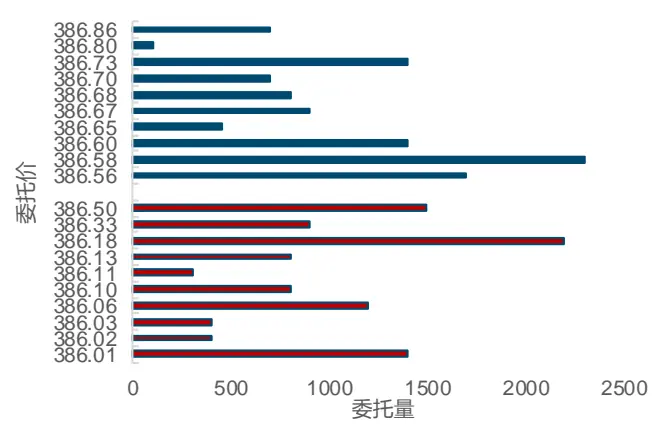
来源：上交所，深交所，Wind，国金证券研究所

图表2：某股票高频快照累计订单簿数据示例（一）
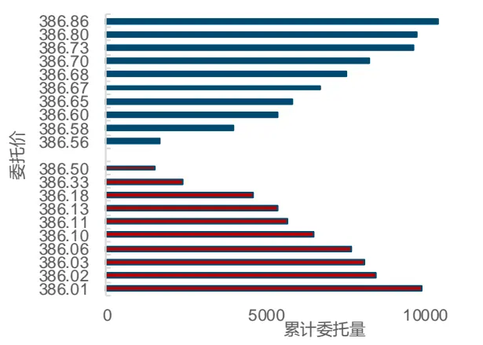
来源：上交所，深交所，Wind，国金证券研究所

在上图中，我们将股票在某一个 Tick 时刻的限价订单簿进行提取处理。针对买卖双方，分别从第一档开始将委托量进行累加。即，对于第 K 档委托，其累计委托量为：

$$
Q_{k}=\sum_{i=1}^{k}Q_{i}
$$

图表3：某股票高频快照累计订单簿数据示例（二）
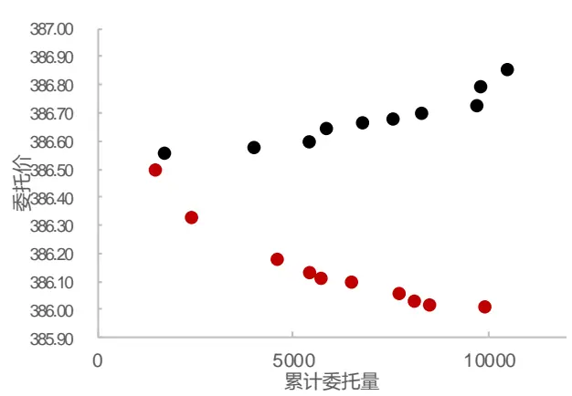
来源：上交所，深交所，Wind，国金证券研究所

图表4：某股票高频快照累计订单簿斜率
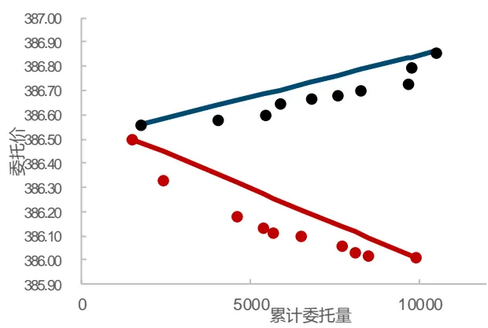
来源：上交所，深交所，Wind，国金证券研究所

接下来，我们进一步提取出每档累计委托量和每档委托价，得到其对应散点图。以第一档和第十档所在位置进行计算，得到了买卖双方所对应的斜率。同时考虑到股票间横截面可比的问题，我们以委托量占比的方式作为分母进行计算，并将买方斜率取负号得到正值，得到买卖方斜率因子：Slope ，Slope 。

根据我们的推测，买方斜率越大，股票的需求弹性越小，买方投资者对于股票的价格敏感程度较低，则股票应有更高的预期收益。对于卖方而言，斜率越小则股票的供给弹性越大，即减少相同的价格会有较大程度的委托量降低，表明卖方不愿轻易降价卖出，同样对应到股票更高的预期收益。同时，为了进一步衡量买卖双方的弹性差异，我们计算了买卖方斜率差异因子：

$$
Slope_{ab}=Slope_{a}-Slope_{b}
$$

## 1.2 订单簿斜率因子的日频有效性验证

根据以上思路，买方斜率越大，会有更高的预期收益，应为正向因子。卖方斜率越小会有更高的预期收益，应为负向因子。我们针对 A 股的高频交易限制，首先求出当天因子均值作为日频因子，以次日开盘价买入进行测试。利用 IC 均值、十分组测试方法，针对 2016年 1 月至 2022 年 8 月中证 800 与中证 1000 所有成分股进行测试。下表展示了因子的 IC统计指标，可以看到，因子在中证 800 成分股上的表现整体一般，几乎无效。在中证 1000成分股上表现略好，但也依然很难达到实际投资需求。

图表5：订单簿斜率因子在中证800成分股上的IC指标及多空收益表现（日频）

| 因子 | IC 均值 | ICt统计量 | 年化收益率 | 夏普比率 | 最大回撤 |
| --- | --- | --- | --- | --- | --- |
| Slopea | 0.34% | 0.80 | 1.33% | 0.07 | 35.06% |
| Slopeb | -0.01% | -0.02 | 2.81% | 0.14 | 47.35% |
| Slopeab | 0.23% | 0.53 | 4.65% | 0.25 | 35.11% |

来源：上交所，深交所，Wind，国金证券研究所

图表6：订单簿斜率因子在中证1000成分股上的1C指标及多空收益表现（日频）

| 因子 | IC均值 | IC t统计量 | 年化收益率 | 夏普比率 | 最大回撤 |
| --- | --- | --- | --- | --- | --- |
| Slopea | 1.56% | 4.53 | 19.92% | 1.1 | 29.51% |
| Slopeb | -1.04% | -2.96 | 13.03% | 0.71 | 35.00% |
| Slopeab | 1.43% | 3.99 | 15.68% | 0.87 | 33.67% |

来源：上交所，深交所，Wind，国金证券研究所

图表7：斜率因子在中证800成分股上的多空净值曲线(日频)
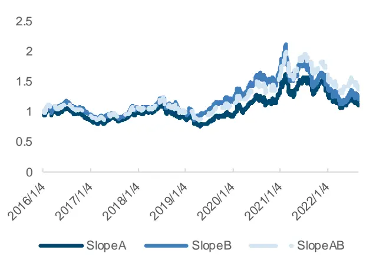
来源：上交所，深交所，Wind，国金证券研究所

图表8：斜率因子在中证1000成分股上的多空净值曲线(日频)
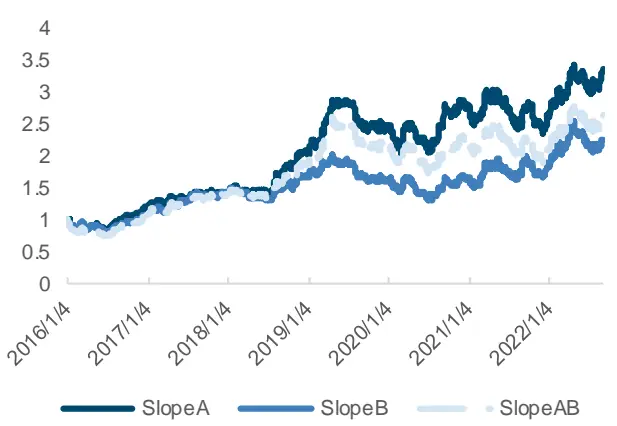
来源：上交所，深交所，Wind，国金证券研究所

## 1.3 高低档斜率因子的分割与日频有效性验证

进一步地，我们思考，大部分投资者会将委托单价格挂在较低的档位上，低档位委托单是否有更明显的弹性特征和预测效果？过去，国内外有多位学者将订单簿斜率进行了更精细的划分，发现高档位委托的投资者与低档位投资者的心理状态不同，普遍更有耐心（Rosu2009），且高低档位的斜率对于股票即时价格的影响会有显著的大小区别。但对于日度以及更长周期的预测效果尚未有明确的研究成果，为此，我们利用 A 股的高频快照数据进行高低档位的切割，以探究不同档位斜率的特征。分别得到买卖方的高低档斜率因子Slope ，Slope ，Slope ，Slope 。

图表9：某股票高频快照高低档斜率示例
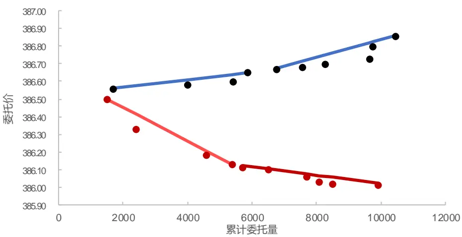
来源：上交所，深交所，Wind，国金证券研究所

一般而言，将委托单价格挂在远离中间价的位置是投资者更有耐心的体现，心理状态的不同可能会导致不同的预测效果。我们推测，低档位斜率因子与上述的供需弹性逻辑相符，即买方低档斜率越大，投资者对于价格的敏感程度越小，股票预期收益越高。卖方低档斜率越大，弹性越小，预期收益越低。而高档位投资者往往耐心程度更强，且其更有可能拥有优势信息，会与低档位投资者产生相反的预测效果。如买方高档斜率越大，投资者对于更低的价格区间形成了较为一致的预期，股票的预期收益更低。反之，卖方高档斜率越大，投资者的心理预期价格较高，股票预期收益越高。

与上文类似地，我们定义了买卖双方对应档位的斜率差异因子以衡量双方的耐心程度差异：

$$
Slope_{abl}={\frac{Slope_{al}-\ Slope_{bl}}{Slope_{al}+Slope_{bl}}}
$$

$$
Slope_{abh}=\frac{Slope_{ah}-\ Slope_{bh}}{Slope_{ah}+Slope_{bh}}
$$

我们同样以次日开盘价在中证 800 和中证 1000 成分股上进行测试，发现经过档位切割的斜率因子相较十档斜率因子有了大幅度的提升，展现出了较强的预测效果。低档位斜率因子表现更加突出，IC 值为-1.69%，风险调整后 IC 为-0.22。

图表10：订单簿高低档斜率因子在中证800成分股上的IC指标（日频）

| 因子 | IC 均值 | 标准差 | 最小值 | 最大值 | 风险调整的IC | T统计量 |
| --- | --- | --- | --- | --- | --- | --- |
| Slopeabl | -1.69% | 7.58% | -32.60% | 28.53% | -0.22 | -8.97 |
| Slopeabh | 1.04% | 11.64% | -50.92% | 43.73% | 0.09 | 3.59 |

来源：上交所，深交所，Wind，国金证券研究所

从多空组合指标来看，低档位斜率因子的多空年化收益率达到 32.75%，多空夏普比率为4.13，最大回撤仅为 6.89%。而高档位斜率因子表现相较低档位有一定差距，多空年化收益率为 12.64%，可以说明低档位的委托订单包含了更丰富的信息。

图表11：订单簿高低档斜率因子在中证800成分股上的多空净值曲线（日频）
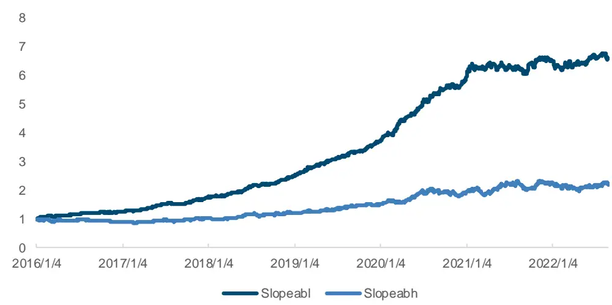
来源：上交所，深交所，Wind，国金证券研究所

图表12：订单簿高低档斜率因子在中证800成分股上的多空组合指标（日频）

| 因子 | 年化收益率 | 波动率 | 夏普比率 | 最大回撤 | 多头年化超额收益率 |
| --- | --- | --- | --- | --- | --- |
| Slopeabl | 32.75% | 7.93% | 4.13 | 6.89% | 12.82% |
| Slopeabh | 12.64% | 12.54% | 1.01 | 14.31% | 1.08% |

来源：上交所，深交所，Wind，国金证券研究所

在中证 1000 成分股上，两个因子表现略逊于中证 800 上的表现，且高低档位差距更大。此外，我们单独测试了沪深 300 成分股上因子的表现，发现该因子与其他常见高频量价因子不同的是，在大市值股票上会有更好的表现。低档位斜率因子 IC 均值为-2.16%，T 值为-9.30。高档位斜率因子 IC 值为 1.36%，T 值 3.93。

图表13：订单簿高低档斜率因子在沪深300成分股上的IC指标（日频）

| 因子 | IC 均值 | 标准差 | 最小值 | 最大值 | 风险调整的IC | T统计量 |
| --- | --- | --- | --- | --- | --- | --- |
| Slopeabl | -2.16% | 9.33% | -35.62% | 32.05% | -0.23 | -9.30 |
| Slopeabh | 1.36% | 13.92% | -65.93% | 49.29% | 0.10 | 3.93 |

来源：上交所，深交所，Wind，国金证券研究所

从多空组合指标来看，低档位斜率因子多空年化收益率为 34.09%，多空夏普 3.49。高档位斜率因子多空年化收益率为 17.57%，夏普比率为 1.21。可以发现，因子在沪深 300 上表现明显更加突出，多空净值曲线的上升趋势也更加稳定。

图表14：订单簿高低档斜率因子在沪深300成分股上的多空净值曲线（日频）
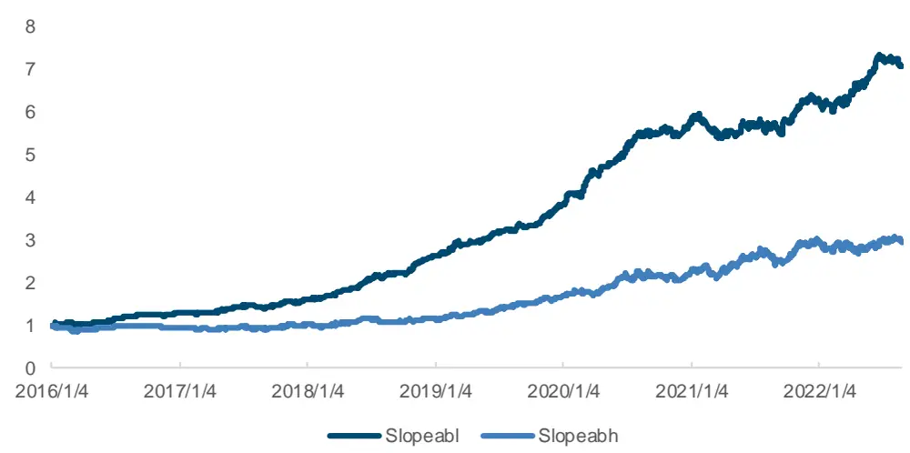
来源：上交所，深交所，Wind，国金证券研究所

图表15：订单簿高低档斜率因子在沪深300成分股上的多空组合指标（日频）

| 因子 | 年化收益率 | 波动率 | 夏普比率 | 最大回撤 | 多头年化超额收益率 |
| --- | --- | --- | --- | --- | --- |
| Slopeabl | 34.09% | 9.76% | 3.49 | 9.82% | 13.52% |
| Slopeabh | 17.57% | 14.46% | 1.21 | 13.72% | 2.82% |

来源：上交所，深交所，Wind，国金证券研究所

## 1.4 斜率凸性因子的构建与日频有效性验证

如上所述，高低档位斜率因子展现了完全相反的预测效果，且低档位斜率因子明显效果更好。因此我们考虑将两个因子按照 2/3,1/3 的比例进行合成，构建出斜率凸性因子，衡量订单簿拟合曲线的凸性程度。依据上文的高低档斜率因子逻辑推理和验证效果，若卖方凸性越大，高低档位斜率差异越大，预期收益越高；买方凸性越大，预期收益越低。

图表16：某股票高频快照斜率凸性因子示例
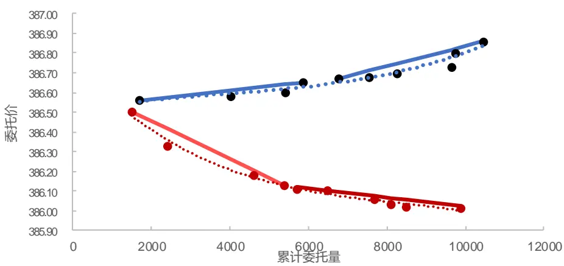
来源：上交所，深交所，Wind，国金证券研究所

经过测试发现，斜率凸性因子在中证 800 成分股上预测效果较好。就单方向而言，卖方的斜率凸性因子 IC 均值达到 1.93%，风险调整后 IC 为 0.18，而买方斜率凸性因子表现相对较差。

造成买卖方表现差异的原因，我们认为主要来自于交易先决条件的不对称导致。若投资者想要卖出某只股票，在不考虑融券做空的情况下，其必须首先持有该股票才能下单卖出。而买入委托无需考虑当前仓位是否已持有，可以直接挂单。因此整体而言，卖方委托单更能反应投资者的真实意图。

买卖双方的斜率凸性因子 IC 均值为-1.65%，风险调整后的 IC 均值为-0.19。经过行业市值中性化后，因子的 IC 均值为-1.54%，风险调整 IC 达到-0.22。

图表17：斜率凸性因子在中证800成分股上的IC指标（日频）

| 因子 | IC 均值 | 标准差 | 最小值 | 最大值 | 风险调整的IC | T统计量 |
| --- | --- | --- | --- | --- | --- | --- |
| Slopealh | 1.93% | 10.88% | -39.74% | 40.68% | 0.18 | 7.14 |
| Slopeblh | 0.19% | 9.24% | -35.79% | 40.93% | 0.02 | 0.83 |
| Slopeablh | -1.65% | 8.89% | -35.20% | 36.07% | -0.19 | -7.47 |
| SlopeabuAdjCI | -1.54% | 6.89% | -26.08% | 28.31% | -0.22 | -9.01 |

来源：上交所，深交所，Wind，国金证券研究所

从多空组合指标来看，斜率凸性因子相较单个因子有一定程度提升，多头组合年化超额收益率为 12.96%。但整体提升效果并不明显，与日频上高档位斜率因子整体表现有关。经过市值中性化后的斜率凸性因子，多空年化收益率为 25.98%，夏普比率达到 3.77， 最大回撤为 6.17%。

图表18：斜率凸性因子在中证800成分股上多空净值曲线（日频）
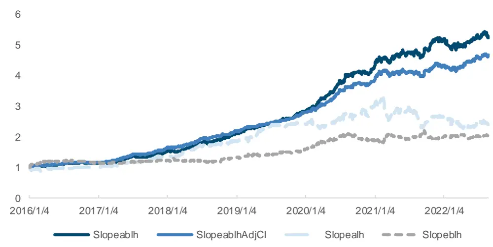
来源：上交所，深交所，Wind，国金证券研究所

图表19：斜率凸性因子在中证800成分股上的多空组合指标（日频）

| 因子 | 年化收益率 | 波动率 | 夏普比率 | 最大回撤 | 多头年化超额收益率 |
| --- | --- | --- | --- | --- | --- |
| Slope ath | 14.11% | 14.23% | 0.99 | 30.38% | 3.72% |
| Slope blh | 11.31% | 10.73% | 1.05 | 13.88% | 3.16% |
| Slope ablh | 28.34% | 8.40% | 3.37 | 7.59% | 12.96% |
| SlopeablhAdjCI | 25.98% | 6.89% | 3.77 | 6.17% | 11.26% |

来源：上交所，深交所，Wind，国金证券研究所

在沪深 300 成分股上，买卖双方的斜率凸性因子 IC 均值略有提升，分别达到 2.07%和1.94%。从多空组合指标来看，因子在沪深 300 和中证 800 上差异不大。

图表20：斜率凸性因子在沪深300成分股上的IC指标（日频）

| 因子 | IC均值 | 标准差 | 最小值 | 最大值 | 风险调整的IC | T统计量 |
| --- | --- | --- | --- | --- | --- | --- |
| Slopealh | 2.04% | 14.25% | -48.49% | 48.88% | 0.14 | 5.75 |
| Slopeblh | 0.00% | 12.29% | -49.93% | 44.28% | 0.00 | 0.00 |
| Slope ablh | -2.07% | 10.67% | -37.48% | 34.28% | -0.19 | -7.81 |
| Slope ablh AdjCI | -1.94% | 8.53% | -31.32% | 28.98% | -0.23 | -9.15 |

来源：上交所，深交所，Wind，国金证券研究所

图表21：斜率凸性因子在沪深300成分股上多空净值曲线（日频）
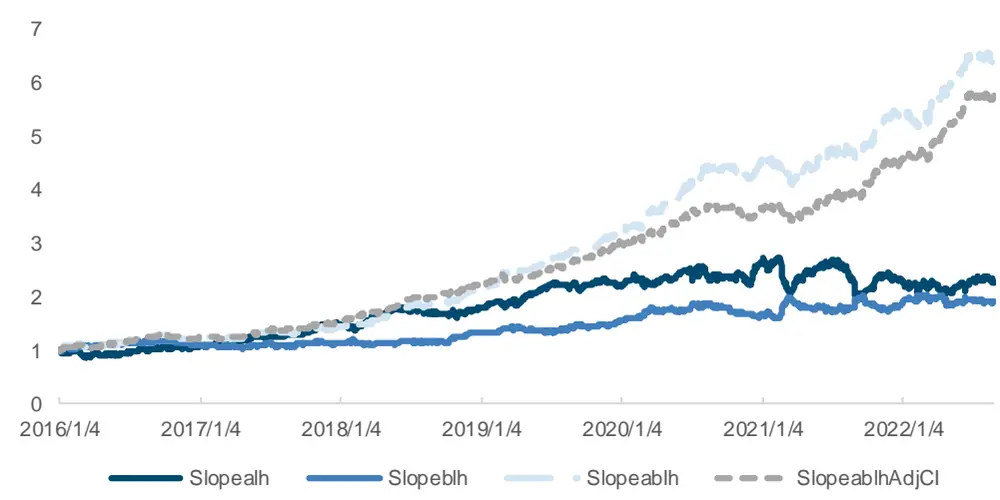
来源：上交所，深交所，Wind，国金证券研究所

图表22：斜率凸性因子在沪深300成分股上的多空组合指标（日频）

| 因子 | 年化收益率 | 波动率 | 夏普比率 | 最大回撤 | 多头年化超额收益率 |
| --- | --- | --- | --- | --- | --- |
| Slope alh | 13.13% | 16.66% | 0.79 | 26.92% | 4.28% |
| Slope blh | 10.35% | 13.04% | 0.79 | 16.03% | 1.10% |
| Slopeablh | 32.25% | 10.27% | 3.14 | 12.70% | 12.86% |
| SlopeabuhAdjCI | 30.03% | 8.83% | 3.40 | 10.22% | 10.54% |

来源：上交所，深交所，Wind，国金证券研究所

## 二、因子降频后的表现

## 2.1 各因子周频有效性验证

由上述斜率凸性因子的日频表现可以看出，高频快照数据的订单簿上高低档位斜率因子有明显的预测效果差异。通过这一特点构建的斜率凸性因子对于次日股票收益率的横截面差异有较好的预测作用。但对于机构投资者来说，日频调仓的手续费较高，难以获得实际收益。因此我们将上述因子降频至周频后考察其表现。

不同高频因子的适用降频方式也并不同，对于预测未来五个交易日的问题而言，我们可以考虑给最近的交易日赋予更高的权重，同样也可以直接取均值得到。另外，对于某些因子而言，仅用当天因子值进行周度调仓预测也能取得较好的效果。我们此处直接使用每周五的因子值，以下周一开盘价买入进行调仓测试。计算得到因子 IC 与分位数组合的主要指标如下。

在中证 800 成分股上，我们发现高低档斜率因子与斜率凸性因子依然保持了较好的预测能力。除高档位斜率因子表现一般外，其余因子的 IC 值均在 1%以上，T 统计量在 2 以上。

图表23：高低档斜率因子与斜率凸性因子在中证800成分股上的1C指标（周频）

| 因子 | IC 均值 | 标准差 | 最小值 | 最大值 | 风险调整的IC | T统计量 |
| --- | --- | --- | --- | --- | --- | --- |
| Slopeabl | -1.16% | 6.94% | -21.48% | 20.04% | -0.17 | -3.05 |
| Slopeabh | 0.69% | 10.81% | -43.14% | 38.23% | 0.06 | 1.16 |
| Slopealh | 2.74% | 10.57% | -35.45% | 34.03% | 0.26 | 4.75 |
| Slopeblh | 1.48% | 8.79% | -28.35% | 40.93% | 0.17 | 3.07 |
| Slope ablh | -1.23% | 8.05% | -26.79% | 23.03% | -0.15 | -2.80 |
| SlopeablAdjCI | -1.23% | 6.22% | -19.72% | 16.25% | -0.20 | -3.61 |

来源：上交所，深交所，Wind，国金证券研究所

就多空组合指标而言，虽然低档位斜率因子出现一定程度下降，但高档位斜率因子反而有较大幅度提升。两个高低档斜率因子的夏普比率为 1.74 和 0.95，多头年化超额收益率为6.48%和 5.30%。结合买卖双方的斜率凸性因子多头年化超额收益率达到 7.02%，夏普比率为 1.72。

图表24：高低档斜率因子与斜率凸性因子在中证800成分股上的多空净值曲线（周频）
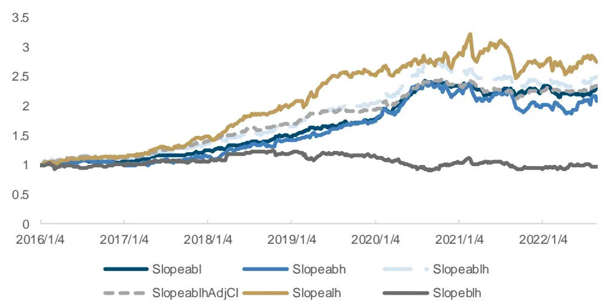
来源：上交所，深交所，Wind，国金证券研究所

图表25：高低档斜率因子与斜率凸性因子在中证800成分股上的多空组合指标（周频）

| 因子 | 年化收益率 | 波动率 | 夏普比率 | 最大回撤 | 多头年化超额收益率 |
| --- | --- | --- | --- | --- | --- |
| Slopeabl | 13.44% | 7.72% | 1.74 | 11.39% | 6.48% |
| Slopeabh | 11.75% | 12.41% | 0.95 | 22.13% | 5.30% |
| Slopeath | 16.47% | 12.81% | 1.29 | 23.51% | 6.33% |
| Slopeblh | -0.51% | 10.61% | -0.05 | 26.31% | 0.27% |
| Slopeablh | 14.67% | 8.51% | 1.72 | 15.62% | 7.02% |
| Slope abuhAdjCI | 13.68% | 6.91% | 1.98 | 12.88% | 6.22% |

来源：上交所，深交所，Wind，国金证券研究所

在沪深 300 成分股上，我们发现高低档斜率因子与斜率凸性因子依然保持了较好的预测能力。除高档斜率因子和卖方斜率凸性因子表现一般外，其余因子的风险调整后IC均在0.20以上，T 值也均大于 2。

图表26：高低档斜率因子与斜率凸性因子在沪深300成分股上的1C指标（周频）

| 因子 | IC 均值 | 标准差 | 最小值 | 最大值 | 风险调整的IC | T统计量 |
| --- | --- | --- | --- | --- | --- | --- |
| Slopeabl | -1.97% | 9.08% | -24.62% | 25.89% | -0.22 | -3.98 |
| Slope abh | 1.24% | 13.38% | -65.93% | 44.63% | 0.09 | 1.69 |
| Slope alh | 3.18% | 14.09% | -44.45% | 41.75% | 0.23 | 4.14 |
| Slope blh | 0.90% | 12.20% | -35.75% | 39.96% | 0.07 | 1.35 |
| Slope ablh | -2.04% | 10.07% | -30.43% | 24.53% | -0.20 | -3.71 |
| SlopeablrAdjCI | -2.00% | 8.10% | -25.95% | 17.79% | -0.25 | -4.53 |

来源：上交所，深交所，Wind，国金证券研究所

就多空表现来看，高档位斜率因子同样出现大幅度提升，达到与低档位因子近似的水平。两个高低档斜率因子的夏普比率分别为 1.79 和 1.11，多头年化超额收益率为 8.29%和7.05%。结合买卖双方的斜率凸性因子依然保持了不错的收益水平，多头年化超额收益率分别为 10.04%和 10.86%，多空夏普比率为 2.04 和 2.21。

图表27：高低档斜率因子与斜率凸性因子在沪深300成分股上的多空净值曲线（周频）
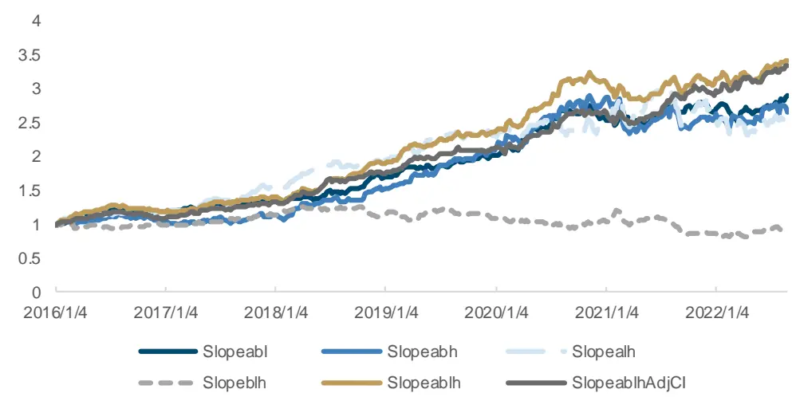
来源：上交所，深交所，Wind，国金证券研究所

图表28：高低档斜率因子与斜率凸性因子在沪深300成分股上的多空组合指标（周频）

| 因子 | 年化收益率 | 波动率 | 夏普比率 | 最大回撤 | 多头年化超额收益率 |
| --- | --- | --- | --- | --- | --- |
| Slopeabl | 17.34% | 9.66% | 1.79 | 10.63% | 8.29% |
| Slope abh | 15.82% | 14.25% | 1.11 | 19.09% | 7.05% |
| Slope ath | 14.68% | 15.64% | 0.94 | 22.82% | 6.58% |
| Slopeblh | -1.16% | 13.43% | -0.09 | 36.05% | -0.48% |
| Slope ablh | 20.27% | 9.92% | 2.04 | 13.17% | 10.04% |
| Slope AdjCI | 19.90% | 9.01% | 2.21 | 8.47% | 10.86% |

来源：上交所，深交所，Wind，国金证券研究所

## 2.2 早盘、尾盘期间因子表现差异探究

此外，为了进一步探究斜率凸性因子在交易日内不同时间段的变化，我们单独计算了高低档斜率因子、斜率凸性因子在早盘（9.30-10.00）和尾盘（14.30-14.57）期间的收益表现，发现因子普遍在尾盘期间效果更佳。

图表29：不同时间段因子在中证800成分股上的IC指标（周频）

| 因子 | IC 均值 | 标准差 | 最小值 | 最大值 | 风险调整的IC | T统计量 |
| --- | --- | --- | --- | --- | --- | --- |
| Slopeabl-open | 0.08% | 7.20% | -57.14% | 22.63% | 0.01 | 0.21 |
| Slopeabl-close | -1.34% | 7.11% | -23.24% | 16.83% | -0.19 | -3.44 |
| Slopeabh-open | -0.50% | 9.39% | -30.78% | 35.71% | -0.05 | -0.97 |
| Slopeabh-close | 1.05% | 8.38% | -20.29% | 30.64% | 0.13 | 2.30 |
| Slope alh-open | 1.09% | 9.27% | -32.51% | 26.40% | 0.12 | 2.17 |
| Slopealh-close | 2.06% | 7.96% | -22.46% | 24.85% | 0.26 | 4.72 |

来源：上交所，深交所，Wind，国金证券研究所

由上表可见，低档和高档斜率因子在早尾盘期间表现差异明显，开盘期间因子 IC 的 T 统计量均不显著，尾盘期间 IC 均值分别为-1.34%和 1.05%，均优于全天因子值的表现。在卖方斜率因子中也有同样现象，卖方尾盘斜率凸性因子 IC 均值达到 2.06%，风险调整后IC 为 0.26，远优于早盘期间表现。

我们推测，这一现象的主要原因在于投资者在不同时间段的委托心态差异。投资者在早盘期间普遍更有耐心，随着临近交易日结束，投资者会倾向更激进的委托挂单以快速完成成交，因此尾盘期间的斜率凸性更能反应投资者真实心理状态。

不过进一步观察因子的多空组合指标可以发现，尾盘期间的低档位斜率因子表现依然不如全天因子的收益水平，而尾盘斜率凸性因子的多头年化超额为 6.72%，略高于全天 6.33%的收益表现。

图表30：不同时间段因子在中证800成分股上多空净值曲线（周频）
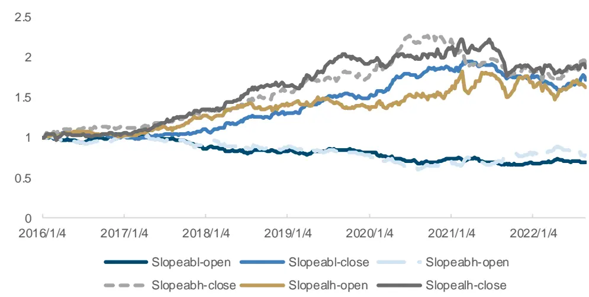
来源：上交所，深交所，Wind，国金证券研究所

图表31：不同时间段因子在中证800成分股上的多空组合指标（周频）

| 因子 | 年化收益率 | 波动率 | 夏普比率 | 最大回撤 | 多头年化超额收益率 |
| --- | --- | --- | --- | --- | --- |
| Slopeabl-open | 5.32% | 7.50% | 0.71 | 37.00% | 1.56% |
| Slopeabl-close | 8.55% | 7.99% | 1.07 | 18.92% | 3.66% |
| Slopeabh-open | -3.53% | 11.11% | -0.32 | 43.44% | 0.38% |
| Slopeabh-close | 10.45% | 9.68% | 1.08 | 25.45% | 7.65% |
| Slopealh-open | 7.57% | 11.87% | 0.64 | 19.33% | 3.35% |
| Slopealh-close | 9.93% | 10.30% | 0.96 | 20.52% | 6.72% |

来源：上交所，深交所，Wind，国金证券研究所

## 2.3 周频因子合成与有效性验证

由上述因子测试结果可以看出，卖方凸性因子表现较好，在周度调仓的回测中有6.58%的多头年化超额收益率。为进一步提高因子收益，我们考虑在原有低档位买卖方斜率因子的基础上，进一步叠加卖方凸性因子考察其效果。由于尾盘期间因子表现相较原因子提升幅度有限，本文以全天因子进行合成测试。以下为各因子在中证 800 成分股上的相关性测试结果。可以发现，因子之间相关性整体不高，除买卖方低档斜率因子外，其余因子的相关系数均在 0.5 以下。

图表32：高低档斜率因子与斜率凸性因子秩相关系数（周频）

|  | Slopealh | Slope blh | Slope abl |
| --- | --- | --- | --- |
| Slope alh | 1.00 |  | Slope abh |
| Slopeblh | 0.30 | 1.00 |  |
| Slopeabl | -0.37 | 0.39 | 1.00 |
| Slopeabh | 0.45 | -0.48 | -0.53 |

来源：上交所，深交所，Wind，国金证券研究所

因此我们进一步将有效因子进行合成，得到斜率凸性因子在中证 800 成分股上的 IC 指标如下。可以看出，合成因子相较单因子的提升幅度明显，IC 均值在 2.54%，风险调整后 IC值为 0.27。经过行业市值中性化后因子的风险调整 IC 进一步提高，达到 0.32。

图表33：斜率凸性因子在中证800成分股上的IC指标（周频）

| 因子 | IC 均值 | 标准差 | 最小值 | 最大值 | 风险调整的IC | T统计量 |
| --- | --- | --- | --- | --- | --- | --- |
| ConvexityFactor | 2.54% | 9.40% | -29.41% | 31.10% | 0.27 | 4.91 |
| ConvexityFactorAdjCl | 2.36% | 7.32% | -23.08% | 23.47% | 0.32 | 5.86 |

来源：上交所，深交所，Wind，国金证券研究所

图表34：斜率凸性因子在中证800成分股上的多空净值曲线（周频）
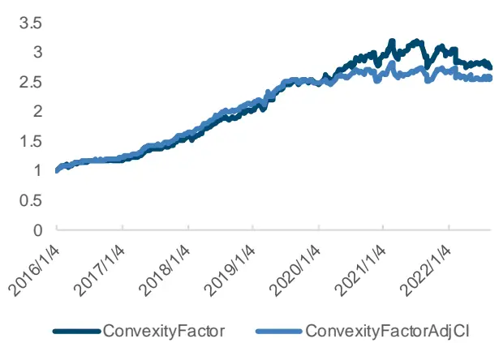
来源：上交所，深交所，Wind，国金证券研究所

图表35：斜率凸性因子在中证800成分股上的分位数组合年化超额收益率（周频）
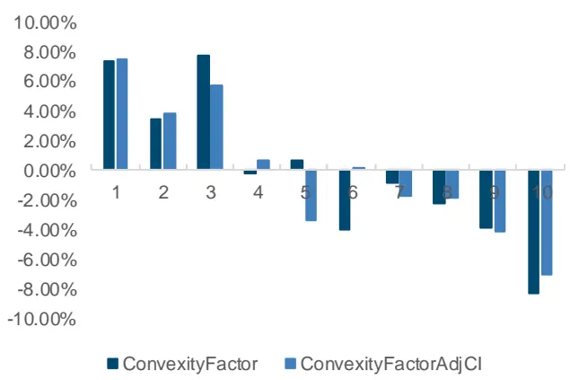
来源：上交所，深交所，Wind，国金证券研究所

图表36：ConvexityFactor因子分位数组合在中证 800成分股上的指标（周频）

| 因子 | 年化收益率 | 波动率 | 夏普比率 | 最大回撤年化超额收益率 |  | 跟踪误差 | 信息比率 |
| --- | --- | --- | --- | --- | --- | --- | --- |
| Top | 6.18% | 20.91% | 0.30 | 26.70% | 7.35% | 5.98% | 1.23 |
| 1 | 1.96% | 22.22% | 0.09 | 29.19% | 3.40% | 5.65% | 0.60 |
| 2 | 6.13% | 22.39% | 0.27 | 31.36% | 7.69% | 5.39% | 1.43 |
| 3 | -1.67% | 22.26% | -0.08 | 37.82% | -0.22% | 4.64% | -0.05 |
| 4 | -0.12% | 19.77% | -0.01 | 39.87% | 0.73% | 6.12% | 0.12 |
| 5 | -5.19% | 21.41% | -0.24 | 50.63% | -3.95% | 4.24% | -0.93 |
| 6 | -2.39% | 22.49% | -0.11 | 34.92% | -0.87% | 4.31% | -0.20 |
| 7 | -3.60% | 22.04% | -0.16 | 45.99% | -2.22% | 4.53% | -0.49 |
| 8 | -5.29% | 22.57% | -0.23 | 48.40% | -3.85% | 5.45% | -0.71 |
| Bottom | -9.59% | 22.15% | -0.43 | 57.39% | -8.35% | 6.50% | -1.28 |
| L-S | 16.40% | 10.71% | 1.53 | 14.31% |  |  |  |

来源：上交所，深交所，Wind，国金证券研究所

图表37：ConvexityFactorAdjCI 因子分位数组合在中证 800成分股上的指标（周频）

| 因子 | 年化收益率 | 波动率 | 夏普比率 | 最大回撤年化超额收益率 |  | 跟踪误差 | 信息比率 |
| --- | --- | --- | --- | --- | --- | --- | --- |
| Top | 6.36% | 20.65% | 0.31 | 25.70% | 7.49% | 5.20% | 1.44 |
| 1 | 2.46% | 21.87% | 0.11 | 29.86% | 3.85% | 4.87% | 0.79 |
| 2 | 4.33% | 21.86% | 0.20 | 32.64% | 5.75% | 4.68% | 1.23 |
| 3 | -0.67% | 21.75% | -0.03 | 39.31% | 0.67% | 4.28% | 0.16 |
| 4 | -4.60% | 21.26% | -0.22 | 41.69% | -3.43% | 4.68% | -0.73 |
| 5 | -1.04% | 21.27% | -0.05 | 39.50% | 0.20% | 4.06% | 0.05 |
| 6 | -3.03% | 21.89% | -0.14 | 41.37% | -1.67% | 3.85% | -0.43 |
| 7 | -3.19% | 21.97% | -0.15 | 43.02% | -1.82% | 4.10% | -0.44 |
| 8 | -5.45% | 22.13% | -0.25 | 48.35% | -4.11% | 4.96% | -0.83 |
| Bottom | -8.34% | 22.14% | -0.38 | 58.23% | -7.08% | 5.83% | -1.21 |
| L-S | 15.15% | 8.92% | 1.70 | 11.90% |  |  |  |

来源：上交所，深交所，Wind，国金证券研究所

在沪深 300 成分股上，斜率凸性因子表现更加出色。IC 均值上升至 3.02%和 2.80%，因子多空年化收益率为 18.50%，行业市值中性化后的因子年化收益率为 15.00%，夏普比率分别为 1.6 和 1.24。

图表38：斜率凸性因子在沪深300成分股上的IC指标（周频）

| 因子 | IC 均值 | 标准差 | 最小值 | 最大值 | 风险调整的IC | T统计量 |
| --- | --- | --- | --- | --- | --- | --- |
| ConvexityFactor | 3.02% | 12.96% | -39.49% | 39.19% | 0.23 | 4.24 |
| ConvexityFactorAdjCI | 2.80% | 10.40% | -32.23% | 31.75% | 0.27 | 4.89 |

来源：上交所，深交所，Wind，国金证券研究所

图表39：斜率凸性因子在沪深300成分股上的多空净值曲线（周频）
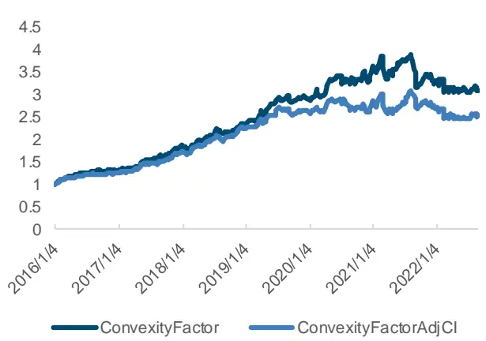
来源：上交所，深交所，Wind，国金证券研究所

图表40：斜率凸性因子在沪深300成分股上的分位数组合年化超额收益率（周频）
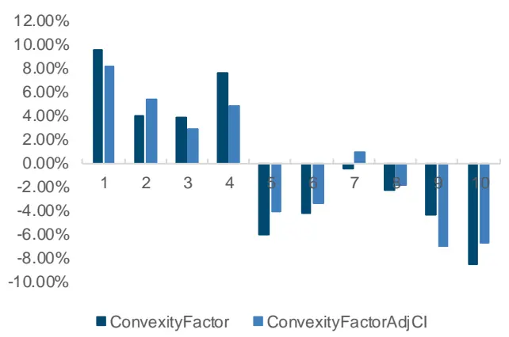
来源：上交所，深交所，Wind，国金证券研究所

图表41：ConvexityFactor因子分位数组合在沪深 300成分股上的指标（周频）

| 因子 | 年化收益率 | 波动率 | 夏普比率 | 最大回撤年化超额收益率 |  | 跟踪误差 | 信息比率 |
| --- | --- | --- | --- | --- | --- | --- | --- |
| Top | 9.65% | 20.53% | 0.47 | 31.91% | 9.53% | 7.99% | 1.19 |
| 1 | 3.62% | 22.34% | 0.16 | 37.47% | 3.93% | 7.69% | 0.51 |
| 2 | 3.69% | 21.85% | 0.17 | 29.80% | 3.90% | 7.46% | 0.52 |
| 3 | 7.45% | 21.49% | 0.35 | 28.51% | 7.65% | 6.49% | 1.18 |
| 4 | -5.79% | 19.54% | -0.30 | 41.10% | -6.05% | 7.35% | -0.82 |
| 5 | -4.52% | 21.62% | -0.21 | 43.31% | -4.26% | 6.02% | -0.71 |
| 6 | -0.72% | 21.77% | -0.03 | 32.64% | -0.42% | 5.79% | -0.07 |
| 7 | -2.49% | 21.44% | -0.12 | 39.40% | -2.31% | 6.59% | -0.35 |
| 8 | -4.57% | 21.74% | -0.21 | 41.00% | -4.39% | 7.41% | -0.59 |
| Bottom | -8.58% | 21.58% | -0.40 | 52.46% | -8.46% | 8.00% | -1.06 |
| L-S | 18.50% | 13.65% | 1.36 | 22.01% |  |  |  |

来源：上交所，深交所，Wind，国金证券研究所

图表42：ConvexityFactorAdjCI因子分位数组合在沪深 300成分股上的指标（周频）

| 因子 | 年化收益率 | 波动率 | 夏普比率 | 最大回撤年化超额收益率 |  | 跟踪误差 | 信息比率 |
| --- | --- | --- | --- | --- | --- | --- | --- |
| Top | 8.16% | 20.60% | 0.40 | 30.51% | 8.12% | 7.26% | 1.12 |
| 1 | 5.26% | 21.36% | 0.25 | 33.89% | 5.44% | 6.48% | 0.84 |
| 2 | 2.76% | 21.40% | 0.13 | 28.20% | 2.92% | 6.70% | 0.44 |
| 3 | 4.58% | 21.66% | 0.21 | 36.22% | 4.81% | 6.58% | 0.73 |
| 4 | -4.06% | 20.60% | -0.20 | 40.09% | -4.05% | 6.52% | -0.62 |
| 5 | -3.65% | 21.57% | -0.17 | 38.87% | -3.42% | 6.20% | -0.55 |
| 6 | 0.74% | 21.25% | 0.03 | 35.22% | 0.93% | 5.94% | 0.16 |
| 7 | -2.12% | 21.50% | -0.10 | 37.45% | -1.88% | 5.82% | -0.32 |
| 8 | -7.18% | 21.14% | -0.34 | 46.26% | -7.06% | 6.53% | -1.08 |
| Bottom | -6.77% | 21.13% | -0.32 | 51.13% | -6.70% | 7.51% | -0.89 |
| L-S | 15.00% | 12.07% | 1.24 | 20.68% |  |  |  |

来源：上交所，深交所，Wind，国金证券研究所

## 三、结合斜率凸性因子的中证800指数增强策略

## 3.1 基于斜率凸性因子构建的中证 800指数增强策略

为了探究本文构建的斜率凸性因子实际交易效果，我们首先基于该因子构建中证 800 指数增强策略。回测期为 2016 年 1 月至 2022 年 8月，以每周第一个交易日的开盘价买入进行周频调仓。每次对前 5%的股票等权买入，以中证 800 指数为基准进行比较。同时为有效降低换手率过高给策略收益带来的负面影响，我们加入换手率缓冲的调整方式降低调仓成本。

可以看出，基于斜率凸性因子所构建的中证 800 指数增强策略相较于基准有明显的优势，超额净值稳步向上。策略的年化超额收益率为 8.25%，信息比率为 0.98。

图表43：基于斜率凸性因子的中证800指数增强策略表现
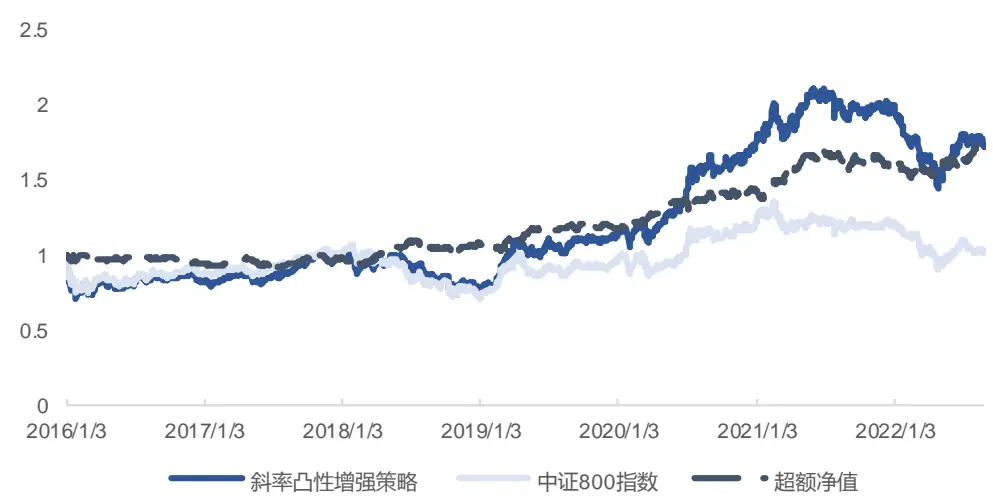
来源：上交所，深交所，Wind，国金证券研究所

图表44：基于斜率凸性因子的中证800指数增强策略指标

| 统计指标 | 斜率凸性增强策略 | 中证800指数 |
| --- | --- | --- |
| 年化收益率 | 8.57% | 0.06% |
| 年化波动率 | 21.35% | 20.37% |
| 夏普比率 | 0.40 | 0.00 |
| 最大回撤 | 31.57% | 33.75% |
| 双边换手率（周度） | 34.13% |  |
| 年化超额收益率 | 8.25% |  |
| 跟踪误差 | 8.38% |  |
| 信息比率 | 0.98 |  |
| 超额最大回撤 | 10.28% |  |

来源：上交所，深交所，Wind，国金证券研究所

## 3.2 斜率凸性因子与传统因子的相关性

进一步地，我们希望探究本文所发现的斜率凸性因子与其他类型因子之间的相关性，考察其是否提供了真正独立的 alpha。我们首先计算了合成后的周频斜率凸性因子与传统风格因子间的秩相关系数，从如下数据可以看出，该因子与风格因子间相关性都较低，相关性最高的为价值因子，仅为 0.17。为保证图表清晰，此处对相关系数均取绝对值处理。

图表45：斜率凸性因子与其他类型因子的秩相关系数
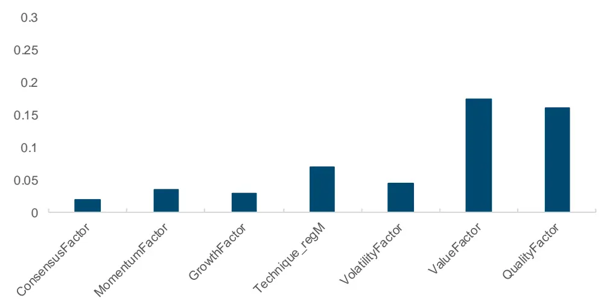
来源：上交所，深交所，Wind，国金证券研究所

为此，我们考虑将斜率凸性因子与在中证 800 指数上表现较好的其他因子进行合成，构建中证 800 指数增强策略。经过我们的检验，发现一致预期（Consensus）、成长（Growth）和技术（Technique_RegM）和动量（Momentum）四个风格因子在中证 800 上表现较好，从下表可以看出，我们将四个因子合成（CGTM）后得到的 IC 均值为 5.67%，风险调整后 IC为 0.49。本次我们将四个因子与斜率凸性因子合成（CGTMConvexity），测试此因子所带来的增量收益。发现最终的合成因子 IC 指标得到进一步提升，均值为 6.25%。

图表46：中证800成分股中斜率凸性因子与其他因子IC指标（周频）

| 因子 | IC均值 | 标准差 | 最小值 | 最大值 | 风险调整的IC | T统计量 |
| --- | --- | --- | --- | --- | --- | --- |
| ConsensusFactor | 1.08% | 6.94% | -28.83% | 18.72% | 0.16 | 2.87 |
| GrowthFactor | 2.71% | 7.99% | -20.73% | 27.71% | 0.34 | 6.25 |
| Technique_RegM | 5.06% | 9.51% | -29.02% | 31.01% | 0.53 | 9.82 |
| MomentumFactor | -4.16% | 15.06% | -44.23% | 42.98% | -0.28 | -5.09 |
| ConvexityFactor | 2.09% | 9.32% | -28.26% | 29.17% | 0.22 | 4.07 |
| CGTM | 5.67% | 11.55% | -38.78% | 30.56% | 0.49 | 9.05 |
| CGTMConvexity | 6.25% | 11.56% | -28.88% | 32.92% | 0.54 | 9.90 |

来源：上交所，深交所，Wind，国金证券研究所

我们将五因子组合进行十分组测试，从多空组合指标可以看出，CGTMConvexity 的收益表现相较于 CGTM 因子组合有明显提升，多空年化收益率达到 56.15%，夏普比率达到 3.29，且多头组合的年化超额收益率也达到了 26.64%。

图表47：中证800成分股中斜率凸性因子与其他因子多空组合净值（周频）
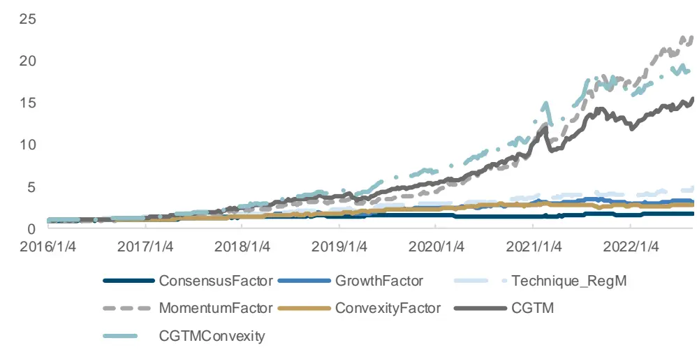
来源：上交所，深交所，Wind，国金证券研究所

图表48：中证800成分股中斜率凸性因子与其他因子多空组合指标（周频）

| 因子 | 年化收益率 | 波动率 | 夏普比率 | 最大回撤 | 多头年化超额收益率 |
| --- | --- | --- | --- | --- | --- |
| ConsensusFactor | 9.40% | 9.63% | 0.98 | 15.34% | 6.59% |
| GrowthFactor | 19.39% | 10.65% | 1.82 | 18.65% | 5.83% |
| Technique_RegM | 26.79% | 12.27% | 2.18 | 17.01% | 5.96% |
| MomentumFactor | 60.25% | 19.22% | 3.14 | 20.66% | 33.17% |
| ConvexityFactor | 16.83% | 9.90% | 1.70 | 15.46% | 6.74% |
| CGTM | 50.98% | 16.66% | 3.06 | 22.76% | 25.72% |
| CGTMConvexity | 56.15% | 17.07% | 3.29 | 19.05% | 26.64% |

来源：上交所，深交所，Wind，国金证券研究所

为进一步考察因子的实盘盈利能力，我们以合成了其他因子的斜率凸性因子构建中证 800指数增强策略。回测期为 2016 年 1 月至 2022 年 8月，以每周第一个交易日的开盘价买入进行周频调仓。每次对前 5%的股票等权买入，以中证 800 指数为基准进行比较。同时为有效降低换手率过高给策略收益带来的负面影响，我们加入换手率缓冲的调整方式降低调仓成本。在千分之二的手续费率下，测试结果如下。可以看出，基于合成后因子构建的增强策略超额收益明显，除 2022 年出现一定程度回撤外，超额净值整体稳定向上。增强策略的年化超额收益率为 19.91%，信息比率为 1.59，超额最大回撤为 18.57%。

图表49：基于斜率凸性因子与其他因子合成的中证800指数增强策略表现
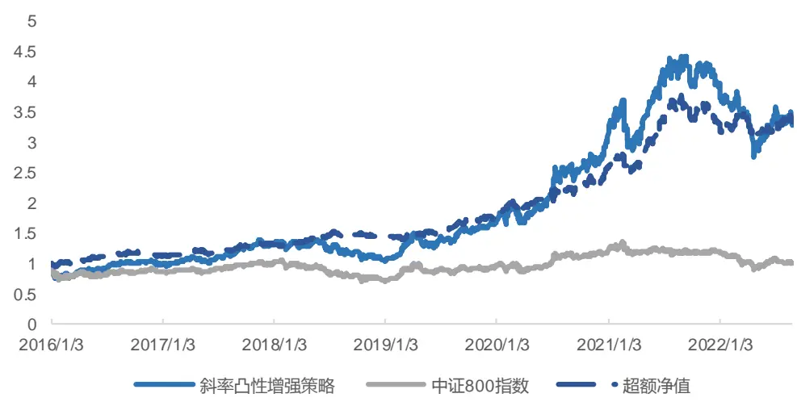
来源：上交所，深交所，Wind，国金证券研究所

图表50：基于斜率凸性因子与其他因子合成的中证800指数增强策略指标

| 统计指标 | 斜率凸性增强策略 | 中证800指数 |
| --- | --- | --- |
| 年化收益率 | 19.65% | 0.06% |
| 年化波动率 | 25.73% | 20.37% |
| 夏普比率 | 0.76 | 0.00 |
| 最大回撤 | 37.67% | 33.75% |
| 双边换手率（周度） | 34.97% |  |
| 年化超额收益率 | 19.91% |  |
| 跟踪误差 | 12.51% |  |
| 信息比率 | 1.59 |  |
| 超额最大回撤 | 18.57% |  |

来源：上交所，深交所，Wind，国金证券研究所

分年度来看，策略在所有年份均取得正的超额收益，且除了 2022 年外每一年的超额收益均在 5%以上，可见策略的表现整体比较稳定。

图表51：基于斜率凸性因子与其他因子合成的中证800指数增强策略分年度收益率
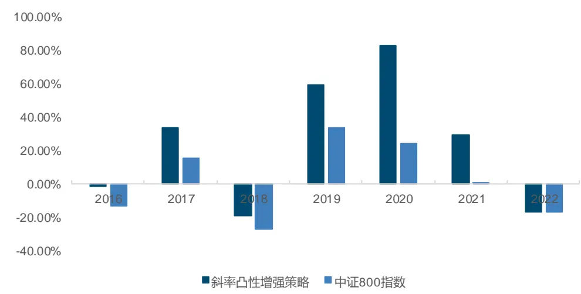
来源：上交所，深交所，Wind，国金证券研究所

对于周度调仓的策略，手续费率直接影响了策略整体的收益表现。为此我们在不同手续费率的情况下进行了对比，同时也针对不同手续费率进行换手率缓冲的参数调优。从下图可以看出，随着手续费率提高，策略收益逐步下降，不过在较严格的千分之三手续费率下，年化超额收益率依然有 17.88%，信息比率达到 1.42。

图表52：不同手续费下策略超额净值对比
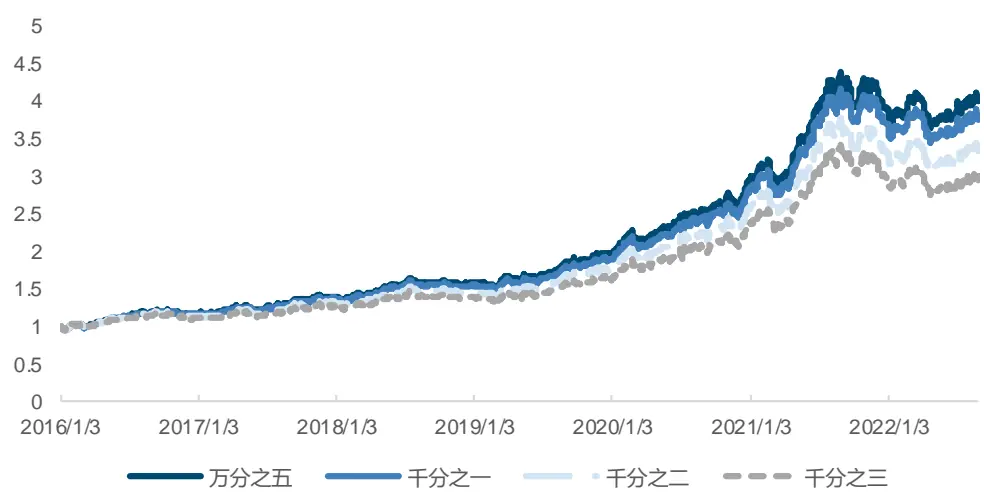
来源：上交所，深交所，Wind，国金证券研究所

图表53：不同手续费下策略指标对比

| 统计指标 | 万分之五 | 千分之一 | 千分之二 | 千分之三 |
| --- | --- | --- | --- | --- |
| 年化收益率 | 22.91% | 21.81% | 19.65% | 17.53% |
| 年化波动率 | 25.74% | 25.73% | 25.73% | 25.73% |
| 夏普比率 | 0.89 | 0.85 | 0.76 | 0.68 |
| 最大回撤 | 36.41% | 36.83% | 37.67% | 38.49% |
| 年化超额收益率 | 23.17% | 22.07% | 19.91% | 17.78% |
| 跟踪误差 | 12.50% | 12.50% | 12.51% | 12.53% |
| 信息比率 | 1.85 | 1.77 | 1.59 | 1.42 |
| 超额最大回撤 | 16.90% | 17.46% | 18.57% | 19.66% |

来源：上交所，深交所，Wind，国金证券研究所

## 四、总结

我们通过研究发现，A 股高频快照订单簿的形状作为被投资者相对忽视的数据，同样具有重要的研究价值。我们参考过往海内外文献，根据股票的供需弹性关系，针对 A 股股票首先构建出了买卖方斜率因子。理论上买方斜率越大，会有更高的预期收益，卖方斜率越小会有更高的预期收益。但发现斜率对于股票未来预期收益率的预测效果并不明显。

进而，我们将高低档斜率拆分计算，发现由于高档投资者的耐心程度不同，其斜率和低档斜率对于股票收益率的预测方向相反。且买方低档斜率越大，股票预期收益越高。卖方低档斜率越大，弹性越小，预期收益越低。而高档位投资者往往耐心程度更强，且其更有可能拥有优势信息，会与低档位投资者产生相反的预测效果。如买方高档斜率越大，投资者对于更低的价格区间形成了较为一致的预期，股票的预期收益更低。反之，卖方高档斜率越大，投资者的心理预期价格较高，股票预期收益越高。

利用高低档斜率差异所构造的斜率凸性因子具有较强的预测效果，且在大市值股票上表现更好，在沪深 300 成分股上达到 12.86%的多头年化超额收益率。我们进一步将有效因子进行合成并降至周频进行测试，发现因子在中证 800 成分股上有 7.35%的多头年化超额收益率，多空夏普比率为 1.53。

通过考察合成后的斜率凸性因子与其他因子的相关系数，我们发现其独立性较强，提供了独特的 alpha 收益。通过将一致预期、成长、技术和动量四类风格因子与本篇报告中的斜率凸性因子进行合成，我们构建了表现优异的中证 800 指数增强策略。在 2016 年 1 月至2022 年 8 月期间，手续费单边千分之二的情况下，策略的年化超额收益率达到 19.91%，信息比率达到 1.59。即便使用较严格的千分之三手续费，策略的年化超额收益率依然有17.78%，信息比率为 1.42。

## 风险提示

1、 以上结果通过历史数据统计、建模和测算完成，在政策、市场环境发生变化时模型存在失效的风险。

2、 策略依据一定的假设通过历史数据回测得到，当交易成本提高或其他条件改变时，可能导致策略收益下降甚至出现亏损

## 特别声明：

国金证券股份有限公司经中国证券监督管理委员会批准，已具备证券投资咨询业务资格。

本报告版权归“国金证券股份有限公司”（以下简称“国金证券”）所有，未经事先书面授权，任何机构和个人均不得以任何方式对本报告的任何部分制作任何形式的复制、转发、转载、引用、修改、仿制、刊发，或以任何侵犯本公司版权的其他方式使用。经过书面授权的引用、刊发，需注明出处为“国金证券股份有限公司”，且不得对本报告进行任何有悖原意的删节和修改。

本报告的产生基于国金证券及其研究人员认为可信的公开资料或实地调研资料，但国金证券及其研究人员对这些信息的准确性和完整性不作任何保证。本报告反映撰写研究人员的不同设想、见解及分析方法，故本报告所载观点可能与其他类似研究报告的观点及市场实际情况不一致，国金证券不对使用本报告所包含的材料产生的任何直接或间接损失或与此有关的其他任何损失承担任何责任。且本报告中的资料、意见、预测均反映报告初次公开发布时的判断，在不作事先通知的情况下，可能会随时调整，亦可因使用不同假设和标准、采用不同观点和分析方法而与国金证券其它业务部门、单位或附属机构在制作类似的其他材料时所给出的意见不同或者相反。

本报告仅为参考之用，在任何地区均不应被视为买卖任何证券、金融工具的要约或要约邀请。本报告提及的任何证券或金融工具均可能含有重大的风险，可能不易变卖以及不适合所有投资者。本报告所提及的证券或金融工具的价格、价值及收益可能会受汇率影响而波动。过往的业绩并不能代表未来的表现。

客户应当考虑到国金证券存在可能影响本报告客观性的利益冲突，而不应视本报告为作出投资决策的唯一因素。证券研究报告是用于服务具备专业知识的投资者和投资顾问的专业产品，使用时必须经专业人士进行解读。国金证券建议获取报告人员应考虑本报告的任何意见或建议是否符合其特定状况，以及（若有必要）咨询独立投资顾问。报告本身、报告中的信息或所表达意见也不构成投资、法律、会计或税务的最终操作建议，国金证券不就报告中的内容对最终操作建议做出任何担保，在任何时候均不构成对任何人的个人推荐。

在法律允许的情况下，国金证券的关联机构可能会持有报告中涉及的公司所发行的证券并进行交易，并可能为这些公司正在提供或争取提供多种金融服务。

本报告并非意图发送、发布给在当地法律或监管规则下不允许向其发送、发布该研究报告的人员。国金证券并不因收件人收到本报告而视其为国金证券的客户。本报告对于收件人而言属高度机密，只有符合条件的收件人才能使用。根据《证券期货投资者适当性管理办法》，本报告仅供国金证券股份有限公司客户中风险评级高于 C3 级(含 C3 级）的投资者使用；本报告所包含的观点及建议并未考虑个别客户的特殊状况、目标或需要，不应被视为对特定客户关于特定证券或金融工具的建议或策略。对于本报告中提及的任何证券或金融工具，本报告的收件人须保持自身的独立判断。使用国金证券研究报告进行投资，遭受任何损失，国金证券不承担相关法律责任。

若国金证券以外的任何机构或个人发送本报告，则由该机构或个人为此发送行为承担全部责任。本报告不构成国金证券向发送本报告机构或个人的收件人提供投资建议，国金证券不为此承担任何责任。

此报告仅限于中国境内使用。国金证券版权所有，保留一切权利。

上海

电话：021-60753903

北京

传真：021-61038200

深圳

电话：010-85950438

邮箱：researchbj@gjzq.com.cn

电话：0755-83831378

传真：0755-83830558

邮箱：researchsh@gjzq.com.cn

邮编：100005

邮箱：researchsz@gjzq.com.cn

邮编：201204

地址：北京市东城区建内大街 26 号

邮编：518000

地址：上海浦东新区芳甸路 1088 号

紫竹国际大厦 7 楼

新闻大厦 8 层南侧

地址：深圳市福田区金田路 2028 号皇岗商务中心

18 楼 1806