证券研究报告

金融工程组

分析师：高智威（执业 S1130522110003)联系人：王小康

gaozhiw@gjzq.com.cn

wangxiaokang@gjzq.com.cn

## ChatGLM医药行业舆情精选策略——大模型微调指南

## 大语言模型微调介绍与一般步骤

在我们前期对于 ChatGPT 的相关研究中发现，虽然模型展现出了极强的通用领域各项能力，但投研人员也需要在保证数据安全的前提下有一个更加垂直领域的模型来辅助进行投研决策。而大语言模型的微调就提供了一种定制私有化大模型、提升器专业能力的方式。由于全量参数微调对于显卡的消耗巨大，我们着重介绍了各类 PEFT（参数高效型）微调的方法和特点，其中 P-Tuning 和 LoRA 是两种目前表现较好的微调方式。

一般的微调包括定义任务并收集数据、数据加载及预处理、训练和评估这几个步骤。其中数据预处理时，我们需要首先将数据及标签转换为模型支持的数据格式，然后进行 padding 和 truncation 的处理以方便后续进行向量运算。选择合适的超参数后进行多轮训练，最终观察样本内和样本外的模型表现。

## ChatGLM2-LoRA微调构建的医药行业舆情精选策略

我们选用表现较好的 LoRA 模式针对前期部署的 ChatGLM2 进行微调。为实际测试模型的微调效果，我们在数据选择上，发现医药行业新闻对于公司的业绩影响推导逻辑链条会更加直接，对大模型而言更易于学习。首先进行了直接以收益率为标签进行训练，但发现微调后的模型在样本外的准确率极低，说明由于文本与收益率之间相关性较弱，难以使模型直接学习。

最终我们综合对比各大模型在中文金融领域的能力后，选择首先使用 ChatGPT3.5 的输出结果作为标签让 ChatGLM2进行学习。结果发现，该标签质量较高，对于未来股价一段时间的超额收益率走势有一定的预测作用。且通过微调后，ChatGLM2也可以学到相应的逻辑推理能力，达到近似于ChatGPT3.5的预测效果，综合准确率达到0.9左右。而FinBERT模型微调后也有一定的提升，但表现略差于 ChatGLM2。最终我们以微调后的 ChatGLM2-LoRA 模型所给出标签构建医药行业周度舆情精选策略，发现在不考虑手续费的情况年化超额收益率达到 30%左右。不过由于个股新闻覆盖度的问题，策略换手较高，我们通过换手率缓冲的方式降低换手后，在单边千分之二的情况，策略的年化超额收益率依然有 12.17%。充分说明，通过合适的标签令 ChatGLM2 进行微调学习，可以使其在特定领域能够达到与 ChatGPT3.5 类似的效果。是一种绝佳的能够在控制成本和数据隐私性安全的情况下使用大模型进行投研辅助的方式。

## 风险提示

1、 大语言模型基于上下文预测进行回答，不能保证回答准确性，由此可能产生误导影响用户判断。

2、 不同的微调方式和超参数选择可能对微调效果产生较大影响，若模型产生过拟合，样本外失效可能会导致策略效果不及预期。

3、 市场若出现超出模型预期的变化，过往逻辑链条适用性下降可能会导致策略失效，需要动态对模型进行微调以修正偏差。

## 一、大语言模型的微调方式简介

我们在前期的 ChatGPT 量化研究报告中，从各个维度利用 ChatGPT 或其他大语言模型助力量化研究。实证结果发现，ChatGPT 在处理非结构化的文本数据上有得天独厚的优势，针对给定金融文本进行情感分析从而判断投资标的的预期收益能够在行业轮动策略上取得良好效果（《Beta 猎手系列之四：如何利用 ChatGPT 解析卖方策略观点并构建行业轮动策略？》）。同时，ChatGPT 在逻辑推理方面同样具有出色表现，针对一些新闻事件可能对于相关资产价格产生的影响也具有较强的预测能力（《CTA 金点子系列之一：基于 ChatGPT 新闻情感分析的原油期货策略》）。

不过，纯粹依赖 ChatGPT 作为投研辅助工具仍然存在以下问题：

- 作为一个通用的大语言模型，ChatGPT 对于金融领域的很多具体概念和知识并不掌握，对于较专业的金融术语会出现错误理解并给出错误判断。

ChatGPT 本身并未开源，若需使用则只能通过网页对话或 API 接口调用的方式解决，这一方面对于关注数据隐私性的投资者来说是一个亟需解决的问题，而另一方面，长期、大量的使用依然会产生高昂的费用。

因此，我们在上篇报告中详细阐述了国产开源大语言模型 ChatGLM 的部署和使用，通过Langchain 知识库挂载的方式提升了 ChatGLM 的专业知识和问答能力。在本篇报告中，我们将通过微调的方式，对模型重新训练，从而进一步提升 ChatGLM 的实际投研辅助能力。

## 1.1 大语言模型微调应用案例

现在通用的大部分大语言模型基本都是使用海量的文本语料数据进行训练，从而给了模型较强的泛化性能，在各个领域都能回答一些基础问题。但并不能立即适用于我们特定的任务需求。

而微调（Fine-Tuning）就能很好的解决这一问题，通过将一个预训练（Pre-Trained）好的模型在一些特定语料、特定任务上进一步训练来大幅增强模型的针对性和专业性。微调目前已经出现了很多比较成功的应用案例，包括机器翻译、情感分析、实体识别、特定类型的文本生成。

在医学领域，已有比较多的问诊类模型出现，BianQue, Med-ChatGLM 等都是基于国产大模型 ChatGLM 进行微调训练得到的。

图表1：ChatGLM-6B 与 Med-ChatGLM模型输出效果对比

| 测试输入 |  | ChatGLM-6B 输出 ChatGLM-6B-Med 输出 |
| --- | --- | --- |
| 谷氨酰转肽酶水平会因吸毒或饮酒而升高 | 吸毒和饮酒都会对身体的健康产生负面影响，包括对肝脏和心脏的 |  |
|  | 影响。 饮酒可能导致肝脏损伤和心脏疾病，因为酒精会破坏肝脏和心脏的 | 谷氨酰转肽酶升高的原因 有很多，包括感染、消化性 |
|  | 功能。长期饮酒还可能导致脂肪肝、肝硬化、心脏病等健康问题。 吸毒会对肝脏和心脏产生严重的损伤，导致肝脏纤维化、肝硬化、心 | 溃疡、感染、药物副作用 |
|  | 脏血管疾病等。吸毒还可能导致精神障碍、社会退缩、暴力和犯罪 | 等，而吸毒或饮酒等不良 行为可能会导致谷氨酰转 |
|  | 等问题。 因此，无论是饮酒还是吸毒，都会对健康产生负面影响，应该避免过 | 肽酶的升高。 |
|  | 度使用。 小李出现了心动过速的症 |  |

来源：Med-ChatGLM，国金证券研究所

图表2：BianQue 模型输出示例
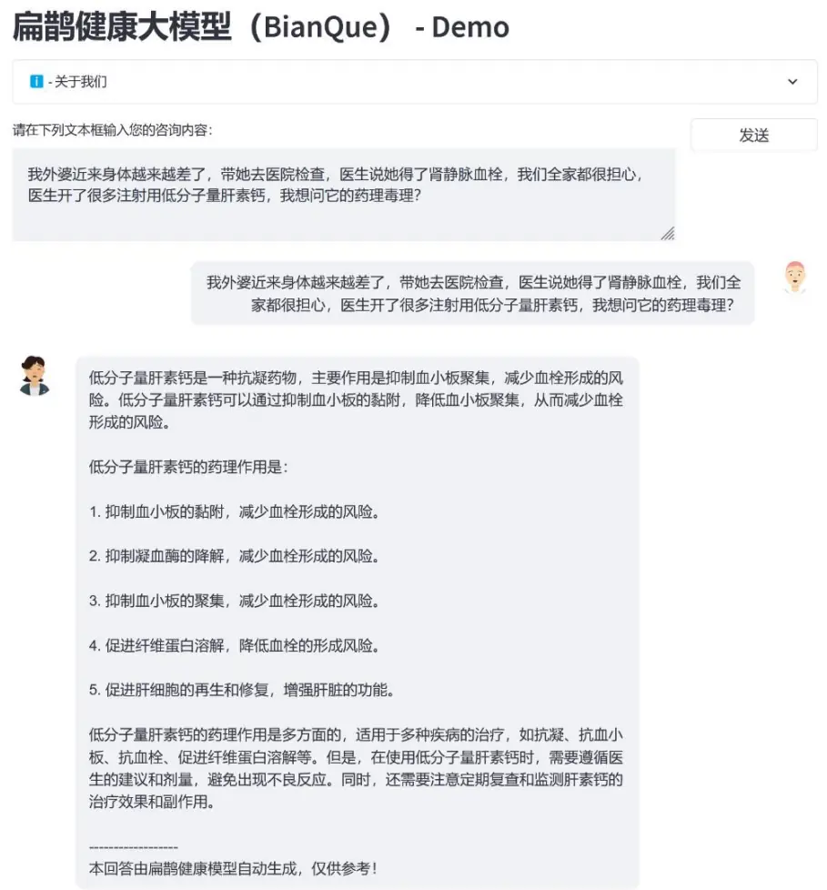
来源：BianQue, 国金证券研究所

同样地，在法律领域也有比较成功的案例，ChatLAW 等模型使用大量法律新闻、法条、司法解释等语料构造对话数据进行训练。从而使得模型在法律咨询领域能给出相对准确、专业的回答。

图表3：ChatLaw模型输出示例
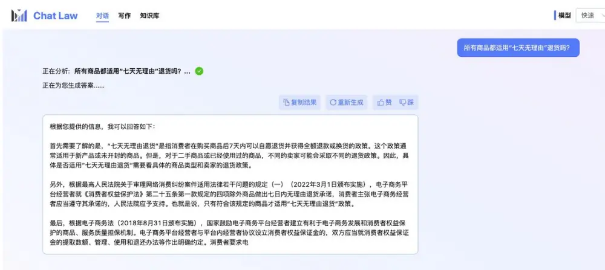
来源：ChatLaw，国金证券研究所

## 1.2 大语言模型微调方法介绍

由于大语言模型本身参数量庞大，针对不同的任务场景和硬件配置要求，也衍生出了多种不同的微调方式：

- 全量微调（Full Fine-Tuning）:作为一种基本的微调方式，它通过在特定数据集上训练模型的所有参数，使其更好地适应任务。但这种方式也会消耗更多的计算资源和训练时间，对于一般的机构和个人而言是一笔不小的负担。

参数高效微调（Parameter-Efficient-Fine-Tuning,PEFT）：为了解决训练消耗资源过大的问题。多种更低成本的替代方法应运而生。常见的 PEFT 微调方式包括：LoRA，P-Tuning, Prefix-Tuning, Prompt-Tuning 等。这类方法的特点就在于可以仅仅训练模型中的一小部分参数或新增一些新的参数，大幅提高训练速度和资源效率，同时经过多种对比发现也依然能保持较好的训练效果。

此处我们几类常见的 PEFT 微调方式简要介绍：

## Prompt-Tuning & Prefix-Tuning:

Prompt-Tuning 方法通过固定预训练参数，针对输入提示进行调整完成训练。传统的Prompt 范式基本是在输入时加上提示文本，但这种方法无法避免人工的介入，同时也无法大规模批量挖掘提示文本。于是研究人员使用连续 token 代替离散的 prompt，拼接文本输入作为特殊的Embedding输入，可以在训练时对prompt时进行优化，从而减少prompt挖掘和选择的成本。

Prefix-Tuning 不再局限于输入层，而是在每一层前面都加入若干个与任务相关的virtual token 作为 prefix，在训练时只更新 prefix 的参数，Transformer 其他部分的参数固定。

LoRA:英文全称为 Low-Rank Adaptation of LLM, 这是一种微软研究人员开发的微调技术。其基本原理是冻结预训练好的模型权重参数，通过往模型中原权重矩阵上添加一些低秩矩阵来实现。其优点在于可以在几乎不损失模型性能的情况下，大幅度减少微调所需的参数和计算资源。同时也能避免全量微调的缺点，即针对每个下游任务都学习和预训练权重维度相同的全新参数集合。

图表4:LoRA 微调原理示例
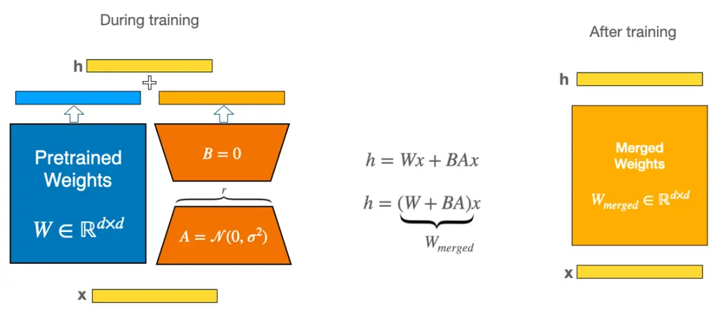
来源：HuggingFace, 国金证券研究所

LoRA 的核心思想类似于残差连接，通过使用旁路的方式更新模拟 Full Fine-Tuning的过程。对于一个参数量为 d 的模型，需要在 d 维空间寻找有效解： $\theta^{(d)}\in R^{d}$ 。研究人员（Li 2018）发现，原本的 d 维空间其实是冗余的，实际仅需 r 个参数就能找到有效解。也就是说，预训练的语言模型具有较低的内部维度（intrinsic dimension），也被称为本征维度，在任务适配的过程中即使投影到较小的子空间，仅训练 r 个参数依然可以有效学习。

$$
\begin{array}{r}{\not\Delta=W_{0}x+\Delta W_{x}=W_{0}x+BA_{x}}\end{array}
$$

如上图所示，在 LoRA 训练过程中，原模型矩阵 $.W_{0}$ 保持不变，只需训练 A 和 B 的部分，最终再与原模型合并。其中 A 的输入维度和 B 的输出维度与原模型保持一致，但A 的输出维度仅需本征维度 r 即可，其中 r≪d，从而达到节省训练资源的效果。

而对于如何确定本征维度 r 的大小，一般可以认为，若通过 LoRA 秩为 r 的微调能够达到 Full Fine-Tuning 的 90%效果，则确定 r 为合适的“本征维度”。下图展示了Aghajanyan et al.2020 使用 Bert 类模型在两类经典的问答任务训练中，不同的本征维度（d）和最终的准确率的对应关系。结果发现，对于 RoBERTa-Large，仅需数百个参数量的训练就可以达到全量微调 90%的效果。其余几个模型也有类似现象。

图表5：BERT 类模型完成MRPC和 QQP 任务准确率与本征维度d关系示例
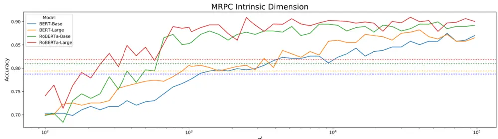

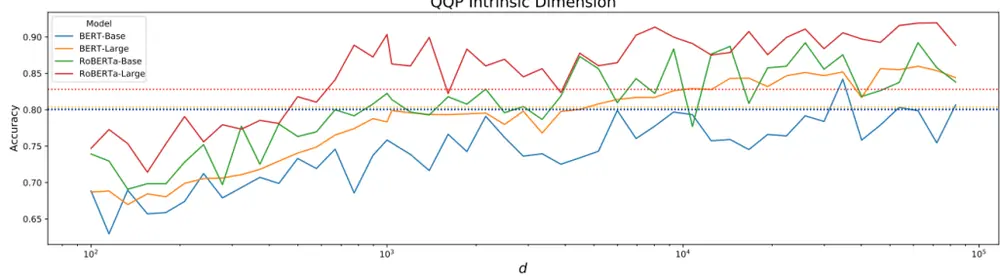
来源：《Intrinsic Dimensionality Explains the Effectiveness of Language Model Fine-Tuning》，国金证券研究所

P-Tuning: 此类方法是近期更新的研究成果，该方法是一种对 soft prompt 的改进。原本的 soft prompt 均只作用 embedding 层，但测试结果发现会导致模型的交互能力变弱。因此 P-Tuning 将连续性 token 插入每一层，从而增大改变量和交互性，与其他向量拼接后正常输入 LLM。

图表6：P-Tuning 与 FulI Fing-Tuning 在不同模型效果比较
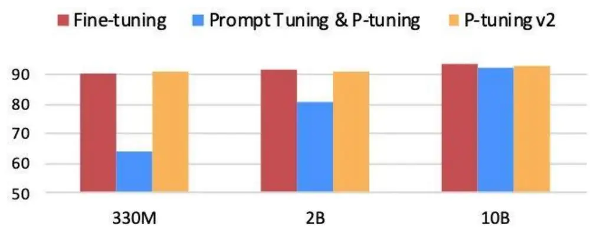
来源：《P-Tuning v2: Prompt Tuning Can Be Comparable to Fine-tuning Universally Across Scales and Tasks》，国金证券研究所

## 二、微调的一般步骤

一般而言，采用不同的微调方式会有不同的具体操作方式。但大体训练过程基本一致，一般包括如下步骤：

定义任务并收集数据：正如上文举例，针对不同的专业领域和任务类型，可以采用不同的训练方式和数据集。在确认好所需训练任务后应考虑相关数据的质量和可得性，一份高质量的语料数据才能取得比较好的训练效果。

数据加载：在本篇报告中，我们暂不讨论无监督的二次预训练。对于仅考虑有监督学习的微调方式而言，我们需要把已有数据进行特定格式化以符合模型的输入格式。一种 常 见 的 数 据 格 式 为 ： [{“Input Text”:”It’s great!”, “ID”:0,“Label”:2},{},…].

- 数据预处理：文本语料与传统机器学习所需的结构化数据存在较大区别，因此我们需要先将文本进行 tokenize 得到模型可以识别的 token。而每条语料的长度差异需要通过 padding 或 truncation 的方式进行对齐。针对现在流行的 Transformer 类模型，我们还需要添加额外的 Attention Mask，提示模型所需要给予注意力的部分。

图表7：大语言模型微调数据预处理的一般步骤

| 处理步骤 | 目的 |
| --- | --- |
| Tokenization | 将文本转换为可以数值计算的 token，一般直接使用原模型的tokenizer |
| Padding | 将较短长度的文本补齐至指定长度，避免后续无法进行矩阵运算 |
| Truncation | 对文本语句裁剪，使每条数据对齐 |
| Attention mask | 指示模型在注意力机制中应关注哪些位置，忽略哪些位置 |

来源：国金证券研究所

训练：确定训练所需超参数及 metric 评价指标，开始迭代训练。常用的训练超参数如下表：

图表8：大语言模型训练常见超参数及其含义

| 超参数 | 含义 |
| --- | --- |
| Epoch | 训练迭代轮数 |
| Learning_rate | 学习率 |
| Learning_rate_scheduler | 学习率调节器，用来控学习率衰减的快慢 |
| Batch_size | 每个批次的样本数量 |
| Gradient accumulation | 梯度累积，更新参数所需的 batch数量 |
| Max_input_length | 最长输入 token 长度 |
| Max_output_length | 最长输出 token 长度 |
| Precision | 计算精度，通过调整可以控制占用计算资源的大小 |

来源：国金证券研究所

通用的通用神经网络超参数我们不再赘述，此处我们只针对大语言模型训练中特殊的超参数进行简要介绍。大模型训练一个重要的问题是显卡的显存消耗问题，由于一般大语言模型至少也有数十亿个参数，若在进行梯度下降时设置了过大的 Batch_Size，则很有可能会导致显存不够而出现服务器崩溃、训练被迫终止的情况，若将 Batch_Size 调小，则模型会很难收敛，难以达到训练预期效果。因此一种特殊的处理方式便是梯度累积：即将多次计算得到的梯度值进行累加，然后一次性进行参数更新，以模拟单次使用一个较大batch 的目的。

图表9：梯度累积原理示意
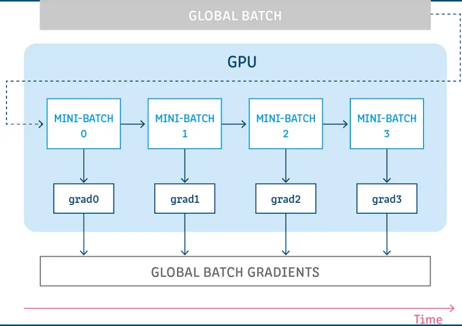
来源：Towards, Data Science，国金证券研究所

我们经过实践发现，选择合适的梯度累积参数能在基本维持不变的收敛能力的前提下，大幅减少训练所需消耗的显卡资源。

除此之外，针对大模型训练的资源消耗问题，还有另一个优化方案：混合精度训练。在训练过程中同时使用单精度（FP32）和半精度（FP16）。由于 FP16 的位宽仅为 FP32 的一半，权重参数所需占用的显存也节省了一半。此外，半精度的数据能提升计算效率，加快训练过程。在具体操作时，我们需要将 FP32 的权重转换为 FP16 格式，进行前向计算，执行优化算法的时候还原为 FP32 的格式。

$$
weight_{32}=weight_{32}+\eta*weight_{16}
$$

- 评估：大模型的评估方法可以用来评价模型训练效果的好坏，通过统计训练后模型回答与数据中标签的匹配度，评判模型性能。常见的评价指标包括 ROUGE 和 BLEU，两种指标都是基于词重叠率设计的，表征了回复的语义准确性。我们以 ROUGE-L 为例，简要介绍其评估思想：

$$
\begin{aligned}&\frac{R_{LCS}=\frac{LCS\left(C,S\right)}{\ln\left(S\right)}}{P_{LCS}=\frac{LCS\left(C,S\right)}{\ln\left(\mathbb{C}\right)}}\\&F_{LCS}=\frac{\left(1+\beta^{2}\right)R_{LCS}P_{LCS}}{R_{LCS}+\beta^{2}P_{LCS}}\\\end{aligned}
$$

上式中，C 和 S 分别为标签和预测结果， $R_{LCS}$ 表示召回率， $P_{LCS}$ 表示精确率。 $F_{LCS}$ 即我们的评价指标 ROUGE-L。这一评价指标通过计算标签和预测结果之间的最长公共子序列（LCS），这一序列越长，则表明两个文本之间越相似，从而得到的结果与标签也就越相近。

## 三、LoRA 微调实践

## 3.1 显卡资源消耗介绍

如上文所述，不同的微调方式、模型和一些超参数设置对于硬件的性能要求也有很大区别。对于全量微调而言，1B 的参数量需要约 40GB 的显存消耗，不同参数模型的情况可以此类推，整体成本相对非常高昂。而对于 PEFT 微调，显存消耗由具体的微调方式和超参数影响，我们此处以 6B 参数量模型为例，将常见的微调场景所需消耗显存列示如下：

图表10：不同微调方式和超参数下消耗显存

| 微调方式 | 批处理大小 | 精度 | GPU 显存 |
| --- | --- | --- | --- |
| LoRA(r=8) | 16 | FP16 | 28GB |
| LoRA(r=8) | 4 | FP16 | 20GB |
| LoRA(r=8) | 4 | INT4 | 8GB |
| P-Tuning(p=16) | 4 | FP16 | 20GB |
| P-Tuning (p=16) | 4 | INT4 | 12GB |

来源：https://github.com/hiyouga/ChatGLM-Efficient-Tuning，国金证券研究所

不过需要注意的是，我们在实际微调时发现，具体的显存消耗可能会在此基础上出现一定向上浮动。此外，Batch_Size 的大小会直接影响模型的收敛能力，对于具有一定难度的逻辑推理、情感分析任务，我们经过多次尝试发现需要将 Batch_Size 维持在一定水平才能取得比较好的训练效果。

## 3.2 微调实践案例

在众多 PEFT 微调方式中，我们选择了效果较好的 LoRA 来进行量化投研领域的微调。微调模型为 ChatGLM2-6B，该模型针对初代 ChatGLM 进行全面升级，使用经过了 1.4T 中英标识符的预训练与人类偏好对齐训练，在各类评测结果中均有大幅度提升。同时 6B 的参数量可以支持多个型号的消费级显卡部署推理，能在很大程度上减轻投资者在显卡资源上的压力。详细的模型评测指标、排名及部署等详细流程请参考我们前期报告。

在正式进行量化投研领域微调前，我们首先尝试了一些简单任务。使用仅需数十个样本数据就可以实现对于 ChatGLM2 的认知改变和知识灌输。

图表11：LoRA 微调改变 ChatGLM2 认知对比——微调前
你好，你是谁
你好！我是ChatGLM2-6B，是清华大学KEG实验室和智谱AI公司共同训练的语言模型。我的任务是针对用户的问题和要求提供适当的答复和支持。由于我是一个计算机程序，所以我没有自我
意识，也不能像人类一样感知世界。我只能通过分析我所学到的信息来回答问题。
来源：ChatGLM2，国金证券研究所

此处我们以认知改变作为示例，将身份相关的信息进行替换作为输入数据，发现经过 10个 epoch 的训练后，模型已经能准确根据我们提供的信息进行回答。

图表12:LoRA 微调改变 ChatGLM2 认知对比——微调后
你好，你是谁
您好，我是由国金金融工程团队微调的ChatGLM2-6B大语言模型。我可以为您提供多种多样的服务，比如翻译、写代码、闲聊、为您答疑解惑等。
来源：ChatGLM2，国金证券研究所

此外，对于模型无法准确掌握金融投资领域相关知识的情况，我们也以中信一级行业分类作为样本进行微调，得到了比较准确地回答。

图表13：通过 LoRA 微调向 ChatGLM2 灌输知识
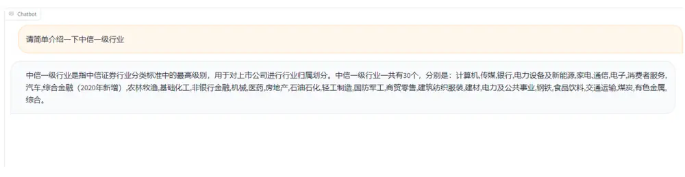
来源：ChatGLM2，国金证券研究所

## 四、基于 LoRA 微调的 ChatGLM2 医药行业舆情精选策略

## 4.1 医药行业新闻文本概述

接下来，我们考虑充分利用大语言模型较强的处理和识别文本数据的特点，以新闻文本作为识别对象尝试将 ChatGLM2 的语义识别能力和逻辑推理能力通过微调的方式进行增强，从而能利用其输出信号进行选股。以下新闻数据来源均为数库。

考虑到新闻内容的复杂性和不同行业之间新闻的巨大差异，我们经过对比发现，部分行业新闻消息与对应股价走势不确定性较高，逻辑推导链条复杂，对于大模型学习而言具有一定难度。而医药行业的很多新闻与药品获批、通过一致性评价等有关，对于公司未来业绩发展的影响和股价走势有相对清晰的逻辑关系。

图表14：医药行业新闻示例

| 新闻文本 |  | 主观判 未来 5 个交易 断分类日超额收益率 |
| --- | --- | --- |
| 翰宇药业(300199）(300199.SZ)公告，公司醋酸阿托西班注射液通过了仿制药质量和疗效的一致性评价，醋酸 阿托西班注射液获批文件在国家药监局网站的办理状态变更为“药品批准证明文件待领取”，签发日期2022年 1月7日。目前公司尚未收到正式药品批件。 广生堂(300436)12月27日晚间发布股价异动公告称，3CL蛋白酶抑制剂研究项目尚处于临床前研发阶段，后续 | 积极 | 48.56% |
| 研发项目开发和注册审批周期较长，合作开发合同书的执行情况及项目研究结果、后续能否获批存在一定不确 定性。3CL蛋白酶抑制剂相关药物虽在国外的临床试验中已显示出对新型冠状病毒感染具有疗效，但该项目合 作开发的创新药的安全性和疗效尚未得到充分验证，有待进一步研究及临床数据验证。（文章来源：证券时 报·e公司)。 讯12月15日消息，莎普爱思（603168）公告称，公司广告符合药品广告审查发布的相关规定，公司已于2016 | 中立 | -8.35% |
| 年启动滴眼液的一致性评价工作；公司目前未出现生产停产等情况，但滴眼液销售生产受到一定影响；股票复 牌。延期回复期间，莎普爱思将继续停牌。所有疑问的核心都直指莎普爱思滴眼液的有效性、以及药品广告合 规性。监管机构都要求莎普爱思按照仿制药新规，拿出临床有效性实验数据，并自查广告。此外，在公开资料 中，尚未发现莎普爱思曾按照仿制药新规开展临床实验，而莎普爱思滴眼液可追述的临床实验数据来自于20年消极 前，彼时国内食药监局尚未成立，这使得莎普爱思的这一历史实验准确性也再遭质疑。不止一位医药行业人士 认为，以目前医药行业的监管来看，莎普爱思应根据仿制药的新规启动新的临床实验，同时修正广告内容，但 这些均对其药品销售形成直接打击，若三年后莎普爱思滴眼液的有效性无法得到证明，面临的最坏结果是失去 药品批准文号，下架药品。 |  | -29.21% |

来源：数库，国金证券研究所

因此，我们最终选取与医药行业相关性较高的新闻文本，时间区间为 2014 年-2022 年底，同时由于部分新闻更多关注行业本身，与个股的相关性较低，我们进一步筛选出有个股相关性高的新闻文本。最终新闻数量共有 28000 条左右，累计涉及股票数量共 448 只。新闻文本的高频率关键词如下：

图表15：医药个股新闻词云

来源：数库，国金证券研究所

由于新闻事件相较于其他传统文本数据而言存在一定特殊性，并非每支股票每周都能有新闻涉及，因此我们同样统计了新闻的股票覆盖度。发现随着时间推移，新闻的股票覆盖度逐渐上升，最终能够稳定达到 20%以上的水平。

图表16：医药新闻个股覆盖度
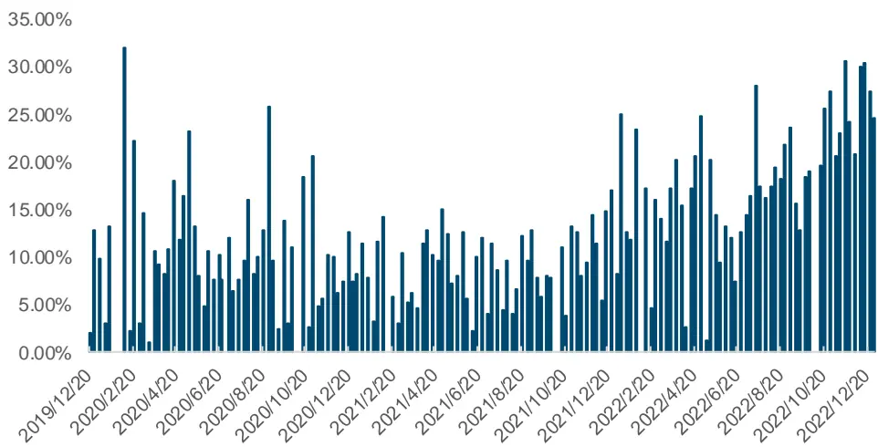
来源：数库，国金证券研究所

## 4.2 以超额收益率为标签的ChatGLM微调

由于传统进行 NLP 类量化研究均以文本情感分析为基础，将文本蕴含情感倾向作为判断对应股票未来表现的依据。然而，直接将股价未来表现作为标签进行模型训练，若模型能准确掌握新闻文本和未来收益的潜在关系，则同样不失为一个较好的策略。

我们首先使用 LoRA 微调方式，直接将未来一定时间（20 日或 5 日）个股超额收益率作为标签进行训练，发现经过反复的超参数调整后，虽然训练集 loss 可以通过多个 epoch 的迭代降至极低水平，但验证集的 loss 在整个训练过程中几乎没有任何下降。

图表17：以超额收益率为标签训练的loss 变化
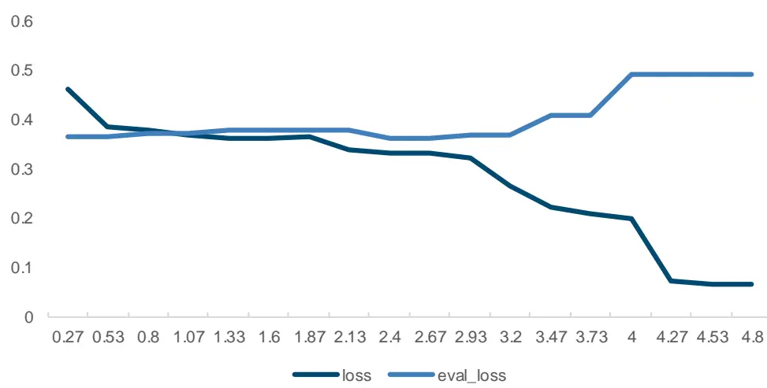
来源：ChatGLM，数库，国金证券研究所

随后我们对样本内和选取的部分样本外数据作为测试集分别观察其混淆矩阵，发现样本内的准确率已经得到大幅提升，达到 0.59，f1-score 达到 0.63。而样本外的准确率仅有0.34，与随机标签几乎没有区别。其余的主要关键指标表现也都较差，基本可以说明模型无法直接学习到新闻和收益率之间的对应关系。

图表18：以超额收益率为标签训练的样本内混淆矩阵

|  | precision | recall | f1-score | support |
| --- | --- | --- | --- | --- |
| 消极 | 0.72 | 0.56 | 0.63 | 3439 |
| 中立 | 0.74 | 0.37 | 0.5 | 3439 |
| 积极 | 0.47 | 0.86 | 0.61 | 3098 |
| accuracy |  |  | 0.59 | 10000 |
| macro avg | 0.65 | 0.6 | 0.58 | 10000 |
| weighted avg | 0.65 | 0.59 | 0.58 | 10000 |

来源：ChatGLM，数库，国金证券研究所

图表19：以超额收益率为标签训练的样本外混淆矩阵

|  | precision | recall | f1-score | support |
| --- | --- | --- | --- | --- |
| 消极 | 0.42 | 0.21 | 0.28 | 820 |
| 中立 | 0.22 | 0.1 | 0.13 | 517 |
| 积极 | 0.33 | 0.68 | 0.45 | 663 |
| accuracy |  |  | 0.34 | 2000 |
| macro avg | 0.32 | 0.33 | 0.29 | 2000 |
| weighted avg | 0.34 | 0.34 | 0.3 | 2000 |

来源：ChatGLM，数库，国金证券研究所

实践证明，模型难以跳过中间环节直接准确学习到文本和收益率之间的对应关系。我们考虑，这是由于股票预测本身就是一个复杂的开放问题，影响股票收益的因素过多。以多因子选股为例，若一个因子 IC 均值达到 3%就已经可以称为比较有效的因子，但实际两者之间的相关性依然较低，仅能解释很小一部分的收益率变化。新闻文本同样也面临这一问题，因此最合适的文本数据使用方法依然是首先针对文本内容进行判断分类，再利用标签作为调仓信号进行因子选股。

图表20：文本分析预测超额收益率流程
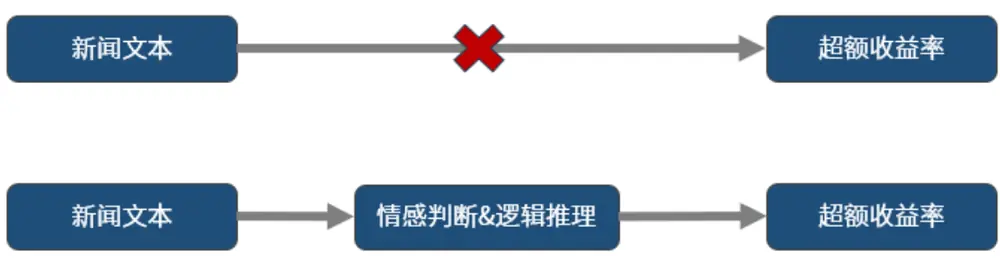
来源：国金证券研究所

## 4.3 ChatGPT、ChatGLM 与 FinBERT 输出结果对比

既然直接使用超额收益率进行预测的方式并不合适，一个高质量的标签就变得极为重要。近日，上海财经大学发布了首个针对金融领域大语言模型测评数据集 FinEval，该基准旨在评估大语言模型在中国背景下对金融领域通用知识的理解、金融数学计算和推理能力。通过整合金融、经济、会计和金融类考证等领域的高质量国内数据，对众多大语言模型进行测评发现 ChatGPT 在中文金融领域依然超过了众多国产开源大语言模型。

图表21：FinEval 测评大模型排名

| Model | Size | Finance | Economy | Accounting | Certificate | Average |
| --- | --- | --- | --- | --- | --- | --- |
| GPT-4 | unknown | 71.0 | 74.5 | 59.3 | 70.4 | 68.6 |
| ChatGPT | 175B | 59.3 | 61.6 | 45.2 | 55.1 | 55.0 |
| Qwen-7B | 7B | 54.5 | 54.4 | 50.3 | 55.8 | 53.8 |
| Baichuan- 13B-Base | 13B | 52.6 | 50.2 | 43.4 | 53.5 | 50.1 |
| ChatGLM2-6B | 6B | 46.5 | 46.4 | 44.5 | 51.5 | 47.4 |
| InternLM-7B | 7B | 49.0 | 49.2 | 40.5 | 49.4 | 47.1 |
| LLaMA-2- Chat-70B | 70B | 47.1 | 46.7 | 41.5 | 45.7 | 45.2 |
| Falcon-40B | 40B | 45.4 | 43.2 | 35.8 | 44.8 | 42.4 |
| Ziya-LLaMA- 13B-v1 | 13B | 43.3 | 36.9 | 34.3 | 41.2 | 39.3 |

来源：FinEval，国金证券研究所

因此我们考虑既然 ChatGPT 在众多大语言模型表现突出，将该模型的输出作为标签对ChatGLM2 进行训练，可以使 ChatGLM2 达到在特定任务类型、特定领域与 ChatGPT 媲美的程度。

由于在前期的研究中我们已经发现，ChatGPT 拥有较强的逻辑推理能力，相较于传统 NLP模型仅能判断文本情感态度有着较大的优势。因此，我们充分利用这一大模型特点，令ChatGPT 对新闻事件对于股价未来的影响进行分类，将约 28000 条新闻文本首先以如下提示方式对 ChatGPT3.5 进行提问：

## 图表22：ChatGPT3.5提问示例

根据新闻对于{companyname}未来股价的影响进行分类，将其分类为“积极”、“消极”或“中立”的一种。
请仅回答“积极”、“消极”或“中立”的其中一种分类即可，无需给出理由。新闻内容：{news_summary}'}]
response = openai.ChatCompletion.create(
messages=messages,
temperature=0
来源：ChatGPT，国金证券研究所

同时我们以同样的 prompt 对 ChatGLM2 进行提问，对两个模型的输出结果进行简要对比发现，在绝大部分情况下，ChatGPT 回答格式规范，几乎不会出现多余语句。但 ChatGLM2有一定概率会忽略提示而自行给出理由或其他标点符号，需要我们进一步手动处理。

图表23：ChatGPT3.5和ChatGLM2 部分输出结果对比

| 新闻文本 | ChatGPT3.5 输出 | ChatGLM2 |
| --- | --- | --- |
| 每经 AI快讯，万泰生物（SH603392，收盘价：43.53元）5月21日晚间发布公告 称，公司于2020年5月20日、5月21日连续两个交易日收盘价格涨幅累计超过 20%。经核实，公司董事会确认，截至目前，公司没有任何根据上海证券交易所《股 票上市规则》等有关规定应予以披露而未披露的事项或与该事项有关的筹划、商谈、 意向、协议等，董事会也未获悉公司有根据《股票上市规则》等有关规定应披露而未 披露的、对公司股票及其衍生品种交易价格产生重大影响的信息。万泰生物的董事长 为钟晱晱，男，年龄66岁，中国国籍，无境外永久居留权，大专学历。万泰生物的 总经理为邱子欣，男，年龄57岁，中国国籍，无境外永久居留权，本科学历。(记者 廖丹)免责声明：本文内容与数据仅供参考，不构成投资建议，使用前核实。据此操 | 中立 | 积极。因为新闻提到了万泰生 物的股价在连续两个交易日内 涨幅累计超过 20%，并且公司 董事会确认没有任何应披露而 未披露的事项，这可能意味着 公司的经营状况良好，对股价 产生了积极影响。 |
| 作，风险自担。 华森制药：独家中成药品种八味芪龙颗粒进入华森制药：独家中成药品种八味芪龙颗 粒进入《国家基本医疗保险、工商保险和生育保险药品目录》，对公司未来业绩的影 响暂无法准确预估，短期内对公司经营业绩影响有限。 | 中立 | 消极。 |

来源：ChatGPT，ChatGLM，数库，国金证券研究所

此外，BERT 模型同样是一个经典的 NLP 模型，该模型使用 Transformers 架构，在众多类型任务中表现出了较强的实力。而 FinBERT 是熵简科技在 BERT 基础上使用金融垂直领域数据进行微调的大模型，该模型进行了两类有监督学习的预训练，包括研报行业分类和财经新闻的金融实体识别。所验证的下游任务类型包括金融短讯类型分类、行业分类、情绪分类、命名实体识别等，发现其表现相比于原生 BERT、BERT-wwm、RoBERTa-wwm-ext 有明显提升。

此处我们将数据清洗处理后，对比三个模型的输出结果，发现 ChatGPT3.5 和 ChatGLM2 两个模型都倾向于更多给出积极判断，消极判断都占少数。而 ChatGLM2 积极推理判断明显占比更多，数量达到 24743 条。极少给出中立的分类，在所有样本中只有 79 条中立判断。FinBERT 模型的消极判断明显占比更高，三种分类的数量较均衡。

图表24：ChatGPT3.5、ChatGLM2与FinBERT分类标签数量对比
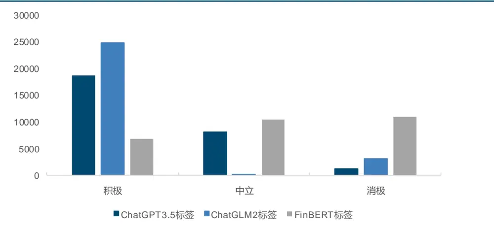
来源：ChatGPT，ChatGLM，FinBERT，数库，国金证券研究所

对于个别文本出现模型未能给出准确标签的情况，我们将其剔除。接下来对三个模型所给出分类标签与收益率的关系进行分析：

图表25：ChatGPT3.5、ChatGLM2与FinBERT分类标签对应未来5日超额收益率
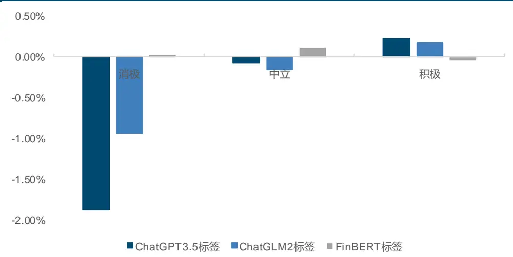
来源：ChatGPT，ChatGLM，FinBERT，数库，国金证券研究所

如上图所示，ChatGLM3.5 和 ChatGLM2 所给出标签与收益率的单调性都较好，且两个模型的消极标签未来 5 日超额收益率负向明显，分别为-1.87%和-0.94%。积极标签所对应的超额收益率分别为 0.23%和 0.17%。

图表26：ChatGPT3.5模型不同标签的事件驱动收益
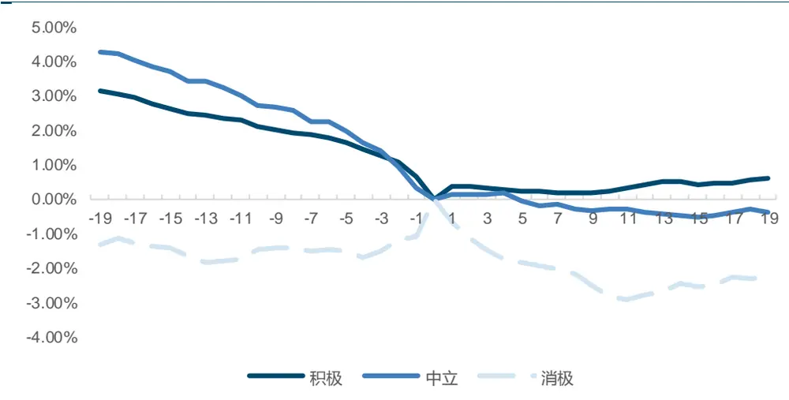
来源：ChatGPT，数库，国金证券研究所

图表27：ChatGLM2模型不同标签的事件驱动收益
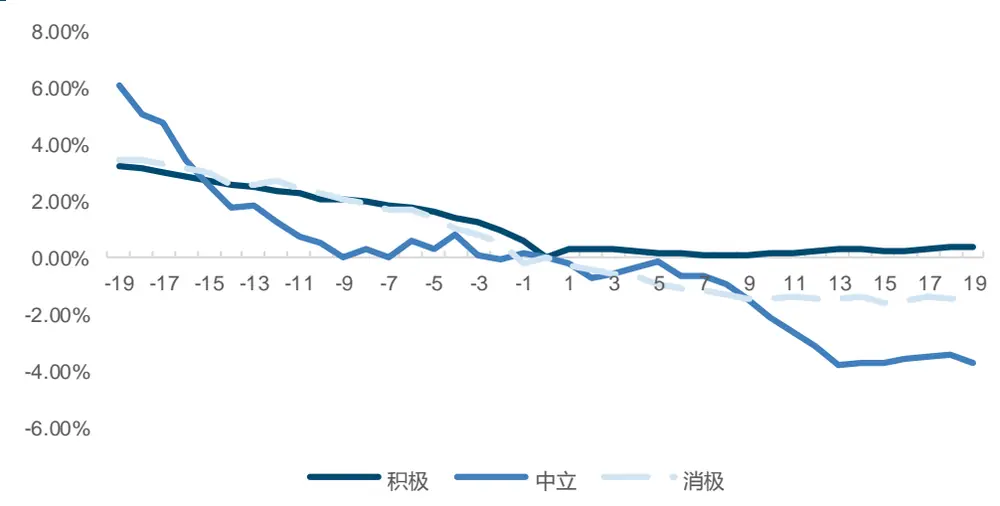
来源：ChatGLM，数库，国金证券研究所

图表28：FinBERT模型不同标签的事件驱动收益
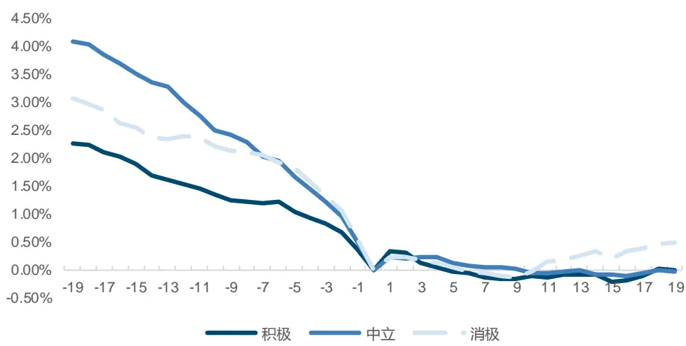
来源：FinBERT，数库，国金证券研究所

我们将三个模型每个标签所对应新闻发生前后相对于中信医药行业的累计超额异常收益率进行对比，发现 ChatGPT3.5 不管在事件发生前还是发生后都展现出了明显的单调性，积极新闻在事前虽有一定提前定价，但事后的超额收益率依然比较明显。而 ChatGLM2 和FinBERT 两个模型的单调性都明显下降，区分度较差。

## 4.4 ChatGPT 与 ChatGLM 医药行业舆情精选策略对比

观察到 ChatGPT3.5 对医药行业新闻的分析能力后，我们首先探索将 ChatGPT3.5 和ChatGLM2 标签作为调仓信号构建投资组合策略。

考虑到股价对于新闻反映的及时性较强，策略以周度频率调仓，对于单日内单只股票出现的多个新闻，取较差标签进行去重。将三个标签分别转换为 1,0，-1,后，对每周内新闻文本按照发生所在日期进行衰减求和，周五的衰减系数为 1，周四为 0.5，以此类推。由于早期新闻数据量较少，覆盖度较低，我们设置阈值 50，当该周新闻所覆盖股票数量达到50 只及以上时，买入得分最高的前 10%股票，数量未达到 50 只时且超过 5 只时，我们买入得分最高的 5 只，否则买入指数本身。以中信医药行业指数为基准，构建投资策略，考虑到新闻股票覆盖度问题，回测范围为 2018 年 7 月-2022 年 12 月。

图表29：ChatGPT3.5和ChatGLM2 医药行业舆情精选策略净值表现
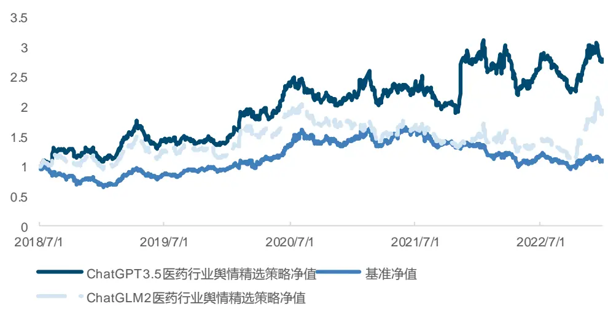
来源：ChatGPT，ChatGLM，数库，国金证券研究所

可以看出 ChatGPT3.5 的舆情精选策略表现优异，说明对于医药行业新闻，若能给出准确标签并及时调仓，可以获取相对稳定的超额收益。但 ChatGLM2 所给出标签在整个回测区间绝大部分时间难以取得超额回报，策略的基本指标如下：

图表30：ChatGPT3.5和ChatGLM2 医药行业舆情精选策略指标

| ChatGPT3.5 舆情精选策略 |  | ChatGLM2 舆情精选策略 | 基准 |
| --- | --- | --- | --- |
| 年化收益率 | 25.62% | 15.69% | 2.43% |
| 年化波动率 | 28.68% | 29.34% | 26.77% |
| Sharpe 比率 | 0.89 | 0.53 | 0.09 |
| 最大回撤率 | 29.46% | 46.17% | 43.10% |
| 年化超额收益率 | 19.48% | 10.09% |  |
| 跟踪误差 | 32.88% | 32.48% |  |
| 信息比率 | 0.59 | 0.31 |  |
| 超额最大回撤 | 28.65% | 40.74% |  |

来源：ChatGPT，ChatGLM，数库，国金证券研究所

## 4.5 以 ChatGPT3.5 结果为标签的 ChatGLM2 模型微调

接下来，我们利用前文中提到的 LoRA 方法对 ChatGLM2 进行微调，考虑到避免数据泄露，我们按时间顺序将前 10000 条新闻作为训练集，设定合适的超参数进行训练。对微调后训练集和测试集的基本结果进行对比发现，若我们以 ChatGPT3.5 所给出标签作为标准答案，样本内的准确率得到大幅提升，达到 0.96，三个分类标签的 F1-score 也均在 0.90 以上。

而在样本外，ChatGLM2-LoRA 的标签准确率相较于未微调时得到大幅提升，由 0.65 上升到 0.84，平均 F1-score 也在 0.80 以上。虽然相较于样本内准确率仍有一定差距，但整体表现已经远超出原本未微调时模型的水平。并且相较于以收益率为标签进行训练的大幅度改进也可以说明，大语言模型的推理判断逻辑是可以通过训练被其他模型学习到的。

图表31：ChatGLM2样本内微调后混淆矩阵

|  | precision | recall | f1-score | support |
| --- | --- | --- | --- | --- |
| 消极 | 0.93 | 0.95 | 0.94 | 767 |
| 中立 | 0.93 | 0.89 | 0.91 | 1936 |
| 积极 | 0.98 | 0.99 | 0.98 | 7297 |
| accuracy |  |  | 0.96 | 10000 |
| macro avg | 0.95 | 0.94 | 0.94 | 10000 |
| weighted avg | 0.96 | 0.96 | 0.96 | 10000 |

来源：ChatGPT，ChatGLM，数库，国金证券研究所

图表32：ChatGLM2样本外微调后混淆矩阵

|  | precision | recall | f1-score | support |
| --- | --- | --- | --- | --- |
| 消极 | 0.81 | 0.77 | 0.79 | 517 |
| 中立 | 0.90 | 0.59 | 0.71 | 6135 |
| 积极 | 0.82 | 0.97 | 0.89 | 11335 |
| accuracy |  |  | 0.84 | 17987 |
| macro avg | 0.84 | 0.78 | 0.80 | 17987 |
| weighted avg | 0.84 | 0.84 | 0.82 | 17987 |

来源：ChatGPT，ChatGLM，数库，国金证券研究所

同时我们对比观察微调前后的事件驱动收益发现，ChatGLM2-LoRA 的三类标签对应未来收益的单调性和区分度得到大幅改进。

图表33：ChatGLM2-LoRA模型不同标签的事件驱动收益
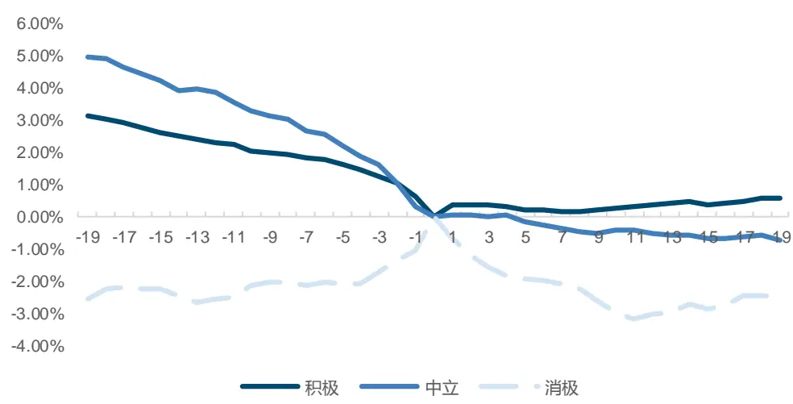
来源：ChatGPT，ChatGLM，数库，国金证券研究所

除此之外，我们也将 FinBERT 进行微调，不过由于该模型参数量相对较小，我们直接使用全量微调方式。微调后的样本外混淆矩阵如下，结果发现模型同样能在一定程度上学到新闻文本的推理判断能力，准确率为 0.81，平均 F1-score 未能达到 0.80，效果略差于微调后的 ChatGLM2 模型。

图表34：FinBERT样本外微调后混淆矩阵

|  | precision | recall | f1-score | support |
| --- | --- | --- | --- | --- |
| 消极 | 0.85 | 0.51 | 0.64 | 517 |
| 中立 | 0.83 | 0.54 | 0.66 | 6135 |
| 积极 | 0.80 | 0.96 | 0.87 | 11335 |
| accuracy |  |  | 0.81 | 17987 |
| macro avg | 0.83 | 0.67 | 0.72 | 17987 |
| weighted avg | 0.81 | 0.81 | 0.79 | 17987 |

来源：ChatGPT，FinBERT，数库，国金证券研究所

为进一步检验微调模型的实用价值，我们将微调后的 ChatGLM2 标签作为信号，同样以周度频率调仓构建医药行业舆情精选策略，回测区间范围为 2018 年 7 月-2022 年 12 月，样本外区间为 2020 年 11 月-2022 年 12 月。

图表35：ChatGLM2-LoRA、ChatGLM2和FinBERT微调医药行业舆情精选策略净值表现
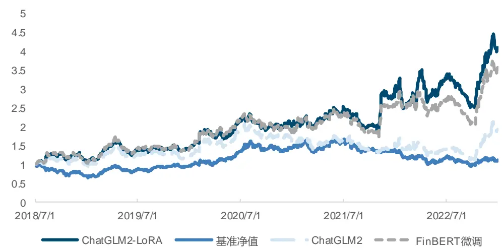
来源：ChatGPT，ChatGLM，FinBERT，数库，国金证券研究所

从策略的基本指标可以看出，经过微调后的 ChatGLM2 舆情精选策略已经超过了 ChatGPT水准，年化超额收益率为 30.52%，相较于未经过微调的策略上升明显，信息比率为 0.90，不过由于每周新闻的股票覆盖度偏低，策略的整体稳定性有一定欠缺。而 FinBERT 经过微调后同样表现出了不错的判断能力，不过相较于 ChatGLM2-LoRA 略逊一筹。

图表36：ChatGLM2-LoRA、ChatGLM2和FinBERT微调医药行业舆情精选策略指标

|  | ChatGLM-LoRA 舆情精选 ChatGLM2 舆情精选 |  | FinBERT 微调舆情精选 | 基准 |
| --- | --- | --- | --- | --- |
| 年化收益率 | 策略 | 策略 15.69% | 策略 32.70% | 2.43% |
| 年化波动率 | 36.55% | 29.34% | 30.27% | 26.77% |
|  | 30.70% | 0.53 | 1.08 | 0.09 |
| Sharpe 比率 最大回撤率 | 1.19 29.08% | 46.17% | 32.01% | 43.10% |
| 年化超额收益率 | 30.52% | 10.09% | 26.38% |  |
| 跟踪误差 | 34.03% | 32.48% | 33.93% |  |
| 信息比率 | 0.90 | 0.31 |  |  |
|  |  |  | 0.78 |  |
| 超额最大回撤 | 28.36% | 40.74% | 33.91% |  |

来源：ChatGPT，ChatGLM，FinBERT，数库，国金证券研究所

图表37：ChatGLM2-LoRA医药行业舆情精选策略分年度收益表现
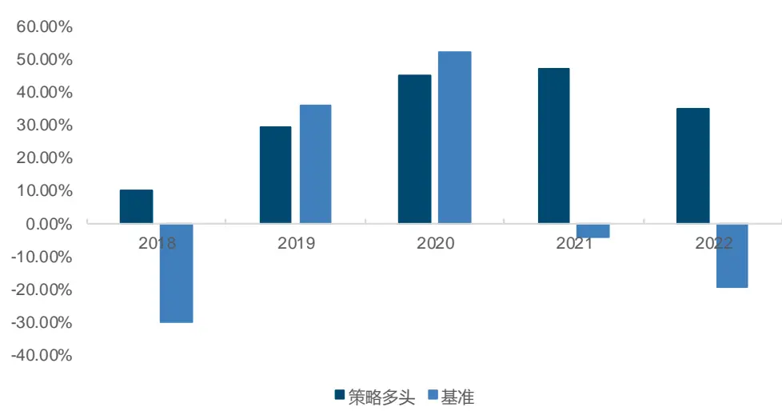
来源：ChatGPT，ChatGLM，数库，国金证券研究所

为进一步贴合交易实际，我们测试在不同手续费下策略的效果。值得注意的是，由于周度调仓策略本身对于交易手续费比较敏感，同时由于单个行业每周新闻的股票覆盖度有限，策略的换手率天然较高，我们以换手率缓冲的方式尽可能降低手续费带来的影响，在不同费率下策略的效果如下。

图表38：不同手续费下ChatGLM2-LoRA医药行业舆情精选策略净值曲线
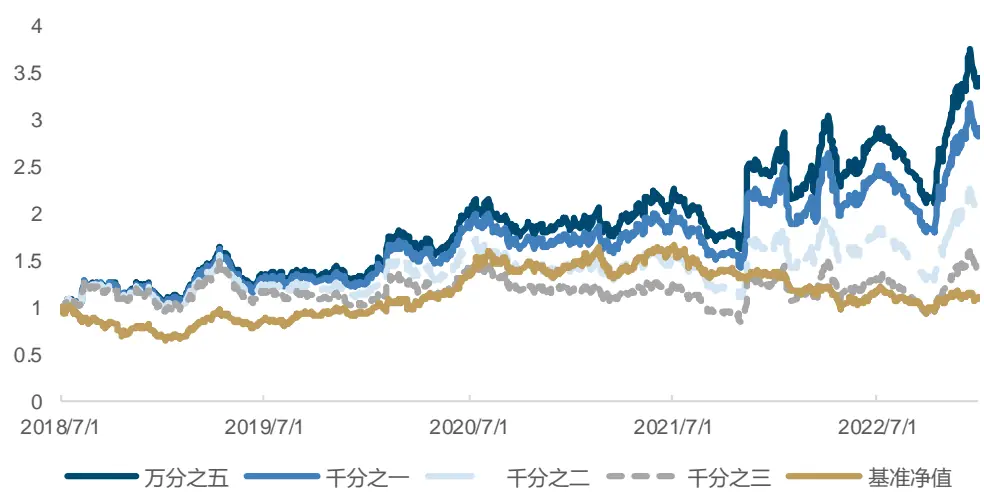
来源：ChatGPT，ChatGLM，数库，国金证券研究所

根据策略的各项指标来看，策略对于手续费比较敏感，策略在单边千分之二的情况下年化超额收益率降至 12.17%，信息比率为 0.36。不过我们考虑，这是由于数据本身限制对策略产生了较大影响，本文对于 ChatGLM 的微调本身依然显著提升了模型在该领域新闻文本的逻辑推理能力。

图表39：不同手续费率下ChatGLM2-LoRA 医药行业舆情精选策略指标

|  | 万分之五 | 千分之一 | 千分之二 | 千分之三 |
| --- | --- | --- | --- | --- |
| 年化收益率 | 31.48% | 26.60% | 17.38% | 8.83% |
| 年化波动率 | 30.71% | 30.73% | 30.80% | 30.89% |
| Sharpe 比率 | 1.03 | 0.87 | 0.56 | 0.29 |
| 最大回撤率 | 30.47% | 31.85% | 35.94% | 42.72% |
| 年化超额收益率 | 25.67% | 21.00% | 12.17% | 3.99% |
| 跟踪误差 | 34.03% | 34.03% | 34.07% | 34.13% |
| 信息比率 | 0.75 | 0.62 | 0.36 | 0.12 |
| 超额最大回撤 | 31.26% | 36.93% | 49.17% | 59.56% |

来源：ChatGPT，ChatGLM，数库，国金证券研究所

## 总结

在本篇报告中，我们结合前期对于 ChatGPT 等大模型的使用体验，进一步考虑投研实际场景。考虑将大模型进行微调从而提升模型在金融领域的专业度，从而能够给出更符合实际需求的回答，提升其逻辑推理能力和判断力。由于全量微调的显卡资源消耗过大，我们首先介绍了各类 PEFT（参数高效型）微调的方式和特点，最终选用表现较好的 LoRA 模式针对前期部署的 ChatGLM2 进行微调。

在数据选择上，我们发现医药行业新闻对于公司的业绩影响推导逻辑链条会更加直接，对大模型而言更易于学习。首先进行了直接以收益率为标签进行训练，但发现微调后的模型在样本外的准确率极低，说明由于文本与收益率之间相关性较弱，难以使模型直接学习。

最终我们综合对比各大模型在中文金融领域的能力后，选择首先使用 ChatGPT3.5 的输出结果作为标签让 ChatGLM2 进行学习。结果发现，该标签质量较高，对于未来股价一段时间的超额收益率走势有一定的预测作用。且通过微调后，ChatGLM2 也可以学到相应的逻辑推理能力，达到近似于 ChatGPT3.5 的预测效果，综合准确率达到 0.9 左右。而 FinBERT模型微调后也有一定的提升，但表现略差于 ChatGLM2。最终我们以微调后的 ChatGLM2-LoRA 模型所给出标签构建医药行业周度舆情精选策略，发现在不考虑手续费的情况年化超额收益率达到 30%左右。不过由于个股新闻覆盖度的问题，策略换手较高，我们通过换手率缓冲的方式降低换手后，在单边千分之二的情况，策略的年化超额收益率依然有12.17%。充分说明，通过合适的标签令 ChatGLM2 进行微调学习，可以使其在特定领域能够达到与 ChatGPT3.5 类似的效果。是一种绝佳的能够在控制成本和数据隐私性安全的情况下使用大模型进行投研辅助的方式。

## 风险提示

1、大语言模型基于上下文预测进行回答，不能保证回答准确性，由此可能产生误导影响用户判断。

2、不同的微调方式和超参数选择可能对微调效果产生较大影响，若模型产生过拟合，样本外失效可能会导致策略效果不及预期。

3、市场若出现超出模型预期的变化，过往逻辑链条适用性下降可能会导致策略失效，需 要动态对模型进行微调以修正偏差。

## 特别声明：

国金证券股份有限公司经中国证券监督管理委员会批准，已具备证券投资咨询业务资格。

本报告版权归“国金证券股份有限公司”（以下简称“国金证券”）所有，未经事先书面授权，任何机构和个人均不得以任何方式对本报告的任何部分制作任何形式的复制、转发、转载、引用、修改、仿制、刊发，或以任何侵犯本公司版权的其他方式使用。经过书面授权的引用、刊发，需注明出处为“国金证券股份有限公司”，且不得对本报告进行任何有悖原意的删节和修改。

本报告的产生基于国金证券及其研究人员认为可信的公开资料或实地调研资料，但国金证券及其研究人员对这些信息的准确性和完整性不作任何保证。本报告反映撰写研究人员的不同设想、见解及分析方法，故本报告所载观点可能与其他类似研究报告的观点及市场实际情况不一致，国金证券不对使用本报告所包含的材料产生的任何直接或间接损失或与此有关的其他任何损失承担任何责任。且本报告中的资料、意见、预测均反映报告初次公开发布时的判断，在不作事先通知的情况下，可能会随时调整，亦可因使用不同假设和标准、采用不同观点和分析方法而与国金证券其它业务部门、单位或附属机构在制作类似的其他材料时所给出的意见不同或者相反。

本报告仅为参考之用，在任何地区均不应被视为买卖任何证券、金融工具的要约或要约邀请。本报告提及的任何证券或金融工具均可能含有重大的风险，可能不易变卖以及不适合所有投资者。本报告所提及的证券或金融工具的价格、价值及收益可能会受汇率影响而波动。过往的业绩并不能代表未来的表现。

客户应当考虑到国金证券存在可能影响本报告客观性的利益冲突，而不应视本报告为作出投资决策的唯一因素。证券研究报告是用于服务具备专业知识的投资者和投资顾问的专业产品，使用时必须经专业人士进行解读。国金证券建议获取报告人员应考虑本报告的任何意见或建议是否符合其特定状况，以及（若有必要）咨询独立投资顾问。报告本身、报告中的信息或所表达意见也不构成投资、法律、会计或税务的最终操作建议，国金证券不就报告中的内容对最终操作建议做出任何担保，在任何时候均不构成对任何人的个人推荐。

在法律允许的情况下，国金证券的关联机构可能会持有报告中涉及的公司所发行的证券并进行交易，并可能为这些公司正在提供或争取提供多种金融服务。

本报告并非意图发送、发布给在当地法律或监管规则下不允许向其发送、发布该研究报告的人员。国金证券并不因收件人收到本报告而视其为国金证券的客户。本报告对于收件人而言属高度机密，只有符合条件的收件人才能使用。根据《证券期货投资者适当性管理办法》，本报告仅供国金证券股份有限公司客户中风险评级高于 C3 级(含 C3 级）的投资者使用；本报告所包含的观点及建议并未考虑个别客户的特殊状况、目标或需要，不应被视为对特定客户关于特定证券或金融工具的建议或策略。对于本报告中提及的任何证券或金融工具，本报告的收件人须保持自身的独立判断。使用国金证券研究报告进行投资，遭受任何损失，国金证券不承担相关法律责任。

若国金证券以外的任何机构或个人发送本报告，则由该机构或个人为此发送行为承担全部责任。本报告不构成国金证券向发送本报告机构或个人的收件人提供投资建议，国金证券不为此承担任何责任。

此报告仅限于中国境内使用。国金证券版权所有，保留一切权利。

上海

电话：021-80234211

北京

电话：010-85950438

深圳

电话：0755-83831378

邮箱：researchsh@gjzq.com.cn

邮箱：researchbj@gjzq.com.cn

传真：0755-83830558

邮编：201204

邮编：100005

邮箱：researchsz@gjzq.com.cn

地址：上海浦东新区芳甸路 1088 号

地址：北京市东城区建内大街 26 号

邮编：518000

紫竹国际大厦 5 楼

新闻大厦 8 层南侧

地址：深圳市福田区金田路 2028 号皇岗商务中心

18 楼 1806

【小程序】国金证券研究服务

【公众号】国金证券研究