证券研究报告

金融工程组

分析师：高智威（执业S1130522110003)联系人：郭子锋

gaozhiw@gjzq.com.cn

guozifeng@gjzq.com.cn

## FinGPT对金融论坛数据情感的精准识别

# ——沪深300另类舆情增强因子

## 大语言模型的情感分析情感

情感分析是自然语言处理（NLP）的一个重要分支，在金融领域，情感分析在金融论坛评论上的分析有重要应用，因为金融论坛的情绪很大程度上反映了投资者的集体心态，投资者的心态、预期和信心可以对股票价格产生重大影响。

## 金融论坛评论的数据特征

本报告采用子长科技提供的金融论坛股民情绪数据。子长科技基于公开社交媒体信息，包括股民及股市大V 的各类言论，结合公司，行业，产品，相关技术等数据，运用 AI 知识模型 LKM，准确将股民情绪关联及定位到相关股票。并根据情绪表达，产生实时的量化情绪分数及统计信息。

2018 年 1 月 1 日至 2023 年6 月30 日，子长科技跟踪的金融论坛一共有超过1300 万条主帖数据和超过480 万条评论数据，每周平均可对应沪深 300 中超过 260 只股票。金融论坛数据有多样性和高度情绪化、信噪比低、随事件波动和受到特定类型评论影响等特征。主帖数据与评论数据在情感表达方面有明显区别。

## 开源模型 FinGPT 落地

在定位到相关股票的金融论坛数据之上本篇报告通过 FinGPT 其进行了情感分析，通过验证论坛情感与股票价格之间的关系探索了大语言模型模情感分析在量化策略上的直接应用。

FinGPT 是由 AI4Finance-Foundation 开发的一个开源项目，专注于金融领域的大型语言模型，其“V3.1”版本是在中文能力较强的 ChatGLM-6B 基础上进行 LoRA 微调训练而来，FinGPT 在情感打分任务上相比 ChatGLM-6B 又有进一步的提升。FinGPT 优秀的中文能力和情感分析能力都很适合在金融论坛评论之上进行应用。

## 情绪打分体系构建

情感打分体系主要包含三个方面，情感表达、情感分歧与情感变化。利用大语言模型进行情感分析，我们能准确地识别和量化每一条评论中的正面、负面或中立情感，为每位投资者的发言赋予一个情感得分。

从打分体系的因子测试结果看，投资者对某只股票情感越乐观情况下，该只股票更有可能获得超额收益。其中乐观情感和因子单因子 IC 达到 3.68%，分位数组合单调性良好，多空组合年化收益率为 12.71%，多空净值增加平稳，是有效评价情感与选股的指标。

大模型舆情情感因子与基本面因子相关性低，而情感和因子与市值相关性为0.55但是区别于市值因子其为降序因子，能够证明金融论坛评论情感分析是独立于基本面的另类有效选股指标。

## 大模型金融论坛舆情增强策略

我们以乐观情感总和因子构建大模型金融论坛舆情增强策略。每一期选择因子排名最靠前的 20%的股票等权构造策略组合。策略为月频调仓，在千分之三的手续费下策略年化收益率为 6.69%，夏普比率为 0.32，策略的超额年化收益率为 8.02%，信息比率为 1.58，策略的超额最大回撤仅为 6.94%。金融论坛评论确实带来了额外增量信息。

## 风险提示

以上结果通过历史数据统计、建模和测算完成，历史规律未来可能存在失效；大语言模型基于上下文预测进行回答，不能保证回答准确性。

## 一、另类数据情感分析的新方法

情感分析是自然语言处理（NLP）的一个重要分支，通过运用 NLP 技术和机器学习算法，可以对文本的语义、情感表达和上下文进行分析，判断文本所表达的情感，从而得出文本的情绪例如正面、负面或中立的结论。在金融领域，情感分析在金融论坛评论上的分析有重要应用，因为金融论坛的情绪很大程度上反映了投资者的集体心态，投资者的心态、预期和信心可以对股票价格产生重大影响。

我们从多个学术假设和结论拆解了情绪对股票价格产生影响的背后逻辑：

情绪与决策制定：投资者在决定买卖股票时，除了基于对公司基本面和技术分析的认知，还会受到其他投资者情绪的影响。乐观情绪往往促使投资者采取积极的投资行为，而消极情绪可能导致他们采取保守或逃避策略。

从众心理：当大部分投资者在论坛上显示乐观情绪时，其他投资者可能会受到影响，从而产生相同的投资决策，导致股价上涨。相反，当论坛上的情绪普遍不乐观时，股价可能会受到压力并下跌。

信息扩散：金融论坛通常是投资者获取和分享信息的平台。这些信息，无论其真实性如何，都可能引起市场反应。如果论坛上传播的信息让投资者感到乐观，股价可能上涨；相反，如果信息是消极的，股价可能会下跌。

注意力偏差：当某个特定的股票或事件在论坛上被大量讨论，这会导致更多的投资者将注意力集中在这个话题上，或者由于注意力偏差，投资者可能会过于专注于论坛上热门的话题，而忽视其他同样重要但未被广泛讨论的信息。这可能会导致投资者做出基于不完整信息的决策，强化了情绪反应或者忽视了其他重要信息。

本篇报告是 Alpha 掘金系列的第八篇，我们通过开源的大语言模型 FinGPT 对子长科技公司提供的大量金融论坛评论进行了情感分析，通过验证论坛情感与股票价格之间的关系探索了大语言模型模和大知识模型情感分析在量化策略上的直接应用。

## 二、金融论坛评论的数据特征

## 2.1 数据来源

子长科技创建于 2018 年，创始团队包括前路透社，亚马逊，谷歌等人工智能及金融数据专家。公司创立以来，以包括知识图谱和自然语言处理的知识模型 LKM 为核心技术，始终致力于打造垂直金融行业的人工智能核心能力，推出多款数据及金融终端产品，有效服务投研、量化和风控等多个场景。

本报告采用子长科技提供的金融论坛股民情绪数据。子长科技基于公开社交媒体信息，包括股民及股市大 V 的各类言论，结合公司，行业，产品，相关技术等数据，运用 AI 知识模型 LKM，准确将股民情绪关联及定位到相关股票。并根据情绪表达，产生实时的量化情绪分数，及统计信息。从而充分体现个股的股民情绪，关注变化，捕捉市场信号。

基于知识模型 LKM 体系的数据，具有精准，实时，可溯源等优势。通过知识模型，AI 准确进行实体对齐，将股民评论精准定位到相关股票，准确产生情绪数据。效果远超于基于情绪关键词的上一代技术。

图表1：LKM知识模型的核心
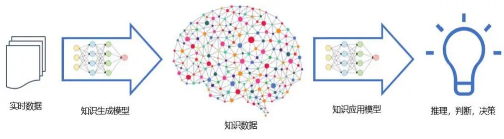
来源：子长科技，国金证券研究所

## 2.2 什么是 LKM(Large Knowledge Model)

对于金融论坛评论数据而言，自然语言处理的难点之一在于如何确认股票与评论之间的联系，一方面，股票的代称可能会复杂，完全通过人工维护的方式是困难的，例如“宁德时代”对应“宁王”；另一方面，评论中可能完全没有提到股票的名字。而 LKM 大知识模型可以通过不断地评论学习学会这样地代称和复杂对应逻辑，能够更好得完成评论对应上市公司的标注。进一步地，因为大知识模型“学到”的知识不仅限于上市公司，在另类数据拆解产业链上下游信息、寻找非线性景气度关系时都有重要应用。

图表2：大知识模型的模型构建流程
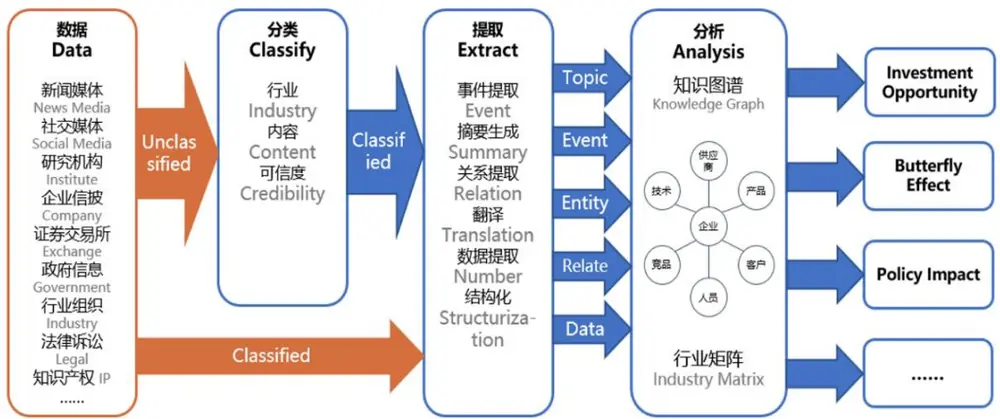
来源：子长科技，国金证券研究所

从技术路线上来说，LKM 属于决策智能，LLM 属于生成型人工智能。

生成型人工智能(Generative AI)主要用于生成新的、未见过的数据或内容，如图像、文本或音乐。它的核心目标是学习和模拟特定数据集的分布。其可以进行创作（例如画作、音乐、文本、代码）、数据增强、模拟和虚拟现实内容生成等。常见的技术包括生成对抗网络(GANs)、变分自编码器(VAEs)和特定的深度学习架构如 Transformer（ChatGPT 采用）。主要解决的是“如何从现有的数据中学习并生成新的、相似但独特的内容”。

决策智能(Decision Intelligence)是一个跨学科的领域，目标是帮助组织或个人做出更有根据和更好的决策。它结合了决策科学、人工智能和数学建模等领域的知识。其可以优化业务流程、增强策略决策、提高资源分配的效率、预测和风险评估和供应链管理等。常见的技术包括决策树、优化算法、模拟、风险分析、复杂的系统建模等。主要解决的是“如何结合多种数据和知识源来做出最佳或最有根据的决策”。

在金融领域，如将股票与金融评论进行映射，当需要高度的可解释性、实时反馈以及从系统整体视角进行考量时，决策智能会是一个更为合适的选择。决策智能不仅提供了对数据的深入分析，还允许我们理解背后的决策逻辑和推理过程。实时反馈能够确保我们迅速地应对变化，调整策略，而从系统视角考虑则意味着我们不仅关注局部的最优解，而是寻求整体的最佳方案。这种综合性的分析和全局视野有助于制定更为全面、均衡和持久的决策策略。

图表3：LKM的情感打分优势
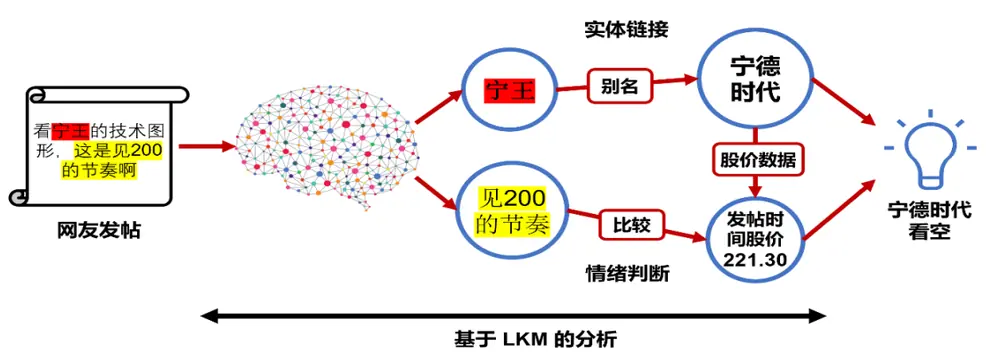
来源：子长科技，国金证券研究所

在另类数据情感打分能力上，LLM 与 LKM 各有优劣，LLM 解释性差但是拥有令人惊讶的 0样本和少样本的分析能力，LKM 解释性强并且能够通过全局视角进行实时反馈，但其对数据的质量要求会更高。

图表4：LLM与LKM的推导区别
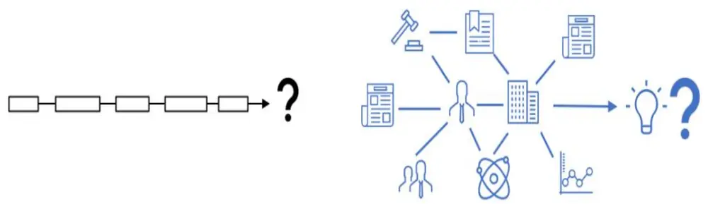
LLM vs LKM
来源：子长科技，国金证券研究所

图表5：人工智能的发展周期
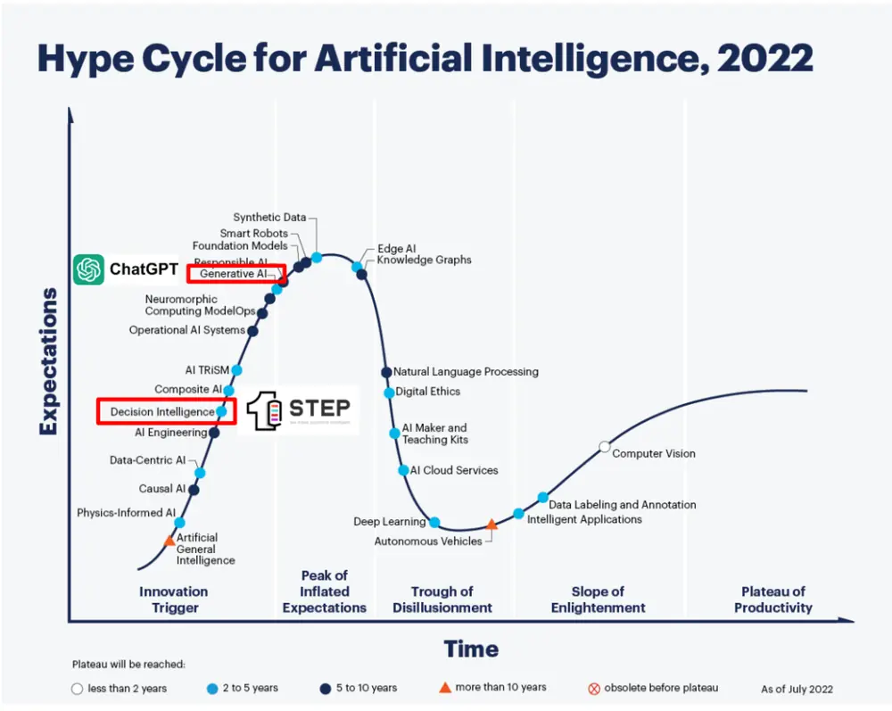
来源：Gartner，子长科技，国金证券研究所

## 2.3 论坛的主帖和评论的区别

金融论坛的数据主要可以分为两种类型，主帖和评论。

两者数据主要有以下共同特征：

信噪比低：由于每个人都可以发表意见，结果不一定都是基于事实或深入的分析，会出现很多“无关评论”、“段子评论”等。

随事件波动：特定的金融事件或新闻可能引发大量的帖子和情感反应，如股市大涨或大跌、重大并购事件、政策变化等，短期某只股票的评论数量可能会出现快速上升。比如有的社会化事件会让某只股票在周度的评论数量上万，而大部分时候股票被提到次数的平均值是56 次。

受到特定类型评论影响：有些评论和主帖可能出于特定的目的，例如推广某个股票、产品或服务，或试图影响其他投资者的观点和决策。

而金融论坛的评论数据还有一个额外属性。金融论坛的评论是多样性和高度情绪化的：金融论坛上的用户来自各种背景，因此意见和表达情感可能非常多样化。有的人可能是资深的投资者，有的可能是刚接触投资的学习者，评论的深度和角度会有所不同。并且金融和投资涉及到金钱和未来的不确定性，因此评论可能带有强烈的情感宣泄，过多的焦虑、兴奋等情感词汇也会对文本情感分析产生干扰。但评论数据也更能反应参与者对股票的情感看法。

2018 年 1 月 1 日至 2023 年6 月30 日，子长科技跟踪的金融论坛一共有超过1300 万条主帖数据和超过 480 万条评论数据，每周平均可对应沪深 300 中超过 260 只股票。主帖数量显著更多的主要原因是其充斥着大量新闻、公告和因论坛规则自动转化的部分首发评论（基于论坛规则，部分客户端的评论会直接显示为主帖）。主帖和评论的测试区别我们将在第 4 节中讨论。

图表6：金融论坛主帖与评论的区别
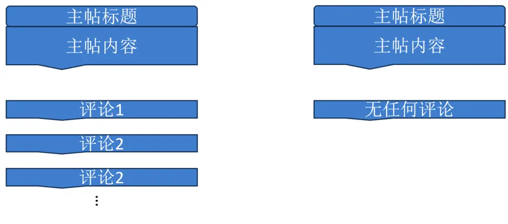
来源：子长科技，国金证券研究所

## 三、大语言开源模型落地

## 3.1 利用大语言模型进行情感分析

## 3.1.1 大模型强大的语言理解和更好的泛化能力

大语言模型（LLM）经过预训练，具备了出色的语言理解和生成能力。它能够分析句子的语法结构，理解上下文的语义，以及生成合乎语义逻辑的文本。在情感分析任务中，LLM可以准确理解文本的意图和情感色彩，为后续的情感分类提供强大支持。与传统方法依赖词典和规则相比，LLM 更加模拟了人类对语言的认知过程，能够构建更加丰富的文本表示，这是实现精确情感分析的关键。

大语言模型，例如 GPT-4，在情感分析领域相较于传统 NLP 方法和 BERT 有其独特的优势。首先，其最明显的优点在于无需依赖大量的标注数据。因为这些模型已经在庞大且多样化的数据上进行了预训练，它们能够在微调时仅使用很少的标注数据，或甚至不用。其次，也因为其在庞大的数据集上进行了训练，大模型拥有较好的泛化能力，能够识别和处理各种不常见的情况和短语。这在金融论坛评论上的优势更加明显，因为金融论坛评论本身信噪比极低，充斥着大量的无关情感表达，泛化能力是提高数据价值的核心能力之一。

图表7：自回归语言模型的输出步骤
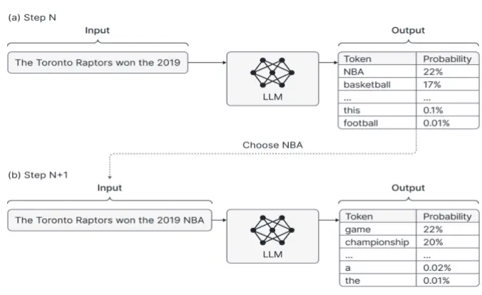
来源：Borealisai，国金证券研究所

图表8：HELM大语言模型情感分析排行榜

| Accuracy |  |  |
| --- | --- | --- |
| Model/adapter | Mean win rate † [sort ] | IMDB - EM ↑ [ sort ] |
| Cohere Command beta (6.1B) | 1 | 0.961 |
| Cohere Command beta (52.4B) | 0.976 | 0.96 |
| Luminous Supreme (70B) | 0.952 | 0.959 |
| J1-Grande v2 beta (17B) | 0.929 | 0.957 |
| Jurassic-2 Large (7.5B) | 0.905 | 0.956 |
| J1-Large v1 (7.5B) | 0.881 | 0.956 |
| Cohere xlarge v20221108 (52.4B) | 0.857 | 0.956 |
| Cohere xlarge v20220609 (52.4B) | 0.833 | 0.956 |
| GLM (130B) | 0.81 | 0.955 |
| J1-Grande v1 (17B) | 0.786 | 0.953 |

来源：HELM，国金证券研究所
注：大部分大语言模型，包括 GPT 所有系列，均是自回归语言模型。

## 3.1.2 GPT 情感分析效果最佳，但成本过于高昂

ChatGPT 在情感分类任务中表现出了令人印象深刻的“zero-shot”与“few-shot”能力，其效果与经过领域微调的 BERT 相当，与为每个领域或数据集训练专门的情感分析系统相比，ChatGPT 已经可以作为通用且表现良好的情感分析器使用。然而，GPT 类模型的 API调用了成本昂贵，以 ChatGPT 为例，其 1000 个 token 大约对应 750 个英文单词或 900个中文汉字，而金融论坛评论数据等文本金融数据在 1 年的累计文字内容超过上千万字，高昂的调用费用使 ChatGPT 无法轻易地在大规模的数据情感分析上使用。

图表9：ChatGPT 情感分析得分比较

| Trained on → Evaluated on ↓ | Fine-tuned BERT |  |  |  | Zero-shot ChatGPT |  |
| --- | --- | --- | --- | --- | --- | --- |
|  | 14-Rest. | 14-Lap. | The Rest | Domain- Specific | Auto Eval. | Human Eval. |
| 14-Restaurant | 76.55 | 55.06 | 71.10 | 76.55 | 72.73 | 82.22 |
| 14-Laptop | 43.57 | 68.02 | 59.36 | 68.02 | 45.45 | 64.00 |
| Books | 38.35 | 25.93 | 46.64 | 61.17 | 21.92 | 29.41 |
| Clothing | 29.57 | 26.28 | 50.72 | 67.97 | 25.71 | 34.78 |
| Hotel | 64.07 | 53.21 | 74.85 | 88.67 | 50.60 | 62.50 |
| Device | 50.74 | 60.19 | 58.87 | 75.39 | 41.86 | 69.23 |
| Service | 27.01 | 27.03 | 47.67 | 57.83 | 45.78 | 63.89 |
| 14-Twitter | 1.67 | 3.43 | 42.90 | 78.84 | 19.18 | 52.63 |
| Finance | 7.74 | 7.11 | 14.21 | 79.32 | 38.36 | 76.92 |
| METS-Cov | 3.27 | 5.14 | 10.27 | 71.71 | 3.92 | 9.88 |
| Average | 34.25 | 33.14 | 47.66 | 72.55 | 36.55 | 54.55 |

图表10：ChatGPT API 调用价格

|  | Input | Output | Training |
| --- | --- | --- | --- |
| Models | (price/1k | (price/1k | (price/1k |
|  | tokens) | tokens) | tokens) |
| GPT-4 8K context | $0.03 | $0.06 | 1 |
| GPT-4 32K context | $0.06 | $0.12 | 1 |
| GPT-3.5 Turbo 4K context | $0.001 | $0.002 | 1 |
| GPT-3.5 Turbo 16K context | $0.003 | $0.004 | 1 |
| babbage-002 | $0.0016 | $0.0016 | $0.0004 |
| davinci-002 | $0.012 | $0.012 | $0.006 |
| Fine-tuning GPT-3.5 Turbo | $0.012 | $0.016 | $0.008 |

来源：Wang, Zengzhi, et al.《Is ChatGPT a good sentiment analyzer? A 来源：OpenAI，国金证券研究所preliminary study.》，国金证券研究所

## 3.2 本地化部署的开源模型

## 3.2.1 开源模型

开源大语言模型是由研究机构或社区开发的自然语言处理模型，通常在开源许可下提供，允许研究人员和开发者自由使用、修改和分发。本地化部署 LLM 模型通常包括以下步骤，获取模型和权重、设置运行环境、加载模型、处理输入、进行模型推理、处理输出、测试和验证等。

本地部署开源模型不仅可以良好地控制相关的成本，确保数据不离开本地服务器从而更好地保护隐私，还可以根据具体需求对模型进行定制微调。此外，它还提供了低延迟和离线支持，特别适合具体的金融应用场景。开源的大语言模型如 Alpaca、LLaMa、ChatGLM 等都展现出了极强的能力。

图表11：开源LLM时间线
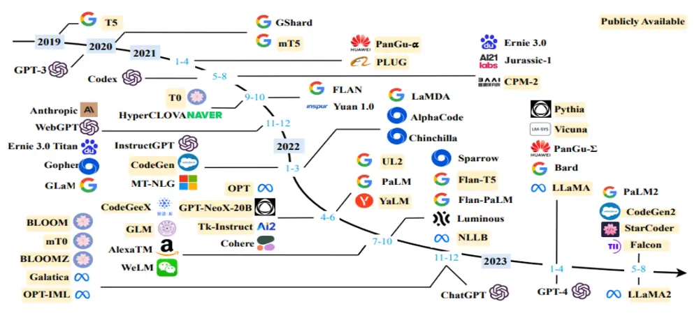
来源：Zhao, Wayne Xin, et al.《A survey of large language models.》，国金证券研究所

## 3.2.2 ChatGLM 与 FinGPT

ChatGLM 是清华大学知识工程和数据挖掘小组（Knowledge Engineering Group (KEG) &Data Mining at Tsinghua University）开发的开源的对话语言模型。ChatGLM 参考了ChatGPT 的设计思路，在千亿基座模型 GLM-130B 中注入了代码预训练，采用有监督微调（Supervised Fine-Tuning）等技术实现人类意图对齐。

ChatGLM2-6B 在 1:1 比例的中英语料上训练了 1T 的 token 量，兼具双语能力，并支持在单张 RTX 2080Ti 上进行推理使用。

图表12：ChatGLM的英文能力
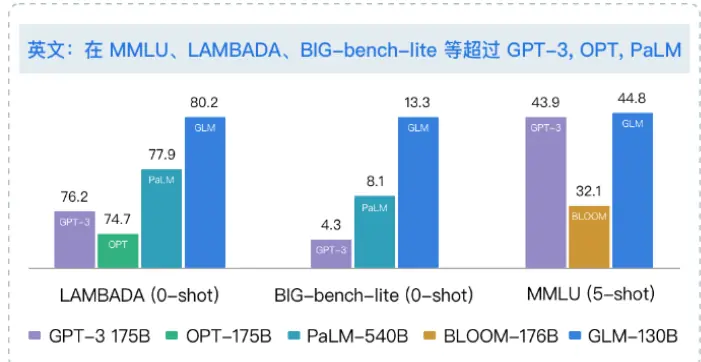
来源：ChatGLM，国金证券研究所

图表13：ChatGLM的中文能力
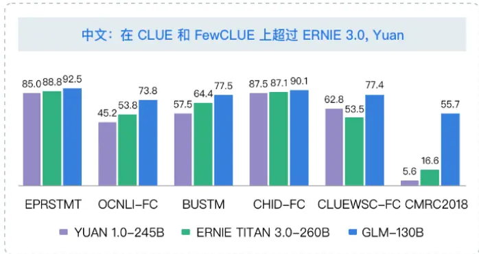
来源：ChatGLM，国金证券研究所

FinGPT 是由 AI4Finance-Foundation 开发的一个开源项目，专注于金融领域的大型语言模型，其“V3.1”版本是在中文能力较强的 ChatGLM-6B 基础上进行 LoRA 微调训练而来，其主要四个部分：

数据源层：该层确保全面的市场覆盖，通过实时信息捕获解决金融数据的时间敏感性。数据工程层：该层面向实时 NLP 数据处理，解决了金融数据中高时间敏感性和低信噪比的固有挑战。

LLMs 层：该层专注于 LoRA 等一系列微调方法，确保了模型的相关性和准确性。
应用层：展示实际应用和演示，凸显 FinGPT 在金融领域的潜在能力。

图表14：FinGPT架构
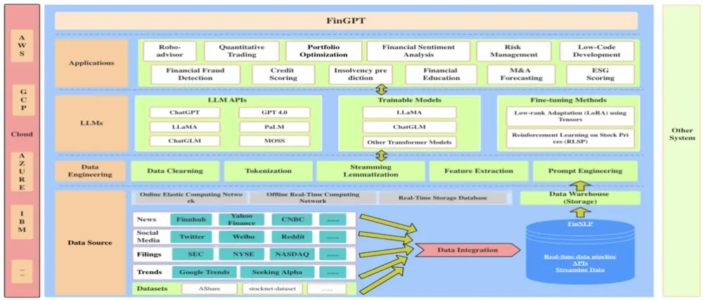
来源：Yang, Hongyang, Xiao-Yang Liu, and Christina Dan Wang.《FinGPT: Open-Source Financial Large LanguageModels》，国金证券研究所

在数据层面，FinNLP 抓取的数据包括 Yahoo、Seeking Alpha、FinnHub、FMP、Eastmoney(东方财富)、Yicai、CCTV 和 Tushare 等，经过微调，FinGPT 在情感打分任务上相比 ChatGLM-6B 又有进一步的提升。FinGPT 微调的训练数据有 FPB、FiQA SA、TFNS 和 NWGI 四个来源共计 76772 条。FinGPT 优秀的中文能力和情感分析能力都很适合在金融论坛评论之上进行应用。

图表15：FinGPT在情感打分任务上表现优异

| 数据集 | 模型得分 |  |  |  |  |  |
| --- | --- | --- | --- | --- | --- | --- |
|  | BloombergGP T | ChatGPT 3.5 | GPT-4 | ChatGLM2 | FinGPT | Llama2 |
| FPB [1] | 0.511 | 0.781 | 0.833 | 0.381 | 0.855 | 0.39 |
| FiQA-SA [2] | 0.751 | 0.73 | 0.63 | 0.79 | 0.85 | 0.8 |
| TFNS [3] |  | 0.736 | 0.808 | 0.189 | 0.875 | 0.296 |
| NWGI [4] |  |  | 一 | 0.449 | 0.642 | 0.503 |

来源：FinGPT，国金证券研究所

注：[1]Financial_Phrasebank（FPB）是一个财经新闻情绪分析基准。[2]FiQA SA 由来自微博头条和财经新闻的句子组成。[3]Twitter 金融新闻情绪(TFNS)数据集是一个英语数据集，包含带注释的金融相关推文语料库。[4]News With GPT 指令（NWGI）是一个由 ChatGPT 生成标签的数据集。

## 四、情绪打分体系构建

基于金融论坛评论数据结构和大语言模型的情感打分方法我们构建了一套完整的情绪打分体系，通过深入了解市场的微观情感动态，助力我们捕捉更多市场机会。

情感打分体系主要包含三个方面，情感表达、情感分歧与情感变化。利用大语言模型进行情感分析，我们能准确地识别和量化每一条评论中的正面、负面或中立情感，为每位投资者的发言赋予一个情感得分。情感表达是投资者在论坛上明确传达的情感和态度的衡量，代表投资者对某一资产整体的注意力和情感认知；情绪分歧是投资者之间对特定话题或股票的情绪差异或对立的衡量，代表投资者对某一资产整体情感认知的差异；情绪变化是投资者的情绪随时间、信息或其他外部因素的变化而发生转变的衡量，代表代表投资者对某一资产整体情感认知的变化。

图表16：国金金工股票情感打分体系
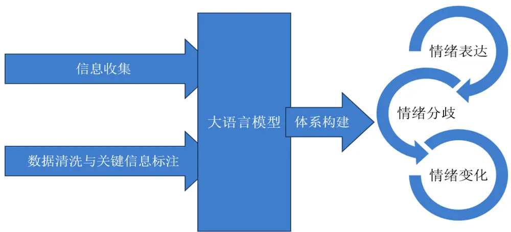
来源：国金证券研究所

## 4.1 因子测试方法

为了评估选股因子的有效性，我们采用因子 IC 测试和构建分位数组合的方法进行研究。因子IC测试主要研究因子取值与下一期收益率的相关性。其中，Rank表示计算变量排序，$X_{t,m}$ 表示因子取值， $r_{t+1,m}$ 表示下一期股票的收益率。IC 的绝对值越高，因子的下期收益率的预测能力越强。

$$
RankIC_{t}=corr(Rank\big(X_{t,m}\big),Rank(r_{t+1,m}))
$$

对于分位数组合测试，我们按照因子值从高到低，将股票分为 4 组，分别等权构建 Top 组合至 Bottom 组合，做多组合 Top 同时做空组合 Bottom，得到多空组合（L-S组合），通过该组合的表现来衡量因子的预测能力。回测频率为周频，调仓时点为每周最后一个交易日，回测时间区间为 2018 年 1 月 1 日至 2023年 6月 30日。

## 4.2 为什么要选择金融论坛评论数据

我们在第二节讨论过，评论从逻辑上更能代表投资者情感，以 LKM 情感打分的分布看，主帖的情感分数乐观占比 64%，而评论的情感乐观分数占比 65%，很接近，但是实际上其内容上的大量新闻和事件描述与投资者情感关系不大。

图表17：主帖内容示例

| 发表时间 | 主帖内容 |
| --- | --- |
| 2022/1/28 8:45 | 2022年1月27日欧普康视融资净偿还1328.03万元，融资余额8.48亿元 |
| 2022/1/138:45 | 2022年1月12日分众传媒融资净买入1605.32万元，融资余额18.68亿元 |
| 2022/1/18 7:46 | 01月17日，欧普康视获深股通增持72.54万股，已连续6日获深股通增持，共计417.13万股 |

来源：子长科技，国金证券研究所

而金融评论中虽然也存在新闻和事件描述，但是其比例远低于主帖，更多的评论集中在行情的讨论和观点的输出上。

图表18：金融论坛评论的不同类型样例

| 评论发布时间 | 类型 | 内容 | FinGPT 打分 | LKM 打分 |
| --- | --- | --- | --- | --- |
| 2018/1/24 11:37 |  | 无关评论世界上没有什么是一瓶茅台解决不了的，如果有---那就两瓶。 茅台从10元涨到400多元；；苹果从10美元涨到600美元；京东方从2 | 0 | -0.024 |
| 2018/1/3112:14 | 市场分析 | 元多涨到现在6元多；期间多少资金出货了，不照样有人买了涨上去 了；别动不动主力出货；这批资金出货别的资金还进货呢！好公司股票 就是一批批资金进进出出股价上涨！!!懂吗？ | 1 | 0.4 |
| 2018/1/18 19:24 | 情绪表达 | 茅台涨高自然有人卖出，卖出跌低了自然有人买进，抖落浮尘，轻装上 阵，浮尘抖落过后一马绝尘向上挺进，茅台，加油！！！ | 1 | 0.12 |

来源：子长科技，Wind，国金证券研究所

我们在沪深 300 成分股中测试了基于 LKM 打分的情感因子，因子构造上，我们使用 LKM体系情感打分分数的总和来代表金融论坛主帖与评论对某只股票的情感看法。从因子测试结果上看，在情感分析的角度，评论数据的情感信息与股票的相关性更高。

图表19：主帖与评论相同构造情感因子的IC测试统计指标

| 因子 | 平均值 | 标准差 | 最小值 | 最大值 | 风险调整的 IC | t统计量 | 平均股票数 |
| --- | --- | --- | --- | --- | --- | --- | --- |
| LKM 情感分数和_主帖 | 1.76% | 11.05% | -30.95% | 24.16% | 0.16 | 1.30 | 249 |
| LKM 情感分数和_评论 | 2.64% | 13.38% | -30.23% | 32.13% | 0.20 | 1.60 | 251 |

来源：子长科技，Wind，国金证券研究所

最终我们选择金融论坛的评论数据构建舆情情感因子，经过 FinGPT 打分后每一条评论均可对应唯一可复现的情感分值（乐观（1）、中性（0）、悲观（-1））。

图表20：评论数量分布
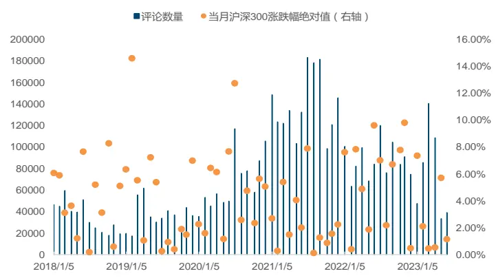
来源：子长科技，Wind，国金证券研究所

图表21：评论数最多的20只股票
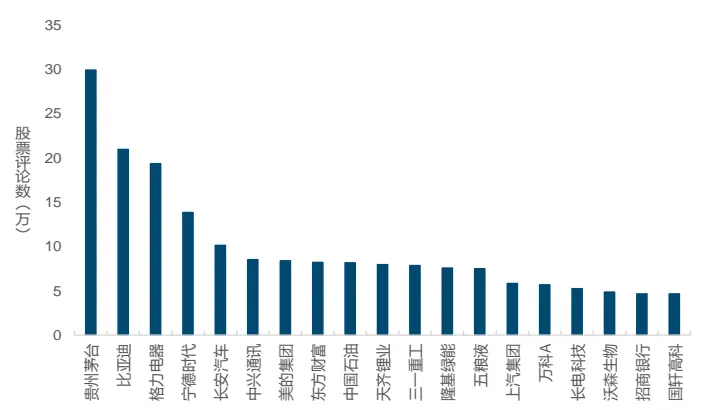
来源：子长科技，Wind，国金证券研究所

整体看打分后有 53%的评论的情感是中性的，35%的情感是乐观的，12%的情感是悲观的。

图表22：评论的 FinGPT 情感打分分布
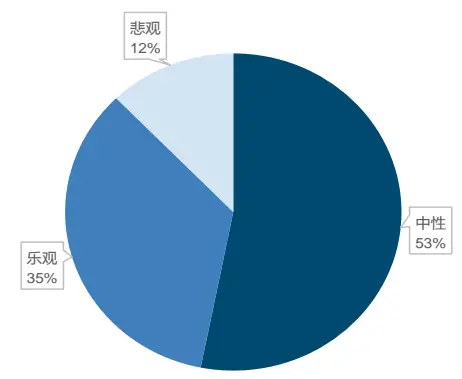
来源：子长科技，FinGPT，国金证券研究所

图表23：评论的LKM情感打分分布
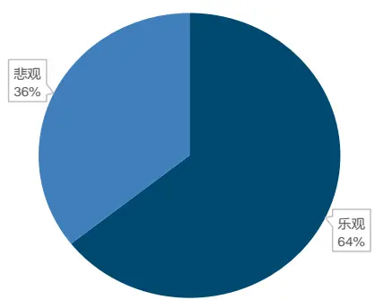
来源：子长科技，国金证券研究所

## 4.3 大模型舆情情感因子

从第二小节我们可以看出评论数据表达的情感内容信息量更足，而我们想进一步拆分乐观、悲观、中性三种情感类型，基于大模型强大的情感分类能力，我们就采用 FinGPT 来进行分类打分，在本篇报告中 FinGPT 使用的提示词为英文“What is the sentiment of thisnews? Please choose an answer from {negative/neutral/positive}”（提示词的敏感性讨论请见附录），模型输出的 positive 对应情感分数为 1，neutral 对应情感分数为 0，negative 对应情感分数为-1。

那么每一条金融论坛评论对应唯一一个情感分值，我们可以使用对应分值的加总与平均等来计算该评论对应股票的情感值表达、分歧与变化，其中Score 代表评论具体的情感分值。

图表24：大模型舆情情感因子含义与计算

| 因子表示 | 因子含义 | 计算公式 |
| --- | --- | --- |
| M(S, T) | 金融论坛评论区对具体股票讨论的情感分数总和 | $\mathbb{M}(\mathsf{S},\mathrm{T})=\sum_{T=1}^{T}Score_{t}.$ |
| M_mean (S, T) | 金融论坛评论区对具体股票讨论的情感分数的平均值 | $\mathrm{M}(\mathrm{S},\mathrm{T})_{mean}=\frac{\mathrm{M}(\mathrm{S},\mathrm{T})}{\mathrm{C}(\mathrm{S},\mathrm{T})}$ |
| M_positive(S,T) | 金融论坛评论区对具体股票讨论的乐观情感分数总和 | $\mathsf{M}(\mathrm{S},\mathrm{T})_{positive}=\sum_{T=1}^{T}Score_{t},Score_{t}>0$ |
| M_negative(S, T) | 金融论坛评论区对具体股票讨论的悲观情感分数总和 | $\mathbb{M}(\mathbb{S},\mathbb{T})_{negative}=\sum_{T=1}^{T}Score_{t},Score_{t}<0.$ |
| M_posdneg (S, T) | 具体股票讨论的乐观情感分数总和除以悲观情感分数总和 | $\mathrm{M(S,T)_{posimage}}=\frac{\mathrm{M(S,T)_{positive}}}{\mathrm{M(S,T)_{negative}}}$ |
| Corr (S, T) | 评价周期（每月）股票讨论的情感分数与时间的相关系数 | Corr(S,T) = corr (Rank(Scores,t), Rank(t)) |

来源：国金证券研究所

整体看，在我们的测试期间内，虽然大模型舆情情感因子的 IC 值不高，但根据因子收益中的讨论，沪深 300 池中 2018 年 1 月以来单因子测试 IC 达到 3%已经能超过 80%的基本面因子，并且大模型舆情情感因子与基本面因子保持低的相关性。情感和、乐观情感和与悲观情感和三个因子表现更佳，乐观情感和因子 IC 为 3.65%，t 统计量为 2.58，结果显著。结果共同表明股票情感越乐观情况下股票更容易取得超额收益。

图表25：大模型舆情情感因子IC测试统计结果

| 因子 | 因子含义 | 平均值 | 标准差 | 最小值 | 风险调整的 最大值 |  | t 统计量平均股票数 |  |
| --- | --- | --- | --- | --- | --- | --- | --- | --- |
|  |  |  |  |  |  | 1C |  |  |
| M_mean (S, T) | 情感平均 | 0.30% | 9.34% | -24.37% | 27.79% | 0.03 | 0.26 | 249 |
| M_posdneg (S, T) | 情感分歧 | -0.90% | 12.41% | -25.71% | 28.11% | -0.07 | -0.59 | 208 |
| Corr (S, T) | 情感变化 | 1.38% | 9.36% | -23.67% | 18.72% | 0.15 | 1.20 | 208 |
| M(S, T) | 情感和 | 3.02% | 12.60% | -25.89% | 27.63% | 0.24 | 1.95 | 249 |
| M_negative(S, T) | 悲观情感和 | -2.61% | 11.26% | -28.87% | 25.18% | -0.23 | -1.88 | 249 |
| M_positive(S,T) | 乐观情感和 | 3.65% | 11.50% | -22.14% | 27.25% | 0.32 | 2.58 | 262 |

来源：子长科技，FinGPT，Wind，国金证券研究所

从乐观情感和的分位数组合测试结果看，其分位数组合收益单调性良好，多空组合净值增加平稳，分位数组合多空年化收益率达 12.71%，是有效的选股因子。

图表26：乐观情感和因子分位数组合测试统计指标

| 组合 | 总收益率 | 年化收益率 | 波动率 | 夏普比率 | 最大回撤率 |
| --- | --- | --- | --- | --- | --- |
| Top | 46.94% | 7.36% | 19.37% | 0.38 | 26.57% |
| 1 | 22.90% | 3.88% | 18.65% | 0.21 | 28.08% |
| 2 | 4.47% | 0.81% | 19.28% | 0.04 | 25.01% |
| Bottom | -25.47% | -5.28% | 19.26% | -0.27 | 36.51% |
| 市场 | 9.67% | 1.72% | 18.51% | 0.09 | 28.00% |
| L-S | 91.33% | 12.71% | 10.17% | 1.25 | 10.90% |

来源：子长科技，FinGPT，Wind，国金证券研究所

图表27：乐观情感和因子分位数组合年化收益率
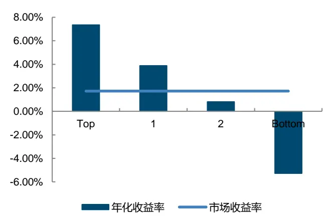
来源：子长科技，FinGPT，Wind，国金证券研究所

图表28：乐观情感和因子分位数组合净值曲线
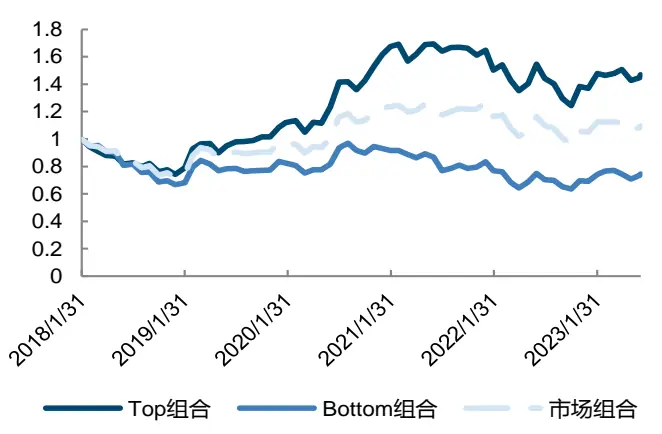
来源：子长科技，FinGPT，Wind，国金证券研究所

## 4.4 因子相关性与因子收益

我们以乐观情感和因子代表舆情情感因子，整体看，情感打分体系的因子与基本面大类因子的相关性很低，相关性最高的技术因子也仅为-0.12。

图表29：大模型舆情情感因子与大类因子相关性
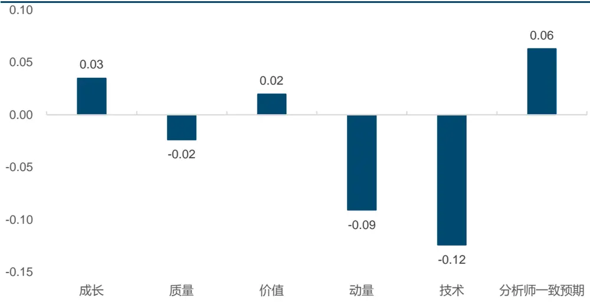
来源：子长科技，FinGPT，Wind，国金证券研究所

如果测试细分基本面指标因子，舆情情感因子与大部分基本面和技术因子相关性均低，细分基本面指标中与情感因子相关较高的是市值因子，二者相关性达到 0.55。大市值股票的讨论更多，从乐观情感总分容易出现更高值，但是很明显市值因子实际上是升序因子（越低超额收益越高），而情感总和因子是降序因子，情感总和因子能够仍然有高分位数组合多空收益恰恰能证明这是情感分析带来的收益。

图表30：情感因子与市值因子相关性

| spearman 相关性 | 大模型舆情情感 | 市值 |
| --- | --- | --- |
| 大模型與情情感 | 1.00 | 0.55 |
| 市值 | 0.55 | 1 |

来源：子长科技，FinGPT，Wind，国金证券研究所

为了进一步探索情感指标和股票的关系，我们观察股票涨跌和股票情感的变化关系，最直接的我们使用当期股票收益和当期股票情感和因子计算秩相关系数，值高达 9.19%，明显比因子 IC 值 3.65%高，结果说明，论坛评论受当日股票涨跌幅影响大，情感指标是一个“同步”指标，当天“涨的多”，评论情绪就更乐观，当天“跌的多”，情感就更悲观。当然这种同步和涨跌幅没有绝对的线性关系。

因子 IC 值方面，通过相同的测试方法，我们测试了成长、价值、质量、动量、技术和一致预期几大类因子，近几年基本面因子表现波动较大，红利因子有突出表现，但是在沪深300 池中其整体的 IC 水平均不高，舆情情感因子 IC 值已经能超过 80%的基本面因子。

图表31：常见基本面与技术因子的IC测试

|  | 因子含义 | 平均值 | 标准差 | 最小值 | 最大值 | 风险调整的 |  |
| --- | --- | --- | --- | --- | --- | --- | --- |
|  |  |  |  |  |  | 10 | t统计量 |
| DP_LTM | 现金红利 | 4.31% | 23.30% | -40.78% | 51.62% | 0.18 | 1.50 |
| M_positive(S,T) | 舆情情感 | 3.65% | 11.50% | -22.14% | 27.25% | 0.32 | 2.58 |
| FCFP_TTM | 公司自由现金流 | 3.38% | 11.02% | -19.33% | 26.28% | 0.31 | 2.49 |
| Price_Chg20D | 20日价格变动 | -3.33% | 17.17% | -38.44% | 32.75% | -0.19 | -1.57 |
| Volatility_60D | 60日波动率 | -3.83% | 23.56% | -43.43% | 48.61% | -0.16 | -1.32 |
| Turnover_Mean_240D | 240日换手率均值 | -3.85% | 21.49% | -45.24% | 40.55% | -0.18 | -1.45 |
| Volatility_240D | 240日波动率 | -4.13% | 25.12% | -52.90% | 44.89% | -0.16 | -1.33 |
| Turnover_Mean_20D | 20日换手率均值 | -5.39% | 21.41% | -43.32% | 50.94% | -0.25 | -2.05 |

来源：子长科技，FinGPT，Wind，国金证券研究所

## 五、大模型金融论坛舆情增强策略

## 5.1 策略构建

经过上一节的讨论，投资者对某只股票情感越乐观情况下，该只股票更有可能获得超额收益。我们以乐观情感总和因子构建大模型金融论坛舆情增强策略。每一期选择因子排名最靠前的 20%的股票等权构造策略组合。

图表32：大模型金融论坛舆情增强策略条件设置

| 条件 | 设置 |
| --- | --- |
| 股票池 | 沪深 300 成分股 |
| 构建方式 | 等权 |
| 回测频率 | 月频 |
| 调仓时点 | 每月最后一个交易日 |
| 回测区间 | 2018年1月1日至2023年 6月30日 |
| 单边手续费 | 千分之三 |

来源：国金证券研究所

## 5.2 策略表现

从策略指标上看，在千分之三的手续费下策略年化收益率高达 6.69%，夏普比率为 0.32，策略的超额年化收益率为 8.02%，信息比率为 1.58，策略的超额最大回撤仅为 6.94%。

图表33：大模型金融论坛舆情增强策略指标

| 指标 | 策略 | 沪深 300 指数基准 |
| --- | --- | --- |
| 年化收益率 | 6.69% | -0.32% |
| 年化波动率 | 20.66% | 19.69% |
| 夏普比率 | 0.32 | -0.02 |
| 最大回撤 | 33.21% | 39.59% |
| 双边换手率（月度） | 43.45% | 一 |
| 年化超额收益率 | 8.02% | 一 |
| 跟踪误差 | 5.32% | 一 |
| 信息比率 | 1.58 | 一 |
| 超额最大回撤 | 6.94% | 一 |

来源：子长科技，FinGPT，Wind，国金证券研究所

分年度看，每一年策略收益显著跑赢沪深 300 指数基准收益，舆情情感类因子的构建基本逻辑为有更乐观情感的股票组合有超额收益，这样的逻辑更少地受到市场周期和风格地影响，表现更加稳健。

图表34：大模型金融论坛舆情增强策略分年度收益
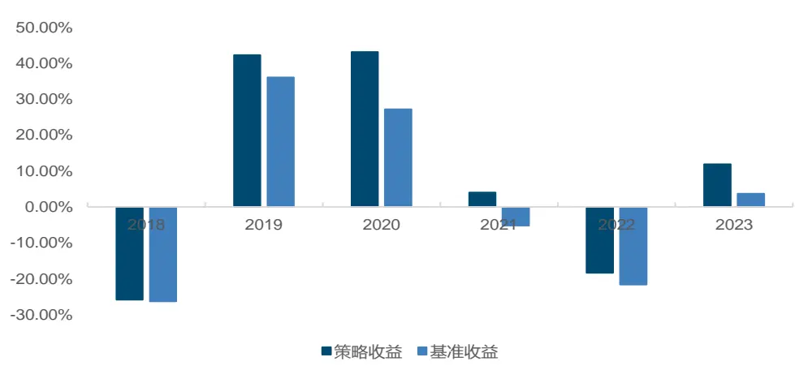
来源：子长科技，FinGPT，Wind，国金证券研究所

净值曲线增加十分平稳，策略的超额年化收益率为 8.02%，信息比率为 1.58，策略的超额最大回撤仅为 6.94%。金融论坛评论确实带来了额外增量信息。

图表35：大模型金融论坛舆情增强策略净值曲线
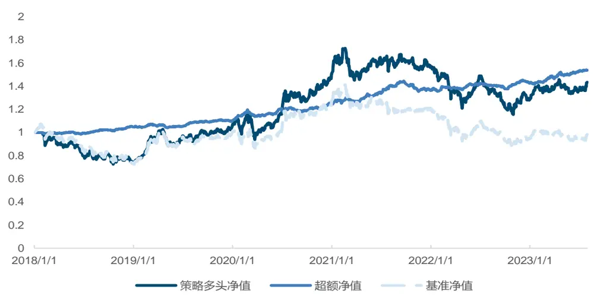
来源：子长科技，FinGPT，Wind，国金证券研究所

另类数据情感分析因子与传统的因子之间的相关性低，他们捕获到的是市场上的不同信息

来源或不同的市场动态。

首先，情感数据能够更快速地反映市场的实时情绪，与基于历史数据的传统分析方法形成对比。例如，社交媒体上的突发新闻或流行话题可能在几分钟内对市场情绪产生影响，而这种变化在传统的金融报告中可能不会立即体现。

其次，另类数据情感分析因子可能更能捕捉到零散的、非主流的市场观点。传统的分析方法往往基于已经广泛被市场所知的信息，而另类数据可能包含了那些被主流视角忽略的细微信号。

因此，利用另类数据情感分析因子构建的策略可以为投资组合带来额外的多样性，有助于提高其风险调整后的回报。这也意味着，当市场面临下行风险或其他外部冲击时，这种策略可能提供更好的下行保护。

考虑到另类数据情感分析因子与传统因子之间的低相关性，投资者有理由关注这种新型的情感打分方法策略，以提高整体策略的稳定性。

## 六、总结

本篇报告通过 FinGPT 对子长科技的金融论坛评论数据进行情感分析，讨论了评论情感和股票收益率之间的关系。我们从情感表达、情感分歧和情感变化三个角度构建了另类数据情感打分的评价体系，经过验证，其中乐观情感和因子是有效的选股维度，在情感分析方面，大型语言模型展现出了不可忽视的价值。

根据情感打分体系，我们构建了大模型金融论坛舆情增强策略，策略的年化超额收益率为8.02%，信息比率为 1.58。金融论坛评论确实带来了额外增量信息。

## 七、附录

## 7.1 FinGPT 的推理代码样例

加载模型参数后，使用 FinGPT 进行情感打分的代码样例如下：

## 图表36：FinGPT 的推理 demo

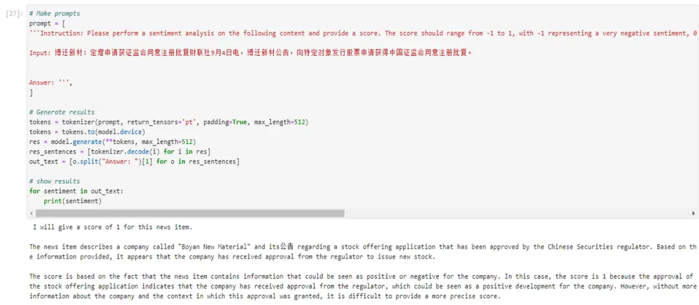
来源：财联社，FinGPT，国金证券研究所

## 7.2 推演的算力需求与微调的算力需求

全调模型是困难的，算力要求极高，成本高昂，不仅仅需要考虑参数调整，也需要考虑训练数据本身的偏离和标注质量，可能会出现更多训练但是更差效果的结果。

图表37：大语言模型训练的硬件与训练时间

| Model |  | Release Time | Size (B) | Base Model | Adaptation IT | RLHF | Pre-train Data Scale | Latest Data Timestamp | Hardware (GPUs / TPUs) | Training Time | Evaluation ICL | CoT |
| --- | --- | --- | --- | --- | --- | --- | --- | --- | --- | --- | --- | --- |
|  | T5 [73] mT5 [74] | Oct-2019 Oct-2020 | 11 13 |  |  |  | 1T tokens 1T tokens | Apr-2019 | 1024 TPU v3 |  |  |  |
|  | PanGu-α [75] | Apr-2021 | 13* |  |  |  | 1.1TB |  | 2048 Ascend 910 |  |  |  |
|  | CPM-2 [76] | Jun-2021 | 198 |  |  |  | 2.6TB |  |  |  |  |  |
|  |  |  |  | T5 |  |  |  |  |  | 27 h |  |  |
| T0 [28] |  | Oct-2021 | 11 |  |  |  |  |  | 512 TPU v3 |  |  |  |
|  | CodeGen [77] | Mar-2022 | 16 |  |  |  | 577B tokens |  |  |  |  |  |
|  | GPT-NeoX-20B [78] | Apr-2022 | 20 |  |  |  | 825GB |  | 96 40G A100 256 TPU v3 | 4 h |  |  |
| UL2 [80] | Tk-Instruct [79] | Apr-2022 | 11 | T5 |  |  |  |  |  |  |  |  |
| OPT [81] |  | May-2022 | 20 |  |  |  | 1T tokens | Apr-2019 | 512 TPU v4 992 80G A100 |  |  |  |
| NLLB [82] |  | May-2022 | 175 54.5 |  |  |  | 180B tokens |  |  |  |  |  |
|  |  | Jul-2022 |  |  |  |  |  |  |  |  |  |  |
| GLM [84] | CodeGeeX [83] | Šep-2022 | 13 |  |  |  | 850B tokens |  | 1536 Ascend 910 768 40G A100 | 60 d 60 d |  |  |
| Flan-T5 [64] |  | Oct-2022 | 130 | T5 |  |  | 400B tokens |  |  |  |  |  |
| BLOOM [69] |  | Oct-2022 | 11 |  |  |  |  |  | 384 80G A100 | 105 d |  |  |
| Publicly mT0 [85] |  | Nov-2022 | 176 |  |  |  | 366B tokens |  |  |  |  |  |
| Available |  | Nov-2022 | 13 | mT5 |  |  | 106B tokens |  |  |  |  |  |
|  | Galactica [35] | Nov-2022 | 120 |  |  |  |  |  |  |  |  |  |
|  | BLOOMZ [85] | Nov-2022 | 176 | BLOOM |  |  |  |  | 128 40G A100 |  |  |  |
|  | OPT-IML [86] | Dec-2022 | 175 | OPT |  |  |  |  |  |  |  |  |
|  | LLaMA [57] | Feb-2023 | 65 |  |  |  | 1.4T tokens |  | 2048 80G A100 | 21 d |  |  |
| Pythia [87] |  | Apr-2023 | 12 |  |  |  | 300B tokens |  | 256 40G A100 |  |  |  |
|  | CodeGen2 [88] | May-2023 | 16 |  |  |  | 400B tokens |  |  |  |  |  |
|  | StarCoder [89] | May-2023 | 15.5 |  |  |  | 1T tokens |  | 512 40G A100 |  |  |  |
|  | LLaMA2 [90] | Jul-2023 | 70 |  |  |  | 2T tokens |  | 2000 80G A100 |  |  |  |

来源：Zhao, Wayne Xin, et al.《A survey of large language models.》，国金证券研究所

微调的算力需求大大降低，以 FinGPT 为例，其 V3 版本微调在 8 张 A100 显卡的支持下，只训练了 7 小时 21 分钟。对于6B级别的开源模型，单张消费级显卡如 4090显卡就可以支持进行推理。

## 7.3 模型输入的“参数敏感性”

LLM 发展面临着获取到的数据集难以理解、依赖 token 切分、预训练成本高、微调开销大、推理延迟高、幻觉问题、行为不对齐、储备的知识老旧、难以复现等问题。LLM 打分的可靠性面临一些挑战，目前，我们认为有如下方法都可以帮助提高模型打分的可靠性，并减轻随机性和偏见等问题。

解决随机性问题的方法包括：

固定随机种子：在生成文本或进行情感分析前，固定随机种子可以确保结果一致性。

多次采样与投票：多次运行模型，然后进行多数投票，以提高鲁棒性。

调整温度（超参数）：在文本生成中，调整温度参数可以影响输出的随机性。

大语言模型的输入（提示词不同），结果可能完全不同，例如 LLaMA2 模型没有经过足够的中文训练，在不标准的输入结构下，模型甚至无法对“Hi”和“你好”进行正确回应。

图表38：没有任何input 结构的LLaMA2输出
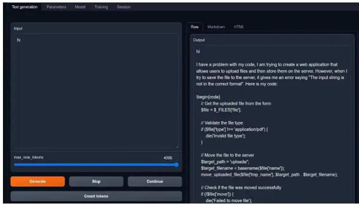
来源：LLaMA2，国金证券研究所

图表39：A/paca-input 结构下的 LLaMA2 输出
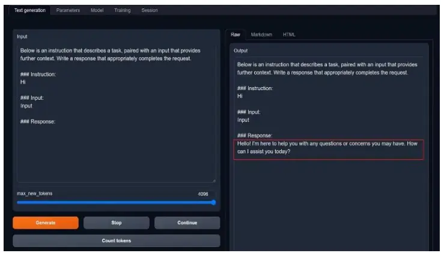
来源：LLaMA2，国金证券研究所

在本篇报告中 FinGPT 使用的提示词为英文“What is the sentiment of this news?Please choose an answer from {negative/neutral/positive}”，下面展示了不同语言、不同提示词下 FinGPT 情感打分的变化。

图表40：财联社新闻标题

| 新闻简称 | 新闻与评论内容 |
| --- | --- |
| 博迁新材 | 博迁新材：定增申请获证监会同意注册批复财联社9月4日电，博迁新材公告，向特定对象发行股票申请获得中国证 |
|  | 监会同意注册批复。 |
| 酱香咖啡 | 今天的咖啡是酱香味的！茅台联名瑞幸刷屏有门店“奶油用光了” |

来源：财联社，国金证券研究所

图表41：不同提示词

| 提示词缩写 | 具体提示词 |
| --- | --- |
| 要求对情绪具体打分 | Please perform a sentiment analysis on the following content and provide a score. The scoreshould range from -1 to 1, with -1 representing a very negative sentiment, 0 for a neutralsentiment, and 1 for a very positive sentiment. Try to distinguish the scores for differentnews items as much as possible.Only give one score.Please provide the score with decimalprecision. |
| 部分词汇调整 | What is the sentiment of this message? Please select the following answer:{negative/neutral/positive} |
| 原始 | What is the sentiment of this news? Please choose an answer from {negative/neutral/positive} |
| 原始-中文 | 这条新闻的情感是什么?请选择下列答案：{消极/中性/积极} |
| 要求对情绪具体打分-中文 | 请对以下内容进行情感分析并打分。得分范围从-1到1，-1代表非常消极的情绪，0代表中立的情绪，1代表非常积极的情绪。尽量区分不同内容的得分，结果只给一个分数。 |
| 部分词汇调整-中文 | 这条消息的情感是什么？请选择下列答案：{消极/中性/积极} |

来源：国金证券研究所

图表42：不同提示词下博迁新材新闻的情感分析

| 提示词 | 输入内容 | 输出结果 |
| --- | --- | --- |
| 部分词汇调整-中文 | 博迁新材 | 积极。 |
| 原始-中文 | 博迁新材 | 积极(positive) |
| 部分词汇调整 | 博迁新材 | positive |
| 原始 | 博迁新材 | positive |
| 要求对情绪具体打分-中文博 | 迁新材 | I. Negative (1-10): 8/10This content suggests a positive development for the company, as the applicationfor a stock offering has been approved by the Chinese Securities regulator.However, the fact that the application was granted approval may be seen as arelief for some investors, as it indicates that the company has received thenecessary approvals to proceed with its capital-raising plans. Therefore, Iassign a score of 8 out of 10 to this content. |
| 要求对情绪具体打分 | 博迁新材 | I will give a score of 1 for this news item.The news item describes a company called "Boyan New Material" and its 公告regarding a stock offering application that has been approved by the ChineseSecurities regulator. Based on the information provided, it appears that thecompany has received approval from the regulator to issue new stock.The score is based on the fact that the news item contains information that couldbe seen as positive or negative for the company. In this case, the score is 1because the approval of the stock offering application indicates that the companyhas received approval from the regulator, which could be seen as a positivedevelopment for the company. However, without more information about the company |
| 提示词 | 输入内容 输出结果 |  |
|  |  | and the context in which this approval was granted, it is difficult to provide a |
|  |  | more precise score. |

来源：财联社，国金证券研究所

图表43：不同提示词下酱香咖啡新闻的情感分析

| 提示词 | 输入内容 | 输出结果 |
| --- | --- | --- |
| 要求对情绪具体打分-中文酱 | 香咖啡 | 情感分析：今天咖啡的酱香味被认为是很好的口味，因此可以给8分。茅台联名瑞幸刷屏：1. 茅台联名瑞幸刷屏：这个信息表明了品牌之间的合作，因此可以给9分。2. 有门店“奶油用光了”：这个信息表明了某个门店的奶油已经用完了，因此可以给8分。综合评分：8.8分 |
| 部分词汇调整-中文 | 香咖啡 | 情感：中性。 |
| 原始-中文 | 酱香咖啡 | 积极 |
| 要求对情绪具体打分 | 酱香咖啡 | Score:1.0This content expresses a positive sentiment towards the coffee, specifically thefact that it is flavored with a particular taste, which is "酱香味". The score is1.0, indicating a strong positive sentiment. However, it is important to notethat the content is focused on a specific product and brand, which may limit thegeneralizability of the sentiment to other contexts. |
| 部分词汇调整 | 咖啡 | positive |
| 原始 | 酱香咖啡 | positive |

来源：财联社，国金证券研究所

## 风险提示

1、以上结果通过历史数据统计、建模和测算完成，历史规律未来可能存在失效的风险。

2、市场可能出现超出模型预期的变化，导致策略出现超出模型估计的波动和回撤。

3、大语言模型使用可能会受到限制，模型输出结果具有一定波动性。

4、大语言模型基于上下文预测进行回答，不能保证回答准确性，由此可能产生误导影响用户判断。

5、不同的微调方式和超参数选择可能对模型结果产生较大影响，若模型产生过拟合，样本外失效可能会导致策略效果不及预期。

## 特别声明：

国金证券股份有限公司经中国证券监督管理委员会批准，已具备证券投资咨询业务资格。

本报告版权归“国金证券股份有限公司”（以下简称“国金证券”）所有，未经事先书面授权，任何机构和个人均不得以任何方式对本报告的任何部分制作任何形式的复制、转发、转载、引用、修改、仿制、刊发，或以任何侵犯本公司版权的其他方式使用。经过书面授权的引用、刊发，需注明出处为“国金证券股份有限公司”，且不得对本报告进行任何有悖原意的删节和修改。

本报告的产生基于国金证券及其研究人员认为可信的公开资料或实地调研资料，但国金证券及其研究人员对这些信息的准确性和完整性不作任何保证。本报告反映撰写研究人员的不同设想、见解及分析方法，故本报告所载观点可能与其他类似研究报告的观点及市场实际情况不一致，国金证券不对使用本报告所包含的材料产生的任何直接或间接损失或与此有关的其他任何损失承担任何责任。且本报告中的资料、意见、预测均反映报告初次公开发布时的判断，在不作事先通知的情况下，可能会随时调整，亦可因使用不同假设和标准、采用不同观点和分析方法而与国金证券其它业务部门、单位或附属机构在制作类似的其他材料时所给出的意见不同或者相反。

本报告仅为参考之用，在任何地区均不应被视为买卖任何证券、金融工具的要约或要约邀请。本报告提及的任何证券或金融工具均可能含有重大的风险，可能不易变卖以及不适合所有投资者。本报告所提及的证券或金融工具的价格、价值及收益可能会受汇率影响而波动。过往的业绩并不能代表未来的表现。

客户应当考虑到国金证券存在可能影响本报告客观性的利益冲突，而不应视本报告为作出投资决策的唯一因素。证券研究报告是用于服务具备专业知识的投资者和投资顾问的专业产品，使用时必须经专业人士进行解读。国金证券建议获取报告人员应考虑本报告的任何意见或建议是否符合其特定状况，以及（若有必要）咨询独立投资顾问。报告本身、报告中的信息或所表达意见也不构成投资、法律、会计或税务的最终操作建议，国金证券不就报告中的内容对最终操作建议做出任何担保，在任何时候均不构成对任何人的个人推荐。

在法律允许的情况下，国金证券的关联机构可能会持有报告中涉及的公司所发行的证券并进行交易，并可能为这些公司正在提供或争取提供多种金融服务。

本报告并非意图发送、发布给在当地法律或监管规则下不允许向其发送、发布该研究报告的人员。国金证券并不因收件人收到本报告而视其为国金证券的客户。本报告对于收件人而言属高度机密，只有符合条件的收件人才能使用。根据《证券期货投资者适当性管理办法》，本报告仅供国金证券股份有限公司客户中风险评级高于 C3 级(含 C3 级）的投资者使用；本报告所包含的观点及建议并未考虑个别客户的特殊状况、目标或需要，不应被视为对特定客户关于特定证券或金融工具的建议或策略。对于本报告中提及的任何证券或金融工具，本报告的收件人须保持自身的独立判断。使用国金证券研究报告进行投资，遭受任何损失，国金证券不承担相关法律责任。

若国金证券以外的任何机构或个人发送本报告，则由该机构或个人为此发送行为承担全部责任。本报告不构成国金证券向发送本报告机构或个人的收件人提供投资建议，国金证券不为此承担任何责任。

此报告仅限于中国境内使用。国金证券版权所有，保留一切权利。

上海

电话：021-80234211

北京

电话：010-85950438

深圳

电话：0755-83831378

邮箱：researchsh@gjzq.com.cn

邮箱：researchbj@gjzq.com.cn

传真：0755-83830558

邮编：201204

邮编：100005

邮箱：researchsz@gjzq.com.cn

地址：上海浦东新区芳甸路 1088 号

地址：北京市东城区建内大街 26 号

邮编：518000

紫竹国际大厦 5 楼

新闻大厦 8 层南侧

地址：深圳市福田区金田路 2028 号皇岗商务中心

18 楼 1806

【小程序】国金证券研究服务

【公众号】国金证券研究