证券研究报告

金融工程组

分析师：高智威（执业 S1130522110003)分析师：王小康（执业 S1130523110004)

gaozhiw@gjzq.com.cn

wangxiaokang@gjzq.com.cn

## 基于多目标、多模型的机器学习指数增强策略

## 机器学习与量化投资的应用

各类机器学习算法近年来在量化投资领域得到了越来越多的应用，各种模型借助于其巧妙的模型设计有效挖掘到特征或因子间的非线性关系，完成各类因子合成或因子生成的任务，进而形成有效的量化策略，相较于传统人工挖掘因子或简单线性因子合成有着更高的效率和更好的策略效果。

我们着重探讨了基于决策树的 GBDT 类模型和各种神经网络类模型的算法设计，其中 GBDT 类模型是通过将多个简单的决策树进行集成，每轮迭代时训练目标为前一轮的预测残差，不断逼近真实值。XGBoost、LightGBM 和 CatBoost 都是三种典型的 GBDT 算法改进模型。而神经网络类模型通过模仿生物神经元相互传递信号的方式构造。模型结构包括输入层、输出层和多个隐藏层，每一层均有若干个神经元可与其他节点连接。为了解决不同应用场景也出现了不同的网络结构设计，包括专门用于解决时序预测问题的 LSTM&GRU、用于结合卷积思路用于时序预测的 TCN、以及引入了自注意力机制的 Transformer 模型。我们在本篇报告中对这些模型分别进行测试比较，最终形成有效的量化投资策略。

## 两类模型在A 股各宽基指数的测试效果

在特征层面，我们使用包括 Alpha158、GJQuant 基本与日频量价因子和 Ta-Lib 各类技术指标因子作为模型的输入特征进行测试。发现 Alpha158 和 GJQuant 两类特征的结合在 GBDT 类模型中表现较好，而神经网络类模型中仅使用Alpha158 表现更优。在预测标签层面，除了传统的未来 20 日超额收益率外，我们添加了信息比率和 Calmar 比率同样作为预测目标对模型进行训练。发现以信息比率和超额收益率作为预测目标的模型信号各类投资组合指标表现相对更好。就模型对比来看，GBDT 类模型预测信号的多头超额收益率明显更优，而神经网络类模型的最大回撤明显更低。两类模型的相关性约为 0.4-0.5 之间，因此我们将两大类模型等权合成，构造最终的选股因子。

在沪深 300 上，GBDT+NN 模型因子 IC 均值达到 10.40%，多头年化超额收益率 14.44%，多头夏普比率 0.73，超额最大回撤仅为 5.54%。在中证 500 上，IC 均值 10.34%，多头年化超额收益率 16.55%，多头夏普比率 0.72，超额最大回撤12.84%。中证 100 成分股上表现更加亮眼，IC 均值 14.62%，多头年化超额收益率 27.71%，多头夏普比率 0.97，超额最大回撤 4.74%。

## 基于 GBDT+NN模型结合的指数增强策略

以上可以看出，融合了多种模型、多种预测目标的选股因子在各宽基指数成分股上表现优异。考虑贴合投资实际，我们使用马科维茨的均值方差优化模型，对投资组合的跟踪误差进行限制，最大化预期超额收益率的方式进行指数增强策略的构建。在假设单边千二的手续费率下，所得到 GBDT+NN 沪深 300 指数增强策略年化超额收益率 15.85%，超额最大回撤 3.12%。中证 500 指数增强策略年化超额 20.74%，超额最大回撤 6.36%。中证 1000 指数增强策略年化超额32.82%，超额最大回撤 3.97%。

## 风险提示

1、以上结果通过历史数据统计、建模和测算完成，在政策、市场环境发生变化时模型存在时效的风险。

2、策略通过一定的假设通过历史数据回测得到，当交易成本提高或其他条件改变时，可能导致策略收益下降甚至出现亏损。

## 一、机器学习与量化投资的应用

从图像识别、自然语言处理与到数据与信号的分析，机器学习近些年在各行业都展现出了出色的能力，并已开始得到广泛应用。而量化投资由于需要进行处理大量的各类数据，深入分析并挖掘各类股票特征之间的关系并形成有效预测信号，天然就是机器学习绝佳的应用场景。各类机器学习算法能够借助于其巧妙的模型设计有效挖掘到特征或因子间的非线性关系，进行各类因子合成或因子生成的任务，进而形成有效的量化策略，相较于传统人工挖掘因子或简单线性因子合成有着更高的效率和更好的策略效果。

在本篇报告中，我们将首先简要概述目前各类主流机器学习（深度学习）模型的算法原理，探索比较各模型在 A 股各股票池中的选股效果，尝试使用不同方式对模型进行应用，最终形成可投资的量化指数增强策略，以期获取持续稳定的超额收益。

由于不同模型的结构和设计思路存在较大区别，在各个领域所适用的最佳模型也不尽相同。目前主流应用于量化投资领域的机器学习模型主要包括基于决策树的 GBDT 类模型和基于RNN 的各类神经网络模型。

## 1.1 基于决策树的各类GBDT 模型

决策树是一种目前在 Kaggle 各类比赛中受到广泛欢迎的一种机器学习算法，具有可解释性强、易于理解的特点，即可用于回归类任务，也可以用于分类任务。这类决策树一般也被称为 CART(Classification and Regression Tree)，该模型从根节点出发，对每一个特征进行判断，将样本划分到对应的子节点中。判断时采用基尼系数的大小来度量特征的各个划分点，从而使得对于任意划分点 s 两边的样本 $.D_{1}和D_{2}月$ 所求出的均方差最小，直到样本个数小于阈值或已无其他特征。

$$
\operatorname*{min}_{s}\left[\operatorname*{min}_{c1}\sum_{xi\in D1}(x_{i}-c_{1})^{2}+\operatorname*{min}_{c2}\sum_{yi\in D2}(y_{i}-c_{2})^{2}\right]
$$

由于决策树在训练过程中会尽可能拟合样本，可能会导致过拟合。因此又引入了剪枝（pruning）操作，即考虑每个非叶节点替换成叶节点后模型的泛化能力的变化。通过剪枝操作可以降低树的高度，尽可能减少过拟合的风险。

一种增强单棵决策树性能的方法是集成学习，即将多棵决策树融合在一起，提高模型整体的精确度和泛化性能。目前主要有两种集成方法，分别是 Bagging 和 Boosting。Bagging的基本思想是通过在原始训练数据集做有放回抽样选出新的 K 个子数据集进行分别训练，最终采用投票法等多种方法集成所有学习器的预测效果。这种方法的典型应用就是随机森林模型，通过组合多个弱学习器，有效降低模型方差，提高模型性能。

Boosting 是一种有顺序的基模型训练方式，每个基模型都会在前一个基模型的基础上进行学习，最终综合所有基模型的预测值产生最终的预测结果。在 Boosting 中，由于基模型共用一套训练数据集，相关性较强，整体模型的方差等于其基模型的方差，因此基模型也一般选用高偏差低方差的弱学习器。不过基于 Boosting 框架的 GBDT 可以通过对特征进行随机抽样降低基模型的相关性，从而达到减少方差的效果。

近一步细分，Boosting 又可以分为 Adaboost、GBDT、XGBoost 等。其基本思路都是在训练基模型时重点关注前一个基模型表现不佳的地方，Adaboost 通过提升错分数据点的权重来定位模型不足，Gradient Boosting 通过计算梯度来定位模型不足。

- GBDT:

相比之下，GBDT 是相对更优的一种算法，GBDT 的核心在于每棵树都是以前一棵树的残差值更新目标值，最终每棵树的值加起来即为 GBDT 的预测值。其训练迭代思路为：

$$
F_{k}(\mathbf{x})=F_{k-1}(\mathbf{x})+f_{k}(\mathbf{x})
$$

在每轮迭代中，基模型需要不断逼近真实值 y，只需要学习前一个基模型的残差，而残差就是 MSE 损失函数关于预测值的反向梯度。因此，GBDT 的每一步残差计算其实都变相增大了被错分样本的权重，正确样本的权重趋于 0。

$$
-\frac{\partial(1/2(y-F_{k}(\mathbf{x}))^{2})}{\partial F_{k}(\mathbf{x})}=y-F_{k}(\mathbf{x})
$$

- XGBoost:

而 XGBoost 是一种大规模并行 Boosting 的算法，可以视为 GBDT 的一种改进版本，其与GBDT 的最大不同在于目标函数的定义。对于每个决策树，其目标函数都引入了偏差变量，第 t 个决策树的目标函数为：

$$
\mathcal{L}^{(t)}=\sum_{i=1}^{n}l(y_{i}{,}\hat{y}_{i}{}^{(t-1)}+f_{t}(x_{i}))+\Omega(f_{t})
$$

即，总体 K 棵树对样本 i 的预测值=前 k-1 棵树的预测值+第 k棵树的预测值。通过泰勒展开对函数进行化简，利用损失函数的二阶导进行训练。

此外，XGBoost 也有贪心算法、加权分位法、Shrinkage 收缩、缺失值处理等优化设计。
在量化研究领域可以进行高效训练，同时也省去了缺失值填充或舍弃的步骤。

## LightGBM:

XGBoost 推出后在多种不同任务类型体现出了极强的预测精度，但训练时长和内存消耗相比之前模型不占优势。而 LightGBM 就是一种由微软提出的解决 GBDT 在遇到海量数据训练速度慢的算法，相较于 XGBoost，LightGBM 能够显著降低内存消耗、节省训练时间。该算法主要创新点包括引入了单边梯度抽样、直方图算法、互斥特征捆绑算法、带深度限制的Leaf-wise 算法，在工程实现上，采用了包括特征并行、数据并行、投票并行和缓存优化等方式。一方面减少了大量的不必要计算，且采用优化后的特征并行、数据并行方式加速计算，同时也对缓存进行了优化。

## CatBoost:

CatBoost 和 XGBoost、LightGBM 被并称为 GBDT 的三大神器，都是在 GBDT 算法框架下的一种改进实现。该模型设计了一种基于预测目标统计值的方法将类别特征转化为数字特征，同时设计将样本随机打乱，每个样本只使用它排序之前的样本来计算其类别特征的数值编码，防止 label 数据泄露，较为合理地评估特征的真实有效性。同时为了解决转换为数值特征后无法进行特征交叉的问题，CatBoost 使用一种贪心策略来进行特征交叉。此外，CatBoost 也有避免预测偏移的 Ordered Boosting 方法等对模型进行创新，相较于 XGBoost和 LightGBM 有着更好的预测精度。目前在 Kaggle 比赛中，经常被用来与另外两类模型一起训练后进行 Ensemble 已达到更好的表现。

## Double Ensemble:

该模型提出了一种利用样本加权和特征选择的双重集成框架。其主要创新点在于，训练多轮基模型（如 LightGBM），在每轮训练中：1）将样本根据前一个基模型训练后的损失函数，划分为易学样本、难学样本和噪音样本，给难学样本分配更大的权重。2）打乱因子和股票的对应关系，评估打乱前后模型的表现差异，若显著变差则表明该因子是重要的，反之则不重要。通过该方法能够使模型在每轮训练后都能改变样本和特征的权重，从而在下一次训练时有所增强。不过此方法由于每次训练都需要提取之前模型的损失曲线、计算指标进行权重调整，这在样本量较大时会变得尤为耗时。

## 1.2 各类神经网络模型

另一种在量化投资领域常用的模型是神经网络模型，此类模型通过模仿生物神经元相互传递信号的方式构造。模型结构包括输入层、输出层和多个隐藏层，每一层均有若干个神经元可与其他节点连接。而由于传统的神经网络对输入数据并没有顺序处理能力，循环神经网络（RNN）作为一种可以在时间上进行递归的网络开始广泛应用时间序列预测的问题上。其与一般神经网络主要区别在于在每一个时间节点的隐藏层上都与其他时间点隐藏层带有连接。

## LSTM&GRU:

如果要解决一些长周期时间序列任务，传统的 RNN 就可能会出现梯度消失或梯度爆炸的问题，长短期记忆网络（LSTM）作为一种特殊的 RNN，可以有效解决这一问题。如下图，LSTM相比于传统 RNN 增加了一个状态 cell state，承载之前所有状态的信息，每到一个新的时间节点，都会有相应的操作决定舍弃什么旧的信息以及增添什么新的信息。

图表1：RNN与LSTM模型结构示意
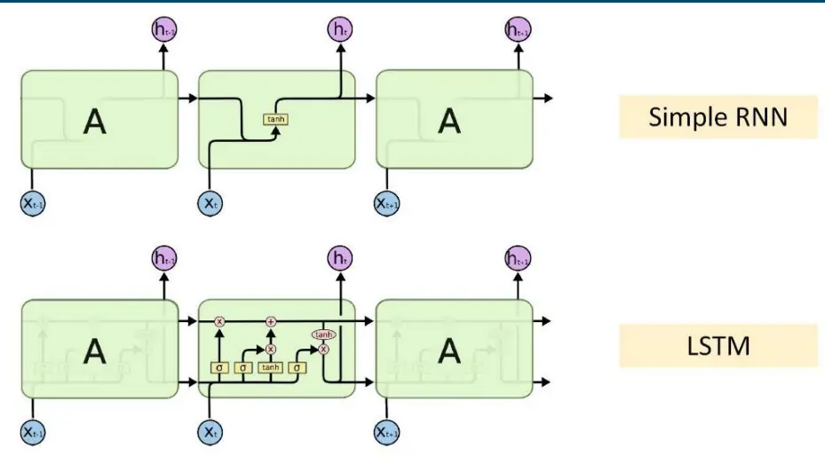
来源：Christopher Olah’s blog，国金证券研究所

模型其中主要包括结构有三部分，分别是遗忘门、输入门与输出门。遗忘门：将上一个状态的输出作为此状态的输入(h_{t-1})，经过 sigmoid 函数后产生一个介于 0-1 之间的数值，与上一时刻的状态(c_{t-1})相乘来决定保留多少信息。输入门则对应到选择记忆阶段，决定了要往当前状态中保存什么新信息。输入为上一状态的输出(h_{t-1})，将当前输入信息传入 sigmoid 函数后，产生一个介于 0-1 之间的数值（i_t）来确定保留多少新信息。最终输出门要决定从 cell state 中输出什么信息，首先将上一状态输出经过sigmoid 函数后，经过一个 tanh 激活函数或得到当前 LSTM block 的输出信息 h_t。

通过以上门控结构来对长短期的信息进行选择性记忆，满足了时间序列预测任务中对于长时间记忆的需求。

GRU 是 LSTM 的另一种变体，可以视为 LSTM 的一种简化版本。GRU 抛弃了 LSTM 中的隐藏层h,直接用状态层 c 代替，通过这种方式 GRU 选择暴露全部信息。另外由于信息传输变化带来的结构调整，将门控结构调整为更新门和重置门，网络复杂程度有所降低，较少的参数量也节省了训练时间。

- CNN&TCN:

另一种同样可以用于量化投资的神经网络是卷积神经网络（CNN），卷积网络本是一种广泛用于处理图像识别相关任务的网络结构，由 Yann LeCun 最早提出，能够学习大量的输入与输出之间的映射关系。由于 CNN 的特征检测层通过训练数据进行学习，避免了显式的特征抽取，隐式地从训练数据中进行学习。

图表2：CNN 网络结构示意
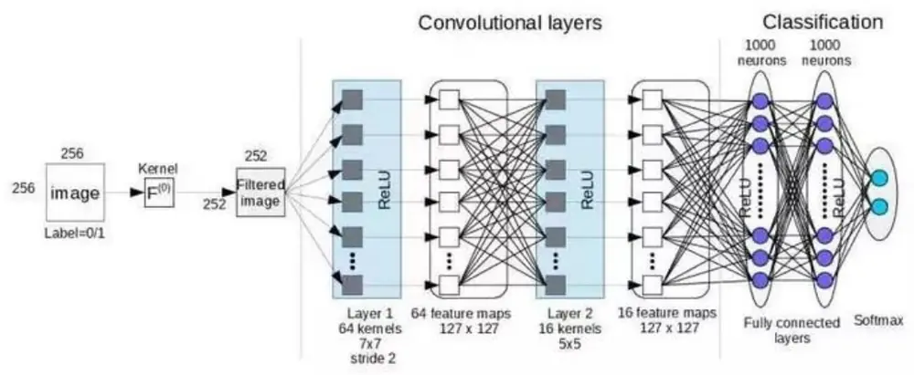
来源：互联网，国金证券研究所

此类模型原本不被用于时间序列任务中，但是 TCN（时域卷积网络）的提出展现出了卷积网络结构处理时间序列数据的可能性，该模型由具有相同输入和输出长度的扩展（dilated）/因果（causal）一维卷积层组成（Bai Shaojie, 2018）。

由于采用卷积操作，模型可以高效地并行化计算，适用于大规模的数据处理。此外，通过堆叠卷积层并增大卷积核的感受野，能够有效捕捉局部依赖关系。且该模型相比于 RNN 能够有稳定的进行梯度传播，不容易遇到梯度消失或梯度爆炸的问题。不过，由于卷积操作仅在局部感受野内工作，对于较长的序列建模和处理长期依赖关系可能不如 RNN 更好。

图表3：TCN 网络结构示意
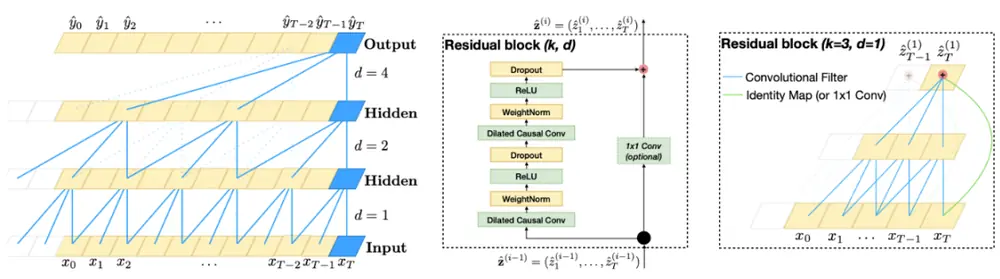
来源：An Empirical Evaluation of Generic Convolutional and Recurrent Networks for Sequence Modeling，国金证券研究所

TCN 通过因果约束的设计，限制了预测输出只能来自于相同时间点或更早时间点的输入，这一点对于量化研究而言至关重要，可以有效避免未来数据的泄露。此外，在残差连接（Residual Block）的帮助下，可以增加模型的层数从而能够使用较长的时间序列数据进行预测。空洞卷积（Dilated Convolutions）的引入在回顾历史数据时，从每 d 步处来获取输入，使卷积的感受野呈现指数级增长。

## Transformer：

ChatGPT 的大火让其底层模型架构 Transformer 再一次进入了大家的视野，该模型在自然语言处理任务中获得了较大成就。Transformer 通过引入自注意力机制允许模型在处理每个位置时，同时考虑输入序列中其他位置，从而能捕捉到更长距离的依赖关系，几个关键元素包括 Query，Key，Value。进一步地，Transformer 也应用多头注意力机制来提高模型的表达能力，可以使用多组不同的 Q,K,V 来进行计算。

在完整的网络架构中，Transformer 包括了编码器（Encoder）和解码器（Decoder）两部分。编码器部分主要作用是将输入数据编码为抽象表示，其结构为多头注意力机制+全连接神经网络。同时加入了残差连接避免梯度递减的问题。解码器的结构与编码器大体相似，不过采用了掩码多头自注意力，即在计算注意力得分时，只关注当前位置之前的信息，避免未来信息的泄漏。

## 二、模型数据准备及预处理

## 2.1 模型输入数据

在本篇报告中，我们主要采用三个来源的特征（因子）数据作为模型输入：

图表4：模型输入数据特征

| 数据类别 | 数据说明 | 特征（因子）数量 |
| --- | --- | --- |
| Alpha158 | 微软的机器学习量化投资框架Qlib中利用股票的 | 158（其中 42 个独立 |
|  | 高开低收等量价数据计算并标准化所得。 | 因子） |
| GJQuantFactors | 国金金工团队前期依据基本面和日频量价数据构建 | 113 |
|  | 得到的有效因子。 |  |
| Ta-Lib | 包括MACD， KDJ 等各类日频技术指标。 | 174 |

来源：Qlib，Ta-Lib，国金证券研究所

其中国金金工基本因子（以下简称 GJQuant）主要包括价值、质量、技术、动量、成长、一致预期六个大类，此处仅展示部分因子及其构建方式：

图表5：国金金工部分基本因子及构建方式说明

| 因子大类 | 细分因子 | 因子构建方式 |
| --- | --- | --- |
| 价值 | BP_LR | 市净率倒数 |
|  | DP_LTM | 过去一年现金分红/总市值 |
|  | EP_LYR | 市盈率倒数 |
|  | EP_FYO | 当期年报一致预期市盈率倒数 |
|  | … |  |
| 技术 | Amount_Mean_20D | 20交易日平均成交额 |
|  | Asset_Ln | 总资产对数 |
|  | ILLIQ_20D | 过去 20 交易日非流动性指标ILLIQ |
|  | Volatility_60D | 60交易日波动率 |
|  | … |  |
| 质量 | Asset_Chg1Y | 总资产同比变化 |
|  | CurrentAsset_Chg1Y | 流动资产同比变化 |
|  | GrossMargin_Chg1Y | 毛利率同比变化 |
|  | InventoryTurnover | 存货周转率 |
|  | … |  |
| 动量 | Price_Chg20D | 过去20交易日收益率 |
|  | Price_Chg120D | 过去120交易日收益率 |
| … | … |  |

来源：国金证券研究所

## 2.2 预测标签

对于一个量化投资策略，投资者往往关注不止一个指标评价其表现，如多头超额收益率、夏普比率、信息比率、超额最大回撤等。因此在进行机器学习模型训练时应如何选取合适的预测指标，不同的预测指标最终会怎样影响模型所形成策略的表现是一个值得探讨的话题。

传统的模型训练方式为仅对股票的未来一段时间超额收益率进行预测，但除此之外，我们可以将股票的波动性或最大回撤加入预测标签以选出未来一段时间波动率更低的股票。因此，在本篇报告中，我们考虑对于回归模型而言，月度调仓的模式下，构建的预测标签包括：

- 未来 20 日超额收益率：直接计算个股未来20交易日相对于市场基准的超额收益率。

未来 20 日信息比率：由于我们希望考察选出个股相对于市场的波动情况，此处使用个股未来 20 交易日超额收益率/未来 20 交易日超额收益的波动率计算得到。

$$
\mathrm{IR}=\frac{ExcRet_{20}}{\sigma_{ExcRet20}}
$$

- 未来 20 日 Calmar 比率：最大回撤作为衡量个股潜在下行风险的有效指标，我们通过计算个股未来 20 交易日超额收益率/未来 20 交易日超额收益的最大回撤得到。

$$
Calmar=\frac{ExcRet_{20}}{MaxDD_{ExcRet20}}
$$

## 2.3 数据预处理

本篇报告中，我们暂不考虑对模型进行滚动训练，直接将数据按照时间顺序划分为训练集、验证集和测试集：

图表6：数据集划分区间

| 数据集所属区间 | 数据集起止时间 |
| --- | --- |
| 训练集 | 2005.01.01-2012.12.31 |
| 验证集 | 2013.01.01-2014.12.31 |
| 测试集 | 2015.01.01-2023.09.30 |

来源：国金证券研究所

对于不同类别的模型而言，输入数据的预处理方式也有所不同。上述模型中基于决策树的Boost 类模型由于本身具有处理缺失数据的能力，我们就不再对缺失特征数据进行额外处理。因此我们首先仅对预测目标为空值的数据进行舍弃，再对所有特征进行去极值处理，防止模型受到异常值的影响。最终对每个输入特征和输出标签进行横截面 Z-Score 标准化。

而对于神经网络模型而言，由于其对于数据的缺失值无法直接处理。我们在对所有特征进行 Z-Score 处理后，对样本特征进行空值填充，最终去除空值标签，再进一步根据模型需要，选取合适的时间回溯窗口（step_len）将数据处理为 3 维。

## 2.4 超参数调优与敏感性测试

经过实际超参数调优我们发现，上述模型中 GBDT 类的超参数对于最终预测结果相对不敏感，而神经网络类模型由于超参数较多，且不同超参数组合会对模型复杂度产生较大影响。我们此处以 GRU 模型为例，观察各类超参数的重要程度：

图表7：GRU模型各主要超参数重要性
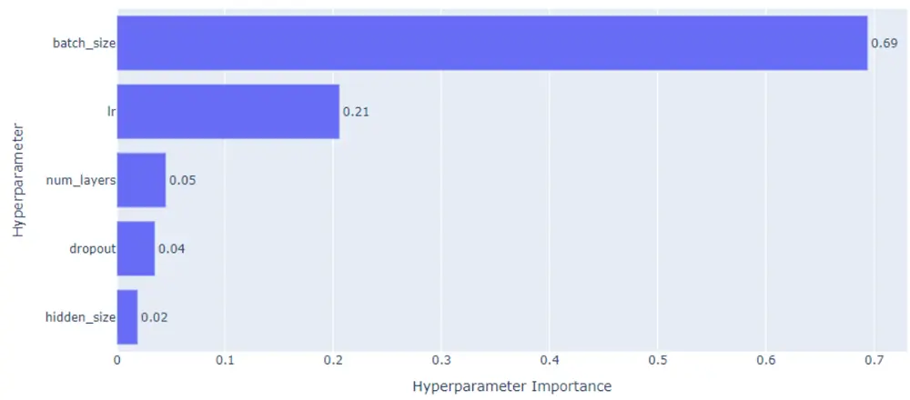
来源：国金证券研究所

可以发现，Batch Size 对于模型效果尤为重要，较大的 Batch Size 能更准确地确定梯度下降的方向，保证模型更快收敛。而过大的 Batch Size 又有可能导致不同 Batch 的梯度方向没有任何变化，容易陷入局部极小值。学习率 Learning Rate 重要性其次，若该值过小，可能会导致收敛过慢，而过大又有可能使损失震荡甚至变大，近年来又有新的学习率调整机制（Schduler）能够灵活控制收敛速度达到更有效果。而网络层数、随机丢弃率和神经元数量重要性相对较低，在实际训练时可以根据数据集和预测任务的实际情况灵活掌握。

## 三、各类模型在 A 股各宽基指数的表现

## 3.1 各模型在沪深 300 成分股的测试

本篇报告中我们根据不同种类的输入特征、不同预测标签和不同模型三个维度分别进行测试。值得注意的是，神经网络类模型有更多的超参数设置，不同的超参数可能会对模型最终效果产生较大差异。我们此处对四种神经网络模型都在一定程度上进行了超参数调优，但难以保证找到对于特定数据集的全局最优，因此模型表现仍有一定提升空间。此外，由于神经网络类模型在处理特征数量过多时对于算力消耗较大，选取部分重要特征投喂给模型同样能有较好表现。因此我们首先对比了四类 GBDT 模型在样本内的预测效果，发现在验证集上，LightGBM 的损失函数最低。

图表8：GBDT类模型在验证集上的MSE损失（沪深300成分股）

|  | CatBoost | DEnsemble | LightGBM | XGBoost |
| --- | --- | --- | --- | --- |
| Loss | 0.9826 | 0.9793 | 0.9791 | 0.9858 |

来源：Wind，国金证券研究所

因此我们将通过 LightGBM 得到的前 60 个重要特征喂入神经网络模型，以下为各类模型在沪深 300 股票池上的样本外预测信号 IC 均值：

图表9：基于不同输入特征的各类模型在沪深300成分股的IC均值
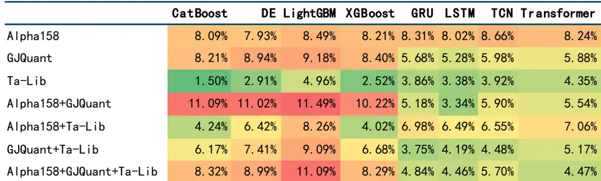
来源：Wind，国金证券研究所

可以看到，对于 GBDT 类模型而言，Alpha158 纯量价因子和 GJQuant 基本面及量价因子在经过模型训练后均能有出色表现，两者结合可以进一步增强预测效果，四个模型IC 均值均在 10%以上。不过在神经网络类模型中，GJQuant 的加入反而会降低模型的预测效果，单用 Alpha158 表现最佳。而 Ta-Lib 因子表现较差，将其他特征附加 Ta-Lib 因子后反而会降低 IC 均值。

分模型来看，LightGBM 表现亮眼，在任一种特征输入的情况下均取得了最优成绩，即便是在相对表现较差的 Ta-Lib 因子上，模型的 IC 均值依然能达到其余模型将近两倍的水平。而基于 LightGBM 训练增强的 Double Ensemble 在花费了数倍训练时间后反而并未达到提升的效果，各个特征输入下均有所下降，性价比较低。

神经网络类模型中，TCN 和 Transformer 表现相对更好，在多种不同特征输入下优于两个RNN 模型。而针对 LSTM 进行简化的 GRU 模型，虽然只有两个门控结构，相比 LSTM 更加简单，但在任何一种特征输入下都展现出了更好的预测效果。

图表10：基于不同预测标签的各类模型在沪深300成分股的各项指标

| CatBoost DEnsemble LightGBM XGBoost |  |  |  |  |  | GRU | LSTM |  | TCN Transformer |
| --- | --- | --- | --- | --- | --- | --- | --- | --- | --- |
| IC 均值 | Calmar | 8.33% | 9.74% | 10.30% | 8.71% | 8.44% | 8.18% | 8.62% | 9.46% |
|  | ExcRet | 11.09% | 11.02% | 11.49% | 10.22% | 8.31% | 8.02% | 8.66% | 8.24% |
|  | IR | 11.58% | 10.53% | 11.41% | 11.20% | 7.53% | 7.30% | 7.70% | 8.04% |
| 多头年化超 额收益率 | Calmar | 3.78% | 6.16% | 7.22% | 4.03% | 6.35% | 5.52% | 9.81% | 10.53% |
|  | ExcRet | 11.38% | 10.93% | 11.80% | 8.04% | 7.30% | 9.15% | 10.42% | 10.40% |
|  | IR | 10.53% | 11.04% | 12.53% | 10.16% | 9.89% | 11.23% | 13.56% | 9.65% |
| 多头信息比 率 | Calmar | 0.31 | 0.47 | 0.58 | 0.33 | 0.80 | 0.63 | 1.14 | 1.24 |
|  | ExcRet | 0.92 | 0.97 | 1.02 | 0.71 | 0.84 | 1.10 | 1.19 | 1.08 |
|  | IR | 0.84 | 1.02 | 1.11 | 0.89 | 1.15 | 1.34 | 1.44 | 0.99 |
| 多头超额最 | Calmar | 35.95% | 26.26% | 26.97% | 28.10% | 10.52% | 13.63% | 10.62% | 9.64% |
| 大回撤 | ExcRet | 28.93% | 24.58% | 26.96% | 23.77% | 14.42% | 11.89% | 9.71% | 8.78% |
|  | IR | 27.13% | 20.50% | 23.94% | 24.85% | 13.71% | 11.23% | 9.36% | 11.38% |

来源：Wind，国金证券研究所

接下来我们分别对比不同预测标签给投资分位数组合各个关键指标的影响，仅考虑使用Alpha158+GJQuant 因子组合作为特征输入的模型。发现以 Calmar 作为预测标签的模型所给出预测信号在每一项指标中均表现最差，以超额收益率和信息比率作为标签在 IC 均值上几乎不分伯仲，但信息比率标签模型在多头年化超额收益率、多头信息比率和多头超额收最大回撤上明显占优。

分模型来看，虽然神经网络模型在 IC 均值上明显不如 GBDT，但其信息比率和超额最大回撤整体要优于 GBDT，有效降低了投资组合的下行风险。

进一步地，为了能够充分利用不同标签从而起到增强投资组合的效果，我们首先观察了同一模型各标签的相关性（限于篇幅，此处仅展示各两个模型的相关系数，另外模型情况近似）：

图表11：不同预测标签模型相关系数（GBDT部分）

|  | Catboost- Calmar | Catboost- Excret | Catboost-IR | DE-Calmar | DE-Excret | DE-IR |
| --- | --- | --- | --- | --- | --- | --- |
| Catboost- | 1.0000 |  |  |  |  |  |
| Calmar Catboost- |  |  |  |  |  |  |
| Excret | 0.7398 | 1.0000 |  |  |  |  |
| Catboost-IR | 0.7880 | 0.8411 | 1.0000 |  |  |  |
| DE-Calmar | 0.8636 | 0.7568 | 0.8045 | 1.0000 |  |  |
| DE-Excret | 0.7328 | 0.8477 | 0.8187 | 0.8129 | 1.0000 |  |
| DE-IR | 0.7353 | 0.7324 | 0.8405 | 0.7961 | 0.7839 | 1.0000 |

来源：Wind，国金证券研究所

图表12：不同预测标签模型相关系数（NN部分）

|  | GRU-Calmar | GRU-Excret |  | GRU-IR LSTM-Calmar LSTM-Excret |  | LSTM-IR |
| --- | --- | --- | --- | --- | --- | --- |
| GRU-CaImar | 1.0000 |  |  |  |  |  |
| GRU-Excret | 0.8539 | 1.0000 |  |  |  |  |
| GRU-IR | 0.8794 | 0.8270 | 1.0000 |  |  |  |
| LSTM-Calmar | 0.9408 | 0.8331 | 0.8525 | 1.0000 |  |  |
| LSTM-Excret | 0.8501 | 0.9098 | 0.8392 | 0.8422 | 1.0000 |  |
| LSTM-IR | 0.8471 | 0.7684 | 0.9352 | 0.8417 | 0.8150 | 1.0000 |

来源：Wind，国金证券研究所

可以发现，无论是模型间和同一模型的不同标签之间，相关系数基本都在 0.8 左右。且不同模型的同一标签反而要比同一模型的不同标签相关性要更高，可见尝试不同标签对于生成多样性因子的重要性。此处，我们首先对同一模型不同标签的因子值进行等权合成（仅使用 Excret 和 IR 两类标签），发现合成后因子各指标均得到一定提升。GBDT 类模型多头年化超额收益率从原本单标签的 8.04%-12.53%上升至 10.73%-13.37%的水平，多头信息比率和多头超额最大回撤呈现明显改善。

图表13：Excret与IR标签所训练模型等权合成后各模型在沪深300成分股的各项指标

|  |  | CatBoost DEnsemble LightGBM |  | XGBoost | GRU | LSTM |  | TCN Transformer |
| --- | --- | --- | --- | --- | --- | --- | --- | --- |
| IC 均值 | 11.81% | 11.37% | 12.00% | 11.47% | 8.17% | 7.93% | 8.45% | 8.35% |
| 多头年化超额收益 | 11.96% | 11.65% | 13.37% | 10.73% | 9.54% | 10.79% | 12.80% | 12.56% |
| 多头信息比率 | 0.95 | 0.98 | 1.14 | 0.94 | 1.09 | 1.27 | 1.43 | 1.32 |
| 多头超额最大回撤 | 28.72% | 28.08% | 27.22% | 23.42% | 8.23% | 11.21% | 9.59% | 8.69% |

来源：Wind，国金证券研究所

可以说明，仅对模型的预测标签进行简单变形并将训练好的模型进行合成，即便模型间相关系数水平较高，但合成后仍然可以在一定程度上增强投资组合的收益和稳定性。NN 类模型虽然超额收益水平相较于 GBDT 类不占优势，不过其信息比率和回撤控制较好。

最终我们分别将 GBDT 和 NN 的四类模型因子值进一步做等权合成，得到两类模型的最终因子表现如下：

图表14：GBDT+NN两类模型在沪深 300 成分股的多空组合指标

| 多头年化超 |  |  |  | 多头 信息 | 多头超 额最大 回撤 | 多空年化多空标准 收益率 |  | 多空夏多空最 差普比率大回撤 |
| --- | --- | --- | --- | --- | --- | --- | --- | --- |
|  | IC均值 | 额收益率 普比率 | 比率 |  |  |  |  |  |
| GBDT | 9.86% | 13.28% | 0.69 | 1.56 | 14.65% | 32.10% | 14.79% | 2.17 19.99% |
| GBDT_AdjCI | 9.87% | 12.75% | 0.67 | 1.50 | 15.00% | 31.56% | 14.88% | 2.12 20.54% |
| NN | 7.54% | 10.95% | 0.55 | 1.48 | 9.83% | 24.85% | 11.35% | 2.1910.05% |
| NN_AdjCl | 7.54% | 10.89% | 0.55 | 1.48 | 10.07% | 24.56% | 11.47% | 2.14 11.02% |
| GBDT+NN | 10.40% | 14.44% | 0.73 | 1.83 | 5.54% | 35.16% | 13.40% | 2.6210.20% |
| GBDT+NN Ad jCI | 10.40% | 14.70% | 0.74 | 1.86 | 6.28% | 35.41% | 13.35% | 2.6510.04% |

来源：Wind，国金证券研究所

图表15：GBDT+NN 因子在沪深300成分股的多空组合净值
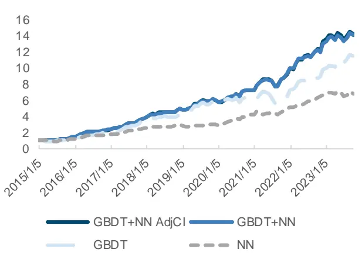
来源：Wind，国金证券研究所

图表16：GBDT+NN 因子在沪深 300成分股的分位数组合年化超额收益
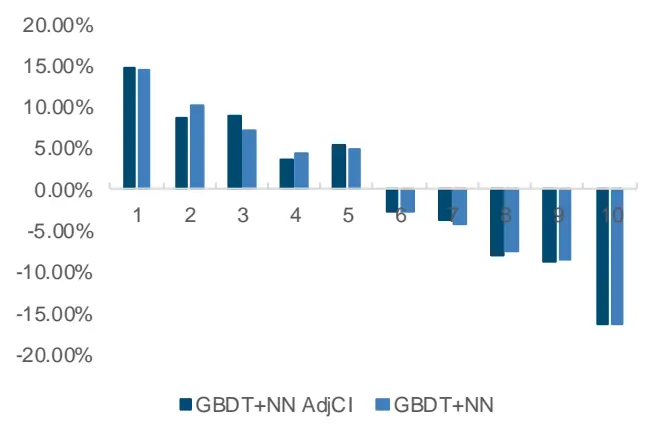
来源：Wind，国金证券研究所

## 3.2 各模型在中证 500 成分股的测试

根据同样的输入特征和训练方法，经过测试发现，在各种不同的输入特征组合下，模型的IC 表现与沪深 300 上差异不大，整体也出现了对于 GBDT 模型 Alpha158 和 GJQuant 表现较好、对于 NN 模型 Alpha158 较好的情况，此处我们仍以同样的特征组合对比各模型在不同预测标签的表现：

图表17：基于不同预测标签的各类模型在中证500成分股的各项指标
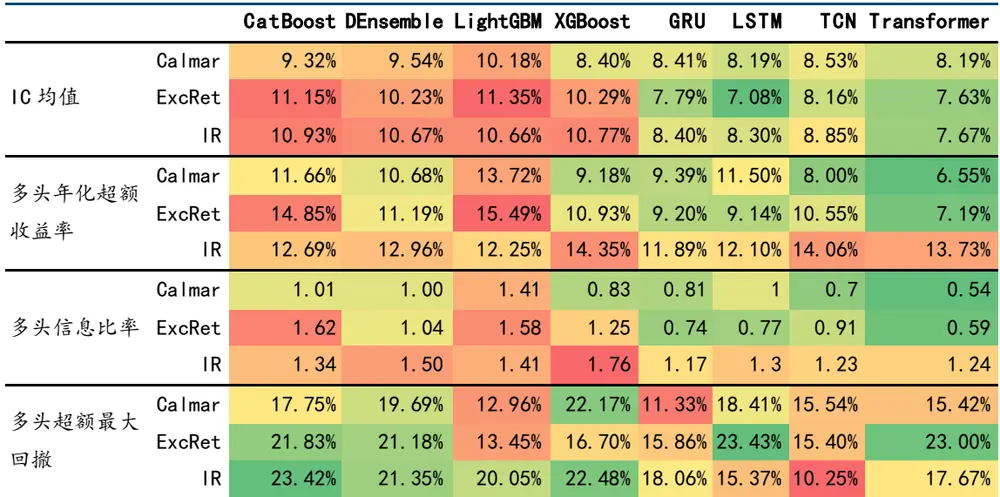
来源：Wind，国金证券研究所

可以发现，中证 500 成分股相较于沪深 300 明显更易有更高的超额收益水平，各项指标均比沪深 300 有一定的改善。不过以 Calmar 作为标签相较于另外两类仍然相对较差，因此同样仅使用 Excret 和 IR 两类标签所训练模型进行等权合成。

图表18：Excret与IR标签所训练模型等权合成后各模型在中证500成分股的各项指标

|  | CatBoost DEnsemble LightGBM |  |  | XGBoost | GRU | LSTM |  | TCN Transformer |
| --- | --- | --- | --- | --- | --- | --- | --- | --- |
| IC 均值 | 11.36% | 11.02% | 11.42% | 11.08% | 8.41% | 8.03% | 8.67% | 7.81% |
| 多头年化超额收益 | 14.87% | 15.34% | 14.00% | 13.12% | 11.50% | 11.00% | 11.79% | 12.45% |
| 多头信息比率 | 1.44 | 1.60 | 1.41 | 1.44 | 0.99 | 1.07 | 1.04 | 1.03 |
| 多头超额最大回撤 | 20.84% | 17.69% | 20.69% | 20.84% | 19.66% | 18.93% | 9.94% | 16.57% |

来源：Wind，国金证券研究所

最终我们将各自的四类模型因子值进一步做等权合成，得到两类模型的最终因子表现如下：

图表19：GBDT+NN两类模型在中证500成分股的多空组合指标

|  | IC 均值 | 多头年化超 额收益率 | 多头夏 普比率 | 多头信 息比率 | 多头超额 最大回撤 | 多空年化多空标 收益率 | 准差 | 多空夏 | 多空最 |
| --- | --- | --- | --- | --- | --- | --- | --- | --- | --- |
| GBDT | 10.27% | 12.34% | 0.60 | 1.74 | 11.83% | 39.26% | 12.41% | 普比率 3.16 | 大回撤 7.87% |
| GBDT_AdjCI | 10.25% | 12.36% | 0.60 | 1.75 | 11.60% | 38.92% | 12.31% | 3.16 | 8.37% |
| NN | 7.73% | 11.64% | 0.54 | 1.08 | 17.26% | 32.88% | 15.22% | 2.16 | 11.63% |
| NN_AdjCI | 7.72% | 11.50% | 0.54 | 1.07 | 17.53% | 32.87% | 15.24% | 2.16 | 12.69% |
| GBDT+NN | 10.34% | 16.55% | 0.72 | 1.76 | 12.84% | 45.71% 14.82% |  | 3.09 | 7.25% |
| GBDT+NN Ad jCI | 10.32% | 16.49% | 0.72 | 1.76 | 12.48% | 45.44%14.76% |  | 3.08 | 6.57% |

来源：Wind，国金证券研究所

图表20：GBDT+NN 因子在中证 500成分股的多空组合净值
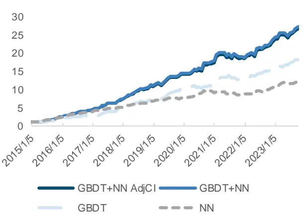
来源：Wind，国金证券研究所

图表21：GBDT+NN因子在中证 500成分股的分位数组合年化超额收益
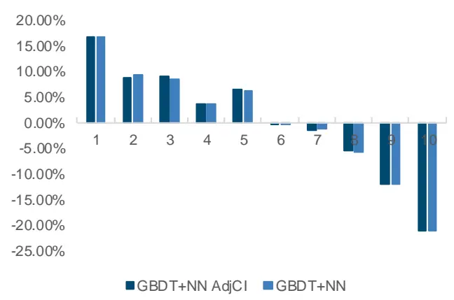
来源：Wind，国金证券研究所

## 3.3 各模型在中证 1000 成分股的测试

在中证 1000 成分股上，各不同标签对应模型的相对效果差异不大，此处不再赘述。我们以同样方式对两类标签模型预测信号进行合成。

图表22：Excret与IR标签所训练模型等权合成后各模型在中证1000成分股的各项指标

| CatBoost DEnsemble LightGBM |  |  |  | XGBoost | GRU | LSTM |  | TCN Transformer |
| --- | --- | --- | --- | --- | --- | --- | --- | --- |
| IC 均值 | 15.43% | 14.35% | 14.96% | 14.80% | 12.12% | 12.43% | 12.60% | 11.93% |
| 多头年化超额收益 | 25.80% | 25.28% | 26.85% | 25.15% | 21.92% | 21.86% | 23.38% | 19.35% |
| 多头信息比率 | 2.91 | 2.65 | 2.89 | 2.88 | 1.96 | 2.02 | 1.77 | 1.64 |
| 多头超额最大回撤 | 4.62% | 6.30% | 4.69% | 3.88% | 7.17% | 7.89% | 7.34% | 9.87% |

来源：Wind，国金证券研究所

可以看出，模型在中证 1000 各项指标表现十分优异，相较于中证 500 改进幅度明显。两类模型合成后多头年化超额收益率达到了 27.71%，多头超额最大回撤在 4.74%。

图表23：GBDT+NN两类模型在中证 1000 成分股的多空组合指标

|  | IC 均值超额收益 | 多头年化 | 多头夏 多头信多头超额多空年化 |  |  |  |  |  |  |  |
| --- | --- | --- | --- | --- | --- | --- | --- | --- | --- | --- |
|  |  |  | 率 | 普比率 | 息比率最大回撤 |  | 收益率 | 多空标 准差 | 多空夏 普比率 | 多空最 大回撤 |
| GBDT | 13.94% | 25.08% | 0.87 | 3.11 | 2.81% | 72.76% | 12.42% | 5.86 |  | 3.04% |
| GBDT_AdjCI | 13.92% | 25.06% | 0.87 | 3.10 | 2.61% | 72.65% |  | 12.69% | 5.72 | 3.04% |
| NN | 11.84% | 20.13% | 0.80 | 1.89 | 7.72% |  | 59.17% | 17.95% | 3.30 | 4.76% |
| NN_AdjCl | 11.84% | 20.18% | 0.81 | 1.90 | 7.72% | 59.38% |  | 17.95% | 3.31 | 4.74% |
| GBDT+NN | 14.62% | 27.71% | 0.97 | 2.86 | 4.74% | 80.20% |  | 15.91% | 5.04 | 2.62% |
| GBDT+NN Ad jCI | 14.61% | 27.92% | 0.97 | 2.89 | 4.74% |  | 80.30% | 15.86% | 5.06 | 3.10% |

来源：Wind，国金证券研究所

图表24：GBDT+NN 因子在中证1000成分股的多空组合净值
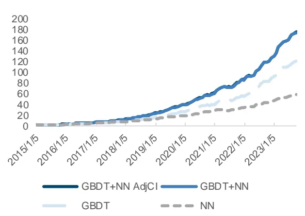
来源：Wind，国金证券研究所

图表25：GBDT+NN 因子在中证 1000成分股的分位数组合年化超额收益
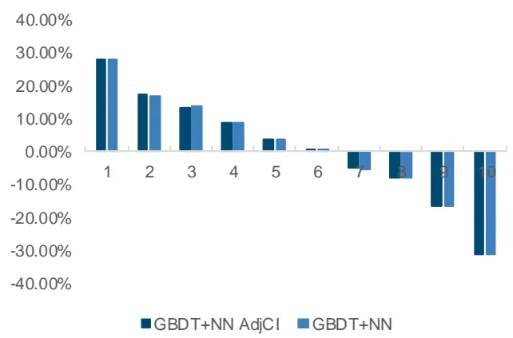
来源：Wind，国金证券研究所

值得一提的是，GBDT 和 NN 两类模型由于结构存在较大差异，模型的相关系数较低。在各类成分股上相关系数基本在 0.4-0.5 之间。因此，对于因子多样性和独立性有较高要求的量化投资领域而言，寻找更多模型结构独特、相关性低的模型也是未来不断提升最终组合效果的一个重要方向。

图表26：GBDT与NN两类模型因子在各宽基指数上的相关系数

|  | 沪深300 | 中证 500 | 中证 1000 |
| --- | --- | --- | --- |
| 相关系数 | 0.4079 | 0.4583 | 0.5162 |

来源：Wind，国金证券研究所

## 四、基于 GBDT+NN 的指数增强策略

由上文可以看出，机器学习模型所输出预测信号相较于传统线性的因子加权方式有明显提升，各类模型能充分挖掘到因子间与因子和预测目标之间的非线性关系，从而充分利用到有效因子给最终策略带来的收益。

为进一步贴近投资实际，我们此处构建了基于上述机器学习模型的指数增强策略。通过马科维茨的均值方差优化模型，对投资组合的跟踪误差进行限制，最大化预期超额收益率。

$$
Maxw^{T}f
$$

$$
s.t.\quad\sqrt{(w-w_{bench})\Sigma(w-w_{bench})^{\prime}}\leq target\_TE
$$

其中，f 为模型的预测信号， $w_{bench}$ 为基准权重向量，tartget_TE 为目标跟踪误差。

在本篇报告中，我们将年化跟踪误差控制为最大不能超过 5%。使用优化器对投资组合权重进行优化，回测期为 2015 年 2 月 1 日至 2023 年 9月 30 日，以每月第一个交易日的收盘价进行月频调仓，假定手续费率为单边千二，在各宽基指数上的测试结果如下。

图表27：基于 GBDT+NN 的沪深300 指数增强策略指标

|  | GBDT | NN | GBDT+NN |
| --- | --- | --- | --- |
| 年化收益率 | 14.06% | 15.56% | 17.45% |
| 年化波动率 | 21.03% | 21.64% | 21.54% |
| Sharpe 比率 | 0.67 | 0.72 | 0.81 |
| 最大回撤率 | 35.48% | 38.93% | 36.68% |
| 平均换手率（双边） | 82.89% | 103.57% | 95.66% |
| 年化超额收益率 | 12.45% | 14.08% | 15.85% |
| 跟踪误差 | 4.11% | 4.14% | 3.94% |
| 信息比率 | 3.03 | 3.40 | 4.02 |
| 超额最大回撤 | 6.80% | 3.13% | 3.12% |

来源：Wind，国金证券研究所

图表28：基于GBDT+NN的沪深300 指数增强策略净值曲线
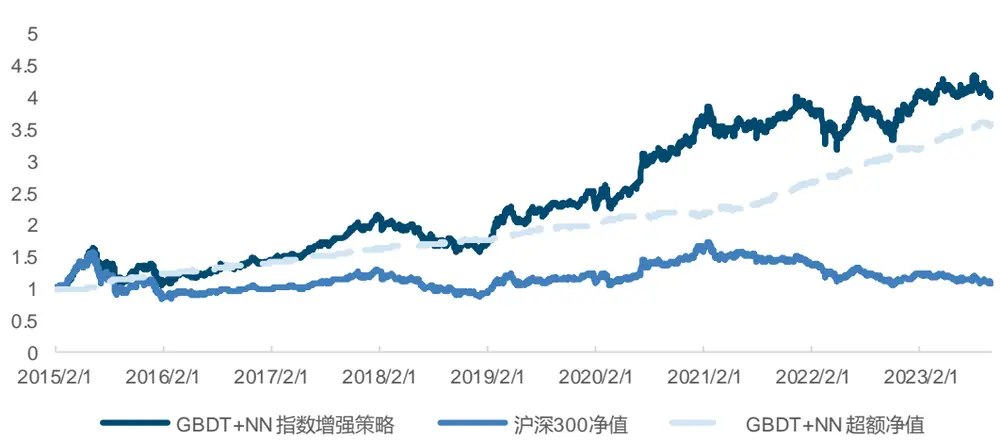
来源：Wind，国金证券研究所

可以发现，经过组合优化的控制后，策略表现进一步提升，以沪深 300 作为基准，年化超额收益率达到 15.85%，超额最大回撤仅为 3.12%。分年度来看，策略仅在 2020 年超额收益未达到 10%，其余年份均有较高的超额收益水平。

图表29：基于 GBDT+NN的沪深300 指数增强策略分年度收益
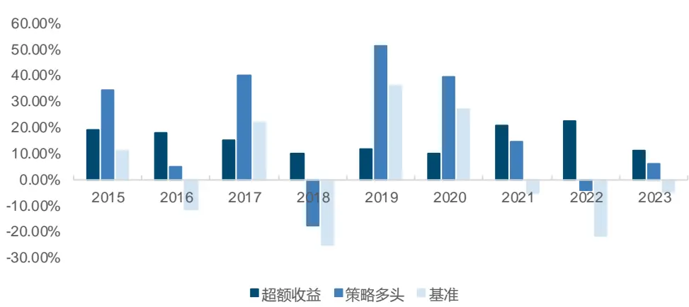
来源：Wind，国金证券研究所

图表30：基于 GBDT+NN的沪深300 指数增强策略分年度收益

|  | 超额收益 | 策略多头 | 基准 |
| --- | --- | --- | --- |
| 2015 | 19.18% | 34.17% | 11.24% |
| 2016 | 17.81% | 5.12% | -11.28% |
| 2017 | 15.17% | 39.89% | 21.78% |
| 2018 | 10.13% | -17.47% | -25.31% |
| 2019 | 11.61% | 51.53% | 36.07% |
| 2020 | 9.76% | 39.72% | 27.21% |
| 2021 | 20.48% | 14.59% | -5.20% |
| 2022 | 22.22% | -4.03% | -21.63% |
| 2023（截至9月30日） | 11.27% | 6.21% | -4.70% |

来源：Wind，国金证券研究所

同样地，我们在中证 500 指数成分股进行指数增强策略的构建，策略的年化超额收益率达到 20.74%，超额最大回撤为 6.36%。

图表31：基于 GBDT+NN的中证500 指数增强策略指标

|  | GBDT | NN | GBDT+NN |
| --- | --- | --- | --- |
| 年化收益率 | 21.28% | 17.08% | 21.29% |
| 年化波动率 | 24.19% | 24.65% | 24.36% |
| Sharpe 比率 | 0.88 | 0.69 | 0.87 |
| 最大回撤率 | 39.72% | 43.03% | 40.32% |
| 平均换手率（双边） | 108.53% | 133.50% | 124.03% |
| 年化超额收益率 | 20.66% | 16.64% | 20.74% |
| 跟踪误差 | 4.98% | 4.96% | 5.09% |
| 信息比率 | 4.15 | 3.35 | 4.08 |
| 超额最大回撤 | 5.45% | 5.84% | 6.36% |

来源：Wind，国金证券研究所

图表32：基于GBDT+NN的中证500指数增强策略净值曲线
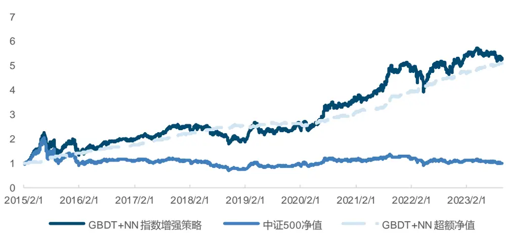
来源：Wind，国金证券研究所

分年度来看，中证 500 指数增强策略稳定性略差于沪深 300，超额收益率在 2019 年为4.35%，其余年份超额收益均在 10%以上。

图表33：基于GBDT+NN的中证500指数增强策略分年度收益
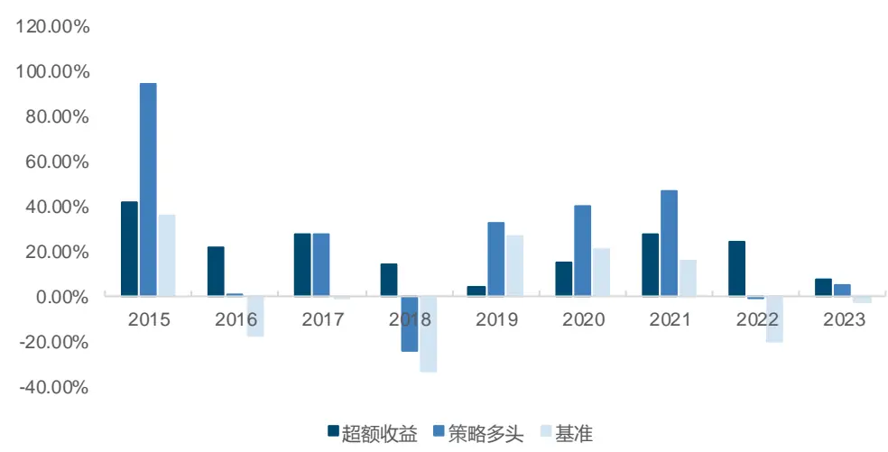
来源：Wind，国金证券研究所

图表34：基于 GBDT+NN的中证500 指数增强策略分年度收益

|  | 超额收益 | 策略多头 | 基准 |
| --- | --- | --- | --- |
| 2015 | 41.50% | 94.10% | 35.80% |
| 2016 | 21.98% | 0.30% | -17.78% |
| 2017 | 27.82% | 27.74% | -0.20% |
| 2018 | 14.08% | -23.92% | -33.32% |
| 2019 | 4.35% | 32.30% | 26.38% |
| 2020 | 15.17% | 40.11% | 20.87% |
| 2021 | 27.04% | 46.39% | 15.58% |
| 2022 | 23.71% | -0.91% | -20.31% |
| 2023（截至9月30日） | 7.60% | 4.59% | -2.96% |

来源：Wind，国金证券研究所

最后，使用同样的方式我们构建了机器学习中证 1000 指数增强策略，策略的年化超额收益率达到 32.82%，超额最大回撤为 3.97%。

图表35：基于 GBDT+NN 的中证 1000 指数增强策略指标

|  | GBDT | NN | GBDT+NN |
| --- | --- | --- | --- |
| 年化收益率 | 31.51% | 26.71% | 32.52% |
| 年化波动率 | 26.58% | 27.48% | 26.57% |
| Sharpe 比率 | 1.19 | 0.97 | 1.22 |
| 最大回撤率 | 42.14% | 45.85% | 41.87% |
| 平均换手率（双边） | 129.57% | 151.69% | 141.72% |
| 年化超额收益率 | 32.01% | 27.68% | 32.82% |
| 跟踪误差 | 5.99% | 5.68% | 5.92% |
| 信息比率 | 5.35 | 4.88 | 5.55 |
| 超额最大回撤 | 4.39% | 4.98% | 3.97% |

来源：Wind，国金证券研究所

图表36：基于GBDT+NN的中证 1000 指数增强策略净值曲线
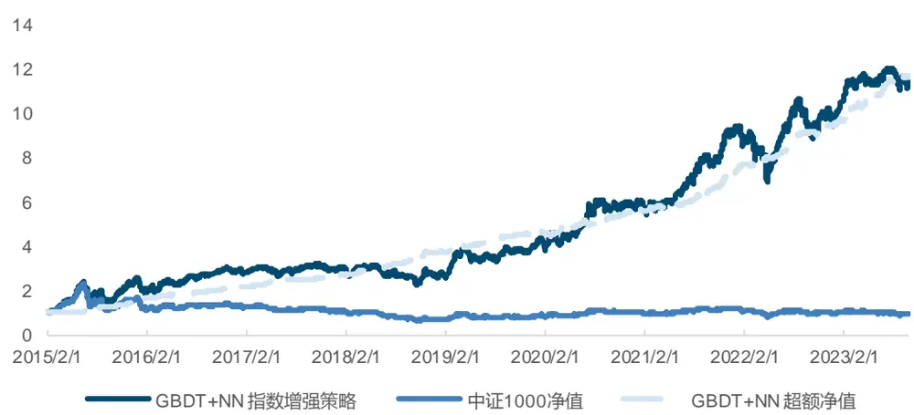
来源：Wind，国金证券研究所

分年度来看，策略在中证 1000 上表现最为稳定，仅在 2020 年超额收益低于 20%，其余年份均有亮眼表现。

图表37：基于 GBDT+NN的中证 1000 指数增强策略分年度收益
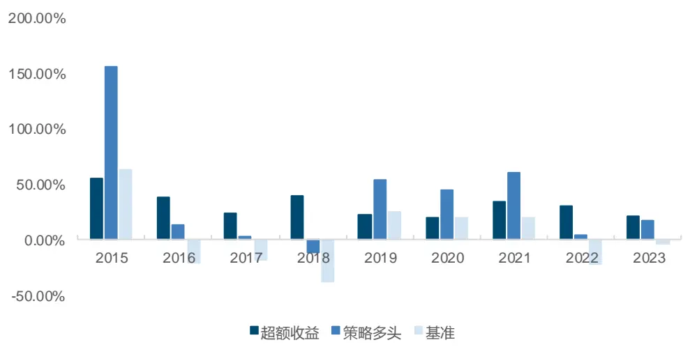
来源：Wind，国金证券研究所

图表38：基于 GBDT+NN的中证1000 指数增强策略分年度收益

|  | 超额收益 | 策略多头 | 基准 |
| --- | --- | --- | --- |
| 2015 | 55.66% | 155.52% | 62.40% |
| 2016 | 38.35% | 13.07% | -20.01% |
| 2017 | 24.41% | 3.14% | -17.35% |
| 2018 | 39.39% | -11.48% | -36.87% |
| 2019 | 22.37% | 53.27% | 25.67% |
| 2020 | 19.94% | 44.58% | 19.39% |
| 2021 | 34.05% | 60.74% | 20.52% |
| 2022 | 30.93% | 3.69% | -21.58% |
| 2023（截至9月30日） | 21.44% | 17.61% | -3.23% |

来源：Wind，国金证券研究所

## 总结

国内量化投资随着近些年的发展，经历了从因子挖掘、线性合成到最终利用各类人工智能算法模型不断优化、提升的过程。赛道的拥挤必然也会导致量化投资研究从“因子动物园”到“模型动物园”的激烈竞争中，本文将目前量化投资领域常见的机器学习模型进行训练测试和比较，发现相较于传统的线性加权方式，利用机器学习模型进行因子权重分配和处理在A股各宽基指数上均有较好的表现，其中GBDT类模型表现出了更高的超额收益水平，而神经网络类模型的预测信号有着明显更低的最大回撤，且两类模型由于结构差异较大，相关性较低。将两类模型简单等权合成后，策略的收益和稳定性都非常优异。

当然，机器学习模型也绝不是万能的，任何模型都会存在特定市场环境下失效的可能。不断探索挖掘新的算法、新的有效特征、新的模型使用方法都将是量化投资研究未来不可或缺的重要环节。在后续的研究报告中，我们将在机器学习领域深入挖掘，对模型使用过程的具体细节问题、模型的各类应用场景进行探索，力争持续推出可供投资的各类量化策略。

## 风险提示

1、以上结果通过历史数据统计、建模和测算完成，在政策、市场环境发生变化时模型存在时效的风险。

2、策略通过一定的假设通过历史数据回测得到，当交易成本提高或其他条件改变时，可能导致策略收益下降甚至出现亏损。

## 特别声明：

国金证券股份有限公司经中国证券监督管理委员会批准，已具备证券投资咨询业务资格。

形式的复制、转发、转载、引用、修改、仿制、刊发，或以任何侵犯本公司版权的其他方式使用。经过书面授权的引用、刊发，需注明出处为“国金证券股份有限公司”，且不得对本报告进行任何有悖原意的删节和修改。

本报告的产生基于国金证券及其研究人员认为可信的公开资料或实地调研资料，但国金证券及其研究人员对这些信息的准确性和完整性不作任何保证。本报告反映撰写研究人员的不同设想、见解及分析方法，故本报告所载观点可能与其他类似研究报告的观点及市场实际情况不一致，国金证券不对使用本报告所包含的材料产生的任何直接或间接损失或与此有关的其他任何损失承担任何责任。且本报告中的资料、意见、预测均反映报告初次公开发布时的判断，在不作事先通知的情况下，可能会随时调整，亦可因使用不同假设和标准、采用不同观点和分析方法而与国金证券其它业务部门、单位或附属机构在制作类似的其他材料时所给出的意见不同或者相反。

本报告仅为参考之用，在任何地区均不应被视为买卖任何证券、金融工具的要约或要约邀请。本报告提及的任何证券或金融工具均可能含有重大的风险，可能不易变卖以及不适合所有投资者。本报告所提及的证券或金融工具的价格、价值及收益可能会受汇率影响而波动。过往的业绩并不能代表未来的表现。

客户应当考虑到国金证券存在可能影响本报告客观性的利益冲突，而不应视本报告为作出投资决策的唯一因素。证券研究报告是用于服务具备专业知识的投资者和投资顾问的专业产品，使用时必须经专业人士进行解读。国金证券建议获取报告人员应考虑本报告的任何意见或建议是否符合其特定状况，以及（若有必要）咨询独立投资顾问。报告本身、报告中的信息或所表达意见也不构成投资、法律、会计或税务的最终操作建议，国金证券不就报告中的内容对最终操作建议做出任何担保，在任何时候均不构成对任何人的个人推荐。

在法律允许的情况下，国金证券的关联机构可能会持有报告中涉及的公司所发行的证券并进行交易，并可能为这些公司正在提供或争取提供多种金融服务。

本报告并非意图发送、发布给在当地法律或监管规则下不允许向其发送、发布该研究报告的人员。国金证券并不因收件人收到本报告而视其为国金证券的客户。本报告对于收件人而言属高度机密，只有符合条件的收件人才能使用。根据《证券期货投资者适当性管理办法》，本报告仅供国金证券股份有限公司客户中风险评级高于 C3 级(含 C3 级）的投资者使用；本报告所包含的观点及建议并未考虑个别客户的特殊状况、目标或需要，不应被视为对特定客户关于特定证券或金融工具的建议或策略。对于本报告中提及的任何证券或金融工具，本报告的收件人须保持自身的独立判断。使用国金证券研究报告进行投资，遭受任何损失，国金证券不承担相关法律责任。

若国金证券以外的任何机构或个人发送本报告，则由该机构或个人为此发送行为承担全部责任。本报告不构成国金证券向发送本报告机构或个人的收件人提供投资建议，国金证券不为此承担任何责任。

此报告仅限于中国境内使用。国金证券版权所有，保留一切权利。

上海

电话：021-80234211

北京

电话：010-85950438

深圳

电话：0755-83831378

邮箱：researchsh@gjzq.com.cn

邮箱：researchbj@gjzq.com.cn

传真：0755-83830558

邮编：201204

邮编：100005

邮箱：researchsz@gjzq.com.cn

地址：上海浦东新区芳甸路 1088 号

地址：北京市东城区建内大街 26 号

邮编：518000

紫竹国际大厦 5 楼

新闻大厦 8 层南侧

地址：深圳市福田区金田路 2028 号皇岗商务中心

18 楼 1806

【小程序】国金证券研究服务

【公众号】国金证券研究