证券研究报告

分析师：高智威(执业 S1130522110003)

分析师：王小康(执业 S1130523110004)

gaozhiw@

wangxiaokang@

## 机器学习全流程重构—一细节对比与测试

## 模型训练的若干细节测试

机器学习模型通过其复杂的非线性方式往往能得到较好的截面选股能力，但由于其“黑箱”的特性使投资者在进行模型训练的过程中对于很多细节问题没有明确的定论。本篇报告尝试探索了以下几个细节问题：包括特征和标签的数据预处理方式，使用全 A 股票训练还是成分股训练，使用一次性训练、滚动或是扩展训练的效果区别，分类模型和回归模型的差异，损失函数改为 IC 后是否有进一步提升，不同的树集成方法优劣对比共六个方面。

发现对于截面模型和时序模型而言，其最优数据预处理的方式有所不同。截面模型更适合使用整个训练集进行 ZScore标准化，从而保留数据不同日期间的相对大小关系，而时序模型则应对特征和标签分别使用不同的方式处理。在训练方式上，我们也针对一次性、滚动或扩展训练进行对比，发现选取合适的样本区间能使模型更能适应不同的市场环境。在训练所用样本上，我们发现使用全 A 训练还是成分股训练既与所使用基准有关，同时也与模型本身特性相关，需要分情况使用最合适的样本。而在分类和回归模型的选择上，我们经过对比发现，回归模型所得因子在各指标上都能超过分类模型的效果，保留更有颗粒度的标签数据有助于提升模型的学习效果。而对于损失函数是否有必要直接修改为IC 指标，我们经过多种测试，发现并没有带来显著的改善效果，使用 MSE 作为损失函数较为合适。最终，对于不同的决策树集成算法，我们经过对比发现引入了 Drop out 思想的 DART 模型超过了 GBDT 算法，能有效缓解模型可能存在的过拟合问题。

## 改进后因子与策略效果

最终，我们保持与原框架一致，使用 GBDT 和 NN 两大类模型分别在不同成分股上训练，得到了在样本外效果突出的因子。在沪深 300 上，因子 IC 均值 10.98%，多头年化超额收益 19.66%，多头超额最大回撤 6.40%。在中证500 上，因子 IC 均值与沪深 300 近似，为 10.87%，多头年化超额收益率为 12.93%。而在中证 1000 成分股上，因子表现尤其突出，IC 均值 15.14%，多头年化超额收益率 23.48%，多头超额最大回撤 3.12%。最终，我们结合交易实际，构建了基于各宽基指数的指数增强策略。其中，沪深 300 指数增强策略年化超额收益达到 15.43%，超额最大回撤为 2.87%。中证 500 指增策略年化超额收益 20.50%，超额最大回撤 8.39%。中证 1000 指增策略年化超额收益 32.25%，超额最大回撤 4.33%。

## 风险提示

1、以上结果通过历史数据统计、建模和测算完成，在政策、市场环境发生变化时模型存在时效的风险。

2、策略通过一定的假设通过历史数据回测得到，当交易成本提高或其他条件改变时，可能导致策略收益下降甚至出现亏损。

## 一、不同数据预处理方式的对比

在上篇报告中，我们使用了 GBDT 和 NN 两大类模型和两种预测标签分别训练并最终合成，在 A 股各宽基指数成分股上均有不错的预测效果。但模型训练过程中的众多细节问题并未展开讨论和充分对比验证，在本篇报告中，我们将进一步深入机器学习在量化选股领域的研究，结合数据和市场的实际情况，针对性地优化模型训练过程，争取为投资者更好地使用机器学习模型提供参考依据。

为避免随机种子对预测结果产生的影响，我们对于所有模型均使用 5 个固定随机种子取均值的方式使结果更具参考价值。所用特征数据集、训练区间划分等细节可参考《Alpha 掘金系列之九：基于多目标、多模型的机器学习指数增强策略》。

## 1.1 数据准备与预处理的方式

由于通过机器学习训练得到最终结果存在较高的不可解释性，保证输入模型数据的准确性和细节的严谨性变得尤为重要。

在数据源层面上，由于主流的行情数据来源对于停牌股票当天的价格数据均会赋值为停牌前一天的价格，仅成交量会赋值为 0。若股票连续停牌时间较短，则与价格相关的特征不会受到太大影响，但若特征计算过程中使用了成交量信息，可能会出现较大或较小的异常值。若停牌时间较长，则价格相关的特征会长时间没有变化，同样对于模型来说属于污染数据难以学习。因此，我们首先将停牌日的股票行情数据均统一赋值为 NaN，计算相关特征时则会对应计算为 NaN。

在标签层面，由于我们希望模型学习到的结果用来在次日开始调仓，与回测时保持一致。因此，对于月度调仓的策略而言，我们统一使用 T+1 至 T+21 日的收盘价信息计算收益率等数据作为标签。

由于不同特征和标签的量纲天然不同，若直接将数据喂入模型可能会使模型难以有效高效地实现梯度下降，因此进行适当的标准化处理一般而言是有必要的。而标准化处理的具体方式有很多选择：

- 截面 Z-Score 标准化（CSZScore）：对所有数据按日期聚合后进行 Z-Score 处理，主要目的在于保证每日横截面数据的可比性。

截面排序标准化（CSRank）：对所有数据按日期聚合后进行排序处理，将排序结果作为模型输入。此方法主要目的在于排除异常值的影响，但缺点也很明显，丧失了数据间相对大小关系的刻画。

- 数据集整体 Z-Score 标准化（ZScore）:截面标准化会使数据损失时序变化信息，而整个数据集做标准化可以将不同日期的相对大小关系也喂入模型进行学习。当然此处需要注意数据泄露问题，我们使用训练集算出均值和标准差后，将其用于整个数据集进行标准化。

数据集整体 Minmax 标准化（MinMax）：相较于 ZScore 标准化而言，MinMax 能使数据严格限制在规定的上下限范围内，且保留了数据间的大小关系。

数据集整体 Robust Z-Score 标准化（RobustZScore）：由于标准差的计算需要对数据均值偏差进行平方运算，会使数据对极值更敏感。而MAD = Median(|x −Median(x)|)能有效解决这一问题，使得到的均值标准差指标更加稳健。

## 1.2 不同数据预处理方式对比

我们针对以上数据预处理方式进行遍历测试，以 LightGBM 和 GRU 分别代表两类模型，不同处理方式所得到因子在沪深 300 成分股的效果如下：

图表1：各类不同数据预处理方式的IC均值对比(LightGBM)

| 预测目标为超额收益率 |  |  |  |  |  |  | 预测目标为绝对收益率 |  |  |  |  |  |  |
| --- | --- | --- | --- | --- | --- | --- | --- | --- | --- | --- | --- | --- | --- |
|  | CSZScore | CSRank | CSRankC SZScore | Zscore | RobustZ score | Minmax None | CSZScore | CSRank | CSRankC SZScore | Zscore | RobustZ score | Minmax | None |
| CSZScore | 8.82% | 10.02% | 9.81% | 4.76% | 5.14% | 3.31% 2.35% | 8.68% | 10.10% | 10.13% | 4.74% | 4.00% | 4.74% | 4.92% |
| CSRank | 8.92% | 10.16% | 10.17% | 7.04% | 8.07% | 6.80% 7.77% | 9.36% | 10.38% | 10.30% | -1.28% | -0.79% | -0.06% | –0.29% |
| CSRankCS ZScore | 11.16% | 11.90% | 11.91% | 10.27% | 10.78% | 6.82% 9.48% | 11.20% | 11.94% | 12.07% | 1.56% | 1.71% | 2.74% | 3.15% |
| Zscore | 11.35% | 11.79% | 11.73% | 10.36% | 10.67% | 6.87% 9.71% | 11.32% | 12.02% | 12.03% | 1.02% | 0.85% | 2.92% | 3.61% |
| RobustZS core | 11.03% | 11.83% | 11.96% | 10.13% | 10.69% | 7.48% 9.56% | 11.61% | 12.18% | 12.00% | 1.36% | 0.77% | 2.83% | 3.47% |
| Minmax | 11.35% | 11.77% | 11.87% | 10.15% | 10.65% | 7.22% 9.75% | 11.32% | 11.85% | 12.13% | 1.40% | 1.47% | 2.88% | 3.02% |
| None | 11.16% | 11.90% | 11.91% | 10.27% | 10.78% | 6.82% 9.48% | 11.20% | 11.94% | 12.07% | 1.56% | 1.71% | 2.74% | 3.15% |

来源：Wind，国金证券研究所

我们此处展示了在预测目标分别为未来 20 日超额收益率和绝对收益率的情况下，因子的IC 均值、多头超额收益率和多头超额回撤表现。表中 Columns 为预测目标的处理方式，Index 为特征的处理方式。可以看出：

- 对特征做截面处理会显著影响 LightGBM 的学习效果，不同日期间的相对大小关系被忽视会影响截面模型对于未来收益率的预测能力。

- 若使用绝对收益率作为预测目标，则必须进行截面标准化处理。否则模型会受到市场整体行情干扰，彻底失去学习能力。

- 相较于超额收益率作为预测目标，绝对收益率能获得相对更高的 IC（不到 1%），但多头超额和回撤水平显著不如超额收益率。

- 若使用超额收益率作为预测目标再进行截面标准化处理，效果与绝对收益率基本一致，反而失去了其超额收益率的信息。而对整个数据集进行标准化处理能得到相对更优的多头超额和回撤水平。几类对比发现，RobustZscore 表现更加稳健。

综上，针对 GBDT 类模型，我们使用超额收益率作为预测目标，特征和标签均使用RobustZscore 处理。

图表2：各类不同数据预处理方式的多头年化超额收益率对比(LightGBM)

| 预测目标为超额收益率 |  |  |  |  |  |  |  | 预测目标为绝对收益率 |  |  |  |  |  |  |  |
| --- | --- | --- | --- | --- | --- | --- | --- | --- | --- | --- | --- | --- | --- | --- | --- |
|  | CSZScor | CSRank e | CSRankC SZScore |  | Zscore | RobustZ score | Minmax | None | CSZScor e | CSRank | CSRankC SZScore | Zscore | RobustZ score | Minmax | None |
| CSZScore | 8.31% | 8.54% | 8.38% | 5.58% |  | 7.54% | 2.90% | 1.53% | 7.29% | 8.43% | 8.14% | 7.89% | 2.34% | 9.20% | 11.12% |
| CSRank | 9.67% | 9.62% | 9.46% | 4.93% |  | 6.79% | 3.55% | 9.12% | 9.22% | 8.92% | 9.24% | -6.02% | –4.18% | -4.17% | –3.24% |
| CSRankCS ZScore | 11.80% | 11.66% | 10.65% | 16.13% | 15.20% |  | 11.53% | 14.23% | 11.71% | 11.56% | 11.84% | 5.21% | 3.48% | 8.93% | 5.65% |
| Zscore | 11.56% | 10.85% | 11.02% | 15.68% | 14.18% |  | 11.18% | 13.60% | 11.85% | 12.09% | 11.83% | 5.67% | 3.39% | 10.28% | 4.96% |
| RobustZS | 10.71% | 11.20% | 10.02% | 13.45% | 16.39% | 11.71% |  | 13.31% | 12.23% | 12.03% | 11.32% | 5.10% | 4.06% | 8.24% | 6.17% |
| core Minmax | 11.93% | 9.90% | 11.74% | 16.42% | 14.58% |  | 10.78% | 16.36% | 11.31% | 10.86% | 11.19% | 5.89% | 3.26% | 7.13% | 4.92% |
| None | 11.80% | 11.66% | 10.65% | 16.13% | 15.20% |  | 11.53% | 14.23% | 11.71% | 11.56% | 11.84% | 5.21% | 3.48% | 8.93% | 5.65% |

来源：Wind，国金证券研究所

图表3：各类不同数据预处理方式的多头超额最大回撤对比(LightGBM)

| 预测目标为超额收益率 |  |  |  |  |  |  |  | 预测目标为绝对收益率 |  |  |  |  |  |  |  |
| --- | --- | --- | --- | --- | --- | --- | --- | --- | --- | --- | --- | --- | --- | --- | --- |
|  | CSZScor | CSRank e | CSRankC SZScore |  | Zscore | RobustZ score | Minmax | None | CSZScore | CSRank | CSRankC SZScore | Zscore | RobustZ score | Minmax | None |
| CSZScore | 17.44% | 22.93% | 23.10% | 11.83% |  | 16.25% | 9.00% | 14.48% | 16.29% | 25.94% | 26.25% | 17.50% | 20.62% | 13.04% | 7.77% |
| CSRank | 22.82% | 29.30% | 28.84% | 25.98% |  | 22.13% | 23.15% | 17.96% | 20.22% | 28.39% | 25.57% | 51.68% | 45.78% | 39.40% | 41.80% |
| CSRankCS | 26.09% | 25.97% | 24.72% | 10.49% |  | 11.78% | 12.69% | 10.70% | 24.03% | 22.61% | 22.99% | 12.68% | 17.78% | 10.62% | 7.79% |
| ZScore Zscore | 24.16% | 24.19% | 24.86% | 12.08% |  | 12.04% | 15.85% | 10.91% | 27.68% | 20.41% | 24.00% | 16.24% | 19.29% | 10.05% | 8.32% |
| RobustZS | 29.76% | 22.10% | 24.58% | 11.03% |  | 11.16% | 10.94% | 10.99% | 24.50% | 22.73% | 23.11% | 13.24% | 19.62% | 11.18% | 8.98% |
| core Minmax | 24.67% | 26.02% | 25.05% | 10.51% |  | 10.48% | 14.25% | 10.15% | 29.38% | 23.69% | 23.72% | 14.37% | 20.27% | 11.06% | 8.80% |
|  | 26.09% | 25.97% | 24.72% | 10.49% |  | 11.78% | 12.69% | 10.70% | 24.03% | 22.61% | 22.99% | 12.68% | 17.78% | 10.62% | 7.79% |
| None |  |  |  |  |  |  |  |  |  |  |  |  |  |  |  |

来源：Wind，国金证券研究所

类似地，我们在 GRU 模型中进行同样测试：

图表4：各类不同数据预处理方式的IC均值对比(GRU)

| 预测目标为超额收益率 |  |  |  |  |  |  | 预测目标为绝对收益率 |  |  |  |  |  |  |
| --- | --- | --- | --- | --- | --- | --- | --- | --- | --- | --- | --- | --- | --- |
|  | CSZScore | CSRank | CSRankC SZScore | Zscore | RobustZ score | Minmax None | CSZScore | CSRank | CSRankC SZScore | Zscore | RobustZ score | Minmax | None |
| CSZScore | 7.81% | 8.90% | 8.64% | 7.97% | 8.31% | 7.56% | 7.93% | 8.23% | 8.91% | 8.91% | 7.32% | 7.72% | 5.48% 6.30% |
| CSRank | 7.78% | 8.48% | 8.51% | 7.29% | 7.67% | 6.80% | 7.35% | 8.07% | 8.86% | 8.86% | 5.75% | 6.61% | 5.28% 5.64% |
| CSRankCSZS core | 7.92% | 8.58% | 8.58% | 4.66% | 5.17% | 4.35% 4.28% |  | 7.70% | 8.50% | 8.53% | –0.45% | –0.57% | 0.99% 0.35% |
| Zscore | 8.42% | 9.21% | 9.05% | 3.65% | 4.55% | 4.04% | 3.69% | 8.66% | 9.41% | 9.42% | 0.93% | 1.28% | 0.93% 1.21% |
| RobustZSco re | 9.11% | 9.90% | 9.58% | 3.77% | 4.02% | 4.31% | 3.63% | 8.67% | 9.80% | 9.81% | 0.34% | 0.35% | 0.67% 0.90% |
| Minmax | 8.23% | 8.77% | 7.10% | 2.44% | 2.54% | 4.10% | 3.60% | 4.26% | 8.46% | 8.46% | –0.94% | –0.93% | 1.75% 0.69% |
| None | 8.00% | 8.63% | 8.58% | 4.32% | 4.91% | 4.19% 4.13% |  | 7.70% | 8.50% | 8.53% | -0.45% | –0.57% | 0.99%0.35% |

来源：Wind，国金证券研究所

可以发现，部分在 GBDT 类模型成立的结论在时序模型上同样成立。不过，不同之处在于：

无论使用哪种预测目标，进行截面标准化都是一种更优选择。我们认为主要原因在于，时序类模型需要学习一个时间窗口（step_len）内的时序变化信息，而截面标准化使每天的标签均处于同样的分布水平，从而能使模型对股票间不同日期相对大小关系的变化更加敏感。

- 但特征层面作为模型的输入变量，截面标准化会使数据丧失很多时序信息。因此对特征进行截面标准化也会使预测结果在各指标有相对更差的表现。

- 此外，考虑到截面排序会使数据分布区间发生变化，我们尝试了叠加截面标准化的操作，使数据分布区间回归正常状态。发现最终预测效果差异不大，无太大必要。

综上，针对（时序）神经网络类模型，我们选择超额收益率作为预测目标，特征采用RobustZScore 方式处理，标签使用 CSRank 处理。

图表5：各类不同数据预处理方式的多头年化超额收益率对比(GRU)

| 预测目标为超额收益率 |  |  |  |  |  |  |  | 预测目标为绝对收益率 |  |  |  |  |  |  |  |
| --- | --- | --- | --- | --- | --- | --- | --- | --- | --- | --- | --- | --- | --- | --- | --- |
|  | CSZScor | CSRank e | CSRankC SZScore |  | Zscore | RobustZ score | Minmax | None | CSZScor e | CSRank | CSRankCSZ Score | Zscore | RobustZ score | Minmax | None |
| CSZScore | 10.31% | 10.41% | 11.09% |  | 8.86% | 9.74% | 9.84% | 7.45% | 11.10% | 9.76% | 9.64% | 10.74% | 11.38% | 6.22% | 8.38% |
| CSRank | 10.82% | 11.25% | 11.89% |  | 7.64% | 6.83% | 9.43% | 9.64% | 10.08% | 12.16% | 12.25% | 10.23% | 9.28% | 6.43% | 8.54% |
| CSRankCS ZScore | 10.93% | 10.81% | 11.27% |  | 8.73% | 6.59% | 11.20% | 9.16% | 10.52% | 11.39% | 11.24% | –3.49% | -2.93% | –0.71% | –2.99% |
| Zscore | 13.77% | 12.11% | 12.54% | 12.75% |  | 11.92% | 11.72% | 11.08% | 15.27% | 13.60% | 13.61% | 0.24% | -0.70% | 3.18% | 2.84% |
| RobustZS | 16.23% | 16.86% | 15.20% | 12.92% | 10.73% |  | 14.47% | 9.78% | 16.18% | 17.89% | 17.88% | 0.48% | -0.45% | 4.81% | 2.71% |
| core Minmax | 16.26% | 14.63% | 7.06% |  | 4.05% | 0.26% | 5.89% | 6.60% | 2.54% | 10.79% | 10.74% | –4.34% | –3.66% | 1.94% | -2.37% |
| None | 12.57% | 11.99% | 11.27% | 10.20% |  | 10.76% | 11.23% | 8.81% | 10.52% | 11.39% | 11.24% | –3.49% | -2.93% | –0.71% | -2.99% |

来源：Wind，国金证券研究所

图表6：各类不同数据预处理方式的多头超额最大回撤对比(GRU)

| 预测目标为超额收益率 |  |  |  |  |  |  |  | 预测目标为绝对收益率 |  |  |  |  |  |  |  |
| --- | --- | --- | --- | --- | --- | --- | --- | --- | --- | --- | --- | --- | --- | --- | --- |
|  | CSZScor e | CSRank | CSRankC SZScore | Zscore | RobustZ | score | Minmax | None | CSZScore | CSRank | CSRankC SZScore | Zscore | RobustZ score | Minmax | None |
| CSZScore | 10.11% | 7.44% | 10.47% | 6.74% |  | 6.41% | 8.80% | 9.88% | 11.50% | 11.88% | 11.88% | 15.24% | 9.99% | 20.97% | 17.01% |
| CSRank | 8.63% | 11.03% | 9.63% | 10.02% |  | 9.78% | 13.58% | 14.03% | 12.59% | 9.60% | 9.60% | 10.84% | 12.52% | 18.13% | 14.63% |
| CSRankCS ZScore | 9.95% | 9.89% | 9.57% | 20.80% | 22.35% |  | 15.62% | 19.84% | 16.80% | 9.26% | 10.75% | 42.82% | 40.59% | 24.89% | 35.35% |
| Zscore | 9.62% | 7.74% | 9.76% | 14.23% | 11.08% |  | 6.65% | 10.43% | 10.98% | 10.89% | 10.89% | 34.87% | 36.27% | 18.11% | 21.64% |
| RobustZS | 7.53% | 7.83% | 7.85% | 8.45% | 11.85% |  | 6.98% | 11.78% | 10.48% | 8.08% | 8.08% | 27.64% | 31.60% | 20.27% | 20.40% |
| core Minmax | 6.99% | 8.59% | 15.27% | 29.99% | 31.12% |  | 22.96% | 22.46% | 18.97% | 15.04% | 15.04% | 46.19% | 45.17% | 22.03% | 38.78% |
| None | 9.45% | 8.34% | 9.57% | 11.26% | 11.88% |  | 17.98% | 19.55% | 16.80% | 9.26% | 10.75% | 42.82% | 40.59% | 24.89% | 35.35% |

来源：Wind，国金证券研究所

## 二、全A 训练还是成分股训练？

在上篇报告中，我们使用各宽基指数成分股数据进行训练，但并未对比全 A 数据进行训练的效果，不同指数、不同模型的结论是否会有不同？

考虑到 A 股不同宽基指数的成分股在多个方面都有较大差异性，传统使用多因子选股进行策略构建时同样会考虑不同域上使用不同的因子以达到更好的效果。我们认为，对机器学习领域而言，使用成分股训练的好处在于能使模型更有针对性的对特定类型的股票进行学习，从而学习到更适用的特征和特征加权方式。而这种方式的明显缺陷在于会损失样本数据集的规模，有一定可能会导致模型难以充分学习。

此处我们分别对 LightGBM 和 GRU 在沪深 300、中证 500 和中证1000 上进行训练，效果如下：

图表7：成分股或全A训练因子值各项指标对比

|  |  | IC 均值IC_IR | T值 | 多头年化超额 | 收益率 | 多头超额最大 回撤 | 多空年化收益 率 | 多空夏普比率多空最大回撤 |  |  |
| --- | --- | --- | --- | --- | --- | --- | --- | --- | --- | --- |
|  |  |  |  |  |  |  |  |  |  | 多头信息比率 |
|  | LGBM-成分股 | 10.69% 0.68 |  | 6.88 | 16.39% | 1.56 | 11.16% | 41.02% | 2.07 | 22.66% |
| 沪深 300 | LGBM-全 A | 6.13% | 0.42 | 4.32 | 15.94% | 1.32 | 12.45% | 31.77% | 1.70 | 15.48% |
|  | GRU-成分股 | 9.58% | 0.72 | 7.36 | 15.03% | 1.58 | 7.85% | 36.06% | 2.36 | 12.33% |
|  | GRU-全 A | 12.39% | 0.86 | 8.79 | 17.06% | 1.76 | 10.49% | 40.07% | 2.19 | 18.52% |
| 中证 500 | LGBM-成分股 | 11.32% | 0.89 | 9.11 | 12.66% | 1.36 | 12.83% | 44.37% | 2.46 | 15.02% |
|  | LGBM-全 A | 12.21% | 0.91 | 9.25 | 12.66% | 1.37 | 18.89% | 45.28% | 2.38 | 24.97% |
|  | GRU-成分股 | 9.39% | 0.91 | 9.26 | 7.46% | 0.77 | 27.95% | 27.09% | 1.66 | 13.13% |
| 中证 1000 | GRU-全 A | 9.91% | 0.93 | 9.53 | 8.22% | 0.95 | 19.25% | 29.96% | 1.83 | 15.79% |
|  | LGBM-成分股 | 14.74% | 1.16 | 11.78 | 19.88% | 2.54 | 6.31% | 67.66% | 3.52 | 17.99% |
|  | LGBM-全 A | 15.63% | 1.34 | 13.63 | 24.39% | 3.07 | 3.70% | 77.88% | 4.74 | 11.08% |
|  | GRU-成分股 | 13.20% | 1.28 | 13.09 | 18.47% | 1.89 | 9.61% | 52.28% | 3.04 | 15.74% |
|  | GRU-全 A | 12.93% | 1.38 | 14.08 | 17.77% | 2.03 | 8.88% | 53.82% | 3.18 | 18.26% |

来源：Wind，国金证券研究所

首先，由于沪深 300 和全 A 股票的中位水平在市值、行业和其他风格上均有明显不同，其选股逻辑必然也有较大差异。在针对沪深 300 的训练过程中，LGBM 和 GRU 展现出了不同的规律。对于更需要大量样本进行投喂训练的 GRU 而言，明显使用全 A 股票会对预测结果带来明显的提升。而对于具有少量样本就能充分学习的 LightGBM 而言，使用沪深 300 成分股能够有效使模型学到大市值股票的选股逻辑和规律，相较于全 A 而言有明显优势。

图表8：成分股或全A训练模型多空净值（沪深300）
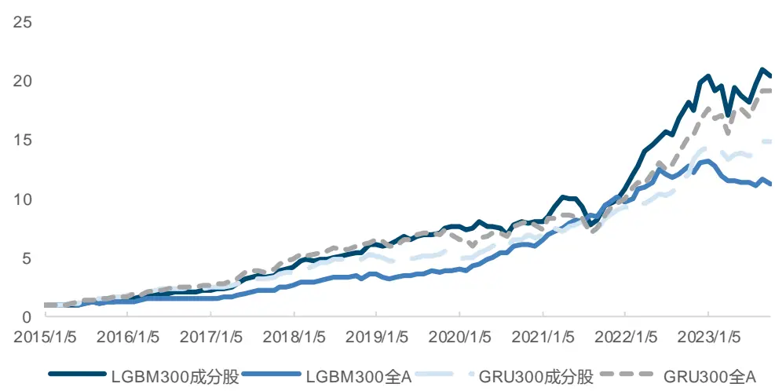
来源：Wind，国金证券研究所

对于中证 500 而言，情况略有不同，对于 GRU 模型，同样是大样本量的全 A 训练更具优势。而 LightGBM 模型使用两种成分股样本训练效果已经比较接近，使用成分股训练时，虽然 IC 相关指标略低一些，但多头和多空的最大回撤明显更低，具有在不同市场环境中更稳定的优势。

图表9：成分股或全A训练模型多空净值（中证500）
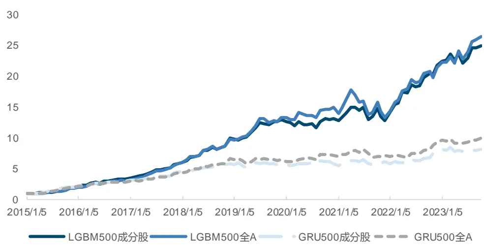
来源：Wind，国金证券研究所

由于中证 1000 成分股在市值上已经非常接近全 A 股票的中位数水平，且成分股本身数量较多，因此在中证 1000 上，使用成分股或全 A 训练的预测效果已经非常接近。在样本特征极其相似的情况下，LightGBM 使用全 A 训练效果略微更优。GRU 模型则差异极小，当样本量上升一定水平后，继续扩大样本量所带来的提升已经比较有限。

图表10：成分股或全A训练模型多空净值（中证1000）
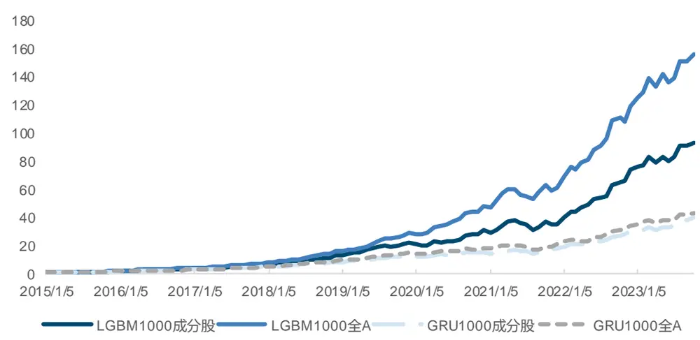
来源：Wind，国金证券研究所

## 三、一次性、滚动还是扩展训练？

一般而言，对于机器学习模型进行选股预测一方面需要考虑模型能够及时更新，保证最新的市场规律被及时反映到模型的参数中，但另一方面也要考虑过拟合风险，不能使某些年份的极端市场行情对模型的泛化性能产生负面影响。

因此，我们可以考虑使用一个固定的时间区间数据集进行完整一次性训练，也可以分年度将训练集、验证集和测试集向前滚动训练，或是保持训练集起始时间不变进行扩展训练。究竟哪种方式更适合 A 股的市场环境，能得到更优的选股效果，我们此处对这三种情况分别进行测试讨论。

训练时，我们控制了训练集和验证集长度与一次性训练保持一致。均为 8 年训练集，2 年验证集。在滚动或扩展训练的情况下，测试集均为一年。

图表11：滚动训练时间区间划分
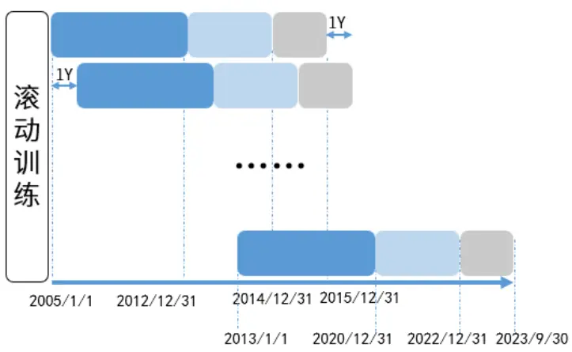
来源：国金证券研究所

图表12：扩展训练时间区间划分
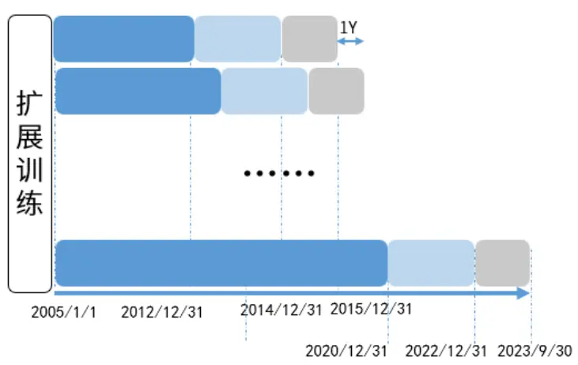
来源：国金证券研究所

我们首先观察了不同训练方式下的因子基本指标，可以看出，对于 LightGBM 而言，一次性训练效果明显更优，无论从 IC、多空相关指标来看，均要好于滚动或扩展训练集的方式。而对于 GRU 而言，三种训练效果差距缩窄，一次性训练的预测结果主要在回撤控制上具有一定优势。

图表13：一次性、滚动或扩展训练因子值各项指标对比（沪深300）

|  |  | IC均值 | IC_IR | T值 | 多头年化超 额收益率 | 多头信 息比率 | 多头超额最大回撤 | 多空年化收益 率 | 多空夏普比率多空最大回撤 |  |
| --- | --- | --- | --- | --- | --- | --- | --- | --- | --- | --- |
| LGBM | 一次性 | 10.69% | 0.68 | 6.88 | 16.39% | 1.56 | 11.16% | 41.02% | 2.07 | 22.66% |
|  | 滚动 | 8.14% | 0.50 | 5.08 | 12.07% | 1.14 | 14.73% | 30.76% | 1.54 | 26.98% |
|  | 扩展 | 8.42% | 0.51 | 5.17 | 10.52% | 0.97 | 19.64% | 29.43% | 1.51 | 28.00% |
| GRU | 一次性 | 9.58% | 0.72 | 7.36 | 15.03% | 1.58 | 7.85% | 36.06% | 2.36 | 12.33% |
|  | 滚动 | 9.69% | 0.65 | 6.65 | 15.10% | 1.48 | 13.85% | 31.93% | 1.77 | 21.96% |
|  | 扩展 | 9.62% | 0.67 | 6.83 | 14.03% | 1.41 | 13.26% | 33.46% | 1.88 | 17.44% |

来源：Wind，国金证券研究所

不论在哪种训练方式下，至少 8 年的训练集长度已经足够覆盖一整轮 A 股的行情周期，且在扩展训练过程中，每次新增的一年训练集占整个训练集比例较小，真正影响到模型在样本外预测能力的可能在于验证集的选取。

由于训练过程中为了避免过拟合并找到合适的参数，我们都会设置一定的早停轮数 N，验证集上的损失大小若连续 N 轮没有下降就停止训练。因此在滚动或扩展训练的情况下，验证集的不断更新会使模型的早停标准跟随市场交易逻辑的变化而变化，在碰到极端市场行情时，或过去两年的交易逻辑在当年不再适用时，可能导致测试集上效果出现较大下滑，这在更容易过拟合的 LightGBM 模型上会更加明显。

从图中我们可以看出，不同训练方式的净值出现差距基本从 2021 年开始，一定程度上可以说明，19、20 年的市场规律与其余年份均有区别，这可能与彼时核心资产报团、大小盘风格轮动等均有一定关系。

图表14：LGBM一次性、滚动或扩展训练多空净值曲线
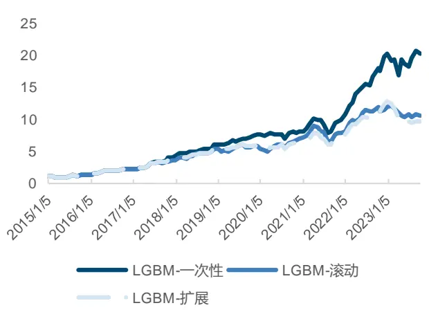
来源：Wind，国金证券研究所

图表15：GRU一次性、滚动或扩展训练多空净值曲线
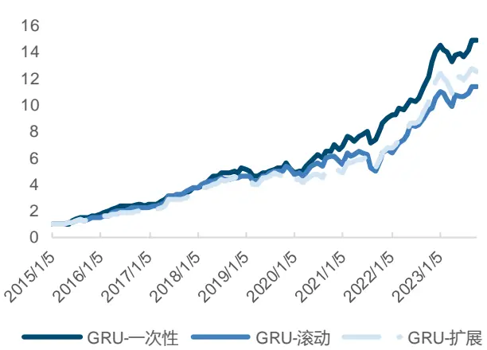
来源：Wind，国金证券研究所

## 四、分类还是回归？

常见的机器学习模型可以根据任务需求分为分类任务或回归任务，部分模型由于其算法设计只能用来进行其中一类任务，常见用于分类任务的模型包括支持向量机、逻辑回归、K近邻等，回归任务常见算法包括线性回归、决策树等。而我们所使用的 GBDT 和神经网络模型本质都是通过梯度下降的方式进行优化，只要保证损失函数是处处可微的，可以通用于回归或者分类任务。

在量化选股领域更适合使用回归还是分类任务目前并没有明确的定论，在本篇报告中，我们使用 MSE 作为回归任务的损失函数，Cross Entropy（交叉熵）作为分类任务的损失函数，对 LightGBM 和 GRU 两个模型进行改造。对于分类任务而言，我们将截面超额收益率分位数 0.3,0.7 作为区间划分依据，将所有股票分为三类，得到模型对于每类标签的概率值，进而得到对应因子值。

图表16：回归或分类任务训练因子值各项指标对比（沪深300）

|  |  | IC 均值 IC_IR |  | T值 | 多头年化超 额收益率 | 多头信息比率 | 多头超额最大 回撤 | 多空年化收 益率 | 多空夏普比 率 | 多空最大回 撤 |
| --- | --- | --- | --- | --- | --- | --- | --- | --- | --- | --- |
| LightGBM | 回归 | 10.69% | 0.68 | 6.88 | 16.39% | 1.56 | 11.16% | 41.02% | 2.07 | 22.66% |
|  | 分类 | 10.16% | 0.62 | 6.36 | 12.17% | 1.12 | 17.51% | 31.75% | 1.75 | 18.22% |
| GRU | 回归 | 9.58% | 0.72 | 7.36 | 15.03% | 1.58 | 7.85% | 36.06% | 2.36 | 12.33% |
|  | 分类 | 7.64% | 0.54 | 5.55 | 11.92% | 1.25 | 11.33% | 23.28% | 1.55 | 19.75% |

来源：Wind，国金证券研究所

可以看出，不论是 LightGBM 还是 GRU，回归模型在 IC 指标上均有一定优势，而在多空收益表现上优势更加突出。我们考虑其原因在于，保留每个样本标签的独立性，能够使不同股票的收益率更有区分度，从而加强了模型的学习效果。

此外，我们同样尝试了更多分组的分类方式，最多扩充为 10 分类，并尝试了不同的预测概率使用方法，在部分情况下效果略有提升，但均对结论没有影响，此处限于篇幅不再展开。

图表17：LightGBM模型分类&回归模型多空净值曲线
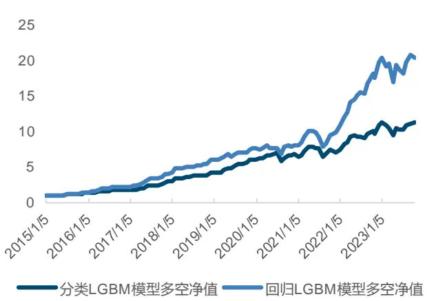
来源：Wind，国金证券研究所

图表18：GRU模型分类&回归模型多空净值曲线
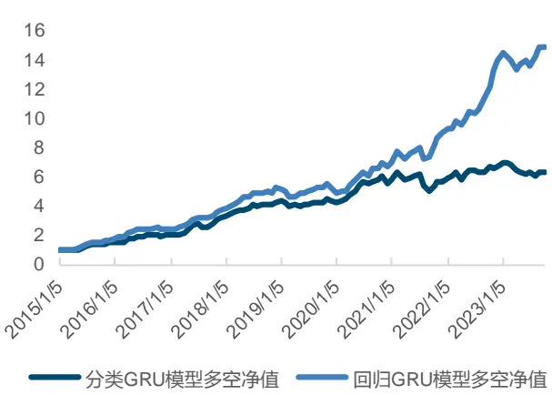
来源：Wind，国金证券研究所

## 五、损失函数是否有必要修改为IC？

如果从损失函数的角度出发进一步扩展，可以考虑将其修改设计为我们更关注的因子评价指标，如 RankIC 秩相关系数等，从而能够通过梯度下降的方式直接优化得到 IC 更高的因子。使用此类损失函数能否得到符合我们预期的因子？因子的各项指标能否同步提升？我们同样基于 LightGBM 和 GRU 两个模型在沪深 300 成分股上进行测试。

由于 LightGBM 不涉及分批次（Batch）训练，每棵树均投喂了整个训练集样本（有随机抽样），而 GRU 等神经网络模型可以选择按交易日分批次的方式进行训练，将每个交易日的所有股票限定在一个批次内，并选定若干个交易日作为一个批次，从而能够实现按日期先求出 IC 再时序取平均的方式得到最终的损失函数值。

图表19：不同损失函数训练因子值各项指标对比（沪深300）

|  |  | LGBM |  |  | GRU |  |  |
| --- | --- | --- | --- | --- | --- | --- | --- |
|  | 批次与损失函数处理方式 | MSE | 10 | RankIC | MSE | 1C | RankIC |
| IC 均值 | TotalBatch-TotalLoss | 10.69% | 8.69% | 8.71% | 9.47% | 10.00% | 10.00% |
|  | DailyBatch-TotalLoss |  |  |  | 9.53% | 9.67% | 9.67% |
|  | DailyBatch-DailyLoss |  |  |  | 9.29% | 9.78% | 9.77% |
| ICIR | TotalBatch-TotalLoss | 0.68 | 0.58 | 0.58 | 0.71 | 0.73 | 0.73 |
|  | DailyBatch-TotalLoss |  |  |  | 0.72 | 0.71 | 0.71 |
|  | DailyBatch-DailyLoss |  |  |  | 0.70 | 0.68 | 0.68 |
| 多头年化超额收益率 | TotalBatch-TotalLoss | 16.39% |  | 13.73% 13.85% | 16.28% | 15.58% | 15.58% |
|  | DailyBatch-TotalLoss |  |  |  | 16.93% | 13.49% | 13.49% |
|  | DailyBatch-DailyLoss |  |  |  | 17.31% | 14.66% | 14.72% |
| 多头超额最大回撤 | TotalBatch-TotalLoss | 11.16% |  | 12.00% 12.39% | 10.04% | 10.52% | 10.52% |
|  | DailyBatch-TotalLoss |  |  |  | 8.83% | 8.77% | 8.77% |
|  | DailyBatch-DailyLoss |  |  |  | 10.41% | 8.26% | 8.22% |
| 多空年化收益率 | TotalBatch-TotalLoss | 41.02% | 30.30% | 30.46% | 35.36% | 34.79% | 34.81% |
|  | DailyBatch-TotalLoss |  |  |  | 36.47% | 34.45% | 34.45% |
|  | DailyBatch-DailyLoss |  |  |  | 35.96% | 38.49% | 38.45% |
| 多空最大回撤 | TotalBatch-TotalLoss | 22.66% |  | 19.34% 20.17% | 11.60% | 18.64% | 18.64% |
|  | DailyBatch-TotalLoss |  |  |  | 11.19% | 11.17% | 11.17% |
|  | DailyBatch-DailyLoss |  |  |  | 12.22% | 11.17% | 10.09% |

来源：Wind，国金证券研究所

此处，我们尝试了 MSE、IC（pearson 相关系数）、RankIC（spearman 秩相关系数）三种损失函数，对于 GRU 模型而言，我们使用

- 不分交易日划分 Batch 且整个样本内计算损失函数（TotalBatch-TotalLoss），

- 按照交易日划分 Batch 且整个样本内计算损失函数（DailyBatch-TotalLoss），

- 按照交易日划分 Batch 且日度计算损失函数后求均值（DailyBatch-DailyLoss），

共三种方式进行批处理和损失函数计算。从以上主要指标可以看出：

- 使用 IC 或 RankIC 作为损失函数能使 GRU 模型训练得到 IC均值更高的因子，但整体提升幅度并不明显。而 LightGBM 使用 IC 作为损失函数反而使 IC 均值出现一定程度下降。

- 从 ICIR，多头收益、多空收益的角度而言，MSE 损失函数反而具有一定优势。而回撤相关指标则对于不同损失函数未能展现出明显规律。

- 值得一提的是，计算日度 IC 并在时序上求均值的方式虽然在回撤水平上有一定优势，但其 IC 指标、多头收益反而不如直接使用整个训练集进行计算。

因此，将损失函数修改为 IC、RankIC 并无太大必要，对样本的批次处理按照交易日划分并以此计算损失函数也无明显优势。

## 六、GBDT, DART or RF?

我们知道，决策树是通过递归的方式对每个结点进行递归边界测试，判断该结点所包含的样本是否都属于同一个 label。若不是，则根据信息增益程度的增加继续利用特征对样本进行划分。

而单棵决策树一般很难达到令人满意的预测效果，因此有多种不同的集成算法以增强模型能力。包括采用 Bootstrap 采样的方式同时并行训练多棵树，再进行取均值的方式得到了随机森林（RF）；按照顺序串行训练多棵决策树，并将损失函数设定为前一棵树训练后的残差值从而不断逼近最终预测目标的 GBDT 算法。

而 DART（Dropouts meet Multiple Additive Regression Tree）算法是一种借鉴了神经网络中 drop out 思想的决策树集成算法。根据 Rashmi，Gilad-Bachrach，2015 的介绍，传统的 MART 算法会使在后期参与训练的决策树只会影响极少量样本的预测，带来的贡献过小，可能会导致模型在面对从未看到过的数据时表现不佳，并且使模型对于早期的几棵树过于敏感。

图表20：不同正则化方法中决策树贡献的差异
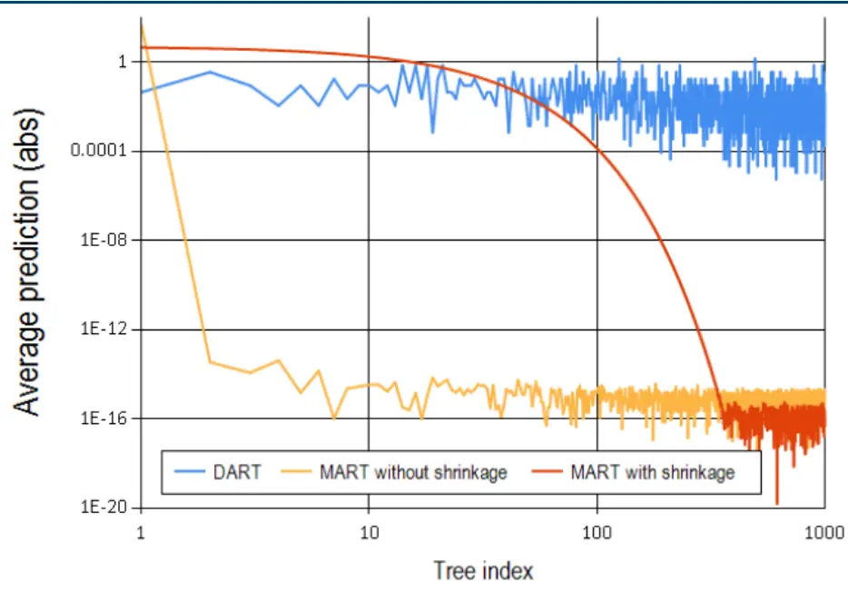
来源：《Dropouts meet Multiple Additive Regression Trees》，国金证券研究所

而早期被提出的 Shrinkage 思想认为，若每棵树训练后在当前预测值后面新增一个步长的限制，从而使每棵树都通过小步逐渐逼近而非一次性迈大步逼近结果，更能有效防止过拟合的发生。

DART 则是对 Shrinkage 的又一步改进，该算法在每次循环训练决策树时，随机抽取之前的部分决策树作为一个子模型，并用该子模型计算梯度。此外，通过增加一个缩放项的方式，模型保证了新学习的决策树和被 Dropped 的决策树相加后不会超过原本的目标值。从上图中也可以看出，即便是到了训练后期的决策树，其对于整个模型的贡献程度依然能保持在一个较高的水平。

我们针对 LightGBM 模型在沪深 300 成分股分别尝试了三种不同的算法，得到因子主要指标如下：

图表21：LightGBM不同集成算法因子值各项指标对比（沪深300)

|  | IC 均值 | IC_IR T 值 |  | 多头年化超 额收益率 | 多头信息比率多头超额最大回撤 |  | 多空年化收益率 多空夏普比率 多空最大回撤 |  |  |
| --- | --- | --- | --- | --- | --- | --- | --- | --- | --- |
| GBDT | 10.69% | 0.68 | 6.88 | 16.39% | 1.56 | 11.16% | 41.02% | 2.07 | 22.66% |
| DART | 10.76% | 0.67 | 6.87 | 18.47% | 1.84 | 9.61% | 42.10% | 2.23 | 24.53% |
| RF | 5.22% | 0.45 | 4.54 | 7.96% | 0.79 | 14.34% | 19.24% | 1.27 | 19.43% |

来源：Wind，国金证券研究所

可以看出，DART 算法在各项指标中均表现最佳，多头年化超额收益率相较于 GBDT 有接近2%的提升，且回撤水平也有所降低。而随机森林表现相对较差，与另两类算法有较大差距。可以在一定程度上说明，量化领域训练时使用带有 Drop Out 的决策树集成算法能够均衡不同顺序决策树的贡献程度，避免对早期决策树过于敏感而导致的过拟合情况。

图表22：LightGBM不同集成算法多头超额净值曲线（沪深300)
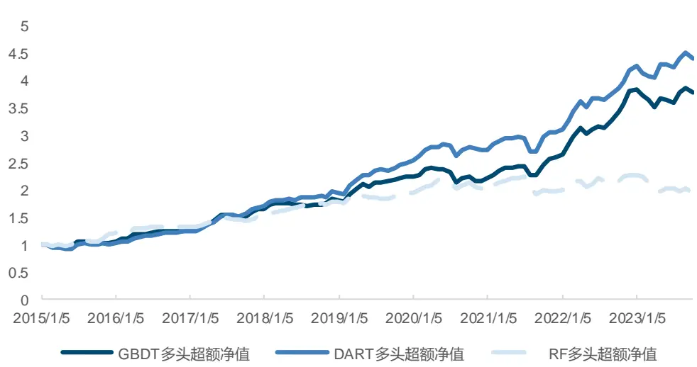
来源：Wind，国金证券研究所

## 七、改进后因子与策略效果

基于上述对模型训练过程多处细节调整的对比测试后，我们整合所得有效结论，并分别在沪深 300、中证 500 和中证 1000 上重新训练所有模型。此处我们所用模型与上篇报告中基本保持一致，去除掉训练过于耗时且增量信息有限的 Double Ensemble 模型，共 7 个模型进行训练测试。

## 7.1 因子测试结果

每个模型均使用 5 个随机种子取均值的方式作为最终结果，同时为考虑可交易性，均将因子值向后推一天。回测时间为 2015 年 2 月 1 日-2023 年 9 月 30 日，每月月初进行调仓。合成后因子在沪深 300 成分股的效果如下：

图表23：GBDT 与NN合成因子在沪深300 成分股的各项指标

|  | IC 均值 | IC_IR | T值 | 多头年化超 | 多头信 | 多头超额最 大回撤 | 多空年化收益 率 | 多空夏普比率 | 多空最大回撤 |
| --- | --- | --- | --- | --- | --- | --- | --- | --- | --- |
|  |  |  |  | 额收益率 | 息比率 |  |  |  |  |
| GBDT | 10.58% | 0.66 | 6.70 | 15.55% | 1.54 | 9.71% | 36.36% | 1.84 | 25.58% |
| GBDT_AdjCI | 8.08% | 0.70 | 7.11 | 13.39% | 1.47 | 10.00% | 33.29% | 2.21 | 17.72% |
| NN | 12.60% | 0.85 | 8.65 | 18.09% | 1.79 | 8.74% | 43.39% | 2.34 | 16.31% |
| NN_AdjCl | 10.68% | 1.07 | 10.88 | 18.82% | 2.49 | 5.62% | 39.46% | 3.14 | 7.01% |
| GBDT+NN | 13.51% | 0.82 | 8.36 | 18.93% | 1.90 | 8.83% | 47.68% | 2.31 | 24.75% |
| GBDT+NN_AdjCI | 10.98% | 0.97 | 9.87 | 19.66% | 2.38 | 6.40% | 40.36% | 2.63 | 20.83% |

来源：Wind，国金证券研究所

可以看出，两类模型在沪深 300 成分股均有优异的选股表现，进行行业市值中性化后，IC均值分别为 8.08%和 10.68%，两类模型进一步合成后 IC 均值提升至 10.98%。多头年化超额收益率达到 19.66%，多头超额最大回撤仅为 6.40%，相较于单类模型有一定提升。

图表24：GBDT与NN合成因子在沪深300成分股的多头超额净值曲线
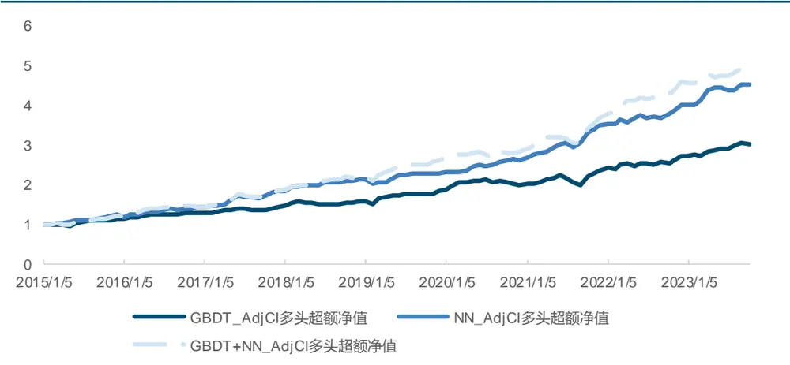
来源：Wind，国金证券研究所

在中证 500 中，我们以同样方式对两类模型所得因子进行测试，因子主要指标如下：

图表25：GBDT与NN合成因子在中证500 成分股的各项指标

|  | IC均值 | IC_IR | T值 | 多头年化超 额收益率 | 多头信 息比率 | 多头超额最 大回撤 | 多空年化收益率 | 多空夏普比率 | 多空最大回撤 |
| --- | --- | --- | --- | --- | --- | --- | --- | --- | --- |
| GBDT | 11.37% | 0.89 | 9.10 | 13.47% | 1.43 | 15.42% | 44.31% | 2.44 | 19.56% |
| GBDT_AdjCI | 10.15% | 1.09 | 11.12 | 13.16% | 1.82 | 4.96% | 39.17% | 2.78 | 12.52% |
| NN | 10.20% | 0.96 | 9.77 | 8.39% | 1.06 | 17.86% | 30.61% | 1.96 | 10.79% |
| NN_AdjCl | 9.07% | 1.03 | 10.52 | 8.07% | 1.15 | 10.62% | 28.13% | 2.26 | 9.00% |
| GBDT+NN | 12.13% | 1.02 | 10.38 | 12.29% | 1.42 | 12.04% | 44.01% | 2.52 | 13.68% |
| GBDT+NN_AdjCl | 10.87% | 1.19 | 12.09 | 12.93% | 1.71 | 8.85% | 38.72% | 2.68 | 8.08% |

来源：Wind，国金证券研究所

可以看出，因子在中证500整体表现同样突出，两类模型合成后的因子IC均值为10.87%，多头年化超额收益率为 12.93%，多头超额最大回撤为 8.85%。相较于沪深 300 的收益水平和稳定性略有下降。

图表26：GBDT与NN合成因子在中证500成分股的多头超额净值曲线
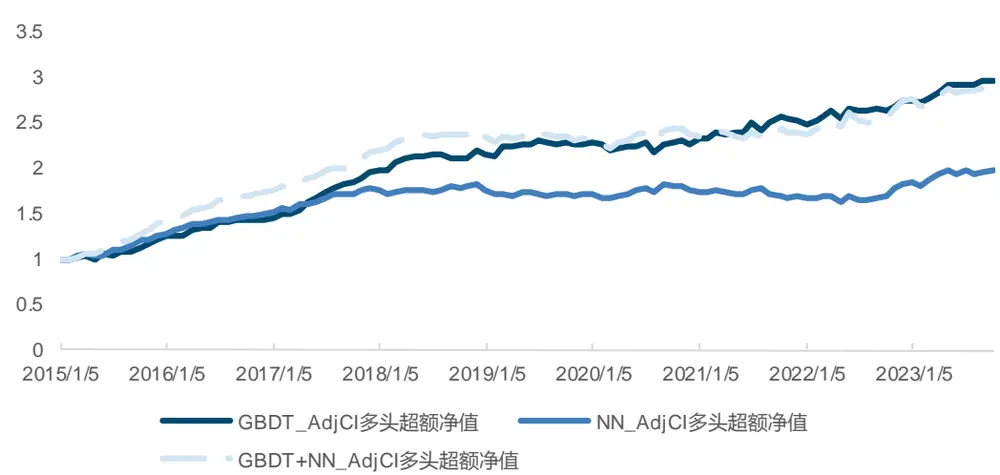
来源：Wind，国金证券研究所

不过，在中证1000成分股中，因子表现极为突出，两类模型合成因子IC均值达到16.01%，行业市值中性化后依然有 15.14%。而在多头端，年化超额收益率为 22.93%，中性化后的因子收益进一步提升至 23.48%，多头超额最大回撤也仅为 3.12%。

图表27：GBDT与NN合成因子在中证 1000成分股的各项指标

|  | IC 均值 | IC_IR | T值 | 多头年化超额 收益率 | 多头信 息比率 | 多头超额最 大回撤 | 多空年化收益率 | 多空夏普比率 | 多空最大回撤 |
| --- | --- | --- | --- | --- | --- | --- | --- | --- | --- |
| GBDT | 15.71% | 1.31 | 13.36 | 22.83% | 2.94 | 4.64% | 74.95% | 4.31 | 10.20% |
| GBDT_AdjCI | 14.87% | 1.54 | 15.67 | 22.56% | 3.34 | 4.46% | 74.17% | 4.92 | 5.63% |
| NN | 13.06% | 1.40 | 14.26 | 19.15% | 2.11 | 7.75% | 53.64% | 3.19 | 15.78% |
| NN_AdjCI | 12.30% | 1.50 | 15.28 | 18.20% | 2.21 | 5.51% | 52.22% | 3.43 | 13.41% |
| GBDT+NN | 16.01% | 1.49 | 15.17 | 22.93% | 3.13 | 3.85% | 72.35% | 4.26 | 14.07% |
| GBDT+NN_AdjCI | 15.14% | 1.69 | 17.24 | 23.48% | 3.20 | 3.12% | 71.50% | 4.54 | 11.99% |

来源：Wind，国金证券研究所

图表28：GBDT 与NN合成因子在中证1000成分股的多头超额净值曲线
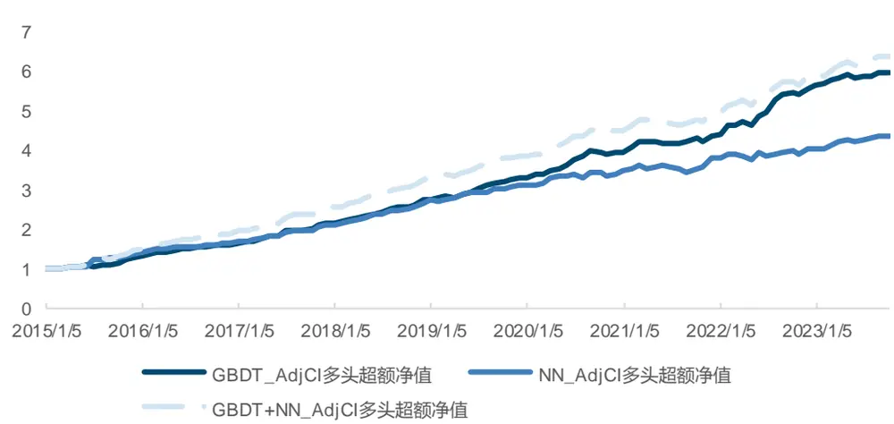
来源：Wind，国金证券研究所

## 7.2 基于 GBDT+NN 的指数增强策略

为进一步贴近投资实际，我们此处构建了基于上述机器学习模型的指数增强策略。通过马科维茨的均值方差优化模型，对投资组合的跟踪误差进行限制，并控制个股偏离程度以减少策略波动水平，最大化预期超额收益率。

$$
Maxw^{T}f
$$

$$
s.t.\quad\sqrt{(w-w_{bench})\Sigma(w-w_{bench})^{\prime}}\leq target\_TE
$$

$$
w-w_{_{benc\not a}}\leq1\%
$$

其中，f 为模型的预测信号， $w_{bench}$ 为基准权重向量，tartget_TE 为目标跟踪误差。

在本篇报告中，我们将年化跟踪误差控制为最大不能超过 5%。使用优化器对投资组合权重进行优化，回测期为 2015 年 2 月 1 日至 2023 年 9月 30 日，以每月第一个交易日的收盘价进行月频调仓，假定手续费率为单边千二，在各宽基指数上的测试结果如下。

图表29：基于 GBDT+NN的沪深300 指数增强策略指标

|  | GBDT | NN | GBDT+NN |
| --- | --- | --- | --- |
| 年化收益率 | 14.78% | 16.96% | 17.03% |
| 年化波动率 | 21.98% | 21.24% | 21.59% |
| Sharpe 比率 | 0.67 | 0.80 | 0.79 |
| 最大回撤率 | 38.56% | 39.17% | 38.87% |
| 平均换手率（双边） | 88.39% | 103.37% | 97.12% |
| 年化超额收益率 | 13.28% | 15.45% | 15.43% |
| 跟踪误差 | 4.30% | 4.27% | 4.11% |
| 信息比率 | 3.09 | 3.62 | 3.76 |
| 超额最大回撤 | 3.80% | 4.09% | 2.87% |

来源：Wind，国金证券研究所

图表30：基于 GBDT+NN的沪深300 指数增强策略净值曲线
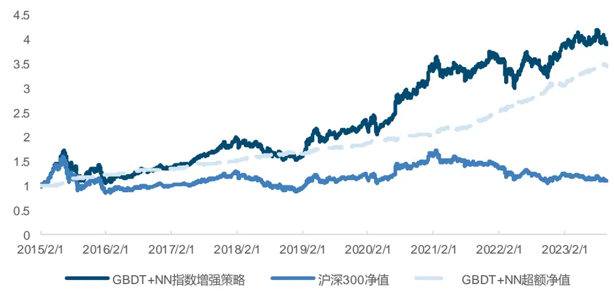
来源：Wind，国金证券研究所

可以发现，经过组合优化的控制后，策略表现进一步提升，以沪深 300 作为基准，年化超额收益率达到 15.43%，超额最大回撤仅为 2.87%。分年度来看，策略仅在 2019 年超额收益未达到 10%，其余年份均有较高的超额收益水平。

图表31：基于 GBDT+NN的沪深300 指数增强策略分年度收益
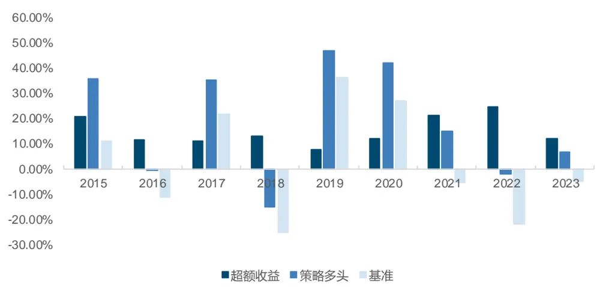
来源：Wind，国金证券研究所

图表32：基于 GBDT+NN的沪深300 指数增强策略分年度收益

|  | 超额收益 | 策略多头 | 基准 |
| --- | --- | --- | --- |
| 2015 | 20.70% | 35.59% | 11.24% |
| 2016 | 11.80% | -0.40% | -11.28% |
| 2017 | 11.24% | 35.26% | 21.78% |
| 2018 | 12.97% | -15.24% | -25.31% |
| 2019 | 7.94% | 46.87% | 36.07% |
| 2020 | 11.96% | 42.10% | 27.21% |
| 2021 | 21.14% | 14.98% | -5.20% |
| 2022 | 24.64% | -1.76% | -21.63% |
| 2023（截至9月30日） | 11.96% | 6.97% | -4.70% |

来源：Wind，国金证券研究所

同样地，我们在中证 500 指数成分股进行指数增强策略的构建，策略的年化超额收益率达到 20.50%，超额最大回撤为 8.39%。

图表33：基于 GBDT+NN的中证500 指数增强策略指标

|  | GBDT | NN | GBDT+NN |
| --- | --- | --- | --- |
| 年化收益率 | 21.09% | 19.01% | 21.07% |
| 年化波动率 | 24.66% | 23.90% | 24.28% |
| Sharpe 比率 | 0.86 | 0.80 | 0.87 |
| 最大回撤率 | 43.23% | 44.94% | 43.25% |
| 平均换手率（双边） | 108.66% | 130.70% | 123.45% |
| 年化超额收益率 | 20.59% | 18.33% | 20.50% |
| 跟踪误差 | 4.98% | 5.21% | 5.15% |
| 信息比率 | 4.13 | 3.52 | 3.98 |
| 超额最大回撤 | 4.77% | 6.14% | 8.39% |

来源：Wind，国金证券研究所

图表34：基于GBDT+NN的中证500指数增强策略净值曲线
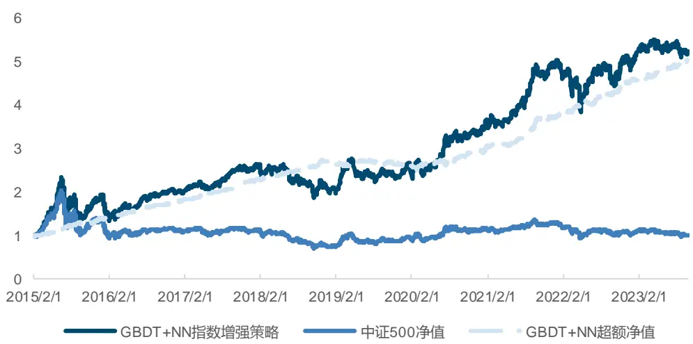
来源：Wind，国金证券研究所

分年度来看，中证 500 指数增强策略稳定性略差于沪深 300，超额收益率在 2019 年较低，其余年份超额收益均在 10%以上。

图表35：基于GBDT+NN的中证500 指数增强策略分年度收益
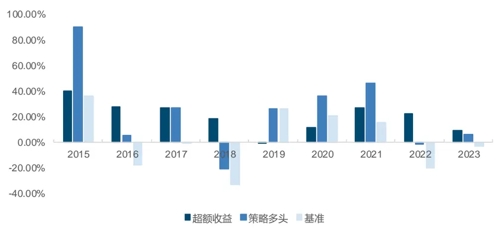
来源：Wind，国金证券研究所

图表36：基于 GBDT+NN的中证500 指数增强策略分年度收益

|  | 超额收益 | 策略多头 | 基准 |
| --- | --- | --- | --- |
| 2015 | 40.30% | 90.30% | 35.80% |
| 2016 | 27.90% | 5.46% | -17.78% |
| 2017 | 26.88% | 26.90% | -0.20% |
| 2018 | 18.20% | -20.97% | -33.32% |
| 2019 | -1.23% | 25.75% | 26.38% |
| 2020 | 11.69% | 36.19% | 20.87% |
| 2021 | 26.54% | 45.86% | 15.58% |
| 2022 | 22.59% | -1.80% | -20.31% |
| 2023（截至9月30日） | 9.14% | 6.08% | -2.96% |

来源：Wind，国金证券研究所

最后，使用同样的方式我们构建了机器学习中证 1000 指数增强策略，策略的年化超额收益率达到 32.25%，超额最大回撤为 4.33%。

图表37：基于 GBDT+NN 的中证 1000 指数增强策略指标

|  | GBDT | NN | GBDT+NN |
| --- | --- | --- | --- |
| 年化收益率 | 32.24% | 27.49% | 31.70% |
| 年化波动率 | 26.48% | 26.63% | 26.45% |
| Sharpe 比率 | 1.22 | 1.03 | 1.20 |
| 最大回撤率 | 44.86% | 48.01% | 45.79% |
| 平均换手率（双边） | 141.37% | 149.89% | 129.94% |
| 年化超额收益率 | 32.97% | 28.11% | 32.25% |
| 跟踪误差 | 5.87% | 6.02% | 6.04% |
| 信息比率 | 5.61 | 4.67 | 5.34 |
| 超额最大回撤 | 4.96% | 4.70% | 4.33% |

来源：Wind，国金证券研究所

图表38：基于GBDT+NN的中证 1000 指数增强策略净值曲线
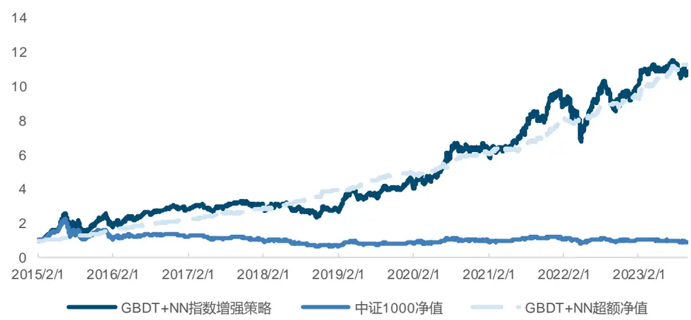
来源：Wind，国金证券研究所

分年度来看，策略在中证 1000 上表现最为稳定，每一年的超额收益均在 20%以上。

图表39：基于 GBDT+NN的中证1000 指数增强策略分年度收益
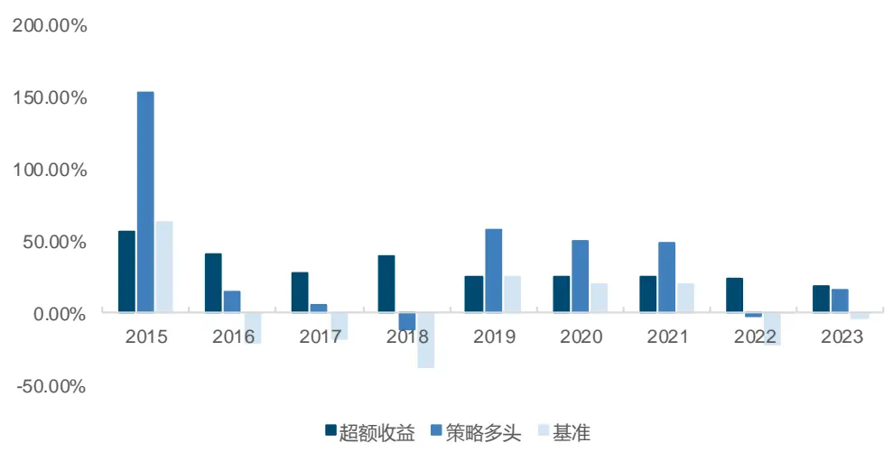
来源：Wind，国金证券研究所

图表40：基于 GBDT+NN的中证1000指数增强策略分年度收益

|  | 超额收益 | 策略多头 | 基准 |
| --- | --- | --- | --- |
| 2015 | 56.75% | 153.40% | 62.40% |
| 2016 | 40.39% | 14.63% | -20.01% |
| 2017 | 27.82% | 6.08% | -17.35% |
| 2018 | 38.85% | -11.55% | -36.87% |
| 2019 | 25.66% | 58.20% | 25.67% |
| 2020 | 25.23% | 50.27% | 19.39% |
| 2021 | 24.83% | 49.08% | 20.52% |
| 2022 | 23.18% | -2.69% | -21.58% |
| 2023（截至9月30日） | 19.11% | 15.48% | -3.23% |

来源：Wind，国金证券研究所

## 总结

机器学习模型通过其复杂的非线性方式往往能得到较好的截面选股能力，但由于其“黑箱”的特性使投资者在进行模型训练的过程中对于很多细节问题没有明确的定论。本篇报告尝试对投资者主要关心的一些细节问题分别测试、对比并探讨其背后原理。

主要探索领域包括特征和标签的数据预处理方式，使用全 A 股票训练还是成分股训练，使用一次性训练、滚动或是扩展训练的效果区别，分类模型和回归模型的差异，损失函数改为 IC 后是否有进一步提升，不同的树集成方法优劣对比。

最终，我们保持与原框架一致，使用 GBDT 和 NN 两大类模型分别在不同成分股上训练，得到了在样本外效果突出的因子。最终，我们结合交易实际，构建了基于各宽基指数的指数增强策略。其中，沪深300指数增强策略年化超额收益达到15.43%，超额最大回撤为2.87%。中证 500 指增策略年化超额收益 20.50%，超额最大回撤 8.39%。中证 1000 指增策略年化超额收益 32.25%，超额最大回撤 4.33%。

## 风险提示

1、以上结果通过历史数据统计、建模和测算完成，在政策、市场环境发生变化时模型存在时效的风险。

2、策略通过一定的假设通过历史数据回测得到，当交易成本提高或其他条件改变时，可能导致策略收益下降甚至出现亏损。

## 特别声明：

国金证券股份有限公司经中国证券监督管理委员会批准，已具备证券投资咨询业务资格。

形式的复制、转发、转载、引用、修改、仿制、刊发，或以任何侵犯本公司版权的其他方式使用。经过书面授权的引用、刊发，需注明出处为“国金证券股份有限公司”，且不得对本报告进行任何有悖原意的删节和修改。

本报告的产生基于国金证券及其研究人员认为可信的公开资料或实地调研资料，但国金证券及其研究人员对这些信息的准确性和完整性不作任何保证。本报告反映撰写研究人员的不同设想、见解及分析方法，故本报告所载观点可能与其他类似研究报告的观点及市场实际情况不一致，国金证券不对使用本报告所包含的材料产生的任何直接或间接损失或与此有关的其他任何损失承担任何责任。且本报告中的资料、意见、预测均反映报告初次公开发布时的判断，在不作事先通知的情况下，可能会随时调整，亦可因使用不同假设和标准、采用不同观点和分析方法而与国金证券其它业务部门、单位或附属机构在制作类似的其他材料时所给出的意见不同或者相反。

本报告仅为参考之用，在任何地区均不应被视为买卖任何证券、金融工具的要约或要约邀请。本报告提及的任何证券或金融工具均可能含有重大的风险，可能不易变卖以及不适合所有投资者。本报告所提及的证券或金融工具的价格、价值及收益可能会受汇率影响而波动。过往的业绩并不能代表未来的表现。

客户应当考虑到国金证券存在可能影响本报告客观性的利益冲突，而不应视本报告为作出投资决策的唯一因素。证券研究报告是用于服务具备专业知识的投资者和投资顾问的专业产品，使用时必须经专业人士进行解读。国金证券建议获取报告人员应考虑本报告的任何意见或建议是否符合其特定状况，以及（若有必要）咨询独立投资顾问。报告本身、报告中的信息或所表达意见也不构成投资、法律、会计或税务的最终操作建议，国金证券不就报告中的内容对最终操作建议做出任何担保，在任何时候均不构成对任何人的个人推荐。

在法律允许的情况下，国金证券的关联机构可能会持有报告中涉及的公司所发行的证券并进行交易，并可能为这些公司正在提供或争取提供多种金融服务。

本报告并非意图发送、发布给在当地法律或监管规则下不允许向其发送、发布该研究报告的人员。国金证券并不因收件人收到本报告而视其为国金证券的客户。本报告对于收件人而言属高度机密，只有符合条件的收件人才能使用。根据《证券期货投资者适当性管理办法》，本报告仅供国金证券股份有限公司客户中风险评级高于 C3 级(含 C3 级）的投资者使用；本报告所包含的观点及建议并未考虑个别客户的特殊状况、目标或需要，不应被视为对特定客户关于特定证券或金融工具的建议或策略。对于本报告中提及的任何证券或金融工具，本报告的收件人须保持自身的独立判断。使用国金证券研究报告进行投资，遭受任何损失，国金证券不承担相关法律责任。

若国金证券以外的任何机构或个人发送本报告，则由该机构或个人为此发送行为承担全部责任。本报告不构成国金证券向发送本报告机构或个人的收件人提供投资建议，国金证券不为此承担任何责任。

此报告仅限于中国境内使用。国金证券版权所有，保留一切权利。

上海

电话：021-80234211

北京

电话：010-85950438

深圳

邮箱：researchsh@gjzq.com.cn

电话：0755-86695353

邮箱：researchbj@gjzq.com.cn

邮箱：researchsz@gjzq.com.cn

邮编：201204

地址：上海浦东新区芳甸路 1088 号紫竹国际大厦 5 楼

邮编：518000

邮编：100005

地址：北京市东城区建内大街 26 号

新闻大厦 8 层南侧

地址：深圳市福田区金田路 2028 号皇岗商务中心

18 楼 1806

【小程序】国金证券研究服务

【公众号】国金证券研究