证券研究报告

金融工程组

分析师：高智威(执业 S1130522110003)

分析师：赵妍(执业 S1130523060001)

gaozhiw@gjzq.com.cn

zhao_yan@gjzq.com.cn

## 基于 BERT-TextCNN 的中证1000 舆情增强策略

金融论坛中的舆情信息蕴含了丰富的股民情绪，可能影响其交易行为进而影响股价，通过对金融论坛中股民的发帖信息进行情感分析，有望能够挖掘到有效的选股因子。我们已经在《Alpha 掘金系列之八：FinGPT 对论坛评论情感的精准识别——沪深 300 另类舆情增强因子》报告中构建了沪深 300 指数增强策略，本次我们将基于中证 1000 指数成分股股票池，构建中证 1000 指数增强策略。

## 金融论坛舆情信息的情感评分方法

本报告采用子长科技提供的中证 1000 指数成分股相关的金融论坛股民发帖数据，使用了 2018 年至 2023 年的超 5000万条的主帖文本内容。经预处理后，我们在主帖文本数据中抽取部分样本进行训练和验证，我们利用大语言模型进行这部分样本的标注，然后采用 BERT-TextCNN 模型进行针对金融论坛舆情信息的特定任务训练，最终构建出文本情感识别模型，将股评信息标注为积极、消极、悲观三类。BERT 模型通常用于提取文本的深层次语义信息和上下文信息，而 TextCNN 模型则用于捕捉文本的局部特征，两者结合可以同时利用全局和局部特征进行文本分类。我们训练后的BERT-TextCNN 模型样本外准确率超过 85%，我们用该模型对超过 5000 万条股评信息进行情感分类。

## 多维度舆情因子构建与回测

我们利用金融论坛舆情信息文本情感评分结果，从多维度构建了周频舆情选股因子，包括情绪一致性、关注度、周内关注度波动、整体情绪、周内情绪波动等因子。我们用积极/消极帖子占比来刻画情绪一致性，两个因子均显著，积极帖子占比因子 IC 值为负值，即积极情绪一致的股票未来股价可能较差。我们用主帖数、积极帖子数、消极帖子数来刻画关注度，积极帖子数量因子 IC 值为-6.22%，多空年化收益率为 59.41%，即中证 1000 股票池中，关注度越高的股票，未来表现越差。我们用积极帖子数量减去消极帖子数量来衡量股民整体情绪，整体情绪因子 IC 均值为 3.86%，即整体情绪越积极，未来一周股票表现越好。此外，关注度波动因子、情绪波动因子的IC 均值均为负值。

我们将五个维度的因子进行等权重合成，合成因子 IC 达到 6.13%，风险调整的 IC 为 0.71，t 统计量达到 12.4，多空年化收益率为 54.76%，多空组合夏普比率为 4.07，而多空组合最大回撤率为 9.02%。合成因子分位数组合单调性较好，top 组合的年化超额收益率能够达到 12.99%。合成后的舆情因子与传统选股因子的相关系数也均不超过0.3。

## 基于金融论坛多维度舆情因子的中证1000指数增强策略构建

我们利用构建的舆情因子，我们基于如下条件构建了中证 1000 指数增强策略：选股范围是中证 1000 指数成分股，回测时间区间是 2018.1.8-2023.12.29，每周第一个交易日进行调仓，按开盘价进行交易，调仓日根据合成因子值从大到小进行排序，选择前 10%的股票等权重构建组合，交易成本设置为单边千分之二。我们设置了换手率缓冲条件，即上期持仓中如果当期仍然在前 0%与 35%内，则保留。基于金融论坛多维度舆情因子的中证 1000 指数增强策略，自 2018年初至 2023 年末，获得 10.85%的年化收益率，相对于中证 1000 指数获得了 13.95%的年化超额收益率，信息比率达到 1.56，超额净值最大回撤率为 9.52%。除 2019 年之外，其余各年份均获得了正的超额收益率。

## 风险提示

以上结果基于一定的假设条件、通过历史数据统计和测算完成，在市场环境发生变化时模型存在失效的风险；大语言模型对文本进行情感分析的结果具有一定的随机性，存在一定的随机性风险。

## 1、引言

基于金融论坛舆情信息挖掘的选股因子具有研究价值。股民的情绪可能影响其交易行为进而影响股价，通过对金融论坛中股民的发帖信息进行情感分析，挖掘股民的情绪变化，有望能够挖掘到有效的选股因子。在传统的选股因子不断失效的市场环境下，舆情因子往往与传统选股因子相关性低，是对传统选股因子的有效补充。

构建传统的文本情感识别模型（NLP），如深度学习模型、Bert 模型等，在针对特定任务进行训练时需要标注好的样本，传统手段采用人工标注，成本高昂。

大语言模型的诞生和演进助力我们进行文本情感分析。2022 年末以来，随着 OpenAI 发布ChatGPT，由此引发 AI 大模型热潮，国内外各类大语言模型不断问世，能力也不断演进。大语言模型采用 Transformer 等复杂架构，能够捕捉到复杂的情感模式，基于海量数据进行训练，泛化能力较强，大语言模型为我们进行文本情感分析提供了有效的工具。

图表1：AI大模型发展进程
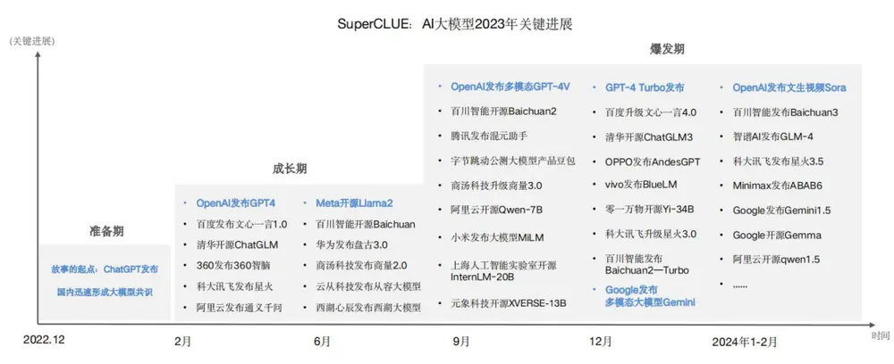
来源：SuperCLUE，国金证券研究所

但对于庞大的舆情数据集，调用ChatGPT等大语言模型进行文本情感分析，往往按照token收费，具有高成本、耗时长等问题。即使使用本地部署的开源大模型，对千万级别的数据集进行情感分析，仍然需要耗费较长的时间。

结合大语言模型的文本情感分析能力，我们可以利用大语言模型进行部分样本标注，再使用传统文本情感识别模型对该任务进行针对性训练，能够降低成本，提高庞大数据集的文本情感分析速度。

## 2、金融论坛舆情信息的情感评分方法

## 2.1 数据来源

我们曾在 2023 年 10 月 16 日发布的报告《Alpha 掘金系列之八：FinGPT 对论坛评论情感的精准识别——沪深 300 另类舆情增强因子》报告中使用过子长科技提供的沪深 300 指数成分股的金融论坛舆情数据，构建了沪深 300 增强策略。

子长科技创建于 2018 年，创始团队包括前路透社，亚马逊，谷歌等人工智能及金融数据专家。公司创立以来，以包括知识图谱和自然语言处理的知识模型 LKM 为核心技术，始终致力于打造垂直金融行业的人工智能核心能力，推出多款数据及金融终端产品，有效服务投研、量化和风控等多个场景。

本报告采用子长科技提供的中证 1000 指数成分股相关的金融论坛股民发帖数据。子长科技基于公开社交媒体信息，包括股民及股市大 V 的各类言论，结合公司、行业、产品、相关技术等数据，运用 AI 知识模型 LKM，准确将股民情绪关联及定位到相关股票。并根据情绪表达，产生实时的量化情绪分数及统计信息，从而充分体现个股的股民情绪，关注变化，捕捉市场信号。基于知识模型 LKM 体系的数据，具有精准、实时、可溯源等优，通过知识模型，AI 准确进行实体对齐，将股民评论精准定位到相关股票，准确产生情绪数据，效果远超于基于情绪关键词的上一代技术。

## 2.2 数据基本情况介绍

金融论坛的数据主要可以分为两种类型，主帖和评论，均包含了股民的情绪宣泄、市场观点等信息。相比于研报、新闻信息等舆情，金融论坛的舆情数据中股民对于股票的观点可能在专业性上有所欠缺，但可能带有强烈的感情宣泄，内容简短，能够反映股民对于股票的情感和看法，例如“千万别再跌了啊，再跌我就要赔一百元了啊”、“今天没戏了，哎”等内容的帖子。

图表2：金融论坛数据形式
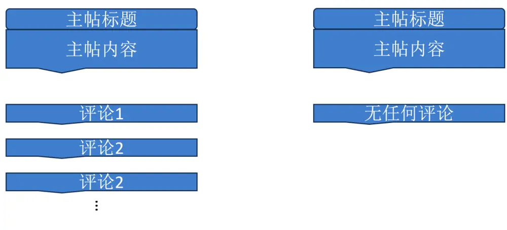
来源：国金证券研究所

主帖数据中，除了股民的观点表达，仍包含新闻、研报、董秘问答、公司公告等信息，但子长科技目前对主帖数据提供了分类标签，能够去除这些与股民情绪表达无关的信息。

我们获得的中证 1000 指数成分股金融论坛舆情数据时间来自 2018 年 1 月至 2023 年 12月，主帖总数据集数据超过 5000 万条，评论数据集数据超过 7000 万条，总的样本量超过1.2 亿条。庞大的数据量增加了文本情感分析的难度和成本。本文将基于主帖数据进行文本情感分析及选股因子的构建。

## 2.3 大语言模型与传统NLP 模型相结合的文本情感识别步骤

我们将大语言模型与传统文本情感分析模型进行结合，充分发挥大语言模型进行文本情感识别的优势。我们将采用如下步骤，进行文本情感识别模型的估计。

图表3：大语言模型与传统NLP模型相结合的文本情感识别流程
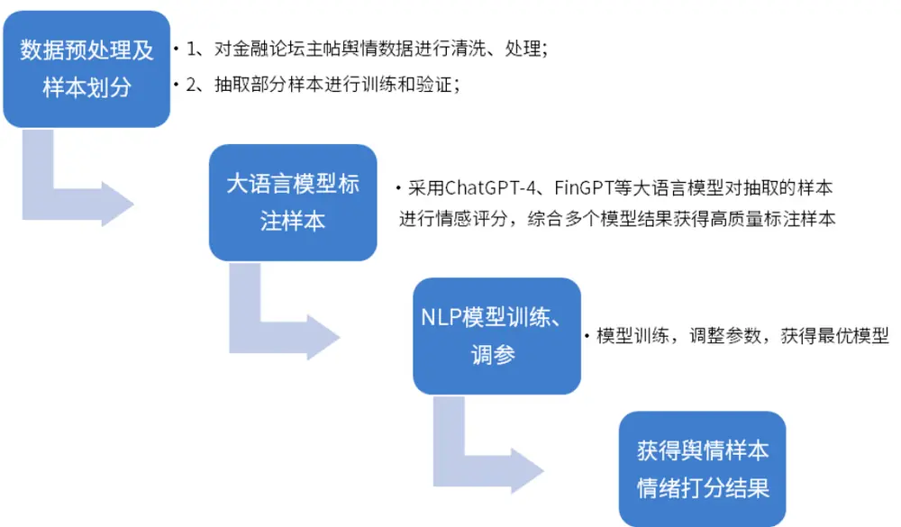
来源：国金证券研究所

## 2.4 数据预处理

1）股评数据中可能会出现一些特定格式文本，利用正则表达式的方式进行删除。

2）主帖下股评数据主要分布在正文与标题中，大多数标题是正文的开头部分的截断内容，或者标题是正文的凝缩，不直接选取于正文，或者标题（正文）没有内容；针对以上情况，我们对标题与正文内容进行合并。

图表4：数据预处理效果展示

| 标题 | 正文 | 合并结果 |
| --- | --- | --- |
| 明天涨停 | 明天涨停 | 明天涨停 |
| 今日形势不错 | 可以考虑入手 | 今日形势不错可以考虑入手 |
|  | 希望大涨 | 希望大涨 |
| 华锦还有一万股但是华锦怎么不如ST股呢？ |  | 华锦还有一万股但是华锦怎么不如ST股呢？ |

来源：子长科技，国金证券研究所

## 2.5 大语言模型标注样本

## 2.5.1 大语言模型具有文本情感分析能力

大语言模型采用复杂的 Transformer 架构，能够捕捉语言的深层特征和模式，具有较强的文本分析能力。大语言模型基于海量数据集进行了预训练，无需标注样本，这些数据集包含了丰富的情感表达，因此拥有较好的泛化能力，能够泛化到新样本，能够帮助我们进行股评信息的情感识别。

在《Sentiment Analysis in the Era of Large Language Models: A Reality Check》这篇论文中，作者对各类大模型譬如 ChatGPT 在情感分类任务上的能力进行了测试，ChatGPT 等大语言模型在情感分类任务上显示出了较好的零样本性能，即大语言模型能够在没有专门针对特定任务训练的情况下，通过理解任务的自然语言指令来执行情感分析任务。

图表5：大语言模型在各类情感分析任务中的零样本性能

| Task | Dataset | Baseline |  | LLM |  |  |  | SLM |
| --- | --- | --- | --- | --- | --- | --- | --- | --- |
|  |  | random | majority = | Flan-T5 (11B) | Flan-UL2 (20B) | text-003 (175B) | ChatGPT (NA) | T5large (770M) |
| Sentiment Classification (SC) |  |  |  |  |  |  |  |  |
| Document- Level | IMDb | 52.40 | 46.80 | 86.60 | 97.40 | 90.60 | 94.20 | 93.93 |
|  | Yelp-2 | 52.80 | 48.00 | 92.20 | 98.20 | 93.20 | 97.80 | 96.33 |
|  | Yelp-5 | 19.80 | 18.60 | 34.60 | 51.60 | 48.60 | 52.40 | 65.60 |
| Sentence- Level | MR | 47.40 | 49.60 | 66.00 | 92.20 | 86.80 | 89.20 | 90.00 |
|  | SST2 | 49.20 | 48.60 | 72.00 | 96.40 | 92.80 | 93.60 | 93.20 |
|  | Twitter | 34.20 | 45.40 | 43.60 | 47.40 | 59.40 | 69.40 | 67.73 |
| Aspect- | SST5 | 21.40 | 22.20 | 15.00 | 57.00 | 45.20 | 48.00 | 56.80 |
|  | Lap14 | 34.80 | 53.80 | 69.00 | 73.20 | 74.60 | 76.80 | 78.60 |
|  | Rest14 | 34.00 | 65.60 | 80.80 | 82.40 | 80.00 | 82.80 | 83.67 |
| Level Average |  | 38.44 | 44.29 | 62.20 | 77.31 | 74.58 | 78.24 | 80.65 |
| Aspect-Based Sentiment Analysis (ABSA) |  |  |  |  |  |  |  |  |
| UABSA | Rest14 | NA | NA | 0.00 | 0.00 | 47.56 | 54.46 | 75.31 |
|  | Rest15 | NA | NA | 0.00 | 0.00 | 35.63 | 40.03 | 65.46 |
|  | Rest16 | NA | NA | 0.00 | 0.00 | 40.85 | 75.80 | 73.23 |
|  | Laptop14 | NA | NA | 0.00 | 0.00 | 28.63 41.43 | 33.14 | 62.35 |
| ASTE | Rest14 Rest15 | NA | NA | 0.00 | 0.00 | 37.53 | 40.04 33.51 | 65.20 57.78 |
|  |  | NA | NA | 0.00 | 0.00 |  |  |  |
|  | Rest16 | NA | NA | 0.00 | 0.00 | 41.03 | 42.18 | 65.94 |
|  | Laptop14 Rest15 | NA | NA | 0.00 | 0.00 | 27.05 13.73 | 27.30 10.46 | 53.69 |
| ASQP | Rest15 | NA NA | NA NA | 0.00 0.00 | 0.00 0.00 | 18.18 | 14.02 | 41.08 50.58 |
|  |  |  | NA | 0.00 | 0.00 | 33.16 | 37.09 | 61.06 |
| Average |  | NA |  |  |  |  |  |  |

来源：《Sentiment Analysis in the Era of Large Language Models: A Reality Check》，国金证券研究所

为了提高样本标注的质量和准确性，避免使用单个大语言模型的评分结果不准确，我们采用两个大模型共同打分相互验证的方式进行样本标注，我们选择了 ChatGPT4 及开源的FinGPT 模型。

FinGPT 是由 AI4Finance-Foundation 开发的一个开源项目，专注于金融领域的大型语言模型，其“V3.1”版本是在中文能力较强的 ChatGLM-6B 基础上进行 LoRA 微调训练而来，其主要四个部分：数据源层：该层确保全面的市场覆盖，通过实时信息捕获解决金融数据的时间敏感性。数据工程层：该层面向实时 NLP 数据处理，解决了金融数据中高时间敏感性和低信噪比的固有挑战。LLMs 层：该层专注于 LoRA 等一系列微调方法，确保了模型的

相关性和准确性。应用层：展示实际应用和演示，凸显 FinGPT 在金融领域的潜在能力。
FinGPT 的训练数据，涵盖金融新闻、社交媒体、上市公司报告、交易所、金融论坛等。

图表6：FinGPT模型结构
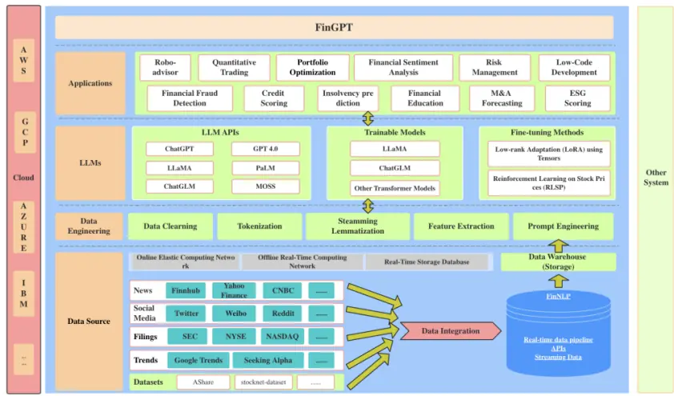
来源：《FinGPT: Open-Source Financial Large Language Models》，国金证券研究所

## 2.5.2 大模型进行样本标注的步骤

首先，从主帖数据集中随机抽取 4 万条股评数据，作为预备标注训练集。然后我们利用大语言模型对以上 4 万条数据集进行情感分类标注，情感分类为“积极”、“消极”、“中性”三分类。

经测试，大模型对于情感倾向比较明显的股评都较为准确，对股评情感情感倾向不明显股评则可能出现标注错误，所以，大模型对“中性”情感识别能力有待进一步提高。

我们利用大语言模型的标注结果与子长科技 LKM 的标注结果生成最终情感标签：当两个大语言模型都标注“积极”标签时，我们将股评标注为“积极”，当两个大语言模型都标注“消极”标签时，我们将股评标注为“消极”；为提高股评“中性”标注质量，我们结合大语言模型的标注结果与子长科技 LKM 的标注结果，当它们都标注“中性”时，我们才将“股评”标注为“中性”标签。

最终，筛选出 26618 条数据，其中，“消极”标签占比 51.02%，“积极”标签占比 25.65%，“中性”标签占比 23.33%。

图表7：标注样本中各类情绪帖子占比
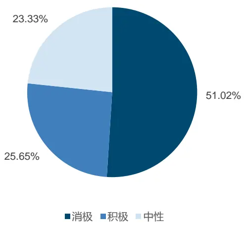
来源：子长科技，ChatGPT，FinGPT，国金证券研究所

## 2.6 文本情感分析模型的选择与构建

## 2.6.1 文本情感分析模型的演变

最早的情感分析方法为基于情感词典的文本情感分类模型，通过匹配文本中的词汇与词典中的条目，可以对文本的情感倾向进行判断。基于规则的方法通过预定义的逻辑和规则来识别和计算文本中的情感倾向，如某类情感词的出现频率。随着机器学习技术的发展，文本情感分析开始采用朴素贝叶斯、支持向量机（SVM）等算法，深度学习技术的发展，如卷积神经网络模型（CNN）也逐渐为文本情感分析提供了新的方法。基于 Transformer 架构的模型，如 BERT（Bidirectional Encoder Representations from Transformers），在自然语言处理领域取得了显著的成果。BERT 模型通过预训练和微调策略，在情感分析任务上展现了优异的性能

## 2.6.2 模型选择：BERT-TextCNN 模型

结合文献阅读，我们构建了 BERT-TextCNN 模型进行金融论坛的舆情文本情感分析，BERT通常用于提取文本的深层次语义信息和上下文信息，而 TextCNN 则用于捕捉文本的局部特征，两者结合可以同时利用全局和局部特征进行文本分类。

BERT-TextCNN 模型流程分为以下三步骤：

1）基于 Bert 预训练模型的特征学习过程：将预处理后的金融论坛主帖数据经嵌入层输入Bert 模型，输出特征向量 B，经过整合得到语义特征 F；

2）基于卷积神经网络的特征学习过程：对步骤一中得到的语义特征 F 进行局部特征提取，通过卷积层、池化层、全连接层和 dropout 层输出特征向量 H；

3）情感倾向分析过程：对步骤二中得到的特征向量 H，通过 softmax 层得到情感倾向三分类结果。

图表8：BERT-TextCNN模型结构
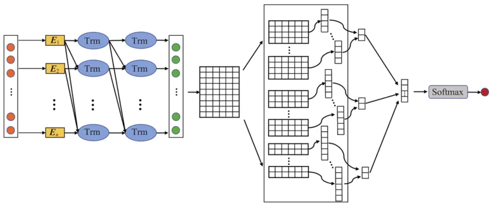
来源：《A sentiment analysis method based on FinBERT-CNN for Guba stock forum.》，国金证券研究所

Bert 模型的全称为 Birectional Encoder Representation from Transformers，即双向Transformer 的 Encoder,基础版本有 12 层，进阶版本有 24 层。每一层都是同时关乎上下文，同时 transformer 可以对句子有更强的特征提取能力。每一层 transformer 架构都由多头自注意力机制和前馈神经网络组成。Bert 模型是一个两阶段模型，第一阶段 pre-tuning（预训练），第二阶段 fine-tuning（微调）。在预训练阶段，对大量样本进行无监督学习，模型利用 Masked LM 任务学习词向量，利用 Next Sentence Prediction 任务学习句向量。在微调阶段，预训练模型最后加上输出层组成新的模型，模型的参数由预训练模型的参数权重进行初始化，而后根据下游任务有监督数据进行训练。

图表9：Bert模型的结构
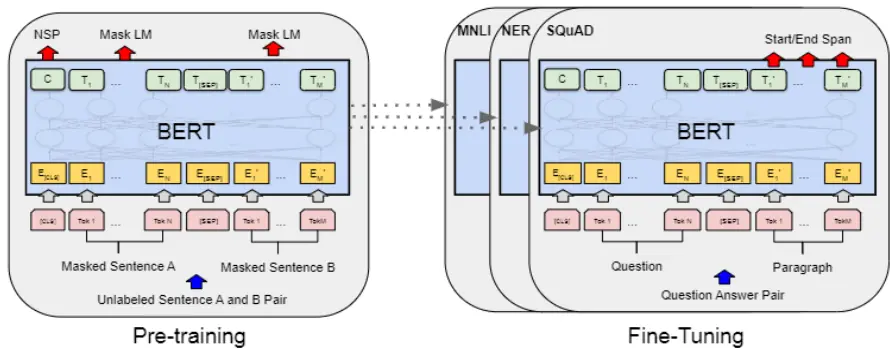
来源：《BERT: Pre-training of Deep Bidirectional Transformers for Language Understanding》，国金证券研究所

增加模型大小通常会导致下游任务性能的提高，但由于 GPU/TPU 内存限制和更长的训练时间，增加模型大小较为困难。Google 推出了 albert 模型，以降低内存消耗并提高训练速度。ALBERT 采用了两种参数减少技术，这些技术消除了扩大预训练模型规模时的主要障碍。第一种技术是因式分解的嵌入参数化：通过将大型词汇嵌入矩阵分解为两个较小的矩阵，开发者将隐藏层的大小与词汇嵌入的大小分离开来。这种分离使得在不显著增加词汇嵌入的参数大小时，更容易增加隐藏层的大小。第二种技术是跨层参数共享。这种技术防止了参数随着网络深度的增加而增长。这两种技术显著减少了 BERT 的参数数量，而没有严重影响性能，从而提高了参数效率。一个类似 BERT-large 配置的 ALBERT 模型，参数量几乎是 BERT-large 模型的十八分之一，并且可以以大约 1.7 倍的速度进行训练。

我们使用了经过改进的 Bert 模型，即 ALBERT 模型系列中的 albert_chinese_small，该模型是 albert 中的 small 版本，旨在减少模型的参数量，同时保持或提高模型的性能。albert_chinese_small 模型是在海量中文语料上预训练的，专门为中文语言设计和优化。

图表10：Bert VS AIbert 模型的参数量对比

| Model |  | Parameters | Layers | Hidden | Embedding | Parameter-sharing |
| --- | --- | --- | --- | --- | --- | --- |
| BERT | base | 108M | 12 | 768 | 768 | False |
|  | large | 334M | 24 | 1024 | 1024 | False |
| ALBERT | base | 12M | 12 | 768 | 128 | True |
|  | large | 18M | 24 | 1024 | 128 | True |
|  | xlarge | 60M | 24 | 2048 | 128 | True |
|  | xxlarge | 235M | 12 | 4096 | 128 | True |

来源：《ALBERT: A LITE BERT FOR SELF-SUPERVISED LEARNING OF LANGUAGE REPRESENTATIONS》，国金证券研究所

2014 年，Yoon Kim 对 CV 领域的 CNN 进行变形，提出了文本分类模型 TextCNN 模型。TextCNN 模型的核心思想是抓取文本的核心特征：先将文本分词进行 embedding 得到的词向量（嵌入层），将词向量经过不同的卷积核尺寸来提取文本的 N-gram 信息（卷积层），然后通过最大池化操作来突出各个卷积操作提取的最关键信息（池化层），拼接后通过全连接层对特征进行组合，最后将输出连接 softmax 层做分类。TextCNN 模型的优势在于模型结构简单，参数量少，训练速度快，能够有效的提取局部特征。

图表11：TextCNN模型结构
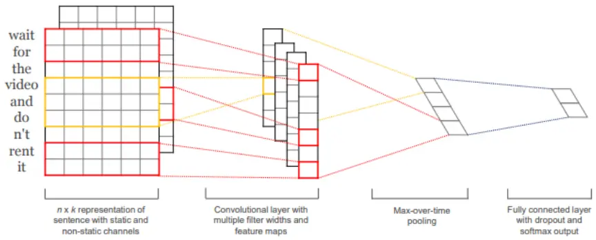
来源：《Convolutional Neural Networks for Sentence Classification》，国金证券研究所

## 2.7 模型训练及金融论坛舆情信息的文本情感分类结果

我们按照 8:2 的比例划分训练集和测试集，BERT-TextCNN 模型在中证 1000 金融论坛舆情信息情感识别任务中样本外的准确率为 85.52%。

我们利用训练好的 BERT-TextCNN 模型对主帖数据集中的超过 5000 万条股评数据重新进行情感评分与分类。

图表12：情感分类结果样例

| 股评 | 情感分类 |
| --- | --- |
| 加速度暴跌浦发银行故意拉指数掩护出逃 | 消极 |
| 期待3月份的复盘，振业一定会一炮冲天，每个参入者会收获满满，预测 35—40 元左右… | 积极 |
| 有没有人打过振业公司客服电话？年前能复盘吗？ | 中性 |

来源：子长科技，国金证券研究所

经统计，在 BERT-TextCNN 模型标注下，2018 年-2023 年中证 1000 指数成分股的股评主帖数据中，“积极”标签占比 26.66%，“消极”标签占比 50.09%，“中性”标签占比 23.24%。由于中性标签无法提供有效信息，我们将使用“积极”标签与“消极”标签构建选股因子。

图表13：BERT-TextCNN模型标注结果各类型占比
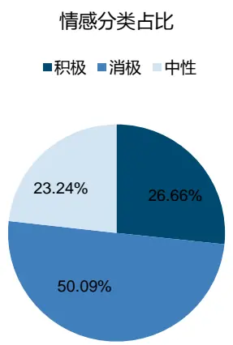
来源：子长科技，国金证券研究所

## 3、多维度舆情因子构建与回测

## 3.1 样本预处理

基于文本情感评分结果，我们将股民发帖文本对应到股票上，以便进行选股因子的构建，对已标注样本进行了如下处理：

1）根据子长科技提供的标签，去掉新闻、上市公司公告、董秘回复等与股民情绪不相关的信息；

2）核对股票与帖子的对应关系：

（1）论坛对应的股票与帖子中提及的股票一致时，将主帖与论坛股票代码对应；

（2）帖子中未提及股票，将主帖与论坛股票代码对应；

（3）帖子中提及的股票与其所在论坛的股票代码不一致，不保留这部分样本。

图表14：单只股票对应帖子数量周平均值（向前7天滚动计算）
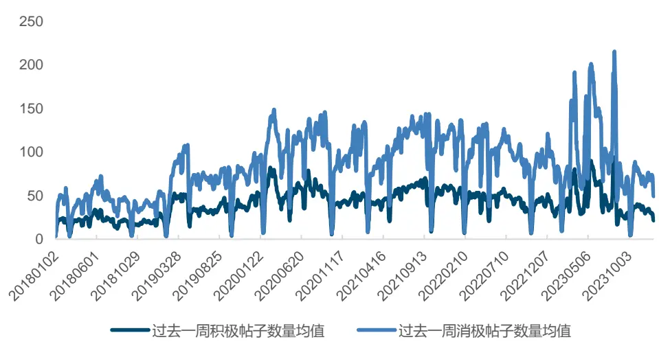
来源：子长科技，国金证券研究所

## 3.2 周频舆情选股因子计算方式与回测方法介绍

金融论坛的用户在节假日、盘后仍然可能会发帖，因此我们构建的周频选股因子，使用了t-7 日至 t-1 日的发帖数据，作为 t 日（周初）的选股因子。

图表15：周频舆情选股因子计算方式
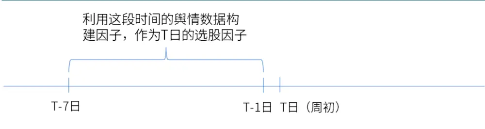
来源：国金证券研究所

为了评估选股因子的有效性，我们采用因子 IC 测试和构建分位数组合的方法进行研究。因子IC测试主要研究因子取值与下一期收益率的相关性。其中，Rank表示计算变量排序，$X_{t,m}$ 表示因子取值， $r_{t+1,m}$ 表示下一期股票的收益率。IC 的绝对值越高，因子的下期收益率的预测能力越强。

$$
RankIC_{t}=corr(Rank(X_{t,m}),Rank(r_{t+1,m}))
$$

对于分位数组合测试，我们按照因子值从高到低，将股票分为 10 组，分别等权构建 Top组合至 Bottom 组合，做多组合 Top 同时做空组合 Bottom，得到多空组合（L-S组合），通过该组合的表现来衡量因子的预测能力。回测频率为周频，调仓时点为每周第一个交易日，以开盘价进行回测，回测时间区间为 2018 年 1 月 8 日至 2023年 12月 29日。选股时，在中证 1000 指数成分股中进行筛选，并剔除 ST 及涨跌停板股票。

## 3.3 多维度舆情因子构建

## 3.3.1 整体思路

我们利用金融论坛舆情信息文本情感评分结果，从多维度构建了舆情选股因子，包括情绪一致性、关注度、周内关注度波动、整体情绪、周内情绪波动等因子。

图表16：舆情选股因子分类
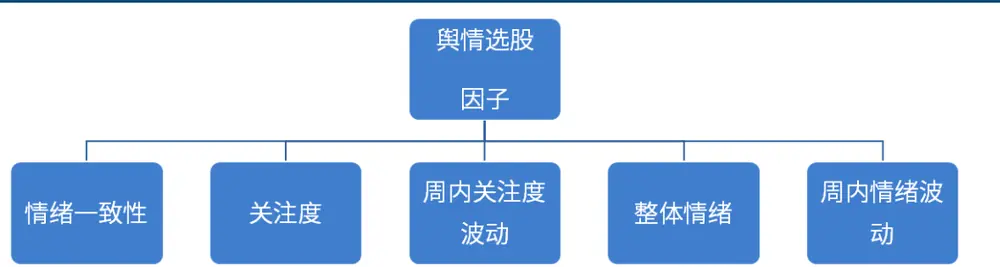
来源：国金证券研究所

## 3.3.2 情绪一致性因子对未来股价的影响

我们用周度积极主帖占总帖子数量比与消极主帖占总帖子数量比来刻画股民情感的一致性。积极帖子占比较高，说明在该时间区间内针对该股票的帖子中，股民积极的情绪较为一致。而如果消极帖子占比高，说明在该时间区间内针对该股票的帖子中，股民的消极情绪较为一致。

我们对积极帖子占比因子与消极帖子占比因子进行回测，发现积极帖子占比因子与消极帖子占比因子均是显著的，但 IC 的正负有所差异。积极帖子占比因子的 IC 均值为-2.24%，即如果过去一周内股民情绪积极性较为一致，未来股票表现可能会较差。而消极帖子占比因子的 IC 值为 1.50%，即如果过去一周年股民情绪消极性较为一致，未来股票表现可能会比较好。积极帖子占比因子的表现要好于消极帖子占比因子。

在中证 1000 股票池中，情感一致性可能会带来股价反转。

图表17：情感一致性因子IC测试及分位数组合测试结果

| 因子 | IC 均值 标准差 |  | 最小值 | 最大值 | 风险调整的IC t 统计量 |  | 多空年化收 | 多空夏普 | 多空最大 | top 组合超 |
| --- | --- | --- | --- | --- | --- | --- | --- | --- | --- | --- |
|  |  |  |  |  |  |  | 益率 | 比率 | 回撤率 | 额收益率 |
| 消极帖子占比 | 1.50% | 8.38% | -20.71% | 29.32% | 0.18 | 3.12 | 7.37% | 0.66 | 12.13% | 6.03% |
| 积极帖子占比 | -2.24% | 8.09% | -28.74% | 19.89% | -0.28 | -4.83 | 10.68% | 1.09 | 16.19% | 7.69% |

来源：子长科技，Wind，国金证券研究所

图表18：积极帖子占比因子分位数组合表现（升序）
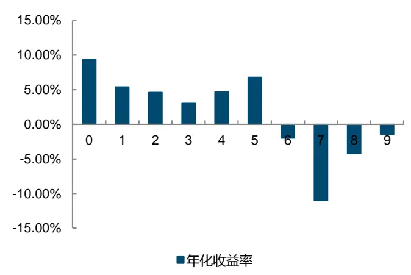
来源：子长科技，Wind，国金证券研究所

图表19：积极帖子占比因子多空组合表现（升序）
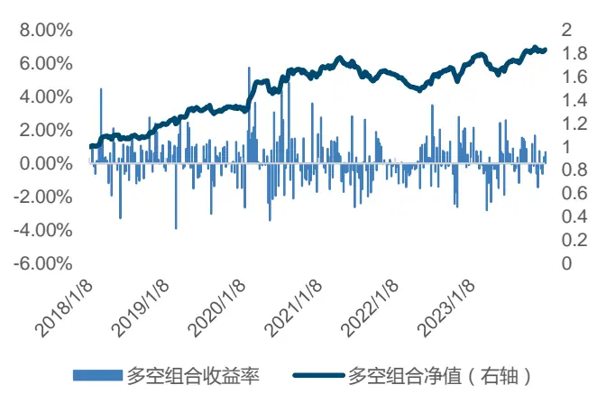
来源：子长科技，Wind，国金证券研究所

图表20：消极帖子占比因子分位数组合表现
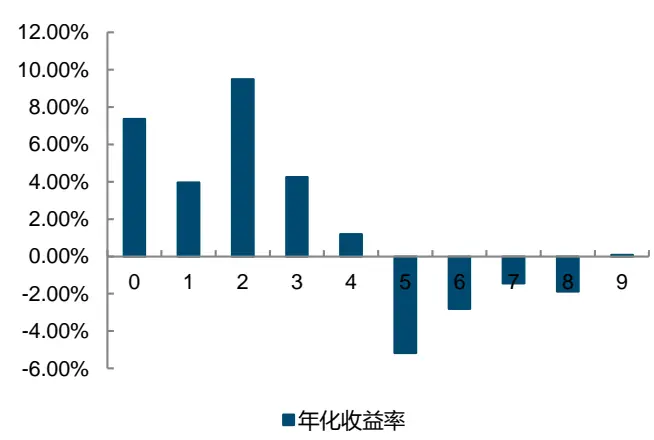
来源：子长科技，Wind，国金证券研究所

图表21：消极帖子占比因子多空组合表现
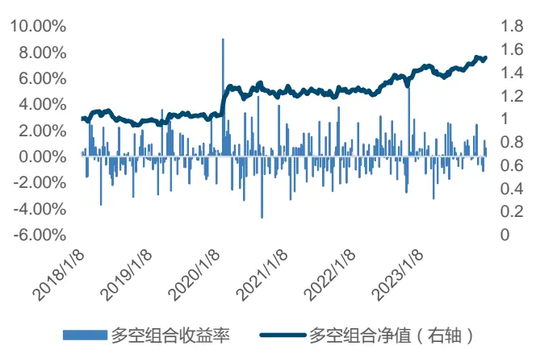
来源：子长科技，Wind，国金证券研究所

## 3.3.3 关注度高的股票未来可能会发生反转

我们可以用主帖数量来刻画股票的关注度，发帖数量越多，说明关注该股票的股民越多。但主帖情绪有多种类别，从前面情感一致性因子的表现来看，虽然积极与消极占比因子均是显著的，但积极情绪占比因子的表现要明显优于消极占比因子，因此不同类型的帖子数量，可能有不同的选股效果。

我们将主帖数量拆分成积极主帖数量与消极主帖数量，分别测试其选股效果。经测试，使用积极帖子数量刻画的关注度因子表现最佳，IC均值达到-6.22%，风险调整的IC为-0.60，t 统计量为 10.39，多空组合年化收益率也达到了 59.41%。

因此，在中证 1000 指数成分股的股票池中，股民的高关注度可能会带来股价的反转，过去一周内关注度越高的股票，未来股价可能越差。

图表22：关注度因子IC测试结果即分位数组合表现

| 因子 | IC 均值 | 标准差 | 最小值 | 最大值 | 风险调整的IC t 统计量 |  | 多空年化收多空夏普 |  |  | 多空最大回 top 组合超 额收益率 |
| --- | --- | --- | --- | --- | --- | --- | --- | --- | --- | --- |
|  |  |  |  |  |  |  | 益率 | 比率 | 撤率 |  |
| 主帖数量 | -5.94% | 10.76% | -39.19% | 22.78% | -0.55 | -9.62 | 52.35% | 3.02 | 17.17% | 11.51% |
| 消极帖子数量 | -5.74% | 10.54% | -35.12% | 24.41% | -0.54 | -9.49 | 43.15% | 2.78 | 7.65% | 9.73% |
| 积极帖子数量 | -6.22% | 10.44% | -39.72% | 17.52% | -0.60 | -10.39 | 59.41% | 3.70 | 13.45% | 11.92% |

来源：子长科技，Wind，国金证券研究所

图表23：积极帖子数量因子分位数组合表现（升序）
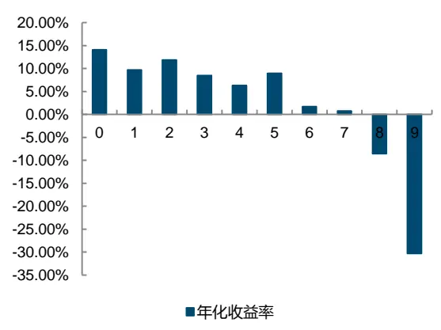
来源：子长科技，Wind，国金证券研究所

图表24：积极帖子数量因子多空组合表现（升序）
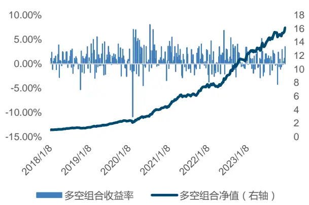
来源：子长科技，Wind，国金证券研究所

## 3.3.4 关注度的波动对股价的影响

我们对周内每日关注度（积极数量、消极数量）计算了方差，如果因子值较大，说明股票的关注度发生了波动，并不是持续受到高关注或者低关注。

经测试，关注度的方差因子，IC 均为负值，即过去一周内关注度波动较大的股票，未来表现可能相对较差，而过去一周内关注度较为稳定的股票，未来表现可能相对较好。

图表25：关注度波动因子IC测试及分位数组合测试结果

| 因子 | 平均值 | 标准差 | 最小值 |  | 最大值 风险调整的IC t统计量 |  | 益率 | 比率 | 多空年化收 多空夏普多空最大回 top 组合超额收 撤率 | 益率 |
| --- | --- | --- | --- | --- | --- | --- | --- | --- | --- | --- |
| 积极数量 周方差 | -6.55% | 9.56% | -35.52% | 14.74% | -0.68 | -11.94 | 60.19% | 4.02 | 10.40% | 11.25% |
| 消极数量 周方差 | -5.75% | 9.91% | -32.10% | 20.40% | -0.58 | -10.12 | 50.81% | 3.47 | 5.99% | 7.51% |

来源：子长科技，Wind，国金证券研究所

## 3.3.5 股民整体情绪对股价的影响

我们用积极主帖数量减去消极主帖数量，来刻画股民对某一只股票的整体情绪。一周内积极主帖数量相比于消极主帖数量越多，这周整体的情绪越乐观。

我们对这一因子进行了测试，整体情绪因子 IC 均值大于 0，为 3.89%，风险调整的 IC 为0.39，t 统计量为 6.89。这说明，股民整体情绪越积极，未来一周股票表现越好。

但该因子的分位数组合并不严格单调，因子值最高即最乐观的那一组，并没有表现出最好的收益率，但最悲观的那一组，收益最差。但情绪乐观的股票组合的收益仍高于情绪悲观的股票组合。

图表26：整体情绪因子IC测试及分位数组合测试结果

| 因子 | IC 均值 标准差 |  | 最小值 |  | 最大值 风险调整的IC t统计量 |  | 多空年化收 多空夏普多空最大 top 组合超 |  |  |  |
| --- | --- | --- | --- | --- | --- | --- | --- | --- | --- | --- |
|  |  |  |  |  |  |  | 益率 | 比率 | 回撤率 | 额收益率 |
| 积极数量-消极数量 | 3.89% | 9.85% | -26.57% | 28.18% | 0.39 | 6.89 | 26.06% | 1.93 | 10.59% | 1.46% |

来源：子长科技，Wind，国金证券研究所

图表27：整体情绪因子分位数组合表现
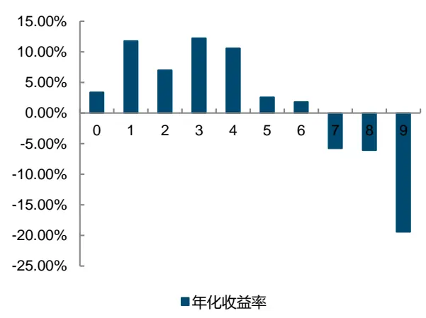
来源：子长科技，Wind，国金证券研究所

图表28：整体情绪因子多空组合表现
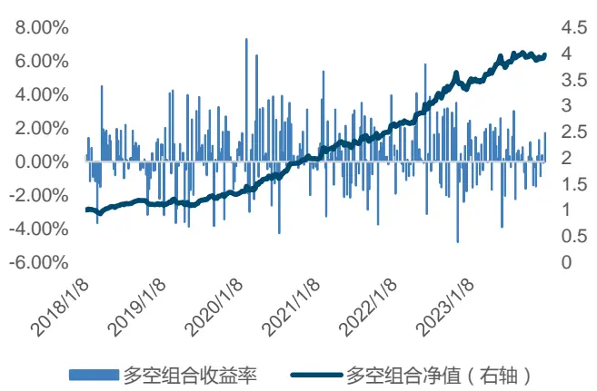
来源：子长科技，Wind，国金证券研究所

## 3.3.6 情绪变化可能会导致股价反转

基于整体情绪因子，我们对过去一周内每日的情绪值（即日度的积极帖子数量-消极帖子数量），计算最大值与最小值，最终计算出周内情绪极值，即周内情绪指标最大值与最小值的差。这一指标越大，说明情绪波动较大，这一指标越小，说明周内情绪稳定。

我们对这一因子进行了测试，整体情绪周内极值因子 IC 均值小于 0，为-5.42%，风险调整的 IC 为 0.55，t 统计量为-9.61，多空年化收益率为 42.79%，多空夏普比率达到 2.74。这说明，过去一周内股民整体情绪波动越大，未来一周股票表现越差。

图表29：整体情绪周内极值因子IC测试及分位数组合测试结果

| 因子 |  | IC 均值 标准差 | 最小值 |  | 最大值 风险调整的IC t 统计量 |  | 多空年化收 多空夏普比 多空最大回 top 组合超额 |  | 撤率 | 收益率 |
| --- | --- | --- | --- | --- | --- | --- | --- | --- | --- | --- |
|  |  |  |  |  |  |  | 益率 | 率 |  |  |
| 整体情绪周 内极值 | -5.42% | 9.84% | -31.63% | 21.21% | -0.55 | -9.61 | 42.79% | 2.74 | 14.69% | 10.10% |

来源：子长科技，Wind，国金证券研究所

图表30：情绪周内极值因子分位数组合表现（升序）
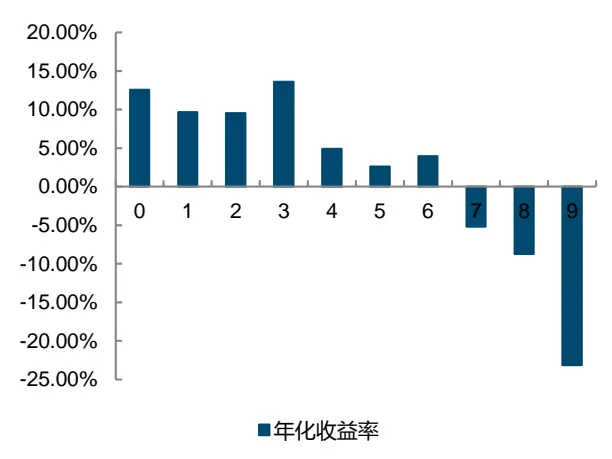
来源：子长科技，Wind，国金证券研究所

图表31：情绪周内极值因子多空组合表现（升序）
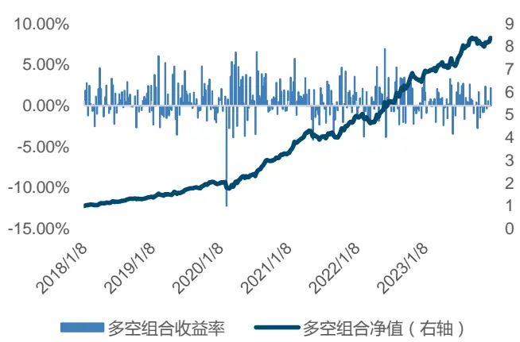
来源：子长科技，Wind，国金证券研究所

## 3.4 多因子合成与测试

综上，我们已经从情绪一致性、关注度、关注度波动、整体情绪、情绪波动等五个角度构建了 9 个选股因子。我们最终从每个维度中选择了一个因子进行因子合成。最终选择的因子是：积极帖子占比、积极帖子数量、积极数量周方差、整体情绪、整体情绪波动五个因子。我们首先将因子进行标准化处理后，然后进行等权重的合成。

图表32：各因子相关性

| spearman相关性 | 整体情绪 | 整体情绪周内极值 | 积极帖子占比 | 积极帖子数量 | 积极数量周方差 |
| --- | --- | --- | --- | --- | --- |
| 整体情绪 | 1.00 | -0.77 | 0.46 | -0.53 | -0.46 |
| 整体情绪周内极值 | -0.77 | 1.00 | -0.08 | 0.77 | 0.69 |
| 积极帖子占比 | 0.46 | -0.08 | 1.00 | 0.30 | 0.26 |
| 积极帖子数量 | -0.53 | 0.77 | 0.30 | 1.00 | 0.90 |
| 积极数量周方差 | -0.46 | 0.69 | 0.26 | 0.90 | 1.00 |

来源：Wind，子长科技，国金证券研究所

我们对合成因子进行了测试，合成因子 IC 达到 6.13%，风险调整的 IC 为 0.71，t 统计量达到 12.4，多空年化收益率为 54.76%，多空组合夏普比率为 4.07，而多空组合最大回撤率为 9.02%。

合成因子分位数组合单调性较好，top 组合的年化超额收益率能够达到 12.99%。

图表33：合成因子IC测试及分位数组合测试结果

| 因子 | IC 均值 标准差 |  |  | 最小值 最大值 | 风险调整 |  |  | t统计量 多空年化收益率多空夏普比率多空最大回撤率 |  | top 组合超额年 化收益率 |
| --- | --- | --- | --- | --- | --- | --- | --- | --- | --- | --- |
|  |  |  |  |  |  | 的IC |  |  |  |  |
| 合成因子 | 6.13% | 8.62% | -21.80% 31.66% |  | 0.71 | 12.4 | 54.76% | 4.07 | 9.02% | 12.99% |

来源：Wind，子长科技，国金证券研究所

图表34：合成因子分位数组合表现
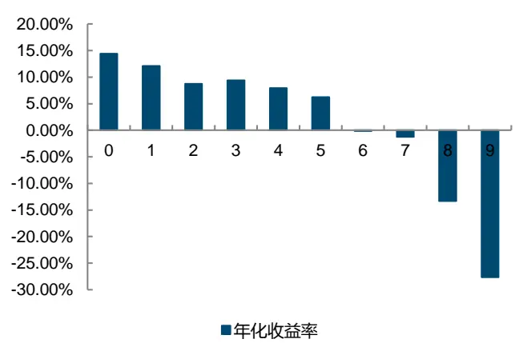
来源：Wind，子长科技，国金证券研究所

图表35：合成因子多空组合表现
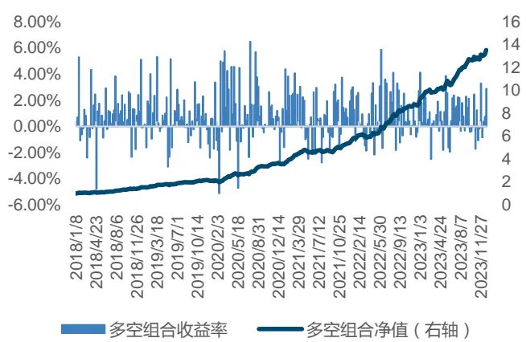
来源：Wind，子长科技，国金证券研究所

## 3.5 舆情因子与传统选股因子的相关性较低

基于金融论坛舆情数据的选股因子与成长、动量、价值、质量、波动率、分析师一致预期、技术等传统因子相关性较低，相关系数均不超过 0.3，因子基于金融论坛舆情数据的选股因子是传统选股因子的较好补充，有利于提供额外的信息。此外，舆情合成因子与流通市值因子的相关性较低，相关系数为-0.18。

图表36：合成因子与传统选股因子的相关系数
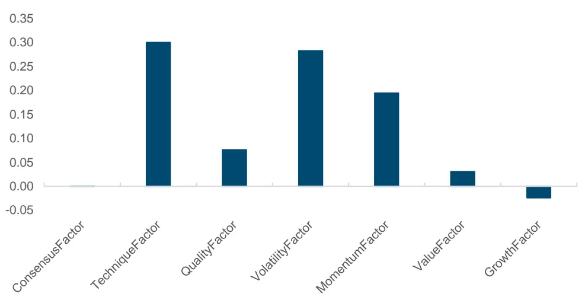
来源：Wind，子长科技，国金证券研究所

## 3.6 因子覆盖度

基于金融论坛股民舆情信息的选股因子作为另类数据，并不能 100%覆盖中证 1000 指数成分股，但从 2018 年以来，因子对中证 1000 指数成分股的覆盖度逐渐提高。至 2023 年年末目前已经能够覆盖 800-900 只股票。由于我们在因子合成时要求各个单因子均不是空值，合成因子覆盖程度略有下降。

图表37：主帖数量因子对中证1000成分股的覆盖（只）
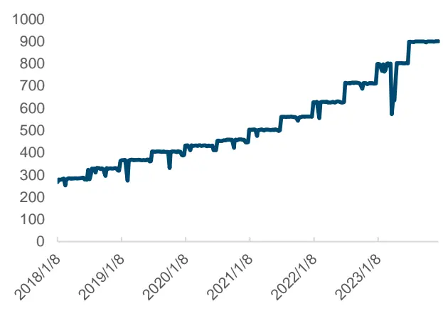
来源：Wind，子长科技，国金证券研究所

图表38：合成因子对中证1000指数成分股的覆盖（只）
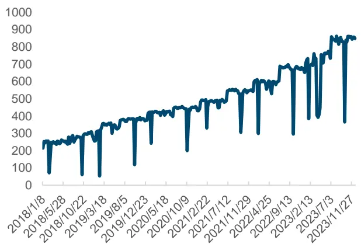
来源：Wind，子长科技，国金证券研究所

## 4、基于金融论坛多维度舆情因子的中证1000指数增强策略构建

## 4.1 基于金融论坛多维度舆情因子的中证 1000指数增强策略构建方法

我们基于如下条件构建了中证 1000 指数增强策略：

1）选股范围：中证 1000 指数成分股

2）回测时间区间：2018.1.8-2023.12.29

3）调仓频率：周度调仓，每周第一个交易日进行调仓，按开盘价进行交易

4）选股方式：调仓日根据合成舆情因子值从大到小进行排序，选择前 10%的股票等权重构建组合

5）交易成本：单边千分之二

6）换手率缓冲：由于我们构建的是周频选股策略，为了控制策略换手率，我们设置了换手率缓冲条件，即上期持仓中如果当期仍然在前 0%与 35%内，则保留。

## 4.2 基于金融论坛多维度舆情因子的中证 1000指数增强策略表现

基于金融论坛多维度舆情因子的中证 1000 指数增强策略，自 2018 年初至 2023 年末，获得 10.85%的年化收益率，相对于中证 1000 指数获得了 13.95%的年化超额收益率，信息比率达到 1.56，超额净值最大回撤率为 9.52%。策略周度平均双边换手率为 93.41%。

图表39：选股策略指标统计

| 统计指标 | 中证1000 舆情增强策略 | 中证1000 指数 |
| --- | --- | --- |
| 总收益率 | 85.08% | -18.10% |
| 年化收益率 | 10.85% | -3.28% |
| 年化波动率 | 21.87% | 22.85% |
| 夏普比率 | 0.50 | -0.14 |
| 最大回撤率 | 35.25% | 42.27% |
| 年化超额收益率 | 13.95% | -- |
| 信息比率 | 1.56 | -- |
| 超额最大回撤率 | 9.52% | -- |
| 周平均换手率（双边） | 93.41% | -- |

来源：Wind，子长科技，国金证券研究所

图表40：中证1000舆情增强策略表现
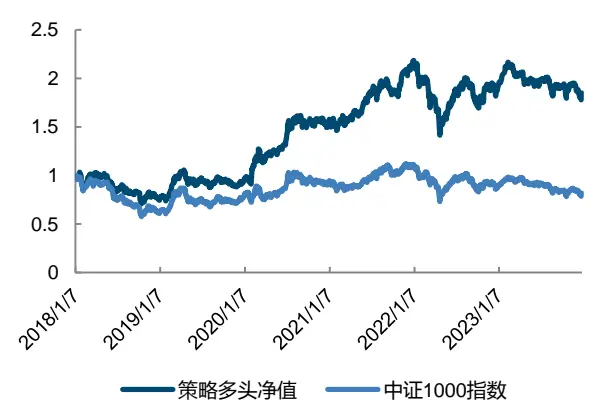
来源：Wind，子长科技，国金证券研究所

图表41：中证1000舆情增强策略超额净值表现
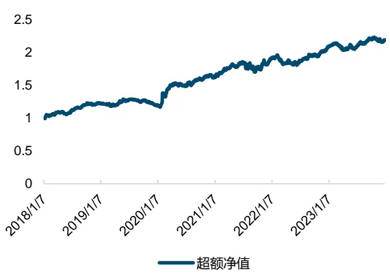
来源：Wind，子长科技，国金证券研究所

基于金融论坛舆情因子的选股策略超额净值稳定增长，除 2019 年之外，在其余各年份均获得了正超额收益率。2018 年至 2023 年的超额收益率分别为 22.92%、-2.30%、35.90%、16.52%、9.60%和 4.71%

图表42：策略分年度表现
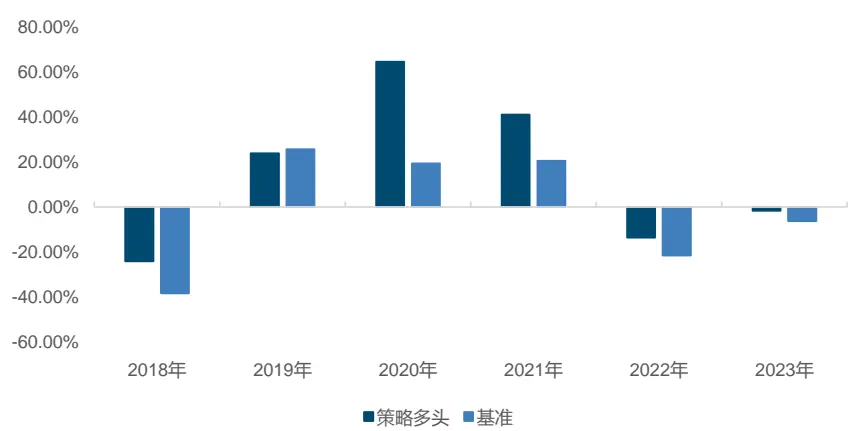
来源：Wind，子长科技，国金证券研究所

## 5、总结

大模型的诞生和不断进化为我们带来了文本情感分析的新工具，通过大语言模型进行训练样本标注，结合传统文本情感分析模型，能够帮助我们对舆情信息进行分析，对传统选股策略进行有效的补充。

我们利用基于中证 1000 指数成分股的金融论坛的主帖数据，采用 ChatGPT4 和开源的FinGPT 共同进行样本标注，将获得的高质量标注样本作为训练样本，构建了 BERT-TextCNN模型，将金融论坛主帖数据标记为积极、消极、中性三种情感。

我们利用情感评分结果，从多维度构建了舆情选股因子，包括情感一致性、关注度、周内关注度波动、整体情绪、周内情绪波动等因子，并进行了 IC 测试和分位数组合测试。

在中证 1000 指数成分股的股票池中，情感一致性可能会导致未来股价反转。如果过去股民发帖中，积极主帖数量占比高，即股民一致乐观，未来股价可能会出现反转。关注度越高的股票，未来股价可能会出现反转。而过去一周内关注度波动越大，关注度不稳定，那么未来股价可能表现较差。股民整体情绪越积极，未来股价可能会越好。我们用积极数量-消极数量的指标来刻画股民对某一只股票的整体情绪。而一周内情绪波动越大，未来的股价可能表现较差。

我们综合了多维度的舆情因子构建了合成因子，周频测试，回测时间区间为 2018 年 1 月至 2023 年 12 月，合成因子的 IC 达到 6.13%，分位数组合单调性较好。综合的舆情因子与传统选股因子相关性较低，是对传统选股策略的良好补充，能够贡献额外的信息。

基于综合的舆情因子构建的中证 1000 指数增强策略，获得了 13.95%的年化超额收益率，信息比率为 1.56，除 2019 年之外，其余各年份均获得了正的超额收益率。

## 6、风险提示

1）以上结果通过历史数据统计和测算完成，在市场环境发生变化时模型存在失效的风险。

2）策略结果基于一定的假设条件进行回测，在回测条件发生变化时，结果可能不同。

3）大语言模型对文本进行情感分析的结果具有一定的随机性，存在一定的随机性风险。

## 特别声明：

国金证券股份有限公司经中国证券监督管理委员会批准，已具备证券投资咨询业务资格。

形式的复制、转发、转载、引用、修改、仿制、刊发，或以任何侵犯本公司版权的其他方式使用。经过书面授权的引用、刊发，需注明出处为“国金证券股份有限公司”，且不得对本报告进行任何有悖原意的删节和修改。

本报告的产生基于国金证券及其研究人员认为可信的公开资料或实地调研资料，但国金证券及其研究人员对这些信息的准确性和完整性不作任何保证。本报告反映撰写研究人员的不同设想、见解及分析方法，故本报告所载观点可能与其他类似研究报告的观点及市场实际情况不一致，国金证券不对使用本报告所包含的材料产生的任何直接或间接损失或与此有关的其他任何损失承担任何责任。且本报告中的资料、意见、预测均反映报告初次公开发布时的判断，在不作事先通知的情况下，可能会随时调整，亦可因使用不同假设和标准、采用不同观点和分析方法而与国金证券其它业务部门、单位或附属机构在制作类似的其他材料时所给出的意见不同或者相反。

本报告仅为参考之用，在任何地区均不应被视为买卖任何证券、金融工具的要约或要约邀请。本报告提及的任何证券或金融工具均可能含有重大的风险，可能不易变卖以及不适合所有投资者。本报告所提及的证券或金融工具的价格、价值及收益可能会受汇率影响而波动。过往的业绩并不能代表未来的表现。

客户应当考虑到国金证券存在可能影响本报告客观性的利益冲突，而不应视本报告为作出投资决策的唯一因素。证券研究报告是用于服务具备专业知识的投资者和投资顾问的专业产品，使用时必须经专业人士进行解读。国金证券建议获取报告人员应考虑本报告的任何意见或建议是否符合其特定状况，以及（若有必要）咨询独立投资顾问。报告本身、报告中的信息或所表达意见也不构成投资、法律、会计或税务的最终操作建议，国金证券不就报告中的内容对最终操作建议做出任何担保，在任何时候均不构成对任何人的个人推荐。

在法律允许的情况下，国金证券的关联机构可能会持有报告中涉及的公司所发行的证券并进行交易，并可能为这些公司正在提供或争取提供多种金融服务。

本报告并非意图发送、发布给在当地法律或监管规则下不允许向其发送、发布该研究报告的人员。国金证券并不因收件人收到本报告而视其为国金证券的客户。本报告对于收件人而言属高度机密，只有符合条件的收件人才能使用。根据《证券期货投资者适当性管理办法》，本报告仅供国金证券股份有限公司客户中风险评级高于 C3 级(含 C3 级）的投资者使用；本报告所包含的观点及建议并未考虑个别客户的特殊状况、目标或需要，不应被视为对特定客户关于特定证券或金融工具的建议或策略。对于本报告中提及的任何证券或金融工具，本报告的收件人须保持自身的独立判断。使用国金证券研究报告进行投资，遭受任何损失，国金证券不承担相关法律责任。

若国金证券以外的任何机构或个人发送本报告，则由该机构或个人为此发送行为承担全部责任。本报告不构成国金证券向发送本报告机构或个人的收件人提供投资建议，国金证券不为此承担任何责任。

此报告仅限于中国境内使用。国金证券版权所有，保留一切权利。

上海

电话：021-80234211

北京

电话：010-85950438

深圳

邮箱：researchsh@gjzq.com.cn

电话：0755-86695353

邮箱：researchbj@gjzq.com.cn

邮箱：researchsz@gjzq.com.cn

邮编：201204

地址：上海浦东新区芳甸路 1088 号

邮编：518000

紫竹国际大厦 5 楼

邮编：100005

地址：北京市东城区建内大街 26 号

新闻大厦 8 层南侧

地址：深圳市福田区金田路 2028 号皇岗商务中心

18 楼 1806

【小程序】国金证券研究服务

【公众号】国金证券研究