证券研究报告

金融工程组

分析师：高智威(执业 S1130522110003)

分析师：王小康(执业 S1130523110004)

gaozhiw@gjzq.com.cn

wangxiaokang@gjzq.com.cn

## 排序学习对 GRU 选股模型的增强

## 融入注意力机制的GRU表现优异

目前神经网络主流的三类编码器 RNN,CNN,Transformer 在量化选股领域均表现出了较强的预测效果，如何能使各类编码器发挥自身优势并有效结合成为学术界不断尝试的领域。我们参考 DA-RNN 两阶段注意力机制的设计思路，避免该模型在实际应用中潜在的问题，将注意力机制改为特征层面的权重分配，与 GRU 结合后具有明显的优势，在绝大部分指标上超越原本 GRU 模型。

## 排序学习思想与A 股实证效果

我们参考了推荐系统和搜索引擎中普遍使用的排序学习思想，认为其使用场景和量化截面选股策略具有高度相似性。探讨对比了包括ListWise和PairWise两大类排序学习损失函数，部分损失函数能借助NDCG指标提升多头组合表现，且部分因子相较于传统 MSE 回归模型有一定提升效果，我们将相对有效且相关性相对较低的损失函数进行等全合成，发现合成后的因子在各款及股票池中表现均有增强。所得因子在全A股票池中IC均值为13.82%，多头年化超额19.69%，多头信息比率 2.98。

## 使用多个 Epoch模型参数对抗过拟合

在传统训练过程中，我们倾向于早停后只使用最好轮次的模型参数用于预测。但其面临的一个严重问题在于，训练集和验证集所得最优结果并不一定在样本外同样最优，因此存在严重的过拟合倾向。此处我们考虑，神经网络梯度下降至全局最优点本身应该追求“模糊的正确”，使用早停后验证集表现最优的 5 轮结果进行预测并取均值能有效缓解上述情况，从而在样本外地稳健性更好。经过对比，使用此方法所得因子在各股票池中均有一定提升。

## 结合排序学习与多轮参数对抗过拟合方案的指数增强策略

最终，我们对上述改进所得因子构建指数增强策略。其中，沪深 300 指数增强策略年化超额收益达到 16.60%，超额最大回撤为 3.78%。中证 500 指增策略年化超额收益 19.20%，超额最大回撤 4.25%。中证 1000 指增策略年化超额收益29.81%，超额最大回撤 8.04%。

## 风险提示

1、以上结果通过历史数据统计、建模和测算完成，在政策、市场环境发生变化时模型存在时效的风险。

2、策略通过一定的假设通过历史数据回测得到，当交易成本提高或其他条件改变时，可能导致策略收益下降甚至出现亏损。

## 一、超越传统GRU，融入注意力机制具有一定优势

## 1. 模型介绍

在目前主流的神经网络选股模型中，GRU 作为一种 RNN 的变体，通过门控机制调节长短期记忆的保留，一定程度上解决了长时间序列特征数据的学习能力。而后续推出的不同编码器方式如 TCN、Transformer 等也在选股领域上有不错的效果。这三类也逐渐成为当下时序预测任务中主流的编码器方案。

如何将不同编码器的优势进行融合，起到增强的效果是学界和业界一直在探讨的问题。目前能看到的两类主流融合方式为：将 RNN 类编码器与注意力机制进行结合，典型代表如DA-RNN（Dual-stage Attention-based RNN），另一类为首先使用 CNN 进行局部特征捕捉，再结合 RNN 进行时序编码的方案，有多篇论文进行过相关尝试。本篇报告中，我们将重点放在前者，探讨 DA-RNN 模型的构建原理和测试效果。

图表1：各主流编码器构造融合方向
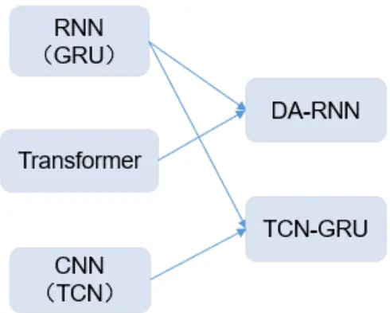
来源：国金证券研究所

该模型首先分成了 Encoder 和 Decoder 两部分，在两部分都结合了注意力机制，并通过RNN 进行时间序列上的编码，最终得到目标预测信息。

模型的作者认为，当输入特征为多维度时，简单的 RNN 结构难以捕捉或选择最相关的输入特征进行预测。而 Hubner et al(2010)指出，人类行为可以很好地被两阶段注意力机制所解释，在第一阶段，人类会首先选择一些初级刺激特征，而在第二阶段，会使用分类信息对第一阶段获取到的刺激特征进行解码。

因此，论文作者提出了两阶段注意力机制对上述过程进行模拟。首先在编码器部分，定义一个注意力机制捕捉不同时期的主要贡献特征。而在解码器中，定义一个时序注意力机制针对不同的时间步上的编码信息进行权重再分配。通过这种方式，DA-RNN 既能选择最合适的输入特征又能捕捉更长周期的时序依赖关系。

图表2：DA-RNN模型结构示意图
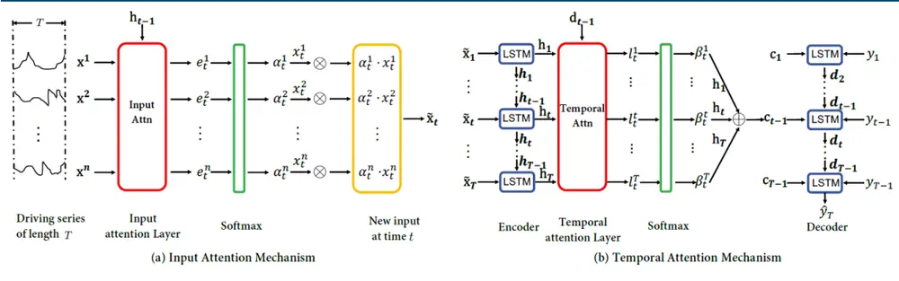
来源：《A Dual-Stage Attention-Based Recurrent Neural Network for Time Series Prediction》，国金证券研究所

在第一阶段中，对于给定的第 k 维特征 $\boldsymbol{.}\boldsymbol{x}^{k}=(x_{1}^{k},x_{2}^{k},\ldots,x_{T}^{k})^{T}\quad\in\mathcal{R}^{T}$ ，构造一个由线性层，Tanh 和 Softmax 构成的注意力机制：

$$
e_{t}^{k}=v_{e}^{T}\mathrm{tanh}(W_{e}[h_{t-1};s_{t-1}]+U_{e}x^{k})
$$

$$
\alpha_{t}^{k}=\frac{\exp(e_{t}^{k})}{\sum_{i=1}^{n}\exp(e_{t}^{i})}
$$

其中 h 和 s 分别为 RNN 编码器中的隐藏层和神经元状态（此处需使用 LSTM）。所得αk即为在 t 时刻第 k 个特征的相对重要性。进一步将所得α和原本特征 x 进行点乘，作为 LSTM的输入：

$$
\tilde{x_{t}}=(\alpha_{t}^{1}x_{t}^{1},\alpha_{t}^{2}x_{t}^{2},\dots,\alpha_{t}^{n}x_{t}^{n})^{T}
$$

$$
h_{t}=f_{1}(h_{t-1},\tilde{x_{t}})
$$

此处 f 指代 LSTM 编码器，通过该方法，每个时间步的特征都会经过注意力给出的权重进行加权后再喂入 LSTM 得到了时序编码，进而起到了动态调整特征重要性的作用。

在第二阶段中，作者考虑到 LSTM 等 RNN 类模型依然无法解决较长时间周期的记忆衰减问题。引入时序注意力机制，对于某个特定时刻 t，依据前一时刻所得隐藏层信息 d 和神经元 s：

$$
l_{t}^{i}=v_{d}^{T}\mathrm{tanh}(W_{d}[d_{t-1};s_{t-1}]+U_{d}h_{i})
$$

$$
\beta_{t}^{k}=\frac{\exp(l_{t}^{k})}{\sum_{j=1}^{T}\exp(l_{t}^{j})}
$$

通过该方法所得 $\cdot\beta_{t}^{k}$ 即为整个时间序列数据中第 t 时刻编码特征的重要性。与编码器部分类似地，利用权重与原本隐藏层进行加权求和，并将其定义为 context（c）：

$$
c_{t}=\sum_{i=1}^{T}\beta_{t}^{i}h_{i},
$$

最终将 context 和原本每个时间步的标签数据拼接并投喂给 LSTM：

$$
\tilde{y}_{t-1}=w^{T}[y_{t-1};c_{t-1}]+\tilde{b}
$$

$$
d_{t}=f_{2}(d_{t-1},\tilde{y_{t-1}})
$$

从而能够将不同时间段结合了重要性判断的编码特征投喂 LSTM 进行时序编码。需要注意的是，该模型结合了截面注意力和时序注意力，在编码器部分所获得隐藏层进一步传给了解码器。可以从本质上理解为一个时序注意力的精细化改进，将每一步的特征权重做了动态分配。

然而，在实际构建该模型的过程中，我们发现：

- 两阶段注意力对算力消耗极大，模型占用显存超出一般消费级显卡范围；

- 动态调整的特征加权在实际测试结果中并未展现出更好的预测表现；

- 解码器部分所需要输入的 T-1 个步长的预测标签数据若不经过降采样处理有极大可能会出现信息泄露，在实盘中将无法落地。若进行月度预测，需保证 20 天的间隔采样，则会导致样本数量过少，极大影响模型最终效果。原文作者用在分钟级数据中并只预测下一分钟的价格择避免了这一问题。

因此，我们结合 DA-RNN 模型的思路进行修改，同样使用注意力机制进行特征重要性的采样，不再每个时间步上利用实际预测标签进行时序编码，而是直接结合多步 GRU 后得到最终预测结果。

在数据预处理、训练方式和损失函数选取上，我们保持和前期报告 $\langle A\vert pha$ 掘金十：机器学习全流程重构——细节对比与测试》中结果一致。但在输入特征数据中，为了避免特征本身可能对模型表现所造成的干扰，影响到对比准确性，我们使用原始日频量价数据进行投喂：

图表3：投喂特征数据

| 数据类型 | 使用字段 | 回看长度 |
| --- | --- | --- |
| 原始量价 | 高、开、低、收、量、VWAP | 60天 |

来源：国金证券研究所

## 2. 结合注意力机制的GRU 在A 股中的实证结果

与前期报告所选时间一致，我们使用较长的训练集进行训练，选股 5 个随机种子取平均避免随机性。首先在全 A 股票池中进行测试，因子效果如下：

图表4：GRU与AGRU 因子各项指标对比（全A，月度调仓，未扣费）

| 因子 | IC 均值 | IC_IR | IC t 统计量 | 多头年化超 额收益率 | 多头信多头超额 息比率最大回撤 | 多空年化 |  | 多空夏多空最大 普比率 回撤 |  |
| --- | --- | --- | --- | --- | --- | --- | --- | --- | --- |
|  |  |  |  |  |  |  |  |  | 收益率 |
| GRU | 14.28% | 1.29 | 13.32 | 17.45% | 2.53 | 4.02% | 58.03% | 3.61 15.85% |  |
| AGRU | 14.42% | 1.34 | 13.89 | 17.63% | 2.70 | 3.99% 58.51% | 3.73 | 15.15% |  |

来源：Wind，国金证券研究所

可以看出，因子在多个指标中的表现均要优于原始的 GRU 模型，但收益部分提升幅度有限，在因子的收益稳定性层面有相对明显的提升。因子 IC 均值从 14.4%提升至 14.53%，多头信息比率由 2.60 提升至 2.75，多空夏普比率由 4.12 提升至 4.29。

进一步，我们观察两个模型在不同宽基指数股票池中的表现，发现 AGRU 的提升更多体现在大盘股上，在沪深 300 成分股中，因子的多头年化超额收益率从 15.96%上升至 17.24%，收益稳定性上也有所提升。

图表5：GRU与AGRU因子在不同股票池中各项指标对比（月度调仓，未扣费）

| 股票池 | 因子 | IC 均值 | IC_IR | IC t 统计 量 | 多头年化 超额收益 率 | 多头信 息比率 | 多头超 额最大 回撤 | 多空年 化收益 率 | 多空夏 普比率 | 多空最 大回撤 |
| --- | --- | --- | --- | --- | --- | --- | --- | --- | --- | --- |
| 沪深300 | GRU AGRU | 12.86% | 0.82 | 8.44 | 15.96% | 1.64 | 9.08% | 39.55% | 1.97 | 19.71% |
|  |  | 13.04% | 0.85 | 8.79 | 17.24% | 1.78 | 8.35% | 44.48% | 2.42 | 16.48% |
| 中证 500 | GRU AGRU | 11.91% | 1.04 | 10.76 | 12.56% | 1.67 | 8.95% | 43.88% | 2.78 | 9.56% |
|  |  | 11.96% | 1.08 | 11.21 | 12.91% | 1.85 | 7.15% | 46.49% | 3.07 | 9.07% |
| 中证 | GRU | 14.24% | 1.39 | 14.41 | 20.77% | 2.76 | 5.66% | 62.63% | 4.25 | 14.16% |
| 1000 | AGRU | 14.43% | 1.46 | 15.05 | 20.50% | 2.82 | 5.73% | 61.14% | 4.25 | 15.11% |

来源：Wind，国金证券研究所

## 二、排序学习介绍及选股效果

## 1. 排序学习各类算法原理介绍

在过往我们研究的模型中，一般均采用了 MSE 作为损失函数，使用回归模型进行训练，也是业界的普遍做法。不过，由于我们使用 AI 模型进行股票收益率预测主要目的在于截面选股，其本质在于准确预测不同股票间未来一段时间收益率的相对大小关系，对于收益率预测的绝对准确性其实是次要因素。因此，在本篇报告中我们参考搜索引擎和推荐系统中常用的排序学习（Learning To Rank, L2R）思路，在量化选股领域进行探索尝试。

排序学习的核心思想是希望能够通过机器学习的技术，解决排序问题。这类问题最早被搜索引擎用来进行搜索结果的排序，近些年随着各类短视频、社区等兴起，众多互联网公司的 APP 都会越来越多使用各类排序学习算法吸引用户注意力、提升用户点击率、留存率等。

一个经典的场景是，给定一个用户查询（query），返回一个或多个按顺序排列的相关文档（document），根据 query 与 document 之间的相关度进行排序。能展示在用户面前越靠前的结果如果相关性越高，则表明算法有较好的预测结果。

从下图中可以看出，与回归或分类不同的是，排序学习需要的数据集结构略有不同，针对每一个 query，都会有一个完整的排序结果作为预测目标，最终模型输出的预测结果也为一整个query所有document的排序结果。而量化领域的数据结构天然适合进行排序学习，我们将每个交易日所有股票的收益率排序进行打包作为一个样本，从而能够套用排序学习的算法设计进行训练。

图表6：排序学习算法示意
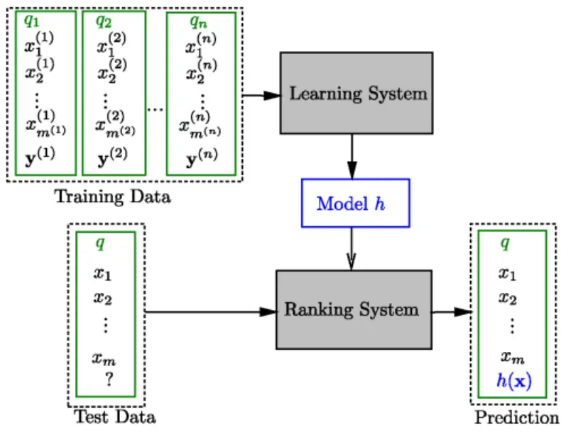
来源：《Learning to Rank for Information Retrieval》，国金证券研究所

在具体的算法设计层面，排序学习又可分为以下三种：

PointWise: 仅考虑单个 document 得分与预测标签的相关性，又可以进一步分为基于回归的、分类的和 ordinal 回归的算法。此类算法出现时间较早，相当于直接退化为了一般的回归或分类任务，且算法并未考虑文档之间的相对关系，效果一般。

- PairWise: 该方法将排序问题转换为两两文档对之间的排序判断，即假设有三只股票的完美排序为“B>C>A”，此类算法将会通过学习两两关系“B>C”、“B>A”和“C>A”来实现“B>C>A”的完整排序。常见的算法包括：Ranking SVM, RankBoost, RankNet,LambdaRank 和 LambdaMRT 等。包括以下几种常见的损失函数设计

1)Hinge Loss:

$$
\mathrm{I}(s,y)=\sum_{y_{i}>y_{j}}\max(0,1-\left(s_{i}-s_{j}\right))
$$

该损失函数的设计思想在于，对于所有的 i>j，使得两只股票的预测结果相对大小准确。

2) Logistic Loss(与 RankNet 等价):

$$
\mathbf{l}(s,y)=\sum_{y_{i}>y_{j}}\mathrm{lo}g_{2}(1+e^{-\sigma(s_{i}-s_{j})})
$$

该损失采用极大似然的思想建模排序概率，更加连续，且其设计思路重点在于对于noise label（错误标签）outliers 的处理，同样会对于排序错误的样本对进行惩罚。

3）在实际情况中，我们往往更关注排序最高的样本的准确度。如搜索引擎的前几条结果，信息流式 APP 的前几页内容。在量化领域同样如此，由于绝大多数量化策略只会使用因子的多头部分买入相应标的构建组合，那么机器学习算法在多头组的准确性就变得更加重要。而排序学习中的 NDCG 思想恰恰是为了解决这一问题，首先我们定义 DCG：

$$
\mathrm{DCG}@\mathrm{k}(\pi,\mathrm{l})=\sum_{j=1}^{\infty}\mathrm{G}(l_{\pi^{-1}(j)})\eta(j).
$$

其中 $\mathsf{G}(x)=2^{x}-1$ ，代表排在 j 位置样本的得分。 $\eta(j)=1/\log(j+1)$ ，代表随着排序位置靠后的折扣因子，即位置越靠后，该样本对最终损失函数的影响就越小。

图表7：NDCG 思想举例

| 模型预测股票排序 | 实际股票得分（越高越好） | G(j) | η(j) |
| --- | --- | --- | --- |
| 1 | 3 | 7 | 1 |
| 2 | 5 | 31 | 0.63093 |
| 3 | 4 | 15 | 0.5 |
| 4 | 2 | 3 | 0.430677 |
| 5 | 1 | 1 | 0.386853 |

来源：国金证券研究所

若假设有5支股票的实际排序和模型预测排序结果如上表，则可得 $\begin{array}{r}{\sum_{j=1}^{\infty}\mathsf{G}(j)\eta(j)=7*1+}\end{array}$ 31 ∗ 0.6309+. . . +1 ∗ 0.3869 = 35.74 此外，我们继续定义IDCG为完美排序下 DCG 的得分，则 IDCG=45.64。由此，

$$
\mathrm{NDCG@k}(\pi,\mathrm{l})=\frac{1}{IDCG}\sum_{j=1}^{\mathrm{n}}\mathrm{G}(l_{\pi^{-1}(j)})\eta(j)
$$

即为考虑前 K 个样本排序准确性的衡量指标。通过该方法，我们可以使模型更加关注排序靠前样本的预测准确性。NDCG 也成为众多损失函数会使用的关键指标。

4）在有了 NDCG 后，RankNet 存在的问题就可以在一定程度上得到解决，我们可以定义如下因子 Lambda 表示两个 document 位置引起的评价指标的变化：

$$
\lambda_{ij}=-\frac{1}{1+\exp(s_{i}-s_{j})}*|\Delta Z_{ij}|
$$

其中的 Z 就可以使用 NDCG 等指标，Lambda 量化了待排序的 document 在下一次迭代时应该调整的方向和强度。

进一步我们可以定义 Lambda NDCG 损失函数：

$$
\mathrm{d}(s,y)=-\sum_{i}^{n}\sum_{j}^{n}log_{2}(\frac{1}{1+e^{-\sigma\left(s_{\pi i}-s_{\pi j}\right)}})^{\frac{G_{\pi i}}{D_{i}}}
$$

其中 $\begin{array}{r}{G_{\pi i}=\frac{2^{y}\pi i-1}{IDCG},\quad D_{i}=log_{2}(1+i)}\end{array}$ 。此类损失函数同样可以解决由于优化排序指标不连续或曲线非凸而难以梯度优化的问题。

ListWise:由于 PointWise 仅考虑两两之间的排序关系，对于全局的排序结果缺乏敏感度。ListWise 可分为：直接根据评估指标的损失函数最小化，为解决 NDCG 等指标往往不可导的问题，就有了 Soft Rank，SVM-map，AdaRank 等损失函数设计；对于不依赖于评价指标的模型，主要有 ListNet 和 ListMLE 两类，前者是通过序列概率分布定义的，对于任意给定 query q，ListNet 都会先根据模型计算出的得分计算出一个序列概率分布： $P(\pi|f(w,x))$ ，其中π为 documents 的真实排序，同时根据标签值计算出一个序列概率分布，使用 KL 散度衡量两个分布的差异程度：

$$
\mathbf{L}(f;x,\Omega_{y})=\mathrm{D}(P_{y}(\Pi)||P(\Pi|{\big(}f(w,x){\big)})
$$

该函数具有凸性，可以使用梯度下降的方式进行训练。另外还有比较类似的 ListMLE损失函数，直接优化 $\cdot P(\pi|s)$ ，此处不再详述。

## 2. 排序学习各类算法在A 股中的实证结果

在实证之前，为进一步直观感受排序学习损失函数与传统回归方法的差异，我们尝试通过以下案例进行对比：

图表8：排序学习与MSE回归差异对比案例

| 标签 | 预测1 | 预测2 | 预测3 |
| --- | --- | --- | --- |
| -10.00% | -8.00% | 0.00% | 10.00% |
| -8.00% | -10.00% | 2.00% | -8.00% |
| -6.00% | -4.00% | 4.00% | -6.00% |
| -4.00% | -6.00% | 6.00% | -4.00% |
| -2.00% | 0.00% | 8.00% | -2.00% |
| 0.00% | -2.00% | 10.00% | 0.00% |
| 2.00% | 2.00% | 12.00% | 2.00% |
| 4.00% | 4.00% | 14.00% | 4.00% |
| 6.00% | 6.00% | 16.00% | 6.00% |
| 8.00% | 10.00% | 18.00% | 8.00% |
| 10.00% | 8.00% | 20.00% | -10.00% |

来源：国金证券研究所

此处我们假设共有未来一段时间实际收益率为-10%至 10%之间均匀分布的 11 只股票，共有三种不同的预测结果：

- 预测 1：部分临近股票之间的排序出现颠倒，但预测的数值相差结果都不大。

- 预测 2：与真实股票收益率排序一致，但均比真实值高出 10%。

- 预测 3：第一只和最后一只股票预测结果颠倒，其余股票预测完全准确。

我们对以上三类预测结果分别计算MSE损失和排序学习损失函数（以PairWise HingeLoss为例），发现：

- 对于实际预测结果较差的预测 3，MSE 并未给出较大的损失，而对于排序完全准确只不过数据普遍偏高的预测 2，MSE 值反而较高。

而 PairWise Hinge 损失函数能准确对预测 3 给出较高的惩罚，且排序出现细微错误的预测 1 的损失值也高于预测 2。

图表9：排序学习与MSE回归损失函数值差异对比案例

| 损失函数 | 预测1 | 预测2 | 预测3 |
| --- | --- | --- | --- |
| MSE | 0.0003 | 0.0100 | 0.0073 |
| PairWise HingeLoss | 1.9600 | 1.7800 | 5.3000 |

来源：国金证券研究所

综上，考虑到与量化选股领域的实际相结合，本质是希望得到排序尽可能准确的信号，而非片面追求整体预测值的准确性。本篇报告我们将上述所有排序学习算法统一进行测试，与前文相同，我们使用原始的日频量价数据输入模型，使用五个随机种子求均值，统一使用 AGRU 模型作为 Backbone，修改损失函数和数据投喂、处理方式等，从而实现 L2R 的排序效果。

图表10：测试损失函数列表

| 损失函数类别 | 损失函数名称 |
| --- | --- |
| PairWise | Hinge Loss |
|  | DCG Hinge Loss |
|  | Logistic Loss |
|  | RankNet |
|  | Lambda Apr |
|  | Lambda NDCG |
|  | Lambda NDCG2 |
|  | ListMLE |
| ListWise | ListNet |
|  | ApproxNDCG |
|  | NeuraINDCG |

来源：国金证券研究所
此处我们首先展示所有不同排序学习算法在全 A 股票池中的预测效果：

图表11：不同排序学习损失函数训练因子各项指标对比（月度调仓，未扣费）

| 损失函数类 型 | 损失函数 | IC均值 | IC_IR | t统计 量 | 多头年化超 额收益率 | 多头信 息比率 | 多头超额 最大回撤 | 多空年化 收益率 | 多空夏 普比率 | 多空最大 回撤 |
| --- | --- | --- | --- | --- | --- | --- | --- | --- | --- | --- |
| PairWise | HingeLoss | 14.48% | 1.37 | 14.22 | 18.34% | 2.44 | 4.88% | 60.43% | 3.87 | 11.37% |
|  | DCGHingeLoss | 13.82% | 1.35 | 13.92 | 17.33% | 2.39 | 4.23% | 59.86% | 4.10 | 9.34% |
|  | LogisticLoss | 14.53% | 1.32 | 13.68 | 18.57% | 2.32 | 4.79% | 60.22% | 3.66 | 15.05% |
|  | RankNet | 14.29% | 1.37 | 14.15 | 17.89% | 2.47 | 3.62% | 60.35% | 4.06 | 10.20% |
|  | LambdaAPR | 14.41% | 1.35 | 13.93 | 18.15% | 2.30 | 6.03% | 57.64% | 3.55 | 15.65% |
|  | LambdaNDCG | 12.20% | 1.28 | 13.28 | 17.64% | 2.35 | 5.75% | 54.97% | 3.98 | 13.33% |
|  | LambdaNDCG2 | 11.98% | 1.34 | 13.89 | 19.51% | 2.78 | 3.68% | 60.08% | 5.00 | 5.63% |
| ListWise | ListMLE | 13.60% | 1.07 | 11.02 | 13.25% | 1.53 | 6.49% | 51.36% | 2.82 | 17.12% |
|  | ListNet | 10.78% | 1.17 | 12.07 | 17.98% | 2.50 | 3.99% | 52.52% | 4.27 | 4.53% |
|  | ApproxNDCG | 9.40% | 1.00 | 10.32 | 18.17% | 2.72 | 3.73% | 46.26% | 4.11 | 3.79% |
|  | NeuraINDCG | 12.58% | 1.34 | 13.91 | 19.37% | 3.10 | 2.88% | 55.60% | 4.14 | 14.03% |
| 回归 | MSE | 14.42% | 1.34 | 13.89 | 17.63% | 2.70 | 3.99% | 58.51% | 3.73 | 15.15% |

来源：Wind，国金证券研究所

可以看出，使用排序学习所得因子整体表现突出。部分因子在 IC 指标、多头收益表现和稳定性上超过传统使用 MSE 作为损失函数的训练结果。

不过，ListWise 类损失函数相较于 PairWise 并未有明显提升，两类损失函数各有优劣。

部分使用结合了 NDCG 作为评价指标的损失函数在多头端表现出较高的收益稳定性，如 LambdaNDCG2, ApproxNDCG 和 NeuralNDCG 的多头信息比率和多头超额回撤均在所有损失函数中表现最优，而多空的收益水平就没有明显优势。

限于篇幅，此处仅展示几类损失函数在中证 500 和中证 1000 指数成分股中的预测效果，部分损失函数的所得因子相较于 MSE 具有一定优势。

图表12：几种损失函数多头超额净值走势（中证500月度调仓，未扣费）
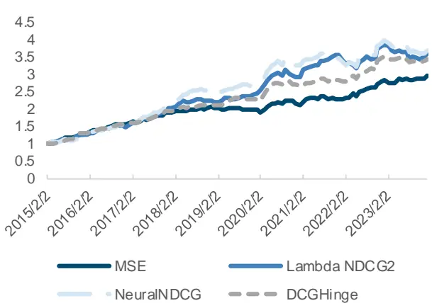
来源：Wind，国金证券研究所

图表13：几种损失函数多头超额净值走势（中证1000，月度调仓，未扣费）
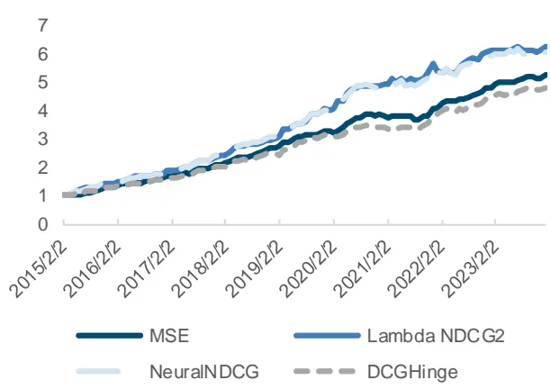
来源：Wind，国金证券研究所

排序学习各类损失函数在逻辑和结果上均具有一定优势，然而如何使用此类损失函数成为新的问题。若直接将其取代 MSE，则可能导致模型过分追求排序结果，而股票间收益率的大小关系差异会被忽略，在后续进行指数增强组合优化时可能会受到影响。

因此，我们首先考虑多任务学习的方式，将排序和回归两个目标结合，使模型在两个方向同时学习，从而达到两者兼顾的效果。目前主流的多任务学习包括：硬参数共享、软参数共享、PLE 等模式，通过不同的网络结构设计，将两个或多个具有一定差异性的任务作为一个模型的不同输出。

硬参数共享一般采用同一个 Encoder 层，而在最后的线性层对不同任务进行独立学习。PLE 模式为腾讯某团对针对腾讯视频推荐系统所推出的渐进式多任务学习框架，包括了任务特定专家和共享专家的设计，门控机制来确定不同专家的动态权重，使得整个结构都更有灵活性。

我们对硬参数共享、PLE 和 GradNorm 三种方案都分别进行了构建，将排序学习结果与回归结果作为两个任务，力图使模型能起到尽可能改进的效果。但经过多次测试，均未达到如 Ma & Tan 2022 中的显著改进效果，后续报告中我们将会在多任务学习领域进行深入探讨。此处，我们考虑尝试直接使用线性等权合成的方式，首先考察不同损失函数之间的相关性：

图表14：排序学习与MSE损失函数因子相关性
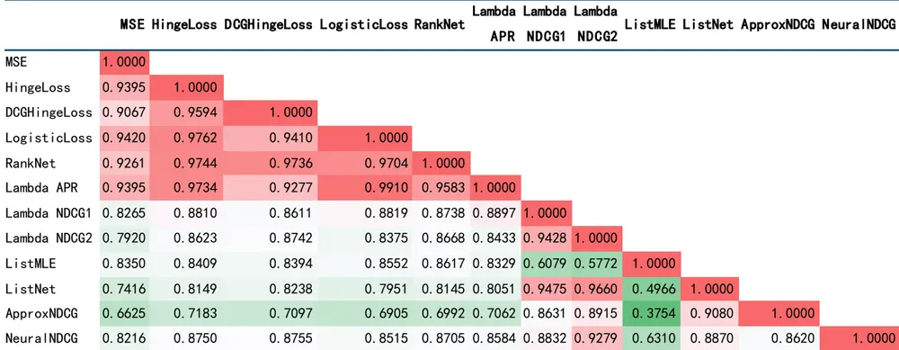
来源：Wind，国金证券研究所

可以看出，PairWise 的部分因子相关性较高，Hinge 和 Logistic（包括 RankNet）两种模式没有明显差异。而 Lambda NDCG 能带来明显增量信息，与其他损失函数普遍相关性较低。ListWise 的损失函数与回归相比，同样有较低的相关性水平，基本在 0.8 左右。

因此，最终我们筛选表现较好且差异性较大的三个排序学习损失函数（DCG Hinge Loss,Lambda NDCG2, Neural NDCG）与 MSE 所得因子值等权合成，最终得到结合了排序与回归学习之后的模型因子：

图表15：GRU与AGRU因子在不同股票池中各项指标对比（月度调仓，未扣费）

| 股票池 | 因子 | IC 均值 | IC_IR | t统计 | 多头年化超 | 多头信 | 多头超额 | 多空年化 | 多空夏 | 多空最大 |
| --- | --- | --- | --- | --- | --- | --- | --- | --- | --- | --- |
|  |  |  |  |  | 量 | 额收益率 | 息比率 最大回撤 | 收益率 | 普比率 | 回撤 |
| 沪深 300 | MSE | 13.04% | 0.85 | 8.79 | 17.24% | 1.78 | 8.35% | 44.48% | 2.42 | 16.48% |
|  | DCGHinge | 13.06% | 0.90 | 9.34 | 16.59% | 1.92 | 10.01% | 47.60% | 2.74 | 16.05% |
|  | Lambda NDCG2 | 11.33% | 0.72 | 7.49 | 17.91% | 1.79 | 11.56% | 45.80% | 2.97 | 11.42% |
|  | NeuraINDCG | 11.55% | 0.75 | 7.73 | 17.74% | 1.86 | 12.64% | 42.33% | 2.46 | 12.63% |
|  | Rank&MSE | 13.13% | 0.86 | 8.88 | 18.94% | 2.07 | 8.75% | 49.17% | 2.70 | 14.60% |
|  | Rank&MSE_Ad jCI | 10.87% | 0.82 | 8.50 | 18.36% | 2.07 | 5.70% | 40.85% | 2.48 | 10.09% |
| 中证500 | MSE | 11.96% | 1.08 | 11.21 | 12.91% | 1.85 | 7.15% | 46.49% | 3.07 | 9.07% |
|  | DCGHinge | 11.97% | 1.13 | 11.67 | 14.79% | 1.85 | 5.88% | 45.64% | 3.01 | 13.23% |
|  | Lambda NDCG2 | 10.18% | 0.93 | 9.61 | 15.41% | 1.72 | 11.82% | 45.95% | 3.10 | 11.64% |
|  | NeuraINDCG | 10.89% | 1.00 | 10.30 | 15.74% | 1.91 | 10.18% | 43.75% | 3.02 | 12.47% |
|  | Rank&MSE | 12.05% | 1.12 | 11.57 | 14.58% | 2.01 | 5.86% | 48.26% | 3.40 | 10.31% |
|  | Rank&MSE_Ad jCI | 10.59% | 1.12 | 11.61 | 14.64% | 2.09 | 5.52% | 42.84% | 3.38 | 4.84% |
| 中证 1000 | MSE | 14.43% | 1.46 | 15.05 | 20.50% | 2.82 | 5.73% | 61.14% | 4.25 | 15.11% |
|  | DCGHinge | 14.04% | 1.42 | 14.72 | 19.27% | 2.36 | 4.67% | 60.43% | 4.31 | 11.97% |
|  | Lambda NDCG2 | 12.10% | 1.33 | 13.76 | 22.80% | 2.74 | 5.59% | 59.03% | 4.69 | 5.50% |
|  | NeuraINDCG | 12.81% | 1.47 | 15.20 | 22.39% | 2.86 | 3.92% | 55.88% | 4.42 | 9.12% |
|  | Rank&MSE | 14.33% | 1.53 | 15.85 | 21.87% | 2.78 | 6.54% | 61.48% | 4.40 | 13.96% |
|  | Rank&MSE_Ad jCI | 13.37% | 1.64 | 16.98 | 20.92% | 3.01 | 2.26% | 60.64% | 5.08 | 10.80% |

来源：Wind，国金证券研究所

可以发现，在不同股票池中将回归与排序进行合成均能在一定程度提升最终效果。IC 均值在中证1000成分股中为14.33%，多头年化超额收益率为21.87%，多头信息比率为2.78。

图表16：排序与回归结合因子多头超额净值（中证500，月度，未扣费）
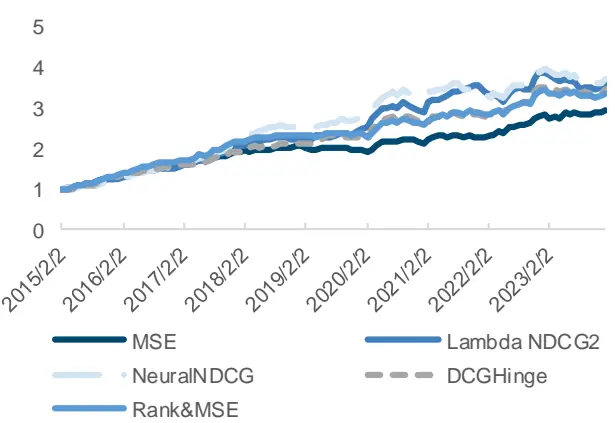
来源：Wind，国金证券研究所

图表17：排序与回归结合因子多头超额净值（中证1000，月度，未扣费）
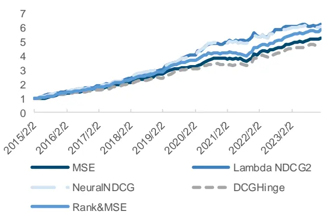
来源：Wind，国金证券研究所

## 三、利用多个Epoch结果对抗过拟合

AI 模型用于量化选股领域虽然普遍能获得较好的投资组合效果，但牺牲了可解释性的同时也由于更复杂的模型和更多的参数带来了过拟合的风险。如何对抗过拟合一直也是业界比较关心的问题，在本篇报告中，我们尝试介绍一种从细节着手改善过拟合可能性的方法。一般而言，我们训练神经网络类模型时倾向于设置早停机制（early stop），一方面能够避免训练集损失一直下降而验证集损失不再下降导致的过拟合问题，另一方面也可以确定验证集最优结果用于作为模型最终的确定参数。

图表18：验证集损失函数随训练轮数（Epoch）变化趋势
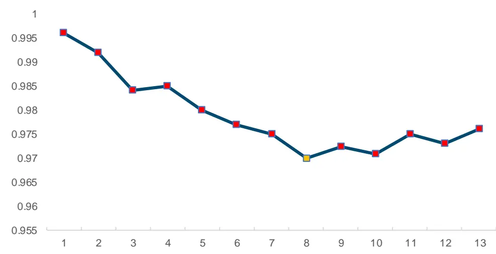
来源：国金证券研究所

上图为我们用于演示验证集损失函数随训练轮数变化的趋势所构造的数据，一般规律为早期损失函数会持续下降，直到某轮后开始震荡甚至抬升，连续若干轮都难以下降至前期最低点后，我们一般取损失函数最低（有时也可以用其他 Metrics）的轮数所对应模型参数用来对测试集数据进行预测。

图表19：模型梯度下降示意图
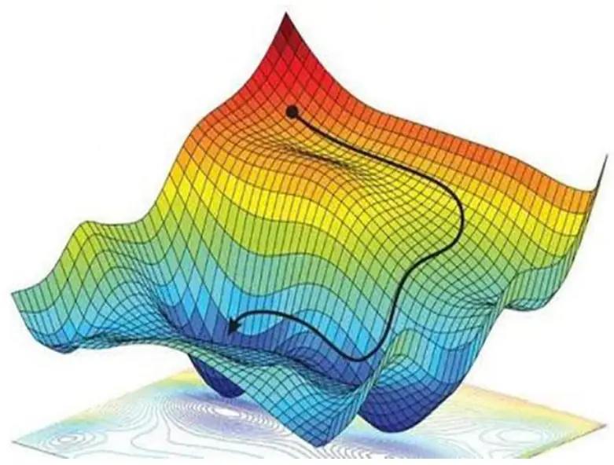
来源：《Spatial Uncertainty Sampling for End to End Control》，国金证券研究所

然而使用此类方法其实面临几个问题：

- 随着训练的不断进行，模型可能会陷入局部最优点而非全局最优，从而导致模型参数并未完全训练到位就难以继续使损失函数下降。一般可以用学习率调节等方法一定程度上避免此类问题，本篇报告暂不涉及。

- 即便下降至全局最优点，模型也是依据训练集和验证集数据所得到的参数，此时得到的全局最优点并不一定同样是测试集中的全局最优，作为典型的时序预测类任务，量化场景下会面临市场环境变化等问题带来的全局最优失效问题。因此，取早停后验证集损失最小的 epoch 天然存在过拟合问题。

因此，我们考虑可以将表现最好的 N 个 epoch 所得模型参数全部提取，并通过取均值的方式来避免上述过拟合倾向。如下图中，我们将所有轮次所得损失排序，将最低的 5 个 Epoch参数分别用于预测，并将最终因子值求均值作为最终结果。

图表20：取多轮模型参数示意图

来源：国金证券研究所

为考虑结果稳健性，我们同样取 5 个随机种子求均值得到最终测试结果：

图表21：单轮与5轮取均值因子在不同股票池中各项指标对比（月度调仓，未扣费）

| 股票池 | 因子 | IC 均值 | IC_IR | IC t 统计 | 多头年化 超额收益信息比额最大 | 多头多头超 | 多空年 化收益夏普比 | 多空 | 多空最 大回撤 |
| --- | --- | --- | --- | --- | --- | --- | --- | --- | --- |
| 沪深 | AGRU_Single | 13.04% | 0.85 | 量 8.79 | 率 17.24% | 率 回撤 1.78 8.35% | 44.48% | 率 率 2.42 | 16.48% |
| 300 | AGRU_Best5 | 13.20% | 0.87 | 8.97 | 18.45% | 1.98 8.21% | 46.35% | 2.63 | 14.98% |
| 中证 | AGRU_Single | 11.96% | 1.08 | 11.21 | 12.91% | 1.85 7.15% | 46.49% | 3.07 | 9.07% |
| 500 | AGRU_Best5 | 12.18% |  | 1.14 11.75 | 14.90% | 2.09 5.41% | 49.02% | 3.50 | 10.24% |
| 中证 | AGRU_Single | 14.43% | 1.46 | 15.05 | 20.50% | 2.82 5.73% | 61.14% | 4.25 |  |
| 1000 | AGRU_Best5 | 14.59% | 1.53 15.83 |  | 21.92% | 2.69 7.14% | 64.06% | 4.40 | 15.11% 15.45% |
|  | AGRU_Single | 14.42% | 1.34 | 13.89 | 17.63% | 2.70 3.99% | 58.51% | 3.73 | 15.15% |
| 全A | AGRU_Best5 | 14.34% |  | 1.3914.34 | 18.53% | 2.77 3.59% | 60.13% | 3.91 | 14.93% |

来源：Wind，国金证券研究所

可以看出，在绝大多数指标上，选取 5 个 Epoch 求均值在收益和稳健性方面均要优于之前只取单轮结果的方案。以全 A 股票池为例，五轮取均值后，因子 IC 均值为 14.34%，IC_IR为 1.39，多头年化超额收益率为 18.53%，多头信息比率 2.77。

图表22：单轮与5轮取均值因子多头超额净值（中证500，月度，未扣费）
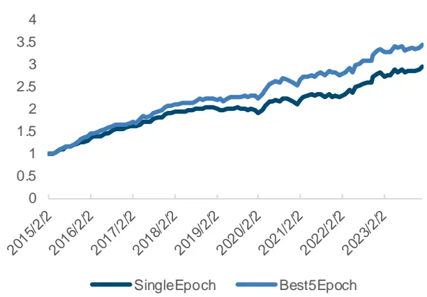
来源：Wind，国金证券研究所

图表23：单轮与5轮取均值因子多头超额净值（中证1000，月度，未扣费）
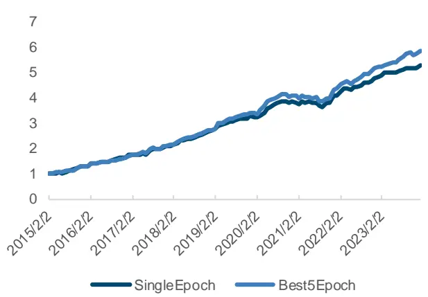
来源：Wind，国金证券研究所

## 四、结合排序学习与多轮参数对抗过拟合方案的AGRU指数增强策略

由前文所述，我们在将回归 MSE 与三种排序学习损失函数结合后发现在各大宽基股票池中均有收益和稳定性提升效果，同时使用多轮模型参数取均值的方式同样能提升模型样本外表现稳健性。此处我们将上述方案与传统 AGRU 模型分别放入组合优化，构建指数增强策略。通过马科维茨的均值方差优化模型，对投资组合的跟踪误差进行限制，并控制个股偏离程度以减少策略波动水平，最大化预期超额收益率。

$$
Maxw^{T}f
$$

$$
s.t.\quad\sqrt{(w-w_{bench})\Sigma(w-w_{bench})^{\prime}}\leq target\_TE
$$

$$
w-w_{benc\not a}\leq1\%
$$

其中，f 为模型的预测信号， $w_{bench}$ 为基准权重向量，tartget_TE 为目标跟踪误差。

在本篇报告中，我们将年化跟踪误差控制为最大不能超过 5%，并要求所有投资股票必须100%来自于指数成分股。使用优化器对投资组合权重进行优化，回测期为 2015 年 2 月 1日至 2023 年 12 月 31 日，以每月第一个交易日的收盘价进行月频调仓，假定手续费率为单边千二（双边千四），在各宽基指数上的测试结果如下。

## 1. 基于排序学习与多轮参数对抗过拟合的沪深 300指增策略

图表24：基于排序学习与多轮参数对抗过拟合的沪深300指数增强策略指标

|  | MSE | Epoch5_Avg | Rank&MSE |
| --- | --- | --- | --- |
| 年化收益率 | 16.69% | 17.01% | 16.95% |
| 年化波动率 | 20.95% | 20.75% | 21.16% |
| Sharpe 比率 | 0.80 | 0.82 | 0.80 |
| 最大回撤率 | 38.53% | 38.19% | 39.07% |
| 平均换手率（双边） | 97.24% | 97.82% | 99.73% |
| 年化超额收益率 | 16.31% | 16.55% | 16.60% |
| 跟踪误差 | 4.46% | 4.23% | 4.25% |
| 信息比率 | 3.65 | 3.91 | 3.90 |
| 超额最大回撤 | 6.05% | 4.43% | 3.78% |

来源：Wind，国金证券研究所

图表25：基于排序学习与多轮参数对抗过拟合的沪深300指数增强策略净值曲线
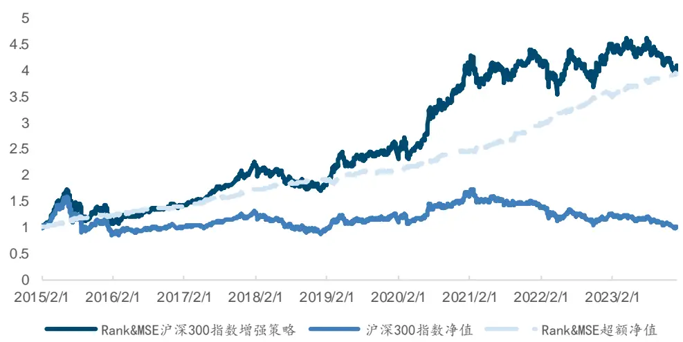
来源：Wind，国金证券研究所

可以发现，经过组合优化的控制后，策略表现进一步提升，以沪深 300 作为基准，年化超额收益率达到 16.60%，超额最大回撤仅为 3.78%。分年度来看，策略仅在 2019 和 2023年超额收益未达到 10%，其余年份均有较高的超额收益水平。

图表26：基于排序学习与多轮参数对抗过拟合的沪深300指数增强策略分年度收益
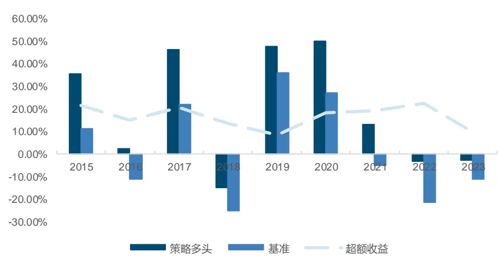
来源：Wind，国金证券研究所

图表27：基于排序学习与多轮参数对抗过拟合的沪深300指数增强策略分年度收益

|  | 策略多头 | 基准 | 超额收益 |
| --- | --- | --- | --- |
| 2015 | 35.71% | 11.24% | 21.45% |
| 2016 | 2.39% | -11.28% | 15.16% |
| 2017 | 46.29% | 21.78% | 20.58% |
| 2018 | -14.91% | -25.31% | 13.49% |
| 2019 | 47.87% | 36.07% | 8.31% |
| 2020 | 50.06% | 27.21% | 18.38% |
| 2021 | 13.09% | -5.20% | 19.28% |
| 2022 | -3.34% | -21.63% | 22.49% |
| 2023 | -2.56% | -11.38% | 9.62% |

来源：Wind，国金证券研究所

## 2. 基于排序学习与多轮参数对抗过拟合的中证 500指增策略

同样地，我们在中证 500 指数成分股进行指数增强策略的构建，策略的年化超额收益率达到 19.20%，超额最大回撤为 4.25%。

图表28：基于排序学习与多轮参数对抗过拟合的中证500指数增强策略指标

|  | MSE | Epoch5_Avg | Rank&MSE |
| --- | --- | --- | --- |
| 年化收益率 | 17.00% | 17.56% | 19.21% |
| 年化波动率 | 23.83% | 23.89% | 24.19% |
| Sharpe 比率 | 0.71 | 0.74 | 0.79 |
| 最大回撤率 | 44.69% | 43.57% | 43.47% |
| 平均换手率（双边） | 127.05% | 127.23% | 130.58% |
| 年化超额收益率 | 16.83% | 17.42% | 19.20% |
| 跟踪误差 | 5.37% | 5.24% | 5.11% |
| 信息比率 | 3.13 | 3.32 | 3.76 |
| 超额最大回撤 | 5.43% | 4.41% | 4.25% |

来源：Wind，国金证券研究所

图表29：基于排序学习与多轮参数对抗过拟合的中证500指数增强策略净值曲线
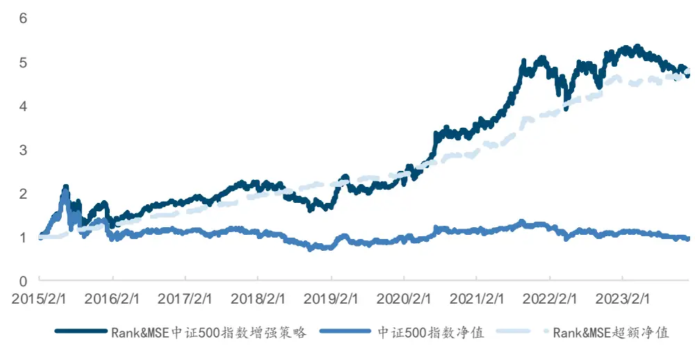
来源：Wind，国金证券研究所

分年度来看，中证 500 指数增强策略稳定性略差于沪深 300，但整体超额水平更高，超额收益率在 2019 和 2023 年较低，其余年份超额收益均在 10%以上。

图表30：基于排序学习与多轮参数对抗过拟合的中证500指数增强策略分年度收益
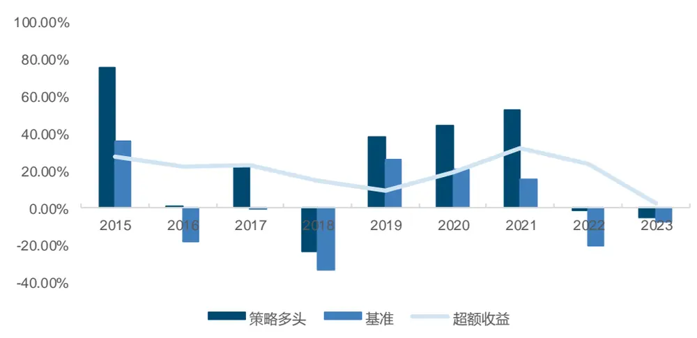
来源：Wind，国金证券研究所

图表31：基于排序学习与多轮参数对抗过拟合的中证500指数增强策略分年度收益

|  | 策略多头 | 基准 超额收益 |
| --- | --- | --- |
| 2015 | 75.49% 35.80% | 27.65% |
| 2016 | 0.76% | 22.20% |
| 2017 | -17.78% 23.21% -0.20% | 23.29% |
| 2018 | -23.33% -33.32% | 14.61% |
| 2019 | 38.43% 26.38% | 8.95% |
| 2020 | 44.48% 20.87% | 19.00% |
| 2021 | 52.41% 15.58% | 31.92% |
| 2022 | -1.13% -20.31% | 23.59% |
| 2023 | -4.80% -7.42% | 2.43% |

来源：Wind，国金证券研究所

## 3. 基于排序学习与多轮参数对抗过拟合的中证 1000指增策略

最后，使用同样的方式我们构建了机器学习中证 1000 指数增强策略，策略的年化超额收益率达到 29.81%，超额最大回撤为 8.04%。

图表32：基于排序学习与多轮参数对抗过拟合的中证1000指数增强策略指标

|  | MSE | Epoch5_Avg | Rank&MSE |
| --- | --- | --- | --- |
| 年化收益率 | 27.36% | 27.21% | 28.84% |
| 年化波动率 | 26.04% | 25.84% | 25.99% |
| Sharpe 比率 | 1.05 | 1.05 | 1.11 |
| 最大回撤率 | 44.98% | 44.22% | 42.21% |
| 平均换手率（双边） | 143.75% | 145.20% | 145.49% |
| 年化超额收益率 | 28.26% | 27.96% | 29.81% |
| 跟踪误差 | 6.14% | 5.97% | 5.98% |
| 信息比率 | 4.60 | 4.68 | 4.98 |
| 超额最大回撤 | 7.66% | 8.86% | 8.04% |

来源：Wind，国金证券研究所

图表33：基于排序学习与多轮参数对抗过拟合的中证1000指数增强策略净值曲线
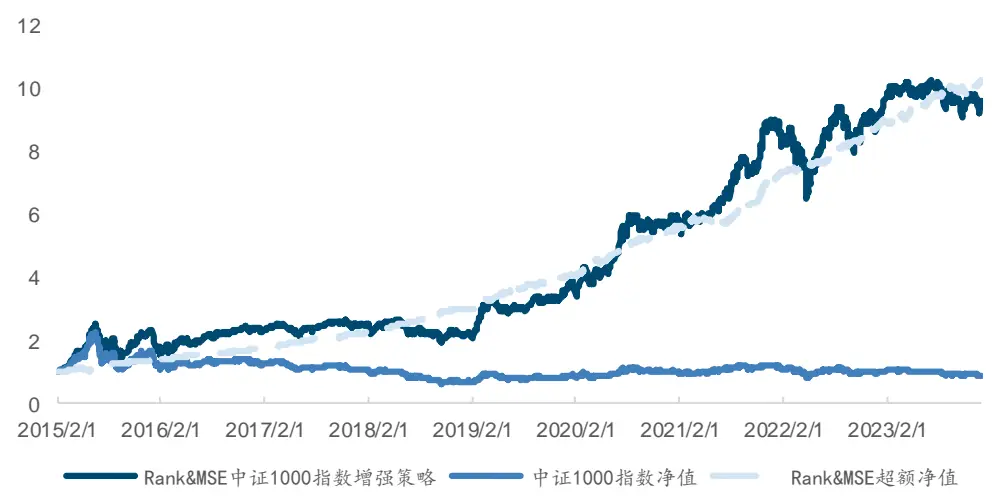
来源：Wind，国金证券研究所

分年度来看，策略在中证 1000 上表现最为稳定，除 2023 年外，每一年的超额收益均在20%以上。

图表34：基于排序学习与多轮参数对抗过拟合的中证1000指数增强策略分年度收益
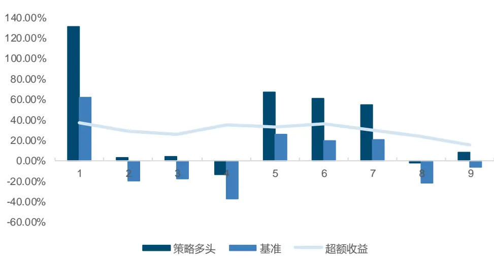
来源：Wind，国金证券研究所

图表35：基于排序学习与多轮参数对抗过拟合的中证1000指数增强策略分年度收益

|  | 策略多头 | 基准 | 超额收益 |
| --- | --- | --- | --- |
| 2015 | 130.76% | 62.40% | 37.63% |
| 2016 | 2.85% | -20.01% | 28.43% |
| 2017 | 4.41% | -17.35% | 25.91% |
| 2018 | -13.12% | -36.87% | 35.64% |
| 2019 | 66.96% | 25.67% | 33.25% |
| 2020 | 61.17% | 19.39% | 36.11% |
| 2021 | 55.19% | 20.52% | 29.59% |
| 2022 | -1.67% | -21.58% | 24.27% |
| 2023 | 8.70% | -6.28% | 15.85% |

来源：Wind，国金证券研究所

## 总结

在本篇报告中，我们首先探讨了不同神经网络编码器的融合方式以及对量化选股领域的影响，经过对比尝试发现两阶段注意力机制的 DA-RNN 在实践中存在诸多问题，为此我们使用了仅进行特征层面的注意力与 GRU 结合，得到模型 AGRU 所构建的选股因子表现亮眼。

其次，我们介绍了排序学习的基本思路和常见算法，将常见的所有损失函数统一使用 AGRU作为 Backbone 进行训练并与 MSE 对比，发现部分损失函数所得模型表现较好，且与原模型相关性较低，通过合成可以进一步提升因子收益和稳定性水平。所得因子在全 A 股票池中 IC 均值为 13.82%，多头年化超额 19.69%，多头信息比率 2.98。

此外，如何更有效地防止过拟合一直是大家关心的问题，我们考虑了传统训练早停后只使用最好轮次的模型参数用于预测可能存在的问题，将其修改为对最好 5 个 Epoch 的模型参数预测后取均值的方式，有效减缓了模型陷入过拟合的情况。因子的各方面绩效指标均相较于之前有所提升。

最终，我们对上述改进所得因子构建指增策略。其中，沪深 300 指数增强策略年化超额收益达到 16.60%，超额最大回撤为 3.78%。中证 500 指增策略年化超额收益 19.20%，超额最大回撤 4.25%。中证 1000 指增策略年化超额收益 29.81%，超额最大回撤 8.04%。

## 风险提示

1、以上结果通过历史数据统计、建模和测算完成，在政策、市场环境发生变化时模型存在时效的风险。

2、策略通过一定的假设通过历史数据回测得到，当交易成本提高或其他条件改变时，可

能导致策略收益下降甚至出现亏损。

## 特别声明：

国金证券股份有限公司经中国证券监督管理委员会批准，已具备证券投资咨询业务资格。

形式的复制、转发、转载、引用、修改、仿制、刊发，或以任何侵犯本公司版权的其他方式使用。经过书面授权的引用、刊发，需注明出处为“国金证券股份有限公司”，且不得对本报告进行任何有悖原意的删节和修改。

本报告的产生基于国金证券及其研究人员认为可信的公开资料或实地调研资料，但国金证券及其研究人员对这些信息的准确性和完整性不作任何保证。本报告反映撰写研究人员的不同设想、见解及分析方法，故本报告所载观点可能与其他类似研究报告的观点及市场实际情况不一致，国金证券不对使用本报告所包含的材料产生的任何直接或间接损失或与此有关的其他任何损失承担任何责任。且本报告中的资料、意见、预测均反映报告初次公开发布时的判断，在不作事先通知的情况下，可能会随时调整，亦可因使用不同假设和标准、采用不同观点和分析方法而与国金证券其它业务部门、单位或附属机构在制作类似的其他材料时所给出的意见不同或者相反。

本报告仅为参考之用，在任何地区均不应被视为买卖任何证券、金融工具的要约或要约邀请。本报告提及的任何证券或金融工具均可能含有重大的风险，可能不易变卖以及不适合所有投资者。本报告所提及的证券或金融工具的价格、价值及收益可能会受汇率影响而波动。过往的业绩并不能代表未来的表现。

客户应当考虑到国金证券存在可能影响本报告客观性的利益冲突，而不应视本报告为作出投资决策的唯一因素。证券研究报告是用于服务具备专业知识的投资者和投资顾问的专业产品，使用时必须经专业人士进行解读。国金证券建议获取报告人员应考虑本报告的任何意见或建议是否符合其特定状况，以及（若有必要）咨询独立投资顾问。报告本身、报告中的信息或所表达意见也不构成投资、法律、会计或税务的最终操作建议，国金证券不就报告中的内容对最终操作建议做出任何担保，在任何时候均不构成对任何人的个人推荐。

在法律允许的情况下，国金证券的关联机构可能会持有报告中涉及的公司所发行的证券并进行交易，并可能为这些公司正在提供或争取提供多种金融服务。

本报告并非意图发送、发布给在当地法律或监管规则下不允许向其发送、发布该研究报告的人员。国金证券并不因收件人收到本报告而视其为国金证券的客户。本报告对于收件人而言属高度机密，只有符合条件的收件人才能使用。根据《证券期货投资者适当性管理办法》，本报告仅供国金证券股份有限公司客户中风险评级高于 C3 级(含 C3 级）的投资者使用；本报告所包含的观点及建议并未考虑个别客户的特殊状况、目标或需要，不应被视为对特定客户关于特定证券或金融工具的建议或策略。对于本报告中提及的任何证券或金融工具，本报告的收件人须保持自身的独立判断。使用国金证券研究报告进行投资，遭受任何损失，国金证券不承担相关法律责任。

若国金证券以外的任何机构或个人发送本报告，则由该机构或个人为此发送行为承担全部责任。本报告不构成国金证券向发送本报告机构或个人的收件人提供投资建议，国金证券不为此承担任何责任。

此报告仅限于中国境内使用。国金证券版权所有，保留一切权利。

上海

电话：021-80234211

北京

深圳

电话：010-85950438

邮箱：researchsh@gjzq.com.cn

电话：0755-86695353

邮箱：researchbj@gjzq.com.cn

邮箱：researchsz@gjzq.com.cn

邮编：201204

地址：上海浦东新区芳甸路 1088 号紫竹国际大厦 5 楼

邮编：518000

邮编：100005

地址：北京市东城区建内大街 26 号

新闻大厦 8 层南侧

地址：深圳市福田区金田路 2028 号皇岗商务中心

18 楼 1806

【小程序】国金证券研究服务

【公众号】国金证券研究