证券研究报告

金融工程组

分析师：高智威(执业 S1130522110003)

分析师：王小康(执业 S1130523110004)

gaozhiw@gjzq.com.cn

wangxiaokang@gjzq.com.cn

## AI选股模型特征筛选与处理：SHAP、中性化与另类特征

## 模型的特征工程研究

随着机器学习模型在量化投资领域的广泛应用，我们在此前的《Alpha 掘金系列之九：基于多目标、多模型的机器学习指数增强策略》、《Alpha 掘金系列之十：机器学习全流程重构》和《ALPHA 掘金系列之十二：排序学习对 GRU 选股模型的增强》中，分别深入探讨了结合树模型和神经网络模型的机器学习量化选股架构、模型训练中的标签选择等细节问题和新的排序学习框架的有效性。然而，对模型输入端因子的特征工程尚缺乏系统的研究。本报告旨在填补这一空白，探索几个关键问题：特征选择的必要性、宏观数据与高频数据等的加入是否有益，因子与标签中性化处理的效果。

通过对这些问题的深入探讨和实证分析，我们得出了一系列重要结论：首先，基于 SHAP（Shapley AdditiveExplanations）的特征选择方法显著降低了模型训练成本，并在一定程度上提升了 GRU 模型的精度，同时，SHAP 提供的可视化工具能够直观地展示各个因子的作用，为进一步优化模型提供了有价值的参考。相比之下，尽管基于简单统计方法的特征选择方法也取得了一定效果，但深度学习特征选择模块 STG 的表现则不太理想。其次，关于另类因子的引入，加入宏观经济数据和 BARRA 因子收益率等反映整体市场的另类因子，虽然能够在一定程度上提升 LightGBM 模型的超额收益，但总体而言缺乏显著的正向作用。引入高频因子方面，在小微盘股上显示出较高的有效性，而在大中盘股上的应用方法仍需进一步探索。在因子与标签中性化处理方面，将中性化处理后的标签喂入 LightGBM 模型并与原模型集成，能够显著优化模型的表现，然而，将因子中性化作为模型输入的整体表现则不尽如人意。

## 改进后因子与策略效果

最终，我们在保持原框架一致性的基础上，采用经过中性化标签合成改进的 GBDT 模型和经过 SHAP 特征选择改进的NN模型，分别在不同成分股上进行测试，取得了显著的样本外效果。具体来说，在沪深 300 上，因子 IC 均值为 11.91%，多头年化超额收益达 22.92%，而多头超额最大回撤为 6.56%。在中证 500 上，因子 IC 均值为 11.58%，多头年化超额收益率为 12.35%。特别是在中证 1000 成分股上，因子表现尤为突出，IC 均值达到 15.42%，多头年化超额收益率为25.42%，多头超额最大回撤仅为 4.42%。综合这些结果，我们结合实际交易情况，构建了基于各宽基指数的指数增强策略。其中，沪深 300 指数增强策略的年化超额收益达到 15.83%，超额最大回撤为 3.18%；中证 500 指数增强策略的年化超额收益为 18.23%，超额最大回撤为 8.21%；而中证 1000 指数增强策略的年化超额收益则高达 32.24%，超额最大回撤为 3.88%。这些结果表明，我们的方法在不同市场条件下均取得了显著的超额收益和较低的回撤风险。

## 风险提示

1、以上结果通过历史数据统计、建模和测算完成，在政策、市场环境发生变化时模型存在时效的风险。

2、策略通过一定的假设通过历史数据回测得到，当交易成本提高或其他条件改变时，可能导致策略收益下降甚至出现亏损。

## 一、为什么需要特征工程？

在前期的研究报告中，我们使用了梯度提升树（GBDT）和神经网络（NN）两大类模型构造机器学习选股模型，并在 A 股各宽基指数成分股上均取得了不错的预测效果。随后，我们对模型训练中的各类细节问题展开了深入讨论和充分的对比验证，最终得出了针对量化选股领域更优的训练设置。然而，在与客户交流的过程中，我们发现客户普遍对以下问题感到关心：各因子是否都有效，将所有因子输入模型是否能够得到最优的表现，以及因子本身是否最适合作为模型的输入。这一类模型输入端因子处理的问题，正是机器学习领域特征工程研究问题的一个子集。对特征进行筛选、加入新的另类特征以及对特征做一些精心设计的预处理等特征工程方法，旨在提高模型对特征信息的利用率，增强模型的表现。

具体来说，进行特征工程的主要原因有如下几个：

- 提升模型性能：在二级市场投资中，资产价格的变化往往受到多种因素的影响，包括宏观经济指标、公司财务状况、市场情绪等。这些因素之间可能存在非线性关系和交互作用。通过特征工程，投资者可以构造新的特征，如经济周期调整后的财务比率、不同资产间的交互项等，从而捕捉这些复杂关系，提升预测资产价格走势的模型性能。

- 降低模型复杂性：金融市场中常常需要处理高维数据，如多只股票的价格、多个经济指标等。高维数据不仅增加模型的计算复杂性，还可能导致过拟合问题。通过特征选择或降维技术（如主成分分析 PCA），可以筛选出最具信息量的特征，减少特征数量，简化模型。例如，在多因子模型中，选择最具解释力的几个因子进行投资组合构建。

提高模型解释性：特征工程通过将原始数据转换为更具解释性的特征，如使用财务比率（如市盈率 PE、净资产收益率 ROE）、技术指标（如移动平均线、相对强弱指数 RSI）和交互特征，可以帮助投资者更直观地理解模型的预测依据。这种转换使得复杂的数据关系以更易于解读的形式呈现，揭示隐藏的市场模式和趋势，从而提升模型的透明度和可解释性，有助于投资决策的合理性和交流的顺畅。

在本报告中，我们将对 AI 选股模型中的输入因子进行详尽的特征工程分析，主要涵盖三个方面：一是因子的筛选，即如何有效地挑选适合的因子集以喂入模型；二是因子的处理，主要涉及各类因子和标签在输入时的中性化操作；三是另类因子的加入，包括宏观经济数据、BARRA 风格因子收益率及高频因子等。在对各类改进方法与基准模型进行比较之后，我们将有效的改进方法融合到成熟的 GBDT+NN 机器学习选股框架中，形成特征工程优化的GBDT+NN 增强策略。相较于前期报告中的增强策略，该策略在表现上取得了一定的进步。

## 二、特征选择方法介绍

直观上，通过针对性地选择因子，可以获得不亚于全部因子输入模型的结果，因为一个最简单的选择策略就是将所有因子选出来。因此，对大量因子进行特征选择再输入模型不失为改进量化选股模型的一条可行思路。我们将特征选择方法分为三类：基础统计方法、模型解释性方法（以 SHAP 为例）与深度学习模块（以 STG 为例），分别进行介绍，并在下一章进行效果的实验检验。

## 2.1 基础统计方法

- 去掉重复值高的特征：这种方法的主要思想是如果一个特征的值大部分都是重复的（即变化很小或者没有变化），那么这个特征对于模型的训练可能帮助不大。这种情况下，我们可以直接删除这个特征。这种方法的主要优点是简单易行。

- 去掉相关性低的变量：这种方法是基于特征与目标变量之间的相关性来选择特征的。如果一个特征与目标变量的相关性很低，那么这个特征可能对模型的预测帮助不大，可以被删除。

- 基于 IV 值的特征选择：IV 值（Information Value）是衡量特征对目标变量预测能力的一种指标。IV 值越大，说明这个特征对于目标变量的预测帮助越大。这种方法的优点是可以量化特征的重要性，但是计算复杂度较高。

- 基于互信息特征选择：互信息可以衡量两个变量之间的依赖程度，如果特征与目标变量的互信息值高，那么这个特征对于预测目标变量可能非常有用。这种方法的优点是可以捕捉到特征与目标变量之间的非线性关系，但是计算复杂度较高。

- 基于卡方检验特征选择：卡方检验主要用于测试特征与目标变量之间的独立性。卡方值越大，说明特征与目标变量越不独立，这个特征可能对于预测目标变量非常有用。

适用于分类问题中。

- 基于树模型的特征选择：树模型（如决策树、随机森林等）可以计算出每个特征的重要性，然后根据特征的重要性来选择特征。这种方法的优点是可以处理非线性关系，而且计算效率高，但是可能会受到模型的影响，只适用于树模型。

## 2.2 SHapley Additive exPlanations

SHapley Additive exPlanations（SHAP）于 2017 年 NIPS 大会提出，目前引用量已超过2.3万。SHAP是一种被广泛使用的模型解释方法，灵感来源于合作博弈论中的Shapley值。SHAP 为每个特征赋予一个影响分数，该分数衡量了在预测一个具体样本时，该特征对预测结果的贡献程度。SHAP 的计算过程如下：

1. 对于每个样本，首先考虑所有可能的特征子集。例如，对于 3 个特征的样本，可能的子集包括空集、只包含特征 1 的集合、只包含特征 2 的集合、只包含特征 3的集合，以及包含特征 1 和 2、特征 1 和 3、特征 2和 3、所有特征的集合。

2. 对于每个子集，计算在包含和不包含当前特征的情况下，模型预测的期望值之差。这个差值衡量了当前特征的存在对模型预测结果的影响。

3. 对所有的子集进行平均，得到当前特征的 SHAP 值。这个值表示了当前特征对模型预测结果的平均贡献。

图表1：SHAP示意图
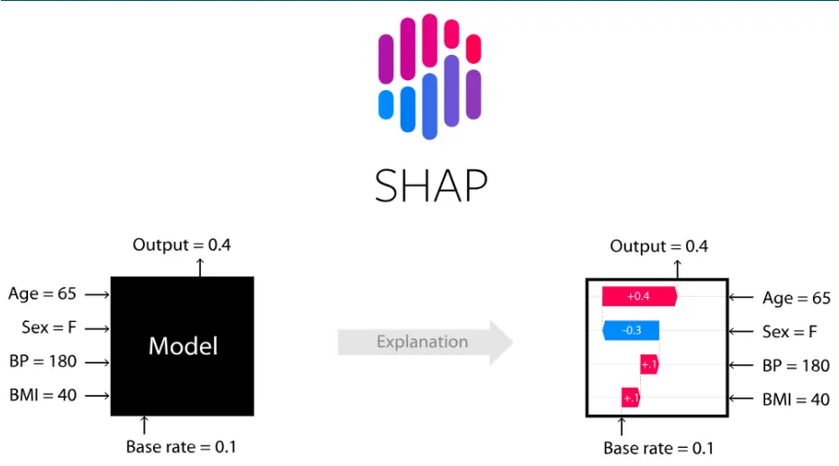
来源：A Unified Approach to Interpreting Model Predictions，国金证券研究所

SHAP 具有良好的解释性，能够量化特征的重要性，并且对任何模型都适用,因此可以用来做模型的事后归因，并进行特征的选择。但是，计算 SHAP 值的过程通常需要大量的计算资源，尤其是在特征数量较多的情况下。

## 2.3 STochastic Gates（STG）

Feature Selection using STochastic Gates（STG）于 2020 年 ICML 大会上由耶鲁大学研究人员提出，为了解决在神经网络估计问题中的特征选择问题。

线性估计中的特征选择问题已经被广泛研究（比如 LASSO），但是在非线性函数的特征选择上却没有那么多的研究。而在许多实际问题中，模型往往是非线性的，因此需要一种能够在非线性环境下进行特征选择的方法。在神经网络中进行特征选择，可以提高模型的解释性，减少过拟合，以及降低计算复杂度。

STG 方法使用了一种基于 L-0 范数的正则化方法进行特征选择。L-0 范数是用于衡量一个向量中非零元素的数量，直接优化 0 范数是一个 NP 难问题。STG 方法使用了一种连续的伯努利分布来近似 0 范数，使得模型可以通过梯度下降来学习特征选择的参数。为此，STG方法提出了一种新的特征选择机制，即随机门（stochastic gate）。每个特征都分配了一个随机门，该门的激活概率是可学习的。训练过程中，随机门根据其激活概率随机地对其对应的特征进行采样。这种机制允许模型在训练过程中自动选择重要的特征。

图表2：STG 模型示意图
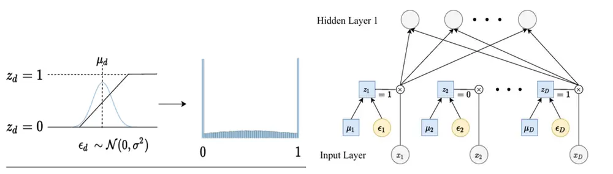
来源：Feature Selection using Stochastic Gates，国金证券研究所

## 三、特征选择方法效果

关于因子选择，我们基于表现良好的 Alpha158 因子库进行筛选。在模型选择上，鉴于梯度提升决策树（GBDT）模型在训练过程中具有自主进行特征选择的能力，因此本报告仅考虑神经网络（NN）模型，并以在我们之前的报告中稳定表现的门控循环单元（GRU）模型作为代表。在选股范围的设定上，为了让实验结果更具普遍性和代表性，我们选择在全 A股市场范围内进行训练和选股。同时，我们也考虑到市场风格会随着时间的推移而发生变化，因此所有的实验都基于年度滚动的方式进行特征的选择和模型的训练。此外，为了确保结果的稳定性和可靠性，所有的训练结果都是基于 5 个不同随机种子进行训练的结果的平均值。这样可以有效地消除随机种子选择对实验结果可能产生的影响，从而使得实验结果更具有信服力。所有的训练标签都是未来 20 个交易日的收益率。

图表3：滚动训练数据划分

| 数据集 所属区间 | 数据集起止时间 |  |  |  |
| --- | --- | --- | --- | --- |
|  | 滚动1 | 滚动2 | … | 滚动10 |
| 训练集 | 2005.01.01-2012.12.31 | 2006.01.01-2013.12.31 | … | 2014.01.01-2021.12.31 |
| 验证集 | 2013.01.01-2014.12.31 | 2014.01.01-2015.12.31 | … | 2022.01.01-2023.12.31 |
| 测试集 | 2015.01.01-2015.12.31 | 2016.01.01-2016.12.31 | … | 2024.01.01-2024.04.30 |

来源：国金证券研究所

## 3.1 基础统计方法

我们选择了三种基础的统计方法进行因子筛选测试，分别是基于 Spearman 相关性、互信息和 LightGBM 模型的重要性进行筛选。具体而言，每次滚动训练时，我们首先基于训练集和验证集的数据与标签，计算各个因子的日度 Spearman 相关性和互信息值。为了提高稳定性和可靠性，我们会求取这些值的平均值。然后，我们选出得分最高的 64 个因子，作为后续步骤的输入。对于 LightGBM 方法，我们使用训练集和验证集进行模型训练。训练完成后，利用 LightGBM 模型自带的 feature_importance 接口来评估各个因子的贡献度，从而选出 64 个最重要的因子。最终筛选出的因子将作为输入，应用于下一步的 GRU（门控循环单元）模型训练。

值得一提的是，除了这三种原始方法，为了防止选择出的 64 个因子内部之间相关性过高，我们还考虑了最大边际相关性采样方法。最大边际相关性（Maximal Marginal Relevance，MMR）是一种用于推荐系统中的重排序方法，旨在平衡结果的相关性和多样性。传统的推荐系统通常仅关注推荐结果的相关性，即推荐的内容与用户兴趣的匹配程度。然而，仅关注相关性可能导致推荐结果的冗余，即推荐结果中的多个项目非常相似，从而降低用户体验。MMR 通过引入多样性度量来解决这一问题。在推荐结果的重排序过程中，MMR 方法会选择那些不仅与用户兴趣高度相关，而且与已选结果具有一定差异性的项目。具体来说，MMR 在每一步选择下一个推荐项目时，会计算该项目对用户兴趣的相关性减去其与已选项目的相似性，从而最大化边际相关性。MMR 的公式通常表示为：

$$
\mathrm{MMR}(D_{i})=\lambda\cdot\mathrm{Rel}(D_{i})-(1-\lambda)\cdot\max_{D_{j}\in S}\mathrm{Sim}(D_{i},D_{j}),
$$

其中： $\operatorname{Rel}(D_{i})$ 表示项目 $D_{i}$ 与用户兴趣的相关性，Sim $\left(D_{i},D_{j}\right)$ 表示项目 $D_{i}$ 与已选项目 $D_{i}$ 之间的相似性，S是已选项目的集合，λ是一个平衡参数，用于调整相关性和多样性之间的权重。通过这种方式，MMR 方法能够生成既符合用户兴趣又具有多样性的推荐结果，从而提升用户体验和满意度。

因此我们试图测试在因子选择的场景下，MMR 是否有效。对于 Spearman 相关性方式，MMR中 $\operatorname{Rel}(D_{i})$ 与Sim $\left(D_{i},D_{j}\right)$ 分别为因子和收益率标签与其它因子 Spearman 相关性的绝对值，λ设置为0.5；而对于互信息方法， $\operatorname{Rel}(D_{i})$ 为因子与收益率标签之间互信息大小，Sim $\left(D_{i},D_{j}\right)$ 为因子之间 Spearman 相关性的绝对值，λ设置为 0.2（考虑到前后两项之间的量纲关系）。基于 Spearman 相关性、互信息和 LightGBM 模型重要性三种方式，叠加 MMR 插件，共有六种方式，在全 A 股上的表现如下：

图表4：基础统计方法各项指标对比

|  |  | IC 均值 | 风险调整 的IC | t统计量 | 多头年化 超额收益 率 | 多头 Sharpe 比率 | 比率 | 多头信息多头超额 最大回撤 | 多空年化多空波动 收益率 | 率 | 多空 Sharpe 比率 | 多空最大 回撤 |
| --- | --- | --- | --- | --- | --- | --- | --- | --- | --- | --- | --- | --- |
| Spearman | 无MMR | 12.54% | 1.37 | 14.46 | 17.66% | 0.87 | 2.61 | 3.21% | 55.93% | 0.13 | 4.30 | 8.38% |
|  | MMR | 12.05% | 1.25 | 13.18 | 15.04% | 0.79 | 2.45 | 4.76% | 46.65% | 0.15 | 3.01 | 9.03% |
|  | 无 MMR | 12.08% | 1.28 | 13.44 | 17.79% | 0.84 | 2.39 | 4.68% | 52.22% | 0.15 | 3.56 | 10.30% |
| 互信息 | MMR | 12.16% | 1.26 | 13.31 | 15.78% | 0.81 | 2.66 | 6.34% | 46.47% | 0.15 | 3.13 | 8.83% |
|  | 无 MMR | 12.18% | 1.38 | 14.58 | 15.51% | 0.81 | 2.68 | 5.39% | 50.53% | 0.14 | 3.70 | 8.57% |
| LightGBM | MMR | 12.44% | 1.38 | 14.58 | 14.88% | 0.79 | 2.55 | 5.19% | 52.52% | 0.13 | 3.90 | 8.26% |

来源：Wind，国金证券研究所

图表5：基础统计方法多空组合净值
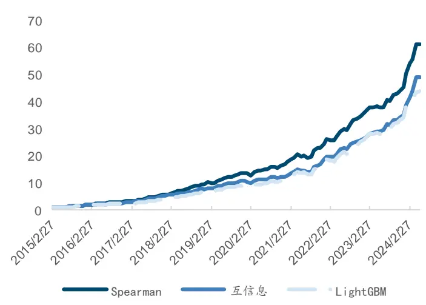
来源：Wind，国金证券研究所

图表6：基础统计方法分位数组合年化超额收益
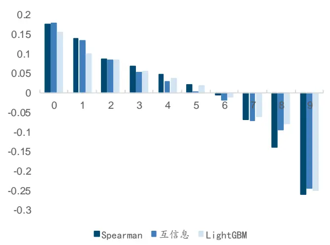
来源：Wind，国金证券研究所

总体来看，Spearman 相关度（无 MMR）在特征筛选方面表现最佳，尤其在多空策略的表现上，显著优于其他几种方法。然而，从分位数组合的年化超额收益来看，互信息（无 MMR）的筛选效果也相当出色。LightGBM 重要度筛选的主要优势体现在较好的风险控制与较小的多空最大回撤。在基础统计方法上，MMR 插件并未显示出显著的优势。

## 3.2 SHAP 方法

对于 SHAP 方法，我们在每次滚动训练时，首先使用 Alpha158 因子集来训练 LightGBM 和GRU 两个模型。接着，我们分别利用 SHAP 库中的树解释器（TreeExplainer）和梯度解释器（GradientExplainer）对这两个模型进行可解释性分析，得到 158 个因子的 SHAP 值。SHAP 值表示每个样本中每个因子对最终结果的贡献度（可以是正值或负值）。因此，我们将贡献度绝对值的均值作为衡量因子重要性的指标。对于 GRU 模型，需要对时序数据取一个平均值，以确保因子重要性测量的准确性。由于 SHAP 方法的计算时间较长，我们会随机采样 10^5 个样本进行分析。经过验证，随着抽样样本数量的增加，筛选出的因子集逐渐趋于稳定，其与全量样本进行 SHAP 分析的误差在可接受范围内。得到的重要性值将用于后续的因子选择。

与基础统计方法类似，我们也借鉴 MMR 引入了因子多样性的考量，由于 SHAP 值的量纲与Spearman 相关性的量纲差距过大，我们采用如下公式计算 MMR 的值：

$$
\mathrm{MMR}(D_{i})=\mathrm{Rel}(D_{i})\cdot\left(1-\max_{D_{j}\in S}\mathrm{Sim}(D_{i},D_{j})\right)
$$

其中，Rel(D )为因子的 SHAP 值，Sim(D ,D )为因子之间 Spearman 相关性的绝对值。由于Spearman 相关性绝对值的取值为[0,1]，乘号右侧的系数取值也为[0,1]，同时满足相关度越高，系数越小的特性。

基于对 LightGBM、GRU 进行 SHAP 分析，叠加 MMR 插件，共有四种方式，在全 A 股上的表现如下：

图表7：基于 SHAP方法因子筛选各项指标对比

|  |  | IC 均值 | 风险调整 的IC | t统计量 | 多头年化 超额收益 率 | 多头 Sharpe 比率 | 比率 | 多头信息多头超额 最大回撤 | 多空年化多空波动 收益率 | 率 | 多空 Sharpe 比率 | 多空最大 回撤 |
| --- | --- | --- | --- | --- | --- | --- | --- | --- | --- | --- | --- | --- |
| LightGBM | 无 MMR | 12.69% | 1.43 | 15.07 | 16.54% | 0.83 | 2.74 | 5.38% | 59.16% | 0.13 | 4.53 | 7.90% |
|  | MMR | 12.32% | 1.38 | 14.56 | 15.45% | 0.79 | 2.75 | 5.23% | 59.19% | 0.13 | 4.67 | 7.69% |
| GRU | 无 MMR | 12.59% | 1.34 | 14.13 | 18.09% | 0.91 | 2.73 | 4.03% | 62.20% | 0.14 | 4.47 | 8.62% |
|  | MMR | 12.47% | 1.33 | 14.00 | 16.09% | 0.84 | 2.56 | 5.04% | 57.28% | 0.14 | 4.23 | 7.75% |

来源：Wind，国金证券研究所

图表8：基于SHAP方法多空组合净值
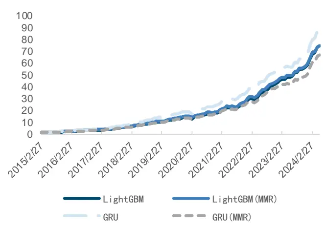
来源：Wind，国金证券研究所

图表9：基于SHAP方法分位数组合年化超额收益
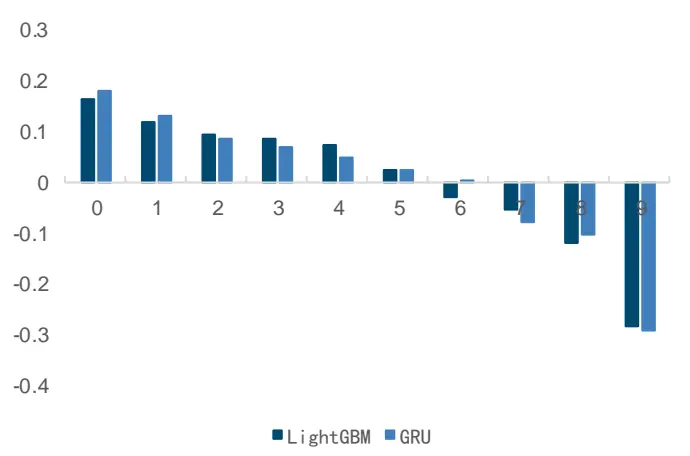
来源：Wind，国金证券研究所

总体而言，这几种方法的表现较为接近，但在某些方面各有优势。具体来说，LightGBM 在IC 统计量上表现更为出色，显示出其在因子预测能力上的优势。然而，GRU 模型在多头策略上的表现更为优异，展现出其在捕捉上涨机会方面的潜力。在多空策略的表现上，LightGBM 的超额收益更高，表明其在平衡多头和空头策略方面具有较强的优势。不过，需要注意的是，LightGBM 的回撤稍大一些，这意味着虽然其收益较高，但伴随的风险也相对较大。总体来看，MMR 插件在这些方法中的表现依旧不尽如人意，未能展现出明显的优势或改进效果。这表明，在当前的模型和数据环境下，MMR 插件的应用效果有限，尚需进一步优化和改进才能发挥其潜力。

此外，SHAP 工具包提供了丰富的可视化工具，使我们能够直观地观察各个因子在模型预测中的作用。这些可视化工具不仅帮助我们理解模型的决策过程，还能为进一步优化模型提供有价值的参考。可以看到，利用 SHAP 的可视化模块，我们可以直观地看到单一样本、部分样本、全体样本中各个因子的贡献值。

图表10：SHAP对特定样本的解释
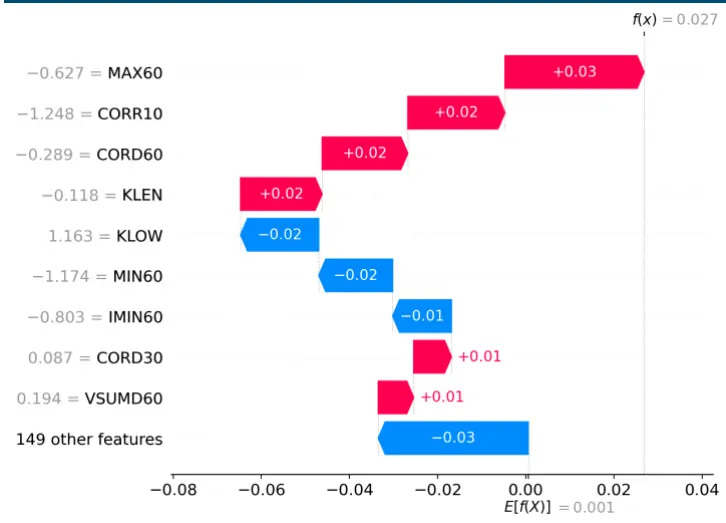
来源：A Unified Approach to Interpreting Model Predictions，国金证券研究所

图表11：SHAP对全部样本集的解释
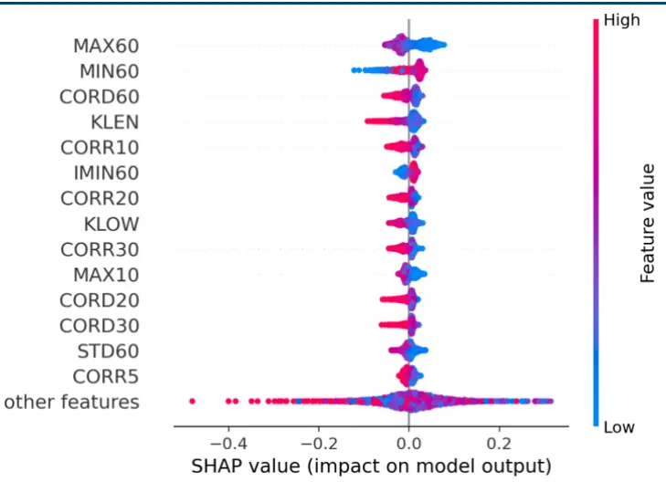
来源：A Unified Approach to Interpreting Model Predictions，国金证券研究所

图表12：SHAP对部分样本的解释
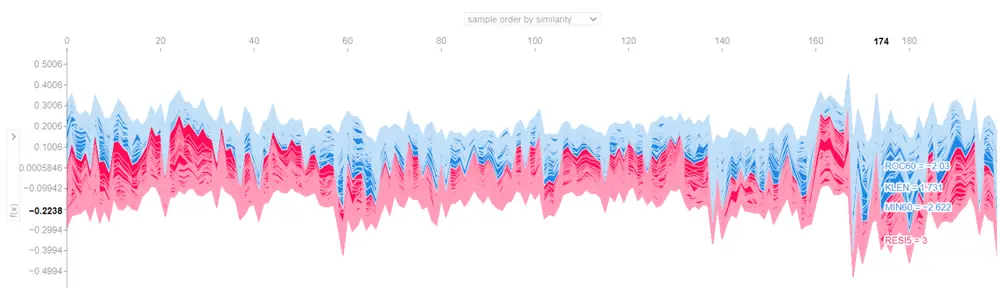
来源：A Unified Approach to Interpreting Model Predictions，国金证券研究所

## 3.3 STG 方法与整体比较

由于 STG 方法是引入一个深度学习模块自行选择合适的因子，不能引入 MMR 模块，因此我们将它与之前的两个特征选择方法在一起比较。在比较之前，我们先可视化一下 STG 的特征选择效果。取第一次滚动时，STG 的特征选择层输出的门控信息，按照从大到小顺序排列，可以看到选择了 44 个因子，剩余的因子对应的门控信号均为 0。，因此 STG 方法可以有效地选择部分特征。

图表13：STG 的特征选择层门控信息
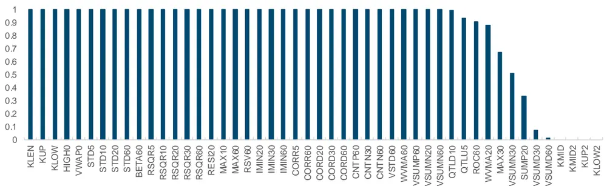
来源：Wind，国金证券研究所

我们将 STG 与 Spearman、互信息、SHAP 对 LightGBM 和 GRU 做解释与不做特征选择的 GRU基准方法，在全 A 股上比较表现。特征选择方法均不考虑 MMR。

图表14：几种特征选择方法各项指标对比

|  | IC 均值 | 风险调 t统计量 |  | 多头年 | 多头 Sharpe 比率 | 多头信 息比率 | 多头超 额最大 回撤 | 多空年 化收益 率 | 多空波 动率 | 多空 Sharpe 比率 | 多空最 大回撤 |
| --- | --- | --- | --- | --- | --- | --- | --- | --- | --- | --- | --- |
|  |  | 整的IC | 化超额 收益率 |  |  |  |  |  |  |  |  |
| GRU 基准 | 12.58% | 1.38 | 14.55 | 17.34% | 0.89 | 2.74 | 5.08% | 51.72% | 0.14 | 3.58 | 7.46% |
| Spearman | 12.54% | 1.37 | 14.46 | 17.66% | 0.87 | 2.61 | 3.21% | 55.93% | 0.13 | 4.30 | 8.38% |
| 互信息 | 12.08% | 1.28 | 13.44 | 17.79% | 0.84 | 2.39 | 4.68% | 52.22% | 0.15 | 3.56 | 10.30% |
| SHAP-LightGBM-GRU | 12.69% | 1.43 | 15.07 | 16.54% | 0.83 | 2.74 | 5.38% | 59.16% | 0.13 | 4.53 | 7.90% |
| SHAP-GRU-GRU | 12.59% | 1.34 | 14.13 | 18.09% | 0.91 | 2.73 | 4.03% | 62.20% | 0.14 | 4.47 | 8.62% |
| STG | 12.01% | 1.34 | 14.14 | 18.26% | 0.84 | 2.91 | 5.18% | 52.41% | 0.14 | 3.64 | 9.22% |

来源：Wind，国金证券研究所

图表15：几种特征选择方法多空净值曲线
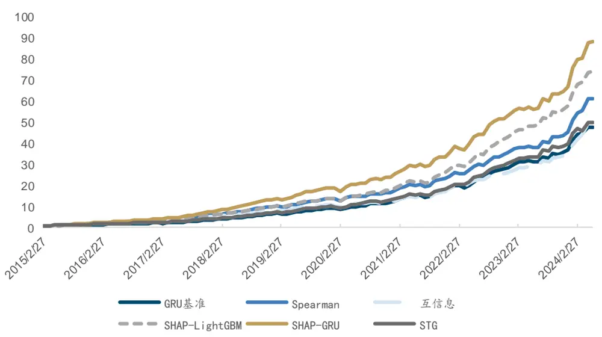
来源：Wind，国金证券研究所

可以看到，基于 SHAP 解释 LightGBM 得到的模型的 IC 统计量表现最好，而在多头超额与多空表现上，基于 SHAP 解释 GRU 得到的模型表现最优。因此，SHAP 解释方法在筛选因子上有着较好的表现。从多空净值曲线来看，大多数特征选择方法的表现均超过了基准 GRU模型。相比之下，STG 方法的表现则显得相对平庸。因此，特征选择方法不仅能够直观地降低训练成本，增强模型的可解释性，同时还有助于提升原有模型的整体表现。

## 3.4 滚动训练的必要性讨论

考虑到市场风格的变化，我们在利用各种方法进行因子筛选时，采取年度滚动的方式，最终取得了较好的表现。因此，我们在此做一个讨论，也就是观察一下每年度选取的因子差异性大小，进而从一个侧面讨论滚动训练是否是有必要的。我们以整体表现最优的 SHAP-GRU 为例，我们将每一次滚动选择的因子按 SHAP 值从左往右降序排列，然后观察每次滚动选择的因子是否出现在了上一次的选择中，如果有则标为红色，如果没有则标为绿色。由此，我们发现大部分分值最高的因子变化较少，排名在 32 名到 64 名的因子变化较快。近年来，变化有向分值较高因子迁移的趋势，可能表征着风格切换的加剧。总体来说，滚动训练是有必要性的。

图表16：滚动训练中选择因子的变化情况

| 滚动1 | 2005 | 2014 |
| --- | --- | --- |
| 滚动2 | 2006 | 2015 |
| 滚动3 | 2007 | 2016 |
| 滚动4 | 2008 | 2017 |
| 滚动5 | 2009 | 2018 |
| 滚动6 | 2010 | 2019 |
| 滚动7 | 2011 | 2020 |
| 滚动8 | 2012 | 2021 |
| 滚动9 | 2013 | 2022 |
| 滚动10 | 2014 | 2023 |

来源：Wind，国金证券研究所

## 四、因子与标签中性化效果

为了确保单因子测试能够准确反映因子本身的收益贡献，必须在测试过程中尽量排除或减少其他可能影响收益的因子（如市值和行业），因为这些因子可能会干扰测试结果。为此，我们采用了一种方法，即在测试中剔除市值和行业因子，以实现所谓的“行业市值中性化”。通过这种方法，我们可以更清晰地观察到被研究因子的纯净收益（Pure Alpha），而不是其他因素的混合效应。

中性化的常见做法是把原始因子值作为被解释变量，行业因子和市值因子作为解释变量进行回归，取回归的残差作为新的因子暴露值，模型如下：

$$
X_{i}=\beta_{0}+{\sum}_{J=1}^{n}\beta_{J}\cdot I_{ij}+\beta_{n+1}M_{i}+\varepsilon_{i}
$$

其中， $X_{i}$ 是股票 i 的原始因子值， $I_{ij}$ 是股票 i 的在行业 j 上的因子暴露 $(I_{ij}$ 为哑变量（Dummy variable），即股票属于某个行业则该股票在该行业的因子暴露等于 1，在其他行业的因子暴露等于 0）。本文我们选用中信一级行业分类作为行业分类标准。 $M_{i}$ 是股票i 的市值或取对数后的市值。

传统的因子中性化方法通常是将最终因子值对行业和市值进行回归，以消除这些因素的影响。为了进一步探索中性化方法的潜力，本文引入了一种新的策略，即对模型输入端因子和标签 y 进行行业和市值因子的回归，并使用回归残差作为新的输入因子和标签进行模型训练。

对于GRU模型，我们考虑在Alpha158上的表现，预测标签是未来20日收益。对于LightGBM模型，我们考虑在 Alpha158 和基本面因子上的表现。在全 A 股市场上，GRU 和 LightGBM基准模型、中性化方法，以及基准与标签中性化合成方法的表现如下所示（由于模型参数设置不同，基准模型的数值与之前存在一些差异）：

图表17：GRU输入数据中性化表现

|  | IC 均值 | 风险调整 的1C | t统计量 | 多头年化 超额收益 率 | 多头信息 比率 | 多头超额 最大回撤 | 多空年化 收益率 | 多空 Sharpe 比 率 | 多空最大 回撤 |
| --- | --- | --- | --- | --- | --- | --- | --- | --- | --- |
| 基准 | 12.20% | 1.31 | 13.85 | 10.61% | 1.64 | 8.75% | 47.93% | 3.60 | 7.49% |
| 因子中性化 | 11.68% | 1.27 | 12.98 | 12.47% | 1.74 | 9.41% | 45.02% | 2.78 | 9.14% |
| 标签中性化 | 11.82% | 1.27 | 13.05 | 9.25% | 1.30 | 10.52% | 35.37% | 2.25 | 17.13% |
| 基准与标签中性化合成 | 12.46% | 1.33 | 13.83 | 9.96% | 1.41 | 10.49% | 44.36% | 3.19 | 8.05% |

来源：Wind，国金证券研究所

图表18：LightGBM输入数据中性化表现

|  | IC 均值 | 风险调整 的IC | t统计量 | 多头年化 超额收益 率 | 多头信息 比率 | 多头超额 最大回撤 | 多空年化 收益率 | 多空 多空最大 |  |
| --- | --- | --- | --- | --- | --- | --- | --- | --- | --- |
|  |  |  |  |  |  |  |  |  | Sharpe 比 率 |
| 基准 | 14.81% | 1.35 | 14.40 | 18.34% | 2.79 | 5.51% | 59.90% | 3.79 | 7.31% |
| 全部因子中性化 | 8.19% | 0.80 | 8.45 | 7.64% | 1.06 | 8.82% | 18.54% | 1.09 | 25.67% |
| 基本面因子中性化 | 6.72% | 0.68 | 7.13 | 12.39% | 1.28 | 14.40% | 31.42% | 2.09 | 16.40% |
| 量价因子中性化 | 8.73% | 0.73 | 7.65 | 7.50% | 0.77 | 14.53% | 25.15% | 1.27 | 23.62% |
| 标签中性化 | 14.14% | 1.20 | 12.69 | 24.39% | 2.59 | 6.13% | 64.35% | 3.51 | 8.05% |
| 基准与标签中性化合成 | 15.03% | 1.35 | 13.98 | 22.88% | 3.35 | 3.22% | 63.04% | 3.80 | 7.82% |

来源：Wind，国金证券研究所

可以看出，对于 GRU 模型，中性化处理对整体表现影响不大，甚至有一定程度的负面影响。而对于 LightGBM 模型，标签中性化处理后与基准合成得到的因子，其 IC、多头超额收益和多空 Sharpe 比率的表现均有显著提升。这两种模型表现差异的原因可能在于，对于 GRU模型，其输入数据本身缺乏基本面信息，标签中性化后，模型更是缺少了这一关键信息，导致表现不佳。因此，对于 GBDT 类模型，我们可以考虑在将因子输入模型之前进行标签的中性化处理，以确保模型能够充分利用基本面信息，从而提升整体表现。

## 五、加入另类因子的效果

## 5.1 宏观指标等截面不变的因子

考虑到量价因子和基本面因子在机器学习选股模型中已经非常拥挤，同时为了更好地捕捉市场趋势和有效管理风险，我们决定引入一些适用于全市场且相对稳定的数据作为模型的因子。这些数据包括宏观经济数据、Barra 因子收益率以及时间截面上同一因子的均值。宏观经济数据能够反映整体经济环境的变化，如 GDP 增长率、通货膨胀率、利率和失业率等，这些因素对公司的盈利能力和市场表现有着深远的影响。Barra 因子收益率则提供了市场上不同风险因子的收益率，如市场风险、行业风险和风格风险等，帮助我们捕捉多种风险因子的影响。此外，时间截面上同一因子的均值可以帮助我们理解因子的长期趋势和稳定性。我们希望这些另类因子的引入可以提高模型的全面性和准确性，增强模型在不同市场环境下的稳定性和鲁棒性，从而更好地捕捉市场趋势。

图表19：各类另类因子描述

| 宏观指标 | 制造业 PMI | 制造业PMI是反映制造业活动的经济指标，数值高于50表示扩张，低于50表示收缩。 |
| --- | --- | --- |
|  | 消费者信心指数 | 消费者信心指数是衡量消费者对经济状况预期和信心的经济指标。 |
|  |  | SHIBOR（上海银行间同业拆放利率）是中国银行间市场上银行相互借贷的利率基准，用于反映市场资金 |
|  | SHIBOR | 供求状况。 |
|  | 社会融资规模存量 | 社会融资规模存量是指实体经济从金融体系获得的资金总量余额。 |
|  | M1 | M1是货币供应量的一个指标，通常包括流通中的现金和企业及个人的活期存款。 |
|  | … | . |
| BARRA 因子收益率 |  | 各类因子（市场因子、行业因子、国家/地区因子和风格因子）收益率可以反应当前市场的风格。 |
| 因子均值 |  | 具体而言，假设×为某个因子，在每个交易日对全部股票的x求均值，即得到该交易日股票的均值因 |
|  |  | 子。这样，该交易日的全部股票取值相同，但在不同交易日之间存在差异，反映了x因子整体分布的时 变特性。 |

来源：Wind，国金证券研究所

对于 GRU 方法，我们首先将 Alpha158 与三类另类因子分别合并得到三个因子库，接着利用之前特征选择中表现较好的 Spearman 方法分别进行特征筛选，结果发现另类因子几乎都没有被筛选出来。因此我们认为对于 GRU 方法，另类因子可能缺乏影响力。而对于LightGBM 方法，其天然地具有特征选择的能力，因此我们将 Alpha158、基本面因子和三类另类因子分别组合，训练得到三个 LightGBM 选股模型。它们在 A 股上的表现如下：

图表20：另类因子加入后LightGBM的表现

|  | IC 均值 | 风险调整 的IC | t统计量 | 多头年化 超额收益 率 | 多头 Sharpe 比率 | 比率 | 多头信息多头超额 最大回撤 | 多空年化多空波动 收益率 | 率 | 多空 Sharpe 比率 | 多空最大 回撤 |
| --- | --- | --- | --- | --- | --- | --- | --- | --- | --- | --- | --- |
| LightGBM 基准 | 13.24% | 1.19 | 12.49 | 28.50% | 1.07 | 2.50 | 5.09% | 78.17% | 0.17 | 4.53 | 11.80% |
| +宏观 | 12.42% | 0.99 | 10.40 | 35.10% | 1.20 | 2.49 | 6.54% | 83.44% | 0.21 | 4.05 | 10.84% |
| +BARRA | 12.52% | 1.12 | 11.76 | 24.49% | 0.94 | 2.05 | 5.09% | 67.79% | 0.18 | 3.78 | 12.12% |
| +均值 | 13.19% | 0.96 | 10.12 | 17.81% | 0.80 | 1.87 | 17.51% | 65.19% | 0.18 | 3.56 | 11.13% |

来源：Wind，国金证券研究所

图表21：另类因子多空组合净值
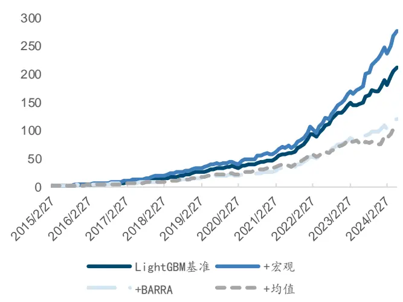
来源：Wind，国金证券研究所

图表22：另类因子分位数组合年化超额收益
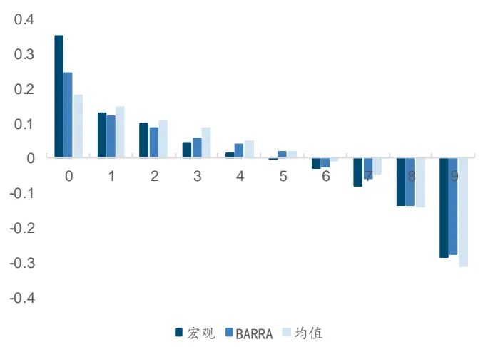
来源：Wind，国金证券研究所

可以看到，另类因子在 IC 表现上并未产生贡献，但在多头超额收益和多空表现方面，加入宏观因子后均超越了基准。因此，引入宏观经济数据，可以在一定程度上帮助模型学习市场走向，从而获得超额收益。总体而言，另类因子对模型表现缺乏显著的正向作用，这需要进一步研究。

## 5.2 分钟频量价数据计算的高频因子

以上讨论的因子主要基于日频量价数据或低频的基本面数据构建，而分钟级别的高频数据同样在量化研究中备受关注。本章节将初步探讨利用高频数据构建因子对时序选股模型的影响。对于每一个交易日的分钟频 OHLCV 数据，我们将每日交易时间三等分，与整日的数据一起，计算四组日频的基础因子共 212 个。

图表23：国金金工基础高频因子

| 因子大类 | 因子名 | 因子描述 |
| --- | --- | --- |
| 基础统计特征 | vol_mean | 成交量平均值 |
|  | vol_kurt | 成交量峰度 |
|  | ret_skew | 分钟收益率偏度 |
|  | … | … |
| 价量相关性 | corr_rv | 收益率与成交量的pearson相关性 |
|  | corr_pv | 价格与成交量的pearson相关性 |
|  | … | … |
| 波动性 | downretstd_ratio | 股价下降的分钟数占比 |
|  | pos_ret_ratio | 收益率为正占比 |
|  | … | … |

来源：国金证券研究所

由于高频因子种类繁多，我们根据之前对特征选择方法的分析，选用了表现较好的SHAP-LightGBM 方法进行特征筛选，最终挑选出 64 个因子用于训练。具体操作是先用 212 个高频因子训练一个可靠的 LightGBM 模型，然后对该模型进行 SHAP 分析，再将 SHAP 值较高的 64 个因子选出，作为 GRU 模型的输入。考虑到市场普遍认为高频因子的表现与市值密切相关，我们在不同的宽基指数上对高频因子进行了分析。经过计算，模型得到的高频因子与日频因子在沪深 300、中证 500、中证 1000 上的相关系数分别为 0.35、0.42、0.47，相关性均不强，因此我们同时考虑日频因子和高频因子的合成（需注意，此处表格中的中性化是指在得到最终因子值之后进行的中性化处理，与上文中作为输入的标签中性化无关）。

图表24：沪深300上高频因子表现

|  | 风险调整 IC 均值 | t统计量 的IC |  | 多头年化 超额收益 Sharpe 比 率 | 多头 率 | 多头信息多头超额 |  | 多空年化多空波动 收益率 | 率 | 多空 Sharpe 比 率 | 多空最大 回撤 |  |
| --- | --- | --- | --- | --- | --- | --- | --- | --- | --- | --- | --- | --- |
|  |  |  |  |  |  |  |  |  |  |  |  | 比率最大回撤 |
| 高频 | 9.06% | 0.56 | 5.87 | 9.58% | 0.63 | 1.07 | 15.73% | 30.66% | 0.18 | 1.73 | 14.42% |  |
| 高频中性化 | 6.34% | 0.53 | 5.55 | 6.01% | 0.41 | 0.71 | 13.18% | 20.11% | 0.14 | 1.39 | 15.75% |  |
| 日频 | 12.61% | 0.82 | 8.66 | 17.78% | 0.97 | 1.82 | 11.66% | 44.02% | 0.18 | 2.47 | 16.72% |  |
| 日频中性化 | 10.09% | 0.81 | 8.57 | 17.20% | 0.87 | 2.02 | 7.11% | 37.80% | 0.15 | 2.60 | 9.73% |  |
| 合成 | 12.91% | 0.76 | 8.05 | 16.34% | 0.98 | 1.64 | 10.53% | 44.29% | 0.20 | 2.18 | 21.23% |  |
| 合成中性化 | 10.08% | 0.78 | 8.17 | 13.10% | 0.74 | 1.49 | 10.52% | 33.39% | 0.17 | 1.99 | 21.15% |  |

来源：Wind，国金证券研究所

图表25：沪深300上高频因子多空组合净值
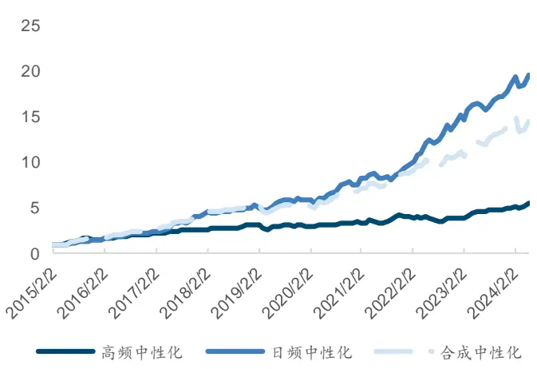
来源：Wind，国金证券研究所

图表26：沪深300上高频因子分位数组合年化超额收益
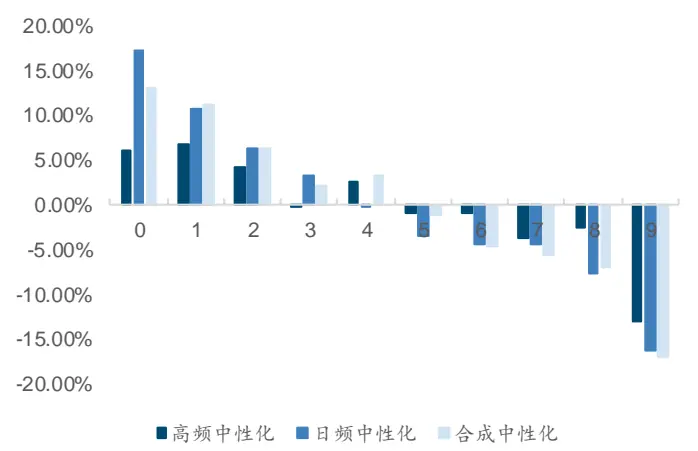
来源：Wind，国金证券研究所

可以看出，在沪深 300 这类大盘成分股中，高频因子的表现相对较差，各项指标均不如日频因子。即使将高频因子与日频因子合成后，整体表现也会受到拖累。

图表27：中证500上高频因子表现

|  | 风险调整 IC 均值 |  |  | 多头年化 超额收益 Sharpe 比 | 多头 率 | 多头信息多头超额 | 比率最大回撤 | 多空年化多空波动 收益率 | 率 | 多空 Sharpe 比 率 | 多空最大 回撤 |
| --- | --- | --- | --- | --- | --- | --- | --- | --- | --- | --- | --- |
|  |  | 的IC | t统计量 率 |  |  |  |  |  |  |  |  |
| 高频 | 10.26% | 0.71 | 7.47 | 7.77% | 0.47 | 1.03 | 10.02% | 30.28% | 0.16 | 1.92 | 15.52% |
| 高频中性化 | 8.98% | 0.80 | 8.40 | 7.59% | 0.45 | 1.17 | 6.00% | 27.53% | 0.13 | 2.15 | 10.32% |
| 日频 | 10.94% | 1.00 | 10.50 | 11.22% | 0.54 | 1.54 | 12.78% | 34.08% | 0.15 | 2.21 | 12.27% |
| 日频中性化 | 9.40% | 1.00 | 10.54 | 9.10% | 0.47 | 1.33 | 14.43% | 30.13% | 0.14 | 2.16 | 9.03% |
| 合成 | 11.96% | 0.90 | 9.48 | 9.53% | 0.53 | 1.14 | 19.04% | 34.89% | 0.16 | 2.12 | 18.03% |
| 合成中性化 | 10.44% | 0.96 | 10.12 | 9.52% | 0.51 | 1.39 | 7.27% | 30.14% | 0.14 | 2.21 | 12.39% |

来源：Wind，国金证券研究所

图表28：中证500上高频因子多空组合净值
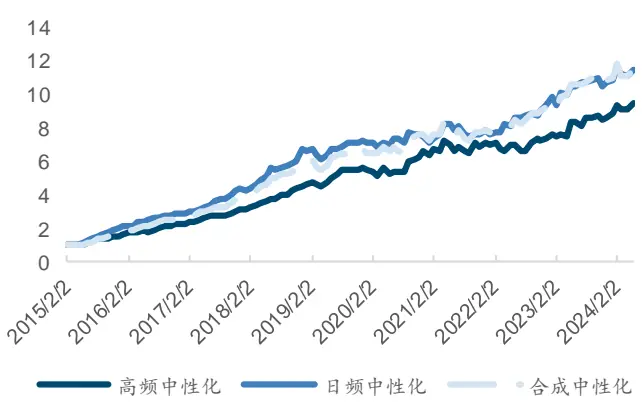
来源：Wind，国金证券研究所

图表29：中证500上高频因子分位数组合年化超额收益
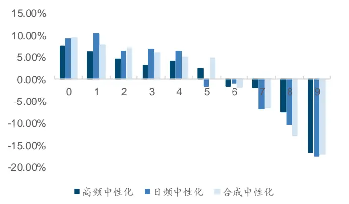
来源：Wind，国金证券研究所

在中证 500 这类中小盘股上，高频因子的表现有所改善，但仍未能超越日频因子。合成后的因子总体表现与日频因子相当。

图表30：中证1000上高频因子表现

|  | 风险调整 IC 均值 | 的IC | t统计量 | 多头年化 超额收益 Sharpe 比 率 | 多头 率 | 多头信息多头超额 | 比率最大回撤 | 多空年化多空波动 收益率 | 率 | 多空 Sharpe 比 率 | 多空最大 回撤 |
| --- | --- | --- | --- | --- | --- | --- | --- | --- | --- | --- | --- |
| 高频 | 13.96% | 1.11 | 11.72 | 16.56% | 0.66 | 2.11 | 5.32% | 57.66% | 0.16 | 3.56 | 9.24% |
| 高频中性化 | 13.06% | 1.32 | 13.95 | 15.80% | 0.61 | 2.09 | 7.97% | 54.60% | 0.14 | 3.94 | 10.43% |
| 日频 | 13.93% | 1.42 | 14.97 | 20.23% | 0.76 | 2.73 | 8.14% | 62.94% | 0.16 | 4.02 | 15.21% |
| 日频中性化 | 12.83% | 1.59 | 16.70 | 20.34% | 0.75 | 2.93 | 6.68% | 57.32% | 0.14 | 4.15 | 15.39% |
| 合成 | 15.74% | 1.39 | 14.63 | 22.26% | 0.83 | 2.77 | 7.71% | 68.30% | 0.17 | 4.10 | 14.22% |
| 合成中性化 | 14.71% | 1.63 | 17.17 | 20.91% | 0.78 | 3.08 | 4.75% | 63.94% | 0.14 | 4.70 | 11.00% |

来源：Wind，国金证券研究所

图表31：中证1000上高频因子多空组合净值
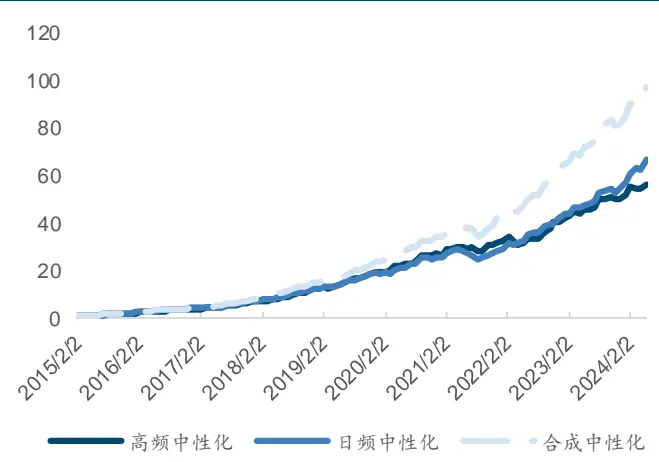
来源：Wind，国金证券研究所

图表32：中证1000上高频因子分位数组合年化超额收益
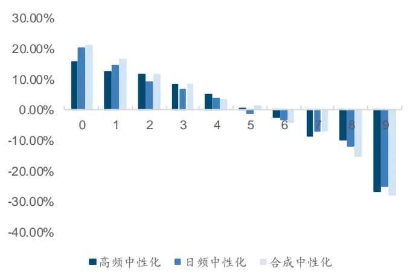
来源：Wind，国金证券研究所

在中证 1000 这类小微盘成分股上，高频因子的表现相当出色，不仅在 IC 均值上超越了日频因子，且合成后的 IC 均值达到了 15.74%。此外，合成后的因子在多空组合净值和分组效果上也表现优异。因此，初步应用高频因子在小微盘股上显示出较高的有效性，而在大中盘股上的应用方法仍需进一步探索。

## 六、特征工程优化的GBDT+NN指数增强策略

基于前述对机器学习模型特征选择、另类因子引入以及因子和标签中性化的测试结果，我们整合了所有有效结论，重新训练模型并在沪深 300、中证 500 和中证 1000 这三种宽基指数上进行测试。具体来说，对于神经网络类模型 TCN、GRU 和 Transformer，我们采用了通过对 LightGBM 的 SHAP 解释方法筛选出 Alpha158 因子中的 64 个特征；而对于 GBDT 类模型 XGBoost、LightGBM 和 CatBoost，我们则结合了 Alpha158 因子和基本面因子，并分别使用进行了和未进行行业市值中性化的预测标签进行训练，进一步在单个模型内部进行合成。最终，我们合成得到了神经网络类模型（NN）、梯度提升树类模型（GBDT）以及结合了 GBDT 和 NN 特性的混合模型（GBDT+NN）。整体模型结构如下图。

图表33：特征工程优化的 GBDT+NN模型结构
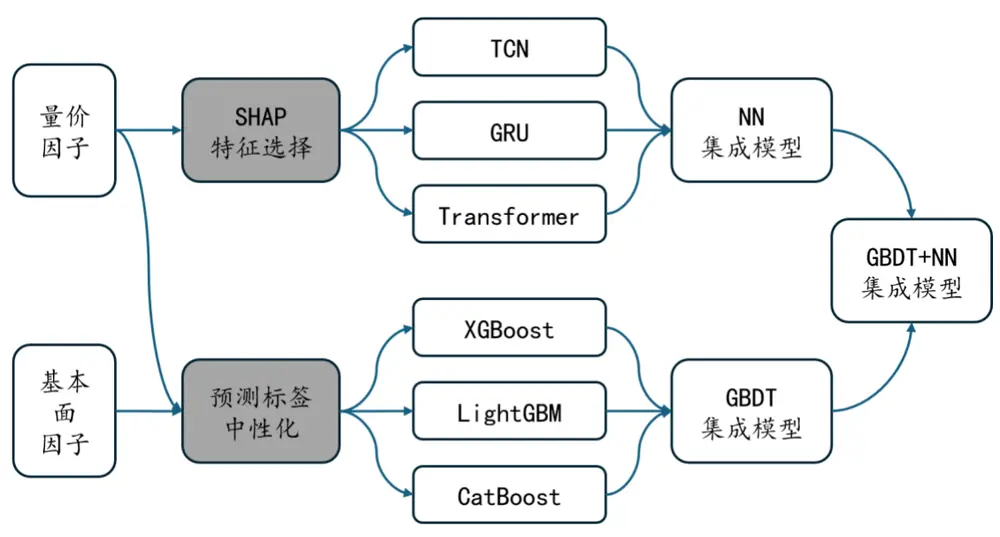
来源：国金证券研究所

## 6.1 因子测试结果

每个模型均采用 5 个随机种子取其均值作为最终结果，并为确保可交易性，将因子值向后推一天。回测时间段为 2015 年 2 月 1 日至2024 年5 月31 日，调仓频率为每月月初进行。具体来说，模型合成后的因子在沪深 300 成分股上的表现与《Alpha 掘金系列之十：机器学习全流程重构》中的方法比较如下（需注意，此处表格中的中性化是指在得到最终因子值之后进行的中性化处理，与上文中作为输入的标签中性化无关）：

图表34：特征工程优化的GBDT+NN 因子在沪深 300成分股的各项指标

|  | IC 均值 | 风险调整 的1C | t统计量 | 多头年化 超额收益 率 | 多头 Sharpe 比率 | 多头信息多头超额 |  | 多空年化多空波动 率 |  | 多空 Sharpe 比率 | 多空最大 回撤 |
| --- | --- | --- | --- | --- | --- | --- | --- | --- | --- | --- | --- |
|  |  |  |  |  |  |  |  | 比率最大回撤 | 收益率 |  |  |
| GBDT+NN | 13.95% | 0.85 | 8.92 | 20.61% | 1.03 | 2.05 | 8.25% | 49.95% | 0.20 | 2.52 | 21.19% |
| GBDT+NN 中性化 | 11.19% | 0.90 | 9.51 | 18.61% | 0.86 | 2.24 | 4.86% | 41.56% | 0.15 | 2.72 | 13.00% |
| GBDT+NN+FE | 14.97% | 0.85 | 8.98 | 22.47% | 1.16 | 2.02 | 10.15% | 54.22% | 0.21 | 2.62 | 16.43% |
| GBDT+NN+FE 中性化 | 11.91% | 0.90 | 9.46 | 22.92% | 1.11 | 2.73 | 6.56% | 49.54% | 0.16 | 3.13 | 19.32% |

来源：Wind，国金证券研究所

从结果可以看出，经过特征选择和标签中性化改进后 GBDT+NN 模型展现出优异的选股表现。在进行行业和市值中性化处理后，模型的 IC 均值分别达到了 11.91%，多头策略下年化超额收益率高达 22.92%，而超额回撤则控制在 6.56%。相较原始 GBDT+NN 模型，这些指标表现出明显的提升，显示出特征工程优化的优越性。

图表35：GBDT+NN+FE在 300上多头超额净值曲线
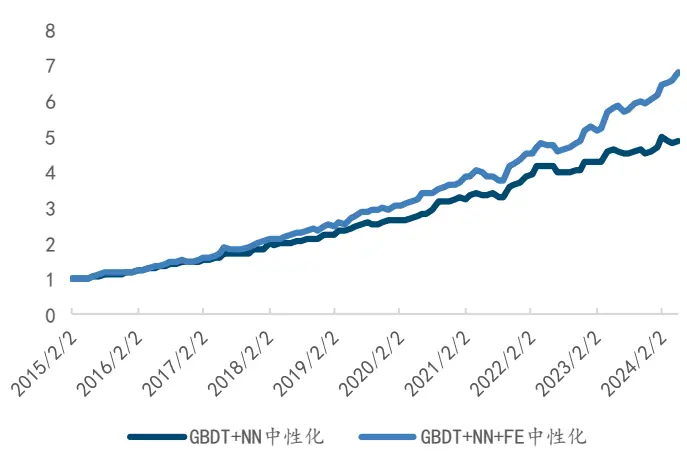
来源：Wind，国金证券研究所

图表36：GBDT+NN+FE在 300上多空净值曲线
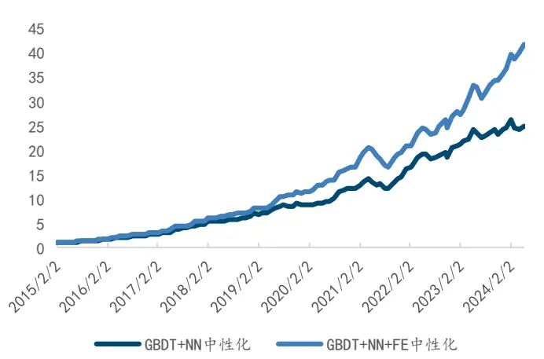
来源：Wind，国金证券研究所

在中证 500 中，我们以同样方式对两类模型所得因子进行测试，因子主要指标如下：

图表37：特征工程优化的GBDT+NN因子在中证500成分股的各项指标

|  | IC 均值 | 风险调整 的IC | t统计量 | 多头年化 超额收益 率 | 多头 Sharpe 比率 | 多头信息多头超额 比率最大回撤 |  | 多空年化多空波动 |  | 多空 Sharpe 比率 | 多空最大 回撤 |
| --- | --- | --- | --- | --- | --- | --- | --- | --- | --- | --- | --- |
|  |  |  |  |  |  |  |  | 收益率 | 率 |  |  |
| GBDT+NN | 12.35% | 0.98 | 10.36 | 11.58% | 0.53 | 1.34 | 20.97% | 41.60% | 0.17 | 2.39 | 14.76% |
| GBDT+NN 中性化 | 10.79% | 1.06 | 11.21 | 10.12% | 0.48 | 1.36 | 14.33% | 36.36% | 0.15 | 2.38 | 19.99% |
| GBDT+NN+FE | 13.40% | 1.04 | 11.00 | 13.69% | 0.66 | 1.54 | 10.90% | 45.84% | 0.17 | 2.65 | 10.64% |
| GBDT+NN+FE中性化 | 11.58% | 1.12 | 11.81 | 12.34% | 0.59 | 1.70 | 10.14% | 39.83% | 0.15 | 2.70 | 13.76% |

来源：Wind，国金证券研究所

可以看出，在中证 500 指数上，因子表现同样出色。两类模型合成后的因子 IC 均值达到11.58%，多头策略的年化超额收益为 12.34%，而多头策略的最大超额回撤为 10.14%。尽管这一表现相比于沪深 300 指数的收益水平和稳定性稍有下降，但整体仍然保持了较高的表现和相对稳健的回撤控制能力，显示出在中证 500 环境下的良好适应性。

图表38：GBDT+NN+FE在 500上多头超额净值曲线
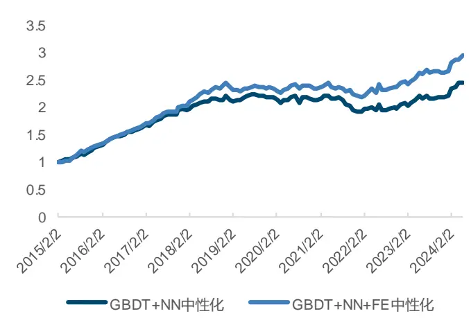
来源：Wind，国金证券研究所

图表39：GBDT+NN+FE在 500上多空净值曲线
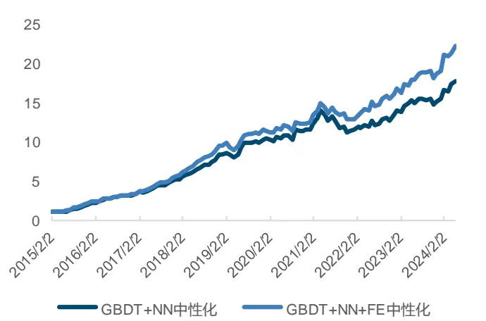
来源：Wind，国金证券研究所

在中证1000成分股中，因子的表现尤为出色。两类模型合成后的因子IC均值高达16.62%，即便在进行行业市值中性化处理后，因子 IC 均值仍保持在 15.42%的高水平。在多头策略方面，年化超额收益率达到令人瞩目的 25.39%，经过中性化调整后，因子收益率更是进一步提升至 25.42%。此外，多头策略的最大超额回撤仅为 4.42%，展现出卓越的风险控制能力。这些数据表明，在中证 1000 指数环境中，因子不仅具备强大的收益潜力，同时也能有效控制回撤风险，表现极为优异。

图表40：特征工程优化的 GBDT+NN因子在中证1000成分股的各项指标

|  | IC 均值 | 风险调整 的IC | t统计量 | 多头年化 超额收益 率 | 多头 Sharpe 比率 | 多头信息多头超额 比率最大回撤 |  | 多空年化多空波动 率 |  | 多空 Sharpe 比率 | 多空最大 回撤 |
| --- | --- | --- | --- | --- | --- | --- | --- | --- | --- | --- | --- |
|  |  |  |  |  |  |  |  |  | 收益率 |  |  |
| GBDT+NN | 16.01% | 1.45 | 15.31 | 23.48% | 0.86 | 3.21 | 3.85% | 72.38% | 0.17 | 4.29 | 14.07% |
| GBDT+NN 中性化 | 14.90% | 1.66 | 17.48 | 23.30% | 0.83 | 3.22 | 3.12% | 70.00% | 0.16 | 4.49 | 11.99% |
| GBDT+NN+FE | 16.62% | 1.50 | 15.85 | 25.39% | 0.95 | 3.41 | 6.13% | 77.93% | 0.17 | 4.70 | 16.77% |
| GBDT+NN+FE 中性化 | 15.42% | 1.72 | 18.17 | 25.42% | 0.92 | 3.61 | 4.42% | 72.14% | 0.15 | 4.85 | 15.83% |

来源：Wind，国金证券研究所

图表41：GBDT+NN+FE在1000上多头超额净值曲线
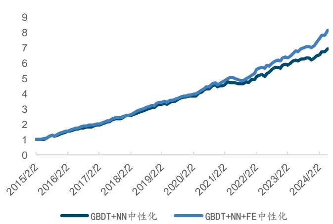
来源：Wind，国金证券研究所

图表42：GBDT+NN+FE在 1000上多空净值曲线
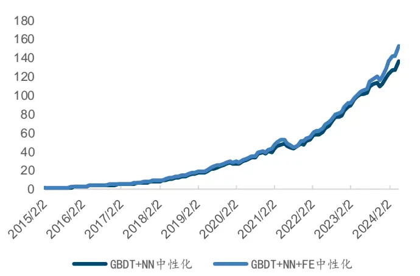
来源：Wind，国金证券研究所

## 6.2 特征工程优化的GBDT+NN 的指数增强策略

为进一步贴近投资实际需求，我们构建了基于上述机器学习模型的指数增强策略。具体而言，我们通过应用马科维茨均值-方差优化模型，对投资组合的跟踪误差进行了严格限制，同时对个股的偏离程度进行了有效控制，以减少策略的波动性。此外，此优化模型还旨在最大化预期的超额收益率。这一策略的设计不仅注重风险管理，更力求在实际投资操作中实现最佳收益表现。

$$
\begin{aligned}&s.t.\begin{aligned}\\&\sqrt{(w-w_{bench})\Sigma(w-w_{bench})'}\leq target\_TE\\&|w-w_{bench}|\leq1\%\\&\end{aligned}\\\end{aligned}
$$

其中，f为模型的预测信号， $w_{bench}$ 为基准权重向量，target_TE 为目标跟踪误差。

在本篇报告中，我们将年化跟踪误差控制为最大不能超过 5%，使用优化器对投资组合权重进行优化，回测期为 2015 年 2 月 1 日至 2024 年 5月 31 日，以每月第一个交易日的收盘价进行月频调仓，假定手续费率为单边千二，在各宽基指数上的测试结果如下：

图表43：特征工程优化的GBDT+NN沪深300指数增强策略指标

|  | GBDT+NN | GBDT+NN+FE |
| --- | --- | --- |
| 年化收益率 | 15.90% | 17.19% |
| 年化波动率 | 20.92% | 20.86% |
| Sharpe 比率 | 0.76 | 0.82 |
| 最大回撤率 | 39.38% | 38.48% |
| 平均换手率 | 99.76% | 98.94% |
| 年化超额收益率 | 14.56% | 15.83% |
| 跟踪误差 | 4.39% | 4.23% |
| 信息比率 | 3.32 | 3.74 |
| 超额最大回撤 | 3.50% | 3.18% |

来源：Wind，国金证券研究所

图表44：GBDT+NN+FE在 300上指增策略净值曲线
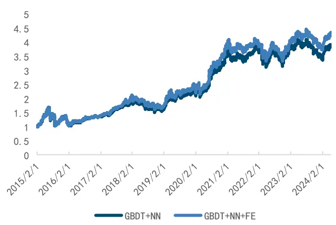
来源：Wind，国金证券研究所

图表45：GBDT+NN+FE在 300上指增策略超额净值曲线
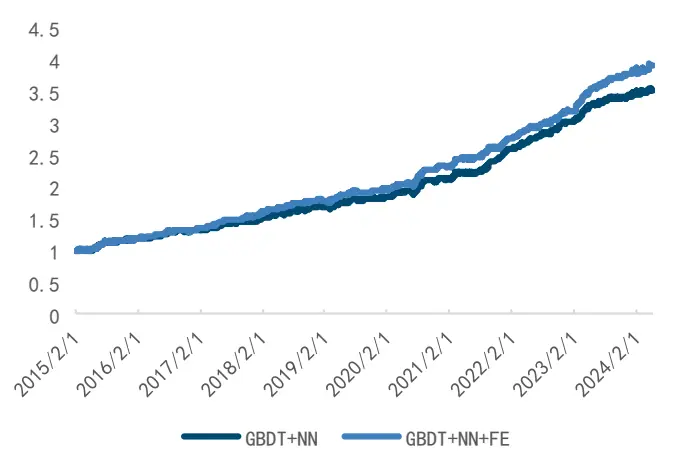
来源：Wind，国金证券研究所

通过组合优化的控制，我们发现策略在回撤控制等方面的表现得到了显著提升。以沪深300 指数作为基准，策略的年化超额收益率达到了 15.83%，而超额最大回撤仅为 3.18%。从年度表现来看，除了在 2019 年和 2024 年策略的超额收益未达到 10%之外，其余年份均实现了较高的超额收益水平。这表明通过优化后的策略在各个方面表现更加稳健和优异，有助于投资者获取更高的长期收益。

图表46：特征工程优化的GBDT+NN沪深 300指数增强策略分年度收益
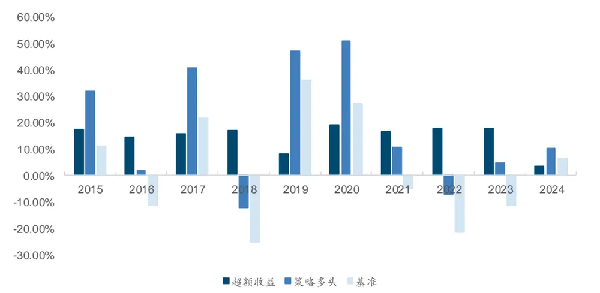
来源：Wind，国金证券研究所

图表47：特征工程优化的 GBDT+NN沪深300指数增强策略分年度收益数值

| 年份 | 超额收益 | 策略多头 | 基准 |
| --- | --- | --- | --- |
| 2015 | 17.35% | 31.89% | 11.24% |
| 2016 | 14.31% | 1.80% | -11.28% |
| 2017 | 15.90% | 40.76% | 21.78% |
| 2018 | 16.95% | -12.27% | -25.31% |
| 2019 | 8.07% | 47.17% | 36.07% |
| 2020 | 19.29% | 50.71% | 27.21% |
| 2021 | 16.40% | 10.57% | -5.20% |
| 2022 | 17.74% | -7.24% | -21.63% |
| 2023 | 17.66% | 4.59% | -11.38% |
| 2024 | 3.29% | 10.24% | 6.61% |

来源：Wind，国金证券研究所

同样地，我们在中证 500 成分股进行指数增强策略的构建，策略的年化超额收益率达到了18.23%，超额最大回撤为 8.21%。

图表48：特征工程优化的GBDT+NN中证500指数增强策略指标

|  | GBDT+NN | GBDT+NN+FE |
| --- | --- | --- |
| 年化收益率 | 17.70% | 18.82% |
| 年化波动率 | 23.59% | 23.45% |
| Sharpe 比率 | 0.75 | 0.80 |
| 最大回撤率 | 42.33% | 41.63% |
| 平均换手率 | 124.82% | 120.58% |
| 年化超额收益率 | 17.26% | 18.23% |
| 跟踪误差 | 5.32% | 5.26% |
| 信息比率 | 3.25 | 3.46 |
| 超额最大回撤 | 9.10% | 8.21% |

来源：Wind，国金证券研究所

图表49：GBDT+NN+FE在500上指增策略净值曲线
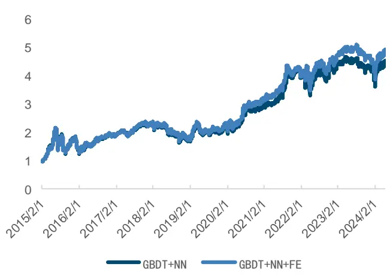
来源：Wind，国金证券研究所

图表50：GBDT+NN+FE在 500上指增策略超额净值曲线
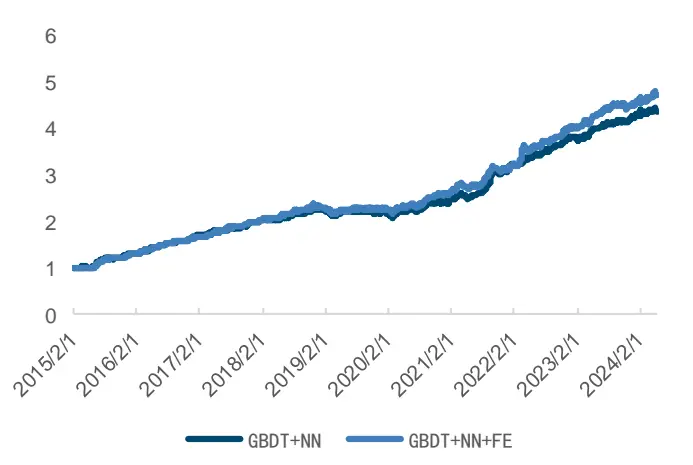
来源：Wind，国金证券研究所

分年度来看，中证 500 指数增强策略稳定性略差于沪深 300，超额收益率在 2019 和 2024年较低，其余年份均在 10%以上。

图表51：特征工程优化的 GBDT+NN中证500指数增强策略分年度收益
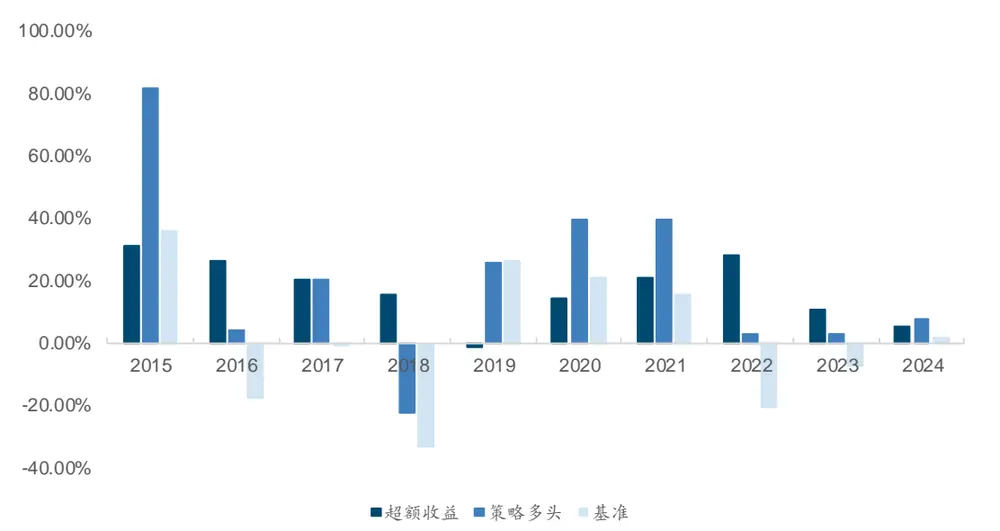
来源：Wind，国金证券研究所

图表52：特征工程优化的 GBDT+NN中证500指数增强策略分年度收益数值

| 年份 | 超额收益 | 策略多头 | 基准 |
| --- | --- | --- | --- |
| 2015 | 31.12% | 81.56% | 35.80% |
| 2016 | 26.53% | 4.11% | -17.78% |
| 2017 | 20.49% | 20.42% | -0.20% |
| 2018 | 15.77% | -22.58% | -33.32% |
| 2019 | -1.61% | 25.66% | 26.38% |
| 2020 | 14.34% | 39.69% | 20.87% |
| 2021 | 20.95% | 39.54% | 15.58% |
| 2022 | 28.37% | 3.13% | -20.31% |
| 2023 | 10.95% | 2.93% | -7.42% |
| 2024 | 5.23% | 7.83% | 1.83% |

来源：Wind，国金证券研究所

最后，使用同样的方式我们构建了机器学习中证 1000 指数增强策略，策略的年化超额收益达到 32.24%，超额最大回撤为 3.88%。

图表53：特征工程优化的 GBDT+NN中证 1000 指数增强策略指标

|  | GBDT+NN | GBDT+NN+FE |
| --- | --- | --- |
| 年化收益率 | 29.22% | 30.75% |
| 年化波动率 | 26.42% | 26.20% |
| Sharpe 比率 | 1.11 | 1.17 |
| 最大回撤率 | 44.30% | 44.46% |
| 平均换手率 | 142.96% | 146.09% |
| 年化超额收益率 | 30.73% | 32.24% |
| 跟踪误差 | 6.09% | 5.87% |
| 信息比率 | 5.05 | 5.50 |
| 超额最大回撤 | 4.63% | 3.88% |

来源：Wind，国金证券研究所

图表54：GBDT+NN+FE在1000上指增策略净值曲线
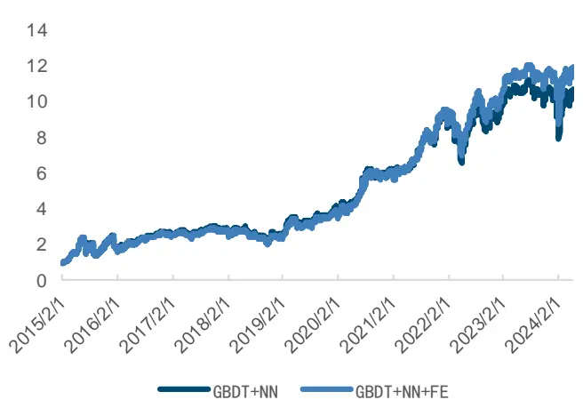
来源：Wind，国金证券研究所

图表55：GBDT+NN+FE在 1000上指增策略超额净值曲线
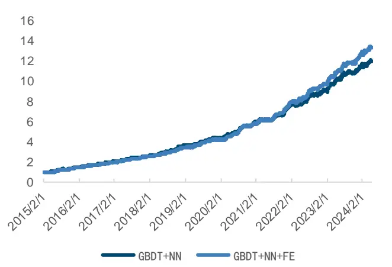
来源：Wind，国金证券研究所

分年度来看，策略在中证 1000 上表现最为稳定，每一年的超额收益均在 20%以上。

图表56：特征工程优化的 GBDT+NN中证1000指数增强策略分年度收益
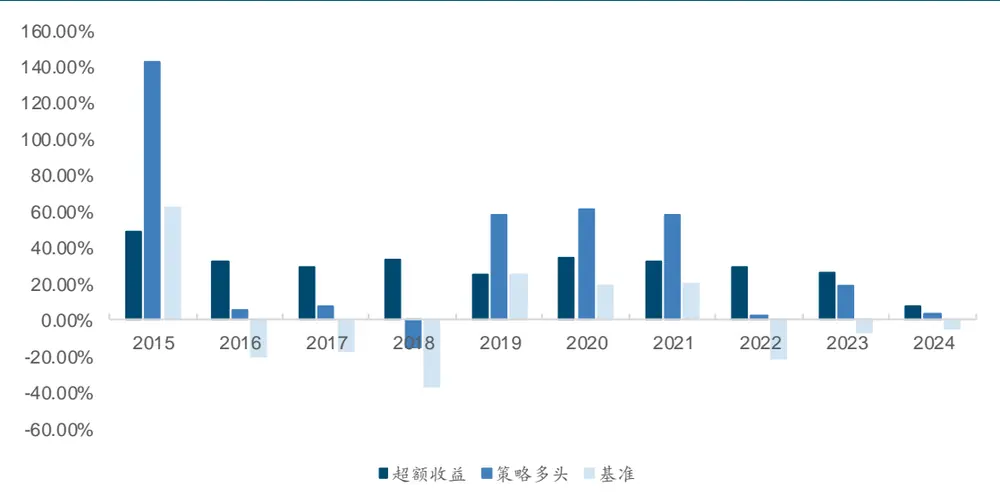
来源：Wind，国金证券研究所

图表57：特征工程优化的 GBDT+NN中证1000指数增强策略分年度收益数值

| 年份 | 超额收益 | 策略多头 | 基准 |
| --- | --- | --- | --- |
| 2015 | 48.80% | 143.14% | 62.40% |
| 2016 | 31.99% | 5.83% | -20.01% |
| 2017 | 29.50% | 7.46% | -17.35% |
| 2018 | 33.69% | -14.73% | -36.87% |
| 2019 | 25.06% | 58.06% | 25.67% |
| 2020 | 34.96% | 61.67% | 19.39% |
| 2021 | 31.96% | 57.99% | 20.52% |
| 2022 | 29.69% | 2.91% | -21.58% |
| 2023 | 26.41% | 18.72% | -6.28% |
| 2024 | 7.32% | 3.15% | -4.76% |

来源：Wind，国金证券研究所

## 总结

本研究探索了量化投资领域中因子的特征工程，对 GRU 中的特征筛选方法进行详尽讨论，使用基础统计方法、SHAP 解释方法和 STG 深度学习模块三类特征选择方法进行测试，发现利用 SHAP 对训练得到的模型进行解释之后，将 SHAP 值较高的因子选择出来喂入模型，对 GRU 模型有一定的提升；引入另类因子如宏观因子、BARRA 风格因子、高频因子等，与日频量价因子及基本面常规因子一同喂入模型，测试模型效果，发现宏观与 BARRA 收益率等截面相同的因子增益不强，而高频因子在中证 1000 小盘股上有突出表现；对原始输入因子中性化进行讨论，从量价因子中性化、基本面因子中性化、标签数据中性化进行讨论，发现标签数据中性化对 LightGBM 模型有明显增益。

我们利用特征工程改进了 GBDT+NN 模型，并结合实际交易构建了基于各宽基指数的指数增强策略。其中，沪深 300 指数增强策略年化超额收益达到 15.83%，超额最大回撤为 3.18%。中证 500 指数增强策略年化超额收益 18.23%，超额最大回撤 8.21%。中证 1000 指增策略年化超额收益 32.24%，超额最大回撤 3.88%。

## 风险提示

1、以上结果通过历史数据统计、建模和测算完成，在政策、市场环境发生变化时模型存在时效的风险。

2、策略通过一定的假设通过历史数据回测得到，当交易成本提高或其他条件改变时，可能导致策略收益下降甚至出现亏损。

## 特别声明：

国金证券股份有限公司经中国证券监督管理委员会批准，已具备证券投资咨询业务资格。

形式的复制、转发、转载、引用、修改、仿制、刊发，或以任何侵犯本公司版权的其他方式使用。经过书面授权的引用、刊发，需注明出处为“国金证券股份有限公司”，且不得对本报告进行任何有悖原意的删节和修改。

本报告的产生基于国金证券及其研究人员认为可信的公开资料或实地调研资料，但国金证券及其研究人员对这些信息的准确性和完整性不作任何保证。本报告反映撰写研究人员的不同设想、见解及分析方法，故本报告所载观点可能与其他类似研究报告的观点及市场实际情况不一致，国金证券不对使用本报告所包含的材料产生的任何直接或间接损失或与此有关的其他任何损失承担任何责任。且本报告中的资料、意见、预测均反映报告初次公开发布时的判断，在不作事先通知的情况下，可能会随时调整，亦可因使用不同假设和标准、采用不同观点和分析方法而与国金证券其它业务部门、单位或附属机构在制作类似的其他材料时所给出的意见不同或者相反。

本报告仅为参考之用，在任何地区均不应被视为买卖任何证券、金融工具的要约或要约邀请。本报告提及的任何证券或金融工具均可能含有重大的风险，可能不易变卖以及不适合所有投资者。本报告所提及的证券或金融工具的价格、价值及收益可能会受汇率影响而波动。过往的业绩并不能代表未来的表现。

客户应当考虑到国金证券存在可能影响本报告客观性的利益冲突，而不应视本报告为作出投资决策的唯一因素。证券研究报告是用于服务具备专业知识的投资者和投资顾问的专业产品，使用时必须经专业人士进行解读。国金证券建议获取报告人员应考虑本报告的任何意见或建议是否符合其特定状况，以及（若有必要）咨询独立投资顾问。报告本身、报告中的信息或所表达意见也不构成投资、法律、会计或税务的最终操作建议，国金证券不就报告中的内容对最终操作建议做出任何担保，在任何时候均不构成对任何人的个人推荐。

在法律允许的情况下，国金证券的关联机构可能会持有报告中涉及的公司所发行的证券并进行交易，并可能为这些公司正在提供或争取提供多种金融服务。

本报告并非意图发送、发布给在当地法律或监管规则下不允许向其发送、发布该研究报告的人员。国金证券并不因收件人收到本报告而视其为国金证券的客户。本报告对于收件人而言属高度机密，只有符合条件的收件人才能使用。根据《证券期货投资者适当性管理办法》，本报告仅供国金证券股份有限公司客户中风险评级高于 C3 级(含 C3 级）的投资者使用；本报告所包含的观点及建议并未考虑个别客户的特殊状况、目标或需要，不应被视为对特定客户关于特定证券或金融工具的建议或策略。对于本报告中提及的任何证券或金融工具，本报告的收件人须保持自身的独立判断。使用国金证券研究报告进行投资，遭受任何损失，国金证券不承担相关法律责任。

若国金证券以外的任何机构或个人发送本报告，则由该机构或个人为此发送行为承担全部责任。本报告不构成国金证券向发送本报告机构或个人的收件人提供投资建议，国金证券不为此承担任何责任。

此报告仅限于中国境内使用。国金证券版权所有，保留一切权利。

上海

电话：021-80234211

北京

电话：010-85950438

深圳

电话：0755-86695353

邮箱：researchsh@gjzq.com.cn

邮箱：researchbj@gjzq.com.cn

邮箱：researchsz@gjzq.com.cn

邮编：201204

邮编：100005

邮编：518000

地址：上海浦东新区芳甸路 1088 号

地址：北京市东城区建内大街 26 号

地址：深圳市福田区金田路 2028 号皇岗商务中心

紫竹国际大厦 5 楼

新闻大厦 8 层南侧

18 楼 1806

【小程序】国金证券研究服务

【公众号】国金证券研究