# Alpha掘金系列之十四

金融工程专题报告

证券研究报告

金融工程组

分析师：高智威(执业 S1130522110003)

gaozhiw@gjzq.com.cn

分析师：许坤圣(执业 S1130524110001)

xukunsheng@gjzq.com.cn

分析师：王小康（执业 S1130523110004)

wangxiaokang@gjzq.com.cn

## GBDT+NN机器学习可转债择券策略

## 神经网络模型——以GRU为代表的优化探索

对于 GRU 模型，我们发现利用日度 K 线和转债的三种溢价率作为输入，可以取得最好的效果。为了提升模型的多头表现，我们尝试使用专注于多头的损失函数，但效果不佳，反而导致信息比率和多空指标下滑。为应对训练样本不足的问题，我们引入了数据增强策略，尤其在 2022 年之前的数据上取得了显著成效。然而，在数据充足的 2022 年之后，使用原始数据反而更能适应市场变化。通过这一模型调整，GRU 模型在多头和多空上的表现均有所提升，这表明数据增强在数据量较少的情况下对于提升模型性能是有效的。

## 决策树模型——以 LGBM 为代表的优化探索

对于 LGBM 模型，我们将转债和正股的 Alpha158 因子，以及一组手工构建的 12 个因子作为输入，以提供多样化的因子视角。结果显示，转债和正股的 Alpha158 因子的组合在 LGBM 模型中实现了最佳的多头表现，而手工构建的因子表现不佳，可能需要进一步的因子扩充来满足模型需求。

## 机器学习转债择券策略

GRU 模型与 LGBM 模型训练得到的因子相关性较低，仅为 0.35，因此我们将两者等权合成得到机器学习转债择券因子（ML 因子）。ML 因子在全部转债上 IC 均值为 9.71%，5 分组多头年化收益率为 22.80%，多空年化收益率 31.83%；在偏股/平衡/偏债型转债上 IC 均值为 8.41%/9.42%/8.90%，多头年化收益率为 28.36%/18.99%/15.32%，多空年化收益率 39.04%/25.41%/20.04%。进一步考虑扣费和换手率缓冲，使用 20%的转债，相对中证转债指数构建机器学习转债择券策略，该策略在全部转债上年化收益率 14.59%，跟踪误差 5.18%，信息比率 2.23，超额最大回撤 4.24%；在偏股/平衡/偏债型转债上年化收益率分别为 20.77%/11.11%/9.09%，信息比率分别为 1.44/1.64/0.90。

## 风险提示

1、以上结果通过历史数据统计、建模和测算完成，在政策、市场环境发生变化时模型存在时效的风险。

2、策略通过一定的假设通过历史数据回测得到，当交易成本提高或其他条件改变时，可能导致策略收益下降甚至出现亏损。

## 一、传统可转债择券因子效果不佳

可转债，即可转换公司债券，是一种兼具债券和股票特性的投资工具。它允许投资者在特定条件下将债券转换为公司股票。可转债的优势在于它提供了两方面的安全性和灵活性：首先，作为债券，它提供定期的利息收益和本金偿还的优先性；其次，作为股票，它赋予投资者在公司股价上涨时转换为股票以获取潜在资本增值的机会。因此，可转债不仅提供了较低风险的投资选择，还有机会参与公司的未来增长。

A 股可转债市场规模经历了从 1993 年的不足 10 亿元到 2024 年初的 8462 亿元的显著增长。1993 年至 2002 年市场规模从不足 10 亿元增长至 2002 年末的 63 亿元，2003 年突破百亿，2010 年至 2014 年有所增长，2014 年至 2015 年因大量创业板转债退市而下滑，2017年开始进入扩容增长阶段，2024 年初达到 8462 亿元。截至 2024 年 10 月 11 日，存量数量 543 支。近万亿的市场规模使得量化择券策略有较好的应用场景。

图表1：可转债数量变化
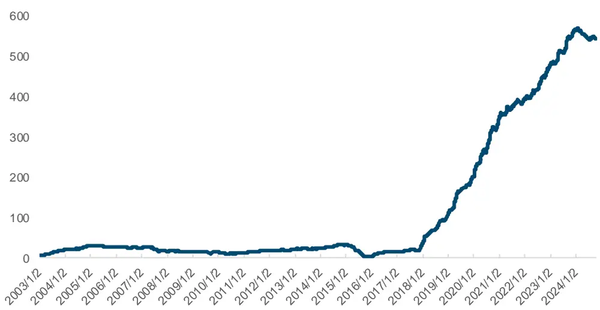
来源：Wind，国金证券研究所

传统可转债策略大多是根据转债估值，寻找相对低估的个券进行投资，但伴随转债市场整体估值近年来的抬升，其有效性有衰减迹象。在 2022 年之前，双低类的转债（转债价格低并且转股溢价率低）能够提供较好的择券收益。但是随着这些年大量资金涌入转债市场而转债数量的增加速率无法匹配，使得市场上转债平均价格和溢价上抬明显，双低策略的收益也下滑明显。

在之前的报告《BETA 猎手系列之八：基于偏股型转债的择时与择券构建固收+策略》中，我们深入研究了应用于偏股型转债的线性因子，并在回测及后续跟踪过程中取得了良好表现。在本文中，我们将进一步探索机器学习的潜力，以期提升整体转债（涵盖偏股型、平衡型和偏债型）的择券策略表现，力求实现更优的投资回报和风险管理。

## 二、神经网络模型——以 GRU为代表的优化探索

在之前针对量化选股的研究中，我们将机器学习选股模型通常分为两类，一类是神经网络模型，以 GRU、TCN 和 Transformer 为代表；一类是决策树模型，以 LGBM、XGBoost 和CatBoost 为代表。本章将针对神经网络模型在转债择券领域进行深入探索，考虑到训练模型的时间成本，我们选择公认表现较为稳健的 GRU 模型进行优化探索。

## 2.1 增量信息的影响

在使用 GRU 模型进行时间序列分析时，我们期望其能够捕捉到价格随时间变化的规律，因此我们选择日度 K 线作为主要输入。此外，由于偏股型、平衡型和偏债型转债在价格变化规律上存在显著差异，我们将三种溢价率序列（包括平底溢价率）也纳入 GRU 的输入，以便模型能够更精准地识别和处理这些不同类型转债的特征。而各种量价与基本面因子因时序上的规律不明显，因此不作为 GRU 的输入。

图表2：GRU 模型数据集

| 编号 | 名称 | 描述 |
| --- | --- | --- |
| 数据集1 | 转债K线 | 转债高开低收、VWAP和成交量共6个原始日线量价数据 |
| 数据集2 | 正股 K线 | 转债对应正股高开低收、VWAP和成交量共6个原始日线量价数据 |
| 数据集3 | 溢价率 | 平底溢价率、纯债溢价率、转股溢价率 |

来源：Wind，国金证券研究所

GRU 使用的数据集涵盖了从 2005 年 1 月 1 日至2024 年11 月30 日的数据，模型输入回看窗口 60 日。结合转债市场的实际数量，后续的回测从 2020 年 2 月 1 日开始，截至 2024年 10 月 31 日。回测剔除债券余额在一亿以下的转债。

为了确保结果具有实际的可交易性，我们采用次日（T+1）的收盘价作为成交价。本文主要考虑周频调仓，因此使用 5 日（T+1 至 T+6）收盘价收益率作为标签。在训练过程中，我们对收益率进行排序处理，以增强模型的学习效果。

模型采用每 1 年滚动 1 次的方式进行训练，考虑到训练过程可能受到随机种子的影响，我们对每个模型进行了 3 次独立训练，并取平均值作为最终结果。

对 GRU 模型的三个数据集进行一些有意义的组合，便得到了 5 种输入方式，采用 5 分组的方式进行检验。

图表3：GRU模型增量信息统计数据

|  | IC均值 | 风险调 整的IC | t统计 量 | 多头年 化收益 率 | 多头年 化超额 收益率 | 多头 Sharpe 比率 | 多头信 息比率 | 多头超 额最大 回撤 | 多空年 化收益 率 | 多空波 动率 | 多空 Sharpe | 多空最 大回撤 |
| --- | --- | --- | --- | --- | --- | --- | --- | --- | --- | --- | --- | --- |
| 正股K线 | 2.24% | 0.21 | 3.24 | 13.59% | 6.68% | 0.91 | 1.15 | 5.65% | 8.81% | 0.09 | 1.01 | 9.41% |
| 正股 K 线+转债 K 线 | 3.82% | 0.39 | 6.10 | 14.94% | 7.85% | 1.08 | 1.76 | 3.88% | 15.89% | 0.08 | 2.04 | 5.98% |
| 正股 K 线+转债 K线 +溢价率 | 6.06% | 0.58 | 9.07 | 18.03% | 10.68% | 1.35 | 2.42 | 3.37% | 23.27% | 0.08 | 3.00 | 7.08% |
| 转债K线 | 3.55% | 0.31 | 4.90 | 11.80% | 5.00% | 0.80 | 0.95 | 5.69% | 9.96% | 0.09 | 1.16 | 6.31% |
| 转债K线+溢价率 | 6.53% | 0.61 | 9.50 | 19.53% | 12.04% | 1.49 | 2.57 | 3.80% | 24.69% | 0.09 | 2.78 | 8.47% |

来源：Wind，国金证券研究所

图表4：GRU 模型增量信息多头净值
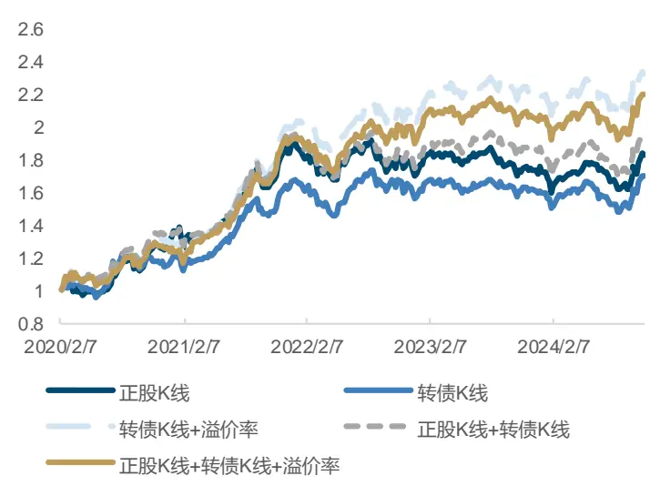
来源：Wind，国金证券研究所

图表5：GRU模型增量信息多头超额净值
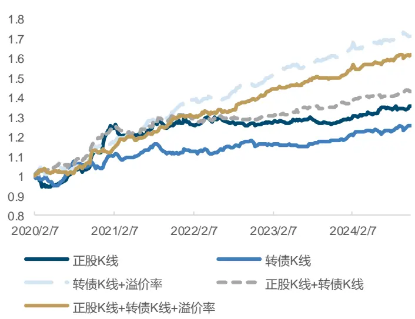
来源：Wind，国金证券研究所

图表6：GRU模型增量信息多空净值
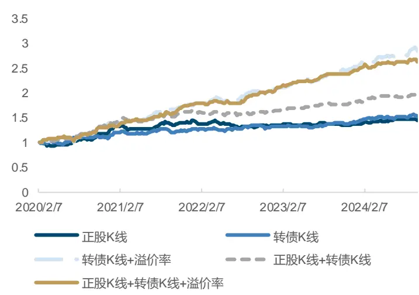
来源：Wind，国金证券研究所

图表7：GRU模型增量信息分组年化超额
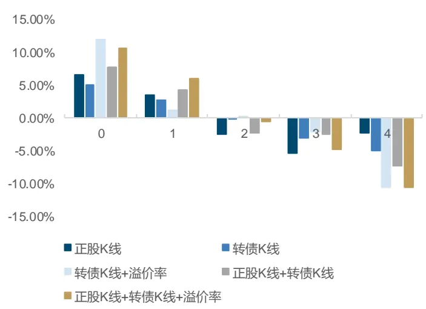
来源：Wind，国金证券研究所

通过各项指标分析，我们发现转债的 K 线与溢价率的组合最适合作为 GRU 模型的输入，并且溢价率对于模型的表现提升至关重要。而相较之下，正股的量价信息对 GRU 模型的贡献则表现为负增益。这主要是因为，可转债的价格不仅与转股溢价有关，也受债券价值、利率等多重因素影响；另外，这两个市场的参与者本身有所不同，因此也导致正股与转债走势上的差异。因此，在后续 GRU 模型的改进中，我们均采用转债 K 线+溢价率作为输入。

## 2.2 专注多头的损失函数尝试

由于转债市场无法进行做空操作，我们的主要关注点在于如何最大化多头收益。因此，我们希望通过采用专注于多头的损失函数来提升多头的表现，即便这意味着需要在一定程度上牺牲空头的表现。

具体而言，由于我们的预测标签是在截面上进行排序的，对于排名在前 50%的样本，我们保持其损失函数权重不变。而对于排名在后 50%的样本，我们将其损失函数权重减半，乘以 0.5，以减少对空头端的关注。

图表8：GRU模型多头损失统计数据

|  | IC 均值 | 风险调 整的IC | t统计量 | 多头年 化收益 率 | 多头年 化超额 收益率 | 多头 Sharpe 比率 | 多头信 息比率 | 多头超 额最大 回撤 | 多空年 化收益 率 | 多空波 动率 | 多空 Sharpe 比率 | 多空最 大回撤 |
| --- | --- | --- | --- | --- | --- | --- | --- | --- | --- | --- | --- | --- |
| 基准 | 6.49% | 0.61 | 9.49 | 20.20% | 12.29% | 1.51 | 2.57 | 4.67% | 24.29% | 0.09 | 2.71 | 8.79% |
| 基准+多头损失 | 5.45% | 0.53 | 8.31 | 18.48% | 10.75% | 1.35 | 2.55 | 2.71% | 20.72% | 0.08 | 2.46 | 7.93% |

来源：Wind，国金证券研究所

图表9：GRU模型多头损失多头净值
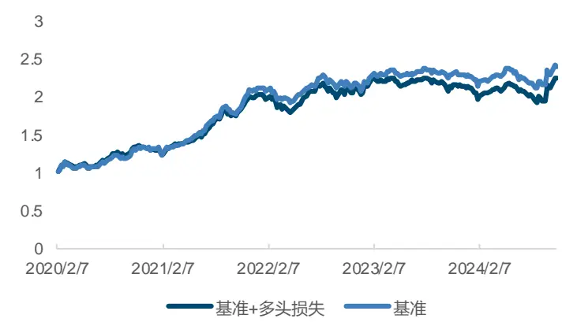
来源：Wind，国金证券研究所

图表10：GRU模型多头损失多头超额净值
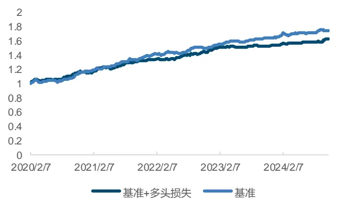
来源：Wind，国金证券研究所

图表11：GRU模型多头损失多空净值
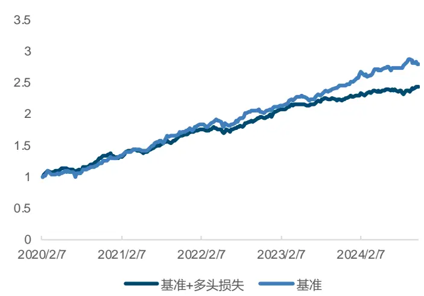
来源：Wind，国金证券研究所

图表12：GRU模型多头损失分组年化超额
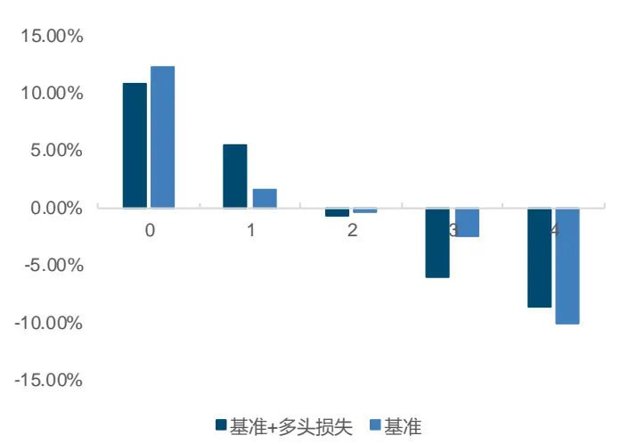
来源：Wind，国金证券研究所

研究表明，加入专注于多头的损失函数效果不尽如人意。这不仅导致信息比率（IC）和多空指标大幅下滑，还对多头表现产生了一定程度的负面影响。这可能是因为损失函数的简单加权可能会导致梯度下降过程出现不稳定的情况，后续可能需要考虑对损失函数进行更细致的设计，如多分组加权等。

## 2.3 数据增强有效缓解极端分布

自 2017 年再融资新规和可转债信用申购制度出台以来，国内可转债市场经历了一次快速增长。然而，这种快速扩张带来了模型训练上的挑战，即出现明显的极端分布问题。具体而言，2018 年之前的训练样本数量相对较少，这增加了 GRU 模型出现过拟合的风险。

图表13：可转债分年度训练样本数
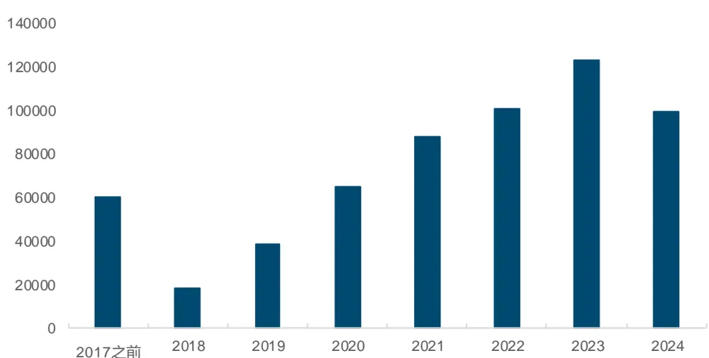
来源：Wind，国金证券研究所

为了解决样本数量较少的问题，本文提出采用数据增强作为一种优化策略来应对这一挑战。数据增强是机器学习中一种用于增加训练数据集多样性的方法，通过对现有数据进行各种变换如旋转、翻转、缩放、裁剪或添加噪声等操作，生成新的训练样本。这种方法不仅能够有效提升模型的泛化能力，减少过拟合，还能在样本数量有限的情况下显著提高模型的性能。数据增强被广泛应用于图像识别、自然语言处理及语音识别等领域，帮助构建更加鲁棒和准确的机器学习模型。

图表14：数据增强举例（1）
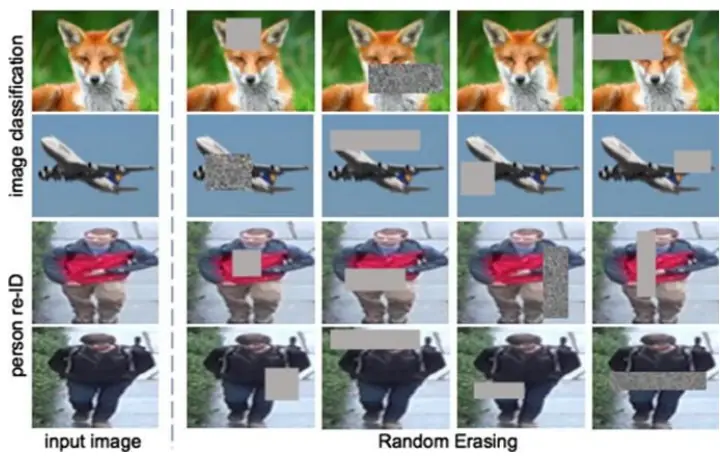
来源：A survey on Image Data Augmentation for Deep Learning，国金证券 来源：PaperWithCode，国金证券研究所研究所

图表15：数据增强举例（2)

# Enlarge your Dataset

针对转债 K 线和溢价率的时间序列数据，本文采用三种数据增强方案。随机回看窗口可以近似对图像数据的裁剪操作，是对一维的时间数据进行裁剪；缩放波动率是对于一个样本采用一个统一的系数进行缩放，类似于对图像数据增强对比度的操作；高斯噪声则与图像处理相同，是对数据本身注入噪音，增加模型识别/预测的难度，提升模型的能力。

图表16：GRU 模型时序数据增强方案

| 类别 | 描述 |
| --- | --- |
| 随机回看窗口 | 将回看窗口随机从 60 天变为 20 天或 40 天 |
| 缩放波动率 | 将转债K线数据随机变为原来的0.8-1.2倍 |
| 高斯噪声 | 向转债K线数据注入正态分布噪声 |

来源：国金证券研究所

引入数据增强处理后，GRU 模型的多头在整个回测区间有了一定的提升，但 IC 和多空也有明显的下降。

图表17：GRU模型数据增强统计数据

|  | IC 均值 整的 IC | 风险调 | t统计量 | 多头年 化收益 率 | 多头年 化超额 | 多头 Sharpe | 多头信 息比率 | 多头超 额最大 回撤 | 多空年 化收益 率 | 多空波 动率 | 多空 Sharpe 比率 | 多空最 大回撤 |  |
| --- | --- | --- | --- | --- | --- | --- | --- | --- | --- | --- | --- | --- | --- |
|  |  |  |  |  |  |  |  |  |  |  |  |  | 收益率 比率 |
| 基准 | 6.49% | 0.61 | 9.49 | 20.20% | 12.29% | 1.51 | 2.57 | 4.67% | 24.29% | 0.09 | 2.71 | 8.79% |  |
| 数据增强 | 4.92% | 0.47 | 7.31 | 21.21% | 13.44% | 1.44 | 2.81 | 2.54% | 23.46% | 0.07 | 3.18 | 5.10% |  |

来源：Wind，国金证券研究所

图表18：GRU模型数据增强多头净值
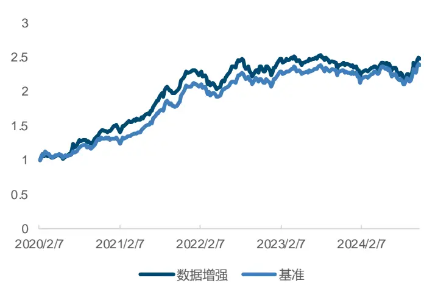
来源：Wind，国金证券研究所

图表19：GRU模型数据增强多头超额净值
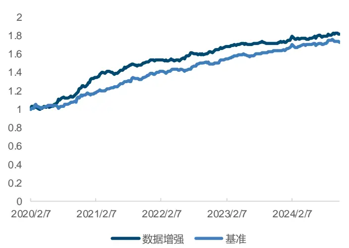
来源：Wind，国金证券研究所

经过仔细观察，我们发现，经过数据增强后，模型在 2022 年之前的表现明显优于之前的时间段。然而，2022 年之后，模型的表现有所回落。这可能是因为在 2022 年之后，数据量相对充足，大规模的数据增强可能导致模型学习到的信息变得冗余或失去有效性。因此，我们决定对 2022 年之前的训练集进行数据增强，以提高模型的性能，而在 2022 年之后，选择使用原始数据来确保模型准确捕捉到最新的市场变化。

图表20：GRU模型数据增强拼接后统计数据

|  |  |  |  | 多头年化 收益率 | 多头年化 | 多头 | 多头信息多头超额 |  |  | 多空 |  |  |
| --- | --- | --- | --- | --- | --- | --- | --- | --- | --- | --- | --- | --- |
|  | 风险调整 IC 均值 的IC | t统计量 | 超额收益 |  |  |  | Sharpe | 比率最大回撤 |  | 多空年化多空波动 收益率 率 | Sharpe | 多空最大 回撤 |
| 拼接 | 6.26% | 0.59 | 9.13 | 22.49% | 率 14.53% | 比率 1.60 | 3.05 | 2.54% | 27.82% | 0.08 | 比率 3.58 | 5.98% |

来源：Wind，国金证券研究所

可以发现，在仅对 2022 年之前数据增强后，GRU 模型的多头和多空表现均有着明显的提升。

图表21：GRU模型数据增强拼接后多头净值
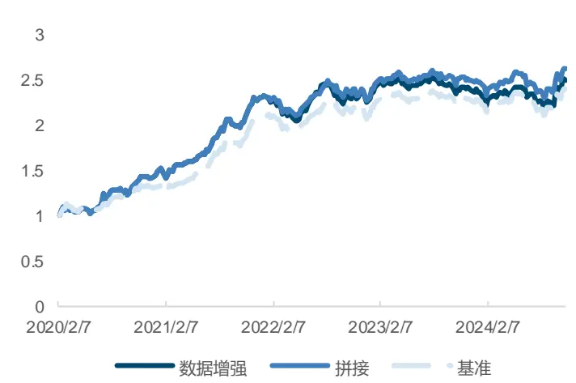
来源：Wind，国金证券研究所

图表22：GRU模型数据增强拼接后多头超额净值
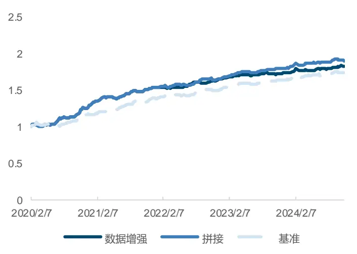
来源：Wind，国金证券研究所

图表23：GRU模型数据增强拼接后多空净值
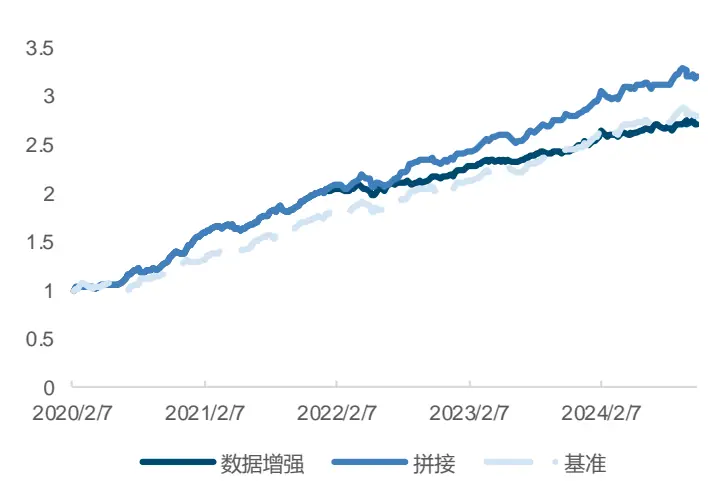
来源：Wind，国金证券研究所

图表24：GRU模型数据增强拼接后分组年化超额
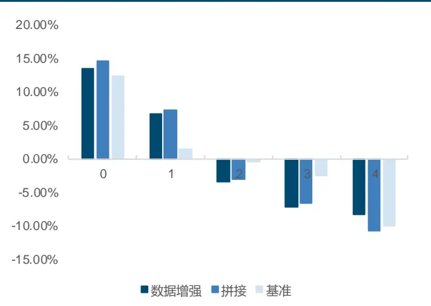
来源：Wind，国金证券研究所

因此，数据增强在数据量较少的情况下，是有效的提升模型表现的一种手段。

## 三、决策树模型——以 LGBM 为代表的优化探索

对于决策树模型，我们选择训练成本较小且表现较好的 LGBM 模型进行优化探索。

LGBM 模型通常通过集成弱因子来预测未来的收益率，因此对输入因子的质量极为依赖。为此，我们将转债和正股的 Alpha158 因子，以及《BETA 猎手系列之八：基于偏股型转债的择时与择券构建固收+策略》中手工构建的 12 个因子，全部纳入 LGBM 模型的输入。这一策略旨在为模型提供更为多样化的因子视角，从而提升其预测精度和稳定性。

图表25：LGBM模型数据集

| 因子类型 | 类型 | 具体因子 | 因子描述 |
| --- | --- | --- | --- |
| Alpha158 | 量价 | - | 微软的机器学习量化投资框架Qlib中利用转债/正股的高开低收等量价数据计 算并标准化所得 |
| GJQuant |  | 30日标准化隐含波动率 | 对可转债的 BS 隐含波动率滚动 30 日做标准化 |
|  |  | 60日标准化隐含波动率 | 对可转债的 BS 隐含波动率滚动 60日做标准化 |
|  |  | 5 日可转债 Amihud | 可转债日收益率的绝对值/日成交额。滚动5日求平均值 |
|  | 量价 | 90 日最高价距离_diff | （可转债价格+转股溢价率）/过去90日（可转债价格+转股溢价率）的最大值， 做一阶差分 |
|  |  | 转股溢价率 | （转债收盘价-转换价值）/转换价值 |
|  |  | 正股 10 日 ATR | 正股TR，滚动10日平均值TR：今日振幅、今日最高与昨日收盘价差价、今日 |
|  | 基本面 |  | 最低与昨日收盘价差价中的最大值 |
|  |  | 距离转股日天数 债券余额 | 距离转股日的剩余天数 |
|  |  | 当期收益率diff | 可转债所剩余未被转换为股票的数额 |
| 纯债到期收益率_diff |  | 对可转债的当期收益率，做一阶差分 |  |
|  |  | 对可转债纯债部分的到期收益率，做一阶差分 |  |
| 平价比底价 双低 |  | 可转债平价/底价 (可转债价格+转股溢价率*100) |  |

来源：Wind，Qlib，国金证券研究所

LGBM 模型使用的数据集涵盖了 2018 年 1 月 1 日至 2024 年 10 月 31 日的时间范围。后续回测与 GRU 模型保持一致，从 2020 年 2 月 1日开始，到 2024年 10月 31日结束。回测剔除债券余额在一亿以下的转债。因子数据均采用鲁棒 zscore 方法进行归一化处理。模型训练采用每半年滚动更新一次，其余训练设置与 GRU 模型保持一致。

为了探索 LGBM 模型的最佳输入组合，我们对数据集进行了排列组合，生成了 7 种不同的

输入方式，并采用 5 分组对其进行检验。

图表26：LGBM模型增量信息统计数据

|  | IC 均值 | 风险调 整的IC | t统计量 | 多头年 化收益 率 | 多头年 化超额 收益率 | 多头 Sharpe 比率 | 多头信 息比率 | 多头超 额最大 回撤 | 多空年 化收益 率 | 多空波 动率 | 多空 Sharpe 比率 | 多空最 大回撤 |
| --- | --- | --- | --- | --- | --- | --- | --- | --- | --- | --- | --- | --- |
| 转债 GJQuant +转债Alpha158 转债 GJQuant | 10.06% | 0.72 | 11.19 | 16.50% | 8.67% | 1.36 | 1.83 | 3.20% | 23.55% | 0.12 | 2.03 | 11.05% |
| +正股 Alpha158 | 8.04% | 0.63 | 9.82 | 13.61% | 6.00% | 1.12 | 1.46 | 6.37% | 18.83% | 0.10 | 1.92 | 13.66% |
| 转债 GJQuant 转债Alpha158 | 7.34% | 0.56 | 8.73 | 12.70% | 5.24% | 0.99 | 1.25 | 5.81% | 19.41% | 0.10 | 1.95 | 12.07% |
| +正股 Alpha158 | 9.79% | 0.72 | 11.25 | 18.35% | 10.37% | 1.56 | 2.25 | 3.38% | 23.85% | 0.11 | 2.16 | 9.64% |
| 转债Alpha158 | 8.29% | 0.56 | 8.74 | 15.56% | 7.88% | 1.23 | 1.64 | 3.83% | 16.02% | 0.12 | 1.35 | 14.31% |
| 正股 Alpha158 | 4.80% | 0.49 | 7.67 | 13.38% | 5.85% | 1.07 | 1.42 | 4.63% | 14.34% | 0.07 | 2.08 | 8.91% |
| 所有因子 | 10.41% | 0.76 | 11.77 | 17.78% | 9.82% | 1.52 | 2.08 | 3.47% | 23.90% | 0.11 | 2.10 | 12.05% |

来源：Wind，国金证券研究所

图表27：LGBM模型增量信息多头净值
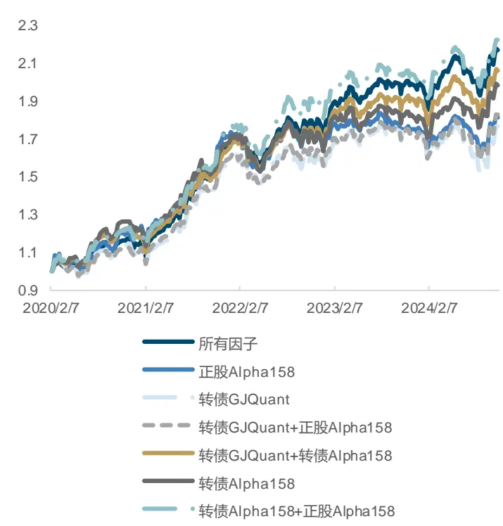
来源：Wind，国金证券研究所

图表28：LGBM模型增量信息多头超额净值
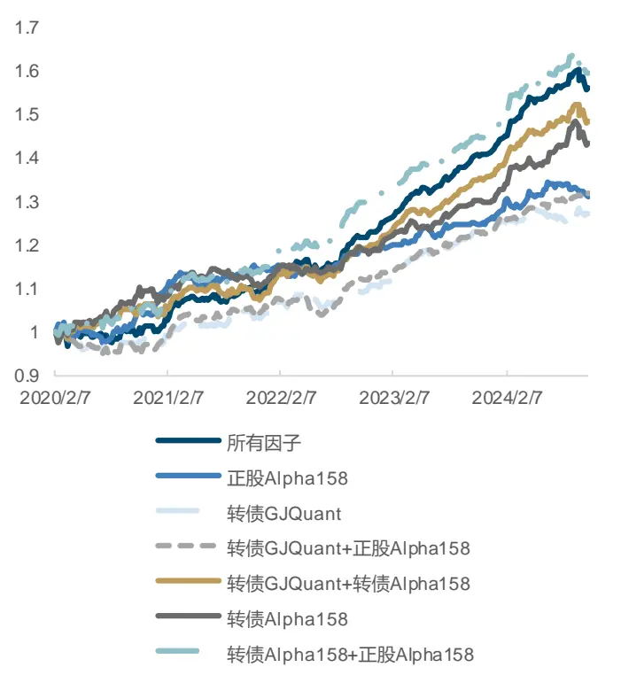
来源：Wind，国金证券研究所

图表29：LGBM模型增量信息多空净值
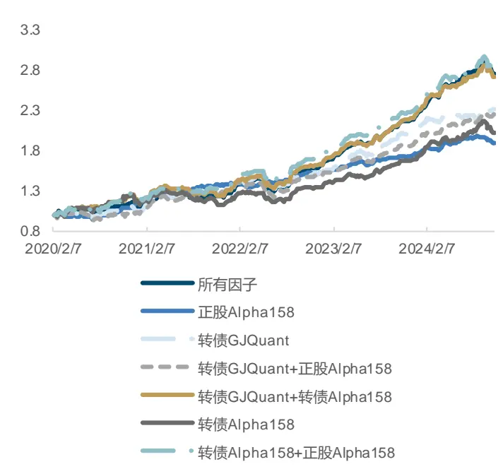
来源：Wind，国金证券研究所

图表30：LGBM模型增量信息分组年化超额
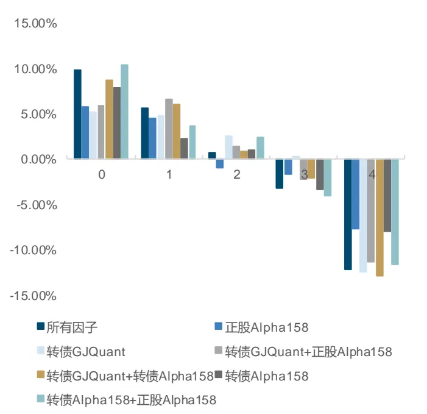
来源：Wind，国金证券研究所

可以看到，转债与正股 Alpha158 的组合在 LGBM 模型中的多头表现最优。手工构造的 12个因子在 LGBM 模型中表现不佳，可能需要进一步扩充以满足模型的需求。

## 四、机器学习转债择券策略

## 4.1 GRU 与 LGBM 因子合成

在得到 GRU 和 LGBM 因子后，我们观察到了两个显著规律：首先，GRU 因子在多头策略中表现较好，但其 IC 相对较低；而 LGBM 因子则在 IC 上有更优表现，但多头策略表现不佳。因此，我们考虑将这两类因子以等权方式进行合成，以期获得更优的投资效果。为此，我们需要分析这两类因子之间的相关性，综合考虑相关性与多头表现选择最合适的 LGBM 因子与 GRU 因子进行合成。

图表31：GRU 与LGBM 各输入对应因子相关性
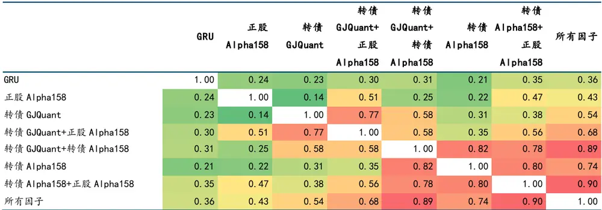
来源：Wind，国金证券研究所

整体而言，GRU 与 LGBM 生成的各个因子之间的相关性都很低。因此，我们选择将 GRU 因子与多头表现最佳的转债 Alpha158+正股 Alpha158 因子进行等权合成，创建出一个基于机器学习的转债择券因子。值得注意的是，该因子的构建仅依赖于日频的量价数据。

图表32：机器学习转债择券因子统计数据

|  | IC 均值 | 风险调整 的IC | t统计量 | 多头年化 收益率 | 多头年化 超额收益 率 | 多头 Sharpe 比率 | 多头信息多头超额 比率最大回撤 |  | 多空年化多空波动 收益率 | 率 | 多空 Sharpe 比率 | 多空最大 回撤 |
| --- | --- | --- | --- | --- | --- | --- | --- | --- | --- | --- | --- | --- |
| GRU | 6.26% | 0.59 | 9.13 | 22.49% | 14.53% | 1.60 | 3.05 | 2.54% | 27.82% | 0.08 | 3.58 | 5.98% |
| LGBM | 9.79% | 0.72 | 11.25 | 18.35% | 10.37% | 1.56 | 2.25 | 3.38% | 23.85% | 0.11 | 2.16 | 9.64% |
| ML 因子 | 9.71% | 0.86 | 13.35 | 22.80% | 14.68% | 1.78 | 3.36 | 3.03% | 31.83% | 0.09 | 3.60 | 8.66% |

来源：Wind，国金证券研究所

图表33：机器学习转债择券因子多头净值
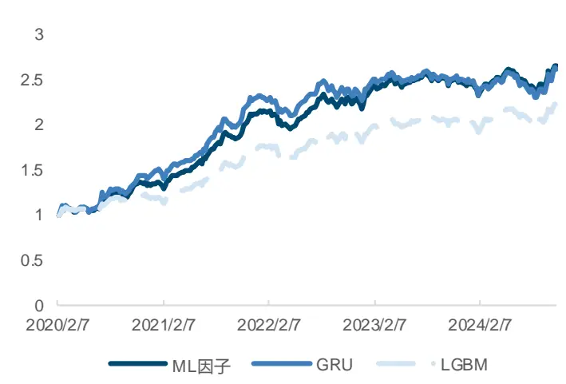
来源：Wind，国金证券研究所

图表34：机器学习转债择券因子多头超额净值
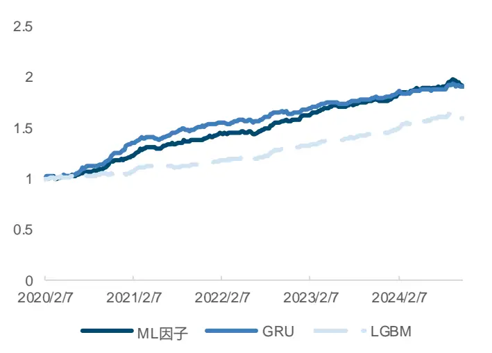
来源：Wind，国金证券研究所

图表35：机器学习转债择券因子多空净值
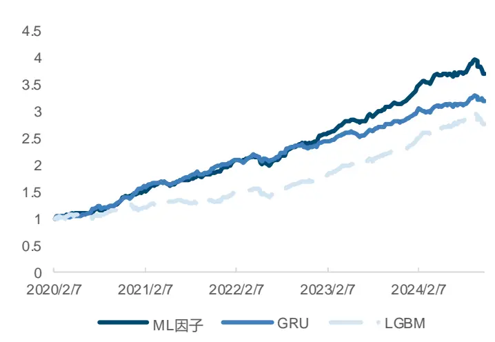
来源：Wind，国金证券研究所

图表36：机器学习转债择券因子分组年化超额
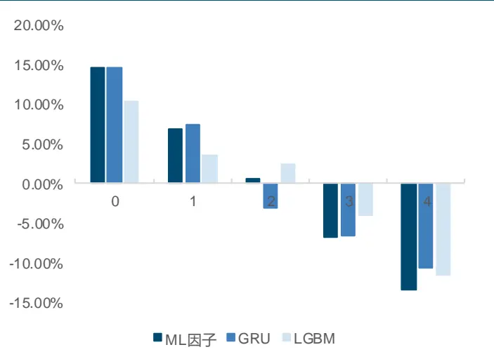
来源：Wind，国金证券研究所

合成之后，因子绝大部分指标均得到提升，多头与多空的净值的平稳性得到显著提升。

## 4.2 机器学习转债择券因子检验

在《BETA 猎手系列之八：基于偏股型转债的择时与择券构建固收+策略》中，我们精心手工构造了一个针对偏股型转债中表现优异的择券因子。在本小节中，我们将对比我们构建的机器学习因子与该报告中的线性因子，并分别在偏股、平衡和偏债转债中进行比较（根据平底溢价率±20%进行划分）。

在偏股型转债中，两个因子的表现比较如下。

图表37：ML 转债因子在偏股型转债中统计数据

|  | IC 均值 | 风险调 整的IC | t统计量 | 多头年 化收益 率 | 多头年 化超额 收益率 | 多头 Sharpe | 多头信 息比率 | 多头超 额最大 回撤 | 多空年 化收益 率 | 多空波 动率 | 多空 Sharpe 比率 | 多空最 大回撤 |  |
| --- | --- | --- | --- | --- | --- | --- | --- | --- | --- | --- | --- | --- | --- |
|  |  |  |  |  |  |  |  |  |  |  |  |  | 比率 |
| ML 因子 | 8.41% | 0.52 | 8.14 | 28.36% | 16.86% | 1.37 | 1.68 | 12.04% | 39.04% | 0.20 | 1.95 | 17.14% |  |
| 线性因子 | 6.03% | 0.32 | 4.96 | 28.48% | 16.43% | 1.39 | 1.27 | 15.09% | 33.84% | 0.23 | 1.47 | 35.15% |  |

来源：Wind，国金证券研究所

图表38：ML转债因子在偏股型转债中多头净值
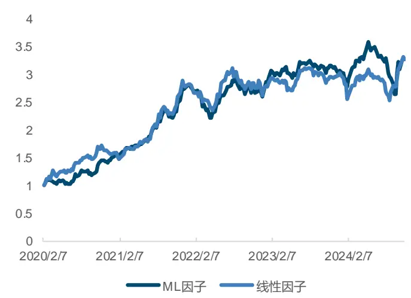
来源：Wind，国金证券研究所

图表39：ML 转债因子在偏股型转债中多头超额净值
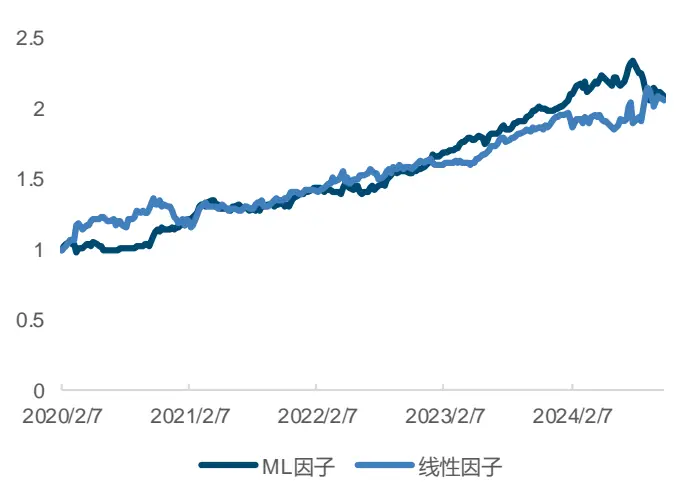
来源：Wind，国金证券研究所

可以看到两个因子在多头上的表现不分伯仲，但 ML 因子的 IC 和多空表现明显更加优秀。
在平衡型转债中，两个因子的表现比较如下。

图表40：ML 转债因子在平衡型转债中统计数据

|  | 风险调 |  |  | 多头年 化收益 | 多头年 化超额 | 多头 Sharpe | 多头信 息比率 | 多头超 额最大 回撤 | 多空年 化收益 率 | 多空波 动率 | 多空 Sharpe 比率 | 多空最 大回撤 |  |
| --- | --- | --- | --- | --- | --- | --- | --- | --- | --- | --- | --- | --- | --- |
|  | IC 均值 | t统计量 整的IC | 率 收益率 |  |  |  |  |  |  |  |  |  | 比率 |
| ML 因子 | 9.42% | 0.80 | 12.49 | 18.99% | 11.54% | 1.51 | 2.97 | 2.04% | 25.41% | 0.08 | 3.31 | 10.37% |  |
| 线性因子 | 3.62% | 0.19 | 3.03 | 12.36% | 5.62% | 0.80 | 0.94 | 6.47% | 16.42% | 0.10 | 1.64 | 13.56% |  |

来源：Wind，国金证券研究所

图表41：ML 转债因子在平衡型转债中多头净值
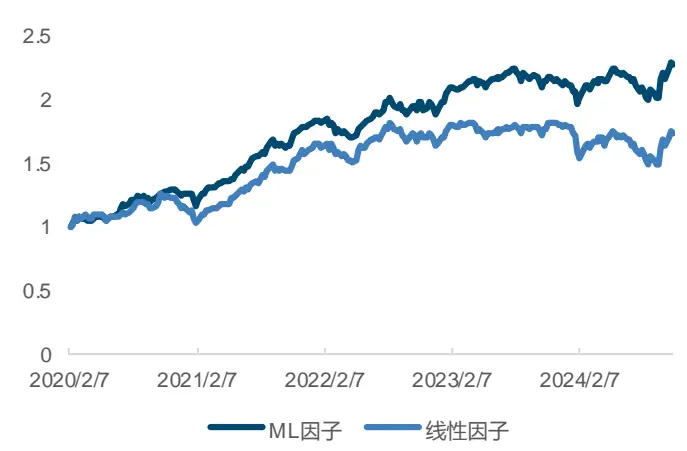
来源：Wind，国金证券研究所

图表42：ML 转债因子在平衡型转债中多头超额净值
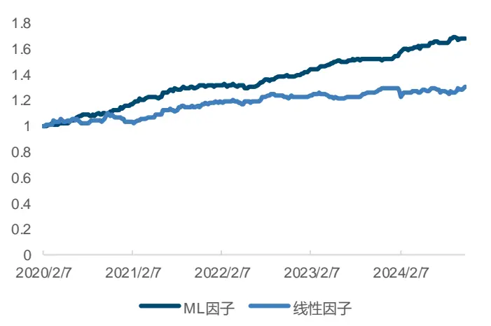
来源：Wind，国金证券研究所

可以看到，ML 因子在所有指标中均表现更优，同时多头净值走势更加稳定。

在偏债型转债中，两个因子的表现比较如下。

图表43：ML 转债因子在偏债型转债中统计数据

|  | IC 均值 | 风险调 整的IC | t统计量 | 多头年 化收益 率 | 多头年 化超额 | 多头 Sharpe | 多头信 息比率 | 多头超 额最大 回撤 | 多空年 化收益 率 | 多空波 动率 | 多空 Sharpe 比率 | 多空最 大回撤 |  |
| --- | --- | --- | --- | --- | --- | --- | --- | --- | --- | --- | --- | --- | --- |
|  |  |  |  |  |  |  |  |  |  |  |  |  | 收益率 比率 |
| ML 因子 | 8.90% | 0.54 | 8.43 | 15.32% | 9.19% | 1.56 | 2.41 | 3.17% | 20.04% | 0.07 | 3.00 | 7.88% |  |
| 线性因子 | 2.76% | 0.13 | 2.09 | 7.07% | 1.52% | 0.61 | 0.35 | 7.93% | 5.28% | 0.08 | 0.69 | 12.51% |  |

来源：Wind，国金证券研究所

图表44：ML 转债因子在偏债型转债中多头净值
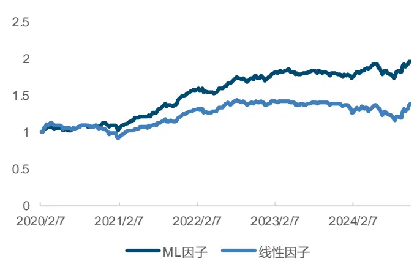
来源：Wind，国金证券研究所

图表45：ML 转债因子在偏债型转债中多头超额净值
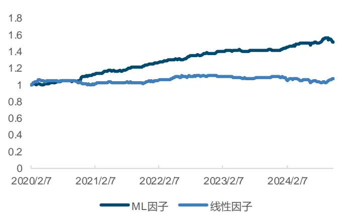
来源：Wind，国金证券研究所

可以看到，ML 因子在所有指标中均表现更优，同时多头净值走势更加优秀。

## 4.3 机器学习转债择券策略

本小节将基于机器学习转债因子和线性因子，分别构造转债择券策略。策略回测期为 2020年 2 月 1 日至 2024 年 10 月 31 日，周末换仓，选取因子得分排名前 20%的可转债等权构建持仓组合，并采取一定的换手率缓冲，将换手率控制在 50%左右。基准为中证转债指数，手续费率为双边千三。

全部转债上，两个因子构建的策略表现如下。

图表46：机器学习转债择券策略统计数据

|  | 线性因子 ML 因子 |
| --- | --- |
| 年化收益率 | 12.67% 14.59% |
| 年化波动率 | 15.73% 12.25% |
| Sharpe 比率 | 0.81 1.19 |
| 最大回撤率 | 24.63% 13.49% |
| 换手率（周度双边） | 58.69% 57.74% |
| 年化超额收益率 | 9.79% 11.54% |
| 跟踪误差 | 10.04% 5.18% |
| 信息比率 | 0.98 2.23 |
| 超额最大回撤 | 17.19% 4.24% |

来源：Wind，国金证券研究所

图表47：机器学习转债择券策略净值
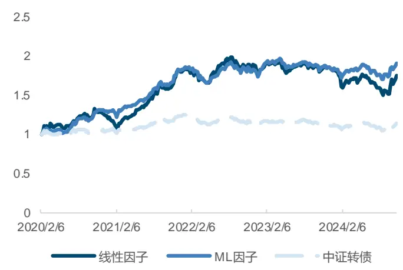
来源：Wind，国金证券研究所

图表48：机器学习转债择券策略超额净值
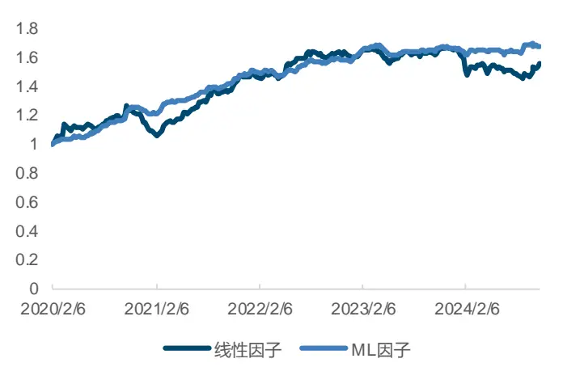
来源：Wind，国金证券研究所

可以看到，机器学习因子各项指标均更加优秀，且策略净值更加平稳。偏股型转债上，两个因子构建的策略表现如下。

图表49：机器学习偏股型转债择券策略统计数据

|  | 线性因子 | ML 因子 |
| --- | --- | --- |
| 年化收益率 | 22.66% | 20.77% |
| 年化波动率 | 21.44% | 19.39% |
| Sharpe 比率 | 1.06 | 1.07 |
| 最大回撤率 | 25.56% | 20.93% |
| 换手率（周度双边） | 51.43% | 49.34% |
| 年化超额收益率 | 19.77% | 18.10% |
| 跟踪误差 | 16.56% | 12.53% |
| 信息比率 | 1.19 | 1.44 |
| 超额最大回撤 | 15.10% | 13.74% |

来源：Wind，国金证券研究所

图表50：机器学习偏股型转债择券策略净值
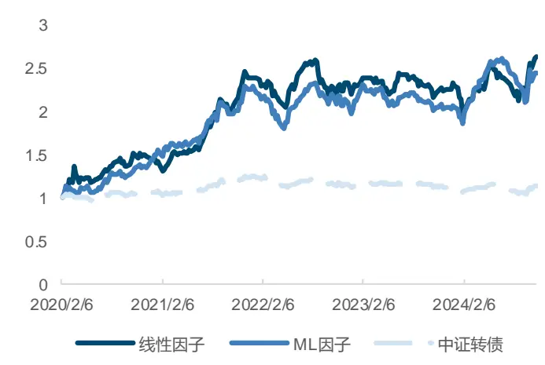
来源：Wind，国金证券研究所

图表51：机器学习偏股型转债择券超额策略
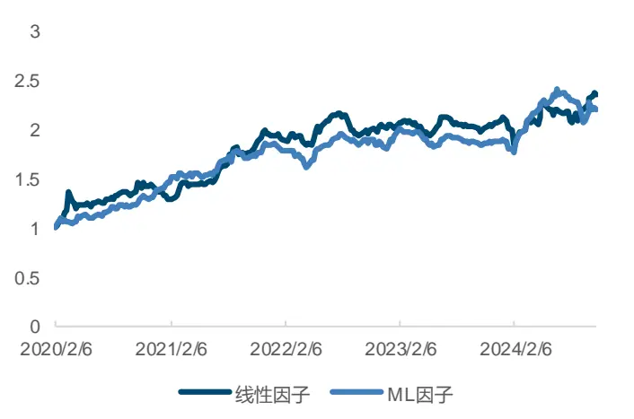
来源：Wind，国金证券研究所

可以发现，在偏股型转债上，机器学习因子虽然在绝对收益上不如针对偏股转债构造的线性因子，但是在跟踪误差、信息比率及超额回撤控制上均优于线性因子。平衡型转债上，两个因子构建的策略表现如下。

图表52：机器学习平衡型转债择券策略统计数据

|  | 线性因子 | ML 因子 |
| --- | --- | --- |
| 年化收益率 | 8.87% | 11.11% |
| 年化波动率 | 14.91% | 11.89% |
| Sharpe 比率 | 0.59 | 0.93 |
| 最大回撤率 | 22.85% | 14.51% |
| 换手率（周度双边） | 63.63% | 60.26% |
| 年化超额收益率 | 5.99% | 8.11% |
| 跟踪误差 | 9.68% | 4.95% |
| 信息比率 | 0.62 | 1.64 |
| 超额最大回撤 | 19.84% | 7.85% |

来源：Wind，国金证券研究所

图表53：机器学习平衡型转债择券策略净值
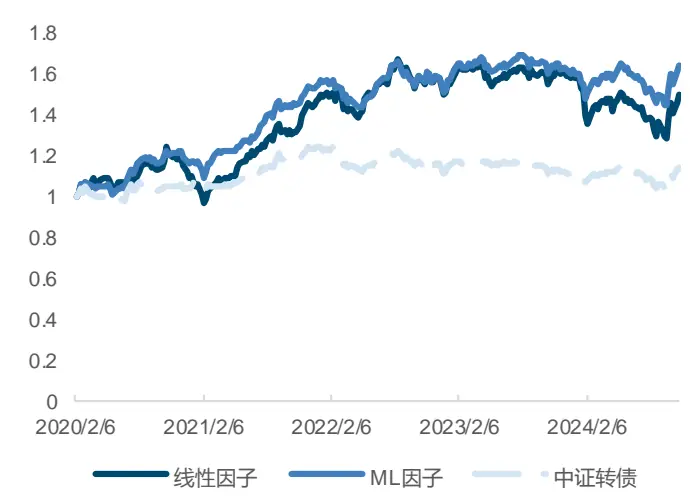
来源：Wind，国金证券研究所

图表54：机器学习平衡型转债择券策略超额净值
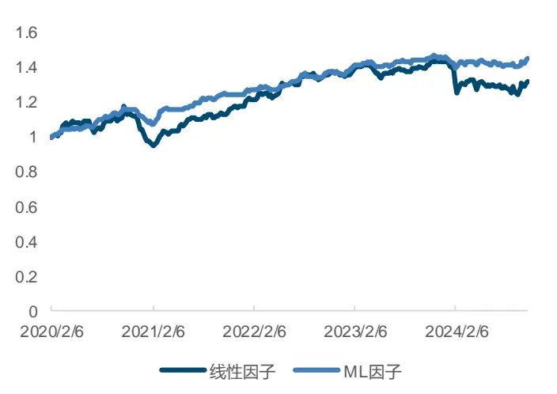
来源：Wind，国金证券研究所

可以发现，机器学习因子在拥有更高收益的同时，也有着更好的风险控制能力。偏债型转债上，两个因子构建的策略表现如下。

图表55：机器学习偏债型转债择券策略统计数据

|  | 线性因子 | ML 因子 |
| --- | --- | --- |
| 年化收益率 | 6.21% | 9.09% |
| 年化波动率 | 11.52% | 9.57% |
| Sharpe 比率 | 0.54 | 0.95 |
| 最大回撤率 | 19.17% | 12.33% |
| 换手率（周度双边） | 33.66% | 52.23% |
| 年化超额收益率 | 3.08% | 5.79% |
| 跟踪误差 | 8.15% | 6.46% |
| 信息比率 | 0.38 | 0.90 |
| 超额最大回撤 | 19.52% | 9.19% |

来源：Wind，国金证券研究所

图表56：机器学习偏债型转债择券策略净值
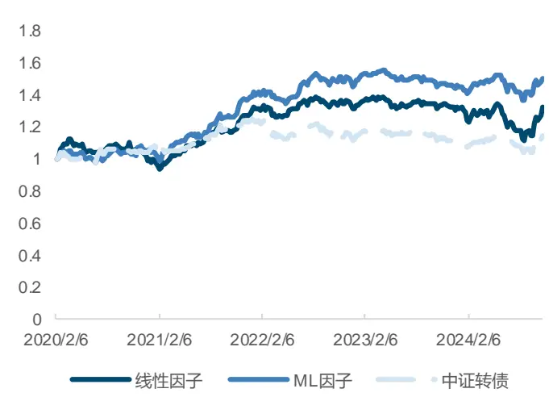
来源：Wind，国金证券研究所

图表57：机器学习偏债型转债择券策略超额净值
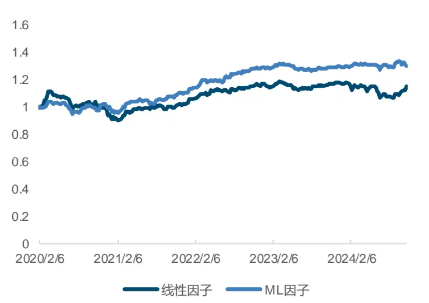
来源：Wind，国金证券研究所

可以发现，在偏债型转债上，线性因子几乎没有超额，而机器学习因子还保持着相对稳定的超额收益。

## 总结

在探索优化神经网络模型时，以 GRU 为代表，我们发现将日度 K 线和转债的溢价率作为输入能获得最佳效果，但专注于多头的损失函数反而降低了表现。引入数据增强策略有效缓解了训练样本不足的问题，特别是在 2022 年之前。而在数据充足的 2022 年之后，使用原始数据更好地适应了市场变化，提升了模型的多头和多空表现。

对于决策树模型，以 LGBM 为代表，我们引入转债和正股的 Alpha158 因子及手工构建的因子，发现 Alpha158 组合在多头表现最佳。

LGBM 和 GRU 因子相关性较低（0.35），因此我们将两者组合形成 ML 因子，实现了理想的投资表现，尤其是相对于中证转债指数在多种转债类型上取得了显著的超额收益。整体策略在考虑费用和换手率后，仍能在不同转债类型上提供稳健的年化收益和信息比率。

## 风险提示

1、以上结果通过历史数据统计、建模和测算完成，在政策、市场环境发生变化时模型存在时效的风险。

2、策略通过一定的假设通过历史数据回测得到，当交易成本提高或其他条件改变时，可能导致策略收益下降甚至出现亏损。

## 特别声明：

国金证券股份有限公司经中国证券监督管理委员会批准，已具备证券投资咨询业务资格。

形式的复制、转发、转载、引用、修改、仿制、刊发，或以任何侵犯本公司版权的其他方式使用。经过书面授权的引用、刊发，需注明出处为“国金证券股份有限公司”，且不得对本报告进行任何有悖原意的删节和修改。

本报告的产生基于国金证券及其研究人员认为可信的公开资料或实地调研资料，但国金证券及其研究人员对这些信息的准确性和完整性不作任何保证。本报告反映撰写研究人员的不同设想、见解及分析方法，故本报告所载观点可能与其他类似研究报告的观点及市场实际情况不一致，国金证券不对使用本报告所包含的材料产生的任何直接或间接损失或与此有关的其他任何损失承担任何责任。且本报告中的资料、意见、预测均反映报告初次公开发布时的判断，在不作事先通知的情况下，可能会随时调整，亦可因使用不同假设和标准、采用不同观点和分析方法而与国金证券其它业务部门、单位或附属机构在制作类似的其他材料时所给出的意见不同或者相反。

本报告仅为参考之用，在任何地区均不应被视为买卖任何证券、金融工具的要约或要约邀请。本报告提及的任何证券或金融工具均可能含有重大的风险，可能不易变卖以及不适合所有投资者。本报告所提及的证券或金融工具的价格、价值及收益可能会受汇率影响而波动。过往的业绩并不能代表未来的表现。

客户应当考虑到国金证券存在可能影响本报告客观性的利益冲突，而不应视本报告为作出投资决策的唯一因素。证券研究报告是用于服务具备专业知识的投资者和投资顾问的专业产品，使用时必须经专业人士进行解读。国金证券建议获取报告人员应考虑本报告的任何意见或建议是否符合其特定状况，以及（若有必要）咨询独立投资顾问。报告本身、报告中的信息或所表达意见也不构成投资、法律、会计或税务的最终操作建议，国金证券不就报告中的内容对最终操作建议做出任何担保，在任何时候均不构成对任何人的个人推荐。

在法律允许的情况下，国金证券的关联机构可能会持有报告中涉及的公司所发行的证券并进行交易，并可能为这些公司正在提供或争取提供多种金融服务。

本报告并非意图发送、发布给在当地法律或监管规则下不允许向其发送、发布该研究报告的人员。国金证券并不因收件人收到本报告而视其为国金证券的客户。本报告对于收件人而言属高度机密，只有符合条件的收件人才能使用。根据《证券期货投资者适当性管理办法》，本报告仅供国金证券股份有限公司客户中风险评级高于 C3 级(含 C3 级）的投资者使用；本报告所包含的观点及建议并未考虑个别客户的特殊状况、目标或需要，不应被视为对特定客户关于特定证券或金融工具的建议或策略。对于本报告中提及的任何证券或金融工具，本报告的收件人须保持自身的独立判断。使用国金证券研究报告进行投资，遭受任何损失，国金证券不承担相关法律责任。

若国金证券以外的任何机构或个人发送本报告，则由该机构或个人为此发送行为承担全部责任。本报告不构成国金证券向发送本报告机构或个人的收件人提供投资建议，国金证券不为此承担任何责任。

此报告仅限于中国境内使用。国金证券版权所有，保留一切权利。

上海

电话：021-80234211

北京

电话：010-85950438

深圳

电话：0755-86695353

邮箱：researchsh@gjzq.com.cn

邮箱：researchbj@gjzq.com.cn

邮箱：researchsz@gjzq.com.cn

邮编：201204

邮编：100005

邮编：518000

地址：上海浦东新区芳甸路 1088 号

地址：北京市东城区建内大街 26 号

地址：深圳市福田区金田路 2028 号皇岗商务中心

紫竹国际大厦 5 楼

新闻大厦 8 层南侧

18 楼 1806

【小程序】国金证券研究服务

【公众号】国金证券研究