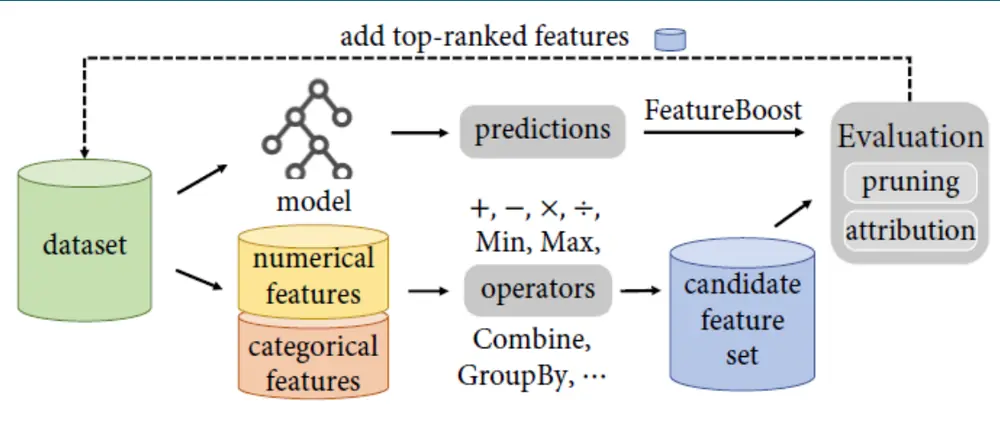
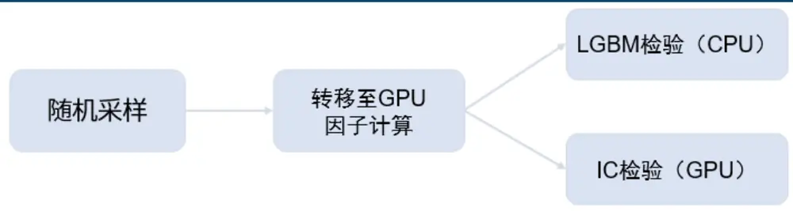
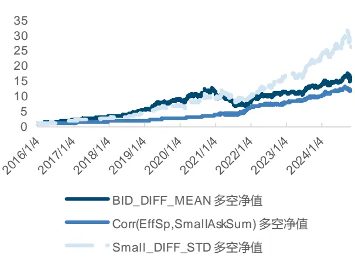
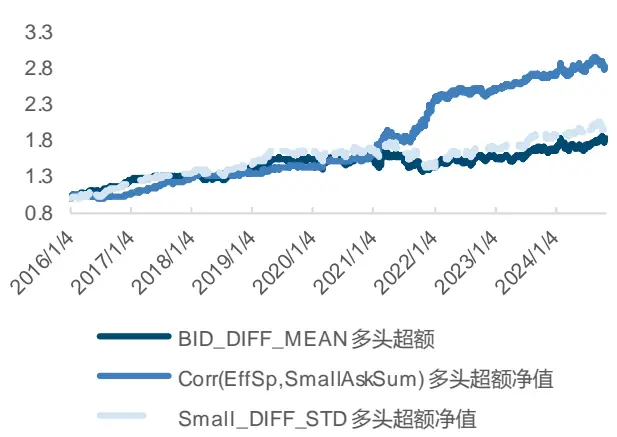
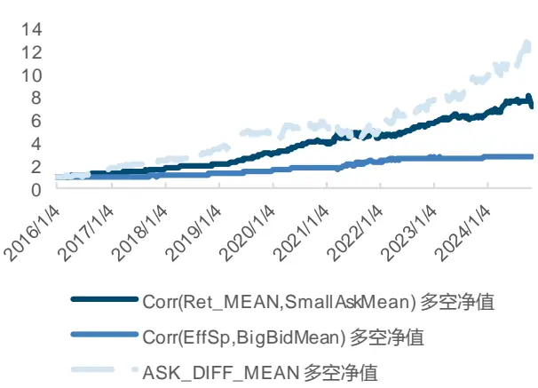
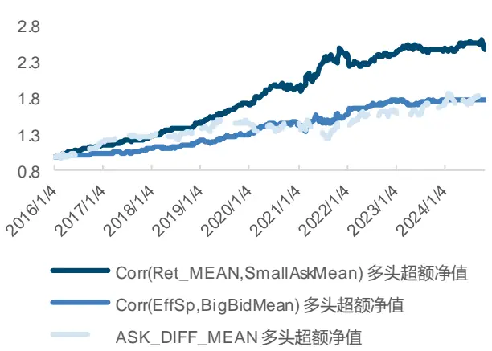
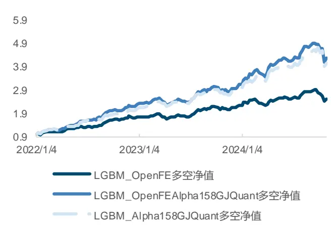
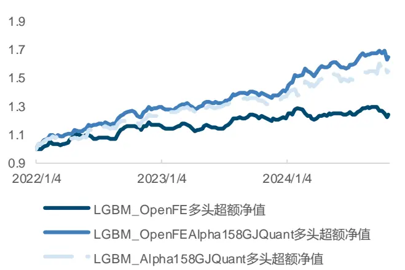
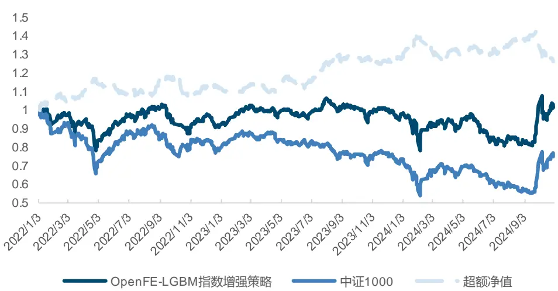
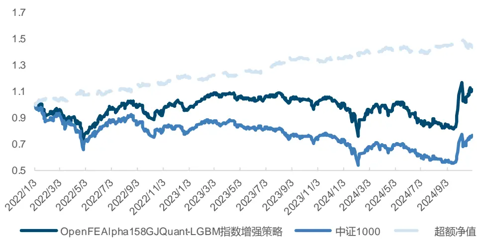

证券研究报告

金融工程组

分析师：高智威(执业 S1130522110003)

分析师：王小康(执业 S1130523110004)

gaozhiw@gjzq.com.cn

wangxiaokang@gjzq.com.cn

## 基于 OpenFE框架的机器学习 Level2 高频特征挖掘方法

## 因子挖掘与OpenFE框架介绍

我们在前期报告中进行了部分高频因子构建研究，但部分在日频量价因子中可以使用的自动化挖掘模式，如遗传规划等，在高频领域实现有较大困难。在本篇报告中，我们借鉴 OpenFE 的框架，实现对高频因子的批量化挖掘。该框架介绍了一种在机器学习领域自动化生成特征的通用方法，将基本特征转换为信息量更大的特征，投喂各类模型后能获得更好效果。该框架提出了先扩张（Expansion）再缩减(Reduction)的方案，并将缩减过程分为两步（连续二分法和特征重要性归因）。

在扩张阶段，框架会使用我们设计的所有算子进行特征遍历，一次性得到大量特征。在缩减阶段，首先使用连续二分法对样本数据随机采样，随着轮次增加，所用样本长度逐渐提升、特征数量逐渐减少。同时使用 FeatureBoost 避免每次都使用所有特征投喂 LGBM 进行特征有效性验证，两种方式结合大幅提升了特征筛选效率。

## OpenFE 高频因子挖掘方案

经过统计、归纳发现，大部分高频因子均可表示成 Mask、基础特征和聚合算子的组合形式。我们梳理归纳了主流的Mask 和聚合算子，使用高频数据的字段进行遍历生成备选特征。经过对比可以发现，大部分高频因子均可由此方式组合得到。在计算阶段，我们将数据首先转换为 tensor 转移至 GPU 使用 torch 计算，运算速度得到大幅提升。在验证阶段，我们为了保证效率，使用 IC 作为评价指标进行逐步特征剔除。

## OpenFE高频因子测试结果与选股策略

从测试结果发现，由此方法所得因子整体均有较好的选股效果。因子的周度 IC 均值 ABS 平均为 2.57%。而若将这些因子作为特征输入 LGBM 模型，整体表现能有进一步提升，IC 均值 6.42%，多头年化超额 7.87%。对比前期报告中 LGBM使用 Alpha158 和 GJQuant 所得因子，合成后因子表现还能有所改善，IC 均值 8.76%，多头年化超额 19.34%，多头超额回撤仅为 3.86%，多空年化收益率 67.08%，多空最大回撤 16.98%。

考虑扣费后，所构建的中证 1000 选股策略在 2022 年-2024 年 10 月长期的市场波动中，获得了 8.62%的年化超额收益率，策略的信息比率 0.77，超额最大回撤 11.95%。说明使用上述方法所得高频因子在经过 LGBM 模型训练后，可以在中证 1000 股票池中获得相对较稳定的超额收益。结合我们前期报告中所使用特征数据 Alpha158 和 GJQuant 所得模型的合成因子构建策略，年化超额收益率为 13.68%，超额最大回撤仅为 4.38%，信息比率为 1.98。

## 风险提示

1、以上结果通过历史数据统计、建模和测算完成，在政策、市场环境发生变化时模型存在时效的风险。

2、策略通过一定的假设通过历史数据回测得到，当交易成本提高或其他条件改变时，可能导致策略收益下降甚至出现亏损。

## 一、因子挖掘与OpenFE框架介绍

在量化选股领域中，因子挖掘与机器学习模型训练是两种主流的获取 alpha 方式。在前期报告中，我们进行了部分有一定逻辑的高频因子挖掘，同时也有一部分基于机器学习模型的选股研究，然而在日频量价和财务基本面信息作为数据输入的情况下，模型的选股效果已经达到了一个瓶颈，难以再有质的提升。A 股的高频数据由于更详细的展示了 A 股微观结构与投资者交易行为，数据包含了除传统日频 K 线以外的更多字段，是近些年获取更多超额的主要来源。

目前，针对高频量价因子的挖掘，业界的主流做法是结合论文等文献中介绍的逻辑，结合行为金融学的相关理论进行因子构建、测试并最终筛选、合成。由于高频数据量相较日频大很多，整个过程比较耗时，难以像日频量价因子一样进行快速构建、测试。因此，部分在日频量价因子中可以使用的自动化挖掘模式，如遗传规划等，在高频领域实现有较大困难。

在本篇报告中，我们尝试借鉴 OpenFE 的框架，实现对高频因子的批量化挖掘。OpenFE(TZhang et al,2022)介绍了一种在机器学习领域自动化生成特征的通用方法，将基本特征转换为信息量更大的特征，投喂各类模型后能获得更好效果。该框架提出了先扩张（Expansion）再缩减(Reduction)的方案，并将缩减过程分为两步（连续二分法和特征重要性归因）。

图表1：OpenFE框架概览

来源：OpenFE，国金证券研究所

图表2：OpenFE算法伪代码
Algorithm 1 OpenFE 
Input: D: dataset, T: feature set, O: operators 
Output: new feature set 
Initialize order = 1. 
while order < predefined max order do 
Expansion step 
Initialize A(T) by applying O on T. 
Reduction step 
û ← generate predictions with T on D. 
A(T) = SuccessivePruning(A(T), D, ). 
A(T) = FeatureAttribution(A(T), D,). 
T ← T + Top-k(A(T)). 
order ← order + 1. 
end while 
return T.
来源：OpenFE，国金证券研究所

## 1. 扩张阶段（Expansion）

与传统遗传规划类方法类似，OpenFE 需要先根据业务情况，设计好若干算子用来对单个基本特征或多个特征进行各类运算。典型的有加、减、乘、除、开方、次幂等。并针对所有基础特征对所有算子进行遍历，得到了数量较多的备选特征。

举例而言，若原有基本特征 N 个，对于一元算子“平方根”，需要对每个基本特征遍历，得到 N 个备选特征。对于二元算子“乘”，则会产生C2/2 个备选特征。根据该算子是否对称，也有可能会产生C2个备选特征。

此外，也可以根据实际需要，将上述过程中得到的备选特征再嵌套一层算子，得到数量更多的二阶特征或更高阶特征。

## 2. 缩减阶段（Reduction）

由于扩张阶段产生了大量的特征，直接全部运算会极其耗时，因此作者提出了连续二分法（Successive Halving）将所有数据首先分成2q个 block，在每一轮次中，随机抽取2i数据，进行特征计算和特征有效性检验。

图表3：OpenFE框架连续二分法算法伪代码
Algorithm3 SuccessivePruning 
Input: $\mathcal{D}\colon$ dataset, $\hat{y}\colon$ predictions on T, 
$A({\mathcal{T}}){\mathrm{:}}$ : candidate feature set, $q\colon$ integer 
Output: pruned new feature set 
Divide D equally into $2^{q}$ data blocks. 
$A_{0}(\mathcal{T})A(\mathcal{T})$ 
for $i=0$ to q do 
Create a subset $\mathcal{D}_{i}$ with $2^{i}$ randomly selected data 
blocks 
for new feature $\tau\in A_{i}(\tau)$ do 
$\Delta_{\tau}=\mathtt{F}$ eatureBoost $\left(\mathcal{D}_{i},\{\tau\},\hat{y}\right)$ 
end for 
$A_{i}(\mathcal{T})$ deduplicate $A_{i}({\mathcal{T}}).$ 
$A_{i+1}(\mathcal{T})$ Take the top half of $A_{i}(\mathcal{T})$ based on $\Delta.$ 
end for 
for $\tau\in A_{q+1}(\mathcal{T})$ do 
if $\Delta_{\tau}\leq0$ then 
$A_{q+1}(\mathcal T)A_{q+1}(\mathcal T)\backslash\{\tau\}$ 
end if 
end for 
return $A_{q+1}(\mathcal T)$
来源：OpenFE，国金证券研究所

而在有效性检验阶段，作者提出了 FeatureBoost 方案。在传统特征检验时，为确保该特征的评价不会受到特征之间交互的影响，一般会首先使用所有基础特征（BF）训练一个LGBM 模型，得到一个 Loss 作为 baseline。而在验证阶段时，将所有基础特征+某一个备选特征投喂给 LGBM 模型重新训练，得到一个新的 Loss，将两个 Loss 作差，检查其是否得到提升。而 OpenFE 中，作者只将某一个备选特征投喂模型，使模型学习之前基础特征所训练好的模型的残差，若学习后能使损失下降，则也可以说明该特征的重要性。

## 图表4：OpenFE 框架 FeatureBoost 算法伪代码

Algorithm 2 FeatureBoost 
Input: D: dataset, $\mathcal{T}^{\prime}\colon$ feature set, $\hat{y}\colon$ predictions on T 
Output: incremental performance of $\tau^{\prime}$ 
Initialize $L(f)$ as the objective function of f with T. 
Initialize a new model $f^{\prime}.$ 
Optimize $\begin{array}{r}{L(f^{\prime})=\sum_{i=1}^{n}l(y_{i},\hat{y}_{i}+f^{\prime}(x_{i}[{\cal T}^{\prime}]))}\end{array}$ 
$\Delta\gets L(f)-L(f^{\prime})$ 
return ∆
来源：OpenFE，国金证券研究所

因此，结合了以上连续二分法和 FeatureBoost 后，因子的运算和检验耗时可以得到大幅度缩减。在每一轮次，将当前备选特征数量缩减至原本的一半后，下一轮次的样本数量扩充至原来的两倍，特征数量减半。

此过程进行若干轮次后，直至所有样本均已被用来计算或特征数量已经少于我们希望的最小特征数量，即可停止该缩减过程。最终，为了全面考虑备选特征和基础特征之间可能存在的交互影响，再将宿友所有基础特征和剩余备选特征一起放入一个 LGBM 模型重新训练，筛选重要性最高的特征作为最终结果。

总结而言，传统的遗传规划方法会先判断一阶特征的有效性，筛选更优秀的“基因”继续繁衍生成高阶特征。我们认为，在量化领域，一个看起来无效的一阶特征并不一定不能衍生出优秀的高阶特征，两者之间并没有必然联系，这种方案会导致潜在的优秀特征遗漏。

而 OpenFE 一次性就生成了所有潜在（一阶）特征，若需要生成高阶特征，则不对其父特征做有效性判断，尽可能地做到了全面检验。当然，由于生成阶段不做任何筛选，因子的复杂度（阶数）就不可能过高，最终的因子公式也不会过长，也在一定程度上避免了过长的因子公式带来的可解释度下降的问题。

## 二、OpenFE高频因子挖掘实现方案

接下来，我们将以上框架在量化高频因子挖掘领域进行尝试探索。整个过程分以下几步完成：

## 1. 高频因子拆解及构建

我们首先对目前市场上的主流高频因子构建方法进行归纳，发现绝大部分高频因子可以由以下几个部分组成：Mask、基础特征和聚合算子。

所谓 Mask，即我们对于高频数据按照一定规则进行截取，这是由于往往同样的特征在不同的时间区间、不同的价格区间会有截然不同的表现，部分情况下效果甚至可能反向。常见的 Mask 包括：高（低）价格区间、早（尾）盘、高（低）成交量区间等。

基础特征：即数据中原本包含的字段，如高频快照中的高开低收成交量、订单簿的委托价委托量、逐步数据中的成交价成交量等，是我们进行因子计算的基础。

聚合算子：由于 A 股中我们不做高频交易，按照惯例均需要通过一定方式将其聚合至日频得到一个日频因子。常见的聚合算子包括：求和、均值、标准差、高阶矩、Argmax、PctChange等。

有以上结构，我们便可以穷举出几乎所有的高频后低频化因子。此处举例说明一二：

在我们前期报告中，曾构建过遗憾规避因子，其构建思路为：将当天逐笔成交数据中所有高于收盘价的成交量取出，求出其对于当天整体成交量的占比，以此来衡量某只股票买入浮亏情况。

$$
HCVOL=\frac{\sum_{i}^{N}volume_{buyi}*I_{p_{buyi}>close}}{total_{-}volume}
$$

套入上述结构，Mask 为“高于收盘价”，基础特征为“逐笔成交的成交量”，聚合算子为“求和”，而分母部分则即可以通过设置一个 Mask 为空的结构求和得到，也可以直接用日K 线数据得到。

图表5：高频因子拆解构建示例1

| Mask | 基础特征 | 聚合算子 |
| --- | --- | --- |
| 实际选用 成交价大于收盘价 | 成交量 | 求和 |

来源：国金证券研究所

在该篇报告中，我们还将因子进一步加工进行改进，通过小单和微盘的限制提升了因子表现：

$$
HCVOLE1=\frac{\sum_{i}^{N}volume_{buyi}*I_{p_{buyi}>close}*I_{t\in[14;30,14;57)}*I_{vol<\overline{{vol}}}}{total_{-}volume}
$$

则类似地，此处使用的 Mask 还有“低于笔均成交量”和“成交时间在下午 2:30 以后”，我们将多个 Mask 结果取交集即可得到该因子。

此外，价格区间因子也可以通过以上结构计算得出，我们将一天中所有成交的成交价格排序，分别取出前 20%、中间 60%和后 20%的数据，作为 Mask 后再计算成交量的求和即可。

$$
\int\displaylimits_{|\overrightarrow{\cdot}\overrightarrow{\cdot}\overrightarrow{\cdot}}^{\overrightarrow{\cdot}}\langle\rangle\langle\rangle\langle\rangle\langle\rangle\langle\rangle\dot{\cdot}\overleftrightarrow{\cdot}\underbrace{\frac{\partial}{\partial}}\int\displaylimits_{|\overrightarrow{\cdot}\overrightarrow{\cdot}|}^{\overrightarrow{\cdot}}\dot{\mu}\dot{\mu}=\frac{\sum\displaylimits_{i}^{N}volume\mathrm{\ }\ast I_{\{j\in set_{a}\}}}{total\_volume}
$$

图表6：高频因子拆解构建示例2

| Mask | 基础特征 | 聚合算子 |
| --- | --- | --- |
| 实际选用 成交价位于 Top 20% | 成交量 | 求和 |

来源：国金证券研究所

## 2．日频因子的进一步低频化

由于我们一般调仓频率为周度或月度，获得日频因子后依然需要通过一些方案进一步降频，使其包含更多历史信息，通常才会有更优的长周期预测表现。同时，原始的日频 K 线数据依然可以与高频降频后的日频因子进行结合，因此，我们额外设计了合适的算子进行处理。此处的算子与传统的遗传规划用算子比较类似，可以分为一元、二元、截面、时序四大象限。此处展示部分算子：

图表7：日频特征算子示例

| 截面/时序 | 一元/二元 | 算子表达 | 算子释义 |
| --- | --- | --- | --- |
| 截面 | 一元 二元 | abs, sqr, sqrt, sigmoid, log, inv(倒数) +, −,*,/ | 略 略 |
|  |  | … |  |
| 时序 | ts_sum,ts_mean,ts_std,ts_skew,ts_kurt,ts_max 一元 |  | 略 |
|  |  | ,ts_min(x, d) ts_corr (x, y, d) | 两特征在过去d天的 |
|  | 二元 | 秩相关系数 |  |
|  |  | . |  |

来源：国金证券研究所

时序算子中的额外参数回看天数 d，我们设置为 5,10,20,60，从中进行遍历。并对明显不符合逻辑的特征与算子结合方案进行负面剔除，得到最终所有备选因子，不考虑多个 Mask取交集的情况下，因子数量约在 8000 万左右。整体因子构建过程可由下图说明：

图表8：因子构建过程

来源：国金证券研究所

不过，值得说明的是，上述结构严格限制了因子的构建顺序：Mask->基础特征->聚合->进一步可与其他因子进行算子运算。若我们希望构建如下形式的订单簿不平衡类因子：

$$
QuoteImbalance=\frac{A_{t}-B_{t}}{V_{t}^{A}+V_{t}^{B}}
$$

此类因子涉及多个基础特征的简单运算后再进行聚合降至日频，在部分情况下可能与先聚合再进行简单运算得到因子的结果有明显差异。若在聚合之前就加入算子运算的步骤，会进一步大幅度膨胀因子数量，在本篇报告中我们暂不考虑。

## 3. 因子计算及检验

在遍历得到大量因子后，我们借鉴 OpenFE 的缩减思想，采用连续二分法，从少批量的样本开始，每轮逐步扩充样本数量，逐步减少因子数量。值得一提的是，该框架本身并非为量化领域设计，对于样本的采样并未按照所属时刻进行统一，可能会导致所得到样本在时间和股票两个维度上完全分散，在计算 IC 或时序类算子时会出现问题。

因此我们将采样方案修改，假设我们共有 8 年&中证 1000 股票池所有高频数据作为整体的样本。我们每次采样均只对时刻这一个维度进行采样，保证同一时刻的截面所有股票可以同时进入样本池。则每轮的样本长度可能变为：半年，1 年，2 年，4 年，…。其逻辑在于，若一个因子在连续半年的时间都没有足够的有效性，我们就不再给其更多的时间长度进行检验，只对排名靠前的因子进行时间长度扩充进一步检验。

此外，由于高频数据的数据量过大，即便是只运算半年的时间长度，依靠传统 pandas 库方式运算大量因子依然不现实。我们将数据首先转换为 tensor 形式，转移至 GPU 后，使用 torch 进行因子批量计算。且对样本长度进行判断，若数量过多超出 GPU 显存，则分Batch 运算再拼接，保证运算速度不受影响。经过检验发现，计算速度相较于传统方案有数百倍增长。不过，在因子检验阶段，如果我们坚持使用 LGBM 模型，进行 FeatureBoost检验，则会涉及数据从 GPU 向 CPU 传输再训练模型的过程，又会严重降低整体运行速度。而若站在有效单因子挖掘的角度来看，我们可以将因子的 IC 等指标计算在 GPU 中使用torch 完成，则整体速度依然可以保持在较高水平。

图表9：因子计算与检验方案

来源：国金证券研究所

当然，使用 IC 会损失潜在有用的非线性、可能单因子效果不好但投喂模型具有价值的因子，但由于笔者未能找到直接将 GPU 上的 tensor 作为 LGBM 模型输入的方案，大规模检验的速度过慢。在本篇报告中，我们暂时使用 IC 检验的方案，针对一部分备选因子完成运算后进行最终效果的测试。使用 IC 检验时，我们就不再严格对每轮因子进行减半筛选，而是保留 T 统计量大于 3 的所有因子。

## 三、因子测试效果

## 1. 日频因子测试

由于整个过程分两步，我们首先对所得日频因子进行检验。我们使用的高频数据自 2016年开始，计算均截至 2024 年 10 月底。股票池为中证 1000 股票池，使用未来一天收益率作为 Label 进行检验。通过上述方案生成备选因子，我们随机选择 1 万个因子进行检验测试，最终得到约 350 个因子满足 T>3 的条件。所得因子的部分指标取绝对值后统计均值情况如下：

图表10：日频因子中证1000测试结果

|  | IC 均值 ABS | ICIRABS | IC T 统计量 ABS | 多头年化超额多空年化 | 多空夏普 |
| --- | --- | --- | --- | --- | --- |
| 指标均值 | 1.13% | 0.15 | 6.63 | 0.81% 8.65% | 0.72 |

来源：Wind，国金证券研究所

可以发现，所得因子整体表现尚可，对每个因子的 IC 均值取绝对值后再对所有因子求均值为 1.13%，T 统计量为 6.63。不过，可能跟我们筛选因子所用 IC 指标有关，因子整体多头年化超额并不高，收益表现一般。我们选取部分绩优因子展示效果如下：

图表11：部分日频因子回测主要指标（中证1000，未扣费）

|  | IC 均值 | ICIR | IC T 多头年化超额 |  | 多头信息 比率 | 多头超额回撤 | 多空年化 收益率 | 多空夏普 | 多空最大 回撤 |
| --- | --- | --- | --- | --- | --- | --- | --- | --- | --- |
| BID_DIFF_MEAN | 3.75% | 0.24 | 11.02 | 7.02% | 0.74 | 17.39% | 36.44% | 1.77 | 47.46% |
| Corr(EffSp,SmallAskSum) | -2.14% | -0.27 | -11.90 | 11.83% | 1.68 | 9.45% | 29.68% | 2.56 | 10.87% |
| Small_DIFF_STD | 4.17% | 0.27 | 12.71 | 7.73% | 0.84 | 20.45% | 44.77% | 2.12 | 31.99% |

来源：Wind，国金证券研究所

图表12：部分日频因子多空净值曲线走势

来源：Wind，国金证券研究所

图表13：部分日频因子多头超额净值曲线走势

来源：Wind，国金证券研究所

## 2. 周频因子表现

在日频因子的基础上，我们使用部分简单算子进行降频处理，使其包含更久的历史信息后进行周度调仓测试。

图表14：周频因子中证1000 测试结果

| IC 均值 ABS | ICIRABS | IC T 统计量 ABS | 多头年化超额多空年化 |  | 多空夏普 |
| --- | --- | --- | --- | --- | --- |
| 指标均值 2.57% | 0.26 | 5.23 | 2.67% | 10.83% | 0.83 |

来源：Wind，国金证券研究所

可以发现，周频因子整体 IC 均值更高，因子的收益水平也有一定提升。部分绩优因子效果展示如下：

图表15：部分周频因子回测主要指标（中证1000，未扣费）

|  | IC 均值 ICIR |  | ICT 多头年化超额 |  | 多头信息 比率 | 多头超额回撤 | 多空年化 收益率 | 多空夏普 | 多空最大 回撤 |
| --- | --- | --- | --- | --- | --- | --- | --- | --- | --- |
| Corr(EffSp,BigBidMean) | 2.23% | 0.24 | 4.85 | 6.79% | 1.13 | 9.95% | 12.27% | 1.44 | 7.24% |
| Corr(Ret_MEAN,SmallAskMean) | -3.26% | -0.36 | -7.66 | 10.80% | 1.49 | 10.07% | 24.92% | 2.13 | 12.47% |
| ASK_DIFF_MEAN | 7.16% | 0.41 | 8.62 | 6.65% | 0.68 | 18.27% | 31.69% | 1.54 | 32.35% |

来源：Wind，国金证券研究所

因子的多空净值和多头超额净值如下图：

图表16：部分周频因子多空净值曲线走势

来源：Wind，国金证券研究所

图表17：部分周频因子多头超额净值曲线走势

来源：Wind，国金证券研究所

整体而言，使用以上方法可以相对高效地批量获取高频因子，作为现有因子库的有效补充。

## 3. 作为 LGBM 模型的特征输入

不过，仅通过 IC 单一指标筛选有效因子一方面会造成部分非线性因子的浪费，另一方面，若我们希望将因子作为特征投喂进入类似 LGBM 类模型是否依然合适可能也是潜在的问题，接下来我们尝试将上述过程中所得 300 余个因子作为特征输入进行训练。

由于涉及到模型训练，我们对数据集进行了区间划分，以 2016-2019 年作为训练集、2020-2021 年作为验证集、2022 年以来作为测试集，以下仅展示测试集效果。其他的特征和标签预处理方式、损失函数等均可参考我们前期报告《Alpha 掘金系列之十：机器学习全流程重构——细节对比与测试》结论。以下为模型预测所得因子在中证 1000 成分股上的表现：

图表18：0penFE训练LGBM模型所得因子回测主要指标（2022年以来，中证1000，未扣费）

|  | IC 均值 | ICIR | IC T | 多头年化超 额 | 多头信 息比率 | 多头超额 回撤 | 多空年化 收益率 | 多空夏 普 | 多空最大 回撤 |
| --- | --- | --- | --- | --- | --- | --- | --- | --- | --- |
| LGBM_OpenFE | 6.42% | 0.51 | 6.00 | 7.87% | 1.04 | 5.96% | 38.45% | 2.29 | 16.72% |
| LGBM_AIpha158GJQuant | 8.46% | 0.61 | 7.30 | 16.77% | 1.81 | 4.25% | 64.40% | 3.18 | 16.61% |
| LGBM_0penFE_AIpha158GJQuant | 8.76% | 0.59 | 7.06 | 19.34% | 2.42 | 3.86% | 67.08% | 3.40 | 16.98% |

来源：Wind，国金证券研究所

因子在样本外整体表现优秀，使用OpenFE所得因子IC均值为6.42%，多头年化超额7.87%，多头超额回撤 5.96%，多空年化收益率 38.45%，多空最大回撤 16.72%。

此外，为进一步观察与日频量价特征、基本面特征叠加后的效果，我们将前期报告中 LGBM模型使用 Alpha158 和 GJquant 数据集训练所得因子同步测试进行对比，并将 OpenFE 所得因子等权合成观察因子表现变化，发现加入 OpenFE 因子后，整体表现能有进一步提升。合成后因子 IC 均值 8.76%，多头年化超额 19.34%，多头超额回撤仅为 3.86%，多空年化收益率 67.08%，多空最大回撤 16.98%。

图表19：LGBM模型因子多空净值曲线

来源：Wind，国金证券研究所

图表20：LGBM模型因子多头超额净值曲线

来源：Wind，国金证券研究所

从因子净值曲线看，整体表现平稳，在 2024 年 10 月份出现明显回撤，其余时间超额走势稳定。

图表21：LGBM_OpenFE_A/pha158GJQuant因子分位数组合表现

|  | 年化收益 Sharpe 比 率 |  | 最大回撤 率 | 年化超额 收益率 | 信息比率 | 胜率 | 超额最大 回撤率 |  |
| --- | --- | --- | --- | --- | --- | --- | --- | --- |
|  |  |  |  |  |  |  |  | 率 |
| Top | 13.83% | 0.47 | 22.51% | 19.34% | 2.42 | 55.94% | 3.86% |  |
| 1 | 3.72% | 0.13 | 27.07% | 8.62% | 1.34 | 57.34% | 6.23% |  |
| 2 | 2.27% | 0.08 | 29.08% | 7.26% | 1.38 | 55.94% | 7.27% |  |
| 3 | 2.08% | 0.07 | 27.89% | 7.15% | 1.64 | 64.34% | 4.24% |  |
| 4 | 1.59% | 0.05 | 29.92% | 6.82% | 1.87 | 59.44% | 3.22% |  |
| 5 | -2.58% | -0.09 | 30.37% | 2.29% | 0.54 | 52.45% | 6.33% |  |
| 6 | -3.61% | -0.12 | 33.60% | 1.58% | 0.37 | 51.05% | 4.39% |  |
| 7 | -8.60% | -0.28 | 43.12% | -3.59% | -0.70 | 42.66% | 13.48% |  |
| 8 | -16.68% | -0.52 | 57.47% | -11.85% | -1.53 | 36.36% | 33.56% |  |
| Bottom | -34.72% | -0.98 | 80.10% | -30.65% | -2.21 | 36.36% | 68.24% |  |
| 市场 | -4.98% | -0.17 | 36.22% | 0.00% | NaN | 0.00% | 0.00% |  |
| L-S | 67.08% | 3.40 | 16.98% | 59.13% | 1.52 | 60.14% | 44.34% |  |

来源：Wind，国金证券研究所

最终，我们对该框架进行因子挖掘的优缺点总结如下：

图表22：OpenFE因子挖掘方案优缺点对比

| 方案 | IC 筛选 | FeatureBoost |
| --- | --- | --- |
| 运行速度 | 极快 | 较慢 |
| 用途 | 有效单因子筛选，但也可作为LGBM模型输入投喂 | 非线性因子综合考虑 |
| 过拟合可能性 | 存在一类错误（TypeIError）概率提升导致的 运气可能性 | 通过严格数据区间划分可一 定程度缓解 |

来源：国金证券研究所

## 四、基于 OpenFE框架构建挖掘因子的中证1000 选股策略

## 1. OpenFE 高频因子 LGBM 策略表现

为了探究本文利用 OpenFE 挖掘得到的高频因子实际交易效果，我们将上述投喂至 LGBM 训练所得因子构建中证 1000 指数选股策略。回测期为 2022 年 1 月至 2024年 10月，以每周第一个交易日的开盘价买入进行周频调仓。

每次对前 10%的股票等权买入，以中证 1000 指数为基准进行比较。同时为有效降低换手率过高给策略收益带来的负面影响，我们加入换手率缓冲的调整方式降低调仓成本。在双边千分之三的手续费率下，测试结果如下。

图表23：OpenFE-LGBM指数选股策略净值曲线

来源：Wind，国金证券研究所

图表24：OpenFE-LGBM指数选股策略表现

| OpenFE-LGBM 指数选股策略 |  |
| --- | --- |
| 年化收益率 | 1.09% -23.38% |
| 年化波动率 | 21.56% -8.99% |
| Sharpe 比率 | 0.05 0.25 |
| 最大回撤率 | 26.51% 46.22% |
| 平均换手率（双边） | 15.91% |
| 年化超额收益率 |  |
| 跟踪误差 | 8.62% |
|  | 11.22% |
| 信息比率 | 0.77 |
| 超额最大回撤 | 11.95% |

来源：Wind，国金证券研究所

策略在 2022 年-2024 年 10 月长期的市场波动中，获得了 8.62%的年化超额收益率，策略的信息比率 0.77，超额最大回撤 11.95%。说明使用上述方法所得高频因子在经过 LGBM 模型训练后，可以在中证 1000 股票池中获得相对较稳定的超额收益。

## 2. 结合日频特征 LGBM 模型后 OpenFE 高频因子 LGBM 策略表现

为进一步观察因子结合我们前期报告中所使用特征数据 Alpha158 和 GJQuant 所得模型的效果，我们将上文中合成后因子 LGBM_OpenFE_Alpha158GJQuant 用于构建选股策略，该策略同样考虑周度调仓。回测期为 2022 年 1 月至 2024 年 10 月，以每周第一个交易日的开盘价买入进行周频调仓。

每次对前 10%的股票等权买入，以中证 1000 指数为基准进行比较。同时为有效降低换手率过高给策略收益带来的负面影响，我们加入换手率缓冲的调整方式降低调仓成本。在双边千分之三的手续费率下，测试结果如下。

图表25：0penFEA/pha158GJQuant-LGBM 指数选股策略净值曲线

来源：Wind，国金证券研究所

图表26：0penFEA/pha158GJQuant-LGBM 指数选股策略表现

| 0penFEAIpha158GJQuant-LGBM 指数选股策略 |  | 基准 |
| --- | --- | --- |
| 年化收益率 | 3.91% | -8.99% |
| 年化波动率 | 24.58% | 25.10% |
| Sharpe 比率 | 0.16 | -0.36 |
| 最大回撤率 | 30.59% | 46.22% |
| 平均换手率（双 | 21.68% |  |
| 边） |  |  |
| 年化超额收益率 | 13.68% |  |
| 跟踪误差 | 6.91% |  |
| 信息比率 | 1.98 |  |
| 超额最大回撤 | 4.38% |  |

来源：Wind，国金证券研究所

可以看出，策略稳定性得到进一步提升，年化超额收益率为 13.68%，超额最大回撤仅为4.38%，信息比率为 1.98。

## 总结

在本篇报告中，我们探索使用了 OpenFE 框架并对其进行一定改写，使其可以用于量化高频选股因子的挖掘。在一定程度上解决了过往高频因子挖掘效率较低、难以快速、高效迭代的弊端。该框架提出了先扩张（Expansion）再缩减(Reduction)的方案，并将缩减过程分为两步（连续二分法和特征重要性归因）。

我们认为大部分高频因子均可表示成 Mask、基础特征和聚合算子的组合形式，我们梳理归纳了主流的 Mask 和聚合算子，使用高频数据的字段进行遍历生成备选特征。经过对比可以发现，大部分高频因子均可由此方式组合得到。在计算阶段，我们将数据首先转换为tensor 转移至 GPU 使用 torch 计算，运算速度得到大幅提升。在验证阶段，我们为了保证效率，使用 IC 作为评价指标进行逐步特征剔除。

从测试结果发现，由此方法所得因子整体均有较好的选股效果。因子的周度 IC 均值 ABS平均为 2.57%。而若将这些因子作为特征输入 LGBM 模型，整体表现能有进一步提升，IC均值 6.42%，多头年化超额 7.87%。对比前期报告中 LGBM 使用 Alpha158 和 GJQuant 所得因子，合成后因子表现还能有所改善，IC 均值 8.76%，多头年化超额 19.34%，多头超额回撤仅为 3.86%，多空年化收益率 67.08%，多空最大回撤 16.98%。

最终我们将该因子用于构建中证 1000 选股策略，年化超额收益率为 13.68%，超额最大回撤仅为 4.38%，信息比率为 1.98。

## 风险提示

1、以上结果通过历史数据统计、建模和测算完成，在政策、市场环境发生变化时模型存在时效的风险。

2、策略通过一定的假设通过历史数据回测得到，当交易成本提高或其他条件改变时，可能导致策略收益下降甚至出现亏损。

## 特别声明：

国金证券股份有限公司经中国证券监督管理委员会批准，已具备证券投资咨询业务资格。

形式的复制、转发、转载、引用、修改、仿制、刊发，或以任何侵犯本公司版权的其他方式使用。经过书面授权的引用、刊发，需注明出处为“国金证券股份有限公司”，且不得对本报告进行任何有悖原意的删节和修改。

本报告的产生基于国金证券及其研究人员认为可信的公开资料或实地调研资料，但国金证券及其研究人员对这些信息的准确性和完整性不作任何保证。本报告反映撰写研究人员的不同设想、见解及分析方法，故本报告所载观点可能与其他类似研究报告的观点及市场实际情况不一致，国金证券不对使用本报告所包含的材料产生的任何直接或间接损失或与此有关的其他任何损失承担任何责任。且本报告中的资料、意见、预测均反映报告初次公开发布时的判断，在不作事先通知的情况下，可能会随时调整，亦可因使用不同假设和标准、采用不同观点和分析方法而与国金证券其它业务部门、单位或附属机构在制作类似的其他材料时所给出的意见不同或者相反。

本报告仅为参考之用，在任何地区均不应被视为买卖任何证券、金融工具的要约或要约邀请。本报告提及的任何证券或金融工具均可能含有重大的风险，可能不易变卖以及不适合所有投资者。本报告所提及的证券或金融工具的价格、价值及收益可能会受汇率影响而波动。过往的业绩并不能代表未来的表现。

客户应当考虑到国金证券存在可能影响本报告客观性的利益冲突，而不应视本报告为作出投资决策的唯一因素。证券研究报告是用于服务具备专业知识的投资者和投资顾问的专业产品，使用时必须经专业人士进行解读。国金证券建议获取报告人员应考虑本报告的任何意见或建议是否符合其特定状况，以及（若有必要）咨询独立投资顾问。报告本身、报告中的信息或所表达意见也不构成投资、法律、会计或税务的最终操作建议，国金证券不就报告中的内容对最终操作建议做出任何担保，在任何时候均不构成对任何人的个人推荐。

在法律允许的情况下，国金证券的关联机构可能会持有报告中涉及的公司所发行的证券并进行交易，并可能为这些公司正在提供或争取提供多种金融服务。

本报告并非意图发送、发布给在当地法律或监管规则下不允许向其发送、发布该研究报告的人员。国金证券并不因收件人收到本报告而视其为国金证券的客户。本报告对于收件人而言属高度机密，只有符合条件的收件人才能使用。根据《证券期货投资者适当性管理办法》，本报告仅供国金证券股份有限公司客户中风险评级高于 C3 级(含 C3 级）的投资者使用；本报告所包含的观点及建议并未考虑个别客户的特殊状况、目标或需要，不应被视为对特定客户关于特定证券或金融工具的建议或策略。对于本报告中提及的任何证券或金融工具，本报告的收件人须保持自身的独立判断。使用国金证券研究报告进行投资，遭受任何损失，国金证券不承担相关法律责任。

若国金证券以外的任何机构或个人发送本报告，则由该机构或个人为此发送行为承担全部责任。本报告不构成国金证券向发送本报告机构或个人的收件人提供投资建议，国金证券不为此承担任何责任。

此报告仅限于中国境内使用。国金证券版权所有，保留一切权利。

上海

电话：021-80234211

北京

电话：010-85950438

深圳

邮箱：researchsh@gjzq.com.cn

电话：0755-86695353

邮箱：researchbj@gjzq.com.cn

邮箱：researchsz@gjzq.com.cn

邮编：201204

地址：上海浦东新区芳甸路 1088 号紫竹国际大厦 5 楼

邮编：518000

邮编：100005

地址：北京市东城区建内大街 26 号

新闻大厦 8 层南侧

地址：深圳市福田区金田路 2028 号皇岗商务中心

18 楼 1806

【小程序】国金证券研究服务

【公众号】国金证券研究