证券研究报告

金融工程组

分析师：高智威（执业 S1130522110003) 联系人：胡正阳

gaozhiw@gjzq.com.cn

huzhengyang1@gjzq.com.cn

## 基于概念文本相似度聚类的组合优化方案

掌握股票的“相似性”可以帮助投资者解决许多问题。因此，有效地衡量股票相似性对于投研来说及其重要。相似性研究的核心在于找到个股之间的“共性”因素，并通过定量化方法进行刻画。本文将“投资概念”作为共性的代理变量，借助大模型实现了基于投资概念的股票相似性衡量，并在组合优化的应用中证明其优势。

## 基于投资概念的股票拆解思路

我们提出一种从投资概念出发的股票相似性衡量思路，设计了自动化的股票概念提取工作流，使用思维链技术让大模型分析研报与公告文本，提取出投资概念与对应解释文本，并构建完善的股票概念关系数据库。

在概念提取的思维链中，我们要求大模型从主营业务、产品产出、技术工艺、政策事件这些角度出发，将所有可能相关的概念名称进行列示。在提取概念名称时，我们要求大模型同步生成概念对应的名词解释与提取原因，以进一步降低大模型的幻觉现象，并获取更加丰富的信息量。

## 如何根据概念衡量个股相似性

我们通过 Embedding 模型对概念文本进行向量化，并聚合到股票层面，最终在同一个向量空间中表示股票与概念两类对象，进而实现对股票相似性的衡量。

具体来说，我们将前述步骤中生成的概念名称、概念含义与提取原因合并为概念文本，并对这一长文本进行向量化。概念向量中嵌入了概念的语义信息，这使得我们能够通过向量余弦相似度来衡量两个概念之间的相似性。在股票层面加总向量并单位化之后，我们便能够得到股票向量，并进行后续的个股相似性排序或聚类分析。

## 相似性的应用：组合优化

最终我们将股票向量应用于组合优化任务中，对股票向量进行降维聚类并将聚类结果替换掉传统的行业分类。我们以沪深 300、中证 500 与中证 A500 指数的增强策略为案例，通过对比不同的聚类方案与参数调优，找到相较于传统GICS或中信一级行业分类更加有效的股票聚类结果，并为组合超额净值带来提升。以沪深 300 增强策略为例，控制股票概念聚类的暴露能够使信息比率达到 1.838，而控制中信一级行业分类的策略其信息比率仅 1.474。

整体来说，tSNE 降维搭配 Agglomerative 层次凝聚聚类算法效果普遍最好。且股票聚类算法在沪深 300 上的优势相对中证 500 或中证 A500 都更好，这一方面有股票概念覆盖度的原因，另一方面也说明概念相似性更适用于业务范围较广、涉及概念较多的大市值股票。上市公司的业务越难以通过单一的行业完整描述，则使用概念聚类的效果约好。

## 总结

股票概念关系数据库的构建与相关性衡量是本文的核心贡献，其能够为我们带来丰富的想象空间，譬如可以通过概念相似性捕捉动量溢出效应，快速布局存在补涨可能性的股票，并构建相应选股策略。如何进一步挖掘股票概念数据库的潜力也是我们接下来的研究方向之一。

同时，股票概念关系数据库的构建则是大语言模型在投研领域的又一重要应用案例。大模型能够帮助我们将非结构化的文本信息融入现有策略框架中，并完成此前难以实现的各类任务，也将为传统投研带来全新的方法与思路。

## 风险提示

以上结果通过历史数据统计、建模和测算完成，在政策、市场环境发生变化时模型存在时效的风险。策略通过一定的假设通过历史数据回测得到，当交易成本提高或其他条件改变时，可能导致策略收益下降甚至出现亏损。大语言模型输出结果具有一定随机性的风险，模型迭代升级、新功能开发可能会导致结论不同。人工智能模型得出的结论仅供参考，可能出现错误答案的风险。

## 一、基于投资概念的股票拆解思路

如何有效地对股票“相似性”进行衡量是证券研究的重要课题。我们的核心假设是具有高相似性的股票在股价涨跌上也会更加同步。若我们能准确衡量个股相似性，首先可以对股票进行分类从而快速定位相似的股票；在个股出现上涨行情时也可以基于相似性找到可能联动上涨的个股，构建追涨策略；此外，我们也可以将分类结果用于组合优化，从而有效地控制组合风险，增强超额净值的表现……相似性衡量可以帮助投资者解决许多问题。有效的股票分类结果可谓是证券分析的基石。

相似性研究的核心在于找到个股之间的“共性”因素，并通过定量化标准对其进行衡量。大家所熟悉的行业分类其实上就是一种相似性分类的结果，本质上是将公司业务作为“共性”的代理变量得到的结果。对共性因素的刻画是衡量个股相似性的关键。我们认为，将投资概念作为共性并用于个股相似性衡量，具有极大的优势。

## 1.1 为何需要从投资概念角度描述股票

当前使用较多、也较受认可的是从“行业”角度出发对股票进行分类，以上市公司的营业收入与利润状况为分类主要依据。按行业进行分类贴合经济活动的本质，也是一种较为直观的分类方式。目前投资者使用较多的包括中信行业分类、申万行业分类、证监会上市公司行业分类与 GICS 行业分类等，可以方便投资者快速了解个股业务的大致类型。

但在实际情况中，大而泛的行业分类无法完全解释个股涨跌，“投资概念”可能更容易成为个股涨跌的共性来源。以近期火热的“谷子经济”概念为例，这是一种主要涉及二次元文化产品的消费经济形式。从成分股来看，谷子经济主要成分股属于传媒行业，市值占比达到 52%，商贸零售行业占比 18.69%。

图表1：“谷子经济”成分股行业总市值占比
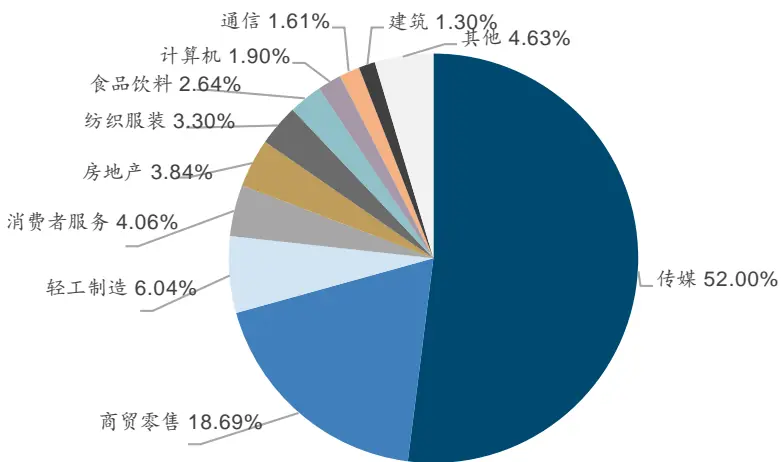
来源：iFind，国金证券研究所

然而，指数近期相对传媒行业跑出了明显的超额收益。若按照“谷子经济”概念成分股的行业占比来对中信一级行业指数进行加权，得到的合成指数净值同样与谷子经济有明显差距。这表明行业对个股涨跌的描述能力越来越弱。

行业分类的解释能力变弱，其背后的原因一方面在于上市公司的业务越来越多元化，单一的行业分类会损失大量信息；另一方面则是主营业务作为“共性”因素带来的信息量占比较低。若想更好地刻画相似性，还需要我们从其他角度寻找描述方法。

图表2：行业收益率难以解释概念行情的收益来源
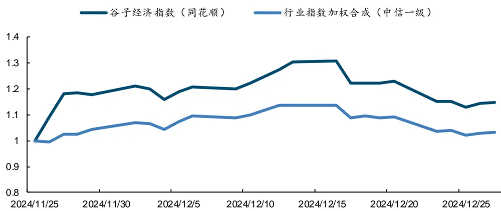
来源：iFind，国金证券研究所

除了行业分类之外，也有研究从股票的基本面、量价与事件驱动特征角度出发，使用以上因子构成股票的向量表达，并在向量空间中通过统计方法进行衡量。这类方法对相似性的评价维度更丰富，譬如小市值、高成长、红利股等等；对相似性强弱的刻画也更细致，可以计算出相关系数并对个股进行排序。不过，一些基于量价特征的分类结果具有滞后性，是基于股价同涨跌的现象来判断其分类，分类结果的持续性难以保证，另外类似股权激励、高管增减持的事件驱动类特征对时效性的要求较高，更易失效。

股票的风格因子特征通常会与行业分类同时用于组合优化任务，两者可起到互补作用，更好地控制组合风险；也有一些基于个股度量空间构造的选股策略，可以带来超额收益。但目前，在量化策略的组合优化框架中，风格与行业暴露约束有时也无法控制住跟踪误差，存在一定的局限性。这表明个股相似性能够为现有策略带来信息的增益，但在方法上还有许多可以改进的角度。

图表3：目前相似性衡量方式梳理

| 衡量方式 | 实现方法 | 不足之处 |
| --- | --- | --- |
| 行业分类 中信行业、申万行业、GICS行业等 | 根据公司业务识别其行业，人工进行分类，是目 前广为接受的方法。 | 行业内个股涨跌相关性低； 分类颗粒度不统一，不同分类标准的差异明显； |
|  |  | 公司业务多元化，难以单一分类。 |
|  | 使用个股基本面、量价特征与事件驱动因子构建事件驱动时效性要求高，易失效； |  |
| 股票度量空间 | 个股表达向量，并通过统计方法衡量个股相关 | 风险特征对收益率的解释度低，效果不稳定； |
|  | 性。 | 相似性结果滞后。 |

来源：国金证券研究所

当前市场轮动加速，热点频出且受市场关注度持续走高。“投资概念”在个股的描述中愈发重要。在提及某只个股时，投资者通常会将其与当前热门的投资概念联系起来，或是根据投资概念来选择股票。在个股上涨时，投资者首先想到的也是其所属概念下有哪些股票会被溢出资金带动，从而出现联动式的上涨。事实上，主题概念投资在全球不同市场中都得到广泛应用。在海外市场，Cooper 等（2001）发现，1998 至 1999 年互联网泡沫时期，很多公司只要沾上“.com”的概念，即便其主营业务与互联网相关性不大，公司的股价也能够获得明显的正向超额收益。以上案例均表明，投资概念相比行业能解释更多个股的超额收益来源，是更有效的一种股票分类方法。

投资概念可以视作股票之间的桥梁，且相对传统方法具有更多优势：

刻画角度全面。投资概念的定义非常广泛，可以全面覆盖主营业务、产品、技术、行业、政策、投资事件等各类对象，任何会导致股价波动、或对股价波动进行传导的因素都可以囊括进来，可以提供行业之外的信息。

可解释性强。概念对股票涨跌带来的驱动因素易于观察与理解，便于检验个股同步涨 跌背后的逻辑链条，给出显式的行情传递过程。

信息来源差异化。概念信息更多来自于新闻、研报、公告等非结构化的文本信息，这类数据与结构化数据存在来源差异，能为现有框架带来信息增量。

相关性传递路径明确。个股与概念之间属于多对多关系，相对于单一的行业分类更便于我们构建网络图来描述其中任意两只股票之间的关系，甚至可以刻画由多层概念间接得到的复杂关系。

概念标签具有持续性。投资者一旦将个股打上某个概念标签，则在未来较长时间内都会认为其属于对应的概念股范围，这又会增强概念标签对个股影响的持续性。

实际上，当前也有一些现成的个股概念数据库，可提供股票与概念之间的对应关系。Wind、同花顺与东方财富等数据提供商会将市场关注度较高的概念整理出指数，其指数成分股即包含了与概念相关的股票。但这些现成的概念数据很难直接使用。

首先，概念数据库的维护需要大量人力，且概念股梳理结果相对滞后。如下图所示，以同花顺的“DeepSeek”概念指数为例，截至 2025 年 3 月 24 日指数成分股数量累计达到 620只，但在指数启用的 2 月 5 日当天仅有 12 只股票被纳入成分股，其中有大量个股的纳入时间出现滞后，这实际上是人工梳理导致的信息滞后。

而且，这类概念分类具有一定主观性，导致概念股的梳理质量参差不齐。伴随概念股数量的上升，一些明显低相关的个股也会被纳入，这可能是我们在实际应用时想要剔除掉的；但由于概念指数是等权构建的，我们无法对相关性的强弱进行直观区分，这也为我们的使用带来不便。

此外，这类数据库通常是近年内才扩充起来的，历史数据的缺失也使得我们难以进行较长时间的回测验证。

图表4：同花顺“DeepSeek”概念股累计数量
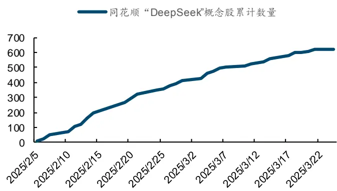
来源：iFind，国金证券研究所

图表5：同花顺概念指数历年启用数量
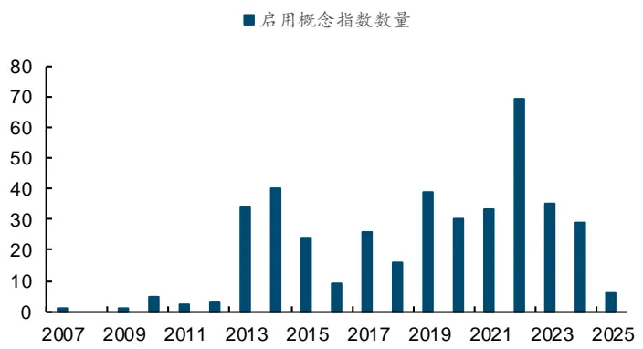
来源：iFind，国金证券研究所

那如何更有效地挖掘概念信息呢？我们认为，大语言模型可以帮助我们实现股票投资概念的全自动提取，完成从概念角度描述个股的任务。以下部分，我们将首先展示其概念提取流程，并对使用概念刻画个股相似性的方法论进行详细介绍。

## 1.2 股票投资概念的提取与解析流程

投资概念的提取可以视作一类文本处理类任务，这正是大模型所擅长的。人类研究员在进行概念识别时，也需要将新闻、研报或公司公告等文本作为信息来源，从中识别出具体的投资概念词汇，并总结其与个股的关系。我们参考这一思路，建立工作流来使用大模型实现自动化的概念识别与提取任务。我们设计流程如下：

图表6：投资概念提取流程
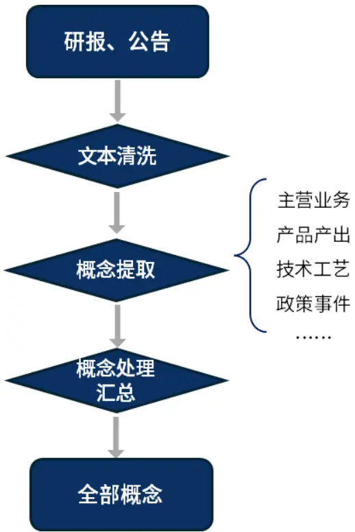
来源：国金证券研究所

## 文本数据清洗

考虑到信息来源的可靠性以及数据量的可控性，本次项目中我们只将研报与公司公告用于概念提取。文本的选择上，我们使用个股研报的摘要部分、以及公司公告的定期报告中经营相关章节进行分析。研报摘要中一般包括了分析师对于公司的核心观点，也会涉及对公司业务、产品与产业链等核心信息的描述；在个股业务出现调整或相关概念火热时，也会有研报快速更新发布，信息迭代也较为及时。为防止研报覆盖度不高，我们也将公司公告作为基础数据纳入分析。

我们对文本中的风险提示、图表等内容进行了剔除，并分批次进行处理，以获取完整的概念提取结果。

## 概念初步提取

我们首先采用思维链（Chain of Thought）技术，要求大模型从主营业务、产品产出、技术工艺、政策事件这些角度出发，将所有可能相关的概念名称进行列示。以上范围已相对全面地覆盖了市场对“投资概念”的定义，确保不出现遗漏的情况；去重则在下一步骤中进行处理。

更重要的是，我们要求大模型在生成概念名称时同步生成概念对应的名词解释与提取原因（依据）。这种方式可以进一步降低大模型的幻觉，确保输出的结果完全来自于我们提供的文本，而不是基于大模型自己的知识生成的结果。让大模型回答更多基于原文的内容，可以使其在整个任务中主要发挥文本处理的能力，并减少对其知识库的使用，是降低模型幻觉的重要方法。此外，生成概念名词解释以及提取原因也能提供更多的信息量，便于我们后续进行相关性的衡量等操作。

## 概念处理与汇总

首先我们需要进行提取概念的清洗与再验证。初步提取的概念中会存在重复（或非常类似）的名词，我们将使用大模型对此进行剔除；同时我们对结果进行再次验证，让大模型再次判断每个概念是否属于前文所列出的“投资概念”范畴，确保提取的概念准确。

更进一步，我们会对细分概念进行总结，生成新的汇总性概念。初始生成的概念会非常详细具体，而有时候我们也会关注于较为宽泛、抽象的概念类型，这需要添加流程让大模型进行总结得到。

## 汇总

我们对所有文本数据进行以上处理，并将每次的结果汇总，构造个股概念数据库。在实际操作时，受到数据量的限制，我们也可以将一段时间内的文本汇总后统一进行概念提取，并叠加更严格的文本清洗条件来缩减输入文本长度。

以下是概念提取的案例展示。

图表7：分析文本案例展示

| 股票信息 文本信息 公司简介潍柴动力是重卡行业发动机龙头，得益于本轮国内复苏、出海爆发、天然气价格走低带来的重卡行业向上周期， |  |
| --- | --- |
|  | 重卡有关业务回暖向上；此外，大缸径发动机、凯傲、林德液压、农机、燃料电池等新业态多元发展，为公司补充新增量。 投资逻辑二十载砥砺前行，动力龙头迈向多元装备龙头，股权激励计划彰显信心。公司多年以来逐步收购湘火炬、博杜安、 凯傲、林德液压、雷沃等，成为重卡链巨头，并拓展至大缸径发动机、叉车、液压、农机等领域。2023年10月公司发布股 权激励，目标2024-2026年营收分别不低于2102/2312/2589亿元，销售利润率不低于8/9/9%，彰显公司强烈信心。内需底 部复苏+天然气结构性渗透+出口持续高景气，公司重卡主业有望迎来3-5年持续上行阶段。1）内需方面，2017-2021年内 需销量长期高居百万辆以上，经历7-8年时间将逐渐进入置换高峰期，将支撑重卡内恢复至80-90万辆中枢。2）出海方面， 潍柴动力 2023年公司重卡出口5.2万辆，同比+51%，凭借性价比等产品优势，出口销量进入持续上行通道。3）结构性方面，公司2023 000338.SZ 年气体机市占率达64.66%（上险口径计算)，且气体机价值量相比柴油机更高，公司有望从油气价差持续高位中受益。4) 中国重卡综合产品力领先，在亚非拉等地区市占率还有显著提升空间。多元业态开花结果，为公司创造新增量。1）大缸径 发动机依托更高性价比、更短交付周期快速抢占市占率，同时下游数据中心等需求持续扩容，前景空间好。2）凯傲叉车+ 智能物流两手发力，有望伴随订单结构优化及电动化进程持续改善盈利。3）林德液压2023年国内实现营业收入9.8亿元， 同比+52%，收入持续向上，市场空间广阔。4）农机业务受2022年底法规切换阶段性影响市场需求，行业稳步复苏，雷沃盈 利能力有望持续改善。盈利预测、估值和评级我们预测公司24-26年归母净利润115.9/133.2/157.0亿元，对应PE为 11.5/10.0/8.5X。我们将中国重汽、一汽解放、三一重工、中集车辆、福田汽车作为可比公司，可比公司24年平均PE为 18.5，考虑公司作为行业龙头，格局地位稳固，给予2024年15XPE，目标价19.92元，首次覆盖，给予“买入”评级。 投资逻辑用友网络是全球领先的企业数智化软件与服务提供商，深耕企服领域36年，实现了从财务软件到ERP、再到BIP |
|  | 型企业的BIP3R5版本，产品性能及交付能力进一步提升；组织方面，公司23年起将大型企业客户业务由地区为主的模式升 级为以行业为主的模式，以更好契合客户需求。公司云服务业务营收已呈现回暖态势，2024年一季度云业务实现营收12.6 亿元，同比增长32.5%。其中，大型企业云服务业务实现收入7.9亿元，同比高增38.9%。随着产品打磨成熟，公司在人员 端投入将趋于保守，成本费用预计将得到较好控制，叠加收入端回暖，利润端有望实现较高弹性。以国央企为代表的大型客 用友网络户希望在进行信创改造的同时推进数智化转型，为公司的中长期增长提供有力支撑。根据智研咨询和前瞻产业研究院预测， 600588.SH 我国 ERP 市场规模2022-2027 年 CAGR为10.8%。同时伴随系统上云+AI赋能，市场空间将进一步打开。公司在产品技术成熟 度、AI大模型赋能、信创生态建设等方面均处于行业领先水平，服务大型客户经验丰富，有望在此轮国产化+数智化浪潮中 替代海外厂商，获得更高市场份额。公司还在积极探索海外市场，在产品、交付、合规等方面都有充分布局，海外ERP客户 数量和营收规模位居国内同业厂商第一。2023年公司来自境外业务收入为2.04亿元，同比增长33.2%，2017-2023年境外 业务营收 CAGR达19.9%，高于同期国内7.3%的营收增速。2023年公司启动全球化 2.0 战略，计划 3 年内覆盖100+个国家， 有望打造收入增长第二曲线。盈利预测、估值和评级我们预计2024-2026年公司实现营业收入110.98/126.44/144.87亿元， 同比增长13.3%/13.9%/14.6%；实现归母净利润 0.54/4.11/7.20亿元。我们采用市销率法对公司进行估值，给予公司 2024 年4.4倍PS估值，目标价14.28元/股，首次覆盖，给予“买入”评级。 |

来源：国金证券研究所。研报摘要来自国金证券研报《潍柴动力：重卡链业务复苏，新业态多元发展》，《用友网络公司深度研究：信创 ERP 龙头，AI 与出海打造第二成长曲线》。

图表8：“潍柴动力”对应概念信息

| 概念名称 | 概念含义 | 提取原因 |
| --- | --- | --- |
| 重卡发动机 | 高耐久性的特点。 | 重卡发动机是用于重型卡车的动力装置，具有高功率和公司是国内重卡发动机龙头，2023年重卡发动机销量30.6 万台，同比增长96%。 |
| 变速箱 | 动机输出的动力。 | 变速箱是汽车传动系统中的重要组成部分，用于调节发法士特是重卡变速箱龙头，2023年变速箱销量83.8万台， 同比增长 42%。 |

| 概念名称 | 概念含义 提取原因 |
| --- | --- |
| 大缸径发动机 | 大缸径发动机具有较大的气缸直径，通常用于需要高功公司大缸径发动机技术比肩海外龙头，2023年M系列发动 率输出的应用场景，如发电、船机和矿卡。 机销量0.8万台，同比增长38%。 |
| 智能物流 | 智能物流利用物联网、大数据等技术，实现物流系统的凯傲是全球领先智慧物流供应商，2023年营收875亿元， 智能化管理和优化。 净利润 20.9 亿元。 |
| 农业装备 | 农业装备是用于农业生产的机械设备，包括拖拉机、收雷沃为国内农业装备领先企业，2023年营收、净利润占比 割机等。 分别为 7%、7%。 |
| 新能源 | 新能源指的是利用可再生能源，如太阳能、风能、氢能公司构建了新能源、新科技、新业态“三新”业务格局，全 等，替代传统化石能源。 面布局纯电动、混动和燃料电池三大技术路线。 |
| 大缸径发动机技术 | 大缸径发动机技术涉及设计和制造具有较大气缸直径 公司大缸径发动机技术比肩海外龙头，打开成长空间。 的发动机，通常用于高功率应用。 |
| 氢能技术 | 氢能技术利用氢气作为能源，通过燃料电池等方式进行 公司全面领跑氢能赛道，致力于推动氢能技术的应用。 能量转换，具有清洁、高效的特点。 |

来源：国金证券研究所

图表9：“用友网络”提取出的概念信息

| 概念名称 | 概念含义 | 提取原因 |
| --- | --- | --- |
| BIP3R5 版本 | BIP3R5 是用友网络面向大型企业推出的新一代企业管理公司在2024年初发布了BIP3R5版本，产品性能及交付能力 软件版本，旨在提升产品性能和交付能力。 进一步提升，标志着公司产品的成熟度和市场竞争力。 |  |
| 云服务业务 | 云服务业务指通过互联网提供的各种服务，包括存储、公司云服务业务营收呈现回暖态势，2024年一季度云业务 计算、软件等，企业无需自建基础设施即可使用。 | 实现营收12.6 亿元，同比增长 32.5%。 |
| 海外市场业务 | 海外市场业务指企业在国际市场上的业务拓展和运营， 通常包括产品出口、海外投资等。 | 公司在海外市场积极布局，2023年境外业务收入为2.04亿 元，同比增长33.2%，并启动全球化2.0战略，计划覆盖100+ 个国家。 |
| AI 大模型赋能 | AI大模型赋能是指利用大型人工智能模型来提升产品和 服务的智能化水平，通常涉及自然语言处理、机器学习 等技术。 | 公司在AI大模型赋能方面处于行业领先水平，有望在国产 化和数智化浪潮中获得更高市场份额。 |
| 信创生态建设 | 信创生态建设是指信息技术应用创新生态系统的构建，公司在信创生态建设方面处于行业领先水平，服务大型客户 旨在推动国产软硬件的自主可控和创新发展。 | 经验丰富，有望替代海外厂商。 |
| 信创改造政策 | 旨在实现信息技术的自主可控和国产化。 | 信创改造政策是指国家推动信息技术应用创新的政策，以国央企为代表的大型客户希望在进行信创改造的同时推 进数智化转型，为公司的中长期增长提供有力支撑。 |
|  | 信息技术应用创新是指通过自主研发和创新，推动信息公司在信创生态建设和信创改造政策方面处于行业领先水 信息技术应用创新技术的国产化和自主可控，构建完善的生态系统，以替平，服务大型客户经验丰富，有望替代海外厂商，并为公司 代进口技术和产品。 的中长期增长提供有力支撑。 |  |

来源：国金证券研究所

如表中所示，大模型可以按照要求将摘要原文中提及的几大业务均提炼为概念，并按要求给出了相对应的概念含义解释以及具体原因，并处理成符合预期的最终形式。接下来，我们尝试基于个股的概念信息衡量股票相关性。

## 二、如何根据概念衡量个股相似性

## 2.1 概念的向量化表达

我们需要基于概念的含义判断其相似性。以上过程中我们并没有维护一个标准化的概念词库，即可能出现两个概念的含义相近、但名称不同的情况，因此我们需要基于“概念含义”字段来判断概念之间的相似性。“概念含义”字段中保留了丰富的语义信息，方便我们通过 Embedding 模型进行识别，并进一步衡量任意概念之间的相似性。

Embedding 模型可以将文本的语义通过向量表示出来，并允许我们使用余弦距离、L2 距离等方法计算向量之间的距离，以此来判断语义上的相似性。若两个概念在含义上十分相似，则其分别转换为向量之后的距离也将十分接近；反之则距离更远。简言之，语义向量化可以让我们通过数值来观察概念的相似性，这是传统方法所不具备的。

实际操作中，我们会将概念名称、概念描述和原因合并为概念文本，并对概念文本进行向量化。概念文本不仅仅包含了概念的释义，还包括概念提取的原因，这保证了向量化能够保留概念与个股之间完整的语义关系。本文采用余弦相似度来计算向量之间的距离，其公式如下:

$$
cosine\left(\boldsymbol{x}_{i},\boldsymbol{x}_{j}\right)=\frac{\boldsymbol{x}_{i}\cdot\boldsymbol{x}_{j}}{\|\boldsymbol{x}_{i}\|\|\boldsymbol{x}_{j}\|}
$$

其中，x 与x 代表两个概念向量。余弦相似度取值在-1 到 1 之间，越接近 1 表明两个向量距离越近，其语义也越相似。

我们选择的 xiaobu-embedding-v2 模型进行向量化，最终将概念文本转换为 1792 维的向量。值得注意的是，Embedding 模型在生成的词向量时已将向量长度统一到单位圆上，因此直接使用词向量点乘即可获得余弦相似度结果。

我们以“潍柴动力”的“重卡发动机”概念为例，展示按照余弦相似度搜索出来的高相关概念及其对应个股，检索的时间截面为 2024 年第三季度。

图表10：“潍柴动力-重卡发动机”概念的向量相似性匹配结果示例

| 股票代码 | 股票简称 | 概念名称 | 中信一级行业 | 中信二级行业 | 申万一级行业 | 申万二级行业 | 余弦相似性 |
| --- | --- | --- | --- | --- | --- | --- | --- |
| 000338.SZ | 潍柴动力 | 重卡发动机 | 汽车 | 商用车 | 汽车 | 汽车零部件 | 1.0000 |
| 000800.SZ | 一汽解放 | 重卡业务 | 汽车 | 商用车 | 汽车 | 商用车 | 0.9083 |
| 000951.SZ | 中国重汽 | 重型卡车业务 | 汽车 | 商用车 | 汽车 | 商用车 | 0.9013 |
| 000581.SZ | 威孚高科 | 天然气重卡 | 汽车 | 汽车零部件Ⅱ | 汽车 | 汽车零部件 | 0.8967 |
| 002126.SZ | 银轮股份 | 天然气重卡 | 汽车 | 汽车零部件Ⅱ | 汽车 | 汽车零部件 | 0.8932 |
| 688737.SH | 中自科技 | 天然气重卡催化剂 | 基础化工 | 其他化学制品Ⅱ | 汽车 | 汽车零部件 | 0.8874 |
| 601633.SH | 长城汽车 | 皮卡 | 汽车 | 乘用车Ⅱ | 汽车 | 乘用车 | 0.8867 |
| 301550.SZ | 斯菱股份 | 重卡轴承 | 汽车 | 汽车零部件Ⅱ | 汽车 | 汽车零部件 | 0.8841 |
| 601038.SH | 一拖股份 | 柴油机 | 机械 | 专用机械 | 机械设备 | 专用设备 | 0.8827 |
| 000550.SZ | 江铃汽车 | 皮卡 | 汽车 | 商用车 | 汽车 | 商用车 | 0.8823 |
| 600482.SH | 中国动力 | 柴油机动力 | 电力设备及新能源 | 电源设备 | 电力设备 | 其他电源设备Ⅱ | 0.8815 |
| 688339.SH | 亿华通-U | 氢能重卡 | 电力设备及新能源新能源动力系统 |  | 电力设备 | 电池 | 0.8813 |
| 600418.SH | 江淮汽车 | 皮卡 | 汽车 | 乘用车Ⅱ | 汽车 | 商用车 | 0.8811 |
| 001696.SZ | 宗申动力 | 摩托车发动机 | 机械 | 通用设备 | 机械设备 | 通用设备 | 0.8801 |
| 000528.SZ | 柳工 | 装载机 | 机械 | 工程机械Ⅱ | 机械设备 | 工程机械 | 0.8783 |
| 300816.SZ | 艾可蓝 | 柴油机业务 | 汽车 | 汽车零部件Ⅱ | 汽车 | 汽车零部件 | 0.8777 |
| 688021.SH | 奧福环保 | 重型卡车市场 | 基础化工 | 其他化学制品Ⅱ | 汽车 | 汽车零部件 | 0.8776 |
| 300680.SZ | 隆盛科技 | 天然气重卡喷射气轨 | 汽车 | 汽车零部件Ⅱ | 汽车 | 汽车零部件 | 0.8762 |
| 301039.SZ | 中集车辆 | 半挂车 | 汽车 | 商用车 | 汽车 | 商用车 | 0.8712 |

来源：iFind，国金证券研究所

从结果上可以看出，我们检索出来的股票概念与“重卡发动机”概念存在明显相关性，主要集中于重型卡车类概念以及发动机等。从行业分布上来看，高相关的股票已不再局限于潍柴动力所属的汽车一级行业或二级行业分类，而是能将电力设备、机械设备等其他行业中涉及类似概念或具有类似业务的股票筛选出来，初步展示了概念层面衡量相似性的优势。相比传统的行业筛选，这一方法能带来更丰富的信息，也能以更贴近实际投资逻辑的方法进行股票筛选。

## 2.2 个股的向量化表达

我们直接将个股对应的概念向量进行相加并单位化，得到股票向量。由于我们最终的目的是衡量股票之间的相关性，而股票与概念之间存在一对多的对应关系，因此较为直接的方法便是先构造出股票向量，再衡量股票相似性。

股票向量的计算方法上，我们借鉴了传统 NLP 研究中使用句子中词向量的平均值来表达句向量的思路。在计算句向量时，若句子中的词汇数量较少且词之间关系简单，我们使用词向量均值或加权求和的结果是合适的，且计算方法非常简单。股票所属的多个概念之间类似于并列关系、且概念的数量并不多，因此采用均值法具有合理性。当然，不同投资概念对股票的影响程度也有差异，理论上加权求和是更贴合实际的方法，然而此处的权重还难以进行量化。这也是我们后续需要进一步探索的方向。

我们采用的概念向量计算方法如下：

$$
vec(stock_{i})={{\sum_{j}vec}\left({concept_{i,j}}\right)_{\Big/{\left\|{\sum_{j}vec}\left({concept_{i,j}}\right)\right\}|}}
$$

其中， $vec(stock_{i})$ 代表股票 i 对应的向量， $vec(concept_{i,j}$ )代表属于股票 i 的概念j 对应的向量。

以上处理方法的好处在于，“股票”与“概念”两类对象最终都能在同一个向量空间中表示出来。理论上，我们可以直接通过向量相似性寻找出与某只股票相似的许多概念，也可以找到与某个概念相近的股票名单。当然，这也方便我们进行股票与股票之间相关性的衡量。

图表11：股票相似性衡量的方法
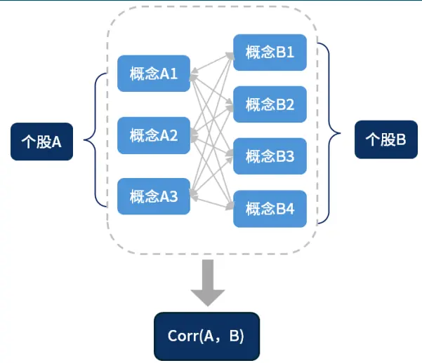
来源：国金证券研究所

得到股票向量之后，我们就可以继续套用余弦相似性方法，最终得到股票之间的相似性度量。

$$
Corr\big(stock_{j},stock_{k}\big)=vec\big(stock_{j}\big)*vec(stock_{k})
$$

需要注意的是，此处我们并未从概念两两之间的相关性层面考虑股票的相似性，这也与我们的应用场景有关。在本文中，我们最终需要对股票进行聚类分析，因此必须要先得到股票的向量表达，再进行后续分析；若我们只是为了寻找与某只股票相似的其他个股，则可以直接通过概念向量的相似性来进行检索，并不需要进行个股的向量化表达。在个股层面对概念向量进行聚合会导致信息损失，也可能进一步加剧“维度灾难”等问题。

以下是我们基于股票向量计算得到的“潍柴动力”相似个股结果。受篇幅限制，我们仅展示相似度前 5 的股票结果，更多的相似个股名单请参考附录。

图表12：“潍柴动力”股票向量相似性匹配部分结果

| 股票代码 股票简称 | 中信一级行 业 | 余弦相似性 | 相关概念名称 |
| --- | --- | --- | --- |
| 000338.SZ 潍柴动力 | 汽车 | 1.000 | 重卡发动机，变速箱，车桥，智能物流，农业装备，大缸径发动机，智能无人叉车解决方案， 机械设备，新能源，大缸径发动机技术，氢能技术，电驱动总成技术，天然气重卡，大缸径/ 大排量发动机，新能源重卡，国六B新政策，环保与新能源 |
| 000800.SZ 一汽解放 | 汽车 | 0.970 | 重卡业务，电动智能化转型，全球化战略，业务扩展与创新，天然气重卡，电动智能化重 |

| 股票代码股票简称 |  | 中信一级行 业 | 余弦相似性 | 相关概念名称 |  |
| --- | --- | --- | --- | --- | --- |
|  |  |  |  |  | 卡，海外商用车业务，公共领域车辆全面电动化先行试点工作，新能源重卡 |
|  | 000951.SZ 中国重汽 | 汽车 | 0.961 | 术与市场 | 重卡整车销售，天然气重卡，海外出口，纯电动技术，混合动力技术，氢燃料电池技术，以 旧换新政策，重型卡车业务，新能源技术，重卡出口，自动换挡变速箱（AMT），重型卡车技 |
| 600006.SH 东风股份 |  | 汽车 |  | 0.959 | 轻型货车，东风康明斯发动机，襄阳旅行车，重卡AMT，供给侧改革，商用车及其相关技术 |
|  | 301039.SZ 中集车辆 | 汽车 |  | 0.957 用车辆 | 半挂车，专用车上装，EVRT新能源混凝土搅拌车，星链计划，灯塔制造网络，以旧换新政 策，一带一路倡议，物流与运输，混凝土搅拌车，新能源专用车，星链计划，轻量化技术，商 |
| 001696.SZ 宗申动力 |  | 机械 |  | 0.955 | 摩托车发动机，通用机械，航空发动机，新能源，高端零部件，智能制造，摩托车发动机业 务，储能业务，航空发动机业务，新能源业务，高端零部件业务，智能化生产线，航空活塞 发动机，机械与动力系统 |
| 000550.SZ 江铃汽车 |  | 汽车 |  | 0.954 | 电动智能化轻型商用车，特种车辆改装业务，整车出口业务，新能源汽车，轻卡和轻客业 务，乘用车混动及BEV项目，电动智能汽车，氢燃料、甲醇燃料整车技术，L4级自动驾驶技 |
| 002448.SZ 中原内配 |  | 汽车 |  | 0.953 | 术，消费品以旧换新政策，汽车报废更新补贴政策 气缸套，钢活塞，电控执行器，氢燃料电池发动机，固态储氢系统，汽车零部件，双金属制 动鼓，氢燃料电池系统，钢质活塞，燃料电池示范城市集群政策，环保与节能技术 |
| 600066.SH 宇通客车 |  | 汽车 | 0.953 |  | 新能源客车，海外市场拓展，公交车更新换代，高端客车，一带一路政策，新能源技术，自 动驾驶客车，车路协同技术，以旧换新政策，智能交通与新能源 |
| 601038.SH 一拖股份 |  | 机械 | 0.953 |  | 拖拉机，农业机械，海外市场，消费品以旧换新行动方案，农业机械报废更新补贴政策，大 中型拖拉机，大马力无级变速拖拉机，柴油机，大马力技术，整机+核心零部件一体化布 |
| 603950.SH 长源东谷 |  | 汽车 |  | 0.952 | 局，国四排放标准切换，农机补贴政策 新能源混动，商用车发动机，稳增长政策，汽车动力系统，发动机零部件，天然气重卡，新 能源混动汽车，汽车电子传感器，压铸件，减震器，汽车零部件，新能源汽车 |
| 000581.SZ 威孚高科 |  | 汽车 | 0.952 |  | 高压共轨系统，尾气后处理系统，涡轮增压器，智能电动核心部件，氢燃料电池，发动机及 排放控制技术，天然气重卡，海外出口市场，电子油泵，汽车智能化，汽车及相关零部件 |
| 300680.SZ 隆盛科技 |  | 汽车 | 0.952 |  | EGR系统，新能源车驱动电机铁芯，精密零部件，商业航天领域核心零部件，国六排放标 准，排放控制技术，电机铁芯业务，混动EGR技术，非道路工程机械T4阶段排放法规，新能 源汽车驱动电机铁芯，天然气重卡喷射气轨总成 |
| 688021.SH 奥福环保 基础化工 |  |  | 0.951 |  | 大尺寸蜂窝陶瓷载体，天然气重卡载体，乘用车市场开拓，国六排放标准，环保与排放控 制，蜂窝陶瓷载体，重型卡车市场，海外市场拓展，非道路国四标准 |

来源：iFind，国金证券研究所

## 三、相似性的应用：组合优化

在本次研究中，我们尝试将股票相似性应用于组合优化问题中，并为传统的优化方法带来效果提升。选股因子在落实到策略的过程中，通过优化问题求解出组合权重是必不可少的一步。投资者一般会添加行业暴露、因子暴露等约束条件来控制组合与基准之间的差异，这样能够控制跟踪误差并带来更高的信息比率。

然而在当下主题轮动加剧的市场环境中，行业内部的个股涨跌差异增大，行业暴露约束并不能完全控制住由投资概念带来的风险收益。因此，我们对股票向量进行降维聚类，并将聚类结果替换掉传统的行业分类，应用于组合优化的行业暴露控制中，为组合超额净值带来提升，展示其相对于传统行业分类标准在组合风险控制上的优势。

## 3.1 基于概念的个股聚类分析

原始股票向量维度较高，达到 1792 维，若直接进行聚类容易出现维度灾难。因此我们采用降维聚类的方案，先使用降维算法对原始的股票向量进行降维，再根据降维后的股票向量进行聚类分析。我们将对比不同的降维与聚类算法，寻找最优方案，并将其用于组合优化上。

降维算法我们尝试主成分分析（PCA）、多维尺度降维（MDS）、随机近邻嵌入（t-SNE），以上算法覆盖了线性、非线性降维方法，我们将统一测试在高维股票向量降维上的优势。聚类方法上，我们则是主要对比了 K-Means、层次凝聚聚类（Agglomerative Clustering）与亲和力传播聚类（Affinity Propagation），并试图找到最适用于股票聚类场景的算法。同时，我们也会对降维后的向量维度、降维与聚类算法中涉及的参数等进行调优。

图表13：股票降维聚类结果示意图(tSNE(2)-Affinity(damping=0.6))
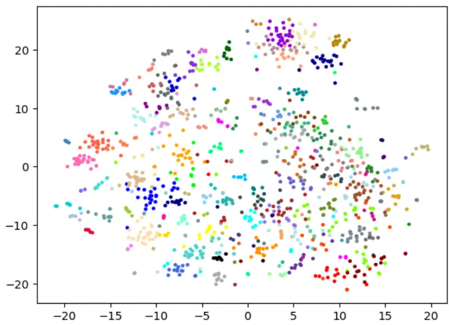
来源：国金证券研究所

我们以“PCA(128)-Kmeans(30)”方案结果为例，其中的名称含义为：PCA 降至 128 维、Kmeans 聚类个数为 30。我们依旧观察“潍柴动力”这只股票所属聚类中的其他股票，会发现此时聚类结果与行业分类有非常明显的差异，聚类中涵盖了汽车、建材、建筑等多个一级行业个股。聚类的效果好坏，还是需要放入优化问题中才能得到详细结果。

图表14：股票向量降维聚类结果展示以“潍柴动力”所属聚类为例

| 股票代码 | 股票简称 | 中信一级行业 | 相关概念名称 |
| --- | --- | --- | --- |
| 000338.SZ | 潍柴动力 | 汽车 | 重卡发动机，变速箱，车桥，智能物流，农业装备，大缸径发动机，智能无人叉车解决方案，机 |
|  |  |  | 械设备，新能源，大缸径发动机技术，氢能技术，电驱动总成技术，天然气重卡，大缸径/大排 |
|  |  |  | 量发动机，新能源重卡，国六B新政策，环保与新能源 |
| 000800.SZ | 一汽解放 | 汽车 | 重卡业务，电动智能化转型，全球化战略，业务扩展与创新，天然气重卡，电动智能化重卡， 海外商用车业务，公共领域车辆全面电动化先行试点工作，新能源重卡 |
| 300124.SZ |  | 汇川技术电力设备及新能源 | 工业智能化，新能源汽车，数字化平台InoCube，云边端一体化架构，新一代AM系列中型 PLC，科技创新政策，工业数字化，通用自动化，工业机器人，工业自动化，智慧电梯，轨道交 通，工业自动化解决方案，新能源汽车技术，新能源汽车业务，通用自动化业务，电梯业务， 新能源汽车三电领域 |
| 601799.SH | 星宇股份 | 汽车 | 新能源车灯项目，智能化车灯业务，全球化布局，DLP智能前照灯，MicroLED技术，智能数字 格栅，数字保险杠，车灯控制器HCM/RCM/LCU，智能车灯，智能照明技术，车灯产品，新能源 车型项目，海外市场业务，ADB技术，DLP车灯技术，LED/OLED车灯技术，智能车灯技术 |
| 601689.SH | 拓普集团 | 汽车 | 车端&执行器业务，内饰功能件，轻量化底盘，汽车电子类业务，机器人电驱系统，机器人直 线及旋转执行器，机器人零部件，空气悬架系统，新能源汽车零部件，热管理系统，IBS线控 制动系统，EPS电子助力转向系统，闭式空气悬架系统，智慧电动门系统，智能汽车技术 超级增程皮卡，长安“金钟罩”电池技术，新蓝鲸增程动力系统，智能电动品牌，新能源汽 |
| 000625.SZ | 长安汽车 | 汽车 | 车，出海策略，L2级智能驾驶+主动安全系统，华为乾崑智驾ADS3.0，华为乾崑智驾 ADSSE，DeepaIOS系统，SDA智能化汽车超级数字化平台，智能驾驶系统 |
| 002594.SZ | 比亚迪 | 汽车 | 新能源汽车，整车智能架构“璇玑”，第五代DM技术，新能源汽车出口业务，磷酸铁锂刀片 电池，e平台3.0EVO，新能源汽车技术，DM5.0技术，E4.0平台，刀片电池，CTB 电池车身一体 |
|  |  |  | 化，DiLink智能网联系统，拉美新能源转型目标与支持政策 机器人机电执行器，热泵变频控制器，新能源汽车热管理系统，电子膨胀阀技术，智能控制 |
|  |  |  | 技术，传统制冷业务，仿生机器人，储能业务，家电“以旧换新”政策，汽车“以旧换新”政 |
|  |  |  | 策，新能源汽车与节能环保，新能源车热管理，制冷空调零部件，人形机器人，车用电子膨胀 |
|  |  |  | 阀，Omega泵，机电执行器，谐波减速器，汽车与制冷系统零部件 |
|  |  |  | 智能座舱，智能驾驶，网联服务，智能驾驶域控制器，高算力平台，轻量级差异化平台，智能 |
| 002920.SZ | 德赛西威 | 汽车 | 汽车技术，中央计算平台，舱驾一体L4智驾技术，城市NOA商业化应用 |
|  |  |  | 新能源汽车，海外市场，皮卡，纯电、混动、氢能三轨并行，智能化技术，新能源SUV，硬派越 |
|  |  |  | 野车，海外出口业务，智能座舱系统，HUAWEIHiCar集成开发合作，Hi4-T技术，智能化车载 |
| 600104.SH |  | 汽车 | 系统，坦克品牌车型，智能驾驶系统 CoffeePilotUItra，智慧空间系统 Coffee0S3 |
|  |  |  | 新能源汽车，国际市场出口，新能源三电系统，智能化软硬件全栈布局，海外市场，固态电 |
|  |  |  | 池，零束智能车全栈方案3.0，汽车技术创新，智己汽车，插电混动车型技术，纯电车型技术 |
| 601238.SH | 广汽集团 | 汽车 |  |
|  |  |  | 自主新能源车，MPV车型，混动PHEV车型，出海战略，高效内燃机，机电耦合系统，无图智驾 技术，智能底盘，智能人机交互，智能网联汽车准入和上路通行试点，新能源汽车，智能汽车 |
|  |  |  | 技术，智能网联汽车，L3自动驾驶，XEV+ICV技术，EV+ICV技术，智能网联汽车技术 |
| 600741.SH | 华域汽车 | 汽车 | 新能源汽车，智能座舱，数字交互大灯，电控和高压电机，800V碳化硅控制器，雷达技术，智 |
|  |  |  | 能照明，智能驾驶辅助，电驱动系统，热管理系统，热管理技术 |
| 002791.SZ | 坚朗五金 | 建材 | 门窗五金系统，多元化家居业务，地产相关政策，建筑五金，家居类产品，智能家居，智慧安 |
|  |  |  | 防，机械锁和智能锁，淋浴房及照明产业，海外市场，坚朗云采平台，工程项目协同平台 |
|  |  |  | (PMS），“一带一路”政策，智能家居与安防，家居配套产品，海外市场拓展 |
| 002572.SZ | 索菲亚 | 轻工制造 | 整家战略，集成整装，米兰纳品牌，大宗渠道业务，保交楼政策，家居品牌与战略，家具，整装 |
|  |  |  | 服务，小B工程业务，海外市场，数字化转型，智能制造，家居与装修，技术与效率提升 |
| 601992.SH | 金隅集团 | 建材 |  |
| 002202.SZ |  |  | 绿色建材，房地产开发，房地产投资运营，建筑与房地产 |
|  |  |  | 大型风力发电机组，风电场开发业务，风电场转让业务，风电产业，风机大型化，技术路线切 |
|  |  |  | 电力设备及新能源换，风力发电，大兆瓦风力发电机组，海上风电项目，风机大型化技术，数字化运维技术，“十 |
|  |  |  | 四五”期间海上风电政策，风电场管理与运维，政策支持与市场发展 |
|  |  |  | 风机及相关配件，新能源电站运营，电站产品销售，光储氢一体化布局，大型化风机技术，光 |
|  |  |  | 电力设备及新能源 储氢技术，十四五海上风电发展计划，新能源产业 |
|  |  |  | 联网通信业务，算网数智业务，联通云，云服务器操作系统，云灾备，大模型开发应用，云计 |
|  |  |  | 算与数据服务，5G行业虚拟专网，物联网，星罗先进算力调度平台，人工智能，数字新基建， |
|  |  | 通信 | 数字基础设施，车联网创新产品，联通人车家生活全生态平台，智能网联汽车解决方案，AI |
|  |  |  | 赋能低空经济，东数西算政策，车路云一体化政策 |
|  |  |  | 自来水业务，污水处理业务，固废运营业务，成都市“十四五”水务发展规划，环境保护业务， |
|  | 兴蓉环境 |  | 电力及公用事业 供水业务，环保业务，污水处理服务增值税免征政策，成都市中心城区第五期污水处理服务 费调价政策，环境保护与资源管理 |
|  |  |  | 建筑施工，建材工业，城市更新，生态环境，水利水务，工业化建造，新基建，建筑服务，基础 |
|  |  |  | 设施建设 摩托车发动机，通用机械，航空发动机，新能源，高端零部件，智能制造，摩托车发动机业务， |
|  |  |  | 储能业务，航空发动机业务，新能源业务，高端零部件业务，智能化生产线，航空活塞发动 |

来源：iFind，国金证券研究所

概念聚类过程并非黑箱，我们可以通过聚类中股票的概念名称观察出整体的背后逻辑。以潍柴动力所属聚类为例，其中大多数股票同样属于汽车行业，共同涉及的概念包括“新能源”、“出海业务”、“智能驾驶”、“智能制造”等；其中“新能源”概念又会与“风电”、“储能”、“环保”等概念相近，因此聚类中也出现了部分电力设备及新能源、电力及公用事业的相关股票；轻工制造、机械与建筑建材等行业的股票则会通过“出海业务”、“智能制造”概念产生关联性；中国联通则通过“智能网联汽车”、“车路云一体化”等概念与汽车行业股票产生相关性。

实践中，我们每季度重新进行一次聚类，每次聚类时优先选择个股当前季度中对应的概念构造股票向量，若数据缺失则沿用上季度的股票向量。季频的调整频率能够兼顾投资概念信息的及时性与聚类结果的稳定性。

## 3.2 概念聚类增强组合优化策略收益

我们将聚类结果应用于指数增强策略中。在以往研究中，我们通过求解 Markowitz 均值-方差优化模型来得到组合中个股的权重，并在优化过程中加入个股权重偏离约束、因子暴露约束、行业暴露约束等条件，控制策略对基准指数的跟踪能力。此前我们一般使用 Barra行业分类（GICS）或中信行业分类作为行业基准。优化问题可大致表示为如下形式：

$$
\begin{array}{c}{\displaystyle{\operatorname*{max}^{m\ ax}w^{T}f}}\\{\displaystyle{}}\\{\displaystyle{s.t.\left\{(w-w^{0})^{T}\Sigma^{(}w-w^{0})<\varepsilon\right.}}\\{\displaystyle{\left.B(w-w^{0})<b\right.}}\\{\displaystyle{I(w-w^{0})<i}}\end{array}
$$

其中，w为需要求出的权重，f为预期收益率因子，B为 Barra 因子暴露矩阵，I则为行业暴露矩阵，δ、 ε、 b、 i等表示人为设置的约束值。

本次测试中，我们将概念聚类结果替换掉传统的行业分类，并观察其能否为现有的沪深300、中证 500 以及 A500 指数增强策略的表现带来提升。由于 GICS 与申万一级行业分类的数量均在 30 个左右，因此我们挑选聚类核心同样是 30 个的分类结果进行对比。

我们首先在沪深 300 指数上进行测试，统一使用我们此前报告中给出的机器学习沪深 300增强因子作为预期收益，在约束问题中控制个股偏离约束 1%，跟踪误差约束 5%，Barra因子暴露约束 0.1，行业暴露约束 0.01，每月末进行优化求解。以上参数主要对行业暴露进行严格控制，便于我们对比不同行业分类方法的优劣。

图表15：沪深300概念聚类组合优化多头净值走势
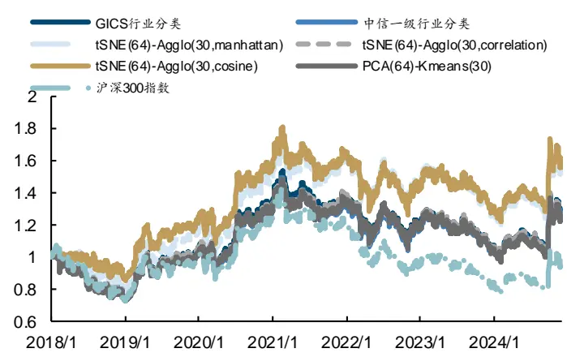
来源：iFind，国金证券研究所

图表16：沪深300概念聚类组合优化多头超额净值走势
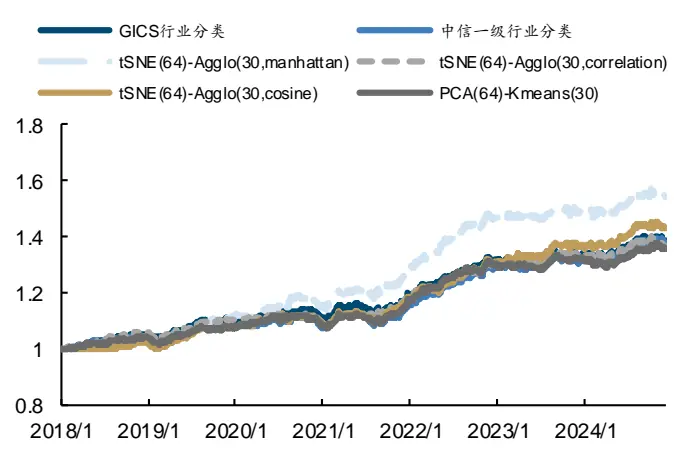
来源：iFind，国金证券研究所

图表17：沪深300概念聚类组合优化多头超额指标表现

| GICS行业中信一级行业 |  |  | PCA (64) – Kmeans (30) | tSNE(64)- | tSNE(64)- Agglo(30,manhattan) Agglo(30, correlation)Agglo(30, cosine) | tSNE(64)- |
| --- | --- | --- | --- | --- | --- | --- |
| 年化超额收益率 | 4.81% | 4.70% | 4.49% | 6.49% | 4.60% | 5.27% |
| 跟踪误差 | 3.26% | 3.19% | 3.14% | 3.53% | 3.05% | 3.19% |
| 信息比率 | 1.475 | 1.474 | 1.431 | 1.838 | 1.506 | 1.650 |
| 超额胜率 | 55.28% | 55.46% | 55.04% | 55.69% | 54.92% | 57.66% |
| 超额最大回撤率 | 4.41% | 4.44% | 4.02% | 4.57% | 4.48% | 3.86% |

来源：iFind，国金证券研究所

从回测结果上可以看出概念聚类结果明显优于传统的 GICS 或中信一级行业分类，优势主要在提升组合的信息比率上有明显优势。其中，tSNE(64)-Agglo(30, manhattan) 聚类的年化超额收益到 6.49%，信息比率达到 1.838；tSNE(64)-Agglo(30, cosine) 也能达到年化超额 5.27%，信息比率 1.650，且超额最大回撤仅 3.86%；相比之下，中信一级行业分类年化超额 4.70%，GICS 行业分类年化超额 4.81%，信息比率均在 1.475 左右。

我们在中证 500 范围内进行对比测试，预期收益因子使用我们此前报告中给出的机器学习中证 500 增强因子，其余约束条件参数保持不变，主要对比不同行业暴露约束对优化组合表现的影响。

以下是回测表现较好的几组聚类方案效果展示。

图表18：中证500概念聚类组合优化多头净值走势
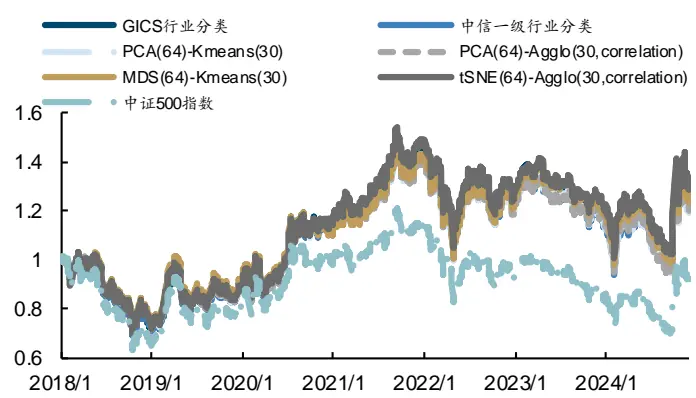
来源：iFind，国金证券研究所

图表19：中证500概念聚类组合优化多头超额净值走势
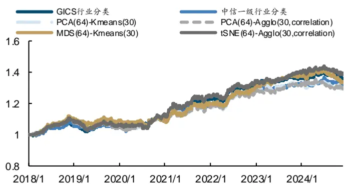
来源：iFind，国金证券研究所

图表20：中证500概念聚类组合优化多头超额指标表现

|  | GICS 行业 | 中信一级行业 | PCA (64) – Kmeans (30) | PCA (64)– | MDS (64) - Kmeans (30) | tSNE(64)- Agglo(30,correlation) |  |
| --- | --- | --- | --- | --- | --- | --- | --- |
|  |  |  |  |  |  |  | Agglo(30, correlation) |
| 年化超额收益率 | 4.49% | 3.91% | 3.80% | 3.82% | 4.29% | 4.84% |  |
| 跟踪误差 | 4.00% | 4.05% | 4.10% | 4.11% | 4.08% | 4.06% |  |
| 信息比率 | 1.122 | 0.964 | 0.927 | 0.930 | 1.052 | 1.192 |  |
| 超额胜率 | 53.97% | 53.49% | 53.49% | 53.31% | 53.37% | 53.79% |  |
| 超额最大回撤率 | 5.73% | 5.88% | 6.73% | 7.11% | 6.38% | 6.80% |  |

来源：iFind，国金证券研究所

中证 500 范围内，概念聚类的优势并不突出，在信息比率方面难以超过 Barra 使用的 GICS行业分类的 1.122，仅 tSNE(64)-Agglo(30, correlation)方案能带来 4.84%的年化超额收益与 1.192 的信息比率，略优于 GICS 行业分类；此外，MDS(64)-Kmeans(30)方案的年化超额收益达到 4.29%，信息比率达到 1.052，相较于中信一级行业分类也有一定优势。最后，我们在中证 A500 范围内进行优化。优化约束条件与以上回测保持一致。

图表21：中证A500概念聚类组合优化多头净值走势
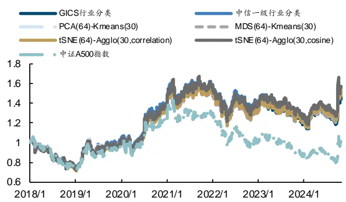
来源：iFind，国金证券研究所

图表22：中证A500概念聚类组合优化多头超额净值走势
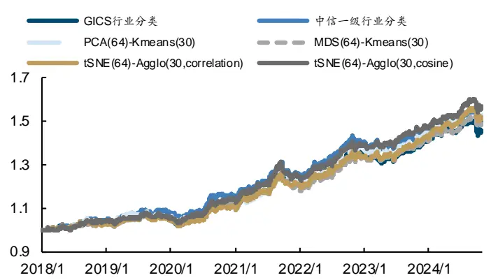
来源：iFind，国金证券研究所

图表23：中证A500概念聚类组合优化多头超额指标表现

|  | GICS 行业 | 中信一级行业 | PCA (64) – Kmeans (30) | MDS (64) - Kmeans (30) | tSNE(64)- Agglo(30, correlation) | tSNE(64)- Agglo(30, cosine) |
| --- | --- | --- | --- | --- | --- | --- |
| 年化超额收益率 | 5.61% | 6.22% | 6.37% | 5.98% | 6.24% | 6.74% |
| 跟踪误差 | 3.93% | 3.84% | 4.08% | 3.89% | 3.90% | 3.88% |
| 信息比率 | 1.429 | 1.620 | 1.562 | 1.536 | 1.601 | 1.739 |
| 超额胜率 | 55.41% | 56.93% | 55.90% | 55.72% | 55.96% | 56.26% |
| 超额最大回撤率 | 6.11% | 5.85% | 5.93% | 6.66% | 5.27% | 6.66% |

来源：iFind，国金证券研究所

从结果上来看，GICS 与中信一级行业分类的年化超额分别为 5.61%和 6.22%，信息比率分别为 1.429 和 1.620。相比之下，tSNE(64)-Agglo(30,cosine)能够达到 1.739 的信息比率与 6.74%的年化超额，在同等条件下最优；tSNE(64)-Agglo(30,correlation)也能带来更高的年化超额收益与更低的超额最大回撤。

整体来说，tSNE 降维搭配 Agglomerative 层次凝聚聚类算法得到的股票分类用于控制行业暴露的效果普遍最好。无论层次凝聚聚类算法中使用什么样的方法衡量距离，都可能带来相对 GICS 或中信行业分类更好的控制结果。此外，股票聚类算法在沪深 300 上的优势相对中证 500 或中证 A500 都更好，这一方面有股票概念覆盖度的原因，另一方面也说明概念相似性更适用于业务范围较广、涉及概念较多的大市值股票。上市公司的业务越难以通过单一的行业完整描述，则使用概念聚类的效果约好。

## 四、总结

总结来说，本文完成了以下任务：

首先，我们提出一种从投资概念出发的股票相似性衡量思路，设计了自动化的股票概念提取工作流，使用思维链技术让大模型分析研报与公告文本，提取出投资概念与对应解释文本，构建完善的股票概念关系数据库。

之后，我们通过 Embedding 模型对概念文本向量化，并聚合到股票层面，实现在同一个向量空间中表示股票与概念两类对象。这使得我们能够对任意的概念与股票进行相似性的计算，也便于我们进行后续的聚类分析。

最后，我们将股票向量应用于组合优化的行业暴露控制中，使用相似性衡量结果为组合优化带来提升。我们以沪深 300、中证 500 与中证 A500 指数的增强策略为案例，通过对比不同的聚类方案与参数调优，找到相较于传统 GICS 或中信一级行业分类更加有效的股票聚类结果，并为组合超额净值带来提升，进一步优化跟踪误差与信息比率表现。

实际上，我们认为前半部分提出的股票概念关系数据库的构建与相似性衡量是本文的核心贡献，后续的组合优化仅仅是股票概念关系数据库的应用思路之一。概念数据库能够为我们带来丰富的想象空间，譬如可以通过概念相似性捕捉动量溢出效应，快速布局存在补涨可能性的股票，并构建相应选股策略。如何进一步挖掘股票概念数据库的潜力也是我们接下来的研究方向之一。

股票概念关系数据库的构建则是大语言模型在投研领域的又一重要应用案例。大模型能够帮助我们将非结构化的文本信息融入现有策略框架中，并完成此前难以实现的各类任务，也将为传统投研带来全新的方法与思路。

## 风险提示

1、以上结果通过历史数据统计、建模和测算完成，在政策、市场环境发生变化时模型存在时效的风险。

2、策略通过一定的假设通过历史数据回测得到，当交易成本提高或其他条件改变时，可能导致策略收益下降甚至出现亏损。

3、大语言模型输出结果具有一定随机性的风险，模型迭代升级、新功能开发可能会导致结论不同。人工智能模型得出的结论仅供参考，可能出现错误答案的风险。

## 特别声明：

国金证券股份有限公司经中国证券监督管理委员会批准，已具备证券投资咨询业务资格。

本报告版权归“国金证券股份有限公司”（以下简称“国金证券”）所有，未经事先书面授权，任何机构和个人均不得以任何方式对本报告的任何部分制作任何形式的复制、转发、转载、引用、修改、仿制、刊发，或以任何侵犯本公司版权的其他方式使用。经过书面授权的引用、刊发，需注明出处为“国金证券股份有限公司”，且不得对本报告进行任何有悖原意的删节和修改。

本报告的产生基于国金证券及其研究人员认为可信的公开资料或实地调研资料，但国金证券及其研究人员对这些信息的准确性和完整性不作任何保证。本报告反映撰写研究人员的不同设想、见解及分析方法，故本报告所载观点可能与其他类似研究报告的观点及市场实际情况不一致，国金证券不对使用本报告所包含的材料产生的任何直接或间接损失或与此有关的其他任何损失承担任何责任。且本报告中的资料、意见、预测均反映报告初次公开发布时的判断，在不作事先通知的情况下，可能会随时调整，亦可因使用不同假设和标准、采用不同观点和分析方法而与国金证券其它业务部门、单位或附属机构在制作类似的其他材料时所给出的意见不同或者相反。

本报告仅为参考之用，在任何地区均不应被视为买卖任何证券、金融工具的要约或要约邀请。本报告提及的任何证券或金融工具均可能含有重大的风险，可能不易变卖以及不适合所有投资者。本报告所提及的证券或金融工具的价格、价值及收益可能会受汇率影响而波动。过往的业绩并不能代表未来的表现。

客户应当考虑到国金证券存在可能影响本报告客观性的利益冲突，而不应视本报告为作出投资决策的唯一因素。证券研究报告是用于服务具备专业知识的投资者和投资顾问的专业产品，使用时必须经专业人士进行解读。国金证券建议获取报告人员应考虑本报告的任何意见或建议是否符合其特定状况，以及（若有必要）咨询独立投资顾问。报告本身、报告中的信息或所表达意见也不构成投资、法律、会计或税务的最终操作建议，国金证券不就报告中的内容对最终操作建议做出任何担保，在任何时候均不构成对任何人的个人推荐。

在法律允许的情况下，国金证券的关联机构可能会持有报告中涉及的公司所发行的证券并进行交易，并可能为这些公司正在提供或争取提供多种金融服务。

本报告并非意图发送、发布给在当地法律或监管规则下不允许向其发送、发布该研究报告的人员。国金证券并不因收件人收到本报告而视其为国金证券的客户。本报告对于收件人而言属高度机密，只有符合条件的收件人才能使用。根据《证券期货投资者适当性管理办法》，本报告仅供国金证券股份有限公司客户中风险评级高于 C3 级(含 C3 级）的投资者使用；本报告所包含的观点及建议并未考虑个别客户的特殊状况、目标或需要，不应被视为对特定客户关于特定证券或金融工具的建议或策略。对于本报告中提及的任何证券或金融工具，本报告的收件人须保持自身的独立判断。使用国金证券研究报告进行投资，遭受任何损失，国金证券不承担相关法律责任。

若国金证券以外的任何机构或个人发送本报告，则由该机构或个人为此发送行为承担全部责任。本报告不构成国金证券向发送本报告机构或个人的收件人提供投资建议，国金证券不为此承担任何责任。

此报告仅限于中国境内使用。国金证券版权所有，保留一切权利。

上海

电话：021-80234211

北京

电话：010-85950438

深圳

电话：0755-86695353

邮箱：researchsh@gjzq.com.cn

邮箱：researchbj@gjzq.com.cn

邮箱：researchsz@gjzq.com.cn

邮编：201204

邮编：100005

邮编：518000

地址：上海浦东新区芳甸路 1088 号

地址：北京市东城区建内大街 26 号

地址：深圳市福田区金田路 2028 号皇岗商务中心

紫竹国际大厦 5 楼

新闻大厦 8 层南侧

18 楼 1806

【小程序】国金证券研究服务

【公众号】国金证券研究