证券研究报告

金融工程组

分析师：高智威(执业 S1130522110003)

gaozhiw@gjzq.com.cn

## 基于TimeMixer改进的选股因子到ETF轮动策略

## 基于 TimeMixer 的机器学习选股模型改进

本研究基于 TimeMixer 时序预测框架，创新性地将其多尺度混合与季节/趋势分解机制引入 GRU 模型，构建了改进的机器学习选股模型。实验表明，虽然 TimeMixer 原生模型在 A 股收益率预测中收益表现略逊于 GRU（年化多空收益率57.87% vs 76.35%），但其风险控制更优（最大回撤 10.64% vs 11.06%）。通过将 TimeMixer 的季节/趋势分解模块与GRU 结合构建的 TSGRU 模型，在保持原始 GRU 预测能力（IC 均值 11.96% vs 11.75%）的同时，进一步将多空年化收益率提升至 77.95%。最终，通过 LightGBM 集成 TSGRU 隐向量与传统量化因子，合成的复合因子实现了 12.86%的 IC 均值和 88.41%的多空年化收益率，较基础 GRU 模型显著提升。

在宽基指数增强应用中，该策略在 2018-2025 年回测期内展现出卓越表现，中证 1000 增强组合年化超额达 17.94%（信息比率 3.09），沪深 300 和中证 500 增强策略也分别实现了 10.55%和 11.09%的超额收益。且三大宽基增强策略每年均实现稳定正超额，今年以来超额收益分别为 8.79%、8.29%和 13.08%，延续了稳健的表现。

## ETF 指数投资现状

ETF 投资相比个股具有分散风险、成本低廉和持仓透明三大核心优势，能有效降低非系统性风险并提升投资效率。截至 2025 年，我国 ETF 市场快速发展，非货币 ETF 规模达 3.59万亿元，股票型 ETF 占比超八成，其中宽基和行业主题ETF 规模分别突破 2.2 万亿和 6957 亿元，成为投资者重要的资产配置工具。

## 选股因子合成的ETF 轮动策略

本研究基于"两步映射"方法构建 ETF 轮动策略，首先将个股 Alpha 因子加权合成为指数级因子，再从跟踪该指数的ETF 池中优选标的。通过将 TimeMixer 改进的机器学习因子合成的指数轮动策略在 2018-2025 年回测期间表现优异：指数轮动策略年化超额收益（相对沪深 300）达 19.65%（信息比率 1.98），ETF 轮动策略年化超额 18.98%（信息比率1.88）。在实操优化方面，我们选取滚动 20 日规模最大的 ETF 作为标的，并动态调整可投标的池，最终策略在 2024年实现 14.16%的超额收益，2025 年上半年超额收益达 8.40%，展现出稳定的超额收益能力。

## 风险提示

1、以上结果通过历史数据统计、建模和测算完成，在政策、市场环境发生变化时模型存在时效的风险。

2、策略通过一定的假设通过历史数据回测得到，当交易成本提高或其他条件改变时，可能导致策略收益下降甚至出现亏损。

## 一、机器学习选股基准模型

在先前报告中，我们以 GBDT 与 NN 两大模型族为核心，各搭配两组预测标签分别训练，并将结果融合，在 A 股主要宽基指数成分股上均取得显著效果。模型选择方面，我们均采用了当前最具代表性、在多数任务中表现最优的具体实现。算法细节请参见《Alpha 掘金系列之九：基于多目标、多模型的机器学习指数增强策略》及《Alpha 掘金系列之十：细节对比与测试——机器学习全流程重构》。

基本框架如下图所示：

图表1：GBDT+NN机器学习选股框架
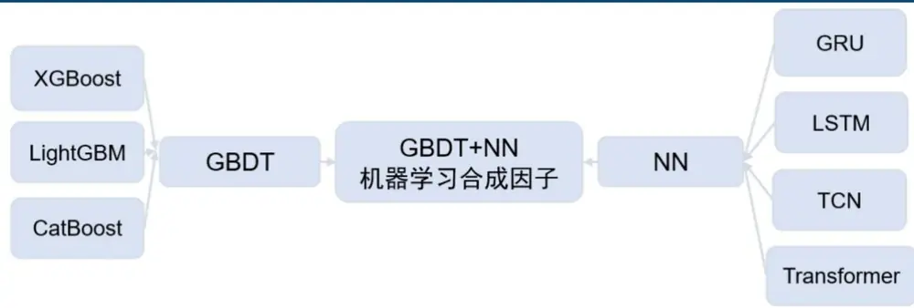
来源：国金证券研究所

然而，GBDT 与 NN 内部的各类模型彼此相似度较高，合成后表现较差的个体会拉低整体效果。为此，我们以表现突出的 LightGBM 与 GRU 为代表，进行更精细的调优。同时，由于基于简单因子的 LightGBM 合成因子相较 GRU 端到端因子在表现上差距明显，直接融合难以保证增益，我们转而将 GRU 的 hidden state 连同其他弱因子一并输入 LightGBM 进行集成，从而在 GRU 的基础上实现稳健且持续的提升。

模型的基础架构与输入数据如下方图表所示：

图表2：机器学习选股基准模型框架
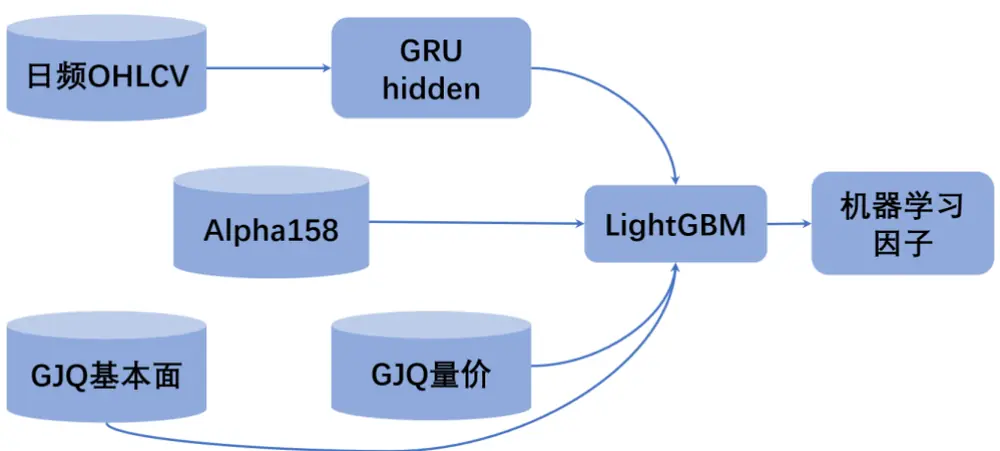
来源：国金证券研究所

在因子集成模块的模型选择上，除 LightGBM 外，线性回归或其他 GBDT 类模型同样可行。由于 GRU 隐藏层已提供了较强的特征表征能力，不同模型集成的效果差异相对有限。基于实践经验，LightGBM 兼具非线性建模优势和训练效率：一方面能够有效捕捉特征间的复杂交互关系，另一方面在训练速度和稳定性方面表现优异，因此最终被选用作为我们的基准模型。

图表3：机器学习选股模型数据集介绍

| 数据集 | 描述 | 子类别 | 举例 | 因子解释 | 因子数 |
| --- | --- | --- | --- | --- | --- |
| 日频 OHLCV |  |  | 高开低收、VWAP和成交量共6个原始日线量价数据 |  | 6 |
| Alpha158 | 微软的机器学 习量化投资框 | ROC | Ref($close, %d)/$close | 变化率：过去d天的价格变动量除以最新收盘价，以 消除单位。 |  |
|  | 架 Qlib 中利用 | MA | Mean($close, %d)/$close | 简单移动平均：过去d天的简单移动平均值除以最新 收盘价。 |  |
|  | 股票的高开低 收等量价数据 |  |  | 过去d 天线性回归的残差，用于衡量过去d天的趋 |  |
|  | 计算并标准化 所得 | RESI | Resi($close, %d)/$close | 势线性程度。 |  |
|  |  | … | … BP_Tangible_LR | … 市净率（剔除无形资产）倒数 |  |
| GJQuant |  | 价值 | EP_Deducted_TTM |  | 市盈率（扣除非经常性损益）TTM倒数 |
|  |  | 质量 |  | … Asset_Chg1Y | 总资产同比变化 过去五年毛利率的标准差/均值 |
|  |  |  | … Capex2Sales | GrossMargin_CV_5Y … Capex 除以 Sales |  |
|  |  | 国金因子库人 工构建的含基 | 成长 | NetIncome_Chg1Y … EPS_FTTM_Chg1M | 净利润同比增速 … 未来12个月一致预期EPS过去1个月变化率 |
|  |  | 本面因子在内 分析师 的 116 个风格 | … | Rating_Chg1M | 过去180个交易日评级过去1个月变化率 … |
|  |  |  | 技术 | Employee_Num | 员工人数 … |
|  |  |  | … Price_Chg60D | 过去60个交易日收益率 |  |
|  |  | 动量 | Price_ChgMax20D | 过去20个交易日最大收益率 | 10 |
|  |  |  | … IV_CAPM | … CAPM 模型残差波动率 |  |

来源：Qlib，Wind，国金证券研究所

基础的训练设置如下：

2005 年至 2015 年的数据作为训练集，2016 年与 2017 年的数据作为验证集，2018 年之后的数据作为测试集。三个数据集之间会保留预测时间的间隙，以确保标签与特征之间也没有未来信息泄露。所有模型均使用全 A 范围的数据进行训练。

对于 GRU 模型，每条训练数据，过去 180 日的 OHLCV 数据作为特征，未来 10 日的收盘价收益率作为标签。对于特征，我们对于每一条样本单独做归一化操作；对于标签，我们做截面百分比 rank 操作。对于 LightGBM 模型，特征无需做归一化操作。

考虑到机器学习模型会受到随机种子的影响，我们对模型进行 3 次训练，取 3 次结果的等权合成作为最终的因子。后续因子检验的回测均为 2018 年 1 月 1 日开始，2015 年 8月1日结束，10 分组，每 10 日换仓，不做特别说明的情况下股票域为全 A。

由于因子和 LightGBM 模型基本固定，我们暂时不讨论最终因子的效果，后续的工作聚焦在 GRU 模型的替换和改进上，观察相较时序预测模型是否有表现上的提升。

## 二、基于 TimeMixer 的机器学习选股模型改进

## 2.1 TimeMixer 模型介绍

TimeMixer 是 2024 年计算机顶会 ICLR 上的一篇论文，目前引用量接近 400。作者观察到同一序列在不同采样尺度上呈现不同模式：细粒度捕捉微观波动（季节项），粗粒度刻画宏观趋势。为此提出“多尺度混合”框架，把原始序列通过平均下采样得到 M+1 个尺度，再并行处理。

后续的处理分成两大模块：

1. Past-Decomposable-Mixing (PDM)

– 先把每一尺度的序列分解为 Seasonal 与 Trend 两条分量；

– 对 Seasonal 分量做 Bottom-Up 混合（细→粗），对 Trend 分量做 Top-Down 混合（粗→细）；

2. Future-Multipredictor-Mixing (FMM)

– 每个尺度单独用一层线性映射直接预测未来 F 步；

– 把 M+1 个尺度的预测结果按元素相加作为最终输出，实现“多预测器集成”。

图表4：TimeMixer 模型结构
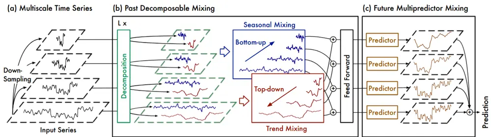
来源：TimeMixer: Decomposable Multiscale Mixing for Time Series Forecasting，国金证券研究所

与传统的 GRU 模型相比，TimeMixer 具有两大显著优势：首先，其摒弃了循环神经网络结构，采用并行化计算方式实现所有时间步的一次性运算，从而在性能优良的 GPU 设备上展现出更高的计算效率；其次，该模型通过显式地构建多尺度特征以及季节-趋势分解机制，能够从不同于 GRU 的视角捕捉时序数据的特征信息。

TimeMixer 模型在许多时序预测任务上取得了 SOTA（State-Of-The-Art）的表现，我们将该模型应用于 A 股股票收益率预测任务，并与传统的 GRU 模型进行系统性对比，以评估其在金融时序数据上的预测能力。

图表5：TimeMixer与 GRU模型因子统计数据

|  | IC 均值 | 风险调整 的IC | t统计量 | 多头年化 超额收益 Sharpe 比 率 | 多头 率 | 多头信息多头超额 |  | 多空年化 多空波动 率 |  | 多空 Sharpe 比 率 | 多空最大 回撤 |
| --- | --- | --- | --- | --- | --- | --- | --- | --- | --- | --- | --- |
|  |  |  |  |  |  |  |  | 比率最大回撤 | 收益率 |  |  |
| GRU | 11.75% | 1.34 | 18.15 | 22.15% | 1.20 | 3.54 | 6.68% | 76.35% | 0.13 | 5.72 | 11.06% |
| TimeMixer | 9.62% | 1.06 | 14.32 | 16.46% | 0.91 | 2.47 | 4.56% | 57.87% | 0.14 | 4.27 | 10.64% |

来源：Wind，国金证券研究所

图表6：TimeMixer 与 GRU模型因子多空净值
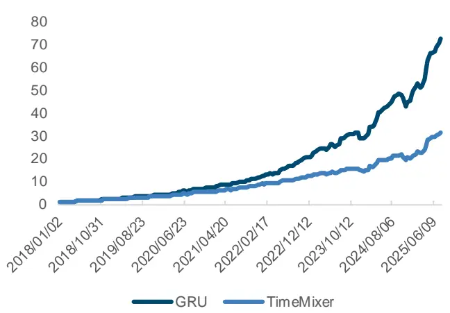
来源：Wind，国金证券研究所

图表7:TimeMixer与 GRU模型因子分组超额收益率
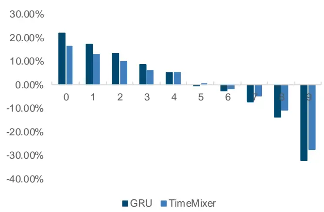
来源：Wind，国金证券研究所

实验结果表明，TimeMixer 模型生成的因子在风险控制方面展现出一定优势，其最大回撤表现优于 GRU 模型。然而，在收益相关指标上，TimeMixer 的表现整体落后于 GRU 模型。值得注意的是，两个模型因子的相关性达到 77.2%，表明它们捕捉的市场信号存在较高重叠，信息增量相对有限。

进一步分析发现，TimeMixer 仅采用 MLP 编码器架构却能取得尚可的收益表现，这可能归功于其独特的数据预处理方式——多尺度特征混合与季节/趋势分解（Season/TrendDecomposition）。基于这一发现，我们计划将这两种数据处理方法整合到 GRU 模型框架中，以验证其是否能带来性能提升。

## 2.2 季节/趋势分解的GRU 模型

在时序数据输入 GRU 模型之前，我们分别将其进行多次下采样（多尺度特征）与季节/趋势分解。具体流程如下图所示。

图表8：多尺度 GRU（MGRU）模型结构
图表9：季节/趋势分解GRU（TSGRU）模型结构
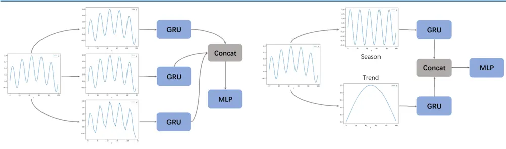
来源：国金证券研究所
来源：国金证券研究所

多尺度 GRU 与季节/趋势分解 GRU 模型训练后得到的效果与原始 GRU 对比如下。

图表10：MGRU 和 TSGRU 模型统计数据

|  | 风险调整 IC 均值 |  |  | 多头年化 t统计量 超额收益 Sharpe 比 | 多头 率 | 多头信息 多头超额 | 比率 最大回撤 | 多空年化 多空波动 收益率 | 率 | 多空 Sharpe 比 率 | 多空最大 回撤 |
| --- | --- | --- | --- | --- | --- | --- | --- | --- | --- | --- | --- |
|  |  | 的IC | 率 |  |  |  |  |  |  |  |  |
| GRU | 11.75% | 1.34 | 18.15 | 22.15% | 1.20 | 3.54 | 6.68% | 76.35% | 0.13 | 5.72 | 11.06% |
| TSGRU | 11.96% | 1.31 | 17.70 | 21.69% | 1.19 | 3.40 | 6.51% | 77.95% | 0.13 | 5.97 | 13.67% |
| MGRU | 11.70% | 1.26 | 17.10 | 19.40% | 1.12 | 3.00 | 8.87% | 73.24% | 0.14 | 5.27 | 15.54% |

来源：Wind，国金证券研究所

图表11：MGRU 和 TSGRU 模型多空净值
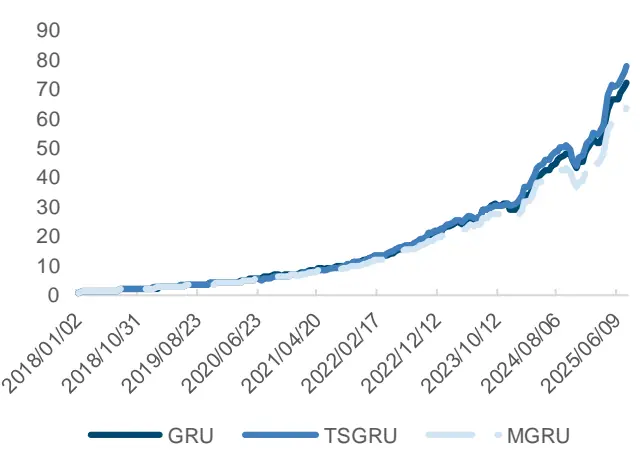
来源：Wind，国金证券研究所

图表12：MGRU 和 TSGRU 模型分组超额收益
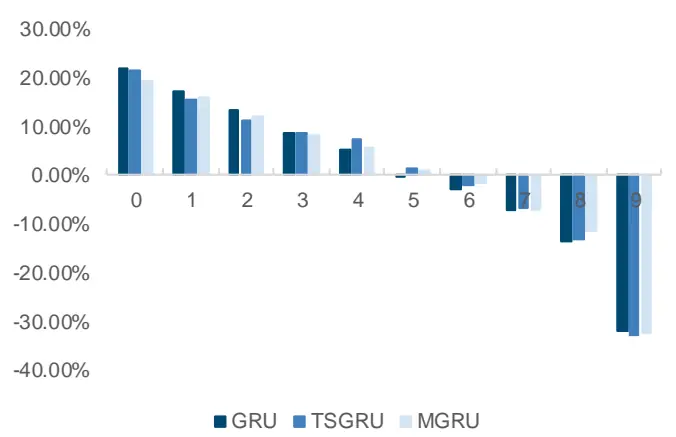
来源：Wind，国金证券研究所

通过对比实验可以得出以下结论：首先，多尺度采样方法在 GRU 模型上的应用效果不佳，各项评价指标均较基础 GRU 模型出现不同程度的下滑。相比之下，虽然季节/趋势分解的TSGRU 模型未能显著超越原始模型，但在 IC 均值、多头组合超额收益的最大回撤以及多空年化收益率等关键指标上均实现了小幅提升。值得注意的是，TSGRU 因子与原始 GRU 因子的截面相关性为 84.4%，这一结果表明 TSGRU 在保持原有模型主要特征的同时，确实引入了额外的有效信息。

## 2.3 多模型集成效果

我们将 GRU 和 TSGRU 因子等权合成，观察 TSGRU 是否确实带来了信息上的增量。

图表13：GRU 与 TSGRU 合成统计数据

|  | IC 均值 | 风险调整 的IC | t统计量 | 多头年化 超额收益 Sharpe 比 率 | 多头 率 | 多头信息 多头超额 比率 | 最大回撤 | 多空年化 多空波动 收益率 | 率 | 多空 Sharpe 比 率 | 多空最大 回撤 |
| --- | --- | --- | --- | --- | --- | --- | --- | --- | --- | --- | --- |
| GRU | 11.75% | 1.34 | 18.15 | 22.15% | 1.20 | 3.54 | 6.68% | 76.35% | 0.13 | 5.72 | 11.06% |
| TSGRU | 11.96% | 1.31 | 17.70 | 21.69% | 1.19 | 3.40 | 6.51% | 77.95% | 0.13 | 5.97 | 13.67% |
| 合成 | 12.25% | 1.35 | 18.32 | 22.68% | 1.23 | 3.64 | 6.98% | 81.05% | 0.13 | 6.18 | 11.19% |

来源：Wind，国金证券研究所

图表14：GRU 与 TSGRU 合成多空净值
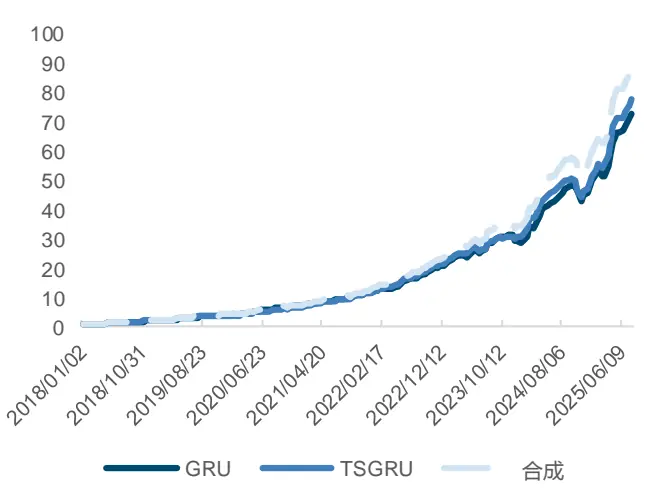
来源：Wind，国金证券研究所

图表15：GRU 与 TSGRU 合成分组超额收益
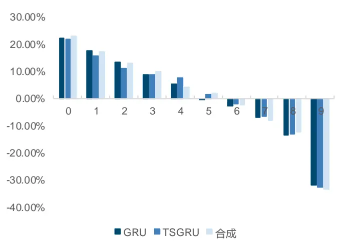
来源：Wind，国金证券研究所

可以看到，合成后因子各方面表现均有明显提升，尤其是多空年化收益率，从 76.35%提升到 81.05%，10 日 IC 均值也有明显的提升。最后我们将 GRU、TSGRU 一共 64 维隐向量与

Alpha158、GJQuant 中的 117 个因子一起进行 LightGBM 合成，得到基于 TimeMixer 改进的机器学习选股模型。

图表16：基于TimeMixer改进的机器学习模型统计数据

|  | IC 均值 | 风险调整 的IC | t统计量 | 多头年化 超额收益 Sharpe 比 率 | 多头 率 | 多头信息 多头超额 | 比率 最大回撤 | 多空年化 多空波动 收益率 | 率 | 多空 Sharpe 比 率 | 多空最大 回撤 |
| --- | --- | --- | --- | --- | --- | --- | --- | --- | --- | --- | --- |
| GRU | 11.75% | 1.34 | 18.15 | 22.15% | 1.20 | 3.54 | 6.68% | 76.35% | 0.13 | 5.72 | 11.06% |
| 合成 | 12.86% | 1.35 | 18.24 | 24.93% | 1.29 | 3.74 | 6.01% | 88.41% | 0.13 | 6.59 | 10.82% |

来源：Wind，国金证券研究所

图表17：基于 TimeMixer 改进的机器学习模型多空净值
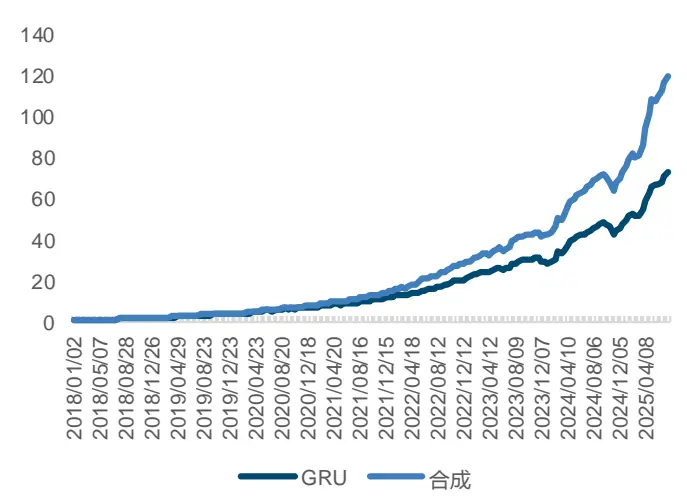
来源：Wind，国金证券研究所

图表18：基于TimeMixer改进的机器学习模型分组超额收益
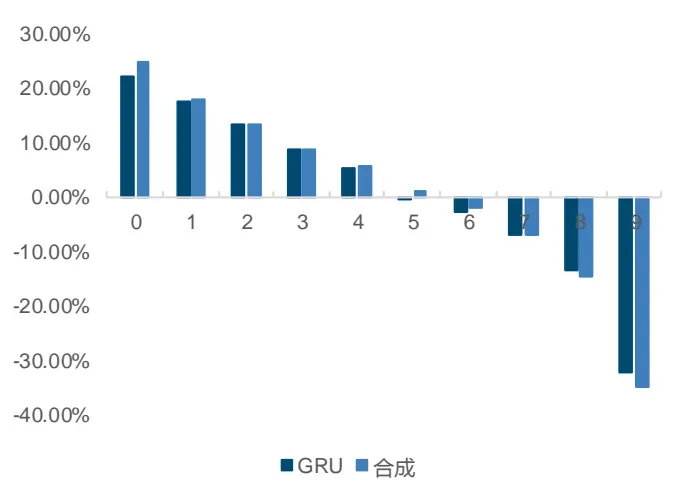
来源：Wind，国金证券研究所

可以看到，相较于基础 GRU 模型，经过 TimeMixer 思想改进的机器学习选股模型有着明显的进步。

## 2.4 宽基指数增强策略效果

接下来我们利用该因子构建宽基指数增强策略，观察其实际使用的效果。在构建策略时，我们考虑 10 日调仓，以沪深 300、中证 500、中证 1000 指数作为基准，控制个股权重偏移 1%以内，跟踪误差 5%以内，成分股权重不少于 80%，手续费率假设为双边千三，回测时间段为 2018 年 1 月 1 日至 2025年 8月 1日。策略表现如下：

图表19：宽基指数增强策略效果

|  | 沪深 300 增强 | 沪深 300 | 中证 500 增强 | 中证 500 | 中证 1000 增强 | 中证 1000 |
| --- | --- | --- | --- | --- | --- | --- |
| 年化收益率 | 10.72% | -0.11% | 11.11% | -0.25% | 17.33% | -0.80% |
| 年化波动率 | 17.68% | 19.21% | 20.23% | 21.84% | 22.90% | 24.45% |
| Sharpe 比率 | 0.61 | -0.01 | 0.55 | -0.01 | 0.76 | -0.03 |
| 最大回撤率 | 25.44% | 45.60% | 29.65% | 41.81% | 32.73% | 46.71% |
| 年化超额收益率 | 10.55% |  | 11.09% |  | 17.94% |  |
| 跟踪误差 | 5.07% |  | 5.17% |  | 5.81% |  |
| 信息比率 | 2.08 |  | 2.15 |  | 3.09 |  |
| 超额最大回撤率 | 7.01% |  | 8.19% |  | 8.25% |  |
| 10日双边换手率 | 41.73% |  | 42.95% |  | 43.19% |  |

来源：Wind，国金证券研究所

图表20：沪深300指数增强策略净值
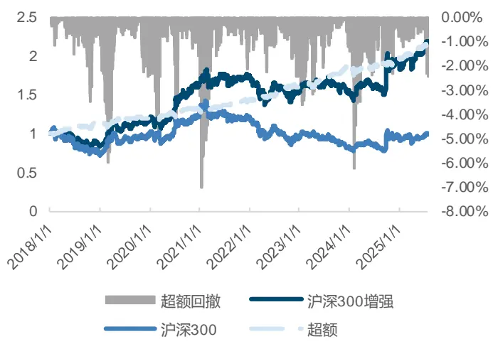
来源：Wind，国金证券研究所

图表21：沪深300指数增强策略分年度收益率
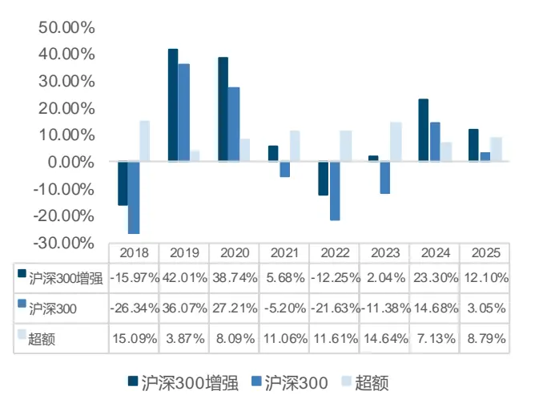
来源：Wind，国金证券研究所

图表22：中证500指数增强策略净值
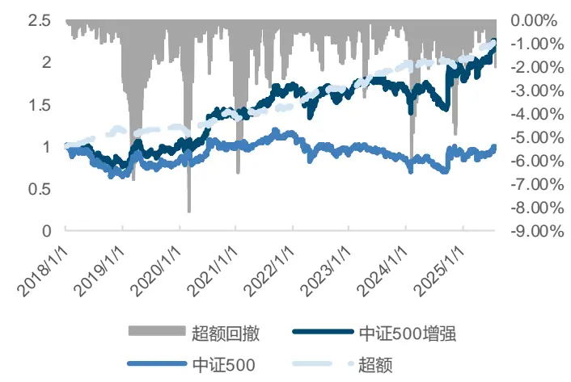
来源：Wind，国金证券研究所

图表23：中证500指数增强策略分年度收益率
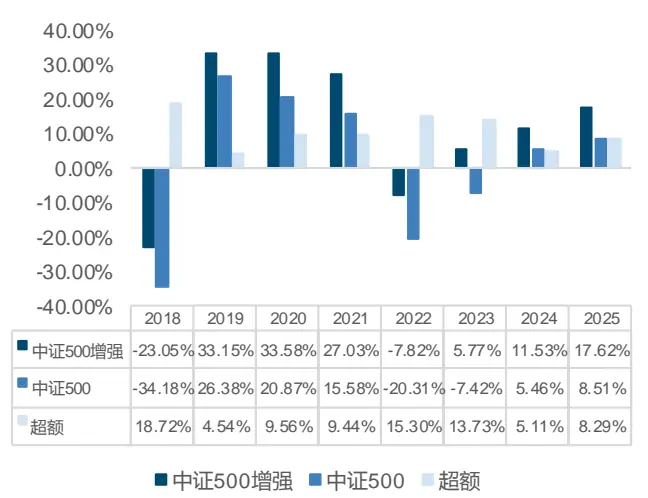
来源：Wind，国金证券研究所

图表24：中证1000指数增强策略净值
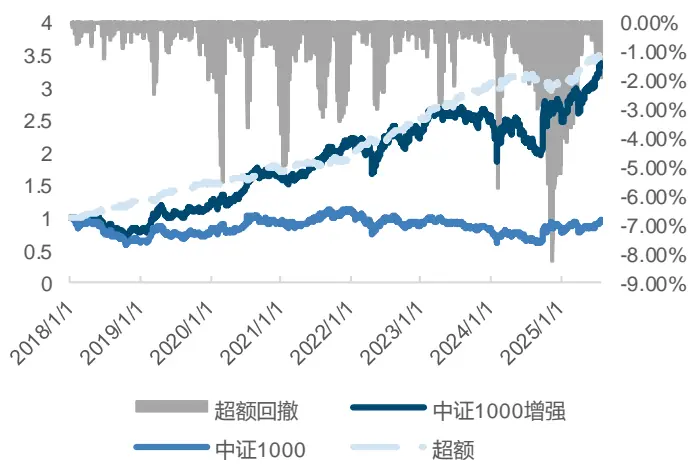
来源：Wind，国金证券研究所

图表25：中证1000指数增强策略分年度收益率
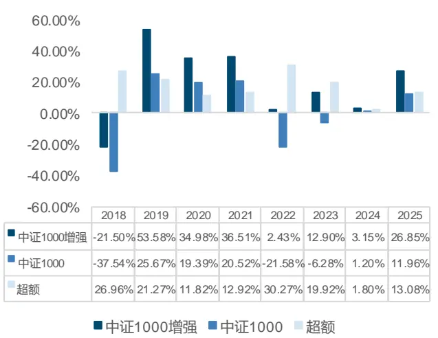
来源：Wind，国金证券研究所

从实际表现来看，TimeMixer 改进的机器学习指数增强策略表现优秀。三大主流宽基指数中，中证 1000 增强策略表现最为突出，年化超额收益达到 17.94%，沪深 300 和中证 500策略也分别实现了 10.55%和 11.09%的超额收益。更难得的是，这些策略在创造超额的同时，将跟踪误差稳稳地控制在 5%-6%的合理区间，展现出攻守兼备的特性。从时间维度来看，各策略每年都能稳定贡献正超额，今年以来沪深 300、中证 500 和中证 1000 策略的超额收益分别为 8.79%、8.29%和 13.08%，延续了稳健的表现。整体而言，基于 TimeMixer改进的机器学习因子在实盘中的优异表现，充分验证了其在量化投资领域的实用价值。

## 三、ETF 指数投资现状

相比于直接投资个股，投资 ETF 具有以下三条主要优势：

分散风险：ETF 通常跟踪某一指数或行业，包含多只股票，能有效分散单一股票波动带来的风险，降低投资组合的非系统性风险。

成本更低：ETF 的管理费用通常低于主动管理型基金，且无需频繁交易，交易佣金和税费相对较低，长期持有成本优势明显。

透明度高：ETF 每日披露持仓，投资者能清晰了解其投资组合构成，避免个股信息不对称问题，便于做出理性决策。

我国 ETF 产品种类不断丰富，涵盖了股票型、跨境、商品型和债券型四大类。截至 2025年 6 月 30 日，国内非货币类 ETF 数量已达到 1025 只，总规模为 35861.75 亿元，非货币ETF 数量近年增长迅速，过去四年间（2020 末至 2024 末），非货币 ETF 数量年复合增速高达 33.80%。

股票型 ETF 包括了大量行业主题、宽基、SmartBeta 和增强策略等产品，为投资者提供了多元的投资选择。截至 2025 年 7 月 18 日，股票型 ETF 共有 975 只，规模合计超 3 万亿元，其中宽基 ETF 规模为 22191.17 亿元，数量为 284 只；主题行业 ETF 规模为 6956.95亿元，数量为 547 只。

图表26：非货币ETF总规模和数量显著增加
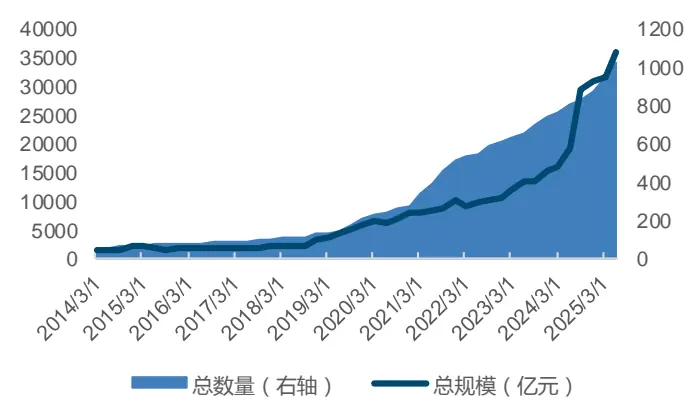
来源：Wind，国金证券研究所

图表27：ETF种类丰富，满足配置需求
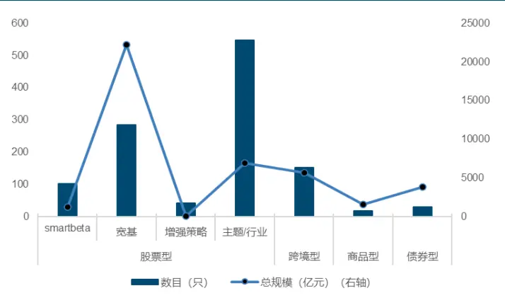
来源：Wind，国金证券研究所

2010 年到 2025 年，ETF 总规模整体保持稳步增长，尤其自 2022 年以来增速显著。相比之下，主动权益基金自 2022 年起规模持续下滑，走势与 ETF 形成鲜明对比。截至 2025 年6月 30 日，ETF 总规模已达约 4.7 万亿元，超越主动权益基金的约 3.4 万亿元。

图表28：ETF总规模已超过主动权益基金
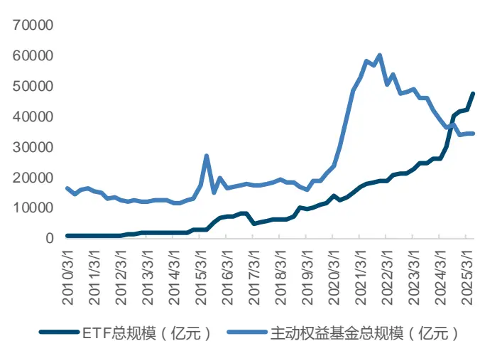
来源：Wind，国金证券研究所

图表29：ETF和主动权益基金数量变化
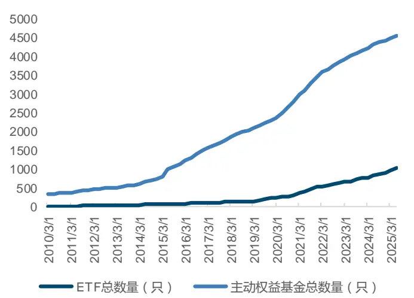
来源：Wind，国金证券研究所

## 四、选股因子合成的ETF 轮动策略

参考我们之前的 ETF 轮动报告《智能化选基系列之七：基于 AI 预测中的个股 Beta 信息构建 ETF 轮动策略》，构建 ETF 轮动策略时，我们采用“两步映射”思路：

1. 先用成分股权重把个股 Alpha 因子加权合成为指数级因子；

2. 再从跟踪该指数的 ETF 池中挑出最契合的一只作为最终持仓。

图表30：利用选股因子合成ETF轮动策略框架
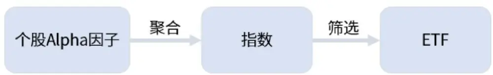
来源：国金证券研究所

在当前 A 股市场风格快速轮动的背景下，叠加 ETF 交易的低换手成本优势，我们可采用周度调仓策略以更灵活地适应市场变化。原 10 日收益机器学习因子可直接压缩为 5 日窗口使用，回测结果如下（仅调仓频率调整，其余设定不变）：

来源：Wind，国金证券研究所

图表31：基于TimeMixer改进的机器学习模型周度调仓统计数据

|  | 风险调整 |  |  | 多头年化 | 多头 率 |  | 多头信息多头超额 比率最大回撤 | 多空年化多空波动 收益率 | 率 | 多空 Sharpe 比 率 | 多空最大 回撤 |
| --- | --- | --- | --- | --- | --- | --- | --- | --- | --- | --- | --- |
|  | IC 均值 | t统计量 的IC | 超额收益 Sharpe 比 率 |  |  |  |  |  |  |  |  |
| ML 因子 | 11.44% | 1.15 | 21.98 | 32.80% | 1.63 | 4.57 | 6.54% | 123.97% | 0.14 | 8.64 | 9.42% |

图表32：基于TimeMixer 改进的机器学习模型周度调仓多空凈值
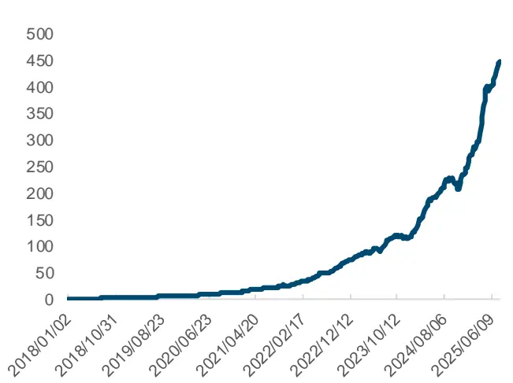
来源：Wind，国金证券研究所

图表33：基于TimeMixer改进的机器学习模型周度调仓分组超额收益
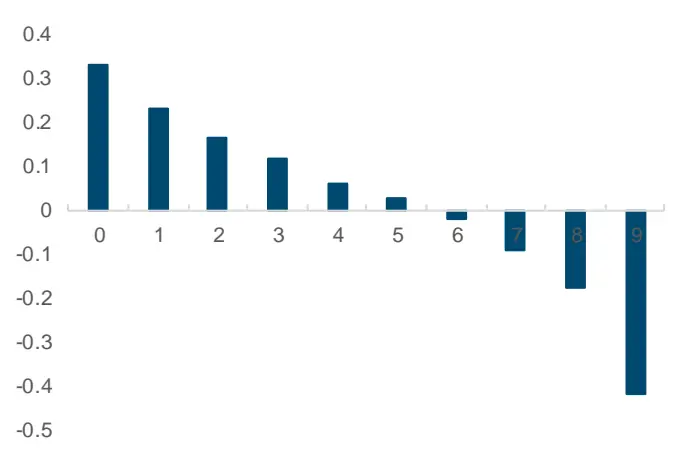
来源：Wind，国金证券研究所

## 4.1 选股因子聚合到指数

在聚合和因子测试过程中,我们仅筛选有 ETF 基金跟踪的指数,排除掉部分 MSCI、恒生指数等,仅考虑 A 股占绝大多数成分股权重的指数。截止 2025 年 8 月 1日，一共有 332个指数符合条件，2018 年初仅有 196 个指数。

图表34：筛选有效指数数量变化趋势（单位：个）
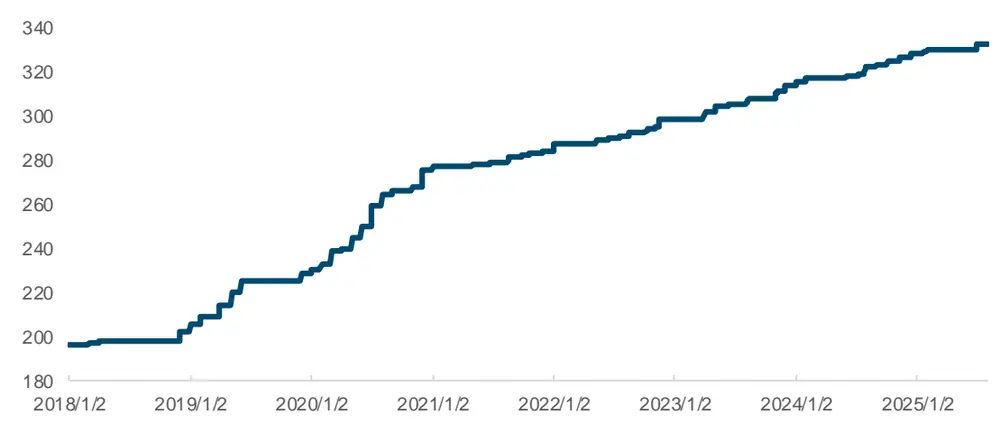
来源：Wind，国金证券研究所

根据之前的结论，我们使用未经行业市值中性化的因子按照指数成分股权重加权合成。得到的机器学习聚合指数因子表现如下：

图表35：机器学习聚合指数因子统计数据

|  | 风险调整 |  |  | 多头年化 超额收益 Sharpe 比 率 | 多头 | 多头信息多头超额 |  | 多空年化多空波动 |  | 多空 Sharpe 比 率 | 多空最大 回撤 |
| --- | --- | --- | --- | --- | --- | --- | --- | --- | --- | --- | --- |
|  | IC 均值 | t统计量 的IC | 率 |  |  |  |  | 比率最大回撤 | 收益率 |  |  |
| 指数因子 | 7.69% | 0.23 | 4.47 | 16.61% | 1.06 | 1.38 | 20.40% | 27.04% | 0.19 | 1.42 | 30.42% |

来源：Wind，国金证券研究所

因子聚合至指数后，相比选股效果有所下降，不过依然有不错的多头表现，多头超额收益率达 16.61%。

图表36：机器学习聚合指数因子多头超额净值
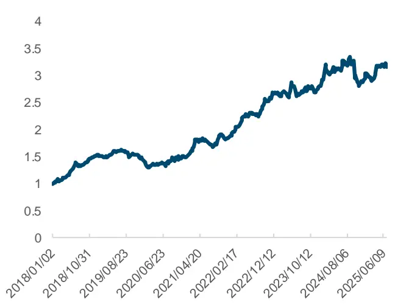
来源：Wind，国金证券研究所

图表37：机器学习聚合指数因子分组年化超额收益
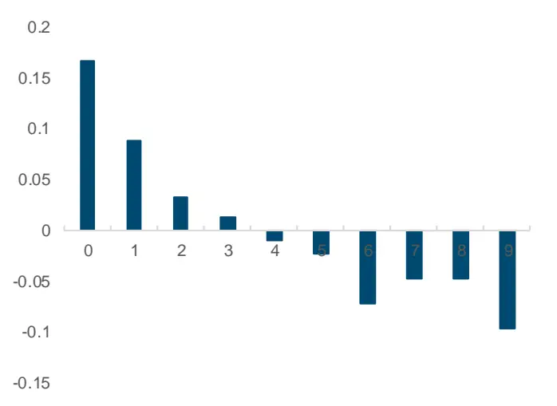
来源：Wind，国金证券研究所

多头超额净值走势比较平稳，分组效果良好。为了进一步贴合交易实际，我们构建了指数轮动策略，采用十分组第一组等权作为持仓，假定手续费率单边万分之三。回测区间为2018 年 1 月 1 日至 2015 年 7 月 1 日。

图表38：机器学习聚合指数轮动策略效果

|  | 指数轮动 | 沪深300 |
| --- | --- | --- |
| 年化收益率 | 20.42% | -0.48% |
| 年化波动率 | 17.94% | 19.29% |
| Sharpe 比率 | 1.14 | -0.02 |
| 最大回撤率 | 19.88% | 45.60% |
| 年化超额收益率 | 19.65% |  |
| 跟踪误差 | 9.93% |  |
| 信息比率 | 1.98 |  |
| 超额最大回撤率 | 14.99% |  |
| 周度双边换手率 | 41.17% |  |

来源：Wind，国金证券研究所

图表39：机器学习聚合指数轮动策略净值
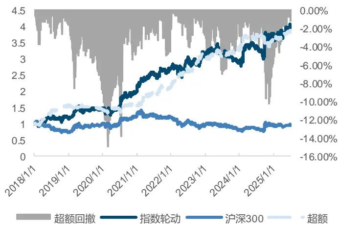
来源：Wind，国金证券研究所

图表40：机器学习聚合指数轮动策略分年度收益率
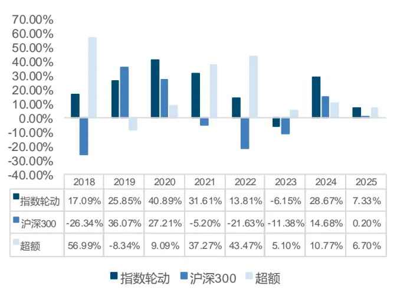
来源：Wind，国金证券研究所

该轮动策略整体表现优异，年化超额收益达 19.65%，信息比率为 1.98，展现出较强的稳定性和风险调整后收益能力。从历史表现来看，除 2019 年跑输基准外，其余年度均实现稳定的正向超额收益。今年以来（截至上半年），策略已累计创造 6.70%的超额收益，持续彰显其有效性。

## 4.2 筛选跟踪指数的 ETF

指数轮动回测结果基于所有指数在测试区间内均可投资的假设。为增强策略的实操性，我们采用以下优化措施：首先，针对同一指数对应多只 ETF 的情况，基于流动性和容量考量，选取滚动 20 日规模最大的 ETF 作为投资标的；其次，对于部分后期才有对应 ETF 的指数，我们仅在相关 ETF 上市后才将其纳入投资范围。这些调整旨在更真实地模拟实际交易环境，同时确保轮动策略收益的可实现性。

图表41：机器学习ETF轮动策略效果

|  | ETF 轮动 | 沪深300 |
| --- | --- | --- |
| 年化收益率 | 19.30% | -0.48% |
| 年化波动率 | 18.61% | 19.29% |
| Sharpe 比率 | 1.04 | -0.02 |
| 最大回撤率 | 21.05% | 45.60% |
| 年化超额收益率 | 18.98% |  |
| 跟踪误差 | 10.10% |  |
| 信息比率 | 1.88 |  |
| 超额最大回撤率 | 11.84% |  |
| 周度双边换手率 | 46.00% |  |

来源：Wind，国金证券研究所

图表42：机器学习ETF轮动策略净值
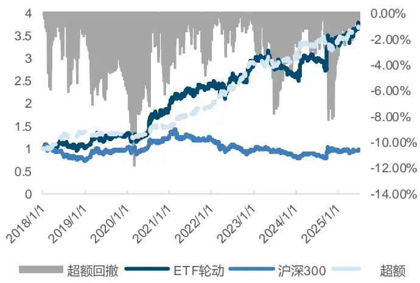
来源：Wind，国金证券研究所

图表43：机器学习ETF轮动策略分年度收益率
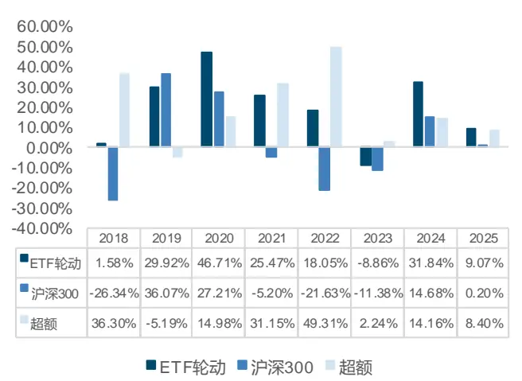
来源：Wind，国金证券研究所

ETF 轮动的收益特征与指数轮动基本一致，年化超额收益率可以达到 18.98%。近两年的超额收益尚可，2024 年超额收益 14.16%，今年上半年超额收益 8.40%。

## 总结

本研究创新性地将 TimeMixer 框架的多尺度混合与季节/趋势分解机制融入 GRU 模型，构建了改进的机器学习选股模型。实验表明，通过 LightGBM 集成 TSGRU 隐向量与传统量化因子，最终复合因子实现了 12.86%的 10 日 IC 均值和 88.41%的多空年化收益率。在宽基指数增强应用中，该策略展现出卓越表现，中证 1000 增强组合年化超额达 17.94%（信息比率 3.09）。同时，基于"两步映射"方法构建的 ETF 轮动策略也取得优异成果，指数轮动和 ETF 轮动策略年化超额收益分别达 19.65%和 18.98%。这些创新方法不仅验证了多尺度时序建模在量化投资中的价值，也展现了机器学习模型在 ETF 轮动策略中的强大应用潜力。

## 风险提示

1、以上结果通过历史数据统计、建模和测算完成，在政策、市场环境发生变化时模型存在时效的风险。

2、策略通过一定的假设通过历史数据回测得到，当交易成本提高或其他条件改变时，可能导致策略收益下降甚至出现亏损。

## 特别声明：

国金证券股份有限公司经中国证券监督管理委员会批准，已具备证券投资咨询业务资格。

形式的复制、转发、转载、引用、修改、仿制、刊发，或以任何侵犯本公司版权的其他方式使用。经过书面授权的引用、刊发，需注明出处为“国金证券股份有限公司”，且不得对本报告进行任何有悖原意的删节和修改。

本报告的产生基于国金证券及其研究人员认为可信的公开资料或实地调研资料，但国金证券及其研究人员对这些信息的准确性和完整性不作任何保证。本报告反映撰写研究人员的不同设想、见解及分析方法，故本报告所载观点可能与其他类似研究报告的观点及市场实际情况不一致，国金证券不对使用本报告所包含的材料产生的任何直接或间接损失或与此有关的其他任何损失承担任何责任。且本报告中的资料、意见、预测均反映报告初次公开发布时的判断，在不作事先通知的情况下，可能会随时调整，亦可因使用不同假设和标准、采用不同观点和分析方法而与国金证券其它业务部门、单位或附属机构在制作类似的其他材料时所给出的意见不同或者相反。

本报告仅为参考之用，在任何地区均不应被视为买卖任何证券、金融工具的要约或要约邀请。本报告提及的任何证券或金融工具均可能含有重大的风险，可能不易变卖以及不适合所有投资者。本报告所提及的证券或金融工具的价格、价值及收益可能会受汇率影响而波动。过往的业绩并不能代表未来的表现。

客户应当考虑到国金证券存在可能影响本报告客观性的利益冲突，而不应视本报告为作出投资决策的唯一因素。证券研究报告是用于服务具备专业知识的投资者和投资顾问的专业产品，使用时必须经专业人士进行解读。国金证券建议获取报告人员应考虑本报告的任何意见或建议是否符合其特定状况，以及（若有必要）咨询独立投资顾问。报告本身、报告中的信息或所表达意见也不构成投资、法律、会计或税务的最终操作建议，国金证券不就报告中的内容对最终操作建议做出任何担保，在任何时候均不构成对任何人的个人推荐。

在法律允许的情况下，国金证券的关联机构可能会持有报告中涉及的公司所发行的证券并进行交易，并可能为这些公司正在提供或争取提供多种金融服务。

本报告并非意图发送、发布给在当地法律或监管规则下不允许向其发送、发布该研究报告的人员。国金证券并不因收件人收到本报告而视其为国金证券的客户。本报告对于收件人而言属高度机密，只有符合条件的收件人才能使用。根据《证券期货投资者适当性管理办法》，本报告仅供国金证券股份有限公司客户中风险评级高于 C3 级(含 C3 级）的投资者使用；本报告所包含的观点及建议并未考虑个别客户的特殊状况、目标或需要，不应被视为对特定客户关于特定证券或金融工具的建议或策略。对于本报告中提及的任何证券或金融工具，本报告的收件人须保持自身的独立判断。使用国金证券研究报告进行投资，遭受任何损失，国金证券不承担相关法律责任。

若国金证券以外的任何机构或个人发送本报告，则由该机构或个人为此发送行为承担全部责任。本报告不构成国金证券向发送本报告机构或个人的收件人提供投资建议，国金证券不为此承担任何责任。

此报告仅限于中国境内使用。国金证券版权所有，保留一切权利。

上海

电话：021-80234211

北京

电话：010-85950438

深圳

电话：0755-86695353

邮箱：researchsh@gjzq.com.cn

邮箱：researchbj@gjzq.com.cn

邮箱：researchsz@gjzq.com.cn

邮编：201204

邮编：100005

邮编：518000

地址：上海浦东新区芳甸路 1088 号

地址：北京市东城区建内大街 26 号

地址：深圳市福田区金田路 2028 号皇岗商务中心

紫竹国际大厦 5 楼

新闻大厦 8 层南侧

18 楼 1806

【小程序】国金证券研究服务

【公众号】国金证券研究