金融工程组

分析师：高智威(执业 S1130522110003)

gaozhiw@gjzq.com.cn

## 基于 Mamba2 模型的端到端选股框架

## 从 SSM, Mamba 到 Mamba2 模型

本文创新性地将 Mamba-2 模型加入整体模型架构，该模型通过 SSD 把 SSM 计算重写为矩阵乘+少量结构化算子，既继承 Mamba 的“选择性状态压缩”，又在系统层面获得与 GPU 硬件高度匹配的输入输出优势，形成“表达力-效率-可扩展性”的三重平衡。对需要超长上下文、吞吐敏感且部署成本受限的应用场景（语音/时间序列/金融高频等），Mamba-2 提供了优于纯注意力与传统 RNN/SSM 的解法与性价比。

## Mamba2 模型与 GRU选股效果比较

我们分别选取了 10 分钟、30 分钟、60 分钟、一日四种不同频率的基础量价数据，在相同数据与回测框架下，对比Mamba2 与经典 GRU 模型的选股效果。结果表明，Mamba2 模型只有在日频数据上整体表现明显优于 GRU 模型，60分钟频上与 GRU 模型不分伯仲，30 分钟频上能够带来沪深 300 的优化。但相关性测算显示 GRU 与 Mamba2 在不同频率的“截面信号”相关性约 70%–80%，这意味着二者并非冗余：通过模型-频率的合成（如日频+60 分/30 分、GRU+Mamba2）有望带来增量信息与风格分散。

## 模型合成与宽基指增策略

在构建模型前，我们构造了三类个股不变的市场信息（三大宽基指数点位、当前交易日的时间信息、基于 Barra 因子构建的市场风格指数）作为附加输入。结果显示：三大宽基指数信息的提升最为显著，IC、多头多空收益与回撤指标均明显改善；时间信息与 Barra 风格信息在 GRU 上并未带来稳定增益。

根据以上所有探讨，我们构建了“GRU（4 频）+Mamba2（3 频）+GJQuant 因子→LGBM”的二层合成架构，并在 GRU4 频输入基础上引入三大宽基指数点位信息。从合成结果看，加入 Mamba2 后 IC、多头超额等维度表现较之 GRU 基线提升明显，再叠加 LGBM 进一步提升；当三者联合并引入 GJQ 因子库后，各个维度表现进一步提升至最佳。更关键的是，多空年化收益率与夏普比率在合成后持续抬升，而多空波动率并未同步放大，说明合成带来了真实Alpha 增量而非来源于杠杆放大。

据此搭建的三大宽基的指数增强策略均取得显著超额，沪深 300、中证 500、中证 1000 指增策略的年化超额分别达到9.99%、12.20%和 20.65%，信息比率分别为 1.88、2.24 和 3.31；最大回撤方面，三者的主动层回撤均显著小于指数本身。总体来说，合成架构表现优异。

## 风险提示

1、以上结果通过历史数据统计、建模和测算完成，在政策、市场环境发生变化时模型存在时效的风险。

2、策略通过一定的假设通过历史数据回测得到，当交易成本提高或其他条件改变时，可能导致策略收益下降甚至出现亏损。

## 一、从 SSM, Mamba 到 Mamba2 模型

## 1.1 结构化状态空间模型（SSM）：从连续系统到可并行计算

状态空间模型最初源于控制理论，后被 Albert Gu 等人引入深度学习，于《EfficientlyModeling Long Sequences with Structured State Spaces》中系统化提出。其基本形式由“状态方程+观测方程”构成：

图表1：结构化状态空间模型（SSM）
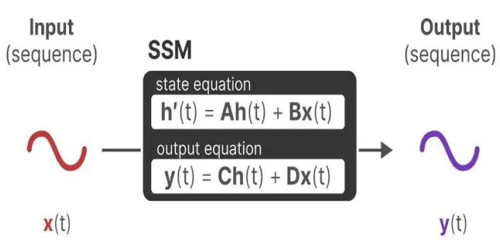
来源：A Visual Guide to Mamba and State Space Models，国金证券研究所

图表2：结构化状态空间模型图解
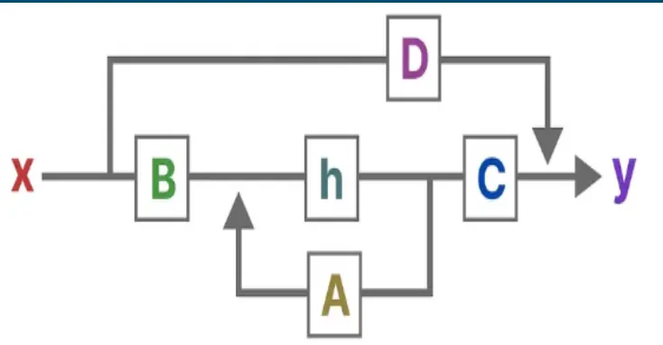
来源：A Visual Guide to Mamba and State Space Models，国金证券研究所

输入 x 与时间相关，h 是状态，y 为输出。直观含义是：输入 x 经由B 影响状态h 的微分，进而影响到 h；再由 C 将 h 映射到输出 y。因此，任一时刻的输出不仅受到当下输入的影响，也叠加了过往时刻输入经状态记忆后的累积效应。从序列建模角度看，SSM 把“到当前为止的历史信息”压缩在低维状态中，以连续时间的形式自然处理长依赖。

在实际计算中，我们使用零序保持(ZOH, zero-order hold）对连续系统离散化，之后才能落地到深度学习框架。离散化后的 SSM 既可以以“循环（recurrent）”方式顺序推理，也可转写成“卷积”形式以获得并行训练能力。循环形式虽更贴合序列的自然递归，但长序列训练往往存在并行性差导致的学习缓慢、梯度消失/爆炸难题；卷积形式则可并行训练、固定上下文窗口，因而在效率与稳定性上更具工程优势。

图表3：离散化的状态空间模型
图表4：卷积化的状态空间模型
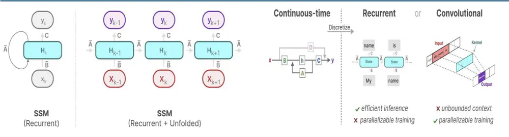
来源：A Visual Guide to Mamba and State Space Models，国金证券研究所
来源：A Visual Guide to Mamba and State Space Models，国金证券研究所

## 1.2 Mamba：选择性RNN/TransformerSSM 与 之间的效率-效果折衷

经典 SSM 存在“时不变（time-invariant）”限制：对同一层内的每个 token，矩阵 A/B/C共享，难以对输入做“选择性处理”。Mamba 在 S4/SSM 框架上引入“参数对输入的选择性依赖”，即“参数化 SSM 的输入”，让模型能够关注或忽略特定输入，兼顾效率与效果。

从“状态压缩”视角理解序列建模的权衡：高效模型往往拥有更小的状态（如 RNN/SSM），但表达力受限；表达力强的模型（如 Transformer）倾向于保留来自上下文的更大状态，但计算显存开销更高；Mamba 通过“选择性压缩”，在两端之间取得折衷。

这一定性判断与经验观察一致：RNN/S4 在极高效率下可能欠拟合长程依赖，Transformer

全局注意力强但成本陡增；Mamba 在长序列任务上通过可学习的选择机制提升信息保真度，同时维持较好的吞吐与显存占用。

图表5：Mamba 模型与 Transformer 和GRU 的区别
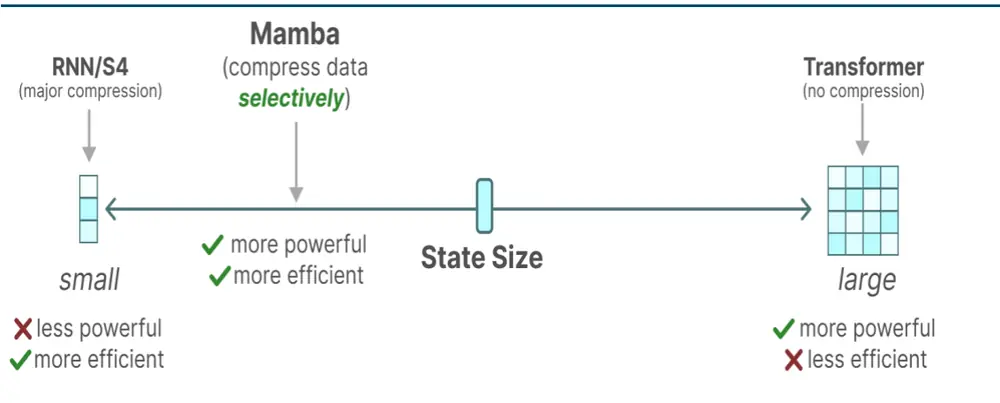
来源：A Visual Guide to Mamba and State Space Models，国金证券研究所

## 1.3 Mamba-2：以SSD（半可分离矩阵）实现张量并行友好的 SSM

Mamba-2 进一步把优化方向对准“并行与矩阵乘法友好”的实现路径。由于在 Mamba-1 里B、C 与输入相关，作者放弃单纯的“卷积化展开”，转而采用了并行扫描（parallel scan），Mamba-2 的主要目标之一就是利用 GPU 张量核心来加速 SSM，优化 SSM 矩阵计算的一个重要方法是进行半可分离矩阵（SSD, Semiseparable Matrix）的分解。核心做法是：

1）将大矩阵 M 切分为 T/Q×T/Q 的子网格，每个子矩阵大小为 Q×Q。

2）按对角块、低秩块（Input→State、State→State、State→Output）进行结构化分解：对角块可直接经 SSD 的二次形式高效计算；大量共享的低秩块可 batched matmul 并行；1-SS 矩阵部分可类比 SSM-scan 处理。

图表6：Mamba2 矩阵分解方法
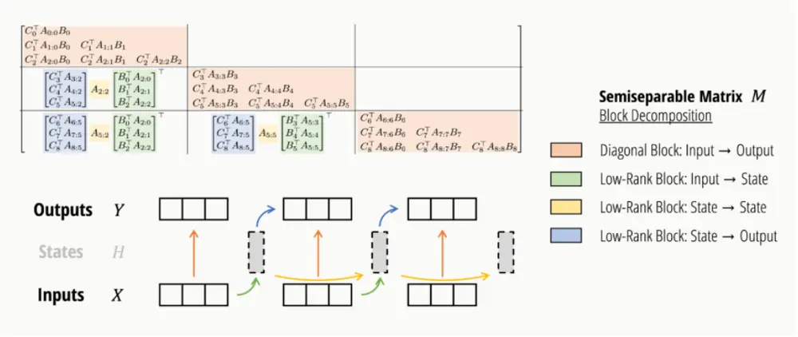
来源：State Space Duality (Mamba-2) Part I - The Model，国金证券研究所

这种结构天然支持标准矩阵乘法与GPU批量并行，因此在长序列上，Mamba-2在训练FLOPs、推理 FLOPs 与显存占用方面相较 Attention 与朴素 SSM 更有优势。

图表7：SSD 与 Attention 和 SSM 的比较

|  | Attention | SSM | SSD |
| --- | --- | --- | --- |
| State size | T | N | N |
| Training FLOPs | T2N | TN2 | TN² |
| Inference FLOPs | TN | N2 | N2 |
| (Naive) memory | T2 | TN2 | TN |
| Matrix multiplications? | V | X | V |

来源：State Space Duality (Mamba-2) Part I - The Model，国金证券研究所

在网络层面，Mamba-2 把并行“投影”从“以 SSM 为中心的 X•Y 映射（A/B/C 为附属参数）”改造为“从 A、X、B、C•Y 的并行生成”，可用单个投影并行产生 A、X、B、C，减少参数并提升张量并行的可实现性。工程上可配合 Megatron 的 sharding pattern 做张量级并行扩展；在块的最终输出投影前加入“额外归一化”，可以缓解大规模训练的不稳定。

图表8：Mamba2 相对 Mamba1 结构的改进
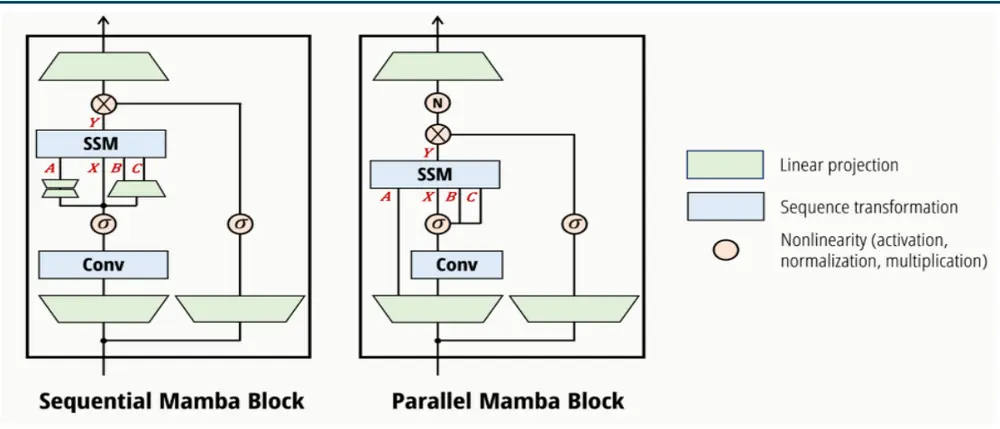
来源：State Space Duality (Mamba-2) Part I - The Model，国金证券研究所

总的来说，Mamba-2 通过 SSD 把 SSM 计算重写为矩阵乘+少量结构化算子，既继承 Mamba的“选择性状态压缩”，又在系统层面获得与 GPU 硬件高度匹配的输入输出优势，形成“表达力-效率-可扩展性”的三重平衡。对需要超长上下文、吞吐敏感且部署成本受限的应用场景（语音/时间序列/金融高频等），Mamba-2 提供了优于纯注意力与传统 RNN/SSM 的解法与性价比。

## 二、Mamba2 模型与GRU选股效果比较

在理论上论证 Mamba-2 的模型优势后，我们分别选取了 10 分钟、30 分钟、60分钟、一日四种不同频率的基础量价数据，以 2005–2015 为训练集，2016–2017 为验证集，2018-01-31 至 2025-10-30 为回测区间，10 日调仓。在相同数据与回测框架下，对比 Mamba2 与经典 GRU 模型的选股效果。

图表9：日频 OHLCV输入 GRU 和Mamba 统计数据比较

|  |  |  |  | 多头年化 ICT 超额收益 率 | 多头 | 多头信息多头超额 | 比率最大回撤 | 多空年化多空波动 | 率 | 多空 Sharpe 比率 | 多空最大 回撤 |  |
| --- | --- | --- | --- | --- | --- | --- | --- | --- | --- | --- | --- | --- |
|  | RankIC | ICIR | Sharpe 比率 |  |  |  |  |  |  |  |  | 收益率 |
| GRU-QA | 10.91% | 1.21 | 16.51 | 25.03% | 1.49 | 4.66 | 9.03% | 87.42% | 0.12 | 7.54 | 16.85% |  |
| Mamba-QA | 11.67% | 1.24 | 16.90 | 25.93% | 1.61 | 5.06 | 9.29% | 94.30% | 0.11 | 8.42 | 16.74% |  |
| GRU-中性化-QA | 10.14% | 1.37 | 18.72 | 23.21% | 1.37 | 5.14 | 6.40% | 73.48% | 0.08 | 8.75 | 7.89% |  |
| Mamba-中性化-QA | 10.75% | 1.40 | 19.12 | 23.67% | 1.44 | 5.63 | 4.89% | 77.41% | 0.08 | 9.57 | 7.65% |  |
| GRU-300 | 6.84% | 0.50 | 6.79 | 16.58% | 1.08 | 1.99 | 10.12% | 38.00% | 0.17 | 2.29 | 26.50% |  |
| Mamba-300 | 7.92% | 0.50 | 6.81 | 16.25% | 1.16 | 1.80 | 17.01% | 42.23% | 0.17 | 2.50 | 28.85% |  |
| GRU-中性化-300 | 5.19% | 0.46 | 6.28 | 9.83% | 0.70 | 1.48 | 8.31% | 19.48% | 0.12 | 1.58 | 22.81% |  |
| Mamba-中性化-300 | 6.22% | 0.51 | 6.99 | 8.85% | 0.67 | 1.47 | 10.59% | 22.12% | 0.12 | 1.88 | 23.52% |  |
| GRU-500 | 7.78% | 0.69 | 9.39 | 13.26% | 0.86 | 1.92 | 8.60% | 43.94% | 0.14 | 3.17 | 16.20% |  |
| Mamba-500 | 8.29% | 0.69 | 9.39 | 11.72% | 0.85 | 1.75 | 9.17% | 42.66% | 0.13 | 3.22 | 18.07% |  |
| GRU-中性化-500 | 6.77% | 0.76 | 10.40 | 9.94% | 0.73 | 1.82 | 5.38% | 31.61% | 0.10 | 3.20 | 9.30% |  |
| Mamba-中性化-500 | 7.14% | 0.74 | 10.14 | 9.00% | 0.70 | 1.79 | 5.56% | 31.91% | 0.10 | 3.25 | 11.89% |  |
| GRU-1000 | 9.89% | 0.93 | 12.76 | 20.18% | 1.05 | 3.16 | 8.57% | 73.14% | 0.14 | 5.38 | 13.62% |  |
| Mamba-1000 | 10.63% | 0.99 | 13.53 | 21.15% | 1.17 | 3.45 | 10.77% | 75.69% | 0.13 | 5.87 | 17.82% |  |
| GRU-中性化-1000 | 9.01% | 1.07 | 14.58 | 17.63% | 0.97 | 3.65 | 6.73% | 60.17% | 0.09 | 6.35 | 5.85% |  |
| Mamba-中性化-1000 | 9.62% | 1.12 | 15.37 | 18.24% | 1.03 | 3.97 | 5.26% | 61.63% | 0.09 | 6.84 | 9.68% |  |

来源：Wind，国金证券研究所

图表10：日频 OHLCV输入 GRU和Mamba 全A多空净值
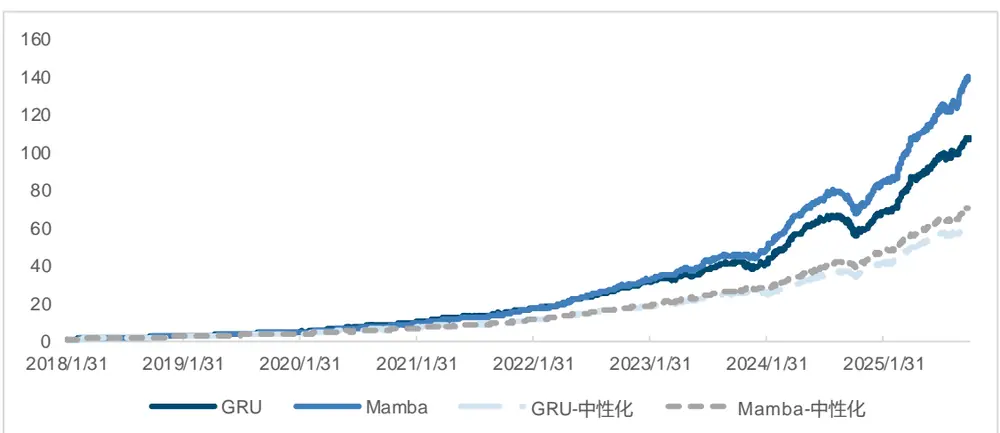
来源：Wind，国金证券研究所

从日频结果来看，Mamba2 在全 A 与中证 1000 范围内的 IC 与多头年化超额收益普遍高于GRU，最大回撤表现亦有支撑；中性化后优势仍在。净值曲线显示 Mamba2 斜率更陡、回撤恢复更快，超额主要在 2023–2025 年度显著累积。

图表11：60 分钟频OHLCV输入 GRU和Mamba 统计数据比较

|  | RankIC | ICIR | ICT | 多头年化 超额收益 | 多头 Sharpe | 多头信息多头超额 |  | 多空年化多空波动 率 |  | 多空 Sharpe 比率 | 多空最大 回撤 |
| --- | --- | --- | --- | --- | --- | --- | --- | --- | --- | --- | --- |
|  |  |  |  |  |  |  |  | 比率最大回撤 | 收益率 |  |  |
| GRU-QA | 11.22% | 1.17 | 16.07 | 率 26.96% | 比率 1.51 | 4.45 | 6.84% | 98.24% | 0.11 | 8.77 | 14.51% |
| Mamba-QA | 12.31% | 1.22 | 16.69 | 25.88% | 1.53 | 4.59 | 4.21% | 99.51% | 0.12 | 8.59 | 9.73% |
| GRU-中性化-QA | 10.32% | 1.34 | 18.39 | 24.71% | 1.40 | 5.03 | 5.09% | 80.65% | 0.08 | 9.77 | 8.92% |
| Mamba-中性化-QA | 11.28% | 1.37 | 18.73 | 24.13% | 1.41 | 5.02 | 4.55% | 81.06% | 0.08 | 9.58 | 5.47% |
| GRU-300 | 7.26% | 0.55 | 7.48 | 18.43% | 1.17 | 2.13 | 8.50% | 45.25% | 0.15 | 2.98 | 16.46% |
| Mamba-300 | 8.49% | 0.56 | 7.65 | 15.73% | 1.14 | 2.02 | 13.57% | 41.27% | 0.16 | 2.50 | 27.97% |
| GRU-中性化-300 | 5.76% | 0.51 | 6.91 | 14.30% | 0.94 | 2.03 | 8.60% | 29.00% | 0.13 | 2.27 | 14.32% |
| Mamba-中性化-300 | 6.47% | 0.52 | 7.13 | 13.43% | 0.92 | 2.28 | 7.16% | 26.71% | 0.12 | 2.15 | 24.03% |
| GRU-500 | 7.48% | 0.66 | 8.99 | 12.43% | 0.81 | 1.73 | 8.46% | 43.81% | 0.13 | 3.37 | 15.12% |
| Mamba-500 | 8.52% | 0.73 | 9.97 | 11.76% | 0.82 | 1.81 | 7.48% | 45.29% | 0.14 | 3.27 | 15.52% |
| GRU-中性化-500 | 6.39% | 0.71 | 9.72 | 10.11% | 0.71 | 1.75 | 6.24% | 35.49% | 0.10 | 3.55 | 8.84% |
| Mamba-中性化-500 | 7.46% | 0.79 | 10.77 | 9.98% | 0.73 | 1.89 | 6.34% | 36.72% | 0.10 | 3.52 | 11.40% |
| GRU-1000 | 10.16% | 0.90 | 12.31 | 23.82% | 1.16 | 3.44 | 7.27% | 80.34% | 0.13 | 6.15 | 13.11% |
| Mamba-1000 | 10.99% | 0.95 | 13.01 | 20.63% | 1.10 | 3.10 | 6.82% | 77.38% | 0.14 | 5.67 | 15.09% |
| GRU-中性化-1000 | 9.23% | 1.02 | 13.97 | 20.74% | 1.06 | 3.89 | 5.93% | 65.05% | 0.10 | 6.81 | 9.94% |
| Mamba-中性化-1000 | 10.01% | 1.07 | 14.68 | 18.67% | 1.02 | 3.65 | 4.46% | 62.85% | 0.10 | 6.51 | 9.05% |

来源：Wind，国金证券研究所

图表12：60 分钟频 OHLCV输入 GRU和Mamba 全A 多空净值
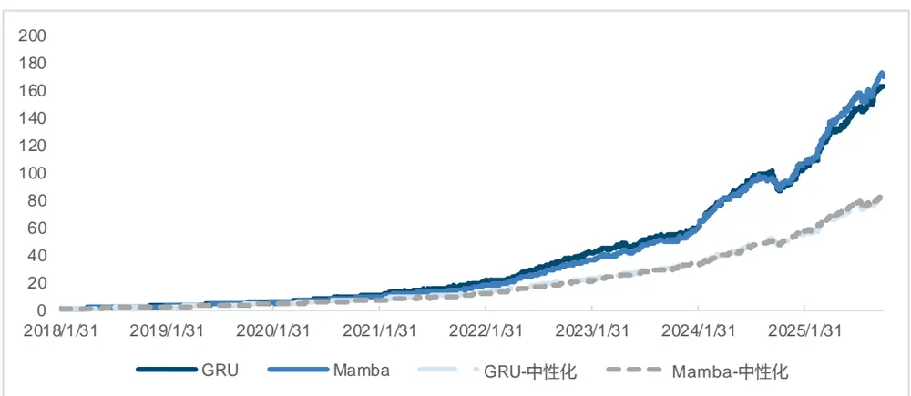
来源：Wind，国金证券研究所

相对日频，60 分钟频作为输入的整体效果提升。统计对比与净值表明：Mamba2 的 IC 在全市场范围更普适，但多头年化收益与 Sharpe 略不及 GRU，多空年化收益率各有优劣，说明对中短期结构性波动更敏感。

图表13：30 分钟频 OHL CV 输入 GRU 和 Mamba 统计数据比较

|  | RankIC |  |  | 多头年 化超额 | 多头 | 多头信 息比率 | 多头超 额最大 |  | 多空年 多空波 动率 | 多空 Sharpe 比率 |  | 多空最 大回撤 |
| --- | --- | --- | --- | --- | --- | --- | --- | --- | --- | --- | --- | --- |
|  |  | ICIR | ICT | 收益率 | Sharpe 比率 |  | 回撤 | 化收益 率 |  |  |  |  |
| GRU-QA | 12.04% | 1.22 | 16.67 | 25.21% | 1.46 | 4.10 | 7.06% | 95.34% | 0.12 | 7.77 | 14.45% |  |
| Mamba-QA | 11.90% | 1.13 | 15.44 | 23.66% | 1.38 | 3.51 | 6.44% | 94.13% | 0.13 | 7.48 | 13.17% |  |
| GRU-中性化-QA | 11.14% | 1.40 | 19.13 | 24.07% | 1.40 | 4.85 | 5.24% | 79.73% | 0.09 | 9.23 | 9.81% |  |
| Mamba-中性化-QA | 11.02% | 1.31 | 17.92 | 21.96% | 1.29 | 4.03 | 5.80% | 77.33% | 0.09 | 8.63 | 8.36% |  |
| GRU-300 | 8.12% | 0.56 | 7.65 | 15.60% | 0.99 | 1.79 | 13.16% | 42.69% | 0.17 | 2.53 | 30.12% |  |
| Mamba-300 | 8.14% | 0.54 | 7.36 | 18.26% | 1.17 | 2.10 | 15.85% | 45.93% | 0.17 | 2.68 | 31.19% |  |
| GRU-中性化-300 | 6.40% | 0.54 | 7.35 | 12.80% | 0.86 | 1.86 | 9.01% | 28.93% | 0.13 | 2.17 | 25.01% |  |
| Mamba-中性化-300 | 6.19% | 0.54 | 7.33 | 13.87% | 0.89 | 2.05 | 9.25% | 30.33% | 0.13 | 2.38 | 23.90% |  |
| GRU-500 | 8.41% | 0.69 | 9.40 | 9.30% | 0.69 | 1.23 | 15.44% | 39.00% | 0.15 | 2.59 | 17.40% |  |
| Mamba-500 | 8.24% | 0.68 | 9.24 | 10.77% | 0.75 | 1.44 | 11.89% | 41.36% | 0.14 | 2.86 | 18.25% |  |
| GRU-中性化-500 | 7.39% | 0.75 | 10.27 | 7.88% | 0.63 | 1.33 | 9.15% | 31.09% | 0.11 | 2.79 | 11.87% |  |
| Mamba-中性化-500 | 7.20% | 0.75 | 10.24 | 8.28% | 0.64 | 1.42 | 8.86% | 33.61% | 0.11 | 3.12 | 13.08% |  |
| GRU-1000 | 11.06% | 0.96 | 13.10 | 21.75% | 1.12 | 3.00 | 7.83% | 78.54% | 0.15 | 5.35 | 16.59% |  |
| Mamba-1000 | 10.65% | 0.90 | 12.25 | 21.35% | 1.08 | 2.77 | 8.42% | 79.26% | 0.14 | 5.54 | 13.28% |  |
| GRU-中性化-1000 | 10.15% | 1.08 | 14.72 | 20.58% | 1.09 | 3.71 | 5.82% | 67.21% | 0.10 | 6.53 | 11.47% |  |
| Mamba-中性化-1000 | 9.77% | 1.03 | 14.13 | 19.30% | 1.01 | 3.31 | 5.76% | 65.25% | 0.10 | 6.49 | 8.90% |  |

来源：Wind，国金证券研究所

图表14:30 分钟频 OHLCV输入 GRU和Mamba 全A 多空净值
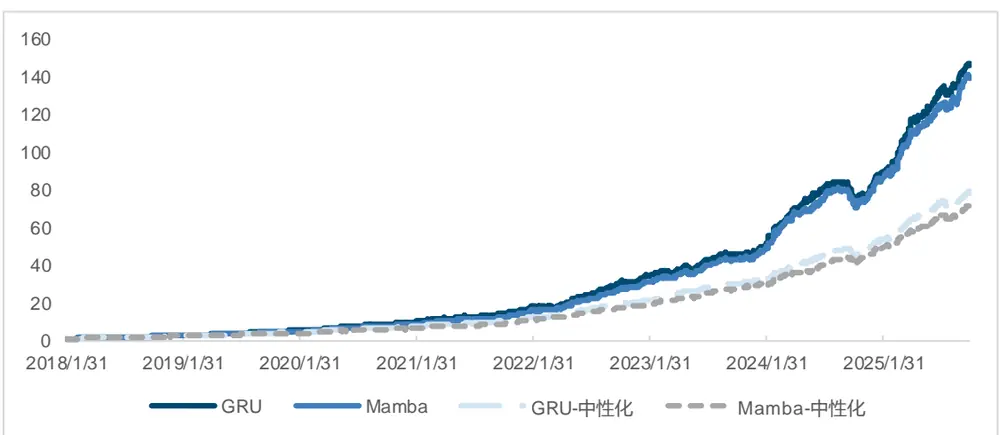
来源：Wind，国金证券研究所

随着数据高频化，噪声加大、分布更不稳，模型的拟合能力也受到挑战。Mamba2 模型在很多设定下的表现与 GRU 接近，尤其是沪深 300 上表现良好。30 分钟频净值中，两者表现亦接近。

图表15：10 分钟频 OHL CV输入 GRU和 Mamba 统计数据比较

|  | RankIC | ICIR | ICT | 多头年化 超额收益 | 多头 Sharpe | 多头信息多头超额 |  | 多空年化多空波动 率 |  | 多空 Sharpe 比率 | 多空最大 回撤 |
| --- | --- | --- | --- | --- | --- | --- | --- | --- | --- | --- | --- |
|  |  |  |  |  |  |  |  | 比率最大回撤 | 收益率 |  |  |
| GRU-QA | 11.75% | 1.16 | 15.84 | 率 23.92% | 比率 1.34 | 3.67 | 7.93% | 93.05% | 0.13 | 7.06 | 12.61% |
| Mamba-QA | 11.84% | 1.11 | 15.15 | 20.60% | 1.34 | 3.35 | 6.82% | 84.56% | 0.13 | 6.71 | 14.05% |
| GRU-中性化-QA | 10.78% | 1.27 | 17.39 | 21.82% | 1.27 | 4.13 | 6.89% | 74.92% | 0.10 | 7.85 | 9.46% |
| Mamba-中性化-QA | 10.95% | 1.29 | 17.61 | 19.29% | 1.24 | 3.73 | 5.82% | 70.78% | 0.09 | 7.71 | 6.33% |
| GRU-300 | 7.42% | 0.53 | 7.30 | 16.61% | 0.99 | 2.13 | 8.73% | 38.11% | 0.15 | 2.48 | 24.44% |
| Mamba-300 | 7.56% | 0.49 | 6.70 | 10.74% | 0.83 | 1.44 | 19.40% | 32.68% | 0.16 | 2.03 | 33.05% |
| GRU-中性化-300 | 5.35% | 0.44 | 6.03 | 12.87% | 0.82 | 2.00 | 5.47% | 24.00% | 0.12 | 2.04 | 21.96% |
| Mamba-中性化-300 | 5.55% | 0.48 | 6.58 | 5.71% | 0.51 | 1.02 | 11.56% | 20.47% | 0.12 | 1.70 | 21.85% |
| GRU-500 | 7.85% | 0.66 | 8.98 | 11.46% | 0.77 | 1.78 | 9.34% | 37.36% | 0.14 | 2.60 | 15.54% |
| Mamba-500 | 7.71% | 0.59 | 8.10 | 7.53% | 0.68 | 1.12 | 9.77% | 32.25% | 0.15 | 2.17 | 18.75% |
| GRU-中性化-500 | 6.69% | 0.70 | 9.59 | 9.65% | 0.71 | 1.92 | 4.69% | 30.15% | 0.11 | 2.77 | 13.20% |
| Mamba-中性化-500 | 6.63% | 0.67 | 9.21 | 5.33% | 0.56 | 1.05 | 6.33% | 24.38% | 0.11 | 2.21 | 14.36% |
| GRU-1000 | 10.66% | 0.91 | 12.41 | 15.99% | 0.87 | 2.39 | 9.71% | 71.26% | 0.15 | 4.73 | 11.32% |
| Mamba-1000 | 10.41% | 0.85 | 11.68 | 14.22% | 0.90 | 2.11 | 11.00% | 65.34% | 0.14 | 4.56 | 14.78% |
| GRU-中性化-1000 | 9.77% | 1.03 | 14.06 | 14.69% | 0.84 | 3.02 | 7.86% | 58.37% | 0.11 | 5.56 | 9.07% |
| Mamba-中性化-1000 | 9.61% | 1.01 | 13.82 | 12.49% | 0.81 | 2.47 | 6.56% | 53.03% | 0.10 | 5.30 | 7.52% |

来源：Wind，国金证券研究所

图表16：10 分钟频OHLCV输入 GRU和Mamba 全A多空净值
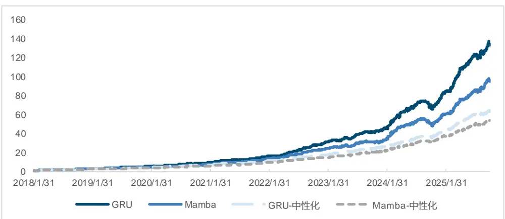
来源：Wind，国金证券研究所

10 分钟频受噪声影响更大，Mamba2 仍具可用性但优势显著收敛，三大宽基上难以完美预测，体现高频 Alpha 可得性受限。

图表17：各频率因子之间相关性
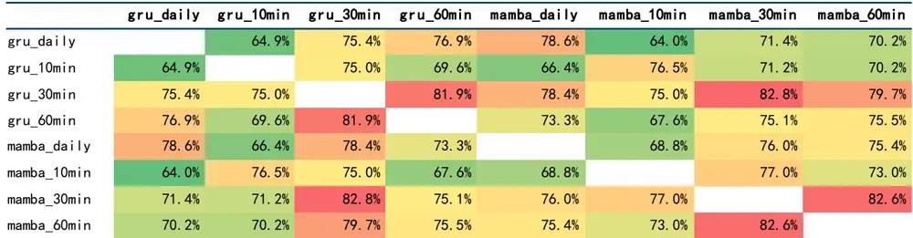
来源：Wind，国金证券研究所

Mamba2 模型只有在日频数据上整体表现明显优于 GRU 模型，60 分钟频上与 GRU 模型不分伯仲，30 分钟频上能够带来沪深 300 的优化。相关性测算显示 GRU 与 Mamba2 在不同频率的“截面信号”相关性约 70%–80%。这意味着二者并非冗余：通过模型-频率的合成（如日频+60 分/30 分、GRU+Mamba2）有望带来增量信息与风格分散，在控制回撤的同时稳定提升组合夏普率。

## 三、模型合成与宽基指增策略

## 3.1 引入 3 种市场整体信息

在仅以单票 OHLCV 为输入的 GRU 端到端预测里，模型难以区分“普涨/普跌”与“结构分化”两类行情，导致相同的截面排序在不同市场环境下收益差异巨大。为此，我们构造三类个股不变的市场信息作为附加输入：①三大宽基指数点位（沪深 300/中证 500/中证1000），作为市场整体状态的关键表征；②当前交易日的时间信息（周几、月几、周中的具体日期）以捕捉潜在的周期性与时序模式；③基于 Barra 因子构建的市场风格指数，通过在 300 只股票上按风险因子排序选取头部/尾部，反映市场的主导风格。我们试图利用市场大盘、时间、风格信息的引入，让模型“学会差异”，在不同市场相位下自适应地调整对单票信号的响应强度。

图表18：构建的3种个股不变的市场信息

| 数据 | 含义 |
| --- | --- |
| 三大宽基指数点位 | 衡量市场整体表现的关键指标，通过追踪沪深300、中证500和中证1000的 点位，反映不同市值整体的走势。 |
| 当前交易日的时间信息 | 包括当前交易日所在的周数、月数以及在周中的具体日期，这些信息对于分析 市场周期性和时间序列数据可能具有一定意义。 |
| 构造 Barra 风格指数 | 通过 Barra风险因子排序选择最高或者最低的 300只股票构建指数，反应市 场当前的风格。 |

来源：Wind，国金证券研究所

将上述三类市场信息逐一注入 GRU，我们观察到：三大宽基指数信息的提升最为显著，IC、多头、多空收益与回撤指标均明显改善；时间信息与 Barra 风格信息在 GRU 上并未带来稳定增益。在全 A 多头超额净值表现上，“GRU+指数”曲线斜率更稳、回撤更浅。这提示：在循环模型上，简单、稳健的市场位置信号（指数点位）更易被网络吸收；而时间/风格这类“弱结构”特征需更强的结构归纳能力才能转化为 Alpha。

图表19：加入市场信息 GRU在全A的表现

|  | RankIC | ICIR | ICT | 多头年化 超额收益 率 | 多头 Sharpe 比率 | 多头信息多头超额 |  | 多空年化多空波动 收益率 | 率 | 多空 Sharpe 比率 | 多空最大 回撤 |  |
| --- | --- | --- | --- | --- | --- | --- | --- | --- | --- | --- | --- | --- |
|  |  |  |  |  |  |  |  |  |  |  |  | 比率最大回撤 |
| GRU | 10.91% | 1.21 | 16.51 | 25.03% | 1.49 | 4.66 | 9.03% | 87.42% | 0.12 | 7.54 | 16.85% |  |
| GRU+指数 | 11.89% | 1.11 | 15.25 | 27.63% | 1.49 | 4.13 | 6.67% | 98.69% | 0.13 | 7.75 | 13.61% |  |
| GRU+时间信息 | 9.37% | 0.98 | 13.43 | 18.12% | 1.23 | 3.11 | 11.58% | 65.89% | 0.12 | 5.43 | 21.70% |  |
| GRU+Barra 风格 | 10.98% | 0.93 | 12.70 | 24.11% | 1.30 | 3.16 | 7.03% | 83.44% | 0.14 | 5.91 | 10.33% |  |

来源：Wind，国金证券研究所

图表20：加入市场信息GRU全A多头超额净值
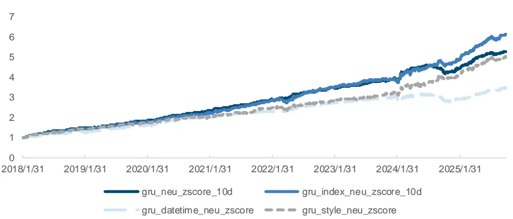
来源：Wind，国金证券研究所

我们进一步测试观察加入三大宽基指数点位信息及中性化后，在沪深 300 范围的表现：

图表21：GRU+指数在沪深 300 的表现

|  | RankIC | ICIR | ICT | 多头年化 超额收益 率 | 多头 Sharpe 比率 | 多头信息多头超额 |  | 多空年化多空波动 收益率 | 率 | 多空 Sharpe 比率 | 多空最大 回撤 |  |
| --- | --- | --- | --- | --- | --- | --- | --- | --- | --- | --- | --- | --- |
|  |  |  |  |  |  |  |  |  |  |  |  | 比率最大回撤 |
| GRU | 6.84% | 0.50 | 6.79 | 16.58% | 1.08 | 1.99 | 10.12% | 38.00% | 0.17 | 2.29 | 26.50% |  |
| GRU+指数 | 8.32% | 0.56 | 7.63 | 20.53% | 1.03 | 2.13 | 14.49% | 51.41% | 0.16 | 3.27 | 13.62% |  |
| GRU-中性化 | 5.19% | 0.46 | 6.28 | 9.83% | 0.70 | 1.48 | 8.31% | 19.48% | 0.12 | 1.58 | 22.81% |  |
| GRU+指数-中性化 | 6.31% | 0.55 | 7.50 | 14.53% | 0.82 | 1.76 | 14.15% | 31.93% | 0.13 | 2.46 | 19.84% |  |

来源：Wind，国金证券研究所

图表22：GRU+指数在沪深300多头超额净值
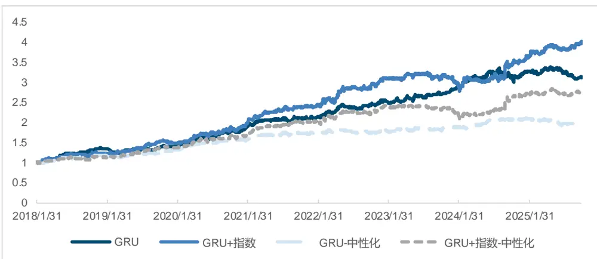
来源：Wind，国金证券研究所

结果表明，在风格更均衡、权重更集中的沪深 300 上，引入指数信息不仅提升整体表现，更对近年（尤其 2024 年 8、9 月附近）的超额回撤有明显改善。一方面，蓝筹风格对市场位移更敏感；另一方面，指数作为强先验，能在大类资产风险切换时降低策略的误触发概率。这为后续在量化策略中叠加指数位移特征以规避回撤提供了经验依据。

## 3.2 收益率长尾分布与损失函数的选择

收益率预测天然长尾且含较多难例，除 MSE/MAE 外，我们尝试了 Log-Cosh、Huber（含δ超参）与 Focal 等损失函数。

图表23：不同损失函数尝试

| 损失函数 | 定义 |
| --- | --- |
| MSE | 预测值与真实值之间差的平方的平均值。 |
| MAE | MAE是预测值与真实值之间差的绝对值的平均值。 |
| Log-Cosh 损失 | 对误差的双曲余弦值取对数。比MSE更稳健，对异常值的敏感度较低。 |
| Huber 损失 | Huber损失结合了MSE和MAE的特性，通过参数 δ 控制误差的处理方式。对小 误差使用平方误差，对大误差使用线性误差。 |
| Focal 损失 | 对易分类样本的权重降低，对难分类样本的权重增加。 |

来源：Wind，国金证券研究所

综合全 A 统计，MSE 在多数指标上表现最好，但 Focal 在少数指标上取得最优。因此我们认为，在没有明确难例加权诉求时，MSE 仍是稳健首选；当我们希望加强长尾/极端样本的惩罚时，可在 MSE 主干上引入 Focal/Huber 以增强鲁棒性。

图表24：不同损失函数全A统计数据

|  | RankIC | ICIR | ICT | 多头年化 超额收益 率 | 多头 Sharpe 比率 | 多头信息多头超额 | 比率最大回撤 | 多空年化多空波动 率 |  | 多空 Sharpe 比率 | 多空最大 回撤 |
| --- | --- | --- | --- | --- | --- | --- | --- | --- | --- | --- | --- |
|  |  |  |  |  |  |  |  |  | 收益率 |  |  |
| gru_mse | 11.89% | 1.11 | 15.25 | 27.63% | 1.49 | 4.13 | 6.67% | 98.69% | 0.13 | 7.75 | 13.61% |
| gru_mae | 12.25% | 1.03 | 14.12 | 23.63% | 1.41 | 3.57 | 7.74% | 86.81% | 0.15 | 5.73 | 18.21% |
| gru_logcosh | 12.26% | 1.07 | 14.63 | 25.49% | 1.45 | 3.97 | 7.51% | 89.38% | 0.14 | 6.45 | 18.67% |
| gru_huber1.5 | 11.54% | 1.01 | 13.78 | 24.62% | 1.39 | 3.81 | 6.93% | 87.18% | 0.14 | 6.02 | 17.48% |
| gru_huber0.5 | 11.86% | 1.05 | 14.41 | 23.88% | 1.39 | 3.56 | 7.84% | 85.16% | 0.15 | 5.86 | 18.24% |
| gru_focal | 12.28% | 1.11 | 15.16 | 26.00% | 1.53 | 4.26 | 6.67% | 92.12% | 0.14 | 6.73 | 17.05% |

来源：Wind，国金证券研究所

## 3.3 模型合成框架：频率×模型×传统因子三线并进

为获得“模型多样性+频率多样性+因子多样性”的三重互补，我们构建“GRU（4 频）+Mamba2（3 频）+GJQuant 因子→LGBM”的二层合成架构。实践要点：

第一层：分别训练 GRU（日/60/30/10min）与 Mamba2（日/60/30min），输出标准化的截面评分（hidden）。

第二层：与 GJQuant 的 117 个风格因子一起输入 LightGBM，在不改变 Mamba2 训练/验证/回测切分的前提下做堆叠集成。

图表25：因子合成框架
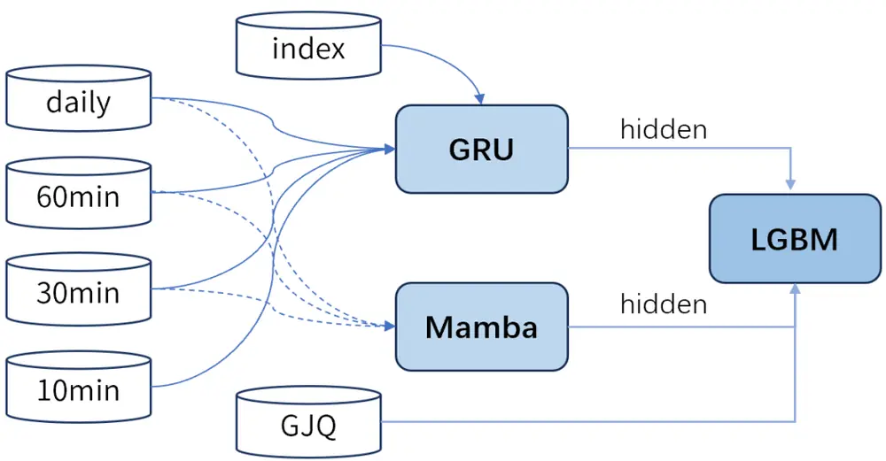
来源：Wind，国金证券研究所

图表26：因子合成效果

|  | RankIC | ICIR | ICT | 多头年 | 多头 | 多头信 息比率 | 多头超 额最大 | 多空年 化收益 | 多空波 动率 | 多空 Sharpe | 多空最 大回撤 |
| --- | --- | --- | --- | --- | --- | --- | --- | --- | --- | --- | --- |
|  |  |  |  | 化超额 | Sharpe 比率 |  |  |  |  |  |  |
| GRU | 12.85% | 1.24 | 16.89 | 收益率 27.69% | 1.55 | 4.37 | 回撤 6.23% | 率 107.96% | 0.13 | 比率 8.51 | 14.16% |
| GRU+Mamba | 13.06% | 1.24 | 17.01 | 28.46% | 1.58 | 4.48 | 6.47% | 111.17% | 0.13 | 8.78 | 13.82% |
| GRU+LGBM | 13.23% | 1.24 | 16.92 | 28.22% | 1.56 | 4.35 | 6.20% | 113.93% | 0.13 | 8.72 | 13.90% |
| GRU+Mamba+LGBM | 13.44% | 1.26 | 17.26 | 28.91% | 1.58 | 4.44 | 5.93% | 113.98% | 0.13 | 8.63 | 13.93% |
| GRU+Mamba+GJQ+LGBM | 13.61% | 1.26 | 17.23 | 29.38% | 1.59 | 4.46 | 5.74% | 115.27% | 0.13 | 8.64 | 13.37% |
| GRU+Mamba+GJQ+LGBM-中性化 | 12.44% | 1.40 | 19.17 | 26.48% | 1.46 | 4.85 | 6.56% | 92.49% | 0.10 | 9.53 | 8.19% |

来源：Wind，国金证券研究所

从合成结果看，加入 Mamba2 后 IC、多头超额等维度表现较之 GRU 基线提升明显，再叠加LGBM 进一步提升；当三者联合并引入 GJQ 因子库后，各个维度表现进一步提升至最佳。更关键的是，多空年化与夏普比率在收益率 合成后持续抬升，而多空波动率并未同步放大，说明合成带来了真实 Alpha 增量而非来源于杠杆放大。同时，“合成+中性化”虽略有指标回落，但信息比率与最大回撤仍处健康区间，总体模型结构稳健，风险可控。

我们同时比较了每一类数据在 LGBM 合成的过程中的平均重要程度：

图表27：不同来源的因子重要程度
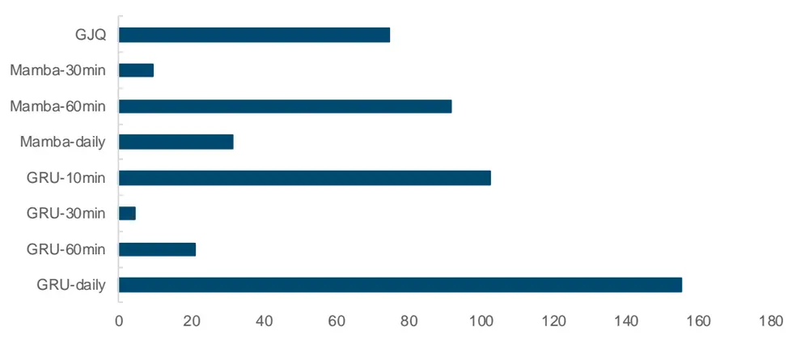
来源：Wind，国金证券研究所

重要性分析显示：GRU-daily、GRU-10min 与 Mamba-60min 的平均贡献度较高，说明“低频的稳健趋势”和“中高频的结构波动”在合成中均不可或缺；GJQ 传统因子仍提供了与端到端信号不同的补充信息。

在与 Barra 因子的截面相关上，我们发现在低波动（Residual Volatility）与低流动性（Liquidity）两个维度相关度最高，小市值上暴露也较高；时间维度的累积暴露轨迹呈现出与市场风格切换高度相关的动态迁移。

图表28：Barra 因子截面相关性
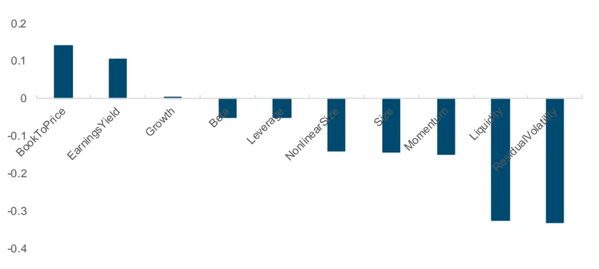
来源：Wind，国金证券研究所

图表29：Barra 因子暴露（累加）
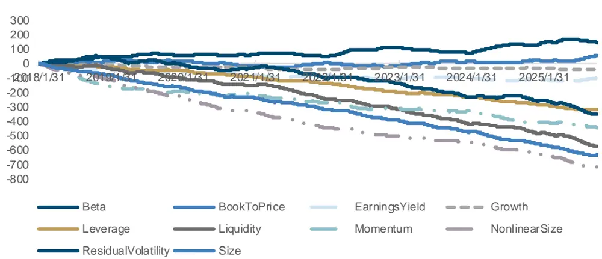
来源：Wind，国金证券研究所

## 3.4 宽基指数增强策略

结果显示，三大宽基的指数增强均取得显著超额，沪深 300、中证 500、中证 1000 指增策略的年化超额分别达到 9.99%、12.20%和 20.65%，信息比率分别为 1.88、2.24 和 3.31；最大回撤方面，三者的主动层回撤均显著小于指数本身；可见，合成因子在保持 Beta 暴露稳定的同时，提供了具有持续性的截面 Alpha。

图表30：宽基指数增强统计数据

| 统计指标 | 策略 | 沪深300 | 策略 | 中证 500 | 策略 | 中证1000 |
| --- | --- | --- | --- | --- | --- | --- |
| 年化收益率 | 11.86% | 1.25% | 15.47% | 2.31% | 22.91% | 1.26% |
| 年化波动率 | 18.18% | 0.19 | 21.45% | 0.22 | 24.45% | 0.24 |
| Sharpe 比率 | 0.65 | 0.07 | 0.72 | 0.11 | 0.94 | 0.05 |
| 最大回撤率 | 24.04% | 45.60% | 30.69% | 41.81% | 33.77% | 46.71% |
| 换手率（10日） | 46.46% |  | 47.41% |  | 48.35% |  |
| 年化超额收益率 | 9.99% |  | 12.20% |  | 20.65% |  |
| 跟踪误差 | 5.31% |  | 5.44% |  | 6.23% |  |
| 信息比率 | 1.88 |  | 2.24 |  | 3.31 |  |
| 超额最大回撤 | 7.71% |  | 7.98% |  | 7.28% |  |

来源：Wind，国金证券研究所

从沪深 300 指增策略结果来看，超额曲线斜率稳健、回撤修复快，2018-2025 年策略超额均为正，今年以来超额为 4.30%。

图表31：沪深300增强净值
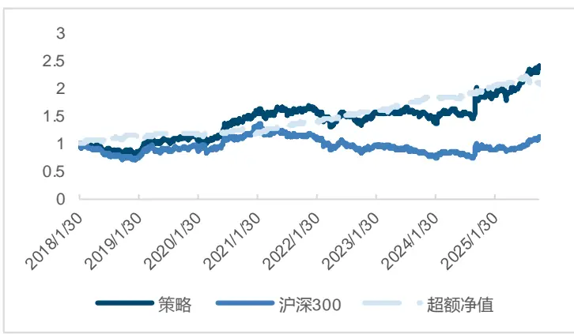
来源：Wind，国金证券研究所

图表32：沪深300增强分年度数据
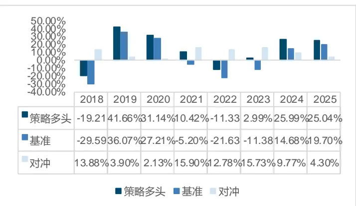
来源：Wind，国金证券研究所

中证 500 成分分散、单票权重低，增强策略能更充分释放“多因子+端到端信号”的组合效应；年度层面策略多头及超额收益表现均优于沪深 300。今年以来超额达 6.81%。

图表33：中证500增强净值
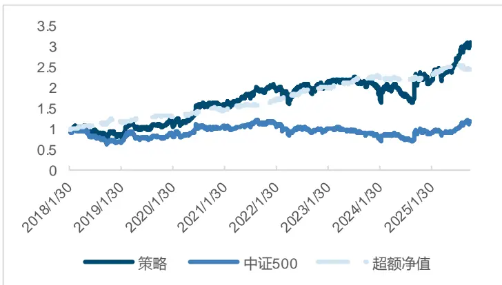
来源：Wind，国金证券研究所

图表34：中证500增强分年度数据
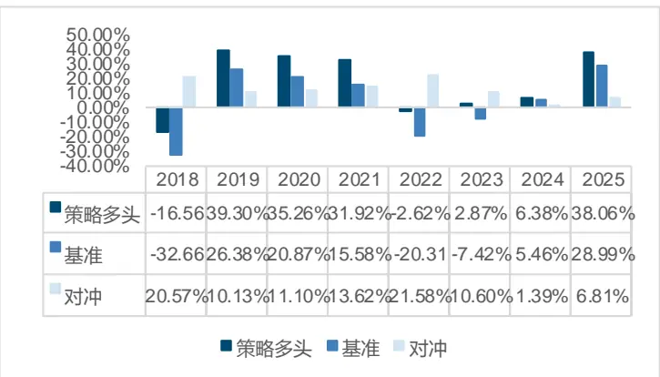
来源：Wind，国金证券研究所

小盘风格带来更强的可选股性，策略净值、超额表现最优；但波动与回撤弹性亦更大（如2024 年）。今年以来超额达 19.54%。

图表35：中证1000增强净值
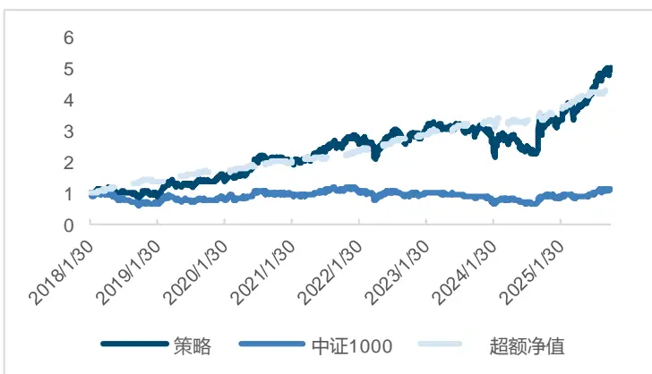
来源：Wind，国金证券研究所

## 总结

图表36：中证1000增强分年度数据
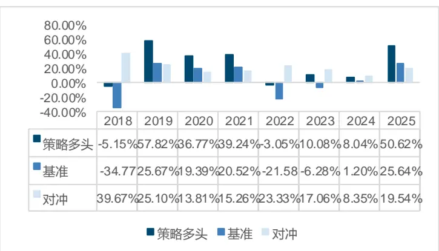
来源：Wind，国金证券研究所

本次研究，我们创新性地将 Mamba-2 模型加入整体模型架构，并在不同数据频率、不同宽基市场下，基于模型效果、信息增益、损失函数等多方面进行了优化可能性实验，最终构建了一个有效的“GRU（4 频）+Mamba2（3 频）+GJQuant 因子→LGBM”的二层合成架构，搭建的三大宽基的指数增强策略均取得显著超额。总体来说，架构表现优异。

## 风险提示

1、以上结果通过历史数据统计、建模和测算完成，在政策、市场环境发生变化时模型存在时效的风险。

2、策略通过一定的假设通过历史数据回测得到，当交易成本提高或其他条件改变时，可能导致策略收益下降甚至出现亏损。

## 特别声明：

国金证券股份有限公司经中国证券监督管理委员会批准，已具备证券投资咨询业务资格。

本报告版权归“国金证券股份有限公司”(以下简称“国金证券”)所有，未经事先书面授权，任何机构和个人均不得以任何方式对本报告的任何部分制作任何形式的复制、转发、转载、引用、修改、仿制、刊发，或以任何侵犯本公司版权的其他方式使用。经过书面授权的引用、刊发，需注明出处为“国金证券股份有限公司”，且不得对本报告进行任何有悖原意的删节和修改。

本报告的产生基于国金证券及其研究人员认为可信的公开资料或实地调研资料，但国金证券及其研究人员对这些信息的准确性和完整性不作任何保证。本报告反映撰写研究人员的不同设想、见解及分析方法，故本报告所载观点可能与其他类似研究报告的观点及市场实际情况不一致，国金证券不对使用本报告所包含的材料产生的任何直接或间接损失或与此有关的其他任何损失承担任何责任。且本报告中的资料、意见、预测均反映报告初次公开发布时的判断，在不作事先通知的情况下，可能会随时调整，亦可因使用不同假设和标准、采用不同观点和分析方法而与国金证券其它业务部门、单位或附属机构在制作类似的其他材料时所给出的意见不同或者相反。

本报告仅为参考之用，在任何地区均不应被视为买卖任何证券、金融工具的要约或要约邀请。本报告提及的任何证券或金融工具均可能含有重大的风险，可能不易变卖以及不适合所有投资者。本报告所提及的证券或金融工具的价格、价值及收益可能会受汇率影响而波动。过往的业绩并不能代表未来的表现。

客户应当考虑到国金证券存在可能影响本报告客观性的利益冲突，而不应视本报告为作出投资决策的唯一因素。证券研究报告是用于服务具备专业知识的投资者和投资顾问的专业产品，使用时必须经专业人士进行解读。国金证券建议获取报告人员应考虑本报告的任何意见或建议是否符合其特定状况，以及（若有必要）咨询独立投资顾问。报告本身、报告中的信息或所表达意见也不构成投资、法律、会计或税务的最终操作建议，国金证券不就报告中的内容对最终操作建议做出任何担保，在任何时候均不构成对任何人的个人推荐。

在法律允许的情况下，国金证券的关联机构可能会持有报告中涉及的公司所发行的证券并进行交易，并可能为这些公司正在提供或争取提供多种金融服务。

本报告并非意图发送、发布给在当地法律或监管规则下不允许向其发送、发布该研究报告的人员。国金证券并不因收件人收到本报告而视其为国金证券的客户。本报告对于收件人而言属高度机密，只有符合条件的收件人才能使用。根据《证券期货投资者适当性管理办法》，本报告仅供国金证券股份有限公司客户中风险评级高于 C3 级(含 C3 级）的投资者使用；本报告所包含的观点及建议并未考虑个别客户的特殊状况、目标或需要，不应被视为对特定客户关于特定证券或金融工具的建议或策略。对于本报告中提及的任何证券或金融工具，本报告的收件人须保持自身的独立判断。使用国金证券研究报告进行投资，遭受任何损失，国金证券不承担相关法律责任。

若国金证券以外的任何机构或个人发送本报告，则由该机构或个人为此发送行为承担全部责任。本报告不构成国金证券向发送本报告机构或个人的收件人提供投资建议，国金证券不为此承担任何责任。

此报告仅限于中国境内使用。国金证券版权所有，保留一切权利。

上海

电话：021-80234211

北京

电话：010-85950438

深圳

电话：0755-86695353

邮箱：researchsh@gjzq.com.cn

邮箱：researchbj@gjzq.com.cn

邮箱：researchsz@gjzq.com.cn

邮编：201204

邮编：100005

邮编：518000

地址：上海浦东新区芳甸路 1088 号

地址：北京市东城区建内大街 26 号

地址：深圳市福田区金田路 2028 号皇岗商务中心

紫竹国际大厦 5 楼

新闻大厦 8 层南侧

18 楼 1806

【小程序】国金证券研究服务

【公众号】国金证券研究