# Alpha 掘金系列之二十

金融工程专题报告

证券研究报告

金融工程组

分析师：高智威(执业 S1130522110003)

分析师：赵妍(执业 S1130523060001）

联系人：聂博洋

gaozhiw@gjzq.com.cn

zhao_yan@gjzq.com.cn

nieboyang@gjzq.com.cn

## 热门概念板块AI预测与概念龙头识别

## 行业分类难以满足多元需求，主题概念投资快速兴起

随着资本市场的快速发展，上市公司的业务结构愈发多元，仅依赖传统的行业或风格分类难以完整刻画企业的业务特征，信息损失也随之增加。概念指数是具有共性受益逻辑的一系列股票的集合，其成份样本通常涵盖一个或多个行业的上市公司，并且在二级市场股价具有明显联动性，可以很好解释股票的收益变化。

Wind热门概念指数基于客观量价评分，结合政策和产业等因素主观确定的热门指数，具有领涨性和活跃性，采用等权重方式进行编制。我们首先尝试基于月度和周度动量因子构建热门概念指数轮动策略，但是因子和策略效果相对有限，未能获得满意的效果。

## 基于TimeMixer模型的热门概念指数轮动策略构建

我们尝试先构建个股的 Alpha 因子，将其聚合到概念指数上。由于 Wind 热门概念指数均为等权重指数，所以按照指数成分股加权方式和等权加权方式效果完全相同，我们基于此方式先将个股因子聚合到概念指数上。聚合后的指数因子IC均值为 7.27%，多头年化超额收益率为 30.77%，多头信息比率为 1.28。

基于聚合后的因子构建指数轮动策略，每周选择模型得分最高的 10 个概念指数进行等权配置，基准为中证全指，回测区间为 2019 年 1 月 4 日至 2025 年 8 月 29 日，手续费为单边千分之一，基于 TimeMixer 的热门概念指数轮动策略相对于中证全指和 Wind 热门概念指数等权分别取得了费后 18.06%和 9.02%的年化超额收益率，相对于中证全指超额最大回撤仅为 9.97%，信息比率为 1.73。策略所有年度均相对中证全指实现正向超额收益。

## 基于热点概念指数轮动效应的 Alpha 和龙头组合构建

虽然概念指数轮动策略的收益表现较好，但在实际执行中需要持有数量较多、变化幅度较大的股票组合，从而带来较高的换手成本。为提升策略的可操作性，我们在每周的概念指数成分股信号中，挑选出选股模型得分最高的 20 只股票等权构建组合，基准为中证全指，手续费为单边千分之一。 策略相对于中证全指实现了费后 11.34%的年化超额收益，超额最大回撤为 22.87%，信息比率达到 0.79。

龙头企业通常在产业链中处于主导地位，市场份额高、定价权强，是行业的代表性资产，它们通常在产业链中处于主导地位，市场份额高、定价权强，是行业的代表性资产。最终，我们决定选择 FCF2EV(自由现金率因子)来帮助我们从概念组合里找出龙头公司，自由现金流率高的企业抗风险能力强，存在时间久且能真实反应企业盈利能力与财务状况：我们在概念指数的成分股信号里，每个指数挑选出自由现金流率最大的2只股票等权构建组合，基准为中证全指，手续费为单边千分之一，该选股策略整体表现优异，策略相较于基准年化超额收益为 20.63%，信息比率 1.61，超额最大回撤为 21.65%。分年度来看，组合在2019-2025年均获得了正超额。自由现金流率因子在成长大幅占优的年份（2019、2020和 2025）年表现表现略弱，这也和自由现金流率偏向价值和大市值风格特征高度一致。

## 风险提示

1、以上结果通过历史数据统计和测算完成，在市场环境发生变化时模型存在失效的风险；

2、 策略通过一定的假设通过历史数据回测得到，当交易成本提高或其他条件改变时，可 能导致策略收益下降甚至出现亏损。

3、策略历史收益不代表未来，需警惕资产未来业绩不及预期的风险；

## 一、行业分类难以满足多元需求，主题概念投资快速兴起

## 1.1 Wind 概念指数数量持续上升

当前较为普遍和被认可的做法，是从“行业”视角对股票进行分类，主流的行业分类体系包括中信行业分类、申万行业分类和 GICS 行业分类等，这些分类方式主要从业务收入、利润水平和市场认可度等视角对股票进行聚类，便于投资者进行资产的比较研究与配置决策。

然而，随着资本市场的快速发展，上市公司的业务结构愈发多元，仅依赖传统的行业或风格分类难以完整刻画企业的业务特征，信息损失也随之增加。在此背景下，市场对能够反映结构性趋势和阶段性主题的工具提出了更高需求，各类围绕热点事件、技术进步或产业链变化形成的“概念”逐渐受到关注。

与行业分类方式不同，概念指数是具有共性受益逻辑的一系列股票的集合，其成份样本通常涵盖一个或多个行业的上市公司，并且在二级市场股价具有明显联动性，可以很好解释股票的收益变化。

Wind A 股概念指数（以下简称Wind概念指数）是当前市场中应用较广的概念分类体系之一，选样时以主营业务收入相关性为核心，根据指数定义方式结合市值、动量、一致评级、成交额和行情相关性等多个维度进行综合评分，而后由主观分析进行样本确认，最终选取一定数量的代表性标的进入指数，通常不包括所有样本。Wind 热门概念指数基于客观量价评分，结合政策和产业等因素，从概念指数中主观确定的热门指数，具有领涨性和活跃性。

近年来，概念指数数量快速增长。截至 2025 年 9 月 30 日，Wind 概念指数共有 1034 只，Wind热门概念指数共有 339 只，2020 年指数增长速度最多，为 61只。整体来看，Wind热门概念指数数量相对Wind概念指数占比均在30%以上，时序上有下降趋势。

图表1：Wind热门概念指数数量占比呈现下降趋势
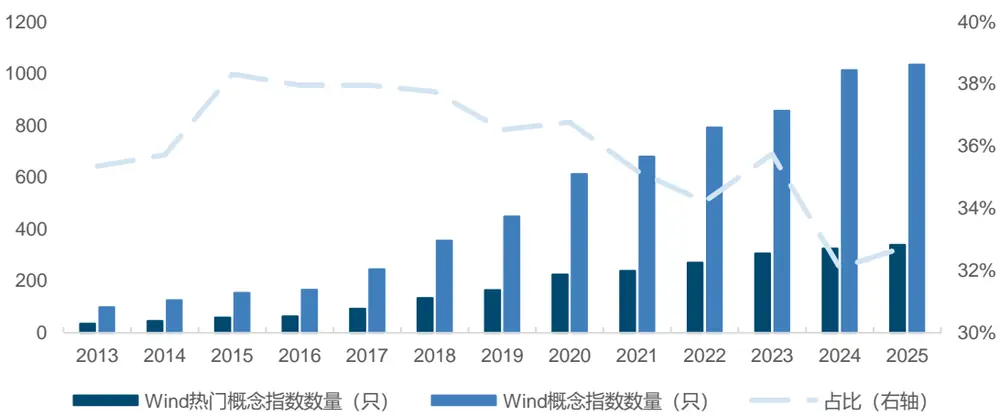
来源：Wind，国金证券研究所

注：2025年数据统计截至 2025年9月 30日

此外，我们还统计了Wind热门概念指数成分股分布情况。Wind 热门概念指数成分股数量偏少，10只以下成分股的指数数量有21只，占比为6.16%，有 300只指数的成分股在100只以下，占比高达 87.98%。

图表2：Wind热门概念指数成分股数量较少
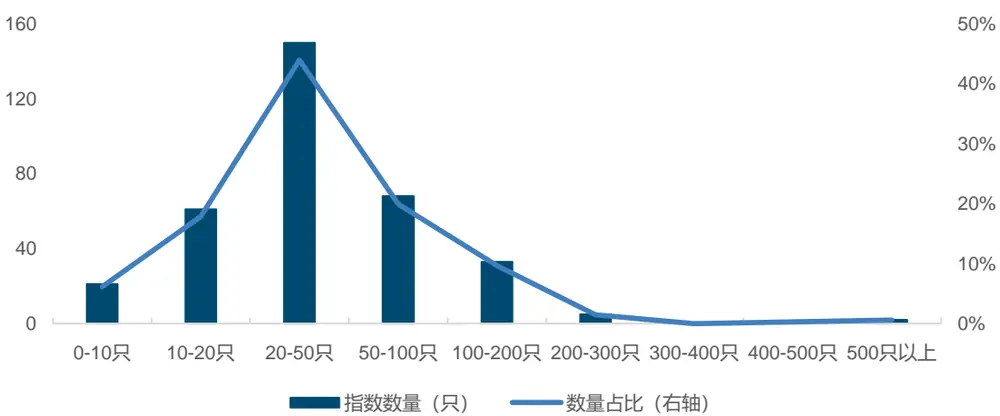
来源：Wind，国金证券研究所
注：数据统计截至 2025 年 9 月 30 日

## 1.2 Wind 热门概念指数采用等权重方式进行编制

Wind 热门概念指数在编制方法上并未采用常见的市值加权模式，而是选择以等权方式对成分股进行加权处理。等权重加权是指在每次权重再平衡时，赋予每个样本相同权重，具有以下特点：

（1）等权指数可以捕捉经典资产定价模型未能捕捉到的市场异象：投资组合的预期回报不仅由市场的系统性风险决定，还取决于其他因素。等权指数为投资者提供了一种简单且容易理解的方式来捕捉市场的超额回报。由于等权指数具有“因子中性”的特点，也可以作为非市值加权策略指数的业绩比较基准。

（2）等权指数在小市值与价值因子上暴露较高：根据经典 Fama - French 三因子模型，小市值（SMB）和低估值（HML）因子均为投资组合超额收益的来源。从因子暴露维度看，相较于市值加权指数，等权指数更突出小市值与低估值特征。以中证 800 等权指数为例，其小市值因子暴露显著高于中证 800，且与中证 500 接近。同时，其市净率（PB）因子暴露为负且低于中证 800、沪深 300 等市值加权宽基指数。

（3）等权指数具备均值回归特征，隐含一定的“高抛低吸”效应。等权指数会通过定期权重再平衡，将所有样本股的权重配比至相等。这一过程会自动买入上一阶段股价相对下跌的股票，同时卖出相对上涨的股票，使其天然具备一定的 “高抛低吸” 属性，且该属性与反转因子的特征高度契合。这种基于再平衡的操作逻辑，在板块轮动频繁的行情中能更好地捕捉不同板块的轮动机会，从而让指数相对更易受益。

图表3：Wind热门概念指数表现优异
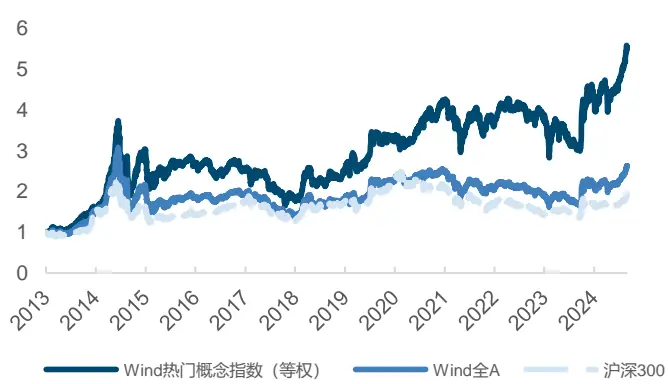
来源：Wind，国金证券研究所

图表4：等权指数在小市值和价值因子上暴露较高
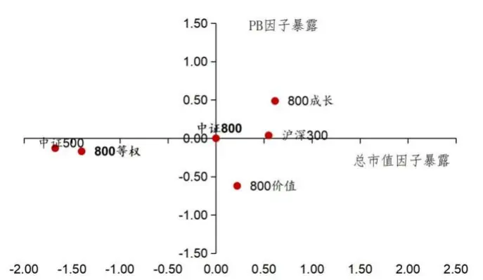
来源：中证指数公司官网，国金证券研究所
注：数据统计时间为 2013年 12月 31日至 2025年 8月 29日

## 1.3 Wind 热门概念指数动量因子表现一般

在构建概念指数的轮动策略时，一个直接的出发点是评估其是否具备动量特征。因此，我们探索了 2019年以来Wind热门概念指数的周度和月度动量表现。

为了评估因子的有效性，我们采用因子 IC 测试和构建分位数组合的方法进行研究。

因子 IC 测试主要研究因子取值与下一期资产收益率的相关性，即:

$$
RankIC_{t}=corr(Rank(X_{t,m}),Rank(r_{t+1,m}))
$$

其中 Rank 表示计算变量排序， $X_{t,m}$ 表示因子取值， $\pmb{r}_{t+1,m}$ 表示下一期资产的收益率。IC的绝对值越高，因子的下期收益率的预测能力越强。

对于分位数组合测试，我们按照因子值从高到低，将资产分为 10 组，分别等权构建 Top组合至 Bottom 组合，做多组合 Top 同时做空组合 Bottom，得到多空组合（L-S 组合），通过该组合的表现来衡量因子的预测能力。

从因子检验结果来看，月度和周度动量因子 IC 分别为1.35%和2.38%，月度动量因子分位数组合及多空净值单调性弱于周度因子。

图表5：热门概念指数动量因子检验结果

|  | IC 均 值 | 标准差 | 风险调 t统计 整的IC | 量 | 多头年 化收益 率 | 多头最 大回撤 率 | 多头 Sharpe 比 率 | 多头信 息比率 | 多空年化 多空最大 | 多空 |  |  |
| --- | --- | --- | --- | --- | --- | --- | --- | --- | --- | --- | --- | --- |
|  |  |  |  |  |  |  |  |  |  | 收益率 | 回撤率 | Sharpe 比 率 |
| Monthly_hot_cpt | 1.35% | 28.58% | 0.05 | 0.42 | 22.17% | 38.91% | 0.80 | 0.36 | 11.13% | 29.07% | 0.51 | -0.31 |
| Weekly_hot_cpt |  | 2.38% 28.58% | 0.09 | 1.53 | 24.03% | 32.41% | 0.93 | 0.53 | 12.21% | 27.00% | 0.58 | -0.26 |

来源：Wind，国金证券研究所
注：数据统计区间为 2019年 12月 31日至 2025年 8月 29日

图表6：热门概念指数月度动量因子年化超额收益率分位数组合表现
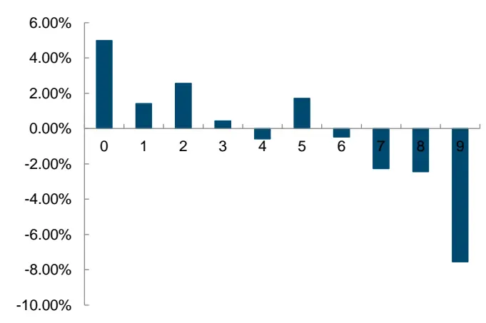
来源：Wind，国金证券研究所
注：数据统计范围为 2019年 1月 2日至 2025年 8月 29日

图表7：热门概念指数月度动量因子多空组合收益及净值表现
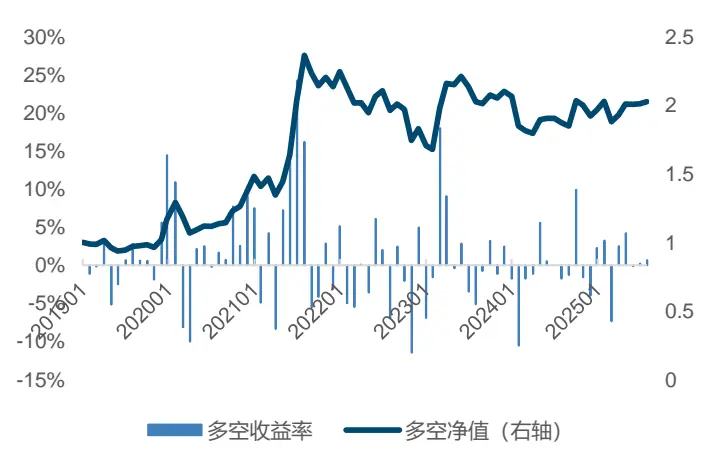
来源：Wind，国金证券研究所
注：数据统计范围为 2019年 1月 2日至 2025年 8月 29日

图表8：热门概念指数周度动量因子年化超额收益率分位数组合表现
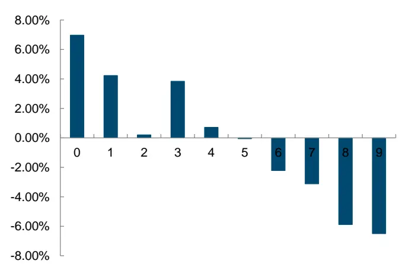
来源：Wind，国金证券研究所
注：数据统计时间为 2019年 1月 2日至 2025年 8月 29日

图表9：热门概念指数周度动量因子多空组合收益和净值表现
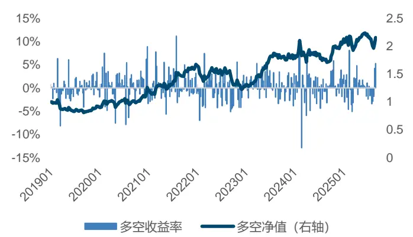
来源：Wind，国金证券研究所
注：数据统计时间为 2019年 1月 2日至 2025年 8月 29日

我们每次选取前 10%的热门概念指数等权构建组合，在不加换手缓冲调整的情况下，统计了组合相较于中证全指的表现。自 2019 年以来，截至 2025 年 8 月 29日，热门概念指数周度和月度动量策略的年化超额分别为 1.05%和 1.12%。即使不考虑交易费率，策略净值波动依然较大，未能取得较为满意的结果。

图表10：热门概念指数月度动量策略分年度收益表现
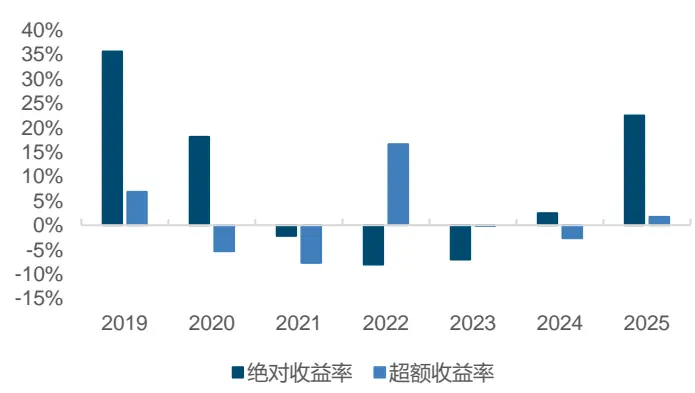
来源：Wind，国金证券研究所

图表11：热门概念指数月度动量策略超额净值
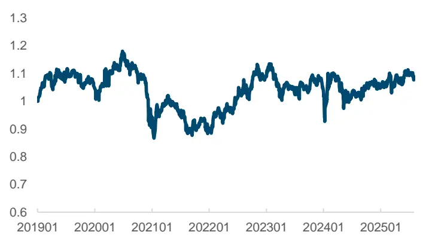
来源：Wind，国金证券研究所

图表12：热门概念指数周度动量策略分年度收益表现
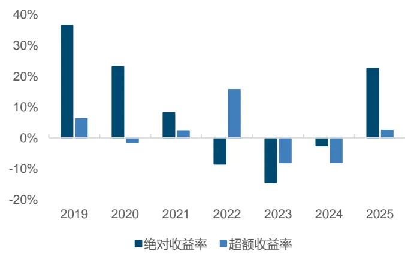
来源：Wind，国金证券研究所

图表13：热门概念指数周度动量策略超额净值
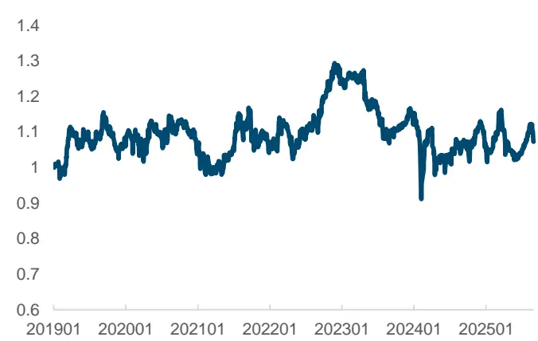
来源：Wind，国金证券研究所
注：数据统计时间为 2019年 1月 2日至 2025年 8月 29日
注：数据统计时间为 2019年 1月 2日至 2025年 8月 29日

## 二、基于 TimeMixer模型的热门概念指数轮动策略构建

## 2.1 基于 TimeMixer 改进的机器学习模型框架介绍

在《Alpha 掘金系列之九：基于多目标、多模型的机器学习指数增强策略》中，我们在GBDT和 NN 两大模型族的基础上，通过多目标、多模型融合策略在 A 股宽基指数增强领域取得了不错的成效。然而，后面我们发现：GBDT与 NN体系内部的模型间相似度较高，部分表现较弱的个体因子在融合过程中会稀释整体因子的有效性，从而拉低最终策略表现。

在2025 年8月14日发布的《Alpha 掘金系列之十八：基于 TimeMixer 改进的选股因子到ETF 轮动策略》中，我们对前面表现突出的 LightGBM 和 GRU 模型做了更为精细的调优。LightGBM 模型兼具非线性建模优势和训练效率，将 GRU 的 hidden 连同其他弱因子输入LightGBM进行集成，从而在GRU的基础上实现了稳健的提升。

在本报告中，我们首先基于 TimeMixer 改进了机器学习选股模型，并在多项宽基指数上验证了其优异表现。随后，我们将个股 Alpha 信号按照成分权重汇聚为指数层面的因子，再进一步映射至对应的 ETF 构建轮动策略。

图表14：机器学习选股基准模型框架
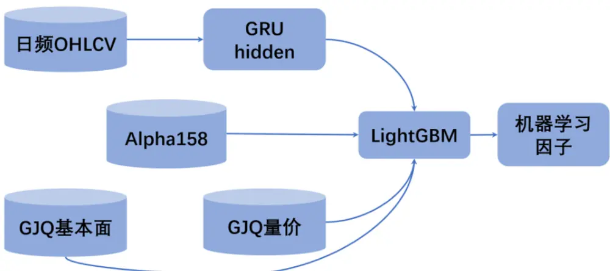
来源：Wind，国金证券研究所

## 2.2 自下而上的热门概念指数轮动策略构建

这一思路能否推广至 Wind 热门概念指数，用以构建指数轮动策略？为此，我们首先在个股层面开发 Alpha 因子，并按照成份股权重将其聚合至各类热门概念指数，形成指数层面的因子信号。

由于大部分热门概念指数并没有实际可交易的 ETF 产品，指数本身无法直接作为投资载

体。因此，我们在概念指数层面生成投资信号后，需要进一步将这些信号重新分配回个股维度，筛选出在特定概念中因子表现更优、风格特征更显著的股票。

图表15：热门概念指数投资策略构建流程
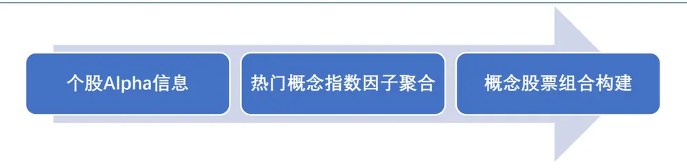
来源：Wind，国金证券研究所

## 2.3 TimeMixer 改进的机器学习模型测试结果

我们首先尝试将 TimeMixer改进的 GRU+LSTM机器学习模型应用到中证全指上来：

在选股层面，以中证全指作为基准，回测时间段为2019年 1月 2日至2025年8月 29日。在分位数组合测试中，我们按照个股的 Alpha因子从高到低，将资产分为 10 组。周频选股因子的IC高达10.68%，多头年化超额收益率和多头信息比率分别高达45.42%和3.66。

图表16：基于 TimeMixer 改进的机器学习选股因子检验结果

|  |  |  |  |  | 多头年 多头最 化收益 | 多头 Sharpe 比 率 | 多头信 息比率 | 多空年化 收益率 | 多空最 | 多空 Sharpe 比 | 多空信 息比率 |  |
| --- | --- | --- | --- | --- | --- | --- | --- | --- | --- | --- | --- | --- |
|  | IC 均 标准差 值 | 风险调 整的IC | t统计量 率 | 大回撤 率 |  |  |  |  |  |  |  | 大回撤 率 |
| TimeMixer-stock | 10.68%9.74% | 1.10 | 20.22 | 45.42% | 18.32%% | 1.91 | 3.66 | 113.37% | 6.65% | 率 7.69 | 2.66 |  |

来源：Wind，国金证券研究所

图表17：TimeMixer改进的机器学习选股因子年化超额收益率分位数组合表现
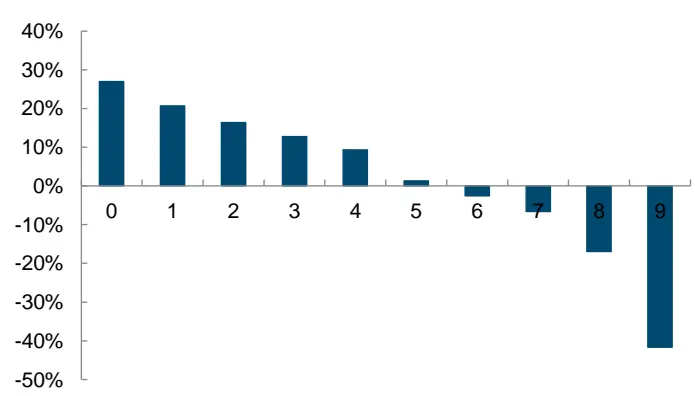
来源：Wind，国金证券研究所

图表18：TimeMixer改进的机器学习选股因子多空组合凈值
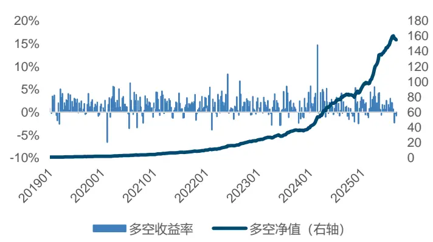
注：数据统计范围为 2019年 1月 2日至 2025年 8月 29日
来源：Wind，国金证券研究所
注：数据统计范围为 2019年 1月 2日至 2025年 8月 29日

## 2.4 基于 TimeMixer 的热门概念指数轮动策略构建

由于 Wind 热门概念指数加权方式均为等权重，所以按照指数成分股加权方式和等权加权方式效果完全相同。 类似地，我们对聚合后的概念指数分为 10 组，进行因子检验：

因子聚合到指数后依然效果显著，IC 均值为 7.27%，多头年化超额收益率为 30.77%，多头信息比率为 1.28。 因子多空组合上表现有所下降。

图表19：基于TimeMixer 改进的机器学习模型概念指数因子检验结果

| 因子 | IC 均值 | 标准差 | 风险调整的 IC | t 统计量 | 多头年化收 益率 | 多头最大回 撤率 | 多头 Sharpe 比率 | 多头信息比 率 |
| --- | --- | --- | --- | --- | --- | --- | --- | --- |
| TimeMixer-Index | 7.27% | 26.54% | 0.27 | 5.05 | 30.77% | 20.36% | 1.44 | 1.28 |

来源：Wind，国金证券研究所
注：数据统计范围为 2019年 1月 2日至 2025年 8月 29日

图表20：TimeMixer改进的机器学习指数因子年化超额收益率分位数组合表现
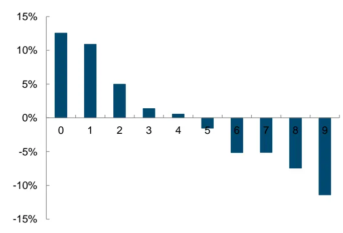
来源：Wind，国金证券研究所

图表21：TimeMixer改进的机器学习指数因子多空组合凈值
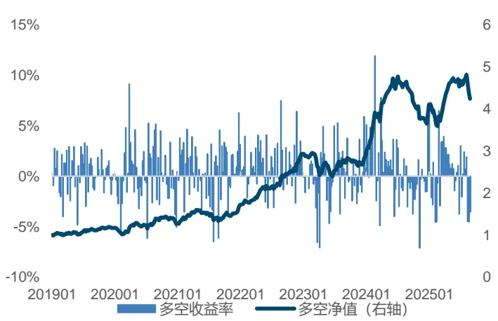
来源：Wind，国金证券研究所
注：数据统计范围为 2019 年 1 月 2 日至 2025 年 8 月 29 日
注：数据统计范围为 2019年 1月 2日至 2025年 8月 29日

## 2.5 基于 TimeMixer 机器学习模型的热门概念指数轮动策略效果

在构建策略时，我们选择模型得分最高的 10个概念指数进行等权配置，基准为中证全指，为了贴合交易实际，设置交易成本为单边千分之一，回测区间为 2019年1 月至 2025年8月。

基于 TimeMixer 的热门概念指数轮动策略相对于中证全指和 Wind 热门概念指数等权分别取得了费后18.06%和9.02%的年化超额收益率，相对于中证全指超额最大回撤仅为9.97%，信息比率为 1.73。

图表22：基于TimeMixer热门概念指数轮动策略

| 指标 | 基于 TimeMixer 热门概念指数轮动策略 Wind 热门概念指数等权 |  | 中证全指 |
| --- | --- | --- | --- |
| 年化收益率 | 27.53% | 16.11% | 8.13% |
| 年化波动率 | 20.58% | 24.15% | 19.94% |
| Sharpe 比率 | 1.34 | 0.67 | 0.41 |
| 最大回撤率 | 26.23% | 37.45% | 39.33% |
| 年化超额收益率（相对中证全指） | 18.06% |  |  |
| 年化超额收益率（相对热门概念等权） | 9.02% |  |  |
| 跟踪误差（相对中证全指） | 10.46% |  |  |
| 跟踪误差（相对热门概念等权） | 11.92% |  |  |
| 信息比率（相对中证全指） | 1.73 |  |  |
| 信息比率（相对热门概念等权） | 0.76 |  |  |
| 超额最大回撤（相对中证全指） | 9.97% |  |  |
| 超额最大回撤（相对热门概念等权） | 21.74% |  |  |

来源：Wind，国金证券研究所

图表23：TimeMixer热门概念指数轮动策略净值曲线
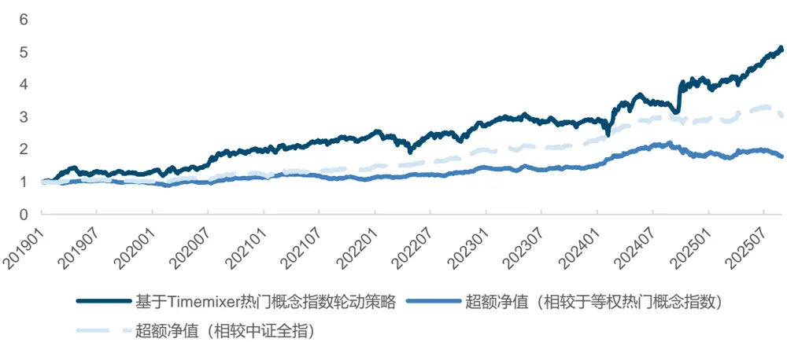
来源：Wind，国金证券研究所

从历史表现来看，所有年度相对于中证全指均实现了正向超额收益，特别是 2022 年实现了 35.64%的超额收益。2025 年以来（截至 8 月底），策略已累计创造 2.92%的超额收益。

图表24：TimeMixer热门概念指数轮动策略年度收益表现
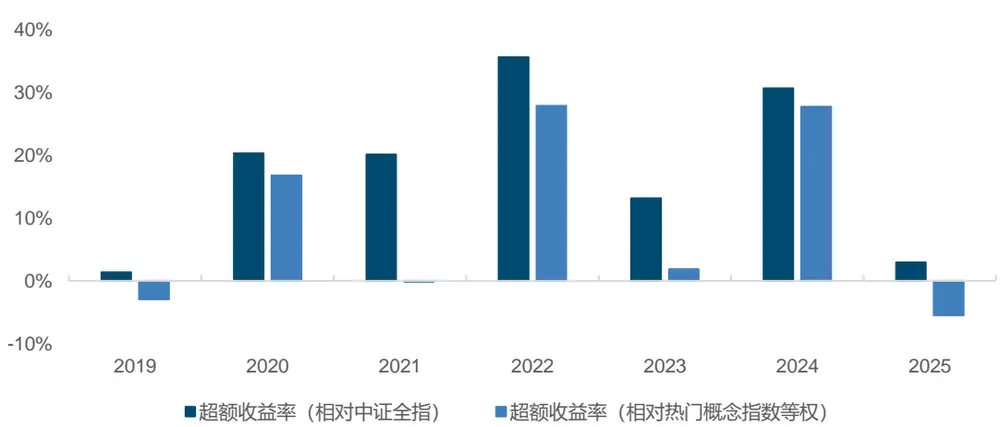
来源：Wind，国金证券研究所

从实际配置要求来看，如果要具体复现上述策略，2019—2025 年期间，平均需要配置约263 只股票。截至 2025 年 8 月 29 日，周度来看每周实际持有的股票数量均值约为301 只，每周持仓的股票数波动较大。

图表25：配置指数轮动策略实际需配置的股票数量
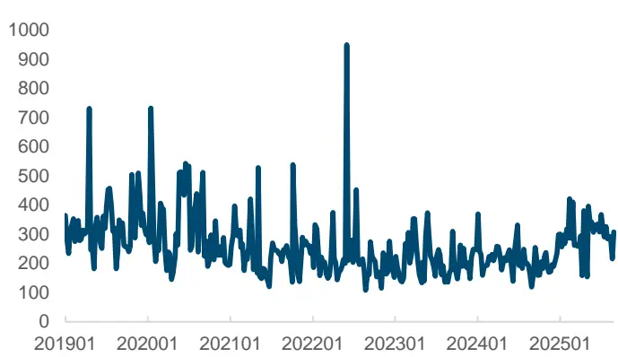
来源：Wind，国金证券研究所

图表26：配置指数轮动策略实际需配置的股票数量（年度平均）
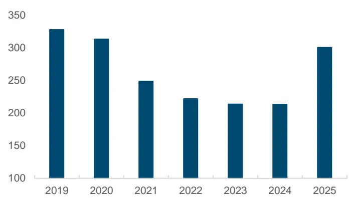
来源：Wind，国金证券研究所
注：数据统计范围为 2019年 1月 2日至 2025年 8月 29日
注：数据统计范围为 2019年 1月 2日至 2025年 8月 29日

## 三、基于热门概念指数轮动效应的选股策略构建

## 3.1 基于热点概念指数轮动效应的 Alpha 股票组合

尽管概念指数轮动策略的收益表现良好，但是所需持有的股票数量较多且变动频繁，实际可操作性有限。基于此，进一步从成分中筛选更具代表性的少量标的，以提升策略的可实施性。

基于周度策略的指数信号，我们在其成分股中按基于 TimeMixer 改进的机器学习模型Alpha因子排名选出前 20 只股票构建投资组合，手续费单边千分之一，策略相对于中证全指实现了费后 11.34%的年化超额收益，超额最大回撤为 22.87%，信息比率达到 0.79。

图表27：TimeMixer 热门概念指数选股策略表现

| 指标 | TimeMixer 热门概念选股策略 | 中证全指 |
| --- | --- | --- |
| 年化收益率 | 21.82% | 8.13% |
| 年化波动率 | 16.77% | 19.94% |
| Sharpe 比率 | 1.30 | 0.41 |
| 最大回撤率 | 24.19% | 39.33% |
| 年化超额收益率 | 11.34% |  |
| 跟踪误差 | 14.36% |  |
| 信息比率 | 0.79 |  |
| 超额最大回撤率 | 22.87% |  |
| 周度双边换手率 | 88.71% |  |

来源：Wind,国金证券研究所
注：数据统计范围为 2019年 1月 2日至 2025年 8月 29日

分年度来看，从 2019 年以来，截至 2025年 8 月29 日，大部分年度均实现稳定的正向超额收益，2023年实现了20.77%的超额收益。策略 2025年表现偏弱，截至8月底，策略累计创造-2.71%的超额收益。从表现上来看，策略相较于传统机器学习方法未有显著优势，没有取得预期成效。

图表28：TimeMixer 热门概念指数选股策略净值曲线
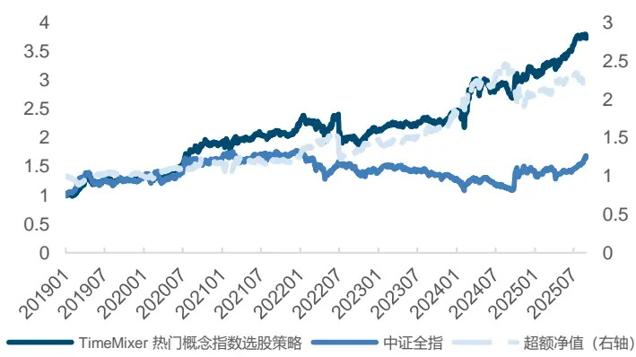
来源：Wind，国金证券研究所

图表29：TimeMixer 热门概念指数选股策略年度收益
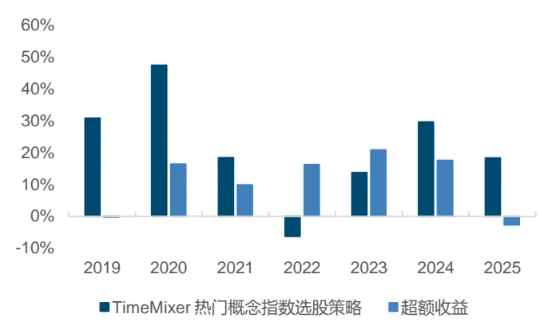
注：数据统计范围为 2019年 1月 2日至 2025年 8月 29日
来源：Wind，国金证券研究所
注：数据统计范围为 2019年 1月 2日至 2025年 8月 29日

## 3.2 基于热门概念指数轮动效应的龙头股组合构建

在热门概念板块内，指数成分股质量不一，既有真正具备技术壁垒和核心受益的 “真龙头”公司，也有基本面一般被过度炒作的“伪优质”公司。

因此，想要从概念指数组合中找出其中的核心标的至关重要。龙头企业通常在产业链中处于主导地位，市场份额高、定价权强，是行业的代表性资产，它们通常在产业链中处于主导地位，市场份额高、定价权强，是行业的代表性资产。此外，无论是政策扶持、券商研报覆盖，还是资金配置倾向，市场普遍会优先聚焦龙头股。龙头公司往往是最早受益、最能兑现业绩预期的一批企业。

最终，我们决定选择 FCF2EV(自由现金率因子)来帮助我们从概念组合里找出龙头公司，原因如下：

- 自由现金流率高的企业抗风险能力强，存在时间久：简单来说，自由现金流为经营现金流（OCF）扣除资本性净支出（CapEx），企业自由现金流是企业在支付完维持正常运营所需的各项运营和资本性支出之后，剩余的可供企业自由支配的现金。自由现金流率高的企业通常不用投入太多的资本支出即可稳定发展，抗风险能力强。

真实反应企业盈利能力与财务状况：相较于具有一定的主观性和可调节空间的净利润，自由现金流能够更真实地反映企业的盈利质量与资金状况。

图表30：自由现金流率因子解析

| 指标 | 符号 | 计算逻辑 |
| --- | --- | --- |
| 自由现金流率 | FCF2EV | 自由现金流与企业价值之比：FCF/EV |
| 自由现金流 | FCF | (1-t) * EBIT + 折旧摊销 - CapEx - 净运营变化 |
| 企业价值 | EV | 市值 + 总负债 - 货币资金 |

来源：Wind，东方财富网，中证指数有限公司，国金证券研究所

综上，我们在每周的概念指数构成的成分股组合里，挑选出自由现金流率最大的2只股票等权构建组合，基准为中证全指，手续费为单边千分之一，策略相较于中证全指年化超额收益为 20.63%，信息比率 1.61。

图表31：基于热门概念指数的龙头股组合策略表现

| 指标 | 热门概念指数龙头股策略 | Wind 热门概念指数等权 | 中证全指 |
| --- | --- | --- | --- |
| 年化收益率 | 30.27% | 16.11% | 8.13% |
| 年化波动率 | 12.82% | 24.15% | 19.94% |
| Sharpe 比率 | 1.61 | 0.67 | 0.41 |
| 最大回撤率 | 24.73% | 37.45% | 39.33% |
| 年化超额收益率（相对中证全指） | 20.63% |  |  |
| 年化超额收益率（相对热门概念等权） | 11.52% |  |  |
| 跟踪误差（相对中证全指） | 12.82% |  |  |
| 跟踪误差（相对热门概念等权） | 13.10% |  |  |
| 信息比率（相对中证全指） | 1.61 |  |  |
| 信息比率（相对热门概念等权） | 0.88 |  |  |
| 超额最大回撤（相对中证全指） | 21.65% |  |  |
| 超额最大回撤（相对热门概念等权） | 21.02% |  |  |

来源：Wind，国金证券研究所

自 2019 年以来，策略的实际持仓股票数量呈持续下降趋势，从 2019 年的 19.59 只下降至 2025 年（截至 8 月 29 日）的 14.6 只。策略在近几年更趋向于集中配置。

图表32：基于热门概念指数龙头组合持仓股票数（周度）
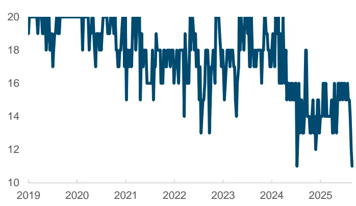
来源：Wind，国金证券研究所

图表33：基于热门概念指数龙头组合持仓股票数（年度平均)
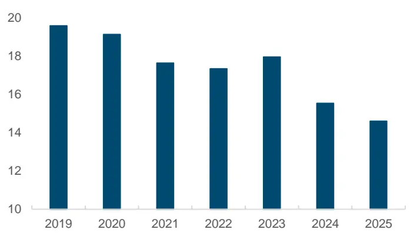
来源：Wind，国金证券研究所
注：数据统计范围为 2019年 1月 2日至 2025年 8月 29日
注：数据统计范围为 2019年 1月 2日至 2025年 8月 29日

分年度来看，2019至2025年所有年份均获得了正向超额。自由现金流率因子在成长大幅占优的年份（2019、2020 和 2025）年表现表现略弱，这也和自由现金流率偏向价值和大市值风格特征高度一致。截至 2025 年 8 月 29 日，2025 年组合取得 9.36%的年化超额收益。

图表34：热门概念龙头股票组合净值表现
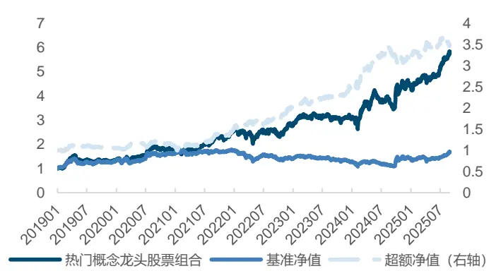
来源：Wind，国金证券研究所

图表35：热门概念龙头股票组合分年度表现
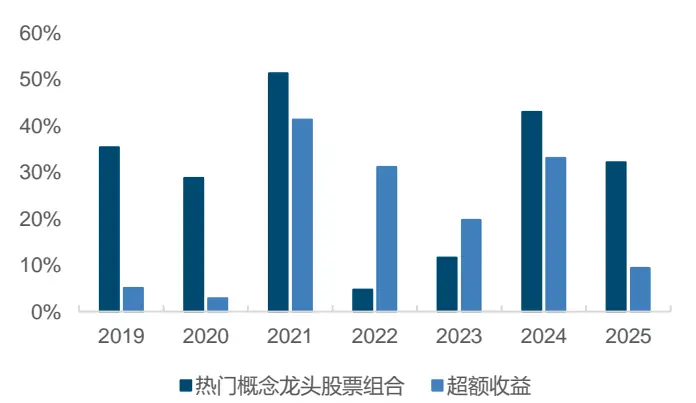
来源：Wind，国金证券研究所

## 四、总结

随着资本市场的快速发展，上市公司的业务结构愈发多元，仅依赖传统的行业或风格分类难以完整刻画企业的业务特征，信息损失也随之增加。在此背景下，市场对能够反映结构性趋势和阶段性主题的工具提出了更高需求，各类围绕热点事件、技术进步或产业链变化形成的“概念”逐渐受到关注。Wind热门概念指数基于客观量价评分，结合政策和产业等因素，从概念指数中主观确定的热门指数，具有领涨性和活跃性，编制时以主营相关性为核心，采用等权重方法进行加权。

基于 TimeMixer 机器学习选股模型，我们将个股 Alpha 信息聚合到 Wind 概念指数上，并构建指数轮动策略。基于 TimeMixer 的热门概念指数轮动策略相对于中证全指和 Wind 热门概念指数等权分别取得了费后 18.06%和 9.02%的年化超额收益率，相对于中证全指超额最大回撤仅为 9.97%，信息比率为 1.73。策略所有年度均相对中证全指实现正向超额收益。

此外，我们通过自由现金流率（FCF2EV）筛选热门概念指数中的核心标的，构建龙头股等权组合。自由现金流率更能反应企业真实的财务情况，指标高的企业抗风险能力强。分年度来看，组合在2019-2025所有年份均获得了正超额。自由现金流率因子在成长大幅占优的年份（2019、2020 和 2025）年表现表现略弱，这也和自由现金流率偏向价值和大市值风格特征高度一致。组合相较于中证全指年化超额收益为20.63%，信息比率1.61。

## 五、风险提示

1、以上结果通过历史数据统计和测算完成，在市场环境发生变化时模型存在失效的风险；

2、 策略通过一定的假设通过历史数据回测得到，当交易成本提高或其他条件改变时，可能导致策略收益下降甚至出现亏损。

3、策略历史收益不代表未来，需警惕资产未来业绩不及预期的风险。

## 特别声明：

国金证券股份有限公司经中国证券监督管理委员会批准，已具备证券投资咨询业务资格。

形式的复制、转发、转载、引用、修改、仿制、刊发，或以任何侵犯本公司版权的其他方式使用。经过书面授权的引用、刊发，需注明出处为“国金证券股份有限公司”，且不得对本报告进行任何有悖原意的删节和修改。

本报告的产生基于国金证券及其研究人员认为可信的公开资料或实地调研资料，但国金证券及其研究人员对这些信息的准确性和完整性不作任何保证。本报告反映撰写研究人员的不同设想、见解及分析方法，故本报告所载观点可能与其他类似研究报告的观点及市场实际情况不一致，国金证券不对使用本报告所包含的材料产生的任何直接或间接损失或与此有关的其他任何损失承担任何责任。且本报告中的资料、意见、预测均反映报告初次公开发布时的判断，在不作事先通知的情况下，可能会随时调整，亦可因使用不同假设和标准、采用不同观点和分析方法而与国金证券其它业务部门、单位或附属机构在制作类似的其他材料时所给出的意见不同或者相反。

本报告仅为参考之用，在任何地区均不应被视为买卖任何证券、金融工具的要约或要约邀请。本报告提及的任何证券或金融工具均可能含有重大的风险，可能不易变卖以及不适合所有投资者。本报告所提及的证券或金融工具的价格、价值及收益可能会受汇率影响而波动。过往的业绩并不能代表未来的表现。

客户应当考虑到国金证券存在可能影响本报告客观性的利益冲突，而不应视本报告为作出投资决策的唯一因素。证券研究报告是用于服务具备专业知识的投资者和投资顾问的专业产品，使用时必须经专业人士进行解读。国金证券建议获取报告人员应考虑本报告的任何意见或建议是否符合其特定状况，以及（若有必要）咨询独立投资顾问。报告本身、报告中的信息或所表达意见也不构成投资、法律、会计或税务的最终操作建议，国金证券不就报告中的内容对最终操作建议做出任何担保，在任何时候均不构成对任何人的个人推荐。

在法律允许的情况下，国金证券的关联机构可能会持有报告中涉及的公司所发行的证券并进行交易，并可能为这些公司正在提供或争取提供多种金融服务。

本报告并非意图发送、发布给在当地法律或监管规则下不允许向其发送、发布该研究报告的人员。国金证券并不因收件人收到本报告而视其为国金证券的客户。本报告对于收件人而言属高度机密，只有符合条件的收件人才能使用。根据《证券期货投资者适当性管理办法》，本报告仅供国金证券股份有限公司客户中风险评级高于 C3级(含 C3级）的投资者使用；本报告所包含的观点及建议并未考虑个别客户的特殊状况、目标或需要，不应被视为对特定客户关于特定证券或金融工具的建议或策略。对于本报告中提及的任何证券或金融工具，本报告的收件人须保持自身的独立判断。使用国金证券研究报告进行投资，遭受任何损失，国金证券不承担相关法律责任。

若国金证券以外的任何机构或个人发送本报告，则由该机构或个人为此发送行为承担全部责任。本报告不构成国金证券向发送本报告机构或个人的收件人提供投资建议，国金证券不为此承担任何责任。

此报告仅限于中国境内使用。国金证券版权所有，保留一切权利。

上海

电话：021-80234211

北京

电话：010-85950438

深圳

电话：0755-86695353

邮箱：researchsh@gjzq.com.cn

邮箱：researchbj@gjzq.com.cn

邮箱：researchsz@gjzq.com.cn

邮编：201204

邮编：100005

地址：上海浦东新区芳甸路 1088号

邮编：518000

地址：北京市东城区建内大街 26号

地址：深圳市福田区金田路 2028号皇岗商务中心

紫竹国际大厦 5楼

新闻大厦 8层南侧

18 楼 1806

【小程序】国金证券研究服务

【公众号】国金证券研究