证券研究报告

金融工程组

分析师：高智威(执业 S1130522110003)

gaozhiw@gjzq.com.cn

## 基于LLM的全天候财务逻辑因子挖掘框架

## LLM 因子挖掘框架设计与改进

本报告构建了一个 7×24小时自动化运行的具备相关性控制、融合成熟因子启发、配备自适应反馈机制的即插即用模块化LLM 因子挖掘框架。在先前研究基础上，框架进行了系统性优化：通过改进的MMR筛选机制自适应控制因子间的相关性，不仅关注截面相关性，还引入时序相关性评估，同时将Barra风险因子纳入相关性计算体系，从早期挖掘阶段就有效规避系统性风险暴露。借助成熟因子库的 RAG启发方式，在因子生成过程中兼顾实用性与创造性。通过改进过程中的 idea 提取，在提示设计中引入显式反馈机制，使因子迭代路径更加清晰可控。此外，严格限定因子挖掘仅基于 2010 年至 2019 年共 10 年的历史数据进行分析与筛选，仅在因子入库阶段对 2020 年至 2025 年 4 月的样本外数据进行验证，有效避免信息泄露。同时在Prompt设计中新增量纲一致性约束机制，确保输出结果不仅数学形式正确，更具备合理的金融逻辑与可解释性。

## 日频量价与基本面因子具体设计

在新的 7×24 小时LLM因子挖掘框架设计中，引入了双层循环机制以优化因子挖掘流程。内层循环专注于对少量候选因子进行并行化挖掘与初步筛选，从中提取在训练期内表现相对优异的因子。外层循环则在此基础上，进一步对这些初选因子进行收益能力评估与相关性控制，确保其与已有因子库在风险暴露和收益来源上保持互补。考虑到基本面数据在频率、结构和经济含义上的特殊性，专门设计了一套适配该领域特性的运算符库，并对 Prompt 模板进行了针对性扩充与重构。基本面因子算子体系主要包含四个核心类别：一元算子、二元算子、截面滚动算子和价值因子算子。为确保因子表达式的正确性和可执行性，特别设计了专用的表达式修正器。修正器通过语法树解析与类型推断机制，能够自动识别并校正因子表达式中函数误用及数据结构不匹配等问题。其核心处理逻辑包括对一元、二元、截面滚动与价值因子四类运算符进行分类调度与参数校验，根据输入因子的类别自动注入相应截止日期字段以对齐时序，并通过模糊匹配技术提升因子名与运算符的容错识别能力，从而大幅提升因子生成的成功率和质量。

## LLM 挖掘因子效果实践

从统计数据来看，LLM 挖掘的因子表现优异。三个量价因子的 IC 均值分别达到-0.09、0.06 和-0.11，风险调整后的IC 分别为-1.04、0.73 和-0.77，多头年化超额收益率分别为 22.60%、23.91%和 33.60%。多空净值曲线走势平稳上升，分组表现呈现明显的分层趋势，验证了因子的有效性。在基本面因子方面，同样筛选出表现优异的因子因子的多头年化超额收益率分别达到 18.82%和4.36%，多空净值曲线表现良好。在改进机制验证方面，通过具体案例充分说明了RAG启发改进和反思改进机制的有效性。在RAG改进案例中，借鉴了成熟因子的构型，通过引入指标对比结构改进了原有因子，没有像遗传规划那样粗暴替换从而破坏原有因子的可解释性，而是融合了启发思想，体现了LLM的先进性。在反思改进案例中，原因子借助匹配的 idea进行提升，改进后的因子IC均值从-0.63%提升到 4.17%，多头年化超额收益率从 4.24%提升到10.09%，效果显著。最终，对 LLM挖掘的量价因子和基本面因子分别进行合成，量价因子合成后IC均值达到 0.13，多头年化超额收益率 17.40%；基本面因子合成后 IC均值0.02，多头年化超额收益率 8.96%。

## 风险提示

1、以上结果通过历史数据统计、建模和测算完成，在政策、市场环境发生变化时模型存在时效的风险。

2、策略通过一定的假设通过历史数据回测得到，当交易成本提高或其他条件改变时，可能导致策略收益下降甚至出现亏损。

## 一、LLM因子挖掘框架设计与改进

## 1.1LLM 因子挖掘背景与框架设计

因子挖掘是量化投资策略的核心环节之一。传统的人工构造因子方法主要依赖金融专家凭借丰富的经验和专业知识来构建基础因子库，例如市盈率、动量指标等。这些因子因其与市场逻辑和基本面分析的紧密联系，具有很强的业务可解释性，能够为投资者提供直观且易于理解的决策依据。然而，这种方法也存在明显的局限性。首先，开发效率较低，因为依赖专家经验意味着需要大量的时间和精力来设计和验证每个因子。其次，因子空间的覆盖范围有限，专家的经验和知识往往局限于特定的领域或市场环境，难以全面探索所有可能的因子组合。因此，随着市场复杂性的增加和数据量的爆发式增长，传统的人工方法逐渐难以满足现代投资策略的需求，引入自动化因子挖掘方法成为必然选择。

当前，主流的自动化因子挖掘方法以遗传规划（Genetic Programming）为代表。遗传规划是一种基于演化算法的技术，通过模拟自然选择的过程，探索数学表达式的组合，以生成潜在的因子。这种方法突破了传统人工设计的边界，能够在更广阔的搜索空间中发现新的因子组合。此外也有一些更新的机器学习因子挖掘框架如《Alpha掘金系列之十五：基于OpenFE 框架的机器学习Level2高频特征挖掘方法》中提到的 OpenFE方法，采用了一种创新的“先扩张后缩减”流程，批量生成高频因子。在扩张阶段，OpenFE利用多种算子（如Mask、聚合函数等）生成大量基础特征组合。在缩减阶段，通过连续二分法和特征重要性归因筛选有效特征，在指增策略中取得了显著成效，充分展示了机器学习在因子挖掘领域的巨大潜力和发展空间。

尽管自动化因子挖掘方法已经取得了显著进展，但它们仍然面临着一个核心痛点：挖掘出的因子在原生状态下往往缺乏可解释性。这种不可解释性使得我们在后续利用这些因子时信心不足，尤其是在涉及复杂投资决策时，因子的透明度和逻辑性至关重要。

然而，随着大模型技术的飞速发展，其展现出的智慧涌现能力为我们提供了一种全新的思路。大模型能够通过其强大的语言生成和逻辑推理能力，直接生成具有可解释性的因子表达式。这种方法不仅能够提升因子的透明度，还能帮助投资者更好地理解因子背后的逻辑，从而增强对因子的信任度。

图表1：LLM因子挖掘的必要性
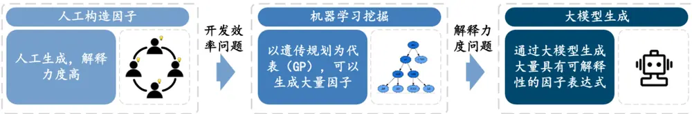
来源：国金证券研究所

目前，基于大模型生成可解释因子的策略已经取得了一些初步的研究成果。然而，这些研究在提升因子可解释性的同时，也暴露出了一些亟待解决的问题：

1）因子挖掘过程中缺乏对因子相关性的控制。这导致最终生成的因子之间相关性过高，使得因子合成后的效果提升并不明显。在实际应用中，因子之间的低相关性是实现多样化投资和有效风险分散的关键，而高相关性因子则可能削弱策略的稳定性和收益潜力。

2）当前的研究有些完全依赖随机生成和优化，有些与现有因子集深度绑定。这种做法在创造性和成功经验之间缺乏合理的平衡。完全随机生成可能导致因子的实用性和有效性不足，而与现有因子集过度绑定则可能限制因子的创新性和多样性。理想的方法应该在保持一定灵活性的同时，借鉴已有的成功经验，以实现更好的因子挖掘效果。

3）许多研究缺乏有效的反馈机制，或者仅依赖单一的正反馈或负反馈。这种单向的反馈机制无法充分利用因子改进过程中的成功和失败经验。有效的反馈机制应该能够根据因子的表现动态调整挖掘策略，从而不断优化因子的质量和性能。

4）当前的模型结构相对固定，灵活性不够。这使得在利用模型功能或添加新功能时变得较为复杂。在实际应用中，模型的灵活性和可扩展性至关重要，因为市场环境和投资需求是不断变化的。一个能够灵活调整和扩展的模型将更具适应性和实用性。

综上所述，尽管大模型在生成可解释因子方面展现出巨大潜力，但在实际应用中仍需解决诸多问题，以充分发挥其优势并推动因子挖掘技术的进一步发展。我们的目标是构建一个7×24 小时自动化运行的具备相关性控制、融合成熟因子启发、配备自适应反馈机制的即插即用模块化 LLM 因子挖掘框架。

图表2：即插即用LLM因子挖掘初级框架图
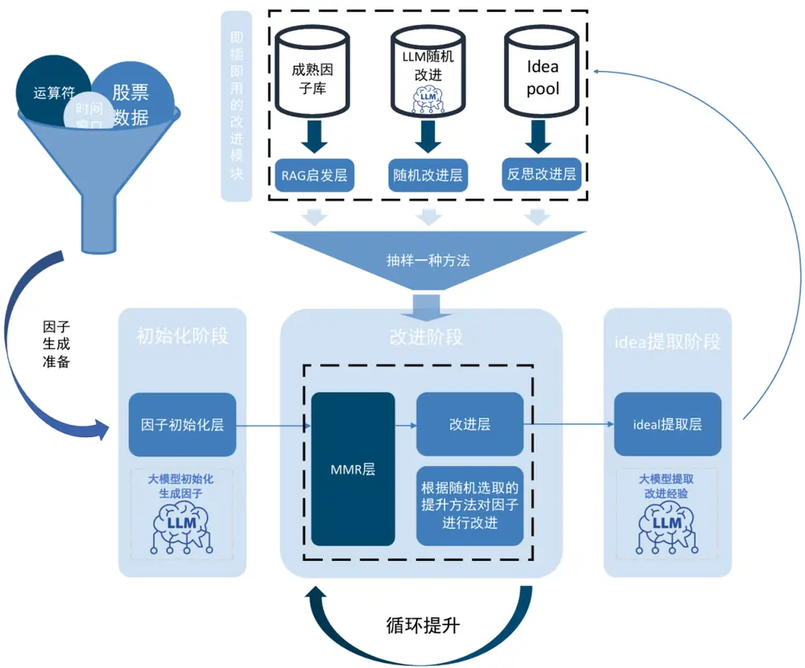
来源：国金证券研究所

## 1.2LLM 因子挖掘框架的改进

为了解决上述挑战，我们在此前的《Alpha 掘金之十七：即插即用 LLM 因子挖掘：MMR、RAG与自反馈机制》报告中，对 LLM 因子挖掘框架进行了系统性优化设计：通过MMR筛选机制自适应控制因子间的相关性，有效提升因子组合的区分能力；借助成熟因子库的 RAG启发方式，在因子生成过程中兼顾实用性与创造性衡；同时，通过改进过程中的 idea 提取，在提示设计中引入显式反馈机制，使因子迭代路径更加清晰可控，从而整体提升因子挖掘的效率和效果。

此前，我们通过 MMR（Maximal Marginal Relevance）控制因子之间的相关性：

$$
MMR(f_{i})=\lambda\cdot IC(f_{i})-(1-\lambda)\cdot max_{f_{j}\in S}Rel\big(f_{i},f_{j}\big)
$$

然而，在先前基于 MMR的因子相关性控制中，我们意识到原有 Rel函数的设计存在两点不足：一是仅关注截面相关性，而忽略了因子在时序维度上的相关性，导致新因子带来的增量收益难以保障；二是仅聚焦于挖掘因子内部的相关性，而未充分考虑其与常见风格因子及Barra 风险因子之间的外部关联，致使整体组合可能在低流动性与低波动率等风险信号上过度暴露。为弥补上述缺陷，我们重新设计了 MMR计算方法——在保留截面相关性控制的基础上，引入时序相关性评估机制，确保新因子具备持续稳定的增益能力；同时，将Barra 风险因子纳入相关性计算体系，从而在早期挖掘阶段就有效规避系统性风险暴露，提升因子的实用性与组合安全性。

$$
MMR(f_{i})=\lambda\cdot IC(f_{i})-(1-\lambda)\cdot max_{f_{j}\in S_{s}\cup S_{m}}(\alpha\cdot Rel_{cs}{\left(f_{i},f_{j}\right)}+(1-\alpha)\cdot Rel_{ts}{\left(f_{i},f_{j}\right)})
$$

在样本内检验环节，先前版本因考虑到 LLM挖掘因子具备较强的可解释性，采用了全样本内挖掘方式。然而，这种做法实际上仍会部分暴露未来信息，导致因子在样本外期间的表现难以得到有效保证。为解决这一问题，我们在本篇报告中优化了检验流程：严格限定因子挖掘仅基于 2010年至 2019 年共 10 年的历史数据进行分析与筛选，最终仅在因子入库阶段，才对 2020年1 月 1 日至 2025 年 4 月 30 日的样本外数据进行验证，并依据预设的IC 值与多头超额收益阈值决定是否纳入因子库，从而有效避免信息泄露，增强因子在真实交易场景下的稳健性与可移植性。

在因子生成过程中，我们发现部分表达式存在明显的量纲不匹配问题，例如将较大的复权价格数值与变化率等无量纲量直接相减，导致公式在经济和统计意义上均难以解释。为从根本上解决这一问题，我们在 Prompt 设计中新增了量纲一致性约束机制，明确要求模型在生成数学公式时必须保持左右两侧量纲匹配，从而确保输出结果不仅数学形式正确，更具备合理的金融逻辑与可解释性。

## 二、日频量价与基本面因子具体设计

在新的 7×24LLM 因子挖掘框架设计中，我们引入了双层循环机制以优化因子挖掘流程：内层循环专注于对少量候选因子进行并行化挖掘与初步筛选，从中提取在训练期内表现相对优异的因子；外层循环则在此基础上，进一步对这些初选因子进行收益能力评估与相关性控制，确保其与已有因子库在风险暴露和收益来源上保持互补。

图表3：7x24h LLM 因子挖掘新框架
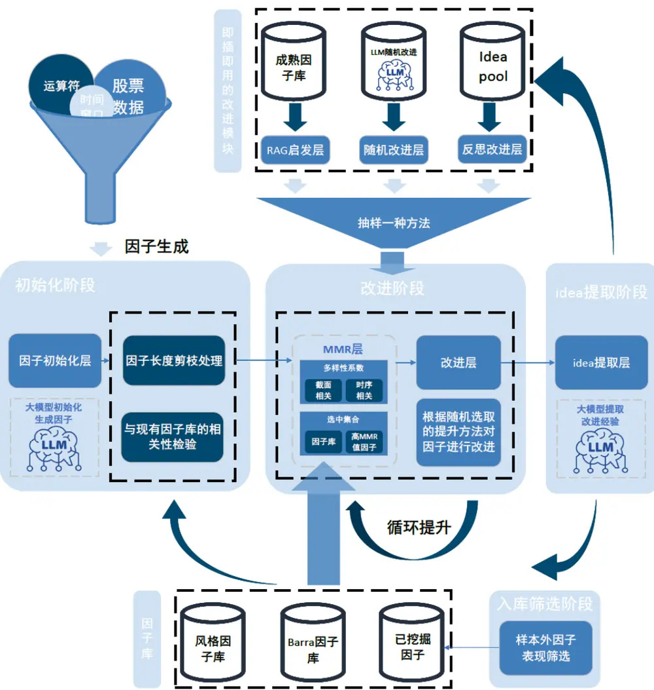
来源：国金证券研究所

考虑到基本面数据在频率、结构和经济含义上的特殊性，我们专门设计了一套适配该领域特性的运算符库。在此基础上，我们对 Prompt 模板进行了针对性扩充与重构，使其能够有效引导 LLM调用这些专用工具，生成既符合量纲要求、又具备扎实经济学逻辑的基本面因子表达式。

## 图表4：基本面因子初始化 Prompt

## 因子初始化prompt

忘掉你之前的所有记忆，你现在是A股头部的公募基金的量化投资总监，专注长期价值投资，擅长从原始基本面字段中挖掘基本面因子。请基于以下内容进行因子构建，并对因子进行解释：

## # 1. 输入内容

可用运算符：简单一元运算符{unary_operators}、二元运算符{dyadic_operators}、报表滚动函数

对于时间窗的选定：截面滚动函数和报表滚动函数需要额外的时间窗参数，注意时间窗口不能出现负数

1. 截面滚动函数的时间窗：局限于{cross_sectional_window]，单位为交易日

2. 报表滚动函数的时间窗：分两类，如果函数以mom命名则局限于{mom window，单位是季度。如果函数以yoy命名则局限于{yoy window，单位是年。simple forward fill算子不需要时间窗。

## # 2. 因子表达式要求

1. 请先理解以上算子和字段的全部含义，其中字段含义请按照wind数据库中含义理解。

2. 运算符的调用必须遵循前述规则，运算符的作用对象如果是表达式嵌套，则须穿透检查表示式类型。需要检查左括号和右括号的个数是否一致。

3. 因子之间需要保持较低相关性，不要重复使用某个或某几个指标。

4. 请生成基本面因子，避免构建只用价格和市值的量价因子。

5. 【非常重要！！！】因子尽量不要过于复杂，使用的运算符请保持在5个以内。

## #3.分析要求

请从以下四个维度进行结构化分析，需要从这个因子中提取alphaidea，分析该因子背后的经济学原理和市场假设。每个维度的解释需要深入且专业，避免泛泛而谈。请银据以下四个维度进行分析：

1. 经济学假设(Economic Hypothesis)：该基本面因子背后的经济学假设和原理

2. 市场无效性(Market Inefficiency)：该基本面因子试图捕捉的市场无效性和异常

3. 行为偏见(Behavioral Bias)：与该因子相关的投资者行为偏见

4. 收益传导路径(Revenue Transmission Path)：[公司基本面]->[估值变化]->[收益形成]的完整作用链条分析

请确保每个维度的分析，但是最终输出必须只能是一段对因子的解释。同时需要注意的是，在生成因子时，尽量避免使用绝对指标，优先用相对指标，否则对市值风险会有过多暴露

## # 4. 输出格式要求（必须严格遵循）

expression：<生成的因子表达式，因子表达式用<>包起来>

## explanation:(

基于分析要求中的四个分析维度生成一段因子解释，请用最简单直白的语言解释这个因子的运作原理，让非专业人士也能理解，100字以内。）

注意，不要添加任何其他内容或解释。

## 来源：国金证券研究所

## 图表5：量价因子改进Prompt

## 因子改进prompt

忘掉你之前的所有记忆，你现在是一位A股顶尖量化基金的首席研究员，请对以下因子进行优化，提高其IC、ICIR、sharpe和excessreturn:

## # 1. 现有因子信息

因子表达式：{factor_expression}

经济假设：{economic_hypothesis}

Rank IC: {rank_ic}

ICIR: {icir}

long excess return: {long_excret}

long sharpe: {long_sharpe}

long ir: {long_ir}

long excess max drawdown: {long_excmdd}

## # 2. 可用资源

可用字段：现在你可用的字段包含这些{fields}

可用运算符：现在你可用的字段包含这些{ops}，其中键为算子，值为算子需要的输入

可用时间窗：对于需要时间窗的因子，时间窗只局限于这些{window}，注意时间窗口不能出现负数

## # 3. 优化要求

1. 只使用提供的运算符，确保调用方法正确。

2. 从市场规则和经济逻辑出发进行优化。

## #4.分析要求

请从以下三个维度提供结构化分析，使得因子的经济逻辑清晰可见，避免泛泛而谈。请根据以下三个维度进行分析：

1. Optimization Strategy：阐述该因子优化的理论逻辑是什么，解释为什么从理论上这种关系应该存在。

2. AlphaIdea：基于上述经济逻辑，解释为什么这个因子优化以后能够更好地超额收益机会，并阐释这个因子的构成逻辑，解释要详细。

3. FactorInterpretation：详细解释因子表达式的的算子和字段的组合是用来反映什么特征以及它们如何共同作用捕捉A股市场特征。请确保每个维度的分析，但是最终输出必须只能是一段对因子的解释

## # 5. 输出格式要求（必须严格遵循）

expression：<生成的因子表达式，因子表达式用<>包起来>

explanation：(基于这些分析维度生成一段因子解释，请用最简单直白的语言解释这个因子的运作原理，让非专业人士也能理解，100字以内）不要添加任何其他内容或解释。

来源：国金证券研究所

## 图表6：量价因子 Idea 提取 Prompt

## Idea提取prompt

你现在是一位A股顶尖量化基金的因子优化专家，请分析下面的因子优化案例，总结提取可复用的优化思路和技巧。

## # 1. 优化前的因子

因子表达式：{original_factor_expression}

因子解释：{original_explantion}

## 因子表现：

- Rank IC: {original_rank_ic}

- Sharpe: {original_sharpe}

- Excess Return: {original_excess_return}

## #2. 优化后的因子

因子表达式：{optimized_factor_expression}

提升解释：{optimized_explantion}

## # 3. 可用资源信息

可用字段：{fields}

可用运算符：{ops}

可用时间窗：{window}

## # 4. 分析要求

请深入分析这个因子提升案例，如果因子的表现得到提升，那么要识别出因子提升的关键操作；如果因子的表现没有得到提升，那么要识别出因子之前为什么表现更好。具体需要提取以下内容：

1. 核心优化手段：识别从原因子到优化因子的关键变化，如特征选择、窗口调整、函数变换等

2. 优化逻辑：分析为什么这些变化能够提升因子性能，背后的市场或统计原理是什么

3. 泛化：思考这种优化方式的通用性，总结出如何泛化这一思路

## # 5. 输出格式

基于这些分析维度生成因子优化idea的提取，要求解释需要让人看得越明白越好，请用最简单直白的语言解释，避免使用过于复杂的逻辑和想法，100字以内

## 来源：国金证券研究所

## 图表7：基本面因子初始化 Prompt

## 因子初始化prompt

alpha_gen_template = """

忘掉你之前的所有记忆，你现在是A股头部的公募基金的量化投资总监，专注长期价值投资，擅长从原始基本面字段中挖掘基本面因子。请基于以下内容进行因子构建，并对因子进行解释：

## #1. 输入内容

可用字段：截面字段和基本面字段

可用运算符：简单一元运算符{unary_operators}、二元运算符{dyadic_operators}、报表滚动函数{value_factor_operators}和截面滚动函数 {cross sectional rolling operators}

对于时间窗的选定：截面滚动函数和报表滚动函数需要额外的时间窗参数，注意时间窗口不能出现负数

1. 截面滚动函数的时间窗：局限于{cross_sectional_window}，单位为交易日

2. 报表滚动函数的时间窗：分两类，如果函数以mom命名则局限于{mom window}，单位是季度。如果函数以yoy命名则局限于{yoy window}，单位是年。simple forward fill算子不需要时间窗。

## # 2.因子表达式要求

1. 请先理解以上算子和字段的全部含义，其中字段含义请按照wind数据库中含义理解。

2. 运算符的调用必须遵循前述规则，运算符的作用对象如果是表达式嵌套，则须穿透检查表示式类型。需要检查左括号和右括号的个数是否一致。

3. 因子之间需要保持较低相关性，不要重复使用某个或某几个指标。

4. 请生成基本面因子，避免构建只用价格和市值的量价因子。

5. 【非常重要！！！】因子尽量不要过于复杂，使用的运算符请保持在5个以内。

## #3. 分析要求

请从以下四个维度进行结构化分析，需要从这个因子中提取alpha idea，分析该因子背后的经济学原理和市场假设。每个维度的解释需要深入且专业，避免泛泛而谈。请根据以下四个维度进行分析：

1. 经济学假设(Economic Hypothesis)：该基本面因子背后的经济学假设和原理

2. 市场无效性(Market Inefficiency)：该基本面因子试图捕捉的市场无效性和异常

3. 行为偏见(Behavioral Bias)：与该因子相关的投资者行为偏见

4. 收益传导路径(Revenue Transmission Path)：[公司基本面]->[估值变化]->[收益形成]的完整作用链条分析

请确保每个维度的分析，但是最终输出必须只能是一段对因子的解释。同时需要注意的是，在生成因子时，尽量避免使用绝对指标，优先用相对指标，否则对市值风险会有过多暴露

## # 4. 输出格式要求（必须严格遵循）

expression：<生成的因子表达式，因子表达式用<>包起来>

explanation: (

基于分析要求中的四个分析维度生成一段因子解释，请用最简单直白的语言解释这个因子的运作原理，让非专业人士也能理解，100字以内。)

注意，不要添加任何其他内容或解释。

## 来源：国金证券研究所

具体而言，我们加入了截面标准化算子来处理量纲问题。在传统的因子处理流程中，由于不同因子的量纲（单位）和数值范围存在巨大差异，直接进行合成或比较会导致结果偏向量级较大的因子，引入偏差。为解决这一问题，我们实现了一系列截面标准化算子。这些算子对每个截面上（即同一时间点、不同股票之间）的因子值进行处理，消除量纲影响，使得因子值在同一截面上具有可比性，并满足后续模型（如排序、加权或回归）的输入要求。

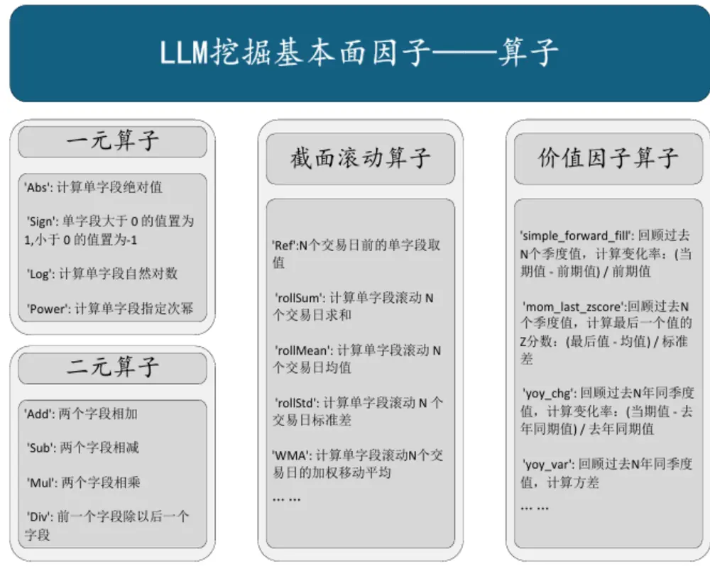
图表9：基本面因子算子设计
来源：国金证券研究所

图表8：截面标准化算子示例

| 类型 | 算子 | 释义 |
| --- | --- | --- |
| 截面标准化算子 | _compute_cs_rank | 计算截面排名 |
|  | _compute_cs_normalize | 计算截面 Min-Max 归一化 |
|  | _compute_cs_zscore | 计算截面 Z-Score |
|  | . | … |

来源：国金证券研究所

此外，我们为基本面因子挖掘专门设计的算子体系主要包含四个核心类别：一元算子负责对单列时序数据进行变换，二元算子处理多列数据间的交叉运算，截面滚动算子用于于计算股票滚动特征，价值因子算子封装了我们特别设计的价值评估逻辑。

考虑到基本面因子所依赖的字段数据结构复杂、来源多样，我们特别设计了专用的表达式修正器，通过语法树解析与类型推断机制，能够自动识别并校正因子表达式中函数误用及数据结构不匹配等问题。其核心处理逻辑包括：对一元、二元、截面滚动与价值因子四类运算符进行分类调度与参数校验；根据输入因子的类别（如现金流、资产、利润表等）自动注入相应截止日期字段以对齐时序；并通过模糊匹配技术提升因子名与运算符的容错识别能力。

图表10：基本面因子表达式修正器
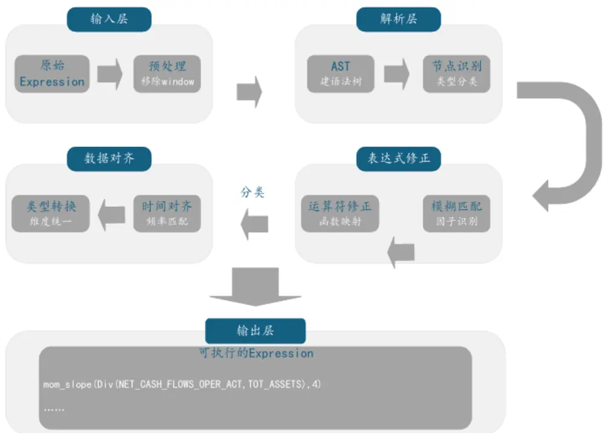
来源：国金证券研究所

在上述准备的基础上，我们引入了一个高效的多槽位并行生成因子机制，将先前的串行因子挖掘流程转变为多线程并行处理模式。启动时创建多个独立的因子槽位，每个槽位都作为一个完整的因子生产单元，按照“生成-优化-评估”的完整生命周期自主运行。这些槽位同时工作但又互不干扰，每个槽位内部都加载了所需的数据副本，避免了并发读写冲突，能够持续不断地挖掘新的因子。

系统通过共享因子库和优化经验池实现槽位间的知识协同。所有槽位共享同一个因子库管理器，入库操作通过锁机制保证线程安全；优化过程中积累的成功经验会安全地更新到共享的idea pool中，为后续优化提供参考。这项设计保证了并行效率，且实现了经验共享，使得系统能够持续稳定地生产高质量、低相关的量化因子，提升了因子挖掘的产出效率。

图表11：多槽位生成框架
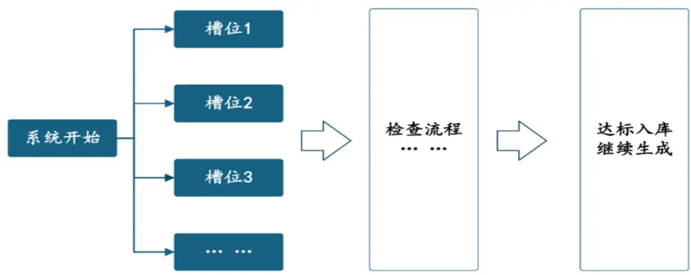
来源：国金证券研究所

## 三、LLM 挖掘因子效果实践

我们基于全新的 7x24 小时因子挖掘框架，筛选出若干表现优异的量价因子，其构建逻辑清晰、收益特征显著。以下三个因子为例，可以发现，这些因子的表达式与大语言模型自身对因子逻辑的解释高度一致，二者能够完全对应，验证了模型在理解市场规律和构建因子逻辑方面具备可靠的能力。

图表12：LLM自动化挖掘量价因子举例

| 编号 | 公式 | LLM 解释 |
| --- | --- | --- |
|  | EMA(Slope(close,5) * | 这个因子用5天的价格爬坡速度乘以量价联动强度，再乘以成交量的增速。就像同时 |
|  |  | 因子1 Cov(close,volume,5)/Var(close,5)* 看股价越涨越快、成交量越放越大且量价配合紧密的股票，用近期数据抓主力资金正 |
| 因子2 | Slope (volume, 5),5) | 在发力的票。EMA平滑让信号更稳定。 该因子通过计算股价突破5日高点幅度占价格波动范围的比例，结合成交量放大程 |
|  | (close − Max(high,5))/ |  |
|  | (Max(high,5) − Min(low,5))* | 度，捕捉突破关键阻力位且资金共识强的股票。当价格带量突破时，该因子会给出强 |
|  | EMA (volume, 5) Mean(volume,20) * (Max(high,5) - | 烈买入信号。 这个因子用20天平均成交量放大股价最近5天的波动幅度，再除以股价与均价的相 |
| 因子3 | Min(low,5)) / (Corr(close, vwap, 10) + 2) | 关性强弱。当股价剧烈波动但成交量放大且与均价脱钩时，预示短期趋势可能反转， 因为异常波动缺乏均价支撑难以持续。因子值越低，反转概率越高。 |

来源：Wind，国金证券研究所

这些因子的表现也较好，有明显的超额收益。

图表13：LLM自动化挖掘量价因子统计数据

|  | t统计量 |  |  | 多头年化 | 多头 率 | 多头信息 比率 | 多头超额 | 收益率 | 多空年化 多空波动 率 | 多空 Sharpe 比 | 多空最大 回撤 率 |  |
| --- | --- | --- | --- | --- | --- | --- | --- | --- | --- | --- | --- | --- |
|  | IC 均值 | 风险调整 的IC | 超额收益 Sharpe 比 率 |  |  |  |  |  |  |  |  | 最大回撤 |
| 因子1 | -0.09 | -1.04 | -16.67 | 22.60% | 1.35 | 4.74 | 6.93% | 65.64% | 0.11 | 6.07 | 12.21% |  |
| 因子2 | 0.06 | 0.73 | 11.78 | 23.91% | 1.57 | 3.63 | 13.22% | 58.84% | 0.11 | 5.27 | 9.44% |  |
| 因子3 | -0.11 | -0.77 | -12.41 | 33.60% | 2.04 | 3.91 | 9.52% | 79.83% | 0.19 | 4.27 | 19.51% |  |

来源：Wind，国金证券研究所

因子3的多空净值走势非常好，因子 1和2的走势也比较平稳；三个单因子的分组表现也比较好，有明显分层趋势。

图表14：LLM自动化挖掘量价因子多空净值曲线
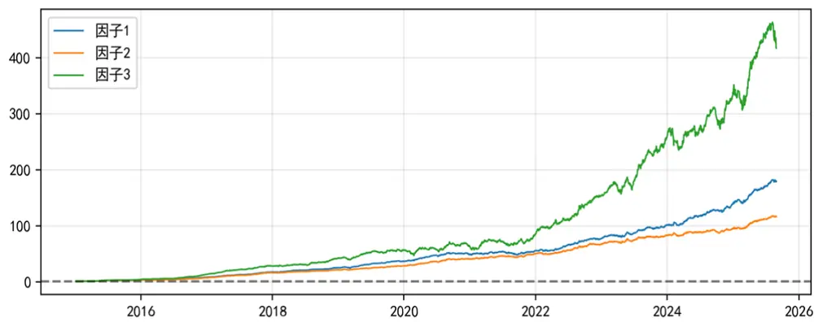
来源：Wind，国金证券研究所

图表15：LLM自动化挖掘量价因子分组超额收益率
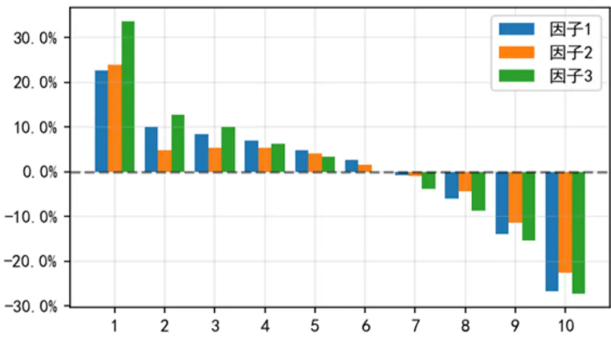
来源：Wind，国金证券研究所

此外，我们也筛选出若干表现优异的基本面因子，以下两个因子为例，同样有较好的超额收益。

图表16：LLM自动化挖掘基本面因子举例

## LLM 解释

|  | 因子 1 Value)，yoy_mean(Div(CASH_RECP_SG_AND_RS，CASH_P 与采购支出比率的两年平均趋势。高现金流和持续优化现金效率的公司 AY_GOODS_PURCH_SERV_REC),2))),MarketValue) | Div(Log(MuI(Div(NET_CASH_FLOWS_OPER_ACT，Market 这个因子通过计算企业每元市值产生的经营净现金流，并结合销售现金 往往被市场低估，后续更容易获得估值修复。 |
| --- | --- | --- |
| 因子2 | yoy_chg(Div(Net_Profit_Excl_Min_Int_Inc, Tot_Cur_Liab),1) | 该因子衡量企业净利润与流动负债比率相较去年同期的增长率。当公司 盈利增速持续高于短期债务增速时，表明其经营效率提升且财务风险降 低，这种基本面的边际改善往往会被市场延迟定价，形成超额收益空 间。 |

来源：Wind，国金证券研究所

图表17：LLM自动化挖掘基本面因子统计数据

|  | IC 均值 | 风险调整 的IC | t统计量 | 多头年化 率 | 多头 超额收益 Sharpe 比 率 | 多头信息 | 多头超额 | 多空年化 多空波动 收益率 | 率 | 多空 Sharpe 比 率 | 多空最大 回撤 |  |
| --- | --- | --- | --- | --- | --- | --- | --- | --- | --- | --- | --- | --- |
|  |  |  |  |  |  |  |  |  |  |  |  | 比率 最大回撤 |
| 因子1 | 0.03 | 0.19 | 2.99 | 18.82% | 0.96 | 1.82 | 20.46% | 26.48% | 0.18 | 1.50 | 35.68% |  |
| 因子2 | 0.02 | 0.28 | 4.49 | 4.36% | 0.45 | 1.17 | 10.21% | 10.74% | 0.07 | 1.48 | 17.67% |  |

来源：Wind，国金证券研究所

因子1的多空净值走势非常好，因子 1的走势也比较平稳；两个单因子的分组表现也比较好，有明显分层趋势。

图表18：LLM自动化挖掘基本面因子多空净值曲线
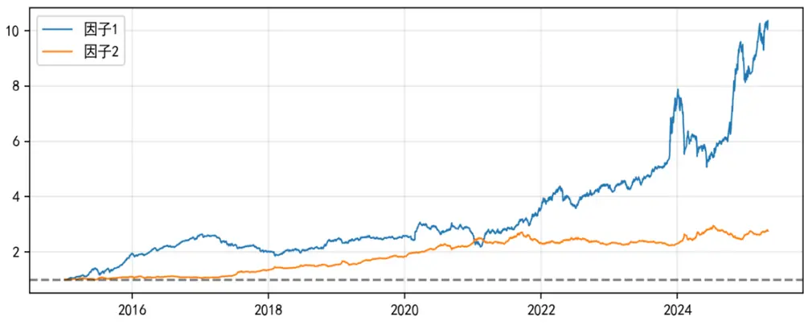
来源：Wind，国金证券研究所

图表19：LLM自动化挖掘基本面因子分组超额收益率
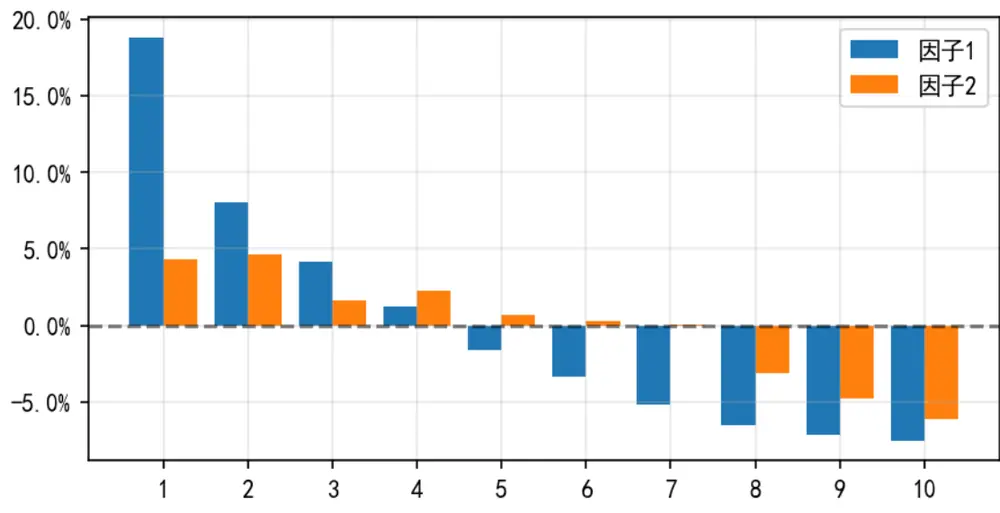
来源：Wind，国金证券研究所

在第三轮Alpha158 RAG启发改进模块中，我们挑选了一个案例，以说明 RAG改进的有效性，同时，也通过 DeepSeek 灵活运用结构改进而非类似遗传规划粗暴替代说明了 LLM 的先进性。

图表20：LLM因子挖掘相对遗传规划的先进性

| 原因子 |  |  |  |  |
| --- | --- | --- | --- | --- |
| 因子公式 | Log (Mean (Delta (close, 5), 10) | / Med(close, 20)) | 改进后因子 *Log (Mean (Delta(close,5), 10) / | Med(close, 60)) * |
|  | Corr(volume, vwap, 30) |  | (Corr (volume, vwap, 30) – Corr(volume, vwap,10)) |  |
| RAG | Mean(close>Ref(close, 1), 20) – Mean(close<Ref(close, 1), 20) |  |  |  |
| LLM 解释 | 该因子将 5日收盘价变化的10日均值除以20日中位价的通过比较5日价格波动的10日均值与60日中位价的比例，衡量 |  |  |  |
|  |  |  | 对数波动，乘以成交量与均价30日相关性，捕捉价格动量股价中期动能与长期估值偏离度，再叠加量价相关性长短期差 |  |
|  | 多，无序波动伴随量价背离时反向操作。 |  | 与资金流共振效应。当价格有序突破伴随量价同向时做值，捕捉资金流向加速信号。当股价突破估值中枢且资金流入加 |  |
| 人工分析 | RAG 的因子构型为 Mean(条件 A，60) - Mean(条件 B，60)，而提升的因子出来 med 拉长时间线，做了参数调优以外，最核心 |  | 速时做多，反之做空。 |  |
|  |  |  | 的改进就是引入了 Corr(长期) - Corr(短期)去替换原来的 Corr()，采用了这种 a 指标-b 指标的对比结构，同时也没有与遗 传规划的变异一样粗暴的将Mean(条件 A，60) - Mean(条件 B，60)放到原有因子中去替换从而破坏原有因子的解释性，而是 |  |

来源：DeepSeek，国金证券研究所

在第四轮反思改进模块中，我们挑选了一个原因子借助匹配的 idea 进行提升的案例。根据统计数据可以看出，改进后的因子表现有显著提升。

图表21：LLM因子挖掘相对遗传规划的先进性

| 原因子 |  | 改进后因子 / |
| --- | --- | --- |
|  | 公式 Corr (Delta(close,5), Mean(volume,20),10) / Std(close,20) | Corr (Slope (close, 10), Slope (volume, 10),20) (Std(close, 30)*Std (volume, 30)) |
|  | 该因子通过计算短期价格变动与中期成交量均值的相关性，并该因子通过计算10日价格趋势与10 日成交量趋势的20日相关 LLM 除以价格波动率，捕捉价量背离的标准化信号。当价格上涨但性，再除以价量双波动率。当价量趋势背离且波动缩小时，预示 解释成交量趋势滞后时，预示动能衰竭，利用投资者对量价动态反应原有趋势不可持续，利用主力资金同步撤退时量价趋势脱钩的 |  |
| 匹配日） | 延迟获利。 特征获利。 |  |
|  | 趋势类因子应匹配对应周期的量能指标（如5日趋势配5日量能），并叠加估值类因子控制泡沫风险 |  |
|  | ①价格波动改用 EMA(10日)加强近期敏感度②成交量改用斜率(10日)捕捉持续趋势③波动率分母改用原始成交量+缩短窗口(20 |  |
|  | 的 波动率压缩时趋势更脆弱，量均平滑减少噪声。协方差30日比相关10日更能捕捉中期背离 |  |
| 信号锐度同时降低分母的波动干扰。 用价量相关性验证趋势真实性，缩短时间窗口捕捉主力资金短期动向，引入对数处理稳定成交量信号。 | idea 对趋势类因子使用排名过滤噪音，用变化量替代波动指标捕捉加速信号，分母采用多字段复合运算消除单维度偏差。本质是提升 |  |

来源：DeepSeek，国金证券研究所

图表22：因子改进表现统计数据

|  | IC 均值 | 风险调整 的IC | t统计量 | 多头年化 超额收益 | 多头 Sharpe 比率 | 多头信息 比率 | 多头超额最 大回撤 | 多空年化收 | 多空波 多空 Sharpe 多空最大 |  | 比率 回撤 |  |
| --- | --- | --- | --- | --- | --- | --- | --- | --- | --- | --- | --- | --- |
|  |  |  |  |  |  |  |  |  |  |  |  | 益率 动率 |
| 原始 | -0.63% | -0.10 | -1.15 | 率 4.24% | 0.40 | 0.55 | 10.64% | 1.60% | 0.05 | 0.30 |  |  |
| 改进 | 4.17% | 0.42 | 4.66 | 10.09% | 0.57 | 1.20 | 9.95% | 8.39% | 0.09 | 0.91 | 11.07% 18.26% |  |

来源：Wind，国金证券研究所

我们对 LLM挖掘的量价因子合成，有很好的效果。

图表23：LLM挖掘量价因子合成统计数据

|  | 风险调整 |  |  | 多头年化 | 多头 | 多头信息多头超额 |  |  |  |  |  |
| --- | --- | --- | --- | --- | --- | --- | --- | --- | --- | --- | --- |
|  | IC 均值 | t统计量 的IC | 超额收益 Sharpe 比 率 |  |  |  | 比率 最大回撤 | 收益率 | 多空年化 多空波动 率 | 多空 Sharpe 比 | 多空最大 回撤 |
| 因子1 | 0.13 | 1.05 | 16.87 | 17.40% | 率 0.97 | 2.49 | 10.59% | 70.18% | 0.18 | 率 3.94 | 16.31% |

来源：Wind，国金证券研究所

图表24：LLM挖掘量价因子合成多头超额净值曲线
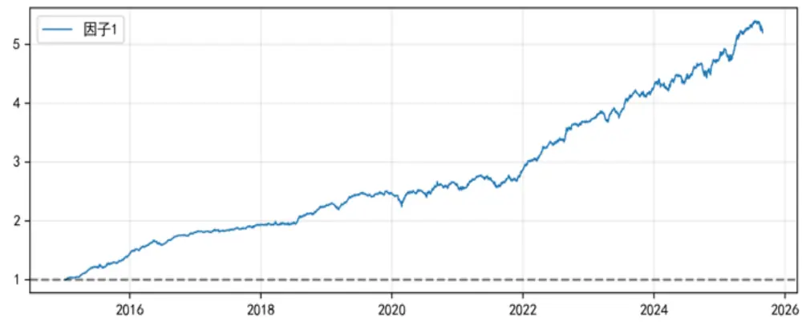
来源：Wind，国金证券研究所

图表25：LLM挖掘量价因子合成风格暴露
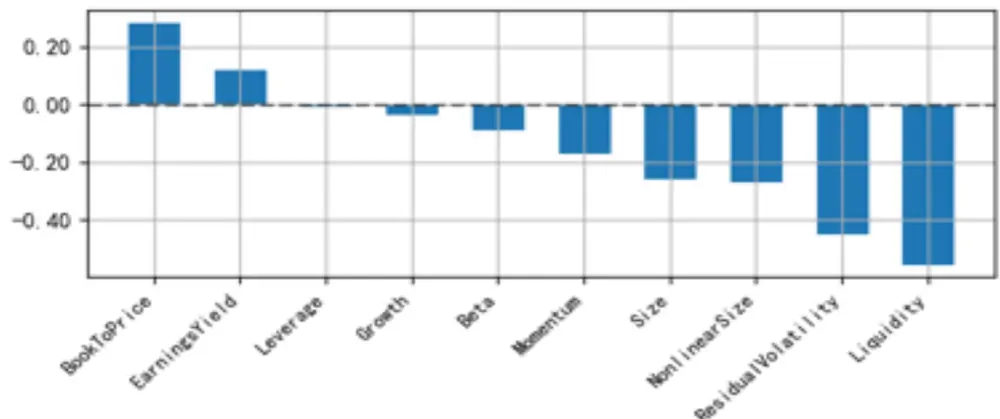
来源：Wind，国金证券研究所

我们对 LLM挖掘的基本面因子合成，也有很好的效果。

图表26：LLM挖掘基本面因子合成统计数据

|  |  |  |  | 多头年化 | 多头 |  |  |  |  |  | 多空 多空最大 |
| --- | --- | --- | --- | --- | --- | --- | --- | --- | --- | --- | --- |
|  | IC 均值 | 风险调整 | 超额收益 Sharpe 比 |  |  |  | 多头信息 多头超额 |  | 多空年化多空波动 | Sharpe 比 |  |
|  |  | 的IC | t统计量 | 率 | 率 |  | 比率 最大回撤 | 收益率 | 率 |  | 回撤 |
|  |  |  | 7.65 |  | 0.61 |  |  |  |  | 率 |  |
| 因子1 | 0.02 | 0.48 |  | 8.96% |  | 2.42 | 6.40% | 18.95% | 0.06 | 3.14 | 9.13% |

来源：Wind，国金证券研究所

图表27：LLM挖掘基本面因子合成多头超额净值曲线
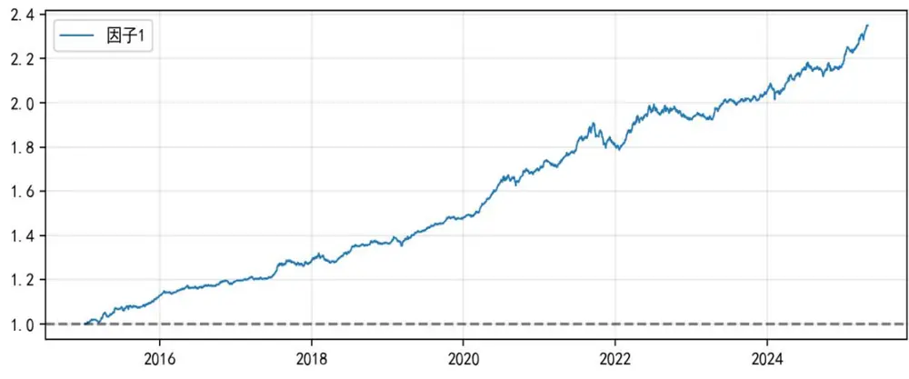
来源：Wind，国金证券研究所

图表28：LLM挖掘基本面因子合成风格暴露
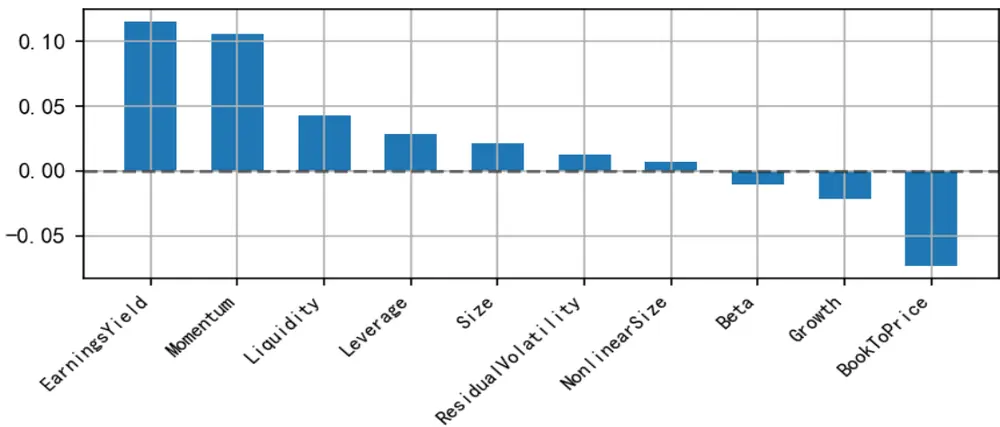
来源：Wind，国金证券研究所

## 总结

本报告构建了一个 7×24 小时自动化运行的 LLM 因子挖掘框架，旨在解决传统因子挖掘方法效率低、覆盖面窄以及自动化方法缺乏可解释性的痛点。框架通过改进的 MMR机制控制因子相关性，同时考虑截面和时序维度，并将 Barra风险因子纳入计算体系。借助成熟因子库的 RAG启发方式，在创造性和实用性之间取得平衡，并引入显式反馈机制使因子迭代路径更加清晰可控。针对基本面数据特性，专门设计了包括一元、二元、截面滚动和价值因子在内的四类运算符体系。实践表明，框架挖掘的量价因子和基本面因子均表现优异，量价因子合成后多头年化超额收益率达17.40%，基本面因子合成后达 8.96%，充分验证了框架的有效性和实用价值。

## 风险提示

1、以上结果通过历史数据统计、建模和测算完成，在政策、市场环境发生变化时模型存在时效的风险。

2、策略通过一定的假设通过历史数据回测得到，当交易成本提高或其他条件改变时，可能导致策略收益下降甚至出现亏损。

## 特别声明：

国金证券股份有限公司经中国证券监督管理委员会批准，已具备证券投资咨询业务资格。

何部分制作任何

形式的复制、转发、转载、引用、修改、仿制、刊发，或以任何侵犯本公司版权的其他方式使用。经过书面授权的引用、刊发，需注明出处为“国金证券股份有限公司”，且不得对本报告进行任何有悖原意的删节和修改。

本报告的产生基于国金证券及其研究人员认为可信的公开资料或实地调研资料，但国金证券及其研究人员对这些信息的准确性和完整性不作任何保证。本报告反映撰写研究人员的不同设想、见解及分析方法，故本报告所载观点可能与其他类似研究报告的观点及市场实际情况不一致，国金证券不对使用本报告所包含的材料产生的任何直接或间接损失或与此有关的其他任何损失承担任何责任。且本报告中的资料、意见、预测均反映报告初次公开发布时的判断，在不作事先通知的情况下，可能会随时调整，亦可因使用不同假设和标准、采用不同观点和分析方法而与国金证券其它业务部门、单位或附属机构在制作类似的其他材料时所给出的意见不同或者相反。

本报告仅为参考之用，在任何地区均不应被视为买卖任何证券、金融工具的要约或要约邀请。本报告提及的任何证券或金融工具均可能含有重大的风险，可能不易变卖以及不适合所有投资者。本报告所提及的证券或金融工具的价格、价值及收益可能会受汇率影响而波动。过往的业绩并不能代表未来的表现。

客户应当考虑到国金证券存在可能影响本报告客观性的利益冲突，而不应视本报告为作出投资决策的唯一因素。证券研究报告是用于服务具备专业知识的投资者和投资顾问的专业产品，使用时必须经专业人士进行解读。国金证券建议获取报告人员应考虑本报告的任何意见或建议是否符合其特定状况，以及（若有必要）咨询独立投资顾问。报告本身、报告中的信息或所表达意见也不构成投资、法律、会计或税务的最终操作建议，国金证券不就报告中的内容对最终操作建议做出任何担保，在任何时候均不构成对任何人的个人推荐。

在法律允许的情况下，国金证券的关联机构可能会持有报告中涉及的公司所发行的证券并进行交易，并可能为这些公司正在提供或争取提供多种金融服务。

本报告并非意图发送、发布给在当地法律或监管规则下不允许向其发送、发布该研究报告的人员。国金证券并不因收件人收到本报告而视其为国金证券的客户。本报告对于收件人而言属高度机密，只有符合条件的收件人才能使用。根据《证券期货投资者适当性管理办法》，本报告仅供国金证券股份有限公司客户中风险评级高于 C3级(含 C3级）的投资者使用；本报告所包含的观点及建议并未考虑个别客户的特殊状况、目标或需要，不应被视为对特定客户关于特定证券或金融工具的建议或策略。对于本报告中提及的任何证券或金融工具，本报告的收件人须保持自身的独立判断。使用国金证券研究报告进行投资，遭受任何损失，国金证券不承担相关法律责任。

若国金证券以外的任何机构或个人发送本报告，则由该机构或个人为此发送行为承担全部责任。本报告不构成国金证券向发送本报告机构或个人的收件人提供投资建议，国金证券不为此承担任何责任。

此报告仅限于中国境内使用。国金证券版权所有，保留一切权利。

上海

电话：021-80234211

北京

深圳

电话：010-85950438

电话：0755-86695353

邮箱：researchsh@gjzq.com.cn

邮箱：researchbj@gjzq.com.cn

邮箱：researchsz@gjzq.com.cn

邮编：201204

地址：上海浦东新区芳甸路 1088号紫竹国际大厦 5 楼

邮编：518000

邮编：100005

地址：北京市东城区建内大街 26号

新闻大厦 8层南侧

地址：深圳市福田区金田路 2028号皇岗商务中心

18 楼 1806

【小程序】国金证券研究服务

【公众号】国金证券研究