# Beta猎手系列

金融工程专题报告

证券研究报告

金融工程组

分析师：高智威(执业 S1130522110003)

gaozhiw@gjzq.com.cn

## 基于动态宏观事件因子的股债轮动策略

## 动态宏观事件驱动的策略框架

为了解决传统宏观事件驱动类策略无法持续在样本外跟踪事件因子或者调整事件策略的弊端，本文构建动态事件驱动策略框架。将事件因子的评价环节包含在每期事件因子的选择当中，动态选择与资产走势更相关的事件因子，解决样本外因子的评价问题和动态因子优选的问题，使得投资者只需要关注于挑选更多有效的宏观数据进模型中，提升模型的信息输入就好。

并且我们用经济，通胀，货币和信用四维度的 30 余个宏观数据指标，基于数据样本内时间段的收益率胜率指标和开仓波动调整收益率指标数值，筛选出这些宏观数据每期最优的事件因子和最优的数据处理方式，并且从中挑选出了11个对资产择时效果较好的宏观数据，来搭建后续的股指择时策略和不同风险偏好的股债轮动策略。

## 基亍动态宏观事件因子的股指择时策略以及股债轮动策略

我们将这 11 个因子分成了两大类:经济增长和货币流动性。经济增长：包含经济，通胀和信用，三者都是不同维度描述经济的运行情况；另外将货币类的指标单独划分成一类，用来刻画市场的流动性。将每期这两个大类因子的得分取平均值，合成当期的股票仓位信号。从 2005 年至 2022 年 11 月，宏观事件因子择时策略年化收益率为 18.73%，同期Wind 全 A 指数为 10.88%，相对 Wind全 A 有约 8%的年化超额收益。而且该择时策略在波动率端也有比较好的表现，年化波动率由指数原来 28.64%的波动率下降到了 15.17%；最大回撤明显下降，从指数的 68.81%下降到了 13.77%，夏普比率上升到了 1.13。

另外我们使用择时策略中获得的股票仓位信息搭配风险预算模型来构建不同风险偏好的股债轮动策略。其中使用 Wind全 A 指数作为股票资产，中债综合财富总值指数作为债券资产来搭建模型。从 2005 年 1 月至 2022 年 11 月，期间保守，稳健和进取三个策略年化收益率分别为 6.26%，11.96%和 22.44%，同期股债 64 年化收益率为 9.25%，稳健和进取型从收益的角度都稳稳跑赢基准，保守型虽然收益没有跑赢，但是波动率，最大回撤和夏普率都是 4 者里面最高的，适合喜欢风险偏好较低的投资者。而其他两个风险偏好的策略也同样在各维度上表现优于基准。

在最后我们也测试了下交易成本对我们配置策略的影响，我们取换手率最高的进取型策略(年平均换手率达 432%)作为例子，考虑手续费后，整体收益降幅可控，千分之一的单边手续费下年化收益仅下滑约 0.5%，千分之二手续费下滑约1%。手续费对于该配置策略整体的影响不大。

## 风险提示

1、以上结果通过历史数据统计、建模和测算完成，历史规律未来可能存在失效的风险。

2、各类事件因子可能会受到政策、市场环境发生变化的影响，出现阶段性失效的风险。

3、市场可能出现超出模型预期的变化，导致策略出现超出模型估计的波动和回撤。

## 一、动态宏观事件的构建逻辑

## 1.1 宏观择时的常用方法

当量化分析师尝试使用宏观数据构建模型对未来资产收益率进行判断时，一般有两种方式：1）进行线性回归拟合，将未来资产的收益率作为因变量，将宏观数据作为自变量进行线性回归，通过回归模型预期未来资产收益率或者涨跌方向。2)构建事件驱动模型，通过统计某类特定的宏观事件发生时未来资产的涨跌情况，从中筛选出胜率高的宏观事件，从而构建事件因子。但是对于宏观数据来说，其与未来资产的收益率不一定呈现线性相关的关系, 或者仅有弱相关性，例如图表 1 中展示的，PPI 同比与 Wind 全 A 收益率的相关性只有-0.1336，并没有一个非常强的相关性，但是在某一时间段内，可能与资产收益率的相关性剧增，例如图表 2 中红框所框出来的部分。所以我们希望使用构建宏观事件的方式，去捕捉这类宏观数据的显著变化的时点，来辅助我们来做投资决策。

图表1：Wind全A与PPI同比的线性相关性
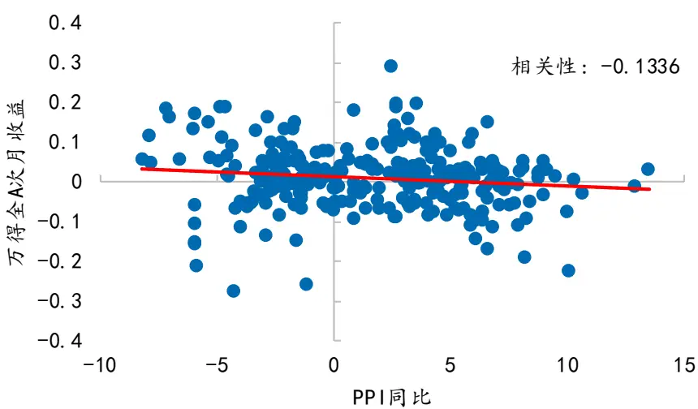
来源：Wind，国金证券研究所

图表 2：Wind 全A 与 PPI 同比的走势
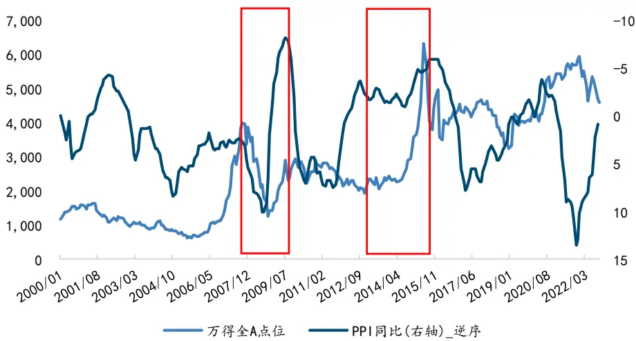
来源：Wind，国金证券研究所

## 1.2 动态事件驱动的优势

传统的事件驱动类策略的构建流程，一般为使用样本内时间段数据去测试事件的胜率和可靠性等等，然后在样本外长期沿用并不做任何改变，或者说没有一个完善的体系去规范样本外该事件因子是否是持续有效，使得投资者在样本外的使用过程中，无法很好的把控事件因子与资产收益率之间关系的变动。例如图表 3 中显示的，南华工业品指数同比与 PPI同比的相关性，在 2012 年之前，南华工业品指数同比的走势对于 PPI 同比有一定的领先性，但是随着时间的推移，目前南华工业品指数同比基本对于 PPI 同比的领先性逐渐减弱。图表 4 中，LME 铜价与 Wind 全 A 指数同比的走势变化，也体现了同样的结论。若我们不能及时把握数据与资产关系变化的话，很有可能滞后或者甚至做出错误的投资决策。

为了一定程度上解决传统事件驱动类策略的弊端，本文尝试构建动态事件驱动策略框架。将事件因子的评价环节包含在每期事件因子的选择当中，动态选择与资产走势更相关的事件因子，解决样本外因子的评价问题和动态因子优选问题，使得投资者只需要关注于挑选更多有效的宏观数据进模型中，提升模型的信息输入就好。

图表3：PPI同比与南华工业品指数同比时滞关系的变化
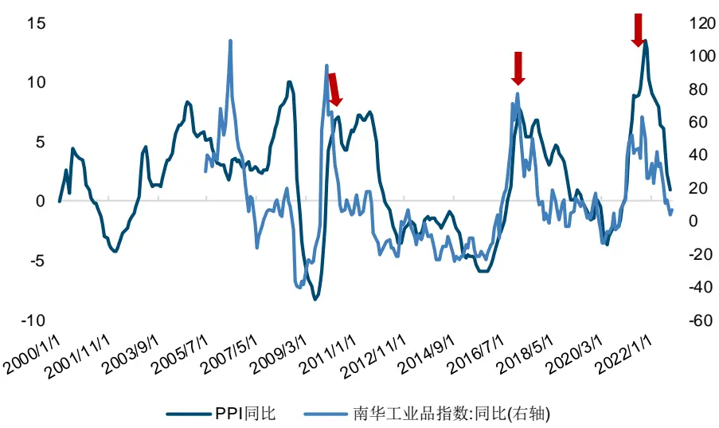
来源：Wind，国金证券研究所

图表4：Wind 全A 同比与LME 铜价同比时滞关系的变化
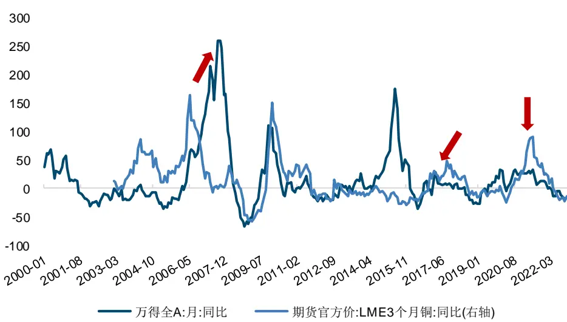
来源：Wind，国金证券研究所

## 二、宏观事件因子构建框架及流程

## 2.1 构建动态事件因子框架要考虑的关键点

为了构建动态事件因子的框架，我们有几个核心问题需要解决：

1)确定使用哪类型的数据以怎样的数据结构去搭建哪些的事件因子。这第一个问题是我们找寻与资产收益率相关的宏观数据，并且构建能够刻画他们与资产关系的事件，从而捕获两者之间的关系；

2）确定筛选因子的指标：当我们用量化的方式去衡量大批量事件因子的好坏，无法人为的逐个用肉眼确认，所以我们需要找到一些用哪类型的指标来筛选优秀或者符合需求的事件因子；

3）确定筛选因子的滚动时间窗口长度：当我们有了合适的筛选指标之后，用多长的滚动时间窗口去计算该指标来判断事件因子的好坏也是一个我们需要决策的维度。

4）确定最终选用因子的标准: 在我们将上述关键点都解决之后，我们只需要确认最终因子的筛选指标就可以完成整个事件因子计算和筛选的流程框架。

在后续的章节 2.2 宏观数据的选用和 2.3 宏观数据的预处理，我们将完成对于问题 1 的理解和处理方式，而章节 2.4 宏观事件因子构建我们会完成对问题 2，3，4 的解答。

## 2.2 宏观数据的选用

关于数据方面，我们本次报告将经济、通胀、货币和信用四大类的 30 余个因子，包括 PMI、PPI、SHIBOR、M1 等数据，纳入了测试的范围当中，后续还可以对更广泛的数据做进一步的测试。

图表5：经济、通胀、货币和信用类指标

| 数据分类 | 指标名称 | 频率 | 数据发布时间 |
| --- | --- | --- | --- |
| 经济 | 制造业 PMI | 月 | 当月月末 |
|  | 制造业 PMI：生产 | 月 | 当月月末 |
|  | 制造业 PMI：新订单 | 月 | 当月月末 |
|  | 制造业PMI：新出口订单 | 月 | 当月月末 |
|  | PMI：新订单-PMI：产成品库存 | 月 | 当月月末 |
|  | 工业增加值：当月同比 | 月 | 次月月中 |
|  | 产量：发电量：当月值 | 月 | 次月月中 |
|  | 消费者信心指数 | 月 | 次月月末 |
|  | 固定投资完成额：第一产业 | 月 | 次月月中 |
|  | 国债利差 10Y-1M | 日 | 当日收盘 |
|  | 国债利差 10Y-3M | 日 | 当日收盘 |
| 通胀 | PPI：同比 | 月 | 次月月中 |
|  | CPI：同比 | 月 | 次月月中 |
|  | PPI-CPI剪刀差 | 月 | 次月月中 |
|  | PMI：原材料价格 | 月 | 当月月末 |
| 货币 |  | 日 |  |
|  | SHIBOR:2 周 | 日 | 当日收盘 |
|  | SHIBOR:1个月 | 日 | 当日收盘 当日收盘 |
|  | 银行间质押式回购加权利率：7天 | 日 | 当日收盘 |
|  | 银行间质押式回购加权利率：14天 | 日 | 当日收盘 |
|  | 银行间质押式回购加权利率：1个月 | 日 |  |
|  | 银行间质押式回购加权利率：3个月 |  | 当日收盘 |
|  | 同业存单：1个月 | 日 | 当日收盘 |
|  | 同业存单：3个月 | 日 日 | 当日收盘 当日收盘 |
|  | 逆回购利率：7天-银行间质押式回购加权利率：7天 | 日 | 当日收盘 |
|  | 中美国债利差10Y | 日 | 当日收盘 |
|  | 中国国债美国 TIPs 利差：10 年 | 日 | 当日收盘 |
|  | 国开债国债利差：10年 | 日 | 当日收盘 |
|  | AA级企业债国债：10年利差 | 日 | 当日收盘 |
|  | 中间价：美元兑人民币 | 日 | 当日收盘 |
|  | M1：同比 |  |  |
|  |  | 月 | 次月月中 |
| 信用 | M2：同比 | 月 | 次月月中 |
|  | M1-M2 剪刀差 | 月 | 次月月中 |
| 社会融资规模：当月值 | 月 | 次月月中 |  |
| 社会融资规模存量：同比 | 月 | 次月月中 |  |
| 金融机构：中长期贷款余额 | 月 | 次月月中 |  |

来源：Wind，国金证券研究所

图表6：事件因子构建流程图
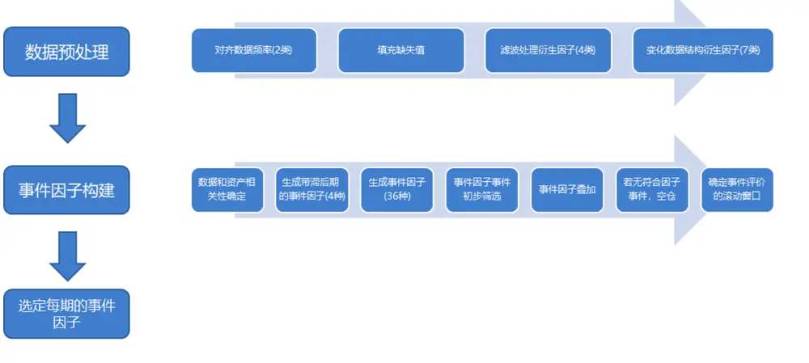
来源：国金证券研究所

## 2.3 宏观数据的预处理

对于数据的预处理方面，我们分成了 4 个小步骤：

1) 对齐数据频率：我们将指标的频率全部统一成了月频的数据，对于日频数据的换频操作上，我们有两种的处理方式，第一种为取每月的最后一个交易日的数据作为当月的数据，或者是取月内日频数据的均值作为当月的数据。

2) 填充数据缺失值：对于由于数据公布时间不一致，导致有些月份数据的缺失，我们需要对其进行填充。这里我们采用的方式是取数据过去 12 个月指标的一阶差分值的中位数叠加上一期的数值进行填充。

$$
X_{t}=X_{t-1}+Median_{diff12}
$$

3) 季节性调整和滤波处理：这个步骤的处理需要看数据本身来确定，因为有数指标对于资产的指示作用可能隐含在“噪音”当中，当我们做季节性调整或者滤波处理，可能会把这部分重要的信息给过滤掉效果反而不好，所以此步骤需要结合数据判断。本文的研究尝试用量化的形式，通过同时构建数据的 4 种处理方式的因子，最终筛选出更适合该指标的处理方式:

a)不做处理的原始数据；b)做季节性调整的数据；

c)做滤波处理的数据； d)做完季节性调整后再进行滤波处理的数据

在季节性调整方面，我们采用传统的 X13-ARIMA-SEATS 方法对数据做季节性调整；而滤波处理方面，为了使得每个时点的过滤后数据不包含未来信息，并未采用传统经济分析常用的双向 HP 滤波:

$$
\hat{\tau}_{t\mid T,\lambda}=\sum_{s=1}^{T}\omega_{t\mid T,s,\lambda}.y_{s}=W_{t\mid T,\lambda}(L).y_{t}
$$

而是选择使用单向 HP 滤波，避免数据处理过程中隐含的未来函数。

$$
\hat{\tau}_{t\mid t,\lambda}=\sum_{s=1}^{t}\omega_{t\mid t,s,\lambda}.y_{s}=W_{t\mid t,\lambda}(L).y_{t}
$$

4) 数据格式变动：根据对数据的理解，不同的数据使用不同的数据格式，使数据更能捕捉资产收益率变动方向。

图表7：数据格式的变动

| 数据格式 | 解释 |
| --- | --- |
| data_raw | 原始数据 |
| data_YoY | 数据的同比变化 |
| data_MoM | 数据的环比变化 |
| data_diff | 数据的差额变化 |
| data_MA12 | 数据的12个月移动平均 |
| data_diff_roll12_sum | 数据的新增量的滚动12个月求和 |
| data_diff_roll12_sum_YoY | 数据的新增量的滚动12个月求和同比变化 |

来源：国金证券研究所

在做完 4 个步骤的数据预处理之后，我们进入事件因子的构建阶段。

## 2.4 宏观事件因子构建

关于事件因子的构建，我们将其拆解成 7 个小步骤:

1）确定事件的突破方向：通过计算经过预处理后的数据与资产标的下一期收益率的相关性，来确定事件的突破方向。当相关性为正相关时，我们对该数据构建正向突破(变动)的事件，反之则构建反向突破(变动)的事件。

2）确定数据与资产的领先滞后性:我们在章节 1.2 动态事件驱动的优势中提及铜价同比与 Wind 全 A 指数同比的领先关系，随着时间的推移发生了变化，所以为了能动态识别数据与资产目前的领先滞后关系，我们对数据衍生出滞后 0-4 期的事件因子，然后通过筛选因子的指标来衡量，那个时滞期数下的事件因子更为合适。

3）生成事件因子：在本次的框架中，我们构建了三类的事件因子，包括数据突破数据均线，数据突破数据中位数以及数据的同向变化，并且给这些因子事件赋予了不同的参数，这样一共构建了 36 个不同的因子事件。

图表8：事件因子的构建

| 因子事件 | 参数 |
| --- | --- |
| 数据突破数据均线 | 均线长度：2-12 |
| 数据突破数据中位数 | 滚动窗口：2-12 |
| 数据同向变动 | 同向变动期数：1-5 |

来源：国金证券研究所

在生成完所有的事件因子之后，我们就可以进入对事件因子的评价和筛选阶段，但首先我们需要确定下用哪些衡量指标。在图表 9 种，我们列出了 4 种不同的衡量指标包括:胜率、收益率胜率，波动调整收益率和开仓波动调整收益率。其中胜率只是考虑了该事件因子的开仓成功率，而收益率胜率除了成功率之外，还包含了盈亏比的信息，相对是个更好的指标。而波动调整收益率除了考虑前面提及的两个因素外，更融入了波动率的信息，但是这个指标包含不开仓时间段的信息，导致不开仓时间长的也可能有高数值，但我们更想获取的是开仓期间波动调整收益率更高的事件因子，所以就有了第四个指标，开仓波动调整收益率。但是这个指标也有自身的问题，就是如果数据期数较少的话，可能计算的数值会较为敏感，导致筛选出来的事件因子好坏不一，所以该指标更适用于对长时间段的因子评价和筛选当中。基于这些指标不同的特点，我们决定选择用收益率胜率作为每期事件因子的筛选指标；用开仓波动调整收益率作为后续确定数据滚动时间窗口的指标。

图表9：各类衡量指标介绍

| 事件因子衡量指标 | 指标构建 | 指标优劣势 |
| --- | --- | --- |
| 胜率 | ΣN1, ri> 0 N为总开仓次数 ∑N1 | 只考虑指标成功率 |
| 收益率胜率 | Σi ri, ri > 0 ，N为总开仓次数 ΣN\|ril | 除了成功率，还包含盈亏比的信息 |
| 波动调整收益率 | $\frac{\sum_{i}^{T}r_{i}/T}{\sqrt{\frac{1}{T-1}{\sum_{i}^{T}(r_{i}-\bar{r})}^{2}}}$ ，T为总期数 | 综合考虑指标成功率，收益率和波动率的信息，但是包含不开 |
|  |  | 仓时间段的信息，导致不开仓时间长的事件也可能有高数值 |
| 开仓波动调整收益率 | $\frac{\sum_{i}^{N}{r_{i}}/{N}}{\sqrt{\frac{1}{N-1}\sum_{i}^{N}({r_{i}}-\bar{r})^{2}}}$ ，N为总开仓次数 | 综合考虑指标成功率，收益率和波动率的信息， 且重点关注开仓阶段的信息，但是要求数据量大些 |

来源：国金证券研究所

4) 因子事件初筛选:确定好筛选指标之后，我们对每期生成因子做个初步的有效性筛选。包括：a)满足 t 检验，能在 95%的置信区间内拒绝事件信号发出之后，下一期资产收益为 0 的原假设。b)事件收益率胜率>55%; c)该事件的发生次数>滚动窗口的时间期数/6。

5) 叠加事件因子:在通过初筛选的事件因子当中，选择收益率胜率最高的事件因子作为当期的基础事件因子。然后从剩余通过初筛选的事件因子中，选出与基础事件因子低于 0.85 的次高收益率胜率事件因子，将其与基础事件因子进行叠加。若叠加因子事件的胜率高于基础因子事件，则选用叠加事件作为当期的事件因子，反之则仅用最高胜率事件作为当期的事件因子。

6) 若经历了步骤 4 和 5，当期没有能通过筛选的事件因子，则本期该宏观指标标记为空仓，且当期不加入其归属的大类因子打分当中，本质上这步实现了动态剔除低胜率的事件因子。

7) 确定评判事件的最优滚动窗口：在通过前 6 个步骤计算之后，我们可以获得该宏观数据每期动态选出的事件因子，并且基于每期事件因子给出的择时信号，获得该宏观数据的历史净值表现。然后我们对样本内时间段(2005 年 1 月-2017 年 12 月)的数据计算开仓波动调整收益率寻找对于不同宏观数据最合适的滚动时间窗口。对于滚动时间窗口的参数，我们测试了 48，60，72，84，96 个月时间维度。每个宏观数据都通过对比不同时间窗口的开仓波动调整收益率来选出最优参数。

## 三、宏观事件因子表现

## 3.1 宏观事件因子测试结果示例

1)PPI 同比：PPI 代表着上游工业品价格，而中国作为一个制造业大国，工业品价格的回落能够有效减缓中下游产业的成本压力，中下游企业的毛利率和营收得以提升，推动实体经济进行扩张增长。对于 PPI 同比这个指标，样本期内最高开仓波动调整收益率的是用原始数据构建的 48 期滚动窗口，所以我们对这个指标使用这个参数。

图表10：PPI同比各情形样本内时间段开仓波动调整收益率

| 滚动窗口长度 原始数据 HP 滤波 X13 季节调整 X13-HP |  |  |  |  |
| --- | --- | --- | --- | --- |
| 48 | 1.50 | 1.04 1.04 |  | 0.96 |
| 60 | 0.87 | –0.10 | 0.87 | 0.07 |
| 72 | 1.49 | 0.21 | 0.96 | 0.14 |
| 84 | 0.42 | 0.20 | 0.67 | 0.31 |
| 96 | 0.17 | 0.06 | 0.20 | 0.14 |

来源：Wind，国金证券研究所

图表11：PPI 同比事件因子择时净值
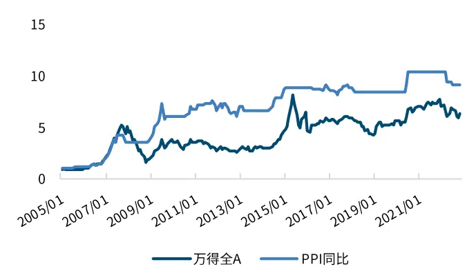
来源：Wind，国金证券研究所

图表 12：PPI 同比事件因子择时表现

| 01/2005 - 11/2022 | PPI同比 | 万得全A |
| --- | --- | --- |
| 年化收益率 | 13.14% | 10.88% |
| 年化波动率 | 18.07% | 28.94% |
| 最大回撤 | -21.21% | -68.61% |
| 夏普比率 | 0.71 | 0.46 |
| 收益回撤比 | 0.62 | 0.16 |

来源：Wind，国金证券研究所

2) 工业增加值同比：工业增加值代表着制造业生产数量的变化，是通过排除了产品价格变动的影响(PPI 包含的部分)，直接通过生产产品数据变化的角度来观察经济增长的情况。对于工业增加值同比这个指标，样本期内最高开仓波动调整收益率的是用经过X13 季节调整后数据构建的 72 期滚动窗口，所以我们对这个指标使用这个参数。

图表13：工业增加值同比各情形样本内时间段开仓波动调整收益率

| 滚动窗口长度 原始数据 HP 滤波 X13 季节调整 X13-HP |  |  |  |  |
| --- | --- | --- | --- | --- |
| 48 | 0.84 | 0.07 | 1.67 | 0.57 |
| 60 | 1.02 | 0.63 | 1.31 | 0.61 |
| 72 | 1.64 | 0.55 | 1.70 | 0.89 |
| 84 | 0.68 | 0.46 | 0.97 | 0.91 |
| 96 | 0.69 | 0.90 | 0.97 | 1.22 |

来源：Wind，国金证券研究所

图表14：工业增加值同比事件因子择时净值
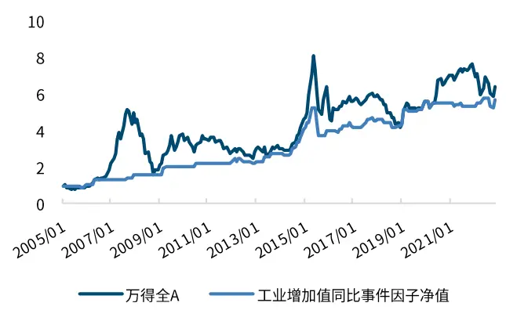
来源：Wind，国金证券研究所

图表15：工业增加值同比事件因子择时表现

| 01/2005 - 11/2022 工业增加值同比 万得全A |  |  |
| --- | --- | --- |
| 年化收益率 | 10.14% | 10.88% |
| 年化波动率 | 14.34% | 28.94% |
| 最大回撤 | -28.70% | -68.61% |
| 夏普比率 | 0.66 | 0.46 |
| 收益回撤比 | 0.35 | 0.16 |

来源：Wind，国金证券研究所

3) 逆回购利率:7 天-银行间质押式回购加权利率:7 天:MA20：逆回购利率是央行政策操作利率，银行间质押式回购加权利率市场的交易利率，该差值扩大，说明银行间市场资金流动性在变宽松，反之，流动性则在逐步收紧过程中。通过这个指标我们可以观测整体市场的流动性是偏宽松还是偏紧张的。对于这个指标来说，样本期内最高开仓波动调整收益率的是用原始数据构建的 96 期滚动窗口，所以我们对这个指标使用这个参数。

图表16：各情形样本内时间段开仓波动调整收益率

| 滚动窗口长度 原始数据 HP 滤波 X13 季节调整 X13-HP |  |  |  |  |
| --- | --- | --- | --- | --- |
| 48 | 1.41 | 0.21 | 0.60 0.58 |  |
| 60 | -0.12 | 0.10 | -0.26 | 0.79 |
| 72 | 0.42 | 0.94 1.04 |  | 1.44 |
| 滚动窗口长度 | 原始数据 | HP 滤波 | X13 季节调整 | X13-HP |
| 84 | 1.87 | 1.00 | 1.50 | 1.39 |
| 96 | 2.70 | 0.54 | 0.94 | 1.19 |

来源：Wind，国金证券研究所

图表17：逆回购-银行间质押式回购利率因子择时净值
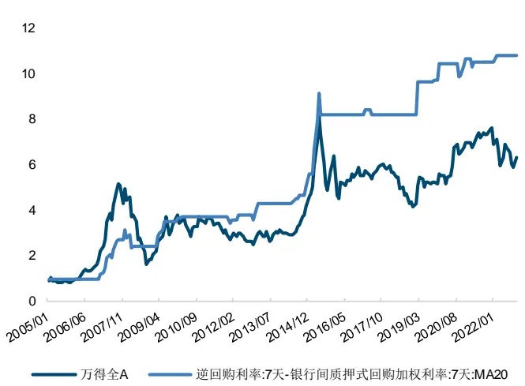
来源：Wind，国金证券研究所

图表18：逆回购-银行间质押式回购利率因子择时表现

| 01/2005 - 11/2022 | 逆回购利率-银行间质 万得全A 押式回购加权利率 |  |
| --- | --- | --- |
| 年化收益率 | 14.23% | 10.88% |
| 年化波动率 | 17.34% | 28.94% |
| 最大回撤 | -25.62% | -68.61% |
| 夏普比率 | 0.78 | 0.46 |
| 收益回撤比 | 0.56 | 0.16 |

来源：Wind，国金证券研究所

## 3.2 最终筛选的宏观因子

最后我们通过计算样本内时间段（2005 年 1 月-2017 年 12 月）30 余个宏观数据构建的事件因子的开仓波动调整收益率，挑选出了样本内表现较好的 11 个因子，我们将其列在了图表 19 当中，并且说明了每个数据的数据格式、数据处理方法和对应的滚动窗口期。我们将这 11 个因子分成了两大类:经济增长和货币流动性。经济增长：包含经济，通胀和信用，三者都是不同维度描述经济的运行情况；另外将货币类的指标单独划分成一类，用来刻画市场的流动性。

图表19：最终筛选的宏观因子

| 因子分类 | 因子名称 | 数据处理方法 | 滚动窗口 |
| --- | --- | --- | --- |
| 经济增长 | M1：同比 | 原始数据 | 84 |
|  | PPI:YoY | 原始数据 | 48 |
|  | PPI-CPI剪刀差 | X13 | 48 |
|  | 工业增加值同比 | X13 | 72 |
|  | 国债利差 10Y-1M | 原始数据 | 84 |
|  | 产量：发电量：当月值：MA3：环比 | X13-HP | 84 |
| 货币流动性 | M1-M2 剪刀差 | HP | 72 |
|  | 中美国债利差：10年 | 原始数据 | 84 |
|  | 中国国债美国 TIPs 利差：10年 | X13 | 96 |
|  | 银行间质押式回购加权利率：7天 | 原始数据 | 48 |
|  | 逆回购利率：7天-银行间质押式回购加权利率：7天：MA20 | 原始数据 | 96 |

来源：Wind，国金证券研究所

## 四、择时与股债策略表现

## 4.1 宏观事件因子择时策略构建

在选定了最终使用的宏观指标之后，我们使用这些宏观数据构建的宏观事件因子来搭建择时策略。我们定义：当大类因子内部的细分因子有大于 2/3 的因子发出看多信号，则当期该大类因子的信号标记为1；当大类因子内部的细分因子少于1/3的因子发出看多信号时，则当期大类因子信号标记为 0；若当大类因子内部的细分因子发出看多信号的比例处于两个区间之后，则大类因子标记为对应具体的比例。最后我们将两个大类因子的得分取平均值，合成最终当期的股票仓位信号。

图表20：择时策略仓位确定流程图
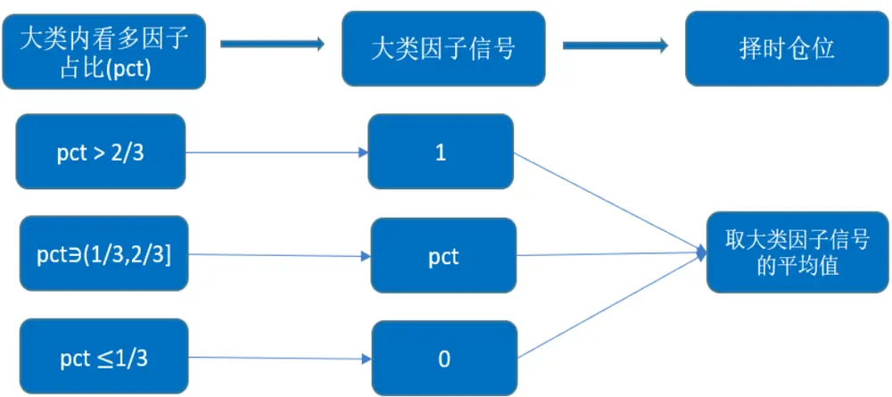
来源：国金证券研究所

图表 21 和图表 22 展示的是该宏观事件因子择时策略的表现，从 2005 年 1 月至 2022 年11 月，年化收益率为 18.73%，同期 Wind 全 A 指数为 10.88%，相对 Wind 全 A 有约 8%的年化超额收益。该择时策略在波动率端也有比较好的表现，年化波动率由指数原来 28.64%的波动率下降到了 15.17%；最大回撤明显下降，从指数的 68.81%下降到了 13.77%，夏普比率上升到了 1.13。

图表21：宏观事件因子择时策略净值
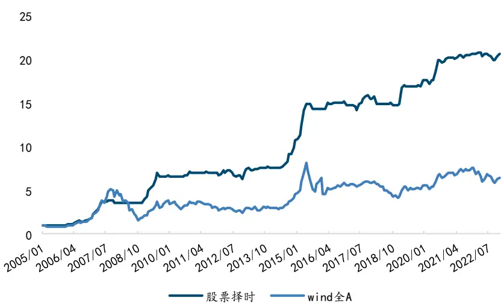
来源：Wind，国金证券研究所

图表22：宏观事件因子择时策略表现

| 01/2005 - 11/2022 | 股票择时 | Wind 全 A |
| --- | --- | --- |
| 年化收益率 | 18.73% | 10.88% |
| 年化波动率 | 15.17% | 28.94% |
| 最大回撤 | -13.77% | -68.61% |
| 夏普比率 | 1.13 | 0.46 |
| 收益回撤比 | 1.36 | 0.16 |

来源：Wind，国金证券研究所 (注：该策略表现未包含交易费用)

当我们从图表 23 中观测择时策略的逐年表现中可以发现，该策略主要是通过在股指出现回撤的阶段控制住下行波动获取明显的超额收益，在股指上行阶段，也尽可能的获取正收益，但无法获取比股指收益更高的收益，这一方面是由于择时策略整体的股票平均仓位较低，仅有约 40%导致的，另外也反映了单纯通过月频宏观因子的择时，很难获取微观结构上的择时高收益，需要有其他维度的数据进行补充。

图表23：宏观事件因子择时策略逐年收益
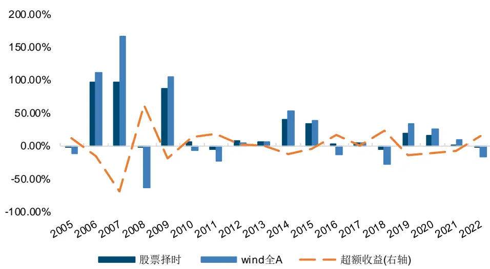
来源：Wind，国金证券研究所

图表24：宏观事件因子择时策略股票仓位
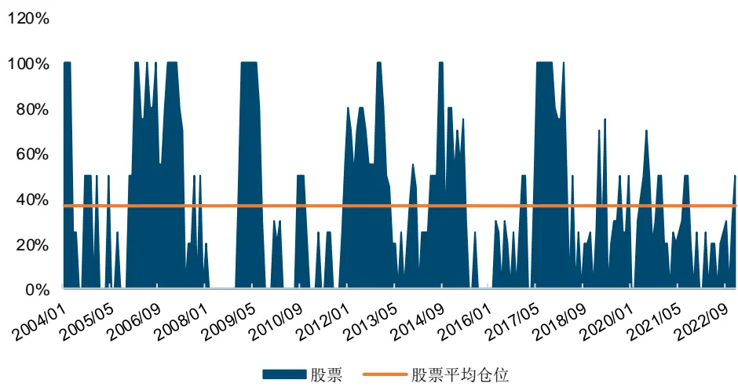
来源：Wind，国金证券研究所

另外，我们也在图表 25 中，列出了近期各细分因子的择时信号。图表中的 N/A 则是代表着该因子在当期没法筛选出符合筛选条件的事件因子，所以做了空仓处理，在当期的大类因子合成信号打分当中，则会将其剔除出打分的计算，从而达到动态筛选优秀的宏观事件的效果。另外，11 月的择时仓位是 30%，而 12 月由于逆回购:7 天-银行间质押利率:7 天_MA20 事件因子的转向，使得整体的择时仓位上升到了 50%。

图表25：近期细分因子信号

| 大类因子 | 细分因子 | 2022/8/31 | 2022/9/30 | 2022/10/31 | 2022/11/30 | 2022/12/31 |
| --- | --- | --- | --- | --- | --- | --- |
| 经济增长 | M1：同比 | 1 | N/A | N/A | N/A | N/A |
|  | PPI：同比 | 0 | 0 | 0 | 0 | 1 |
|  | PPI-CPI剪刀差 | 1 | 1 | 0 | 0 | 0 |
|  | 工业增加值同比 | 0 | 1 | 1 | 1 | 1 |
|  | 国债利差 10Y-1M | 1 | 1 | N/A | 1 | N/A |
|  | 产量：发电量：当月值_MA3：环比 | 0 | 0 | 0 | 1 | 1 |
| 货币流动性 | M1-M2 剪刀差 | 1 | N/A | N/A | N/A | N/A |
|  | 中美国债利差 10Y | 0 | 0 | 0 | 0 | 0 |

| 中国国债美国 TIPs 利差：10 年 0 | 0 | 0 | 0 |
| --- | --- | --- | --- |
| 银行间质押利率：7天 |  |  |  |
| 0 | N/A 0 0 |  |  |
|  | 0 |  |  |
| 逆回购：7天-银行间质押利率：7天_MA20 0 | 0 |  |  |
|  | 0 1 |  |  |
|  | 0 |  |  |

来源：Wind，国金证券研究所

## 4.2 宏观事件因子的风险预算配置策略构建

另外，我们也尝试了使用择时策略中获得的股票仓位信息搭配风险预算模型来构建不同风险偏好的股债轮动策略。这里我们使用 Wind 全 A 指数作为股票资产，中债综合财富总值指数作为债券资产来搭建股债轮动的模型。

在此之前，我们测试了基于两年(486 个交易日) 滚动窗口期计算协方差矩阵的不同权益风险贡献度下的风险预算模型。图表 26 中展示的是不同权益贡献度下的风险预算策略净值，而图表 27 中展示的对应权益风险贡献度下策略所配置的权益仓位权重变化。可以看到由于债券资产的高夏普，导致权益类资产需要获得非常高的风险贡献度才能够提升权益的仓位占比。

图表26：不同权益风险贡献度的风险预算策略净值
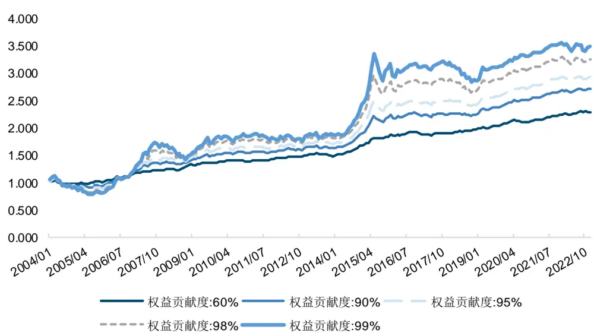
来源：Wind，国金证券研究所

图表27：不同权益风险贡献度的风险预算策略的权益仓位变化
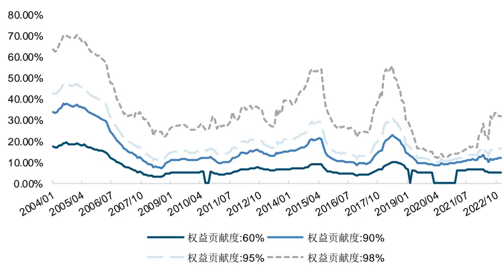
来源：Wind，国金证券研究所

根据测算不同权益风险贡献度下的权益权重数据，我们构建了三类不同风险等级的股债轮动模型:

1) 进取型: 基于章节 4.1 构建的股指择时模型来搭建。股票仓位变动范围 0-100%，使用股指择时模型的股票仓位作为策略的股票仓位，剩余的仓位分配给债券。

2) 稳健型:基于风险预算模型来搭建，每期权益的风险贡献度为 90%-100%，具体的变动数值=90%+(100%-90%)*股指择时模型的股票仓位。

3) 保守型:基于风险预算模型来搭建，每期权益的风险贡献度为 60%-90%，具体的变动数值=60%+(90%-60%)*股指择时模型的股票仓位。

图表28和图表29中展示了这三类配置策略和基准的股债64组合未考虑交易成本的表现，回测期从 2005 年1 月至 2022 年 11 月，期间保守，稳健和进取三个策略年化收益率分别为 6.26%，11.96%和 22.44%，同期股债 64 年化收益率为 9.25%，稳健和进取型从收益的角度都稳稳跑赢基准，保守型虽然收益没有跑赢，但是波动率，最大回撤和夏普率都是 4者里面最高的，适合风险偏好较低的投资者。而其他两个风险偏好的策略也同样在各维度上表现优于基准。

图表28：宏观事件因子配置策略净值
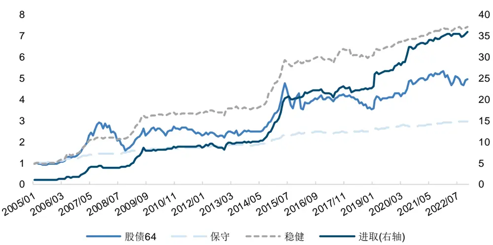
来源：Wind，国金证券研究所

图表29：宏观事件因子配置策略表现

| 01/2005 - 11/2022 | 股债64 | 保守 | 稳健 | 进取 |
| --- | --- | --- | --- | --- |
| 年化收益率 | 9.25% | 6.26% | 11.96% | 22.44% |
| 年化波动率 | 17.24% | 3.39% | 8.71% | 14.94% |
| 最大回撤 | -46.24% | -3.55% | -6.77% | -13.72% |
| 夏普比率 | 0.53 | 1.46 | 1.21 | 1.36 |
| 收益回撤比 | 0.20 | 1.76 | 1.77 | 1.64 |

来源：Wind，国金证券研究所

## 4.3 配置策略交易成本测试

在最后我们也测试了下交易成本对我们配置策略的影响，我们取换手率最高的进取型策略(年平均换手率仅 432%)作为例子，从图表 32 中可以看到，考虑手续费后，整体收益降幅可控，千分之一的单边手续费下年化收益仅下滑约 0.5%，千分之二手续费下滑约 1%。手续费对于该配置策略整体的影响不大。

图表30：进取型配置策略年换手率
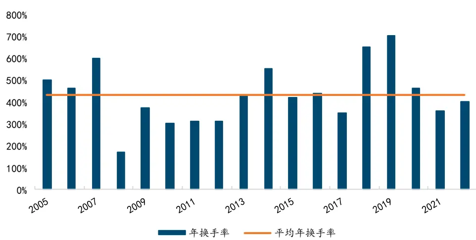
来源：Wind，国金证券研究所

图表31：不同交易成本下，进取型策略净值
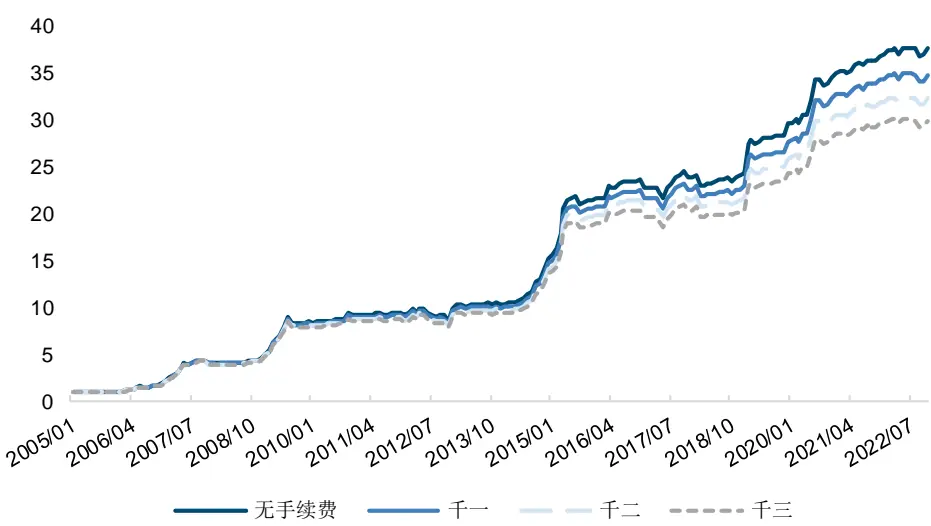
来源：Wind，国金证券研究所

图表32：不同交易成本下，进取型策略表现

| 01/2005 - 11/2022 | 无手续费 | 千分之一 | 千分之二 | 千分之三 |
| --- | --- | --- | --- | --- |
| 年化收益率 | 22.44% | 21.92% | 21.40% | 20.88% |
| 年化波动率 | 14.94% | 14.95% | 14.97% | 14.98% |
| 最大回撤 | -13.72% | -13.84% | -13.97% | -14.10% |
| 夏普比率 | 1.36 | 1.33 | 1.30 | 1.27 |
| 收益回撤比 | 1.64 | 1.58 | 1.53 | 1.48 |

来源：Wind，国金证券研究所

## 五、总结

本文我们搭建了动态宏观事件因子构建框架，实现了对传统事件驱动类策略框架，无法及时在在样本外及时反馈的问题，实现了每期动态优选事件因子以及动态剔除失效的数据指标的效果。并且使用经济，通胀，货币和信用四维度的宏观数据动态构建月频事件因子打分的股指择时和股债轮动模型。择时策略 2005 年1 月至 2022 年 11 月年化 18.73%，同期Wind 全 A 年化 10.88%，增强了收益，同时将指数原本 68.61%的最大回撤降低至 13.77%。另外基于择时策略的信号和股票仓位信息，构建了保守，稳健，进取三类股债轮动组合，夏普分别有 1.46，1.21 和 1.36，并且在考虑成本费用(千分之 1-千分之 3)之后，表现整体依然稳健。配置策略整体的影响不大。

目前我们只是对 Wind 全A 指数进行了择时测试，后续还可以对沪深 300，中证 500，甚至债券指数构建动态事件驱动类的择时策略。另外模型还有一些存在改善的地方，例如事件驱动类的模型框架没法类似多因子模型一样，将因子间的共线性排除，只能够基于宏观逻辑分类和合成数据，降低共线性对模型的影响。另外目前模型框架只能纳入发生频次高的事件，但是对于高胜率低频次的事件目前无法很好的兼容，后续也可以进一步的研究如何将低频高胜率的事件融入框架当中。

## 风险提示

1、 以上结果通过历史数据统计、建模和测算完成，历史规律未来可能存在失效的风险。

2、 各类事件因子可能会受到政策、市场环境发生变化的影响，出现阶段性失效的风险。

3、 市场可能出现超出模型预期的变化，导致策略出现超出模型估计的波动和回撤。

## 特别声明：

国金证券股份有限公司经中国证券监督管理委员会批准，已具备证券投资咨询业务资格。

本报告版权归“国金证券股份有限公司”（以下简称“国金证券”）所有，未经事先书面授权，任何机构和个人均不得以任何方式对本报告的任何部分制作任何形式的复制、转发、转载、引用、修改、仿制、刊发，或以任何侵犯本公司版权的其他方式使用。经过书面授权的引用、刊发，需注明出处为“国金证券股份有限公司”，且不得对本报告进行任何有悖原意的删节和修改。

本报告的产生基于国金证券及其研究人员认为可信的公开资料或实地调研资料，但国金证券及其研究人员对这些信息的准确性和完整性不作任何保证。本报告反映撰写研究人员的不同设想、见解及分析方法，故本报告所载观点可能与其他类似研究报告的观点及市场实际情况不一致，国金证券不对使用本报告所包含的材料产生的任何直接或间接损失或与此有关的其他任何损失承担任何责任。且本报告中的资料、意见、预测均反映报告初次公开发布时的判断，在不作事先通知的情况下，可能会随时调整，亦可因使用不同假设和标准、采用不同观点和分析方法而与国金证券其它业务部门、单位或附属机构在制作类似的其他材料时所给出的意见不同或者相反。

本报告仅为参考之用，在任何地区均不应被视为买卖任何证券、金融工具的要约或要约邀请。本报告提及的任何证券或金融工具均可能含有重大的风险，可能不易变卖以及不适合所有投资者。本报告所提及的证券或金融工具的价格、价值及收益可能会受汇率影响而波动。过往的业绩并不能代表未来的表现。

客户应当考虑到国金证券存在可能影响本报告客观性的利益冲突，而不应视本报告为作出投资决策的唯一因素。证券研究报告是用于服务具备专业知识的投资者和投资顾问的专业产品，使用时必须经专业人士进行解读。国金证券建议获取报告人员应考虑本报告的任何意见或建议是否符合其特定状况，以及（若有必要）咨询独立投资顾问。报告本身、报告中的信息或所表达意见也不构成投资、法律、会计或税务的最终操作建议，国金证券不就报告中的内容对最终操作建议做出任何担保，在任何时候均不构成对任何人的个人推荐。

在法律允许的情况下，国金证券的关联机构可能会持有报告中涉及的公司所发行的证券并进行交易，并可能为这些公司正在提供或争取提供多种金融服务。

本报告并非意图发送、发布给在当地法律或监管规则下不允许向其发送、发布该研究报告的人员。国金证券并不因收件人收到本报告而视其为国金证券的客户。本报告对于收件人而言属高度机密，只有符合条件的收件人才能使用。根据《证券期货投资者适当性管理办法》，本报告仅供国金证券股份有限公司客户中风险评级高于 C3 级(含 C3 级）的投资者使用；本报告所包含的观点及建议并未考虑个别客户的特殊状况、目标或需要，不应被视为对特定客户关于特定证券或金融工具的建议或策略。对于本报告中提及的任何证券或金融工具，本报告的收件人须保持自身的独立判断。使用国金证券研究报告进行投资，遭受任何损失，国金证券不承担相关法律责任。

若国金证券以外的任何机构或个人发送本报告，则由该机构或个人为此发送行为承担全部责任。本报告不构成国金证券向发送本报告机构或个人的收件人提供投资建议，国金证券不为此承担任何责任。

此报告仅限于中国境内使用。国金证券版权所有，保留一切权利。

上海

电话：021-60753903

北京

深圳

电话：010-66216979

传真：021-61038200

电话：0755-83831378

传真：010-66216793

传真：0755-83830558

邮箱：researchsh@gjzq.com.cn

邮箱：researchbj@gjzq.com.cn

邮箱：researchsz@gjzq.com.cn

邮编：201204

邮编：100053

邮编：518000

地址：上海浦东新区芳甸路 1088 号

紫竹国际大厦 7 楼

地址：中国北京西城区长椿街 3 号 4 层

地址：中国深圳市福田区中心四路 1-1 号

嘉里建设广场 T3-2402