金融工程组

分析师：高智威(执业 S1130522110003)

gaozhiw@gjzq.com.cn

## 熵池模型：如何将纯主动观点纳入量化配置模型

## 摘要

本文是国金证券 Beta 猎手系列的第二篇报告，主要是想从配置组合权重优化的角度去提升配置模型的组合表现。以往的组合配置模型有各类的弊端，我们希望通过引入新的模型框架(熵池模型)使得配置模型的适用性更强。我们首先通过熵池模型（Entropy Pooling）与 BL 模型的对比，说明两者在整体思路上是一致的，不过熵池模型可以视作BL 模型的延展，在 BL 模型的观点形式单一、正态假设对分布欠估计等方面做出了优化，能够融入形式多样化、范围更加广的观点。结合实际应用场景，本文举例说明主观投资者使用的比较型观点与宏观外部因子观点等都能放入配置模型，并使用非参数方法提升估计准确性，得到较为稳定的结果。

理论介绍部分，我们依序解析了熵池模型的三个输入变量，然后着重讲解模型使用的“模拟样本扩容”、“相对熵最小化”与“观点池化”等方法及其理论细节，从各方面完整说明模型的理论优势。

随后本文检验了熵池模型在应用上的效果，发现较 BL 模型年化收益、波动率和回撤控制方面，熵池模型都有更好的表现。我们使用基于景气度估值因子的行业轮动配置作为模拟场景，主要对熵池模型的各个方面做了七项检验：一、使用正态与非参数方法的熵池模型与 BL 模型结果对比，发现熵池模型较 BL 模型在年化收益、夏普比、换手率控制等方面都有提升；二、构造排序型观点与波动率观点，对比单独放入与合并放入的结果，证明熵池模型能对多种类型观点的信息进行有效融合，配置效果随着信息增加而提升；三、对比使用最大化夏普比、最小化风险与风险平价三种优化函数的效果，发现非参数方法的熵池模型对效用函数更加稳定；四、对比不重抽样、重抽样 100 次与重抽样 1000 次的熵池模型效果，发现适当次数的重抽样确实能够提升估计的稳健性；五、对比输入历史样本长度为1 年、2 年与 3 年的模型结果，发现模型效果并非样本增长而更稳定，需要根据实际投资情况选择参数；六、将 10 年国债利率作为外部因子输入模型，证明熵池模型能够有效利用外部因子观点，观点输入具有极高的灵活性；七、实现了输入样本与优化样本的分离，对比结果也证明我们的改进符合逻辑，能带来更好的配置效果。

最后本文探索了熵池模型在真实投资中的应用效果，并具体给出了两个配置方案。一是行业轮动配置方案，我们仍然使用基于景气度估值因子的行业轮动模型，时间范围从2010年1月至2023年2月，每月从中信一级中挑选前5 行业等权配置作为基准组合。熵池模型策略同时使用排序型观点、波动率观点与 10 年国债利率的外部因子观点，输入3 年样本、优化 1 年样本，使用最大化夏普比作为效用函数。基准策略的年化收益为 12.45%，夏普比率 0.364；而熵池模型的年化收益提高到 16.50%，夏普比率提高到 0.464。

二是股债配置方案，我们使用宏观事件因子生成股票的配置信号以及相应的基准策略，时间范围从 2005 年 1 月至2023 年 2 月，基准策略年化收益 21.97%，夏普比率 1.631。本文使用宏观因子配置信号构造排序型观点叠加外部因子的配置策略一年化收益达到 23.82%，夏普比为 1.624；叠加波动率观点的策略二年化收益为 24.52%，夏普比率为1.677。添加投资相对约束后，使用排序加外部因子观点的策略三年化 23.76%，但波动得到控制，夏普比达 1.681；使用三种观点的策略四更是年化 24.47%，夏普比达 1.737。

## 风险提示

以上结果通过历史数据统计、建模和测算完成，在政策、市场环境发生变化时模型存在失效的风险。

## 一、熵池模型应用介绍

## 1.1 模型背景

本文是国金证券 Beta 猎手系列的第二篇报告，主要是想从配置组合权重优化的角度去提升配置模型的组合表现。以往的组合配置模型有各类的弊端，我们希望通过引入新的模型框架(熵池模型)使得配置模型的适用性更强。最初的 Markowitz 均值方差模型为资产配置研究领域带来了开创性的变革。但由于理论的假设条件与实际市场并不相符，模型结果也对输入参数过于敏感，投资者很难将该理论应用到投资实务中。为了克服上述问题并扩展模型实用性，高盛的两位分析师 Fisher Black 和 Robert Litterman 提出了著名的 Black-Litterman（BL）模型。

该模型以均值方差模型为框架，允许投资者给出各资产的预期收益率观点以及对观点的置信水平，再使用贝叶斯变换将市场与观点信息进行融合，得到后验的收益率分布，并最终获得配置结果。

BL 模型大大提升了资产配置模型的实用性，但其也具有一定局限性。首先就是观点的形式十分单一，只能是预期收益率观点。投资者可能还会对资产之间的收益率差、收益率范围、波动率甚至是其他非线性的特征产生观点，却无法被模型纳入考虑。此外，BL 模型仍然使用便于计算的正态假设去估计收益率的分布。真实资产的收益率具有尖峰厚尾有偏等性质，是无法被正态分布准确捕捉的，也因此导致模型欠缺对尾部风险的估计。

但 BL 模型也开拓了资产配置研究的思路，推动学界在其基础上提出更多新的模型。Qianand Gorman（2001）提出了能处理收益率相关性观点的 QG 模型，Almgren and Chriss（2006）提出的 AC 模型可以处理收益率排序观点，Pezier（2007）提出相对熵模型来融入形式更复杂的不完全观点。模型的可应用性在不断拓展，也越来越契合主观投资人的需求。

本文要介绍的熵池模型（Entropy Pooling）由前 KKR 首席风险官 Attilio Meucci 提出，是配置模型的集大成者。熵池模型不仅在理论上使用了更加先进的算法来进行权重求解与观点融合，更重要的是它能融入几乎所有类型的投资者观点，观点的对象也不再局限于资产收益率本身，相较 BL 模型在实用性上有质的飞跃。接下来本章节首先结合应用场景进行举例，梳理熵池模型的主要输入变量——观点输入；随后通过与 BL 模型的对比，大致介绍熵池模型的建模原理与流程。模型的具体输入与计算等内容在下一章节中呈现。

图表1：熵池模型与BL模型功能对比

|  | BL 模型 | 熵池模型 |
| --- | --- | --- |
| 正态市场&线性观点 | √ | √ |
| 情景分析 |  | √ |
| 外部因子定价 |  | √ |
| 非正态市场 |  | √ |
| 不完全观点 |  | √ |
| 非线性观点 |  | √ |
| 相关观点融合 |  | √ |

来源：Meucci（2010），国金证券研究所

## 1.2 模型应用场景

在实际的主观投资中，投资者很难对资产给出准确的预期型观点，大多数观点是模糊的、比较类型的观点；投资者还会对资产收益率以外的对象产生大量观点，却难以找到一种科学的方法将其融合进对资产权重的决策中。使用熵池模型则可以很好地解决以上所有问题。我们结合以下应用场景，展示熵池模型在实际投资中的普适性与灵活性：

1）分析师认为，短期来看上证50和沪深300指数收益率大于中证500，投资者如何决定具体的配置比例？

2）股票与债券市场的波动率持续增大，此时如何安排股票与债券的权重？

3）预期通胀上升、利率上行，该如何调整股票、债券与商品的配比？

4）甲看多计算机、通信和光伏储能行业，乙看多券商与贵金属行业，如何将两者观点进行融合？

其中，场景 1 涉及了不同资产之间的比较，并没有给出准确的预期收益率，属于一种模糊观点；场景 2 不仅也属于比较型的观点，还涉及波动率这种非线性的对象；场景 3 中给出的实际上是不会直接影响资产收益率的外部因子观点；场景 4 则涉及多人的观点融合问题。以上情景都是投资者在实际投资中会面临的，但都难以直接输入到 BL 模型中。尤其是较难找到与收益率之间直接关系的外部因子，比如各类宏观变量，投资者会对这类对象产生大量观点，却还需要借助各类其他模型才能应用到资产配置上来，增加工作量的同时还可能丢失部分观点信息。熵池模型则能够轻松接收这类观点，为投资者省去大量麻烦。投资者只需要将最基础的因子数据与各类观点按格式输入模型，就能够直接得到最终配置结果。

## 1.3 模型原理简介

在实际使用上如此方便的熵池模型，背后也拥有强大的理论支持。本小节我们通过与 BL模型的对比来简要介绍熵池模型的输入变量与处理流程，体现模型在理论与应用方面的优势。以下为两个模型的流程图对比，可以看出两者在整体思路上是一致的，即通过一定方法将观点信息叠加到已有的市场信息（资产收益率的先验分布）上，并估计出后验的收益率分布情况，最终给出权重结果。不过两者在具体的输入变量、数据处理、优化算法等方面都有不同，熵池模型的输入变量和优化算法更具有一般性，在实际投资中的可应用性也更强。

图表2：BL 模型大致流程
图表3：熵池模型大致流程
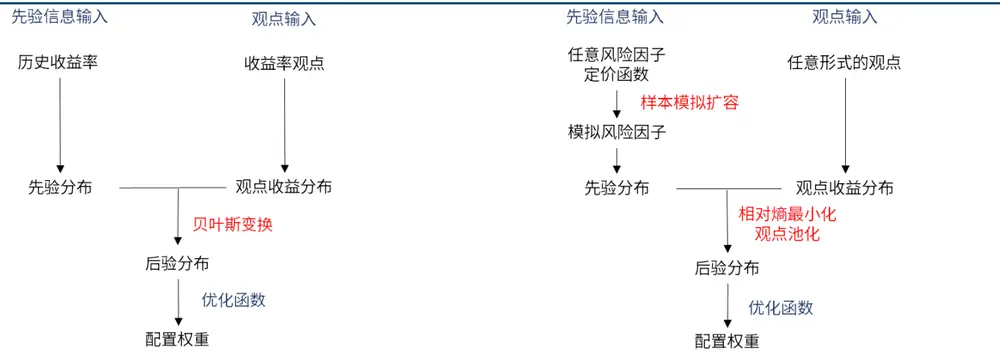
来源：国金证券研究所
来源：国金证券研究所

从大致流程的对比中我们能够发现，熵池模型与 BL 模型在整体思路上是一致的，而使得模型整体效果改进的关键因素就在图中标红的部分上。

首先，熵池模型采用非参数的方法对分布进行估计，通过对每一个样本点赋予概率值来反映整体的分布情况，而估计对象就是由所有样本点概率值组成的向量。该方法好处在于我们不用通过统计量来抽象出整个分布的特征，可以保留更多的细节使得估计更加准确。不过这样的方法要求样本量足够大，同时需要我们对离群点进行控制，否则估计结果可能出现失控。

相对熵最小化则是最适合求解非参数估计的算法。在 BL 模型中，贝叶斯变换将先验分布与观点收益分布两个具有确定参数的分布按照贝叶斯方法进行“加权”，本质上是基于两个分布的概率密度函数进行计算，无法应用在非参数方法中。此外，熵池模型允许投资者给出预期型以外的观点，此时观点收益分布实际上是所有符合要求的分布的集合。譬如我们认为两个变量之间是大于关系，最终模型使用的数据就是每个样本中两个变量值之间的差，并在优化过程中增大差值大于 0 对应的样本点概率，缩小差值小于 0 对应的样本点概率，最终收敛。但贝叶斯方法无法处理这样的优化问题。

最后是模型的观点融合部分。BL 模型直接假设观点之间相互独立，但很可能真实情况是某几个观点之间存在相关性，此时处理这一组具有相关性的观点就需要使用观点池化的方法。在后文我们都会对其算法进行详细介绍。

## 二、模型解析

## 2.1 模型输入变量介绍

我们首先给出熵池模型的完整建模流程如下图：

图表4：熵池模型完整流程图
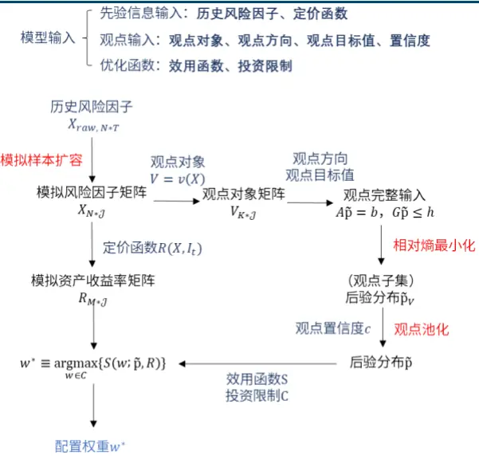
来源：国金证券研究所

图中标为深蓝色的都是模型的输入变量，主要包括三个部分：先验信息输入、观点输入和优化函数；而图中标红的则是模型的求解过程主要使用的三个方法：模拟样本扩容、相对熵最小化与观点池化。以上共同构成了熵池模型的核心。

接下来本文将先对模型的三个输入部分进行讲解。

## 1）先验信息输入

这一部分主要包括风险因子X与定价函数R(X)。与 BL 模型输入历史收益率类似，熵池模型也需要输入历史数据用以估计先验分布，但不要求其一定是收益率数据，而可以是任意的风险因子X，我们统一假设模型使用的风险因子个数为N个。以资产标的都是股票为例，我们可以使用Barra多因子模型来进行先验信息的输入，滚动将过去T期股票的因子数据（记为 $X_{raw,N*T})$ 输入模型。此外，隐含波动率曲线、利率曲线等任何投资者认为会影响资产收益率的因子都可以放入模型。

接下来我们对定价函数R(X)做出定义。假设配置资产的个数为M个，定价函数R就是一个能从N维风险因子投影到M维资产收益率的映射。换句话说，当我们掌握t时刻的信息时，我们获得一个可以将N维风险因子X的数据放入函数R(X),计算出M维的资产预期收益率 $R_{t+\tau^{\varsigma}}$ 。函数定义如下：

$$
R_{t+\tau}=R(X_{t},I_{t})
$$

我们以动量因子定价方法为例进行说明。假设当前我们的配置标的为M个股票，输入的风险因子为每只股票过去 1 个月的动量 $X_{1,t},\dots,X_{N,t}$ ，另外基于此时的市场信息我们得到每只股票的动量定价因子 $\alpha_{t},\beta_{1,t},\ldots,\beta_{M,t}$ ，构成转换矩阵 $I_{t,M*N}.$ 。此时有M = N，资产的定价函数可以表达为：

$$
R_{t+\tau}\equiv\left[\begin{array}{c}{R_{1,t+\tau}}\\{\vdots}\\{R_{M,t+\tau}}\end{array}\right]=\alpha_{t}+I_{t}X_{t}=\alpha_{t}+\left[\begin{array}{cccc}{\beta_{1,t}}&&&\\&{\ddots}&\\&&{\beta_{M,t}}\end{array}\right]\left[\begin{array}{c}{X_{1,t}}\\{\vdots}\\{X_{N,t}}\end{array}\right]
$$

在更简单的情况下，我们直接使用资产的收益率作为风险因子，此时定价函数的输出就是输入；若使用 Barra 多因子作为风险因子，我们需要将当期的因子收益率（即风险因子的回归系数）构造为矩阵形式，使得输入所有股票的各个因子数据时可以得到其期望收益率。当然，模型并不要求函数R必须是是线性的映射，而可以是任何线性、非线性的函数，甚至是复杂的深度学习模型，但需要注意该函数不能使用未来信息。

在获得历史风险因子之后，模型首先会使用模拟样本扩容的方法增大样本量，得到一共J个样本的模拟风险因子矩阵（记为 $X_{N*\mathcal{J}})$ ）。将风险因子矩阵输入定价函数（矩阵每行为一组风险因子），我们可以获得模拟资产收益率矩阵（记为 $R_{M*\mathcal{J}})$ ）。仍然以动量因子定价为例，我们的模拟资产收益率矩阵为：

$$
\begin{array}{rl}&{R=\left[\begin{array}{ccc}{R_{1,1}}&{\cdots}&{R_{1,g}}\\{\vdots}&{\ddots}&{\vdots}\\{R_{M,1}}&{\cdots}&{R_{M,g}}\end{array}\right]}\\&{\quad=\alpha_{t}+\left[\begin{array}{ccc}{\beta_{1,t}}&&\\&{\ddots}&\\&&{\beta_{M,t}}\end{array}\right]\left[\begin{array}{ccc}{X_{1,1}}&{\cdots}&{X_{1,\mathcal{J}}}\\{\vdots}&{\ddots}&{\vdots}\\{X_{N,1}}&{\cdots}&{X_{N,\mathcal{J},1}}\end{array}\right]}\\&{\quad=\left[\begin{array}{ccc}{\alpha_{t}+\beta_{1,t}X_{1,1}}&{\cdots}&{\alpha_{t}+\beta_{1,t}X_{1,\mathcal{J}}}\\{\vdots}&{\ddots}&{\vdots}\\{\alpha_{t}+\beta_{M,t}X_{N,1}}&{\cdots}&{\alpha_{t}+\beta_{M,t}X_{N,\mathcal{J}}}\end{array}\right]}\end{array}
$$

同时我们能够估计出风险因子X服从的“先验分布”：

$$
X\sim f_{X}
$$

此处分布的具体形式可以是正态分布、t 分布，甚至是非参数方法得到的分布形式，完全由使用人决定，相较于 BL 模型的正态假设放宽了许多，也使得模型对风险因子的刻画能够更加准确。基于这一分布，再叠加前面给定的定价函数R，模型可以计算出各项资$\dot{\bar{y}}$ 的均值、协方差、波动率、中位数等任何数值。具体的样本扩容与估计方法请见附录。

## 2）观点输入

观点是配置模型的另一主要变量。BL 模型中投资者只能输入预期收益率类型的观点，一方面观点形式受限导致更多样化的观点无法使用，另一方面要获得可信的预期值也难度较大。熵池模型优秀泛化能力就在于允许投资者给出均值、中位数、波动率、排序等等各种类型的观点，形式上也允许因子大于、小于某目标值或是因子之间相互比较，自由度大大提高。

我们给出观点的标准定义。一条完整的观点包括观点对象、观点大小方向、观点目标值以及观点的置信度这些信息。若我们输入的风险因子为资产收益率，同时给出如下图所示的观点：

图表5：投资者观点示意图

$$
\begin{array}{rlrlrl}&{1,}&\frac{\sqrt{\pi}\kappa}{\sqrt{\pi}\lambda^{2}}\frac{\sqrt{\pi}}{\lambda^{2}}\frac\sqrt{\beta}(\frac{1}{\sqrt{\pi}})\sqrt\frac{1}{\sqrt{\pi}}\frac{\lambda}{\sqrt{\pi}}\frac{\lambda}{\sqrt{\pi}}\frac{\lambda}{\sqrt{\pi}}\frac{\lambda}{\sqrt{\pi}}\frac{\lambda}{\sqrt{\pi}}\frac{\lambda}{\sqrt{\pi}}\frac{\lambda}{\sqrt{\pi}}\frac{\lambda}{\sqrt{\pi}}\frac{\lambda}{\sqrt{\pi}}\frac{\lambda}{\sqrt{\pi}}\frac{\lambda}{\sqrt{\pi}}\frac{\lambda}{\sqrt{\pi}}\frac{\lambda}{\sqrt{\pi}}\frac{\lambda}{\sqrt{\pi}}\frac{\lambda}{\sqrt{\pi}}\frac{\lambda}{\sqrt{\pi}}\frac{\lambda}{\sqrt{\pi}}\frac{\lambda}{\sqrt{\pi}}\frac{\lambda}{\sqrt{\pi}}\frac{\lambda}{\sqrt{\pi}}\frac{\lambda}{\sqrt{\pi}}\frac{\lambda}{\sqrt{\pi}}\frac{\lambda}{\sqrt{\pi}}\frac{\lambda}{\sqrt}{\frac{\pi}{\sqrt}{\pi}}\frac{\lambda}{\sqrt{\pi}}\frac{\lambda}{\sqrt}\frac{\pi}{\sqrt}\frac{\lambda}{\sqrt}{\pi}\frac{\sqrt}{\pi}\frac{\lambda}{\sqrt}\frac{\pi}{\sqrt}\frac{\lambda}{\sqrt}{\pi}\frac{\sqrt}{\pi}\frac{\lambda}{\sqrt}\frac{\pi}{\sqrt}\frac{\lambda}{\sqrt}\frac{\pi}{\sqrt}\frac{\lambda}{\sqrt}\frac{\pi}{\sqrt}\frac{\lambda}{\sqrt}\frac{\pi}{\sqrt}\frac{\lambda}{\sqrt}\frac{\pi}{\sqrt}\frac{\lambda}{\sqrt}\frac{\pi}{\sqrt}\end{array}
$$

来源：国金证券研究所

此时每一条观点的观点对象就是由这些资产的收益率组成。更加一般化地，观点的对象与类型只要能被表达成风险因子的任意函数v(X)形式，都可以当作观点使用。后文我们假设投资者给出的观 $\underset{\cdots}{\underbrace{5}}$ 个数为K，则基于风险因子矩阵我们也能给出观点对象矩阵$V_{K*\mathcal{J}}=v(\boldsymbol{X})$ 。上述例子中的观点对象矩阵可以写为：

$$
V={\left[\begin{array}{lll}{V_{1,1}}&{\cdots}&{V_{1,2}}\\{V_{2,1}}&{\cdots}&{V_{2,3}}\\{V_{3,1}}&{\cdots}&{V_{3,2}}\\{V_{4,1}}&{\cdots}&{V_{4,2}}\\{V_{5,1}}&{\cdots}&{V_{5,2}}\end{array}\right]}={\left[\begin{array}{lllllll}{1}&&&&&\\{1}&{-1}&&&\\&&{1}&&\\&&&{1}&&\\&&&&{1}\end{array}\right]}X={\left[\begin{array}{llllll}{\Gamma1}&&&&&\\{1}&{-1}&&&\\&&{1}&&\\&&&{1}&\\&&&&{1}&\\&&&&{1}\end{array}\right]}{\left[\begin{array}{llll}{X_{a,1}}&{\cdots}&{X_{a,2}}\\{X_{b,1}}&{\cdots}&{X_{b,2}}\\{X_{c,1}}&{\cdots}&{X_{c,2}}\\{R_{1}}&{\cdots}&{R_{g}}\end{array}\right]}
$$

将各类观点转换成模拟观点矩阵的方法细节请见附录 1。

熵池模型认为，投资者观点会给风险因子的分布f带来新的约束条件，而满足这些约束的分布我们就称为观点分布 $f_{V}$ 。不难发现，观点分布 $f_{V}$ 并不唯一，在所有观点分布构成的集合中找到最优解就需要使用“相对熵最小化”算法。

置信度c相对独立的一个要素。它是投资者对每一条观点确信程度的量化表达，取值范围为 $0\%\sim100\%$ 。考虑两种极端情况：当c=100%，表示投资者对观点V是完全自信的，模型将完全按照相应的后验分布进行权重配置；若 $c{=}0\%$ ，表示投资者完全不相信自己的观点，此时模型就会完全按照先验分布 $f_{X}$ 进行配置。在有多个观点的情况下，熵池模型对置信度 采用一种称为“观点池化”的方式进行处理。具体方法在后文详细流程中会进行介绍。

## 3）优化函数

优化函数包括效用函数 与投资限制 。常见的效用函数包括均值方差（BL 模型默认使用）、最大化夏普比、最小化风险等，也可以是任何能表示投资者效用的函数。该函数需要两个输入参数：资产权重w和风险因子的分布f，其中因子分布f与定价函数P叠加就可以计算出优化函数需要的资产收益率、标准差等数据。投资限制C就是对最终优化结果的限制条件，譬如是否允许做空、加杠杆，或是对股债资产添加的权重范围。最优化的权重结果w∗如下定义：

$$
w^{*}\equiv\underset{w\in C}{\mathrm{argmax}}\{S(w;f)\}
$$

## 2.2 模型流程详细介绍

接下来本文将对模型的三个重要步骤进行详细解释，打通整个建模流程。

## 1）模拟样本扩容

模拟样本扩容使得非参数方法得以应用，并能提升对先验分布的估计准确度。在获得最初的历史风险因子之后，我们需要获得尽可能准确的因子分布估计，但类似 BL 模型使用正态分布并计算历史数据的均值、协方差作为参数，有可能忽略尖峰厚尾有偏等真实分布的特征，从而错误估计资产的收益与波动情况。在 Meucci（2010）中，作者给出了一种采用 Kernel-Bootstrap 数值模拟的方法，更加适合求解与进行后续的计算。传统的Bootstrap 是在原始样本中进行简单的重复采样来扩大样本集，在多元且连续的场景中可能会过分强调历史情景。而 Kernel-Bootstrap 法以每个原始样本为均值，分别放入多元正态分布中进行重复抽样，获得的模拟样本更丰富，连续性更强。具体模拟步骤如下：

a）使用风险因子数据 $X_{raw}$ 计算样本协方差矩阵Σ̂。由模型使用者给定模拟样本数量J，一般为 $10^{4}$ 或105等较大数量级。

b）对 $X_{raw}$ 中每一个历史样本点 $x_{t}$ ，我们从多元正态分布 $N(x_{t},\epsilon\hat{\Sigma})$ 中抽样 $\mathcal{J}/T$ 次作为其模拟样本组。其中ε为收缩系数，可以对抽样结果的分布起到压缩作用，此处我们参考论文设定 $\epsilon=0.15$ 。将所有模拟样本组合并，得到模拟风险因子矩阵 $X_{N*\mathcal{J}}$

c）同时，我们使用一个J维的向量 $\mathrm{\Delta p}$ 来记录每个模拟样本的概率值，并给定每个样本点初始概率为 $1/\mathcal{J}$

X和p共同构成了对先验分布的非参数估计，后续的一系列算法求解就是为了找到最符合要求的向量p，这相当于是一种离散的分布形式，因此我们也会使用 $\mathrm{p}$ 来指代风险因子的分布。若我们仍然想使用参数估计法，则可以计算出风险因子先验分布的均值、方差等统计量作为参数放入假设的分布中，获得分布的估计。

## 2）相对熵最小化

介绍观点V时，我们知道投资者给出观点实际上就是给出了针对后验分布的限制条件，并不是一个确定的分布。所有满足限制条件的分布中只有一个分布是我们想要的“后验分布” $\tilde{\mathsf p}_{\circ}$ 。如何去寻找这个分布？类似 BL 模型中的贝叶斯变换一方面只能用于具有确定形式的分布，另一方面也不适用于非参数形式的分布估计，无法满足我们的要求，只有相对熵最小化方法能同时较好地处理以上问题。相对熵最小化是模型的一大关键点，也是模型名称中“熵”的来由。

我们首先需要直观理解“熵”这一信息论的概念。熵本质可以理解为系统的不确定性。一个系统的状态若是 100%确定的，那么他的熵为 0，我们可以完全确定将要发生的事情；而所有状态的概率呈均匀分布的系统，他的熵也就达到了最大，这同时表明我们无法从中获取任何增量的信息。而相对熵，就是衡量两个系统之间相对概率状态的方法。相对熵的具体公式如下：

$$
\varepsilon(g|f)\equiv\int g(x)ln\frac{g(x)}{f(x)}dx
$$

而熵池模型使用分布的离散表达形式，对应的相对熵可以表示为：

$$
\varepsilon(q|p)\equiv\sum_{j=1}^{\mathcal{J}}q_{j}(ln\big(q_{j}\big)-ln(p_{j}))=q^{\prime}(ln(q)-ln(p))
$$

不难发现，若两个概率分布完全一致，相对熵为 0，意味着我们能完全确定分布g的形式，掌握了所有的信息；而两个分布的差异越大，则相对熵取值也越大，有关g的信息我们也掌握得越少。我们可以认为，相对熵是两个分布之间差异程度的度量方式，而差异越小意味着能获得的信息就越多。

回到我们的模型中，我们已知先验分布的形式p，而投资者的观点一般都是与先验分布p相互矛盾的，即先验分布并不在观点约束形成的集合F 中。因此后验分布需要在满足观点约束的条件下，尽可能“接近”先验分布。这样能让后验分布最大化继承先验分布的信息，减少其他无效信息对结果带来的影响，保持模型的稳定性与连续性。因此熵池模型要找的后验分布，就是在满足观点限制的条件下，与先验分布差异最小的分布。这便是模型在此处选择相对熵最小化方法的理由。

因此，我们的后验分布就是以下优化问题的解：

$$
\tilde{\mathbf{p}}\equiv argmin\{\varepsilon(\mathbf{q}|\mathbf{p})\}
$$

可以看出不同的观点集合都能得到相对应的后验分布p̃，我们称完全由观点（或一部分观点）V得到的后验分布为观点后验分布p̃。接下来模型还需要将观点后验分布与先验分布结合，才能得到最终的后验分布；若存在多个观点以及观点置信度不同的情况，还涉及多个观点后验分布的融合问题，具体采用的方法就是下一步观点池化。

论文中采用拉格朗日乘数法并转换为对偶方法对上述优化问题进行求解。该方法的主要优点就是对求解参数进行了降维。若使用非参数估计法，模型实际上有J个参数需要进行求解，数量级会达到 4或更高，求解所需要的时间会很大；若是参数估计法，参数也至少在M这一量级。使用拉格朗日的对偶方法后，求解参数的数量实际上只有K个，也就是投资者观点的数量，模型的效率大幅提升，保证了相对熵最小化算法的可行性。具体的求解公式请见附录 2。

## 3）观点池化

观点池化主要完成不同置信度情况下的观点融合任务，解决了投资者对不同观点具有不同置信程度的问题，同时也允许投资者处理观点之间独立或相关的关系。观点池化是模型的最后一个关键点，也是熵池模型中“池”的来源。

实际上在其前身 BL 模型被提出后，如何给定观点的不确定性就一直是个备受争议的问题。BL模型中，观点的不确定性由后验分布的协方差矩阵Ω确定，学界也给出了很多计算Ω的方法，但始终没有达成统一。

在最初，Black 和 Litterman（1992）实际上并不允许投资者额外设定置信度这一参数，他们认为一个资产历史收益的波动率越大，对其产生的观点的不确定性也应当越大，因此观点的协方差矩阵Ω应当是与收益率的协方差矩阵Σ成正比。Idzorek（2002）创新性地提出了一种能让投资者对每个观点设定“置信度”的方法，为模型的改进提供了新思路。熵池模型中的置信度概念正是借鉴于 Idzorek 的方法。接下来本文将解释“池化”方法如何应用在观点的融合上。

简单来说，“观点池化”就是先获得观点的幂集，再按照一定算法对幂集中每个子集（包括空集，对应先验分布）赋予置信度，并使得所有置信度和为 1。此外 Meucci（2010）的方法假设各置信度的观点之间具有包含关系，简单来说就是小概率观点发生时大概率的观点必然发生，反之则不然。这一假设可以使大多数观点子集的置信度收缩为 0，保证计算效率的同时尽可能合理地融合观点分布。

我们先从一个简单的例子开始说明。假设投资者给出两个观点并认为他们之间具有相关关系，分别赋予置信度 70%和 50%。该观点的幂集可以表示为：{∅,{观点 1},{观点2},{观点 1,观点 2}}，其中的每一个元素我们称为观点子集。

观点池化方法就会首先计算其中每个子集的置信度，再将置信度作为权重对每个观点子集对应的后验分布进行加权，得到最终后验分布。观点池化的算法如下：

观点池化按照以下算法获得上图中每个小区域对应的子集置信度：

图表6：观点池化算法

| 观点子集 | 子集置信度 | 观点子集后验分布 |
| --- | --- | --- |
| {观点1，观点2} | $c_{\{1,2\}}=\operatorname*{min}(c_{k}\mid k\in\{1,2\})=50\%$ | $\tilde{\mathsf{p}}_{\{1,2\}}$ |
| {观点1} | $c_{\{1\}}=\operatorname*{min}(c_{k}\|k\in\{1\})-c_{\{1,2\}}=20\%$ | P{1} |
| {观点2} | $c_{\{2\}}=\operatorname*{min}(c_{k}\|k\in\{2\})-c_{\{1,2\}}=0\%$ | P{2} |
| ∅ | $c_{\varnothing}=1-\operatorname*{max}(c_{k}\mid\mathrm{k}\in\{1,2\})=30\%$ | p |

来源：国金证券研究所

排除所有概率为 0 的集合，此时模型认为仅剩三个有效的观点集合（包括空集），每个观点集合也有对应的后验分布（空集对应先验分布）。最终模型的后验分布为：

$$
\begin{array}{rl}&{\tilde{\mathfrak{p}}=c_{\{1,2\}}\tilde{\mathfrak{p}}_{\{1,2\}}+c_{\{1\}}\tilde{\mathfrak{p}}_{\{1\}}+c_{\emptyset}\mathfrak{p}_{\mathrm{X}}}\\&{}\\&{=50\%\tilde{\mathfrak{p}}_{\{1,2\}}+20\%\tilde{\mathfrak{p}}_{\{1\}}+30\%\mathfrak{p}_{\mathrm{X}}}\end{array}
$$

可以看出，当投资者对所有观点的置信度都相等时，模型就会只计算所有观点同时成立对应的后验分布，并与先验分布加权求和。这也是熵池模型原论文中的简化处理方式，在实际使用中，如果投资者有更明确的观点间相关信息，也完全可以分别指定每个观点子集的置信度，譬如使用观点的历史胜率以及多个观点同时成立的概率来赋值，并按照其他方法对其进行加权。

总体上说，该方法能够考虑到各观点之间的相关性，并且不局限于两两之间的关系（协方差矩阵正是这一形式），而是能描述任意一组观点之间的关系。其区别类似“两两独立”与“相互独立”。这将最大化模型对观点的利用能力。

## 三、熵池模型检验与应用

## 3.1 模型检验数据选取

国金金融工程团队在发布的《金融工程 2023 年度投资策略：拨云见日终有时》中基于景气度估值因子搭建了行业轮动框架。本章节我们将熵池模型应用到行业轮动配置上，对模型的各项能力进行检验，并优化景气度估值行业轮动模型的行业权重，检验熵池模型是否能带来配置效果上的改进。

行业轮动模型以中信一级行业（除综合金融）共 29 个行业指数为投资范围，每个月初挑选出景气度估值因子排名前 5 的行业进行配置，基准指数由前 5 行业等权配置构成。我们的策略统一月频调仓，原始数据的时间范围是 2010 年 1 月至 2023 年 2 月，手续费为单边千分之三。

## 3.2 熵池模型与 BL 模型对比

本文首先对熵池模型与 BL 模型的效果进行对比，证明熵池模型相对 BL 模型能给出更好的配置结果。由于 BL 模型只能输入资产的预期收益率作为观点，我们使用行业的估值动量（ValueMom）、盈利（Profit）和质量（Quality）三个因子构建多因子模型，每一期给出各行业的预期收益率。多因子模型构建如下：

$$
r_{j,t}=\beta_{0,t}+\beta_{1,t}ValueMom_{j,t-1}+\beta_{2,t}Profit_{j,t-1}+\beta_{3,t}Quality_{j,t-1}+\epsilon_{j,t},\qquad j=1,\dots,29
$$

其中， $r_{j,t}$ 为行业j在第t个月的月度收益率， $ValueMom_{j,t-1}$ 为行业j在t − 1月末的估值动量因子值，其余变量表达类似。最终，我们给出行业的预期收益率：

$$
E\left[r_{j,t+1}\right]=E_{t}\left[\beta_{0,t+1}\right]+E_{t}\left[\beta_{1,t+1}\right]VabueMom_{j,t-1}+E_{t}\left[\beta_{2,t+1}\right]Profit_{j,t-1}+E_{t}\left[\beta_{3,t+1}\right]Quality_{j,t-1}.
$$

式中 $E_{t}\big[\beta_{i,t+1}\big]$ 表示对因子 $\cdot\notin{t+1}$ 月的回归系数估计值，定义为过去 12 个月的回归系数均值：

$$
E_{t}\big[\beta_{i,t+1}\big]=\frac{1}{12}\sum_{m=1}^{12}\beta_{i,t-m+1}
$$

由于使用了一年历史数据计算预期值，因此这项检验的回测开始时间为 2011 年 1 月。我们将正态假设的熵池模型、非参数方法的熵池模型与 BL 模型进行对比，模型设置如下：

先验输入：前 5 行业的月度收益率，时间长度T为过去 1 年。每个样本重抽样 100 次。

观点输入：将预期收益率作为均值型观点输入模型： $\mu(X_{j})=E[r_{j,t+1}],$ 。置信度统一为 70%。

其中，添加行业权重下限 10%的约束条件是为了保持基础行业轮动模型的有效性，避免全部配置某一行业的情况出现，更贴合现实情况；另一方面也是希望固定一部分权重的变化，对组合的换手也起到限制作用。对比结果如下：

图表7：净值走势-熵池模型 vs BL 模型
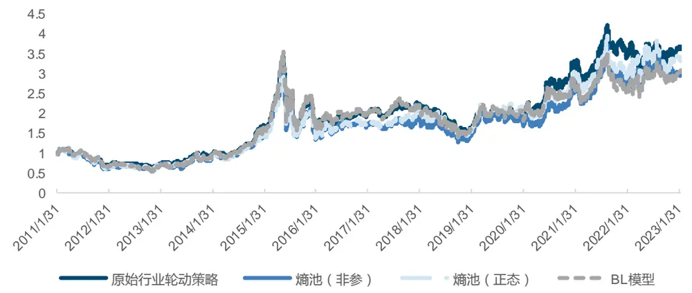
来源：Wind，国金证券研究所

图表8：回测表现-熵池模型 vs BL 模型

| 2011.01-2023.02 | 年化收益率 | 最大回撤 | 年化波动率 | 年化换手 |  | Sharpe 比率 Calmar 比率 |
| --- | --- | --- | --- | --- | --- | --- |
| 原始行业轮动策略 | 11.80% | -56.29% | 27.65% | 3.257 | 0.341 | 0.21 |
| BL 模型 | 9.85% | -59.90% | 30.26% | 4.046 | 0.247 | 0.164 |
| 熵池（正态） | 11.15% | -54.44% | 29.11% | 4.217 | 0.302 | 0.205 |
| 熵池（非参） | 10.30% | -57.32% | 29.74% | 4.013 | 0.267 | 0.18 |

来源：Wind，国金证券研究所

基准指数的年化收益率为 11.80%，夏普比率为 0.341。使用 BL 模型后，年化收益为9.85%，而相同观点下的两类熵池模型表现都比 BL 模型好，年化收益率分别为 11.15%和10.30%，在回测与波动率的控制上也相对 BL 模型更好，最终的夏普比率更高。整体上来看三个模型都未跑赢基准，我们认为原因在于多因子模型给出的观点过于粗糙，并不具有稳定的指导性作用，反而是“帮了倒忙”。不过从 BL 模型与熵池模型的对比上可以看出，熵池模型在观点质量较差的情况下，仍然能给出相对稳健的配置结果，这一优势则来源于熵池模型在建模流程中的优势。

不过熵池（正态）模型与熵池（非参）模型之间还需要进一步的对比，更换不同的输入变量与模型设置，才能具体判断二者的应用区别。

## 3.3 多种观点类型对比

熵池模型的主要应用优势就在于允许投资者输入模糊观点与非线性观点等各种类型观点，这是 BL 模型无法实现的。本小节就对熵池模型对各类观点的应用能力进行检验。我们给出以下观点类型：

## 1）排序型观点

我们首先将收益率之间的比较这类模糊观点放入模型。基础模型中使用景气度估值因子筛选出排名前 5 的行业进行配置，这本身就是一种排序型观点，即基于景气度因子的排序比较来判断行业预期收益率之间的大小关系。因此我们可以更进一步将前 5 行业之间按照景气度因子排序，给出 4 条排序型观点。模型设置如下：

观点输入：按景气度因子大小对前5行业的预期收益率排序，给出4条排序型观点：$\mu(X_{a})\geq\mu(X_{b})$ ，a 和 b 分别表示排名前、后的两个行业。置信度统一为 70%。

图表9：净值走势-熵池模型-排序型观点
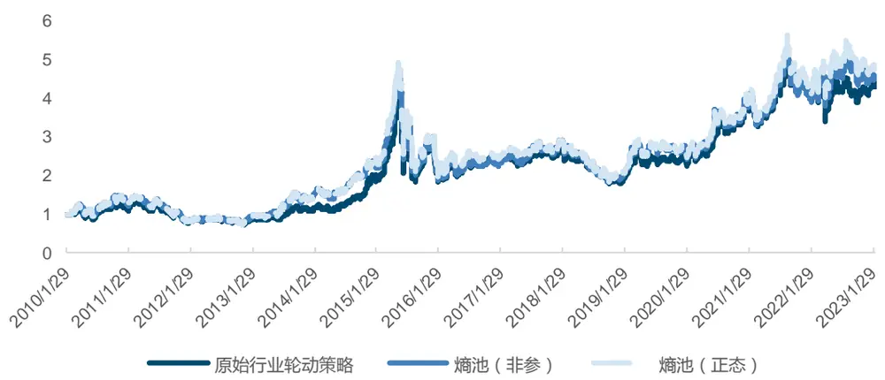
来源：Wind，国金证券研究所

图表10：回测表现-熵池模型-排序型观点

| 2010.01-2023.02 | 年化收益率 | 最大回撤 | 年化波动率 | 年化换手 |  | Sharpe 比率 Calmar 比率 |
| --- | --- | --- | --- | --- | --- | --- |
| 原始行业轮动策略 | 12.45% | -56.29% | 27.71% | 3.171 | 0.364 | 0.221 |
| 熵池（正态） | 12.10% | -61.43% | 30.03% | 3.850 | 0.324 | 0.197 |
| 熵池（非参） | 11.78% | -60.20% | 30.07% | 3.479 | 0.313 | 0.196 |

来源：Wind，国金证券研究所

由于时间段从2010年1月开始，基准指数出现变化，年化收益率达到了12.45%，夏普比率也到达 0.364。使用排序型观点之后，熵池（正态）模型与熵池（非参）模型的效果也都出现提升，年化收益率分别达到 12.10%和 11.78%，非参数方法在控制回撤与换手的方面仍然相对正态法更有优势。排序型观点相对来说更加合理，不过与基准表现仍然有差距。

## 2）波动率观点

我们对非线性观点的使用进行尝试，利用指数前 60 天的收益率计算历史波动率σ̂j，并将其作为该行业的预期波动率，给出波动率观点。

$$
\hat{\sigma}_{j}=\frac{1}{60}\sum_{i=1}^{60}(r_{j,t-i}-\bar{r}_{j})
$$

模型设置如下：

观点输入：将前 5 行业的 60 天历史波动率σ̂j作为各指数的预期波动率，给出波动率观点。σ(Xj) = σ̂j。置信度统一为 70%。

图表11：净值走势-熵池模型-波动率观点
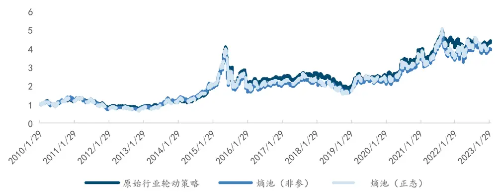
来源：Wind，国金证券研究所

图表12：回测表现-熵池模型-波动率观点

| 2010.01-2023.02 | 年化收益率 | 最大回撤 | 年化波动率 | 年化换手 |  | Sharpe 比率 Calmar 比率 |
| --- | --- | --- | --- | --- | --- | --- |
| 原始行业轮动策略 | 12.45% | -56.29% | 27.71% | 3.171 | 0.364 | 0.221 |
| 熵池（正态） | 13.50% | -62.90% | 29.75% | 3.815 | 0.374 | 0.215 |
| 熵池（非参） | 13.00% | -61.25% | 29.83% | 3.805 | 0.357 | 0.212 |

来源：Wind，国金证券研究所

从指标上可以看出，波动率观点的效果整体更好，两个模型的年化收益率分别为 13.50%和 13.00%，熵池（正态）的夏普比率也达到 0.374，已超过基准指数的表现。

## 3）排序型观点+波动率观点

考虑到排序型观点与波动率观点带来的信息种类并不重合，将两个观点叠加输入模型可能带来更大的表现提升，因此本部分我们尝试将两类观点同时输入模型。模型设置如下：

观点输入：上文构建的排序型观点+波动率观点同时输入。置信度统一为 70%。

图表13：净值走势-熵池模型-排序&波动率观点
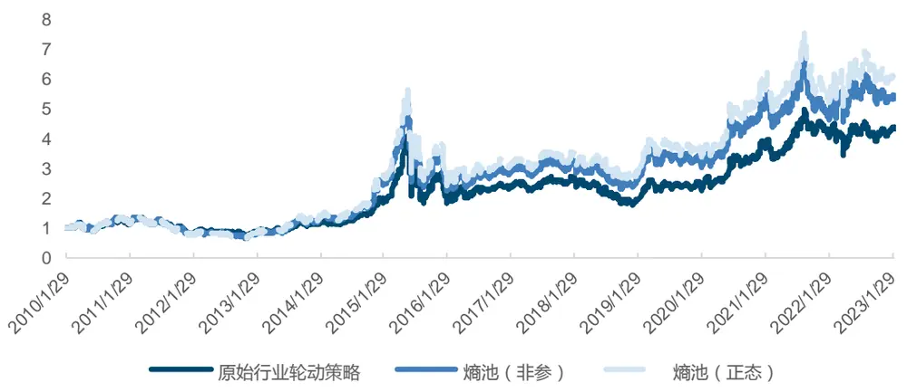
来源：Wind，国金证券研究所

图表14：回测表现-熵池模型-排序&波动率观点

| 2010.01-2023.02 | 年化收益率 | 最大回撤 | 年化波动率 | 年化换手 | Sharpe 比率 Calmar 比率 |  |
| --- | --- | --- | --- | --- | --- | --- |
| 原始行业轮动策略 | 12.45% | -56.29% | 27.71% | 3.171 | 0.364 | 0.221 |
| 熵池（正态） | 15.64% | -56.87% | 30.18% | 3.979 | 0.440 | 0.275 |
| 熵池（非参） | 14.57% | -56.85% | 30.24% | 3.930 | 0.403 | 0.256 |

来源：Wind，国金证券研究所

结果也正如我们所料，多种类观点的叠加融合带来了更多的信息增量，模型效果也出现了较大的提升。熵池（正态）和熵池（非参）的收益率分别达到 15.64%和 14.57%，夏普比率分别为 0.44 和 0.403，不仅明显超过了基准指数，而且相对于单独使用排序型观点或波动率观点的情形也有极大改善。

总体来说，熵池模型的回测表现主要取决于观点的准确率，但随着观点增多带来信息量的提升，模型效果也会出现明显提升，体现出熵池模型较强的观点融合能力。

## 3.4 效用函数对比

效用函数同样是决定模型效果的重要输入变量，具体效用函数的选择取决于投资者对组合收益、风险等指标的权衡，优化效果也与资产之间的特征差异有较大关系。前文检验都是将最大化夏普比作为优化目标函数，策略相对更激进。本小节尝试更换其他效用函数并查看配置结果。

## 1）最小化风险

最小化风险将整个组合的波动率作为优化对象，风格更加保守，优化问题可以写成：

$$
\operatorname*{min}_{\boldsymbol{w}}{w\Sigma\boldsymbol{\mathrm{w}}^{\mathrm{T}}}
$$

$$
s.t.\left\{\sum_{i}^{w}{\geq0}.1\right\}
$$

模型设置如下：

先验输入：前 5 行业的月度收益率，时间长度T为过去 1 年。每个样本重抽样 100 次。

优化函数：最小化风险，投资限制同上。

图表15：净值走势-熵池模型-最小化风险
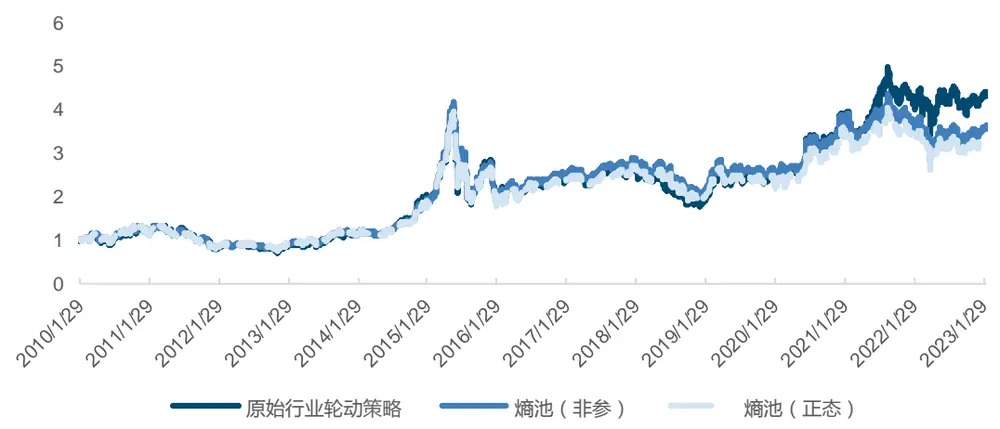
来源：Wind，国金证券研究所

图表16：回测表现-熵池模型-最小化风险

| 2010.01-2023.02 | 年化收益率 | 最大回撤 | 年化波动率 | 年化换手 | Sharpe 比率 Calmar 比率 |  |
| --- | --- | --- | --- | --- | --- | --- |
| 原始行业轮动策略 | 12.45% | -56.29% | 27.71% | 3.171 | 0.364 | 0.221 |
| 熵池（正态） | 9.90% | -55.12% | 26.23% | 4.51 | 0.287 | 0.18 |
| 熵池（非参） | 10.64% | -55.89% | 26.30% | 4.475 | 0.314 | 0.19 |

来源：Wind，国金证券研究所

从结果可以看出，使用更加保守的效用函数之后，熵池模型波动率下降，但相对应的年化收益率也出现下降，最终策略表现不佳。不过从正态与非参数方法的对比中我们可以发现，当效用函数不合适时，正态熵池模型对效用函数的改变更加敏感。使用最大化夏普比时正态模型的夏普值为 0.324，但现在仅 0.287；而非参数熵池模型此前的夏普值为0.313，使用最小化风险后为 0.314，并没有较大差别。

## 2）风险平价

我们尝试另一个主要考虑组合风险的优化函数：风险平价。我们已知投资组合的波动率$\sigma_{p}=\sqrt{w^{T}\Sigma w}$ ，则资产i对整个组合波动率的风险贡献可以表达为

$$
RC_{i}=w_{i}MRC_{i}=w_{i}\frac{\partial\sigma_{p}}{\partial w_{i}}=w_{i}\frac{(\Sigma w)_{i}}{\sqrt{w^{T}\Sigma w}}
$$

其中 $MRC_{i}$ 表示资 $\dot{\bar{y}}$ i的边际风险贡献， $(\Sigma w)_{i}$ 表示向量Σw的第i个元素。风险平价本质上就是使得各个资产的风险贡献相等，这样可以放大风险较小的资产权重而缩小风险较大的资产权重。对应优化问题为：

$$
\underset{w}{\operatorname*{min}}\sum_{i\neq j}\left(RC_{i}-RC_{j}\right)^{2}
$$

$$
s.t.\left\{\sum_{i}^{w}{\geq0.1}\right.
$$

模型设置如下：

优化函数：风险平价，投资限制同上。

图表17：净值走势-熵池模型-风险平价
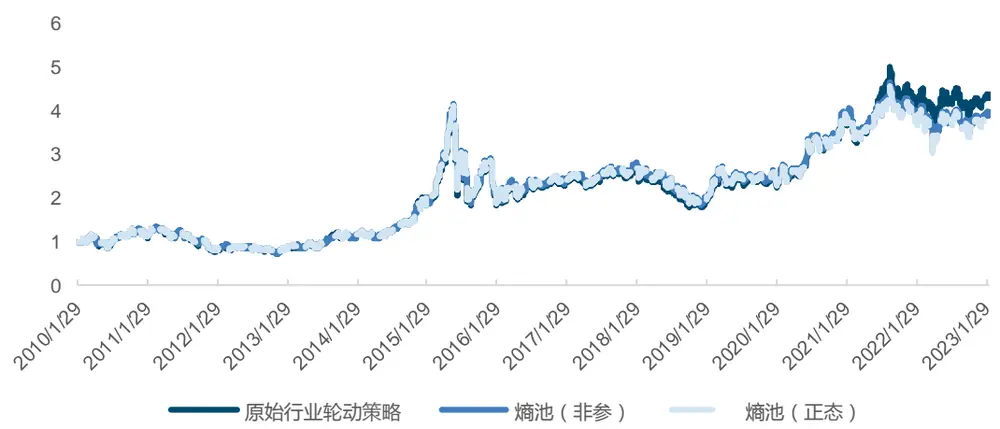
来源：Wind，国金证券研究所

图表18：回测表现-熵池模型-风险平价

| 2010.01-2023.02 | 年化收益率 | 最大回撤 | 年化波动率 | 年化换手 |  | Sharpe 比率 Calmar 比率 |
| --- | --- | --- | --- | --- | --- | --- |
| 原始行业轮动策略 | 12.45% | -56.29% | 27.71% | 3.171 | 0.364 | 0.221 |
| 熵池（正态） | 11.39% | -55.22% | 27.03% | 3.524 | 0.333 | 0.206 |
| 熵池（非参） | 11.57% | -55.23% | 27.07% | 3.518 | 0.340 | 0.210 |

来源：Wind，国金证券研究所

改用风险平价后，熵池模型的整体表现有所增强，年化收益率与夏普比率相对使用风险最小化时有明显上升，换手率也得到更好控制。非参数熵池模型的效果也依然超过正态假设的熵池模型。总体来说，非参数方法对优化函数没有那么敏感，稳定性更好，这也能得到理论上的证明，即非参数方法不会添加多余假设，更加贴近真实情况。因此我们在后续检验中继续使用非参数方法的熵池模型进行检验。

## 3.5 重抽样效果对比

在熵池模型的理论中，基于 kernel-bootstrap 的重抽样方法可以通过扩大样本数量来使得对分布的估计更加稳健，进而提升配置效果。本小节对比不使用重抽样（直接对历史样本进行分布估计）、重抽样 100 次和重抽样 1000 次的结果，对重抽样的必要性进行详细的论证。模型设置如下：

先验输入：前5行业的月度收益率，时间长度T为1年。不重抽样/每个样本抽样100次/抽样 1000 次。

图表19：净值走势-熵池（非参）-重抽样对比
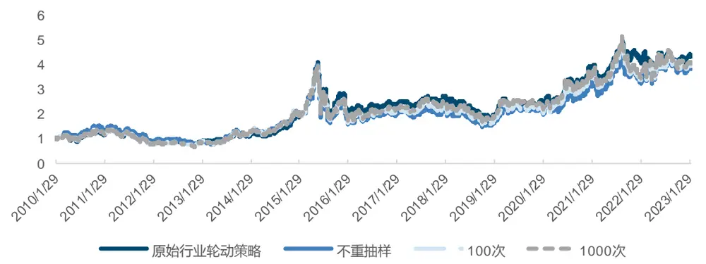
来源：Wind，国金证券研究所

图表20：回测表现-熵池（非参）-重抽样对比

| 2010.01-2023.02 | 年化收益率 | 最大回撤 | 年化波动率 | 年化换手 |  | Sharpe 比率 Calmar 比率 |
| --- | --- | --- | --- | --- | --- | --- |
| 原始行业轮动策略 | 12.45% | -56.29% | 27.71% | 3.171 | 0.364 | 0.221 |
| 不重抽样 | 11.60% | -62.96% | 30.76% | 3.367 | 0.300 | 0.184 |
| 100次 | 11.78% | -60.20% | 30.07% | 3.479 | 0.313 | 0.196 |
| 1000次 | 12.07% | -57.67% | 30.12% | 3.513 | 0.322 | 0.209 |

来源：Wind，国金证券研究所

可以看出，随着重抽样次数的增多，策略的收益确实有明显的改善，不重抽样时年化11.60%，而到了1000次年化达到12.07%。一定次数的重抽样是有明显提升效果的，不过由于重抽样是从模拟的正态分布中进行抽样，本身收益率数据就较为集中，次数过多也会导致模拟样本的分布更偏向于正态分布，与原分布出现较大偏离。

## 3.6 时间长度对比

输入数据的时间长度一定程度上影响了模型的先验分布，也会导致回测结果发生改变。此前模型都是以过去一年数据为历史样本，本小节我们使用两年与三年的历史数据进行回测，做一个简单的对比。模型设置如下：

先验输入：前5行业的月度收益率，时间长度T分别为1年/2年/3年。抽样100次。

图表21：净值走势-熵池（非参）-时间长度对比
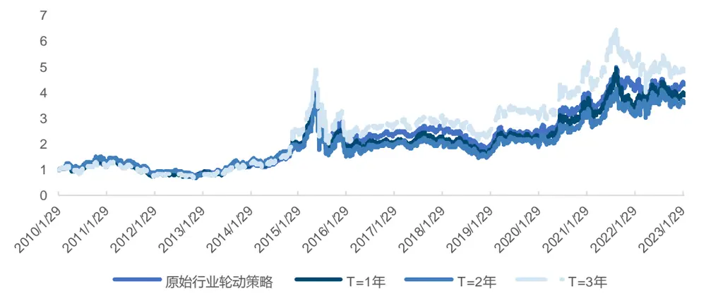
来源：Wind，国金证券研究所

图表22：回测表现-熵池（非参）-时间长度对比

| 2010.01-2023.02 | 年化收益率 | 最大回撤 | 年化波动率 | 年化换手 |  | Sharpe 比率 Calmar 比率 |
| --- | --- | --- | --- | --- | --- | --- |
| 原始行业轮动策略 | 12.45% | -56.29% | 27.71% | 3.171 | 0.364 | 0.221 |
| T=1年 | 11.78% | -60.20% | 30.07% | 3.479 | 0.313 | 0.196 |
| T=2年 | 11.07% | -61.18% | 30.56% | 3.482 | 0.284 | 0.181 |
| T=3年 | 13.74% | -59.12% | 30.52% | 3.689 | 0.372 | 0.232 |

来源：Wind，国金证券研究所

结果上来看，熵池模型对输入数据的时间范围仍然较为敏感。使用三年历史数据的回测结果明显最好，年化达到 13.74%；但使用两年数据的结果反而不比一年的好，收益、回撤、波动等各项指标都有所下降。因此，使用熵池模型时针对不同的资产、效用函数等条件，寻找到合适的时间范围也十分重要。

## 3.7 外部因子观点输入

熵池模型允许投资者对不放入定价函数的外部因子给出观点，从理论上来说大大拓宽了输入观点的灵活性。譬如我们当前案例中，定价因子仅包括每个行业的收益率，但实际上利率、通胀等宏观变量或大盘走势等无法准确放入定价函数的因子都会对行业指数产生影响。熵池模型能对外部因子与定价因子的联合分布进行衡量，此时我们给出的外部因子观点也能对样本后验分布产生约束，进而影响最后的配置结果。理论上成立，本小节我们就对此进行简单的实验。

我们将 10 年国债利率 $(R_{rate})$ 作为外部因子输入模型，并按以下规则给出外部因子观点：

将每次换仓时的利率记为 $r_{t}$ ，换仓日的上个月平价利率记为 $\bar{r}_{t-1}{\circ}$ 。若 $r_{t}\geq\bar{r}_{t-1}$ ，我们认为利率将保持上行趋势，下一期利率继续上行，即 $\mu(R_{rate})\geq r_{t};$ ；若 $r_{t}\le\bar{r}_{t-1}$ ，我们认为利率将保持下行趋势，即 $\mu(R_{rate})\leq r_{t}$

对比模型设置如下：

先验输入：前5行业的月度收益率+10年国债利率，时间长度T为1年，抽样100次。观点输入：

1）仅外部因子观点

2）排序型观点+外部因子观点。

图表23：净值走势-熵池（非参）-外部因子观点
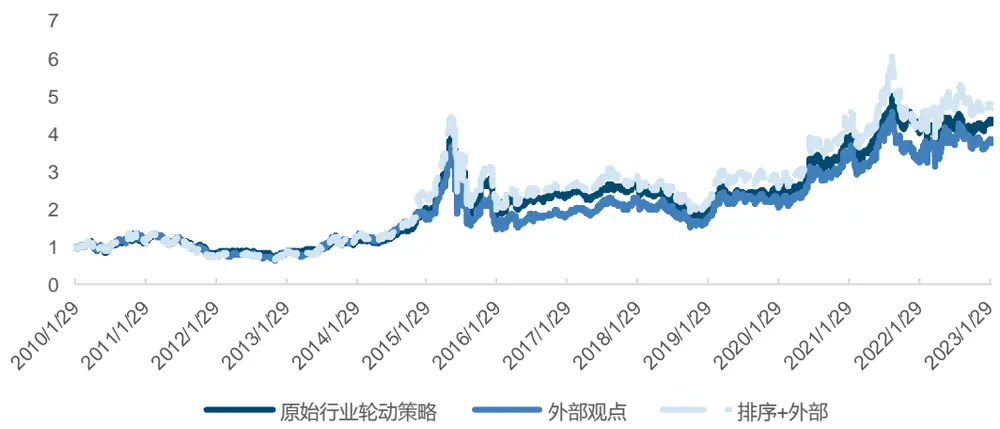
来源：Wind，国金证券研究所

图表24：回测表现-熵池（非参）-外部因子观点

| 2010.01-2023.02 | 年化收益率 | 最大回撤 | 年化波动率 | 年化换手 | Sharpe 比率 Calmar 比率 |  |
| --- | --- | --- | --- | --- | --- | --- |
| 原始行业轮动策略 | 12.45% | -56.29% | 27.71% | 3.171 | 0.364 | 0.221 |
| 外部观点 | 11.45% | -60.51% | 29.93% | 3.443 | 0.303 | 0.189 |
| 排序+外部 | 13.32% | -58.00% | 30.33% | 3.577 | 0.361 | 0.230 |

来源：Wind，国金证券研究所

结果中可以看出，模型确实可以基于外部因子观点给出相对稳定的配置结果，但在仅使用外部因子时模型年化收益率仅 11.45%，相对基准配置结果并没有优势；但在加入了排序型观点之后，模型效果出现了提升，年化达到 13.32%超越基准。这证明了模型能够将外部因子观点与定价因子观点的信息融合，给出相对单独使用二者更好的配置结果。加入外部因子后模型的观点范围更加广泛，但也需要注意加入的外部因子确实会对收益率有影响，或是与资产收益率之间存在一定因果关系，否则即使回测效果很好，也可能是某种“伪回归”下凑巧产生的结果。

## 3.8 输入优化样本分离

最后，我们对熵池模型进行一定改动，使得模型能够更加贴合数据的使用。在前面的检验中我们也知道，熵池模型对输入数据的时间长度比较敏感，例如 2 年历史数据得到的效果会比 1 年的差，对结果的影响主要来源于范围拉长后多出来的那一部分样本。但对例如 10 年期国债利率这类可能 1 年范围内变化都不大的宏观因子来说，使用 3 年或更长的历史样本范围，使得模型对先验分布的刻画更准确又是很有必要的。面对这样的矛盾，我们做出以下模型改进来契合实际使用需求：输入 3 年历史样本进行相对熵最小化得到后验分布，之后从中分离出最近 1 年数据对应的模拟样本，放入最终的优化函数进行求解。这种“对输入样本与优化样本进行分离”的方法即可以保留对先验的准确刻画，又能同时剔除影响回测结果的更早期数据，理论上可以使得模型的效果进一步提升。

为了检验以上想法，我们采用如下模型对比：

先验输入：前 5 行业的月度收益率+10 年国债利率，抽样 100 次。

1）输入 1 年样本，优化 1 年样本。（1 年-1 年）

2）输入 3 年样本，优化 3 年样本。（3 年-3 年）

3）输入 3 年样本，优化 1 年样本。（3 年-1 年）

观点输入：排序型观点+外部因子观点。

图表25：净值走势-熵池（非参）-输入优化样本分离
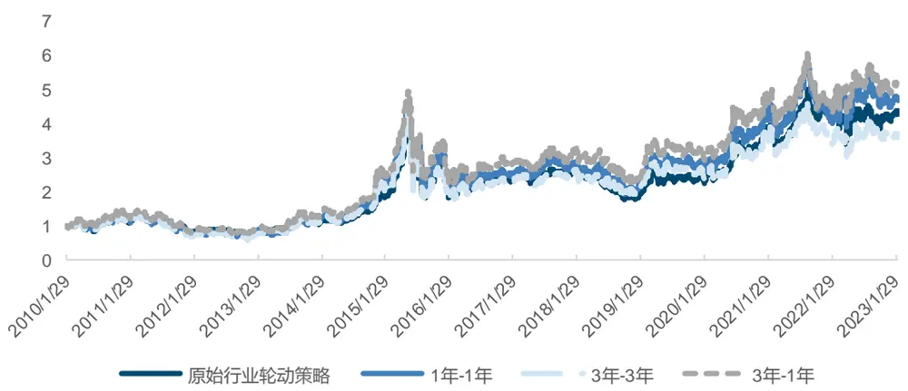
来源：Wind，国金证券研究所

图表26：回测表现-熵池（非参）-输入优化样本分离

| 2010.01-2023.02 | 年化收益率 | 最大回撤 | 年化波动率 | 年化换手 |  | Sharpe 比率 Calmar 比率 |
| --- | --- | --- | --- | --- | --- | --- |
| 原始行业轮动策略 | 12.45% | -56.29% | 27.71% | 3.171 | 0.364 | 0.221 |
| 1年-1年 | 13.32% | -58.00% | 30.33% | 3.577 | 0.361 | 0.230 |
| 3年-3年 | 11.01% | -60.27% | 30.39% | 4.430 | 0.285 | 0.183 |
| 3年-1年 | 14.17% | -55.57% | 30.21% | 3.847 | 0.391 | 0.255 |

来源：Wind，国金证券研究所

可以看出，使用全部 1 年与全部 3 年样本时，得到的收益率分别为 13.32%和 11.01%，而从 3 年中分离出 1 年样本进行优化的方法得到了更高的年化收益率 14.17%，夏普比率0.391 相对基准也有了更大的提升，更加充分地利用了外部因子观点带来的信息，我们提出的改进也使得模型的应用更加符合逻辑。

通过以上对比，我们可以确定熵池模型虽然对各个输入变量都还比较敏感，但具备着相对 BL 模型的巨大优势。熵池模型的每个建模步骤都一定程度提升了配置效果，包括收益分布估计的稳定性、资产的风险度量、观点的利用效果等各个方面。不过，为了控制影响因素我们简化了观点的复杂程度，实际上并没有对定价函数进行更多的检验，观点的置信度也都是统一设置为 70%，此外也没有另外给出观点相关性方面的信息，对模型“观点池化”的功能还有待进一步的探究。总体来说，熵池模型拓宽了配置模型的使用边界，提升了配置效果，是具有很强实用性的配置框架。

## 3.9 模型应用实例：行业轮动配置策略

经过以上章节的模型功能检验与探讨，我们逐步厘清了熵池模型的应用方法，也找到了针对行业轮动配置结果的改进方向。接下来，我们给出最终的行业轮动配置策略及其结果。模型设置如下：

先验输入：前 5 行业的月度收益率。输入 3 年样本，优化 1 年样本。抽样 100次。

观点输入：排序型观点+波动率观点+外部因子观点。

最终回测结果如下：

图表27：净值走势-熵池（非参）-行业轮动配置策略
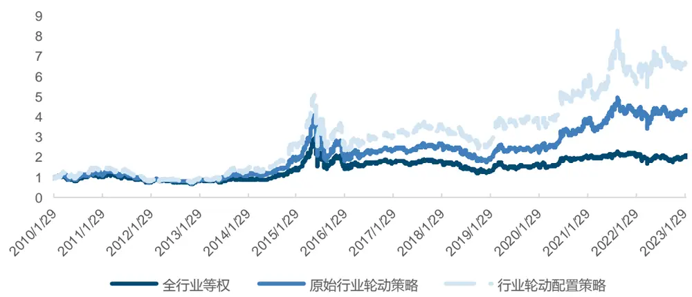
来源：Wind，国金证券研究所

图表28：回测表现-熵池（非参）-行业轮动配置策略

| 2010.01-2023.02 | 年化收益率 | 最大回撤 | 年化波动率 | 年化换手 |  | Sharpe 比率 Calmar 比率 |
| --- | --- | --- | --- | --- | --- | --- |
| 全行业等权 | 6.18% | -58.94% | 25.03% | 0.239 | 0.152 | 0.105 |
| 原始行业轮动策略 | 12.45% | -56.29% | 27.71% | 3.171 | 0.364 | 0.221 |
| 行业轮动配置策略 | 16.50% | -54.09% | 30.47% | 3.724 | 0.464 | 0.305 |

来源：Wind，国金证券研究所

最终策略的年化收益为 16.50%，夏普比率为 0.464，相对基准模型都有较大提升。最近半年的模型配置权重具体如下：

图表29：行业轮动配置方案过去半年配置结果展示

|  | 行业1 |  | 行业2 |  | 行业3 |  | 行业4 |  | 行业5 |  |
| --- | --- | --- | --- | --- | --- | --- | --- | --- | --- | --- |
| 2022年9月 | 煤炭 | 60% | 农林牧渔 | 10% | 通信 | 10% | 电力及公用事业 | 10% | 食品饮料 | 10% |
| 2022年10月 | 煤炭 | 60% | 农林牧渔 | 10% | 通信 | 10% | 基础化工 | 10% | 电力及公用事业 | 10% |
| 2022年11月 | 煤炭 | 60% | 房地产 | 10% | 汽车 | 10% | 通信 | 10% | 石油石化 | 10% |
| 2022年12月 | 煤炭 | 10% | 消费者服务 | 10% | 房地产 | 60% | 汽车 | 10% | 电力及公用事业 | 10% |
| 2023年1月 | 煤炭 | 10% | 通信 | 10% | 消费者服务 | 10% | 汽车 | 10% | 房地产 | 60% |
| 2023年2月 | 煤炭 | 10% | 汽车 | 10% | 消费者服务 | 10% | 通信 | 10% | 房地产 | 60% |

来源：Wind，国金证券研究所

可以看出，模型每一期都会将某个行业的权重配到最高，这与我们选择的最大化夏普比优化函数有关。由于不同行业指数之间的收益表现差别较大，最大化夏普比可能会带来较极端的结果，导致换手率上升影响策略表现。后续研究也可以针对优化函数的使用展开，寻找不同配置主题最适合的优化方法。

## 3.10 股债配置方案

我们将熵池模型应用到股债配置策略中。根据国金金融工程团队发布的《Beta 猎手系列：基于动态宏观事件因子的股债轮动策略》,我们构建了基于动态宏观事件因子的三个不同风险偏好的股债配置策略（保守，稳健和进取型），将 wind 全 A 指数和中债综合财富指数分别作为股票与债券的投资标的。其中的进取型策略股票仓位变动由大类因子信号取均值给出，我们将其作为策略的基准指数。信号时间范围从2005年1月至2023年2月。我们仍然选择月频调仓，手续费单边千分之三。

为了能将择时信号应用到熵池模型中来，我们按照以下规则给出排序型观点：

a) 若信号显示股票仓位大于 2/3，我们认为股票收益率将大于债券收益率，同时给定置信度 100%；

b) 若信号给出股票仓位小于 1/3，我们认为股票收益率将小于债券收益率，同时给定置信度 100%；

c) 其他情况时信号处于中间位置，我们认为股票收益率与债券收益率相等，但只给定置信度 30%。

我们基于信号改变置信度的原因在于，信号的底层是由多个宏观事件因子组成的。当信号给出的股票仓位较高时，看多股票的宏观因子数量较多，观点成立的可能性也更大，所以给出更高的置信度；相反，当信号给出的股票仓位较低时，看空股票的宏观因子数量较多，我们可以对看空的观点给出更高的置信度；信号处于中间范围时我们就较难以做出判断，因此降低置信度，把配置权重的选择交还到模型的先验分布上。

另外，类似行业轮动配置策略的方法，我们也给出股票与债券的波动率观点与 10 年国债利率的外部因子观点。我们具体给出两类观点的模型进行对比，设置如下：

先验输入：股、债月度收益率+10 年国债利率，输入优化 1 年样本。抽样 100 次。

观点输入：

1）排序型观点+外部因子观点（股债策略一）

2）排序型观点+波动率观点+外部因子观点（股债策略二）

优化函数：最大化预期收益，限制做空。

最终回测结果如下：

图表30：净值走势对比-股债配置策略一、二
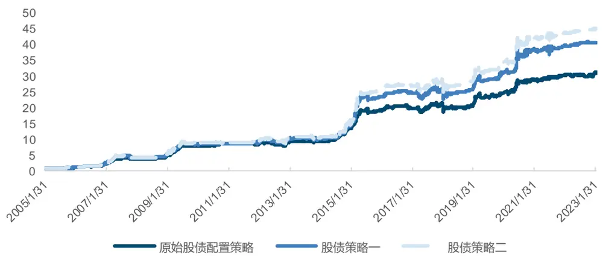
来源：Wind，国金证券研究所

图表31：回测表现对比-股债配置策略一、二

| 2005.01-2023.02 | 年化收益率 | 最大回撤 | 年化波动率 | 年化换手 | Sharpe 比率 Calmar 比率 |  |
| --- | --- | --- | --- | --- | --- | --- |
| 原始股债配置策略 | 21.97% | -16.91% | 12.00% | 2.159 | 1.631 | 1.299 |
| 股债策略一 | 23.82% | -17.14% | 13.19% | 2.074 | 1.624 | 1.390 |
| 股债策略二 | 24.52% | -17.14% | 13.19% | 2.120 | 1.677 | 1.430 |

来源：Wind，国金证券研究所

基准指数的年化收益为 21.97%，夏普比达到 1.631，本身已处于较高水平。使用排序型观点与外部因子观点的熵池模型年化收益则达到 23.82%，夏普比率为 1.624；添加波动率观点之后，模型效果进一步提高，年化达 24.52%，夏普比率高达 1.677，整体超过基准模型。由于资产数量较少，且最大化预期收益的效用函数容易使得配置相对极端，因此两个策略的最大回撤与年化波动相差不大。也因此，我们想要进一步结合熵池模型与基准模型的配置，来控制模型的换手率与波动率：

先验输入：股、债月度收益率+10 年国债利率，输入优化 1 年样本。抽样 100 次。

观点输入：

1）排序型观点+外部因子观点（股债策略三）

2）排序型观点+波动率观点+外部因子观点（股债策略四）

优化函数：最大化预期收益。限制股债配置权重为基准权重的上下 30%。

图表32：净值走势对比-股债配置策略三、四
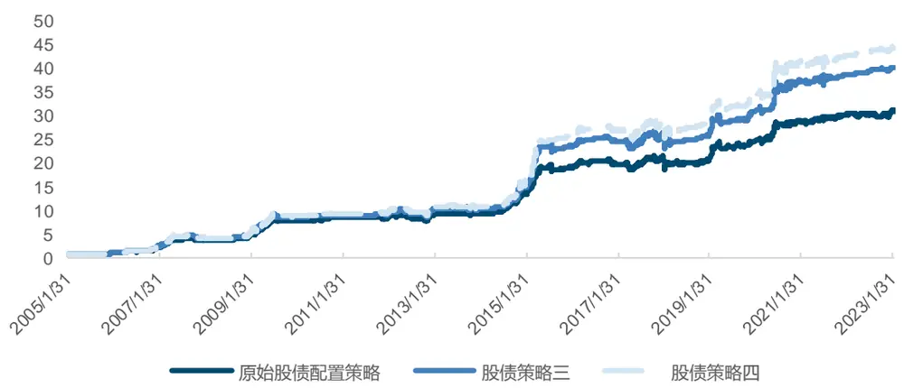
来源：Wind，国金证券研究所

图表33：回测表现对比-股债配置策略三、四

| 2005.01-2023.02 | 年化收益率 | 最大回撤 | 年化波动率 | 年化换手 |  | Sharpe 比率 Calmar 比率 |
| --- | --- | --- | --- | --- | --- | --- |
| 原始股债配置策略 | 21.97% | -16.91% | 12.00% | 2.159 | 1.631 | 1.299 |
| 股债策略三 | 23.76% | -17.04% | 12.70% | 2.000 | 1.681 | 1.395 |
| 股债策略四 | 24.47% | -17.04% | 12.70% | 2.031 | 1.737 | 1.436 |

来源：Wind，国金证券研究所

策略三与策略四的年化收益相对策略一、二有所下降，但最大回撤、波动率与换手率都得到了更好的控制，夏普比率分别上升到1.681和1.737。我们对比基准策略与熵池模型策略二中的股票权重：

图表34：股票权重对比-股债配置方案
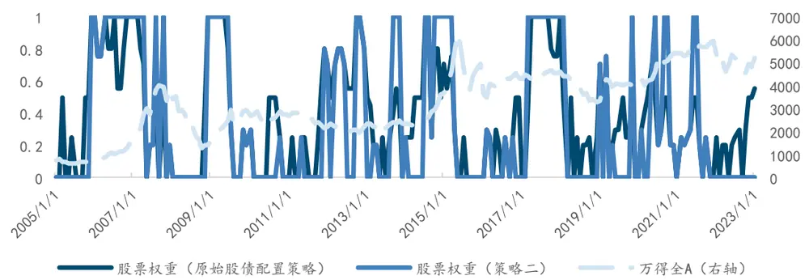
来源：Wind，国金证券研究所

可以看出熵池模型的股票权重变化相对较大，换手率更高，但当观点明确时，模型能给出更加稳定的配置结果，在配置观点不明确时则可以基于历史信息进行判断，更加灵活，所以将两者结合之后能够获得更好效果。

最近半年股债配置各个模型给出的股债配置权重如下：

图表35：股债配置方案过去半年配置结果展示

|  | 原始股债配置策略 |  | 股债配置策略二 |  | 股债配置策略四 |  |
| --- | --- | --- | --- | --- | --- | --- |
|  | 股票 | 债券 | 股票 | 债券 | 股票 | 债券 |
| 2022年9月 | 30% | 70% | 0% | 100% | 0% | 100% |
| 2022年10月 | 0% | 100% | 0% | 100% | 0% | 100% |
| 2022年11月 | 30% | 70% | 0% | 100% | 0% | 100% |
| 2022 年 12月 | 50% | 50% | 0% | 100% | 20% | 80% |
| 2023年1月 | 50% | 50% | 0% | 100% | 20% | 80% |
| 2023 年 2月 | 55% | 45% | 0% | 100% | 25% | 75% |

来源：Wind，国金证券研究所

## 四、总结与展望

理论部分，我们主要基于熵池模型与 BL 模型的差别进行阐述。熵池模型的优势主要在于使用了样本扩容模拟、相对熵最小化与观点池化的方法，样本模拟扩容使估计效果更加准确，同时允许非参数方法的应用，而相对熵最小化则拓展了模型的使用场景，也能极好地契合非参数方法。两者确保了熵池模型在理论上的优越性，拓展的应用场景主要体现在模型的输入更加多样化，主要包括风险因子多样化与观点多样化。此外，观点池化也是模型的一大重要部分，不过本文并未对此进行检验。

实践部分我们将行业轮动配置作为应用场景，对模型的各方面进行检验，主要结果如下。

检验一：熵池模型相比 BL 模型具有优势。我们使用正态与非参数方法的熵池模型与 BL模型结果对比。结果显示尽管观点有效性不高，但熵池模型相对 BL 模型在年化收益与夏普比上都有提升，回撤与波动也得到较好控制，可以认为熵池模型更具备投资实用性。

检验二：熵池模型有效融合多类型观点输入。我们构造了排序型观点与波动率观点，将他们先单独放入熵池模型，后合并一起放入。结果显示同时放入两类观点时比单独放入有更好表现，年化收益与夏普比显著更高，说明熵池模型能对多种观点的信息进行有效融合，配置效果随着信息增加而改善。

检验三：非参数熵池模型对效用函数更加稳定。我们将最大化夏普比、最小化风险与风险平价分别最为效用函数，对比结果显示非参数假设下的熵池模型受到效用函数影响更小，而正态假设下的熵池模型在改变效用函数后表现明显不佳，比较敏感。因此我们后续检验都选择非参数熵池模型进行。

检验四：重抽样对熵池模型带来增益。我们主要对比了不采取重抽样扩容、每个样本重抽样 100 次与重抽样 1000 次的熵池模型效果，可以看出采用重抽样的结果要比不重抽样的明显更好，但抽样次数过多反而有可能影响模拟样本的分布，使得对先验刻画不准确。

检验五：熵池模型对样本时间长度敏感。我们对比了输入1年、2年与3年历史样本数据的模型回测结果，发现并不是时间越长模型效果越稳定，最优的样本范围需要使用者根据资产与投资目标的不同专门选择。

检验六：熵池模型能够有效利用外部因子观点。我们使用 10 年国债利率数据生成了外部因子的比较型观点，对比后发现外部因子观点可以影响模型的配置结果，并将定价因子与外部因子结合后，模型的配置结果有更大提升。这确保熵池模型可以有效使用外部因子，输入模型的投资者观点拥有极大灵活性，但需要注意外部因子与资产之间的因果性。

检验七：输入样本与优化样本的分离更加契合投资逻辑。我们在熵池模型的基础上做出一定改进，实现了从输入样本中挑选一部分进行配置求解的功能，保持对宏观因子准确刻画的同时剔除影响配置结果的早期样本。对比结果也显示，采用样本分离的模型结果优于另两种模型，证明我们的改进符合逻辑，能带来更好的配置效果。

接下来我们探索了熵池模型在真实投资中的应用效果。主要构建以下的投资配置方案。

方案一：行业轮动配置方案。我们仍然使用基于景气度估值因子的行业轮动模型，每月从中信一级中挑选前 5 行业等权配置作为基准组合。我们的熵池模型策略同时使用排序型观点、波动率观点与 10 年国债利率的外部因子观点，输入 3 年样本、优化 1 年样本，使用最大化夏普比作为效用函数。基准策略的年化收益为 12.45%，夏普比率 0.364；而熵池模型的年化收益提高到 16.50%，夏普比率提高到 0.464。

方案二：股债配置方案。我们使用动态宏观事件因子进取型股债配置模型作为基准，基准策略年化收益 21.97%，夏普比率 1.631。本文使用宏观因子配置信号构造排序型观点叠加外部因子的配置策略一年化收益达到 23.82%，夏普比为 1.624；叠加波动率观点的策略二年化收益为 24.52%，夏普比率为 1.677。添加投资相对约束后，使用排序加外部因子观点的策略三年化 23.76%，但波动得到控制，夏普比达 1.681；使用三种观点的策略四更是年化 24.47%，夏普比达 1.737。

实际上，模型作者在论文中提到该模型的另一主要用途是进行压力测试。我们可以根据当前市场的走势或，给出风险因子的极端情况作为观点输入，并测试其对资产组合的影响。这更能发挥熵池模型在风控方面的优势，有助于提高资产配置的稳健性与抗风险能力。此外，熵池模型的应用场景也十分广阔，如结合模型的观点形式自由特性，可以将其应用到衍生品定价、套利等方面，而模型输入因子自由使得多因子模型也能结合，应用到因子选股、行业轮动等多个课题中去。熵池模型还有很广泛的应用空间供我们探索。

## 参考文献

[1] Black,F.,Litterman,R.(1992).Global portfolio optimization. Financial analysts journal,48(5),28-43.

[2] Han,Y.,Zhou,G.,Zhu,Y.(2016).A trend factor: Any economic gains from using information over investment horizons? Journal of Financial Economics,122(2),352-375.

[3] He,G.,Litterman,R.(2002).The intuition behind Black-Litterman model portfolios. Available at SSRN 334304.

[4] Idzorek,T.(2007).A step-by-step guide to the Black-Litterman model: Incorporating user-specified confidence levels in forecasting expected returns in the financial markets(pp.17-38).Academic Press.

[5] Kolm,P.N.,Ritter,G.,Simonian,J.(2021).Black–Litterman and beyond: The Bayesian paradigm in investment management.The Journal of Portfolio Management,47(5),91-113.

[6] Meucci,A.(2008).Fully flexible views: Theory and practice. Risk,21(10),97-102.

[7] Meucci,A.,Ardia,D.,Colasante,M.(2014).Portfolio construction and systematic trading with factor entropy pooling.Risk Magazine,27(5),56-61.

## 附录

## 1 观点信息详解

熵池模型在观点的自由度方面做出了巨大的提升，自由度不仅仅体现在更一般化的观点对象上，更体现在观点表达方式上。本小节我们将对观点进行全面解析，并对观点进行矩阵化任务，将其转化为可以放入模型的形式。

在正文，我们给出了观点的完整定义，包含观点对象、观点方向、观点目标值与置信度。不失一般性，我们可以将模拟情景中的观点对象表达为 $V_{K*{\mathcal{J}}}=v(X)=(v_{1}(X),\ldots,v_{K}(X)){\mathrm{.}}$ 由此，我们通过矩阵V与观点目标值m可以得到对模拟情景概率p的限制条件，也就是对后验分布进行限制。

风险因子到观点对象的函数 $v_{i}(X)$ 取决于给出观点的具体表达形式。接下来我们对不同的观点表达方式一一进行解析。

## 1) 均值观点

首先是与 BL 模型观点相同的类型：均值观点。熵池比 BL 更加方便的一点在于，他并不要求观点必须取等号，不等号形式的观点同样可以起到限制作用从而放入最终模型。均值观点形如：

$$
\tilde{\mu}(V_{k}){\overset{>}{=}}\mu_{k}
$$

在模拟样本中有如下表达：

$$
\sum_{j=1}^{\mathcal{J}}\tilde{{\mathfrak{p}}}_{j}{\mathcal{V}}_{j,k}=[V_{k,1}\quad\cdots\quad V_{k,{\mathcal{J}}}][\tilde{p_{1}}\quad\cdots\quad\tilde{p_{\mathcal{J}}}]^{T}=V_{k}\tilde{p}{\overset{\geq}{<}}\mu_{k}
$$

实际上，就是按照每一个模拟样本的概率将观点对象进行加权求和，并对得到期望值给出约束条件。这样在优化求解时，模型会增大满足约束的样本概率，其他的样本概率相对缩小，使得最终期望值满足约束条件。

式中 $\mu_{k}$ 可以由投资者直接给定，也可以使用历史数据进行计算。当投资者只有定性观点时，Meucci（2010）也给出了如下定义：

$$
\mu_{k}=\hat{\mu}(V_{k})+\zeta\hat{\sigma}(V_{k})
$$

此处的 ${\hat{\mu}}(V_{k})$ 和 $\widehat{\sigma}(V_{k})$ 是使用参考分布计算出来的观点均值与标准差，有：

$$
\hat{\mu}(V_{k})=\sum_{j=1}^{\mathcal{J}}\mathfrak{p}_{j}V_{k,j}
$$

$$
\widehat{\sigma}^{2}(V_{k})=\sum_{j=1}^{\mathcal{J}}\mathsf{p}_{j}\left(V_{k,j}-\widehat{\mu}(V_{k})\right)^{2}
$$

ζ是一个定量参数，比如-1，0，1 分别对应投资者“悲观”、“中性”和“乐观”的观点。2) 排序观点

排序观点实际上与均值观点非常类似，通过转换后可以等价处理。当投资者给出观点：

$$
\tilde{\mu}(V_{1})\geq\tilde{\mu}(V_{2})\geq\cdots\geq\tilde{\mu}(V_{K})
$$

我们实际上可以将其转化成K− 1个单独的观点：

$$
\tilde{\mu}(V_{k})-\tilde{\mu}(V_{k+1})\ge0,\ k=1,2,\dots,K-1
$$

而该观点可以写成

$$
\sum_{j=1}^{\mathcal{J}}\tilde{\mathfrak{p}}_{j}(V_{k,j}-V_{k+1,j})\geq0
$$

实际上排序观点就是重新构造观点对象后的均值观点。

## 3) 分位数观点

中位数是最常见的分位数观点对象。更一般地，我们有 n-分位数观点：

$$
\tilde{Q}_{n}(V_{k}){\stackrel{>}{=}}q_{k}
$$

$n.$ 是介于 0、1 之间的分位值。我们可以对上式进行转换：

$$
\widetilde{\mathsf{P}}(V_{k}\leq q_{k})\overset{<}{=}n
$$

注意此处大于、小于符号发生转换。这样我们就能写出其表达：

$$
\sum_{j\in I_{k}}\tilde{\mathfrak{p}}_{j}\overset{<}{=}n
$$

其中 $I_{k}\equiv\left\{j\colon V_{k,j}\leq q_{k}\right\}$

4) 波动率观点

波动率观点形如：

$$
\tilde{\sigma}(V_{k})\overset{>}{\underset{<}{=}}\sigma_{k}
$$

参照波动率公式：

$$
\tilde{\sigma}(V_{k})\equiv\tilde{\mu}(V_{k}^{2})-\left(\tilde{\mu}(V_{k})\right)^{2}\overset{>}{\underset{<}{=}}\sigma_{k}^{2}
$$

这一等式或不等式中涉及二次项，若直接求解会使得优化问题过于复杂。对此我们可以直接使用先验分布的均值 ${\hat{\mu}}(V_{k})$ 来替 $/\xi\tilde{\mu}(V_{k})$ ，保持约束条件为线性约束：

$$
\sum_{j=1}^{\mathcal{J}}\tilde{\mathsf{p}}_{j}V_{k,j}^{2}\overset{\gg}{\underset{}{=}}\big(\hat{\mu}(V_{k})\big)^{2}+\sigma_{k}^{2}
$$

## 5) 相关系数观点

协方差观点实际上与波动率观点类似，都是涉及到用先验均值来替代后验均值的做法，从而化简计算。

$$
\widetilde{Corr}(V_{k},V_{l}){\stackrel{>}{=}}\rho_{kl}
$$

可以表达为

$$
\sum_{j=1}^{\mathcal{J}}\tilde{{\bf p}}_{j}V_{k,j}V_{l,j}\overset{>}{\underset{<}{=}}\hat{\mu}(V_{k})\hat{\mu}(V_{l})+\sigma_{k}\sigma_{l}\rho_{kl}
$$

直接对协方差给出观点也类似，只需将 $\sigma_{k}\sigma_{l}\rho_{kl}$ 替换为观点目标 $c_{kl}$ 即可。

实际上以上观点的形式也可以相互结合使用，比如投资者给出了波动率之间排序观点、对相关系数给出定性形式的观点……我们甚至可以对风险因子的分布直接给出观点，具体请参考原论文 Meucci（2010）。

我们可以看出，最终所有形式的观点都能转化为对p̃的线性约束。经过归类后，可以将其

中的等式约束写为 $A{\tilde{\mathsf{p}}}=b$ ，将不等式约束写为 $G{\tilde{\mathsf{p}}}\leq h$ 的形式。至此，我们完成了对观点的矩阵化任务。

## 2 相对熵最小化详细步骤

我们将观点和市场先验信息放入相对熵最小化问题，得到后验分布p̃的估计，p̃可以理解为符合投资者观点并最接近市场情形的因子分布。本文使用拉格朗日对偶法来求解相对熵最小化问题，并以非参数方法为例进行讲解。在前序步骤中，我们已经将观点转化为对分布p添加的限制条件 $\{G\mathfrak{p}\leq h,A\mathfrak{p}=b\}$ 。则我们有优化问题：

$$
\tilde{\mathsf{p}}\equiv\mathsf{\Pi}_{G\mathsf{p}\leq h,A\mathsf{p}=b}^{argmin}\left\{\varepsilon(\mathsf{p}|\mathsf{p}_{X})\right\}=\mathsf{\Pi}_{G\mathsf{p}\leq h,A\mathsf{p}=b}^{argmin}\left\{\mathsf{p}^{\prime}(ln(\mathsf{p})-ln(\mathsf{p}_{X}))\right\}
$$

我们写出其拉格朗日方法的目标函数：

$$
\mathcal{L}(\boldsymbol{\mathrm{p}},\lambda,\nu)\equiv\boldsymbol{\mathrm{p}}^{\prime}(ln(\boldsymbol{\mathrm{p}})-ln(\boldsymbol{\mathrm{p}}_{X}))+\lambda^{\prime}(G\boldsymbol{\mathrm{p}}-h)+\nu^{\prime}(A\boldsymbol{\mathrm{p}}-b)
$$

其中λ ν为拉格朗日乘子，优化问题的约束条件变为 $\lambda\geq0$

拉格朗日方法能对优化问题的约束条件进行简化，将原问题的约束方程乘上拉格朗日乘子后，与原目标函数相加获得新的目标函数。此时我们对原目标函数的最小化问题等价于对拉格朗日问题的问题，但约束条件变为对拉格朗日乘子的约束，求解更加简单。拉格朗日函数对 p 的一阶条件为：

$$
0={\frac{\partial{\mathcal{L}}}{\partial{\boldsymbol{\mathrm{p}}}}}=ln({\boldsymbol{\mathrm{p}}})-ln({\boldsymbol{\mathrm{p}}}_{X})+1+G^{\prime}\lambda+A^{\prime}\nu
$$

因此我们可以将 p 写为λ和ν的函数：

$$
\begin{array}{r}{\mathrm{p}(\lambda,\nu)=e^{ln(\mathrm{p}_{X})-1-G^{\prime}\lambda+A^{\prime}\nu}}\end{array}
$$

注意到此时我们的 p 是恒大于 0 的，因此该方法自动满足了我们对解的约束条件。

接下来我们将拉格朗日表达式 $\mathcal{L}(\mathfrak{p},\lambda,\nu)$ 转化为其对偶形式 $\mathcal{G}(\lambda,\nu)$ 进行求解。对偶问题相当于将p表达为拉格朗日乘子λ与ν的形式，减少优化问题中未知量的数量来降低求解复杂度。对偶问题的目标函数为：

$$
\mathcal{G}(\lambda,\nu)\equiv\mathcal{L}(\mathrm{p}(\lambda,\nu),\lambda,\nu)
$$

注意转换为对偶问题之后，优化方向也从最小化变为最大化。优化问题可以写成：

$$
(\lambda^{*},\nu^{*})\equiv argmax\{\mathcal{G}(\lambda,\nu)\}
$$

最后，原优化问题的解即为：

$$
\tilde{p}=p(\lambda^{*},\nu^{*})
$$

若为参数估计，则一组参数θ就可以给定分布 $f_{\theta}$ ，该分布族的所有参数组成集合Θ。相对熵最小化原则下，后验分布的参数θ̃为：

$$
\tilde{\theta}\equiv argmin\{\varepsilon(\theta|\theta_{f})\}
$$

其中， $\theta\in\mathbb{F}\{f_{\theta}\in\mathbb{F},\ \theta\in\Theta\},\varepsilon\big(\theta\big|\theta_{f}\big)\varepsilon(f_{\theta}|f)$

剩余步骤与非参数估计法类似，此处不再赘述。

## 风险提示

1、以上结果通过历史数据统计、建模和测算完成，在政策、市场环境发生变化时模型存在失效的风险;

2、当政策环境发生变化，模型测算的资产与相关风险因子的稳定关系存在消失的风险;

3、市场环境发生变化，国际政治摩擦升级等可能带来各大类资产同向大幅波动的风险。

## 特别声明：

国金证券股份有限公司经中国证券监督管理委员会批准，已具备证券投资咨询业务资格。

本报告版权归“国金证券股份有限公司”（以下简称“国金证券”）所有，未经事先书面授权，任何机构和个人均不得以任何方式对本报告的任何部分制作任何形式的复制、转发、转载、引用、修改、仿制、刊发，或以任何侵犯本公司版权的其他方式使用。经过书面授权的引用、刊发，需注明出处为“国金证券股份有限公司”，且不得对本报告进行任何有悖原意的删节和修改。

本报告的产生基于国金证券及其研究人员认为可信的公开资料或实地调研资料，但国金证券及其研究人员对这些信息的准确性和完整性不作任何保证。本报告反映撰写研究人员的不同设想、见解及分析方法，故本报告所载观点可能与其他类似研究报告的观点及市场实际情况不一致，国金证券不对使用本报告所包含的材料产生的任何直接或间接损失或与此有关的其他任何损失承担任何责任。且本报告中的资料、意见、预测均反映报告初次公开发布时的判断，在不作事先通知的情况下，可能会随时调整，亦可因使用不同假设和标准、采用不同观点和分析方法而与国金证券其它业务部门、单位或附属机构在制作类似的其他材料时所给出的意见不同或者相反。

本报告仅为参考之用，在任何地区均不应被视为买卖任何证券、金融工具的要约或要约邀请。本报告提及的任何证券或金融工具均可能含有重大的风险，可能不易变卖以及不适合所有投资者。本报告所提及的证券或金融工具的价格、价值及收益可能会受汇率影响而波动。过往的业绩并不能代表未来的表现。

客户应当考虑到国金证券存在可能影响本报告客观性的利益冲突，而不应视本报告为作出投资决策的唯一因素。证券研究报告是用于服务具备专业知识的投资者和投资顾问的专业产品，使用时必须经专业人士进行解读。国金证券建议获取报告人员应考虑本报告的任何意见或建议是否符合其特定状况，以及（若有必要）咨询独立投资顾问。报告本身、报告中的信息或所表达意见也不构成投资、法律、会计或税务的最终操作建议，国金证券不就报告中的内容对最终操作建议做出任何担保，在任何时候均不构成对任何人的个人推荐。

在法律允许的情况下，国金证券的关联机构可能会持有报告中涉及的公司所发行的证券并进行交易，并可能为这些公司正在提供或争取提供多种金融服务。

本报告并非意图发送、发布给在当地法律或监管规则下不允许向其发送、发布该研究报告的人员。国金证券并不因收件人收到本报告而视其为国金证券的客户。本报告对于收件人而言属高度机密，只有符合条件的收件人才能使用。根据《证券期货投资者适当性管理办法》，本报告仅供国金证券股份有限公司客户中风险评级高于 C3 级(含 C3 级）的投资者使用；本报告所包含的观点及建议并未考虑个别客户的特殊状况、目标或需要，不应被视为对特定客户关于特定证券或金融工具的建议或策略。对于本报告中提及的任何证券或金融工具，本报告的收件人须保持自身的独立判断。使用国金证券研究报告进行投资，遭受任何损失，国金证券不承担相关法律责任。

若国金证券以外的任何机构或个人发送本报告，则由该机构或个人为此发送行为承担全部责任。本报告不构成国金证券向发送本报告机构或个人的收件人提供投资建议，国金证券不为此承担任何责任。

此报告仅限于中国境内使用。国金证券版权所有，保留一切权利。

上海

电话：021-60753903

传真：021-61038200

地址：上海浦东新区芳甸路 1088 号紫竹国际大厦 7 楼

邮箱：researchsh@gjzq.com.cn

邮编：201204

深圳

北京

电话：010-85950438

电话：0755-83831378

邮箱：researchbj@gjzq.com.cn

邮编：100005

地址：北京市东城区建内大街 26 号新闻大厦 8 层南侧

传真：0755-83830558

邮箱：researchsz@gjzq.com.cn

邮编：518000

地址：中国深圳市福田区中心四路 1-1 号嘉里建设广场 T3-2402