# Beta猎手系列之三

金融工程专题报告

证券研究报告

金融工程组

分析师：高智威(执业 S1130522110003)

gaozhiw@gjzq.com.cn

## 行业超预期的全方位识别与轮动策略

## 超预期在行业预测中意义重大

当上市公司的盈利数据出现超预期时，其股票价格很可能上涨。而当行业内大多数上市公司出现业绩超预期时，一般是因为行业短期出现政策利好，或者出现了超过市场预期的基本面的改善，后期这类行业表现可能会相对占优，将超预期因素引入能够进一步完善行业轮动框架。本篇报告中，我们将从业绩超预期和文本超预期两个维度对行业层面的超预期特征进行衡量，并构建行业轮动因子。相比单一使用一类方法，这种方法更加全面也可以起到互补的作用。

## 行业业绩超预期与文本超预期

分析师群体对市场具有显著影响力，其对于个股的预期经常已经充分反应在当前的股票价格上，当分析师预期与公司实际业绩出现偏差时，市场在修正的过程中就会带来投资机会。我们根据公司公告的实际业绩与卖方分析师一致预期的偏离程度，构建了业绩超预期因子。业绩超预期因子 IC 均值为 3.07%，多空年化收益为 7.47%，夏普比率为0.52。

另一方面，当公司的业绩表现优异时，分析师往往会在公司报告标题中进行提示。而通过对标题中的词语进行捕捉，可以获取分析师对公司除数据外的情感和语气的信息。我们构建了研报标题文本超预期因子，研报标题文本超预期因子 IC 均值为 4.81%，多空年化收益为 9.11%，夏普比率为 0.74。

我们将业绩超预期因子与研报标题文本超预期因子以等权方式进行合成，得到合成行业超预期因子，该超预期因子的 IC 均值为 4.26%，多空年化收益率达 11.79%，夏普比率达 0.82。合成后多空净值更加平稳，夏普比率更高。

## 与景气度估值行业轮动框架结合

我们首先定义了行业分析师预期因子，然后将超预期因子与盈利因子和分析师预期因子进行正交化，再将残差项与分析师预期、盈利、质量和价格动量因子以等权方式合成为超预期增强轮动因子。合成后因子的 IC 均值为 9.70%，多空年化收益率为 20.43%，夏普比率为 1.15。相比景气度估值+分析师预期因子，超预期增强轮动因子的多空年化收益率提高了 2.08%，波动率反而下降，夏普比率进一步提高。这表明超预期因子的确可以增强传统行业轮动框架。

## 超预期增强行业轮动策略

我们利用超预期增强轮动因子构建了超预期增强行业轮动策略。策略的年化收益率为 13.10%，夏普比率为 0.49。相较于行业等权基准，行业轮动策略的年化超额收益率为 7.85%。相较于景气度估值+分析师预期行业轮动策略，超预期增强行业轮动策略年化超额收益率提高了 1.20%。策略在最近 2020 年至 2022 年表现优异，2020 年、2021 年和2022 年的超额收益率分别达到了 36.62%、17.81%和 7.43%。

## 风险提示

1、以上结果通过历史数据统计、建模和测算完成，历史规律未来可能存在失效的风险。

2、各类因子可能会受到政策、市场环境发生变化的影响，出现阶段性失效的风险。

3、市场可能出现超出模型预期的变化，导致策略出现超出模型估计的波动和回撤。

## 一、超预期在行业预测中的意义

超预期指公司公告的营业收入以及净利润等指标超出市场的一致预期。当上市公司的盈利数据出现超预期时，其股票价格很可能上涨。目前，对于超预期的研究主要集中在个股层面，行业层面相对较少。当行业内大多数上市公司出现业绩超预期时，一般是因为行业短期出现政策利好，或者出现了超过市场预期的基本面的改善，后期这类行业表现可能会相对占优。与个股超预期相比，行业超预期更多的是衡量影响该行业内多数或整体上市公司的因素出现了超预期的变化。

与传统基本面轮动模型进行对比，市场不仅依据业绩增长对资产进行定价，另一个重要的参考基准是市场预期。例如，当某行业整体业绩增长，但却不及市场预期时，该行业反而可能已经定价较高，未来很有可能下跌；而当行业业绩虽然下降，但仍好于市场预期时，该行业反而可能有较好的表现。因此将超预期因素引入能够进一步完善行业轮动框架。本篇报告是 Beta 猎手系列报告的第三篇，我们将基于分析师一致预期和分析师研报分别构建业绩超预期和文本超预期两类因子，并将两类超预期因子应用于行业轮动策略上。

图表1：国金金融工程行业轮动框架
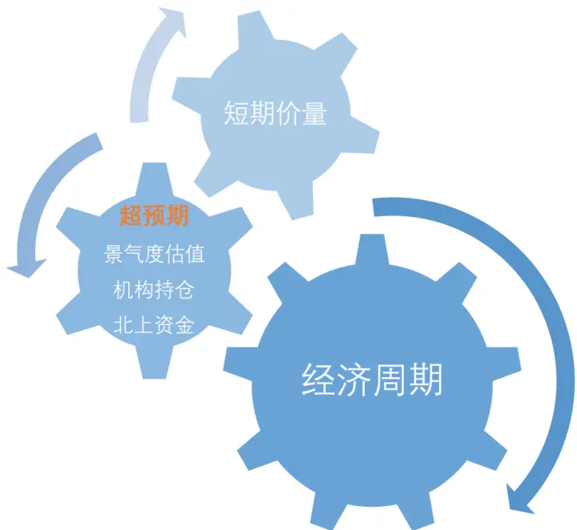
来源：国金证券研究所

超预期行业轮动的重点就在于识别行业超预期，并且衡量超预期的程度。从超预期的定义出发，个股超预期一般可以通过实际公告业绩超过预期业绩程度来衡量，然后将个股超预期合并到行业层面。此外我们注意到，在“财报季”分析师发布业绩点评报告时，研报文本（如标题）中对于业绩超预期也存在定性描述。因此，识别分析师研报中的相关描述，也可以找到超预期个股，从而进一步得到行业整体的超预期的情况。因此，本篇报告中，我们也将从业绩超预期和文本超预期两个维度对超预期进行衡量。相比单一使用一类方法，这种方法更加全面也可以起到互补的作用。

对于因子的有效性，我们采用因子 IC 测试和分位数组合测试方法进行研究。因子 IC 测试主要研究因子取值与下一期收益率的相关性，即

$$
RankIC_{t}=error\left(Rank\big(X_{t,m}\big),Rank\big(r_{t+1,m}\big)\right)
$$

其中，Rank表示计算变量排序， $X_{t,m}$ 表示因子取值， $r_{t+1,m}$ 表示下一期行业指数的收益率。IC的绝对值越高，因子的下期收益率的预测能力越强。IC的 t 值表示IC的绝对值不为 0 的概率，t 值越大，IC值就越显著不为 0。

对于分位数组合测试，我们按照因子值从高到低，将 29 个行业分为 6 组，以等权方式分别构建组合，从而研究不同分位数组合的表现。通过做多 Top 组合同时做空 Bottom 组合，可以得到多空组合（L-S 组合），通过该组合的表现来进一步衡量因子的收益。因子预测的频率为月频，回测区间为 2011 年 1 月 1 日至 2023 年 2 月 1 日，市场基准为 29个中信一级行业等权组合。

## 二、业绩超预期

## 2.1 业绩超预期因子的构建

业绩超预期指的是公司披露的盈利数据超过市场的一致预期，这里的市场一致预期可以采用卖方分析师的一致预期。
分析师发布的公司报告中，其对于公司的业绩预测往往具有核心价值，包括目标股价、盈利预测、个股评级等内容。

其中，分析师的个股评级属于离散数据，变化较小，且较多给出“买入”或“增持”评级，较少给出“卖出”评级，较难量化衡量，同时，有研究表明分析师评级在行业层面有效性较低[1]。而盈利预测的数据包含了大量可量化可比较的数据，具备较大研究价值，传统的一致预期因子也大量基于盈利预测的数据进行构建。衡量个股业绩超预期，可以将分析师预期净利润与个股公告净利润进行比较。

分析师群体对市场具有显著影响力，其对于个股的预期经常已经充分反应在当前的股票价格上，当分析师预期与公司实际业绩出现偏差时，市场在修正的过程中就会带来投资机会。为了将超预期应用于行业层面，我们首先需要计算个股的超预期指标。

这里我们使用了单季度的披露业绩和预测业绩，可以较快的反映市场短期的变化。而公司公告不仅包括了季报、半年报和年报，还包括了业绩预告和业绩快报。其中定期报告是所有上市公司都强制要求披露的，数量最多，信息最准确。业绩预告和业绩快报只有满足条件的公司被要求披露，其余企业并无披露义务，数量较少，准确度也相对较低，例如，业绩预告净利润一般给出一个范围。但业绩预告和业绩快报的披露往往会先于定期报告，因此时效性较高。

根据《上海证券交易所股票上市规则（2023 年 2 月修订）》、《深圳证券交易所股票上市规则（2023 年修订）》、《北京证券交易所股票上市规则（试行）》、《上海证券交易所科创板股票上市规则（2020 年 12 月修订）》、《深圳证券交易所创业板股票上市规则（2023 年修订）》，各市场对业绩预告和业绩快报的披露要求有所不同，定期报告一般都在 4 月30 日、8 月 31 日和 10 月 31日前完成披露，披露要求见下表所示。

图表2：不同业绩报告信息披露要求

| 公告类型 | 披露日期 |
| --- | --- |
| 业绩预告 | 主板（上交所、深交所）：1月31日前披露年度业绩预告；7月15日前披露半年业绩预告。 科创板：1月31日前披露年度业绩预告。 创业板：1月31日前披露年度业绩预告。 北交所：定期报告披露前披露业绩预告。 |
| 业绩快报 | 主板（上交所、深交所）：定期报告公告前披露。 科创板：2月28日前披露年度业绩快报。 创业板：所鼓励上市公司在定期报告公告前披露业绩快报。 北交所：2月28日前披露年度业绩快报。 |
| 定期报告 | 一季报和四季报在每年4月30日前披露； 二季报在每年8月31日前披露； 三季报在每年10月31日前披露。 |

来源：上交所，深交所、北交所，国金证券研究所

我们根据上述报告披露规则，可以给出不同板块在不同时间段可能使用到的业绩报告，从而更好的梳理超预期计算时候应用到的数据时间节点，见下图所示。

图表3：各板块不同业绩报告披露时间
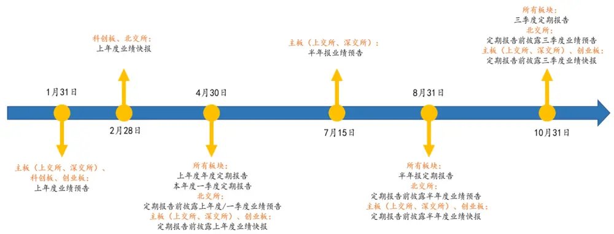
来源：上交所，深交所、北交所，国金证券研究所

分析师预期数据一般是对整个财年的预测，一般没有单个季度的预测数据。同时，分析师也会不断更新盈利预测，特别是在业绩报告披露之后。为了将当期年报的预测数据转化为单季度的预测数据，我们需要基于一些假设对全年的预测数据进行合理的拆分。

我们需要考虑以下问题，在业绩报告发布后，分析师会根据最新的披露业绩来更新预期观点，同时，我们需要充分利用当年已经披露的业绩报告来得到未披露报告期的更精准的预测。这里，我们假设未披露的若干个报告期的增速保持相同，等价于按照过去一年的对应报告期的净利润的占比进行拆分，我们通过以下公式来进行说明。

$$
g_{m,n}^{expect}=\frac{NI_{m}^{expect}-\sum_{i=1}^{n-1}NI_{m,i}}{\sum_{i=n}^{4}NI_{m-1,i}}-1
$$

$$
NI_{m,n}^{expect}=\left(1+g_{m,n}^{expect}\right)\times NI_{m-1,n}
$$

$NI_{m,n}^{expect}$ 表示拆分后第 m年第 n 个季度的分析师一致预期净利润， $NI_{m}^{expect}$ 表示第 m年分析师全年一致预期净利润，$\dot{NI_{m,i}}$ 表示第 m年第 i 个季度的实际披露净利润， $g_{m,n}^{expect}$ 表示用于计算第 m年第 n个季度的分析师一致预期净利润的增速。以三季度为例，我们需要用全年一致预期净利润扣减前两个季度已经披露的真实业绩，得到三季度和四季度的同比增速，然后根据上一年三季度的真实业绩，根据该同比增速，计算出预期三季度的业绩，见下图。

图表4：分析师一致预期单季度净利润拆分示例（三季度）
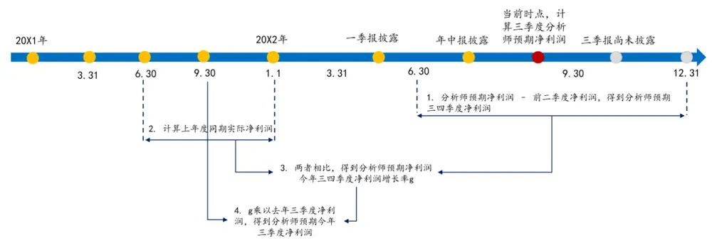
来源：国金证券研究所

对于定期报告前发布的业绩快报以及业绩预告等，我们设定了优先级，即定期公告>业绩快报>业绩预告。业绩预告一般是公布净利润区间，公告结果最不准确，而业绩快报一般公告净利润数值，结果相对业绩预告更可靠，定期报告的数据则是最准确的。我们计算了实际披露的净利润与一致预期净利润之差，通过一致预期净利润进行标准化，得到个股超预期的指标，然后在行业层面取中位数，得到行业业绩超预期因子，即

$$
SUE_{m,n}=\frac{NI_{m,n}-NI_{m,n}^{expect}}{abs\big(NI_{m,n}^{expect}\big)}
$$

$$
SUE_{m,n}^{industry}=median\big(SUE_{m,n}\big)
$$

$SUE_{m,n}$ 是个股在第 m 年第 n 个季度超预期的程度， $SUE_{m,n}^{industry}$ 为该行业超预期因子， $median(\cdots)$ 代表取行业内中位数,abs(…)代表取绝对值。中位数法可以天然降低样本中异常值带来的影响，在数据处理中具有一定的优势，同时也可以从一定程度上降低行业内股票分析师覆盖不全或者覆盖率较低的问题带来的影响。

## 2.2 业绩超预期因子有效性

我们对行业业绩超预期因子进行 IC 测试和分位数组合测试。从下表可以看出，业绩超预期因子 IC 均值为 3.07%。这说明行业层面实际盈利超过市场一致预期较高的行业，市场的确会进行价格修复，获得超额收益。从下图的 IC 的时间序列可以看出，大部分月份的 IC 为正，但在部分时间段因子可能会出现有效性下降的情况。

图表5：业绩超预期因子IC指标

| 因子 | 平均值 | 标准差 | 最小值 | 最大值 | 风险调整的IC | t统计量 |
| --- | --- | --- | --- | --- | --- | --- |
| 业绩超预期因子 | 3.07% | 24.45% | -47.29% | 66.75% | 0.13 | 1.51 |

来源：Wind，国金证券研究所

图表6：业绩超预期因子1C
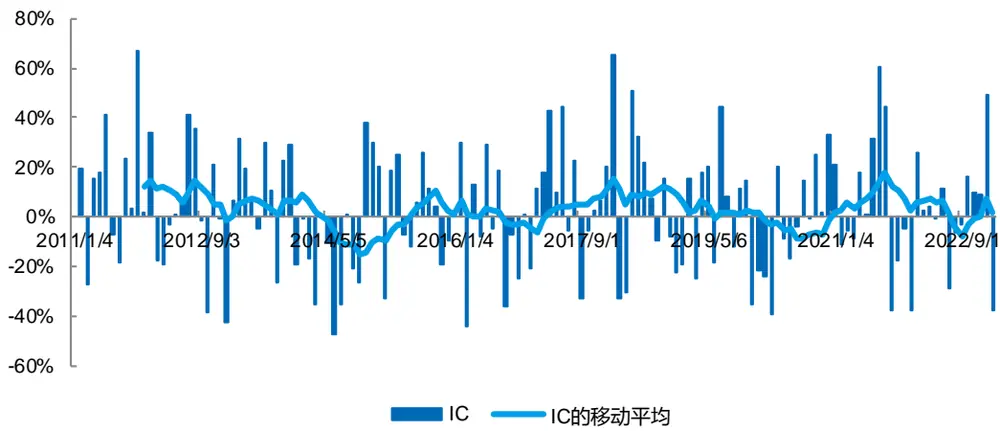
来源：Wind，国金证券研究所

下图展示了分位数组合的净值表现，可以看出 Top 组合跑赢市场组合，而 Bottom 组合跑输市场组合。从多空组合净值上来看，因子的收益波动也比较大，在 2018 年至 2020 年表现不佳，2021 年 9 月之后也出现了回撤。从收益上来看，Top 组合的年化超额收益率仅为 3.43%，多空组合的年化收益率为 7.47%，夏普比率为 0.52。

图表7：业绩超预期因子分位数组合净值
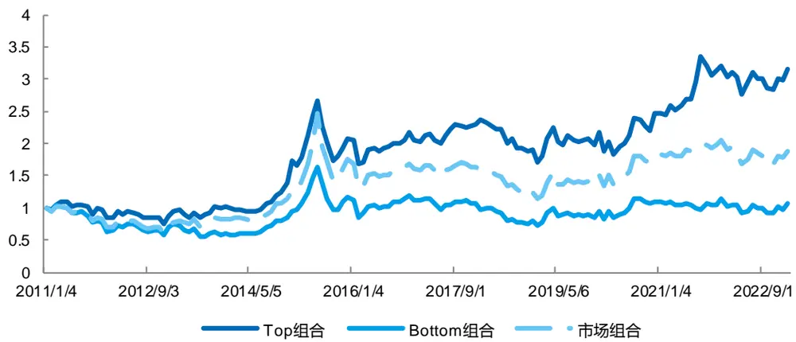
来源：Wind，国金证券研究所

从因子的表现来看，行业超预期因子不能够算的上一个非常出色的行业轮动因子，主要原因可能有以下几个：首先，分析师预期的数据质量参差不齐，将分析师一致预期作为市场一致预期可能会有偏差。另外，对于全年一致预期进行拆分基于诸多假设，可能也会带来误差。而且，分析师数据本身的覆盖有限，也存在样本的偏差。因此，我们还需要从更多的角度去衡量行业超预期。

图表8：业绩超预期因子多空组合表现
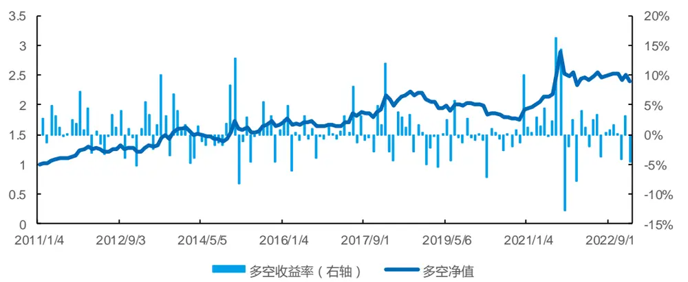
来源：Wind，国金证券研究所

图表9：业绩超预期因子分位数组合指标

| 组合 | 年化收益率 | 波动率 |  | 夏普比率 最大回撤率年化超额收益率 |  | 跟踪误差 | 信息比率超额最大回撤 |  |
| --- | --- | --- | --- | --- | --- | --- | --- | --- |
| Top | 10.01% | 24.18% | 0.41 | 36.89% | 3.43% | 10.49% | 0.33 | 24.87% |
| 1 | 6.90% | 27.13% | 0.25 | 61.11% | 1.55% | 7.54% | 0.20 | 21.73% |
| 2 | 5.78% | 27.67% | 0.21 | 52.12% | 0.64% | 6.94% | 0.09 | 20.65% |
| 3 | 4.17% | 27.87% | 0.15 | 55.89% | -0.91% | 7.94% | -0.11 | 21.25% |
| 4 | 2.19% | 27.59% | 0.08 | 60.53% | -2.77% | 6.76% | -0.41 | 33.69% |
| Bottom | 0.64% | 26.76% | 0.02 | 54.91% | -4.62% | 9.26% | -0.50 | 51.55% |
| 市场 | 5.39% | 25.61% | 0.21 | 53.63% |  |  |  |  |
| L-S | 7.47% | 14.23% | 0.52 | 21.39% |  | 1 | 一 |  |

来源：Wind，国金证券研究所

## 三、研报标题文本超预期

## 3.1 研报标题文本超预期因子的构建

分析师通过调研和深度研究，从获取的行业与公司的信息做出盈利预测，并发布研究报告。在“财报季”，随着定期报告的频繁发布，分析师会大量点评公司业绩。当公司的业绩表现优异时，分析师往往会在公司报告标题中进行提示。而通过对标题中的词语进行捕捉，可以获取分析师对公司除数据外的情感和语气的信息，如标题中明确表达超预期观点，代表站在分析师的视角下，公司业绩大幅超过其预测值。因此，通过标题摘要等报告文本，可以定性获取分析师视角下公司超预期的情况。

分析师对公司股票价格影响有关注度机制、权威度机制和一致性机制三种机制，关注度机制表示分析师关注越多的股票溢价越高，权威度机制表示明星分析师关注的股票溢价更高，一致性机制表示分析师预期一致的股票溢价更高[2]。在行业层面，行业内研报数量越多，可以认为该行业关注度越高，其中包含超预期信息的研报越多，则一致性越高，这类行业越有可能获得超额收益。基于上述思路，我们建立了行业的研报标题文本超预期因子。

由于摘要数据涉及数据可得性的问题，我们主要采用标题数据。为了提取超预期的信息，我们根据标题中是否含有超预期相关词语作分析师判断股票是否超预期的标准。超预期词汇包括“超预期”及其近义词（如“超过预期”、“超预告指引”、“惊喜”等），同时，为了增加覆盖股票数量，避免超预期个股数量少时可能带来的偏差，我们将“业绩大增”及其近义词（如“高速增长”、“大幅增长”、“大丰收”、“业绩暴增”等）、“新高”及其近义词（如“亮眼”、“喜人”、“巅峰”、“优异”等）也包括在内。研报标题中包含超预期文本中任一词汇，则认为该研报表达出“超预期”的观点。

为了全方位衡量行业超预期的情况，我们定义了三个指标，分别是研报超预期占比、股票超预期占比和单股票超预期研报比率，具体指标定义见下表。第一个指标站在研报的角度上，探究行业相关研报中超预期比例。第二个指标站在行业中股票的角度，探究该行业股票中出现超预期的比例。最后一个指标则重点放在单一股票出现超预期的强度，主要反映行业中每只股票平均多少家券商发出超预期的观点。这三个比例越高，均代表该行业从分析师的视角下超预期的程度越高。

图表10：研报标题文本超预期指标定义

| 指标 | 定义 |
| --- | --- |
| 研报超预期占比 | 某行业出现超预期的研报数量/该行业所有研报数量 |
| 股票超预期占比 | 某行业被认为超预期的股票数量/该行业所有股票数量 |
| 单股票超预期研报比率 | 某行业出现超预期的研报数量/该行业所有股票数量 |

来源：国金证券研究所

分析师对于公司的点评报告主要集中在公司研究报告，虽然行业研究报告中也包含公司的部分，但其在标题中表达公司观点的情形较少，因此我们重点选取了公司研究报告。我们滚动选取过去 30 日内的研报数据在每个行业上计算上述三个指标，并等权合成，得到研报标题文本超预期因子。该因子从研报占比、股票占比以及研报强度三个维度衡量了行业上分析师表达的超预期的观点。

## 3.2 研报标题文本超预期因子有效性

我们对研报标题文本超预期因子进行IC和分位数组合测试。从下表的结果可以看出，研报标题文本超预期因子IC均值为 4.81%，风险调整的 IC 为 0.22，表现好于行业业绩超预期因子。

图表11：研报标题文本超预期因子IC指标

| 因子 | 平均值 | 标准差 | 最小值 | 最大值 | 风险调整的IC | t统计量 |
| --- | --- | --- | --- | --- | --- | --- |
| 研报标题文本超预期因子 | 4.81% | 21.98% | -54.50% | 54.85% | 0.22 | 2.63 |

来源：Wind，国金证券研究所

图表12：研报标题文本超预期因子IC
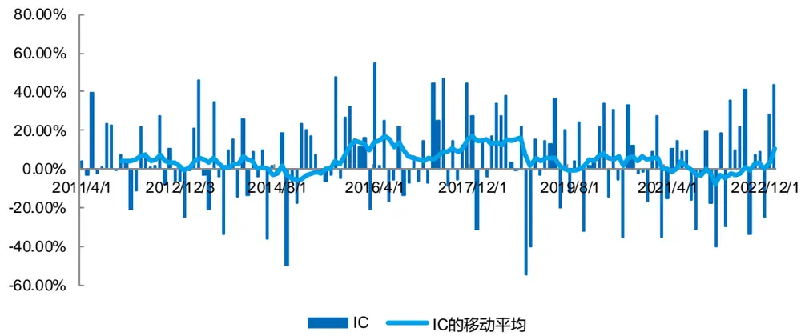
来源：Wind，国金证券研究所

从 IC 的时间序列表现可以看出，因子大部分月份都有正 IC，整体胜率较高，今年以来的前两个月表现较好。通过分位数组合测试，Top 组合相对于市场的优势非常明显，表现明显好于业绩超预期因子，Top 组合的年化超额收益率达到了 6.27%。

从多空组合表现来看，多空净值在 2014 年 11 月前表现一般，2021 年 2 月至2022 年2 月收益出现回调，其余时间段整体稳步增加，多空组合在最近一年表现优异，尤其是今年前两个月。多空组合年化收益率为 9.11%，夏普比率为0.74。从结果上看，研报标题文本超预期因子相比数据利润超预期因子优势非常明显，这说明通过分析师视角，精细化刻画个股超预期，比单纯使用一致预期作为基准计算业绩超预期更有效。

图表13：研报标题文本超预期因子分位数组合净值
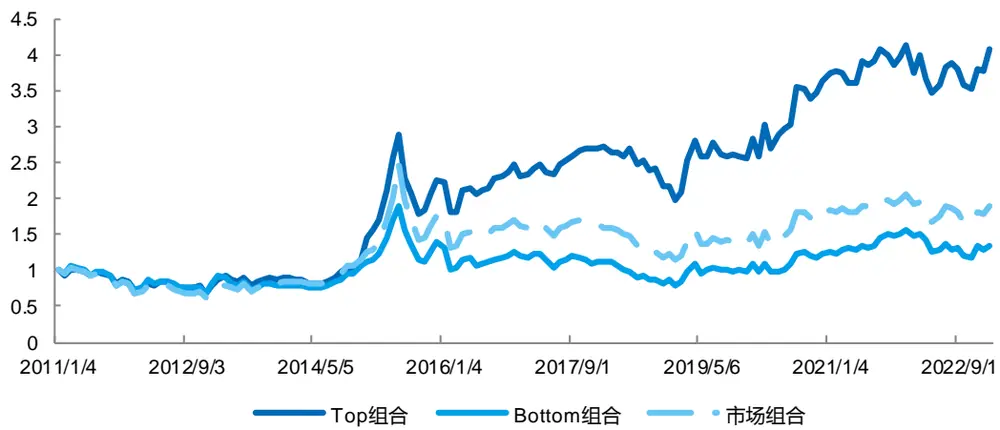
来源：Wind，国金证券研究所

图表14：研报标题文本超预期因子多空组合表现
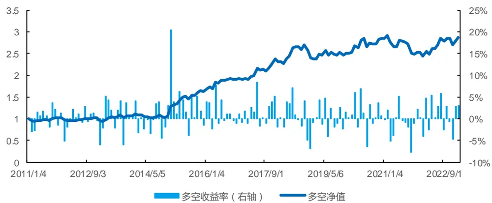
来源：Wind，国金证券研究所

图表15：研报标题文本超预期因子分位数组合指标

| 组合 | 年化收益率 | 波动率 | 夏普比率 | 最大回撤率 | 年化超额收益率 | 跟踪误差 | 信息比率 | 超额最大回撤 |
| --- | --- | --- | --- | --- | --- | --- | --- | --- |
| Top | 12.32% | 26.23% | 0.47 | 38.59% | 6.27% | 9.15% | 0.69 | 17.34% |
| 1 | 3.47% | 25.43% | 0.14 | 51.31% | -2.07% | 6.75% | -0.31 | 30.85% |
| 2 | 6.14% | 27.55% | 0.22 | 54.81% | 1.01% | 6.35% | 0.16 | 12.70% |
| 3 | 4.21% | 28.97% | 0.15 | 60.12% | -0.58% | 7.81% | -0.07 | 19.88% |
| 4 | 1.85% | 26.52% | 0.07 | 62.70% | -3.34% | 6.76% | -0.49 | 40.35% |
| Bottom | 2.46% | 24.95% | 0.10 | 58.13% | -3.27% | 8.16% | -0.40 | 46.69% |
| 市场 | 5.39% | 25.61% | 0.21 | 53.63% | 一 | 一 |  |  |
| L-S | 9.11% | 12.37% | 0.74 | 16.18% | 一 | 一 | 一 |  |

来源：Wind，国金证券研究所

## 四、行业超预期因子的合成

基于分析师一致预期的业绩超预期和基于研报标题的文本超预期指标两者各有优势，起到了互相补充的作用。虽然文本超预期因子预测能力更强，但其没有包含定量刻画超预期幅度的指标，而业绩超预期基于实际盈利数据与分析师一致预期数据，可以从定量角度进行衡量。因此，将两个指标结合起来，可以更好的描述行业超预期的特征。

图表16：业绩超预期和文本超预期因子截面秩相关系数均值

| 因子 | 业绩超预期因子 | 文本超预期因子 |
| --- | --- | --- |
| 业绩超预期因子 | 1 | 0.23 |
| 文本超预期因子 | 0.23 | 1 |

来源：Wind，国金证券研究所

首先，我们进行了因子相关性的分析，当因子与因子之间的相关性较低时，可以通过因子合成来提高稳定性，同时降低风险。从上表可以看出，业绩超预期和研报标题文本超预期因子秩相关性系数较低。

我们将业绩超预期和文本超预期因子以等权方式进行合成，得到合成的超预期因子。我们进一步对该合成因子进行IC 和分位数组合测试。可以看出，超预期因子大部分月份的 IC 为正，IC 均值为 4.26%，虽然相比文本超预期有所下降，但为了较全面衡量超预期的特征，我们还是进行了保留。

图表17：超预期因子1C
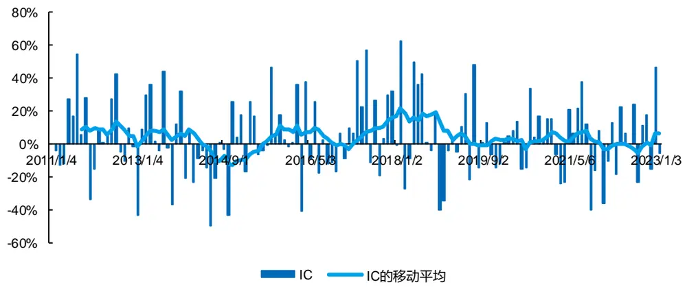
来源：Wind，国金证券研究所

图表18：超预期因子IC指标

| 因子 | 平均值 | 标准差 | 最小值 | 最大值 | 风险调整的IC | t统计量 |
| --- | --- | --- | --- | --- | --- | --- |
| 超预期合成因子 | 4.26% | 23.19% | -49.61% | 62.96% | 0.18 | 2.21 |

来源：Wind，国金证券研究所

从下图可以看出，超预期合成因子构造的分位数组合的年化超额收益率单调性非常明显，Top 组合显著好于市场组合。从分位数组合净值来看，Top 组合显著跑赢市场组合，年化超额收益率达到了 5.17%。合成后因子多空组合的净值更加平稳，年化收益率到达了 11.79%，夏普比率达到了 0.82，相比业绩超预期和研报超预期的多空组合表现均有明显的提升。这也说明，低相关性的因子合成后，可以较少因子失效的场景，降低因子收益的波动，从而提高因子表现和稳定性。

图表19：超预期因子分位数组合年化超额收益率
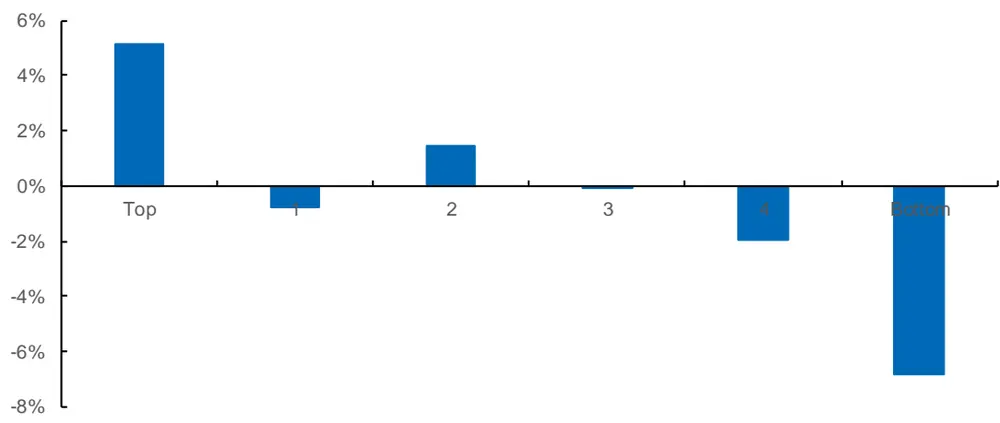
来源：Wind，国金证券研究所

图表20：超预期因子分位数组合净值
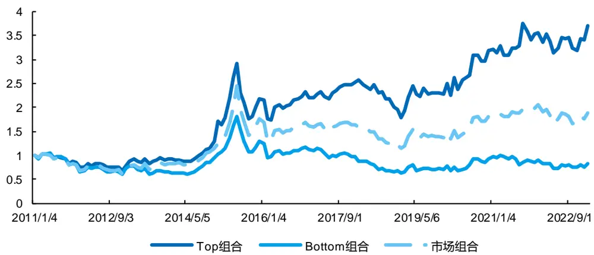
来源：Wind，国金证券研究所

图表21：超预期因子多空组合表现
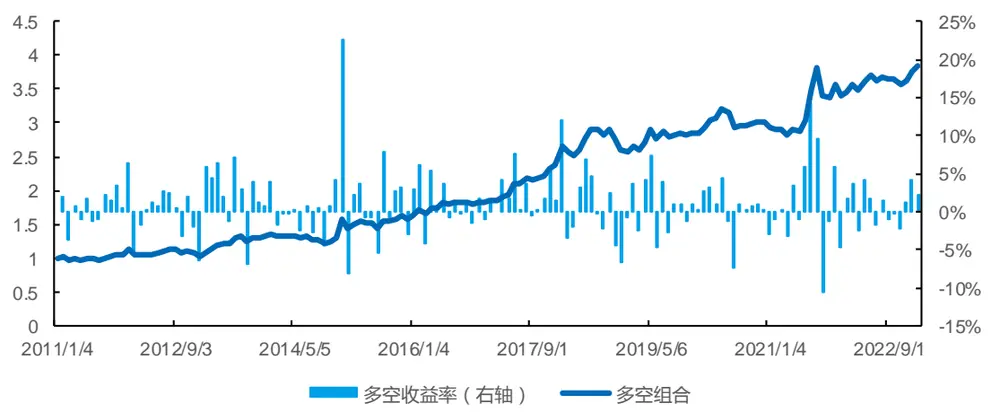
来源：Wind，国金证券研究所

图表22：超预期因子分位数组合指标

| 组合 | 年化收益率 | 波动率 | 夏普比率 | 最大回撤率 | 年化超额收益率 | 跟踪误差 | 信息比率 | 超额最大回撤 |
| --- | --- | --- | --- | --- | --- | --- | --- | --- |
| Top | 11.47% | 25.71% | 0.45 | 39.92% | 5.17% | 10.52% | 0.49 | 15.29% |
| 1 | 4.72% | 25.96% | 0.18 | 46.57% | -0.78% | 6.95% | -0.11 | 24.01% |
| 2 | 6.84% | 27.10% | 0.25 | 54.06% | 1.45% | 7.26% | 0.20 | 15.12% |
| 3 | 5.01% | 28.07% | 0.18 | 60.65% | -0.05% | 7.50% | -0.01 | 20.43% |
| 4 | 3.01% | 27.71% | 0.11 | 56.38% | -1.93% | 7.29% | -0.26 | 28.67% |
| Bottom | -1.64% | 26.67% | -0.06 | 65.77% | -6.81% | 9.23% | -0.74 | 60.63% |
| 市场 | 5.39% | 25.61% | 0.21 | 53.63% |  |  |  |  |
| L-S | 11.79% | 14.30% | 0.82 | 12.08% |  |  |  |  |

来源：Wind，国金证券研究所

## 五、多维度行业轮动框架

## 5.1 超预期因子对传统轮动框架的增强

在行业配置方面，我们此前探索了一系列能够预测行业收益的因子，涵盖了短期量价特征、景气度估值、机构持仓以及北上资金等。其中，景气度估值模型从盈利、质量和估值动量三个维度刻画了行业的盈利与估值变化特征（具体因子定义参考《金融工程 2023 年度投资策略：拨云见日终有时》）。本篇报告中，我们将构建的行业超预期因子与景气度估值因子进行结合，并叠加分析师预期因子，构建多维度行业轮动框架。

这里，我们首先定义了分析师预期类因子。当行业内上市公司的分析师一致预期整体出现上调时，可能意味着行业出现利好或者盈利有提升的预期，未来行业可能具有优势。同时，我们也发现分析师对于下一年以及第二年业绩的一致预期变化在行业收益预测上的有效性更强。这说明市场不仅关注行业短期的变化，也关注长期行业的预期。我们计算了行业中公司 EPS 以及净利润（NI）过去 2 个月的变化率共 3 个指标，通过流通市值进行加权，见下表。

图表23：分析师预期类因子定义

| 因子 | 定义 | 行业加权方式 |
| --- | --- | --- |
| EPS_FY1_Chg_2M | 分析师对下一年一致预期EPS在过去2个月变化率 | 流通市值加权 |
| EPS_FY2_Chg_2M | 分析师对第二年一致预期EPS在过去2个月变化率 | 流通市值加权 |
| NI_FY2_Chg_2M | 分析师对第二年一致预期净利润在过去2个月变化率流通市值加权 |  |

来源：国金证券研究所

下表展示了分析预期类因子的 IC 与多空组合指标。可以看出，EPS_FY1_Chg_2M 因子表现最好，IC 达到了 9.32%，多空组合年化收益率到了 21.01%。为了规避单因子失效的风险，我们将三个因子等权合成为分析师预期因子，IC 均值为 8.39%，多空组合年化收益率为 19.07%。

图表24：分析师预期类因子IC和多空组合指标

| 因子 | 平均值 | 风险调整的IC | 多空组合年化收益率 | 多空组合夏普比率 |
| --- | --- | --- | --- | --- |
| EPS_FY1_Chg_2M | 9.32% | 0.37 | 21.01% | 1.22 |
| EPS_FY2_Chg_2M | 8.17% | 0.33 | 17.37% | 0.99 |
| NI_FY2_Chg_2M | 6.73% | 0.27 | 17.47% | 1.09 |
| 分析师预期因子 | 8.39% | 0.33 | 19.07% | 1.09 |

来源：Wind，国金证券研究所

通过测算分析师预期、超预期、盈利、质量和价格动量因子之间的秩相关性系数，可以发现超预期因子与盈利因子以及分析师预期因子的相关性较高。

图表25：大类因子截面秩相关系数均值

| 因子 | 分析师预期因子 | 价格动量因子 | 盈利因子 | 质量因子 | 超预期因子 |
| --- | --- | --- | --- | --- | --- |
| 分析师预期因子 | 1.00 | 0.20 | 0.37 | 0.13 | 0.27 |
| 价格动量因子 | 0.20 | 1.00 | 0.08 | -0.01 | 0.01 |
| 盈利因子 | 0.37 | 0.08 | 1.00 | 0.24 | 0.31 |
| 质量因子 | 0.13 | -0.01 | 0.24 | 1.00 | 0.14 |
| 超预期因子 | 0.27 | 0.01 | 0.31 | 0.14 | 1.00 |

来源：Wind，国金证券研究所

我们将超预期因子与盈利因子和分析师因子进行正交化，将残差项作为新的超预期因子，其 IC 均值为 2.18%，多空组合的年化收益为 8.10%，夏普比率为 0.67。可以看出，经过正交化后超预期因子中仍然包含一定的预测信息，而且正交化后的超预期因子收益的波动率有明显下降。

图表26：正交化后的超预期因子IC指标

| 因子 | 平均值 | 标准差 | 最小值 | 最大值 | 风险调整的IC | t统计量 |
| --- | --- | --- | --- | --- | --- | --- |
| 超预期因子（正交化） | 2.18% | 22.18% | -63.05% | 56.45% | 0.10 | 1.18 |
| 超预期因子（未正交化） | 4.26% | 23.19% | -49.61% | 62.96% | 0.18 | 2.21 |

来源：Wind，国金证券研究所

图表27：正交化后的超预期因子多空组合净值
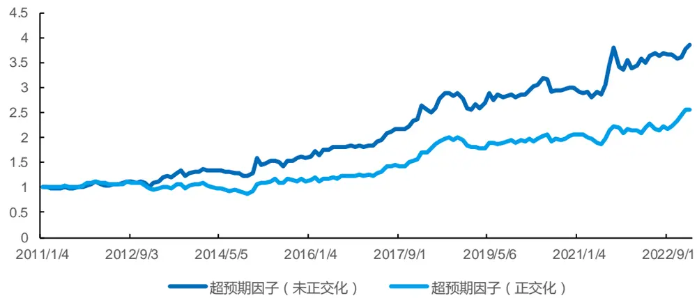
来源：Wind，国金证券研究所

图表28：正交化后的超预期因子多空数组合指标

| 因子 | 年化收益率 | 波动率 | 夏普比率 | 最大回撤率 |
| --- | --- | --- | --- | --- |
| 超预期因子（未正交化） | 11.79% | 14.30% | 0.82 | 12.08% |
| 超预期因子（正交化） | 8.10% | 12.14% | 0.67 | 21.59% |

来源：Wind，国金证券研究所

## 5.2 超预期增强轮动因子的合成

我们将正交化后的超预期因子与分析预期、盈利、质量和估值动量因子以等权方式合成为超预期增强轮动因子，可以从多个维度对行业收益进行预测。合成后的超预期增强轮动因子的 IC 均值为 9.70%，风险调整的 IC 为 0.35。为了对比，我们将盈利、质量、估值动量以及分析师预期因子等权合成，可以看出，加入超预期因子后，合成因子的IC 和风险调整的 IC 均有提高。

图表29：超预期增强轮动因子IC指标

| 因子 | 平均值 | 标准差 | 最小值 | 最大值 | 风险调整的IC | t统计量 |
| --- | --- | --- | --- | --- | --- | --- |
| 超预期增强轮动因子 | 9.70% | 27.70% | -56.06% | 71.77% | 0.35 | 4.22 |
| 景气度估值+分析师预期因子 | 9.66% | 28.96% | -60.74% | 69.90% | 0.33 | 4.02 |

来源：Wind，国金证券研究所

从分位数表现上来看，超预期增强轮动因子的 Top 组合相对于市场组合的优势非常明显，年化超额收益率达到了10.49%。从多空组合来看，超预期增强轮动因子的多空组合年化收益率为 20.43%，夏普比率为 1.15，相比景气度估值+分析师预期因子，其多空组合年化收益率提高了 2.08%，波动率反而下降，夏普比率进一步提高。

图表30：超预期增强轮动因子分位数组合净值
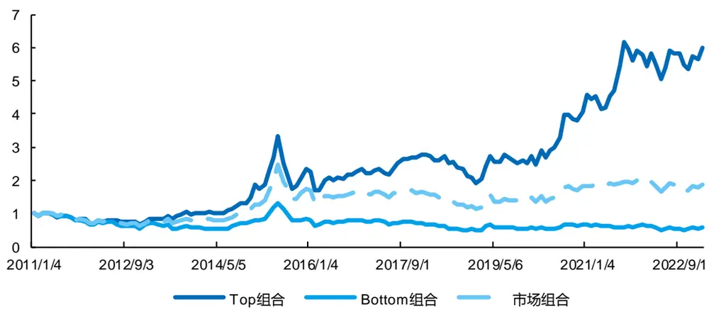
来源：Wind，国金证券研究所

图表31：超预期增强轮动因子多空组合净值
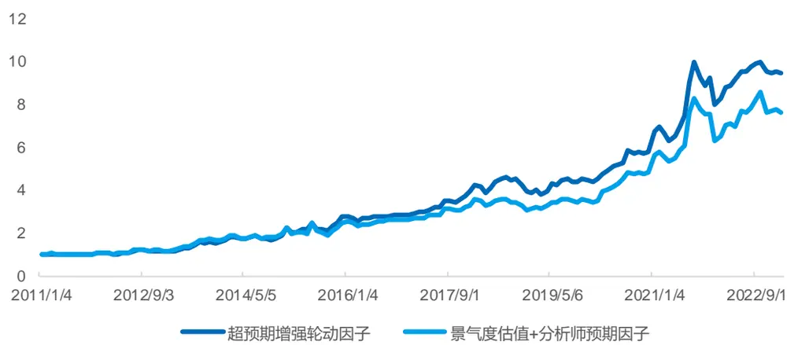
来源：Wind，国金证券研究所

图表32：超预期增强轮动因子多空组合指标

| 因子 | 年化收益率 | 波动率 | 夏普比率 | 最大回撤率 |
| --- | --- | --- | --- | --- |
| 超预期增强轮动因子 | 20.43% | 17.74% | 1.15 | 19.78% |
| 景气度估值+分析师预期因子 | 18.35% | 19.51% | 0.94 | 23.70% |

来源：Wind，国金证券研究所

## 六、超预期增强行业轮动策略

前文中，我们构建的超预期增强轮动因子在行业预测上具有显著效果，本章我们将进一步构建超预期增强行业轮动策略。我们按照月度进行调仓，每月初选取排名前 1/6 的行业，即 5 个行业，以等权方式构建行业轮动组合，手续费取千分之三，基准组合为 29 个行业等权构建的组合，每月初再平衡，回测时间段为 2011 年 1 月 1 日至 2023 年 2月 1 日。

下图是超预期增强行业轮动策略的净值表现。相比行业等权基准，超预期增强行业轮动策略的优势明显，而相比景气度估值+分析师预期行业轮动策略，超预期增强行业轮动策略也更具优势。

图表33：超预期增强行业轮动策略净值
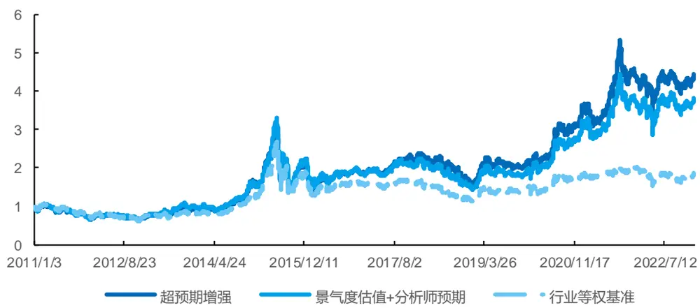
来源：Wind，国金证券研究所

超预期增强行业轮动策略的年化收益率为 13.10%，夏普比率为 0.49，而行业等权基准的年化收益率仅为 5.26%，夏普比率为 0.21。相较于行业等权基准，行业轮动策略的年化超额收益率为 7.89%。相较于分析师预期+景气度估值行业轮动策略，超预期增强行业轮动策略年化超额收益率提高 1.20%，信息比率提高了 0.13。策略在 2022 年这样的行业切换非常频繁的年份表现优异，2022 年的超额收益率为 7.43%。

图表34：超预期增强行业轮动策略超额净值
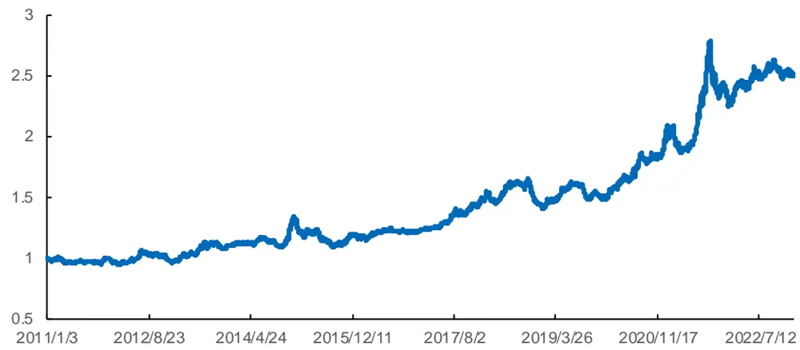
来源：Wind，国金证券研究所

图表35：超预期增强行业轮动策略指标

| 统计指标 | 超预期增强 | 景气度估值+分析师预期 | 行业等权基准 |
| --- | --- | --- | --- |
| 年化收益率 | 13.10% | 11.74% | 5.26% |
| 年化波动率 | 26.53% | 27.12% | 24.54% |
| 夏普比率 | 0.49 | 0.43 | 0.21 |
| 最大回撤率 | 54.44% | 56.64% | 59.00% |
| 年化超额收益率 | 7.89% | 6.68% | 一 |
| 跟踪误差 | 9.12% | 9.14% | 一 |
| 信息比率 | 0.86 | 0.73 | 一 |
| 超额最大回撤率 | 19.18% | 18.52% | 一 |
| 双边换手率（月度） | 68.35% | 56.23% |  |

来源：Wind，国金证券研究所

超预期增强行业轮动策略的月均双边换手率为 68.35%。分年度看，策略在 2015 年表现不佳，大部分年份均有正超额收益，负超额收益的年份整体负超额收益率也相对较低。策略在最近2020年至2022年超额收益较高，2020年、2021年和 2022 年的超额收益率分别达到了 36.62%、17.81%和 7.43%。

图表36：超预期增强行业轮动策略分年度表现
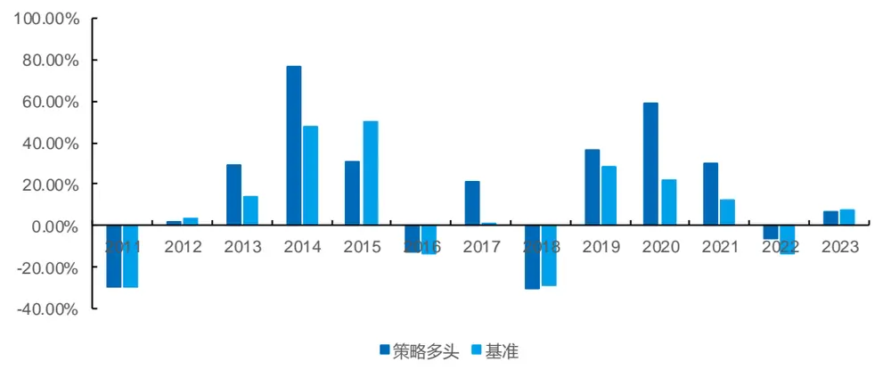
来源：Wind，国金证券研究所

## 七、总结

本篇报告探索了超预期信息在行业轮动策略中的应用，我们结合分析师一致预期和分析师研报标题两类数据构建了业绩超预期因子和研报标题文本超预期因子，两种方式构造的因子均对行业收益率具有预测能力。

我们将业绩超预期因子与研报标题文本超预期因子以等权方式合成，得到的超预期因子的 IC 在大部分月份为正，IC均值为 4.26%，多空净值更加平稳，年化收益率达到了 11.79%，夏普比率达到了 0.82，相比单因子进一步提高。

我们定义了行业分析师预期因子，然后将超预期因子与盈利因子和分析师预期因子进行正交化，再将残差项与分析师预期、盈利、质量和价格动量因子以等权方式合成为超预期增强轮动因子。合成后因子的 IC 均值为 9.70%，多空年化收益率为 20.43%，夏普比率为 1.15。相比景气度估值+分析师预期因子，超预期增强轮动因子的多空年化收益率提高了 2.08%，波动率反而下降，夏普比率进一步提高。这表明超预期因子的确可以增强传统行业轮动框架。

我们利用超预期增强轮动因子构建了超预期增强行业轮动策略。策略的年化收益率为 13.10%，夏普比率为 0.49。相较于行业等权基准，行业轮动策略的年化超额收益率为 7.85%。相较于景气度估值+分析师预期行业轮动策略，超预期增强行业轮动策略年化超额收益率提高了 1.20%。策略在最近 2020 年至 2022 年表现优异，2020 年、2021 年和2022 年的超额收益率分别达到了 36.62%、17.81%和 7.43%。

## 参考资料

[1] 朱 俊 . 基 于 行 业 视 角 的 证 券 分 析 师 荐 股 报 告 有 效 性 研 究 [D]. 天 津 师 范 大学,2022.DOI:10.27363/d.cnki.gtsfu.2022.000518.

[2]庄家炽,李国武,乔天宇.证券分析师预测与上市公司股票溢价——社会认可视角的解释[J].社会学研究,2022,37(06):101-121+228.

## 风险提示

1、以上结果通过历史数据统计、建模和测算完成，历史规律未来可能存在失效的风险。

2、各类因子可能会受到政策、市场环境发生变化的影响，出现阶段性失效的风险。

3、市场可能出现超出模型预期的变化，导致策略出现超出模型估计的波动和回撤。

## 特别声明：

国金证券股份有限公司经中国证券监督管理委员会批准，已具备证券投资咨询业务资格。

本报告版权归“国金证券股份有限公司”（以下简称“国金证券”）所有，未经事先书面授权，任何机构和个人均不得以任何方式对本报告的任何部分制作任何形式的复制、转发、转载、引用、修改、仿制、刊发，或以任何侵犯本公司版权的其他方式使用。经过书面授权的引用、刊发，需注明出处为“国金证券股份有限公司”，且不得对本报告进行任何有悖原意的删节和修改。

本报告的产生基于国金证券及其研究人员认为可信的公开资料或实地调研资料，但国金证券及其研究人员对这些信息的准确性和完整性不作任何保证。本报告反映撰写研究人员的不同设想、见解及分析方法，故本报告所载观点可能与其他类似研究报告的观点及市场实际情况不一致，国金证券不对使用本报告所包含的材料产生的任何直接或间接损失或与此有关的其他任何损失承担任何责任。且本报告中的资料、意见、预测均反映报告初次公开发布时的判断，在不作事先通知的情况下，可能会随时调整，亦可因使用不同假设和标准、采用不同观点和分析方法而与国金证券其它业务部门、单位或附属机构在制作类似的其他材料时所给出的意见不同或者相反。

本报告仅为参考之用，在任何地区均不应被视为买卖任何证券、金融工具的要约或要约邀请。本报告提及的任何证券或金融工具均可能含有重大的风险，可能不易变卖以及不适合所有投资者。本报告所提及的证券或金融工具的价格、价值及收益可能会受汇率影响而波动。过往的业绩并不能代表未来的表现。

客户应当考虑到国金证券存在可能影响本报告客观性的利益冲突，而不应视本报告为作出投资决策的唯一因素。证券研究报告是用于服务具备专业知识的投资者和投资顾问的专业产品，使用时必须经专业人士进行解读。国金证券建议获取报告人员应考虑本报告的任何意见或建议是否符合其特定状况，以及（若有必要）咨询独立投资顾问。报告本身、报告中的信息或所表达意见也不构成投资、法律、会计或税务的最终操作建议，国金证券不就报告中的内容对最终操作建议做出任何担保，在任何时候均不构成对任何人的个人推荐。

在法律允许的情况下，国金证券的关联机构可能会持有报告中涉及的公司所发行的证券并进行交易，并可能为这些公司正在提供或争取提供多种金融服务。

本报告并非意图发送、发布给在当地法律或监管规则下不允许向其发送、发布该研究报告的人员。国金证券并不因收件人收到本报告而视其为国金证券的客户。本报告对于收件人而言属高度机密，只有符合条件的收件人才能使用。根据《证券期货投资者适当性管理办法》，本报告仅供国金证券股份有限公司客户中风险评级高于 C3 级(含 C3 级）的投资者使用；本报告所包含的观点及建议并未考虑个别客户的特殊状况、目标或需要，不应被视为对特定客户关于特定证券或金融工具的建议或策略。对于本报告中提及的任何证券或金融工具，本报告的收件人须保持自身的独立判断。使用国金证券研究报告进行投资，遭受任何损失，国金证券不承担相关法律责任。

若国金证券以外的任何机构或个人发送本报告，则由该机构或个人为此发送行为承担全部责任。本报告不构成国金证券向发送本报告机构或个人的收件人提供投资建议，国金证券不为此承担任何责任。

此报告仅限于中国境内使用。国金证券版权所有，保留一切权利。

上海

电话：021-60753903

传真：021-61038200

地址：上海浦东新区芳甸路 1088 号紫竹国际大厦 7 楼

邮箱：researchsh@gjzq.com.cn

深圳

北京

邮编：201204

电话：010-85950438

电话：0755-83831378

邮箱：researchbj@gjzq.com.cn

邮编：100005

地址：北京市东城区建内大街 26 号新闻大厦 8 层南侧

传真：0755-83830558

邮箱：researchsz@gjzq.com.cn

邮编：518000

地址：中国深圳市福田区中心四路 1-1 号嘉里建设广场 T3-2402