# Beta猎手系列之四

金融工程专题报告

证券研究报告

金融工程组

分析师：高智威（执业

联系人：许坤圣

S1130522110003)

xukunsheng@gjzq.com.cn

gaozhiw@gjzq.com.cn

## 如何利用ChatGPT解析卖方策略观点并构建行业轮动策略？

## GPT-4 分析文本的原理解析

OpenAI 公司发布的 GPT-4（Generative Pre-trained Transformer-4）模型具备高效理解和生成自然语言文本的能力，应用范围广泛且无需微调即可实现不同类型的生成型任务。其优势主要得益于预训练所用海量参数规模和数据量产生的涌现（Emergence）现象以及在微调阶段引入的基于人类反馈的强化学习（RLHF）技术。GPT-4 模型整体的结构细节还未公布，内部的基础Transformer架构通过分词与编码、位置提取与编码、嵌入、提取特征、生成序列、输出的基本过程来分析文本。

GPT-4 模型在技术上有三大创新：参数容量更庞大、数据来源更广泛、不正当行为率显著降低；同时也存在文本输入长度限制和回答时效性限制两个局限，前者可以通过优化输入文本的方式尽量避免，后者可以先借助微软公司的 NewBing 收集时效性信息、再使用 GPT-4 对信息进行分析总结。

## ChatGPT 挖掘策略研报中的行业配置信息

卖方策略团队会综合考虑宏观经济环境、产业链和行业政策等各类非结构化的数据，并定期给出推荐的行业与对应理由。其推荐理由会包含政策等难以量化的信息，这也是当前量化策略中难以考虑到的因素，因此我们认为卖方策略团队观点能为传统量化的行业轮动策略带来增量收益。另外卖方策略观点往往推荐多个行业，但缺乏行业间比较，要将卖方策略观点融入量化配置模型，需更加详细的行业排名数据。然而在分析师撰写报告的时候，会从多个角度包括语言组织形式、论据以及观点情绪等角度表达自己的倾向，只是报告中未将这样的倾向性量化出来。GPT 模型有强大的文本分析与理解能力，能识别文本的情感倾向性，并根据用户的需求从复杂文本中提炼出精简的观点与理由。通过 GPT 的文本分析可以帮忙提炼出分析师文本中的倾向性，从而构建出推荐行业的排名打分。

我们将 GPT-4 模型应用于基于卖方策略团队月报的行业打分任务。我们首先明确行业配置任务的需求，并按照提示工程的方法将任务需求转化为 Prompt 提示文本。在使用过程中我们不断修正输出结果，并总结出以下要点：1、文本中避免使用“行话”,必要时给出解释；2、模型对负面词汇较敏感，需要对输入文本进行筛选；3、打分理由可能显示不全，根据输入文本检查结果的合理性；4、模型可能“过度解读”导致打分不稳定，要保证文本的信息量充足。

## GPT 策略研报因子构建与检验

我们根据市面上 16 家卖方策略团队的月度报告生成打分数据，并将每个行业当月得分的中位数作为 GPT 策略研报配置因子，发现该因子 IC 值表现不佳，但分组单调性明显，说明具有一定的预测能力。我们滚动挑选过去半年表现最好的4个卖方策略团队，并根据其对各行业的打分中位数构造GPT精选配置因子，因子IC均值为0.94%，Top组合年化收益率 8.46%。

## GPT 精选因子轮动策略

我们以中信一级行业等权配置作为基准，并根据 GPT 精选配置因子构建了 GPT 精选因子轮动策略，策略为 2021 年 7月至2023年4月每月调仓，每次选取因子得分前6的行业等权配置，手续费千分之二。策略的年化收益率为6.03%，夏普比率为 0.28，相较于等权基准，策略的年化超额收益率达到 9.63%，信息比率为 0.95。

## 风险提示

以上结果通过历史数据统计、建模和测算完成，在政策、市场环境发生变化时模型存在失效的风险。

## 一、GPT-4 分析文本的原理解析

本文是国金金工 Beta 猎手系列的第四篇，同时也是 ChatGPT 量化研究的第二篇，我们将继续探讨一下新发布的 GTP-4 在行业轮动方向的一些应用。经过测试，我们发现模型经过一定的引导能够总结卖方策略团队的月度行业观点，并对中信一级行业进行打分，最终我们得到了 GPT 行业打分因子，将其应用于行业轮动策略上。

## 1.1 GPT-4：文本分析领域的里程碑

2023 年 3 月 15 日，OpenAI 公司发布了 GPT-4（Generative Pre-trained Transformer-4）模型，引发了社会各界的广泛关注。迄今为止，已经发布了 5 个 GPT 版本：GPT-1、GPT-2、GPT-3、GPT-3.5（ChatGPT）和 GPT-4，经过前几代模型的迭代演化，GPT-4 通过深度学习并利用更多数据和计算方法，不仅可以处理图像、文本并生成文本输出，而且可处理更复杂、更细微的指令，比如进行高级推理和编辑生成具有创意性或技术性的文章。

具体到文本分析领域，GPT-4 具备广泛且强大的能力，包括：语言理解、信息提取、文本分类、情感分析、文本摘要、语义关系识别、文本生成、问答系统、机器翻译、自然语言推理，因此能够在搜索引擎、智能助手、内容推荐系统、社交媒体分析等场景中得到应用。

然而，目前 GPT-4 可能无法直接应用于专业性较高的量化研究领域，还需要专业人士提供指导和审查。下面我们将从文本分析的角度切入，为读者介绍 GPT-4 的底层逻辑和在投资分析领域的辅助应用。

图表1：GPT系列模型的迭代演化

|  | 模型名称发布时间参数数量 |  | 数据集 | 数据量 | 训练方法 | 目前局限性 |
| --- | --- | --- | --- | --- | --- | --- |
| GPT-1 | 2018.6 | 1.17B | BooksCorpus 和 英文维基百科 WedText（即社 | 5GB | 基于Transformer 模型； 采用自回归方式预训练 | 规模和能力相对较小； 处理复杂任务表现不佳； 可能输出存在偏见或错误的内容 |
| GPT-2 | 2019.2 | 15B | 交媒体平台 Reddit 上高赞文 章） | 40GB | 基于深层 Transformer 模型； 采用自回归方式预训练； 能够输出流畅文本 | 只能处理单语言文本； 可能输出存在偏见或错误的内容 对问题的理解不够深入； |
| GPT-3 | 2020.5 | 1750B | Common Crawl 等 多个数据源（包 括 WedText) | 45TB | 基于深层 Transformer 模型； 采用自回归方式预训练； 能够完成多种NLP 任务 基于深层 Transformer 模型； | 可能输出存在偏见或不真实的内容； 需要大量的计算资源和能源进行训练 和部署 |
| GPT-3.5 2022.11 |  | 未公布 | 未公布（包括文 本代码混合体） | 未公布（可 能超过 50TB) | 采用自回归方式预训练； 能够接受文本输入； 可进行流畅对话 基于深层 Transformer 模型； | 需要大量计算资源训练； 可能会产生伪造或具有偏见的内容； 无法联网，时效性受限 需要大量计算资源，可能导致环境和 |
| GPT-4 | 2023.3 | 未公布 | 未公布 | 未公布（可 能超过 100TB) | 采用自回归方式预训练； 能够接受文本和图像输入； 可进行流畅对话 | 成本问题； 可能会产生伪造或具有偏见的内容； 仍旧无法联网，数据集截止到2021 年9月 |

来源：《GPT-4 Technical Report》，国金证券研究所

通过 OpenAI 公司发布的技术报告《GPT-4 Technical Report》，我们可以一窥 GPT-4 高效理解和生成自然语言文本的能力：在各种专业和学术测试中，它都表现出人类水平的表现，比如统一律师考试、SAT 阅读与写作、生物奥林匹克中的分数都在应试者中排名前 10%。除此之外，通过识别特定的字符和模式的方式，GPT-4 能够实现处理不同格式的文本，比如：通过 markdown 表格中的分隔线、表头、单元格等结构特点解析表格中的信息，进而实现回答关于表格内容的问题、执行数据操作或者将表格转换成其他格式等处理。

在 GPT-4 实际分析文本的过程中，主要包含以下几个步骤：

1. 接收输入：当用户提问或发出请求后，接收一段文本输入。

2. 转化词向量：将接收到的文本输入分解成词汇单元，然后使用编码器编码成向量形式。

3. 理解上下文：根据训练数据和知识库，理解输入文本的上下文，并进行相关信息匹配。

4. 生成回应：通过输出层生成可能的回应文本，选择最佳回应。

5. 评估与优化：评估生成的回应是否满足用户需求，否则通过迭代优化生成更好的回应。

6. 输出：将最终选定的回应文本发送给用户。

其中，上下文理解是 GPT-4 强大自然语言处理能力的核心所在，主要得益于它在预训练所用的海量参数规模和数据量产生的涌现（Emergence）现象，通过量变产生质变，以及在微调阶段引入的基于人类反馈的强化学习（RLHF）技术。

InstructGPT 模型（GPT-3.5 实验版本）最先引入 RLHF，由 GPT-4 继续沿用，目标是通过人类反馈来改善强化学习模型的性能，分为以下三个阶段：首先，人类标注员（labeler）从指示库（prompt database）中采样作答，通过有监督学习微调模型；之后，标注员向模型发出指示（prompt），对模型生成的回答根据偏好程度进行排序，用来训练奖励模型（reward model）；最后，奖励模型从指示库中采样，运用近端策略优化（PPO）再次微调模型，即在已有模型基础上继续进行更新，同时使用截断函数限制每次更新的改变量大小，保证强化学习的稳定性，得到最终的 InstructGPT 模型。

Ouyang et al（2022）发现：“尽管参数少了 100 倍，但 1.3B 参数的 InstructGPT 的输出仍要优于 175B 参数的 GPT-3 的输出”，由此可见 RLHF 技术带来的巨大提升。由于这个过程里面也用到了 prompt，因此后面通过设计 GTP-4 的 prompt 可以得到比较有效的结果，我们将在 3.1 节做详细介绍。

图表2：GPT-4分析文本主要步骤
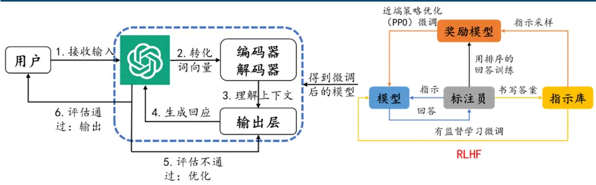
来源：《Training language models to follow instructions with human feedback》（Ouyang，2022），国金证券研究所

## 1.2 Transformer：GPT 模型的支柱

GPT 模型都是基于 Transformer 架构，即一种由 Ashish Vaswani et al（2017）提出的神经网络结构。相较于循环神经网络（RNN）、卷积神经网络（CNN）等传统结构，Transformer 引入了多头自注意力机制（Multi-Head Attention），通过在所有输入位置上并行计算权重，可以高效处理长距离依赖关系，同时有效缓解信息传递中的梯度消失和梯度爆炸问题。

在 Transformer 架构的基础上，演化了三个分支的大型语言模型（LLM）：基于解码器和编码器（Encode- Decoder）、基于编码器（Encoder Only）和基于解码器（DecoderOnly），其中 GPT 模型使用的是基于解码器的方案。作为对比，我们选取 Google 公司基于编码器方案研发的 BERT 模型（BERT、RoBERTa、ALBERT、ELECTRA），研究两者的主要区别。

在研究方向方面，BERT 模型追求功能的多样化，可以针对特定任务在最后增加微调层并重新训练整个模型；而 GPT 模型专攻自然语言学习领域，预训练规模更大，只能根据简短的提示进行微调。

在结构方面，BERT 模型是双向的、通过上下文预测遮盖单词，适用于自然语言理解任务，如问答、文本分类、阅读理解等；而 GPT 模型是单向的、通过上文预测下文，在自然语言生成任务上通常表现更好，如对话生成、机器翻译、文本补全等。

在语言表达方面，Ananya Ganesh et al（2021）研究发现：GPT-3 在语言表示方面表现更好，因为它侧重捕捉上文信息，在自然语言生成任务中能够生成连贯的文本；相比之下，BERT 侧重分析输入文本与对应标签的关系，尽管也能捕捉一定的上下文信息，但是它的模型更小，所以在处理复杂任务时不如 GPT-3 表现出色。

总的来说，BERT 模型更适合简短文本的理解任务，扩展性强；GPT 模型更适合复杂文本的生成任务，语言表达能力更强、生成文本质量更高。

图表3：GPT 和BERT模型的对比

| 模型 | 分类 | 研究方向 | 结构 | 侧重点 | 数据来源 | 适用任务 |
| --- | --- | --- | --- | --- | --- | --- |
| BERT | 基于编码器 | 功能的多样化 | 双向 | 文本内部关系 | 维基百科和图书语料库等通用文本数据集 | 理解简短文本 |
| GPT | 基于解码器 | 专攻自然语言学习 | 单向 | 上文包含信息 | 大规模互联网文本数据集 | 生成复杂文本 |

来源：《GPT-3 vs BERT: A Practical Analysis》（Ananya Ganesh，2021），国金证券研究所

尽管 GPT-4 的整体结构还未公布，但是内部包含了多层 Transformer 架构，每层架构分析文本信息的基本过程如下：

1. 分词与编码（Tokenization and Encoding）：首先模型将文本输入分割成一个个的词单元（tokens），例如单词或子词，同时根据语义的相关性进行编码。

2. 位置提取与编码（Position Extraction and Encoding）：为了保留文本输入中提取的位置信息，每个词单元都会添加位置编码，使用向量表示在原始文本中相对顺序。

3. 嵌入（Embedding）：每个词单元通过嵌入层转换为固定长度的向量表示（词向量），这些词向量捕捉了标记的语义信息，并提供了模型可以理解的表示。

4. 提 取 特 征 （ Feature Extracting ）： 通 过 堆 叠 多 个 自 注 意 力 层 （ Multi-HeadAttention）和前馈网络（Feed Forward），解码器（Decoder）可以对输入序列进行深层次的特征提取。每个解码器层都会增加对输入的理解和表示能力。

5. 生成序列（Sequence Generating）：依赖于输入序列和之前生成的词单元，解码器对每个位置进行预测并最终生成序列。

6. 输出（Outputting）：最后输出层（Output Layer）使用一个线性层和 SoftMax 激活函数，将编码的表示转换为所需的输出格式，如分类、回归或生成的文本序列。

其中，自注意力层（Self-Attention）是 Transformer 模型的独特之处，允许模型在分析每个词单元的同时，考虑到输入序列中的其他词单元，并按依赖关系（即注意力权重）对词单元加权聚合，从而识别输入序列中的重要部分和关系；前馈网络则通过 Relu 等激活函数，引入非线性变换能力，增强模型表达能力。

图表4:Transformer架构分析文本基本过程
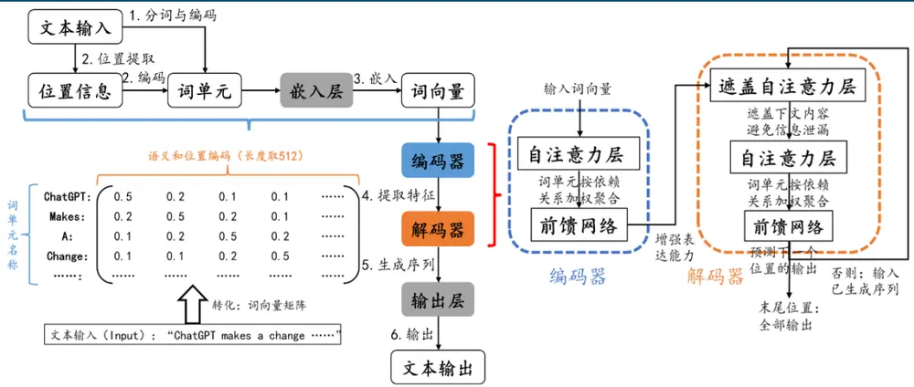
来源：《Attention Is All You Need》（Ashish Vaswani，2017），国金证券研究所

## 二、GPT-4 的技术创新与局限

## 2.1 GPT-4 的技术创新

基于上述Transformer架构，GPT-4通过自注意力机制实现高效的并行计算，进而采用无监督的预训练和微调策略，学习大量的文本数据、汲取丰富的语言知识，然后再针对特定任务进行微调以获得更好性能。总的来说，它在技术上有三大创新：

参数容量更庞大：虽然官方并未公布确切数据，但据 GPT-4 的回答，在 GPT-3 基础上开发的 GPT-3.5 有超过 1750 亿个参数，而 GPT-4 模型参数含量则超过 1 万亿量级，即 GPT-4 拥有更庞大的神经网络架构和参数量；此外 GPT-4 使用更多样化和更大的数据集，使其具备更为丰富的语言知识表现能力和处理能力。

数据来源更广泛：据 OpenAI 发布的 GPT-4 Technical Report 以及 GPT-4 自身回答可知，GPT-3.5 和 GPT-4 两个模型的数据来源在许多方面存在相似性，都使用了大量的文学、科学文章、新闻报道、互联网论坛和社交媒体等数据进行训练；但相比于 GPT-3.5，GPT-4 模型训练数据中涵盖了更多种类的语言，使用了更多类型的数据，比如电子书、学术论文、专利、代码库等。

C不正当行为率显著降低：根据 OpenAI 的技术报告，GPT-4 采用对抗性训练、公平性约束和偏差评估等方法，以优化模型在道德、伦理和社会层面的表现，减轻模型所产生的有害内容、偏见和歧视等问题。从下图的模型测试对比可以看出，GPT-4 在敏感提示和禁止提示的测试中，触发不正当行为的比率明显低于 GPT-3.5。

图表5：text-danvinci-003（GPT-3修正模型）、GPT-3.5-turbo和GPT-4 不正当行为率对比

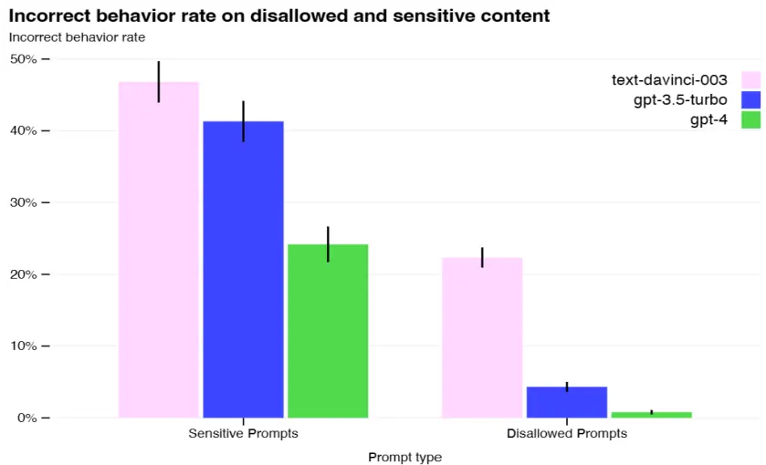
Figure 9. Rate of incorrect behavior on sensitive and disallowed prompts. Lower values are better. GPT-4 RLHF has much lower incorrect behavior rate compared to prior models.
来源：《GPT-4 Technical Report》，国金证券研究所

## 2.2 GPT-4 的技术局限

另一方面，GPT-4 也存在一些有待提升的技术局限，比如文本输入长度限制和回答时效性限制。经过我们分析，文本输入长度限制有如下两个原因：

1. 计算资源限制：GPT 模型需要大量计算资源来处理和生成文本。模型的输入长度越长，消耗的计算资源就越多，同时处理时间也会显著增加。为了确保模型在实际应用中的性能和响应时间，限制输入的词单元数量可以有效控制资源消耗。

2. 模型架构限制：Transformer 架构在处理长序列时存在固有的局限性，自注意机制就意味着输入序列中的每个词单元都需要与其他所有词单元进行关联计算。随着输入序列长度的增加，计算复杂度和内存需求会呈二次方增长，这对硬件资源和计算能力提出了很高的要求。

目前 GPT-4 最大能够处理 4096 个词单元（token），输入的文本越长、可用于生成回复的文本越少，可能影响模型生成的回答质量、生成不连贯或无意义的内容。在限制文本输入长度的情况下，为了帮助 GPT-4 更好地分析文本，我们可以采取如下方法：

- 数据预处理：在将文本输入模型前，可以对数据进行预处理，以减少实际输入到模型的词单元数量。例如，删除停用词、去除重复信息、文本抽取等方法都可以帮助降低文本长度。

- 分段处理：如果需要处理的文本长度超过了模型的输入限制，可以尝试将文本拆分成较小的段落或片段，并分别进行处理。然后根据需要将这些处理过的段落重新组合。

- 多模型组合处理：使用多个不同大小和功能的 GPT 模型组合来解决特定问题。例如，使用没有次数限制的 GPT-3.5 模型用于执行文本摘要、关键信息提取或其他预处理任务。将处理后的简短文本或关键信息作为输出。再将预处理模型生成的简短文本或关键信息输入到 GPT-4 模型中。这样一来，较大的模型可以专注于处理较短的文本，从而提高其分析和生成能力。

图表6：分段输入文本总结(1)
图表7：分段输入文本总结(2)
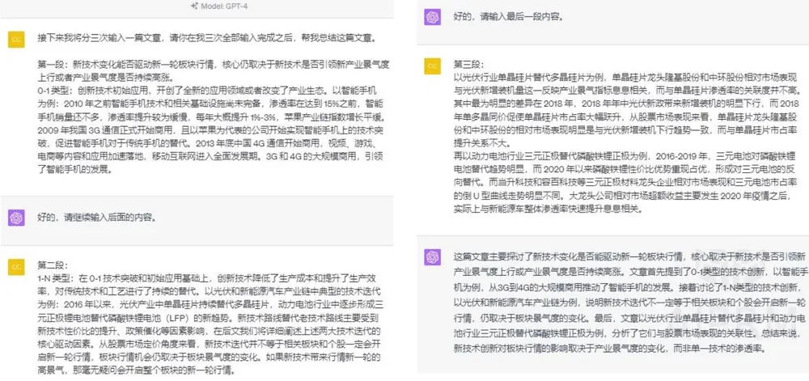
来源：《创新技术投资框架：新技术、新龙头、新机遇》，GPT-4，国金证券研究所

来源：《创新技术投资框架：新技术、新龙头、新机遇》，GPT-4，国金证券研究所

第二个回答时效性限制是指 GPT-4 作为一个人工智能模型，并非是基于实时搜索开放互联网数据设计的，而是基于训练数据集的知识（由大量文本组成，截止到2021年9月）。在训练过程中，开发者使用了包括书籍、文章、网站等大量的文本来源，来帮助 GPT-4理解和回答问题，但是这个过程是静态的，一旦训练完成，GPT-4 的知识库就不会再更新。

在 GPT-4 数据库不能实时搜索更新的情况下，我们可使用其他软件增强时效性。Edge 的New Bing 是微软公司推出的一种搜索引擎服务，并处于联网状态，可以实时获得数据。它采用了最新的自然语言处理技术，可以理解用户的搜索意图，并提供更加准确、个性化的搜索结果，具有搜索、图像识别、语音搜索等多种功能。

图表8：时效性对比(New Bing）
图表9：时效性对比（GPT-4)
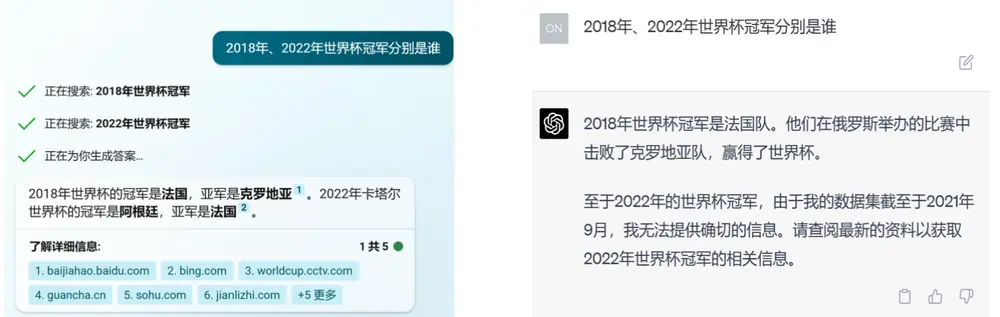
来源：New Bing，国金证券研究所
来源：GPT-4，国金证券研究所

2023 年 3 月 14 日，New Bing 对接了 GPT-4 技术，并增加了图像创造器功能，同时还提供三种模式选项：精准、平衡和创造力，选项不同的侧重点会影响到生成结果的质量：

- 精准模式：生成更准确和详尽的答案，适合需要获取具体信息或解决问题的场景。如果问“北京的天气怎么样？”，New Bing 会给出北京当前的温度、湿度、风速等数据，并附上天气预报的链接。文本总结时注重精准与精炼，总结文字较少，不会

提出基于文本的观点与看法。

- 平衡模式：生成更中立和客观的回应，适合需要获取一般性知识或观点的场景。如果问“什么是核聚变？”，New Bing 会给出核聚变的定义、原理、优缺点等内容，并引用相关的网络资源。文本总结时注重在逻辑正确的前提下适当加入基于文本的观点看法。

- 创造力模式：生成更富有想象力的回应，适合需要获取有趣或创新的内容的场景。如果问“画一幅龙的图片”，New Bing会利用DALL-E技术生成一幅AI图像，并展示它创作过程和文本提示。文本总结时注重准确性与细节化，总结文字较多，并充分提出基于文本的观点与看法。

图表10：New Bing的三种模式对比（精准模式）
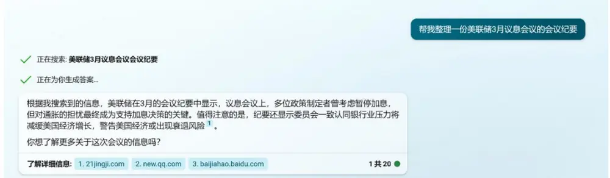
来源：New Bing，国金证券研究所

图表11：New Bing的三种模式对比（平衡模式）
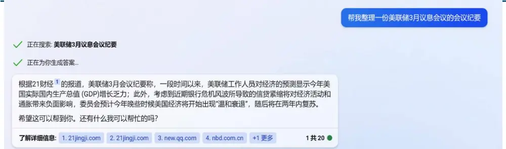
来源：New Bing，国金证券研究所

图表12：New Bing的三种模式对比（创造力模式）
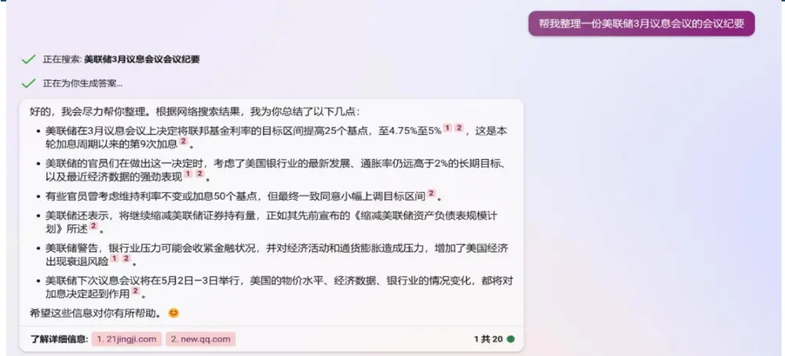
来源：New Bing，国金证券研究所

从上图可以看出：New Bing 可以快速检索文本背后信息与资源，它的三种模式可以实现对文本的总结，其中创造力模式使得 New Bing 具备了在总结信息的基础上充分提出观点与看法的功能。相比 GPT-4，New Bing 对长文本的总结与提出观点的能力差别不大，仅在一些细节方面略逊一筹。综上所述，当我们碰到时效性限制时，我们可以通过 NewBing 收集时效性信息，再使用 GPT-4 对信息进行分析总结。

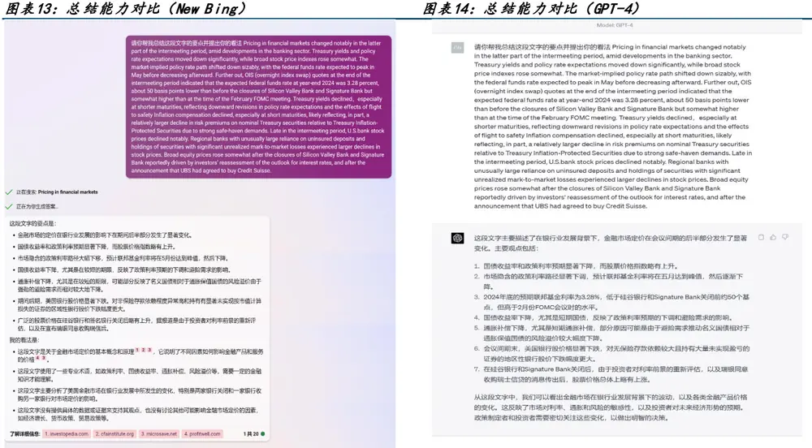
来源：New Bing，国金证券研究所
来源：GPT-4，国金证券研究所

## 三、提示工程及prompt 设计

## 3.1 提示工程介绍及思维链提示

在认识了 GPT-4 的底层逻辑和技术特点后，我们有必要研究如何扬长补短、发挥它最大的文本分析能力，这对于我们后续的应用尤为关键。

提示工程（Prompt Engineering）是一门相对较新的技术，主要用于开发和优化初始文本或输入（prompt），引导模型生成特定的语气、风格或内容类型，以有效地用于各种应用程序和研究主题。

Prompt 是研究者们为了下游任务设计出来的一种输入形式或模板，我们在 1.1 节提到它与 GPT 模型在训练中用到的指示（prompt）具有相似之处，因此能够帮助模型“回忆”起之前学到的知识。在 OpenAI 官网上的文章《Best practices for prompt engineeringwith OpenAI API》也写到：“得益于模型基于指示的训练方式或训练数据，有一些特定格式的提示尤其有效，能够与用户手头的任务更好地对齐”。

Liu et al（2021）发现：“通过定义一个新的提示函数，模型只需要进行少次甚至零次的学习，就能够适应只有很少或没有标记数据的新场景”；Wei et al（2022）进一步提出思维链提示（chain-of-thought prompting）的思想，即划分输入为多个片段（思路链），逐步提供给模型；通过这种输入方式，模型就能生成与人类类似的思维链推理结果，而无需进行额外的训练或微调。

图表15：思维链提示在模型解决数学问题上的应用
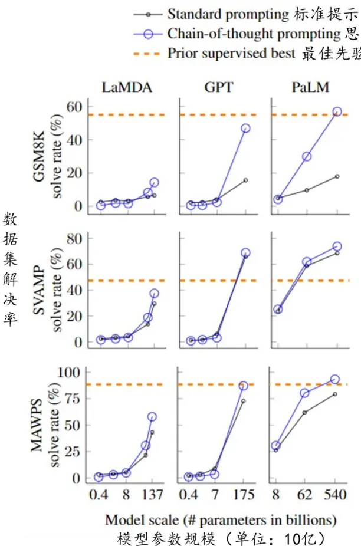

来源：《Chain-of-Thought Prompting Elicits Reasoning in Large Language Models》（Wei，2022），国金证券研究所从上图可以看出：在GSM8K（小学水平数学题）、SVAMP和MAWPS（数学应用题）数据集的训练上，随着参数规模的翻倍，LaMDA（应用对话的语言模型）、GPT、PaLM（基于Pathways 架构的语言模型）模型根据思维链提示的解决率最后都要优于根据标准提示的，这为我们运用 prompt 提升大型语言模型 GPT-4 的文本分析表现提供了理论依据。

## 3.2 Prompt 设计要素及注意事项

为了设计一个好的prompt，我们可以将prompt分成了指令、情景、输入数据、输出指示四个要素：指令即希望模型执行的特定任务或指令；情景是可能涉及外部信息或其他上下文；输入数据和输出指示分别指希望得到响应的输入或问题、指示模型输出的类型或格式。

根据 DAIR AI 公司在 GitHub 发布的《提示工程指南》（Prompt-Engineering-Guide），我们设计 prompt 的一般性注意事项包括：

- 逐步迭代：设计提示是一个迭代过程，需要大量的实验才能得到最佳结果。从简单的提示开始，随着目标越来越明确，逐渐添加更多元素和上下文。

- 使用指令与分隔符：使用指令来指示模型执行各种简单任务，例如“写入”、“分类”、“总结”、“翻译”、“排序”等，从而为各种简单任务设计有效的提示。另外，尽量将指令放在提示符的开头，用“””、##等分隔指令和上下文。

具体化：提示越具体和详细，结果就越好。当我们有一个期望的输出时，对模型执行的指令和任务具体化，背景、结果、长度、格式、风格等尽可能描述详细，甚至可以通过示例阐明所需的输出格式。

准确化：沟通越直接，信息传递就越有效。使用非常具体、简洁和直接的描述，不要陷入想要过于聪明的提示陷阱。

- 直接化：避免说不要做什么，而是说要做什么。这可以鼓励更具体的描述和关注细节，从而获得良好的模型响应。

在后面的应用中，我们将根据四要素思想和以上事项，为 GPT-4 设计合适的 prompt。

## 四、GPT 挖掘策略研报中的行业配置信息

## 4.1 模型选择与任务拆解

在卖方分析师中，策略团队也会给出行业配置方面的观点。策略研究员会综合考虑宏观经济环境、产业链和行业政策等各类非结构化的数据，并定期给出推荐的行业与对应理由。其推荐理由中会包含政策等难以量化的信息，这也是当前量化策略中难以考虑到的因素，因此我们认为卖方策略团队观点能为传统量化的行业轮动策略带来增量收益。

另外卖方策略观点往往推荐多个行业，缺乏行业间比较，要将卖方策略观点融入量化配置模型，需要我们提供更加详细的行业排名数据。但是其实在分析师撰写报告的时候，会从多个角度包括语言组织形式、论据以及观点情绪等角度表达自己的倾向，只是报告中未将这样的倾向性量化出来。而且靠人工手动给出行业排名耗时耗力。但在 ChatGPT模型出现之后，该问题也能迎刃而解。GPT 系列模型表现出强大的文本分析与理解能力，能识别文本内容的情感倾向性，并根据用户的需求从复杂文本中提炼出精简的观点与理由。通过 GPT 的文本分析可以帮忙提炼出分析师文本中的倾向性，从而构建出推荐行业的排名打分。

那 GPT 模型到底能否帮我们快速阅读研究报告，提取行业配置信息呢？我们进行了以下实验。我们的目标是从卖方策略团队的月度报告中精炼出行业配置建议，能够测试 GPT模型对金融类文本的分析能力，同时也可以基于分析结果检验各卖方策略团队的观点准确性。

首先，我们首先对卖方策略的行业配置月报的文本做简单的分析。可以看到策略团队一般推荐的行业为具体的细分行业，若想泛化成中信一级行业，需要做转化。另外，文本内并没有出现具体的优先级排序的信息，所以我们希望 GPT 能够帮助我们批量化的提取文本语义中表达的行业配置的优先级打分。

## 图表16：卖方策略团队行业配置文本实例

## 四、行业配置：光伏储能、机械；白酒、汽车、家电；券商、黄金

## 成长板块：光伏储能、机械

当前光伏储能等板块基本面和政策面均呈现积极向上变化，整体板块业绩仍维持高景气。

机械：需求支撑下成本下降的设备领域，特别是背靠新能源和制造升级相关需求的细分领域。

## 消费板块：白酒、汽车（零部件）、家电

疫后消费恢复，叠加成本下降，商务消费和耐用消费品相关领域均存在一定预期差机会，比如：商务消费相关的高端白酒等板块；成本下降叠加刺激消费政策预期下的汽车（零部件）、家电等耐用消费品。

## 其他板块：券商、黄金

对于券商力在市场向上阶段有演 eta性行情。此外，年内主板全

外，美联储紧缩预期缓和并非小概率事件。

来源：国金策略团队《股票投资策略简报：权益资产的收获季》，国金证券研究所

但是我们在实践中发现GPT-3.5无法完全理解我们的需求，如下方案例所示，GPT-3.5对行业的概念比较模糊，无法把打分投射到中信一级行业上，而且当我们输入同一段文字GPT-3.5出来的打分波动较大；而GPT-4的测试结果证明它在理解能力上的优越性，可以完成金融类文本的语义识别任务，并且打分的稳定度也有明显提升 。因此我们选择GPT-4 模型。

## 图表17：GPT-3.5输出结果不符合预期

中信一级行业有这些(石油石化、煤炭、有色金属、电力及公用事业、钢铁、基础化工、建筑、建材、轻工制造、机械、电力设备及新能源、国防军工、汽车、商贸零售、消费者服务、家电、纺织服装、医药、食品饮料、农林牧渔、银行、非银行金融、房地产、交通运输、电子、通信、计算机、传媒、综合、综合金融
作为一个投资分析师，帮我完成下列指今

1.把下文“”文字段落内中提及的行业，没有对特定行业影响的不考虑，并且列点总结这些文章要点是利好行业的程度(打分从1-5)，如果是看空则按照看空力度打(-1~-5)，并且给出具体的打分理由，每个行业之间分数要有区分度。

2. 并且把有明确配置观点的行业映射到中信一级行业上面

3.理由如果相同请打相同的分数，打分时，请结合文字段落中的原文把打分理由写的更详

4.若同个中信一级行业有多个打分，请最后综合给出这个中信一级行业的分数。分数需要为整数。

5. 最后将看好的中信一级行业以及对应分数用markdown表格的格式整理出来(markdown表格中，每个中信一级行业分列一行，分别填写行业名称和行业打分

成长板块：光伏储能、机械当前光伏储能等板块基本面和政策面均呈现积极向上变化，整体板块业绩仍维持高量气。机械：需求支撑下成本下降的设备领域，特别是背靠新能源和制造升级相关需求的细分领域。

消费板块：白酒、汽车（零部件）、家电疫后消费恢复，叠加成本下降，商务消费和耐用消费品相关领域均存在一定预期差机会，比如：商务消费相关的高端白酒等板块：成本下降整加刺激消费政策预期下的汽车（零部件）、家电等耐用消费品。

其他板块：券商、黄金对于券商板块：在市场向上阶段有望演绎beta性行情。此外，年内主板全面注册制将助力券商基本面保持相对较强；对于贵金属板块：美国经济下行，美元实际利率下行支撑贵金属价格。此外，美联储紧缩预期缓和并非小概率事件。

## 图表18：GPT-4可以满足使用要求

中信一级行业有这些(石油石化、煤炭、有色金属、电力及公用事业、钢铁、基础化工、建筑、建材、轻工制造、机械、电力设备及新能源、国防军工、汽车、商贸零售、消费者服务、家电、纺织服装、医药、食品饮料、农林牧渔、银行、非银行金融、房地产、交通运输、电子、通信、计算机、传媒、综合、综合金融
作为一个投资分析师，帮我完成下列指令：

1.把下文“”文字段落内中提及的行业，没有对特定行业影响的不考虑，并且列点总结这些文章要点是利好行业的程度(打分从1-5)，如果是看空则按照看空力度打(-1~-5)，并且给出具体的打分理由，每个行业之间分数要有区分度。

3.理由如果相同请打相同的分数，打分时，请结合文字段落中的原文把打分理由写的更详

4.若同个中信一级行业有多个打分，请最后综合给出这个中信一级行业的分数。分数需要为整数。

5.最后将看好的中信一级行业以及对应分数用markdown表格的格式整理出来(markdown表格中，每个中信一级行业分列一行,分别填写行业名称和行业打分)

成长板块：光伏储能、机械当前光伏储能等板块基本面和政策面均呈现积极向上变化，整体板块业绩仍维持高量气。机械：需求支撑下成本下降的设备领域，特别是背靠新能源和制造升级相关需求的细分领域。

消费板块：白酒、汽车（零部件）、家电疫后消费恢复，叠加成本下降，商务消费和耐用消费品相关领域均存在一定预期差机会，比如：商务消费相关的高端白酒等板块：成本下降督加刺激消费政策预期下的汽车（零部件）、家电等耐用消费品。

其他板块：券商、黄金对于券商板块：在市场向上阶段有望演绎beta性行情。此外，年内主板全面注册制将助力券商基本面保持相对较强；对于贵金属板块：美国经济下行，美元实际利率下行支撑贵金属价格。此外，美联储紧缩预期缓和并非小概率事件。

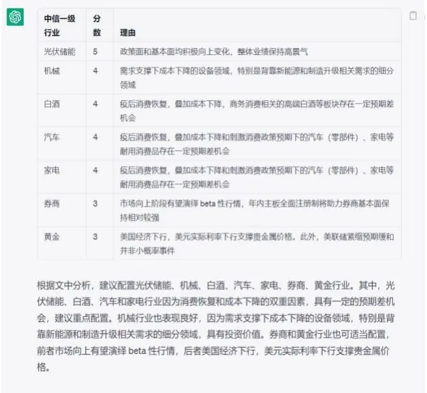

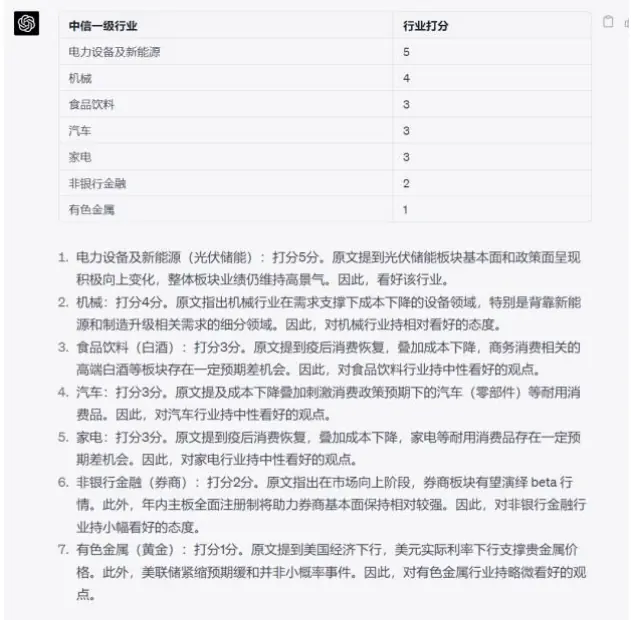
来源：GPT-3.5，国金策略团队《股票投资策略简报：权益资产的收获季》，国 来源：GPT-4，国金策略团队《股票投资策略简报：权益资产的收获季》，国金金证券研究所证券研究所

接下来我们需要给模型输入文本，文本可以分为素材与提示两大部分。素材部分来源于月度报告，我们将月度报告中涉及“行业配置”、“行业观点”等主题的文字段落放入对话框。提示部分是让模型理解我们需求的关键，我们首先明确项目的需求：

1、对推荐的行业进行打分。卖方策略团队的月度报告中一般会给出当前推荐的行业配置与观点理由，但有时信息较多导致重点不突出，同时我们也难以对不同行业之间的推荐程度进行横向比较。因此，我们借助ChatGPT的精炼能力对每个行业的推荐理由进行总结，并基于对情感倾向的识别能力来打分。

2、统一行业对象。研报中推荐的行业没有统一的范畴，可以是较大的产业板块（如：TMT、大消费）或是具体的细分赛道（如：光伏、白酒），不便于进行回测检验。因此我们让 ChatGPT 将行业集中映射到中信一级行业上，并对应给出分数。

3、标准化输出格式。最后，让 ChatGPT 以统一的 markdown 表格格式输出结果，便于我们使用。

接下来，我们通过提示工程（Prompt Engineering）让模型准确理解我们的需求。

## 4.2 行业打分任务的 Prompt 优化

Prompt 是研究如何开发与优化提示语言，让人类能更加有效地使用 ChatGPT 等语言模型的新兴学科。较好的提示语言可以提高使用人工智能系统的效率，让 ChatGPT 充分理解我们的需求并给出我们预期的结果。在上文我们归纳整理了 Prompt 提示的基础元素：情景、指令、输入数据、输出指示。我们逐个梳理当前任务中各个部分的具体含义。

- 情景：情景给定了对话的语境，能对模型的语言风格起到约束作用，最简单的方法就是指定 GPT 模型扮演某个“角色”。在当前项目中我们希望 GPT-4 能以投资分析师的身份来完成任务，直接以文字形式告知它即可。

指令：指令是需要模型具体完成的任务内容，若任务较多较复杂则需要我们以模块化的流程输入具体指令，这样一方面便于检查打分过程中的细节来检验结果是否合理，另一方面也是为了确保 GPT-4 能正确理解需求。当前任务包含了打分、行业映射、理由整理等多个步骤，我们按顺序逐个给出指令描述。

输入数据：输入数据是我们希望得到响应的输入内容。在当前任务中即月度报告中行业配置相关的语料素材。

输出格式：输出格式是我们希望模型输出结果的具体形式，一般与指令同步给出。譬如我们希望模型能以 1-5 分的整数形式进行打分，并以 markdown 表格的格式输出结果，这都是对每一步指令的输出格式要求。

按照以上规则，我们给出的初始 Prompt 如下：

“中信一级行业有这些(石油石化、煤炭、有色金属、电力及公用事业、钢铁、基础化工、建筑、建材、轻工制造、机械、电力设备及新能源、国防军工、汽车、商贸零售、消费者服务、家电、纺织服装、医药、食品饮料、农林牧渔、银行、非银行金融、房地产、交通运输、电子、通信、计算机、传媒、综合、综合金融)

作为一个投资分析师，帮我完成下列指令：

1. 把下文“”文字段落内中提及的行业，没有对特定行业影响的不考虑，并且列点总结这些文章要点是利好行业的程度(打分从 1-5)，如果是看空则按照看空力度打(-1~-5)，并且给出具体的打分理由，每个行业之间分数要有区分度。

2. 并且把有明确配置观点的行业映射到中信一级行业上面。

3. 理由如果相同请打相同的分数，打分时，请结合文字段落中的原文把打分理由写的更详细。

4. 若同个中信一级行业有多个打分，请最后综合给出这个中信一级行业的分数。分数需要为整数。

5. 最后将看好的中信一级行业以及对应分数用 markdown 表格的格式整理出来(markdown表格中，每个中信一级行业分列一行,分别填写行业名称和行业打分)”。

以上 Prompt 语句可以很好的指导模型完成打分任务，但在使用过程中仍然会出现各类情况，需要我们不断地进行修改与补充。我们对此进行了归纳总结，并给出应对方法。

1、避免使用“行话”,必要时给出解释。经过实验我们发现，GPT-4 并不知道中信一级行业具体有哪些；此外一些金融领域的特有名词例如“新半军”等，GPT-4 也很可能无法正确理解，导致回答出现偏差。

图表19：GPT-4不清楚中信一级行业的定义
图表20：GPT-4不清楚“新半军”含义
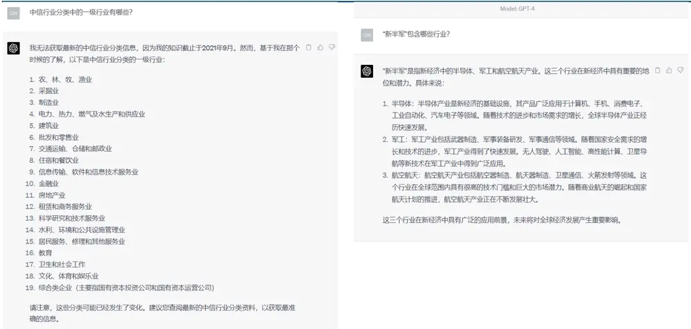
来源：GPT-4，国金证券研究所
来源：GPT-4，国金证券研究所

若无法避免使用这类缩写专业名称，我们就需要在打分前将具体定义告知模型。例如在初始 Prompt 中我们首先告知它中信一级行业的详细分类；或者如下方案例，我们告知GPT-4“信创主要是计算机行业”后，模型就能够修正之前的错误映射。

图表21：GPT-4对“信创”行业的映射修正
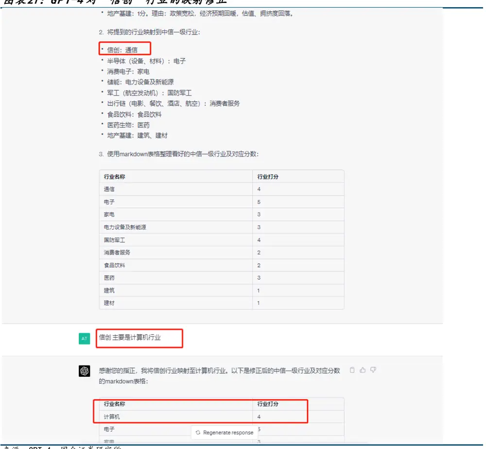
来源：GPT-4，国金证券研究所

2、尽量统一语境。月度报告中的语言一般都偏积极，此时 ChatGPT 就会对部分带有消极倾向的字眼比较敏感，打分结果也会出现较大的偏差。部分报告中会包含“下调 xx 行业”的信息，实际上只是表达了看多程度的相对减弱，并没有看空的意思，但模型也会将其当作配置建议进行打分，此时需要我们手动剔除。

图表22：GPT-4对报告中的消极字眼较敏感
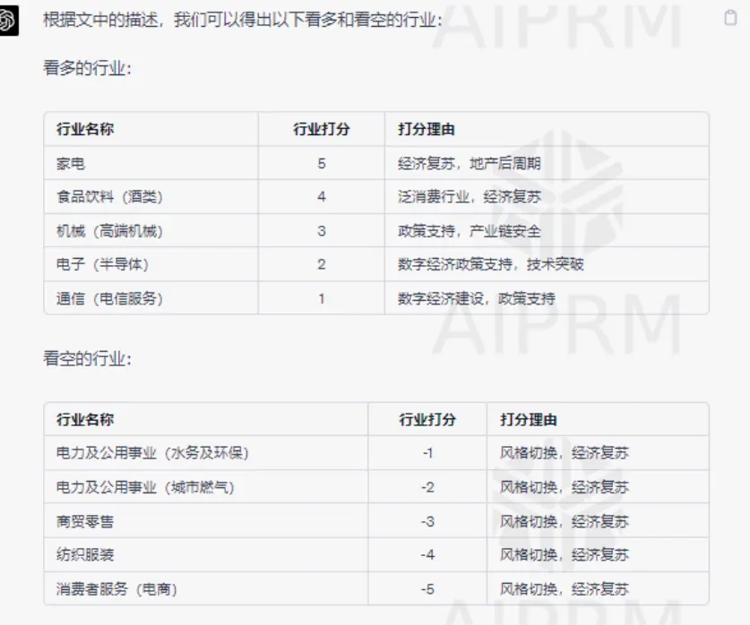
根据文中的描述，已经尽量结合上文文本进行了打分理由的说明。如果有其他问题，请随时告诉我。
来源：GPT-4，国金证券研究所

3、打分理由可能显示不全。ChatGPT 只会从我们提供的文本中寻找打分理由，但显示的理由有可能不是模型考虑的全部内容。在使用过程中，我们发现有时模型对两个行业的打分不同，但具体理由却是相同的。此时我们需要检查素材中提及相关行业的语句是否有不同，以此判断模型打分的合理性。

图表23：GPT-4打分理由不全
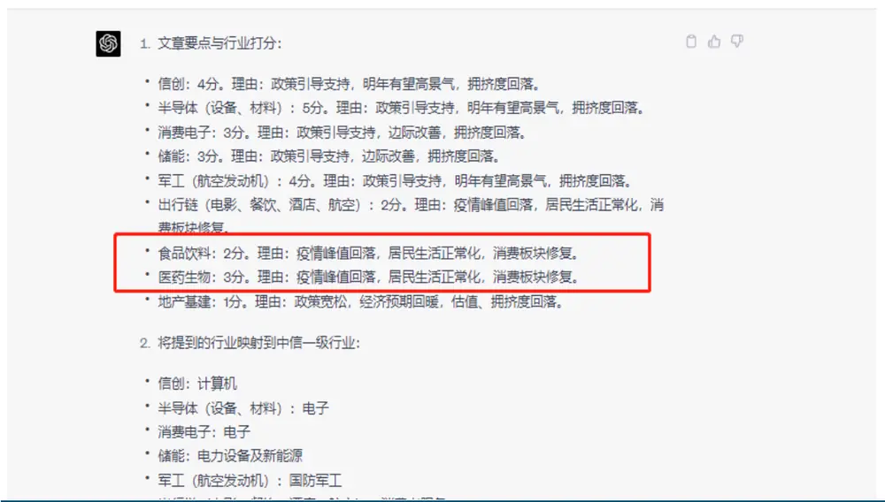
来源：GPT-4，国金证券研究所

4、输入信息较少时，打分稳定性也偏低。实际上，模型打分结果的影响因素非常多，一些语句上的小改动也会明显改变打分结果。以下测试中，我们更改了输入文本中语句的前后顺序，但 ChatGPT 的打分结果却完全不同。我们认为原因在于输入素材中的信息量过少，导致模型只能对素材进行“过度解读”来增大打分的区分度。因此，我们需要保证素材信息量足够大，比如文本中包含充足的配置理由，这样能有效增强打分结果的稳定性。

图表24：GPT-4打分在输入信息量较少时不稳定（1）
“行业方面，建议配置盈利修复和估值匹配度更高的板块，主要为机械、电子、轻工、军工等制造板块，以及建材、地产产业链、金融等相对低估值的板块：建议关注疫情后周期修复的交运、休闲服务板块。”

| 中信一级行业 | 行业打分 | 打分理由 |
| --- | --- | --- |
| 机械 | 4 | 文中建议配置盈利修复和估值匹配度更高的板块，主要为制造板块之一 |
| 电子 | 4 | 文中建议配置盈利修复和估值匹配度更高的板块，主要为制造板块之一 |
| 轻工制造 | 4 | 文中建议配置盈利修复和估值匹配度更高的板块，主要为制造板块之一 |
| 国防军工 | 4 | 文中建议配置盈利修复和估值匹配度更高的板块，主要为制造板块之一 |
| 建材 | 3 | 文中建议配置相对低估值的板块，如建材等 |
| 房地产 | 3 | 文中建议配置相对低估值的板块，如地产产业链等 |
| 银行 | 3 | 文中建议配置相对低估值的板块，如金融等 |
| 非银行金融 | 3 | 文中建议配置相对低估值的板块，如金融等 |
| 交通运输 | 2 | 文中建议关注疫情后周期修复的交运板块 |
| 消费者服务 | 2 | 文中建议关注疫情后周期修复的休闲服务板块 |

来源：GPT-4，国金证券研究所

图表25：GPT-4打分在输入信息量较少时不稳定（2）

| 行业 | 行业打分 |
| --- | --- |
| 交通运输 | 4 |
| 消费者服务 | 4 |
| 机械 | 5 |
| 电子 | 5 |
| 轻工制造 | 5 |
| 国防军工 | 5 |
| 建材 | 3 |
| 房地产 | 3 |
| 银行 | 3 |
| 非银行金融 | 3 |

来源：GPT-4，国金证券研究所

以上是我们在使用模型的过程中遇到的问题总结。实际上当前我们无法通过 Prompt 工程完全控制 GPT 这类“黑盒”模型的影响因素，只能在出现状况时进行对应的修正。伴随着这一学科的发展，我们相信 GPT 模型的应用也会更加便利，输出结果更合理。

## 五、GPT 策略研报因子构建与检验

## 5.1 GPT-4 打分结果描述

我们使用 GPT-4 模型进行文本分析，但由于目前 GPT-4 存在 3 小时内最多生成 25 条回答的使用限制，无法大批量自动化使用。因此我们选取市面上 16 家月报信息公开、便于进行文本分析的卖方策略团队，将其在 2021 年之后发布的月度报告作为研究对象。基于以上 Prompt 语句，我们获得了各个团队在每个月对推荐行业的打分数据。

从发布时间上来看，各家卖方策略团队的月度报告基本能在当月的10号发布，10月份受国庆假期影响，也一般能在当月 15 号之前发布。若报告发布时间晚于这个期限，我们则认为报告预测的时效性有一定欠缺并将其剔除。

我们统计了各行业在 16 家策略团队月报打分中出现的频率。从统计数据来看，在 2021年 1 月至 2023 年 4 月的 28 个月内，电力设备及新能源、电子、有色金属、汽车、建材与国防军工行业在每个月都至少有一个团队进行看多，其中电力设备及新能源行业平均每月有 7 家以上的策略团队给出配置推荐，电子行业则是平均有 6 家给出推荐；石油石化、传媒和综合金融这三个行业被提及的次数最少，其他行业的出现次数总体上来看也相对较多。

图表26：中信行业打分数据统计
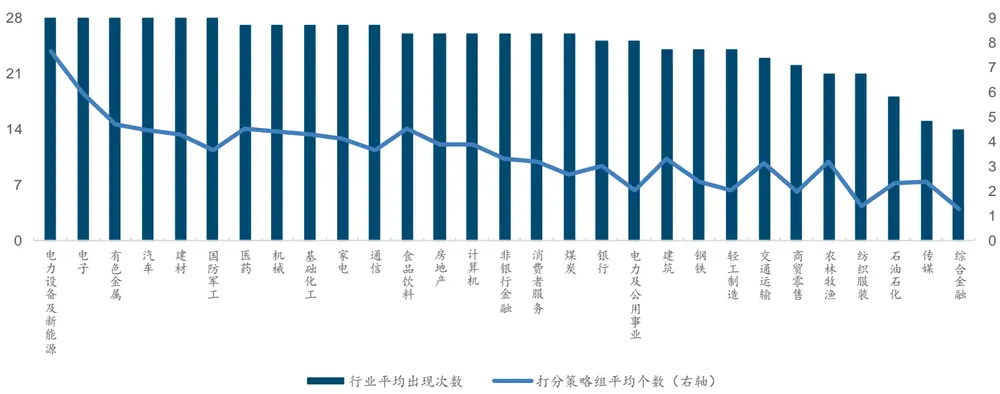
来源：Wind，国金证券研究所

从全得分样本的数量上来看，ChatGPT以给出4分与3分的打分为主，分别占所有打分结果的 34.8%和 31.5%，2 分占 15.6%，最高分 5 分占比 11.1%，1 分则只占了 7.1%。

图表27：得分数量统计
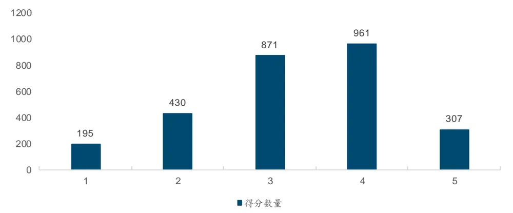
来源：Wind，国金证券研究所

最后，我们检查打分数据的缺失情况。从时序上来看，大多数月份的无打分行业个数在六个以下，其中还包含了一般不会给出配置观点的综合和综合金融两个行业，因此打分数据基本覆盖了大多数的行业。

图表28：无打分数据行业个数
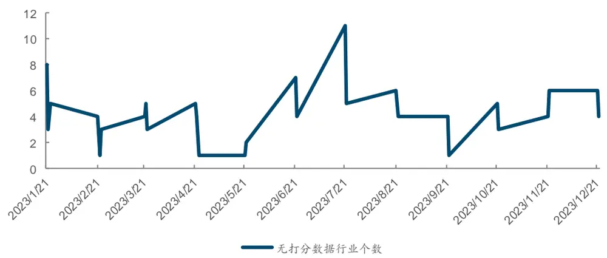
来源：Wind，国金证券研究所

## 5.2 因子构造初步尝试

我们首先需要给出每个月因子值的更新日期。由于各个卖方策略团队发布月报时间不一致，且出于观点时效性方面的考虑，我们按如下规则进行：

1、若16家卖方策略团队的月报发布时间都早于当月10号（10月份为15号），则取最晚一份月报发布日期的下一个交易日作为因子值更新日期；

2、否则，我们以当月 10 号（10 月份为 15 号）的下一个交易日为因子值更新日期。

而针对当月的每个行业，我们取各个团队对该行业打分的中位数作为行业的 ChatGPT 得分，构造出 GPT 策略研报配置因子。我们使用 2021 年 1 月至 2023 年 4 月的数据对因子进行月频检验。

从 IC 结果来看，该因子并没有表现出显著的 IC 均值，不过从分位数组合测试结果可以看出，分组收益率呈现出明显的单调性，多空组合与 Top 组合的年化收益也分别达到了5.65%和 3.15%，说明该因子确实能够在行业层面带来一定的信息。

图表29：GPT策略研报配置因子-1C

| 因子 | 平均值 | 标准差 | 最小值 | 最大值 | 风险调整的IC | t统计量 |
| --- | --- | --- | --- | --- | --- | --- |
| GPT 策略研报配置因子 | -0.03% | 22.83% | -38.43% | 57.34% | 0.00 | -0.01 |

来源：Wind，国金证券研究所

图表30：GPT策略研报配置因子-分位数组合年化超额收益
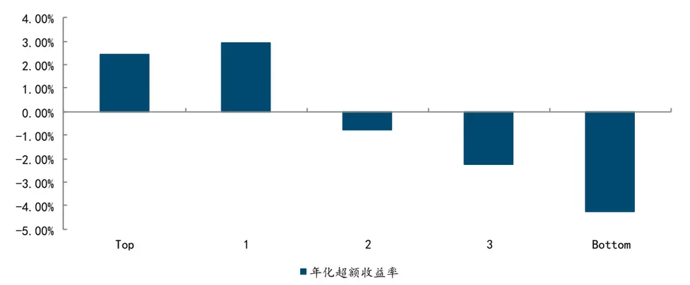
来源：Wind，国金证券研究所

从底层数据上来看，该因子综合考虑了 16 家卖方策略团队月度报告的打分情况，其中可能有部分报告在给出行业观点时没有对应给出充分的理由部分，导致 ChatGPT 无法准确判断情绪倾向；部分策略团队的观点准确度也较低，会直接导致整体因子的表现不佳；此外因为数据可得性等原因，我们收集到的部分卖方策略团队月报并不连续，这也可能对数据造成影响。

## 5.3 GPT 精选配置因子构建

从因子的初步检验来看，ChatGPT 打分高的行业表现的确优于得分较低的行业，说明因子能够对行业起到区分作用，但直接使用中位数构建因子的方法过于粗糙，我们对此进行优化以改善因子的表现。

从各家卖方策略团队的表现来看，不同的团队都有各自鲜明的投资逻辑与投资风格，而基于此给出的配置建议也会在不同程度上与市场环境相契合。当市场环境开始转变时，很可能之前观点准确度较高的团队表现会下降，而适应新环境的团队也开始受到市场青睐。

我们首先以如下方法定量化地比较卖方策略团队表现的优劣：

1、月度报告发布时，将该团队对各行业的打分作为行业的配置权重，以此构建该策略团队的模拟推荐组合。

2、以每个月10号（10月为15号）后第一个交易日为换仓日，回测出每个团队模拟推荐组合的净值表现等数据。若月度报告缺失，我们默认为当月没有持仓。

3、最后，我们将当月10号（10月为15号）作为观察点，滚动比较各个模拟推荐组合在过去半年内的收益率动量。当收益率动量较高时，说明过去半年内对应的卖方策略团队配置建议准确度更高、更适合当前市场环境，观点中也确实携带了 alpha 信息，我们也更应该参考该团队的打分建议。

每个月我们滚动选取表现最好的前 4 个卖方策略团队。若挑选出来的团队在当月 10号之前并未公布研报，我们就只考虑剩余已发布月报的团队观点，不过在最终结果中并未出现这样的情况。

从团队的选取结果上来看，我们发现前四名团队的表现具有较强的持续性，通常会连续多个月都表现较好，这也为我们滚动判断卖方策略团队的做法提供一些实践依据。

由于滚动计算需要考虑过去六个月时间的数据，新的回测时间从2021年7月10日开始，至 2023 年 4 月 21 日结束。按照相同的方法，我们也计算出因子值的更新日期，并按照这 4 个团队对每个行业打分的中位数构造出 GPT 精选配置因子。新的因子 IC 均值提升到0.94%，同时Top组合的年化收益率提升到8.46%，因子效果有明显的提升。从IC值的时间序列上来看，IC 移动平均值在大多数时间段上都大于 0，表现出正向的选股能力。

图表31：GPT精选配置因子-IC

| 因子 | 平均值 | 标准差 | 最小值 | 最大值 | 风险调整的IC | t统计量 |
| --- | --- | --- | --- | --- | --- | --- |
| GPT 精选配置因子 | 0.94% | 25.96% | -46.38% | 49.96% | 0.04 | 0.17 |

来源：Wind，国金证券研究所

我们进一步观察因子分位数检验结果，发现分组收益单调性在偏向看空方面、尤其是Bottom 组合的单调性不明显。我们认为原因在于卖方策略团队只给出了部分看多行业的评论，并不涉及其看空的行业以及未提及的行业信息，我们也就无法得到这些行业的情感打分。因此打分因子主要体现行业的看多力量，但打分为 0 并不意味着团队对该行业看空，因子仅仅在多头部分会有较好的效果，但在看空方面的分组收益单调性表现一边。

图表32：GPT精选配置因子-IC序列表现
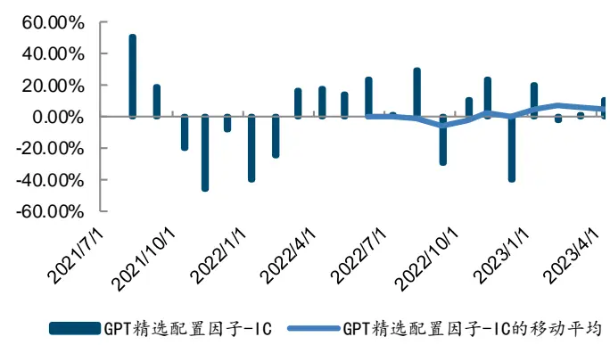
来源：Wind，国金证券研究所

图表33：GPT精选配置因子-分组年化超额收益率
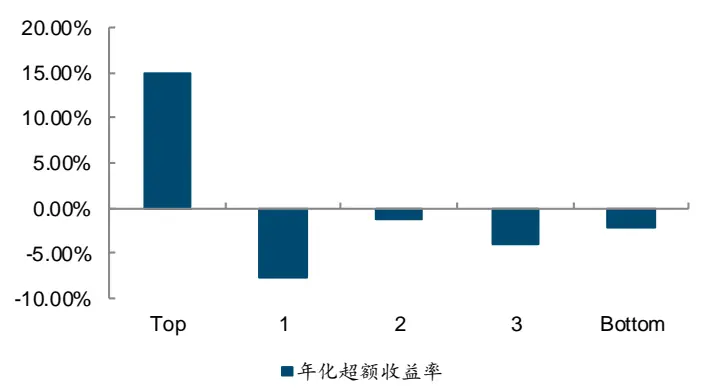
来源：Wind，国金证券研究所

以下为 GPT 精选配置因子的多空组合检验结果。从时序上来看 GPT 因子的多空收益相对稳定，Top 组合在上涨时表现出明显的超额收益，但在下跌区间相对 Bottom 组合的跌势也更大。原因可能在于前期市场一致看多的行业在高点之后的下跌更加猛烈，而此时卖方策略团队观点没有及时调整，导致多空收益明显缩窄。

图表34：GPT精选配置因子-多空组合表现
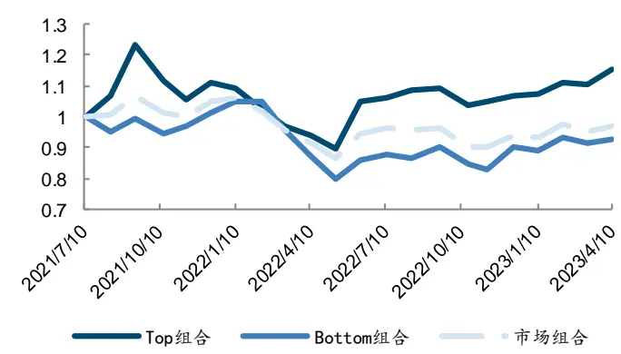
来源：Wind，国金证券研究所

图表35：GPT精选配置因子-多空组合净值
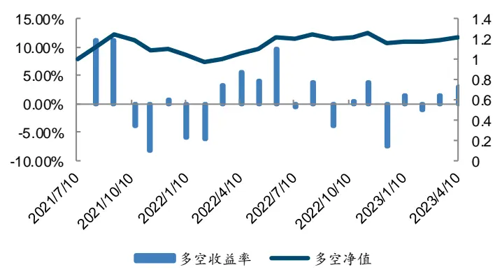
来源：Wind，国金证券研究所

通过对比精选前后因子的 Top 组合净值，我们可以发现精选之后因子的效果有非常明显的提升，说明我们对卖方策略团队进行筛选的方法有效。

图表36：GPT 因子 Top 组合净值对比
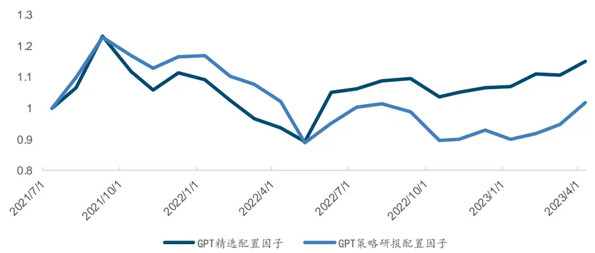
来源：Wind，国金证券研究所

同时，我们也对比了选择前 3 名、前 4 名和前 5 名卖方策略团队构造的因子，检验结果显示其 IC 均值与多空收益相对 GPT 策略研报配置因子都有明显提升，且三者之间相差不大，说明我们滚动筛选卖方策略团队的方法稳健性较强。其中，选择前 4 名构造的因子表现最好，因此我们将其作为最终的因子构造方法。

## 六、GPT 精选因子轮动策略

经过上一节的研究，我们构建的 GPT 精选配置因子在行业的收益预测方面具有显著效果，因此我们根据其构建 GPT 精选因子轮动策略。策略构建细节如下：

图表37：GPT精选因子轮动策略构建方法

| 回测细节 | 详细定义 |
| --- | --- |
| 策略回测范围 | 2021年7月10日至2023年4月21日 |
| 策略换仓日 | 月频换仓，以每月10号（10月为15号）的下一个交易日为换仓日 |
| 策略持仓组合 | 选取当月GPT精选配置因子得分排名前6的行业，等权配置 |
| 策略基准 | 中信一级行业等权配置作为行业等权基准 |
| 手续费 | 单边千分之二 |

来源：国金证券研究所

下图展示的是 GPT 精选因子轮动策略的净值表现。可以看出，相比中信等权组合，策略在上涨行情中能准确捕捉到涨势最好的行业，因此在几轮上涨中也带来了明显的超额收益，不过在基准下跌的过程中，策略的收益也在快速减少。这当然与策略的较高换手率有关，不过我们也可以从因子的逻辑出发进行理解。基于卖方策略团队观点产生的因子一定程度上代表了市场对各个行业的主流看法。当市场上出现明确的行情时，卖方策略团队必然也会对相关的行业给出较乐观的评价，导致该行业分数较高；而在出现反转下跌时，卖方策略团队也不会快速转换观点，也导致策略吃到了大段的回撤。我们的回测范围内出现的都是行业层面的持续性趋势，譬如新能源行业在一半的回测期中都排名第一（或并列第一），这也正好加剧了 ChatGPT 策略与大盘之间的相关性。

从指标上来看，策略的年化收益率为 6.03%，夏普比率为 0.28，而行业等权基准的年化收益率为-1.90%。相较于等权基准，策略的年化超额收益率达到 9.63%，信息比率为0.95。

图表38：GPT精选因子轮动策略净值
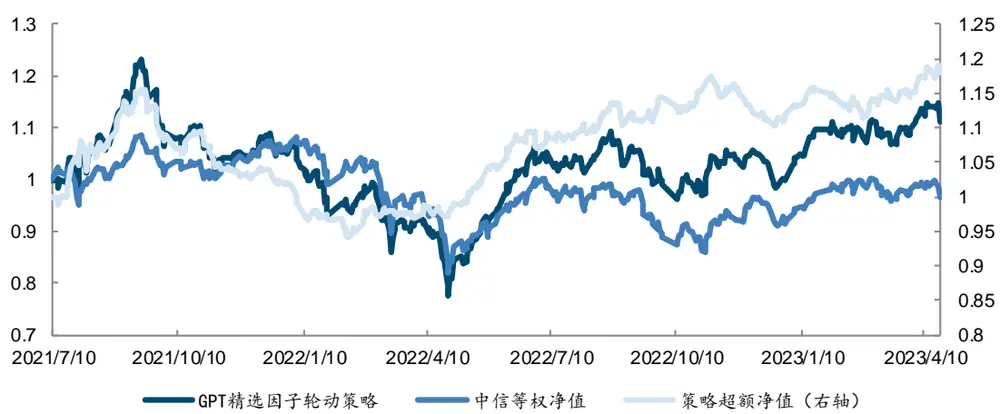
来源：Wind，国金证券研究所

图表39：GPT 精选因子轮动策略指标

| 指标 | GPT 精选因子轮动策略 | 行业等权基准 |
| --- | --- | --- |
| 年化收益率 | 6.03% | -1.90% |
| 年化波动率 | 21.28% | 17.42% |
| 夏普比率 | 0.28 | -0.11 |
| 最大回撤 | 37.03% | 24.64% |
| 年化超额收益率 | 9.63% | 一 |
| 信息比率 | 0.95 | 一 |
| 超额最大回撤 | 18.51% | 一 |

来源：Wind，国金证券研究所

## 七、总结

从结果上来看 GPT-4 的效果远超过其他模型，并可以辅助我们完成报告的阅读以及行业配置等任务。使用 GPT-4 进行文本的打分任务，一方面可以帮助我们快速把握文章中的投资要点，提高工作效率；另一方面也能够得到标准化的得分，便于我们进行行业之间的对比。当然，目前模型的使用中还存在一些问题，主要包括：

1、模型对较新的词汇（受限于无法联网）理解能力较差，需要用户给出具体的解释

2、模型对部分词汇过于敏感，要对输入文本进行筛选，剔除会对模型造成干扰的语句。

3、模型给出的打分理由可能不够充分，需要在使用时检查模型的中间推理过程，防止不合理的结果出现。

4、模型对文本的信息质量要求较高，否则会导致输出结果不稳定，打分的可信度也较低。

我们每月挑选过去半年表现最好的 4 个卖方策略团队，将其月度报告中的行业配置相关内容输入 GPT-4 模型，并取每个行业的打分中位数作为 GPT 精选配置因子。该因子 IC 均值为 0.94%，Top 组合年化收益率为 8.46%。从因子的构建逻辑上来说，该因子主要衡量各个卖方策略团队对看多行业的评价，但没有涉及对看空行业以及未提及行业的看法，所以打分为 0 也并不意味着卖方策略团队对该行业看空。从回测结果上也能看出，因子在行业做多方面能起到较好的筛选效果，但在看空方面的效果不佳。不过，我们使用ChatGPT 对行业进行打分的初步尝试证明了这一方法的可行性，后续也可以按照这一思路做更多探索，更大程度发挥 ChatGPT 带来的效率提升。

## 风险提示

1、以上结果通过历史数据统计、建模和测算完成，若历史数据产生环境发生变化，可能出现模型失效风险;

2、政策环境发生变化，资产与相关风险因子失去稳定关系的模型风险;

3、市场环境发生变化，国际政治摩擦升级等带来各大类资产同向大幅波动风险。

## 特别声明：

国金证券股份有限公司经中国证券监督管理委员会批准，已具备证券投资咨询业务资格。

形式的复制、转发、转载、引用、修改、仿制、刊发，或以任何侵犯本公司版权的其他方式使用。经过书面授权的引用、刊发，需注明出处为“国金证券股份有限公司”，且不得对本报告进行任何有悖原意的删节和修改。

本报告的产生基于国金证券及其研究人员认为可信的公开资料或实地调研资料，但国金证券及其研究人员对这些信息的准确性和完整性不作任何保证。本报告反映撰写研究人员的不同设想、见解及分析方法，故本报告所载观点可能与其他类似研究报告的观点及市场实际情况不一致，国金证券不对使用本报告所包含的材料产生的任何直接或间接损失或与此有关的其他任何损失承担任何责任。且本报告中的资料、意见、预测均反映报告初次公开发布时的判断，在不作事先通知的情况下，可能会随时调整，亦可因使用不同假设和标准、采用不同观点和分析方法而与国金证券其它业务部门、单位或附属机构在制作类似的其他材料时所给出的意见不同或者相反。

本报告仅为参考之用，在任何地区均不应被视为买卖任何证券、金融工具的要约或要约邀请。本报告提及的任何证券或金融工具均可能含有重大的风险，可能不易变卖以及不适合所有投资者。本报告所提及的证券或金融工具的价格、价值及收益可能会受汇率影响而波动。过往的业绩并不能代表未来的表现。

客户应当考虑到国金证券存在可能影响本报告客观性的利益冲突，而不应视本报告为作出投资决策的唯一因素。证券研究报告是用于服务具备专业知识的投资者和投资顾问的专业产品，使用时必须经专业人士进行解读。国金证券建议获取报告人员应考虑本报告的任何意见或建议是否符合其特定状况，以及（若有必要）咨询独立投资顾问。报告本身、报告中的信息或所表达意见也不构成投资、法律、会计或税务的最终操作建议，国金证券不就报告中的内容对最终操作建议做出任何担保，在任何时候均不构成对任何人的个人推荐。

在法律允许的情况下，国金证券的关联机构可能会持有报告中涉及的公司所发行的证券并进行交易，并可能为这些公司正在提供或争取提供多种金融服务。

本报告并非意图发送、发布给在当地法律或监管规则下不允许向其发送、发布该研究报告的人员。国金证券并不因收件人收到本报告而视其为国金证券的客户。本报告对于收件人而言属高度机密，只有符合条件的收件人才能使用。根据《证券期货投资者适当性管理办法》，本报告仅供国金证券股份有限公司客户中风险评级高于 C3 级(含 C3 级）的投资者使用；本报告所包含的观点及建议并未考虑个别客户的特殊状况、目标或需要，不应被视为对特定客户关于特定证券或金融工具的建议或策略。对于本报告中提及的任何证券或金融工具，本报告的收件人须保持自身的独立判断。使用国金证券研究报告进行投资，遭受任何损失，国金证券不承担相关法律责任。

若国金证券以外的任何机构或个人发送本报告，则由该机构或个人为此发送行为承担全部责任。本报告不构成国金证券向发送本报告机构或个人的收件人提供投资建议，国金证券不为此承担任何责任。

此报告仅限于中国境内使用。国金证券版权所有，保留一切权利。

上海

电话：021-60753903

传真：021-61038200

地址：上海浦东新区芳甸路 1088 号紫竹国际大厦 7 楼

邮箱：researchsh@gjzq.com.cn

深圳

北京

邮编：201204

电话：010-85950438

电话：0755-83831378

邮箱：researchbj@gjzq.com.cn

邮编：100005

地址：北京市东城区建内大街 26 号新闻大厦 8 层南侧

传真：0755-83830558

邮箱：researchsz@gjzq.com.cn

邮编：518000

地址：中国深圳市福田区中心四路 1-1 号嘉里建设广场 T3-2402