# Beta猎手系列之五

金融工程专题报告

证券研究报告

金融工程组

分析师：高智威（执业

联系人：许坤圣

S1130522110003)

xukunsheng@gjzq.com.cn

gaozhiw@gjzq.com.cn

## 基于机构调研热度和广度视角的行业配置策略

## 调研热度与广度双维度探察

市场中机构投资者的动向是受到重点关注的话题，调研活动有强制披露的要求，且数据披露格式规范，蕴含了大量机构投资者的行为信息。通过调研事件可以更好探察机构投资者动向。现有调研事件的相关研究主要应用于选股层面，对行业层面的拆解分析较少。本篇报告通过对行业内调研活动平均数的拆解，分别从调研热度与广度两个维度，去刻画调研事件对行业的影响。从调研事件这一另类视角，分析调研热度与广度，我们可以更好地探察行业走势。

## 调研事件研究逻辑

为了类比调研选股指标的公司热度描述，我们通过对行业调研活动平均数进行拆解，得到了行业调研热度与行业调研广度两大指标。调研热度通过覆盖公司的调研活动平均数来刻画行业内的公司热度，广度通过行业的调研覆盖程度来刻画行业拥挤度。

同时，2019 年后，调研活动数量呈稳定上升趋势，调研事件蕴含的信息增多。参与者类型上，基金公司参与者调研占比相较早年提升明显，基金公司直接参与的调研数增多，使得我们能够从调研数据中获取更多的基金公司行为信息。参与调研的机构类型主要是基金公司和证券公司，因此我们的研究也主要围绕两者展开。

## 行业热度与广度

我们选择大规模调研活动的基金公司调研热度因子作为调研热度因子的代表因子，调研热度因子 IC 均值为 8.64%，多空年化收益为 16.05%，夏普比率为 1.40。另外，我们基于证券公司调研活动行业内被调研公司占比的 3 个月累计值环比变化率和间隔3个月月度变化率构建广度因子，调研广度因子IC均值为4.70%，多空年化收益为7.72%，夏普比率为 0.60。广度与深度因子的相关性不高，为-3.83%。将调研热度因子与广度因子以等权方式进行合成，得到调研活动因子，调研活动因子 IC 均值为 11.38%，多空年化收益为 21.82%，夏普比率为 1.90。合成后多空净值更加平稳，夏普比率也更高了。

## 调研行业精选策略

我们以中信一级行业等权配置作为基准，利用调研活动因子构建了调研行业精选策略。策略的年化收益率为7.61%，夏普比率为 0.38。从 2017 年 1 月 02 日至2023 年6 月01 日，相较于行业等权基准,行业轮动策略的年化超额收益率为6.06%。随着调研活动数量的逐年上升，策略在2020年至2023年表现优异。2020年、2021年、2022年和2023 年（截止至 6 月 1 日）的超额收益率分别达到了 4.49%、5.19%、10.90%和 17.40%。

## 风险提示

以上结果通过历史数据统计、建模和测算完成，在政策、市场环境发生变化时模型存在失效的风险。

## 一、调研热度与广度双维度探察

本篇报告是 Beta 猎手系列报告的第五篇，我们通过对行业内的调研活动平均数进行拆解，分别构建了调研热度与广度两类因子，并将两个因子合成，得到调研活动因子应用于行业轮动的策略中。调研活动有强制披露的要求，且数据披露格式规范，蕴含了大量机构投资者的行为信息。而现有调研事件的相关研究主要应用于选股层面，对行业层面的拆解分析较少。本篇报告通过对行业内调研活动平均数的拆解，分别从调研热度与广度两个维度，去刻画调研事件对行业的影响。调研热度通过覆盖公司的调研活动平均数来刻画行业内的公司热度。广度通过研究行业的调研覆盖程度来刻画行业调研拥挤度。从调研事件这一另类视角，分析调研热度与广度，我们可以更好地探察行业走势。

## 二、调研事件研究逻辑

## 2.1 调研事件数据速览

根据《深圳证券交易所创业板上市公司规范运作指引（2020 年修订）》、《深圳证券交易所主板上市公司规范运作指引（2015 年修订）》和《上海证券交易所上市公司自律监管指引第 1 号——规范运作》等文件的明确规定，上市公司接受从事证券分析、咨询及其他证券服务业的机构及个人、从事证券投资的机构及个人（以下简称调研机构及个人）的调研时，应当妥善开展相关接待工作，并按规定履行相应的信息披露义务。因此，调研事件数据可被整理成规整的数据形式，且信息量丰富。

调研事件数据主要分为两个部分：

调研活动部分：记录每次调研活动发生的对象公司、投资者活动关系类别以及调研日期与公告日期等相关信息。

- 调研参与主体部分：记录调研参与投资者的类型、名字等相关信息。

图表1：调研事件数据具体类别

| 投资者关系活动类别 | 机构投资者类型 |
| --- | --- |
| 特定对象调研 | 证券公司资管 |
| 分析师会议 | 证券公司自营 |
| 媒体采访 | 基金公司 |
| 业绩说明会 | 证券公司 |
| 新闻发布会 | 保险公司 |
| 路演活动 | 投资公司 |
| 现场参观 | 外资机构 |
| 其他 | 其他 |
| 投资者接待日活动 |  |
| 一对一沟通 |  |

来源：Wind，国金证券研究所

从数量的变化趋势看，调研活动数量从 2019 年开始呈稳定上升趋势，蕴含的信息增多。从调研活动的投资者关系活动类别看，调研活动主要以特定对象调研为主，业绩说明会和其他类型占比近年来略有增加。

参与者类型上，基金公司参与者调研占比相较早年提升明显，2020年占比比2019年显著提升，基金公司直接参与的调研数增多，使得我们能够从调研数据中获取更多的基金公司行为信息。同时，参与调研的机构类型主要是基金公司和证券公司，因此我们后续的研究主要围绕两者展开。

图表2：各类调研活动数量逐年变化
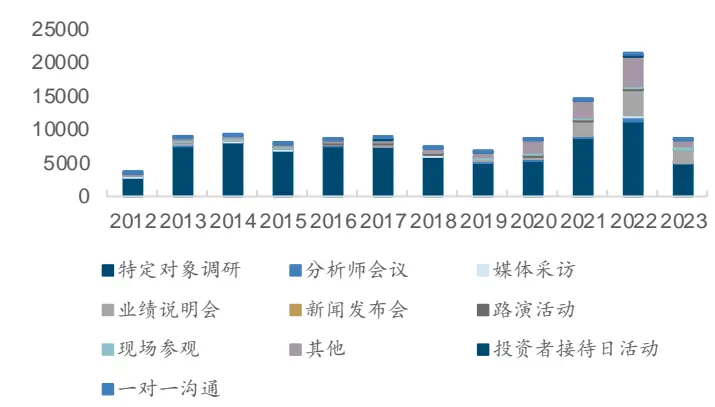
来源：Wind，国金证券研究所

图表3：调研活动各类型投资者调研次数占比
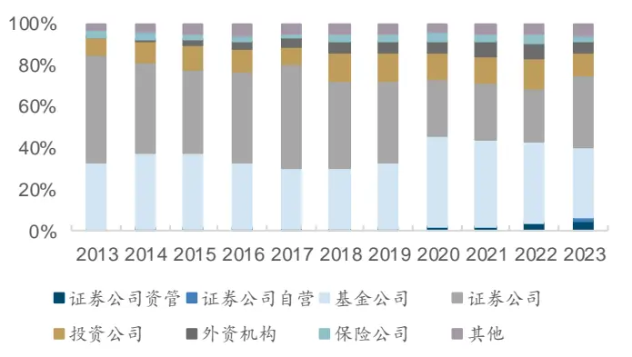
来源：Wind，国金证券研究所

## 2.2 调研事件行业层面拆解

目前调研事件数据多运用于选股策略的构建：

构造的选股指标呈现出较明显的动量效应，因子的 IC 均值多为正，属于热度在个股情绪面上的表现。

- 选股调研因子的构造方式较为多样，可以通过月度的调研事件次数等方法进行构建，常见指标的构建可看表 5。

图表4：部分调研选股因子1C

| 因子名称 | 平均值 | 标准差 | 平均股票数 |
| --- | --- | --- | --- |
| 特定对象类型调研季度总数 | 0.43% | 8.75% | 669 |
| 其他类型调研季度总数 | 2.59% | 13.59% | 120 |
| 调研季度总数 | 0.64% | 8.42% | 787 |

来源：Wind，《主动量化研究之二:当绩优基金重仓股遇到调研会发生什么共振？》

图表5：调研选股指标构建

| 调研选股指标 | 指标统计时段长度 |
| --- | --- |
| 调研次数 | 一或三个月 |
| 调研次数的同比变化差值 | 一或三个月 |
| 调研次数的同比变化率 | 一或三个月 |
| 调研次数的环比变化差值 | 一个月 |
| 调研次数的环比变化率 | 一个月 |
| 机构调研次数 | 一或三个月 |
| 机构调研次数的同比变化差值 | 一或三个月 |
| 机构调研次数的同比变化率 | 一或三个月 |
| 机构调研次数的环比变化差值 | 一个月 |
| 机构调研次数的环比变化率 | 一个月 |

来源：Wind，国金证券研究所

为了类比选股指标（调研次数）的构建方式，我们对行业调研活动平均数进行拆解。将行业调研活动的平均数拆解后，即可得到行业调研热度与行业调研广度两大指标。行业调研活动平均数的定义与拆解公式如下，其中 j=1,2,……,29，表示除综合金融以外的29 个行业。 $I_{\mathit{i}\bar{T}\ :\{k=j}$ 表示对应公司（调研活动）属于 j 行业则取值为 1，否则为 0。

- N:行业 j 当期的调研活动数量

- M:行业 j 的公司数

- Q:行业 j 当期有调研活动的公司数

$$
\{\bar{T},\mathbf{y},\mathbf{k}\}\mathbb{H}\mathbb{H}\mathbb{H}\{\bar{\mathbf{y}}\}\stackrel{\leq\bar{T}}{\mathbb{R}}\bar{\mathbf{y}}+\frac{\bar{\mathbf{y}}\mathbb{H}}{\bar{\mathbf{z}}}\mathbb{H}\{\mathbf{z}\}\stackrel{\leq\bar{T}}{\bar{\mathbf{z}}}|I_{\bar{\mathbf{y}}\bar{\mathbf{z}}}\bar{\mathbf{y}}|I_{\bar{\mathbf{z}}\bar{\mathbf{z}}}=\frac\sum_{n}^{N}\mathbb{H}\mathbb{A}\mathbb{A}f\mathbb{H}\{\bar{\mathbf{y}}\}\cdot\bar{\mathbf{z}}\{\bar{\mathbf{z}}\}|I_{\bar{\mathbf{z}}\bar{\mathbf{z}}}\}\sum_{m}^{M}\mathcal{A}\{\bar{\mathbf{z}}\}|I_{\bar{\mathbf{z}}\bar{\mathbf{z}}=j}=\frac\sum_{n}^{Q}\mathbb{i}\mathbb{A}f\mathbb{A}f\mathbb{H}\{\bar{\mathbf{z}}\}\bar{\mathbf{z}}\{\bar{\mathbf{z}}\}|I_{\bar{\mathbf{z}}\bar{\mathbf{z}}=j}\sum_{m}^{M}\mathcal{A}\{I_{\bar{\mathbf{z}}}\}|I_{\bar{\mathbf{z}}\bar{\mathbf{z}}=j}
$$

$$
=\frac{\mathrm{i}\tilde{\Re}\mathrm{\Im}\mathrm{\Im}\mathrm{\Im}\mathrm{\Im}\mathrm{\Im}\mathrm{\Im}\mathrm{\Im}\mathrm{\Im}\mathrm{\Im}\mathrm{\Im}\mathrm{\Im}\mathrm{\Im}\mathrm{\Im}\mathrm{\Im}\mathrm{\Im}\mathrm{\Im}\mathrm{\Im}\mathrm{\Im}}\mathrm{\Im}\mathrm{\Im}\mathrm{\Im}\mathrm{\Im}\mathrm{\Im}\mathrm{\Im}\mathrm{\Im}\mathrm{\Im}\mathrm{\Im}\mathrm{\Im}\mathrm{\Im}\mathrm{\Im}\mathrm{\Im}\mathrm{\Im}\mathrm{\Im}\mathrm{\Im}\mathrm{\Im}\mathrm{\Im}\mathrm{\Im}\mathrm{\Im}\mathrm{\Im}\mathrm{\Im}\mathrm{\Im}\mathrm{\Im}\mathrm{\Im}\mathrm{\Im}\mathrm{\Im}\mathrm{\Im}\mathrm{\Im}\mathrm{\Im}\mathrm{\Im}\mathrm{\Im}\mathrm{\Im}\mathrm{\Im}\mathrm{\Im}\mathrm{\Im}\mathrm{\Im}\mathrm{\Im}\mathrm{\Im}\mathrm{\Im}\mathrm{\Im}\mathrm{\Im}\mathrm{\Im}\mathrm{\Im}\mathrm{\Im}\mathrm{\Im}\mathrm{\Im}\mathrm{\Im}\mathrm{\Im}\mathrm{\Im}\mathrm{\Im}\mathrm{\Im}\mathrm{\Im}\mathrm{\Im}\mathrm{\Im}\mathrm{\Im}\mathrm{\Im}\mathrm{\Im}\mathrm{\Im}\mathrm{\Im}\mathrm{\Im}\mathrm{\Im}\mathrm{\Im}\mathrm{\Im}\mathrm{\Im}\mathrm{\Im}\mathrm{\Im}\mathrm{\Im}\mathrm{\Im}\mathrm{\Im}\mathrm{\Im}\mathrm{\Im}\mathrm{\Im}\mathrm{\Im}\mathrm{\Im}\mathrm{\Im}\mathrm{\Im}\mathrm{\Im}\mathrm{\Im}\mathrm{\Im}\mathrm{\Im}\mathrm{\Im}\mathrm{\Im}\mathrm{\Im}\mathrm{\Im}\mathrm{\Im}\mathrm{\Im}\mathrm{\Im}\mathrm{\Im}\mathrm{\Im}\mathrm{\Im}\mathrm{\Im}\mathrm{\Im}\mathrm{\Im}\mathrm
$$

= 行业调研热度∗行业调研广度

## 三、行业调研热度

## 3.1 热度因子初尝试

使用个股层面的月调研次数类比行业月热度指标，并在此基础上构建热度因子。下文所用热度指标均为月度统计值，行业j调研热度指标公式如下：

$$
\{{\bar{\tau}},\ \mathrm{l}\}\ \mathrm{l}\ \dot{y}\|\ \dot{z}\ \dot{y}\|\ \dot{z}\dot{z}\ \dot{\mathcal{R}},\ \dot{\mathcal{R}^{\pm}}\ \frac{16}{36}\frac{1}{4\pi}\frac{1}{4}\frac{1}{\hbar}(\dot{z}-\dot{z})=\frac{\dot{\tau}\dot{\mathcal{R}}\ \dot{\mathcal{R}}\dot{\mathcal{R}}\dot{\mathcal{R}}\dot{\mathcal{R}}\dot{\mathcal{R}}}\ (\dot{z})\mathcal{\bar{R}}(\dot{z}\dot{\mathcal{R}}\dot{\mathcal{R}}\ \ \frac{\dot{z}}{\hbar\mathcal{R}}\frac{\dot{z}\dot{\mathcal{R}}}{\hbar\mathcal{R}}\frac{\dot{z}}{\hbar\mathcal{R}}){\dot{\mathcal{R}}\dot{\mathcal{R}}\dot{\mathcal{I}}\dot{\mathcal{I}}\dot{\mathcal{I}}\dot{\mathcal{R}}(\dot{z}\dot{\mathcal{R}}\times\dot{\mathcal{I}})}\ \frac{\dot{\mathcal{R}}\dot{\mathcal{R}}\dot{\mathcal{R}}\dot{\mathcal{R}}}{\dot\mathcal{R}}\ \frac{\dot{z}\dot{\mathcal{R}}}{\hbar\mathcal{R}}=\frac{\sum_{n}^{N}\dot{\eta}\dot{\mathcal{R}}\dot{\mathcal{R}}\dot{\mathcal{I}}\dot{\mathcal{R}}\dot{\mathcal{R}}\dot{\mathcal{R}}\dot{\mathcal{I}}}(\dot{z}\dot{\mathcal{R}}\dot{\mathcal{I}}\dot{z}\dot{\mathcal{R}}\dot{\mathcal{I}})[I_{\dot{\mathcal{R}}\dot{\mathcal{R}}}\frac{\dot{z}\dot{\mathcal{R}}\dot{\mathcal{I}}}{\hbar\mathcal{R}}\dot\mathcal
$$

调研活动具有行业倾向，无法单纯使用绝对数比较行业之间的差异，需要使用相对数（如同比变化等）对指标进行处理。对调研热度指标使用比值方法进行因子构建，构建得到的各类因子 IC 均值有负有正，且值都偏小（回测时间为 2014 年 1 月至 2023 年 6月）。我们认为原因在于，个股层面的调研热度处理不能简单照搬至行业层面。

图表6：初构热度因子IC统计表

| 因子 | 平均值 | 标准差 | 最小值 | 最大值 | 风险调整的IC | t统计量 |
| --- | --- | --- | --- | --- | --- | --- |
| 调研热度3个月累计值环比变化 | 0.11% | 20.89% | -43.02% | 60.50% | 0.01 | 0.05 |
| 调研热度同比变化 | -0.75% | 18.35% | -43.69% | 35.70% | -0.04 | -0.42 |
| 调研热度季度变化 | -2.12% | 21.22% | -44.70% | 53.31% | -0.1 | -1.03 |
| 调研热度较12个月中位数变化率 | -0.64% | 22.84% | -50.69% | 52.35% | -0.03 | -0.29 |
| 调研热度较12个月75分位数变化率 | -0.13% | 22.79% | -56.31% | 52.70% | -0.01 | -0.06 |

来源：Wind，国金证券研究所

## 3.2 热度因子再探究

通过简单的类比并不能取得较好的因子效果，本篇报告尝试从以下两方面对热度因子进行优化改良：

- 调研活动规模选取：在调研活动规模方面，考虑到热度因子主要刻画调研活动的泛化和高参与度，而小规模的调研活动只能被少部分投资者获取，并不一定能达到广泛认知的效果，我们选取过去一年调研活动参与人数的分位数作为适当的阈值，高于保留，低于去除。（本篇报告采用过去一年的中位数为划分点）。

调研机构类型选取：基于调研次数的热度指标因子在初构环节中，表现并不佳。调研活动次数中包含了较多不同的机构类型，杂糅了许多信息，本篇报告从中拆分出调研质量较高的基金公司类型进行进一步研究。类比基于调研活动次数的热度指标，拓展至基于基金公司调研次数的热度指标如下，同时本文也构建了证券调研热度用于对比 $(N_{1}$ :行业j当期的调研证券公司数量， $N_{2}{:}$ 行业j当期的调研基金公司数量）：

$$
\{\bar{1}\bar{1},\ 3\}\downarrow\downarrow\ \frac{\partial}{\partial t}\bar{y}\bar{1}\bar{y}\bar{1}\bar{y}\bar{1}\bar{y}\bar{1}\bar{y}\bar{1}\bar{y}\bar{1}\bar{y}\bar{1}\bar{y}\bar{1}\bar{y}\bar{1}\bar{y}\bar{1}\bar{y}\bar{1}\bar{y}\bar{1}\bar{y}\bar{1}\bar{y}\bar{1}\bar{y}\bar{1}\bar{y}\bar{1}\bar{y}\bar{1}\bar{y}\bar{1}\bar{y}\bar{1}\bar{y}\bar{1}\bar{y}\bar{1}\bar{y}\bar{1}\bar{y}\bar{1}\bar{y}\bar{1}\bar{y}\bar{1}\bar{y}\bar{1}\bar{y}\bar{1}\bar{y}\bar{1}\bar{y}\bar{1}\bar{y}\bar{1}\bar{y}\bar{1}\bar{y}\bar{1}\bar{y}\bar{1}\bar{y}\bar{1}\bar{y}\bar{1}\bar{y}\bar{1}\bar{y}\bar{1}\bar{y}\bar{1}\bar{y}\bar{1}\bar{y}\bar{1}\bar{y}\bar{1}\bar{y}\bar{1}\bar{y}\bar{1}\bar{y}\bar{1}\bar{y}\bar{1}\bar{y}\bar{1}\bar{y}\bar{1}\bar{y}\bar{1}\bar{y}\bar{1}\bar{y}\bar{1}\bar{y}\bar{1}\bar{y}\bar{1}\bar{y}\bar{1}\bar{y}\bar{1}\bar{y}\bar{1}\bar{y}\bar{1}\bar{y}\bar{1}\bar{y}\bar{1}\bar{y}\bar{1}\bar{y}\bar{1}\bar{y}\bar{1}\bar{y}\bar{1}\bar{y}\bar{1}\bar{y}\bar{1}\bar{y}
$$

$$
\{\{\bar{\tau}\}\downarrow\downarrow\downarrow\downarrow\ \pm\ \frac{\mathrm{d}}{\mathrm{d}z}\ \frac{\partial\mathrm{d}}{\partial z}\mathrm{d}\mathcal{G}\dag\frac{\partial\mathrm{d}}{\partial z}\frac{\partial\mathrm{d}\mathrm{s}}{\partial\mathrm{t}\partial\mathcal{H}\dag}\frac{\partial\mathrm{s}}{\partial\mathrm{t}\partial\mathcal{H}\dag}\frac{\partial\mathrm{d}}{\partial\mathrm{t}\partial\mathcal{H}\dag}=\frac{\ \mathrm{i}\Theta\mathcal{G}\dag\cdot\ \ \mathrm{\partial}\frac{\partial}{\partial z},\frac{\partial}{\partial\mathcal{G}}\ \mathrm{d}\frac{\partial}{\partial z},\frac{\partial}{\partial z},\frac{\partial}{\partial z},\frac{\partial}{\partial z},\frac{\partial}{\partial z}}{\ \mathrm{i}\frac{\partial}{\partial z},\frac{\partial}{\partial\mathcal{G}}\ \mathrm{d}\mathcal{G}\dag\mathcal{G}\dag\mathcal{G}\dag\mathcal{G}\frac{\partial}{\partial z},\frac{\partial}{\partial z},\frac{\partial}{\partial z},\frac{\partial}{\partial z}}=\frac\sum_{n=1}^{N_{2}}\ \ \mathrm{i}\Theta\mathcal{G}\dag\frac{\partial}{\partial z}\frac{\partial\mathrm{d}}{\partial z}\frac{\partial}{\partial z},\frac{\partial}{\partial\mathcal{G}}I_{\{\bar{\tau}\}\dag\Delta z=j}_{\mathcal{G}\dag\mathcal{G}}\dag\mathcal{G}\frac{\partial}{\partial z},\frac{\partial}{\partial\mathcal{G}}\ \mathrm{d}[I_{\{\bar{\tau}\}\dag\Delta z=j},\frac{\partial}{\partial\mathcal{G}}]\ \mathrm
$$

然后我们使用每月的机构调研热度指标与滚动历史区间热度指标的中位数比值，构建调研热度因子(我们首先以过往 12 个月调研热度中位数作为基础参数设定，测试了不同机构类别和调研活动类型对于因子效果有怎样的影响):

$$
\textcircled{1}\textcircled{4}\textcircled{1}\textcircled{2}\textcircled{3}\textcircled{5}\textcircled{1}\textcircled{1}\textcircled{7}\textcircled{1}\textcircled{1}\textcircled{1}\textcircled{2}\textcircled{1}\textcircled{1}\textcircled{1}\textcircled{2}\textcircled{1}\textcircled{1}\textcircled{2}\textcircled{1}\textcircled{1}\textcircled{2}\textcircled{2}\textcircled{1}\textcircled{1}\textcircled{2}\textcircled{1}\textcircled{1}\textcircled{2}\textcircled{2}\textcircled{1}\textcircled{1}\textcircled{2}\textcircled{2}\textcircled{1}\textcircled{2}\textcircled{1}\textcircled{2}\textcircled{2}\textcircled{1}\textcircled{1}\textcircled{2}\textcircled{2}\textcircled{1}\textcircled{2}\textcircled{2}\textcircled{2}\textcircled{1}\textcircled{2}\textcircled{2}\textcircled{2}\textcircled{1}
$$

## 3.3 热度因子的有效性

我们对构造的热度因子进行 IC 测试（回测时间为 2014 年 1 月至 2023 年 6 月）。从调研活动规模的角度看，相比于全规模调研活动的热度因子，大规模调研活动的热度因子的行业筛选能力更强，在进行调研活动的规模控制之后，我们发现无论是基金公司还是证券公司，因子 IC 都有所提升。而从机构类别的不同，我们分别测试了包含基金公司和证券公司参与的调研热度因子，并进行对比。从因子 IC 的角度对比，基金公司的调研热度因子选行业的能力相对更强。从定性的角度理解，调研热度需要具有指示性，因此，基金公司作为后续真正有可能进行投资的主体，其调研热度的精准度更高。

在全规模调研活动构建的调研热度因子中，基金公司热度因子的 IC 均值为 4.31%，证券公司热度因子的 IC 均值为 4.04%。而在增加了大规模调研活动筛选条件之后，我们保留对行业调研更具泛化的调研事件，基金公司和证券公司的热度因子IC表现更好了，IC均值分别为5.31%和4.12%。最终，我们选择其中效果最好、基于大规模调研活动的基金公司调研热度因子，作为调研热度因子的代表因子。另外，类比个股的热度指标，我们可以看到行业的基金公司调研热度因子仍为动量型因子。

图表7：热度因子IC指标

| 因子 | 平均值 | 标准差 | 最小值 | 最大值 | 风险调整的IC | t统计量 |
| --- | --- | --- | --- | --- | --- | --- |
| 调研热度因子(基金公司)_12M | 4.31% | 18.78% | -47.61% | 51.06% | 0.23 | 2.43 |
| 调研热度因子(基金公司)_12M_大规模 | 5.31% | 16.66% | -35.06% | 50.42% | 0.32 | 3.39 |
| 调研热度因子(证券公司)_12M | 4.04% | 19.73% | -46.22% | 57.28% | 0.20 | 2.18 |
| 调研热度因子(证券公司)12M 大规模 | 4.12% | 17.48% | -41.58% | 43.01% | 0.24 | 2.51 |

来源：Wind，国金证券研究所

此外，本文还对热度因子构造过程中的滚动月份参数进行了不同的尝试，对比滚动 12 个月、24 个月、36 个月和 48 个月这四种构造方法的效果。为统一对比，因子回测时段为2017年1月至2023年6月。由下图可知，调研热度因子在36个月和48个月的参数设置下，表现效果较佳。

图表8：不同参数热度因子IC指标

| 因子 | 平均值 | 标准差 | 最小值 | 最大值 | 风险调整的IC | t统计量 |
| --- | --- | --- | --- | --- | --- | --- |
| 调研热度因子_12M | 7.78% | 17.31% | -31.82% | 54.63% | 0.45 | 3.94 |
| 调研热度因子_24M | 8.40% | 16.25% | -34.24% | 52.69% | 0.52 | 4.54 |
| 调研热度因子_36M | 8.67% | 15.42% | -22.95% | 61.81% | 0.56 | 4.93 |
| 调研热度因子_48M | 8.64% | 16.55% | -30.87% | 53.71% | 0.52 | 4.58 |

来源：Wind，国金证券研究所

同时，结合调研热度因子的多空净值指标可以发现，调研热度因子（48 个月）表现较优，故本篇报告的调研热度因子构建方式如下：

1. 使用月度统计的基金公司调研热度指标作为原始数据。

2. 选取大规模调研活动，选取过去一年的调研活动的参与人数的分位数作为适当的阈值，高于保留，低于去除。（本篇报告采用过去一年的中位数为划分点）

3. 采用与滚动 48 个月中位数比值的方法作为因子构建方式。

图表9：调研热度因子多空组合指标

| 因子 | 年化收益率 | 波动率 | Sharpe 比率 | 最大回撤率 |
| --- | --- | --- | --- | --- |
| 调研热度因子（48个月） | 16.05% | 11.45% | 1.40 | 11.28% |
| 调研热度因子（36个月） | 14.49% | 11.33% | 1.28 | 13.04% |

来源：Wind，国金证券研究所

从调研热度因子的 IC 时间序列可以看出，调研热度因子大部分月份的 IC 为正，只在部分时间段因子可能会出现有效性下降的情况。

从分位数组合的净值表现可以看出，Top 组合跑赢市场组合，而 Bottom 组合跑输市场组合。从多空组合净值上来看，因子的收益在 2021 年出现小幅度的回撤，其余时间相对平稳。从收益上来看，Top 组合的年化超额收益率为 9.25%，多空组合的年化收益率为16.05%，夏普比率为 1.40。调研热度因子多头收益相对明显，且多空收益走势平稳。

图表10：调研热度因子IC
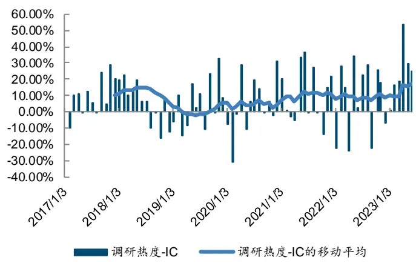
来源：Wind，国金证券研究所

图表11：调研热度因子分位数组合表现
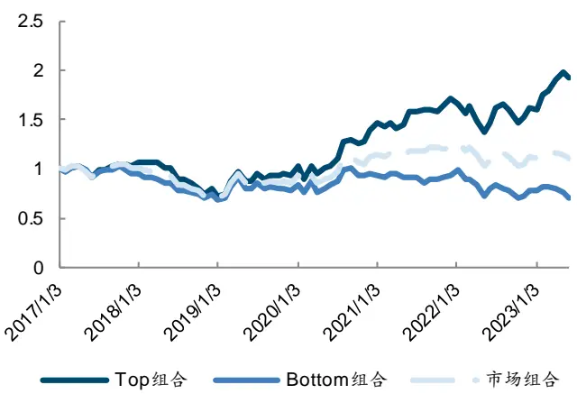
来源：Wind，国金证券研究所

从因子的表现上看，调研热度因子在2019年以后出现较好的表现。我们猜测是因为2019年以后，调研活动次数与基金公司调研活动次数明显增加，调研活动含有的增量信息显著增多，对基金公司的行为描述更为准确。因此，基于基金公司的调研活动构建的热度因子也表现优异。

图表12：基金公司参与调研次数
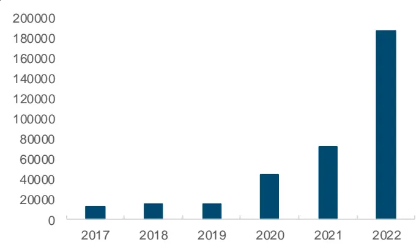
来源：Wind，国金证券研究所

图表13：调研热度因子多空组合表现
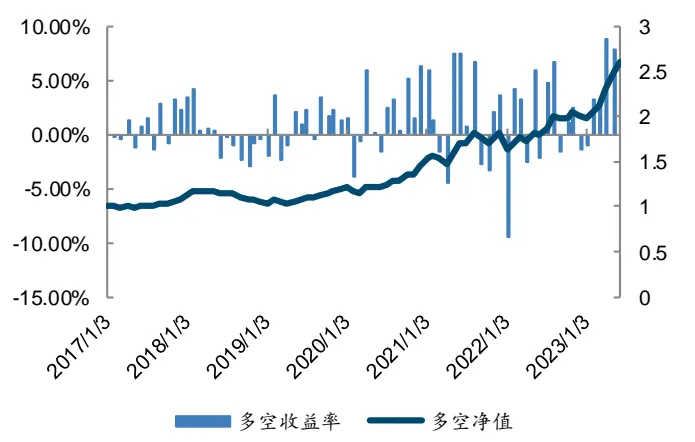
来源：Wind，国金证券研究所

图表14：调研热度因子分位数组合指标

| 组合 | 年化收益率 | 波动率 | 夏普比率 |  | 最大回撤率年化超额收益率 | 跟踪误差 | 信息比率 | 超额最大回撤率 |
| --- | --- | --- | --- | --- | --- | --- | --- | --- |
| Top | 10.75% | 21.51% | 0.50 | 33.24% | 9.25% | 7.70% | 1.20 | 7.81% |
| 1 | 2.65% | 19.84% | 0.13 | 31.95% | 0.94% | 7.26% | 0.13 | 18.95% |
| 2 | 2.91% | 22.31% | 0.13 | 34.51% | 1.61% | 8.26% | 0.20 | 13.68% |
| 3 | 0.51% | 19.71% | 0.03 | 29.37% | -1.38% | 9.49% | -0.15 | 20.45% |
| 4 | -5.04% | 21.70% | -0.23 | 40.17% | -6.20% | 6.25% | -0.99 | 35.04% |
| Bottom | -5.23% | 21.46% | -0.24 | 33.22% | -6.48% | 6.79% | -0.95 | 35.49% |
| 市场 | 1.48% | 19.63% | 0.08 | 32.73% | 一 | 一 | 一 | 一 |
| L-S | 16.05% | 11.45% | 1.40 | 11.28% | 一 | 一 | 一 | 一 |

来源：Wind，国金证券研究所

## 四、行业调研广度

## 4.1 广度指标初探究

调研广度指标的构建公式如下：

$$
\left\{\hat{\tilde{\tau}},\lVert\mathbf{k}\rVert\right\}\stackrel{\le\lVert\vec{\mu}\rVert}{\lVert\mathbf{k}\rVert}\xi\stackrel{\le\lVert\vec{\tau}}{\lVert\mathbf{k}\rVert}\xi=\frac{\vec{\mu}\vec{\mathcal{K}}\cdot\lVert\vec{\tau},\lVert\vec{\tau},\vec{\mu}\rVert\vec{\tau},\lVert\vec{\tau}\rVert_{\vec{\tau}}\vec{\tau}\rVert_{\vec{\tau}}^{2}\vec{\tau}\stackrel{\le\lVert\vec{\tau}\rVert}{\lVert\vec{\mathcal{K}}\cdot\vec{\tau}\rVert}\vec{\tau},\lVert\vec{\tau}\rVert_{\vec{\tau}\stackrel{\le\lVert\vec{\tau}\rVert}{\lVert\vec{\mathcal{K}}\cdot\vec{\tau}\rVert}}}{\mathrm{i}\vec{\mathcal{K}}\cdot\lVert\vec{\tau},\lVert\vec{\tau}\rVert_{\vec{\tau}}\rVert_{\vec{\tau}}\vec{\tau}\stackrel{\le\lVert\vec{\tau}\rVert}{\lVert\vec{\mathcal{S}}\rVert}\xi\stackrel{\le\lVert\vec{\tau}\rVert}{\lVert\vec{\mathcal{S}}\rVert}}=\frac{\sum_{q}^{Q}\vec{\mu}\vec{\mu}\rVert\vec{\mathcal{L}}\vec{\tau}/\sqrt{\operatorname{\lVert\vec{\tau}}\rVert_{\vec{\tau}}\vec{\tau}}}{\sum_{m}^{M}\langle\vec{\mu}\rVert}\lVert I_{\{\vec{\tau}\}\rVert\le j}
$$

广度指标通过刻画行业内调研的覆盖程度，来描述行业的拥挤度。同时观察图表15与16，也不难发现，当行业净值达到峰值时，往往广度指标间隔 3 个月月度变化率（单向 HP 滤波去除周期性）也达到峰值。

图表15：消费者服务指数与广度指标间隔3个月变化率
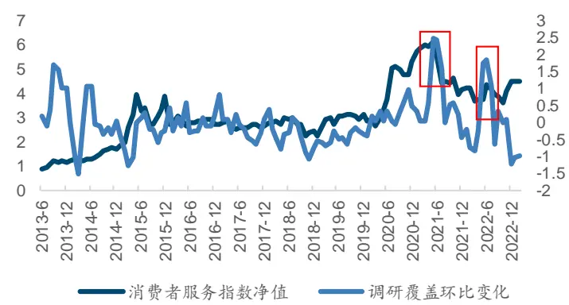
来源：Wind，国金证券研究所

图表16：医药指数与广度指标间隔3个月变化率
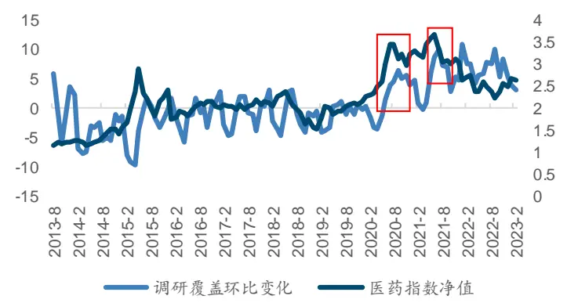
来源：Wind，国金证券研究所

## 4.2 广度因子预处理

类比基于受调研公司数的广度指标，可将指标拓展至基于受证券公司调研公司数的广度指标 $(Q_{1}$ :行业j当期证券公司调研的公司数， $Q_{2}\colon$ 行业j当期基金公司调研的公司数）:

$$
\begin{array}{r}\{\mathfrak{T}\downarrow\downarrow\downarrow\mathrm{~i}\mathtt{i}\mathtt{k}\xrightarrow{\mathtt{j}\mathtt{k}}\mathcal{J}_{\uparrow}\xrightarrow{\mathtt{k}}\overline{{\mathtt{d}}}\overline{{\mathtt{d}}}\overline{{\mathtt{d}}}\overline{{\mathtt{d}}}\overline{{\mathtt{d}}}\overline{{\mathtt{d}}}\overline{{\mathtt{d}}}\overline{{\mathtt{d}}}\overline{{\mathtt{d}}}\overline{{\mathtt{d}}}\overline{{\mathtt{d}}}\overline{{\mathtt{d}}}\overline{{\mathtt{d}}}\overline{{\mathtt{d}}}\overline{{\mathtt{d}}}\overline{{\mathtt{d}}}\overline{{\mathtt{d}}}\overline{{\mathtt{d}}}\overline{{\mathtt{d}}}\overline{{\mathtt{d}}}\overline{{\mathtt{d}}}\overline{{\mathtt{d}}}\overline{{\mathtt{d}}}\overline{{\mathtt{d}}}\overline{{\mathtt{d}}}\overline{{\mathtt{d}}}\overline{{\mathtt{d}}}\overline{{\mathtt{d}}}\overline{{\mathtt{d}}}\overline{{\mathtt{d}}}\overline{{\mathtt{d}}}\overline{{\mathtt{d}}}\overline{{\mathtt{d}}}\overline{{\mathtt{d}}}\overline{{\mathtt{d}}}\overline{{\mathtt{d}}}\overline{{\mathtt{d}}}\overline{{\mathtt{d}}}\overline{{\mathtt{d}}}\overline{{\mathtt{d}}}\overline{{\mathtt{d}}}\overline{{\mathtt{d}}}\overline{{\mathtt{d}}}\overline{{\mathtt{d}}}\overline{{\mathtt{d}}}\overline{{\mathtt{d}}}\overline{{\mathtt{d}}}\overline{{\mathtt{d}}}\overline{{\mathtt{d}}}\overline{{\mathtt{d}}}\overline{{\mathtt{d}}}\overline{{\mathtt{d}}}\overline{{\mathtt{d}}}\overline{{\mathtt{d}}}\overline\mathtt\end{array}
$$

$$
\begin{array}{r}{\{\tilde{\tau},\lVert\boldsymbol{\xi}\rVert\leq\lVert\sum_{\mathbb{R}}\int_{\mathbb{R}}\int_{\mathbb{R}}\hat{\tau}\rVert\hat{\mathcal{H}}\hat{\mathcal{H}}\int^{-}\int_{\mathbb{R}}^{\mathbb{R}}\hat{\mathcal{H}}\hat{\mathcal{H}}\hat{\mathcal{H}}\hat{\mathcal{H}}=\frac{\hat{\tau}\tilde{\mathcal{H}}}{\lVert\hat{\mathcal{H}}\cdot\rVert\lVert\hat{\mathcal{H}}\rVert}=\frac{\hat{\tau}\tilde{\mathcal{H}}}{\lVert\hat{\mathcal{H}}\cdot\rVert\lVert\hat{\mathcal{H}}\rVert}\frac{\hat{\tau}+\tilde{\mathcal{H}}}{\lVert\hat{\mathcal{H}}\cdot\rVert\lVert\boldsymbol{\zeta}\rVert}\frac{\lVert\hat{\mathcal{H}}\rVert}{\lVert\hat{\mathcal{H}}\rVert/\int_{\mathbb{R}}\lVert\hat{\mathcal{H}}\rVert}\hat{\mathcal{H}}\hat{\mathcal{H}}\hat{\mathcal{H}}\hat{\mathcal{H}}\hat{\mathcal{H}}\hat{\mathcal{H}}}\\=\frac{\sum_{q=1}^{Q_{2}}\frac{\hat{\tau}\tilde{\mathcal{H}}}{\lVert\boldsymbol{\mathcal{H}}\rVert}\frac{\langle\hat{\mathcal{H}}\rangle}{\lVert\hat{\mathcal{H}}\rVert}\frac{\langle\hat{\mathcal{H}}\rangle}{\lVert\hat{\mathcal{H}}\rVert}\hat{\mathcal{H}}\hat{\mathcal{H}}\hat{\mathcal{H}}\hat{\mathcal{H}}\hat{\mathcal{H}}\hat{\mathcal{H}}\hat{\mathcal{H}}\hat{\mathcal{H}}\hat{\mathcal{H}}\hat{\mathcal{H}}\hat{\mathcal{H}}\hat{\mathcal{H}}\hat{\mathcal{H}}\left[I_{\hat{\mathcal{H}}\setminus\mathbb{R}}\right]}\sum_{m=1}^{M}\mathcal\end{array}
$$

## 4.3 广度因子构建

调研广度因子的构建流程：

1. 选取调研广度各类指标的月度统计值作为原始数据。

2. 变化率构建方法选取：类比季度环比变化，我们构建了调研广度指标的间隔 3 个月月度变化率。但是由于部分行业的广度指标的月度统计值存在零值，所以通过环比变化率的方式处理容易出现较多 nan 值。使用 3 个月累计值环比变化率的因子构建方式作为间隔 3 个月月度变化率的补充。

3. 调研机构类别选取：我们分别测试不同机构类别角度下(全类别，基金公司，证券公司)描述的广度因子，刻画行业内被调研公司的覆盖度，尝试寻找更好的刻画视角。

我们用 2014 年 1 月至 2023 年 6 月的数据进行广度因子的测试。从各类广度因子 IC指标可以看到，基于证券公司调研构建的行业内被调研公司覆盖度因子表现相较于全机构类别覆盖和单独基金公司类别构建的因子表现更佳。

从定性的角度其实也能理解，机构参与的调研活动多数为证券公司或者上市公司本身发起，而证券公司的分析师一般都会积极地参与各类调研活动，帮助买方机构去做前期上市公司的信息更新或者定期跟踪。这使得证券公司参与的调研活动覆盖面较广（占调研活动总数的 79.14%）。当最积极调研的主体调研覆盖的行业内个股数量占比到了高位之后，说明机构对于该行业的挖票需求也到了高位，后续也就可能盛极而衰，行业走势出现反转。而基金公司可能仅参与了其中部分的调研活动，虽然调研信息的精准度方面可能基金公司更好，但是从调研覆盖的广度和通过调研活动这种方式挖票的充分度，基金公司的调研广度信息充分性可能低于证券公司。反映到广度因子的表现上即证券公司的调研广度因子的反转效果会明显优于基金公司的。对于全类别来说，可能杂糅的信息量又过多，所以最后我们选取以证券公司为视角构建的调研广度因子。

而且我们看到证券公司的 3 个月累计值环比变化率和间隔 3 个月月度变化率平均 IC 差别不大，但它们分别刻画了调研广度的环比变动和季度变化的信息量，所以我们将这两个因子等权组合起来构建最终的调研广度因子。得到的调研广度因子IC 均值为 4.70%。

图表17：调研广度因子IC指标

| 因子 | 平均值 | 标准差 | 最小值 | 最大值 | 风险调整的IC | t统计量 |
| --- | --- | --- | --- | --- | --- | --- |
| 调研广度3个月累计值环比变化率 | -3.26% | 22.29% | -64.56% | 44.47% | -0.15 | -1.54 |
| 调研广度_间隔3个月月度变化率 | -3.24% | 22.81% | -63.57% | 53.22% | -0.14 | -1.50 |
| 调研广度（证券公司）_3个月累计值环比变化率 | -4.26% | 21.54% | -58.80% | 41.34% | -0.20 | -2.10 |
| 调研广度（证券公司）_间隔3个月月度变化率 | -4.50% | 21.62% | -55.16% | 44.58% | -0.21 | -2.21 |
| 调研广度（基金公司）_3个月累计值环比变化率 | -1.94% | 19.09% | -44.15% | 43.75% | -0.10 | -1.07 |
| 调研广度（基金公司）_间隔3个月月度变化率 | -1.46% | 20.42% | -47.95% | 61.40% | -0.07 | -0.75 |
| 调研广度因子 | -4.70% | 21.64% | -43.95% | 57.27% | -0.22 | -2.31 |

来源：Wind，国金证券研究所

从 IC 的时间序列表现可以看出，除了 2016 年至 2018 年以及 2020 年的部分时段因子的IC 移动平均为负，其余时间主要为正。

从因子多空组合表现上看，广度因子的多空净值走势比较平稳，除了在 2022 年出现小幅回撤，其余时段都没有大幅回撤，且广度因子的多空净值在今年以来又创新高，整体表现可人。调研拥挤度较低时（Top 组），组合超额较为一般，年化超额收益率为 3.78%，但拥挤度高时（Bottom 组），负向收益明显，超额为-5.26%。

图表18：调研广度因子IC
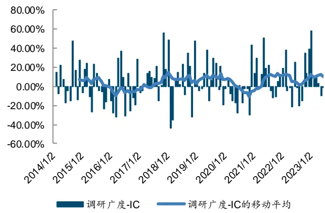
来源：Wind，国金证券研究所

图表19：调研广度因子IC分位数组合净值
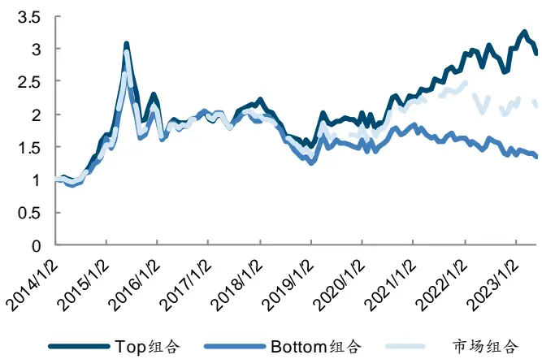
来源：Wind，国金证券研究所

图表20：调研广度因子多空组合净值
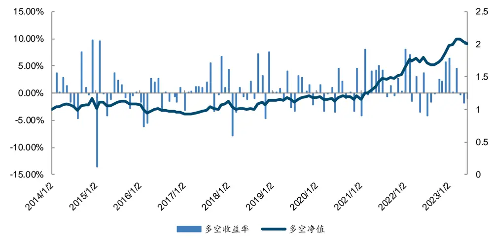
来源：Wind，国金证券研究所

图表21：调研广度因子分位数组合指标

| 组合 | 年化收益率 | 波动率 |  | 夏普比率最大回撤率 | 年化超额收益率 | 跟踪误差 | 信息比率 | 超额最大回撤率 |
| --- | --- | --- | --- | --- | --- | --- | --- | --- |
| Top | 12.08% | 24.98% | 0.48 | 51.74% | 3.00% | 8.06% | 0.37 | 16.58% |
| 1 | 11.93% | 28.49% | 0.42 | 51.89% | 3.78% | 8.00% | 0.47 | 12.40% |
| 2 | 7.34% | 26.19% | 0.28 | 54.48% | -0.93% | 6.07% | -0.15 | 15.46% |
| 3 | 4.94% | 26.01% | 0.19 | 56.39% | -3.28% | 7.36% | -0.45 | 30.47% |
| 4 | 8.42% | 27.28% | 0.31 | 54.89% | 0.25% | 7.21% | 0.03 | 14.67% |
| Bottom | 3.11% | 25.57% | 0.12 | 54.37% | -5.26% | 8.86% | -0.59 | 45.45% |
| 市场 | 8.39% | 25.36% | 0.33 | 53.63% |  |  | 一 | 1 |
| L-S | 7.72% | 12.85% | 0.60 | 20.44% | 1 | 1 | 1 | 1 |

来源：Wind，国金证券研究所

## 五、调研活动因子的合成

调研广度通过行业的证券公司调研覆盖程度去刻画行业的拥挤度，热度通过覆盖公司的基金公司调研活动平均数这一层面去刻画行业内的公司调研热度。二者从不同的角度去阐述调研活动对行业的影响，起到了互相补充的作用，将这两个指标结合起来，可以更加准确的描述调研事件对行业层面的影响。

广度与热度因子相关性不高，为-3.83%。将广度与热度因子标准化后并对广度因子值取相反数等权合成，即得到调研活动因子。为保证回测一致性，调研活动因子回测时段为2017 年 1 月至 2023 年 6 月。

图表22：调研活动因子IC指标

| 因子 | 平均值 | 标准差 | 最小值 | 最大值 | 风险调整的IC | t统计量 |
| --- | --- | --- | --- | --- | --- | --- |
| 调研活动因子 | 8.64% | 16.55% | -30.87% | 53.71% | 0.52 | 4.58 |
| 调研广度因子 | 6.72% | 21.71% | -43.95% | 57.27% | 0.31 | 2.72 |
| 调研活动因子 | 11.38% | 19.50% | -25.37% | 59.15% | 0.58 | 5.12 |

来源：Wind，国金证券研究所

调研活动因子的 IC 平均值为 11.38%，比单因子有较大提升，且 IC 移动均值大部分时间为正。今年以来，调研活动因子的 IC 均为正，IC 表现优异。

图表23：调研活动因子IC
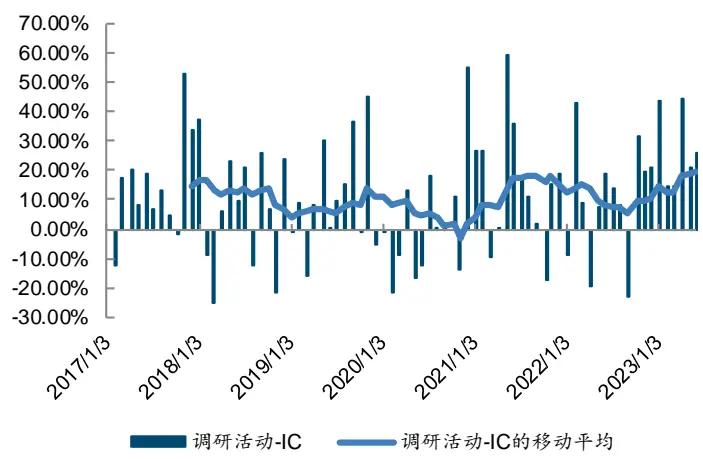
来源：Wind，国金证券研究所

图表24：调研活动因子分位数组合净值
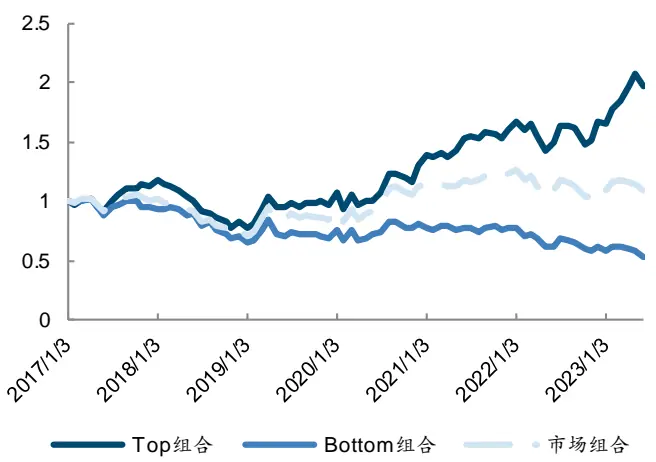
来源：Wind，国金证券研究所

从下图可以看出，调研活动因子构造的分位数组合的年化超额收益率单调性比较明显，Top 组合显著好于市场组合。从分位数组合净值来看，Top 组合显著跑赢市场组合，年化超额收益率高达 9.51%。合成后因子多空组合的净值更加平稳，年化收益率达到了21.82%，夏普比率为 1.90。调研活动因子的多空净值走势没有出现过较大的回撤，且在今年以来，净值屡创新高，走出了较为傲人的走势，相比调研广度和调研热度因子的多空组合表现均有明显的提升。

图表25：调研活动因子分组年化超额收益率以及胜率
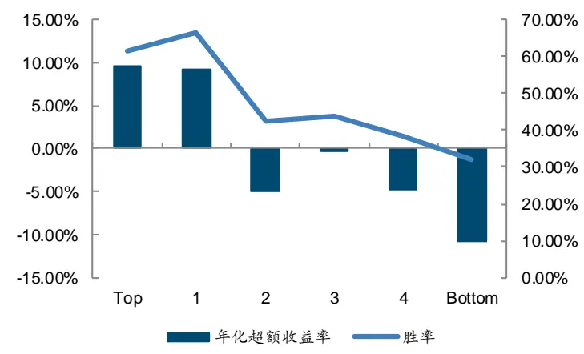
来源：Wind，国金证券研究所

图表26：调研活动因子多空组合净值
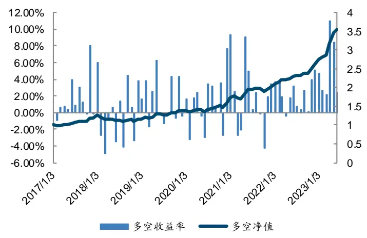
来源：Wind，国金证券研究所

图表27：调研活动因子分位数组合指标

| 组合 | 年化收益率 | 波动率 | 夏普比率 | 最大回撤率 | 年化超额收益率 | 跟踪误差 | 信息比率 | 超额最大回撤率 |
| --- | --- | --- | --- | --- | --- | --- | --- | --- |
| Top | 11.18% | 20.64% | 0.54 | 34.18% | 9.51% | 7.17% | 1.33 | 8.06% |
| 1 | 10.99% | 19.98% | 0.55 | 23.07% | 9.22% | 6.47% | 1.43 | 8.17% |
| 2 | -3.33% | 19.75% | -0.17 | 35.79% | -4.89% | 6.27% | -0.78 | 28.06% |
| 3 | 1.00% | 22.27% | 0.04 | 35.04% | -0.24% | 7.24% | -0.03 | 11.06% |
| 4 | -3.63% | 21.91% | -0.17 | 38.48% | -4.84% | 6.84% | -0.71 | 28.12% |
| Bottom | -9.34% | 19.84% | -0.47 | 47.36% | -10.83% | 6.99% | -1.55 | 52.15% |
| 市场 | 1.48% | 19.63% | 0.08 | 32.73% | 一 | 一 | 一 | 1 |
| L-S | 21.82% | 11.49% | 1.90 | 13.37% | 一 | 一 | 一 | 一 |

来源：Wind，国金证券研究所

## 六、多维度行业轮动框架

## 6.1 调研活动因子对超预期增强轮动策略的补充

在行业配置方面,我们此前探索了一系列能够预测行业收益的因子,涵盖了短期量价特征、景气度估值、机构持仓、市场超预期以及北上资金等。其中,超预期增强模型从盈利、质量、估值动量、超预期和分析师预期五个维度刻画了行业的盈利与估值变化特征(其中具体因子定义参考《Beta 猎手系列之三:行业超预期的全方位识别与轮动策略》)。本篇报告中,我们将构建的调研活动因子与超预期增强因子进行结合,计划构建多维度行业轮动框架。

我们对各个因子之间的秩相关性进行检查，统计时间范围为2017年1月2日至2023 年 6月 1 日。不难发现，调研活动因子与现有的多个大类因子相关性都很低，与分析师预期因子的相关性最高，也仅为 0.07。

图表28：大类因子截面秩相关系数均值

| 因子 | 调研活动因子 | 质量因子 | 分析师预期因子 | 盈利因子 | 估值动量因子 | 超预期因子 |
| --- | --- | --- | --- | --- | --- | --- |
| 调研活动因子 | 1.0000 | 0.0443 | 0.0749 | 0.0620 | 0.0633 | 0.0108 |
| 质量因子 | 0.0443 | 1.0000 | 0.1226 | 0.2734 | 0.0240 | 0.0963 |
| 分析师预期因子 | 0.0749 | 0.1226 | 1.0000 | 0.3993 | 0.2649 | 0.0169 |
| 盈利因子 | 0.0620 | 0.2734 | 0.3993 | 1.0000 | 0.0763 | 0.0100 |
| 估值动量因子 | 0.0633 | 0.0240 | 0.2649 | 0.0763 | 1.0000 | 0.0150 |
| 超预期因子 | 0.0108 | 0.0963 | 0.0169 | 0.0100 | 0.0150 | 1.0000 |

来源：Wind，国金证券研究所

因此，我们将调研活动因子与分析预期、盈利、质量、估值动量因子和超预期因子以等权方式合成为调研活动增强轮动因子,可以从多个维度对行业收益进行预测。合成后的超预期增强轮动因子的 IC 均值为 11.89%，风险调整的 IC 为 0.41。为了对比，我们将分析预期、盈利、质量、估值动量因子和超预期因子合成为超预期增强因子。后续因子和策略回测，从 2017 年开始。可以看出,加入调研活动因子后,合成因子的 IC 和风险调整的IC 均有提高。

图表29：调研活动因子IC统计表

| 因子 | 平均值 | 标准差 | 最小值 | 最大值 | 风险调整的IC | t统计量 |
| --- | --- | --- | --- | --- | --- | --- |
| 调研活动增强因子 | 11.89% | 28.68% | -57.98% | 70.49% | 0.41 | 3.64 |
| 超预期增强因子 | 10.37% | 28.46% | -55.37% | 75.86% | 0.36 | 3.20 |

来源：Wind，国金证券研究所

从分位数表现上来看,调研活动增强因子的 Top 组合相对于市场组合的优势非常明显,年化超额收益率达到了 15.48%。从多空组合来看，调研活动增强因子的多空组合年化收益率为 22.36%，夏普比率为 1.26。调研活动增强因子的多空组合年化收益率比超预期增强因子提高了 1.75%，夏普比率进一步提高。

图表30：调研活动增强因子分位数组合净值
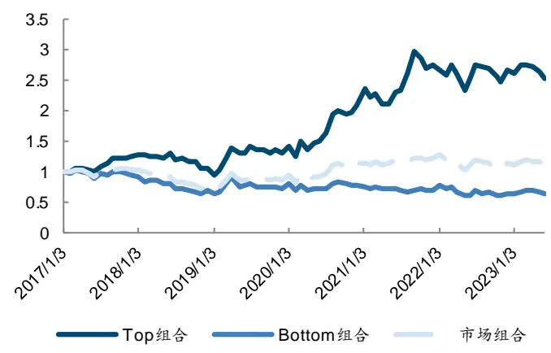
来源：Wind，国金证券研究所

图表31：调研活动增强因子多空净值表现
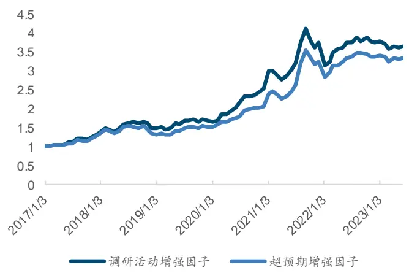
来源：Wind，国金证券研究所

图表32：因子多空组合指标

| 因子 | 年化收益率 | 波动率 | Sharpe 比率 | 最大回撤率 |
| --- | --- | --- | --- | --- |
| 调研活动增强 | 22.36% | 17.68% | 1.26 | 23.75% |
| 超预期增强 | 20.61% | 17.37% | 1.19 | 19.90% |

来源：Wind，国金证券研究所

## 6.2 调研活动增强行业轮动策略

前文中,我们构建的调研活动增强轮动因子在行业预测上具有显著效果。下面，我们尝试基于调研活动增强因子进一步构建行业轮动策略。策略构建细节如下：

图表33：调研活动增强行业轮动策略构建方法

| 回测细节 | 详细定义 |
| --- | --- |
| 策略回测范围 | 2017年 1月02日至2023年 6月01日 |
| 策略换仓日 | 月频换仓，月初交易日为换仓日 |
| 策略持仓组合 | 选取当月调研活动增强因子得分排名前5的行业，等权配置 |
| 策略基准 | 中信一级行业等权配置作为行业等权基准 |
| 手续费 | 单边千分之二 |

来源：Wind，国金证券研究所

下图是调研活动增强行业轮动策略的净值表现。相比行业等权基准,调研活动增强行业轮动策略的优势明显。但其并未跑赢超预期增强行业轮动策略，我们分析可能有以下两方面原因：1）在超预期增强策略中原本已经有 5 个大类因子，当我们新增一个因子时，整体分配的权重其实并不高，使得新因子对于策略整体的影响并不算高；2)调研活动因子与超预期增强 5 因子的兼容性不好，在 5 因子的基础上，其实只有当新因子提供的增量行业信息时，能够将之前在第二或者第三分组中表现比较好的行业调入第一分组，才能够对超预期增强策略有进一步的优化。而调研活动因子可能未实现这样的效果，仅仅将第四或第五分组的行业上调到了第二第三分组，这样对于多头策略来说表现并没有增强。这也是为何从因子多空的角度调研活动增强因子能够表现好，但是策略多头的表现却不如超预期增强策略的原因。

调研活动增强行业轮动策略的年化收益率为 12.41%，夏普比率为 0.57；而行业等权基准的年化收益率仅为 1.35%，夏普比率为 0.07。相较于行业等权基准,调研活动增强行业轮动策略的年化超额收益率为 11.07%。与超预期增强行业轮动策略相比,调研活动增强行业轮动策略的年化超额收益率虽未跑赢，但是 2022 年的表现有一定改善，且调研活动增强因子的多空表现更佳，且分组收益单调性更明显。

图表34：调研活动增强行业轮动策略净值
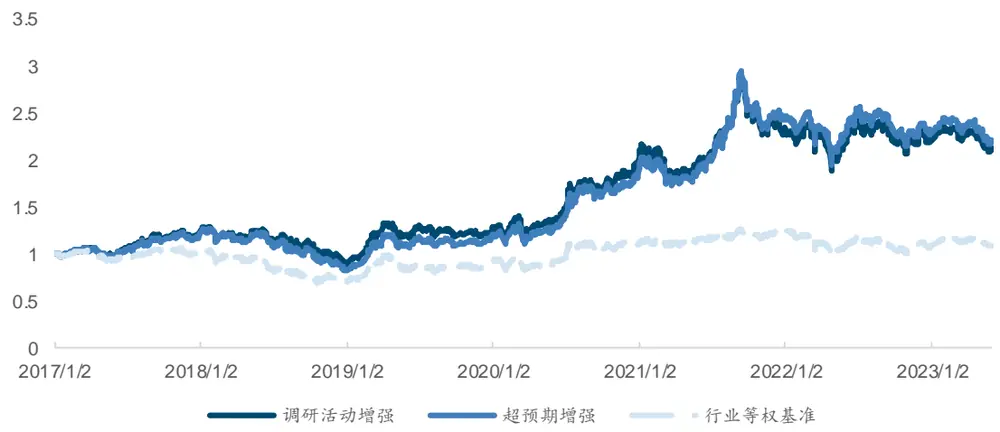
来源：Wind，国金证券研究所

图表35：调研活动增强行业轮动策略指标

| 统计指标 | 调研活动增强 | 超预期增强 | 行业等权基准 |
| --- | --- | --- | --- |
| 总收益率 | 111.72% | 121.04% | 8.98% |
| 年化收益率 | 12.41% | 13.16% | 1.35% |
| 年化波动率 | 21.78% | 21.83% | 18.55% |
| 夏普比率 | 0.57 | 0.60 | 0.07 |
| 最大回撤率 | 35.57% | 35.45% | 34.98% |
| 年化超额收益率 | 11.07% | 11.84% | - |
| 跟踪误差 | 10.22% | 10.11% | 一 |
| 信息比率 | 1.08 | 1.17 | 一 |
| 超额最大回撤率 | 21.19% | 16.96% | 一 |
| 双边换手率（月度） | 73.81% | 63.79% |  |

来源：Wind，国金证券研究所

图表36：调研活动增强行业轮动策略逐年收益

| 年份 | 调研活动增强 | 超预期增强 | 基准 |
| --- | --- | --- | --- |
| 2017 | 20.59% | 18.64% | 0.11% |
| 2018 | -24.30% | -29.65% | -28.95% |
| 2019 | 39.17% | 42.78% | 28.23% |
| 2020 | 58.86% | 59.10% | 22.10% |
| 2021 | 16.23% | 30.04% | 12.34% |
| 2022 | -6.42% | -7.50% | -13.78% |
| 2023 (截至 6 月1 日) | -3.55% | -3.09% | 1.03% |

来源：Wind，国金证券研究所

调研活动增强行业轮动策略的月均双边换手率为 73.81%。分年度看,策略在大部分年份均有正超额收益，在 2018 年表现较差,且出现负超额收益的年份整体负超额收益率也相对较低。策略在最近 2020 年至 2022 年超额收益较高，2020 年、2021 年和 2022 年的超额收益率分别达到了 31.51%、4.29%和 8.12%。

图表37：调研活动增强行业轮动策略分年度表现
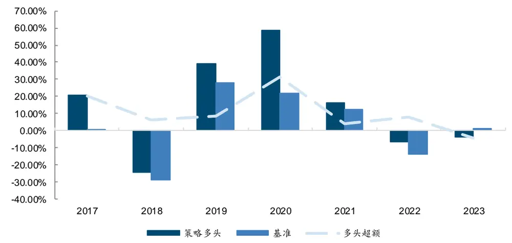
来源：Wind，国金证券研究所

## 七、调研行业精选策略

前面我们发现对于行业多头配置策略来说，简单地将调研活动因子与原有策略因子进行组合并不能带来增强效果，但调研活动因子本身近些年来又有比较好的行业轮动配置效果，故本篇报告单独基于调研活动因子构建了调研行业精选策略，给我们行业配置提供指导性的方向。策略构建细节如下：

图表38：调研行业精选策略构建方法

| 回测细节 | 详细定义 |
| --- | --- |
| 策略回测范围 | 2017年1月02日至2023年6月01日 |
| 策略换仓日 | 月频换仓，月初交易日为换仓日 |
| 策略持仓组合 | 选取当月调研活动增强因子得分排名前5的行业，等权配置 |
| 策略基准 | 中信一级行业等权配置作为行业等权基准 |
| 手续费 | 单边千分之二 |

来源：Wind，国金证券研究所

下图是调研行业精选策略的净值表现。调研行业精选因子策略在今年以来，净值走势表现优异。调研行业精选因子轮动策略的年化收益率为 7.61%，夏普比率为 0.38，年化超额收益率为 6.06%。调研活动因子的月度双边换手率为 158.51%，主要是因为构建调研广度因子时使用环比的因子构建方法，因子值变动较频繁。

相比行业等权基准,调研行业精选策略在2018年表现较差，但是在最近的2020年至2023年超额收益明显,我们猜测与调研事件数目 2019 年以后的大幅增加有直接关系。2020 年、2021年、2022年和2023年（截止至6月1日）的超额收益率分别达到了4.49%、5.19%、10.90%和 17.40%。

图表39：调研行业精选策略净值
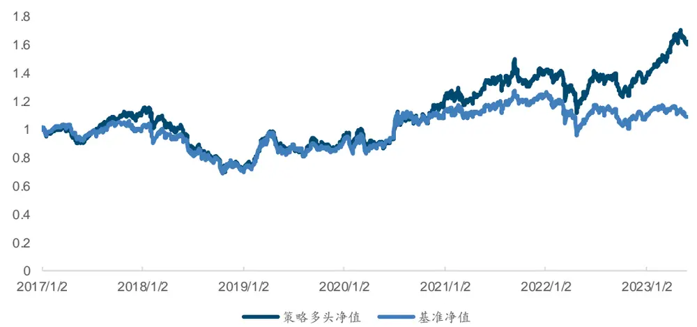
来源：Wind，国金证券研究所

图表40：调研行业精选策略指标

| 统计指标 | 调研活动精选 | 行业等权基准 |
| --- | --- | --- |
| 总收益率 | 60.08% | 8.98% |
| 年化收益率 | 7.61% | 1.35% |
| 年化波动率 | 20.06% | 18.55% |
| 夏普比率 | 0.38 | 0.07 |
| 最大回撤率 | 40.18% | 34.98% |
| 年化超额收益率 | 6.06% | = |
| 跟踪误差 | 7.11% | - |
| 信息比率 | 0.85 | - |
| 超额最大回撤率 | 14.63% | 一 |
| 双边换手率（月度） | 158.51% | 一 |

来源：Wind，国金证券研究所

图表41：调研行业精选策略分年度表现
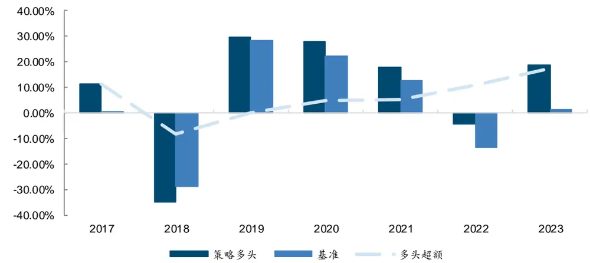
来源：Wind，国金证券研究所

调研行业精选策略今年以来的策略持仓推荐如下表。一月，策略配置了电力设备及新能源行业以及汽车行业。二月到四月则持续配置了传媒与通信这两个热门主线行业，及时把握住了市场的节奏。五月市场以下跌为主，策略推荐行业也表现较差。

图表42：2023年调研行业精选策略持仓推荐

| 时间 | 调研行业精选因子轮动策略推荐前五行业 |  |  |  |  |
| --- | --- | --- | --- | --- | --- |
|  | 2023年1月 电力设备及新能源（10.62%） | 消费者服务（-1.36%） | 机械（10.16%） | 建筑（5.49%） | 汽车（11.32%） |
| 2023年2月 | 轻工制造（6.41%） | 通信（8.11%） | 家电（1.16%） | 综合（2.43%） | 国防军工（1.03%） |
| 2023年3月 | 电力及公共事业（-2.07%） | 综合（-7.45%） | 传媒（22.20%） | 石油石化（0.84%） | 计算机（16.87%） |
| 2023年4月 | 房地产（-2.55%） | 传媒（13.70%） | 建筑（10.77%） | 钢铁（-1.98%） | 石油石化（6.10%） |
| 2023年5月 | 银行（-1.63%） | 汽车（-0.08%） | 机械（-0.51%） | 建筑（-9.26%） | 交通运输（-6.21%） |
| 2023年6月 | 国防军工（3.60%） | 煤炭（4.10%） | 有色金属（1.64%） | 通信（9.45%） | 建筑（-0.62%） |

来源：Wind，国金证券研究所

## 八、总结

本篇报告探索了调研事件在行业轮动策略中的应用，我们通过分析拆解，从调研热度与拥挤度两大维度切入，构建了调研热度因子和调研广度因子，两种方式构造的因子均对行业收益率具有预测能力。

我们将调研热度因子与调研广度因子以等权方式合成，得到的调研活动因子的 IC 在大部分月份为正，IC均值为11.38%，多空净值更加平稳，年化收益率达到了21.82%，夏普比率达到了 1.90，相比单因子显著提高。

我们利用调研活动因子构建了调研行业精选策略。相比行业等权基准，调研行业精选因子轮动策略在最近的2020年至2023年超额收益明显，2020年、2021年、2022年和2023年（截止至 6 月 1 日）的超额收益率分别达到了 4.49%、5.19%、10.90%和 17.40%。调研行业精选因子轮动策略的年化收益率为 7.61%，夏普比率为 0.38。

## 风险提示

1、以上结果通过历史数据统计、建模和测算完成，若历史数据产生环境发生变化，可能出现模型失效风险;

2、政策环境发生变化，资产与相关风险因子失去稳定关系的模型风险;

3、市场环境发生变化，国际政治摩擦升级等带来各大类资产同向大幅波动风险。

## 特别声明：

国金证券股份有限公司经中国证券监督管理委员会批准，已具备证券投资咨询业务资格。

形式的复制、转发、转载、引用、修改、仿制、刊发，或以任何侵犯本公司版权的其他方式使用。经过书面授权的引用、刊发，需注明出处为“国金证券股份有限公司”，且不得对本报告进行任何有悖原意的删节和修改。

本报告的产生基于国金证券及其研究人员认为可信的公开资料或实地调研资料，但国金证券及其研究人员对这些信息的准确性和完整性不作任何保证。本报告反映撰写研究人员的不同设想、见解及分析方法，故本报告所载观点可能与其他类似研究报告的观点及市场实际情况不一致，国金证券不对使用本报告所包含的材料产生的任何直接或间接损失或与此有关的其他任何损失承担任何责任。且本报告中的资料、意见、预测均反映报告初次公开发布时的判断，在不作事先通知的情况下，可能会随时调整，亦可因使用不同假设和标准、采用不同观点和分析方法而与国金证券其它业务部门、单位或附属机构在制作类似的其他材料时所给出的意见不同或者相反。

本报告仅为参考之用，在任何地区均不应被视为买卖任何证券、金融工具的要约或要约邀请。本报告提及的任何证券或金融工具均可能含有重大的风险，可能不易变卖以及不适合所有投资者。本报告所提及的证券或金融工具的价格、价值及收益可能会受汇率影响而波动。过往的业绩并不能代表未来的表现。

客户应当考虑到国金证券存在可能影响本报告客观性的利益冲突，而不应视本报告为作出投资决策的唯一因素。证券研究报告是用于服务具备专业知识的投资者和投资顾问的专业产品，使用时必须经专业人士进行解读。国金证券建议获取报告人员应考虑本报告的任何意见或建议是否符合其特定状况，以及（若有必要）咨询独立投资顾问。报告本身、报告中的信息或所表达意见也不构成投资、法律、会计或税务的最终操作建议，国金证券不就报告中的内容对最终操作建议做出任何担保，在任何时候均不构成对任何人的个人推荐。

在法律允许的情况下，国金证券的关联机构可能会持有报告中涉及的公司所发行的证券并进行交易，并可能为这些公司正在提供或争取提供多种金融服务。

本报告并非意图发送、发布给在当地法律或监管规则下不允许向其发送、发布该研究报告的人员。国金证券并不因收件人收到本报告而视其为国金证券的客户。本报告对于收件人而言属高度机密，只有符合条件的收件人才能使用。根据《证券期货投资者适当性管理办法》，本报告仅供国金证券股份有限公司客户中风险评级高于 C3 级(含 C3 级）的投资者使用；本报告所包含的观点及建议并未考虑个别客户的特殊状况、目标或需要，不应被视为对特定客户关于特定证券或金融工具的建议或策略。对于本报告中提及的任何证券或金融工具，本报告的收件人须保持自身的独立判断。使用国金证券研究报告进行投资，遭受任何损失，国金证券不承担相关法律责任。

若国金证券以外的任何机构或个人发送本报告，则由该机构或个人为此发送行为承担全部责任。本报告不构成国金证券向发送本报告机构或个人的收件人提供投资建议，国金证券不为此承担任何责任。

此报告仅限于中国境内使用。国金证券版权所有，保留一切权利。

上海

电话：021-60753903

传真：021-61038200

地址：上海浦东新区芳甸路 1088 号紫竹国际大厦 7 楼

邮箱：researchsh@gjzq.com.cn

北京

邮编：201204

深圳

电话：010-85950438

电话：0755-83831378

邮箱：researchbj@gjzq.com.cn

邮编：100005

地址：北京市东城区建内大街 26 号新闻大厦 8 层南侧

传真：0755-83830558

邮箱：researchsz@gjzq.com.cn

邮编：518000

地址：深圳市福田区金田路 2028 号皇岗商务中心18 楼 1806