金融工程组

分析师：高智威（执业S1130522110003) 联系人：许坤圣

gaozhiw@gjzq.com.cn

xukunsheng@gjzq.com.cn

## 基于宏观量价信号叠加的微盘股茅指数择时轮动策略

## 万得微盘股指数特征与收益归因

2021年以来，市场风格从以茅指数为主的核心资产板块切换到了以万得微盘股指数为主的超小市值板块。即使在大盘走弱的情况下，万得微盘股指数仍然稳步走强屡创新高，引起了投资者得广泛关注。万得微盘股指数整体是以总市值因子作为核心基础，再在样本范围和调仓频率上做了调整优化之后构建出来的一个指数。其包含了沪深A股中总市值居于后400的个股，剔除ST、*ST、退市整理股、首发连板未打开的标的。截至2023年9月30日，微盘股指数成份股占非ST沪深A股总数量的8.09%，是名副其实的微盘股板块。成分股行业分布方面，在万得微盘股指数的成分股行业权重占比中，机械、基础化工、建筑和轻工制造占比处于微盘股指数行业占比中的前列。整体和以新能源、医药和新兴科技相关的创业板指和科创50指数行业分布区别较大。另外，由于指数日度调仓，整体成份股平均年换手高达971.8%。

我们通过研究发现，万得微盘股指数的高收益主要来源于三点：1）小市值因子暴露；2）在样本股票池中剔除了ST股；3）日频的调仓频率更匹配小市值因子。

## 万得微盘股指数回撤原因分析

当国内利率和指数波动率拥挤度的走高可能诱发万得微盘股指数的回调。但是出乎意料的是，海外利率对万得微盘股指数的影响不大。我们基于对回撤原因的分析构建了叠加国内利率择时信号与波动率拥挤度择时信号的微盘股叠加择时策略。其从2006年1月1日至2023年10月24日年化收益为41.82%，年化波动率为26.05%。组合相较原万得微盘股指数在控制了波动和回撤的同时，甚至获取了比微盘股指数更高的收益(37.91%)。

## 大小盘风格轮动研究

除了万得微盘股指数的单一指数研究，我们也从万得微盘股指数与万得茅指数的相对净值来分析市场中期大小盘风格轮动的情况。为了分析大小盘相对占优的情况，我们构建了一套通过宏观叠加量价的观测框架。宏观方面，当M1的区间高点的出现(经济状态发生变化后)，大小盘风格可能会出现中期的切换：而国内利率若走高，后续茅指数占优的可能性变大：反之利率走低，微盘股占优的可能性更大。在量价方面，若微盘股/茅指数相对净值高于年均线时微盘股中期占优：反之，茅指数占优。另外但两指数的净值走势出现斜率的分叉后，斜率为正的风格指数一般会维持一段时间的占优。

通过融合前期的指数轮动和择时信号，我们构建了万得微盘股指数和茅指数的轮动混合+择时策略。策略整体表现优异，从2006年1月1日至2023年10月24日，轮动混合+择时策略年化收益率为59.37%，高于先前构建的轮动混合策略与微盘股叠加择时策略。并且我们尝试将轮动混合+择时策略信号直接移植到中证1000和沪深300的大小盘轮动策略上面，整体仍有不错的策略表现。从2006年1月1日至2023年10月24日，中证1000/沪深300轮动混合+择时策略年化收益率为20.32%高于沪深300(9.72%)和中证1000（12.01%）。

## 目前我们对大小盘风格的观点

通过我们构建的中期微盘股择时和大小盘轮动信号分析，由于目前M1同比与国债利率指标都仍处于区间低位，3-6个月内微盘股维持占优的可能性较大。另外后续密切关注是否出现M1同比走高、国债利率走高或大小盘走势分叉，且大盘走势向上的情况。这些都是潜在的可能出现大小盘切换的信号。

## 风险提示

以上结果通过历史数据统计、建模和测算完成，在政策、市场环境发生变化时模型存在失效的风险。

## 一、万得微盘股指数特征分析

## 1.1 目前市场风格特征

2021年以来，市场风格从以茅指数为主的核心资产板块切换到了以万得微盘股指数为主的超小市值板块。即使在大盘走弱的情况下，万得微盘股指数仍然稳步走强屡创新高，引起了投资者得广泛关注。若茅指数和微盘股指数两者只是相对涨跌幅的略有强弱，而走势方向仍然相同的话，微盘股板块可能还不会引起广大投资者的注意。但在市场多数指数走弱时，万得微盘股指数仍逆势走强，便使得市场的研究焦点集中在它的身上。

本篇报告是Beta猎手系列报告的第六篇，主要是帮助投资人解决关于万得微盘股指数的三个问题：1）万得微盘股指数逆势走强的原因；2）在什么阶段，万得微盘股指数会出现阶段性回调：3）万得微盘股指数何时会相较核心资产板块的万得茅指数走弱。并且在做完这些问题的拆解分析之后，我们在最后也构建了以微盘股指数和茅指数为基础的中期大小盘轮动策略，辅助投资者定量观测风格切换的时点。

图表1：指数净值走势(2015-2023)
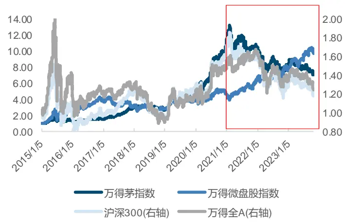
来源：Wind，国金证券研究所

图表2：指数涨跌表现统计

| 01/05/2015- 10/24/2023 | 万得微盘股 指数 | 万得茅指数 | 沪深300 | 万得全A |
| --- | --- | --- | --- | --- |
| 年化收益率 | 30.04% | 24.97% | 1.95% | 2.65% |
| 年化波动率 | 29.60% | 25.65% | 22.06% | 24.59% |
| 最大回撤 | -48.17% | -46.39% | -46.06% | -55.99% |
| 夏普比率 | 1.01 | 0.97 | 0.16 | 0.20 |
| 收益回撤比 | 0.62 | 0.54 | 0.04 | 0.05 |

来源：Wind，国金证券研究所

## 1.2 万得微盘股指数定义

结合万得终端内部对万得微盘股指数的指数简介和《Wind概念指数编制方式》文档的参照比对，我们列出了对万得微盘股指数的相对完整编制方案。通过编制方案可以得知，万得微盘股指数会每日固定选取在上交所或深交所上市的全部A股剔除ST、*ST、退市整理股、首发连板未打开的标的之后，总市值最小的400只个股作为第二天的指数成分股，并且每日收盘后会进行成分股的调整。

从编制方案中可以看出，万得微盘股指数整体还是以总市值因子作为核心基础，再在样本范围和调仓频率上做了调整优化之后构建出来的一个指数。但是为何微盘股指数的走势能够比其他的小盘指数和微盘指数都明显强势，我们在后续的拆解也会逐步的说明。

图表3：万得微盘股指数编制方案

| 指数名称 | 万得微盘股指数 |
| --- | --- |
| 选取逻辑 | A股中总市值居于后400的个股，剔除ST、*ST、退市整理股、首发连板未打 开的标的 |
| 样本范围 | 上交所和深交所的全部A股股票 |
| 调仓频率 | 日频 |
| 加权方式 | 等权 |
| 发布时间 | 2021年3月8日 |

来源：Wind，国金证券研究所

## 1.3 万得微盘股指数成分股特征

在了解了万得微盘股指数的编制方案之后，我们再去深入分析下其指数成分股的特征结构。在图表中，我们可以看到万得微盘股指数成分股数量(400只个股)占非ST沪深A股数量的历史占比。万得微盘股指数的成分股数量占比在2000年(指数起始年份)高达39.76%，并不能算作一个微盘股指数，勉强只能当作一个中小盘指数。随着时间推移，市场内上市公司数量的增多。微盘股成分股的数量占比也在逐年回落。到了今年(截至2023年9月30日），这个占比数量已经下降到8.09%，是名副其实的微盘股板块。

其实如果要让万得微盘股真正代表市场的微盘结构的话，或许只能够从2011 年开始(成分股数量占比为18.43%，少于20%)才能算。但如果把定义放宽成小盘微盘的话，万得微盘股指数还是能较好的体现出微小盘的整体特征。

图表4：微盘股指数成分股数量占非ST沪深A股数量的历史占比(2000 年-2023年)
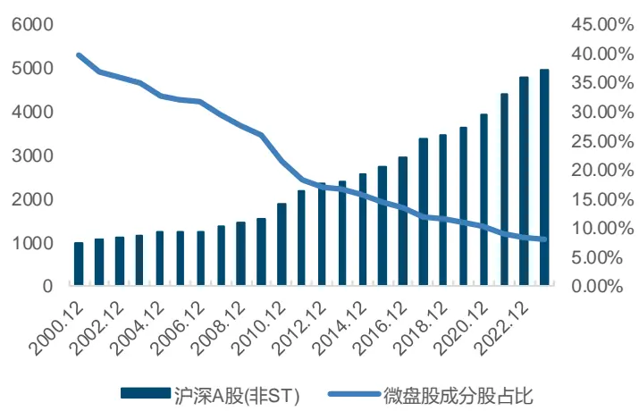
来源：Wind，国金证券研究所

图表5：万得微盘股指数历史成分股总市值走势情况
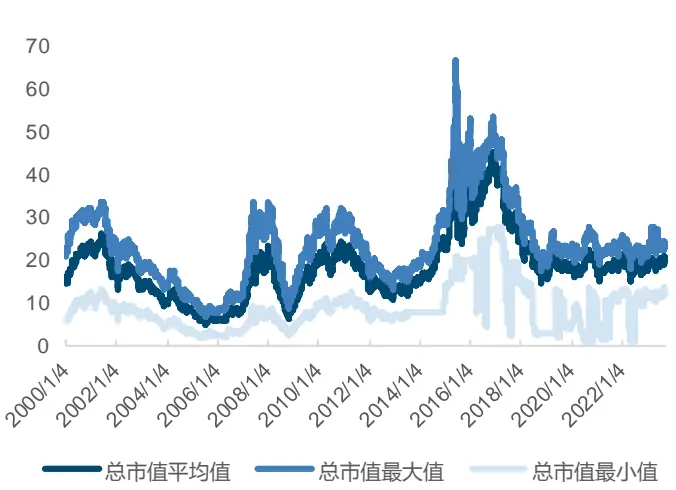
来源：Wind，国金证券研究所

从成分股总市值的角度来看，整体成分股平均市值为18.56亿，历史最大的成分股总市值为66.80亿，历史成分股最小的总市值为0.69亿。而关于总市值最小值的走势的波动，可能是由于某些小市值公司ST摘帽被纳入样本池或者戴帽成ST股被踢出样本池等原因导致的。

除了市值分布以外，我们也对成分股的行业分布进行分析。截至2023年10月23日，万得微盘股指数的成分股行业权重占比中，按照中信一级行业标准划分，机械、基础化工、建筑和轻工制造占比处于微盘股指数行业占比中的前列，分别占15.75%、12.75%、7.5%和7.0%。可以看出，微盘股指数的行业分布和以新能源、医药和新兴科技相关的创业板指和科创50指数区别较大。

图表6：万得微盘股指数成分股中信一级行业权重分布(截至2023年10月23日)
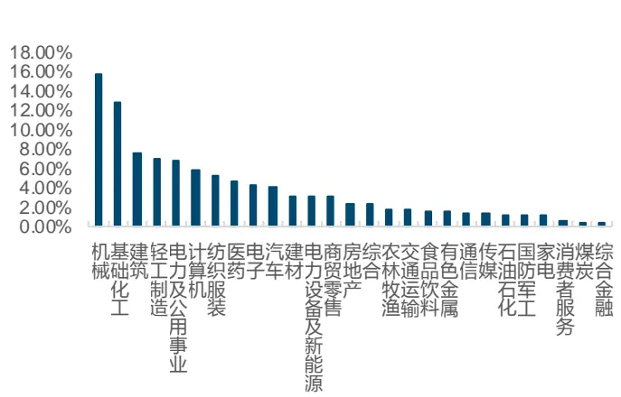
来源：Wind，国金证券研究所

图表7：创业板指成分股中信一级行业权重分布(截至2023年10月23日）
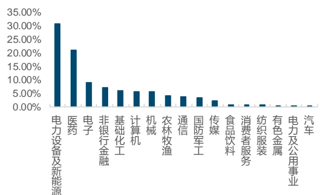
来源：Wind，国金证券研究所

从万得微盘股指数编制方案中，我们仅得知指数是日频调整指数成份股。但是具体换手率有多高仍并不清楚，所以我们也做了统计。万得微盘股指数成份股年换手率平均为971.8%。另外我们模拟计算了如果按照周末和月末最后的成份股列表来对万得微盘股指数来进行周频和月频调仓，其对应的年化换手率分别为452.72%和224.50%。随着调仓频率的下降，换手率下降明显。

图表8：万得微盘股指数成份股年换手率
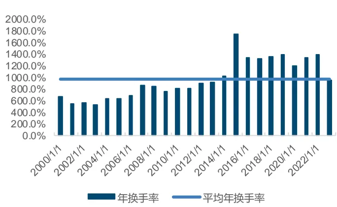
来源：Wind，国金证券研究所

图表9：微盘股指数各频率年平均换手率(截至2022.12.31)
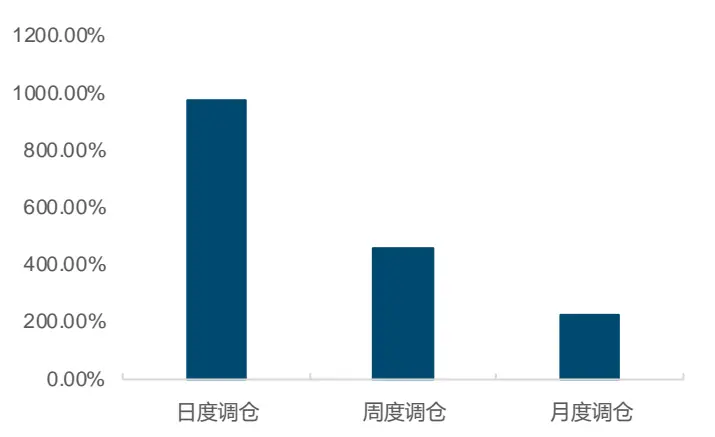
来源：Wind，国金证券研究所

## 二、万得微盘股指数的收益归因

在分析完万得微盘股指数的各类特征之后，本章节我们去具体分析为何万得微盘股能够获得这么高的收益。总结起来，主要分三点：1）小市值因子暴露；2）在样本股票池中剔除了ST股；3）日频的调仓频率更匹配小市值因子。下文我们就展开阐述这三个原因。

## 2.1 小市值敞口暴露

万得微盘股指数第一个重要得收益来源则是小市值因子的明显暴露。我们做了个传统小市值因子十分组日度调仓测试，但是把样本池调节成和微盘股指数一样的剔除了ST等特殊处理的沪深A股。可以看到从2021年开始回测，市值最小的分组第9组净值走势基本和万得微盘股指数一致。所以可以基本认为其实万得微盘股指数就是日频调仓的小市值的多头组合。另外，我们能看到根据市值的十分组组合表现，随着分组市值的提升，组合净值明显下滑，通过市值分组获取的超额收益较为明显。我们也能看到市值最大的分组排在了最后。整体来说，小市值因子的敞口暴露能给组合带来收益的增强。

图表10：万得微盘股指数和小市值因子回测分组净值走势
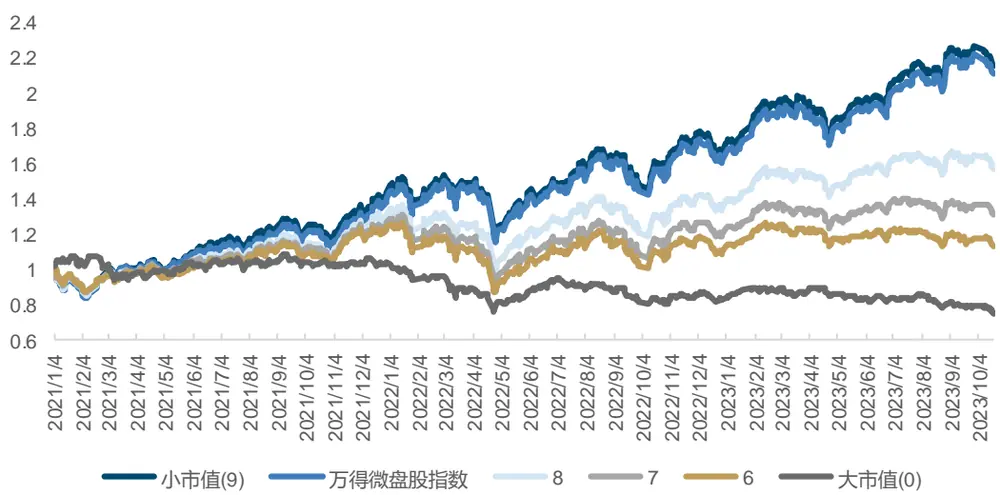
来源：Wind，国金证券研究所

图表11：万得微盘股指数和小市值因子回测分组组合表现

| 01/04/2021- 10/20/2023 | 万得微盘股 指数 | 小市值(9) | 8 | 7 | 6 | 大市值(0) |
| --- | --- | --- | --- | --- | --- | --- |
| 年化收益率 | 30.51% | 31.59% | 17.50% | 10.20% | 4.36% | -9.55% |
| 年化波动率 | 22.36% | 22.31% | 21.48% | 20.64% | 20.48% | 16.85% |
| 最大回撤 | -23.05% | -23.11% | -27.00% | -29.67% | -30.83% | -30.62% |
| 夏普比率 | 1.28 | 1.31 | 0.83 | 0.54 | 0.28 | -0.55 |
| 收益回撤比 | 1.32 | 1.37 | 0.65 | 0.34 | 0.14 | -0.31 |

来源：Wind，国金证券研究所

## 2.2 股票池排除 ST 股票

但是即使是同为小市值因子，股票池选择的不同，其在组合收益层面明显不一样。第二个测试中，我们尝试在样本池上进行变动，把被排除掉的ST股给重新包含进来，其余的不变，仍为沪深A股股票池。通过对比我们可以发现，股票池内包不包含ST股，组合净值差别巨大。在19年之后包含ST股的小市值分组组合整体净值走势斜率放缓明显。同期，不包含ST股的小市值分组组合仍然表现良好。这有部分原因可能也是由于注册制开始逐步推行之后，ST股的壳资源价值逐渐式微导致。不过无论如何，在股票样本池中剔除了ST股，也是万得微盘股指数为何走势强劲的原因之一。

图表12：不包含ST和包含ST股的小市值组走势净值
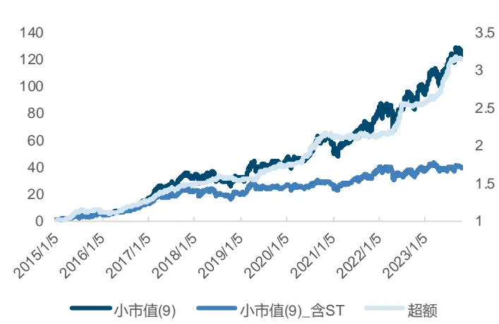
来源：Wind，国金证券研究所

图表13：不包含ST和包含ST股的小市值组和表现

| 01/05/2015- 10/20/2023 | 小市值(9) | 小市值(9)_含 ST | 超额 |
| --- | --- | --- | --- |
| 年化收益率 | 72.73% | 51.66% | 13.90% |
| 年化波动率 | 29.90% | 28.07% | 3.96% |
| 最大回撤 | -40.38% | -40.01% | -4.85% |
| 夏普比率 | 1.95 | 1.60 | 3.09 |
| 收益回撤比 | 1.80 | 1.29 | 2.87 |

来源：Wind，国金证券研究所

## 2.3 日频调仓高换手

第三个因素则为指数的调仓频率。这也是为何其他的小盘指数和微盘指数没有万得微盘指数强的一个关键因素。本文测试了同样样本池下，不同调仓频率的小市值组合的表现。从图表中的测试结果虽然整体上我们可以看到随着调仓频率的下降，小市值组合的收益表现也在逐步降低，但是可以发现周度因子分组测试的净值是高于日度因子测试的净值。出现这样情况的主要原因是，万得微盘股指数的编制并没有将实际无法买入的涨跌停板剔除导致的。我们重新模拟测算了剔除涨跌停板无法买卖的情况后，可以看到日周月频的净值单调性恢复了。

日周月频调仓策略净值的区别可以说明，在不考虑手续费的情况下，高频次的再平衡能够帮助小市值组合获取更高的交易收益。但是在实际的市场中，高频次的调仓并不是免费的午餐。调仓需要承担更多的交易损耗。所以我们也测试了在考虑了单边千三的交易成本之后，不同频率的小市值组合的表现情况。我们可以看到，当考虑了单边千三的手续费后，日频调仓小市值组合与周度调仓小市值组合的组合其实已经差别不大了，但是我们仍能看到日频调仓的小市值组合由于其他两个调仓频率小市值组合表现，这说明在考虑单边千三的交易成本后，由日频调仓带来的交易收益增厚仍然较高。但这也仅能说明小市值因子能够承担高换手的成本，若是换作其他的分组因子，或者大市值组合，可能无法在考虑了单边千三的交易成本之后，仍有收益的增强。

图表14：各调仓周期小市值因子多头净值走势(不考虑交易成本)
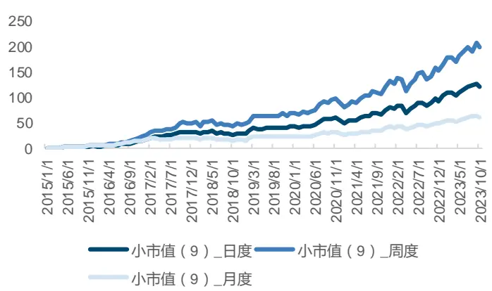
来源：Wind，国金证券研究所

图表15：各调仓周期小市值因子净值走势(考虑涨跌停无法买卖的情况不考虑交易成本)
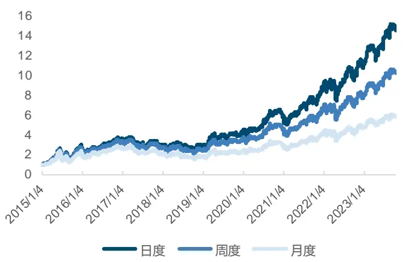
来源：Wind，国金证券研究所

图表16：各调仓周期小市值因子多头净值走势(考虑交易成本：单边千三)
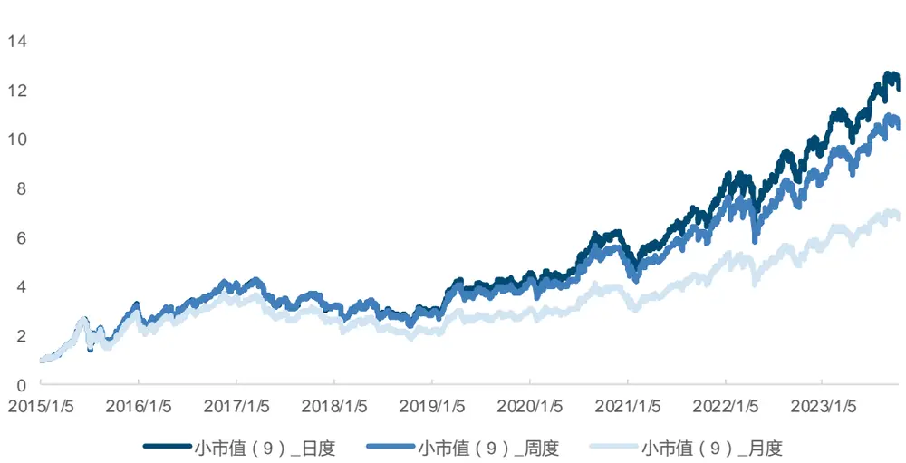
来源：Wind，国金证券研究所

## 三、万得微盘股指数回撤原因分析

在第二部分，我们探讨了万得微盘股指数的收益归因，但是作为一个Beta因子，总会有出现回撤的市场阶段，所以在第三部分，我们尝试分析下在何种情况下微盘股指数会出现回撤。

## 3.1万得微盘股指数回撤分析：流动性

在传统的分析框架中，大家都会觉得小市值板块有强相关的情况，但是如果拿万得微盘股指数当作的小市值因子的多头组合，我们可以看到其实利率与微盘股指数的走势并不是绝对的线性相关关系，包括国内和海外的利率。

从图表红框区间我们可以发现，当中国10年国债或者3个月Shibor利率处于区间高位后，万得微盘股指数会出现一定的回调。但是我们也看到绿框区域，虽然利率也是处于阶段性高位，但是并没有引起微盘股指数的回调。所以只能说利率的上升可能诱发万得微盘股指数的回调，但并不是充分必要条件。

而海外利率方面，我们可以看到2021年以来美国国债利率的上升，几乎没有丝毫的影响到万得微盘股指数的涨势。这和创业板指和科创板与美债利率走势高相关的情况有所不同。我们分析下来，这主要是和指数的成分股行业权重分布相关的。不同于创业板指以新能源、医药和电子等新兴科技行业为主，微盘股指数的成分股的主要行业为机械、基础化工、建筑和轻工制造。这些都不是美国领导新兴科技行业，所以海外利率对于他们的影响较低。反而是国内的低利率，使得这些微小市值公司能够在国内拿到更低息的资金，一定程度上可能是对这些企业的利好，助推了微盘股指数的上升。

图表17：指数与国内利率走势
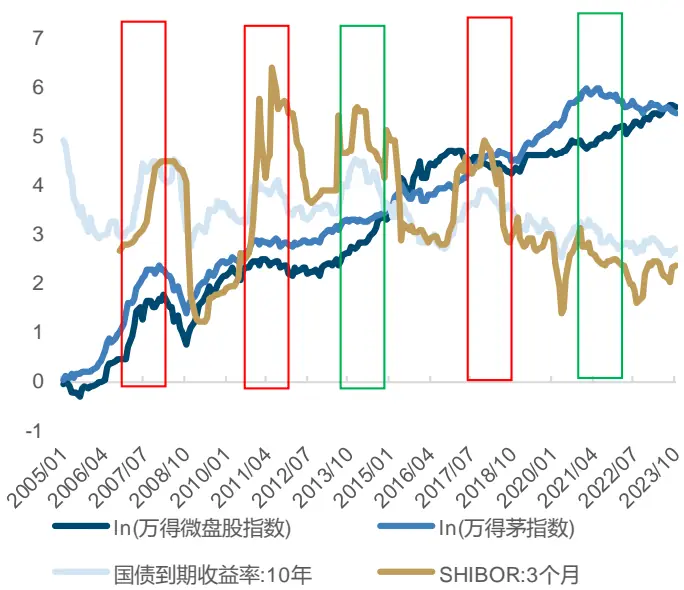
来源：Wind，国金证券研究所

图表18：指数与10年美国国债利率走势
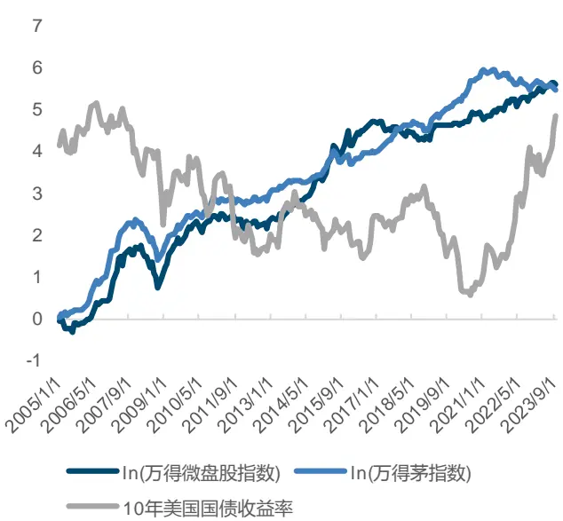
来源：Wind，国金证券研究所

虽然国内的利率对万得微盘股指数走势影响较为明显，但是由于利率数据本身仍然带有明显的趋势项。为了能构建良好的择时指标，我们对十年国债利率做差分同比处理。可以看到，十年国债利率同比数据趋势性明显减少，同比指标更多的是在周期性的在-0.4至0.6之间进行波动。

通过观察该指标可以发现，当十年国债利率同比上行到0.3以上之后，指数走势整体偏震荡或者回落为主，而在指标回落到-0.2以下之后，指数上行趋势明显。因此，我们构建了基于十年国债利率同比的万得微盘股择时策略(微盘股利率策略)：

- 当十年国债利率同比>0.3 → 策略空仓

- 当十年国债利率同比<-0.2 → 策略重新买入微盘股指数

可以看到，通过这样构建的择时策略，相较于万得微盘股指数本身，在明显降低组合波动率和最大回撤的同时，收益率并没有明显的下降。这使得组合夏普比率相较于原指数有了明显的提升。

图表19：指数与十年国债利率同比走势
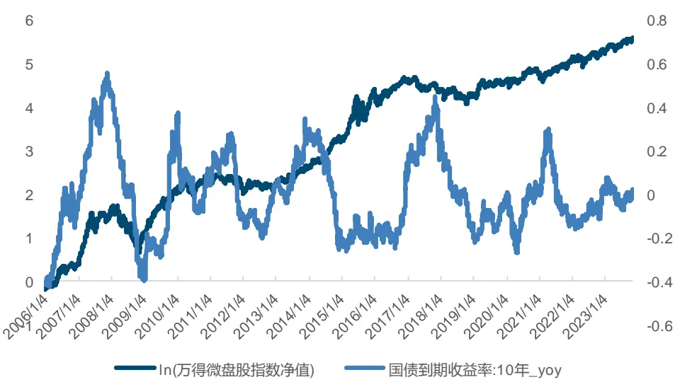
来源：Wind，国金证券研究所

图表20：微盘股利率策略净值走势
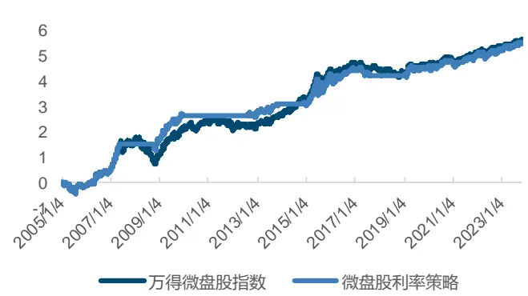
来源：Wind，国金证券研究所

图表21：微盘股利率策略表现

| 01/04/2005- 10/31/2023 | 微盘股利率策略 | 万得微盘股指数 |
| --- | --- | --- |
| 年化收益率 | 34.27% | 35.03% |
| 年化波动率 | 24.87% | 31.45% |
| 最大回撤 | -48.17% | -66.08% |
| 夏普比率 | 1.26 | 1.08 |
| 收益回撤比 | 0.71 | 0.53 |

来源：Wind，国金证券研究所

## 3.2万得微盘股指数回撤分析：拥挤度

除了利率流动性的影响，由于万得微盘股指数底层还是小市值因子的逻辑，所以我们也尝试从因子拥挤度的角度来观测微盘股指数的回撤情况。传统的因子拥挤度分析是分析因子多空分组不同维度特征上的差异变动，当两个分组特征差异过大可能就会产生因子拥挤的效果，从而可能带来潜在的因子回调修正。其中组合波动率和估值是两个比较常用的评估拥挤度的角度：

$$
x=-5y+5y+x+5=\frac{1+1+3+4-5}{1+1+5+5+4y}
$$

$$
1\div(\frac{1}{2}+11+\frac{1}{2})\times\frac{1}{2}=\frac{pb(\textcircled{<}17\textcircled{>}3\div\frac{4}{2})}{pb(\textcircled{<}17\div\frac{4}{2}\div\frac{4}{2})}
$$

但是与我们平时通过对比因子多空分组的拥挤度区别不同，分析万得微盘股指数的拥挤度我们并没有因子空头组合，所以我们使用万得全A指数代表市场基准替代因子空头组合在因子拥挤度计算中的作用，所以我们得到了万得微盘股指数的拥挤度计算方式：

$$
x=x\div0+\frac{x}{2}+11+\frac{x}{2}\times\frac{1}{x}=\frac{0(17+\frac{1}{4}+\frac{1}{4}x+\frac{1}{20}x)}{0(17+\frac{1}{4}x+1)}
$$

$$
1\div(\frac{1}{12}+1)+\frac{1}{12}=\frac{pb(1)+p+p}{pb(1)+p}\frac{1}{12}+\frac{p}{12}\times\frac{1}{12}=
$$

我们可以看到构建出来的两个拥挤度指标，虽然估值拥挤度指标趋势项明显，但是其有时会相对指数走势作出相反方向的变化。另外我们模拟对于利率指标排除趋势项的做法，对拥挤度指标也进行了同比的计算。对比下来我们发现在同样进行同比处理的波动率拥挤度指标和估值拥挤度指标当中，波动率拥挤度同比指标高数值区间对于万得微盘股指数回撤风险的提示效果会更好些。高波动区间通常都是多空分歧明显的区域，后续出现回撤或者反转的可能性也会较大些。

并且我们用波动率拥挤度同比指标构建了对万得微盘股指数的择时策略：

- 当波动率拥挤度同比指标>0.55→策略空仓

- 当波动率拥挤度同比指标<0.30→策略重新买入万得微盘股指数

通过使用拥挤度择时策略，相对于原指数来说，组合波动率和最大回撤都有明显的降低。但是与利率择时策略不同，拥挤度择时策略对组合收益率也产生了一定的影响。这样的情况，一定程度上说明了拥挤度指标的信号精度其实是相对弱些的。但整体上还是能较好的达到控制组合回撤的效果。

图表22：指数与拥挤度指标走势
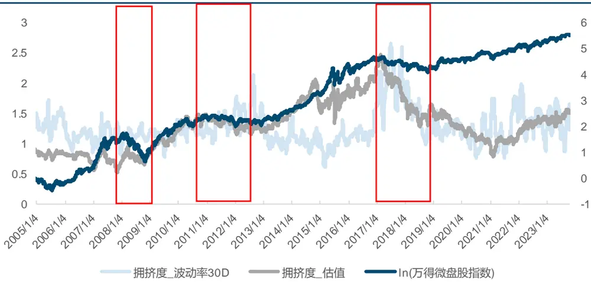
来源：Wind，国金证券研究所

图表23：指数与波动率拥挤度同比指标走势
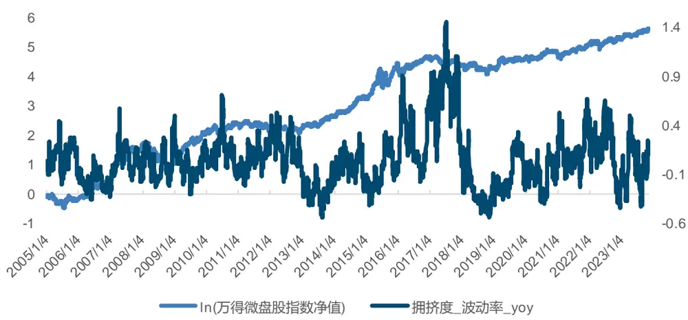
来源：Wind，国金证券研究所

图表24：微盘股拥挤度择时策略净值走势
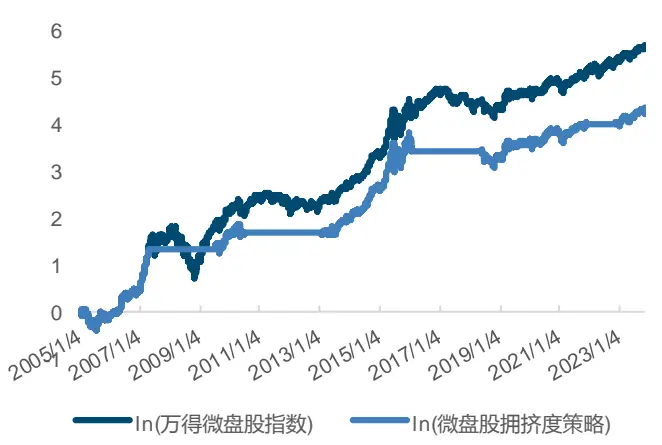
来源：Wind，国金证券研究所

图表25：微盘股拥挤度择时策略表现

| 01/04/2006- 10/24/2023 | 微盘股拥挤度策略 | 万得微盘股指数 |
| --- | --- | --- |
| 年化收益率 | 27.85% | 37.91% |
| 年化波动率 | 21.92% | 31.52% |
| 最大回撤 | -51.03% | -66.08% |
| 夏普比率 | 1.18 | 1.15 |
| 收益回撤比 | 0.55 | 0.57 |

来源：Wind，国金证券研究所

## 3.3万得微盘股指数回撤分析：策略叠加

当我们有了多个择时信号之后，最直接的想法便是将多信号叠加提升择时信号的精度。所以我们将波动率拥挤度信号与国债利率信号叠加起来，只有两者同时发出空仓信号，才会进行空仓，其他时间持续配置万得微盘股指数。我们可以看到，通过信号的叠加，择时的效果有了进一步的提升。从2006年1月1日至2023年10月24日，微盘股叠加择时策略年化收益为41.82%，年化波动率为26.05%。组合相较原万得微盘股指数在控制了波动和回撤的同时，甚至获取了比指数更高的收益。

图表26：叠加择时策略净值走势
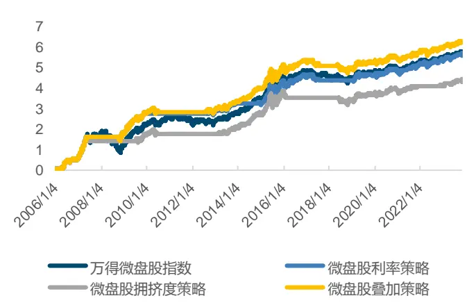
来源：Wind，国金证券研究所

图表27：叠加择时策略表现

| 01/04/2006-微盘股叠微盘股利率微盘股拥挤万得微盘股 10/24/2023 | 加策略 | 策略 | 度策略 | 指数 |
| --- | --- | --- | --- | --- |
| 年化收益率 | 41.82% | 37.08% | 27.85% | 37.91% |
| 年化波动率 | 26.05% | 24.54% | 21.92% | 31.52% |
| 最大回撤 | -48.17% | -48.17% | -51.03% | -66.08% |
| 夏普比率 | 1.43 | 1.37 | 1.18 | 1.15 |
| 收益回撤比 | 0.87 | 0.77 | 0.55 | 0.57 |

来源：Wind，国金证券研究所

## 四、大小盘风格轮动研究

在第三部分，本文分析了万得微盘股指数的走势和历史发生回撤时的相关因素，但这仅仅小盘风格的纯多头组合分析。所以在第四部分，我们希望结合大盘风格组合共同来观测大小盘风格本身存在的周期性波动，为投资者探索有效的大小盘轮动切换信号。

## 4.1 大小盘相对涨跌分析

在报告开始的时候，我们有提及近两年以来投资者对微盘股的关注，实际上有一部分是由于大小盘指数的分叉行情导致的。这些年大盘指数的持续回调，一方面使得投资者关注到微盘股的走强，另一方面他们其实也想了解大盘板块什么时候能重新回升，或者说相对微小盘有所相对涨幅。

图表28：指数净值走势(2015-2023)
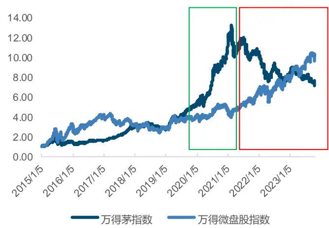
来源：Wind，国金证券研究所

图表29：微盘股指数、茅指数和小市值等各类指数走势对比
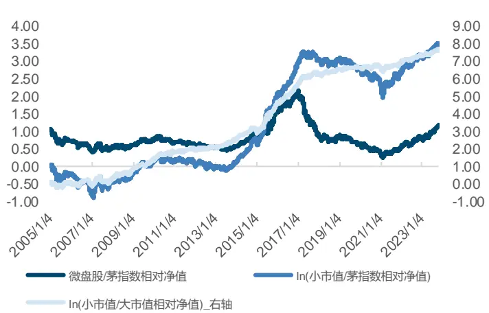
来源：Wind，国金证券研究所

开始进行与微盘股指数相关的大小盘相对涨幅分析之前，我们还需要确定具体的空头组合。这里我们分别展示小市值/大市值、小市值/茅指数和微盘股指数/茅指数组合三个大小盘组合的相对表现。其中小市值/大市值是最严谨的小市值因子多空分析，但是我们可以看到，拉长来看可以说基本上大多时间都是小市值组合相对占优，甚至是我们平时明显感知到的2017年的小市值因子的回撤期，这和我们对占优风格的认知并不一致。为什么会出现这样的情况，我们分析下来觉得问题主要是在单纯用总市值划分大市值组合上面。我们平时理解的大市值行情更多是蓝筹大盘核心票的行情，而非单纯用总市值来界定，而且若单独用总市值来界定会挑选出很多银行和石油股，并不能很好的刻画蓝筹行情。所以我们考虑用平常我们容易观测的万得茅指数代表核心蓝筹大市值组合作为我们

## 相对涨跌分析中的空头组合。

除此之外，我们也用了小市值/茅指数与微盘股指数/茅指数组合来做对比，可以发现，虽然微盘股指数并不是在长时序上都是微盘股，在2012年之前只能算是中小盘。但是在与小市值/茅指数的走势对比中我们能发现，两者的走势方向基本一致，只是涨跌幅度上有所区别，而且微盘股指数/茅指数组合波动幅度更大，更利于我们分析风格之间的相对切换。所以我们最后就选定了用微盘股指数/茅指数组合来作为大小盘风格相对涨跌分析的对象。

当我们将大小盘风格判断标的确定了之后，画出两者的相对净值走势。我们可以发现用微盘股指数和茅指数定义出来的大小盘风格其实有非常强的时间持续性。当开始了一个中期的风格切换之后，在持续2-4年的相对占优之后才会重新做出切换。我们从图表中可以看到，从2005年以来，我们基本上只是经历了3轮的大小盘风格切换。从2021年1月开始就一直保持着微小盘的占优，已经经过了2年9个月的时间。

图表30：微盘股/茅指数相对净值走势
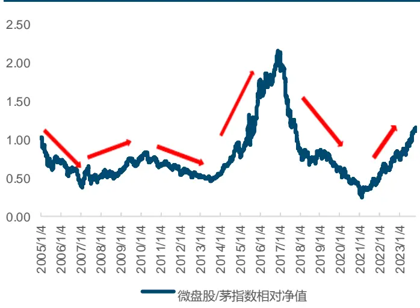
来源：Wind，国金证券研究所

图表31：微盘股/茅指数相对净值涨跌区间划分(截止2023年10月）

| 时间 | 持续时长 | 占优风格 |
| --- | --- | --- |
| 2005年1月-2007年7月 | 2年6个月 | 大盘 |
| 2007年7月-2010年3月 | 2年8个月 | 小盘 |
| 2010年3月-2013年7月 | 3年4个月 | 大盘 |
| 2013年7月-2016年11月 | 3年4个月 | 小盘 |
| 2016年11月-2021年1月 | 4年2个月 | 大盘 |
| 2021年1月-至今 | 2年9个月(未结束) | 小盘 |

来源：Wind，国金证券研究所

## 4.2 涨跌分析框架

为了分析大小盘的涨跌，本文构建了一套通过宏观叠加量价的定量观测框架。宏观定量是指通过经济增长和利率流动性等宏观指标来对大小盘风格做定量层面的判断；而量价定量则是通过量价走势来给中期的大小盘风格判断构建定量模型。

图表32：大小盘相对涨跌分析框架
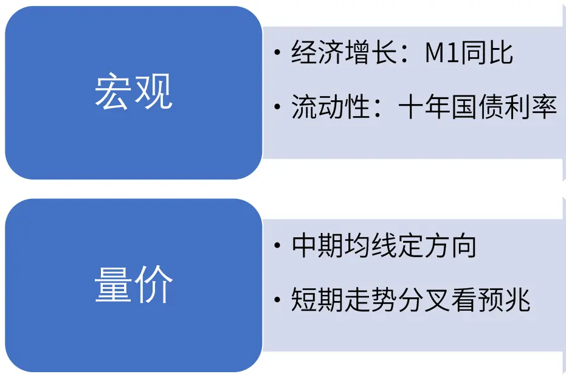

来源：Wind，国金证券研究所

## 4.3 大小盘相对涨跌分析：经济增长

在将大盘板块作为分析目标的一部分之后，与大盘走势息息相关的经济增长也成为了一个我们需要分析的重要因素。但在分析经济增长与大小盘风格轮动的关系之前，我们先要找到一个经济增长的良好代理指标。我们在这边一共列出了4种平常可能会将其作为经济增长观察变量的指标，包括M1同比、工业企业营业受收入累计同比、PPI同比+工业增加值同比和中采制造业PMI。

在综合指标领先性和指标走势稳定度来进行评价，我们认为M1同比是个比较好的经济增长指标代理变量。所以在后面大小盘的相对分析中，我们用M1同比来观察经济增长对于微盘股指数/茅指数相对走势的影响。

由于如果单纯看M1同比指标数据本身还是有很多的走势抖动情况，为了更好的判断M1同比的趋势方向，我们将M1同比的6个月移动平均线作为代表变量去观察M1同比的变化。从图中我们可以看到，非常有意思的是，在每次的大小盘风格的拐点附近，都出现了M1同比的高点。根据这样的特点，我们构建了基于M1同比指标的微盘股指数与茅指数的轮动策略：

1)识别高低拐点：

- 高位拐点识别：当在连续的12个数据点之中，最新数据为第二大值，则将此刻时点其定义为高位拐点出现点。

低位拐点识别：当在连续的12个数据点之中，最新数据为第二小值，则将此刻时点其定义为低位拐点出现点。

2)信号过滤：在识别了初步的高低拐点基础上，进一步要求高低拐点之间要间隔12期以上，否则过滤点该高低点。（因为我们在前面的大小盘周期能看到，中期的大小盘轮动至少间隔2年。)

3) 以2007年的 M1高点作为起始点，2007 年高点之前为小盘占优；每当M1同比高点出现后，发出风格切换信号。

这样构建出来的M1大小盘轮动策略，从2006年1月1日至2023年10月24日的年化收益为55.35%，相较万得微盘股指数和万得茅指数的年化收益率有明显的提升。但波动率和最大回撤由于没有择时，所以整体数值与原指数相近。

图表33：各类经济增长代理指标
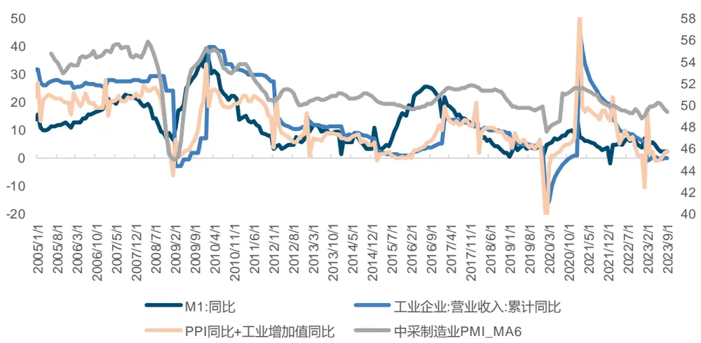
来源：Wind，国金证券研究所

图表34：微盘股/茅指数相对净值和M1同比
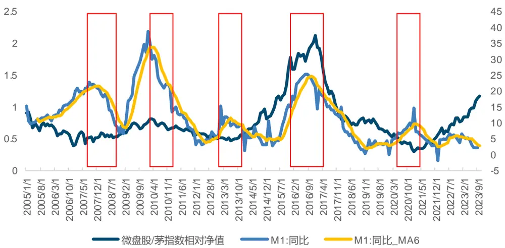
来源：Wind，国金证券研究所

图表35：M1 轮动策略净值走势
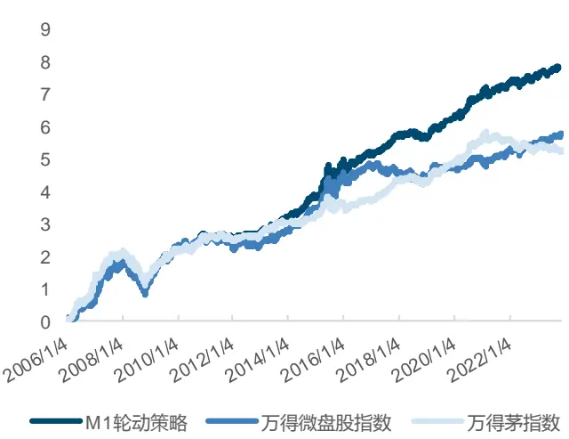
来源：Wind，国金证券研究所

图表36：M1 轮动策略表现

| 01/04/2006- 10/24/2023 | M1 轮动策略万得微盘股指数 万得茅指数 |  |  |
| --- | --- | --- | --- |
|  | 55.35% | 37.91% | 34.05% |
| 年化波动率 | 30.58% | 31.52% | 26.88% |
| 最大回撤 | -66.08% | -66.08% | -66.01% |
| 夏普比率 | 1.56 | 1.15 | 1.19 |
| 收益回撤比 | 0.84 | 0.57 | 0.52 |

来源：Wind，国金证券研究所

## 4.4大小盘相对涨跌分析：国内利率

除了分析经济增长以外，我们也回到了对国内利率的分析。为了比较好的分析国债利率的中期趋势，我们也计算了国债利率的年均线来刻画趋势方向。但是即使做了均线平滑，我们发现还是如同我们在做微盘股指数分析的情况类似，国债利率与微盘股/茅指数相对净值的关系并不稳定，甚至有时在相对净值的一个中期趋势中间，利率已经来回走了一个小周期。对于宏观趋势而言，还是整体符合利率上升，利好大盘(茅指数)：利率下降小盘(微盘股指数)占优。

而且由于利率走势的不稳定，用其来作为大小盘轮动策略的定量因子其实并不合适，所以展示只将利率作为一个定性的观测指标。

图表37：微盘股/茅指数相对净值与10年国债利率走势
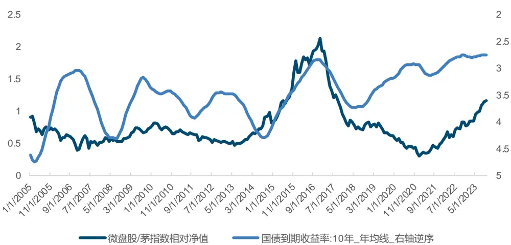
来源：Wind，国金证券研究所

## 4.5大小盘相对涨跌分析：中期价格走势

宏观指标对大小盘的相对涨跌判断方面，其实都存在一些相对的模糊点，所以我们想从量价的角度帮助我们进行定量的策略构建。第一个比较简单且清晰的思路就是，既然通过微盘股指数和茅指数刻画出来的中期趋势相对较强，那我们只需要获取走势本身给出的趋势方向并且延续就可以了，等到趋势反转的时候在进行跟随方向的切换。

所以我们选择使用微盘股/茅指数相对净值的年均线来进行趋势的刻画，若相对净值在均线上方时，我们认为小市值占优，选择持有万得微盘股指数；而相对净值在均线下方时，则反之认为大市值占优，选择持有茅指数。在做切换交易的时候也考虑了单边千分之三的交易成本。

我们可以看到，使用了年均线的长周期均线轮动策略，相较于于万得微盘股指数和茅指数指数走势，年化收益上有了相对明显的提升。2006年1月1日至2023年10月24日策略年化收益为 49.87%。

图表38：微盘股/茅指数相对净值与年均线
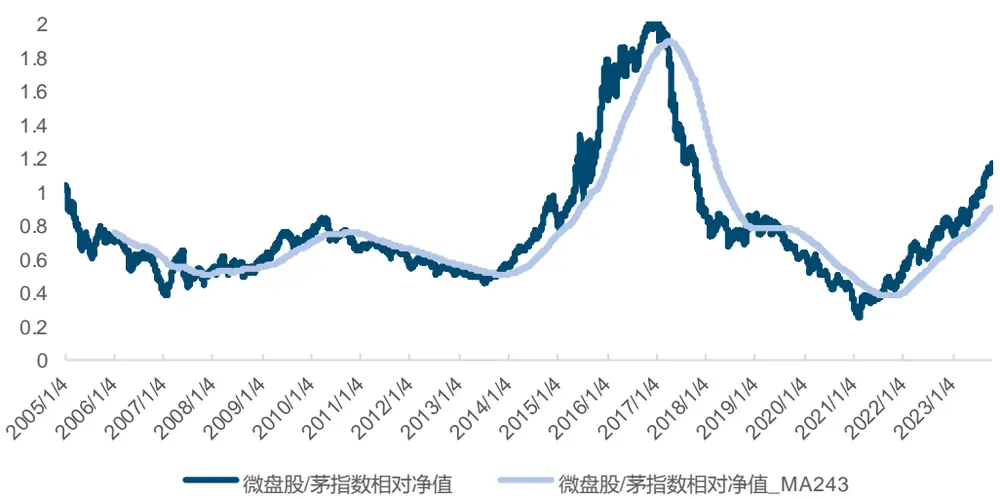
来源：Wind，国金证券研究所

图表39：长周期均线轮动策略净值走势
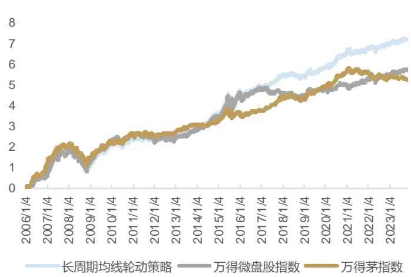
来源：Wind，国金证券研究所

图表40：长周期均线轮动策略表现

| 01/04/2006- 10/24/2023 | 长周期均线 轮动策略 | 万得微盘股指数 | 万得茅指数 |
| --- | --- | --- | --- |
| 年化收益率 | 49.87% | 37.91% | 34.05% |
| 年化波动率 | 30.34% | 31.52% | 26.88% |
| 最大回撤 | -74.47% | -66.08% | -66.01% |
| 夏普比率 | 1.45 | 1.15 | 1.19 |
| 收益回撤比 | 0.67 | 0.57 | 0.52 |

来源：Wind，国金证券研究所

## 4.6大小盘相对涨跌分析：微观短期价格走势

在研究微观短期走势之前，我们先来分析下引起微盘股指数/茅指数相对净值上涨的两种情况：1）万得微盘股指数和茅指数共同上涨或者下跌，但是万得微盘股指数的涨幅更大或者跌幅更小，导致的相对净值的上升。但这也是大多数会发生的情况，除了风格轮动型的投资者，可能并不会受到太多风格稳定型投资者的关注。2）然而第二种情况，微盘股指数上涨，茅指数下跌。这时前者的赚钱效应会将后者正在亏钱的资金吸引过来，从而加大前者组合的涨幅。所以对于第二种情况其实我们会更加的关注。

图表41：万得微盘股指数与万得茅指数净值走势对比
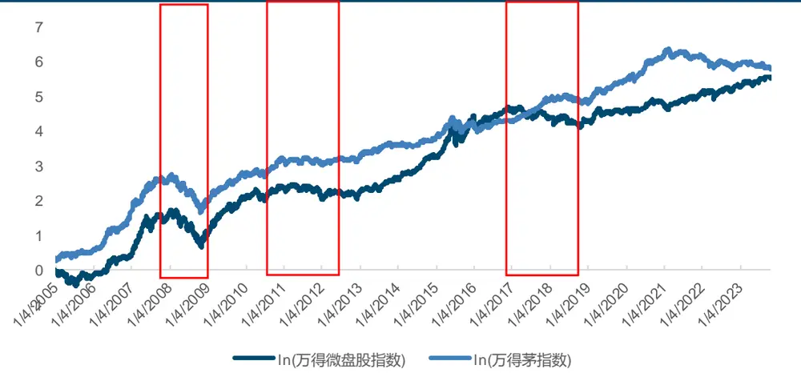
来源：Wind，国金证券研究所

而且我们发现，若两个指数发生了走势斜率的分叉之后，走势向上的指数多数都会持续占优一段时间。包括2017年茅指数走势向上微盘股指数向下之后，茅指数持续占优和2021年微盘股指数向上茅指数向下之后，微盘股指数持续占优。

图表42：2017年走势斜率分叉，茅指数开始占优
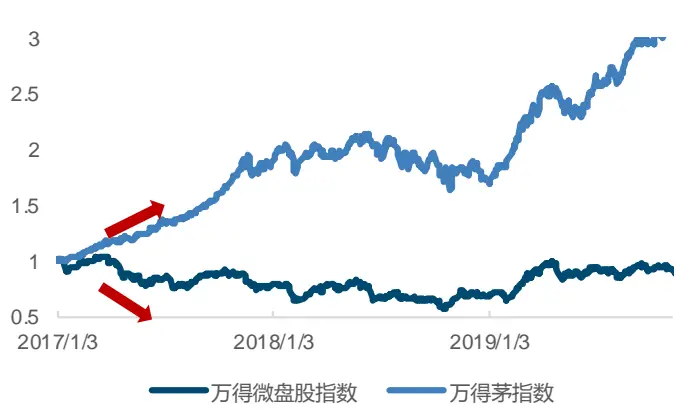
来源：Wind，国金证券研究所

图表43：2021年斜率分叉，微盘股指数开始占优
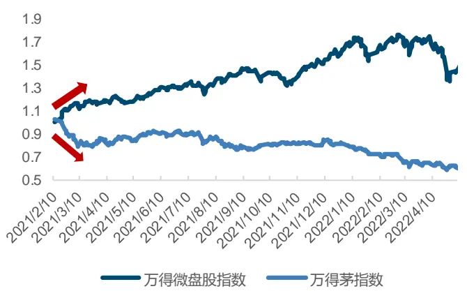
来源：Wind，国金证券研究所

根据这样的走势特征，我们在原本的长周期均线策略内部，加入些许优化：

- 当微盘股/茅指数相对净值>微盘股/茅指数相对净值MA243:

- 若微盘股斜率和茅指数斜率方向相反且茅指数斜率>0，选择配置茅指数。

反之配置微盘股指数。

- 微盘股/茅指数相对净值<=微盘股/茅指数相对净值MA243:

若微盘股斜率和茅指数斜率方向相反且微盘股指数斜率>0，选择配置微盘股指数。

反之配置茅指数。

指数净值走势的斜率则用滚动20个交易日的收盘价来计算，并且在策略内考虑了单边千分之三的交易成本。

我们可以看到，叠加了微观走势分叉的信号优化之后的斜率轮动策略，相较于原本的长周期均线轮动策略有了进一步的表现提升。

图表44：斜率轮动策略表现
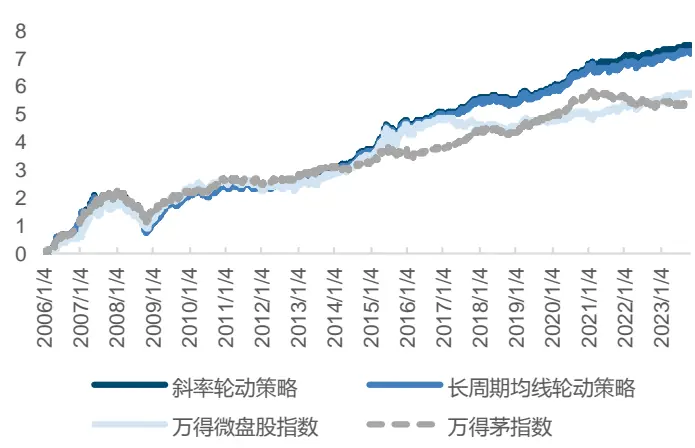
来源：Wind，国金证券研究所

图表45：斜率轮动策略净值走势

| 01/04/2006- 10/24/2023 | 策略 | 斜率轮动长周期均线轮动万得微盘股万得茅指 策略 | 指数 | 数 |
| --- | --- | --- | --- | --- |
| 年化收益率 | 51.66% | 49.87% | 37.91% | 34.05% |
| 年化波动率 | 30.30% | 30.34% | 31.52% | 26.88% |
| 最大回撤 | -74.47% | -74.47% | -66.08% | -66.01% |
| 夏普比率 | 1.49 | 1.45 | 1.15 | 1.19 |
| 收益回撤比 | 0.69 | 0.67 | 0.57 | 0.52 |

来源：Wind，国金证券研究所

## 4.7大小盘相对涨跌分析：策略信号叠加

在分别构建完经济增长的M1轮动信号和量价的斜率轮动信号之后，我们像将其进一步的进行信号上的叠加，只要两个信号中有一个信号选择微盘股指数，策略组合则配置微盘股指数，反之则配置茅指数。

这一次在轮动信号上的信号叠加，叠加策略的整体表现仅接近甚至略微弱于M1轮动策略，并没有使得收益提升或者波动下降，更多是维持与单信号相近的表现。但是单一的M1同比宏观信号构建过程中仍有一定的定性成分，加入量价斜率信号之后，对于策略未来有效的持续性或能有更好的表现。

图表46：轮动混合策略走势净值
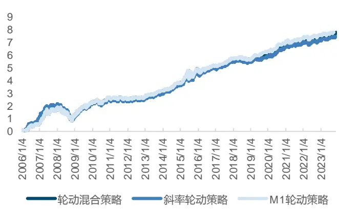
来源：Wind，国金证券研究所

图表47：轮动混合策略表现

| 01/04/2006- 10/24/2023 |  | 轮动混合策略 斜率轮动策略 | M1 轮动策略 |
| --- | --- | --- | --- |
| 年化收益率 | 54.13% | 51.66% | 55.35% |
| 年化波动率 | 30.63% | 30.30% | 30.58% |
| 最大回撤 | -66.08% | -74.47% | -66.08% |
| 夏普比率 | 1.53 | 1.49 | 1.56 |
| 收益回撤比 | 0.82 | 0.69 | 0.84 |

来源：Wind，国金证券研究所

另外由于在第三部分，我们还构建了对于万得微盘股指数的择时模型。若是轮动发出的是微盘股指数的持仓信号，我们仍能够使用微盘股指数择时信号，通过空仓来降低组合的整体回撤。轮动混合+择时策略整体表现优异，从2006年1月1日至2023年10月24日，轮动混合+择时策略年化收益率为59.37%，高于先前构建的轮动混合策略与微盘股叠加择时策略。与此同时，年化波动率与最大回撤也维持在三个策略里面的较低值，使得轮动混合+择时策略获得了三个策略中夏普比率的最大值(1.82)。

图表48：轮动混合+择时策略走势净值
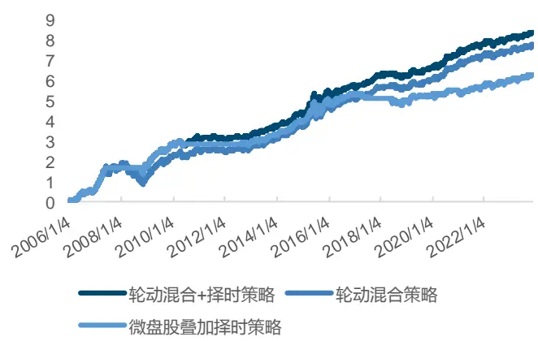
来源：Wind，国金证券研究所

图表49：轮动混合+择时策略表现

| 10/24/2023 | 01/04/2006- 轮动混合+择时 策略 | 轮动混合策略 | 微盘股叠加择时 策略 |
| --- | --- | --- | --- |
| 年化收益率 | 59.37% | 54.13% | 41.82% |
| 年化波动率 | 27.05% | 30.63% | 26.05% |
| 最大回撤 | -48.17% | -66.08% | -48.17% |
| 夏普比率 | 1.82 | 1.53 | 1.43 |
| 收益回撤比 | 1.23 | 0.82 | 0.87 |

来源：Wind，国金证券研究所

图表50：轮动混合+择时策略标的权重占比(空白处为策略择时空仓)
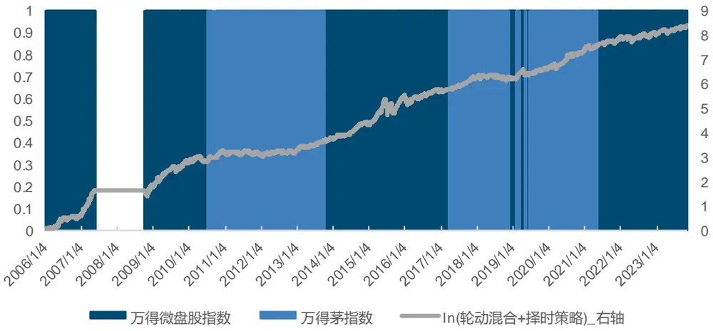
来源：Wind，国金证券研究所

## 4.8大小盘相对涨跌分析：泛化大小盘轮动策略

在前面的部分，我们都将万得微盘股指数/茅指数相对净值作为大小盘相对涨跌的代理指标。但是通过对比中证1000/沪深300相对净值可知，即使选用不同的大小盘轮动代理变量，其整体依然表现出相似的中期变化趋势项，仅仅是走势的短期波动和走势流畅性上略微有些区别。

甚至我们尝试将万得微盘股指数/茅指数轮动的轮动混合+择时策略信号直接移植到中证1000/沪深300轮动模型当中使用，整体仍有不错的策略表现。从2006年1月1日至2023年10月24日，中证1000/沪深300轮动混合+择时策略年化收益率为20.32%，高于沪深300(9.72%)和中证1000（12.01%)。另外策略年化波动率和最大回撤的表现也优于原指数本身。策略收益端和风险波动端同时改善，使得策略夏普比率提升至0.82。

图表51：指数相对净值走势比较
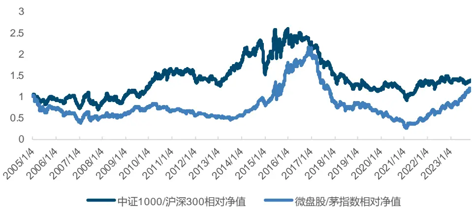
来源：Wind，国金证券研究所

图表52：中证1000/沪深300轮动混合+择时策略净值
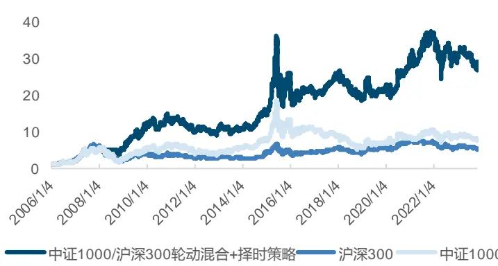
来源：Wind，国金证券研究所

图表53：中证1000/沪深300轮动混合+择时策略表现

| 01/04/2006- 10/24/2023 | 中证 1000/沪深 300 轮 动混合+择时策略 | 沪深300 | 中证 1000 |
| --- | --- | --- | --- |
| 年化收益率 | 20.32% | 9.72% | 12.01% |
| 年化波动率 | 25.33% | 25.67% | 29.95% |
| 最大回撤 | -53.06% | -72.04% | -72.47% |
| 夏普比率 | 0.82 | 0.45 | 0.49 |
| 收益回撤比 | 0.38 | 0.13 | 0.17 |

来源：Wind，国金证券研究所

## 总结

我们通过研究发现，万得微盘股指数的高收益主要来源于三点：1）小市值因子暴露：2）在样本股票池中剔除了ST股；3）日频的调仓频率更匹配小市值因子。另外的话，国内利率和指数波动率拥挤度的走高可能诱发万得微盘股指数的回调。但是出乎意料的是，海外利率对万得微盘股指数的影响不大。我们基于对回撤原因的分析构建了叠加国内利率择时信号与波动率拥挤度择时信号的微盘股叠加择时策略。其从2006年1月1日至2023年10月24日年化收益为41.82%，年化波动率为26.05%。组合相较原万得微盘股指数在控制了波动和回撤的同时，甚至获取了比微盘股指数更高的收益(37.91%)。

除了万得微盘股指数的单一指数研究，我们也从万得微盘股指数与万得茅指数的相对净值来分析市场中期大小盘风格轮动的情况。为了分析大小盘相对占优的情况，我们构建了一套通过宏观叠加量价的观测框架。宏观方面，当M1的区间高点的出现(经济状态发生变化后)，大小盘风格可能会出现中期的切换：而国内利率若走高，后续茅指数占优的可能性变大：反之利率走低，微盘股占优的可能性更大。在量价方面，若微盘股/茅指数相对净值高于年均线时，微盘股中期占优；反之，茅指数占优。另外但两指数的净值走势出现斜率的分叉后，斜率为正的风格指数一般会维持一段时间的占优。

通过融合前期的指数轮动和择时信号，我们构建了万得微盘股指数和茅指数的轮动混合+择时策略。策略整体表现优异，从2006年1月1日至2023年10月24日，轮动混合+择时策略年化收益率为59.37%，高于先前构建的轮动混合策略与微盘股叠加择时策略。并且我们尝试将轮动混合+择时策略信号直接移植到中证1000和沪深300的大小盘轮动策略上面，，整体仍有不错的策略表现。从2006年1月1日至2023年10月24日，中证1000/沪深300轮动混合+择时策略年化收益率为 20.32%高于沪深300(9.72%)和中证1000(12.01%)。

通过我们构建的中期微盘股择时和大小盘轮动信号分析，由于目前M1同比与国债利率指标都仍处于区间低位，3-6个月内微盘股维持占优的可能性较大。另外后续密切关注是否出现M1同比走高、国债利率走高或大小盘走势分叉，且大盘走势向上的情况。这些都是潜在的可能出现大小盘切换的信号。

## 风险提示

1、以上结果通过历史数据统计、建模和测算完成，若历史数据产生环境发生变化，可能出现模型失效风险；

2、政策环境发生变化，资产与相关风险因子失去稳定关系的模型风险；

3、市场环境发生变化，国际政治摩擦升级等带来各大类资产同向大幅波动风险。

## 特别声明：

国金证券股份有限公司经中国证券监督管理委员会批准，已具备证券投资咨询业务资格。

形式的复制、转发、转载、引用、修改、仿制、刊发，或以任何侵犯本公司版权的其他方式使用。经过书面授权的引用、刊发，需注明出处为“国金证券股份有限公司”，且不得对本报告进行任何有悖原意的删节和修改。

本报告的产生基于国金证券及其研究人员认为可信的公开资料或实地调研资料，但国金证券及其研究人员对这些信息的准确性和完整性不作任何保证。本报告反映撰写研究人员的不同设想、见解及分析方法，故本报告所载观点可能与其他类似研究报告的观点及市场实际情况不一致，国金证券不对使用本报告所包含的材料产生的任何直接或间接损失或与此有关的其他任何损失承担任何责任。且本报告中的资料、意见、预测均反映报告初次公开发布时的判断，在不作事先通知的情况下，可能会随时调整，亦可因使用不同假设和标准、采用不同观点和分析方法而与国金证券其它业务部门、单位或附属机构在制作类似的其他材料时所给出的意见不同或者相反。

本报告仅为参考之用，在任何地区均不应被视为买卖任何证券、金融工具的要约或要约邀请。本报告提及的任何证券或金融工具均可能含有重大的风险，可能不易变卖以及不适合所有投资者。本报告所提及的证券或金融工具的价格、价值及收益可能会受汇率影响而波动。过往的业绩并不能代表未来的表现。

客户应当考虑到国金证券存在可能影响本报告客观性的利益冲突，而不应视本报告为作出投资决策的唯一因素。证券研究报告是用于服务具备专业知识的投资者和投资顾问的专业产品，使用时必须经专业人士进行解读。国金证券建议获取报告人员应考虑本报告的任何意见或建议是否符合其特定状况，以及（若有必要）咨询独立投资顾问。报告本身、报告中的信息或所表达意见也不构成投资、法律、会计或税务的最终操作建议，国金证券不就报告中的内容对最终操作建议做出任何担保，在任何时候均不构成对任何人的个人推荐。

在法律允许的情况下，国金证券的关联机构可能会持有报告中涉及的公司所发行的证券并进行交易，并可能为这些公司正在提供或争取提供多种金融服务。

本报告并非意图发送、发布给在当地法律或监管规则下不允许向其发送、发布该研究报告的人员。国金证券并不因收件人收到本报告而视其为国金证券的客户。本报告对于收件人而言属高度机密，只有符合条件的收件人才能使用。根据《证券期货投资者适当性管理办法》，本报告仅供国金证券股份有限公司客户中风险评级高于C3级(含C3级)的投资者使用；本报告所包含的观点及建议并未考虑个别客户的特殊状况、目标或需要，不应被视为对特定客户关于特定证券或金融工具的建议或策略。对于本报告中提及的任何证券或金融工具，本报告的收件人须保持自身的独立判断。使用国金证券研究报告进行投资，遭受任何损失，国金证券不承担相关法律责任。

若国金证券以外的任何机构或个人发送本报告，则由该机构或个人为此发送行为承担全部责任。本报告不构成国金证券向发送本报告机构或个人的收件人提供投资建议，国金证券不为此承担任何责任。

此报告仅限于中国境内使用。国金证券版权所有，保留一切权利。

上海

电话：021-80234211

邮箱：researchsh@gjzq.com.cn

北京

地址：上海浦东新区芳甸路1088号紫竹国际大厦5楼

深圳

电话：010-85950438

电话：0755-83831378

邮编：201204

邮箱：researchbj@gjzq.com.cn

邮编：100005

传真：0755-83830558

地址：北京市东城区建内大街26号新闻大厦8层南侧

邮箱：researchsz@gjzq.com.cn

邮编：518000

地址：深圳市福田区金田路2028号皇岗商务中心18 楼 1806

【小程序】国金证券研究服务

【公众号】国金证券研究