金融工程组

分析师：高智威（执业S1130522110003)联系人：胡正阳

gaozhiw@gjzq.com.cn

huzhengyang1@gjzq.com.cn

## 追上投资热点——基于LLM的产业链图谱智能化生成

本篇报告是国金证券金融工程团队围绕大语言模型开展的多项深度前瞻研究第八篇。在本报告中，我们借鉴智能体（Agent）这一概念，将大语言模型应用到产业链梳理任务中，并实现了对投资概念的拆解以及相关标的个股的推荐。从大语言模型到“智能体”

OpenAI 在首届开发者大会上推出 GPTs 功能，它们能自主寻找多步解决问题的方案并行动。我们将具有以上功能的模型称为“智能体”。智能体核心要素可以表示为“大语言模型+规划+工具+记忆”：大语言模型作为内核提供理解、推理与生成能力；规划给智能体带来问题逐步求解能力，实现从“一问一答”向“自主思考”转变；工具赋予智能体与环境交互的能力；记忆则帮助它完成多轮的思考与行动。

基于大语言模型的智能体决策逻辑可以简化为“感知→规划→行动”。其中，感知是指智能体收集信息并整合为模型输入，规划是指智能体做出具体决策并给出行动指令，行动则是按照规划行动的步骤。智能体观察到行动的反馈并放入记忆，成为下一轮感知的基础，构成完整的决策过程。

在此之前，AutoGPT 与 Langchain 等项目已成功实现了单一智能体的部署并给出了智能体的设计蓝图，当前的研究前沿方向是多智能体交互部署。我们借鉴 AutoGPT 的思路构建了应用于产业链梳理的“产业链 Agent”。

## 利用 LLM-Based Agent 进行产业链梳理

尽管大语言模型能掌握基础的产业链知识，但无法直接梳理完整产业链。我们为产业链 Agent 完善产业链推理的框架，包括上/下游供需关系的推理、末端产品判断以及产品重要性判断，让智能体自我迭代，最终完成对所有节点的推理与判断。以智能手机上游为例，产业链 Agent 梳理结果与 Wind 智能手机产业链二者整体结构一致。

我们还赋予产业链 Agent 新闻检索的能力，增强模型对专业知识的掌握。智能体可以综合新闻信息与自有知识进行回答，给出的答案更加细致且贴近市场实际情况；挂载不同时间范围的新闻还可以观察出产业链随时间变化的趋势。更进一步，我们以产业链梳理为核心，给出了对相关投资标的进行筛选以及对投资主题进行拆解的解决方案。最终，我们可以完整分析给定投资主题对应的细分产业链结构以及相关的投资标的。我们以“华为供应链”为例，对比展示了基于 GPT4 模型以及基于 GPT3.5 叠加新闻两种模型的结果，并给出相关投资标的推荐，对各功能进行完整展示。

## 总结

使用大语言模型来实现产业链梳理以及标的推荐等功能，一方面是为了能更好利用大数据优势，从量化视角给出产业链的归纳结果，以期能够为主观投资带来增量信息；另一方面，在面对全新的投资主题或产业结构出现变化时，模型能够更快地给出回答，帮助投资者们及时做出反应。

从结果上来看，目前产业链梳理以及个股推荐的等功能虽已有雏形，但仍可能存在一定问题，包括：产业链结果不稳定、结构可能存在冗余、叠加新闻效果不稳定。整体来说，本篇在产业链梳理主题上对 Agent 技术做了充分的尝试，不过与应用实际落地之间仍有一定差距。当前大语言模型及其相关技术依旧在快速发展中，伴随能力更强大的模型登场，在可预见的未来智能体将真正为金融投资领域带来新的视野。

## 风险提示

大语言模型输出结果具有一定随机性的风险；模型迭代升级、新功能开发可能会导致结论不同的风险；人工智能模型得出的结论仅供参考，可能出现错误答案的风险。

## 一、从大语言模型到“智能体”

OpenAI 的首届开发者大会上公布了一系列新成果，但其中给人们带来最大冲击的不是全新的大语言模型，而在于一个新的功能：GPTs 和 GPT商店。自 ChatGPT推出以来，人们一直在寻找方法让它成为适应特定使用目标的定制化产品，而 GPTs 正是为此而来。简单来说，在 GPTs 中任何人都可以创建自己想要的定制功能，从而让 GPT 进行“角色扮演”。当前 GPT Store也已正式上线，包含超 300万个用户设计的 GPTs。

OpenAI 官方也推出了一些调试好的 GPTs 供大家体验。以 Data Analysis 为例，它能使用本地上传的数据进行较复杂的计算。从下图的回答中我们可以看出 GPTs 会将复杂任务拆解为小的步骤，同时调用代码工具辅助运算，经过多轮的运算思考之后给出最终答案。

## 图表1：OpenAI 提供的 Data Analysis 应用案例

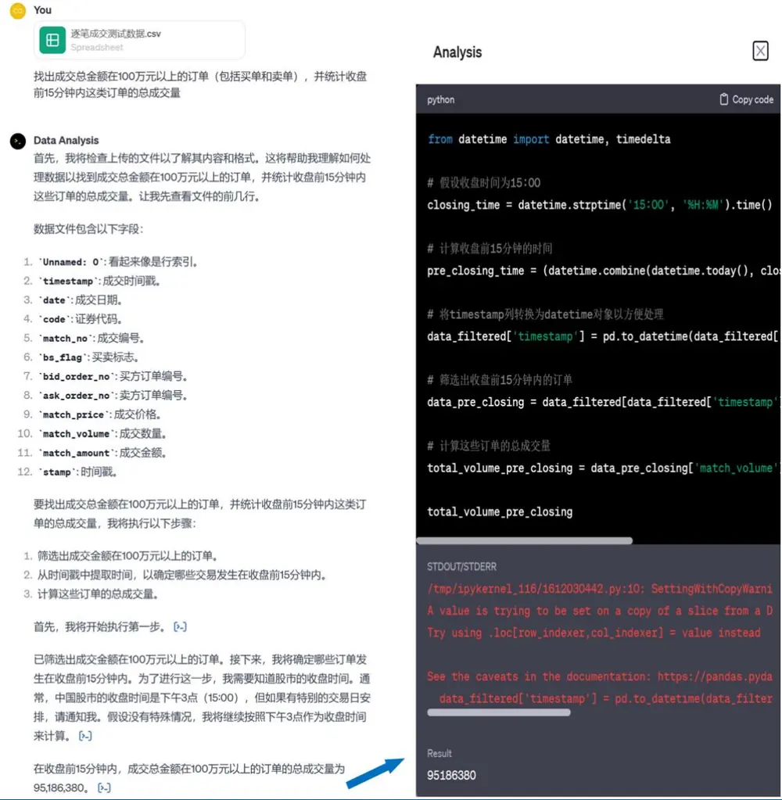
来源：OpenAI，国金证券研究所

我们也可以创建自己的 GPTs，通过给出 Instructions 指定 GPTs 的具体行动内容，还可以在 Knowledge 中上传需要给模型补充的相关信息，再通过 Capabilities 赋予 GPTs 调用代码或其他接口的能力，GPTs 将其结合为一体以实现更复杂的功能。我们尝试构建了“数学老师”GPT 并题问，它会自主地调用编程软件并求解，直到它认为我们给出的问题已得到解答。

## 图表2：GPT 商店界面

图表3：自定义 GPTs界面
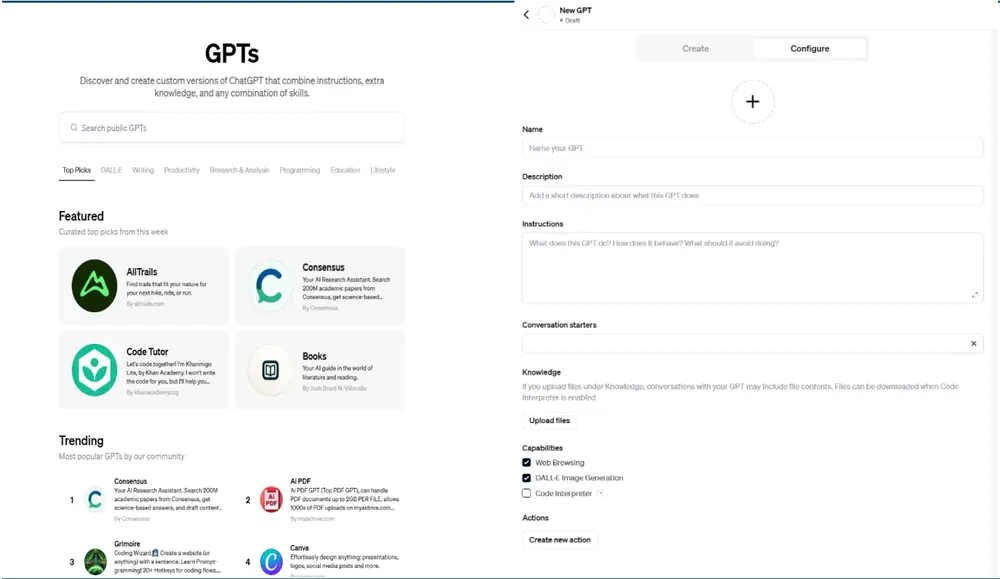
来源：OpenAI，国金证券研究所
来源：OpenAI，国金证券研究所

实际上，类似的思路早已有雏形。之前火爆一时的 AutoGPT 项目可以实现用户提问后大模型自主寻找解决方案，包括由模型规划解决问题的步骤、使用哪些工具、以及得到反馈后自动进行下一步思考，在这一框架下模型获得了一定的自主能力，并能够独立实现被赋予的目标。我们称这样的模型为智能体（Agent）。

## 1.1如何理解智能体（Agent）？

人工智能领域的“智能”概念与传统理解有所不同，它更强调的是行使意志、做出选择和采取行动的能力，强调物体不是单纯被动地受外部刺激而做出反应。智能体则是泛指满足上述行动要求的实体。

历史上的智能体实践经历了多轮迭代。最初智能体仅停留在概念的层面，强调符号逻辑与反应速度。伴随深度强化学习的发展，基于深度学习的智能体（RL-Based Agents）开始发展，AlphaGo 等广为人知的项目获得成功标志着智能体开始进入实际应用环境。不过，强化学习作为核心也带来训练时间长、采样效率低以及稳定性问题。大语言模型快速兴起为智能体的发展也带来了丰富想象，越来越多的人开始尝试将大语言模型作为内核，来构建 LLM-Based Agent。大语言模型天生自带的多模态感知、推理能力以及强大的泛化能力，为智能体带来了丰富的应用场景。

图表4：智能体技术演变
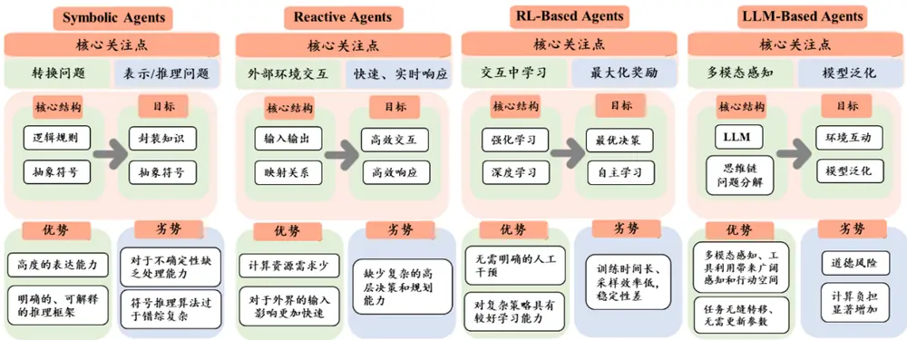
来源：《The Rise and Potential of Large Language Model Based Agents: A Survey》，国金证券研究所
在大语言模型背景下，智能体概念可以理解为：

## 智能体 = 大语言模型 + 规划 + 工具 + 记忆

大语言模型作为模型内核，为智能体提供理解、推理与生成能力，也是其他所有功能的实现基础。规划步骤帮助智能体获得对问题求解步骤进行拆分的能力，实现从“一问一答”向“自主思考”转变，其本质上依赖于大语言模型的推理能力。工具赋予智能体与环境交互的能力，是智能体行动的载体；记忆则记录智能体每一轮的思考、行动以及获取的反馈，帮助它在多轮迭代中保持思考的连贯。以下我们对这类基于大语言模型的智能体进行更详细的介绍。

## 1.2 LLM-Based Agents 的运行机制

我们使用一个例子来说明 LLM-Based Agents 的运行机制。当人类询问“明天这里是否会下雨？”时，下图展现了一种可能的 LLM-Based Agent“思考流程”：

图表5：LLM-Based Agent 运行机制示例
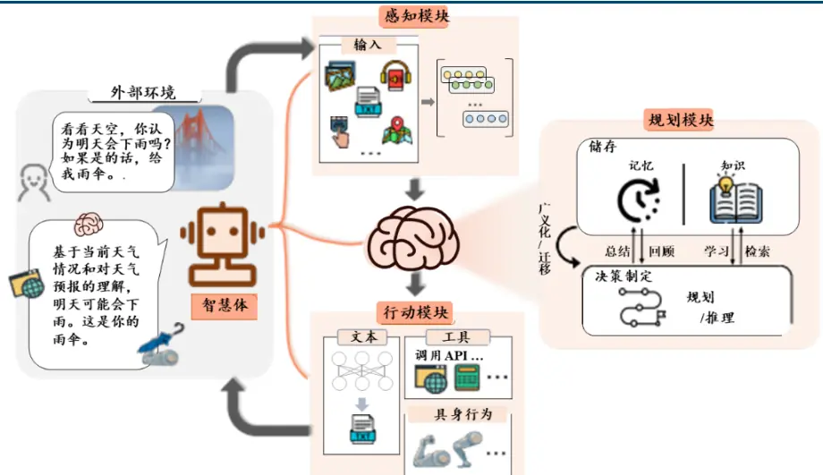
来源：《The Rise and Potential of Large Language Model Based Agents: A Survey》，国金证券研究所

感知模块将指令转换为大语言模型可以理解的表示形式；然后大脑模块开始根据天气的图片、地理位置或是其他天气相关的数据进行推理和行动规划；最后由行动端做出响应并将雨伞递给人类。以上只是大致的运作流程，实际上该流程内部可能存在多轮迭代，譬如：

第一轮，智能体识别出需要对下雨的概率进行估计，那么会规划对天气相关的数据进行实时收集，行为模块就会执行联网的查询或是数据库调取这类操作；

第二轮，模型读取收集到的数据，再决定是基于自有知识或是直接调用天气预测模型，来给出下雨的概率；……

最终，智能体在重复上述过程中不断与环境交互并获得反馈，最后得出结论。

总结来说，智能体的运行流程可以简化为：感知(Perception)、规划(Planning)、行动(Action)。

图表6：智能体运行流程示意图
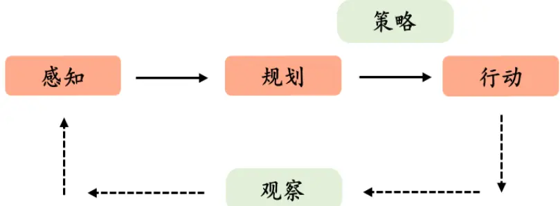
来源：《The Rise and Potential of Large Language Model Based Agents: A Survey》，国金证券研究所

感知的核心目的是将数据统一化为模型可以操作的向量形式，当然在实践层面它还负责Prompt 的编写等工作。规划模块则负责进行推理和决策，主要是基于模型自身的参数来给出回答。在大语言模型的加持下，它能获得“记忆”能力，结合自身过去的观察、思考和行动进行规划。行动模块接收规划给出的行动安排，并与环境产生互动，这也是让智能体拥有自主性的最关键部分。工具一般以 API 或函数的形式提供，丰富的工具选择可以大大拓宽智能体的能力范围，补足大语言模型不擅长的方面。例如模型并不擅长数学运算，在需要涉及运算时我们允许模型调用代码（Code interpreter）进行辅助，这样可以明显提升模型运算的准确度。

## 大语言模型为智能体带来如下的具体优势：

1）大语言模型的多模态感知扩展了智能体接受的信息范围。除了基本的文本输入外，感知模块也能添加图像编码器，在编码器与大语言模型之间增添中间层的方式将 LLM-Based Agent 的感知域扩展到视觉输入层面；听觉输入方面，智能体可以以级联方式调用现有工具集或模型库来处理音频信息，将感知空间从纯文字领域扩展到包括文字、听觉和视觉模式在内的多模态领域。

2）大语言模型自身具备强大的推理能力以及丰富的知识，能提升规划模块的效率。除此之外，针对复杂问题，我们还可以使用思维链（CoT）等技术有效提升智能体的推理能力。

3）大语言模型拥有强大的 zero-shot learning 和 few-shot learning 能力，允许我们通过描述工具功能或进行少量演示的提示方法来帮助智能体理解工具，这有助于模型进行复杂任务的拆分规划；大语言模型还能够按照指定的格式进行输出，便于行动模块准确读取规划的结果，这为智能体带来更灵活且广泛的工具调用能力。实践中，我们一般要求模型以 JSON格式给出选择的工具名称以及参数信息。

4）“记忆”功能帮助智能体从反馈中学习，与环境互动的能力帮助其在多轮推理中不断接近目标。反馈包括环境反馈与人类反馈，智能体会识别自身行为给环境带来的所有改变，包括任务是否完成等；在人类提供反馈时，智能体也会从人类给出的显性评价或隐性行为中读取反馈信息。

）在大规模语料库中进行预训练后展现出的泛化能力，使构建的智能体能快速应用于各类场景；除此之外，大语言模型还可以随时补充专业领域的知识，以在特定任务上有更好的表现。目前在扩展模型的专业知识方面也有较多研究，主流的方法包括基于 FAISS的知识库搭载和微调（Fine Tuning），前者实际上是在 Prompt 层面告诉模型一些专业知识来提升能力，而后者直接从参数层面对模型进行专业知识方向的提升。

此外，若底层的大语言模型具有足够的智能，LLM-Based Agent 还能通过生成可执行程序或将现有工具进行集成来创建工具，甚至在多个智能体的系统中为其他智能体制作软件包。推测未来，智能体可能会变得自给自足，在工具方面表现出高度的自主性。LLM-Based Agent 的优秀能力已被初步应用于各种现实场景，如软件开发和科学研究等，但距离全方位的推广还有一定距离。

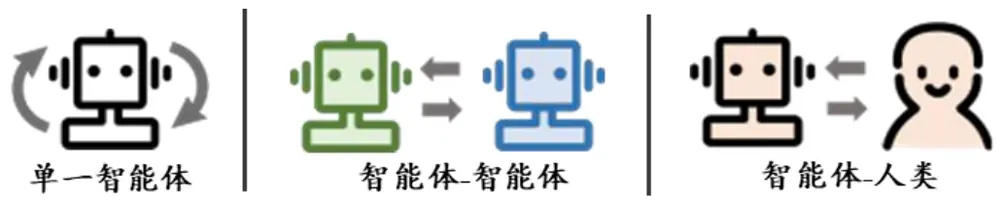
图表7:LLM-Based Agent三大应用场景
来源：《The Rise and Potential of Large Language Model Based Agents: A Survey》，国金证券研究所

## LLM-Based Agent

目前，LLM-Based Agent 应用实例的发展十分活跃，各类项目层出不穷。它们大致可以分为三种应用场景：单一智能体部署、多智能体交互部署和人与智能体交互部署。单个智能体拥有多种能力，在各种应用方向上都能表现出出色的任务解决能力。当多智能体互动时，它们可以通过合作或对抗性互动取得进步。目前单一智能体部署方面已有许多大胆尝试，例如 AutoGPT、Langchain 等，此外还包括最近推出的 GPTs。多智能体交互部署是未来的重点发展方向。

## 2.1 单一智能体的部署——以AutoGPT为例

AutoGPT 是目前非常流行的开源项目之一，旨在实现完全自主的问题解决系统。除了GPT-4 等大型语言模型的基本功能外，AutoGPT 框架还集成了各种实用的外部工具和长短期内存管理。理论上，用户在输入目标后就可以解放双手，等待 AutoGPT 自动生成想法并执行特定任务，所有这些都不需要用户的额外提示。

是将用户的多目标复杂任务进行分步执行，每一步使用何种工具以完成何种命令，都是通过调用大语言模型的返回结果决定的，从而极大程度上提升决策透明度，实现自我推理决策。此外，调用大语言模型时会将前几轮推理结果的历史信息一同传给模型，从而强化模型的对话记忆性，让 LLM综合全局的信息给出下一步要执行的命令。其逻辑流程与模块调用关系大致如下：

图表8：AutoGPT整体逻辑流程与模块调用概念图
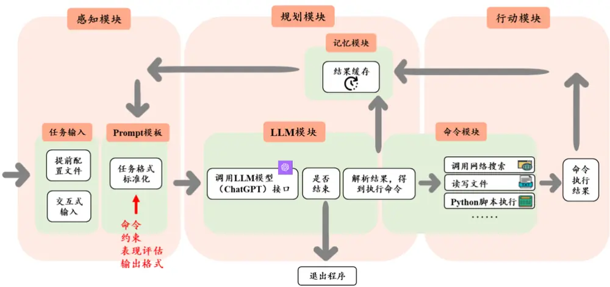
来源：GitHub，AutoGPT，国金证券研究所

从功能上来看，整个 AutoGPT 执行可以分为四个步骤：任务构建、LLM 调用与结果解析、命令执行、缓存处理四个部分。任务构建是整个项目的核心所在，包括用户的输入以及 Prompt 生成两大部分。用户可以在最初的配置文件中指定任务目标、智能体角色和可使用的工具等。之后 AutoGPT 会对用户的输入进行整合与标准化形成 Prompt 文本，这也是该项目中最具特色的部分。

目前阶段，大语言模型的回答结果对 Prompt 依赖程度依旧较高，很可能使用了某些词汇或句式可以大幅提升模型表现。因此，智能体的表现好坏与否很大程度上取决于其底层维护的 Prompt模板。AutoGPT 设计了一份较为完备的模板，主要包括命令、约束、表现评估和输出格式。我们从模板上就可以看出 AutoGPT 的整个流程是在不断地推理、行动与反思的循环中接近最终答案。

## 图表9：AutoGPT 生成 Prompt 的模板

master AutoGPT / autogpts / autogpt / autogpt / core / planning / templates.py

Code Blame 
ABILITIES = ( 
ABILITIES = ( 
'analyze code: Analyze Code, args: "code": "<full code string>", 
'execute python file: Execute Python File, args: "filename": "<filename>" 
'append_to_file: Append to file, args: "filename": "<filename>", "text": "<text>", 
'list_files: List Files in Directory, args: "directory": "<directory>"', 
'read_file: Read a file, args: "filename": "<filename>"', 
'write_to_file: Write to file, args: "filename": "<filename>", "text": "<text>"', 
'google: Google Search, args: "query": "<query>"', 
'improve_code: Get Improved Code, args: "suggestions": "<list_of_suggestions>", "code": "<full_code_string>"', 
'browse_website: Browse Website, args: "url": "<url>", "question": "<what_you_want_to_find_on_website>"', 
'write_tests: Write Tests, args: "code": "<full_code_string>", "focus": "<list_of_focus_areas>", 
'get_hyperlinks: Get hyperlinks, args: "url": "<url>"', 
'get_text_summary: Get text summary, args: "url": "<url>", "question": "<question>"', 
'task_complete: Task Complete (Shutdown), args: "reason": "<reason>"', 
) 

PLAN_PROMPT_CONSTRAINTS = ( 
"~4000 word limit for short term memory. Your short term memory is short, so " 
"immediately save important information to files.", 
"If you are unsure how you previously did something or want to recall past " 
"events, thinking about similar events will help you remember.", 
"No user assistance", 
"Exclusively use the commands listed below e.g. command_name", 
PLAN_PROMPT_RESOURCES = ( 
"Internet access for searches and information gathering.", 
"Long-term memory management.", 
"File output.", 
PLAN_PROMPT_PERFORMANCE_EVALUATIONS = ( 
"Continuously review and analyze your actions to ensure you are performing to" 
" the best of your abilities.", 
"Constructively self-criticize your big-picture behavior constantly.", 
"Reflect on past decisions and strategies to refine your approach.", 
"Every command has a cost, so be smart and efficient. Aim to complete tasks in" 
" the least number of steps.", 
"Write all code to a file", 
) 
PLAN_PROMPT_RESPONSE_DICT = { 
"thoughts": { 
"text": "thought", 
"reasoning": "reasoning", 
"plan": "- short bulleted\n- list that conveys\n- long-term plan", 
"criticism": "constructive self-criticism",
来源：GitHub，AutoGPT，国金证券研究所

1. 命令（Commands）：通俗来说就是允许智能体调用的工具，包括执行代码、浏览网页等。模板对所有工具进行命名与功能说明，便于大语言模型理解与使用。每一轮行动时需要大语言模型思考如何挑选命令来辅助完成任务。

2. 约束（Constraints）：约束主要给定一些输入信息上的限制，防止多轮对话后智能体的“记忆”超出大语言模型的输入上限。AutoGPT 通过缓存来处理此前的行动与结果，为智能体赋予“记忆”的特性，但受限于当前大语言模型的输入文本存在一定上限，智能体必须对记忆进行取舍。

3. 表现评估（Performance Evaluations）：要求 AutoGPT 在每轮回答中对自己给出的回答进行反思，持续判断思考的方向是否准确；同时要求后续求解步骤要尽可能精简，以减少资源消耗。

4. 输出格式（Response Dict）：要求大语言模型每轮回复必须包含思考与命令，其中思考的内容要有推理、计划等，并以 JSON格式输出内容。使用统一化的格式是为了方便后续调用命令时能读取到具体的参数传递，提升智能体运行的稳健性。

随后，大脑模块进行新一轮思考并输出标准化结果，同时判断是否得到最终答案；若未获得答案，行动模块将开始解析输出内容并具体执行命令；执行得到的结果则进入记忆模块，在下一轮流程开始时再导入模型。

记忆模块也是项目的一大特点，是由大语言模型向智能体迈进中不可或缺的功能。记忆性确保了思考的连续，可以将历史信息一起喂给模型，以便得到更优、更全局思考的结果，同时也可以避免重复执行而浪费计算资源。

不过，这些功能能否按预期实现都依赖于大语言模型自身的能力是否足够。AutoGPT 在实际使用中经常会陷入对某几轮思考的循环中，这实际上就是受到了大语言模型输入Token 长度的限制导致智能体难以保留长期记忆；另一个现实问题就是成本，多轮思考通常会带来较高的费用。不过这些问题在可预见的未来内都将基本获得解决。

## 2.2 多智能体的交互部署

强化学习算法与深度学习结合催生出的 RL-Based Agent 已展现出强大能力，且由于模型应用场景的固定化导致其实现多智能体的互动非常方便，例如擅长下围棋的智能体之间进行对弈等。相比之下，LLM-Based Agent 之间基于文本进行交流则更容易出现信息的丢失，这天生限制了它们从多轮反馈中学习以提高性能的潜力。不过伴随参数量的上升，大语言模型展现出强大的文本理解和生成能力，从而大大提高了交互效率。这也是当前LLM-Based Agent 的发展趋势之一。

如下图所示，基于大语言模型的多智能体交互模式可以大致分为：取长补短的合作式交互以及互利共赢的对抗式交互。在合作互动中，智能体以无序或有序的方式进行协作，以实现共同目标；在对抗式交互中，智能体以针锋相对的方式展开竞争，以提高各自的性能。

图表10：多智能体交互模式示例
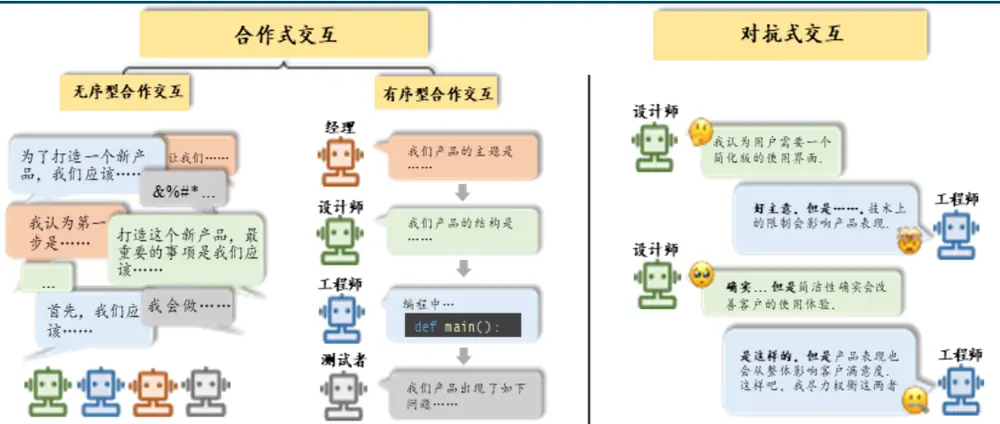
来源：《The Rise and Potential of Large Language Model Based Agents: A Survey》，国金证券研究所

具体来说，基于大语言模型的多智能体系统可以提供专业分工的优势。具备专业技能和领域知识的单个智能体可以从事特定的任务。同时，将复杂任务分解为多个子任务，可以省去在不同流程之间切换的时间。最终，多个智能体之间的高效分工可以完成比没有专业化分工时大得多的工作量，从而大大提高整个系统的效率和产出质量。

## 2.3 人与智能体的交互部署

人类能对 LLM-Based Agent 进行最有效的指导和监督，确保它们符合人类的要求和目标。人类的参与可以作为弥补数据不足的重要手段，从而促进更顺利、更安全的协作过程。因此，智能体不应该完全依赖于用预先标注的数据集训练出来的模型；相反，它们应该通过在线互动和参与来发展。实际上，目前我们使用 ChatGPT 等产品都是在进行这样的交互，这也是最自然的交互形式之一。

## 三、利用LLM-Based Agent 快速梳理产业链，捕捉投资热点

## 3.1 方法介绍

当前市场热点轮动速度不断加快，而主题投资的核心就在于对主题相关产业链的快速梳理与分析，以及进一步对相关投资标的的迅速定位。因此，产业链研究也是当前市场上关注的热点之一。如何快速了解一个完全陌生的产业或是投资热点，乃至于定位其中的投资标的？投资者们迫切需要能实现以上功能的工具。我们尝试基于大语言模型来做到这一点。

对主动投资者来说，传统的产业链梳理首先需要研究员对相关产业有较深入研究，且为了避免信息滞后需要定期跟踪与实地调研才能掌握最新情况。而使用大语言模型进行产业链的梳理可以极大程度缩减反应速度，快速给出结果，尽管梳理结果的精度方面无法达到人工的程度，但在模型初步结果之上再进行手动检查与修正同样能显著提升投资的反应速度；模型也能基于大数据给主观投资提供增量信息，可能带来新的投资视角。

对量化投资者来说，本身了解新的产业链就存在一定壁垒，也需要大量资料搜集与专业的沟通之后才能逐步梳理出产业框架。使用大语言模型来辅助梳理产业链可以简化工作，减少产业链投资中的各类成本。

实践结果显示，尽管大语言模型具备充分的产业链知识，但无法直接给出完整的产业链结构。梳理产业链是一个相对复杂的任务，通常人类专家需要在阅读大量资料、积累丰富的产业相关知识后才能实现，并且需要对产业链上每个产品的供需结构有清晰的认识。当前的大语言模型当然也无法直接实现整个产业链结构的推导，事实上，若我们单纯询问“请告诉我智能手机的上下游产业链”， 也可以给出比较完善的回答，但当面对较复杂的产业或需要给出更多产业链细节时，模型就无法处理了。不过从回答中我们可以看出，大语言模型的训练文本中确实包含了充分的产业链知识，自身是有能力去回答产业链这种专业问题的。

## 图表11：大语言模型拥有充足的产业链知识

## ChatGPT 4

## F You

请告诉我智能手机产业链的上下游信息，越详细越好

## ChatGPT

智能手机产业链的上下游信息可以分为三个主要部分：上游（原材料与组件制造)、中游(组装与生产)、下游(销售与服务)。以下是这些部分的详细介绍：

## 上游：原材料与组件制造

## 1. 原材料供应

- 硅材料：用于制造半导体芯片。

- 稀有金属：如锂、钴、稀土，用于制造电池和显示屏。

· 塑料和金属：用于机身和其他部件。

## 2. 关键组件制造

- 半导体芯片：如处理器、内存、存储芯片。主要供应商包括英特尔、高通、三星、台积电等。

- 显示屏：液晶(LCD)或有机发光二极管（OLED)。主要生产商包括三星、LG、京东方等。

- 电池：锂离子电池，主要供应商包括宁德时代、松下、三星SDI等

·摄像头模块：主要由索尼、三星等公司制造

- 其他电子组件：如连接器麦克风、扬声器、电路板等。

## 中游：组装与生产

## 1. 设计与研发

- 智能手机品牌(如苹果、三星、华为)进行产品设计和软件开发。

## 2. 组装制造

- 原始设备制造商（OEM)，如富士康、和硕，负责根据品牌公司的设计和规格进行组装

- 包括组件装配、软件安装、质量检测等环节。

## 下游：销售与服务

## 1. 分销与零售

- 通过线上平台(如亚马逊、天猫)和线下零售店进行销售。

- 运营商销售，通常提供捆绑服务和套餐。

## 2. 售后服务

- 包括维修、客户支持、软件更新等。

- 由品牌公司或授权的第三方服务提供商提供

## 3. 回收与再利用

- 用于处理废旧手机和回收可再利用的材料，如电池和金属部件

智能手机产业链涉及众多公司和技术，每一环节都对产品的质量、性能及成本有重要影响。从原材料的采集和加工到最终产品的销售和服务，每个阶段都需要精密的协调和管理。

来源：OpenAI，国金证券研究所

这需要我们将任务拆解到大语言模型能够直接完成的细分任务上去。我们首先明确：产业链中每一层级之间通过产品进行连接，上下游关系通过产品的供需关系得以建立。因此，整条产业链可以拆解到对其中每个产品的上下游分析中去。我们以智能手机为例，它的“直接组成产品”包括显示屏、锂电池、处理器、存储等，这些也就是手机的“上游”产品；对其中显示屏分析其直接组成产品，可以找出液晶面板、触控模块、二极管面板等上游……循此向上，我们最终可以找到一部分产品满足“末端条件”：产品本身为原材料、或从整个产业链来看没有继续拆分必要的产品。比如对锂电池我们最终会追溯到镍、钴等正极原材料，但对显示屏来说到液晶材料、玻璃基板等就已经足够详细了。以上方法需要我们首先给定一个核心产品，然后向上游或下游对每个节点逐步追索，直到触及末端，最终给出完整的产业链结构。这正是本次研究的核心框架。

图表12：手机产业链推导示意图
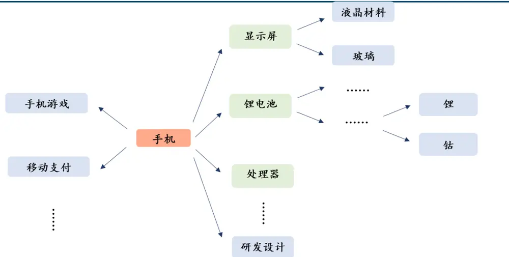
来源：国金证券研究所

大语言模型自身具备逻辑推理能力以及一定的产业链知识，非常适合用于处理这类非结构化的信息。同时，产业链结构相对稳定，因此大语言模型用历史信息也可以梳理出产业链结构。因此，我们希望构造一个以大语言模型为核心的智能体“产业链 Agent”来自动化地完成产业链梳理任务。

## 3.2 产业链梳理智能体的构建

智能体的交互核心在于行动模块，我们首先需要明确“产业链 Agent”应当能够实现哪些功能。除了上文提到的直接组成产品分析和是否触及末端外，一个完整的产业链分析结果还需要能体现各个产品在其中的重要程度，这同样是一个较为复杂的问题。这里我们简单以成本占比作为排序标准，让大语言模型根据其掌握的知识进行重要度的判断。

因此我们对框架进行细化，每次向上游分析出原产品的直接组成产品有哪些之后，要进一步判断：1、各组成产品的重要性；2、各组成产品是否为末端产品。类似地，向下游探索时也需要首先找到对原产品依赖度高的下游产成品或服务，再判断各自的重要性以及是否末端。以上两个任务我们同样基于大语言模型来完成。

最后的行动模块中，我们为产业链 Agent 增添了数据写入以及新闻检索的工具。数据写入是最为基本的功能，需要实时保存对话记录以及梳理后的产业链信息；新闻检索则是对模型专业知识的巨大拓展，我们留到后文进行说明。

完整的产业链梳理框架如下所示：

图表13：产业链 Agent 运行流程示意图
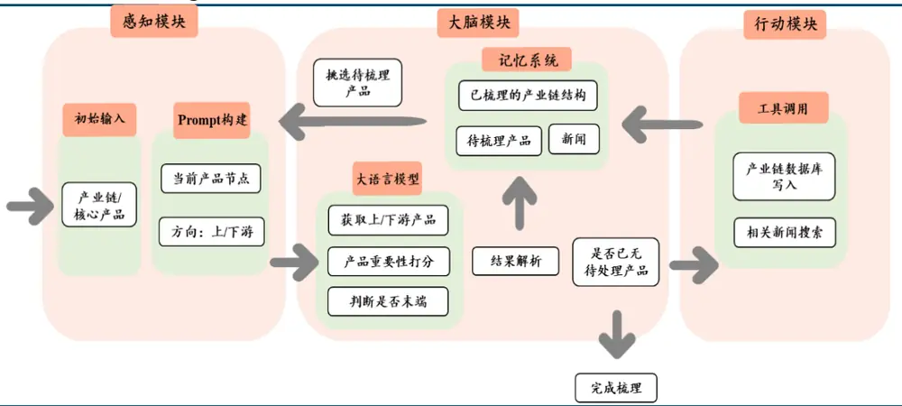
来源：国金证券研究所

其中，调用大语言模型的部分依旧需要我们维护一个完善的 Prompt 模板，来获取上下游产品信息以及对应的重要性等。我们调用 GPT4模型来进行初步实验，得到如下回复：

## 图表14：大语言模型产业链梳理结果展示

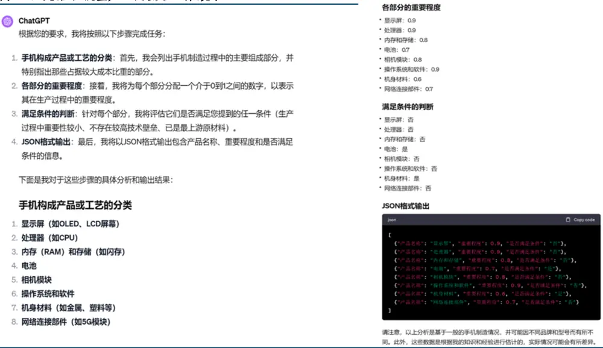
来源：OpenAI，国金证券研究所

我们可以与 Wind上现成的“智能手机产业链”进行对比，发现产业链 Agent梳理出来的产业链结构与 Wind结果基本保持一致；Wind结果中的 PCB等产品位于处理器、内存的更上游，也将出现在产业链 Agent 最终完整的梳理结果中。我们认为产业链 Agent 具有正确梳理产业链结果的能力，并能最终导出网状结构的产业链图谱。

图表15：Wind智能手机产业链梳理结果展示
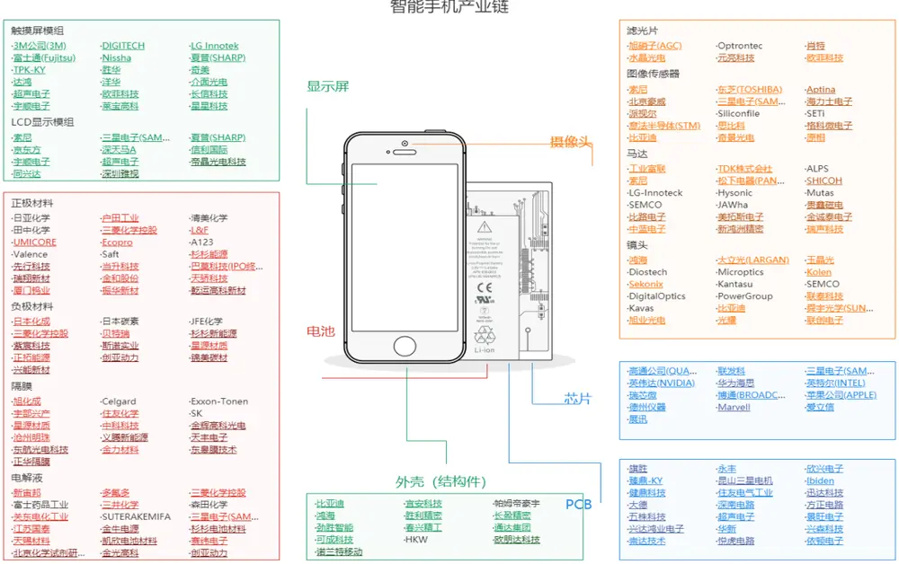
来源：Wind，国金证券研究所

## 3.3 基于新闻数据进行产业链知识的拓展

针对手机这样较为常见的产品，我们在分析产业时更想观察到它在不同时间节点上的动态变化；而对一些相关信息较少的产品，模型可能掌握的相关知识较少，无法基于自有知识给出答案。

为了解决这些问题，我们给出了基于检索增强生成（RAG）的解决方案，为产业链Agent 配置了新闻检索的工具。检索增强生成包含检索与生成两个步骤，其中检索步骤就是基于自然语言模型，在外部提供的知识库或数据库中寻找与所需回答问题相关性最高的文档；生成步骤就是将用户问题与检索得到的信息结合后，放入大语言模型生成回复。

我们首先需要对新闻数据进行 Embedding 转换成向量格式，以便快速计算文本相似性，此处 Embedding 我们选择“text2vec-large-chinese”模型。Langchain 等其他 Agent 项目都采用 FAISS 向量数据库来实现 RAG 中的检索步骤，这是一个高效的相似性搜索和聚类的库，能够快速处理大规模数据，并在高维空间中进行相似性搜索。相似性搜索会计算两个向量之间的“文本距离”，距离越小代表相似性越高，也就越有可能为模型提供专业知识方面的补充。

我们以智能手机的显示屏为例，新闻时间区间为 2023 年 3 月至 10 月，筛选出与该产品相关性最高的新闻文本。以下新闻数据均来源于数库。

图表16：智能手机-显示屏高相关新闻示例

| 新闻文本 | 文本距离 |
| --- | --- |
| 液晶显示屏及模组产品可应用于智能家居、可视对讲产品，各种需要屏控的家电及电器产品（冰箱、洗衣机、温控 器、智能机器人、音响设备等）以及需要屏幕的车载、工控等领域的相关产品。发行人根据产品功能及应用领域不 同细分产品类别，与同行业公司主要产品划分基本相同，但是由于各家公司细分业务不同，产品分类略有不同。 | 350.30084 |
| 公司现已拥有丰富的显示芯片产品系列，主要包括面板显示驱动芯片、电源管理芯片、LED显示驱动芯片、控制芯片 等，覆盖LCD、LED、OLED等主流显示技术，广泛应用于智能手机、电视机、笔记本电脑、平板电脑、显示器、可穿 戴设备及各类户内外LED显示屏，能够满足客户的多样化显示需求。 | 359.53342 |
| 智能手机、平板电脑、超大屏电视、头显设备……显示屏正在集成更多功能，衍生出更多形态，应用到更多场景。 在众多新型显示技术中，牢牢占据主流地位的LCD和稳步上升的OLED均已成为行业的“中流砥柱”，但面向显示无 处不在的未来世界，唯有创新应用，才能在激烈的竞争中充分释放各自的价值，撬动更大的市场。作为信息交互的 第一触点和重要端口，新型显示行业的重要地位不言而喻，而在人工智能、大数据、5G等新兴科技的加持下，人类 已经迈进万物互联的新时代，显示开始“无处不在”。从一块小小的智能手表，到手机和平板等智能设备，再到电视 甚至户外商用大屏，处处离不开显示屏 | 368.74445 |
| 和辉光电：多款手机用AMOLED半导体显示面板供货华为、传音控股、联想等品牌主力机型。和辉光电近日接受机构 调研时表示，在智能手机领域，得益于第6代AMOLED生产线硬屏位居全球第二的产能优势，公司开发多款手机用 AMOLED半导体显示面板，供货华为、传音控股、联想等品牌的主力机型，手机品牌客户供应能力快速提升。 | 371.05957 |

来源：数库，国金证券研究所

从新闻文本中我们可以看出，液晶显示屏、显示芯片、OLED 等与显示屏相关度较高的新闻都被筛选了出来，其中包含的市场现状、专业知识等将为大语言模型的回答带来增量信息。将筛选之后的新闻放入 Prompt 中，并告知大语言模型将自有知识与补充新闻进行综合之后给出回答。

叠加新闻数据后，使用 ChatGPT-3.5 模型进行产业链梳理同样能获得较高质量的回答，基于性价比的考虑我们最终使用 ChatGPT3.5进行挂载新闻的测试，测试的对象为智能手机的显示屏。

我们对比一下情况：未叠加新闻数据、叠加 2023年 3月到 6月新闻、以及叠加 2023年 3月到 10月新闻的回答结果。

图表17：智能手机-显示屏上游（GPT3.5未叠加新闻）

| 序号 | 产品名称 | 具体作用 | 成本比例 | 是否末端 |
| --- | --- | --- | --- | --- |
| 0 | 液晶面板 | 显示图像 | 0.4 | 是 |
| 1 | OLED 面板 | 显示图像 | 0.3 | 是 |
| 2 | 背光模组 | 提供背光 | 0.15 | 否 |
| 3 | 触摸屏 | 实现触摸功能 | 0.1 | 否 |
| 4 | 驱动IC | 控制显示屏驱动 | 0.05 | 否 |

来源：OpenAI，国金证券研究所

图表18：智能手机-显示屏上游（GPT3.5+202303-202306新闻）

| 序号 | 产品名称 | 具体作用 | 成本比例 | 是否末端 |
| --- | --- | --- | --- | --- |
| 0 | 液晶显示屏 | 显示屏幕 | 0.4 | 是 |
| 1 | 模组产品 | 整合显示相关电路 | 0.3 | 是 |
| 2 | 面板显示驱动芯片 | 控制显示面板 | 0.15 | 否 |
| 3 | 电源管理芯片 | 管理显示屏电源 | 0.1 | 否 |
| 4 | LED 显示驱动芯片 | 控制 LED 显示 | 0.05 | 否 |

来源：OpenAI，数库，国金证券研究所

图表19：智能手机-显示屏上游（GPT3.5+202303-202310新闻）

| 序号 | 产品名称 | 具体作用 | 成本比例 | 是否末端 |
| --- | --- | --- | --- | --- |
| 0 | 面板显示驱动芯片 | 用于控制显示屏的工作和功能 | 0.15 | 否 |
| 1 | LED 显示驱动芯片 | 用于控制显示屏的 LED 背光 | 0.1 | 否 |
| 2 | 控制芯片 | 用于控制显示屏的各项功能和接口 | 0.1 | 否 |
| 3 | TFT-LCD 显示面板 | 用于实现图像的显示 | 0.25 | 是 |
| 4 | AMOLED 半导体显示面板 | 用于实现图像的显示 | 0.1 | 是 |

来源：OpenAI，数库，国金证券研究所

可以看出，叠加新闻后的产业链 Agent 能给出更加细致的答案。例如在叠加新闻之前，它只能大致知道图像显示分为液晶面板和 OLED 面板；叠加全时间段新闻后，产业链Agent 可以清楚知道当前主流采用的液晶技术为 TFT-LCD，而自发光显示方面目前主流采用 AMOLED技术。

同样我们可以看出伴随新的新闻数据加入数据库后，产业链 Agent 梳理出来的结构也会出现变化，挂载的新闻数据范围更大，产业链 Agent 得到的产业链结构也更加具体。当然，出现这样明显变化的原因可能在于我们提供的新闻数据范围依然较短，这导致梳理出来的产业链结构易于改变，但同时也证明产业链 Agent 挂载新闻数据之后，可以梳理出随时间变化的动态产业链结构。

## 3.4 产业链梳理细化——相关投资标的推荐

在实际投资中，投资者们梳理产业链的根本目的是获取相关的投资标的，这也是我们梳理产业链后进一步想实现的功能。而在挂载新闻数据后，这一目标同样可以通过新闻检索与文本识别来实现。

在底层新闻数据中，部分文本本身来源于个股的公告数据，或是会在新闻开头或其他标准化格式中标识出对应个股名称或代码。在检索出相关度较高的新闻文本后，我们再进行实体识别便可获取标的名称。另一方面，数库也基于 模型寻找出与新闻较为相关的上市公司信息，在检索出新闻数据的同时便可查询到对应投资标的。

我们依旧以“智能手机-显示屏”这一产品为例，给出该产品及其完整上游的相关投资标的梳理情况，淡蓝色标签表示产品，深蓝色为投资标的及其代码。需要注意的是，当前我们仅使用产业链上的产品信息筛选股票，若需要个股同时属于某产业概念或有其他筛选条件，则需要在所有新闻文本中重新检索并提取标的信息。

图表20：智能手机-显示屏上游投资标的推荐案例
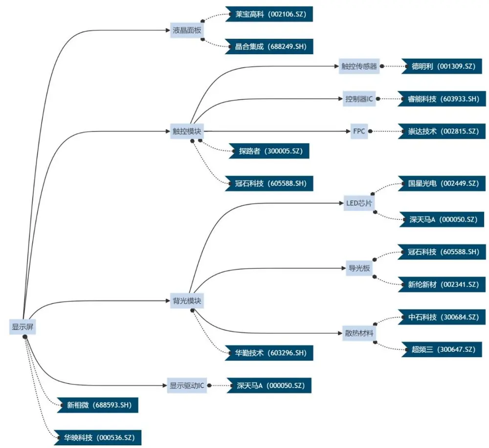
来源：OpenAI，数库，国金证券研究所

## 3.5 如何针对投资主题梳理其产业链信息？

最后，我们在范围更大的投资主题或投资概念下应用产业链梳理方法。多数时候，投资者更关注的是整个投资主题而非其中某个产品。投资主题形式多样化，可以是某个公司、产品、地区，甚至没有对应的实体而仅仅是一种技术或概念，例如华为供应链、AR/VR、新能源汽车等等。

我们利用业务的联接作为切入，来处理相同主题下的不同产业链。此处，我们梳理的投资主题需要具有特定的业务作为核心，因此可能无法应用于一些联系处于业务以外的概念，例如“中特估”等。如何确立主题相关业务同样是较复杂，传统的做法是依赖行业分析师的经验来确定哪些业务与该主题相关，并进一步匹配相关标的。这种方法结果准确，但需要消耗大量的精力和时间，不利于在主题行情启动时迅速跟进。为此，我们在梳理产业链的基础上为产业链 Agent增加了拆解投资主题的功能。

以“华为供应链”为例，我们给出 GPT4的回答结果：

## 图表21：投资主题拆解结果展示

## ChatGPT

华为的供应链非常广泛，涵盖了多个产业链。以下是对这些产业链及其终端产品或服务的分析：

1. 通信设备产业链：这是华为的核心产业链，包括但不限于基站设备、网络设备、通信芯片等。华为在这个领域内的技术领先，是其供应链的重要组成部分。

2. 智能手机产业链：华为是全球领先的智能手机制造商之一。这个产业链涉及智能手机的设计、制造、营销等方面。终端产品包括不同系列的智能手机。

3.企业网络解决方案产业链：华为提供企业级网络设备和解决方案，如路由器、交换机、云计算服务等。这些产品和服务旨在支持企业的网络建设和运维。

4. 消费者电子产业链：除了智能手机外，华为还生产诸如笔记本电脑、平板电脑、智能手表、耳机等消费电子产品。

5. 软件和服务产业链：华为还提供包括操作系统、移动应用、云服务等在内的软件和服务。

挑选出的最重要终端产品或服务及其理由如下：

- 智能手机：作为消费者最直接接触的产品，华为的智能手机对品牌影响巨大，是公司收入的重要来源。

- 5G基站设备：5G技术是通信行业的未来趋势，华为在这方面的技术领先，是其核心竞争力之一。

- 云服务：随着数据和计算需求的增长，云服务成为企业必不可少的部分，华为在这一领域有显著的发展。

这些产品和服务代表了华为在其核心业务领域的领先地位，并对其整体业务战略有重大影响。

来源：OpenAI，国金证券研究所

从回答中可以看出，大语言模型首先将“华为供应链”投射到业务层面上，找出与概念相关性较高的数个业务板块，再由业务去寻找相关度较高的终端产品或服务。有了具体的产品，我们可以很方便地调用产业链 Agent 来进行梳理，最终将各个产品的产业链进行汇总，得到“华为供应链”概念的上下游信息。

## 四、产业链梳理案例展示——以“华为供应链”主题为例

## 4.1 投资主题梳理结果展示

我们以“华为供应链”为例，梳理这一投资主题的上下游结构。前文产业链 Agent 已总结出与该投资主题关联最强的三个产品为：智能手机、5G 基站设备、云服务。在此基础上我们分别梳理各自的产业链信息，并进行汇总。

我们首先使用 GPT4 为内核的产业链 Agent 对“华为供应链”投资主题进行梳理。结果如下：

图表22：“华为供应链”梳理（GPT4）
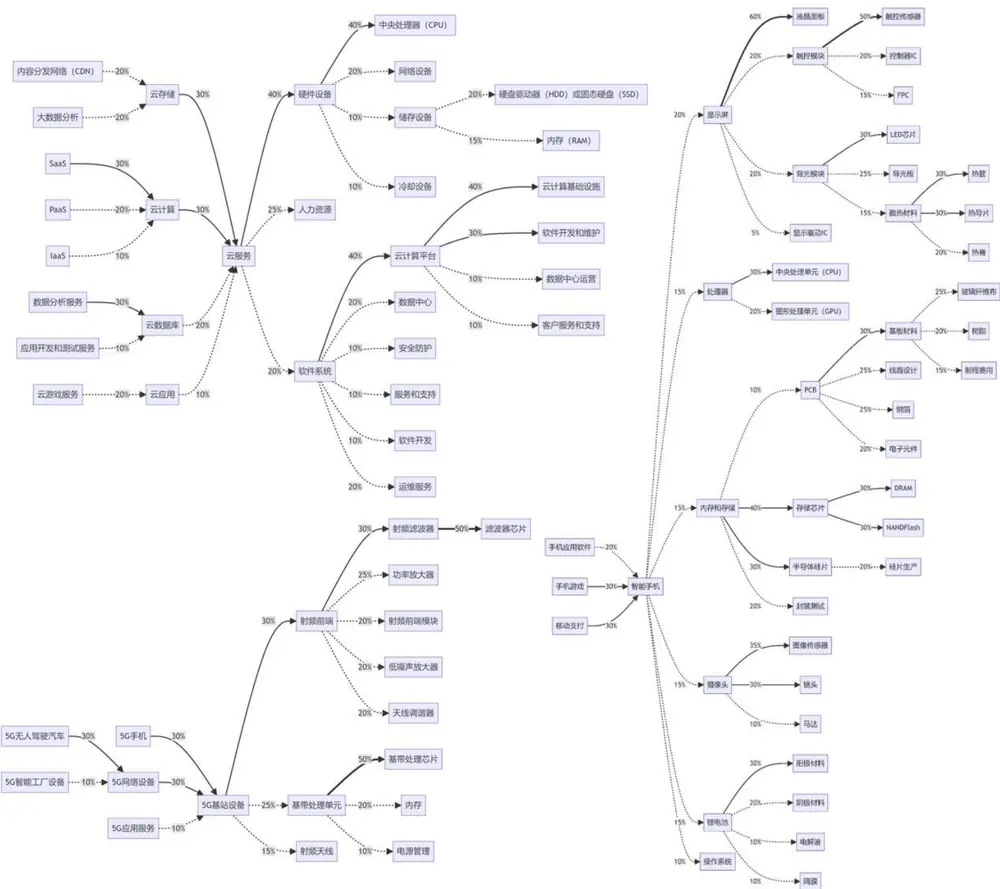
来源：OpenAI，国金证券研究所

从结果上来看，智能手机梳理出的上游节点非常多，相比之下 5G 基站设备的梳理结果偏少。我们认为原因在于智能手机相关信息在整个互联网上更易得，因此 GPT4 的训练集中必然包含了较多的智能手机知识；而 5G 基站设备本身专业程度更高，网络相关讨论量也更少，这导致 GPT4对这部分的掌握较少。

随后，我们使用 GPT3.5作为内核，同时给 Agent提供新闻检索的能力来增强生成结果。

图表23：“华为供应链”梳理（GPT3.5+新闻）
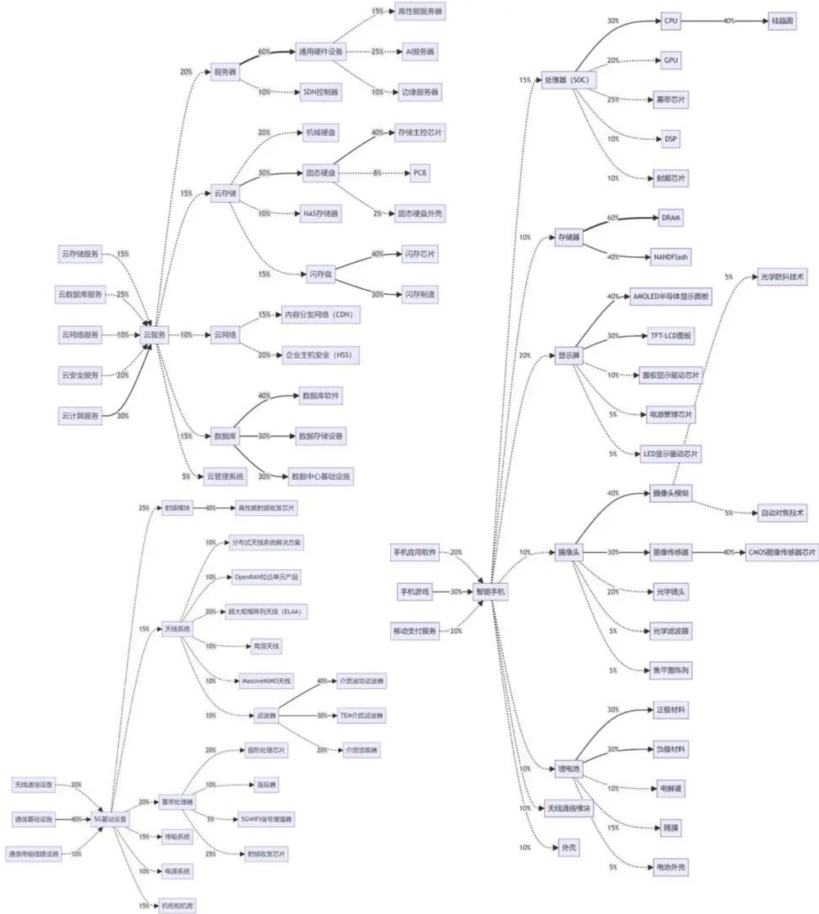
来源：OpenAI，数库，国金证券研究所

可以看出，5G 基站设备与云服务的上下游节点明显更加细节，同时也做出了一些结构上的调整。譬如基于 GPT4 的智能体先将云服务拆解成硬件、软件等大类，再做上游划分，结构冗余且实际上并不合理；而叠加新闻数据的 GPT3.5模型在划分上游时，其分类依据更加贴近于业务或功能，同时也能给出的节点产品更加细节化。整体来看，叠加新闻数据能对智能体的回答效果带来明显增益。

不过，基于 GPT3.5模型构建的智能体可能在末端节点判断与重要性判断上效果不佳，可能需要人工对末端判断等进行干预。条件允许也可以在 GPT3.5模型给出节点信息后，再调用 GPT4进行补充，实现类似多智能体协同的部署环境。

## 4.2 投资标的梳理结果展示

最后，我们给出产业链 Agent 检索得到的个股推荐结果。在筛选过程中，我们仅保留每只个股及其同时出现次数最多的产品节点，同时剔除掉了部分末端节点对应的个股。最终保留板块股数量在 72只。

图表24：“华为供应链”投资标的梳理结果

| 个股代码 | 股票简称 | 相关产品节点 | 产业链 | 个股代码 | 股票简称 | 相关产品节点 | 产业链 |
| --- | --- | --- | --- | --- | --- | --- | --- |
| 300603.SZ | 立昂技术 | 电源管理 | 5G 基站设备 | 002384.SZ | 东山精密 | PCB | 智能手机 |
| 002179.SZ | 中航光电 | 功率放大器 | 5G 基站设备 | 002463.SZ | 沪电股份 | PCB | 智能手机 |
| 003021.SZ | 兆威机电 | 基带处理芯片 | 5G 基站设备 | 002916.SZ | 深南电路 | PCB | 智能手机 |
| 002184.SZ | 海得控制 | 内存 | 5G 基站设备 | 002938.SZ | 鹏鼎控股 | PCB | 智能手机 |
| 002194.SZ | 武汉凡谷 | 射频滤波器 | 5G 基站设备 | 300456.SZ | 赛微电子 | 半导体硅片 | 智能手机 |
| 002138.SZ | 顺络电子 | 射频前端 | 5G 基站设备 | 300691.SZ | 联合光电 | 背光模块 | 智能手机 |
| 300134.SZ | 大富科技 | 射频前端 | 5G 基站设备 | 603773.SH | 沃格光电 | 背光模块 | 智能手机 |
| 001255.SZ | 博菲电气 | 射频前端模块 | 5G 基站设备 | 300598.SZ | 诚迈科技 | 操作系统 | 智能手机 |
| 600760.SH | 中航沈飞 | 射频前端模块 | 5G 基站设备 | 300496.SZ | 中科创达 | 处理器 | 智能手机 |
| 002975.SZ | 博杰股份 | 射频天线 | 5G 基站设备 | 002241.SZ | 歌尔股份 | 触控模块 | 智能手机 |
| 300322.SZ | 硕贝德 | 射频天线 | 5G 基站设备 | 603160.SH | 汇顶科技 | 触控模块 | 智能手机 |
| 000063.SZ | 中兴通讯 | 天线调谐器 | 5G 基站设备 | 688110.SH | 东芯股份 | 存储芯片 | 智能手机 |
| 002635.SZ | 安洁科技 | 天线调谐器 | 5G 基站设备 | 300183.SZ | 东软载波 | 电解液 | 智能手机 |
| 002792.SZ | 通宇通讯 | 天线调谐器 | 5G 基站设备 | 300543.SZ | 朗科智能 | 电解液 | 智能手机 |
| 002881.SZ | 美格智能 | 天线调谐器 | 5G 基站设备 | 002185.SZ | 华天科技 | 封装测试 | 智能手机 |
| 002229.SZ | 鸿博股份 | 安全防护 | 云服务 | 603005.SH | 晶方科技 | 封装测试 | 智能手机 |
| 002261.SZ | 拓维信息 | 安全防护 | 云服务 | 300397.SZ | 天和防务 | 隔膜 | 智能手机 |
| 300379.SZ | 东方通 | 安全防护 | 云服务 | 688020.SH | 方邦股份 | 隔膜 | 智能手机 |
| 688171.SH | 纬德信息 | 安全防护 | 云服务 | 002158.SZ | 汉钟精机 | 镜头 | 智能手机 |
| 300302.SZ | 同有科技 | 储存设备 | 云服务 | 002456.SZ | 欧菲光 | 镜头 | 智能手机 |
| 000034.SZ | 神州数码 | 冷却设备 | 云服务 | 000049.SZ | 德赛电池 | 锂电池 | 智能手机 |
| 301128.SZ | 强瑞技术 | 冷却设备 | 云服务 | 300340.SZ | 科恒股份 | 锂电池 | 智能手机 |
| 600498.SH | 烽火通信 | 冷却设备 | 云服务 | 300400.SZ | 劲拓股份 | 马达 | 智能手机 |
| 603912.SH | 佳力图 | 冷却设备 | 云服务 | 688123.SH | 聚辰股份 | 马达 | 智能手机 |
| 002123.SZ | 梦网科技 | 软件开发 | 云服务 | 000021.SZ | 深科技 | 内存和存储 | 智能手机 |
| 002334.SZ | 英威腾 | 数据中心 | 云服务 | 603501.SH | 韦尔股份 | 图像传感器 | 智能手机 |
| 000977.SZ | 浪潮信息 | 硬件设备 | 云服务 | 002771.SZ | 真视通 | 显示屏 | 智能手机 |
| 601138.SH | 工业富联 | 硬件设备 | 云服务 | 000050.SZ | 深天马 A | 显示驱动IC | 智能手机 |
| 002197.SZ | 证通电子 | 云计算 | 云服务 | 002387.SZ | 维信诺 | 阳极材料 | 智能手机 |
| 002212.SZ | 天融信 | 云计算 | 云服务 | 002428.SZ | 云南锗业 | 阳极材料 | 智能手机 |
| 000158.SZ | 常山北明 | 运维服务 | 云服务 | 000536.SZ | 华映科技 | 液晶面板 | 智能手机 |
| 002929.SZ | 润建股份 | 运维服务 | 云服务 | 605588.SH | 冠石科技 | 液晶面板 | 智能手机 |
| 688047.SH | 龙芯中科 | 中央处理器（CPU） | 云服务 | 300180.SZ | 华峰超纤 | 移动支付 | 智能手机 |
| 000810.SZ | 创维数字 | 智能手机 | 智能手机 | 000725.SZ | 京东方A | 阴极材料 | 智能手机 |
| 002855.SZ 600203.SH | 捷荣技术 福日电子 | 智能手机 智能手机 | 智能手机 智能手机 | 002156.SZ 300223.SZ | 通富微电 北京君正 | 中央处理单元（CPU） 中央处理单元（CPU） | 智能手机 智能手机 |

来源：OpenAI，数库，国金证券研究所

我们与万得整理的“万得华为平台概念指数”的成份股进行对比，该指数成份股主要包括华为各战略业务领域的合作商以及华为直接或间接投资的公司，成份股数量为 205 只。我们筛选出的“华为供应链”投资标的中，约有 的个股出现在华为平台概念的成份股中，已与人工筛选得到的结果有较高相似度。偏差部分可能在于我们仅挂载了有限时间范围的新闻进行筛选，补充的知识质量有限；若对关联度有更高的要求，可以在检索新闻的范围上再筛选关键词“华为”出现的文本，以及选取文本相关性更高的文本等方法实现。

## 五、总结

本文主要介绍了智能体（Agent）的概念，并以此为切入点详细介绍当前主流 LLM-based的运行逻辑框架。我们参考已有框架，将智能体技术应用于金融投资领域，搭建了专门用于产业链梳理的“产业链 Agent”，并通过 RAG 方法挂载新闻数据扩充了智能体的专业知识，能够输出更加精确的产业链节点；更进一步，我们提供了使用“产业链Agent”推荐具体投资标的以及梳理投资主题的解决方案。最终，我们以“华为供应链”为对象，进行投资主题梳理以及投资标的推荐的展示。

使用大语言模型来实现这样的功能，一方面是为了能更好利用大数据优势，从量化视角给出产业链的归纳结果，以期能够为主观投资带来增量信息；另一方面，在面对全新的投资主题或产业结构出现变化时，模型能够更快地给出回答，帮助投资者们及时做出反应。

当然从示例结果上来看，产业链梳理以及个股推荐的等功能虽然已有雏形，但仍可能存在一定问题：

1、产业链结果不稳定。大语言模型天然带有随机性，尽管我们已通过参数设置将模型随机性降到最低，依旧无法避免多次回答结果不同。这在梳理层数较多时会更为明显。当然，不同人类专家梳理的产业链也会存在一定差别，能保持大致框架正确。

2、结构可能存在冗余。GPT 有时不会从业务或供需角度出发梳理上下游，会反复给出例如“软件设备”、“硬件设施”、“人力资源”等较笼统的节点，容易导致结构冗杂，也可能出现反复。叠加新闻数据提升模型对业务的理解程度可以一定程度缓解这一问题。

3、叠加新闻效果不稳定。在对比是否叠加新闻的结果时，我们发现模型可能过度依赖于检索到的新闻内容，最终结果退化成对新闻的归纳整理，这要求我们提供高质量的挂载数据。另一种应对方案是，我们通过主观判断给出大致的产业链“骨架”，再由大语言模型检索新闻来丰富其“血肉”，这也是后续可能进一步探索的方向。

整体来说，本篇在产业链梳理主题上对 Agent 技术做了充分的尝试，不过与应用实际落地之间仍有一定差距。当前大语言模型及其相关技术依旧在快速发展中，伴随能力更强大的模型登场，在可预见的未来智能体将真正为金融投资领域带来新的视野。

## 风险提示

1、大语言模型输出结果具有一定随机性的风险；

2、模型迭代升级、新功能开发可能会导致结论不同的风险；

3、人工智能模型得出的结论仅供参考，可能出现错误答案的风险。

## 特别声明：

国金证券股份有限公司经中国证券监督管理委员会批准，已具备证券投资咨询业务资格。

形式的复制、转发、转载、引用、修改、仿制、刊发，或以任何侵犯本公司版权的其他方式使用。经过书面授权的引用、刊发，需注明出处为“国金证券股份有限公司”，且不得对本报告进行任何有悖原意的删节和修改。

本报告的产生基于国金证券及其研究人员认为可信的公开资料或实地调研资料，但国金证券及其研究人员对这些信息的准确性和完整性不作任何保证。本报告反映撰写研究人员的不同设想、见解及分析方法，故本报告所载观点可能与其他类似研究报告的观点及市场实际情况不一致，国金证券不对使用本报告所包含的材料产生的任何直接或间接损失或与此有关的其他任何损失承担任何责任。且本报告中的资料、意见、预测均反映报告初次公开发布时的判断，在不作事先通知的情况下，可能会随时调整，亦可因使用不同假设和标准、采用不同观点和分析方法而与国金证券其它业务部门、单位或附属机构在制作类似的其他材料时所给出的意见不同或者相反。

本报告仅为参考之用，在任何地区均不应被视为买卖任何证券、金融工具的要约或要约邀请。本报告提及的任何证券或金融工具均可能含有重大的风险，可能不易变卖以及不适合所有投资者。本报告所提及的证券或金融工具的价格、价值及收益可能会受汇率影响而波动。过往的业绩并不能代表未来的表现。

客户应当考虑到国金证券存在可能影响本报告客观性的利益冲突，而不应视本报告为作出投资决策的唯一因素。证券研究报告是用于服务具备专业知识的投资者和投资顾问的专业产品，使用时必须经专业人士进行解读。国金证券建议获取报告人员应考虑本报告的任何意见或建议是否符合其特定状况，以及（若有必要）咨询独立投资顾问。报告本身、报告中的信息或所表达意见也不构成投资、法律、会计或税务的最终操作建议，国金证券不就报告中的内容对最终操作建议做出任何担保，在任何时候均不构成对任何人的个人推荐。

在法律允许的情况下，国金证券的关联机构可能会持有报告中涉及的公司所发行的证券并进行交易，并可能为这些公司正在提供或争取提供多种金融服务。

本报告并非意图发送、发布给在当地法律或监管规则下不允许向其发送、发布该研究报告的人员。国金证券并不因收件人收到本报告而视其为国金证券的客户。本报告对于收件人而言属高度机密，只有符合条件的收件人才能使用。根据《证券期货投资者适当性管理办法》，本报告仅供国金证券股份有限公司客户中风险评级高于 C3 级(含 C3 级）的投资者使用；本报告所包含的观点及建议并未考虑个别客户的特殊状况、目标或需要，不应被视为对特定客户关于特定证券或金融工具的建议或策略。对于本报告中提及的任何证券或金融工具，本报告的收件人须保持自身的独立判断。使用国金证券研究报告进行投资，遭受任何损失，国金证券不承担相关法律责任。

若国金证券以外的任何机构或个人发送本报告，则由该机构或个人为此发送行为承担全部责任。本报告不构成国金证券向发送本报告机构或个人的收件人提供投资建议，国金证券不为此承担任何责任。

此报告仅限于中国境内使用。国金证券版权所有，保留一切权利。

上海

电话：021-80234211

邮箱：researchsh@gjzq.com.cn

北京

地址：上海浦东新区芳甸路 1088 号紫竹国际大厦 5 楼

深圳

电话：010-85950438

电话：0755-83831378

邮编：201204

邮箱：researchbj@gjzq.com.cn

邮编：100005

传真：0755-83830558

地址：北京市东城区建内大街 26 号新闻大厦 8 层南侧

邮箱：researchsz@gjzq.com.cn

邮编：518000

地址：深圳市福田区金田路 2028 号皇岗商务中心18 楼 1806

【小程序】国金证券研究服务

【公众号】国金证券研究