# Beta猎手系列之八

金融工程专题报告

证券研究报告

金融工程组

分析师：高智威（执业

联系人：许坤圣

S1130522110003)

xukunsheng@gjzq.com.cn

gaozhiw@gjzq.com.cn

## 基于偏股型转债的择时与择券构建固收+策略

## 偏股型转债择时择券研究背景

在固收+的产品中，纯债部分已经为产品提供了低波稳健的收益，所以需要找寻在有收益弹性之余仍然有较好回撤控制能力的标的来为固收+产品提供收益“+”的部分。在2022年之前，双低类的转债(转债价格低并且转股溢价率低)能够提供到这样的特性。但是随着这些年大量资金涌入转债市场而转债数量的增加速率无法匹配，使得市场上转债平均价格和溢价上抬明显，双低策略的收益下滑明显。我们急需有其他具有弹性的资产补充到固收+的配置模块中来。而偏股型转债在拥有债底的同时，能为投资者提供在三类转债中更高的收益弹性。一定程度上，其是较好为产品提供增厚收益的选项。但是偏股型转债也有在转债标的范围内回撤较大的问题。所以为了相对稳健的获取偏股型转债收益，本文通过探究偏股型转债择时策略的方式降低持有偏股型转债的回调风险。另外我们也通过优选转债的方式尝试获取较偏股型转债券池整体更高的收益。

## 国金金工偏股型转债指数构建

本文构建的国金金工偏股型转债指数，选取了在上交所和深交所上市的所有月末债券余额不低于3000万元且平底溢价率大于20%的可转债。另外指数根据成份券的债券余额进行加权处理，每月末进行对成份券的调整。在2018年之前转债市场扩容之前，偏股型转债数量较少。较少的转债数量会导致构建的指数走势波动较大，而且会导致后续分组择券难度较大且没有较好的筛选效果。为了解决成份券较少的问题，所以我们将国金金工偏股型转债指数的构建基日定于后续成份券开始逐步增多的2017年12月31日。

## 国金金工偏股型转债指数择时以及择券策略

本文选取偏股型转债的价格中位数、价格偏度和纯债溢价率指标基于结合市场趋势判断的区间震荡择时框架构建偏股型转债择时策略。基于三个指标择时信号合成的优选择时策略，在年化收益率(8.52%)较国金金工偏股型转债指数(6.20%)有所提升的同时，波动率和最大回撤都能有明显降低。夏普比率也从指数的0.35提升至0.55。

我们基于转债和正股基本面和量价类因子合成的偏股型转债精选因子构建偏股型转债择券策略。虽然我们在因子分析阶段观察到偏股型转债精选因子单调性良好且多空净值曲线平稳，但是因子换手率较高，导致在加入千分之二手续费多头策略回测中收益有所下滑。所以我们加入换手率缓冲的调整方式降低调仓成本，在40%的换手率缓冲下，改进后的策略换手率大幅降低，择券策略超额净值稳步上升。策略的年化收益率为20.76%，夏普比率为1.01。

## 偏股型转债择时择券增强的固收+策略

在本文测试当中，我们将中长期纯债型指数作为固收产品的代表。偏股型转债择时增强的固收+策略构建为固定配置80%仓位在中长期纯债型指数上：另外我们将20%的仓位配置在偏股型转债优选择时策略中。当优选择时策略信号发出看多信号时，20%仓位持有国金金工偏股型转债指数；若策略发出空仓信号，则当期这20%仓位也配置回中长期纯债型指数。偏股型转债择时增强固收策略虽然夏普比率低于中长期纯债型指数，但是在最大回撤仅小幅变大的情况下，增厚了固收产品2.94%的年化收益率，收益率提升明显。

偏股型转债择时择券增强的固收+策略也与择时增强类似，仅将20%仓位的配置标的从国金金工偏股型转债指数切换成偏股型转债择券策略。相较纯债偏股型转债择时策略，纯债偏股转债择券择时策略在小幅放大年化波动率(3.33%)和最大回撤(-2.81%)的情况下，年化收益率提升明显6.76%，使得策略夏普比率提升至1.61。整体来说，叠加了择时和择券的偏股型转债增强方案是比较好的固收产品收益增强方案。

## 风险提示

以上结果通过历史数据统计、建模和测算完成，在市场环境、交易成本或其它条件改变发生变化时，可能导致策略收益下降甚至出现亏损和模型失效的风险。

## 一、偏股型转债择时择券研究背景

可转债除了有普通债券通过还本付息来实现的纯债价值(债性)以外，还有转换为股票的权利，从而使得可转债的价值与其正股的价格也是正相关的。这为可转债额外可进攻的股性。由于进可攻退可守的特性，转债一直以来都受固收+产品的青睐。

从2015年规模触底之后，近些年来可转债数量和面值总额一直持续攀升。截止至2024年2月29日，存续的可转债数量已经高达573只，可转债面值总额上升到了8462.57亿元。近万亿的市场规模使得转债资产成为固收产品重要的收益增强来源之一。

图表1：可转债个数
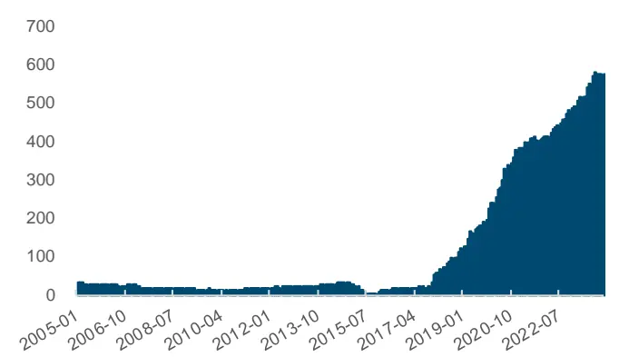
来源：Wind，国金证券研究所

图表2：可转债面值总额(亿元)
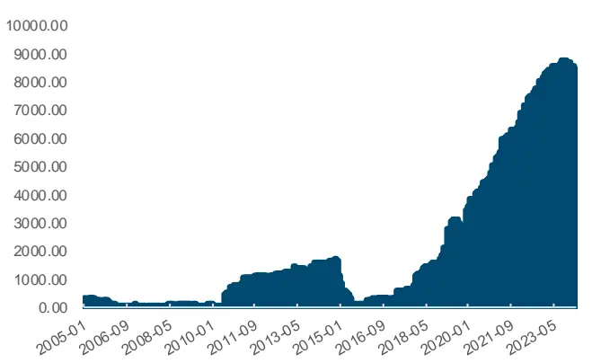
来源：Wind，国金证券研究所

而在转债市场中，投资者常常根据平底溢价率(转股价值/纯债价值-1)将转债划分为偏股型、平衡型和偏债型三个类别来区别转债股性和债性的强弱。从历史平均表现来看，偏股型转债有更高的收益弹性，不过同时波动率也是较高的。而平衡型转债次之，而偏债型转债则具有低波动、低收益的特点。

在固收+的产品中，纯债部分已经为产品提供了低波稳健的收益，所以需要找寻在有收益弹性之余仍然有较好回撤控制能力的标的来为固收+产品提供收益“+”的部分。在2022年之前，双低类的转债(转债价格低并且转股溢价率低)能够提供这样的特性。但是随着这些年大量资金涌入转债市场而转债数量的增加速率无法匹配，使得市场上转债平均价格和溢价上抬明显，双低策略的收益也下滑明显。我们急需有其他具有弹性的资产补充到固收+的配置模块中来。

图表3：可转债双低指数
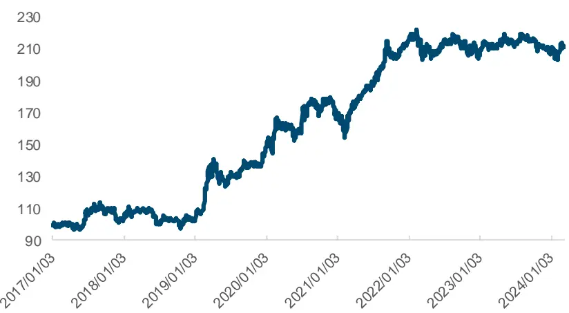
来源：Wind，国金证券研究所

而偏股型转债在拥有债底的同时，能为投资者提供在三类转债中更高的收益弹性。一定程度上，其是为产品提供增厚收益的较好选项。但是偏股型转债也有在转债标的范围内回撤较大的问题。所以为了相对稳健地获取偏股型转债收益，本文尝试探究对偏股型转债构建择时策略的方式降低持有偏股型转债的波动和回调风险。另外我们也通过优选转债的方式，尝试获取较偏股型转债券池整体更高的收益。最后通过叠加择时和择券的方式，构建了基于偏股型转债择时择券增强的固收+策略。

## 二、构建国金金工偏股型转债指数

我们通过万得金融终端的指数索引功能中以“转债”为关键词进行搜索市面上的转债指数，共102个指数。但从指数类型上看，接近偏股型可转债指数的仅有中证指数编制的中证可转换债券偏股策略指数(931653.CSI)。指数的发布时间为 2021年3月25日，但是其指数内部包含可交债，并不是只有可转债。所以为了构建可得的指数，本文自行构建了国金金工偏股型转债指数。

本文构建的国金金工偏股型转债指数，选取了在上交所和深交所上市的所有月末债券余额不低于3000万元且平底溢价率大于20%的可转债和可交债。另外指数根据成份券的债券余额进行加权处理，每月末进行对成份券的调整。

图表4：国金金工偏股型转债指数构建方式

| 指数名称 | 国金金工偏股型转债指数 |
| --- | --- |
| 样本空间 | 上交所和深交所上市的所有可转债 |
| 选样方法 | 选取月末余额不低于3000万元、平底溢价率大于20%的债券 |
| 加权方式 | 债券余额加权 |
| 调仓频率 | 月末调仓 |
| 基日 | 2017年12月31日 |

来源：国金证券研究所

基于这样的选券标准，本文筛选出了从2001年以来的偏股型转债池，并计算了偏股型转债的历史存续数量。从数据可以看出，在2018年之前转债市场扩容之前，偏股型转债数量较少，最高值为2015年4月份达到的22只，最少的时候1只偏股型转债都没有。较少的转债数量会导致构建的指数走势波动较大，而且后续分组择券时难度较大，没有较好的筛选效果。不过从数据上能看到，在2018年之后偏股型转债的存续数量逐年提升，成份券较少的问题得以解决。所以我们最终把国金金工偏股型转债指数的构建基日定于2017年12月31日。

图表5：偏股型转债存续数量
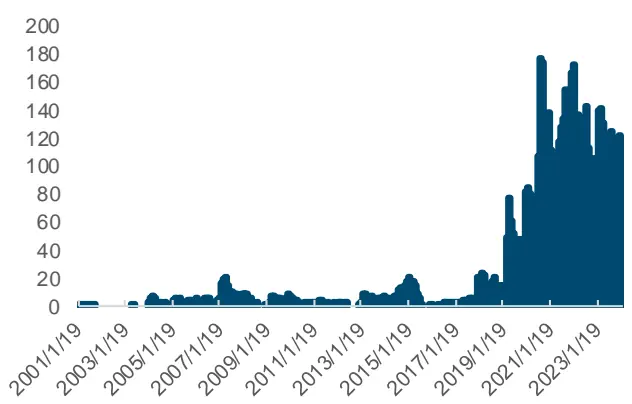
来源：Wind，国金证券研究所

图表6：国金金工偏股型转债指数净值
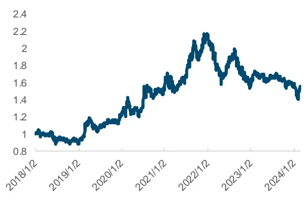
来源：Wind，国金证券研究所

## 三、国金金工偏股型转债指数择时策略

## 3.1 择时指标选取

为了降低持有国金金工偏股型转债指数的波动率和回撤，本文选取了券池结构变动和估值的两大类指标一共7个指标进行测试以及构建偏股型转债的择时策略。券池结构变动大类内包括了偏股转债中位价、价格偏度、广度推力和扩散指数；估值大类内包括纯债溢价率、转股溢价率和隐含波动率。券池结构变动类指标主要刻画券池内全部转债的价格和涨跌分布情况，中位价衡量目前券池的价格中枢，当中位价抬升到阶段高位后，整体价格的偏高会导致板块产生回调的压力：价格偏度衡量券池内大多数转债价格偏离平均价格的情况。当分布过于左偏，说明多数转债价格已经阶段性偏高，后续整体的价格分布会出现调整；广度推力和扩散指数分别衡量的是短期和中期上涨转债数的比例。估值类指标主要刻画板块各类溢价率指标的情况，当各类溢价率指标出现短期阶段性过高的情况，会对后续的板块上行产生一定的压力。

图表7：择时测试指标

| 指标分类 | 指标名称 | 指标描述 |
| --- | --- | --- |
| 券池结构变动 | 中位价 | 转债收盘价的中位数 |
|  | 价格偏度 | 转债收盘价的中位数-平均数 |
|  | 广度推力 | 上涨转债数/上涨和下跌转债数量的10日移动平均 |
|  | 扩散指数 | 滚动6个月收益为正的成份股权重加总 |
|  | 纯债溢价率 | (转债价格一纯债价值)/纯债价值 |
| 估值 | 隐含波动率 | 根据 BS 公式计算理论价格反推得到 |
|  | 转股溢价率 |  |
|  |  | (转债价格一转股价值）/转股价值 |

来源：国金证券研究所

## 3.2 择时策略基础参数

虽然日频不定时的择时形式有灵活度较高且信号滞后性较低的优势，但是由于我们考虑后续将择时与择券策略进行叠加，日频不定时的择时形式与固定频率调仓的择券策略有所冲突。所以本文考虑选取周度择时的形式。另外，策略交易费率设定为单边千分之二。测试区间为2018年1月1日到2024年1月31日。

图表8：择时策略基础参数

| 策略设定 | 参数 |
| --- | --- |
| 回测区间 | 2018年1月1日-2024年1月31日 |
| 交易费率 | 单边千分之二 |
| 调仓频率 | 周末换仓 |

来源：国金证券研究所

## 3.3 结合市场趋势判断的区间震荡择时框架

传统的策略信号指标构建方式一般有两种。一种是震荡指标，指标数据在区间内进行波动，指示行情的高低点，例如常用的技术指标里的KDJ和RSI等。另一种则是趋势指标，指标信号数值总体上呈趋势性变化，趋势的突破代表标的走势方向的转变。常用的动量、均线、布林带等都是常用的趋势类指标。

由于本文这次选取的择时指标，包括券池结构变动类和估值类指标，整体上都是偏向于区间震荡类的指标，所以本文尝试将这些指标统一化的处理，减少对每个指标做区间阈值的判断和处理，防止一定程度上的过拟合风险。

图表9：区间震荡择时框架
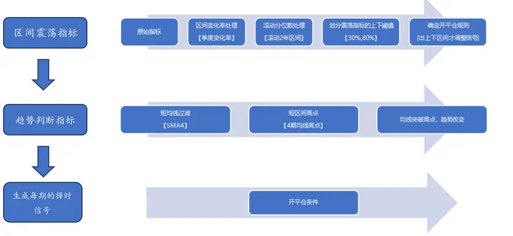
来源：国金证券研究所

## 3.3.1 区间震荡指标构建

本章节，我们以偏股型转债价格中位数为例阐述如何将原始指标数据转化为策略使用的标准区间震荡指标。原始的中位数指标虽然整体上呈现震荡走势，但仍然有一定的趋势项，所以我们对其采取类似一阶差分的方式做季度变化率，从而使其转化成偏震荡的指标(偏股型转债价格中位数12周变化率)。然而直接使用变化率指标作为策略信号仍然存在各指标间均值不同，上下区间阈值较难划分的情况。另外还可能会出现阈值参数敏感度较大的问题。所以我们在构建了季度变化率的基础上，再次对其计算滚动2年区间分位数，使指标数值在标准化后的0-100%内进行波动。

而在阈值的选定方面，我们选择了上阈值80%和下阈值30%。当指标上穿上阈值然后回落到上阈值以下时，策略进行空仓；直到指标下穿下阈值然后上穿下阈值之后，再次重新开仓。

图表10:：偏股型转债价格中位数(元)
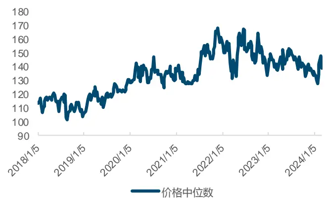
来源：Wind，国金证券研究所

图表11：偏股型转债价格中位数12周变化率
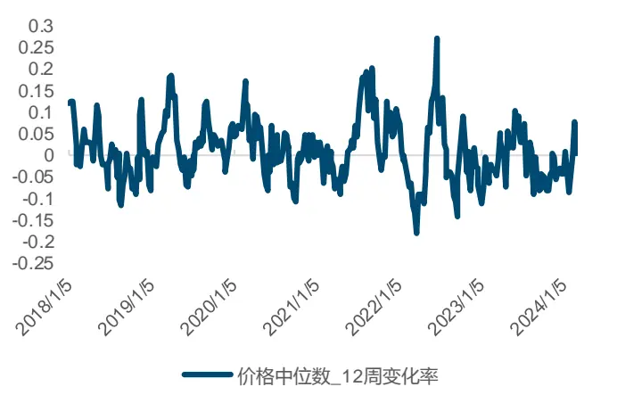
来源：Wind，国金证券研究所

图表12：偏股型转债价格中位数12周变化率滚动2年分位数
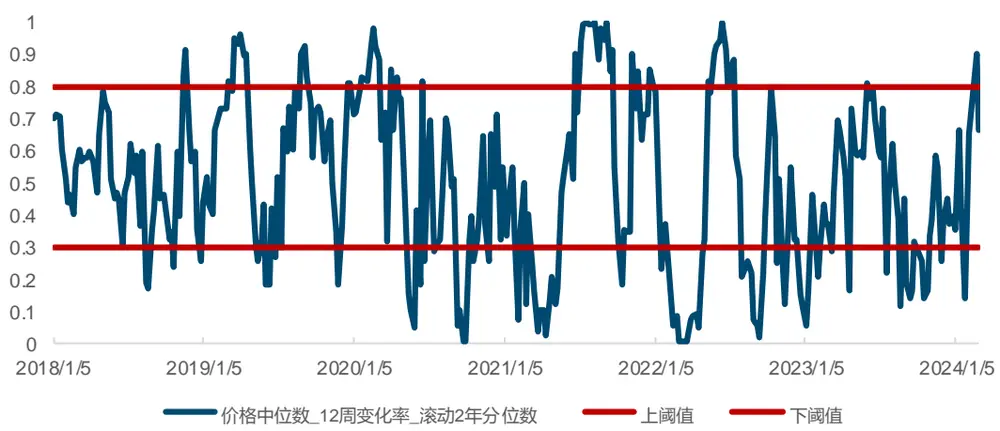
来源：Wind，国金证券研究所

## 3.3.2 简易趋势判断指标

如果我们的择时策略单纯使用区间震荡指标来进行择时的判定，到这一步其实已经完成了择时信号的构建。但实际上在使用区间震荡指标的过程中仍然存在一些问题。虽然震荡指标能够辅助捕捉市场情绪的阶段高低点，但有时也会由于指标的误判，导致错过重要的上升行情阶段。以下几种是震荡指标常见的几种误判情况：

- 震荡指标触发下穿上阈值的情况，但是标的继续向上新高；

震荡指标下穿上阈值择时策略空仓后，但未下穿下阈值，标的就已经下跌企稳然后新高；

- 择时策略空仓后，震荡指标未上穿下阈值，标的就已经下跌企稳然后新高。

为了减少策略择时空仓后未及时修正市场判断导致踏空的情况，我们本次在震荡指标框架的基础上，叠加了简易的趋势判断指标(国金金工偏股型转债指数净值4期均值的最高价)来判断标的重回上行趋势：

- 当指数净值的4期均值>前4期均值最高价，则将策略空仓信号调节成持仓状态。

## 3.3.3 最终择时判断逻辑框架

结合上述阐述的区间震荡指标和趋势判断指标，我们完成了最终偏股型转债择时信号的构建框架：

- 平仓条件(满足其一):

a) 震荡指标下穿上阈值，且指数净值的4期平均值<滞后一期的4期平均值最高价；

b) 虽未发生震荡指标上穿后下穿上阈值且目前震荡指标在上阈值下方，但发生了指数净值的4期平均值<滞后一期的4期平均值最高价的情况。

- 重新开仓条件(满足其一):

a) 指数净值的4 期平均值>滞后一期的4期平均值最高价；

b)震荡指标下穿下阈值后重新上穿下阈值。

后续我们根据该择时框架测试上文提及的择时指标，从中优选出适配于国金金工偏股型转债指数的择时指标。

## 3.4 单指标择时表现

我们将经过处理的七个择时指标放进上文提及的结合市场趋势判断的区间震荡择时框架中，构建对于国金金工偏股型转债指数的择时策略。从七个指标择时策略表现上看，价格中位数、价格偏度和纯债溢价率对于国金金工偏股型转债指数的择时效果较好，对应策略的年化收益率分别为7.39%、7.72%和7.01%，均高于单纯持有国金金工偏股型转债指数。除了收益率高于指数，这三个指标构建的择时策略在年化波动率和最大回撤方面，相较指数都有明显的改善。另外，从事件胜率和盈亏比角度构建的这三个择时策略的做多期望(=做多平均收益率*做多胜率+空仓平均收益率*空仓胜率)也位于七个指标中的前列。

图表13：单指标择时净值
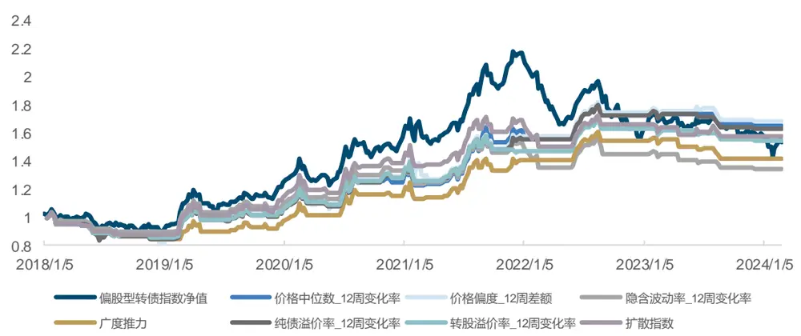
来源：Wind，国金证券研究所

图表14：单指标择时策略表现

| 01/01/2018- 01/31/2024 | 价格中位数_12 价格偏度_12 隐含波动率_12 周变化率 | 周差额 | 周变化率 | 广度推力 | 纯债溢价率 _12 周变化率 | 转股溢价率 _12 周变化率 | 扩散指数 | 国金金工偏股 型转债指数 |
| --- | --- | --- | --- | --- | --- | --- | --- | --- |
| 年化收益率 | 7.39% | 7.72% | 3.58% | 4.59% | 7.01% | 5.99% | 6.48% | 6.20% |
| 年化波动率 | 12.57% | 13.51% | 12.76% | 11.97% | 12.73% | 12.27% | 12.91% | 18.11% |
| 最大回撤 | -18.61% | -22.89% | -16.18% | -19.88% | -19.12% | -19.12% | -16.13% | -34.16% |
| 夏普比率 | 0.53 | 0.53 | 0.24 | 0.33 | 0.50 | 0.43 | 0.46 | 0.4 |
| 收益回撤比 | 39.70% | 33.73% | 22.12% | 23.07% | 36.63% | 31.31% | 40.19% | 18.16% |
| 做多胜率 | 47.37% | 52.63% | 47.83% | 45.45% | 52.38% | 36.36% | 45.00% |  |
| 01/01/2018- 01/31/2024 | 价格中位数_12 价格偏度_12 隐含波动率_12 |  |  | 广度推力 | 纯债溢价率 12 周变化率 |  | 转股溢价率 扩散指数 _12 周变化率 | 国金金工偏股 型转债指数 |
| 做多盈亏比 | 周变化率 4.00 | 周差额 3.28 | 周变化率 2.33 |  | 3.02 | 2.99 |  |  |
| 做多期望 | 3.09% | 3.15% | 1.61% | 1.91% | 2.70% | 5.41 2.31% | 3.66 2.67% |  |
| 做多次数 |  |  | 23 | 22 | 21 | 22 | 20 |  |
| 看空胜率 | 19 | 19 36.84% | 43.48% | 31.82% | 38.10% | 40.91% | 45.00% |  |
| 看空盈亏比 | 42.11% |  | 0.96 | 1.79 | 1.88 |  | 1.42 |  |
| 看空期望 | 1.75 -1.63% | 2.14 -3.04% | -0.37% | -2.91% | -2.28% | 1.45 -1.47% | -0.88% |  |
| 看空次数 |  |  |  | 22 | 21 | 22 | 20 |  |
|  | 19 | 19 | 23 |  |  |  |  |  |

来源：Wind，国金证券研究所

## 3.5 优选指标择时表现

考虑到单一择时信号可能会误发信号，我们将单指标择时效果较好的价格中位数、价格偏度和纯债溢价率构建的择时信号尝试进行合成，当三个择时信号有一个指标发出看多信号时，则策略看多，反之则空仓。可以看到基于合成信号的优选择时策略，整体表现优于单一指标的择时表现。年化收益率(8.52%)高于用七个单一择时信号构建的策略年化收益率，而且由于优选择时策略使用多指标进行共同择时，我们认为在后续的策略运行中，能有更稳健的表现。通过构建国金金工偏股型转债指数的择时策略，持有国金金工偏股型转债指数的波动率和最大回撤都能有明显降低，夏普比率也有所提升。

图表15：优选指标择时策略净值
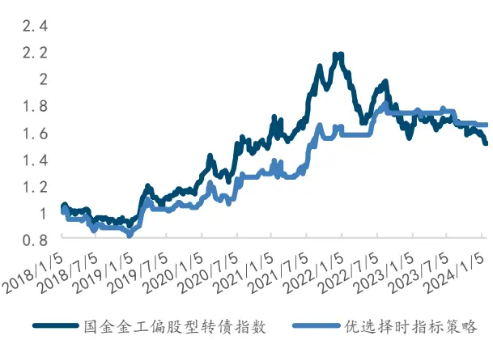
来源：Wind，国金证券研究所

图表16：优选指标择时策略表现

| 01/01/2018- 01/31/2024国金金工偏股型转债指数优选择时策略 |  |  |
| --- | --- | --- |
| 年化收益率 | 6.20% | 8.52% |
| 年化波动率 | 18.11% | 14.59% |
| 最大回撤 | -34.16% | -21.12% |
| 夏普比率 | 0.35 | 0.55 |
| 收益回撤比 | 18.16% | 40.33% |

来源：Wind，国金证券研究所

## 3.6 偏股型转债择时增强固收策略

虽然相较于纯固收标的(中长期纯债型指数)的夏普比率(2.66)，采取了优选择时策略的偏股型转债的夏普比率仍然偏低(0.55)，但是偏股型转债能够为固收产品提供更高的收益弹性，所以我们尝试将偏股型转债优选择时策略运用到固收产品中，从而提升产品整体收益。在本文测试当中，我们将中长期纯债型指数作为固收产品的代表，固定配置80%仓位在中长期纯债型指数上；另外我们将20%的仓位配置在偏股型转债优选择时策略中。当优选择时策略信号发出看多信号时，20%仓位持有国金金工偏股型转债指数；若策略发出空仓信号，则当期这20%仓位也配置回中长期纯债型指数。

我们将中长期纯债型指数、20%国金金工偏股型转债指数和固定82配比的中长期纯债型指数和国金金工偏股型转债指数组合作为比较基准，偏股型转债择时增强固收策略虽然夏普比率低于中长期纯债型指数，但是在最大回撤仅小幅变大的情况下，增厚了固收产品1.24%的年化收益率，收益率提升明显。

图表17：偏股型转债择时增强固收策略净值
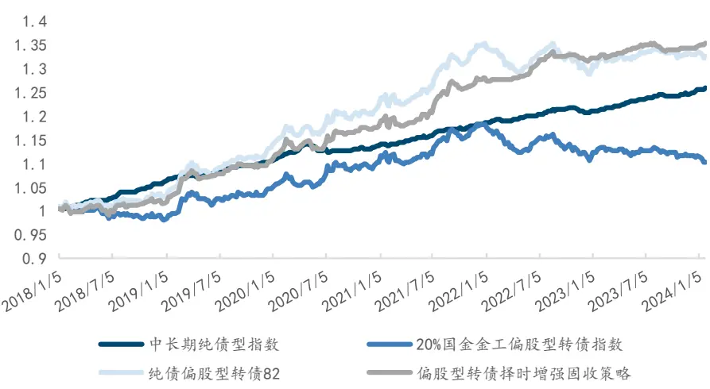
来源：Wind，国金证券研究所

图表18：偏股型转债择时增强固收策略表现

| 01/01/2018- 01/31/2024 | 债型指数 | 中长期纯 20%国金金工偏股型 转债指数 | 纯债+偏股型转债82 | 偏股型转债择时 增强固收策略 |
| --- | --- | --- | --- | --- |
| 年化收益率 | 3.82% | 1.60% | 4.69% | 5.06% |
| 年化波动率 | 0.95% | 3.49% | 3.65% | 2.96% |
| 最大回撤 | -1.69% | -6.78% | -4.95% | -2.19% |
| 夏普比率 | 2.66 | 0.12 | 0.94 | 1.27 |
| 收益回撤比 | 2.26 | 0.24 | 0.95 | 2.31 |

来源：Wind，国金证券研究所

## 四、偏股型转债择券策略

在上文中，本文从择时的角度出发，构建了国金金工偏股型转债指数的择时策略，明显降低了持有偏股型转债的回调风险，并有效提升了夏普比率。接下来我们将从择券的角度入手，通过精选偏股型转债券池，进一步优化择券组合的表现。

为了获取较偏股型转债券池整体更高的收益，本文从基本面因子和量价因子的角度对转债进行了测试，并最终选取其中表现较好的14个因子合成了三大类因子：转债基本面因子、正股基本面因子和量价因子。最后我们再将三大类因子等权合成为偏股型转债精选因子，并基于偏股型转债精选因子构建出偏股型转债择券策略，并设置了偏股型转债择券策略风险关注池，有效提高偏股型转债投资组合的收益表现。

## 4.1 量价类因子

量价类因子通过30日标准化隐含波动率等指标，来刻画转债和正股的量价属性。本文选取了5日可转债Amihud、转股溢价率等13个因子进行测试，由于转债量价类因子和正股量价类因子相关性较高，本文最终选取出5个表现较好的量价类因子，见如下图表。

图表19：量价类因子定义

| 因子名称 | 因子构建方式 |
| --- | --- |
| 30日标准化隐含波动率 | 对可转债的 BS 隐含波动率滚动 30日做标准化 |
| 60日标准化隐含波动率 | 对可转债的 BS隐含波动率滚动 60日做标准化 |
| 5 日可转债 Amihud | 可转债日收益率的绝对值/日成交额。滚动5日求平均值 |
| 90日最高价距离_diff | （可转债价格+转股溢价率）/过去90日（可转债价格+转股溢价率）的最大 值，做一阶差分 |
| 转股溢价率 | （转债收盘价-转换价值）/转换价值 |
| 正股 10 日 ATR | 正股 TR，滚动 10 日平均值 TR：今日振幅、今日最高与昨日收盘价差价、今日最低与昨日收盘价差价中 的最大值 |

来源：Wind，国金证券研究所

本文用2018年1月1日至2024年1月31日的数据进行量价类因子的测试。从各个量价类因子IC指标可以看到，60日标准化隐含波动率因子和转股溢价率因子的表现较好，IC均值分别为-4.74%和-4.35%。测试完之后，本文将两个隐含波动率因子先等权合成，再于剩下4个较好的量价类因子等权合成为新的大类因子，等权合成后的量价因子IC均值达到了5.90%的水平，风险调整后的IC为0.35，表现好于所有量价类单因子，预测能力大幅提升。

图表20：量价类因子IC

| 因子 | 平均值 | 标准差 | 最小值 | 最大值 | 风险调整的IC分组单调性 |
| --- | --- | --- | --- | --- | --- |
| 90 最高价距离_diff | 0.70% | 25.13% | -100.00% | 100.00% | 0.03 |
| 30日标准化隐含波动率 | -2.23% | 18.85% | -71.43% | 100.00% | -0.12 |
| 5 日可转债 Amihud | -2.80% | 18.79% | -74.55% | 55.45% | -0.15 |
| 转股溢价率 | -4.35% | 20.80% | -74.31% | 85.45% | -0.21 |
| 60日标准化隐含波动率 | -4.74% | 21.68% | -100.00% | 90.00% | -0.22 |
| 正股 10 日 ATR | -1.71% | 20.03% | -61.67% | 57.34% | -0.09 |
| 量价因子 | 5.90% | 16.99% | -58.68% | 61.82% | 0.35 _ |

来源：Wind，国金证券研究所

从量价因子分位数组合表现上看，量价因子空头端表现远好于多头端，空头端年化超额收益率为-21.57%，而多头端的收益表现也不错，超额为13.46%。同时量价因子的多空组合年化收益率达到了41.58%，夏普比率为2.15，表现非常出色。

图表21：量价因子分位数年化超额收益
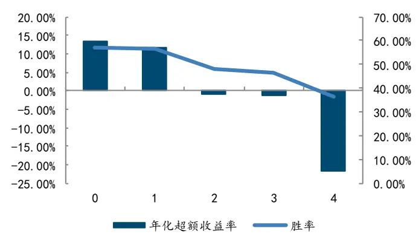
来源：Wind，国金证券研究所

图表22：量价因子分位数组合表现

| 组合 | 年化收益率 | 波动率 | 夏普比率 | t统计量 |
| --- | --- | --- | --- | --- |
| 0 | 24.21% | 22.18% | 1.09 | 1.02 |
| 1 | 22.13% | 21.46% | 1.03 | 0.92 |
| 2 | 8.62% | 20.66% | 0.42 | -0.15 |
| 3 | 8.18% | 20.74% | 0.39 | -0.19 |
| 4 | -14.11% | 22.88% | -0.62 | -1.96 |
| 市场 | 9.54% | 18.87% | 0.51 | 0.00 |
| L-S | 41.58% | 19.35% | 2.15 | 1.68 |

来源：Wind，国金证券研究所

图表23：量价因子分位数组合净值
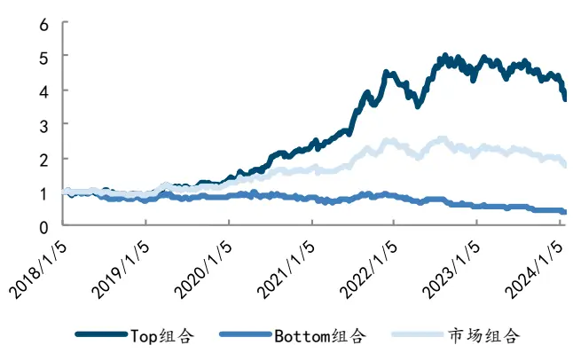
来源：Wind，国金证券研究所

图表24：量价因子多空净值
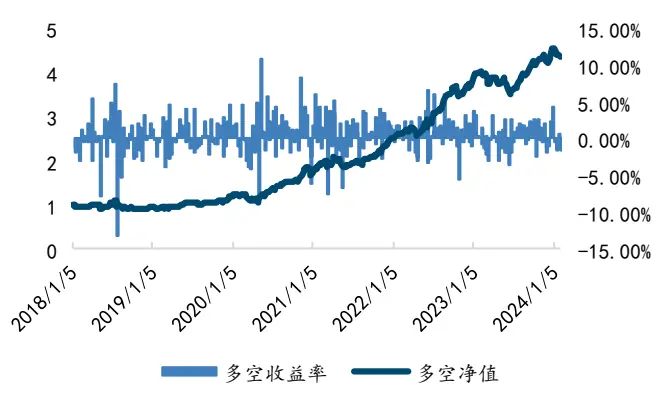
来源：Wind，国金证券研究所

## 4.2 转债基本面类因子

转债基本面类因子通过转债到期收益率等指标，来刻画转债的基本面属性。本文选取了距离转股日天数、债券余额、平价比底价等11个因子进行测试，最终选取出6个表现较好的转债基本面类因子，见如下图表。

图表25：转债基本面类因子定义

| 因子名称 | 因子构建方式 |
| --- | --- |
| 距离转股日天数 | 距离转股日的剩余天数 |
| 债券余额 | 可转债所剩余未被转换为股票的数额 |
| 当期收益率_diff | 对可转债的当期收益率，做一阶差分 |
| 纯债到期收益率_diff | 对可转债纯债部分的到期收益率，做一阶差分 |
| 平价比底价 | 可转债平价/底价 |
| 双低 | (可转债价格+转股溢价率*100) |

来源：Wind，国金证券研究所

本文用2018年1月1日至2024年1月31日的数据进行转债基本面类因子的测试。从各个转债基本面类因子IC指标可以看到，双低因子的表现远远优于其它基本面类因子，IC均值达到了-9.13%，呈现一枝独秀的状态。但是单因子的波动性往往比较大，可能出现阶段性失效的情况，因此本文将表现较好的转债基本面类因子等权合成为新的大类因子，等权合成后的转债基本面因子IC 均值达到了4.89%的水平，风险调整后的IC为0.24，表现相较于单因子更加稳定。

图表26：转债基本面类因子1C

| 因子 | 平均值 | 标准差 | 最小值 | 最大值 | 风险调整的IC | 分组单调性 |
| --- | --- | --- | --- | --- | --- | --- |
| 距离转股日天数因子 | 2.85% | 28.60% | -100.00% | 100.00% | 0.10 |  |
| 债券余额 | 2.71% | 24.34% | -63.64% | 100.00% | 0.11 |  |
| 当期收益率_diff | -1.20% | 20.67% | -64.34% | 66.67% | -0.06 |  |
| 纯债到期收益率_diff | -1.22% | 21.15% | -66.06% | 71.43% | -0.06 |  |
| 平价比底价 | -3.48% | 22.51% | -72.73% | 63.64% | -0.15 |  |
| 双低 | -9.13% | 24.26% | -81.82% | 59.44% | -0.38 |  |
| 转债基本面因子 | 4.89% | 20.78% | -68.44% | 83.92% | 0.24 |  |

来源：Wind，国金证券研究所

从转债基本面因子分位数组合表现上看，转债基本面因子空头端表现较多头端更佳，空头端年化超额收益率为-15.55%，而多头端的收益表现也不错，超额为10.16%，远远好于市场组合。对于多空组合，整体表现则更加可人，年化收益率达到了26.16%，夏普比率为1.14。

图表27：转债基本面因子分位数年化超额收益
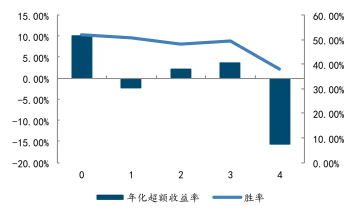
来源：Wind，国金证券研究所

图表28：转债基本面因子分位数组合表现

| 组合 | 年化收益率 | 波动率 | 夏普比率 | t统计量 |
| --- | --- | --- | --- | --- |
| 0 | 21.33% | 19.38% | 1.10 | 0.73 |
| 1 | 7.56% | 18.39% | 0.41 | 0.22 |
| 2 | 12.14% | 20.35% | 0.60 | 0.00 |
| 3 | 13.52% | 21.60% | 0.63 | 0.41 |
| 4 | -8.33% | 28.25% | -0.29 | -1.51 |
| 市场 | 9.61% | 18.80% | 0.51 | 0.00 |
| L-S | 26.16% | 23.01% | 1.14 | 1.09 |

来源：Wind，国金证券研究所

图表29：转债基本面因子分位数组合净值
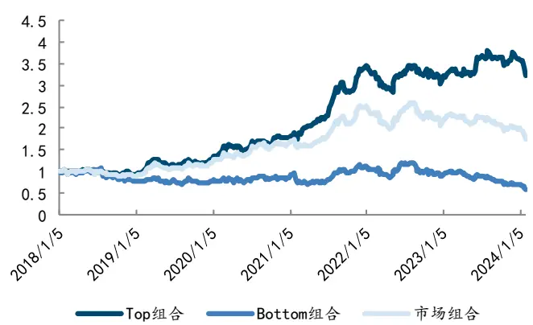
来源：Wind，国金证券研究所

图表30：转债基本面因子多空净值
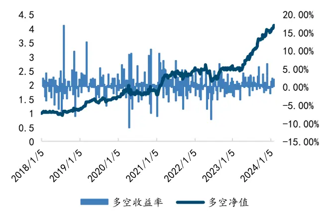
来源：Wind，国金证券研究所

## 4.3 正股基本面类因子

正股基本面类因子通过净利润等指标，来刻画正股的基本面属性。本文选取了净利润、当日总市值、营业收入同比增长等23个因子进行测试，最终选取出2个表现较好的正股基本面类因子，见如下图表。

图表31：正股基本面类因子定义

| 因子名称 | 因子构建方式 |
| --- | --- |
| 净利润 | 转债所对应正股的公司的净利润 |
| 当日总市值 | 转债所对应正股的公司的总市值 |

来源：Wind，国金证券研究所

本文用2018年1月1日至2024年1月31日的数据进行正股基本面类因子的测试。从各个正股基本面类因子IC指标可以看到，当日总市值因子的表现优于净利润因子，IC均值达到了-1.90%。本文将表现较好的正股基本面类因子等权合成为新的大类因子，等权合成后的正股基本面因子IC均值达到了1.70%的水平，风险调整后的IC为0.07，表现相较于单因子更加稳定。

图表32：正股基本面类因子IC

| 因子 | 平均值 | 标准差 | 最小值 | 最大值 | 风险调整的IC | 分组单调性 |
| --- | --- | --- | --- | --- | --- | --- |
| 净利润 | -0.72% | 26.55% | -85.71% | 65.00% | -0.03 |  |
| 当日总市值 | -1.90% | 25.68% | -81.82% | 62.73% | -0.07 |  |
| 正股基本面因子 | 1.70% | 25.64% | -62.23% | 81.82% | 0.07 |  |

来源：Wind，国金证券研究所

从正股基本面因子分位数组合表现上看，正股基本面因子单调性非常明显，多头端年化超额收益率为9.33%，空头端年化超额收益率为-7.72%。正股基本面因子多空组合表现则较为一般，年化超额收益率为15.24%，夏普比率为0.60。

图表33：正股基本面因子分位数年化超额收益
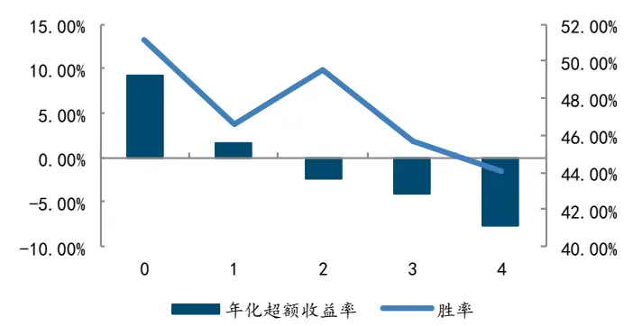
来源：Wind，国金证券研究所

图表34：正股基本面因子分位数组合表现

| 组合 | 年化收益率 | 波动率 | 夏普比率 | t统计量 |
| --- | --- | --- | --- | --- |
| 0 | 20.57% | 25.29% | 0.81 | 0.44 |
| 1 | 12.18% | 22.64% | 0.54 | -0.04 |
| 2 | 7.89% | 21.17% | 0.37 | -0.33 |
| 3 | 6.17% | 20.64% | 0.30 | -0.46 |
| 4 | 2.01% | 22.63% | 0.09 | -0.83 |
| 市场 | 10.45% | 18.57% | 0.56 | 0.00 |
| L-S | 15.24% | 25.39% | 0.60 | 0.06 |

来源：Wind，国金证券研究所

图表35：正股基本面因子分位数组合净值
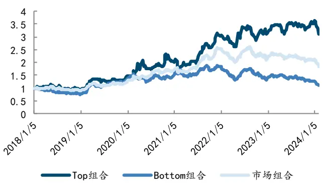
来源：Wind，国金证券研究所

图表36：正股基本面因子多空净值
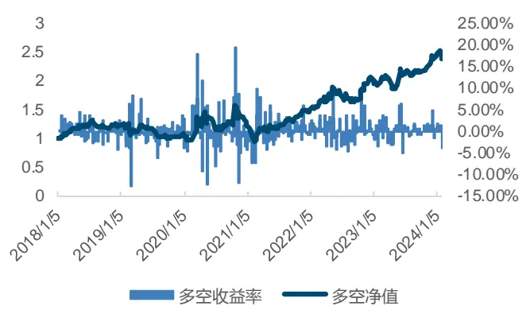
来源：Wind，国金证券研究所

## 4.4 偏股型转债精选因子

本文在前三节中从基本面因子和量价因子的角度对转债进行了测试，并最终选取其中表现较好的14个因子合成了三大类因子：转债基本面因子、正股基本面因子和量价因子。考虑到单个大类因子所反映的信息有限且应对市场风险的能力较差，本文对上述三大类因子进行了秩相关性分析，从下图表可以看到，三个大类因子间相关性都很低，相关性最高的两个大类因子之间的相关性也仅为0.12。因此本文对三个大类因子进行了标准化处理，并等权合成为偏股型转债精选因子。等权合成后的偏股型转债精选因子IC均值达到了6.24%的水平，风险调整后的IC为0.31，表现相较于单个大类因子提升十分明显。

图表37：大类因子相关性表格

| spearman 相关性 | 量价因子 |  | 转债基本面因子正股基本面因子 |
| --- | --- | --- | --- |
| 量价因子 | 1.00 | 0.09 | -0.01 |
| 转债基本面因子 | 0.09 | 1.00 | -0.12 |
| 正股基本面因子 | -0.01 | -0.12 | 1.00 |

来源：Wind，国金证券研究所

图表38：大类因子IC

| 因子 | 平均值 | 标准差 | 最小值 | 最大值 | 风险调整的IC | 分组单调性 |
| --- | --- | --- | --- | --- | --- | --- |
| 量价因子 | 5.90% | 16.99% | -58.68% | 61.82% | 0.35 | ■ |
| 转债基本面因子 | 4.89% | 20.78% | -68.44% | 83.92% | 0.24 |  |
| 正股基本面因子 | 1.70% | 25.64% | -62.23% | 81.82% | 0.07 |  |
| 偏股型转债精选因子 | 6.24% | 20.10% | -55.16% | 71.67% | 0.31 |  |

来源：Wind，国金证券研究所

从分位数组合表现上看，偏股型转债精选因子单调性较好，多头端和空头端表现均十分出色，年化超额收益率分别为18.45%和-16.56%。从多空组合表现上看，偏股型转债精选因子的多空净值在2021年后迎来大幅增长，多空组合年化收益率达到了38.58%，夏普比率为1.86，表现非常出色。

图表39：偏股型转债精选因子分位数年化超额收益
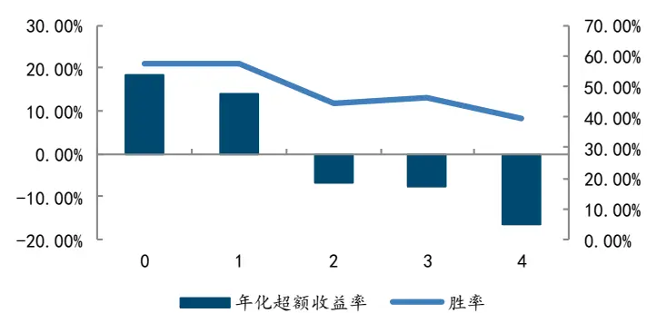
来源：Wind，国金证券研究所

图表40：偏股型转债精选因子多空净值表现
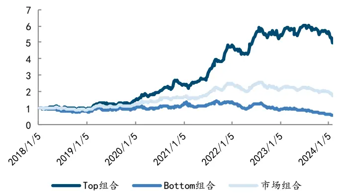
来源：Wind，国金证券研究所

图表41：偏股型转债精选因子多空净值表现
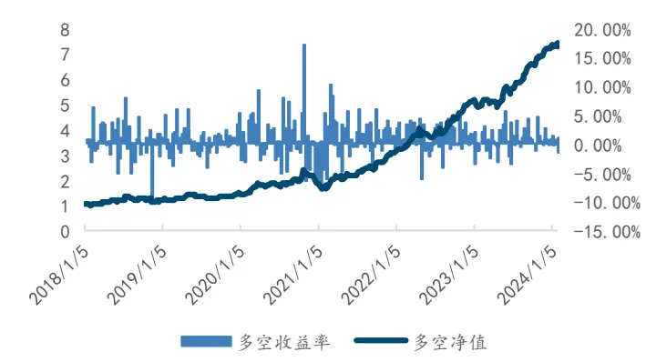
来源：Wind，国金证券研究所

图表42：偏股型转债精选因子多空组合表现

| 因子 | 偏股型转债精选因子 |
| --- | --- |
| 年化收益率 | 38.58% |
| 波动率 | 20.80% |
| 夏普比率 | 1.86 |
| 最大回撤率 | 31.46% |

来源：Wind，国金证券研究所

## 4.5 偏股型转债择券策略

在上节中，本文将转债基本面因子、正股基本面因子和量价因子等权合成为偏股型转债精选因子，表现大幅提升。因此在本节中，本文将基于偏股型转债精选因子进一步构建偏股型转债择券策略。策略构建细节如下：

图表43：偏股型可转债择券策略构建方法

| 回测细节 | 详细定义 |
| --- | --- |
| 策略回测范围 | 2018年1月1日至2024年1月31日。 |
| 策略换仓频率 | 周末换仓。 |
| 策略持仓组合 | 每个月选取可转债大类因子得分排名名前20%的可 转债，以等权方式构建持仓组合。 |
| 策略基准 | 偏股型可转债指数作为基准。 |
| 手续费 | 单边千分之二。 |

来源：Wind，国金证券研究所

从策略表现来看，基于偏股型转债精选因子的偏股型转债择券策略表现较佳，策略多头年化收益率为19.95%，夏普比率为0.96。从净值曲线走势来看，策略净值在2021年之后迎来大幅度增长，但在2023年1月之后出现小幅回撤。

图表44：偏股型转债择券策略净值
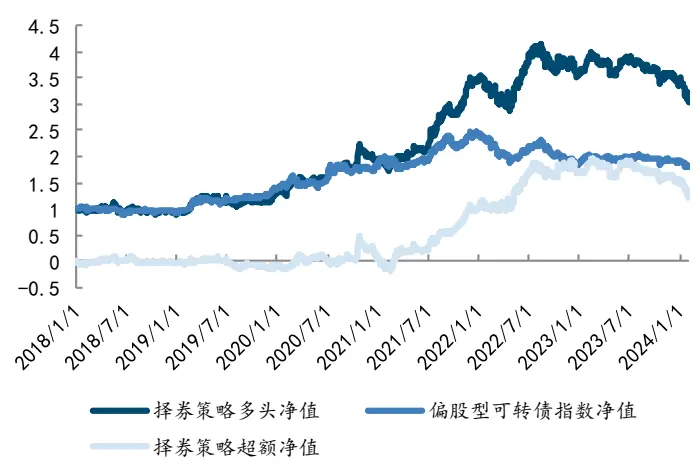
来源：Wind，国金证券研究所

图表45：偏股型转债择券策略表现

| 统计指标 | 择券策略多头 | 偏股型可转偏股型可转债指 债指数 | 数超额 |
| --- | --- | --- | --- |
| 年化收益率 | 19.95% | 10.15% | 8.69% |
| 年化波动率 | 20.82% | 16.59% | 16.11% |
| 夏普比率 | 0.96 | 0.61 | 0.54 |
| 最大回撤率 | 26.80% | 27.69% | 29.08% |
| 最大回撤开始日期 | 20220817 | 20211223 | 20201022 |
| 最大回撤结束日期 | 20240131 | 20240122 | 20210218 |
| 胜率 | 51.96% | 52.44% | 48.51% |

来源：Wind，国金证券研究所

图表46：偏股型转债策略换手率
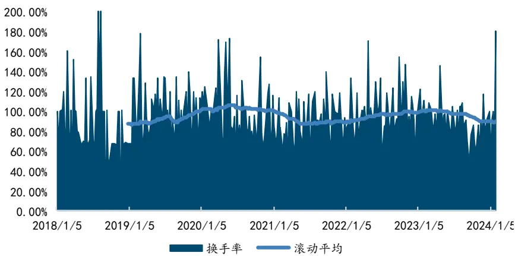
来源：Wind，国金证券研究所

通过以上图表我们可以看到，原策略的换手率一直处于较高水平，这也导致策略的交易费用居高不下，为有效降低换手率过高给策略收益带来的负面影响，我们加入换手率缓冲的调整方式降低调仓成本。在40%的换手率缓冲下，改进后的策略换手率大幅降低，择券策略超额净值稳步上升。策略的年化收益率为20.76%，夏普比率为1.01，在收益表现与之前持平的情况下，最大回撤率由27.69%降到了26.40%。

图表47：偏股型转债择券策略（换手率缓冲）净值
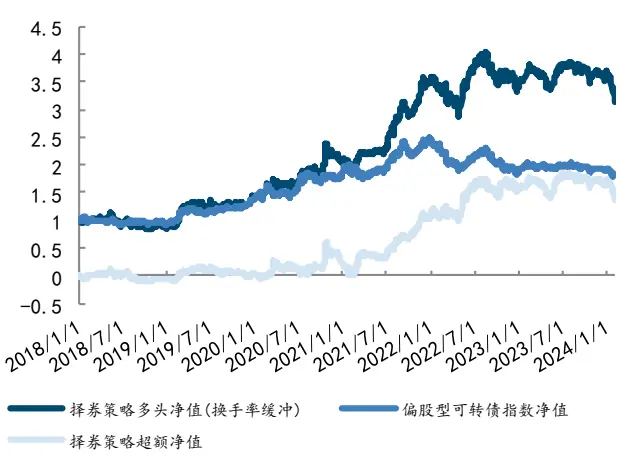
来源：Wind，国金证券研究所

图表48：偏股型转债择券（换手率缓冲）策略表现

| 统计指标 | 择券策略多头 (换手率缓冲) | 债指数 | 偏股型可转偏股型可转债指 数超额 |
| --- | --- | --- | --- |
| 年化收益率 | 20.76% | 10.15% | 9.42% |
| 年化波动率 | 20.59% | 16.59% | 15.79% |
| 夏普比率 | 1.01 | 0.61 | 0.60 |
| 最大回撤率 | 26.40% | 27.69% | 26.90% |
| 最大回撤开始日期 | 20180515 | 20211223 | 20201026 |
| 最大回撤结束日期 | 20181018 | 20240122 | 20210218 |
| 胜率 | 53.04% | 52.44% | 50.14% |

来源：Wind，国金证券研究所

图表49：偏股型转债择券策略（换手率缓冲）换手率
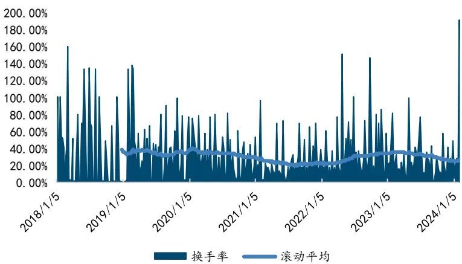
来源：Wind，国金证券研究所

## 4.6 偏股型转债择券策略风险关注池

上文我们构建了偏股型转债择券策略，虽然策略收益端较国金金工偏股型转债指数增强明显，但我们也发现择券策略同时增加了组合的波动率，这可能使得部分风险偏好度的固收+产品管理者对偏股型转债择券策略的使用有些许顾虑。但最终合成的择券大类因子除了能辅助我们选取哪些转债标的值得配置(直接使用择券策略对收益进行增强)，还能帮助我们剔除那些不值得配置的转债标的。

从偏股型转债合成择券因子的分组超额收益率和头尾两组的多空净值可以看出，虽然每期选出的第一组不一定稳定是最好的一组，但是多数情况下最后一组的转债标的往往表现欠佳。根据上述逻辑，我们可以将被偏股型转债择券因子分类到最后一组的转债标的划分进偏股型转债，将其暂时剔除在考虑配置范围以外。

由于择券因子是周度选券，所以我们能够在每周末获取到最新的偏股型转债风险关注池名单。在我们的回测时间范围内，最近一期偏股型转债风险关注池是在2024年1月26日获得的，其中共有21只可转债。

图表50：偏股型转债风险关注池(截止2024年1月26日)

| 转债代码 转债简称 |  |  |
| --- | --- | --- |
| 127096.SZ 泰坦转债 |  |  |
| 123025.SZ 精测转债 |  |  |
| 123206.SZ 开能转债 |  |  |
| 127097.SZ 三羊转债 |  |  |
| 123194.SZ 百洋转债 |  |  |
| 110088.SH 淮 22 转债 |  |  |
| 113063.SH 赛轮转债 |  |  |
| 110083.SH 苏租转债 |  |  |
| 113615.SH 金诚转债 |  |  |
| 113588.SH 润达转债 |  |  |
| 123224.SZ |  | 宇邦转债 |
| 113066.SH |  | 平煤转债 |
| 113537.SH |  | 文灿转债 |
|  | 123176.SZ | 精测转2 |
|  | 127058.SZ | 科伦转债 |
|  | 110091.SH | 合力转债 |
|  | 113648.SH | 巨星转债 |
| 123201.SZ |  | 纽泰转债 |
| 127098.SZ |  | 欧晶转债 |
| 127037.SZ |  | 银轮转债 |
| 127014.SZ 北方转债 |  |  |

来源：Wind，国金证券研究所

## 五、偏股型转债择时择券叠加策略

## 5.1 偏股型转债择时择券叠加策略

前文我们分别完成了对于国金金工偏股型转债指数的择时和择券增强策略的构建，在本章节我们尝试汇总分析择时和择券策略，并在此基础上构建择时择券叠加策略。从策略表现来看，择时策略相较国金金工偏股型转债指数，虽然策略收益率也有所增加，但是主要还是通过降低波动率和最大回撤，使得夏普比率有所提升：而择券策略则是在一定程度放大波动率的基础上，明显提升了转债组合的收益率。所以当我们将择时和择券策略进行叠加时，我们得到了偏股型转债择时择券叠加策略。策略年化收益率为19.28%，高于国金金工偏股型转债指数的6.20%，同时波动率(17.22%)与国金金工偏股型转债指数(18.11%)相比接近持平。从而使得策略夏普比率突破了1，数值提升明显。我们能看到叠加策略一方面得益于择时策略将波动率和最大回撤控制到低于国金金工偏股型转债指数的水平，另一方面也通过择券策略明显提升了策略年化收益率，从而使得偏股型转债的持仓体验更加良好。

图表51：偏股转债择时、择券、择时择券叠加策略净值
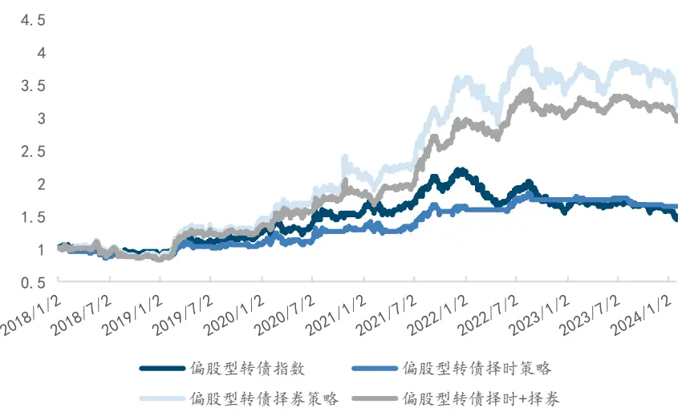
来源：Wind，国金证券研究所

图表52：偏股转债择时、择券、择时择券叠加策略表现

| 01/01/2018- 01/31/2024 | 国金金工偏股型 转债指数 | 偏股转债择时策略偏股转债择券策略偏股转债择时择券叠加策略 |  |  |
| --- | --- | --- | --- | --- |
| 年化收益率 | 6.20% | 8.52% | 20.76% | 19.28% |
| 年化波动率 | 18.11% | 14.59% | 20.60% | 17.22% |
| 最大回撤 | -34.16% | -21.12% | -26.40% | -25.99% |
| 夏普比率 | 0.35 | 0.55 | 0.96 | 1.04 |
| 收益回撤比 | 18.16% | 40.33% | 78.64% | 74.19% |

来源：Wind，国金证券研究所

## 5.2 偏股型转债择时择券增强的固收+策略

最后，我们将择时择券叠加策略也如同偏股型转债择时策略一般融合进固收策略当中，构建纯债偏股转债择券择时策略。策略组合固定持有80%的中长期纯债型指数，20%仓位根据择时信号在偏股型转债择券组合和中长期纯债型指数之间切换。相较前文构建的纯债偏股型转债择时策略，纯债偏股转债择券择时策略的年化收益率更高，最大回撤更低，分别报6.76%和-2.81%。但是年化波动率也有所放大，分别为3.33%。

但整体来看，叠加了择时和择券的偏股型转债增强方案会比单纯使用择时的偏股型转债增强方案要好，通过多承担0.37%的波动率和0.62%的最大回撤，获取了1.7%的年化收益率。同时夏普比率也从1.27提升到1.61。

图表53：偏股型转债增强固收+策略净值
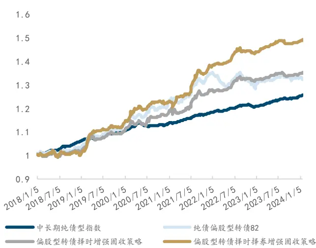
来源：Wind，国金证券研究所

图表54：偏股型转债增强固收+策略表现

| 01/01/2018- 中长期纯债纯债偏股型 01/31/2024 | 型指数 | 转债82 | 偏股型转债偏股型转债择 择时增强固时择券增强固 收策略 | 收策略 |
| --- | --- | --- | --- | --- |
| 年化收益率 | 3.82% | 4.69% | 5.06% | 6.76% |
| 年化波动率 | 0.95% | 3.65% | 2.96% | 3.33% |
| 最大回撤 | -1.69% | -4.95% | -2.19% | -2.81% |
| 夏普比率 | 2.66 | 0.94 | 1.27 | 1.61 |
| 收益回撤比 | 225.74% | 94.74% | 231.22% | 240.62% |

来源：Wind，国金证券研究所

## 六、总结

可转债由于进可攻退可守的特性，一直以来都非常受固收+产品的青睐。而这其中偏股型转债虽然有更高的收益弹性但同时波动率也是较高的，导致固收+管理者对这类转债的配置有所顾忌。本文选取偏股型转债的价格中位数、价格偏度和纯债溢价率指标基于结合市场趋势判断的区间震荡择时框架构建偏股型转债择时策略，以及基于转债和正股基本面和量价类因子合成的偏股型转债精选因子构建偏股型转债择券策略。通过择时和择券两种方式对偏股型转债的持有体验进行优化。再将其融合进固收+产品当中。通过叠加了择时择券的偏股型转债增强方案能有效的对固收产品进行在控制波动的基准上提升组合收益。

当然，与偏股型转债择券相关的策略年化波动率偏高的情况仍然没有完全解决。在后续的研究报告中，我们将继续完善可转债择券策略的波动率控制的研究，构建不同转债池(包括平衡型转债和高评级转债等)的择券策略，力争持续推出可供投资的各类量化可转债策略。

## 风险提示

1、以上结果通过历史数据统计、建模和测算完成，历史规律不代表未来；

2、在市场环境发生变化时，模型存在失效的风险；

3、策略依据一定的假设通过历史数据回测得到，当交易成本或其它条件改变时，可能导致策略收益下降甚至出现亏损。

## 特别声明：

国金证券股份有限公司经中国证券监督管理委员会批准，已具备证券投资咨询业务资格。

形式的复制、转发、转载、引用、修改、仿制、刊发，或以任何侵犯本公司版权的其他方式使用。经过书面授权的引用、刊发，需注明出处为“国金证券股份有限公司”，且不得对本报告进行任何有悖原意的删节和修改。

本报告的产生基于国金证券及其研究人员认为可信的公开资料或实地调研资料，但国金证券及其研究人员对这些信息的准确性和完整性不作任何保证。本报告反映撰写研究人员的不同设想、见解及分析方法，故本报告所载观点可能与其他类似研究报告的观点及市场实际情况不一致，国金证券不对使用本报告所包含的材料产生的任何直接或间接损失或与此有关的其他任何损失承担任何责任。且本报告中的资料、意见、预测均反映报告初次公开发布时的判断，在不作事先通知的情况下，可能会随时调整，亦可因使用不同假设和标准、采用不同观点和分析方法而与国金证券其它业务部门、单位或附属机构在制作类似的其他材料时所给出的意见不同或者相反。

本报告仅为参考之用，在任何地区均不应被视为买卖任何证券、金融工具的要约或要约邀请。本报告提及的任何证券或金融工具均可能含有重大的风险，可能不易变卖以及不适合所有投资者。本报告所提及的证券或金融工具的价格、价值及收益可能会受汇率影响而波动。过往的业绩并不能代表未来的表现。

客户应当考虑到国金证券存在可能影响本报告客观性的利益冲突，而不应视本报告为作出投资决策的唯一因素。证券研究报告是用于服务具备专业知识的投资者和投资顾问的专业产品，使用时必须经专业人士进行解读。国金证券建议获取报告人员应考虑本报告的任何意见或建议是否符合其特定状况，以及（若有必要）咨询独立投资顾问。报告本身、报告中的信息或所表达意见也不构成投资、法律、会计或税务的最终操作建议，国金证券不就报告中的内容对最终操作建议做出任何担保，在任何时候均不构成对任何人的个人推荐。

在法律允许的情况下，国金证券的关联机构可能会持有报告中涉及的公司所发行的证券并进行交易，并可能为这些公司正在提供或争取提供多种金融服务。

本报告并非意图发送、发布给在当地法律或监管规则下不允许向其发送、发布该研究报告的人员。国金证券并不因收件人收到本报告而视其为国金证券的客户。本报告对于收件人而言属高度机密，只有符合条件的收件人才能使用。根据《证券期货投资者适当性管理办法》，本报告仅供国金证券股份有限公司客户中风险评级高于C3级(含C3级)的投资者使用；本报告所包含的观点及建议并未考虑个别客户的特殊状况、目标或需要，不应被视为对特定客户关于特定证券或金融工具的建议或策略。对于本报告中提及的任何证券或金融工具，本报告的收件人须保持自身的独立判断。使用国金证券研究报告进行投资，遭受任何损失，国金证券不承担相关法律责任。

若国金证券以外的任何机构或个人发送本报告，则由该机构或个人为此发送行为承担全部责任。本报告不构成国金证券向发送本报告机构或个人的收件人提供投资建议，国金证券不为此承担任何责任。

此报告仅限于中国境内使用。国金证券版权所有，保留一切权利。

上海

电话：021-80234211

邮箱：researchsh@gjzq.com.cn

北京

深圳

地址：上海浦东新区芳甸路1088号紫竹国际大厦5楼

电话：010-85950438

邮编：201204

电话：0755-86695353

邮箱：researchbj@gjzq.com.cn

邮编：100005

地址：北京市东城区建内大街26号新闻大厦8层南侧

邮箱：researchsz@gjzq.com.cn

邮编：518000

地址：深圳市福田区金田路2028号皇岗商务中心18 楼 1806