证券研究报告

金融工程组

分析师：高智威（执业 S1130522110003)

gaozhiw@gjzq.com.cn

## 人工智能全球大类资产配置模型

目前，机器学习模型在资产配置等其他领域的定价研究相对偏少，传统的资产配置方法也需要新的思路来构建策略。本次研究中，我们将机器学习模型应用到大类资产配置问题上，基于因子投资的思路使用模型给出各资产的打分排序，并最终构建可投资的大类资产月频量化配置策略。

## 怎样使用机器学习选择大类资产？

我们使用机器学习模型生成每一期各资产的预期收益率数据，便于进行资产的排序与进一步优化。我们选取各资产对应指数或期货的高开低收作为初始数据，基于 TA-Lib 方法批量化生成量价因子数据作为样本的特征，并使用各资产未来 20 日收益率作为基础标签。模型的选取方面，考虑到树模型在小样本上相较于神经网络更不易过拟合的优势，我们主要使用基于 CART 的集成学习方法，包括 GBDT、RF 和 DART，具体实现模型主要为 XGBoost 与LightGBM。

## 数据准备及预处理

我们选择沪深 300、恒生指数、纳斯达克 100 指数、国债指数、SHFE 黄金等共 11 种资产作为配置池，覆盖国内股票、国外股票、债券与商品类资产，并基于这些资产的高开低收数据生成共 154 个量价类特征。我们对特征首先进行时序预处理，确保特征在不同资产之间具有可比性；随后进行截面预处理，此处我们试图通过对比找出最适合的预处理方式。对标签同样进行不同预处理方式的对比，以寻找最优方案。模型我们对比使用 GBDT、RF 和 DART 作为提升方法的LightGBM 模型以及使用 GBDT 的 XGBoost 方法。

## 如何优化模型在大类资产配置上的应用表现？

我们根据不同的特征处理、标签处理和模型三个维度分别进行测试。通过观察基于 lgb_gbdt 和 lgb_dart 模型得到的结果，我们确定特征在截面上做 MinMax 处理的方法优势最为明显；但不同的标签预处理方式在结合 CSMinMax 处理时各有优势。结合不同模型来看，对标签进行截面 Z-Score 处理时普遍能得到最佳的因子多头收益表现。模型上，基于GBDT 和 DART 的 LightGBM 模型在对应的效果最佳。

基于以上方法得到的两个因子具有较高的相关性，但其中使用 DART 的 LightGBM 模型得到的因子 IC 衰减相对更慢，我们认为这对于降低策略的换手率能带来一定帮助，对资产配置策略较为重要。最终我们确定特征处理方式为CSMinMax，标签处理方式为 ret_CSZScore，使用模型 lgb_dart 生成全球大类资产配置因子。

因子 IC 均值达到 9.00%，多头年化收益 13.34%，多头 Sharpe 比率 1.105，多头最大回撤 8.53%；多空年化收益率 15.20%，多空 Sharpe 比率 1.231。时序上看，因子多空组合净值稳定增长，仅部分月份回撤较大。

## 人工智能全球大类资产配置策略

我们根据最终的合成因子构造资产配置策略，每月初等权配置因子排名前 3 的资产，手续费取千分之三。我们以 11个资产的等权配置策略作为对比基准。策略的年化收益率为 16.91%，夏普比率为 0.99，而同时间段等权配置策略的年化收益率为2.05%，夏普比率为0.24。策略的年化超额收益率为14.74%，信息比率为1.34，超额最大回撤仅为5.97%。我们同样叠加最优化问题的求解方法，对策略的波动率做进一步约束。优化后，策略的年化收益率在 7.86%，年化超额收益 4.70%，策略的 Sharpe 比率上升到 1.28，年化双边换手率下降到 288.68%。

## 风险提示

以上结果通过历史数据统计、建模和测算完成，在政策、市场环境发生变化时模型存在时效的风险。策略通过一定的假设通过历史数据回测得到，当交易成本提高或其他条件改变时，可能导致策略收益下降甚至出现亏损。

## 一、怎样使用机器学习选择大类资产？

目前，机器学习模型在量化投资方面已得到广泛应用。各类机器学习算法能够借助其巧妙的模型设计有效挖掘到资产特征间的非线性关系，进行各类因子合成或生成的任务，进而形成有效的量化策略。各类机器学习模型在股票标的上的应用研究最为广泛，原因在于模型需要基于大规模样本进行训练后才能具备较强的泛化能力，而股票市场正好拥有丰富的量价、基本面与另类数据，适合用于训练模型。相比之下，机器学习在资产配置等其他领域的定价研究较少，但并不代表模型无法应用到这些领域上来。

本次研究中，我们将机器学习模型应用到大类资产配置问题上，基于因子投资的思路使用模型给出各资产的打分排序，并最终构建可投资的大类资产月频量化配置策略，以期获得较稳定的策略收益。过程中，我们还将探索比较不同类模型、不同数据处理方式等对模型效果的具体影响。

## 1.1 为何使用因子投资的方法？

传统的大类资产配置策略主要分为两个步骤：基于宏观指标对每个资产给出偏择时的观点，再通过求解优化问题或主观设定的打分机制给出资产的配置权重。整个配置的模型流程较长，同时每个步骤中也存在较多问题难以处理。

传统方法来说，投资者一般会使用到 CPI、利率等宏观指标或商品价格等数据，思路是基于主观逻辑使用宏观指标进行打分，或者复杂一些的会使用隐马尔可夫等模型构造宏观指标到大类资产的映射，以此生成指标体系对资产走势的判断观点。这类方法一般偏向于生成择时观点，较难进行截面上资产之间的比较，但有时在配置时我们更期望进行资产之间的比较；此外指标存在频率不一的问题，统一频率后可能影响原始数据的信息量。而在以上模型给出观点的基础上，还需要通过求解优化问题或人为设定映射函数的方法得到最后的配置权重。但优化方法对目标函数、输入的预期与协方差等系数高度敏感，也无法平衡不同资产之间存在较大差异的风险收益特征，容易给出极端权重，结果不稳定；人为设定映射函数的方法则无法最大化利用数据信息，难以进行策略效果上的优化。

因此，我们急需新的思路来实现资产的筛选与配置。因子投资的框架可以一定程度解决上述问题。譬如，我们可以完整地得到每个资产在每期的因子得分，得分在不同资产之间具有可比性，允许我们直接进行资产的排序，不需要再构造因子到资产的映射来进行比较；我们也能对因子进行回测，快速对比不同因子的有效性，方便进行策略的优化。

结合机器学习方法，我们能够进一步剔除主观经验对策略的影响，期望得到更加有效的资产配置策略。

## 1.2 从数据到模型，如何匹配因子框架？

## 1）、数据特征

我们使用大类资产的价格数据作为原始信息。传统的大类资产配置策略会基于 CPI、利率等宏观指标或商品价格等数据进行判断，但指标多数偏低频且存在频率不一的问题，难以生成因子来对资产进行截面上的比较。因此，我们将目光放到大类资产本身的价格上来，各资产均能找到相对应的指数标的，支持我们使用指数的高开低收数据来构建量价因子，扩展样本的特征维度。基于这些量价因子，模型能够捕捉更多指数长短期走势及其变化上的规律，增强其预测能力。

目前有许多较成熟的量价因子批量计算工具，支持我们快速生成一系列特征，譬如 TA-Lib、Alpha158 等，可以有效扩充样本维度。本次研究我们选择 TA-Lib 来进行数据计算。

## 2）、数据标签

我们使用未来 20 日的指数收益率作为初始标签。考虑到资产配置实务中，在不同资产之间切换的周期较长，调仓观点应当也以一个较慢的频率给出；同时，大类资产的指数走势相对更加稳定，并不需要给出过于高频的观点。我们希望能给出月频调仓的策略，因此使用未来 20 日的收益率作为初始标签。

细节上面，由于各个市场的节假日等规则不同，资产之间在截面上有时无法对齐。为了保证标签的合理性与可投资性，我们假设策略按照该资产未来第一个交易日的收盘价买入，持有 20 天后以收盘价卖出，以此计算收益率标签。

## 3）、模型选择

模型层面，我们最终选择树模型进行预测。基于树的算法可以处理特征与标签之间的非线性关系，且相对神经网络来说一般在表格类数据上会有更好的表现，更重要的是树模型在小样本训练上更不容易出现过拟合。

图表1：树模型与神经网络结构对比
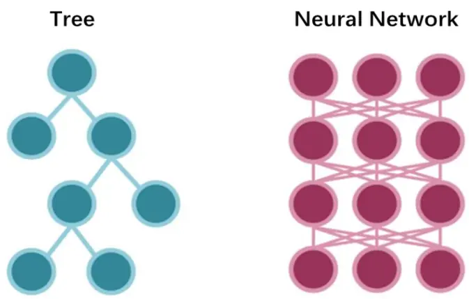
来源：国金证券研究所

从原理上来说，树模型有以下优势帮助其更不容易出现过拟合：

a、结构简单。树模型通过分支做决策，结构更简单、参数量更低。

b、可解释性强。树模型直接习得显式规则，决策更透明且有助于配合剪枝策略修正过拟合部分。

c、分布适应性。树模型能够更好地适应样本的分布，避免受到数据中的噪声影响，且更不容易受到极端值的影响。

机器学习应用于大类资产配置的首要问题就在于数据量上的限制。考虑到资产配置的标的数量偏少，日频下训练集的总量可能只在一两万这个数量级，同时资产配置并不需要非常高频的观点，预测频率进一步缩小了样本的数量。在使用小样本进行训练时，神经网络模型更易出现过拟合的现象，而基于树的算法更容易训练出泛化性能较好的模型。因此，我们选择决策树及其各类衍生算法来训练。

## 1.3 基于 CART 算法与集成学习的树模型

决策树是一类目前在应用中受到广泛欢迎的机器学习模型。树模型试图从训练数据集中归纳出一组分类规则，实际上也是通过训练数据集估计条件概率模型，从划分特征空间得到的条件概率模型中选择出能较好拟合训练数据的模型，但同时需要防止模型过度贴近训练数据出现过拟合，确保其在未知数据集上有同样的泛化能力。为了在训练过程中减少过拟合现象，决策树模型普遍会使用剪枝操作，包括控制树的深度、叶子节点数量等预剪枝方法，以及代价复杂度剪枝（CCP）、错误率减低剪枝（REP）等方法进行后剪枝。树的具体生成方式也可分为 level-wise 与 leaf-wise 两类，分别强调生成树模型时的计算效率与计算代价。

决策树具体算法中，CART（Classification and Regression Tree）算法既可用于分类任务，也可用于回归任务。CART 回归树使用均方差的大小来度量特征的各个划分点的优劣情况。我们通过优化以下目标函数来寻找最优的划分特征 A 与划分点 s，其中 $c_{1}$ 与 $c_{2}$ 分别是划分后两个数据集对应的标签均值：

$$
\min_{A,s}\left[\min_{c_1}\Sigma_{x_i\in D_1(A,s)}(y_i-c_1)^2+\min_{c_2}\Sigma_{x_i\in D_2(A,s)}(y_i-c_2)^2\right]
$$

而单一的决策树有时难以达到令人满意的预测效果，此时进行性能增强就需要用到集成学习的方法，主要分为 Bagging 和 Boosting 两类。两类方法都是通过训练多个树模型弱学习器，并将结果进行结合从而增强预测效果。

Bagging 的核心思路是重复取样，其代表模型就是 RF（Random Forest）。该模型每次从训练集中取出一定比例的样本来训练弱学习器，并对多个弱学习器的结果求平均得到预测。随机森林优势在于能够高度并行计算，在处理高维度特征时优势明显；同时由于随机采样，模型方差更小，每个学习器不会对整个训练集过拟合，泛化能力强。

Boosting 算法每次生成训练学习器时，会更加关注前一个学习器预测错误的部分，增大相应的权重并用于训练下一个学习器，最后将所有学习器的结果进行加权结合，给出预测。GBDT（Gradient Boosting Decision Tree）是代表性的 Boosting 算法之一，将前一棵树的预测残差作为后一棵树的目标值，如此迭代，相当于每一棵树都是在修正前一棵树的预测误差部分，其优化问题可以写为：

$$
\begin{array}{r}{\mathop{argmin}\quad L\big(y,f_{t}(x)\big)=\mathop{argmin}\quad L(y,f_{t-1}(x)+h_{t}(x))}\end{array}
$$

其中 $h_{t}(x)$ 就是第t轮需要计算的决策树拟合函数。

GBDT 是典型的串行计算，在相对较少的调参时间下也能得到较高的预测准确率，且对异常值的鲁棒性非常强，不过难以并行计算。

图表2：集成学习方法对比
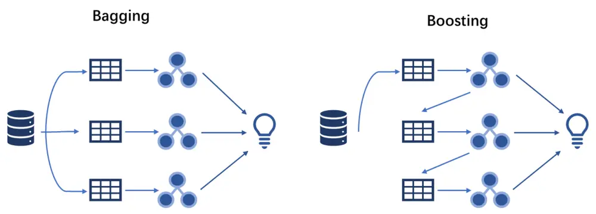
来源：国金证券研究所

此外，DART（Dropouts meet Multiple Additive Regression Trees）也是一种较新颖的树模型算法。DART 借鉴了深度神经网络中对神经元进行 dropout 的技巧，在每次训练弱学习器时，DART 会随机跳过之前生成的部分决策树，基于剩余决策树的残差作为本轮训练的预测目标。极端情况下，当我们不跳过任何一棵子树，此时即为 GBDT 模型；当所有子树都被跳过，模型则退化为 RF。从结果上来看，DART 方法相对 GBDT 来说不会出现初始决策树权重过大的情况，所有决策树的贡献比较平衡；dropout 操作也能进一步降低过拟合的可能。

而以上集成学习思路的具体实现方法又有多种路径，包括 XGBoost、LightGBM 等。XGBoost是大规模并行的 Boosting 算法，相对 GBDT 的算法改进点在对损失函数加入正则项、对误差进行二阶泰勒展开，此外在工程方面也实现了并行构建决策树、生成特征直方图高效寻找分割点等优化，大大提升计算效率。

$$
L_{t}=\Sigma_{i=1}^{m}L\big(y_{i},f_{t-1}(x_{i})+h_{t}(x_{i})\big)+\gamma J+\frac{\lambda}{2}\Sigma_{j=1}^{J}w_{tj}^{2}
$$

LightGBM 则是采用 Leaf-wise 算法，每次都去寻找分裂后增益最大的叶子节点，来生长决策树；相较于 XGBoost 的 level-wise 方法，能够减少很多没有必要的分裂，从而降低计算代价，但缺点是无法并行分裂。为此，LightGBM 采用包括单边梯度抽样、直方图算法等方法提升训练速度。此外，LightGBM 底层可以选择 GBDT、RF 或 DART 作为具体训练算法，而 XGBoost 只能使用 GBDT 或 DART 进行。

## 二、数据准备及预处理

## 2.1 原始数据

本次研究将以下指数作为配置对象。

图表3：大类资产名单

| 资产大类 | 资产名称 | 资产代码 | 可对应的ETF/基金名称 | 可对应的ETF/基金代码 |
| --- | --- | --- | --- | --- |
| 股票 | 沪深 300 | 000300.SH | 华泰柏瑞沪深 300ETF | 510300.SH |
|  | 中证500 | 000905.SH | 南方中证 500ETF | 510500.SH |
|  | 恒生指数 | HSI.HI | 华夏恒生ETF | 159920.SZ |
|  | 纳斯达克 100 指数 | NDX. GI | 广发纳斯达克 100ETF | 159941.SZ |
|  | 日经 225 | N225.GI | 华安三菱日联日经 225ETF | 513880.SH |
|  | 德国 DAX | GDAXI.GI | 华安德国 30 (DAX) ETF | 513030.SH |
| 债券 | 国债指数 | 000012.SH | 泰康安欣纯债A | 006978.0F |
|  | 中证转债 |  | 000832.CSI 博时中证可转债及可交换债券 ETF | 511380.SH |
|  | CBOT10 年美债 | TY. CBT |  |  |
| 商品 | SHFE 黄金 | AU. SHF | 华安黄金ETF | 518880.SH |
|  | ICE布油 | B. IPE | 易方达原油 A人民币 | 161129.0F |

来源：Wind，国金证券研究所

数据的时间范围为 2010.1.1 至 2024.5.24。数据集切分方面，我们暂不考虑对模型进行滚动训练，直接将数据按照时间顺序划分为训练集、验证集和测试集：

图表4：数据集划分区间

| 数据集类型 | 数据集起止时间 |
| --- | --- |
| 训练集 | 2010.01.01 - 2018.12.31 |
| 验证集 | 2019.01.01 - 2020.12.31 |
| 测试集 | 2021.01.01- 2024.05.24 |

来源：国金证券研究所

以下为各类资产 2010 年以来的净值走势。

图表5：大类资产历史净值走势（国内股票）
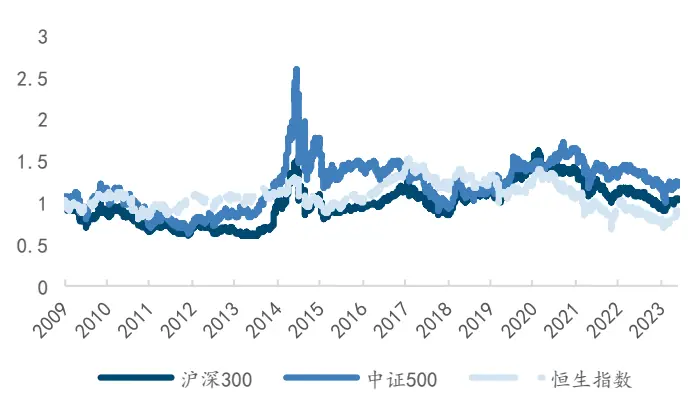
来源：Wind，国金证券研究所

图表6：大类资产历史净值走势（海外股票）
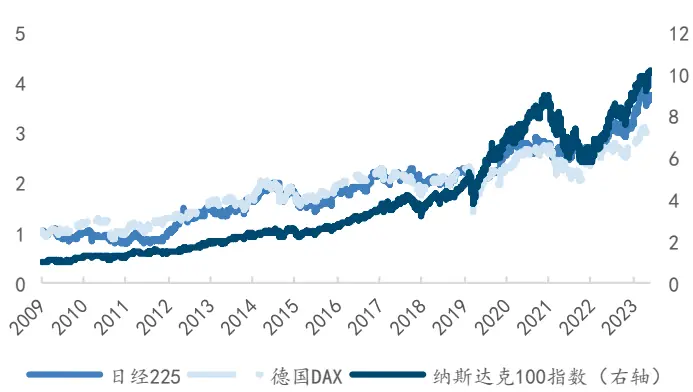
来源：Wind，国金证券研究所

境内的沪深 300、中证 500 与恒生指数走势较为相似，。海外指数中，日经 225 与德国 DAX指数的走势相似度较高，而美股的纳斯达克 100 指数走势较为独立，涨幅更明显。

图表7：大类资产历史净值走势（债券）
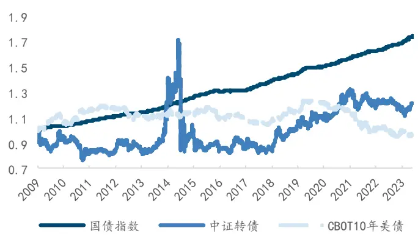
来源：Wind，国金证券研究所

图表8：大类资产历史净值走势（商品）
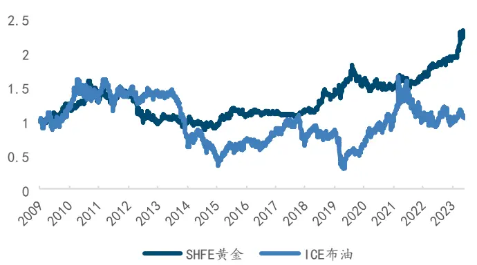
来源：Wind，国金证券研究所

债券指数来看，国债指数整体波动较低，涨幅稳定；中证转债指数由于带有一定股票属性，波动相对更大，走势更接近于国内股指；美债方面选取的是 CBOT10 年期美债期货主连。商品方面，我们选取了国内的 SHFE 黄金期货主连与 ICE 布伦特原油期货主连，走势与其他资产均有明显差异。

我们同样展示各资产指数自 2010 年以来与自 2021 年以来的收益特征。

图表9：大类资产历史净值指标

|  |  |  | 2010.01.01 2024.05.24 |  |  | 2021.01.01 2024.05.24 |  |  |
| --- | --- | --- | --- | --- | --- | --- | --- | --- |
|  | 年化收益率 | 年化波动率 | Sharpe 比率 | 最大回撤率 | 年化收益率 | 年化波动率 | Sharpe 比率 | 最大回撤率 |
| 沪深 300 | 0.05% | 21.51% | 0.002 | -46.70% | -10.36% | 17.18% | -0.603 | -45.25% |
| 中证 500 | 1.18% | 24.63% | 0.048 | -65.20% | -5.21% | 18.36% | -0.284 | -41.69% |
| 恒生指数 | -1.12% | 19.90% | -0.056 | -55.70% | -10.66% | 24.56% | -0.434 | -52.07% |
| 纳斯达克 100 | 17.44% | 20.24% | 0.862 | -35.56% | 11.84% | 22.22% | 0.533 | -35.56% |
| 日经 225 | 9.44% | 20.19% | 0.468 | -31.38% | 10.66% | 18.35% | 0.581 | -19.41% |
| 德国 DAX | 8.27% | 19.59% | 0.422 | -38.78% | 9.59% | 16.36% | 0.586 | -26.40% |
| 国债指数 | 3.91% | 0.69% | 5.645 | -0.84% | 4.39% | 0.57% | 7.645 | -0.28% |
| 中证转债 | 1.32% | 16.29% | 0.081 | -52.02% | 2.55% | 8.29% | 0.308 | -15.27% |
| CBOT10 年美债 | -0.27% | 5.78% | 14.44% | 0.401 | -44.81% | 10.64% | 11.50% | 0.925 |
| COMEX 黄金 | 5.38% | 15.40% | 0.349 | -44.49% | 6.27% | 14.34% | 0.437 | -20.84% |
| ICE 布油 | 0.34% | 34.68% | 0.010 | -81.78% | 14.55% | 36.35% | 0.400 | -44.30% |

来源：Wind，国金证券研究所

我们也基于资产的日度收益率计算了各资产之间的相关性系数。
图表10：大类资产历史收益率相关系数矩阵
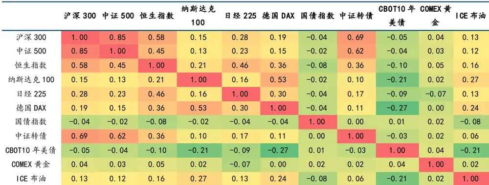
来源：Wind，国金证券研究所

整体来看股票指数内部的相关性较高，中证转债与沪深 300、中证 500 相关性较高外，其余资产之间相关性均较低。

我们也给出了等权配置以上 11 个资产的策略净值。策略每月初第一个交易日对权重再平衡，同时考虑千分之二的手续费。回测区间为 2021 年 1 月至 2024 年 5月 24日。

图表11：大类资产等权配置策略净值
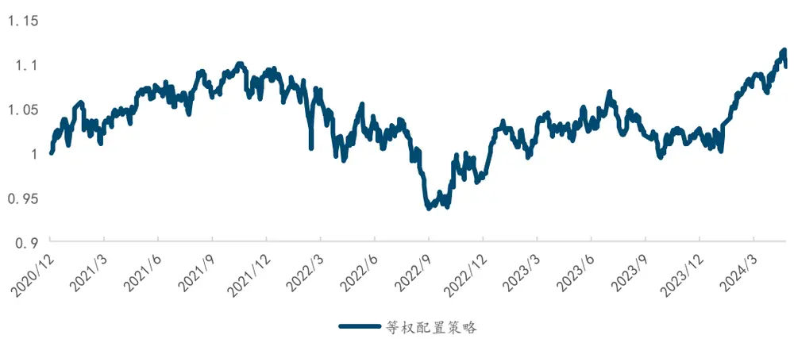
来源：Wind，国金证券研究所

图表12：大类资产等权配置策略指标

| 2021.01.01- 2024.05.24 | 等权配置策略 |
| --- | --- |
| 年化收益率 | 2.77% |
| 年化波动率 | 8.70% |
| Sharpe 比率 | 0.319 |
| 最大回撤率 | -14.91% |

来源：Wind，国金证券研究所

等权策略在 2021 年至今年化收益 2.77%，主要受到国内股票市场指数的回撤影响。可以看到，直接等权配置策略的收益表现并不理想，进行资产的筛选与配置优化是有必要的。我们将以上指数的日频开盘价、最高价、最低价和收盘价作为原始数据，并使用 Ta-Lib批量化生成 MACD、KDJ、RSI 等一系列量价指标，经初步筛选后共包含 154 个因子。

## 2.2 特征预处理方法

特征的数据预处理方面，我们主要分为时序预处理与截面预处理两个步骤。

时序预处理是为了解决部分特征在不同资产之间缺乏可比性的问题，分资产进行特征处理。部分特征与指数的收盘价为同一量纲，比如 MACD、MAX 等。这类因子的取值在不同资产之间可能存在较大差异，使用这些特征对资产直接进行分类也缺乏逻辑支持。因此我们首先需要进行标准化，使其在同一截面上具有可比性。我们人工筛选出需要进行这一处理的特征，将这类特征值除以当天该资产的收盘价，进行量纲上的统一。

截面预处理则是为了使模型能更好地捕捉特征，高效实现梯度下降。我们引入以下处理方法：

1）、截面 MinMax（CSMinMax）。基于特征在每个时间截面上的数据，进行 Min-Max 处理。
能够将特征限定在[0, 1]的范围内。2）、截面 ZScore（CSZScore）。基于特征在每个时间截面上的数据，进行 Z-Score 处理。
进一步确保特征在截面上的可比性。

3）、截面 Rank（CSRank）。基于特征在每个时间截面上的数据，计算其排序序号。排序处理可以得到非常标准化的结果，但是仅仅保留了特征之间大小的相对关系，会损失较多信息。

4）、数据集 MinMax（MinMax）。每个截面分别进行标准化会一定程度破坏特征在时序上的变化连续性，这在强调时序性的金融领域预测上会有一定影响。因此，我们对整个训练集的特征进行统一的 Min-Max 处理。为了防止信息泄露的现象，我们基于训练集得到最大值与最小值，并用于验证集与测试集的标准化处理上。

5）、数据集 ZScore（ZScore）。同样，我们对整个训练集的特征进行统一的 Z-Score 处理。
同样仅使用训练集计算均值与标准差，并用于验证集与测试集的标准化上。

6）、数据集 RobustZScore（RobustZScore）。原始的 Z-Score 计算很可能受到极端值的影响，因此有人提出了用 MAD 替代标准差，进一步控制极端值对数据的影响。此处 MAD 计算公式为：

$$
MAD=Median(|x-Median(x)|)
$$

缺失值与异常值处理方面，我们剔除掉经过预处理后缺失值较多的特征，以防止该类特征对模型带来负面影响。除此之外我们不对缺失值做更多处理，因为我们选择的决策树类模型本身具有处理缺失数据的能力。

## 2.3 标签预处理方法

我们使用指数未来 20 日的涨跌幅（ret）作为初始标签。理论上，对预测标签进行合适的标准化处理也能显著提升模型的学习能力，带来更好的预测效果。我们对初始标签进行截面预处理中提及的处理方式（剔除掉 MinMax 处理），以期比较最终对模型能力的影响。最终生成标签共包含：ret、ret_CSMinMax、ret_CSZScore、ret_CSRank、ret_ZScore、ret_RobustZScore。

## 2.4 模型详细设置

我们确定使用决策树类模型进行训练。具体来说，我们使用 LightGBM 框架下的 GBDT、RF、DART，以及 XGBoost 框架下的 GBDT 模型。XGBoost 下同样能使用 DART 方法，但计算效率较低，我们暂不考虑。

图表13：用于测试的模型信息

| 模型名称 | 模型类别 | 模型提升方法 |
| --- | --- | --- |
| Igb_gbdt | LightGBM | gbdt |
| Igb_rf | LightGBM | rf |
| Igb_dart | LightGBM | dart |
| xgb_gbtree | XGBoost | gbtree |

来源：国金证券研究所

## 三、如何优化模型在大类资产配置上的应用表现？

## 3.1 优化数据处理方式对因子效果的影响

本部分我们根据不同的特征处理、不同的标签处理和不同模型三个维度分别进行测试，根据不同情况训练模型并生成测试集样本对应的标签，以此作为因子值进行对应的因子检验。因子检验时，由于资产数量较少，我们将其分为三组进行多空检验。回测区间为 2021 年1 月至 2024年 5月 24 日。值得注意的是，具体训练时我们对每种情况分别进行了超参数调优，尽可能确保模型基于训练集得到较好的泛化能力。

我们首先对比不同的特征处理与标签处理方式对最终因子表现的影响。为了便于观察，我们仅展示基于 lgb_gbdt 和 lgb_dart 模型得到的结果。

图表14：基于不同特征处理与标签处理方式得到的各项指标（1gb_gbdt）
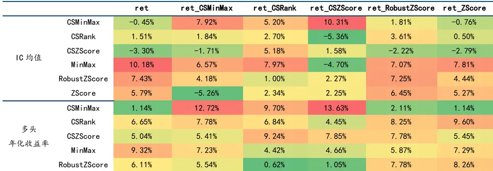
来源：Wind，国金证券研究所

我们首先观察使用基于 GBDT 的 LightGBM 模型时，不同特征处理方法对结果的影响。使用CSMinMax 方法处理后的特征明显能得到更好的效果，最终因子拥有更高的 IC 均值、多头年化收益、多头 Sharpe 比率与更低的回撤，同时基于全数据集的 MinMax 的处理方法也可以得到较好的效果；使用 CSRank 和 CSZScore 方法得到的模型 IC 值略弱于其他方法，但在多头组合的表现层面依旧具有明显优势；其他基于全部训练集进行的标准化方法在策略表现上均一般，且相互之间差异不明显，在搭配某些标签处理方法的情况下效果还会被进一步削弱，可以认为这种处理方式在资产配置因子上效果一般。

再从标签处理上来看。整体上，若我们选择对特征做截面标准化比如 CSMinMax 时，对标签同样做截面标准化的方法能得到较好的效果，比如 ret_CSMinMax 与 ret_CSRank；在使用全数据集的标准化方法时，则是使用同样对全部标签进行标准化的 ret_RobustZScore、ret_ZScore，或是直接使用原始的 ret 标签。

综合来看，特征处理方式相对标签处理方式会给模型结果带来更显著的影响，标签最好搭配同类型的特征处理方法进行选择。

图表15：基于不同特征处理与标签处理方式得到的各项指标（Igb_dart）
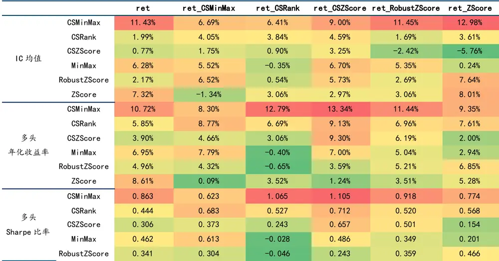
来源：Wind，国金证券研究所

使用基于 DART 的 LightGBM 时，CSMinMax 特征处理方法的优势更加明显，CSRank 处理也能带来相对较好的收益表现。标签方面，ret_CSRank 和 ret_CSZScore 在结合 CSMinMax特征处理时能带来较高的多头收益，同时 Sharpe 比率、最大回撤等方面均有最好表现；初始标签 ret 与 ret_RobustZscore 在 CSMinMax 下同样较为有效;其余标签对应结果的差异不大。

综上，我们使用 CSMinMax 作为特征处理方式；标签效果则可能与具体模型的选择有关，暂时不进行筛选。

## 3.2 优化模型选取对因子结果的影响

根据上一步的对比，我们可以简单看出不同模型对结果同样有较明显的影响。针对我们选择的 lgb_gbdt、lgb_rf、lgb_dart 和 xgb_gbtree 四种模型，我们进一步对比其对应的因子效果。

图表16：基于不同模型得到的各项指标（CSMinMax）

| 指标 | 标签 | Igb_dart | Igb_gbdt | Igb_rf | xgb_gbtree |
| --- | --- | --- | --- | --- | --- |
| IC 均值 | ret | 11.43% | -0.45% | 5.42% | 9.77% |
|  | ret_CSMinMax | 6.69% | 7.92% | 7.23% | 6.89% |
|  | ret_CSRank | 6.41% | 5.20% | –5.16% | 7.86% |
|  | ret_CSZScore | 9.00% | 10.31% | 6.69% | 8.93% |
|  | ret_RobustZScore | 11.45% | 1.81% | 5.99% | 13.50% |
|  | ret_ZScore | 12.98% | -0.76% | 3.41% | 11.43% |
| 多头 年化收益率 | ret | 10.72% | 1.14% | 7.54% | 5.76% |
|  | ret_CSMinMax | 8.30% | 12.72% | 8.23% | 10.64% |
|  | ret_CSRank | 12.79% | 9.70% | 4.68% | 12.50% |
|  | ret_CSZScore | 13.34% | 13.63% | 10.16% | 11.49% |
|  | ret_RobustZScore | 11.44% | 2.11% | 8.45% | 12.17% |
|  | ret_ZScore | 9.35% | 1.14% | 6.68% | 6.91% |
| 多头 Sharpe 比率 | ret | 0.863 | 0.079 | 0.540 | 0.416 |
|  | ret_CSMinMax | 0.623 | 1.039 | 0.627 | 0.824 |
|  | ret_CSRank | 1.065 | 0.819 | 0.332 | 1.072 |
|  | ret_CSZScore | 1.105 | 1.083 | 0.767 | 0.974 |
|  | ret_RobustZScore | 0.918 | 0.150 | 0.623 | 0.929 |
|  | ret_ZScore | 0.774 | 0.079 | 0.492 | 0.531 |
| 多头 最大回撤率 | ret | 16.04% | 25.30% | 21.83% | 18.02% |
|  | ret_CSMinMax | 16.42% | 8.53% | 15.01% | 13.55% |
|  | ret_CSRank | 8.07% | 13.19% | 24.07% | 9.04% |
|  | ret_CSZScore | 8.53% | 9.91% | 14.47% | 8.41% |
|  | ret_RobustZScore | 13.92% | 23.35% | 19.72% | 15.83% |
|  | ret_ZScore | 15.24% | 25.30% | 21.83% | 17.48% |

来源：Wind，国金证券研究所

结果上来看，lgb_dart 和 xgb_gbtree 效果相近；lgb_gbdt 效果相对较弱，但在使用ret_CSZScore 标签时能得到最佳的因子多头收益表现；lgb_rf 模型效果最弱，几乎无法得到有效优化结果。

综上，我们最终选定 ret_CSZScore 作为标签处理方法，模型选择 lgb_dart 与 lgb_gbdt来进行进一步对比。

## 3.3 因子相关性及衰减测试

我们对比 lgb_dart 与 lgb_gbdt 在使用 CSMinMax 做特征处理情况下，得到的各因子之间相关系数矩阵。

图表17：Igb_gbdt 与Igb_dart 在 CSMinMax 特征处理下各因子相关系数

|  | ret Igb_dart | ret_CSMinMax Igb_dart | ret_CSRank Igb_dart | ret_CSZScore Igb_dart | ret_RobustZScore Igb_dart | ret_ZScore Igb_dart |
| --- | --- | --- | --- | --- | --- | --- |
| ret-lgb_gbdt | 0.35 | 0.32 | 0.37 | 0.34 | 0.36 | 0.34 |
| ret_CSMinMax-lgb_gbdt | 0.38 | 0.90 | 0.90 | 0.94 | 0.43 | 0.40 |
| ret_CSRank-lgb_gbdt | 0.47 | 0.77 | 0.85 | 0.85 | 0.53 | 0.49 |
| ret_CSZScore-Igb_gbdt | 0.33 | 0.62 | 0.63 | 0.63 | 0.35 | 0.33 |
| ret_RobustZScore-lgb_gbdt | 0.37 | 0.33 | 0.38 | 0.35 | 0.39 | 0.37 |
| ret_ZScore-Igb_gbdt | 0.35 | 0.31 | 0.36 | 0.33 | 0.35 | 0.34 |

来源：Wind，国金证券研究所

可以看到，ret_CSZScore-lgb_gbdt 与 ret_CSZScore-lgb_dart 两个因子之间相关性达到0.63，且标签做分截面预处理得到的因子之间的整体相关性较高，因此我们不尝试因子合成。

最后，我们观察整体表现最好的 ret_CSZScore-lgb_dart 与 ret_CSZScore-lgb_gbdt 因子的 IC 衰减情况。

图表18：表现最佳因子IC均值衰减
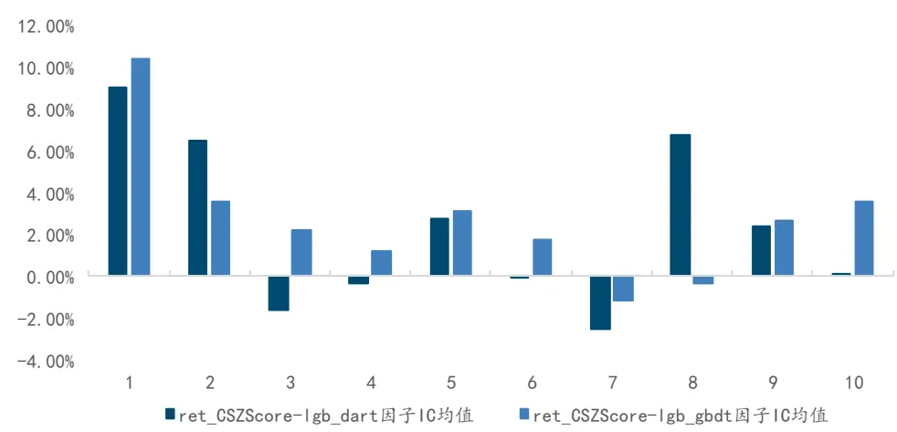
来源：Wind，国金证券研究所

可以看出，尽管 lgb_dart 模型得到的因子在预测未来一个月时 IC 均值相对 lgb_gbdt 较低，但在预测未来第二个月时因子 IC 均值衰减更少。我们认为这对于降低策略的换手率能带来一定帮助，对资产配置策略较为重要。

## 3.4 全球大类资产配置因子

最终，我们选择特征处理方式 CSMinMax，标签处理方式为 ret_CSZScore，使用模型lgb_dart 生成全球大类资产配置因子来构造大类资产配置策略。全球大类资产配置因子的整体表现如下：

图表19：全球大类资产配置因子指标

| 2021.01.01- 2024.05.24 | IC 均值 | IC_IR | t统计量 | 多头 | 多头 | 多头 | 多头 | 多空 | 多空 |  |
| --- | --- | --- | --- | --- | --- | --- | --- | --- | --- | --- |
|  |  |  |  |  |  |  |  |  |  | 年化收益率年化波动率 Sharpe 比率最大回撤年化收益率 Sharpe比率 |
| 全球大类资产配置因子 | 9.00% | 25.35% | 1.604 | 13.34% | 12.07% | 1.105 | 8.53% | 15.20% | 1.231 |  |

来源：Wind，国金证券研究所

图表20：全球大类资产配置因子分位数组合净值
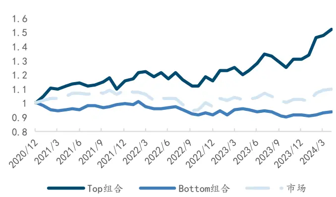
来源：Wind，国金证券研究所

图表21：全球大类资产配置因子多空组合
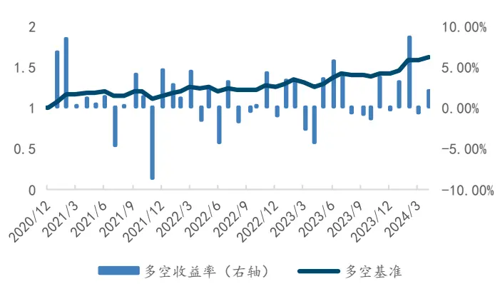
来源：Wind，国金证券研究所

因子 IC 均值达到 9.00%，多头年化收益 13.34%，多头 Sharpe 比率 1.105，多头最大回撤8.53%；多空年化收益率 15.20%，多空 Sharpe 比率 1.231。时序上看，因子多空组合净值稳定增长，仅部分月份回撤较大。

## 四、人工智能全球大类资产配置策略

## 4.1 策略结果

我们根据最终的合成因子构造资产配置策略，策略每月初第一个交易日等权配置因子值排名前 3 的资产，手续费取千分之三，权重目前采用等权配置。策略基准为资产等权配置净值。回测区间为 2021 年 1 月至 2024 年 5月 24日。

图表22：全球大类资产配置策略净值
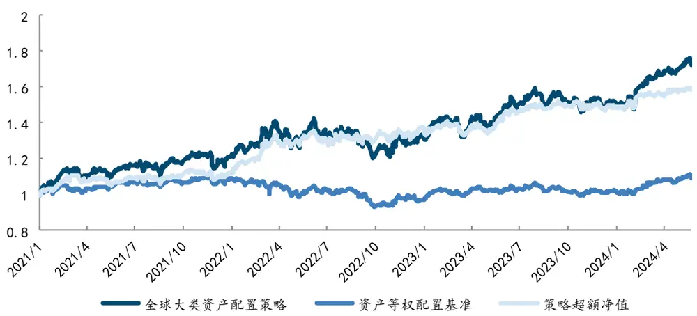
来源：Wind，国金证券研究所

时序上看，策略能带来稳定的绝对收益，仅 2022 年 4 月至 2022 年 10 月的绝对收益表现一般，但同时间段等权配置策略出现明显回撤，超额净值上涨非常稳定。

图表23：全球大类资产配置策略分年度收益
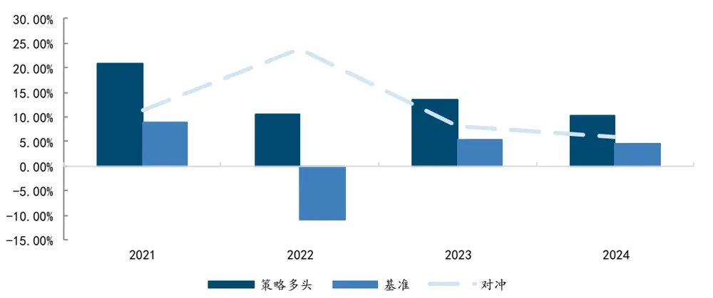
来源：Wind，国金证券研究所

图表24：全球大类资产配置策略指标

| 指标 | 全球大类资产配置策略 | 资产等权配置基准 |
| --- | --- | --- |
| 年化收益率 | 16.91% | 2.67% |
| 年化波动率 | 17.07% | 8.69% |
| 夏普比率 | 0.99 | 0.31 |
| 最大回撤 | 15.39% | 14.91% |
| 年化超额收益率 | 14.74% | 一 |
| 信息比率 | 1.34 | 一 |
| 超额最大回撤 | 5.97% | 一 |
| 年化双边换手率 | 450.04% | 一 |

来源：Wind，国金证券研究所

从指标上来看，策略的年化收益率为 16.91%，夏普比率为 0.99，而同时间段等权配置策略的年化收益率为 2.05%，夏普比率为 0.24。策略的年化超额收益率为 14.74%，信息比率为 1.34，超额最大回撤仅为 5.97%。同时间段纳斯达克 100 指数的年化收益率 11.84%，策略相比纳指也能有明显的超额收益。分年度来看，策略每年都能带来稳定的超额收益。以下是该策略的历史配置权重。

图表25：全球大类资产配置策略历史权重
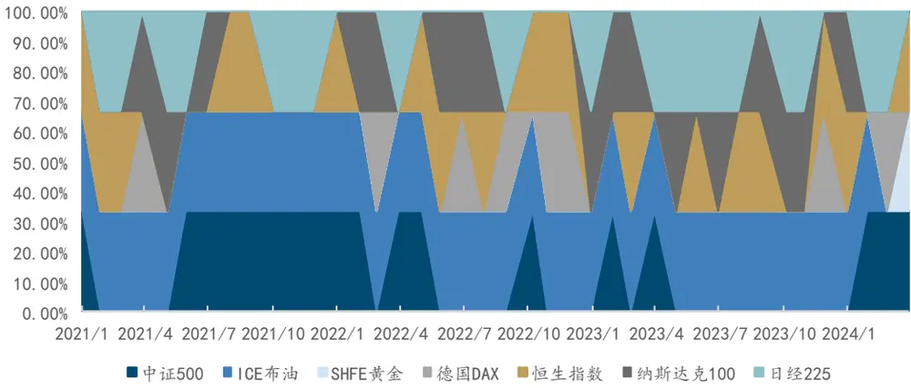
来源：Wind，国金证券研究所

为了确保策略结果的稳健性，我们对持有资产数量、手续费等进行测试，分别对比持有因子排名前 3、前 4、前 5 资产对应的结果，以及手续费为千分之二、千分之三、千分之五。回测时间段为 2021 年 1 月 1 日至 2024年 5月 24日以下为对比结果：

图表26：不同参数下策略年化收益率

| top=3 top=4 top=5 |  |  |  |
| --- | --- | --- | --- |
| fee=0.002 | 17.99% | 11.29% | 6.29% |
| fee=0.003 | 16.91% | 10.58% | 5.87% |
| fee=0.005 | 14.79% | 9.17% | 5.03% |
| fee=0.01 | 9.66% | 5.72% | 2.96% |

来源：Wind，国金证券研究所

图表27：不同参数下策略 Sharpe 比率

| top=3 top=4 top=5 |  |  |  |
| --- | --- | --- | --- |
| fee=0.002 | 1.053 | 0.739 | 0.456 |
| fee=0.003 | 0.991 | 0.693 | 0.426 |
| fee=0.005 | 0.869 | 0.602 | 0.365 |
| fee=0.01 | 0.567 | 0.376 | 0.216 |

来源：Wind，国金证券研究所

图表28：不同参数下策略最大回撤率

|  | top=3 | top=4 | top=5 |
| --- | --- | --- | --- |
| fee=0.002 | 15.15% | 14.28% | 19.02% |
| fee=0.003 | 15.39% | 14.60% | 19.20% |
| fee=0.005 | 15.86% | 15.24% | 19.56% |
| fee=0.01 | 17.98% | 17.31% | 20.84% |

来源：Wind，国金证券研究所

可以看到，在手续费上升到千分之 5 时，滚动选取排名前 3 资产的策略依旧能有 14.79%的年化收益率，策略整体对手续费敏感度不高；选取资产的数量则会对最终策略有较明显的影响，这可能是由于策略配置资产的数量较少，多持有一类资产会明显减少得分更高资产的权重，导致收益下滑。

## 4.2 低波动优化策略

当前策略的年化波动率依旧达到 17.07%，策略的 Sharpe 比率还有提升空间；此外，策略配置几乎都在股票与商品上，在债券类资产上没有仓位，这与我们传统的资产配置模型有所出入。我们希望能叠加求解最优化问题的方法对权重进行改进，得到更合理的配置结果，并提升模型的 Sharpe 比率表现。

我们将因子值作为各资产的预期收益率，目标函数为最大化组合的预期收益，并添加组合目标波动率的约束。求解优化问题如下：

$$
\begin{aligned}&\max_{w}w^{T}f\\&=\begin{vmatrix}\\&\Sigma_{i=1}^{N}w_{i}=1\\&0\leq w_{i}\leq1,i=1..N\\&\sqrt{w^{T}\Sigma w}\leq vol^{target}\\&\end{vmatrix}\\\end{aligned}\tag{𝑠.𝑡.}
$$

其中，w是各资产在组合中的权重，f为模型对各资产在当期的预测值，voltarget 为组合目标波动率，Σ为资产的协方差矩阵。我们使用滚动过去一年的收益率来计算协方差数据。在本篇报告中，我们将组合的年化波动率控制为最大不能超过 6%，并给出相应的波动约束版全球大类资产配置策略。

图表29：全球大类资产配置策略（波动约束）净值
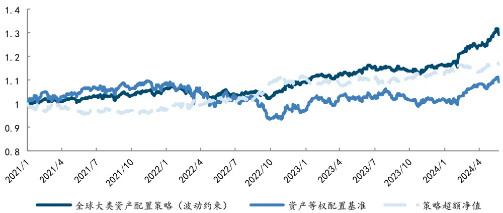
来源：Wind，国金证券研究所

图表30：全球大类资产配置策略（波动约束）指标

| 指标 | 全球大类资产配置策略（波动约束） | 资产等权配置基准 |
| --- | --- | --- |
| 年化收益率 | 7.86% | 2.67% |
| 年化波动率 | 6.13% | 8.69% |
| 夏普比率 | 1.28 | 0.31 |
| 最大回撤 | 6.13% | 14.91% |
| 年化超额收益率 | 4.70% | 1 |
| 信息比率 | 0.85 | - |
| 超额最大回撤 | 4.30% | 一 |
| 年化双边换手率 | 288.68% | 一 |

来源：Wind，国金证券研究所

添加波动约束后，策略的 Sharpe 比率上升到 1.28，同时年化双边换手率下降到 288.68%。策略的年化收益率保持在 7.86%，年化超额收益 4.70%，信息比率 0.85。叠加波动约束后，策略对债券的配置权重明显上升，因此收益也有明显下降。

以下是该策略的历史配置权重。

图表31：全球大类资产配置策略（波动约束）历史权重
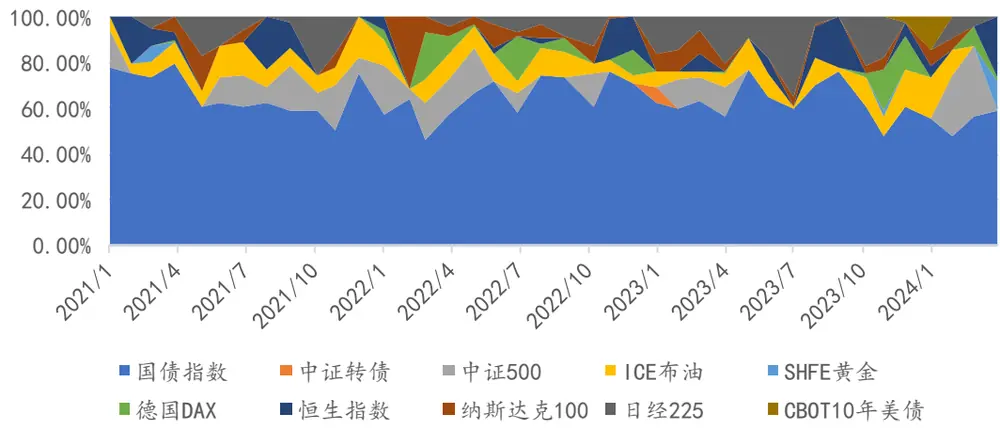
来源：Wind，国金证券研究所

## 总结

大类资产配置一直是投资的主流问题。本次研究首次将机器学习模型生成因子的方法用于大类资产配置领域，为资产配置提供了一种新思路。机器学习在对特征与特征、特征与标签的非线性关系捕捉上拥有强大的优势，同时能够生成便于进行截面比较的因子支持我们构建丰富的策略，这也是我们希望纳入到资产配置问题上来的。

当然，机器学习模型也绝不是万能的，任何模型都会存在特定市场环境下失效的可能。本次研究依旧存在以下可以改进的地方。首先，资产配置问题的小样本特征使得其可能更容易受到随机性的影响，对资产的选择以及其对应指数的不同选择，都可能对模型结果带来影响，这导致我们针对具体不同的配置问题都可能有完全不同的结论；此外，本文未将宏观数据所携带的丰富信息纳入模型中，如何将宏观数据通过模型融入当前的框架也需要进一步思考；最后，不同大类的资产可能有完全不同的特征规则，是否有必要进行分域学习以及如何融合同样是进一步研究方向之一。后续我们将考虑不断探索挖掘新的算法、新的有效特征、新的模型，使得机器学习方法在资产配置上发挥更重要的作用。在后续的研究报告中，我们将对以上存在的问题做进一步探讨，以期得到更加普适且可稳定的资产配置策略。

## 风险提示

1、以上结果通过历史数据统计、建模和测算完成，在政策、市场环境发生变化时模型存在时效的风险。

2、策略通过一定的假设通过历史数据回测得到，当交易成本提高或其他条件改变时，可能导致策略收益下降甚至出现亏损。

## 特别声明：

国金证券股份有限公司经中国证券监督管理委员会批准，已具备证券投资咨询业务资格。

形式的复制、转发、转载、引用、修改、仿制、刊发，或以任何侵犯本公司版权的其他方式使用。经过书面授权的引用、刊发，需注明出处为“国金证券股份有限公司”，且不得对本报告进行任何有悖原意的删节和修改。

本报告的产生基于国金证券及其研究人员认为可信的公开资料或实地调研资料，但国金证券及其研究人员对这些信息的准确性和完整性不作任何保证。本报告反映撰写研究人员的不同设想、见解及分析方法，故本报告所载观点可能与其他类似研究报告的观点及市场实际情况不一致，国金证券不对使用本报告所包含的材料产生的任何直接或间接损失或与此有关的其他任何损失承担任何责任。且本报告中的资料、意见、预测均反映报告初次公开发布时的判断，在不作事先通知的情况下，可能会随时调整，亦可因使用不同假设和标准、采用不同观点和分析方法而与国金证券其它业务部门、单位或附属机构在制作类似的其他材料时所给出的意见不同或者相反。

本报告仅为参考之用，在任何地区均不应被视为买卖任何证券、金融工具的要约或要约邀请。本报告提及的任何证券或金融工具均可能含有重大的风险，可能不易变卖以及不适合所有投资者。本报告所提及的证券或金融工具的价格、价值及收益可能会受汇率影响而波动。过往的业绩并不能代表未来的表现。

客户应当考虑到国金证券存在可能影响本报告客观性的利益冲突，而不应视本报告为作出投资决策的唯一因素。证券研究报告是用于服务具备专业知识的投资者和投资顾问的专业产品，使用时必须经专业人士进行解读。国金证券建议获取报告人员应考虑本报告的任何意见或建议是否符合其特定状况，以及（若有必要）咨询独立投资顾问。报告本身、报告中的信息或所表达意见也不构成投资、法律、会计或税务的最终操作建议，国金证券不就报告中的内容对最终操作建议做出任何担保，在任何时候均不构成对任何人的个人推荐。

在法律允许的情况下，国金证券的关联机构可能会持有报告中涉及的公司所发行的证券并进行交易，并可能为这些公司正在提供或争取提供多种金融服务。

本报告并非意图发送、发布给在当地法律或监管规则下不允许向其发送、发布该研究报告的人员。国金证券并不因收件人收到本报告而视其为国金证券的客户。本报告对于收件人而言属高度机密，只有符合条件的收件人才能使用。根据《证券期货投资者适当性管理办法》，本报告仅供国金证券股份有限公司客户中风险评级高于 C3 级(含 C3 级）的投资者使用；本报告所包含的观点及建议并未考虑个别客户的特殊状况、目标或需要，不应被视为对特定客户关于特定证券或金融工具的建议或策略。对于本报告中提及的任何证券或金融工具，本报告的收件人须保持自身的独立判断。使用国金证券研究报告进行投资，遭受任何损失，国金证券不承担相关法律责任。

若国金证券以外的任何机构或个人发送本报告，则由该机构或个人为此发送行为承担全部责任。本报告不构成国金证券向发送本报告机构或个人的收件人提供投资建议，国金证券不为此承担任何责任。

此报告仅限于中国境内使用。国金证券版权所有，保留一切权利。

上海

电话：021-80234211

北京

电话：010-85950438

深圳

电话：0755-86695353

邮箱：researchsh@gjzq.com.cn

邮箱：researchbj@gjzq.com.cn

邮箱：researchsz@gjzq.com.cn

邮编：201204

邮编：100005

邮编：518000

地址：上海浦东新区芳甸路 1088 号

地址：北京市东城区建内大街 26 号

地址：深圳市福田区金田路 2028 号皇岗商务中心

紫竹国际大厦 5 楼

新闻大厦 8 层南侧

18 楼 1806

【小程序】国金证券研究服务

【公众号】国金证券研究