# Beta 猎手系列之十

金融工程专题报告

证券研究报告

金融工程组

分析师：高智威（执业

联系人：许坤圣

S1130522110003)

xukunsheng@gjzq.com.cn

gaozhiw@gjzq.com.cn

# 个股K线图形态AI 识别构建市场风格预测

## 基于成分股CNN 图像识别构建风格轮动模型研究背景

CNN（Convolutional Neural Network，卷积神经网络）是一种深度学习模型，它在图像识别、视频分析和自然语言处理等领域中非常流行和有效。CNN 模型通常包含以下几个关键组件：卷积层、激活函数、池化层、全连接层。CNN模型的训练过程通常包括前向传播和反向传播两个阶段。

CNN 可以根据处理的数据维度分为 1D（一维）和 2D（二维）两种类型：1D CNN（一维卷积神经网络）：主要用于处理时间序列数据，例如时间序列、音频信号或文本数据。2D CNN 是最常见的 CNN 类型，主要用于处理具有二维结构的数据，如图像、视频帧或高分辨率地图。采用图像化方法来展现整个数据矩阵，可以增强统计模型识别复杂模式的能力。

本研究框架基于《(Re-)Imag(in)ing Price Trends》一文，使用该论文中绘制股票价格图表的方法，即 OHLC 图+移动平均线+成交量柱状图，同时还借鉴了论文中的二分类标签分类方法：如果预测的收益率为正值，则图像标签为 1；如果预测的收益率为负值或零，则图像标签为 0。

## 基于卷积神经网络的全市场量化选股因子

本研究设计了一个基于卷积神经网络（CNN）的模型，用于预测滚动 20 天窗口股票价格的未来走势。模型利用两个卷积层自动提取时间序列的复杂特征，每层后接最大池化层以降低特征维度。处理后的特征图被展平并送入全连接层，最终输出两个概率值，分别代表股票未来价格上涨和下跌的可能性。最终我们以股票上涨的概率作为因子进行选股。

我们定义“AI 识别 K 线”因子为使用包含过去 20 日价量数据的改进后的 OHLC 图表来预测未来20 个交易日收益情况的因子，并以 20 个交易日为周期进行调仓。从分位数组合表现上看，AI 识别 K 线因子单调性较好。从 IC 测试表现来看，AI 识别 K 线因子在全市场的 RankIC 均值为 5.52%，效果较为显著。从因子分组净值表现上看，AI 识别K线因子单调性较好，多头端和空头端均表现出色，年化超额收益率分别为 5.36%和-12.14%。从因子多空净值表现上看，AI 识别 K 线因子的多空净值在 2021 年后迎来大幅增长，多空组合年化收益率达到了 18.94%，夏普比率为 1.79，表现出色。

另外我们还对AI识别K线因子在沪深300、中证500、中证1000股票池中进行了因子测试。从IC测试表现来看，AI识别 K 线因子在沪深 300、中证 500、中证 1000 股票池中的 RankIC 均值分别为 3.89%、3.96%、4.85%。由下面的图表我们可以发现，不论从 RankIC 均值还是因子单调性表现来说，AI 识别 K 线因子在中证 1000 股票池中的表现远远好于沪深 300 和中证 500 股票池。

## 基于成分股CNN 图像识别的风格轮动模型

本节将基于前文构建的 AI 识别 K 线因子，进一步构造基于风格指数成分股的 CNN 强信息因子，从个股的微观视角出发，探索其与风格指数的联动关系，旨在构建出更为精准且高效的风格轮动策略。我们设定了 2018 年 1 月 9 日至2024 年 5 月 17 日为回测时间段，每 20 个交易日进行调仓，且以各风格指数的等权持有组合作为我们的业绩比较基准。回测结果显示，策略超额净值实现了 12.38%的年化收益率和 0.89 的夏普比率，同时最大回撤率控制在-6%左右，胜率为 64.94%。根据模型最新一期信号，建议 6 月配置小盘成长指数，预期会相对基准组合取得超额收益。

## 风险提示

以上结果通过历史数据统计、建模和测算完成，历史规律不代表未来；在市场环境发生变化时，模型存在失效的风险；策略依据一定的假设通过历史数据回测得到，当交易成本或其它条件改变时，可能导致策略收益下降甚至出现亏损。

## 一、基于成分股CNN 图像识别构建风格轮动模型研究背景

在先前的研究中，我们深入挖掘了机器学习在选股和资产配置领域的应用潜力，具体可以参考国金证券金融工程组的《Alpha 掘金系列之九：基于多目标、多模型的机器学习指数增强策略》、《Alpha 掘金系列之十：机器学习全流程重构——细节对比与测试》、《BETA 猎手系列之九：人工智能全球大类资产配置模型》等研究报告。

本研究进一步拓展了这一领域的边界，我们采用了卷积神经网络（CNN）模型，对股票价格走势图进行更为深入和细致的图像识别分析。我们致力于利用 CNN 在图像识别领域的卓越能力，以期超越传统的人工技术分析方法，对风格指数成分股的价格走势进行精准的图像识别，进而实现对市场风格变化的准确预测。

## 1.1 CNN 的发展历程

CNN（Convolutional Neural Network，卷积神经网络）是一种深度学习模型，它在图像识别、视频分析和自然语言处理等领域中非常流行和有效。

早期发展：在 20 世纪 40 年代至 80 年代，Warren Sturgis McCulloch 和 Walter Pitts奠定了人工神经网络的数学基础，为神经网络的发展铺平了道路。Frank Rosenblatt 发明了感知机，这是神经网络研究的起点。David Hubel 和 Torsten Wiesel 通过对视觉皮层的研究，为卷积神经网络的构建提供了生物学基础。

卷积神经网络的诞生：在20 世纪 80年代至 90 年代，日本学者福岛邦彦开创性地提出了"新认知机"这一概念，它标志着早期卷积神经网络模型的诞生。这种模型能够高效地处理视觉信息，并成功识别出基本的图形和形状。与此同时，Yann LeCun 的贡献同样不容忽视，他提出的 LeNet-5 模型，专为手写数字识别而设计，成为了现代卷积神经网络（CNNs）的奠基之作。LeNet-5 模型巧妙地融合了卷积层、池化层和全连接层，这一结构不仅在当时引领了技术潮流，更为今日深度学习领域的蓬勃发展奠定了坚实的基础。

图表1：LeNet-5 网络结构图
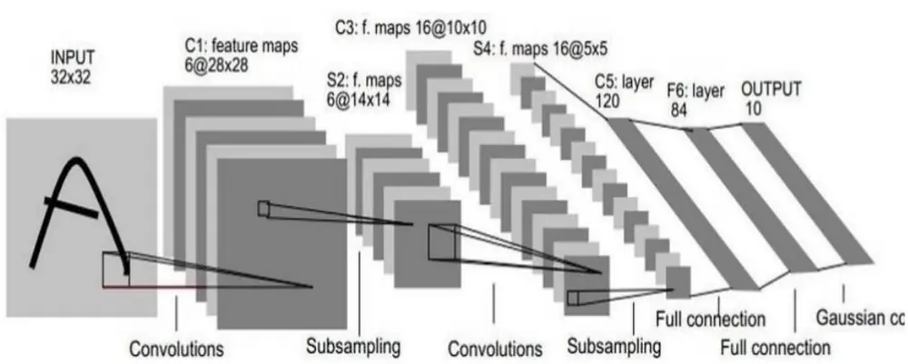
来源：《Gradient-Based Learning Applied to Document Recognition》，国金证券研究所

深度学习和 CNNs的兴起：在21世纪初，Geoffrey Hinton与他的同事们提出了深度置信网络和无监督特征学习的理论，为深度学习的进步奠定了关键基础。随后，AlexKrizhevsky 等人设计的 AlexNet 模型，在 ImageNet 竞赛中取得了革命性的成功，不仅刷新了图像识别的记录，也点燃了深度学习在视觉计算领域的广泛兴趣和应用。

CNNs 的快速发展：自 2010 年以来，深度学习领域迎来了一系列创新突破。牛津大学的Karen Simonyan 和 Andrew Zisserman 推出了 VGGNet，凭借其深层网络结构显著提升了图像识别的准确度。Google 的研究团队带来了 GoogLeNet，引入 Inception 模块，实现了多尺度并行卷积，进一步优化了网络性能。微软的研究人员开发了 ResNet，通过残差连接技术，使得训练极深网络成为现实。而 Ross Girshick 等人提出的 Faster R-CNN，结合区域建议网络与 CNN，为高效精准的目标检测树立了新的标杆。

图表2：AlexNet 结构图
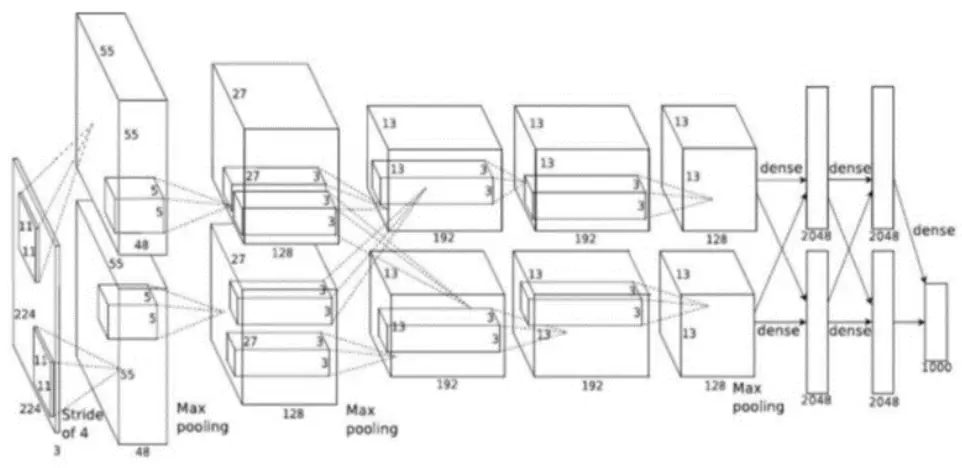
来源：《ImageNet Classification with Deep Convolutional Neural Networks》，国金证券研究所

## 1.2 CNN 的基本结构

CNN 模型通常包含以下几个关键组件：卷积层（Convolutional Layer）、池化层（Pooling Layer）、激活函数（Activation Function）、全连接层（Fully ConnectedLayer）。

卷积层：通过滤波器来提取输入数据的局部特征。这是 CNN 的核心，通过滤波器来提取输入数据的局部特征。滤波器在输入数据上滑动，计算局部区域的加权和，生成特征图。严格来说，卷积层是个错误的叫法，因为它所表达的运算其实是互相关运算，而不是卷积运算。

图表3：卷积层互相关运算示意图
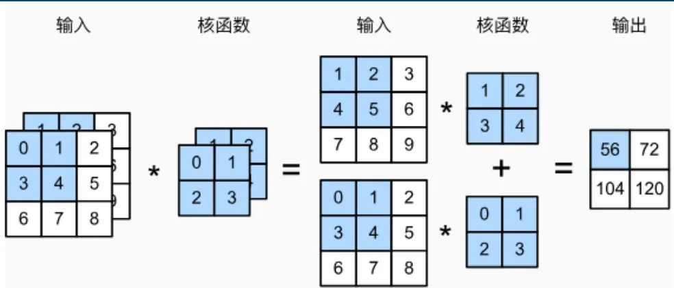
来源：《动手学深度学习》，国金证券研究所

池化层：用于降低特征图的空间尺寸，减少参数数量和计算量，同时使特征检测更加鲁棒。常见的池化操作有最大池化（Max Pooling）和平均池化（Average Pooling）。

图表4：池化层示意图
图表5：池化层计算示意图

| 输入 |  |  |  | 输出 |  | max(0, 1, 3, 4) = 4, |
| --- | --- | --- | --- | --- | --- | --- |
| 0 |  | 1 | 2 2x2最大 | 4 | 5 | max(1, 2, 4, 5) = 5, |
| 3 | 4 | 5 | 汇聚层 | 7 | 8 | max(3, 4, 6, 7) = 7, |
| 6 | 7 | 8 |  |  |  | max(4, 5, 7, 8) = 8. |

来源： 《动手学深度学习》，国金证券研究所
来源：《动手学深度学习》，国金证券研究所

激活函数：帮助引入非线性，使得网络能够学习和模拟复杂的函数映射。

全连接层：在多个卷积和池化层之后，全连接层将特征图转换成最终的输出，如分类标签。

CNN 模型的训练是一个迭代的优化过程，它通过前向传播和反向传播两个阶段来实现。在前向传播阶段，输入数据在网络中向前流动，每一层对数据进行处理，提取特征，并生成预测结果。随后，在反向传播阶段，从输出层开始，反向传播损失函数的梯度。这个过程是逐层进行的，从输出层开始，逆向通过每一层，直到输入层。在每一层，损失函数的梯度被用来计算该层权重的梯度。这些梯度指导着网络中的权重和偏置进行调整，目的是逐步减少预测误差，提高模型的泛化能力。这个过程不断重复，直到模型达到预定的准确度或训练达到一定的迭代次数，确保模型在新的、未见过的数据上也能做出准确的预测。

## 1.3 CNN 的应用

CNN 模型，以其对数据维度的适应性，分为 1D（一维）和 2D（二维）两种主要类型，各自针对不同的数据处理需求：

1D CNN（一维卷积神经网络）：这种网络专为处理线性序列数据而设计，广泛应用于音频分析、时间序列预测以及文本数据的处理。1D CNN 通过在数据的单一维度上应用卷积操作，有效地捕捉了数据在时间或序列上的局部特征和长期依赖关系。

2D CNN：这种类型是处理图像、视频帧或地理信息等二维数据的主力军。2D CNN 通过在数据的两个空间维度上执行卷积，能够识别和理解图像中的局部特征，如边缘、纹理等，并能够组合这些局部特征以识别更复杂的模式和对象。

我们进一步认为，将数据图像化不仅是一种展示手段，更是一种强大的分析工具。图像能够直观地揭示数据中的模式和结构，这种方式在某些情况下比传统的时间序列分析更为高效。人类大脑在处理视觉信息时具有天生的优势，同样，深度学习模型在处理图像化的数据时也能更好地发现和学习数据中的复杂模式。通过将数据转换为图像，我们可以利用 2D CNN 的强大能力，增强模型对数据内在结构的理解，从而在诸如图像识别、场景理解等任务中取得更好的性能。这种图像化方法的运用，为统计模型提供了一种新的视角，使其能够以一种更加直观和全面的方式来处理和解释数据。

## 1.4 研究框架

本文的研究架构是在深入研读《(Re-)Imag(in)ing Price Trends》一文的基础上构建的。在细节处理上，本研究继承并采纳了该论文中绘制股票价格图表的技术，特别是采用了OHLC（开盘价、最高价、最低价、收盘价）图这一经典方法。我们不仅继承了这一方法，还在其基础上进行了创新，通过整合移动平均线和成交量柱状图，进一步丰富了图表的表现力和信息维度，使得图表能够更加全面地反映市场动态。

在 CNN 模型的架构设计方面，本研究也深受该论文启发，但我们并未止步于模仿，而是根据中国市场 A 股股票的具体特性，对模型架构进行了深思熟虑的调整与优化。这些调整旨在使模型更加精准地捕捉市场特征，更好地适应市场的波动性和不确定性，从而提高预测的准确性和可靠性。

最后，本研究借鉴了论文中的二分类标签分类方法，将复杂的股票价格趋势预测问题转化为一个更为清晰的分类问题。具体而言，我们将预测的收益率是否为正值作为分类的依据：预测收益率为正，则图像标签定义为 y=1，表示股票价格上涨；若预测收益率为负或零，则标签定义为 y=0，预示着股票价格的下跌或平稳。这种简化的分类方法不仅使问题的处理更为直接，而且有助于提升模型的预测效率和准确性。

## 二、基于卷积神经网络的全市场量化选股因子

## 2.1 绘制股票价格图像

在本节的研究中，我们采用了 OHLC 图——一种记录开盘价、最高价、最低价和收盘价的金融图表，作为分析 A 股市场股票价格走势的主要工具。OHLC 图因其全面性和直观性，在金融领域中被广泛采用，它能够精确捕捉并展示特定时间段内金融资产如股票、外汇、期货的价格波动情况。

为了进一步增强图像的信息量和数据的密集度，我们在传统的 OHLC 图基础上进行了创新性的拓展。我们巧妙地融入了移动平均价格线，这一元素不仅揭示了价格趋势的平滑变化，还为识别市场动向提供了有力的时间序列参考。同时，我们引入了成交量柱状图，这一视觉元素的加入，使得交易活动的强度和市场参与度变得一目了然。

这些视觉增强措施，不仅极大地优化了图表的表现力，使其成为更加生动、信息丰富的数据展示平台，而且为 CNN 预测模型提供了更为详实和高质量的图像输入数据。这种数据的丰富性和高质量，显著提升了模型对市场动态的捕捉能力，增强了其对价格趋势的预测精度。

图表6：带有移动平均线和成交量柱状图的20天窗口 OHLC示意图
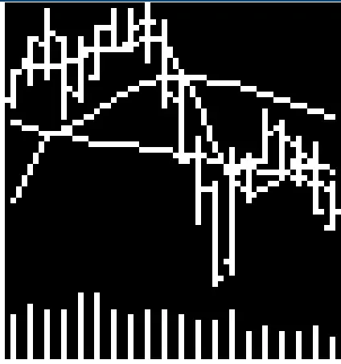
来源： Wind，国金证券研究所

## 2.2 CNN 模型架构设计

在本研究中，我们构建了一个基于卷积神经网络（CNN）的预测模型，该模型专注于分析并预测股票价格在滚动 20 天窗口后的未来走势。

首先，模型利用了两个卷积层来自动提取特征。每层卷积层后接批量归一化（BatchNormalization）和最大池化（Max Pooling）层。批量归一化层通过调整和缩放激活输出，有助于加快学习速度，同时减少对初始化参数的敏感性。最大池化层则通过降低特征维度，使得模型能够专注于最重要的特征，从而增强其泛化能力。

这两个卷积层分别配置了 64 和 128 个卷积核，尺寸为 5x3，这样的配置确保了特征提取的深度和广度。卷积核尺寸的选择允许模型在时间序列上捕捉到局部特征，而不同数量的卷积核则有助于从不同的角度提取信息。

接下来，处理后的特征图被展平，为进一步的分析做准备。在特征提取之后，我们采用了 LRelu（Leaky Rectified Linear Unit）作为激活函数。LRelu 是一种改进的 ReLU 函数，它允许负值有一个非零的梯度（通过一个小的斜率），这有助于解决 ReLU 函数中的"死亡 ReLU"问题，即当输入为负时，梯度为零，导致某些神经元不再更新。LRelu 通过允许小的负梯度，使得网络在训练过程中更加鲁棒。

在全连接层之后，模型的输出层使用了softmax函数来产生两个概率值。softmax函数是一种将实数向量转换为概率分布的函数，它在多分类问题中非常常见。在本模型中，softmax 函数将输出层的值转换为两个概率值，分别代表股票未来价格上涨和下跌的可能性。这种转换确保了输出值的总和为 1，并且每个值都在 0 到 1 之间，表示概率。最终，我们以股票上涨的概率作为因子进行选股。

在模型实现的具体细节上，我们采用了 Xavier 初始化方法来优化权重初始化，并通过Adam 优化器进行模型中各组神经元权重的更新，以加速收敛并提高模型训练的效率。此外，为了确定训练过程中的最优早停点，我们使用了独立于训练数据的验证集来监控模型性能，确保模型在泛化能力最强的时刻停止训练。

本研究采用了包含数百万张改进 OHLC 图表的庞大数据集，这些图表详尽记录了过去 20日的价量信息。这样的数据集不仅为模型提供了海量的图像输入，也极大地丰富了模型训练的样本多样性。通过分析数百万张图表，我们的模型能够深入学习市场动态，理解其内在的复杂性和多变性。这种规模的数据集是实现深度学习和模式识别的关键，它使我们的模型在预测股票价格走势时更为精确和可靠。

在本文的后续部分，我们将这种模型表示法简写为 I{x}R{y}，其中 x 代表输入数据的时间窗口长度，而 y 代表我们预测未来 y 日收益的时间范围。例如，AI 识别 K 线即指利用20日的历史价量信息来预测接下来20个交易日的收益情况，且投资决策的更新周期同样设定为 20 天。

图表7：CNN 模型架构
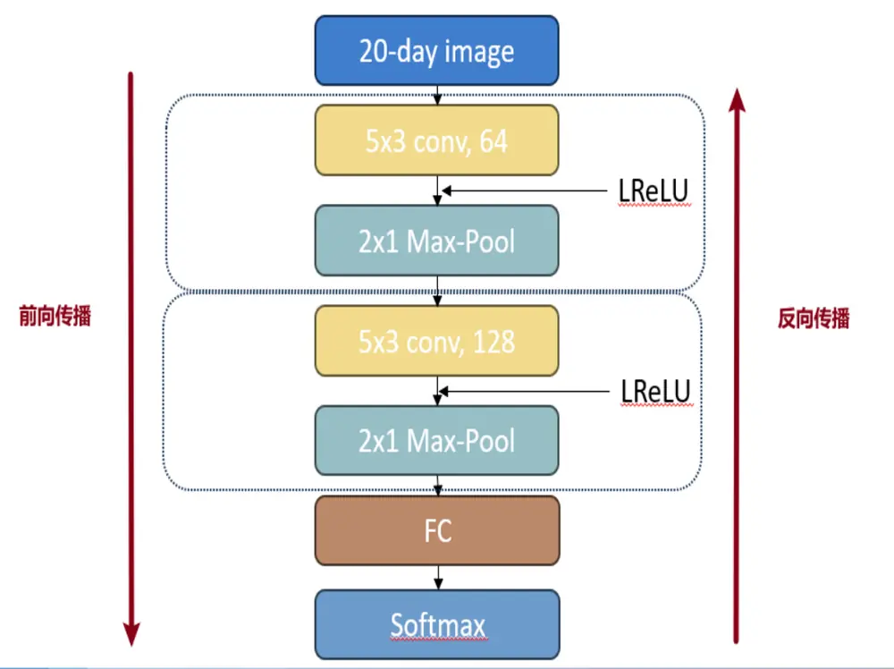
来源：国金证券研究所

## 2.3 训练 CNN 模型

在本节中，我们将详细阐述训练 CNN 模型时需要考虑的关键细节：

数据集划分：我们采纳了滚动时间窗口的训练方法，对数据集进行了精心的划分，包括训练集、验证集和测试集。训练集覆盖了长达5年的时间跨度，而验证集和测试集各为1年，这样的划分旨在确保模型在历史数据上充分学习，同时在近期数据上验证其稳定性和泛化能力。

损失函数的选择：在本研究中，我们将股票价格趋势预测问题视为一个二分类任务。具体而言，当预测收益率呈现正值时，相应图像的标签被标记为 y=1；若收益率为负或零，则标签为 y=0。我们选择交叉熵损失函数作为模型训练的优化目标，这一函数在分类问题中被广泛采用，它通过衡量预测概率与实际标签之间的差异，引导模型学习如何更准确地区分股票的未来涨跌。

参数调优：参数调优对于提升模型性能至关重要。以下是我们对关键超参数的细致描述：学习率：设置为 0.005，这是一个常用的起始学习率，有助于模型在训练初期快速收敛；Batch_size：我们选择了 32 作为批量大小，这有助于平衡计算资源的使用和模型的泛化能力；Dropout 率：设置为 40%，这一比率有助于减少模型的过拟合，通过在训练过程中随机丢弃一些网络连接，迫使网络学习更加鲁棒的特征；模型包含两个卷积层，每层后接批量归一化和最大池化层，以降低特征维度并增强泛化能力；我们采用了 Xavier 初始化方法，以确保在训练开始时，权重的分布是合理的，从而加速收敛。

早停策略：为了防止模型在训练数据上过拟合，并确保其在未见数据上保持强大的泛化能力，我们引入了早停策略。该策略会在验证集上的性能在一定周期内未能进一步改善时触发，此时我们将终止训练过程。这种做法有助于我们锁定模型的最佳表现点，避免过度训练带来的性能损害。

图表8：CNN 模型细节

| CNN 模型细节 | 参数 |
| --- | --- |
| 数据区间 | 2012年1月1日-2024年5 月31日 |
| 时间窗口 | 20 |
| Batch_size | 32 |
| 学习率 | 0.005 |
| Dropout率 | 40% |
| 分类数量 | 2 |
| MA 线数量 | 3(MA5、MA20、MA60) |
| 是否开启“早停机制” | 是 |
| 若开启“早停机制”， 则连续 n 个 epoch 未改 | 2 |
| 善loss 则停止训练 卷积层数量 |  |
| 是否加入批量归一化层 | 2 是 |
| 卷积核大小 | 5×3 |
| 是否 xavier 初始化 |  |
| 是否滚动训练 | 是 |
| 滚动训练的训练集、验 证集、测试集长度 | 是 |

来源：国金证券研究所

## 2.4 实证分析：基于卷积神经网络的全市场量化选股因子

在本文中，我们基于卷积神经网络（CNN）构建了一个名为 AI 识别 K 线因子模型，该模型以每 20 个交易日为周期进行调仓操作。对于所选股票的数据，我们在每个时间窗口内对量价数据采用了归一标准化方法进行预处理，以增强模型的泛化能力。

图表9：基于卷积神经网络的AI识别K线因子基础参数

| 参数名称 | 参数 |
| --- | --- |
| 选股范围 | 全市场 |
| 股票预处理 | 剔除非上市、摘牌、ST/*ST、涨跌停板股票 |
| 数据预处理 | 归一标准化 |
| 数据区间 | 2012年1月～2024年5月 |
| 调仓周期 | 每20个交易日 |

来源：国金证券研究所

从分位数组合表现上看，AI 识别 K 线因子单调性较好，这意味着随着分位数的递增，因子所选股票的预期收益呈现出一致的上升趋势。从IC测试表现来看，AI识别K线因子在全市场的 RankIC 均值为 5.52%，效果较为显著。

图表10：AI识别K线因子分位数年化超额收益
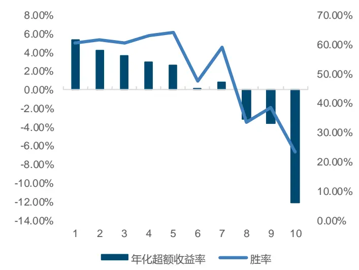
来源： Wind，国金证券研究所

图表11：AI识别K线因子IC测试表现
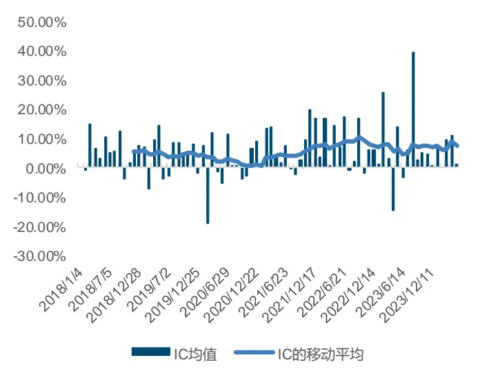
来源： Wind，国金证券研究所

在因子分组净值的表现上，AI 识别 K 线因子也展现了其出色的单调性，无论是多头端还是空头端，均表现出色，年化超额收益率分别为 5.36%和-12.14%。进一步观察 AI 识别 K线因子的多空净值表现，可以发现自 2021 年起，其增长势头尤为强劲。多空组合的年化收益率高达 18.94%，夏普比率为 1.79，表现非常出色。

图表12：AI识别K线因子分组净值表现
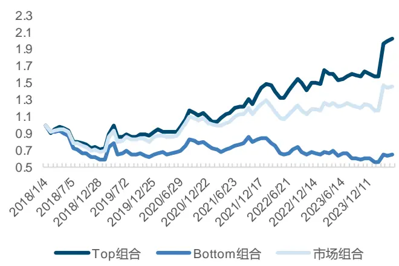
来源： Wind，国金证券研究所

图表13：AI识别K线因子多空净值表现
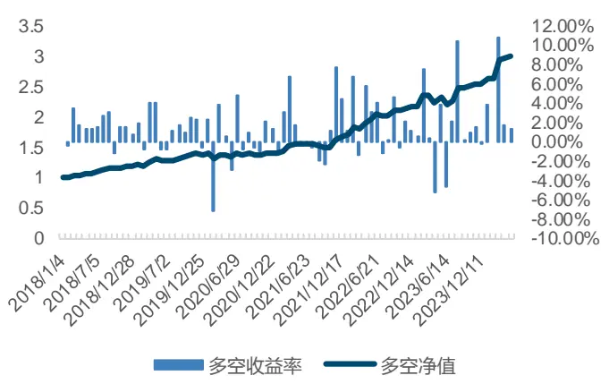
来源： Wind，国金证券研究所

另外我们还对 AI 识别 K 线因子在沪深 300、中证 500、中证 1000 股票池中进行了因子测试。从IC测试表现来看，AI识别K线因子在沪深300、中证500、中证1000股票池中的RankIC 均值分别为 3.89%、3.96%、4.85%。由下面的图表我们可以发现，不论从 RankIC均值还是因子单调性表现来说，AI识别K线因子在中证1000股票池中的表现远远好于沪深 300 和中证 500 股票池。

图表14:沪深300 AI识别K线因子分位数年化超额收益
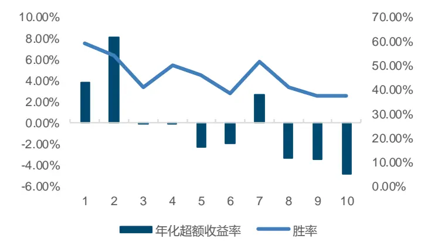
来源： Wind，国金证券研究所

图表15：沪深 300 AI 识别K线因子IC 测试表现
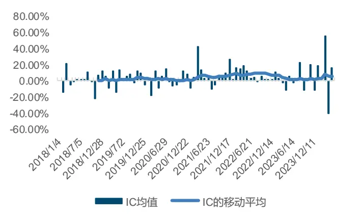
来源： Wind，国金证券研究所

图表16：中证500 AI识别K线因子分位数年化超额收益
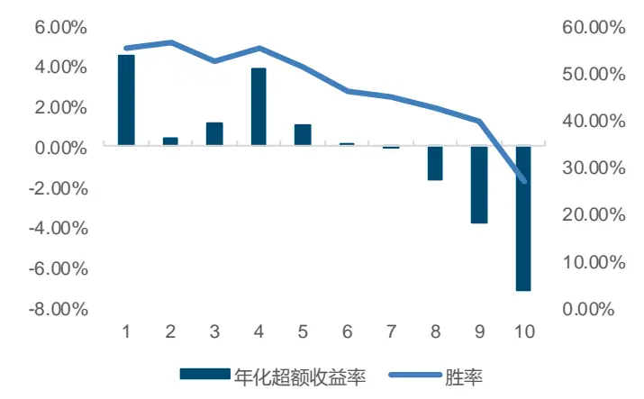
来源： Wind，国金证券研究所

图表17：中证 500 AI 识别K线因子IC 测试表现
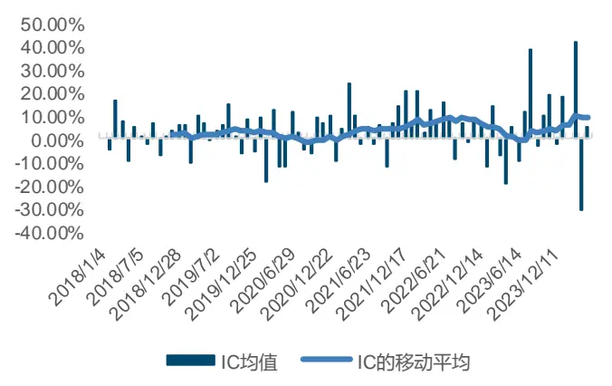
来源： Wind，国金证券研究所

图表18：中证1000 AI识别K线因子分位数年化超额收益
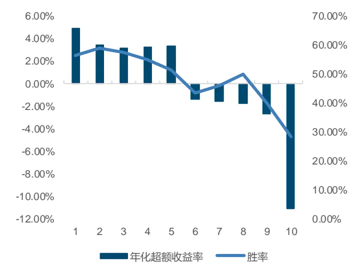
来源： Wind，国金证券研究所

图表19：中证 1000 AI 识别K 线因子 IC 测试表现
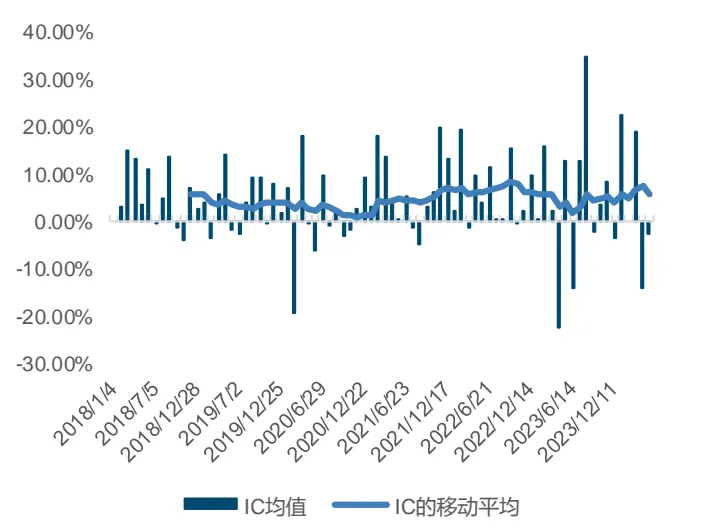
来源： Wind，国金证券研究所

另外，本文还测试了 AI 识别 K 线因子和国金金工之前报告中构建的选股大类因子的相关性，包括《Alpha 掘金系列之十：机器学习全流程重构——细节对比与测试》构建的深度学习合成因子（GBDT+NN_AdjCI）还有其余各量价和基本面的大类因子。我们能发现通过图像识别的 AI 识别 K 线因子，无论是与机器学习量价、传统量价还有基本面因子的相关性都不高，是个比较好补充的信息维度。

图表20：AI识别K线因子与其他大类因子的相关性
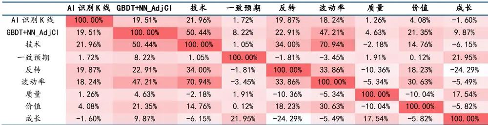
来源：Wind，国金证券研究所

## 三、基于成分股CNN 图像识别的风格轮动模型

引言：“圣人见微以知萌，见端以知末”。《韩非子·说林上》中的这句话强调了洞察先机的重要性。在金融市场，这种能力尤为宝贵，它可以帮助投资者从市场的微小波动中预见即将到来的大规模趋势。

风格轮动作为金融研究中的核心议题之一，历来受到广泛关注。然而，传统研究多从宏观角度出发，往往存在一定的滞后性，难以及时捕捉市场风格的快速变化。为了突破这一局限，若能从股票的高频数据中挖掘出潜在的规律，无疑将为市场风格轮动预测提供一种全新的视角和方法。

基于这一思路，本节将在前文构建的 AI 识别 K 线因子的基础上，进一步构造基于风格指数成分股的 CNN 强信息因子。我们将从个股的微观视角出发，深入探索其与风格指数之间的联动关系。通过卷积神经网络的强大数据处理和模式识别能力，我们期望能够从风格指数成分股的高频数据中捕捉到市场风格的微妙变化，并据此构建出精准且高效的风格轮动策略。

## 3.1 构造基于风格指数成分股的 CNN 强信息因子

在风格轮动的研究中，一个极具挑战性的问题是如何将个股因子映射到风格指数上。在本研究的探索初期，我们尝试了一种直观的方法：将个股因子值直接映射到其对应的成分股上，并采用等权重的方式合成指数层面的因子值。然而，这种方法并未达到预期效果，因子值的合成在实践中显示出较大的波动性和不稳定性。

为了解决这一问题，我们深入分析了 AI 识别 K 线因子的数据特征。我们注意到，由于模型采用了滚动训练策略，每年的因子表现呈现出显著的差异性，这使得单纯从绝对数值角度进行评估变得不再可行。面对这一问题，我们对因子值进行了预处理，将其转换为十分组编号，这一转换不仅稳定了因子值的分布，也为我们提供了一个更为合理的评估和比较基准。

在前文的研究中，AI 识别 K 线因子在全市场的表现已经显示出了一定的选股潜力，尤其是在多空组合策略上，其在不同板块的表现均十分出色。这表明，相较于其他分组，AI识别 K 线因子的多空组合策略蕴含了更为丰富的有价值信息，可以为投资者提供更为精准的市场洞察。

图表21：全市场AI识别K线因子年化超额收益率分档表现
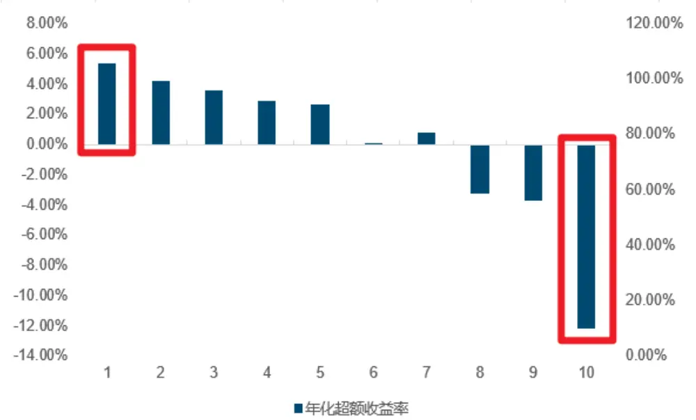
来源： Wind，国金证券研究所

因此，基于 AI 识别 K 线因子的稳健表现，我们以 AI 识别 K 线因子为基础，进一步构建了基于风格指数成分股的 CNN 强信息因子。具体的构建步骤概述如下：

AI 识别K 线因子的计算与分组：我们首先计算整个市场中所有个股的AI识别K线因子，并在每个时间截面上将它们基于因子值的高低进行排序，划分为 10 个分位数组别，每个组别包含相等数量的股票。

个股因子到风格指数的映射：接下来，我们专注于风格指数的成分股。我们统计这些成分股在 AI 识别 K 线因子上的分组分布情况，特别是关注表现最好（第 10 组）和表现最差（第 1 组）的股票数量。通过计算这两组之间的股票数量差，并将其除以成分股的总数，我们得到了一个衡量因子分布差异的关键指标。

权重系数的引入：为了进一步增强模型的预测能力，我们引入了权重系数的概念。具体来说，我们将第 10 分组与第 1 分组的股票数量占总成分股数量的比例，作为权重系数。这一权重系数反映了在风格指数中，极端表现股票的相对重要性，有助于我们更准确地捕捉市场的风格轮动趋势。

公式简化如下：CNN强信息因子 = 分布差异 × 权重系数 = (Num10−Num1) × (Num10+Num1∑ Numi10∑ Numi10

## 3.2 实证分析：基于成分股 CNN 图像识别的风格轮动模型

本文基于风格指数成分股构建了 CNN 强信息因子，并依据该因子构建风格轮动模型。在本节研究中，考虑到红利类风格指数近期强势的表现，我们将其与传统的成长、价值类风格指数一并作为我们风格轮动模型的研究对象。我们设定了 2018 年 1 月 9 日至 2024年 5 月 17 日为回测时间段，每 20 个交易日进行调仓，且以各风格指数的等权持有组合作为我们的业绩比较基准。

图表22：基于成分股CNN图像识别的风格轮动模型基础参数

| 参数名称 | 参数 |
| --- | --- |
| 风格指数 | 小盘成长（399376.SZ） 小盘价值（399377.SZ） 大盘成长（399372.SZ） 大盘价值（399376.SZ） |
| 数据区间 | 中证红利（399373.SZ） 2018年1月9日～2024年5月17日 |
| 调仓周期 基准指数 | 每20个交易日 |

来源：国金证券研究所

下图中可以看到，各风格指数 CNN 强信息因子组合所占截面成分股总数比重较为稳定，除极端行情外，大部分时间都在 20%上下波动，符合我们的预期，说明大部分时间内 AI识别 K 线因子在风格指数成分股中的分布较为均衡。

图表23：各风格指数历史净值表现
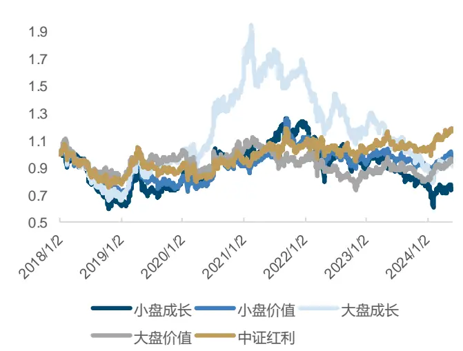
来源： Wind，国金证券研究所

图表24：各风格指数 CNN强信息因子组合所占截面成分股总数比重
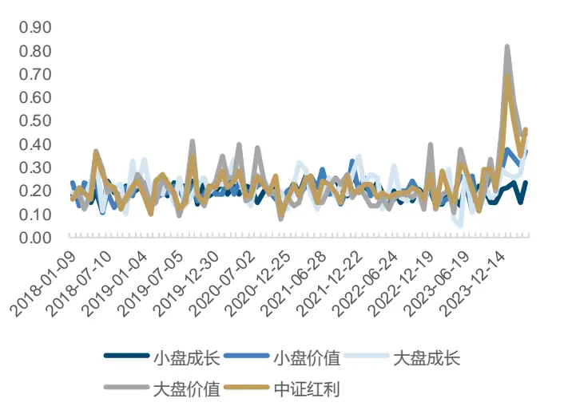
来源： Wind，国金证券研究所

回测结果显示，策略超额净值实现了12.38%的年化收益率和0.89的夏普比率，同时最大回撤率控制在-6%左右，胜率为 64.94%，超额净值曲线也一直保持向上的趋势，表现可喜。

图表25：基于成分股CNN图像识别的风格轮动模型净值表现
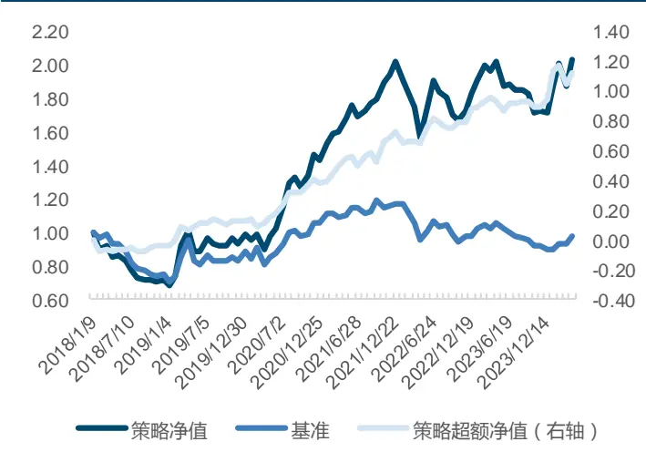
来源： Wind，国金证券研究所

图表26：基于成分股CNN图像识别的风格轮动模型收益 表现

| 统计指标 | 策略多头 | 基准 | 策略超额 |
| --- | --- | --- | --- |
| 年化收益率 | 11.68% | -0.37% | 12.38% |
| 年化波动率 | 22.15% | 17.37% | 11.10% |
| 夏普比率 | 0.41 | -0.17 | 0.89 |
| 最大回撤率 | -25.93% | -28.32% | -6.12% |
| 胜率 | 54.55% | 48.05% | 64.94% |
| 平均换手率 | 140.26% |  | 一 |

来源： Wind，国金证券研究所

根据模型最新一期信号，建议 6 月配置小盘成长指数，预期会相对基准组合取得超额收益。

图表27：模型历史信号
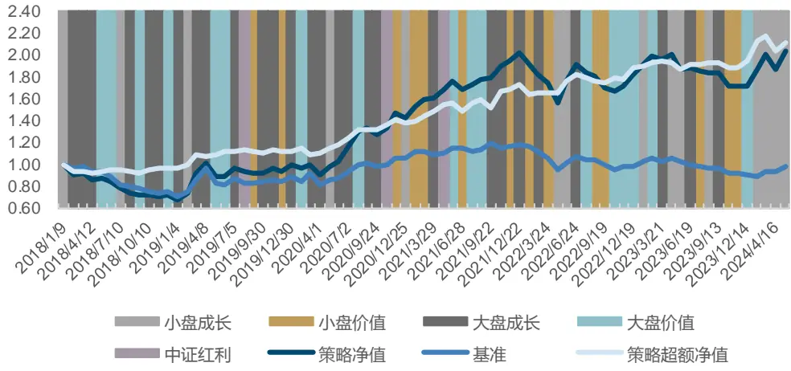
来源：Wind，国金证券研究所

## 四、总结

基于卷积神经网络构造的 AI 识别 K 线因子在全市场中具有一定的选股能力，展现出了良好的单调性和稳定的预测能力。

为了进一步提升预测精度，关键在于找到一种合适的映射机制，将个股层面的 AI 识别 K线因子信息有效地整合到风格指数层面。我们相信，通过选择合适的映射方法，基于指数成分股的 CNN 强信息因子将能够对市场风格的变化进行更为精准的预测，从而为投资者提供更为有力的决策支持。

当然，AI 识别 K 线因子仍有许多有效信息未被有效挖掘，在后续的研究报告中，我们将继续完善基于成分股 CNN 图像识别构建风格轮动模型的研究，尝试加入更多有效因子，挖掘更多因子背后有效的信息，力争推出可供投资的风格轮动策略。

## 参考文献

[1] Lecun, Y, and L. Bottou . "Gradient-based learning applied to document recognition." Proceedings of the IEEE 86.11(1998):2278-2324.

[2] Krizhevsky, Alex , I. Sutskever ,and G.Hinton ."ImageNet Classification with Deep Convolutional Neural Networks." Advances in neural information processing systems 25.2(2012).

[3] Jiang, Jingwen , B. T. Kelly , and D. Xiu ."(Re-)Imag(in)ing Price Trends." SSRN Electronic Journal (2020).

[4] 张 Zhang, Aston 等. 动手学深度学习. 人民邮电出版社, 2019.

## 风险提示

1、以上结果通过历史数据统计、建模和测算完成，历史规律不代表未来；

2、在市场环境发生变化时，模型存在失效的风险;

3、策略依据一定的假设通过历史数据回测得到，当交易成本或其它条件改变时，可能导致策略收益下降甚至出现亏损。

## 特别声明：

国金证券股份有限公司经中国证券监督管理委员会批准，已具备证券投资咨询业务资格。

形式的复制、转发、转载、引用、修改、仿制、刊发，或以任何侵犯本公司版权的其他方式使用。经过书面授权的引用、刊发，需注明出处为“国金证券股份有限公司”，且不得对本报告进行任何有悖原意的删节和修改。

本报告的产生基于国金证券及其研究人员认为可信的公开资料或实地调研资料，但国金证券及其研究人员对这些信息的准确性和完整性不作任何保证。本报告反映撰写研究人员的不同设想、见解及分析方法，故本报告所载观点可能与其他类似研究报告的观点及市场实际情况不一致，国金证券不对使用本报告所包含的材料产生的任何直接或间接损失或与此有关的其他任何损失承担任何责任。且本报告中的资料、意见、预测均反映报告初次公开发布时的判断，在不作事先通知的情况下，可能会随时调整，亦可因使用不同假设和标准、采用不同观点和分析方法而与国金证券其它业务部门、单位或附属机构在制作类似的其他材料时所给出的意见不同或者相反。

本报告仅为参考之用，在任何地区均不应被视为买卖任何证券、金融工具的要约或要约邀请。本报告提及的任何证券或金融工具均可能含有重大的风险，可能不易变卖以及不适合所有投资者。本报告所提及的证券或金融工具的价格、价值及收益可能会受汇率影响而波动。过往的业绩并不能代表未来的表现。

客户应当考虑到国金证券存在可能影响本报告客观性的利益冲突，而不应视本报告为作出投资决策的唯一因素。证券研究报告是用于服务具备专业知识的投资者和投资顾问的专业产品，使用时必须经专业人士进行解读。国金证券建议获取报告人员应考虑本报告的任何意见或建议是否符合其特定状况，以及（若有必要）咨询独立投资顾问。报告本身、报告中的信息或所表达意见也不构成投资、法律、会计或税务的最终操作建议，国金证券不就报告中的内容对最终操作建议做出任何担保，在任何时候均不构成对任何人的个人推荐。

在法律允许的情况下，国金证券的关联机构可能会持有报告中涉及的公司所发行的证券并进行交易，并可能为这些公司正在提供或争取提供多种金融服务。

本报告并非意图发送、发布给在当地法律或监管规则下不允许向其发送、发布该研究报告的人员。国金证券并不因收件人收到本报告而视其为国金证券的客户。本报告对于收件人而言属高度机密，只有符合条件的收件人才能使用。根据《证券期货投资者适当性管理办法》，本报告仅供国金证券股份有限公司客户中风险评级高于 C3 级(含 C3 级）的投资者使用；本报告所包含的观点及建议并未考虑个别客户的特殊状况、目标或需要，不应被视为对特定客户关于特定证券或金融工具的建议或策略。对于本报告中提及的任何证券或金融工具，本报告的收件人须保持自身的独立判断。使用国金证券研究报告进行投资，遭受任何损失，国金证券不承担相关法律责任。

若国金证券以外的任何机构或个人发送本报告，则由该机构或个人为此发送行为承担全部责任。本报告不构成国金证券向发送本报告机构或个人的收件人提供投资建议，国金证券不为此承担任何责任。

此报告仅限于中国境内使用。国金证券版权所有，保留一切权利。

上海

电话：021-80234211

邮箱：researchsh@gjzq.com.cn

北京

深圳

地址：上海浦东新区芳甸路 1088 号紫竹国际大厦 5 楼

电话：010-85950438

邮编：201204

电话：0755-86695353

邮箱：researchbj@gjzq.com.cn

邮编：100005

地址：北京市东城区建内大街 26 号新闻大厦 8 层南侧

邮箱：researchsz@gjzq.com.cn

邮编：518000

地址：深圳市福田区金田路 2028 号皇岗商务中心18 楼 1806