金融工程组

分析师：高智威(执业 S1130522110003)

分析师：王小康(执业 S1130523110004)

联系人：许坤圣

gaozhiw@gjzq.com.cn

wangxiaokang@gjzq.com.cn

xukunsheng@gjzq.com.cn

## 基于红利风格择时+红利股优选构建的固收+策略

## 基于动态宏观事件因子构建的红利指数择时策略

当前国内利率处于下行阶段，股市作为经济的晴雨表，也正处于弱势疲软状态。红利股由于其能给投资者带来预期稳定的红利回报的特点，一定程度上减少投资者在市场弱势时面临的风险。我们在本篇报告中，将经济、通胀、货币和信用四大类的 30 余个因子，通过数据预处理、事件因子构建、事件因子筛选等步骤，最终确定了包括消费者信心指数、发电量、国债利差等 10 个在红利指数择时上的有效指标，每期根据滚动窗口确定最优事件，通过每个指标信号汇总得到最终仓位信号。从2009年1月至2024年6月，年化收益率为17.49%，中证红利全收益指数为11.58%。择时策略在波动控制方面也有较好表现，年化波动率由指数原来 23.18%的波动率下降到了 17.50%；最大回撤明显下降，从指数的 36.80%下降到了 21.22%，夏普比率上升到了 0.98。

## 红利 AI 选股策略表现

在红利指数成分股中进行股票优选，我们首先尝试了传统有效因子筛选并合成的方式。发现绝大部分因子在红利股中表现相对一般，部分估值、成长、质量和一致预期因子有相对好的表现，但 IC 均值和多头年化收益率较低，多头超额最大回撤在 20%左右。传统因子在 2021 年后出现了明显回撤，对投资组合产生了较大影响。因此我们使用前期在全 A 股票池中表现较好的 AI 训练因子进行测试，发现因子 IC 均值依然有 10%左右，多头年化超额 12%左右，多头超额最大回撤也约为 10%。因子的收益稳定性得到大幅提升，因此我们采取等权买入前十只股票，每月调仓的方式，构建了红利指数增强策略，该策略年化超额收益 8.36%，收益稳定性相对较优。

## 基于红利风格择时+红利股优选的固收+策略

进一步结合择时与选股的两类策略，我们保持股票部分仓位的选股权重比例不变，仓位由择时信号月度调整，共有 0和 100%两种仓位。考虑手续费率双边千四，月度调仓，策略年化收益率达到 20%左右，夏普比率达到 1.30，收益稳定性相较于中证红利全收益指数得到了大幅提高。

考虑贴合固收+策略投资时机，我们将权益资产仓位上限设定在 20%，剩余部分投资中长期纯债型指数，构建固收+策略。该策略年化收益率 7.21%，夏普比率 2.10，最大回撤 4.93%，整体具有较好的收益回撤表现。

## 风险提示

1、以上结果通过历史数据统计、建模和测算完成，在政策、市场环境发生变化时模型存在时效的风险。

2、策略通过一定的假设通过历史数据回测得到，当交易成本提高或其他条件改变时，可能导致策略收益下降甚至出现亏损。

## 一、基于红利风格构建固收+策略的研究背景

## 1. 用红利股构建固收+策略的优势

当前国内利率处于下行阶段，股市作为经济的晴雨表，也正处于弱势疲软状态。红利股由于其能给投资者带来预期稳定的红利回报的特点，一定程度上减少投资者在市场弱势时面临的风险。因此，在市场弱势时，红利股更为投资者偏好，往往走势相对较强，也就是说红利股面对风险时相对更为抗跌，表现更稳健。红利股的这一特点长期以来受到了广泛关注，尤其在股市走弱时期。由下面的图表我们可以发现，当股市行情欠佳，甚至单边向下时，红利指数的表现是明显优于市场整体。因此，在当前的市场环境下，基于红利的择时和股票优选策略成为了投资者们青睐的选择。本报告《Beta 猎手系列：基于红利风格择时+红利股优选构建的固收+策略》旨在通过历史数据统计、建模和测算，探讨基于红利的因子在择时和选股策略中的应用，为投资者提供一种贴合当前现状的策略分析角度。

图表1：中证红利全收益指数和万得全A指数净值走势
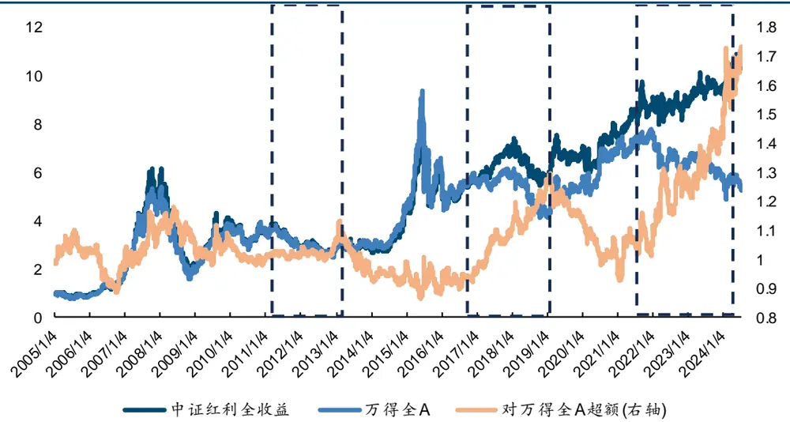
来源：Wind，国金证券研究所

## 2. 政策引导

新“国九条”提出强化上市公司现金分红监管，对上市公司的现金分红指标做出了新的安排，明确要求公司达到现金分红指标，否则将面临 ST 预警。以沪深主板为例，对于满足分红条件的主板股票，当最近三个会计年度累计现金分红总额小于等于最近三个会计年度年均净利润的 30%且小于 5000 万元，则实施 ST。而从科创板、创业板来看，对于满足分红条件的创业板和科创板股票，当最近三个会计年度累计现金分红总额小于等于最近三个会计年度年均净利润的 30%且小于 3000 万元实施 ST 预警。另外对于北交所方面，新规删除审议定期报告同时审议权益分派方案的要求，对北交所上市企业分红提高了便利性，并明确了中期分红的基准。

由此可以看出，政策上对上市公司现金分红指标提出了更高的要求以倒逼企业进行分红，无法满足条件的上市公司则会被实施ST。在这一政策推动下，红利股被实施ST的风险远远小于其他中小盘股，因而更加受到投资者青睐。

图表2：新国九条新增ST指标(现金分红指标)

| 类别 | A 股指标 | 沪深主板 | 科创板、创业板 | 北交所 |
| --- | --- | --- | --- | --- |
| 现金分红指标 (2025 /1/1 起实施) | 前提：具备分红条件，即 “最近一个会计年度净利 润和母公司报表未分配利 润均为正的公司” 指标1：最近三个会计年红条件，不满足指标 度累计现金分红总额大于1，且指标2低于5000 等于最近三个会计年度年 均净利润的 30% 指标2：最近三个会计年 度累计分红金额 | 实施 ST 情形：具备分 万元 | 1、新增实施ST预警情形与豁免 实施 ST 预警情形 ①实施 ST 预警：具备分红条 件，不满足指标1，且指标2低 于3,000万元的； ②豁免实施 ST 预警：具备分红 条件但未达到上述分红标准，若 该公司最近三个会计年度累计研 发投入占累计营业收入比例在 15%以上或者累计研发投入在3 亿元以上，可豁免 ST预警。 2、延续3·15“两强两严”文 件要求 以现金为对价回购注销金额计入 分红，积极推动上市公司一年多 次分红。 | 1、删除审议定期报告同时 审议权益分派方案的要 求，便利公司增加分红频 次； 2、明确中期分红基准：修 订为“上市公司实施中期 分红，且不送红股或者不 以公积金转增股本的，半 年度、季度财务报告可以 不经审计，但应当以最近 一次经审计的未分配利润 为基准，合理考虑当期利 润情况。” |

来源：国务院，证监会，沪深北交易所，国金证券研究所

## 3. 主流红利指数的对比

中证公司目前发布的红利相关指数包括中证红利指数、中证红利低波 100 指数以及中证红利低波指数。以下是这三个指数的的编制方案：

## 图表3：红利指数编制方案

|  | 中证红利指数 | 中证红利低波100 | 中证红利低波指数 |
| --- | --- | --- | --- |
| 编制方案 | 过去一年日均总市值排 名前 80%； 2. 过去一年日均成交 金额排名前 80%； 3. 过去三年连续现金 分红且过去三年股利支 付率的均值和过去一年 股利支付率均大于0且 小于1。 | 1. 过去3年连续现金 分红且每年股息率大 于0； 2. 按股息率排序选取 前三百支股票； 3. 按波动率排序，选 波动率最低的100 支 股票。 | 1. 选取 50 只流动性 好、连续分红、红利 支付率适中、每股股 息正增长以及股息率 高且波动率低的证券 作为指数样本； |
| 加权方式 | 选取股息率最高的 100 支股票，使用股息率加 权。 | 使用股息率/过去1年 波动率加权。 | 采用股息率加权，以 反映分红水平高且波 动率低的证券的整体 表现。 |

来源：Wind，国金证券研究所

我们对比了三个指数自 2006 年以来的收益风险水平，发现：从收益水平来看，中证红利指数略弱于红利低波类指数，年化收益率为 13.96%，证明低波因子在红利股票中长期有效。不过从编制方案和加权方案来看，中证红利指数在红利中的暴露更加纯粹。

图表4：红利指数净值走势
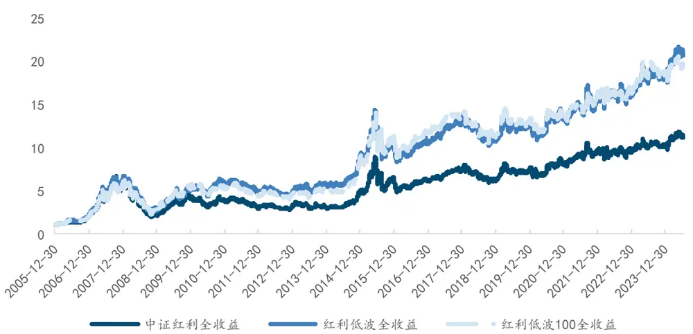
来源：Wind，国金证券研究所

图表5：红利指数主要指标对比

|  | 中证红利全收益 | 红利低波全收益 | 红利低波 100 全收益 |
| --- | --- | --- | --- |
| 年化收益率 | 13.96% | 17.85% | 17.47% |
| 年化波动率 | 25.74% | 25.13% | 24.33% |
| 夏普比率 | 0.54 | 0.71 | 0.72 |
| 最大回撤 | 71.60% | 66.17% | 64.02% |

来源：Wind，国金证券研究所

## 二、基于动态宏观事件因子构建的红利指数择时策略

## 2.1 宏观事件因子构建

## 2.1.1 构建动态事件因子框架要考虑的关键点

为了构建动态事件因子的框架，我们有几个核心问题需要解决：

1)确定使用哪类型的数据以怎样的数据结构去搭建哪些的事件因子。这第一个问题是我们找寻与资产收益率相关的宏观数据，并且构建能够刻画他们与资产关系的事件，从而捕获两者之间的关系；

2）确定筛选因子的指标：当我们用量化的方式去衡量大批量事件因子的好坏，无法人为的逐个用肉眼确认，所以我们需要找到一些用哪类型的指标来筛选优秀或者符合需求的事件因子；

3）确定筛选因子的滚动时间窗口长度：当我们有了合适的筛选指标之后，用多长的滚动时间窗口去计算该指标来判断事件因子的好坏也是一个我们需要决策的维度。

4）确定最终选用因子的标准: 在我们将上述关键点都解决之后，我们只需要确认最终因子的筛选指标就可以完成整个事件因子计算和筛选的流程框架。

在后续的章节 2.2 宏观数据的选用和 2.3 宏观数据的预处理，我们将完成对于问题 1 的理解和处理方式，而章节 2.4 宏观事件因子构建我们会完成对问题 2，3，4 的解答。

## 2.1.2.宏观数据的选用

关于数据方面，我们本次报告将经济、通胀、货币和信用四大类的 30 余个因子，包括PMI、PPI、SHIBOR、M1 等数据，纳入了测试的范围当中，后续还可以对更广泛的数据做进一步的测试。宏观事件的择时标的为中证红利指数。

图表6：经济、通胀、货币和信用类指标

| 数据分类 | 指标名称 | 频率 | 数据发布时间 |
| --- | --- | --- | --- |
|  | 制造业 PMI | 月 | 当月月末 |
|  | 制造业 PMI：生产 | 月 | 当月月末 |
|  | 制造业PMI：新订单 制造业PMI：新出口订单 | 月 | 当月月末 |
| 经济 | PMI：新订单-PMI：产成品库存 | 月 | 当月月末 |
|  | 工业增加值：当月同比 | 月 | 当月月末 |
|  | 产量：发电量：当月值 | 月 | 次月月中 |
|  | 消费者信心指数 | 月 | 次月月中 |
|  |  | 月 | 次月月末 |
|  | 固定投资完成额：第一产业 | 月 | 次月月中 |
|  | 国债利差 10Y-1M | 日 | 当日收盘 |
|  | 国债利差 10Y-3M | 日 | 当日收盘 |
| 通胀 | PPI：同比 | 月 | 次月月中 |
|  | CPI：同比 | 月 | 次月月中 |
|  | PPI-CPI剪刀差 | 月 | 次月月中 |
|  | PMI：原材料价格 | 月 | 当月月末 |
|  | SHIBOR：隔夜 | 日 | 当日收盘 |
|  | SHIBOR:2 周 | 日 | 当日收盘 |
|  | SHIBOR:1 个月 | 日 | 当日收盘 |
|  | 银行间质押式回购加权利率：7天 | 日 | 当日收盘 |
|  | 银行间质押式回购加权利率：14天 | 日 | 当日收盘 |
|  | 银行间质押式回购加权利率：1个月 | 日 | 当日收盘 |
| 货币 | 银行间质押式回购加权利率：3个月 | 日 | 当日收盘 |
|  | 同业存单：1个月 | 日 | 当日收盘 |
|  | 同业存单：3个月 | 日 | 当日收盘 |
|  | 逆回购利率：7天-银行间质押式回购加权利率：7天 | 日 | 当日收盘 |
|  | 中美国债利差10Y | 日 | 当日收盘 |
|  | 中国国债美国TIPs利差：10 年 | 日 | 当日收盘 |
|  | 国开债国债利差：10年 | 日 | 当日收盘 |
|  | AA级企业债国债：10年利差 | 日 | 当日收盘 |
|  | 中间价：美元兑人民币 | 日 | 当日收盘 |
|  | M1：同比 | 月 | 次月月中 |
|  | M2：同比 | 月 | 次月月中 |
|  | M1-M2 剪刀差 | 月 | 次月月中 |
|  | 社会融资规模：当月值 | 月 | 次月月中 |
| 金融机构：中长期贷款余额 | 社会融资规模存量：同比 | 月 月 | 次月月中 次月月中 |

来源：Wind，国金证券研究所

图表7：事件因子构建流程图
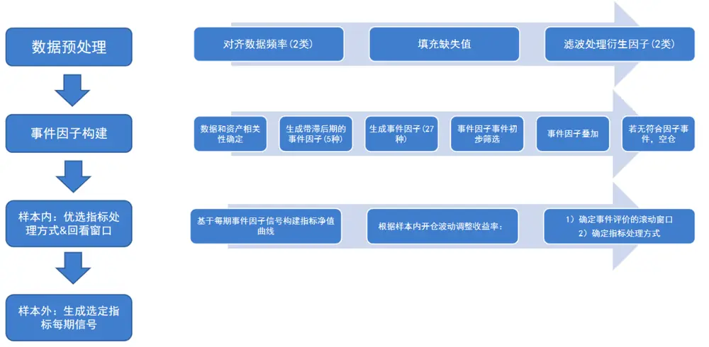
来源：国金证券研究所

## 2.1.3 宏观数据的预处理

对于数据的预处理方面，我们分成了 3 个小步骤：

1）对齐数据频率：我们将指标的频率全部统一成了月频的数据，对于日频数据的换频操作上，我们有两种的处理方式，第一种为取每月的最后一个交易日的数据作为当月的数据，或者是取月内日频数据的均值作为当月的数据。

2）填充数据缺失值：对于由于数据公布时间不一致，导致有些月份数据的缺失，我们需要对其进行填充。这里我们采用的方式是取数据过去 12 个月指标的一阶差分值的中位数叠加上一期的数值进行填充。

$$
X_{t}=X_{t-1}+Median_{diff12}
$$

3）滤波处理：这个步骤的处理需要看数据本身来确定，因为有数指标对于资产的指示作用可能隐含在“噪音”当中，当我们做季节性调整或者滤波处理，可能会把这部分重要的信息给过滤掉效果反而不好，所以此步骤需要结合数据判断。本文的研究尝试用量化的形式，通过同时构建数据的 2 种处理方式的因子，最终筛选出更适合该指标的处理方式:

## a)不做处理的原始数据；b)做滤波处理的数据

在滤波处理方面，为了使得每个时点的过滤后数据不包含未来信息，并未采用传统经济分析常用的双向 HP 滤波,而是选择使用单向 HP 滤波，避免数据处理过程中隐含的未来函数。

$$
\hat{\tau}_{t|t,\lambda}={\sum}_{s=1}^{t}\omega_{t|t,s,\lambda}.y_{s}=W_{t|t,\lambda}(L).y_{t},
$$

在做完 3 个步骤的数据预处理之后，我们进入事件因子的构建阶段。

## 2.1.4.宏观事件因子构建全流程

关于事件因子的构建，我们将其拆解成 8 个小步骤:

1）确定事件的突破方向：通过计算经过预处理后的数据因子与资产标的下一期收益率的相关性，来确定事件的突破方向。当相关性为正相关时，我们对该数据构建正向突破(变动)的事件，反之则构建反向突破(变动)的事件。

2）确定数据因子与资产的领先滞后性: 数据与资产的领先滞后性可能随着时间推移而发生改变，因此为了能动态识别数据与资产目前的领先滞后关系，我们对数据衍生出滞后

0-4 期的事件因子，然后通过筛选因子的指标来衡量，那个时滞期数下的事件因子更为合适。

3）生成事件因子：在本次的框架中，我们构建了三类的事件因子，包括数据均线正向变动，数据突破数据中位数以及数据的同向变化，并且给这些因子事件赋予了不同的参数，这样一共构建了 10 个不同的因子事件。

图表8：事件因子的构建

| 因子事件 | 参数 |
| --- | --- |
| 数据均线正向变动 | 均线长度：2-12 |
| 数据突破数据中位数 | 滚动窗口：2-12 |
| 数据同向变动 | 同向变动期数：1-5 |

来源：国金证券研究所

4）确定筛选事件因子的指标：在生成完所有的事件因子之后，我们就可以进入对事件因子的评价和筛选阶段，但首先我们需要确定下用哪些衡量指标。我们列出了 2 种不同的衡量指标包括:收益率胜率和开仓波动调整收益率。其中收益率胜率考虑了该事件因子的开仓成功率,还包含了盈亏比的信息。开仓波动调整收益率除了考虑前面提及的两个因素外，更融入了波动率的信息。这个指标不包含不开仓时间段的信息，避免不开仓时间长导致的高数值，可以获取开仓期间波动调整收益率更高的事件因子

5）而波动调整收益率除了考虑前面提及的两个因素外，更融入了波动率的信息，但是这个指标包含不开仓时间段的信息，导致不开仓时间长的也可能有高数值，但我们更想获取的是开仓期间波动调整收益率更高的事件因子。但是这个指标也有自身的问题，就是如果数据期数较少的话，可能计算的数值会较为敏感，导致筛选出来的事件因子好坏不一，所以该指标更适用于对长时间段的因子评价和筛选当中。基于这些指标不同的特点，我们决定选择用收益率胜率作为每期事件因子的筛选指标；用开仓波动调整收益率作为后续确定数据滚动时间窗口的指标。

图表9：各类衡量指标介绍

| 事件因子衡量指标 |  | 指标构建 | 指标优劣势 |
| --- | --- | --- | --- |
| 收益率胜率 | Σi ri, ri > 0 ∑N[ril | ，N为总开仓次数 | 除了成功率，还包含盈亏比的信息 |
| 开仓波动调整收益率 | ∑Ir/N 1 ∑N(ri−r)2 √N– | ，N为总开仓次数 | 综合考虑指标成功率，收益率和波动率的信息， 且重点关注开仓阶段的信息，但是要求数据量大些 |

来源：国金证券研究所

5) 因子事件初筛选:确定好筛选指标之后，我们对每期生成因子做个初步的有效性筛选。包括：b)事件收益率胜率>55%; c)该事件的发生次数>滚动窗口的时间期数/6。

6) 叠加事件因子: 为了增加每期事件的开仓频率，且更多维度的利用单个数据，可以将单宏观指标的事件因子叠加。在通过初筛选的事件因子当中，选择收益率胜率最高的事件因子作为当期的基础事件因子。然后从剩余通过初筛选的事件因子中，选出与基础事件因子相关性低于 0.85 的次高收益率胜率事件因子，将其与基础事件因子进行叠加。若叠加因子事件的胜率高于基础因子事件，则选用叠加事件作为当期的事件因子，反之则仅用最高胜率事件作为当期的事件因子。

7) 若经历了因子事件初筛选步骤，当期没有能通过筛选的事件因子，则本期该宏观指标标记为空仓，且当期不加入其归属的大类因子打分当中，本质上这步实现了动态剔除低胜率的事件因子。

8) 确定评判事件的最优滚动窗口：在通过前7个步骤计算之后，我们可以获得该宏观数据每期动态选出的事件因子，并且基于每期事件因子给出的择时信号，获得该宏观数据的历史净值表现。然后我们对样本内时间段(2005 年 1 月-2017 年 12 月)的数据计算开仓波动调整收益率寻找对于不同宏观数据最合适的滚动时间窗口。对于滚动时间窗口的参数，我们测试了 48，60，72，84，96 个月时间维度。每个宏观数据都通过对比不同时间窗口的开仓波动调整收益率来选出最优参数。

## 2.2 宏观事件因子表现

## 2.2.1 最终筛选的宏观因子

最后我们通过计算样本内时间段（2005 年 1 月-2017 年 12 月）宏观数据构建的事件因子的开仓波动调整收益率，挑选出了样本内表现较好的 10 个因子，我们将其列在了图表当中，并且说明了每个数据的数据格式、数据处理方法和对应的滚动窗口期。我们将这 10个因子分成了两大类：经济增长和货币流动性。经济增长：包含经济，通胀和信用，三者都是不同维度描述经济的运行情况；另外将货币类的指标单独划分成一类，用来刻画市场的流动性。

借助筛选后的择时因子，整体上有效实现了择时以控制波动的效果，策略的夏普比相对原指数得到了明显的提升。此外，拆解来看，消费者信心指数和 PPI-CPI 在控制风险的同时，也有效提升了收益。

图表10：最终筛选的宏观因子

| 因子分类 | 因子名称 | 数据处理方法 | 滚动窗口 |
| --- | --- | --- | --- |
| 经济增长 | 消费者信心指数 | 原始数据 | 60 |
|  | 产量：发电量：当月值_MA3_MoM | 原始数据 | 96 |
|  | 国债利差 10Y-3M | HP 滤波 | 60 |
|  | 中采制造业PMI：新出口订单 | HP 滤波 | 72 |
|  | PPI：同比 | HP 滤波 | 84 |
|  | PPI-CPI剪刀差 | HP 滤波 | 96 |
| 货币流动性 | Shibor2W | 原始数据 | 72 |
|  | R007_MA20 | 原始数据 | 72 |
|  | Shibor1M_MoM | 原始数据 | 84 |
|  | 逆回购 R007 差额 | 原始数据 | 84 |

来源：Wind，国金证券研究所

## 2.2.2.宏观事件因子测试结果示例

## 1)经济增长细分单指标择时表现

经济增长是影响股票和债券市场表现的主要宏观经济因素之一。通常情况下，经济增长会推动企业利润增长，从而提升股票市场表现；相反，在经济放缓或衰退期间，债券市场可能表现较好，因为投资者转向安全资产。通过细分单个经济增长指标进行择时测试，可以帮助我们理解具体的经济因素如何影响市场表现。从择时表现看出 PPI-CPI 剪刀差表现较好。

图表11：经济增长细分单指标择时表现
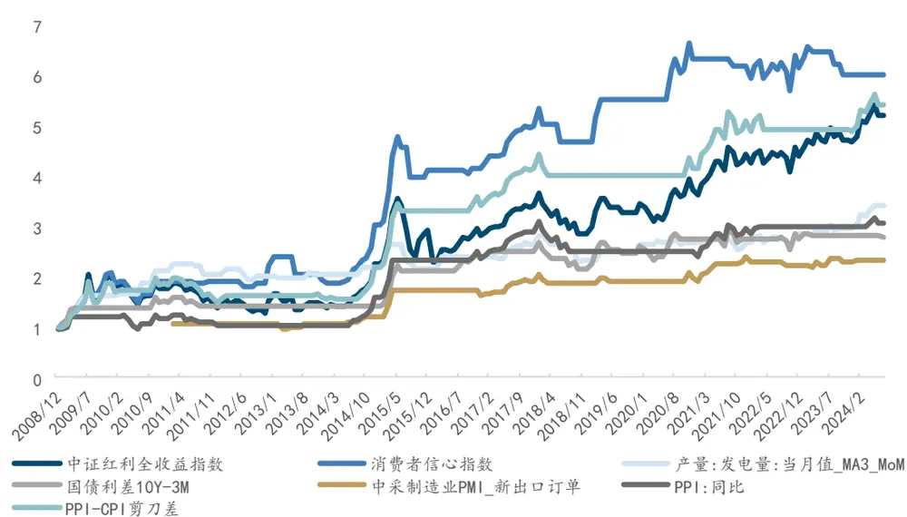
来源：Wind，国金证券研究所

图表12：经济增长细分单指标择时表现

| 01/2009 06/2024 | 中证红利全收益 指数 | 消费者信心指数 | 产量：发电量：当 月值_MA3_MoM | 国债利差 10Y- | 中采制造业 3M PMI_新出口订单 | PPI：同比 PPI-CPI剪刀差 |  |
| --- | --- | --- | --- | --- | --- | --- | --- |
| 年化收益率 | 11.58% | 12.63% | 8.60% | 7.22% | 5.24% | 7.83% | 11.51% |
| 年化波动率 | 23.18% | 17.33% | 13.19% | 13.50% | 9.56% | 13.92% | 17.06% |
| 最大回撤 | -36.80% | -28.72% | -18.68% | -20.11% | -9.92% | -22.79% | -25.55% |
| 夏普比率 | 0.57 | 0.74 | 0.65 | 0.54 | 0.53 | 0.57 | 0.69 |
| 收益回撤比 | 0.31 | 0.44 | 0.46 | 0.36 | 0.53 | 0.34 | 0.45 |

来源：Wind，国金证券研究所

## 2)货币流动性细分单指标择时表现

货币流动性是指市场上货币供给的充足程度，银行间市场利率对货币流动性有着较大影响，货币市场上的供给一定程度上也会影响股票市场上的走势。因此，银行间市场利率对红利指数择时能提供一定的参考信号。

图表13：货币流动性细分单指标择时表现
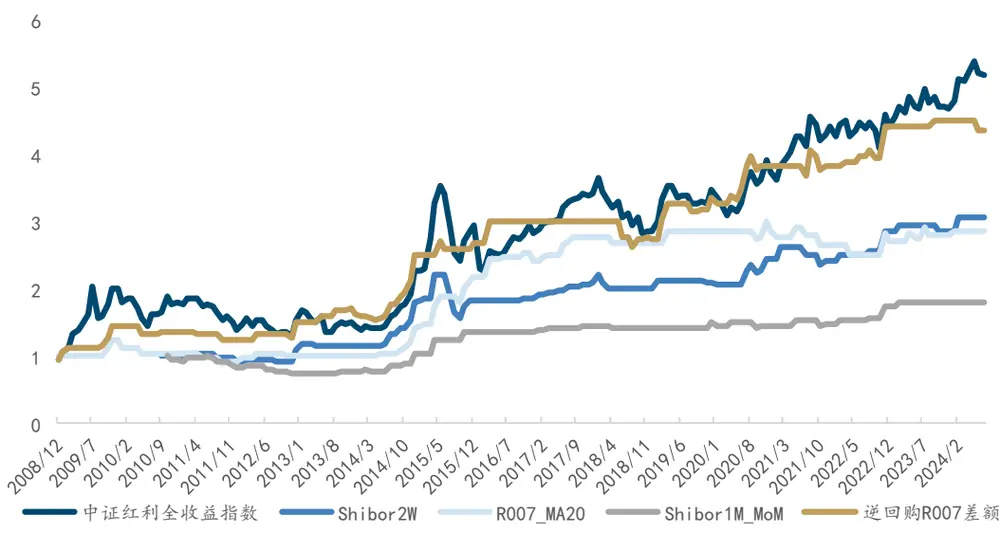
来源：Wind，国金证券研究所

图表14：货币流动性细分单指标择时表现

| 01/2009 - 06/2024 | 中证红利全收益指数 | Shibor2W | R007_MA20 | Shibor1M_MoM | 逆回购 R007 差额 |
| --- | --- | --- | --- | --- | --- |
| 年化收益率 | 11.58% | 7.47% | 7.00% | 3.88% | 10.30% |
| 年化波动率 | 23.18% | 13.31% | 12.49% | 10.20% | 13.04% |
| 最大回撤 | -36.80% | -29.16% | -28.09% | -27.06% | -14.75% |
| 夏普比率 | 0.57 | 0.57 | 0.56 | 0.37 | 0.78 |
| 收益回撤比 | 0.31 | 0.26 | 0.25 | 0.14 | 0.70 |

来源：Wind，国金证券研究所

## 3) 近期的因子对应选中事件:

从近期的因子对应选中事件来看，整体经济增长指标显示出一定的上升趋势，特别是在制造业和生产者价格方面。而货币流动性指标也显示出市场流动性在逐步收紧。投资者可以根据这些因子的变化，动态调整投资组合，以应对市场的变化。

图表15：近期的因子对应选中事件

| 2024/03 |  |  | 2024/04 | 2024/05 | 2024/06 | 2024/07 |
| --- | --- | --- | --- | --- | --- | --- |
| 经济增长 | 消费者信心指数 | 期：向下 | 滞后1期连涨5滞后1期连涨5期： 向下 | 向下 | 滚动3期中位数：_滚动3期中位数：_滚动3期中位数： |  |
|  | 产量：发电量：当 | 滞后 3 期_连涨 1 滞后 1 期_滚动 12 期 |  |  | 向下 | 向下 |
|  | 月值_MA3_MoM | 期：向下 | 平均数：向上 | 滞后 1 期_滚动 12 期平均数：向上 | 滞后 1 期_滚动 12 期平均数：向上 | 滞后 1期_滚动 12 期平均数：向上 |
|  |  | 滞后1期_连涨4滞后1期_连涨4期： |  | 滞后1期_连涨 4 | 滞后1期_连涨4 | 滞后1期_连涨4 |
|  | 国债利差 10Y-3M | 期：向上 | 向上 | 期：向上 | 期：向上 | 期：向上 |
|  | 中采制造业 PMI 新出口订单 | 连涨5期：向上 | 连涨5期：向上 | 连涨5期：向上 | 连涨5期：向上 | 连涨1期：向上 |
|  | PPI：同比 |  | 滞后1期_连涨5滞后1期_连涨5期： | 滞后1期_连涨 5 | 滞后1期_连涨 5 | 滞后1期_连涨 3 |
|  | PPI-CPI剪刀差 | 期：向上 | 向上 | 期：向上 | 期：向上 | 期：向上 |
|  |  |  | 滞后1期_滚动3期滞后1期_连涨4期： | 滞后1期_连涨3 | 滞后1期_连涨 5 | 滞后1期_连涨4 |
|  |  | 中位数：向上 | 向上 | 期：向上 | 期：向上 | 期：向上 |
| 货币流动性 | Shibor2W | 滞后1期_滚动3期 | 滞后1期_滚动3期滞后1期_滚动3期 |  | 滞后1期滚动3 | 滞后1期滚动 3 |
|  | R007_MA20 | 中位数：向上 连涨4期：向上 | 中位数：向上 | 中位数：向上 | 期中位数：向上 | 期中位数：向上 |
|  |  |  | 连涨4期：向上 | 连涨4期：向上 | 连涨4期：向上 | N/A |
|  | Shibor1M_MoM | 期：向上 | 滞后 1 期 连涨 3 滞后 1 期滚动 12 期 平均数：向上 | 滞后 1 期滚动 12 期平均数：向上 | 滞后 1期_滚动 12 | 滞后 1期_滚动 12 |
|  | 逆回购 R007 差 | 滞后3期_连涨5滞后3期_连涨5期： |  | 滞后 3期连涨 5 | 期平均数：向上 滞后 3期连涨 5 | 期平均数：向上 滞后3期_连涨5 |

来源：Wind，国金证券研究所

## 2.2.3 部分因子近期选取事件

1) 消费者信心指数：消费者信心回暖，带动权益上行。

从历史数据来看，消费者信心指数和中证红利指数在大部分时期走势高度正相关，仅在少部分时期，消费者信心指数波动大于红利指数。整体上，二者存在显著的相关性。

图表16：消费者信心指数与中证红利
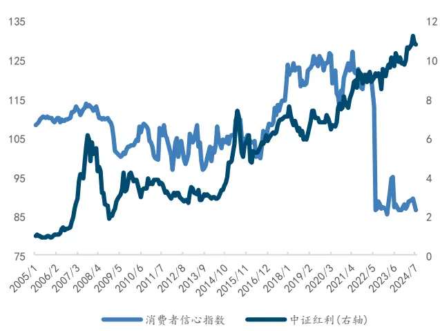
来源：Wind，国金证券研究所

图表17：消费者信心指数7月事件(向下突破滚动3期中位数)
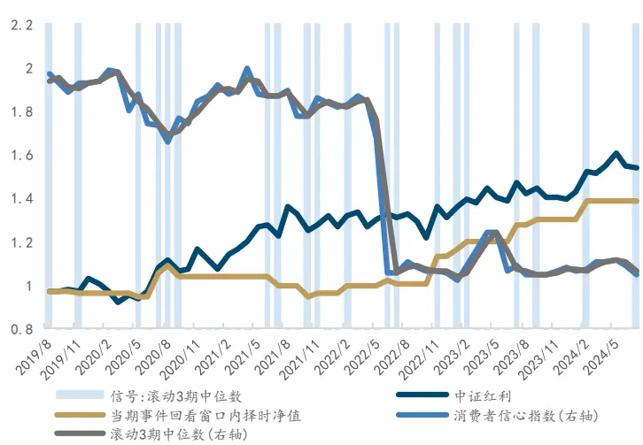
来源：Wind，国金证券研究所

2) 国债利差 10Y-3M：捕捉经济阶段上涨推动利率趋势上行带动权益上行的部分。

从下图可以看出，大部分时期，红利指数与国债利差 10Y-3M 存在着此消彼长的替代关系。国债利差走扩阶段，往往代表了市场对于经济形势的乐观态度，在这一时期下，小市值票往往更受投资者青睐，因此这一时期， 红利股的增长会出现一定程度降速。而国债利差收紧阶段，市场的风险偏好弱，更偏好相对抗跌的红利股。国债利差和中证红利指数的走势也进一步佐证我们的判断，即市场走势弱时，红利股更受青睐。

图表18：国债利差10Y-3M(经滤波处理)与中证红利
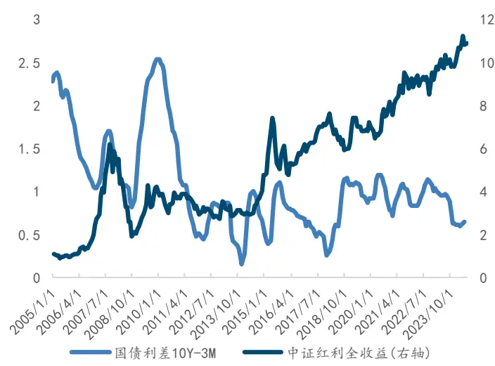
来源：Wind，国金证券研究所

图表19：国债利差10Y-3M7月事件(滞后一期：连涨4期)
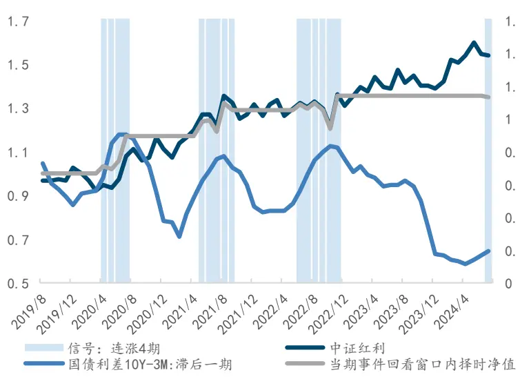
来源：Wind，国金证券研究所

3) 1个月Shibor环比变动：捕捉经济阶段上涨推动利率趋势上行带动权益上行的部分。

1个月Shibor的环比变动可以作为了解市场上资金是否充足的指标。当1个月Shibor 上升时，可能表明银行间资金趋紧，市场资金面偏紧缩；而当 1 个月 Shibor 下行时，意味着银行资金充足，市场偏宽松。从下图中可以看出，当利率环比上行时，红利指数往往也处于上行趋势，当利率环比下降时，红利指数往往处于回落调整状态。

图表20：Shibor1M_MoM与中证红利
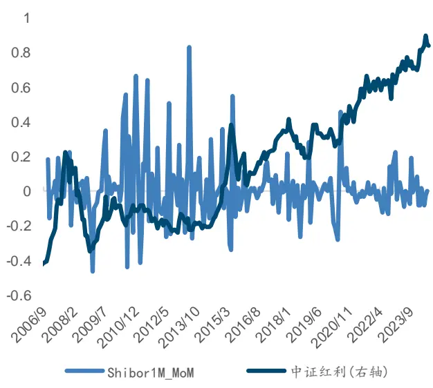
来源：Wind，国金证券研究所

图表21：Shibor1M_MoM7月事件(滞后一期：12期平均数上行)
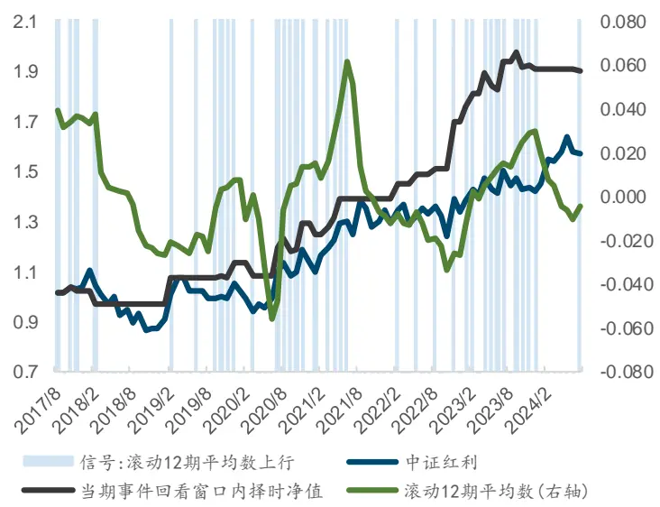
来源：Wind，国金证券研究所

## 2.3 多指标择时策略构建

## 2.3.1 择时策略仓位确定流程

在选定了最终使用的宏观指标之后，我们使用这些宏观数据构建的宏观事件因子来搭建择时策略。由于中证红利全收益指数净值长期来看稳定上行，且进行红利择时策略的重点在于控制回撤，若长时间空仓，很容易导致错失行情，所以我们本次对于择时策略空仓的要求会更加严格。当两类大类因子都触发空仓时，才会进行策略上的空仓操作，否则则维持全仓持有。

具体的策略定义：当大类因子内部的细分因子有大于 1/2 的因子发出看多信号，则当期该大类因子的信号标记为 1；当大类因子内部的细分因子少于 1/2 的因子发出看多信号时，则当期大类因子信号标记为 0；若当大类因子内部的细分因子发出看多信号的比例处于两个区间之后，则大类因子标记为对应具体的比例。最后我们将两个大类因子的得分取平均值，合成最终当期的股票仓位信号。

图表22：择时策略仓位确定流程图
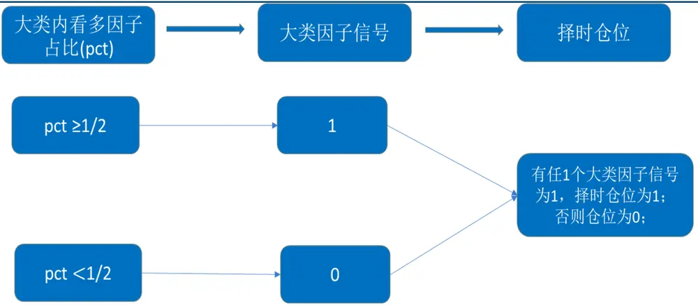
来源：国金证券研究所

下列两图表展示的是该宏观事件因子中证红利择时策略的表现，实现对下行风险的控制。从2009年1月至2024年6月，年化收益率为 17.49%，中证红利全收益指数为11.58%，相对 Wind全A有约5.9%的年化超额收益。该择时策略在波动率端也有比较好的表现，年化波动率由指数原来 23.18%的波动率下降到了 17.50%；最大回撤明显下降，从指数的36.80%下降到了 21.22%，夏普比率上升到了 0.98。

图表23：宏观事件因子中证红利择时策略净值
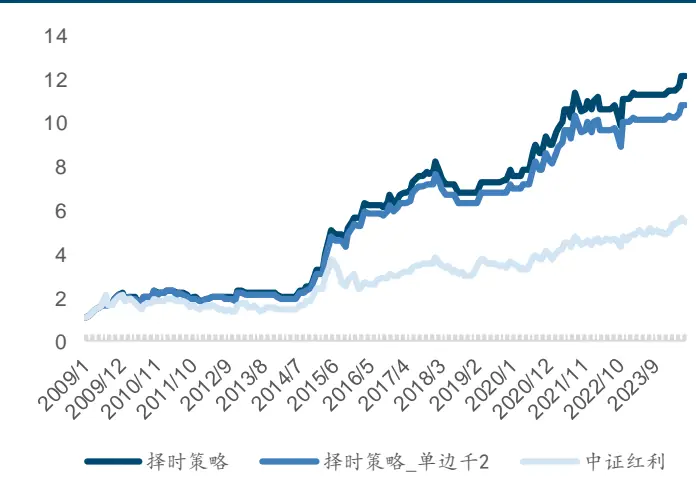
来源：Wind，国金证券研究所

图表24：宏观事件因子择时策略表现

| 01/2009- 06/2024 | 择时策略 | 择时策略_单边千2 中证红利全收益 |  |
| --- | --- | --- | --- |
| 年化收益率 | 17.49% | 16.60% | 11.58% |
| 年化波动率 | 17.50% | 17.54% | 23.18% |
| 最大回撤 | -21.22% | -21.70% | -36.80% |
| 夏普比率 | 0.98 | 0.94 | 0.57 |
| 收益回撤比 | 0.82 | 0.76 | 0.31 |

来源：Wind，国金证券研究所

当我们从下图表中观测择时策略的逐年表现中可以发现，该策略主要是通过在股指出现回撤的阶段控制住下行波动获取明显的超额收益，在股指上行阶段，也尽可能的获取正收益，但无法获取比股指收益更高的收益，这一方面是由于择时策略整体的股票平均仓位较低，另外也反映了单纯通过月频宏观因子的择时，很难获取微观结构上的择时高收益。

图表25：宏观事件因子择时策略逐年收益
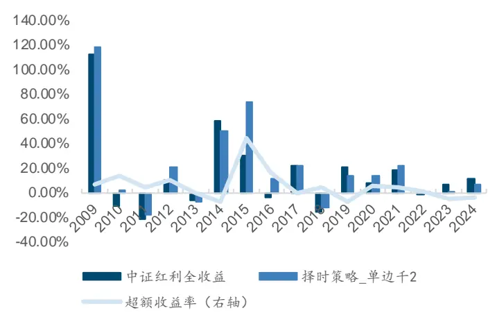
来源：Wind，国金证券研究所

图表26：宏观事件因子择时策略股票仓位
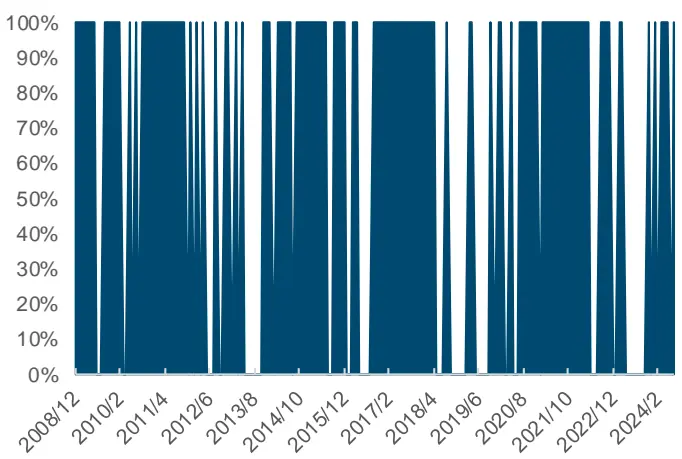
来源：Wind，国金证券研究所

图表27：宏观事件因子择时策略近期表现
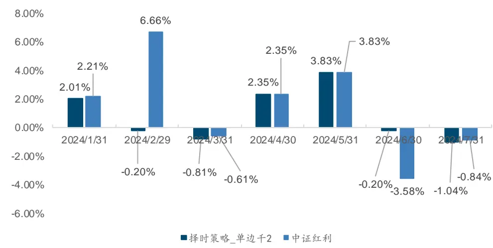
来源：Wind，国金证券研究所

另外，我们也在图表中，列出了近期各细分因子的择时信号。图表中的 N/A 则是代表着该因子在当期没法筛选出符合筛选条件的事件因子，所以做了空仓处理，在当期的大类因子合成信号打分当中，则会将其剔除出打分的计算，从而达到动态筛选优秀的宏观事件的效果。另外，7 月的择时仓位是 100%。

图表28：近期细分因子信号

| 大类因子 | 细分因子 | 2024/3 | 2024/4 | 2024/5 | 2024/6 | 2024/7 |
| --- | --- | --- | --- | --- | --- | --- |
| 经济增长 | 消费者信心指数 | 0 | 0 | 0 | 0 | 1 |
|  | 产量：发电量：当月值_MA3_MoM | 1 | 1 | 1 | 0 | 0 |
|  | 国债利差 10Y-3M | 0 | 0 | 0 | 0 | 1 |
|  | 中采制造业PMI_新出口订单 | 0 | 0 | 0 | 0 | 1 |
|  | PPI_YoY | 1 | 1 | 1 | 1 | 1 |
|  | PPI-CPI剪刀差 | 1 | 1 | 1 | 1 | 1 |
| 货币流动性 | Shibor2W | 0 | 0 | 0 | 0 | 0 |
|  | R007_MA20 | 0 | 0 | 0 | 0 | NA |
|  | Shibor1M_MoM | 0 | 0 | 0 | 0 | 1 |
|  | 逆回购 R007 差额 | 0 | 0 | 0 | 1 | 0 |
| 择时仓位信号 |  | 100% | 100% | 100% | 0% | 100% |

来源：Wind，国金证券研究所

## 三、红利 AI 选股指增策略构建

## 1. 中证红利指数特点

以下我们对中证红利指数的特点做了进一步分析探讨，首先我们对比了中证红利与其他两种红利指数在市值分布和各类型因子暴露方面的差异，数据截止 2024 年 7 月中旬。结果如下：

图表29：红利指数市值分布统计
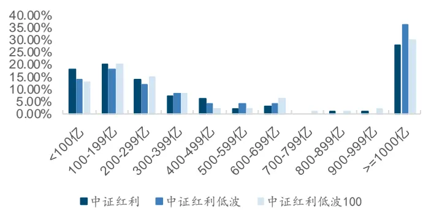
来源：Wind，国金证券研究所

图表30：红利指数+上证指数因子暴露度统计
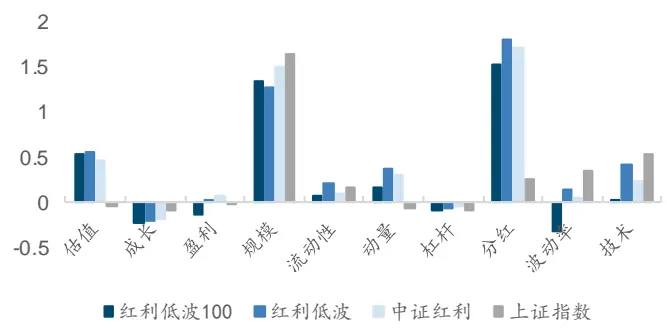
来源：Wind，国金证券研究所

由上述统计图，我们不难发现，相较于其他红利指数，中证红利指数市值分布相对均匀，在规模、分红、估值因子中暴露较高。此外，我们还对中证红利指数的行业分布做了进一步统计，如下图表所示：

图表31：中证红利指数行业分布统计
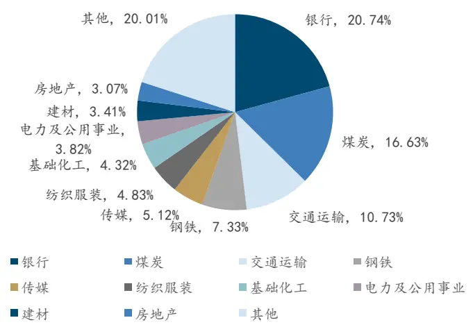
来源：Wind，国金证券研究所

结合上述统计，我们发现中证红利指数具有以下特点：

1.市值分布相对均匀，在中小市值股票上具有一定权重；

2.行业分布主要覆盖银行、煤炭、交通运输等周期板块；

3.在规模、分红、估值因子中暴露较高，整体呈现估值水平低、规模大、分红比例高的 特点。

因此，中证红利指数在红利风格上明显暴露更加纯粹，更适合作为选股的比较基准。

## 2. 传统因子选股

在这类股票池中进行选股，我们首先想到对传统基本面因子进行筛选测试。经过测试发现，成长、质量、估值和一致预期类因子在中证红利指数成分股中有较好的选股表现。

图表32：传统有效因子选股表现

| 因子 大类 | 因子名称 | IC 均值 IC_IR T 值 |  |  | 多头年化超多头信多头超额 额收益率 息比率最大回撤 |  |  | 多空年化多空夏多空最 收益率 普比率大回撤 |  |  |
| --- | --- | --- | --- | --- | --- | --- | --- | --- | --- | --- |
| 成长 | 净利润同比 | 3.66% | 0.22 | 2.35 | 3.52% | 30.99% | 22.79% | 9.50% | 0.53 | 22.69% |
| 质量 | 过去5年毛利率标准差/均值 | -4.77% | -0.30-3.13 |  | 4.06% | 28.43% | 22.55% | 10.08% | 0.47 | 28.63% |
|  | 经营性现金流 TTM/总资产 | 4.00% | 0.23 | 2.42 | 6.17% |  | 51.93% 20.60% | 9.15% | 0.56 | 17.63% |
|  | 经营性现金流/流动负债 | 5.44% | 0.35 | 3.75 | 4.27% |  | 43.56% 29.21% | 7.25% | 0.47 | 34.68% |
|  | ROA_TTM | 3.49% | 0.17 | 1.79 | 4.12% |  | 30.83% 21.28% | 16.32% | 0.83 | 31.91% |
|  | ROE 同比 | 3.02% | 0.17 | 1.84 | 3.23% | 28.72% | 26.66% | 10.69% | 0.59 | 26.96% |
| 估值 | EBIT/EV | 4.00% | 0.21 | 2.19 | 4.46% | 32.30% | 20.00% | 13.14% | 0.57 | 38.00% |
| 一致 预期 | 未来12个月一致预期 EPS过去3个月变化 率 | 4.65% | 0.29 | 3.10 | 13.07% | 81.06% | 19.98% | 26.11% | 1.13 | 28.62% |
|  | 当期年报一致预期EPS过去3个月变化率 | 4.92% | 0.30 | 3.13 | 5.50% |  | 37.07% 22.13% | 17.50% |  | 0.83 22.29% |
|  | 未来12个月一致预期ROE过去3个月变化 率 | 3.44% | 0.21 | 2.26 | 8.65% |  | 58.95% 28.65% | 17.70% |  | 0.89 25.68% |

来源：Wind，国金证券研究所

不过这些因子的收益稳定性水平普遍偏差，多头年化超额收益率在 3%到 13%不等，多头超额最大回撤在 20%左右。进一步地，我们对上述已识别的十个有效因子做了等权线性合成，合成后的因子IC均值6.32%，年化超额15.42%，多头超额最大回撤25.46%，行业市值中性化化后的合成因子IC均值5.77%，年化超额13.75%，多头超额最大回撤17.92%。因子展现出了一定的预测能力，但同时也暴露出了较大的回撤，收益稳定性较差。

图表33：等权合成因子选股表现

| 因子 | IC 均值 IC_IR |  |  | 收益率 | 多头年化超额多头信息比多头超额最大回 |  | 多空年化收益多空夏普比 率 |  | 多空最大回撤 |
| --- | --- | --- | --- | --- | --- | --- | --- | --- | --- |
|  |  |  | T值 |  | 率 | 撤 | 率 |  |  |
| 有效因子等权合成 有效因子合成后行 | 6.32% | 0.35 | 3.66 | 15.42% | 1.22 | 25.46% | 25.20% | 1.29 | 30.72% |
| 业市值中性化 | 5.77% | 0.35 | 3.75 | 13.75% | 1.12 | 17.92% | 22.76% | 1.18 | 22.34% |

来源：Wind，国金证券研究所

图表34：等权合成因子净值走势
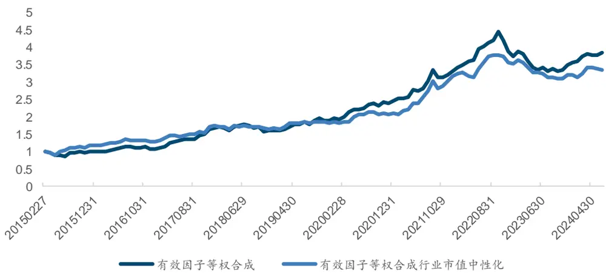
来源：Wind，国金证券研究所

## 3. 红利 AI 选股

在之前的研究报告中，我们使用了 GBDT 和 NN 两大类模型和两种预测标签分别训练并最终合成，在 A 股各宽基指数成分股上均有不错的预测效果。两类模型中，我们分别选取了当前最有代表性，在大多数任务中表现最优的模型进行训练，详细算法说明可以参考前期报告《Alpha 掘金系列之九：基于多目标、多模型的机器学习指数增强策略》基本框架如下图所示：

图表35：GBDT+NN机器学习选股框架
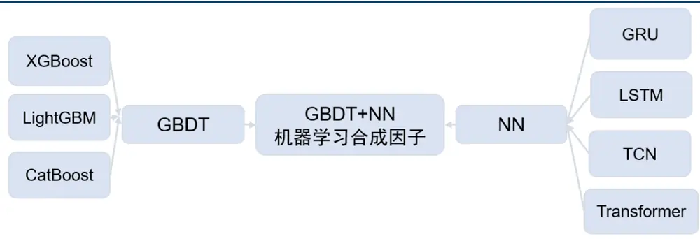
来源：国金证券研究所

两类模型分别作为截面和时序模型当下表现最优异的模型算法，GBDT 着重进行有效特征的筛选和非线性组合，而 NN 类模型着重进行时序信息的学习。两类模型预测所得信号相关性相对较低，通过等权合成能进一步增强最终收益稳健性。

图表36：模型选用特征数据集

| 模型类型 | 数据集类型 | 特征数量 |
| --- | --- | --- |
| GBDT（截面模型） | Alpha158+GJQuant | 271 |
| NN（神经网络） | Alpha158 | 158 |

来源：Qlib，国金证券研究所

在特征选择层面上，我们根据模型的特性和特征的逻辑进行了分别处理、分别训练的方式。对于变化相对低频、难以通过短时间的变化捕捉其变化信息的基本面类因子，我们仅使用 GBDT 树模型，此类模型能高效地针对特征进行筛选和非线性合成。而对于几乎每日变化的量价类特征，GBDT 和神经网络都可以使用很好地进行组合，从而获取相对具有一定差异性的信号。

在特征数据与处理方面，我们主要使用整体标准化的方案，并且先对特征进行去极值处理，从而排除个别样本对模型最终的影响。

对于股票池的选取，我们针对沪深 300、中证 500 和中证 1000 分别尝试了域内训练和全A 训练两种模式，发现对于特殊股票池，GBDT 和 NN 两类模型展现出了不同的区分效果。因此针对不同股票池我们进行了区分处理。

对于训练数据的滚动方式，我们分别对比了一次性训练、年度滚动训练和扩展训练三种方式。测试发现，滚动与扩展训练差异不大，而一次性训练在两类模型中表现相对更好。这与模型的过拟合情况与市场环境有很大关系。

在模型的损失函数选取方面，我们对比了回归和分类（交叉熵）两种模型思路，同时对比了 MSE、IC 和 RankIC 作为损失函数的区别，最终提出了 DART 算法相对于 GBDT 算法能在一定程度上进一步防止过拟合，提升稳定性的效果。

针对模型AI选股因子，我们在全A的2015年2月1日—2024年6月30日区间回测，每月末收盘价调仓（未扣费），回测结果表现如下：

图表37：AI选股因子值全A月度调仓主要指标

|  | IC 均值 IC_IR |  |  | 多头年化超额多头信息比 收益率 |  |  | 多头超额最 多空年化收多空夏普 多空最大回撤 益率 比率 |  |  |
| --- | --- | --- | --- | --- | --- | --- | --- | --- | --- |
| GBDT | 14.39% | 1.27 | 13.37 | 18.04% | 率 2.83 | 大回撤 5.58% | 60.94% | 4.06 | 7.26% |
| GBDT_AdjCI | 13.22% | 1.55 | 16.33 | 18.66% | 3.60 | 2.89% | 59.62% | 5.08 | 3.62% |
| NN | 12.26% | 1.28 | 13.51 | 15.04% | 2.20 | 8.54% | 49.80% | 3.43 | 11.39% |
| NN_AdjCI | 11.52% | 1.50 | 15.80 | 15.90% | 2.76 | 4.21% | 48.09% | 4.06 | 7.73% |
| GBDT+NN | 14.85% | 1.37 | 14.42 | 18.33% | 2.99 | 4.52% | 62.88% | 4.38 | 7.37% |
| GBDT+NN_AdjCI | 13.80% | 1.67 | 17.62 | 19.02% | 3.78 | 2.02% | 60.18% | 5.09 | 6.42% |

来源：Wind，国金证券研究所

经过中性化的因子 IC 均值为 13.80%，多头年化超额 19.02%,多头超额最大回撤 2.02%。

图表38：AI选股因子多头超额净值走势（全A）
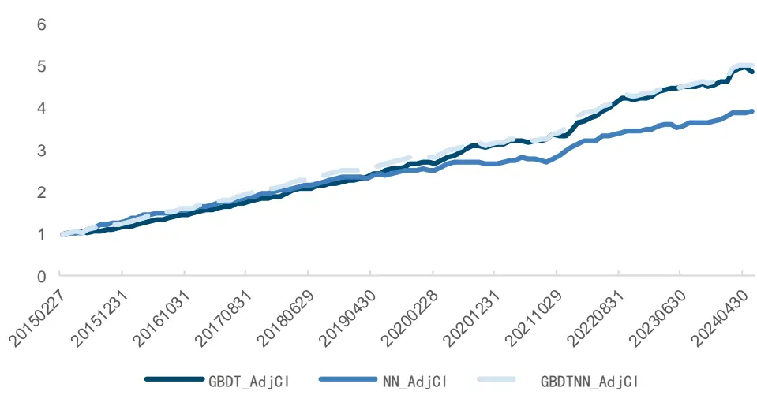
来源：Wind，国金证券研究所

相较于单类模型，合成模型的稳定性有进一步增强。

我们考虑测试 AI 因子在红利股票池中的选股效果，在中证红利指数成分股中月度调仓测试（未扣费），发现因子预测效果相较于全 A 略有下降，IC 均值约为 10.81%，多头年化超额 12.14%。多头超额最大回撤 10.55%。

图表39：AI选股因子值中证红利月度调仓主要指标

|  | IC 均值 | IC_IR | T值 | 多头年化超额多头信息比多头超额最大 |  |  | 多空年化收多空夏普 | 多空最大回撤 比率 |  |
| --- | --- | --- | --- | --- | --- | --- | --- | --- | --- |
|  |  |  |  | 收益率 | 率 | 回撤 益率 |  |  |  |
| GBDT | 7.98% | 0.45 | 4.79 | 9.33% | 0.86 | 9.02% | 22.29% | 1.02 | 32.21% |
| GBDT_AdjCI | 4.96% | 0.32 | 3.42 | 6.32% | 0.59 | 15.59% | 13.14% | 0.68 | 39.92% |
| NN | 10.84% | 0.59 | 6.27 | 11.16% | 1.06 | 16.84% | 30.19% | 1.48 | 21.00% |
| NN_AdjCl | 8.45% | 0.57 | 6.01 | 11.46% | 1.10 | 14.51% | 30.51% | 1.67 | 19.68% |
| GBDT+NN | 10.81% | 0.58 | 6.09 | 12.14% | 1.23 | 10.55% | 36.36% | 1.79 | 18.56% |
| GBDT+NN_AdjCI | 7.84% | 0.51 | 5.39 | 9.01% | 0.93 | 11.76% | 24.99% | 1.36 | 23.92% |

来源：Wind，国金证券研究所

图表40：AI选股因子净值走势（中证红利）
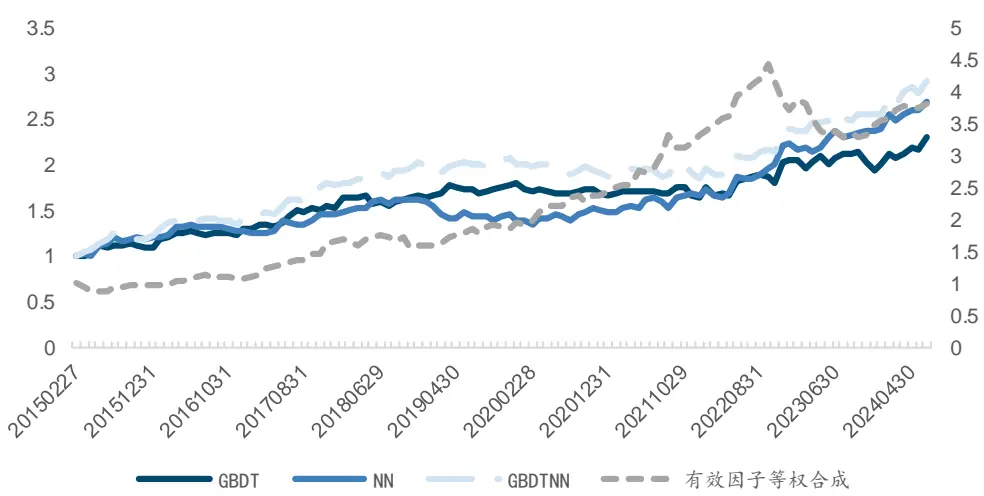
来源：Wind，国金证券研究所

为考察贴近交易实际的情况，我们设置等权买入因子值最高的前十只股票，手续费率设置为双边千四后，得到的红利股优选策略获得了相对优异的超额收益，年化超额 8.36%，跟踪误差 11.91%。

图表41：中证红利股优选策略净值走势
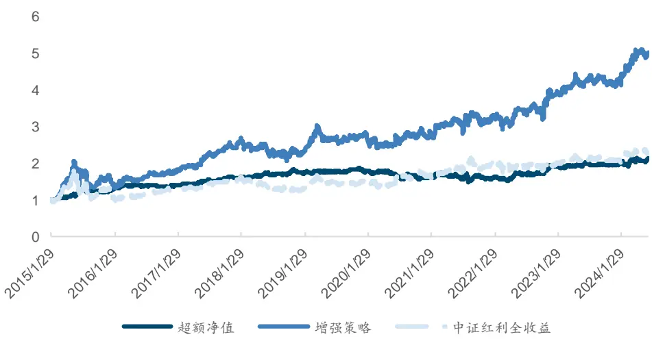
来源：Wind，国金证券研究所

图表42：中证红利指增策略主要指标

|  | 中证红利指增策略 | 中证红利全收益指数 |
| --- | --- | --- |
| 年化收益率 | 18.70% | 9.23% |
| 年化波动率 | 21.58% | 20.92% |
| Sharpe 比率 | 0.87 | 0.44 |
| 最大回撤率 | 38.52% | 45.66% |
| 双边换手率（月度） | 139.36% |  |
| 年化超额收益率 | 8.36% |  |
| 跟踪误差 | 11.91% |  |
| 信息比率 | 0.70 |  |
| 超额最大回撤 | 19.80% |  |

来源：Wind，国金证券研究所

接着我们查看了近期的股票持仓，并对股票的因子暴露做了一定分析。如下图表所示，若不做风格约束，因子天然会暴露红利、估值、残差波动率、Beta、杠杆等风格因子；行业上则会更多暴露银行、交通运输等。

图表43：策略股票持仓风格因子暴露均值
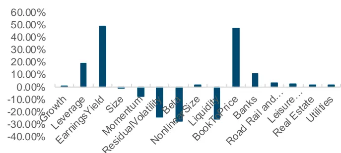
来源：Wind，国金证券研究所

图表44：策略股票持仓风格因子暴露（风险调整后）
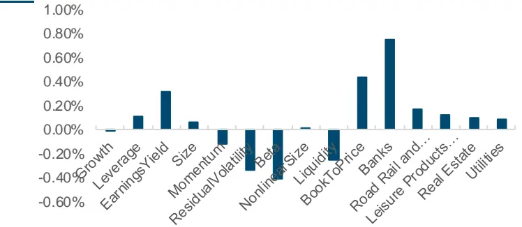
来源：Wind，国金证券研究所
以下为近期中证红利选股策略的持仓股票：

图表45：近期中证红利选股策略持仓股票

| 2024年3月 |  | 2024年4月 |  | 2024年5月 | 2024年6月 |  | 2024年7月 |
| --- | --- | --- | --- | --- | --- | --- | --- |
| 002110.SZ | 三钢闽光 | 603878.SH 武进不锈 | 601398.SH | 工商银行 | 601169.SH | 北京银行 601169.SH | 北京银行 |
| 600479.SH | 千金药业 | 601169.SH 北京银行 | 601169.SH 北京银行 |  | 600015.SH 华夏银行 | 601229.SH | 上海银行 |
| 603878.SH | 武进不锈 | 600389.SH 江山股份 | 601939.SH | 建设银行 | 601328.SH 交通银行 | 601328.SH | 交通银行 |
| 600064.SH | 南京高科 | 601988.SH 中国银行 | 601328.SH | 交通银行 | 601229.SH | 上海银行 601009.SH | 南京银行 |
| 603886.SH | 元祖股份 | 601398.SH 工商银行 | 600901.SH | 江苏金租 | 600919.SH | 江苏银行 002030.SZ | 达安基因 |
| 600755.SH | 厦门国贸 | 601998.SH 中信银行 | 601288.SH | 农业银行 | 601077.SH | 渝农商行 600377.SH | 宁沪高速 |
| 002233.SZ | 塔牌集团 | 000789.SZ 万年青 | 603886.SH | 元祖股份 | 601009.SH | 南京银行 605368.SH | 蓝天燃气 |
| 601997.SH | 贵阳银行 | 601939.SH 建设银行 | 600015.SH | 华夏银行 | 600000.SH | 浦发银行 601000.SH | 唐山港 |
| 600782.SH | 新钢股份 | 002367.SZ 康力电梯 | 600350.SH | 山东高速 | 601019.SH | 山东出版 600350.SH | 山东高速 |
| 002416.SZ | 爱施德 | 601818.SH 光大银行 | 002443.SZ | 金洲管道 | 601818.SH | 光大银行 600900.SH | 长江电力 |

来源：Wind，国金证券研究所

## 四、基于红利风格择时+红利股优选构建的红利固收+策略

## 1. 基于红利风格择时+红利股优选构建的策略

可以看到，上述择时策略和红利选股策略都有较好的表现，接下来我们尝试去构建结合择时与红利选股的策略，构建思路如下：保持股票部分仓位的选股权重比例不变，仓位由择时信号月度调整，共有 0 和 100%两种仓位。手续费率设为双边千四，测试结果如下所示：

图表46：基于红利风格择时+红利股优选构建的策略净值走势
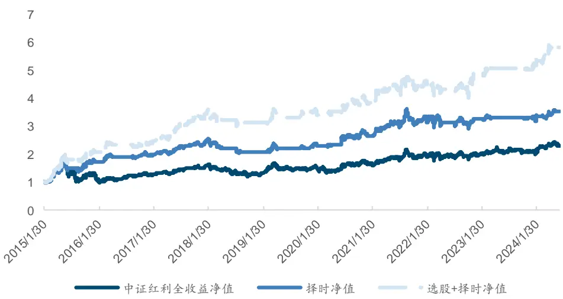
来源：Wind，国金证券研究所

图表47：基于红利风格择时+红利股优选构建的策略主要指标

|  | 年化收益率 | 年化波动率 | 夏普比率 | 最大回撤 |
| --- | --- | --- | --- | --- |
| 选股策略 | 18.83% | 21.64% | 0.87 | 38.52% |
| 择时策略 | 14.35% | 15.16% | 0.95 | 25.28% |
| 选股+择时策略 | 20.71% | 15.98% | 1.30 | 18.07% |
| 中证红利全收益 | 9.28% | 20.98% | 0.44 | 45.66% |

来源：Wind，国金证券研究所

单纯选股策略和择时策略的夏普比率分别为 0.87 和 0.95，而两者叠加后的择时+选股策略兼具选股策略高收益和择时策略低回撤的特点，夏普比率达到 1.30，收益稳定性相较于中证红利全收益指数得到了大幅提高。

## 2. 基于红利风格择时+红利股优选构建的固收+策略

延续上述择时+选股的策略，我们进一步引入了固收产品以优化资产配置，降低产品波动。具体构建思路如下：保持股票部分仓位的选股权重比例不变，依据择时信号进行月度灵活调整，设定两种可能的仓位，0%和 20%的股票仓位，对于剩余的仓位，则全部投资于固收产品（中长期纯债型指数），基准设置为 80%中长纯债型指数+20%中证红利全收益。同样地，手续费率设为双边千四，测试结果如下所示：

图表48：基于红利风格择时+红利股优选构建的固收+策略净值走势
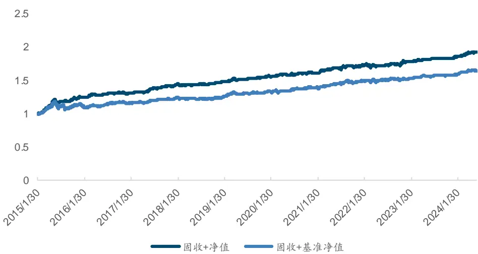
来源：Wind，国金证券研究所

图表49：基于红利风格择时+红利股优选构建的固收+策略主要指标

|  | 年化收益率 | 年化波动率 | 夏普比率 | 最大回撤 |
| --- | --- | --- | --- | --- |
| 选股策略 | 18.83% | 21.64% | 0.87 | 38.52% |
| 择时策略 | 14.35% | 15.16% | 0.95 | 25.28% |
| 固收+策略 | 7.21% | 3.43% | 2.10 | 4.93% |
| 固收+基准 | 5.44% | 4.43% | 1.23 | 9.97% |

来源：Wind，国金证券研究所

可以看出，固收+策略年化收益率 7.21%，夏普比率 2.10，最大回撤 4.93%，整体具有较好的收益回撤表现。

## 五、总结

在本篇报告中，我们使用包括经济、通胀、货币和信用四个维度的 30 余个宏观数据指标，筛选出最优事件因子和最优数据处理方式，所构建的红利择时策略年化收益率 14.16%，夏普比率 0.90，收益稳定性远超中证红利全收益指数。

在利用红利指数构建 AI 选股策略时，我们首先对中证红利指数的特点做了一定分析。接着我们尝试了利用传统因子进行选股测试，并且对识别的十个传统有效因子做了等权线性合成，合成后的因子IC均值6.32%，年化超额15.42%，多头超额最大回撤25.46%，行业市值中性化化后的合成因子 IC 均值 5.77%，年化超额 13.75%，多头超额最大回撤

17.46%。因子展现出了一定的预测能力，但同时也出现了较大的回撤，收益稳定性较差。最后我们通过 GBDT 和 NN 两大类 AI 模型对中证红利成分股进行选股测试，因子能在股票池内获取显著的超额收益，多头年化超额 12.14%，等权买入前十只股票所构建的指增策略年化超额 8.36%。

进一步考虑，结合了择时与选股的红利灵活配置策略能在两类策略基础上进一步提升，年化收益率 20.71%，夏普比率 1.30，最大回撤仅为 18.07%。考虑最高 20%权益的固收+策略，年化收益率为7.21%，夏普比率2.10，最大回撤4.93%，收益稳定性得到了极大的提升。

## 风险提示

1、以上结果通过历史数据统计、建模和测算完成，在政策、市场环境发生变化时模型存在时效的风险。

2、策略通过一定的假设通过历史数据回测得到，当交易成本提高或其他条件改变时，可能导致策略收益下降甚至出现亏损。

## 特别声明：

国金证券股份有限公司经中国证券监督管理委员会批准，已具备证券投资咨询业务资格。

形式的复制、转发、转载、引用、修改、仿制、刊发，或以任何侵犯本公司版权的其他方式使用。经过书面授权的引用、刊发，需注明出处为“国金证券股份有限公司”，且不得对本报告进行任何有悖原意的删节和修改。

本报告的产生基于国金证券及其研究人员认为可信的公开资料或实地调研资料，但国金证券及其研究人员对这些信息的准确性和完整性不作任何保证。本报告反映撰写研究人员的不同设想、见解及分析方法，故本报告所载观点可能与其他类似研究报告的观点及市场实际情况不一致，国金证券不对使用本报告所包含的材料产生的任何直接或间接损失或与此有关的其他任何损失承担任何责任。且本报告中的资料、意见、预测均反映报告初次公开发布时的判断，在不作事先通知的情况下，可能会随时调整，亦可因使用不同假设和标准、采用不同观点和分析方法而与国金证券其它业务部门、单位或附属机构在制作类似的其他材料时所给出的意见不同或者相反。

本报告仅为参考之用，在任何地区均不应被视为买卖任何证券、金融工具的要约或要约邀请。本报告提及的任何证券或金融工具均可能含有重大的风险，可能不易变卖以及不适合所有投资者。本报告所提及的证券或金融工具的价格、价值及收益可能会受汇率影响而波动。过往的业绩并不能代表未来的表现。

客户应当考虑到国金证券存在可能影响本报告客观性的利益冲突，而不应视本报告为作出投资决策的唯一因素。证券研究报告是用于服务具备专业知识的投资者和投资顾问的专业产品，使用时必须经专业人士进行解读。国金证券建议获取报告人员应考虑本报告的任何意见或建议是否符合其特定状况，以及（若有必要）咨询独立投资顾问。报告本身、报告中的信息或所表达意见也不构成投资、法律、会计或税务的最终操作建议，国金证券不就报告中的内容对最终操作建议做出任何担保，在任何时候均不构成对任何人的个人推荐。

在法律允许的情况下，国金证券的关联机构可能会持有报告中涉及的公司所发行的证券并进行交易，并可能为这些公司正在提供或争取提供多种金融服务。

本报告并非意图发送、发布给在当地法律或监管规则下不允许向其发送、发布该研究报告的人员。国金证券并不因收件人收到本报告而视其为国金证券的客户。本报告对于收件人而言属高度机密，只有符合条件的收件人才能使用。根据《证券期货投资者适当性管理办法》，本报告仅供国金证券股份有限公司客户中风险评级高于 C3 级(含 C3 级）的投资者使用；本报告所包含的观点及建议并未考虑个别客户的特殊状况、目标或需要，不应被视为对特定客户关于特定证券或金融工具的建议或策略。对于本报告中提及的任何证券或金融工具，本报告的收件人须保持自身的独立判断。使用国金证券研究报告进行投资，遭受任何损失，国金证券不承担相关法律责任。

若国金证券以外的任何机构或个人发送本报告，则由该机构或个人为此发送行为承担全部责任。本报告不构成国金证券向发送本报告机构或个人的收件人提供投资建议，国金证券不为此承担任何责任。

此报告仅限于中国境内使用。国金证券版权所有，保留一切权利。

上海

电话：021-80234211

北京

深圳

电话：010-85950438

邮箱：researchsh@gjzq.com.cn

电话：0755-86695353

地址：上海浦东新区芳甸路 1088 号紫竹国际大厦 5 楼

邮编：201204

邮箱：researchbj@gjzq.com.cn

邮箱：researchsz@gjzq.com.cn

邮编：100005

地址：北京市东城区建内大街 26 号新闻大厦 8 层南侧

邮编：518000

地址：深圳市福田区金田路 2028 号皇岗商务中心18 楼 1806

【小程序】国金证券研究服务

【公众号】国金证券研究