证券研究报告

## 金融工程组

分析师：高智威（执业S1130522110003)联系人：胡正阳

gaozhiw@gjzq.com.cn

huzhengyang1@gjzq.com.cn

## RAG-ChatGPT提前布局热点概念领涨股

本篇报告继续探讨大语言模型在热点投资上的应用，是在《Beta 猎手系列之七：追上投资热点——基于 LLM 的产业链图谱智能化生成》提出的“产业链 Agent”模型的基础上做了进一步拓展，进一步提升了产业链与概念股梳理效果，并增加了识别概念领涨股的功能，帮助投资者更准确地把握行情。

## RAG: What, Why, How?

RAG 是一种优化大语言模型输出质量的技术，通过在指定数据库中检索高相关信息来提升模型回答质量，适用于垂直领域知识增强、最新知识更新、扩展上下文长度等多种应用场景。通过“海底捞针”实验我们证明，尽管大模型支持输入更长上下文，但在处理较长文本时可能出现能力下降，这也是我们必须用 RAG 提炼信息，实现降本增效的原因。基于查询的 RAG 是当前较主流的 RAG 框架：检索出高相关文本后通过 Prompt 与查询一起输入大模型，提升回答的质量。我们可以从初始查询、检索器、生成器等方面对 RAG 框架进行优化，其中检索器是决定 RAG 效果的关键。检索器包括检索算法、Embedding 模型以及向量数据库的选择等，能实现对检索结果的质量以及大数据下检索效率的提升，需要使用者根据应用的特征专门挑选检索方式。

## 产业链与概念股梳理全流程升级

我们推出“产业链 Agent”模型 v2.0 版本，全流程提升梳理结果质量。首先，我们搭建了涵盖新闻、研报、公司公告等多个来源的知识库，并针对产业链梳理与概念股梳理两种不同的任务分别进行处理；考虑到中文金融文本的特性，我们选择混合检索的算法，并创新地提出了时间加权的概念，将信息的时效性纳入考虑；此外，我们也实现对文本做进一步浓缩，以及判断可能存在的概念股映射不准的问题，并最大化发挥不同大模型的优势。

产业链梳理结果上来看，提升检索文本质量之后，我们能直接生成任意概念的产业链图谱，也能给到更加完善的图谱结果；概念股梳理结果更加准确，且我们给出的概念股组合等权指数与 Wind 人工梳理构造的指数走势基本一致，表明我们给到的概念股范围有较高准确度。

## 概念领涨股特征识别与领涨组合构造

模型梳理得到的概念股数量较多，我们试图通过量价特征从中找出领涨股，帮助投资者更好把握热点行情。我们以 AI手机、人形机器人、合成生物学与低空经济四个概念为例，通过复盘确认了各概念的行情启动时间点。通过检验，我们发现动量因子与非流动性因子在热点行情来临时具有一定选股效果。我们将两个因子做等权合成，同时叠加“尖峰右偏”特征做第二层筛选，并在市值大于 50 亿的个股上做筛选，构造领涨组合。从回测结果上来看，领涨组合在概念启动后的短期内相对概念指数以及 Wind 全 A 均有明显的超额收益。

## 风险提示

大语言模型输出结果具有一定随机性的风险；模型迭代升级、新功能开发可能会导致结论不同的风险；人工智能模型得出的结论仅供参考，可能出现错误答案的风险。

## 一、RAG: What, Why, How?

## 1.1 为什么需要 RAG？

目前大模型展现出很强的生成能力，基本能够满足大部分日常问答，但在进行特定领域的问答时依旧容易出现脱离实际的不正确回答，我们称之为“幻觉”（Hallucination）现象。这一现象在某些对准确性要求较高的应用领域是令人难以接受的。“幻觉”的产生原因之一在于大模型的预训练数据中并不包含相关知识文本，或大模型对其中概念出现了混淆，在没有得到补充信息指引的情况下只能“强行”回答，也因此容易出错。对此，一个很朴素的想法是：如果将需要的知识告诉大模型，能否提升其表现？

（ ，检索增强生成）便基于这一想法诞生了。简单来说， 是一种优化大语言模型（ ）生成质量的技术，在知识库中检索与用户输入高相关的信息，输入文本进行补充，并提升模型回答的质量。RAG 能在应用端带来效果的快速提升，相比于微调等方式，它便于快速部署、无需大量的时间与算力资源投入，是一种更经济高效的改进方法。

图表1：RAG 通用架构
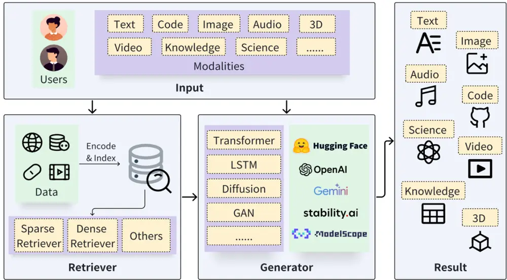
来源：《Retrieval-Augmented Generation for AI-Generated Content: A Survey》，国金证券研究所

具体来说，RAG 适用于以下应用场景：

垂直领域知识增强。大模型预训练所掌握的更偏向于常识或通识类知识，对专业领域譬如医学、法律或化工等领域的知识掌握程度不高，更可能出现幻觉现象。RAG可以通过检索外部权威知识库来获取专业知识，提升回答的权威性，减少幻觉现象的发生。

最新知识及时更新。像金融、传媒等领域对信息的及时性有很高要求，但持续更新模型参数耗时长、投入成本大。RAG 无需重新训练模型，能够经济高效地保持输出的时效性和准确性。

防止术语混淆，指引回答方向。同一个词汇在不同领域中可能具有不同的含义，而大模型在缺少指引时很可能会出现不同领域信息的混淆。RAG 通过在我们指定的知识中做检索，能有效防止模型混淆，得到我们预期方向的回答。

拓展上下文长度。大模型对输入长度有限制，外部知识库信息无法全部输入。RAG技术帮助我们从中提取关键文段，相当于提升了输入文本的信息量，从而提高模型响应的质量。

更安全地利用自有知识库。若客户较为重视数据的隐私性，不想将自己的知识库上传到大模型云端进行微调，但同时也希望利用大模型的归纳能力对自己的知识库进行分析，RAG 同样是较好的解决方案。

RAG 技术能够满足使用者的各类需求，且能有效提升大模型的生成表现使其更贴合实际应用领域，是目前大语言模型复杂应用落地的最优解。

## 1.2 为什么必须要 RAG？ RAG vs 长上下文

当前大模型发展的一大趋势就是超长的上下文窗口。从 GPT-4 的 128k token 长度，到Claude2 的 200k，再到 Gemini 1.5 Pro 的 1M token，大模型在上下文长度方面的能力正以惊人的速度提升。当前微软最新提出的 LongRoPE 架构更是扩展至 2048k 上下文输入，并继续研究实现无限上下文窗口目标的技术。国内大模型如 Kimi也实现了 200 万字长度的输入。

超长的上下文长度已足够把一本长篇小说的知识量同时输入大模型对话窗口供其分析，为什么还需要 RAG 呢？一个关键点在于，大模型的回答存在近期偏差（Recency Bias），即更偏向于关注最新输入的文字，且这个现象随着输入长度增加而愈发明显。

我们可以通过“大海捞针”（Needle In AHaystack， NIAH）实验一窥究竟。NIAH 是将目标信息藏在一段与其毫无关联的长文本中，并观察大模型能否从中找出该目标信息。实验控制变量包括：目标信息放置在长文本中的深度，从文本开头到文本结尾对应0%至100%；长文本的上下文长度，也即一次性输入的 Token 总量。

以下是对 GPT-4和 Claude-2.1 进行 NIAH测试的结果。可以看出，GPT-4 模型的测试表现在 64k 上下文长度之后开始减弱，在 100k 之后下降更为明显。有趣的是在文本较长时，若“针”被藏在靠近文本开头的位置，GPT-4 非常容易忽略它；反而是放在文本后半段处，模型依旧能保持稳定地找到“针”的位置。

图表2：GPT-4128k“大海捞针”测试结果
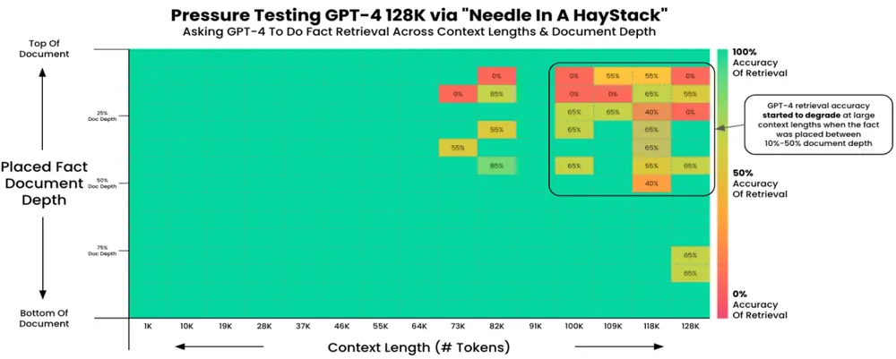
Goal: Test GPT-4 Ability To Retrieve Information From Large Context Windows A fact was placed within a document. GPT-4 (11o6-preview) was then asked to retrieve it. The output was evaluated for accuracy. This test was run at 15 different document depths (top > bottom) and 15 different context lenaths (1K >128K tokens). 2x tests were run for larger contexts for a larger sample size
来源：月之暗面，国金证券研究所

Claude-2.1 模型整体测试效果更弱，但也呈现出相同的分布，即搜寻的准确率随着文本长度上升而下降，且对文本靠前部分的识别能力下降更快。

图表3：Claude-2.1200k“大海捞针”测试结果
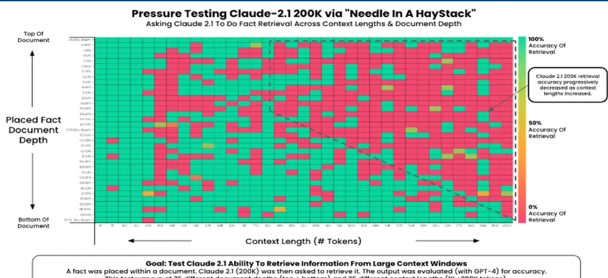
Goal: Test Claude 2.1 Ability To Retrieve Information From Large Context Windows A fact was placed within a document. Claude 2.1 (200k) was then asked to retrieve it. The output was evaluated (with GPT-4) for accuracy. This test was run at 35 different document depths (top > bottom) and 35 different context lengths (1K >200K tokens). Document Depths followed a sigmoid distribution
来源：月之暗面，国金证券研究所

中文语料方面的能力，也有 SuperCLUE 等机构给出了标准化的测评集与基准。SuperCLUE-200K（SC-200K）是一个大海捞针的中文升级版测试。以下为各个表现较好的大模型的测试结果，从中也能大致看出随着输入 token 长度的上升，模型准确度得分都会有一定下降。

图表4：各个大模型在中文版大海捞针SC-200K上的表现
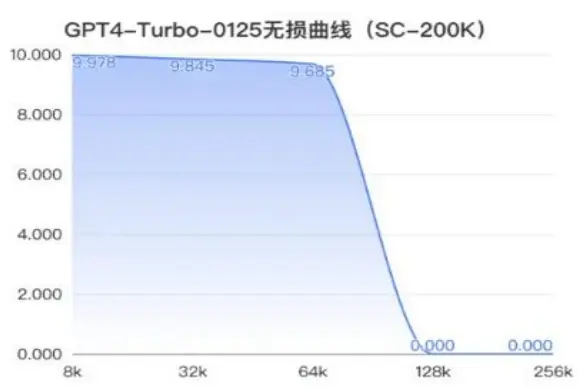

中文大海捞针SC-200K无损曲线
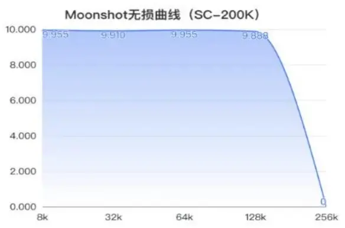

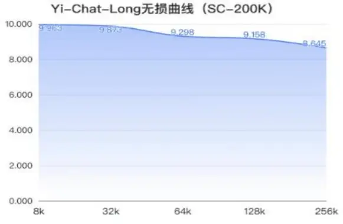
来源：CLUE 中文语言理解测评基准，国金证券研究所

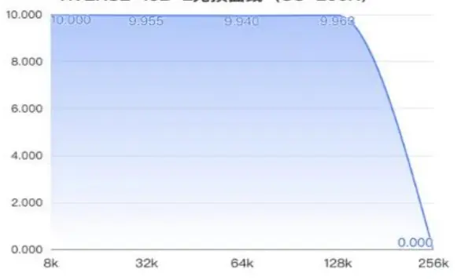

超长 token 输入除了无法被模型有效识别利用之外，还会导致每次较高的推理费用，这同样是应用端需要控制的。

RAG 则可以显著“降本增效”。RAG 对输入的文本进行有效筛选，通过降低输入 token长度来控制成本，同时保证模型能够有效利用信息。可以说，若用户希望实现大模型在特定垂域的应用增强，RAG 是目前最可行且经济高效的技术路径。

## 1.3 RAG 的架构流程与优化路径

实际上，RAG 也分为多种不同的架构，差别主要在于检索与生成的结合方式有所不同：

基于查询的 RAG（Query-based RAG，提示增强）是比较易于实现且主流的方法，会先将检索结果与原始查询进行结合，再输入大模型生成；

基于隐式表示的 RAG（Latent Representation-based RAG）则是将检索结果以编码形式放入生成模型中，在处理多模态数据方面有较大潜力；

基于对数似然的 RAG（Logit-based RAG）则是在大模型的解码过程中通过对数融合检索信息，从概率分布的层面改变生成结果，更侧重于对生成模型的训练，适合序列生成任务；

推测式 RAG（Speculative RAG）则是完全利用检索替代大模型生成，主要用于加快响应速度。

我们主要介绍 Query-based RAG，这也是本文后续模型所采用的方法。通俗来说，Query-based RAG 就是首先在我们提供的知识库中做检索，按照一定的检索算法筛选出和当前查询相关度高、或我们希望模型使用到的知识；同时我们设计好提示（Prompt）模板，将原始查询与检索结果放入模板增强输入文本的质量；最终将提升大模型生成回答的质量。

图表5：Query-based RAG 流程示意图
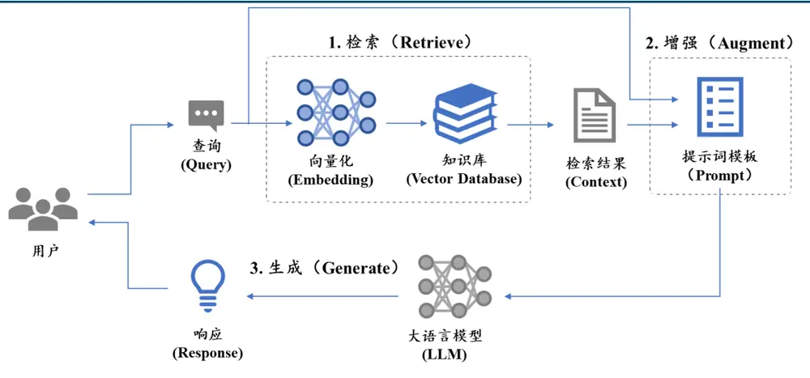
来源：国金证券研究所

在 Query-based RAG 方式下，影响 RAG 效果、且具有可操作性的优化主要可以在以下方面展开：查询输入、知识库质量、检索技术、提示工程以及 RAG 流程增强。

图表6：RAG 效果改进路径
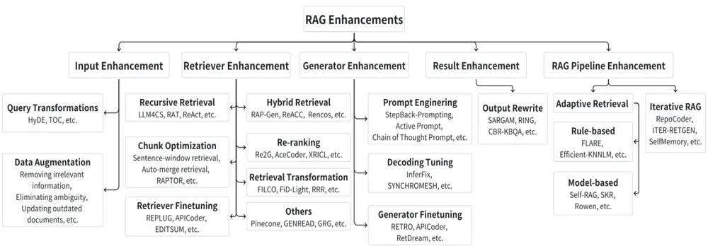
来源：《Retrieval-Augmented Generation for AI-Generated Content: A Survey》，国金证券研究所

查询输入增强。主要是对用户的原始输入进行预处理或扩充，包括剔除原始输入中不相关或包含歧义的内容，或是将查询内容扩充成伪文档（Query2doc、HyDE），来提供更丰富的输入信息。

检索器增强。检索直接决定了从知识库中提取信息的质量，这包括选择合适的Embedding 模型（bge-large-zh-v1.5、gte-large-zh 等）、检索算法（BM25、DPR、HybridRetrieval等），更细节的还涉及文本拆分规则、向量数据库选择等，整体决定了 RAG的效率。

生成器增强。主要包括提示工程与大模型的微调，其中提示工程即对提示词模板做改进，包括 Prompt Compression、Chain of Thought 等。

- 输出提炼。对生成器返回结果进行改写，以满足下游任务的需求。

RAG 流程增强。这主要是对 RAG 流程本身进行一定改进。比如自适应检索（AdaptiveRetrieval）会基于规则或模型判断检索结果是否能带来增益，防止过度检索带来的资源浪费与回答混乱，具体包括 FLARE、Self-RAG 等方法；迭代 RAG（Iterative RAG）则是通过循环检索与生成步骤来精炼结果。

除此之外，实际上知识库的质量也是提升点之一。知识库为最终生成提供重要的指引作用，譬如法律领域应用就需要保证知识库中为权威的法律相关文本，其质量直接决定检索结果的有效性。

综合来看，检索技术是决定最终 RAG效果的关键因素。挑选一个适当的检索器并搭建检索流程是在RAG过程中首先需要解决的。后文，我们对检索过程中的细节做进一步介绍。

## 1.4 如何选择适当的检索算法？

检索首先要解决的问题是如何衡量文本之间的相关性，再解决大样本中检索速度的效率问题。一些现成的框架例如 Langchain、Haystack 等可以帮助我们快速实现基础的检索器，但要搭建一套完整的检索流程还需要对各类检索技术有详细的了解，才能挑选出合适的方案，因此这部分我们对检索的具体方法做详细介绍。

基本算法层面，检索器可以主要分为稀疏检索（Sparse Retrieval）和稠密检索（DenseRetrieval）两类，混合检索（Hybrid Retrieval）则是将稀疏检索与稠密检索进行融合的一种方法；提升检索速度方面，则会使用 FAISS 等向量数据库来做加速。

## 稀疏检索

稀疏检索核心是通过关键词在文档中出现的词频构成向量来表示文本，包括 TF-IDF、BM25 等算法。其优点在于计算简单高效，逻辑上相对更为直观；但缺点是稀疏检索无法衡量词义上的相似性，对同义词、词形变化或语气等信息不敏感。值得注意的是，稀疏检索并不是关键词比对法（直接使用关键词数量来做排序），这种方式存在过度工程化、返回文本量不稳定、匹配机制死板等问题，检索质量较差。

BM25 算法是较好的稀疏检索方法。它采用关键词匹配的思路，通过计算查询Q中所有单词对文档 $D_{k}$ 的打分并求和得到文档整体的分数，由此筛选出高相关的文档。其中，单词 $q_{i}$ 对文档 $D_{k}$ 的打分由三个部分组成：单词的权重、单词与文档的相关性、单词与查询的相关性。

单词的权重最简单就是用 IDF 值：

$$
IDF(q_{i})=\log\frac{N-df_{i}+0.5}{df_{i}+0.5}
$$

其中 N 表示全部文档数， $df_{i}$ 为包含了单词 $q_{i}的$ 文档的个数。公式上来看，若包含单词 $q_{i}$ 的文档数越多，说明 $q_{i}$ 重要性越小或者区分度越低，导致权重 IDF 值越小。随后计算单词与文档的相关性S $\boldsymbol{i}(\boldsymbol{q}_{i},D)$ ，BM25 采用以下算法：

$$
\mathcal{S}(q_{i},D)=\frac{(k_{1}+1)tf_{q_{i},D}}{K+tf_{q_{i},D}},\quad K=k_{1}(1-b+b*\frac{L_{D}}{L_{avg}}),
$$

其中， $tf_{q_{i},D}$ 是单词 $q_{i}$ 在文档D中的词频， $L_{D}$ 是文档D的长度， $L_{avg}$ 是所有文档的平均长度。变量 ${\boldsymbol{k}}_{1}(k_{1}>0)$ 对相关性取值进行标准化， $k_{1}$ 越大越倾向于使用原始词频信息，越小则整个相关性越接近于二元变量。 $b(0<\mathsf{b}<1)$ 用于确定信息量的范围，取值越大则文档长度对相关性的影响就越明显。

最后是单词和查询的相关性 $S(q_{i},Q)$

$$
S(q_{i},Q)=\frac{(k_{3}+1)tf_{q_{i},Q}}{k_{3}+tf_{q_{i},Q}}
$$

类似地， $tf_{q_{i},Q}$ 是单词 $q_{i}$ 在查询Q中的词频， $k_{3}$ 用于对相关性取值进行标准化。最终，基于 BM25 算法得到的文档D在查询Q下的分数为：

$$
RSV_{D}=\sum_{q_{i}\in Q}IDF(q_{i})*S(q_{i},D)*S(q_{i},Q)
$$

## 稠密检索与 Embedding 模型选择

稠密检索基于 Embedding 模型将查询与文档转换为高维度的向量，并根据查询向量与文档向量之间的距离来表示相关性。Embedding 模型通过训练深度学习模型（如 BERT 等）去捕捉文本的语义信息，能根据文本生成固定维度的浮点数向量，构成一个高维向量空间。在这个高维的向量空间中，意义相似的文本对应向量之间距离更近。稠密检索擅长识别同义词或相近语义的不同表达方式，更加灵活；但计算与存储成本更高，耗时更长，需要专门的算法来辅助实现高速检索。

同样有许多方法能对 Embedding 模型效果进行提升，包括 DPR、ColBERT 等。当然，也有很多开源的 Embedding 模型可供我们直接使用，可以通过 MTEB 排行榜查看当前各开源Embedding模型在不同任务上的得分及排名，并根据应用实际需求来挑选合适的模型。针对中文语境的评测任务，团队同样推出了 C-MTEB 基准，目前排名较高的模型包括xiaobu-embedding-v2，gte-Qwen2-7B-instruct 等。

## 混合检索与重排序

基于关键词的稀疏检索与基于向量的稠密检索在召回文本质量上各有特点，想最大化利用二者的优势则需要按一定权重将多个检索器的结果融合起来，这种方法称为混合检索。针对混合检索得到的多组检索结果，我们还需要进行重排序（Rerank）来挑选出最终的检索结果。

图表7：混合检索(Hybrid Retrieval)流程示意图
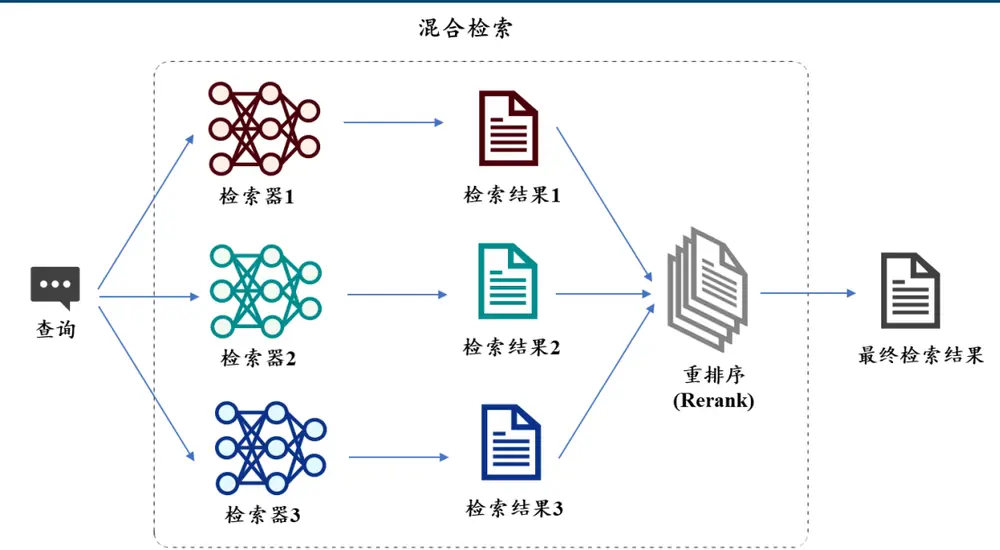
来源：国金证券研究所

重排序模型（Reranker）的类型主要分为两种：基于统计和基于深度学习的 Reranker。基于统计的重排序一般会使用倒数排序融合（Reciprocal Rank Fusion, RRF）的方法，这个方法由 Cormack(2009)等人提出。假定我们共生成了N个检索结果子集，每个检索子集 $D_{i}$ 内是按相关性从高到低排序的文档，那么针对文档d的 得分可以表示为：

$$
Score(d)=\sum_{\{i:\ d\in D_{i}\}}\frac{1}{k+rank_{i}(d)}
$$

其中， $rank_{i}(d)$ 表示文档d在检索子集 $.D_{i}$ 中的排序值；k为常数值，论文中推荐设为 $60\mathrm{{}}$ 该算法会累计求和每篇文档在其所在子集中的位置，并取倒数作为其权重分数。RRF 不仅可以融合多个检索器对单个查询的结果，同样可以对多个查询的结果进行融合，具有很高的灵活性。

基于深度学习的方法则是各类基于 BERT 的 Reranker 模型。其思路与 Embedding 模型类似，同样是将文本向量化后做排序，差异在于 Reranker 模型将查询与文档合并后一同输入 Transformers 模型计算相似性得分，而 Embedding 模型是将查询与文档分开向量化后再计算相似性。相比于 Embedding 模型，Reranker 模型信息损失更少，但会消耗更长的时间，因此适用于做精排。

流程上，Embedding 模型更类似与粗排，首先将检索文档的范围缩小；Reranker 模型更类似精排，提升 Top K整体的召回率。

## 向量数据库

向量数据库我们着重介绍 FAISS。除了 FAISS 外也有 Chroma、Milvus 和 Weaviate 等免费的开源向量数据库以及 Pgvector 等商用向量数据库，而FAISS 的优势在于能够基于 GPU进行计算加速，高效处理大规模数据，因此我们更推荐 FAISS。

FAISS 是 Facebook AI 研究院开发的一种高效的相似性搜索和聚类的库，提供了一系列针对大规模向量匹配问题的高速计算工具，支持在高维空间中进行相似性搜索。它可以将我们通过 Embedding 模型得到的向量库封装成一个索引（Index）数据库，通过索引来加速我们寻找 Top K最相似向量的过程。

FAISS 支持的向量相似度度量方法包括 L2、内积、余弦相似度等多种方法，具体的检索加速算法有以下可选项：

Flat（暴力检索）：直接计算向量的距离来做排序。召回率最高，最准确，但速度慢，内存占用大。

IVFx Flat（倒排暴力检索）：将向量库聚成 x 个类，将 Flat 范围限定在检索向量附近几个中心Index对应的集合中。此方法相对Flat算法在效率上有所提升，但速度依旧偏慢。

PQx（乘积量化）：将向量的维度切成 x 段，每小段向量分别进行检索并取结果的交集，得出最后的 Top K。此方法速度更快，占用内存更小，但召回率相对 Flat 明显下降，适用于内存资源稀缺、对检索速度有高要求且对准确度要求不高的应用场景。

HNSWx（图检索）：每个向量最多连接 x 个最相似的其他向量，由此构成向量之间的图网络。图检索在大样本下依旧保持检索速度极快、召回率高的优势，但索引的构建速度极慢、占用内存大是该算法的弱点，且不支持从索引中删除数据。

也有以上几种算法的结合，例如 IVFx PQy（倒排乘积量化），会将向量切成 y 段后，每段分别聚为 x 个类再检索，若没有极端的应用需求，这是目前最推荐的检索加速方法。其他也包括 LSH（局部哈希敏感）、PCA降维等方法，此处不做赘述。具体使用哪种算法还需要我们根据应用需求来进行选择。

以上就是 RAG 相关内容的介绍。实际上 RAG 是一系列检索增强方式的总称，任何基于知识库检索思路来增强生成效果的方法都可以称为 RAG。

## 二、产业链与概念股梳理全流程升级

国金证券金融工程团队此前发布了《Beta 猎手系列之七：追上投资热点——基于 LLM 的产业链图谱智能化生成》，并在报告中首次推出了“产业链 Agent”模型，旨在梳理用户给定的投资概念或产品的上下游图谱，同时从图谱中每个节点出发梳理出相关的投资标的。

图表8：“产业链Agent”运行流程图
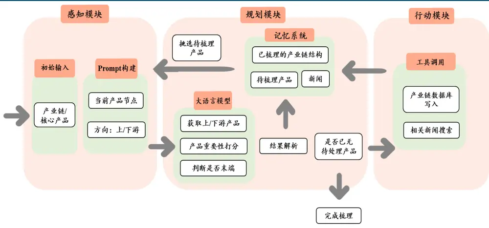
来源：国金证券研究所

我们为“产业链 Agent”模型提供了相关新闻搜索的能力，简单基于向量距离的概念来搜索相关新闻，提升其梳理专业领域产业链的表现，这便是使用了简单的 RAG 方法。

本文推出“产业链 Agent”模型 v2.0版本。在新的版本中，我们分别从知识库质量、RAG方式以及流程上对模型做了全面的升级，此外也针对产业链这一独特的对象做了相应调整，通过获取质量更高的文本来提升图谱结构合理性以及股票池的准确度。

## 2.1 多源知识库搭建

我们融合了新闻、研报、公司公告等多个来源的信息，搭建了完善的知识库。知识库的丰富度决定了最终检索文本的质量，我们希望尽可能地扩充知识库体量，因此需要处理多种数据源并进行整合。

数据源之间的差异明显，在数据量、信息丰富度、可信度、时效性等方面各有不同。譬如新闻数据量大、时效性强，但是有部分新闻信息含量较低（市场行情复盘类新闻、上市公司资本操作等），且存在重复的新闻，适合检索出更多文档去重后做合并；研报文本时效性相对低一些，但文本质量与可信度更高，适合精选出高质量的文段；年报、调研纪要、答投资者问等文本又有其不同的特征。同一类信息在生成产业链图谱与梳理概念股时又有不同的处理方式。

整体的处理流程如下所示：

图表9：多源知识库融合流程
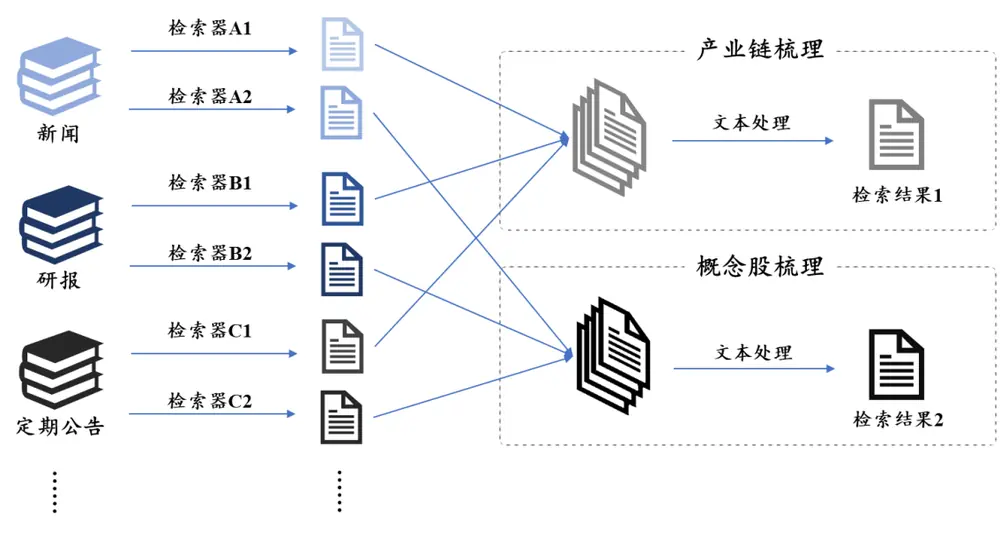
来源：国金证券研究所

## 2.2 混合检索与时间加权

检索器方面，我们采用了混合检索的方法。在中文的金融文本处理方面，我们认为单独的稀疏检索或稠密检索都缺乏可靠性。中文领域存在较多的一词多义现象，且同一个专业名词会出现在不同行业范畴内，代表的含义也不同，仅根据关键词词频检索容易导致检索的领域出现偏移；向量检索则对已有向量数据库的分布较敏感，若查询向量与知识库现有向量数据的距离都较大，也容易检索出不相关结果。一般来说，稀疏检索与稠密检索的召回数据是可以互补的，混合检索后对结果进行重排序，能够综合两种检索方法的长处，获得高质量的文本。

此外，我们认为时效性应当是金融领域信息的关键特征。金融信息追求及时，这意味着不仅新的信息需要及时加入知识库，对旧信息的关注度同时也应当减少，或者至少对旧信息的检索召回阈值应当变高。因此，时间较久远的文档需要满足更高的相关性要求才能够输出。为了防止过度工程化，我们简单使用半衰期加权的方式给各个时间范围指定检索数量，再将各个时间范围的检索结果合并输出。

以下是加权的示意图。实际情况中，可以使用更详细的时间颗粒度，提升检索结果中当前信息的占比。

图表10：知识库检索时间加权
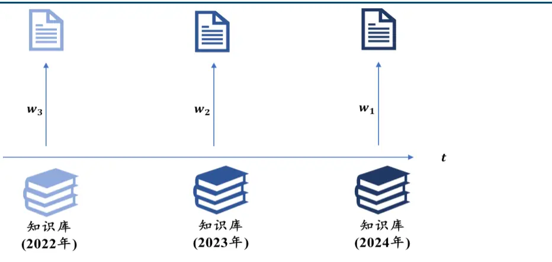
来源：国金证券研究所

其中， $\begin{array}{r}{w_{i}=\frac{2^{-\frac{i}{H}}}{\sum_{i=1}^{N}2^{\frac{-i}{H}}}}\end{array}$ 表示第i个时间分组检索数量占总检索数量的比重，H为半衰期长度。

## 2.3 文本处理与大模型选择

直接检索得到的文本还存在篇幅较长、保留无关信息的问题，需要对其进行再次的浓缩，我们使用大语言模型来实现这一点。此外，新闻或答投资者问的文本中会出现“公司声明与某概念无关”的情况，在概念股梳理过程中也需要添加流程识别这种情况，防止对概念股的准确度造成影响。诸如此类文本处理的细节还有许多，此处不一一赘述。

另外，在处理以上任务时会面临大模型的选择问题。当前市面上可选择的大语言模型种类繁多，且各自的特性使其适用于处理不同的任务。譬如 模型更擅长做中文长文本的相关处理，因此我们推荐使用它来做检索文本的浓缩任务； 系列依旧在逻辑推理方面有一定优势，适用于进行产业链梳理任务；而针对一些难度低且量大的文本处理任务，则可以优先选择 deepseek 模型实现……我们针对不同的任务属性分别选择了较合适的大模型，确保兼顾准确度与成本的可控，最大程度发挥各个模型独特的优势。

## 2.4 模型效果提升——产业链梳理

以上改进从理论上提升了模型梳理产业链以及概念股的能力，而从实际梳理效果上来看也有明显提升。

在上一篇报告中，我们以“华为产业链”为对象进行了案例展示。当时针对这类非产品的概念，我们还需要首先拆分到相关度最高的产品或业务上，再根据这些产品梳理出整个产业链，即按照“概念-产品/业务-产业链”的顺序进行梳理。而在对新版本模型进行大量实验后，我们发现当 RAG 能够检索出更高质量的文本时，从概念到产品的拆分步骤并非必要。从原理上来讲，提供的信息更详细后，大模型自身就能基于文本分析出整个概念中重要的产品分支，并不需要额外的步骤辅助。

以下是我们使用新版模型我们梳理的“华为产业链”图谱结果：

图表11：“华为产业链”图谱结果
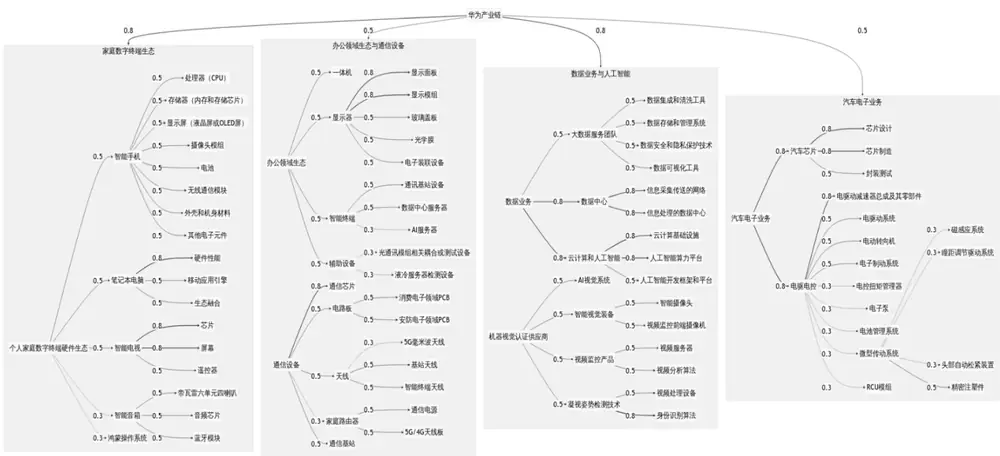
来源：ChatGPT，聚源，国金证券研究所

相比于上一版本我们将华为产业链拆分成智能手机、 基站设备和云服务三个模块，“产业链 Agent”模型 v2.0 的拆分结果更加详细，首先将华为产业拆分为数字终端硬件生态、数据业务、汽车电子和通信设备等，再梳理其上游节点，从结构上来说更加完整，与人工梳理的质量更加接近。我们同样展示部分其他产业链梳理的结果。

图表12：“低空经济”图谱结果
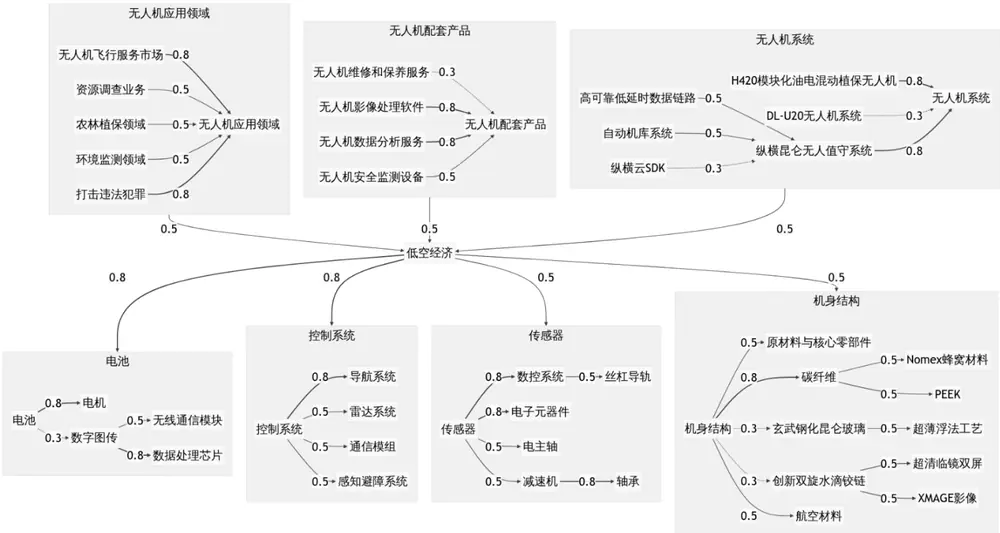
来源：ChatGPT，聚源，国金证券研究所

图表13：“人形机器人”图谱结果
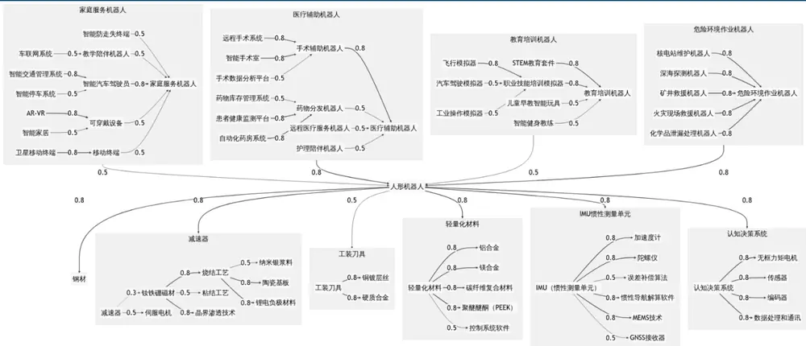
来源：ChatGPT，聚源，国金证券研究所

图表14：“智能驾驶”图谱结果
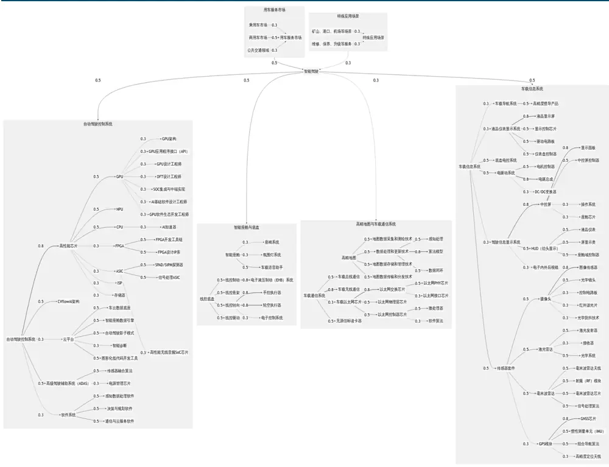
来源：ChatGPT，聚源，国金证券研究所

## 2.5 模型效果提升——概念股梳理

我们首先简单回顾一下概念股梳理的思路。模型会从产业链图谱的节点出发，同样使用RAG 的方法检索出高相关的新闻或研报文本；针对检索结果，我们再从中识别出具体的标的名称，以此完成概念股的梳理。

“产业链 Agent”v2.0 模型能生成更完善的产业链图谱结果，也因此能梳理出更详细的概念股结果。同时，我们也识别到新闻中可能会出现以下情况：新闻中提及了多个概念以及相应股票，但概念之间并无实际关联（多见于行情复盘类新闻）；或是上市公司声明其业务不涉及某某概念。对于以上或类似情况，我们也通过大语言模型进行剔除，以确保个股与概念之间的关联是确实存在的，进一步提升结果的可靠性。

以“华为产业链”为例，以下是我们新生成的概念股结果：

图表15：“华为产业链”概念股结果

| 股票代码 | 股票简称 | 相关节点 | 股票代码 | 股票简称 | 相关节点 |
| --- | --- | --- | --- | --- | --- |
| 000021.SZ | 深科技 | 汽车电子业务 | 300383.SZ | 光环新网 | 数据业务 |
| 000049.SZ | 德赛电池 | 汽车电子业务 | 300400.SZ | 劲拓股份 | 数字终端硬件生态 |
| 000063.SZ | 中兴通讯 | 通信设备，数字终端硬件生态 | 300410.SZ | 正业科技 | 汽车电子业务 |
| 000070.SZ | 特发信息 | 数字终端硬件生态 | 300432.SZ | 富临精工 | 汽车电子业务 |
| 000536.SZ | 华映科技 | 数字终端硬件生态 | 300448.SZ | 浩云科技 | 办公领域生态，数据业务 |
| 000682.SZ | 东方电子 | 数字终端硬件生态 | 300539.SZ | 横河精密 | 通信设备 |
| 000810.SZ | 创维数字 | 数字终端硬件生态 | 300545.SZ | 联得装备 | 数字终端硬件生态 |
| 000948.SZ | 南天信息 | 数据业务 | 300566.SZ | 激智科技 | 数字终端硬件生态 |
| 000988.SZ | 华工科技 | 数字终端硬件生态 | 300588.SZ | 熙菱信息 | 数据业务 |
| 000997.SZ | 新大陆 | 机器视觉认证供应商 | 300607.SZ | 拓斯达 | 机器视觉认证供应商 |
| 001268.SZ | 联合精密 | 通信设备 | 300663.SZ | 科蓝软件 | 办公领域生态，数据业务 |
| 002025.SZ | 航天电器 | 数字终端硬件生态 | 300674.SZ | 宇信科技 | 数据业务 |
| 002036.SZ | 联创电子 | 汽车电子业务 | 300678.SZ | 中科信息 | 数据业务 |
| 002063.SZ | 远光软件 | 数字终端硬件生态 | 300735.SZ | 光弘科技 | 数字终端硬件生态 |
| 002152.SZ | 广电运通 | 数据业务 | 300773.SZ | 拉卡拉 | 数字终端硬件生态 |
| 002156.SZ | 通富微电 | 汽车电子业务 | 300782.SZ | 卓胜微 | 通信设备 |
| 002217.SZ | 合力泰 | 机器视觉认证供应商 | 300805.SZ | 电声股份 | 数字终端硬件生态，汽车电子 |
| 002230.SZ | 科大讯飞 | 机器视觉认证供应商 | 300968.SZ | 格林精密 | 通信设备 |
| 002236.SZ | 大华股份 | 数据业务 | 300980.SZ | 祥源新材 | 汽车电子业务 |
| 002273.SZ | 水晶光电 | 数字终端硬件生态 | 301042.SZ | 安联锐视 | 数字终端硬件生态 |
| 002384.SZ | 东山精密 | 数字终端硬件生态 | 301128.SZ | 强瑞技术 | 办公领域生态 |
| 002415.SZ | 海康威视 | 机器视觉认证供应商 | 301268.SZ | 铭利达 | 通信设备 |
| 002446.SZ | 盛路通信 | 通信设备 | 301292.SZ | 海科新源 | 汽车电子业务 |
| 002456.SZ | 欧菲光 | 机器视觉认证供应商 | 301321.SZ | 翰博高新 | 汽车电子业务 |
| 002463.SZ | 沪电股份 | 汽车电子业务 | 600006.SH | 东风汽车 | 汽车电子业务 |
| 002475.SZ | 立讯精密 | 汽车电子业务 | 600104.SH | 上汽集团 | 汽车电子业务 |
| 002512.SZ | 达华智能 | 数字终端硬件生态 | 600105.SH | 永鼎股份 | 通信设备 |
| 002536.SZ | 飞龙股份 | 汽车电子业务 | 600166.SH | 福田汽车 | 汽车电子业务 |
| 002579.SZ | 中京电子 | 数字终端硬件生态，通信设备 | 600460.SH | 士兰微 | 通信设备 |
| 002594.SZ | 比亚迪 | 汽车电子业务 | 600487.SH | 亨通光电 | 通信设备 |
| 002642.SZ | 荣联科技 | 数据业务 | 600536.SH | 中国软件 | 办公领域生态，数据业务 |
| 002771.SZ | 真视通 | 数据业务 | 600745.SH | 闻泰科技 | 通信设备 |
| 002792.SZ | 通宇通讯 | 通信设备 | 600850.SH | 电科数字 | 数据业务 |
| 002815.SZ | 崇达技术 | 通信设备 | 600877.SH | 电科芯片 | 通信设备 |
| 002845.SZ | 同兴达 | 汽车电子业务 | 601138.SH | 工业富联 | 数字终端硬件生态 |
| 002855.SZ | 捷荣技术 | 数字终端硬件生态 | 603110.SH | 东方材料 | 汽车电子业务 |
| 002866.SZ | 传艺科技 | 汽车电子业务 | 603186.SH | 华正新材 | 数字终端硬件生态 |
| 002885.SZ | 京泉华 | 数字终端硬件生态 | 603206.SH | 嘉环科技 | 数字终端硬件生态 |
| 002906.SZ | 华阳集团 | 数字终端硬件生态，汽车电子 | 603228.SH | 景旺电子 | 汽车电子业务，通信设备 |
| 002916.SZ | 深南电路 | 通信设备 | 603328.SH | 依顿电子 | 汽车电子业务 |
| 002938.SZ | 鹏鼎控股 | 通信设备 | 603501.SH | 韦尔股份 | 通信设备 |
| 002947.SZ | 恒铭达 | 汽车电子业务 | 603626.SH | 科森科技 | 数字终端硬件生态 |
| 002957.SZ | 科瑞技术 | 数字终端硬件生态 | 603738.SH | 泰晶科技 | 通信设备 |
| 002983.SZ | 芯瑞达 | 机器视觉认证供应商 | 603757.SH | 大元泵业 | 汽车电子业务 |
| 003015.SZ | 日久光电 | 数字终端硬件生态 | 603912.SH | 佳力图 | 办公领域生态 |
| 003021.SZ | 兆威机电 | 汽车电子业务 | 603936.SH | 博敏电子 | 通信设备 |
| 003031.SZ | 中瓷电子 | 通信设备 | 605128.SH | 上海沿浦 | 汽车电子业务 |
| 300045.SZ | 华力创通 | 数字终端硬件生态 | 605258.SH | 协和电子 | 汽车电子业务 |
| 300098.SZ | 高新兴 | 机器视觉认证供应商 | 688036.SH | 传音控股 | 机器视觉认证供应商 |
| 300115.SZ | 长盈精密 | 数字终端硬件生态 | 688037.SH | 芯源微 | 通信设备 |
| 300136.SZ | 信维通信 | 通信设备 | 688039.SH | 当虹科技 | 机器视觉认证供应商 |
| 300212.SZ | 易华录 | 机器视觉认证供应商 | 688262.SH | 国芯科技 | 汽车电子业务 |
| 300231.SZ | 银信科技 | 数字终端硬件生态 | 688400.SH | 凌云光 | 办公领域生态，数据业务 |
| 300270.SZ | 中威电子 | 数据业务 | 688515.SH | 裕太微 | 通信设备 |
| 300308.SZ | 中际旭创 | 通信设备 | 688535.SH | 华海诚科 | 汽车电子业务 |
| 300319.SZ | 麦捷科技 | 数字终端硬件生态 | 688629.SH | 华丰科技 | 通信设备 |
| 300322.SZ | 硕贝德 | 通信设备 | 688630.SH | 芯碁微装 | 汽车电子业务 |
| 300366.SZ | 创意信息 | 数据业务 | 832149.BJ | 利尔达 | 数字终端硬件生态 |
| 300371.SZ | 汇中股份 | 数字终端硬件生态 | 837092.BJ | 汉鑫科技 | 办公领域生态，数据业务 |

来源：ChatGPT，聚源，国金证券研究所

我们也基于“产业链 Agent”v2.0 模型生成的概念股池，构造了等权指数，并与 Wind 上已有的概念进行大致对比。以下是 AI 手机（884895.WI）、人形机器人(8841699.WI)、合成生物（8841747.WI）与低空经济指数(8841750.WI)净值与我们构造的概念指数对比：

图表16：“AI手机”概念净值对比
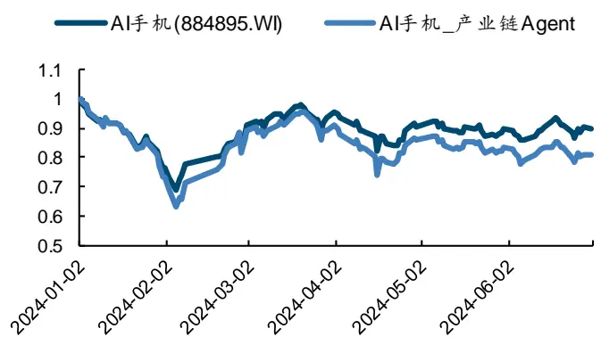
来源：ChatGPT，Wind，国金证券研究所

图表17：“人形机器人”概念净值对比
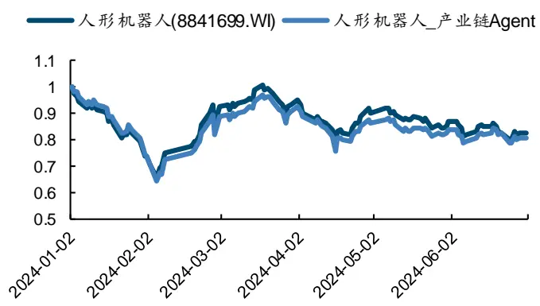
来源：ChatGPT，Wind，国金证券研究所

图表18：“合成生物学”概念净值对比
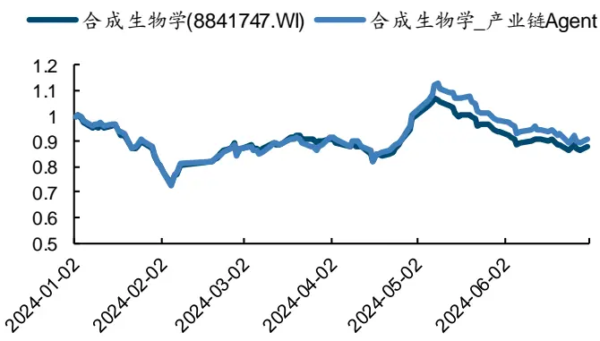
来源：ChatGPT，Wind，国金证券研究所

图表19：“低空经济”概念净值对比
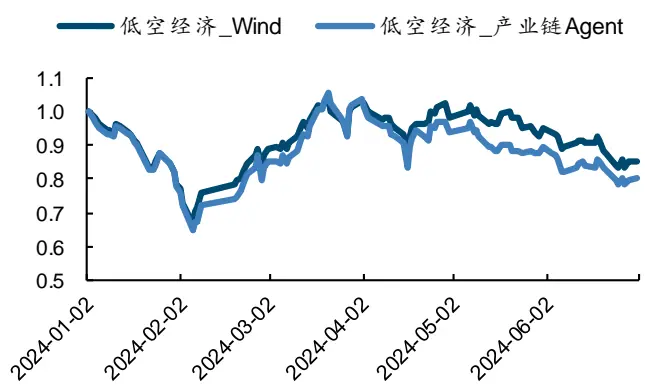
来源：ChatGPT，Wind，国金证券研究所

从 2024 年内的走势上来看，我们构造的概念股等权指数与 Wind 构造的概念股指数基本保持相同，即能够捕捉到概念带来的行情。

## 三、概念领涨股特征识别与领涨组合构造

本部分，我们从初步得到的概念股范围中找到可能率先上涨的领涨股。当前概念股梳理的思路是从新闻、研报和公司公告等文本中识别提及当前投资热点或产业链节点的段落，从该段落中寻找相关的个股。这种方式的优势在于能尽可能多地捕捉相关概念股，但也存在概念股范围过大，定位不够精准的问题。投资者在把握热点行情时也不可能持有全部相关概念股，因此有必要对股票池做进一步筛选，把握热点的短期强上涨趋势。

## 3.1 热点行情复盘

我们以 AI 手机、人形机器人、合成生物学与低空经济四个概念为例进行展示。通过对概念相关新闻与行情的复盘，我们设定四个概念的启动日期分别如下：

图表20：各概念启动时间点

| 概念名称 | 概念启动日期 | 启动信号 |
| --- | --- | --- |
| AI 手机 | 2024-03-01 | 三星发布AI手机，相关新闻热度变高 |
| 人形机器人 | 2023-10-20 | 工信部印发《人形机器人创新发展指导意见》：北特科技行情启动 |
| 合成生物学 | 2024-04-22 | “蔚蓝生物”首板开始 |
| 低空经济 | 2024-03-06 | 政府工作报告中提及“低空经济”概念 |

来源：Wind，国金证券研究所

我们以 Wind 全 A指数（881001.WI）为基准，以下为各个概念指数与基准自概念启动时间点之后的累计超额收益：

图表21：“AI手机”概念行情
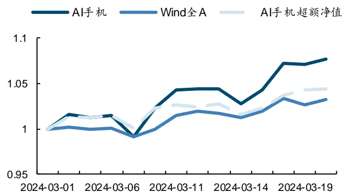
来源：Wind，国金证券研究所

图表22：“人形机器人”概念行情
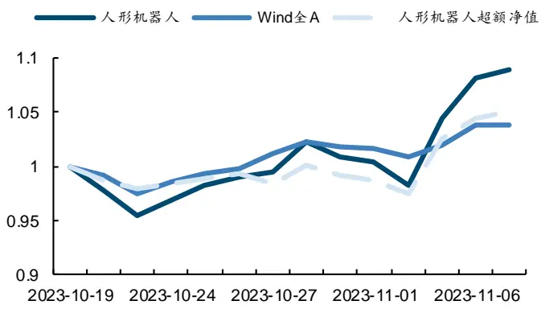
来源：Wind，国金证券研究所

图表23：“合成生物学”概念行情
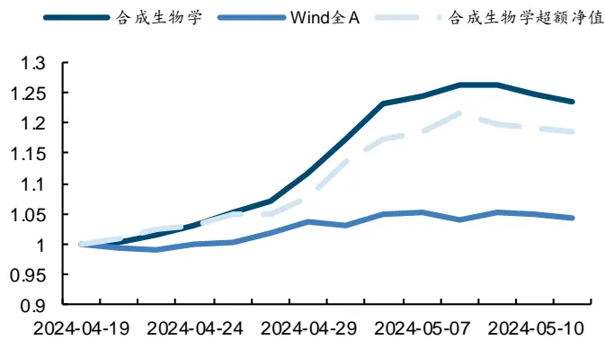
来源：Wind，国金证券研究所

图表24：“低空经济”概念行情
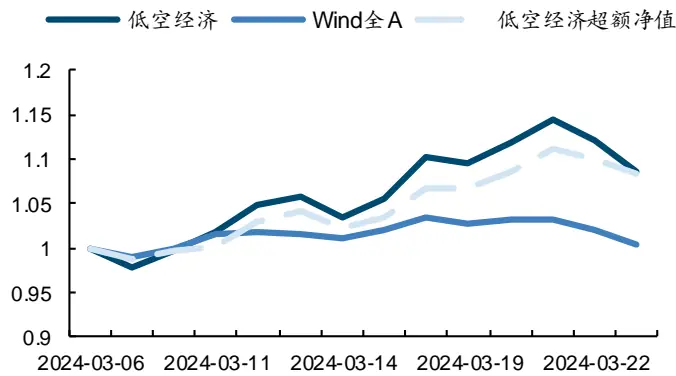
来源：Wind，国金证券研究所

从走势上来看，以上热点在我们梳理的行情启动时间点之后均有超额上涨行情。为了防止信息泄露，我们在梳理以下案例的概念股时仅使用了相应热点启动时间之前的文本信息。

## 3.2 领涨股具备什么特征？

热点概念行情启动时存在一定的扩散现象，部分概念股首先上涨，随后市场热度向其他个股传导带动整个概念的上涨。其中率先开始上涨的领涨股一般与概念相关度最高，也是上涨动力最强劲的股票。

我们通过量价指标去筛选概念领涨股。在热点题材刚引起市场关注的初期，投资者们对概念及其产业链的研究并不充分，或者新的增量信息还未被市场完全消化，此时行情更容易呈现情绪面驱动的特征，这对于使用量价特征做筛选较为有利。我们试图从中找出具有领涨特征的个股，构造概念领涨组合，更好捕捉热点的超额收益。经过检验，我们发现领涨股可能具有以下特征：

## 领涨股具有一定动量效应

我们在各概念成分股中，选取过去 20 日涨跌幅最高的前 10 只个股构成组合，观察该组合相对概念指数的累计超额收益表现。下图中横轴代表行情启动日期以来的天数。

图表25：“AI 手机”动量 Top10 组合累计收益
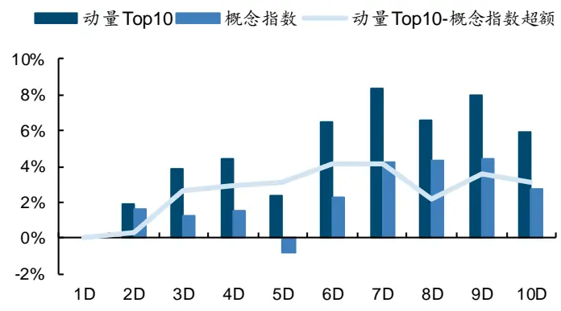
来源：Wind，国金证券研究所

图表26：“人形机器人”动量 Top10 组合累计收益
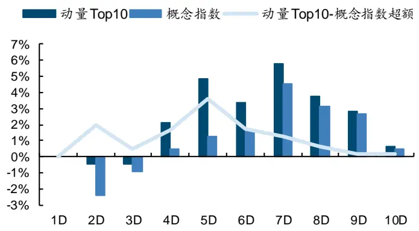
来源：Wind，国金证券研究所

图表27：“合成生物学”动量Top10 组合累计收益
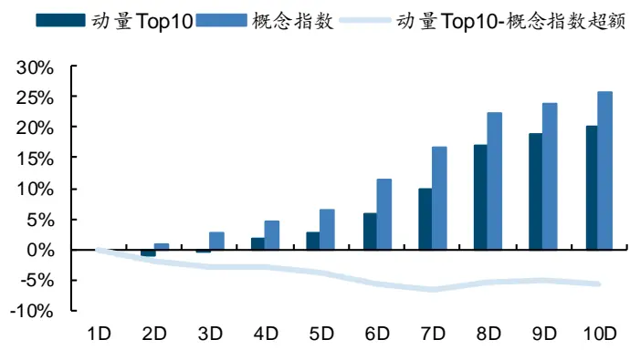
来源：Wind，国金证券研究所

图表28：“低空经济”动量Top10 组合累计收益
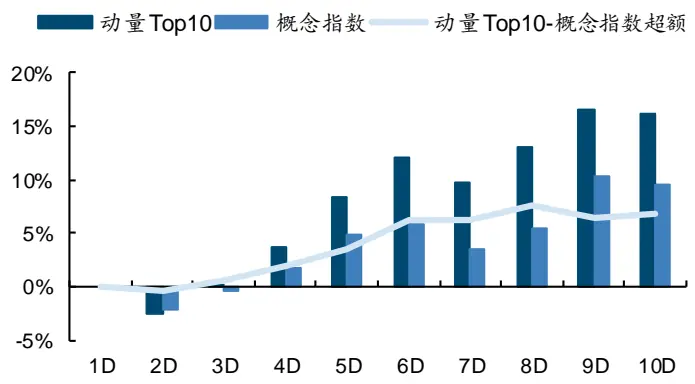
来源：Wind，国金证券研究所

从效果上来看，20日动量在AI手机、人形机器人与低空经济等板块上有较好的筛选效果，组合收益率能在五日内有较稳定的超额上涨；但在合成生物学概念上表现一般。

我们认为热点行情中可能存在一定的动量效应。实际上，除了完全突发性事件带来的热点以外，推动行情启动的政策或新闻更类似于一个“导火索”。绝大多数概念本身已有一定关注度，其中部分个股也可能在行情到来之前先走出独立行情，助推整个概念的上涨；或者市场对概念的看法从分歧逐步转为共识，而部分确定性较高的个股在博弈过程中提前上涨；此外也可能有非公开信息提前泄露，个股出现“抢跑”等原因。

## 流动性较低更容易成为领涨股

我们采用“非流动性”衡量个股的流动性特征。非流动的度量方法是：

$$
ILLIQ_{i}=\frac{1}{n}\sum_{d=1}^{n}\frac{\left|r_{i,d}\right|}{volume_{i,d}}
$$

其中 $r_{i,d}$ 代表个股i在d日的涨跌幅，volume 代表个股i在d日的成交额。非流动性值越高，表明成交量变化对个股的涨跌幅影响越明显。我们使用过去 20 日数据计算非流动性指标，并选取数值最高的前 10 只个股构成组合，观察该组合相对概念指数的累计超额收益表现。

图表29：“A1手机”非流动性 Top10组合累计收益
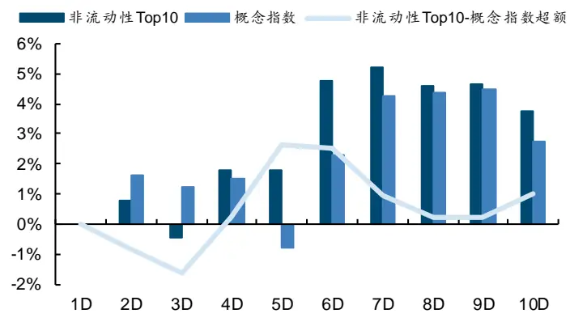
来源：Wind，国金证券研究所

图表30：“人形机器人”非流动性 Top10 组合累计收益
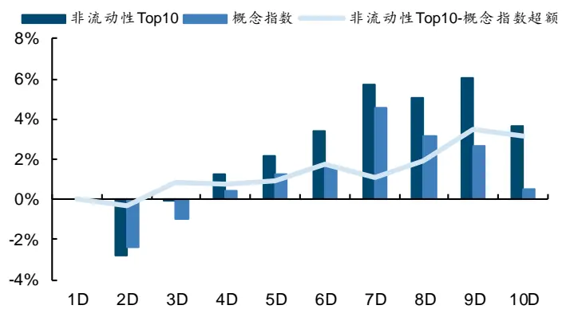
来源：Wind，国金证券研究所

图表31：“合成生物学”非流动性Top10组合累计收益
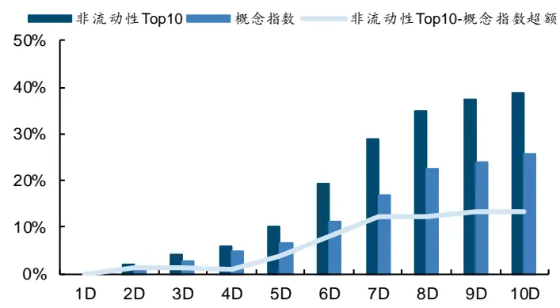
来源：Wind，国金证券研究所

图表32：“低空经济”非流动性 Top10 组合累计收益
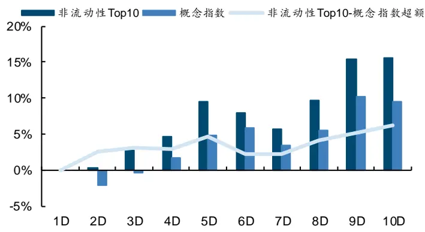
来源：Wind，国金证券研究所

从效果上来看，20 日非流动性指标在 AI 手机概念上效果一般，但在其他板块上都有较好的效果。理论上来说，当行情来临时流动性低的个股更容易受到资金推动出现上涨。

## 3.3 领涨股组合增强方案

我们将个股的 日涨跌幅与 日非流动性因子等权合成为领涨因子，并按照领涨因子对市值大于 亿的概念股进行排序。考虑到直接按低流动性筛选很容易选中小微盘股票，这类个股更容易出现单纯的“题材炒作”在经营业务层面可能并没有实际关系。因此出于安全性的考虑，我们在市值大于 亿的概念成分股内进行领涨股的筛选。由于缩小了筛选范围，我们仅选排名前 的个股构成组合，观察该组合的超额表现。

图表33：“A1手机”领涨因子 Top5组合累计收益
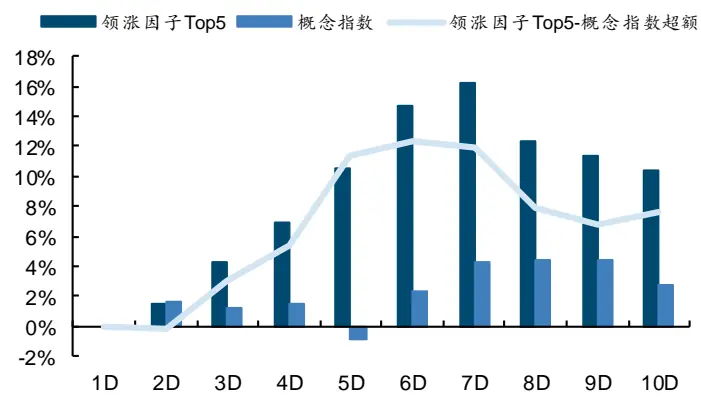
来源：Wind，国金证券研究所

图表34：“人形机器人”领涨因子Top5组合累计收益
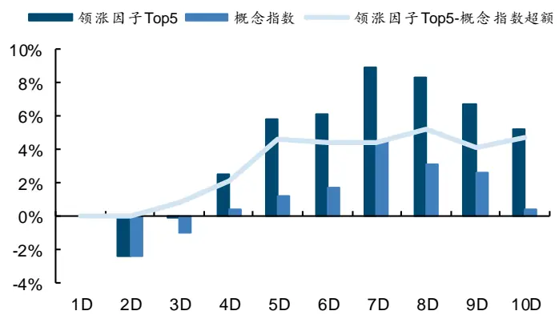
来源：Wind，国金证券研究所

图表35：“合成生物学”领涨因子Top5组合累计收益
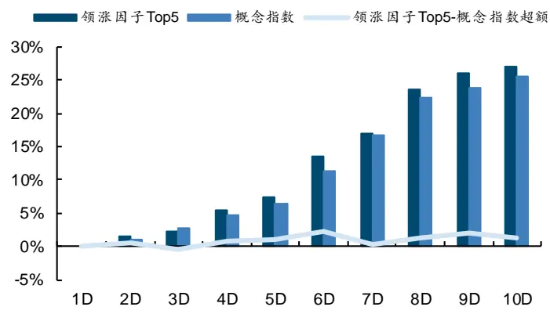
来源：Wind，国金证券研究所

图表36：“低空经济”领涨因子 Top5 组合累计收益
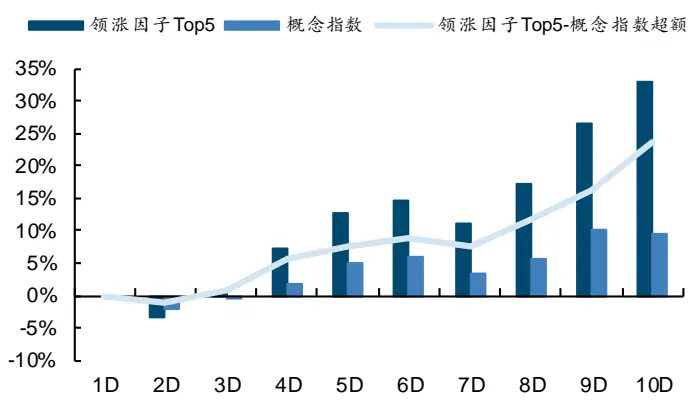
来源：Wind，国金证券研究所

添加市值筛选约束后，领涨因子依旧能在多个概念行情中有效，但在 AI 手机概念上的效果一般。

对此，我们引入“尖峰右偏”特征作为第二层精筛。“尖峰右偏”包含了峰度（Kurtosis）和偏度（Skewness）两个衡量维度：“尖峰”特征表明该个股历史上出现极端收益的概率更大，而“右偏”则说明该个股出现大幅上涨的概率更大。具体计算时，我们基于过去日的收益率来刻画个股的峰度与偏度，并将两个因子等权合成。“尖峰右偏”说明过去一年内出现较多次单日大幅上涨行情，这样的概念股也更可能被投资者首先关注到。值得注意的是，尖峰右偏特征只能说明个股历史上出现极端上涨的概率更大，但在当前行情中是否能带来超额收益还需要结合动量等指标才能说明。

我们最终领涨组合的方案为：

图表37：领涨组合构造方法

| 处理顺序 | 筛选指标构造 | 筛选方法 |
| --- | --- | --- |
| 1 | 市值 | 选择市值大于50亿的股票 |
| 2 | 领涨因子：20日涨跌幅+20日非流动性，等权合成 | 选择领涨因子排名前10的股票 |
| 3 | 尖峰右偏：240日峰度+240日偏度，等权合成 | 选择尖峰右偏因子排名前5的股票 |

来源：国金证券研究所

以下是各概念领涨组合的收益表现：

图表38：“A1手机”领涨组合累计收益展示
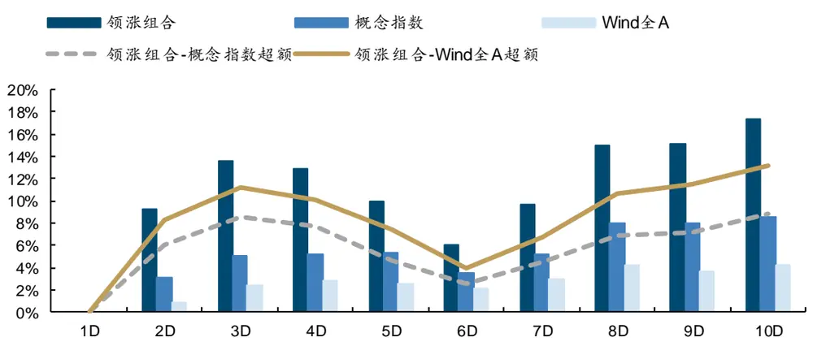
来源：Wind，国金证券研究所

图表39：“人形机器人”领涨组合累计收益展示
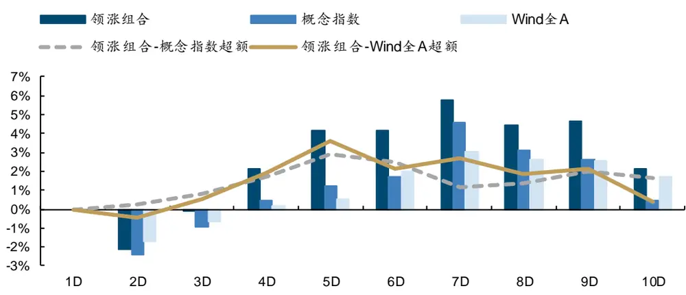
来源：Wind，国金证券研究所

图表40：“合成生物学”领涨组合累计收益展示
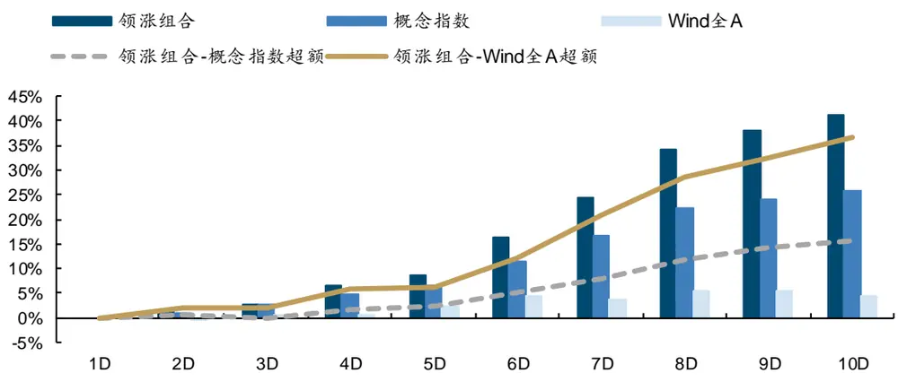
来源：Wind，国金证券研究所

图表41：“低空经济”领涨组合累计收益展示
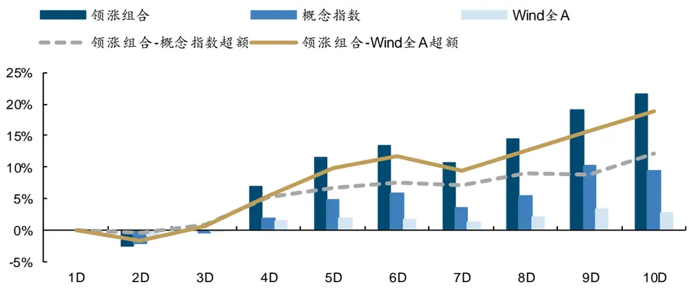
来源：Wind，国金证券研究所

以下是领涨组合的具体持仓股结果以及对应概念起始日之后多个区间的涨跌幅情况。

图表42：各概念领涨组合持仓与收益表现

| 概念名称与起始日 | 概念股代码 | 概念股简称 | 3 日涨跌幅 | 5日涨跌幅 | 10日涨跌幅 |
| --- | --- | --- | --- | --- | --- |
| AI 手机 2024-03-01 | 002185.SZ | 华天科技 | 1.22% | -0.49% | 0.49% |
|  | 300735.SZ | 光弘科技 | 13.38% | 30.86% | 25.47% |
|  | 603327.SH | 福蓉科技 | 21.03% | 46.51% | 47.03% |
|  | 002916.SZ | 深南电路 | 5.30% | 12.36% | 27.35% |
|  | 002217.SZ | 合力泰 | -2.86% | 17.71% | 30.86% |
| 人形机器人 2023-10-20 | 689009.SH | 九号公司-WD | -2.74% | -2.98% | 0.33% |
|  | 300455.SZ | 航天智装 | -0.33% | 10.09% | 13.07% |
|  | 688165.SH | 埃夫特-U | -2.53% | 1.41% | 5.35% |
|  | 688001.SH | 华兴源创 | -5.41% | -0.51% | 4.39% |
|  | 300222.SZ | 科大智能 | -7.32% | -5.52% | -2.90% |
| 合成生物学 2024-04-22 | 688065.SH | 凯赛生物 | 2.72% | 8.45% | 27.87% |
|  | 301301.SZ | 川宁生物 | 4.48% | 4.48% | 40.51% |
|  | 002773.SZ | 康弘药业 | 15.62% | 18.84% | 24.64% |
|  | 002626.SZ | 金达威 | 4.23% | 3.41% | 15.27% |
|  | 688105.SH | 诺唯赞 | 5.74% | 8.73% | 14.64% |
| 低空经济 2024-03-06 | 688248.SH | 南网科技 | -1.14% | 13.77% | 11.20% |
|  | 300045.SZ | 华力创通 | -1.75% | -1.05% | 7.26% |
|  | 002023.SZ | 海特高新 | -1.28% | 2.56% | 4.99% |
|  | 003009.SZ | 中天火箭 | -1.53% | 0.25% | 1.53% |
|  | 002085.SZ | 万丰奧威 | 12.85% | 24.16% | 53.21% |

来源：Wind，国金证券研究所

## 四、总结

本篇报告主要完成了两个任务：产业链与概念股梳理的效果提升，以及领涨股的识别。前者我们主要通过搭建了一套更完善的 RAG 流程来实现优化，包括搭建更完善的知识库、选择更合适的检索器等，并针对产业链梳理任务做了流程上的创新。后者则是在前者梳理概念股的基础上，我们通过量价指标分层筛选，帮助投资者找到热点中的领涨股，更准确地把握行情。此外，我们也详细介绍了 RAG 技术相关内容，帮助读者快速了解 RAG 的概念、优势以及实现方法。

当前，我们的热点投资系列框架已完成热点的产业链图谱生成、基于产业链节点的概念股梳理、以及从概念股中精选出领涨股这一系列功能，我们将在当前框架的基础上继续拓展，将其完善成一整套的热点投资工具包，帮助投资者更好地把握热点行情。当然，在已完成的功能中依旧有可以提升或完善的部分，譬如对个股与整个概念相关性的衡量、产业链景气度的构造等等；我们也可以将当前梳理产业链的方法延伸出去，实现对任意事件的解读模型 大模型已经打开了利用金融领域另类数据的想象空间。

我们不应当再局限于使用大模型进行简单的情感打分，而是要发挥它在文本处理、逻辑推理与生成方面的独特优势，去挖掘大模型在金融领域的应用潜力，通过“卷应用”来实现更多此前难以想象能量化完成的任务，这才能更好地实现 AI 技术的价值。

## 参考文献

[1] Cormack, G. V., Clarke, C. L., & Buettcher, S. (2009, July). Reciprocal Rank Fusion outperforms Condorcet and individual Rank Learning Methods. In Proceedings of the 32nd international ACM SIGIR conference on Research and development in information retrieval (pp. 758-759).》

[2] Zhao, P., Zhang, H., Yu, Q., Wang, Z., Geng, Y., Fu, F., ... & Cui, B. (2024). Retrieval-Augmented Generation for AI-Generated Content: A Survey. arXiv preprint arXiv:2402.19473.

## 风险提示

1、大语言模型输出结果具有一定随机性的风险；

2、模型迭代升级、新功能开发可能会导致结论不同的风险；

3、人工智能模型得出的结论仅供参考，可能出现错误答案的风险。

## 特别声明：

国金证券股份有限公司经中国证券监督管理委员会批准，已具备证券投资咨询业务资格。

形式的复制、转发、转载、引用、修改、仿制、刊发，或以任何侵犯本公司版权的其他方式使用。经过书面授权的引用、刊发，需注明出处为“国金证券股份有限公司”，且不得对本报告进行任何有悖原意的删节和修改。

本报告的产生基于国金证券及其研究人员认为可信的公开资料或实地调研资料，但国金证券及其研究人员对这些信息的准确性和完整性不作任何保证。本报告反映撰写研究人员的不同设想、见解及分析方法，故本报告所载观点可能与其他类似研究报告的观点及市场实际情况不一致，国金证券不对使用本报告所包含的材料产生的任何直接或间接损失或与此有关的其他任何损失承担任何责任。且本报告中的资料、意见、预测均反映报告初次公开发布时的判断，在不作事先通知的情况下，可能会随时调整，亦可因使用不同假设和标准、采用不同观点和分析方法而与国金证券其它业务部门、单位或附属机构在制作类似的其他材料时所给出的意见不同或者相反。

本报告仅为参考之用，在任何地区均不应被视为买卖任何证券、金融工具的要约或要约邀请。本报告提及的任何证券或金融工具均可能含有重大的风险，可能不易变卖以及不适合所有投资者。本报告所提及的证券或金融工具的价格、价值及收益可能会受汇率影响而波动。过往的业绩并不能代表未来的表现。

客户应当考虑到国金证券存在可能影响本报告客观性的利益冲突，而不应视本报告为作出投资决策的唯一因素。证券研究报告是用于服务具备专业知识的投资者和投资顾问的专业产品，使用时必须经专业人士进行解读。国金证券建议获取报告人员应考虑本报告的任何意见或建议是否符合其特定状况，以及（若有必要）咨询独立投资顾问。报告本身、报告中的信息或所表达意见也不构成投资、法律、会计或税务的最终操作建议，国金证券不就报告中的内容对最终操作建议做出任何担保，在任何时候均不构成对任何人的个人推荐。

在法律允许的情况下，国金证券的关联机构可能会持有报告中涉及的公司所发行的证券并进行交易，并可能为这些公司正在提供或争取提供多种金融服务。

本报告并非意图发送、发布给在当地法律或监管规则下不允许向其发送、发布该研究报告的人员。国金证券并不因收件人收到本报告而视其为国金证券的客户。本报告对于收件人而言属高度机密，只有符合条件的收件人才能使用。根据《证券期货投资者适当性管理办法》，本报告仅供国金证券股份有限公司客户中风险评级高于 级 含 级）的投资者使用；本报告所包含的观点及建议并未考虑个别客户的特殊状况、目标或需要，不应被视为对特定客户关于特定证券或金融工具的建议或策略。对于本报告中提及的任何证券或金融工具，本报告的收件人须保持自身的独立判断。使用国金证券研究报告进行投资，遭受任何损失，国金证券不承担相关法律责任。

若国金证券以外的任何机构或个人发送本报告，则由该机构或个人为此发送行为承担全部责任。本报告不构成国金证券向发送本报告机构或个人的收件人提供投资建议，国金证券不为此承担任何责任。

此报告仅限于中国境内使用。国金证券版权所有，保留一切权利。

上海

电话：021-80234211

北京

电话：010-85950438

深圳

电话：0755-86695353

邮箱：researchsh@gjzq.com.cn

邮箱：researchbj@gjzq.com.cn

邮箱：researchsz@gjzq.com.cn

邮编：201204

邮编：100005

邮编：518000

地址：上海浦东新区芳甸路 1088 号

地址：北京市东城区建内大街 26 号

地址：深圳市福田区金田路 2028 号皇岗商务中心

紫竹国际大厦 5 楼

新闻大厦 8 层南侧

18 楼 1806

【小程序】国金证券研究服务

【公众号】国金证券研究