证券研究报告

金融工程组

分析师：高智威(执业 S1130522110003)

分析师：胡正阳(执业 S1130525080008)

gaozhiw@gjzq.com.cn

huzhengyang1@gjzq.com.cn

## 多种类、多周期事件化的开放式择时框架

## 摘要

传统基于事件驱动构建的择时策略较容易出现过拟合问题，且普遍存在稳健性较弱的问题，底层信号一旦衰减将明显影响整个策略的表现。因此本次报告提出了一种全自动化的择时策略生成框架，底层基于事件驱动思路生成信号。该框架可以在任意指标集的基础上挖掘出其中有效的信号，并构建对任意标的资产的择时信号。

整个构建流程中尽量控制了数据挖掘的可能，采用滚动更新的机制避免过拟合情况发生；确保流程符合逻辑性、可解释性等要求，能输出流程中所有的中间信息；框架也具有较好的泛化性，无需调整即可对不同标的进行测试，也因此计算速度较快；除了直接构建策略外，该择时框架也可以帮助我们初步探索未知的数据集，寻找其中具有择时价值的指标与事件。

我们在各宽基指数与行业指数上进行了回测测试，指标集选择了指数自身量价、宏观、期权、融资融券与成分股的基本面、资金流数据。以中证 A500 指数为例，各数据集都能获得超过中证 A500 指数的收益表现，其中基于基本面、宏观数据得到的信号质量显著较好，区间内年化收益分别达到 8.21%和 8.02%，年化超额收益分别为 7.80%和 7.45%。而在信号胜率方面，资金流指标表现较突出，看多胜率达到 61.11%。最终合成择时策略年化收益率 10.61%，Sharpe 比率 0.813，各项指标相对基础信号都有一定提升。在其他宽基上，也均有较明显的超额收益表现。而在行业指数上，各行业的择时策略表现各有优劣，主要原因在于部分行业的涨跌更依赖于特定的数据指标，因此统一的数据集无法起到稳定有效的判断效果，需要添加有针对性的指标集并对无效的指标集进行整体剔除，才能提升最终择时效果。

## 风险提示

以上结果通过历史数据统计、建模和测算完成，历史规律未来可能存在失效的风险。各类事件因子可能会受到政策、市场环境发生变化的影响，出现阶段性失效的风险。市场可能出现超出模型预期的变化，导致策略出现超出模型估计的波动和回撤。

## 一、择时策略框架构建

## 1.1 传统择时策略的构建流程

当我们尝试使用量化的思路构建模型对资产进行择时，一般有两种方式：

1、线性回归拟合。将资产的未来收益率作为因变量，并寻找有解释力度的基础指标作为自变量，通过回归模型预测未来资产收益率或者涨跌方向。

2、构建事件驱动模型。统计特定的事件发生时未来资产的涨跌情况，从中筛选出胜率高的指标与相应事件，从而构建事件因子。这种方式能够更精准地捕捉特定情景下的有效信号，且能更方便地融入其他信号构建多指标择时体系。因此，目前大多数情况下我们都是使用事件化的方式来构建策略，辅助我们判断趋势。

在传统构建事件驱动型择时策略的流程中，我们通常会按照以下步骤实现。

图表1：事件驱动型择时策略的一般构建流程
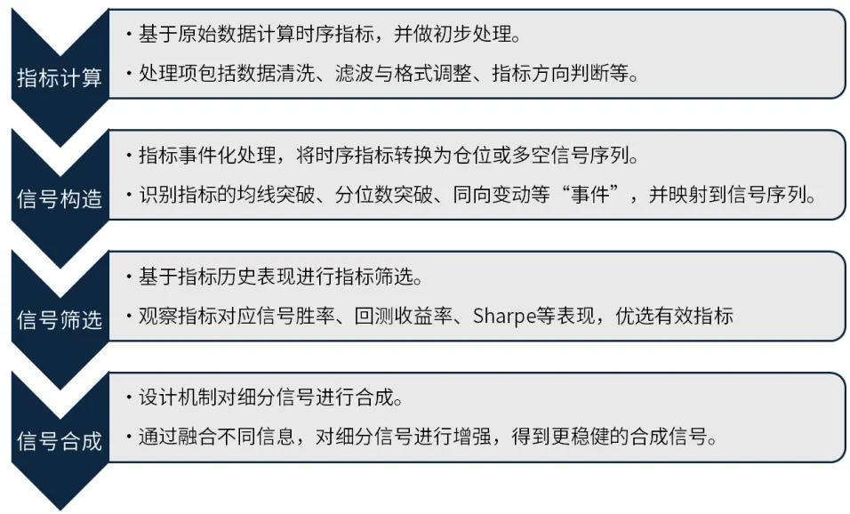
来源：国金证券研究所

通常我们会基于对数据的理解或图像走势的观察作为切入点，在历史区间上对大量信号进行回测，从中筛选出较有效的一组信号来合成最终信号。这种方法一般都能构造出在测试集上较有效的策略，但其实会存在以下问题：

1、容易过拟合。以上步骤中，原始数据的处理、信号的构造与合成等各个步骤都会涉及到参数寻优的工作，最终筛选出的信号普遍会面临过拟合的问题，在样本外信号快速失效。

2、稳健性较弱。通常策略是由优选出的少数几个指标组合而成，任意信号的择时能力变化都可能导致最终策略效果出现调整；也无法保证新的择时信号能对策略带来整体提升。

是否存在一种全自动化的择时框架，在确保生成信号的过程符合逻辑的前提下，尽可能降低过拟合的可能性，同时极大程度简化挖掘有效信号的复杂度，并直接给到最终的择时策略？

## 1.2 全自动择时框架结构介绍

我们的择时框架将在以下方面实现全自动优化：

1、自动筛选有效指标。给定一组指标数据集与我们的择时对象，择时框架可以自动筛选其中的有效指标，并寻找每个指标对应的最佳数据处理方式（同比、滤波等）；

2、自动构建事件化信号。针对单个指标，择时框架能够找到其最有效的事件化方式，充分挖掘单指标的择时信息，需要结合不同的事件化方法，生成每个指标的对应信号；

3、滚动更新有效指标。择时框架定期检验各细分信号有效性，及时调节各信号的权重或对失效指标进行剔除；

4、智能合成多信号打分结果。在任意指标集内或跨指标集之间，能够基于细分信号构建加权投票系统，得到最终择时结果。

实现以上效果后，我们的新框架将在以下方面具备一定优势：

1、指标的处理、信号的构建规则更贴合主观判断逻辑，摒除数据挖掘；

2、指标与信号筛选过程中严格使用历史数据，无未来函数问题，确保框架稳健性；

3、全自动的指标优选，可以对未知数据集进行探索；

4、择时框架对任意标的均适用，无需对模型进行特殊调整即可针对任何资产进行策略构建。

接下来，我们详细介绍整个择时框架的细节。

## 二、全流程择时框架结构

从具体细节上，整个框架可大致分为 3 个部分。以下是整个框架的全流程介绍：

## 2.1 择时框架第一层：数据选择

本次项目中，我们主要使用指数自身量价、宏观、期权、融资融券与成分股的基本面、资金流数据。详细指标见附录。

图表2：回测指标集情况

| 指标集 | 描述 | 指标总数 |
| --- | --- | --- |
| 量价 | 使用指数量价数据+基于talib构造的量价特征 | 39 |
| 宏观 | 使用经济增长、流动性等方面的宏观数据 | 37 |
| 期权 | 使用上证 50 期权 PCR、隐含波动率等 | 4 |
| 两融 | 全市场融资融券相关数据 | 2 |
| 基本面 | 使用成分股的基本面指标在指数层面聚合构造 | 20 |
| 资金流 | 使用成分股的Level2现金流数据在指数层面聚合构造 | 93 |

来源：国金证券研究所

框架会结合后续基于长历史数据的回测表现，选择对原始数据进行滤波等处理的方法。

图表3：择时框架第一层流程

来源：国金证券研究所

## 2.2 择时框架第二层：指标预处理+用法判断

第二层负责对指标进行初步判断与处理，并且此处理方式后续不再更改。为确保检验效果稳健以及无未来函数，我们推荐使用较长期的历史数据进行第二层判断。本项目中使用2020 年之前的全部数据进行第二层测试。

具体判断的项目包括：

## 1、方向判断

我们首先需要判断该指标与预测资产之间是否是同向关系或反之。直接在指标层面进行方向判断、而不是事件化之后判断每个信号的方向，主要原因在于我们认为指标层面的方向更具可解释性与稳定性，后者可能出现同一指标的不同事件化信号方向不同的情况，同时也可能面临数量不足、过度数据挖掘的问题。具体判断时：

a) 偏短期、高频数据使用差分线性回归来判断，将预测资产价格差分作为因变量，指标数据差分项作为自变量，构建单变量回归，若回归系数显著为负，则判断为反向指标。在回归时，回归系数不显著的指标会保留，在后续格式变动后进行再次检验。

b) 偏长期、低频数据使用 DTW 配对点方法，从前往后进行峰谷点的匹配，若指标的波谷与资产波峰之间距离相对更近，则判断为反向指标，反之指标波峰与资产波峰更接近，判断为正向指标。

## 2、数据格式变动

我们会对每个指标数据进行如下操作，并在测试集上观察指标与标的是否会有相关性的提升。格式变动与上述方向判断同步进行。

图表4：数据格式变动类型

| 数据格式 | 解释 |
| --- | --- |
| RAW | 原始数据 |
| YoY | 数据的同比变化 |
| QoQ | 数据的季度环比变化 |
| MoM | 数据的月度环比变化 |

来源：国金证券研究所
具体判断时会考察两项显著性：相关性显著大于 0 且相关性显著大于原指标。

## 3、滞后性剔除

判断资产价格在滞后多阶的情况下，与指标之间的双重差分相关性是否出现明显提升。若相关性出现提升，表明当前指标实际体现的是资产过去的价格变动，以此构造的信号很可能不具备预示作用，或存在明显的信号滞后问题，因此会被择时框架剔除；无明显滞后的指标则保留。

图表5：择时框架第二层流程
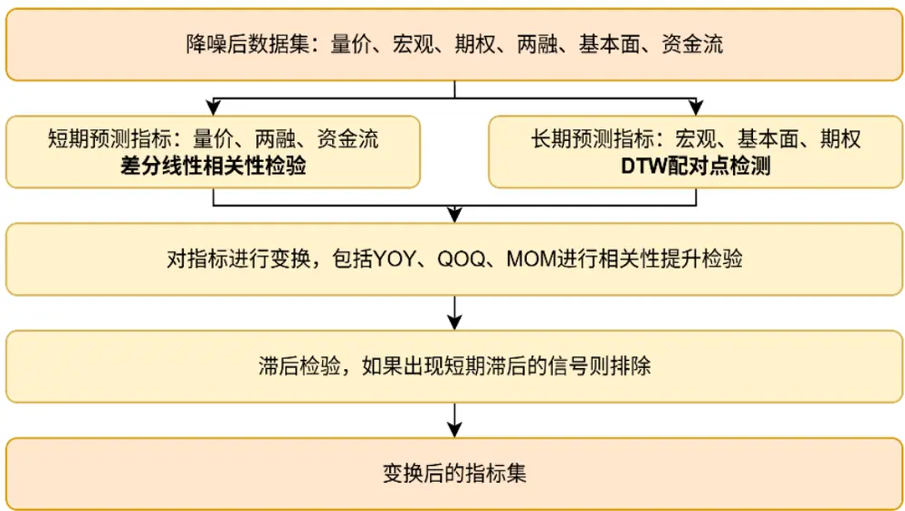
来源：国金证券研究所

通过第二层检验后，择时框架会固定每个指标的使用方式，且后续事件化步骤中不再变更。接下来的事件化步骤涉及滚动更新机制，会定期对指标的事件化方法与权重进行调整，但指标本身处理方式不会变动。进行这一约束是为了确保信号的连贯性，防止出现“上一期使用正向的 PMI-YOY 指标，当期改为观测反向的 PMI-RAW 指标”这类情况，提升指标的连贯性，且能进一步降低数据挖掘的可能。因此，我们需要使用尽可能长的历史数据进行第二层判断。

## 2.3 择时框架第三层：事件化处理

择时框架的第三层负责将指标转换为 0、1 构成的多空观点序列，并对信号进行聚合得到单指标以及整个策略的最终信号结果。择时框架不会考虑单一事件化结果作为该指标的信号，而是将不同事件化信号进行加权合成得到指标的最终信号。不同事件化处理能够捕捉指标的不同特征，可以捕捉原始指标在不同时间跨度上的各类特征，进而挖掘出最有效的指标使用方法。因此，第三层核心目的在于更新不同事件之间的权重。

第三层将以固定的频率运行，在期初确定各事件化的权重并保持到下次调整。本次项目中使用的是年度频率。

我们一共衡量多种事件类型，包括：

图表6：事件化列表与参数

| 事件类型 | 事件触发条件 | 测试参数 |
| --- | --- | --- |
| 突破均线 | $\mathsf{x}\ \mathrm{>\ \mathsf{SMA}\left(\mathsf{x},\mathsf{n}\right)}$ |  |
|  | $\mathbf{x}>{\mathsf{KAMA}}\left(\mathbf{x},\mathsf{\Delta}\mathsf{n}\right)$ | $\mathsf{\Omega}\mathsf{n}\in\mathsf{\Gamma}[5,\mathsf{\Omega}20,\mathsf{\Omega}40]$ |
| 短均线突破长均线 | $\mathbf{x}\ >\ {\mathsf{TRIMA}}\left(\mathbf{x},\mathsf{\Delta}\mathsf{n}\right)$ $\mathsf{SMA}\left(\mathsf{x},\mathsf{n}1\right)\ \mathrm{~>~}\mathsf{SMA}\left(\mathsf{x},\mathsf{n}2\right)$ |  |
|  | $\mathsf{KAMA}\left(\mathbf{x},\mathsf{n}1\right)\ \succ\ \mathsf{KAMA}\ \left(\mathbf{x},\mathsf{n}2\right)$ | $(\mathsf{n1},~\mathsf{n2})~\in~[(10,~20),~(10,~40),~(20,~40)]$ |
| 震荡突破 | ${\mathsf{TRIMA}}\left({\mathsf{x}},\mathsf{n}1\right)\ >{\mathsf{TRIMA}}\left({\mathsf{x}},\mathsf{n}2\right)$ |  |
|  | $\mathtt{CMO}\left(\mathbf{x},\mathsf{n}\right)\ >\ 0$ $\mathsf{DP0}\left(\mathsf{x},\mathsf{n},\mathsf{shift}\right)\ \succ\ 0$ | n = 12 n = 20, shift = 11 |
| 通道突破 | $\mathsf{ROC}\left(\mathsf{x},\mathsf{n}\right)\ >\ 0$ $\textsf{x}>\textsf{AVG}(\textsf{x},\mathsf{n})+\textsf{b}*\textsf{STD}(\textsf{x},\mathsf{n})$ | n = 10 n = 20, b=1.645 |
|  | $\textsf{x}>\mathsf{MAX}\left(\textsf{x},\textsf{n}\right)$ $\textsf{x}>0\mathsf{uantile}(\textsf{x},\textsf{n},\textsf{0}.5)$ | n = 20 |
| 分位数突破 | $\textsf{x}>0\mathsf{uantile}(\textsf{x},\mathsf{n},0.75)$ $\textsf{x}>0\mathsf{uantile}(\textsf{x},\textsf{n},\textsf{0}.9)$ | n = 30、240、480 |
| 同向变动 | 数据 x 与标的 y 持续 n 期变动方向相同 | n ∈ [3，5]，频率为周 |

来源：国金证券研究所

以上各事件化类型与参数搭配共计 34 种情况。我们会对每个指标构造以上 34 种信号，在滚动过去 10 年的长度上统计每个信号的回测表现，得到相应的回测净值 Sharpe 比率，并使用 Softmax 加权得到该指标的最终信号：

$$
w_{i}=\frac{e^{Sharpe_{i}}}{\sum_{i=1}^{n}e^{Sharpe_{i}}}
$$

其中，Sℎarpe 表示第i个信号回测所得净值的 Sharpe 比率。

使用 Softmax 可以显著放大有效信号的权重，但同时也不会完全抹去其他信号的贡献；同时，选择 Sharpe 而不是收益率等其他指标进行加权，也是考虑到其能综合信号的收益能力与抗波动能力。加权合成后，若数值大于 0.5，表明该指标下各事件信号整体看多，指标的当期信号为 1；否则信号为 0。

对各指标的信号再按照同样的方法合成，得到最终策略的信号。信号的多级合成可参考以下流程：

图表7：各层级信号合成流程
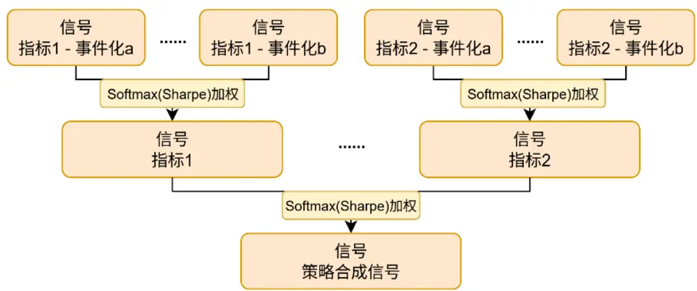
来源：国金证券研究所

最终，择时策略第三层可以按如下流程图表示：

图表8：择时框架第三层流程
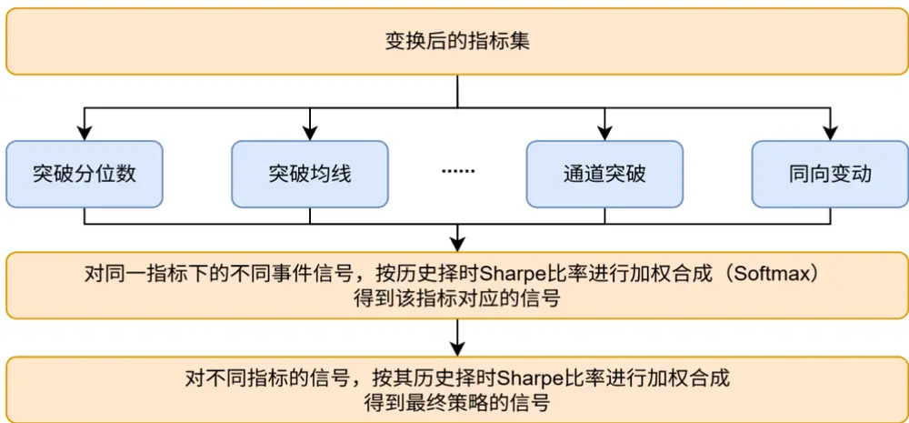
来源：国金证券研究所

至此，择时框架可以从原始指标集中得到最终的择时信号，实现全自动的信号生成功能。

## 三、择时框架测试

## 3.1 择时框架效果测试——以中证 A500指数为例

我们首先以中证 A500 为例，对各细分指标集进行回测检验。以上框架得到的信号依旧是介于 0、1 之间的数值，因此我们按照以下规则映射到最终的仓位结果：若最终信号大于0.5，认为指标集整体给出看多判断，全仓；否则为空仓。

回测区间为 2020 年1 月至 2025 年7 月，每年初进行事件权重以及指标权重的调整。手续费设置万分之五。

图表9：各指标集在 A500上的回测净值
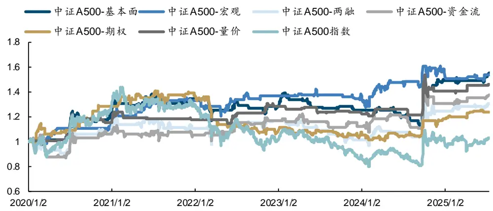
来源：Wind，国金证券研究所

各数据集的回测指标如下：

图表10：各指标集在A500上的回测表现

| 2020.1~2025.7 | 中证 A500 基本面 | 中证 A500 宏观 | 中证 A500 两融 | 中证 A500 | 中证 A500 期权 | 中证 A500 量价 | 中证 A500 |  |
| --- | --- | --- | --- | --- | --- | --- | --- | --- |
|  |  |  |  |  |  |  |  | 资金流 |
| 年化收益率 | 8.21% | 8.02% | 5.58% | 5.90% | 3.86% | 7.53% | 0.57% |  |
| 年化波动率 | 13.05% | 10.20% | 14.05% | 13.93% | 10.17% | 10.00% | 19.38% |  |
| Sharpe 比率 | 0.629 | 0.786 | 0.397 | 0.424 | 0.380 | 0.753 | 0.029 |  |
| 最大回撤率 | -18.57% | -11.09% | -19.41% | -17.48% | -28.33% | -11.30% | -44.30% |  |
| Calmar 比率 | 0.442 | 0.723 | 0.287 | 0.338 | 0.136 | 0.667 |  |  |
| Sortino 比率 | 1.307 | 1.766 | 0.897 | 0.944 | 0.871 | 1.810 |  |  |
| 年化超额收益率 | 7.80% | 7.45% | 4.60% | 5.45% | 2.85% | 6.84% |  |  |
| 信息比率 | 0.542 | 0.451 | 0.344 | 0.403 | 0.173 | 0.392 |  |  |
| 超额最大回撤率 | -23.08% | -29.83% | -26.81% | -27.19% | -26.55% | -25.84% |  |  |
| 买入信号次数 | 35 | 53 | 35 | 54 | 112 | 65 |  |  |
| 平均持有天数 | 20.00 | 10.755 | 23.486 | 12.519 | 6.241 | 4.092 |  |  |
| 看多胜率 | 51.43% | 54.72% | 45.71% | 61.11% | 51.79% | 56.92% |  |  |
| 看空胜率 | 61.76% | 59.62% | 47.06% | 52.83% | 54.95% | 45.31% |  |  |

来源：Wind，国金证券研究所

基本各数据集都能获得超过中证 A500 指数的收益表现，其中基于基本面、宏观数据得到的信号质量显著较好，区间内年化收益分别达到8.21%和8.02%，年化超额收益分别为7.80%和 7.45%。而在信号胜率方面，资金流指标表现较突出，看多胜率达到 61.11%。受限于回测区间的指数表现跌多涨少，因此信号整体的持有天数不长。

在回测前，我们并不清楚每类指标的具体择时效果，自动化择时框架相当于帮助我们进行了初步的探索。若我们对某指标集的具体情况感兴趣，择时框架也支持输出内部的详细信息。以其中的宏观指标集为例，我们可以看到其中每一层的指标筛选结果与各细分信号权重情况。

各细分信号权重相差不大，Softmax 加权可以略微修饰其中的差异，提升整体策略表现。

图表11：宏观指标集各指标的初步筛选与判断结果

| 指标名称 | 方向 |  |  | 领先性判断 数据转换 2025 年权重 |
| --- | --- | --- | --- | --- |
| Shibor:2 周 | -1 | LEAD | YOY | 6.22% |
| Shibor:1月 | -1 | LEAD | YOY | 6.32% |
| 指标名称 | 方向 | 领先性判断 |  | 数据转换 2025 年权重 |
| 平均回购期限：R007 | 1 | LEAD | YOY | 6.29% |
| 平均回购期限：R014 | -1 | LEAD | RAW | 6.27% |
| 平均回购期限：R3M | 1 | LEAD | YOY | 6.15% |
| 同业存单到期收益率曲线(AAA)：1月 | -1 | SYC | YOY | 6.34% |
| 同业存单到期收益率曲线(AAA)：3月 | -1 | SYC | YOY | 6.44% |
| 逆回购：7日：回购利率 | 1 | LEAD | YOY | 6.26% |
| 美国：国债拍卖：10年期TIPS债券：中位收益率 | 1 | LEAD | RAW | 6.17% |
| 银行间企业债收益率曲线(AA)：1年 | -1 | SYC | QOQ | 6.27% |
| 制造业 PMI：产成品库存 | 1 | LEAD | YOY | 6.13% |
| 规模以上工业增加值：当月同比 | 1 | LEAD | YOY | 6.18% |
| 中债国债即期收益率：即期：3月 | -1 | LEAD | YOY | 6.34% |
| M2(货币和准货币)：同比 | -1 | LEAD | YOY | 6.10% |
| 社会融资规模增量：当月值 | -1 | LEAD | YOY | 6.28% |
| 社会融资规模存量：期末同比 | -1 | LEAD | YOY | 6.22% |

来源：Wind，国金证券研究所

将各领域的细分信号进行合成，得到最终的合成策略。合成策略年化收益率 10.61%，Sharpe 比率 0.813，各项指标相对基础信号都有一定提升，且分年度来看也有一定的超额收益。

图表12：中证 A500合成择时策略净值
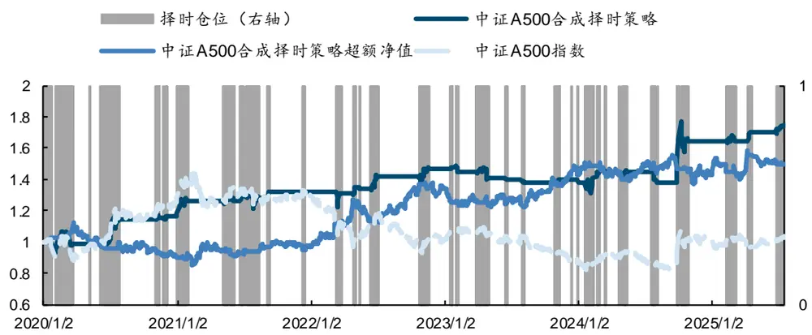
来源：Wind，国金证券研究所。数据截至 2025.7.15。

图表13：中证A500合成择时策略回测表现

| 2020.1~2025.7 | 中证 A500 合成择时策略 | 中证 A500 |
| --- | --- | --- |
| 年化收益率 | 10.61% | 0.57% |
| 年化波动率 | 13.05% | 19.38% |
| Sharpe 比率 | 0.813 | 0.029 |
| 最大回撤率 | -11.82% | -44.30% |
| Calmar 比率 | 0.898 |  |
| Sortino 比率 | 1.626 |  |
| 年化超额收益率 | 10.24% |  |
| 信息比率 | 0.665 |  |
| 超额最大回撤率 | -22.27% |  |
| 买入信号次数 | 53 |  |
| 平均持有天数 | 9.811 |  |
| 看多胜率 | 54.72% |  |
| 看空胜率 | 50.00% |  |

来源：Wind，国金证券研究所。数据截至 2025.7.15。

图表14：中证A500合成择时策略分年度收益

| 中证 A500 合成择时策略 | 中证 A500 指数 | 中证 A500 合成择时策略超额净值 |
| --- | --- | --- |
| 2020 | 18.48% 29.29% | -10.81% |
| 2021 | 9.56% | -1.03% 10.59% |
| 2022 | 11.06% -22.19% | 33.25% |
| 2023 | -4.74% | -12.14% 7.40% |
| 2024 | 19.01% 14.36% | 4.65% |
| 2025 | 6.54% 5.46% | 1.08% |

来源：Wind，国金证券研究所。数据截至 2025.7.15。

## 3.2 各宽基指数上测试效果

我们进一步在各宽基指数上进行择时框架的测试，使用的数据集与中证 A500 保持一致，观察其在各资产上的择时效果。

在沪深 300 指数上，最终的合成择时策略年化收益 7.67%，年化超额 8.09%。

图表15：沪深300合成择时策略净值
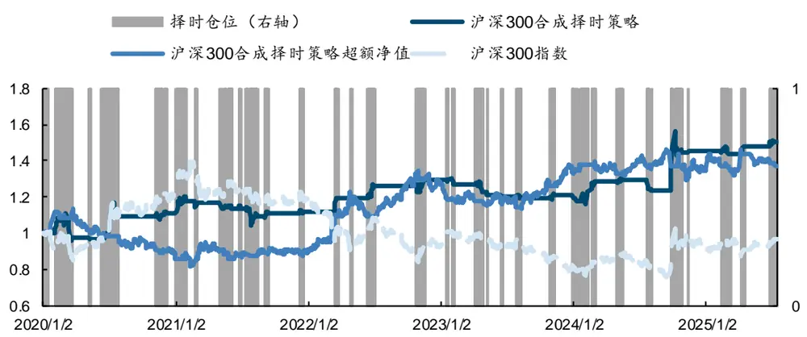
来源：Wind，国金证券研究所。数据截至 2025.7.15。

图表16：沪深300合成择时策略回测表现

| 2020.1~2025.7 | 沪深 300 合成择时策略 | 沪深 300 |
| --- | --- | --- |
| 年化收益率 | 7.67% | -0.59% |
| 年化波动率 | 11.72% | 18.84% |
| Sharpe 比率 | 0.655 | -0.031 |
| 最大回撤率 | -13.65% | 49.96% |
| Calmar 比率 | 0.562 |  |
| Sortino 比率 | 1.435 |  |
| 年化超额收益率 | 8.09% |  |
| 信息比率 | 0.535 |  |
| 超额最大回撤率 | -27.95% |  |
| 买入信号次数 | 52 |  |
| 平均持有天数 | 9.94 |  |
| 看多胜率 | 51.92% |  |
| 看空胜率 | 47.06% |  |

来源：Wind，国金证券研究所。数据截至 2025.7.15。

图表17：沪深300合成择时策略分年度收益

| 沪深 300 合成择时策略 | 沪深 300 指数 | 沪深 300 合成择时策略超额净值 |
| --- | --- | --- |
| 2020 | 11.04% 25.51% | -14.46% |
| 2021 | -0.40% -6.21% | 5.82% |
| 2022 15.63% | -21.27% | 36.91% |
| 2023 | -6.09% -11.75% | 5.66% |
| 2024 21.16% | 16.20% | 4.96% |
| 2025 3.73% | 5.20% | -1.47% |

来源：Wind，国金证券研究所。数据截至 2025.7.15。

在中证 500 指数上，合成择时策略年化收益 7.59%，年化超额 5.96%，但分年度来看，策略对部分上涨区间的把握较弱，相对效果一般。

图表18：中证500合成择时策略净值
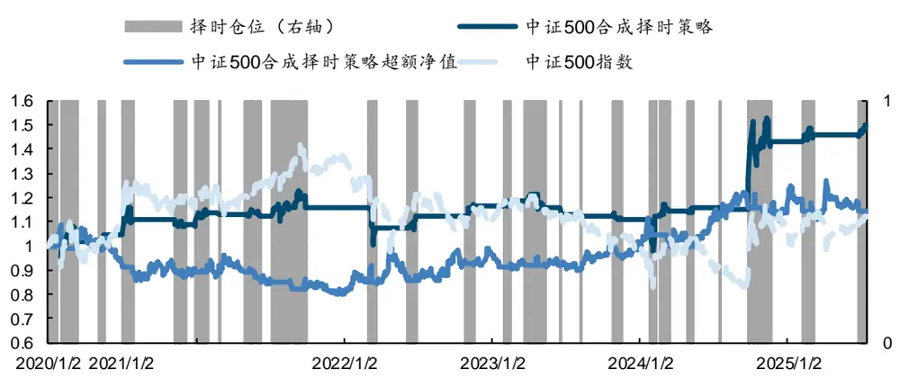
来源：Wind，国金证券研究所

图表19：中证500合成择时策略回测表现

| 2020.1~2025.7 | 中证 500 合成择时策略 | 中证 500 |
| --- | --- | --- |
| 年化收益率 | 7.59% | 2.09% |
| 年化波动率 | 14.81% | 21.30% |
| Sharpe 比率 | 0.512 | 0.098 |
| 最大回撤率 | -20.95% | 51.46% |
| Calmar 比率 | 0.362 |  |
| Sortino 比率 | 1.134 |  |
| 年化超额收益率 | 5.96% |  |
| 信息比率 | 0.368 |  |
| 超额最大回撤率 | -25.15% |  |
| 买入信号次数 | 32 |  |
| 平均持有天数 | 17.28 |  |
| 看多胜率 | 59.38% |  |
| 看空胜率 | 51.61% |  |

来源：Wind，国金证券研究所。数据截至 2025.7.15。

图表20：中证500合成择时策略分年度收益

| 中证 500 合成择时策略 |  | 中证 500 指数 | 中证 500 合成择时策略超额净值 |
| --- | --- | --- | --- |
| 2020 | 10.14% | 18.65% | -8.52% |
| 2021 | 3.26% | 13.52% | -10.26% |
| 2022 | 0.89% | -20.26% | 21.15% |
| 2023 | -5.22% | -8.84% | 3.62% |
| 2024 | 29.50% | 5.85% | 23.65% |
| 2025 | 4.56% | 8.53% | -3.97% |

来源：Wind，国金证券研究所。数据截至 2025.7.15。

在中证 800 指数上，合成择时策略年化收益率 9.28%，年化超额收益率 9.26%。回测区间上大部分时间均为看空信号。

图表21：中证800合成择时策略净值
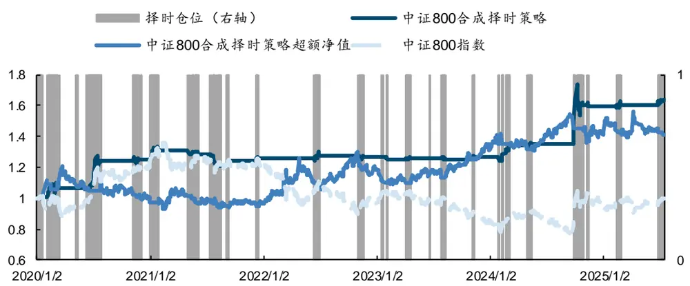
来源：Wind，国金证券研究所。数据截至 2025.7.15。

图表22：中证800合成择时策略回测表现

| 2020.1~2025.7 | 中证 800 合成择时策略 | 中证 800 |
| --- | --- | --- |
| 年化收益率 | 9.28% | 2.09% |
| 年化波动率 | 9.80% | 21.30% |
| Sharpe 比率 | 0.947 | 0.098 |
| 最大回撤率 | -11.24% | 51.46% |
| Calmar 比率 | 0.826 |  |
| Sortino 比率 | 2.005 |  |
| 年化超额收益率 | 9.26% |  |
| 信息比率 | 0.569 |  |
| 超额最大回撤率 | -23.31% |  |
| 买入信号次数 | 45 |  |
| 平均持有天数 | 8.00 |  |
| 看多胜率 | 51.11% |  |
| 看空胜率 | 43.18% |  |

来源：Wind，国金证券研究所。数据截至 2025.7.15。

图表23：中证800合成择时策略分年度收益

|  | 中证 800 合成择时策略 | 中证 800 指数 | 中证 800 合成择时策略超额净值 |
| --- | --- | --- | --- |
| 2020 | 24.74% | 23.95% | 0.78% |
| 2021 | -0.53% | -1.98% | 1.45% |
| 2022 | 0.92% | -21.03% | 21.95% |
| 2023 | -0.15% | -11.00% | 10.85% |
| 2024 | 26.35% | 13.40% | 12.95% |
| 2025 | 2.22% | 6.05% | -3.83% |

来源：Wind，国金证券研究所。数据截至 2025.7.15。

在中证 1000 指数上，合成择时策略年化收益 15.89%，年化超额 14.61%，看多胜率达到63.16%，择时策略的各项指标在各宽基指数中综合最好。

图表24：中证1000合成择时策略净值
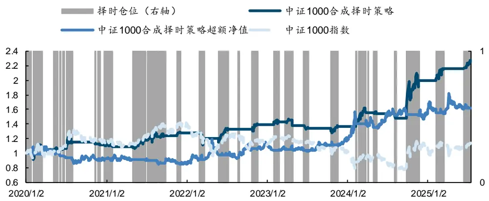
来源：Wind，国金证券研究所。数据截至 2025.7.15。

图表25：中证1000合成择时策略回测表现

| 2020.1~2025.7 | 中证 1000 合成择时策略 | 中证1000 |
| --- | --- | --- |
| 年化收益率 | 15.89% | 2.09% |
| 年化波动率 | 16.48% | 21.30% |
| Sharpe 比率 | 0.964 | 0.098 |
| 最大回撤率 | -14.15% | 51.46% |
| Calmar 比率 | 1.123 |  |
| Sortino 比率 | 1.972 |  |
| 年化超额收益率 | 14.61% |  |
| 信息比率 | 0.778 |  |
| 超额最大回撤率 | -21.86% |  |
| 买入信号次数 | 38 |  |
| 平均持有天数 | 18.11 |  |
| 看多胜率 | 63.16% |  |
| 看空胜率 | 48.65% |  |

来源：Wind，国金证券研究所。数据截至 2025.7.15。

图表26：中证1000合成择时策略分年度收益

| 中证 1000 合成择时策略 |  | 中证 1000 指数 | 中证1000 合成择时策略超额净值 |
| --- | --- | --- | --- |
| 2020 | 12.77% | 17.09% | -4.32% |
| 2021 | 10.41% | 17.82% | -7.41% |
| 2022 | 9.45% | -21.31% | 30.76% |
| 2023 | -1.60% | -8.35% | 6.75% |
| 2024 | 45.37% | 1.76% | 43.61% |
| 2025 | 13.49% | 11.14% | 2.35% |

来源：Wind，国金证券研究所。数据截至 2025.7.15。

最后，在创业板指上，合成择时策略的年化收益达到 16.22%，年化超额收益 14.13%。

图表27：创业板指合成择时策略净值
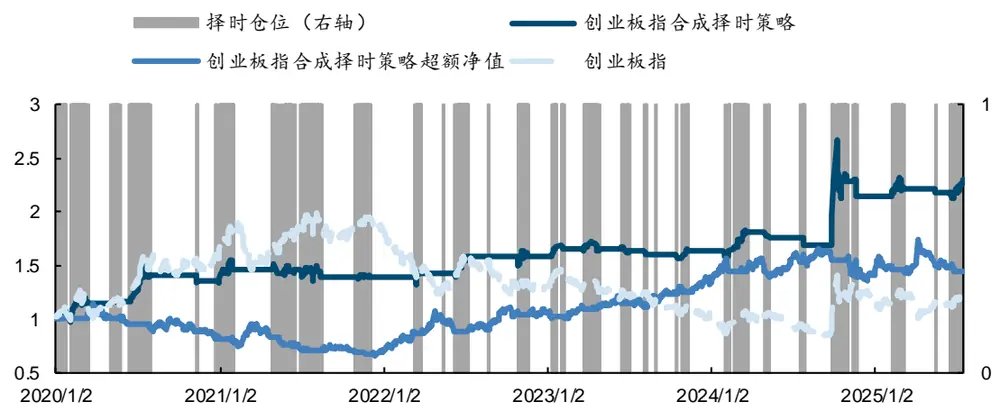
来源：Wind，国金证券研究所。数据截至 2025.7.15。

图表28：创业板指合成择时策略回测表现

| 2020.1~2025.7 | 创业板指合成择时策略 | 创业板指 |
| --- | --- | --- |
| 年化收益率 | 16.22% | 3.65% |
| 年化波动率 | 20.57% | 29.04% |
| Sharpe 比率 | 0.788 | 0.126 |
| 最大回撤率 | -20.66% | -57.05% |
| Calmar 比率 | 0.785 |  |
| Sortino 比率 | 1.843 |  |
| 年化超额收益率 | 14.13% |  |
| 信息比率 | 0.637 |  |
| 超额最大回撤率 | -41.36% |  |
| 买入信号次数 | 42 |  |
| 平均持有天数 | 14.17 |  |
| 看多胜率 | 50.00% |  |
| 看空胜率 | 48.78% |  |

来源：Wind，国金证券研究所。数据截至 2025.7.15。

图表29：创业板指合成择时策略分年度收益

|  | 创业板指合成择时策略 | 创业板指 | 创业板指合成择时策略超额净值 |
| --- | --- | --- | --- |
| 2020 | 36.81% | 61.85% | -25.04% |
| 2021 | -1.76% | 7.95% | -9.70% |
| 2022 | 13.94% | -27.80% | 41.74% |
| 2023 | 2.57% | -19.74% | 22.30% |
| 2024 | 32.07% | 15.39% | 16.68% |
| 2025 | 6.78% | 8.47% | -1.70% |

来源：Wind，国金证券研究所。数据截至 2025.7.15。

## 3.3 行业指数上的回测效果

我们同样在中信一级行业指数上进行择时框架的测试，使用统一的原始数据。

图表30：择时框架在行业指数上的测试结果

|  |  |  |  |  | 年化收益率 Sharpe Calmar Sortino 年化超额收益率 买入信号次数 平均持有天数 看多胜率 看空胜率 |  |  |  |  |
| --- | --- | --- | --- | --- | --- | --- | --- | --- | --- |
| 计算机 | 17.73% | 0.801 | 0.699 | 1.802 | 16.10% | 43 | 15.02 | 34.88% | 47.62% |
| 国防军工 | 17.78% | 0.824 | 0.728 | 2.045 | 12.24% | 43 | 16.40 | 58.14% | 45.24% |
| 电子 | 14.60% | 0.686 | 0.699 | 1.508 | 11.63% | 35 | 19.17 | 68.57% | 41.18% |
| 机械 | 14.80% | 0.968 | 1.203 | 2.063 | 10.79% | 37 | 16.05 | 62.16% | 44.44% |
| 通信 | 12.92% | 0.637 | 0.545 | 1.495 | 9.17% | 35 | 19.69 | 51.43% | 47.06% |
| 综合 | 5.68% | 0.378 | 0.264 | 0.840 | 8.30% | 46 | 10.93 | 36.96% | 44.44% |
| 房地产 | 0.18% | 0.010 | 0.006 | 0.202 | 7.37% | 48 | 10.21 | 31.25% | 51.06% |
| 消费者服务 | 3.34% | 0.177 | 0.099 | 0.536 | 6.76% | 52 | 9.58 | 36.54% | 43.14% |
| 建材 | 4.44% | 0.302 | 0.179 | 0.749 | 6.67% | 43 | 10.33 | 39.53% | 35.71% |
| 传媒 | 7.31% | 0.344 | 0.270 | 0.903 | 6.28% | 44 | 16.07 | 40.91% | 39.53% |
| 轻工制造 | 5.52% | 0.465 | 0.419 | 0.994 | 5.51% | 49 | 8.63 | 57.14% | 37.50% |
| 钢铁 | 7.37% | 0.502 | 0.417 | 1.172 | 3.90% | 54 | 6.61 | 51.85% | 33.96% |
| 基础化工 | 7.89% | 0.466 | 0.298 | 0.977 | 3.35% | 39 | 16.21 | 56.41% | 42.11% |
| 非银行金融 | 2.64% | 0.184 | 0.127 | 0.606 | 2.81% | 43 | 6.86 | 32.56% | 35.71% |
| 商贸零售 | 1.00% | 0.084 | 0.038 | 0.253 | 1.93% | 50 | 6.72 | 38.00% | 38.78% |
| 医药 | 1.86% | 0.112 | 0.061 | 0.378 | 1.05% | 46 | 13.11 | 32.61% | 42.22% |
| 农林牧渔 | -3.18% | -0.193 | -0.100 | -0.276 | 0.13% | 56 | 9.79 | 28.57% | 36.36% |
| 建筑 | 1.60% | 0.105 | 0.047 | 0.382 | 0.10% | 38 | 15.21 | 52.63% | 35.14% |
| 电力设备及新能源 | 9.70% | 0.466 | 0.317 | 1.143 | -1.62% | 55 | 12.00 | 41.82% | 29.63% |
| 汽车 | 11.65% | 0.680 | 0.801 | 1.421 | -2.05% | 50 | 11.46 | 52.00% | 30.61% |
| 家电 | 2.00% | 0.155 | 0.099 | 0.415 | -2.69% | 60 | 8.15 | 51.67% | 38.98% |
| 电力及公用事业 | 2.02% | 0.291 | 0.144 | 0.676 | -4.14% | 35 | 4.03 | 48.57% | 44.12% |
| 交通运输 | -1.89% | -0.251 | -0.111 | -0.392 | -4.68% | 36 | 5.64 | 30.56% | 31.43% |
| 石油石化 | 0.02% | 0.010 | 0.005 | 0.045 | -5.76% | 5 | 3.20 | 40.00% | 0.00% |
| 纺织服装 | -6.07% | -0.427 | -0.134 | -0.645 | -5.87% | 40 | 13.20 | 35.00% | 41.03% |
| 食品饮料 | -1.90% | -0.129 | -0.064 | -0.128 | -6.62% | 58 | 8.29 | 37.93% | 33.33% |
| 有色金属 | 6.88% | 0.355 | 0.255 | 0.866 | -11.90% | 39 | 15.51 | 46.15% | 42.11% |
| 银行 | 0.91% | 0.084 | 0.047 | 0.303 | -12.30% | 58 | 8.67 | 44.83% | 33.33% |
| 煤炭 | 6.48% | 0.495 | 0.364 | 1.132 | -15.10% | 54 | 4.04 | 51.85% | 32.08% |

来源：Wind，国金证券研究所。数据截至 2025.7.15。

从结果上可以看出，我们统一使用的指标集在部分行业上能有较好的择时效果，但在其他行业上并无法带来稳定的超额收益。这与各行业的特性有一定关系，部分行业涨跌更依赖于特定的指标，或走势相对稳定，因此统一的数据集无法起到稳定有效的判断效果，需要添加有针对性的指标集并对无效的指标集进行整体剔除，才能提升最终择时效果。

## 总结

本次报告提出了一种全自动化的择时策略生成框架，底层基于事件驱动思路生成信号。该框架可以在任意指标集的基础上挖掘出其中有效的信号，并构建对任意标的资产的择时信号。整个构建流程中尽量控制了数据挖掘的可能，采用滚动更新的机制避免过拟合情况发生；确保流程符合逻辑性、可解释性等要求，能输出流程中所有的中间信息；框架也具有较好的泛化性，无需调整即可对不同标的进行测试，也因此计算速度较快；除了直接构建策略外，该择时框架也可以帮助我们初步探索未知的数据集，寻找其中具有择时价值的指标与事件。

我们在各宽基指数与行业指数上进行了回测测试，指标集选择了指数自身量价、宏观、期权、融资融券与成分股的基本面、资金流数据。以中证 A500 指数为例，各数据集都能获得超过中证 A500 指数的收益表现，其中基于基本面、宏观数据得到的信号质量显著较好，区间内年化收益分别达到 8.21%和 8.02%，年化超额收益分别为 7.80%和 7.45%。而在信号胜率方面，资金流指标表现较突出，看多胜率达到 61.11%。最终合成择时策略年化收益率 10.61%，Sharpe 比率 0.813，各项指标相对基础信号都有一定提升。在其他宽基上，也均有较明显的超额收益表现。而在行业指数上，各行业的择时策略表现各有优劣，主要原因在于部分行业的涨跌更依赖于特定的数据指标，因此统一的数据集无法起到稳定有效的判断效果，需要添加有针对性的指标集并对无效的指标集进行整体剔除，才能提升最终择时效果。

## 风险提示

1、以上结果通过历史数据统计、建模和测算完成，历史规律未来可能存在失效的风险。

2、各类事件因子可能会受到政策、市场环境发生变化的影响，出现阶段性失效的风险。

3、市场可能出现超出模型预期的变化，导致策略出现超出模型估计的波动和回撤。

## 附录

以中证 A500 指数为例，全部原始指标判断结果如下：

图表31：全部细分指标在A500指数上的判断结果

| 指标集 | 指标名称 | 方向判断滞后性判断数据格式变动 |  |  |
| --- | --- | --- | --- | --- |
| 基本面 | Capex2Sales | 1 | LEAD | RAW |
|  | NetIncome_Chg1Y | 1 | LAG | RAW |
|  | NetIncome_Chg3Y | 1 | LAG | YOY |
|  | NetIncome_Chg5Y | 1 | LAG | RAW |
|  | NetIncome_ChgFY0 | 1 | LAG | RAW |
|  | NetIncome_ChgFY1 | 1 | LAG | RAW |
|  | NetIncome_SQ_Chg1Y | 1 | LAG | RAW |
|  | NetIncome_SQ_Chg1Y_Chg | 1 | LAG | RAW |
|  | OCF_Chg1Y | 1 | LAG | RAW |
|  | OCF_Chg3Y | 1 | LAG | RAW |
| OCF_Chg5Y OCF_SQ_Chg1Y | 1 | LEAD |  | RAW |
| OCF_SQ_Chg1Y_Chg |  | 1 | LAG | RAW |
|  |  | 1 | LAG | RAW |
| OperatingIncome_SQ_Chg1Y |  | 1 | LAG | RAW |
| OperatingIncome_SQ_Chg1Y_Chg |  |  | LEAD | YOY |
|  | Revenues_Chg1Y | 1 | SYC | YOY |
|  | Revenues_Chg3Y | 1 | LEAD | YOY |
| Revenues_Chg5Y |  | 1 | LEAD | RAW |
| Revenues_SQ_Chg1Y |  | 1 | LAG | YOY |
| Revenues_SQ_Chg1Y_Chg |  | 1 | LEAD | YOY |
| 宏观 Shibor:2 周 | Shibor：隔夜 | 1 | LAG LEAD | YOY |
|  | Shibor:1月 | -1 | LEAD | YOY |
|  | 平均回购期限：R007 | 1 | LEAD | YOY |
|  | 平均回购期限：R014 | -1 | LEAD | RAW |
|  | 平均回购期限：R1M | 1 | LAG | YOY |
|  | 平均回购期限：R3M | 1 | LEAD | YOY |
|  | 同业存单到期收益率曲线(AAA)：1月 | -1 | SYC | YOY |
|  | 同业存单到期收益率曲线(AAA)：3月 | -1 | SYC | YOY |
|  | 逆回购：7日：回购利率 | 1 | LEAD | YOY |
|  | 中债国债即期收益率：10年 | -1 | LAG | QOQ |
|  | 美国：国债收益率：10年 | 1 | LAG | YOY |
|  | 美国：国债拍卖：10年期TIPS债券：中位收益率 | 1 | LEAD | RAW |
|  | 中债国开债到期收益率：10年 | -1 | LAG | QOQ |
| 银行间企业债收益率曲线(AA)：1年 |  | -1 | SYC | QOQ |
| 中债企业债到期收益率(AA)：10年 |  | -1 | LAG | QOQ |
| 中间价：美元兑人民币 |  | 1 | LAG | RAW |
| CPI：当月同比 |  | -1 | LAG | MOM |
| PPI：当月同比 |  | -1 | LAG | YOY |
| 制造业 PMI |  | -1 | LAG | YOY |
| 制造业 PMI：新订单 |  | -1 | LAG | YOY |
| 制造业 PMI：新出口订单 |  | -1 | LAG | YOY |
| 制造业 PMI：产成品库存 |  | 1 | LEAD | YOY |
|  | 规模以上工业增加值：当月同比 | 1 | LEAD | YOY |
| 发电量：当月值 |  | 1 | LAG | YOY |
|  | 消费者指数：信心指数 | -1 | LAG | QOQ |
|  | 固定资产投资(不含农户)完成额：第一产业：累 计值 | 1 | LAG | RAW |
|  | 中债国债即期收益率：1月 | -1 | LAG | YOY |
|  | 中债国债即期收益率：即期：3月 | -1 | LEAD | YOY |
|  | 制造业 PMI：主要原材料购进价格 | -1 | LAG | YOY |
|  | M1(货币)：同比 | -1 | LAG | YOY |
|  | M2(货币和准货币)：同比 | -1 | LEAD | YOY |
|  | 社会融资规模增量：当月值 | -1 | LEAD | YOY |
|  | 社会融资规模存量：期末同比 | -1 | LEAD | YOY |
|  | 金融机构：中长期贷款余额 | 1 | LAG | YOY |
|  | PPI-CPI剪刀差 | 1 | LAG | MOM |
|  | M1-M2 剪刀差 | -1 | LAG | QOQ |
| 两融 | 沪深两市：融资买入额 | 1 | LEAD | RAW |
|  | 沪深两市：融资余额 | -1 | LAG | RAW |
|  | BUY_VALUE_EXLARGE_ORDER | 1 | LAG | RAW |
|  | SELL_VALUE_EXLARGE_ORDER | 1 | LAG | RAW |
| 资金流 | BUY_VALUE_LARGE_ORDER | 1 | LEAD | RAW |
|  | SELL_VALUE_LARGE_ORDER | 1 | LEAD | RAW |
|  | BUY_VALUE_MED_ORDER | 1 | LEAD | RAW |
|  | SELL_VALUE_MED_ORDER | 1 | LEAD | RAW |
|  | BUY_VALUE_SMALL_ORDER | 1 | LAG | RAW |
|  | SELL_VALUE_SMALL_ORDER | 1 | LEAD | RAW |
|  | BUY_VOLUME_EXLARGE_ORDER | 1 | LAG | RAW |
|  | SELL_VOLUME_EXLARGE_ORDER | 1 | LAG | RAW |
|  | BUY_VOLUME_LARGE_ORDER | 1 | SYC | RAW |
|  | SELL_VOLUME_LARGE_ORDER | 1 | LAG | RAW |
|  | BUY_VOLUME_MED_ORDER | 1 | LEAD | RAW |
|  | SELL_VOLUME_MED_ORDER | 1 | SYC | RAW |
|  | BUY_VOLUME_SMALL_ORDER | 1 | LAG | RAW |
|  | SELL_VOLUME_SMALL_ORDER | 1 | SYC | RAW |
|  | TRADES_COUNT | 1 | LAG | RAW |
|  | BUY_TRADES_EXLARGE_ORDER | 1 | SYC | RAW |
|  | SELL_TRADES_EXLARGE_ORDER | 1 | LAG | RAW |
|  | BUY_TRADES_LARGE_ORDER | 1 | LEAD | RAW |
|  | SELL_TRADES_LARGE_ORDER | 1 | LEAD | RAW |
|  | BUY_TRADES_MED_ORDER | 1 | LEAD | RAW |
|  | SELL_TRADES_MED_ORDER | 1 | LEAD | RAW |
|  | BUY_TRADES_SMALL_ORDER | 1 | LAG | RAW |
|  | SELL_TRADES_SMALL_ORDER | 1 | LAG | RAW |
|  | VOLUME_DIFF_SMALL_TRADER | -1 | SYC | RAW |
|  | VOLUME_DIFF_SMALL_TRADER_ACT | -1 | SYC | RAW |
|  | VOLUME_DIFF_MED_TRADER | 1 | LAG | RAW |
|  | VOLUME_DIFF_MED_TRADER_ACT | -1 | LEAD | RAW |
|  | VOLUME_DIFF_LARGE_TRADER | 1 | LEAD | RAW |
|  | VOLUME_DIFF_LARGE_TRADER_ACT | -1 | SYC | YOY |
| VOLUME_DIFF_INSTITUTE |  | -1 | LAG | RAW |
| VOLUME_DIFF_INSTITUTE_ACT |  | -1 | LAG | RAW |
| VALUE_DIFF_SMALL_TRADER |  | -1 | LAG | RAW |
| VALUE_DIFF_SMALL_TRADER_ACT |  | 1 | SYC | RAW |
| VALUE_DIFF_MED_TRADER |  | -1 | LAG | RAW |
| VALUE_DIFF_MED_TRADER_ACT |  | 1 | LEAD | RAW |
| VALUE_DIFF_LARGE_TRADER |  | -1 | LEAD | RAW |
| VALUE_DIFF_LARGE_TRADER_ACT |  | -1 | SYC | RAW |
| VALUE_DIFF_INSTITUTE |  | -1 | LAG | RAW |
| VALUE_DIFF_INSTITUTE_ACT |  | 1 | LAG | RAW |
| S_MFD_INFLOWVOLUME |  | -1 | LAG | YOY |
| NET_INFLOW_RATE_VOLUME S_MFD_INFLOW_OPENVOLUME |  | -1 | LAG | RAW |
|  |  | -1 | LAG | RAW |
| OPEN_NET_INFLOW_RATE_VOLUME |  | -1 | LAG | YOY |
| S_MFD_INFLOW_CLOSEVOLUME |  | -1 | LAG | RAW |
| CLOSE_NET_INFLOW_RATE_VOLUME |  | 1 | LAG | RAW |
| S_MFD_INFLOW |  | 1 | LAG | RAW |
| NET_INFLOW_RATE_VALUE |  | -1 | LAG | QOQ |
| S_MFD_INFLOW_OPEN |  | 1 | LAG | RAW |
| OPEN_NET_INFLOW_RATE_VALUE |  | 1 | LAG | YOY |
| S_MFD_INFLOW_CLOSE |  | 1 | LAG | RAW |
| 指标集 | 指标名称 | 方向判断滞后性判断数据格式变动 |  |  |
|  | CLOSE_NET_INFLOW_RATE_VALUE | 1 | LAG | RAW |
|  | MONEYFLOW_PCT_VOLUME | -1 | LAG | QOQ |
|  | OPEN_MONEYFLOW_PCT_VOLUME | -1 | LAG | RAW |
|  | CLOSE_MONEYFLOW_PCT_VOLUME | 1 | LAG | RAW |
|  | MONEYFLOW_PCT_VALUE | -1 | LAG | YOY |
|  | OPEN_MONEYFLOW_PCT_VALUE | -1 | LAG | RAW |
|  | CLOSE_MONEYFLOW_PCT_VALUE | 1 | LAG | RAW |
|  | S_MFD_INFLOWVOLUME_LARGE_ORDER | -1 | LAG | RAW |
|  | NET_INFLOW_RATE_VOLUME_L | 1 | SYC | YOY |
|  | S_MFD_INFLOW_LARGE_ORDER | 1 | LAG | RAW |
|  | NET_INFLOW_RATE_VALUE_L | -1 | SYC | YOY |
|  | MONEYFLOW_PCT_VOLUME_L | 1 | LAG | RAW |
|  | MONEYFLOW_PCT_VALUE_L | -1 | LAG | RAW |
|  | S_MFD_INFLOW_OPENVOLUME_L | -1 | SYC | RAW |
|  | OPEN_NET_INFLOW_RATE_VOLUME_L | -1 | SYC | RAW |
|  | S_MFD_INFLOW_OPEN_LARGE_ORDER | -1 | SYC | RAW |
|  | OPEN_NET_INFLOW_RATE_VALUE_L | -1 | SYC | RAW |
|  | OPEN_MONEYFLOW_PCT_VOLUME_L | -1 | SYC | RAW |
|  | OPEN_MONEYFLOW_PCT_VALUE_L | -1 | SYC | RAW |
|  | S_MFD_INFLOW_CLOSEVOLUME_L | -1 | LAG | RAW |
|  | CLOSE_NET_INFLOW_RATE_VOLUME_L | -1 | LAG | RAW |
|  | S_MFD_INFLOW_CLOSE_LARGE_ORDER | 1 | LAG | RAW |
|  | CLOSE_NET_INFLOW_RATE_VALU_L | 1 | LAG | RAW |
|  | CLOSE_MONEYFLOW_PCT_VOLUME_L | 1 | LAG | RAW |
|  | CLOSE_MONEYFLOW_PCT_VALUE_L | 1 | LAG | RAW |
|  | BUY_VALUE_EXLARGE_ORDER_ACT | 1 | LAG | RAW |
|  | SELL_VALUE_EXLARGE_ORDER_ACT | 1 | LAG | RAW |
|  | BUY_VALUE_LARGE_ORDER_ACT | 1 | LEAD | RAW |
|  | SELL_VALUE_LARGE_ORDER_ACT | 1 | LAG | RAW |
|  | BUY_VALUE_MED_ORDER_ACT | 1 | LEAD | RAW |
|  | SELL_VALUE_MED_ORDER_ACT | 1 | LEAD | RAW |
|  | BUY_VALUE_SMALL_ORDER_ACT | 1 | LEAD | RAW |
|  | SELL_VALUE_SMALL_ORDER_ACT | 1 | LEAD | RAW |
|  | BUY_VOLUME_EXLARGE_ORDER_ACT | 1 | LAG | RAW |
|  | SELL_VOLUME_EXLARGE_ORDER_ACT | 1 | LAG | RAW |
|  | BUY_VOLUME_LARGE_ORDER_ACT | 1 | SYC | RAW |
|  | SELL_VOLUME_LARGE_ORDER_ACT | 1 | LAG | RAW |
|  | BUY_VOLUME_MED_ORDER_ACT | 1 | LEAD | RAW |
|  | SELL_VOLUME_MED_ORDER_ACT | 1 | LEAD | RAW |
|  | BUY_VOLUME_SMALL_ORDER_ACT | 1 | LEAD | RAW |
|  | SELL_VOLUME_SMALL_ORDER_ACT | 1 | LEAD | RAW |
| 期权 | Q_PCR | -1 | LEAD | RAW |
|  | A_PCR | -1 | LEAD | RAW |
|  | SPOT_PRICE | -1 | LEAD | RAW |
|  | IMPLIED_PREMIUM | -1 | LAG | RAW |
| 指标集 | 指标名称 | 方向判断滞后性判断数据格式变动 |  |  |
| CLOSE | 1 | LAG | RAW |  |
| HT_DCPERIOD | 1 | LEAD | YOY |  |
| HT_DCPHASE | 1 | LAG | RAW |  |
| HT_PHASOR_inphase | 1 | LEAD | RAW |  |
| HT_PHASOR_quadrature | 1 | LEAD | YOY |  |
| HT_SINE_sine | 1 | LEAD | RAW |  |
| HT_SINE_leadsine | 1 | LAG | RAW |  |
| SUB | 1 | LEAD | RAW |  |
| ADX | 1 | LAG | YOY |  |
| ADXR | 1 | LAG | YOY |  |
| CCI | 1 | LEAD | RAW |  |
| DX | 1 | LEAD | RAW |  |
| MINUS_DI | 1 | LEAD | YOY |  |
| MINUS_DM | 1 | LEAD | RAW |  |
| MOM | 1 | LEAD | RAW |  |
| PP0 | 1 | LEAD | RAW |  |
| ROC | 1 | LEAD | YOY |  |
| RSI | 1 | SYC | QOQ |  |
| WILLR | 1 | SYC | RAW |  |
| 量价 ROCP | 1 | LEAD | YOY |  |
| ROCR | 1 | LEAD | QOQ |  |
| STOCHRSI_fastk | 1 | SYC | YOY |  |
| STOCHRSI_fastd | 1 | LEAD |  |  |
| BETA | 1 |  | YOY |  |
| LINEARREG_ANGLE | 1 | SYC | YOY |  |
| LINEARREG_INTERCEPT |  | LEAD | RAW |  |
| LINEARREG_SLOPE | 1 | LEAD LEAD | RAW |  |
| STDDEV | 1 |  | RAW |  |
| TSF | 1 1 | LEAD LAG | RAW RAW |  |
| VAR | 1 | LEAD | RAW |  |
| ATR | 1 | LEAD | RAW |  |
| NATR | 1 | LEAD | YOY |  |
| TRANGE | 1 | LEAD | RAW |  |
| ADOSC |  |  |  |  |
| OBV | 1 | LEAD | RAW |  |
| HIGH | 1 | LAG | RAW |  |
|  | 1 | LAG | RAW |  |
| LOW | 1 | LAG | RAW |  |
| VOLUME | 1 | LEAD | RAW |  |
| AMOUNT | 1 | LEAD | RAW |  |

来源：Wind，国金证券研究所

## 特别声明：

国金证券股份有限公司经中国证券监督管理委员会批准，已具备证券投资咨询业务资格。

本报告版权归“国金证券股份有限公司”（以下简称“国金证券”）所有，未经事先书面授权，任何机构和个人均不得以任何方式对本报告的任何部分制作任何形式的复制、转发、转载、引用、修改、仿制、刊发，或以任何侵犯本公司版权的其他方式使用。经过书面授权的引用、刊发，需注明出处为“国金证券股份有限公司”，且不得对本报告进行任何有悖原意的删节和修改。

本报告的产生基于国金证券及其研究人员认为可信的公开资料或实地调研资料，但国金证券及其研究人员对这些信息的准确性和完整性不作任何保证。本报告反映撰写研究人员的不同设想、见解及分析方法，故本报告所载观点可能与其他类似研究报告的观点及市场实际情况不一致，国金证券不对使用本报告所包含的材料产生的任何直接或间接损失或与此有关的其他任何损失承担任何责任。且本报告中的资料、意见、预测均反映报告初次公开发布时的判断，在不作事先通知的情况下，可能会随时调整，亦可因使用不同假设和标准、采用不同观点和分析方法而与国金证券其它业务部门、单位或附属机构在制作类似的其他材料时所给出的意见不同或者相反。

本报告仅为参考之用，在任何地区均不应被视为买卖任何证券、金融工具的要约或要约邀请。本报告提及的任何证券或金融工具均可能含有重大的风险，可能不易变卖以及不适合所有投资者。本报告所提及的证券或金融工具的价格、价值及收益可能会受汇率影响而波动。过往的业绩并不能代表未来的表现。

客户应当考虑到国金证券存在可能影响本报告客观性的利益冲突，而不应视本报告为作出投资决策的唯一因素。证券研究报告是用于服务具备专业知识的投资者和投资顾问的专业产品，使用时必须经专业人士进行解读。国金证券建议获取报告人员应考虑本报告的任何意见或建议是否符合其特定状况，以及（若有必要）咨询独立投资顾问。报告本身、报告中的信息或所表达意见也不构成投资、法律、会计或税务的最终操作建议，国金证券不就报告中的内容对最终操作建议做出任何担保，在任何时候均不构成对任何人的个人推荐。

在法律允许的情况下，国金证券的关联机构可能会持有报告中涉及的公司所发行的证券并进行交易，并可能为这些公司正在提供或争取提供多种金融服务。

本报告并非意图发送、发布给在当地法律或监管规则下不允许向其发送、发布该研究报告的人员。国金证券并不因收件人收到本报告而视其为国金证券的客户。本报告对于收件人而言属高度机密，只有符合条件的收件人才能使用。根据《证券期货投资者适当性管理办法》，本报告仅供国金证券股份有限公司客户中风险评级高于 C3 级(含 C3 级）的投资者使用；本报告所包含的观点及建议并未考虑个别客户的特殊状况、目标或需要，不应被视为对特定客户关于特定证券或金融工具的建议或策略。对于本报告中提及的任何证券或金融工具，本报告的收件人须保持自身的独立判断。使用国金证券研究报告进行投资，遭受任何损失，国金证券不承担相关法律责任。

若国金证券以外的任何机构或个人发送本报告，则由该机构或个人为此发送行为承担全部责任。本报告不构成国金证券向发送本报告机构或个人的收件人提供投资建议，国金证券不为此承担任何责任。

此报告仅限于中国境内使用。国金证券版权所有，保留一切权利。

上海

电话：021-80234211

北京

电话：010-85950438

深圳

电话：0755-86695353

邮箱：researchsh@gjzq.com.cn

邮箱：researchbj@gjzq.com.cn

邮箱：researchsz@gjzq.com.cn

邮编：201204

邮编：100005

邮编：518000

地址：上海浦东新区芳甸路 1088 号

地址：北京市东城区建内大街 26 号

地址：深圳市福田区金田路 2028 号皇岗商务中心

紫竹国际大厦 5 楼

新闻大厦 8 层南侧

18 楼 1806

【小程序】国金证券研究服务

【公众号】国金证券研究