证券研究报告

金融工程组

分析师：高智威(执业 S1130522110003)

分析师：胡正阳（执业 S1130525080008）

gaozhiw@gjzq.com.cn

huzhengyang1@gjzq.com.cn

## 重塑行业配置框架一一产业景气度高频跟踪信号探索

## 国金证券重磅推出“产业景气高频跟踪”产品

如何高频追踪产业景气度、并生成有效的投资信号，一直是行业研究的难点，对于主动与量化投资者来说都很重要。但在实际应用中，如何刻画景气度本身就存在不同方案，譬如基于个股的财务数据来计算盈利相关指标，作为景气度的代理变量；另一种思路是使用行业内的产品价格、销量这些日频或周频数据，刻画实际的产业状态。两种方案各有优劣，但很难兼顾时效性和准确性。

针对以上问题，国金证券研究所专门推出了“产业景气高频跟踪”产品，帮助投资者及时、准确地把握每个行业赛道当前的景气度状态。国金研究所在产品设计层面做了较多条件限制，以确保“产业景气高频跟踪”产品的客观严谨性、横向可比性与及时性。“产业景气高频跟踪”当前已持续更新超过半年，同时底层积累了超过一年时间的历史数据。我们基于这一现有数据成果，将赛道景气度自下而上聚合到其所属的一级行业中，最终以申万一级行业指数为投资标的构建行业轮动策略。

## 景气度信号的初步构造与测试

我们从两个基础的猜想出发，分别进行相关信号的测算与探索：是否赛道景气度状态越高，对应的一级行业更容易上涨？以及是否景气度状态出现改善时对应行业是否更容易上涨，景气度回落时是否对应行业下跌？沿着这两个方向，我们进行了详细的信号计算与回测验证。最终，我们在赛道层面的景气度中识别出“高位突破”与“困境反转”两类场景，均具备较高的胜率或收益率表现。同时，行业层面的平均景气度状态也能起到较好的筛选作用，带来持续性更强的行业配置观点。

## 基于景气度信号的行业配置策略构建

我们使用以上几类景气度信号来构建行业配置策略。首先，我们分别复现了“高位突破”与“困境反转”等权策略，其中“高位突破”策略表现突出，2025 年收益达到47.28%，Sharpe比率达到2.919。“困境反转”收益表现相对较弱，但可以与“高位突破”策略起到互补作用。同时，两个策略都能够通过空仓状态起到类似择时的效果，降低了策略最大回撤，在风险管理层面实现了更好的效果。

因此，我们将前述两个策略的信号再次进行合成，同时对权重的计算进行优化，基于行业内信号的扩散系数来计算实际权重，构造偏短周期的行业景气度交易策略。合成策略收益率进一步提高，2025年超额表现达到10.76%，同时Sharpe比率、Calmar比率等风险指标进一步优化。不过该策略的换手率依然较高，策略整体持仓周期短且仓位分布集中。对此，我们使用子策略合成的思路，将短周期行业景气度交易策略与平均景气度状态top3策略的仓位进行等权合成，同时允许子策略保持空仓状态，保留其中信号的择时能力。最终的行业景气度智能配置策略收益率进一步提升，同时换手率显著下降，年化超额达到21.39%，平均单边换手71.19%。

## 风险提示

以上结果通过历史数据统计、建模和测算完成，历史规律未来可能存在失效的风险。各类事件因子可能会受到政策、市场环境发生变化的影响，出现阶段性失效的风险。市场可能出现超出模型预期的变化，导致策略出现超出模型估计的波动和回撤。

## 一、国金证券研究所重磅推出“产业景气高频跟踪”产品

如何高频追踪产业景气度、并生成有效的投资信号，一直是行业研究的难点，对于主动与量化投资者来说都很重要。产业景气度是连接宏观经济叙事与微观企业定价的桥梁，景气度的改善往往是盈利上行的先行信号，可帮助投资者及时捕捉“预期差”，在定价中占据不可替代的地位。

但在实际应用中，如何刻画景气度本身就存在不同方案：

1、可以基于个股的财务数据来计算盈利相关指标，作为景气度的代理变量。优势在于我们可以使用统一的维度进行行业间的比较，但财报数据存在明显的滞后问题，时效性较差。

2、另一种思路是使用行业内的产品价格、销量这些日频或周频数据，刻画实际的产业状态。这种方式可实现更高频的跟踪，但不同行业选择的具体指标都有差异，有时行业逻辑发生变化还需要进行相应指标的调整，需要花费更多的精力与时间成本；且在进行行业之间的横向比较时，缺乏一个统一的标尺来衡量。

针对以上问题，国金证券研究所专门推出了“产业景气高频跟踪”产品，帮助投资者及时、准确地把握每个行业赛道当前的景气度状态，且可以对不同赛道的景气度进行横向比较。

## 1.1 我们如何实现产业景气度的高频跟踪

“产业景气高频跟踪”每周日定期更新细分赛道的最新景气度判断，底层由国金证券研究所的分析师们基于对行业的深度理解与持续跟踪，根据赛道的实际产销、政策、上下游等多维度进行评估，给出当前的景气度状态结果。其中，细分赛道名单并不完全拘泥于二级、三级行业等划分标准，而是由研究员判断的整个行业核心节点与重要板块所构成，能更加灵活地体现出每个行业的主要矛盾。一般而言，新增的赛道将会持续进行状态更新，而已有赛道不会出现更新中断的情况，以确保数据的连贯性。

图表1：赛道景气度变动与当期状态总览
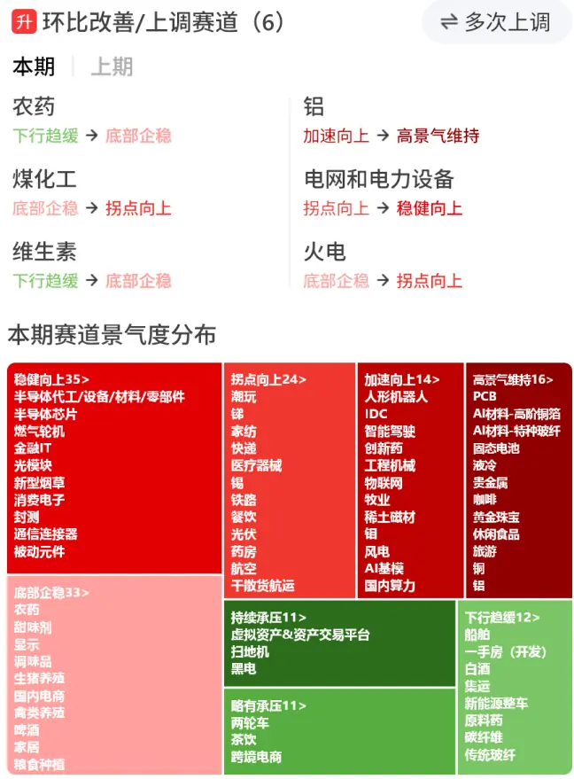
来源：国金证券研究所
图表2：细分赛道的景气度状态与观点展示
来源：国金证券研究所

科技制造周期消费医药PCB 2026/03/08更新高景气维持邓小路持平

行业观点：PCB行业仍然是确定性最强的板块。AIPCB正值海外AI服务器放量，包括英伟达和CSP自研ASIC均在陆续放量和升级，并且我们观察到上游设备、材料均出现景气度提升的现象，因此我们认为AIPCB仍然值得高度重视；加上基础汽车、消费等需求持续修复，叠加铜价预期上涨的情况下备库需求增加对需求形成高景气度支撑。CCL涨价周期开启。当前CCL不仅AI景气度高，基础消费景气度也不俗，奠定了涨价的需求基础；供应端由于海外CCL厂商逐渐退出FR4、M2、M4甚至M6\M7等细分领域市场，大陆厂商逐渐将部分产能往M6/M7/M8转移，最终会挤压中低端的产品供给紧张；再加上最上游铜价中长期有望上涨，届时会导致覆铜板产业链真正有效的产能吃紧，CCL涨价周期启动已是箭在弦上。收起へ

国金研究所在产品设计层面做了较多条件限制，以确保“产业景气高频跟踪”产品的客观严谨性、横向可比性与及时性。首先，当前景气度状态按从高到低共计八种。所有分析师都按照此标准统一给出判断，确保状态的横向可比。具体状态分类与判断依据如下：

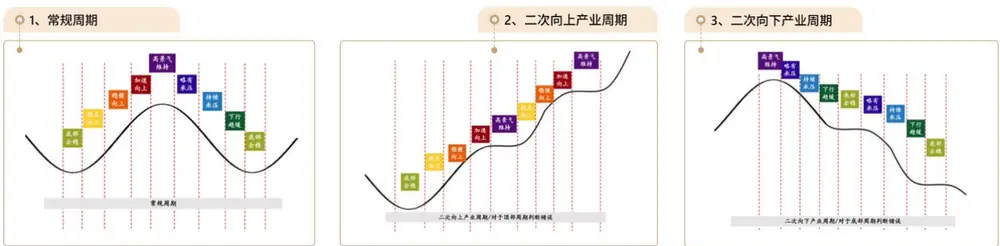
来源：国金证券研究所

图表3：景气度状态及对应说明

| 景气度指标 | 指标说明 |
| --- | --- |
|  | 高景气维持景气度指标处在相对高点，但还没有出现下行的迹象。 |
| 加速向上 | 景气度指标向上的速度保持该行业周期历史经验的较高水平，这一迹象是很多行业推荐的重要依据。这一指标可以是需求 加速向上，也可以是库存加速下行带来景气度拐点、成本超预期下降带来毛利率加速上行等，需要根据实际情况进行判断。 |
| 稳健向上 | 景气度指标向上的速度保持该行业周期历史经验的中下水平，往往出现在拐点向上后初始复苏阶段或者经过加速向上后行 |
| 拐点向上 | 业仍旧向上但增速放缓的场景。 指标出现底部拐点向上的趋势，需要重点判断是否确认拐点，这一迹象是很多行业推荐的重要依据。 |
| 底部企稳 | 行业景气度指标处于底部区间，判断向下空间不大，同时也没有看到向上的迹象。 |
| 下行趋缓 | 景气度指标向下的速度保持该行业周期历史经验的中下水平，往往出现在接近底部的场景。 |
| 略有承压 | 指标出现底部拐点向下的趋势，需要重点判断是否确认拐点，这迹象是很多行业看空的重要依据。 |
| 来源：国金证券研究所 | 持续承压景气度指标向下的速度保持该行业周期历史经验的较高水平，这一迹象是很多行业看空或者观察行业见底时间的重要依据。 |

分析师如需对景气度状态的判断进行调整，也需要遵守如下图所示的变动模式规则，不可以随意进行状态的更改。当然，规则中也囊括了多种常见的景气度周期模式，为分析师判断提供了一定的灵活空间，例如从“高景气维持”可能进入“拐点向上”的景气度上升通道，对应产业周期二次向上，景气度状态更强；也可能在底部企稳后再次出现状态的恶化，出现新的一轮景气度承压周期。在实践中我们同样允许各类情景的出现，只要它是贴合实际的。

图表4：景气度周期模式示意图
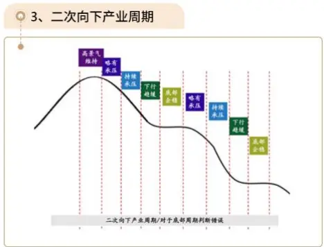

景气度状态本质上来源于分析师对赛道上下游供需、价格等多项指标的综合判断，仅对当前的赛道情况进行判断，不带有预测性质。此外，分析师在给出判断时被要求不能杂糅对股价的预测，只涉及景气度这单一目标。以上多方面的要求均为确保分析师在给出每一次状态判断时都会尽量审慎客观，也能以周度的更新频率确保跟踪的及时性。

以赛道“铜”为例，以下是 2025年“铜”的景气度状态与 SHFE 铜主力连续合约价格的走势。整体上，景气度与商品价格呈现一致性。

图表5：“铜”景气度打分与SHFE铜主连价格走势
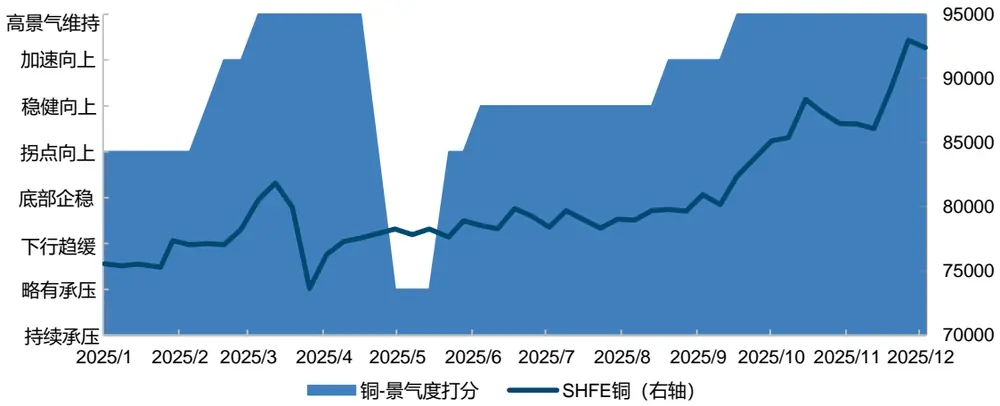
来源：Wind，国金证券研究所

“产业景气高频跟踪”当前已持续更新超过半年，同时底层积累了超过一年时间的历史数据。因此在产品层面，我们还会完整展示每个赛道的当期景气度状态、对应判断原因、历史景气度时序变化等信息，便于用户进行全面的观察。

## 1.2 景气度状态结果如何指导实际投资？

能及时体现赛道的景气度状态固然重要，但实际上投资者更加关注的问题是“如何用景气度数据来进行投资决策？”尽管在产品设计层面，我们对底层的数据质量进行了严格要求，但理论上赛道景气度状态与对应的股价之间依然是一个间接的传导关系。如何去寻找两者之间的规律是我们在本篇报告中具体解决的问题。因此，在实现具体策略之前，我们需要对原始的景气度状态做进一步处理，以便于从中剥离出能预测行业涨跌的有效信息。

当前整个景气度状态数据具有以下特点，为我们构建策略提供了支撑：

- 2025年1月13日以来每周更新，频率固定且具有充足的可回溯、验证区间；

- 截至 2026年1月31日，共覆盖 155个细分赛道，涉及20 多个一级行业。

因此，我们后文所做测算的数据范围为 2025年1月至2026年1 月。

由于部分细分赛道很难找到完全对应的投资标的，我们在构建细分赛道的景气度信号后，还是选择自下而上聚合到其所属的一级行业中，以便于进行标准化的策略回测。因此，我们的信号测算、策略构建均以申万一级行业指数为投资标的，最终实现基于赛道景气度状态构建的行业轮动策略。

在后续构建景气度信号的过程中，我们不仅会考察景气度的绝对状态，更重要的是会测算景气度的边际变化情况。因此我们需要一套标准，以便于观察状态的变化到底对应的是景气度抬升还是回落场景。此处为了简便处理，我们选择上文图表 3中由高到低的顺序作为排序标准。譬如从“底部企稳”到“拐点向上”意味着景气度抬升，从“略有承压”到“持续承压”意味着景气度回落。尽管这样处理可能会忽略掉部分“二次向上”或“二次向下”的产业周期情景，但过度探索单一信号的规律也可能导致过拟合的问题，一定程度的模糊化处理可以帮我们把握更具有代表性的景气度投资规律。

## 二、景气度信号的初步构造与测试

## 2.1 赛道景气度状态信号

首先，我们从一个基础的猜想出发：是否赛道景气度状态越高，对应的一级行业更容易上涨？

我们对此进行初步的验证，主要维度包括信号的平均收益与绝对胜率，同时将全部申万一级行业等权指数作为基准，计算信号的超额平均收益和超额胜率。为判断景气度状态对行业预判是否有效，我们对每个景气度状态分别进行统计，规则如下：

若赛道景气度当前为该状态，便买入对应指数，观察持有一周与二周后该笔交易的平均收益率、胜率以及相应的超额表现。

图表6：赛道景气度状态分布较均匀
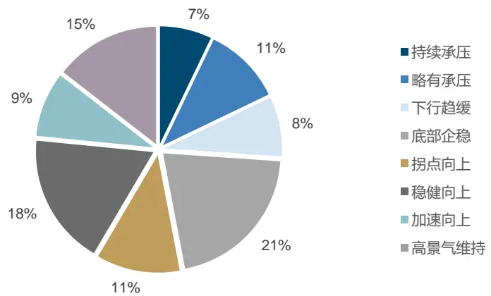
来源：国金证券研究所

赛道景气度状态的分布较均衡，无需担心数据量过少导致的信号质量衰减。

图表7：赛道景气度状态信号平均收益与胜率（未来一周）
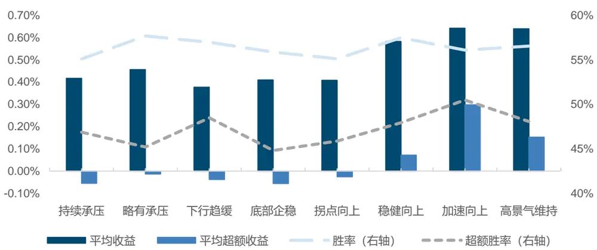
来源：Wind，国金证券研究所

从趋势上来看，信号的收益率及胜率确实伴随景气度状态提升而进一步上升，当景气度状态处于稳健向上或更高时，表现明显更好；但从数值上来看，超额胜率实际并不高，当景气度状态处于高位时，超额胜率也仅在50%附近。

图表8：赛道景气度状态信号平均收益与胜率（未来两周）
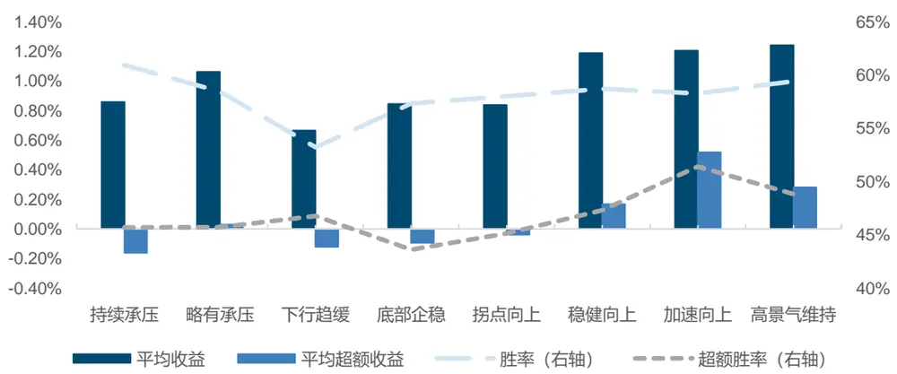
来源：Wind，国金证券研究所

在持有周期增长到两周后，情况并未明显改变，仅超额胜率的差异更显著一些。因此，只根据单个赛道的状态来判断是否买入对应行业整体效果一般。

## 2.2 行业景气度综合状态信号

只根据单个赛道的景气度可能很难反映行业的整体状态，因此我们尝试综合行业内所有细分赛道来计算行业的“平均景气度状态”。具体方法上，我们会对底层细分赛道的状态按照类似求取平均值方法进行处理，得到行业的景气度结果。

图表9：行业平均景气度状态计算方法

| 一级行业 | 细分赛道 | 2025/1/13 | 2025/3/17 | 2025/9/29 | 2026/1/26 |
| --- | --- | --- | --- | --- | --- |
| 家用电器 | 白电 | 稳健向上 | 加速向上 | 略有承压 | 持续承压 |
|  | 黑电 | 稳健向上 | 加速向上 | 略有承压 | 持续承压 |
|  | 厨卫电器 | 底部企稳 | 底部企稳 | 底部企稳 | 底部企稳 |
|  | 扫地机 | 高景气维持 | 高景气维持 | 高景气维持 | 持续承压 |
| 平均景气度状态 |  | 稳健向上 | 加速向上 | 底部企稳 | 略有承压 |

来源：国金证券研究所

我们可以按照平均景气度状态对一级行业进行排名，并按照如下规则进行测算：

每周选出平均景气度状态排名前 3/5/8/10 的行业，买入对应指数，观察持有一周与二周后该笔交易的平均收益率、胜率以及相应的超额表现。

图表10：行业平均景气度状态信号平均收益与胜率（未来一周）
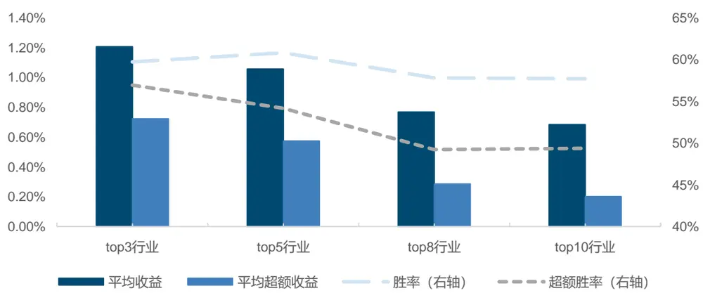
来源：Wind，国金证券研究所

可以看出，行业的平均景气度状态在回测范围内能较好预测行业收益情况。景气度排名前五行业的绝对胜率最高达到 60%；超额胜率方面，景气度排名前三的行业超额胜率达到 55%，且伴随选取行业的数量增多呈现单调下降的特征。

图表11：行业平均景气度状态信号平均收益与胜率（未来两周）
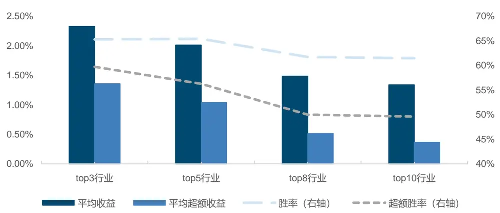
来源：Wind，国金证券研究所

时间跨度增长到两周后，信号的平均收益、胜率以及超额表现均再次提升，验证了这一信号在长周期跨度上依然有效。

## 2.3 赛道景气度边际变化信号

我们的另一个核心猜想是：景气度状态出现改善时，对应行业是否更容易上涨；相反，景气度回落时是否对应行业下跌？

细节上，我们首先定义景气度状态的改善程度或回落程度，以对不同程度边际变化的预测效果进行详细对比。例如，“景气度改善”对应的信号包括所有本周状态高于前周状态的情形；“景气度明显改善”则包含了所有跨越2个等级或以上的赛道景气度改善情况；“景气度大幅改善”则代表更显著的景气度边际变化。相反，“景气度回落”等分别对应类似的变动情况。我们按照如下规则进行测算：

每周选出景气度变化满足不同程度分类的赛道，买入所属一级行业的指数，观察持有一周与二周后该笔交易的平均收益率、胜率以及相应的超额表现。

图表12：赛道景气度状态不变占极高比例
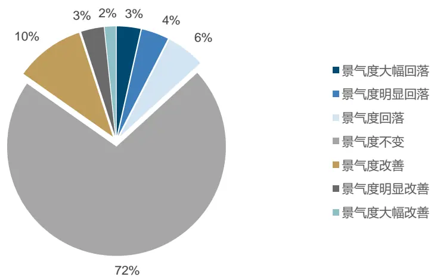
来源：国金证券研究所

从信号类别的分布上来说，景气度状态不变占最高比例。这表明分析师实际上不会轻易改变景气度状态判断，只有当赛道确实出现变化时才会给出相应调整。

图表13：赛道景气度变化信号平均收益与胜率（未来一周）
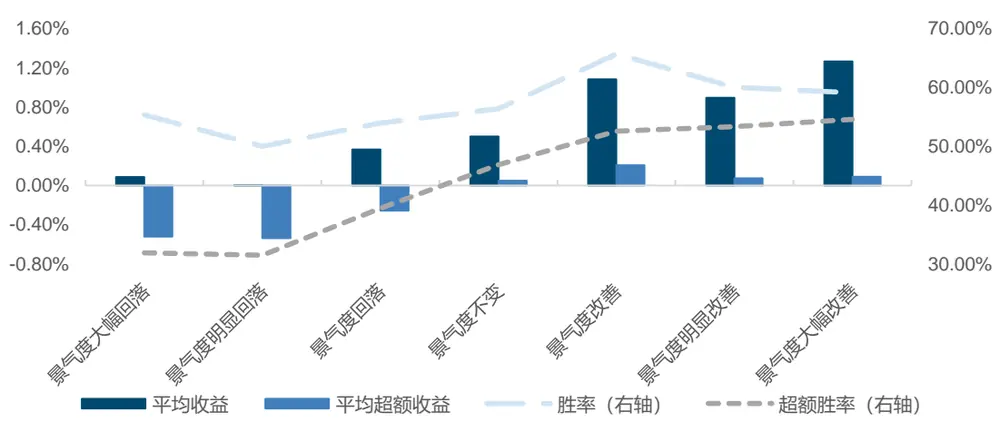
来源：Wind，国金证券研究所

收益方面，景气度改善信号具备更高的平均收益与超额收益预测能力，这表明景气度上涨对市场 Beta以及行业Alpha均有预测作用；胜率方面，景气度上涨信号的胜率显著更高，且超额胜率也均能达到 50%以上。景气度回落信号同样能预测行业下跌，能对行业进行反向剔除。此外，景气度状态明显改善（提升 2档及以上）时，由于同时期市场更易出现高涨幅，因此超额收益递减，但超额胜率实际上并未降低，能具备相同的收益预测作用。

图表14：赛道景气度变化信号平均收益与胜率（未来两周）
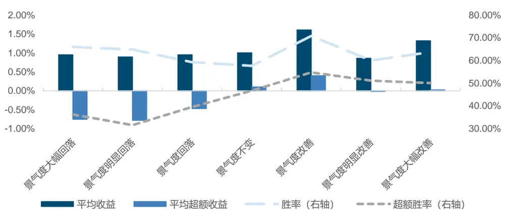
来源：Wind，国金证券研究所

拉长持仓周期来看，效果出现减弱，这表明边际变化类信号的持续性可能较弱。

## 2.4 赛道景气度状态与边际变化信号合成

经过简单验证，我们发现赛道层面的景气度高位与景气度边际改善均有一定预测作用。因此，我们尝试将两类信号进行合成，识别出更丰富的赛道景气度应用场景。但同时，我们不希望过度挖掘某一个状态等级所对应的规律，以防止出现过拟合的问题。为简化验证逻辑，我们做以下处理：

- 将景气度状态划分为三个区间：景气度低位（持续承压、略有承压、下行趋缓），景气度中位（底部企稳、拐点向上）、景气度高位（稳健向上、加速向上、高景气维持）。

- 将景气度变动划分为三类：景气度改善、景气度不变、景气度回落。

实际合成时，我们还需要考虑景气度状态的时期（即当期/前期处于低/中/高位），譬如以下两种复合信号存在差异：

前期景气度高位+景气度改善：上周景气度已处于高位，本周进一步向上；

当期景气度高位+景气度改善：不对上周状态做任何约束，只看本周景气度是否处于高位以及是否边际改善。

我们试图描绘更加具体的景气度场景，共计以下18种信号类型。

图表15：赛道景气度复合信号数量分布

| 景气度回落 |  | 景气度不变 | 景气度抬升 |
| --- | --- | --- | --- |
| 前期景气度低位 | 17 | 666 | 61 |
| 当期景气度低位 | 61 | 666 | 25 |
| 前期景气度中位 | 11 | 805 | 53 |
| 当期景气度中位 | 5 | 805 | 60 |
| 前期景气度高位 | 51 | 818 | 42 |
| 当期景气度高位 | 11 | 818 | 73 |

来源：国金证券研究所

经回测，我们能做出以下几个总结：

无论当前景气度处于什么状态，赛道景气度改善对应的各类信号整体具有更高的平均收益与胜率表现。

当前期景气度已处于高位时，进一步的抬升能带来明确的信号，对绝对收益与相对收益均有稳定的预测作用。我们将其识别为景气度高位突破。

- 若当期景气度在底部出现改善迹象时，也预示赛道可能存在复苏，对应超额胜率达64%，但信号赔率较低，对应较小幅的反弹。我们将其识别为景气度困境反转。

- 景气度高位回落、落至低位：同样能识别出即将回撤的行业，可进行负向剔除。

部分景气度回落场景出现异常高的回测结果，原因在于回测区间较短，信号样本少导致结果易受极端值影响。

图表16：景气度复合信号回测（绝对收益，未来一周）

|  | 平均收益 |  |  | 胜率 |  |  | 赔率 |  |  |
| --- | --- | --- | --- | --- | --- | --- | --- | --- | --- |
|  | 景气度回落景气度不变景气度改善 |  |  | 景气度回落 景气度不变 景气度改善 |  |  | 景气度回落景气度不变景气度改善 |  |  |
| 前期景气度低位 | 0.91% | 0.43% 0.80% |  | 52.94% | 57.06% | 62.30% | 2.275 | 1.087 | 1.518 |
| 当期景气度低位 | 0.33% | 0.43% | 1.34% | 54.10% | 57.06% | 80.00% | 1.117 | 1.087 | 1.497 |
| 前期景气度中位 | 1.67% | 0.42% | 0.74% | 72.73% | 56.02% | 64.15% | 2.542 | 1.072 | 1.504 |
| 当期景气度中位 | 0.19% | 0.42% | 0.60% | 60.00% | 56.02% | 60.00% | 0.843 | 1.072 | 1.378 |
| 前期景气度高位 | 0.01% | 0.52% | 1.39% | 50.98% | 56.23% | 66.67% | 0.967 | 1.146 | 2.067 |
| 当期景气度高位 | 1.26% | 0.52% | 1.11% | 54.55% | 56.23% | 61.64% | 2.686 | 1.146 | 2.048 |

来源：Wind，国金证券研究所

图表17：景气度复合信号回测（超额收益，未来一周）

|  | 平均收益 |  |  | 胜率 |  |  | 赔率 |  |  |
| --- | --- | --- | --- | --- | --- | --- | --- | --- | --- |
|  | 景气度回落景气度不变景气度改善 |  |  | 景气度回落 景气度不变 景气度改善 |  |  | 景气度回落景气度不变景气度改善 |  |  |
| 前期景气度低位 | 0.20% | -0.04% -0.03% |  | 47.06% 46.25% |  | 49.18% | 1.421 | 1.052 | 0.990 |
| 当期景气度低位 | -0.33% | -0.04% 0.31% |  | 37.70% | 46.25% | 64.00% | 1.069 | 1.052 | 0.952 |
| 前期景气度中位 | 0.36% | -0.01% | 0.23% | 54.55% | 45.96% | 56.60% | 1.466 | 1.107 | 1.146 |
| 当期景气度中位 | -0.40% | –0.01% | –0.05% | 20.00% | 45.96% | 46.67% | 1.817 | 1.107 | 1.053 |
| 前期景气度高位 | –0.55% | 0.06% | 0.65% | 33.33% | 47.07% | 59.52% | 0.814 | 1.172 | 1.516 |
| 当期景气度高位 | 0.25% | 0.06% | 0.40% | 63.64% | 47.07% | 54.79% | 1.525 | 1.172 | 1.464 |

来源：Wind，国金证券研究所

经过以上分析，我们已对基础的景气度信号有了初步了解。目前来看，赛道层面的景气度中我们识别出“高位突破”与“困境反转”两类场景，均具备较高的胜率或收益率表现。同时，行业层面的平均景气度状态也能起到较好的筛选作用，带来持续性更强的行业配置观点。接下来我们将结合以上几类信号，实现最终的景气度行业配置策略。

| 标的筛选 | 满足上述“高位突破”或“困境反转”条件的行业指数；若无行业满足条件则空仓。 |
| --- | --- |
| 权重分配 | 等权配置；若仅一个行业满足条件也会全仓配置该行业指数。 |
| 回测区间 | 2025年1月13日至2026年1月26日 |
| 持有周期 | 固定持有一周，下周重新进行筛选。 |
| 交易价格 | 每周第一个交易日收盘价 |
| 交易费率 | 千分之二 |

图表18：策略回测设定
来源：国金证券研究所

## 三、基于景气度信号的行业配置策略构建

## 3.1 逻辑复现：景气度“高位突破”与“困境反转”策略

我们首先将“高位突破”与“困境反转”两种景气度信号落实到策略层面，规则如下：

高位突破：任何赛道满足“前期景气度高位”+“景气度改善”条件，持有对应一级行业指数。

困境反转：任何赛道满足“当期景气度低位”+“景气度改善”条件，持有对应一级 行业指数。

我们按照以下设定进行策略回测。

## 策略设定

回测结果上来看，“高位突破”策略在净值收益表现上更突出，显著跑赢作为基准的中证全指指数。“困境反转”尽管收益表现上相对较弱，但其实可以与“高位突破”策略起到互补作用，时序上看两者的信号能在不同时间区间上发挥作用。因此，两类策略的结合有望实现回测效果的进一步增强。

图表19：“高位突破”与“困境反转”逻辑的策略复现
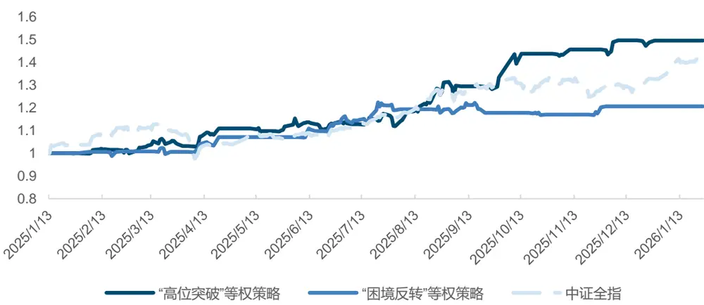
来源：Wind，国金证券研究所

从回测的指标上来看，“高位突破”策略年化超额收益达到47.28%，Sharpe比率达到2.919。同时，两个策略都降低了策略最大回撤，在风险管理层面实现了更好的效果。原因在于这类信号在实现行业择优的同时，也能起到类似择时的效果，可以借助空仓来规避市场整体无景气度改善所面临的下跌风险。不过，以上两个策略换手率较高，每周的平均双边换手分别达到 104.58%和 64.71%

图表20：“高位突破”与“困境反转”策略指标

| “高位突破”策略 |  | “困境反转”策略 | 中证全指 |
| --- | --- | --- | --- |
| 年化收益率 | 47.28% | 19.71% | 39.46% |
| 年化波动率 | 16.20% | 10.06% | 17.18% |
| 最大回撤 | -5.46% | -4.61% | -13.75% |

| “高位突破”策略 |  | “困境反转”策略 | 中证全指 |
| --- | --- | --- | --- |
| Sharpe 比率 | 2.919 | 1.958 | 2.297 |
| Calmar 比率 | 8.665 | 4.279 | 2.870 |
| 年化超额收益率 | 3.70% | -16.25% |  |
| 年化跟踪误差 | 18.24% | 17.20% |  |
| 信息比率 | 0.203 | -0.945 |  |
| 超额最大回撤 | -11.07% | -20.45% |  |
| 平均单边换手率 | 104.58% | 64.71% |  |

来源：Wind，国金证券研究所

## 3.2 “高位突破”+“困境反转”构造短周期行业景气度交易策略

我们将前述两个策略的信号再次进行合成，构造偏短周期的行业景气度交易策略，对策略表现做进一步优化。我们做出以下改变：

信号合成：赛道满足“高位突破”或“困境反转”任一条件，即会买入对应的一级行业，以实现对两类型信号的配置。

- 权重优化：计算行业内信号的扩散系数，统计满足“高位突破”或“困境反转”任一条件的赛道数量占该行业全部赛道数量的比例；将行业的扩散系数等比例缩放使其求和为 1，作为权重对指数进行加权。

其余回测设定不变，得到短周期行业景气度交易策略结果如下。

图表21：短周期行业景气度交易策略净值
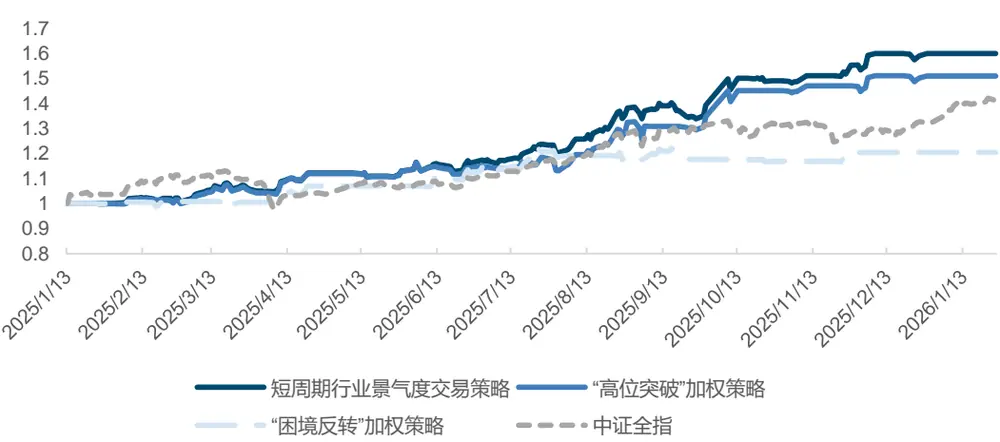
来源：Wind，国金证券研究所

图表22：短周期行业景气度交易策略回测指标

|  | 短周期行业景气度 交易策略 | “困境反转” “高位突破” 加权策略 加权策略 | 中证全指 |
| --- | --- | --- | --- |
| 年化收益率 | 57.23% 48.79% | 19.64% | 39.46% |
| 年化波动率 | 15.64% | 16.20% 10.19% | 17.18% |
| 最大回撤 | -4.58% | -5.46% -4.44% | -13.75% |
| Sharpe 比率 | 3.660 | 3.011 1.927 | 2.297 |
| Calmar 比率 | 12.484 | 8.942 | 4.427 2.870 |
| 年化超额收益率 | 10.76% | 4.77% | -16.28% |
| 年化跟踪误差 | 17.52% | 18.25% | 17.19% |
| 信息比率 | 0.614 | 0.261 | -0.947 |
| 超额最大回撤 | -11.07% | -11.07% | -20.30% |
| 平均单边换手率 | 127.35% | 104.02% | 65.75% |

来源：Wind，国金证券研究所

信号合成后，策略收益率进一步提高，去年超额表现达到10.76%，同时Sharpe比率、Calmar比率等风险指标进一步优化。

不过，该策略的换手率依然较高。我们观察该策略的详细持仓，会发现大多数情况只持有一个或两个行业，或是选择空仓，整体持仓周期短且仓位分布集中。

图表23：短周期行业景气度交易策略部分持仓

|  | 持仓 | 持仓 |
| --- | --- | --- |
| 20251103 | 交通运输100% | 20251215 空仓 |
| 20251110 | 空仓 | 20251222 农林牧渔 100% |
| 20251117 | 空仓 | 20251229 空仓 |
| 20251124 | 基础化工 100% | 20260112 空仓 |
| 20251201 | 有色金属 100% | 20260119 空仓 |
| 20251208 | 空仓 | 有色金属 26% 20260126 计算机 74% |

来源：Wind，国金证券研究所

因此，我们尝试最终叠加行业平均景气度状态信号，来增加长期持有的仓位部分，以此降低换手且进一步优化策略效果。

## 3.3 行业景气度智能配置策略

我们将整体仓位分为两部分，单独配置两个子策略：一部分专门配置上述短周期行业景气度交易策略的持仓，另一部分则仅用于买入平均景气度状态最高的前 3个行业。当短周期交易策略无信号时，我们也不会将这部分仓位转移到另一个策略内，而是保持该部分空仓，相当于降低整个策略的总仓位，保留其中信号的择时能力。

实际合成时，我们给两个子策略固定分配 50%的仓位，来构建最终的行业景气度智能配置策略。以下是最终策略的净值与回测指标。

图表24：行业景气度智能配置策略净值
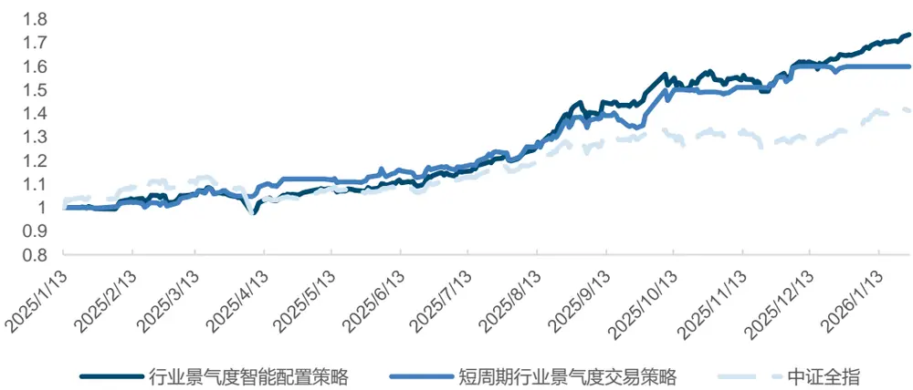
来源：Wind，国金证券研究所

图表25：行业景气度智能策略回测指标

| 行业景气度智能配置策略 |  | 短周期行业景气度交易策略 | 中证全指 |
| --- | --- | --- | --- |
| 年化收益率 | 70.06% | 57.23% | 39.46% |
| 年化波动率 | 17.57% | 15.64% | 17.18% |
| 最大回撤 | -9.80% | -4.58% | -13.75% |
| Sharpe 比率 | 3.988 | 3.660 | 2.297 |
| Calmar 比率 | 7.147 | 12.484 | 2.870 |
| 年化超额收益率 | 21.39% | 10.76% |  |
| 年化跟踪误差 | 10.33% | 17.52% |  |
| 信息比率 | 2.071 | 0.614 |  |
| 超额最大回撤 | -5.92% | -11.07% |  |
| 平均单边换手率 | 71.19% | 127.35% |  |

来源：Wind，国金证券研究所

回测结果上来看，最终的行业景气度智能配置策略收益率进一步提升，同时换手率显著下降，年化超额达到 21.39%，平均单边换手 71.19%。不过最大回撤相对放大。近几期策略持仓如下：

图表26：行业景气度智能配置策略部分持仓

|  | 20251222 |  | 20251229 |  | 20260112 | 20260119 |  | 20260126 |
| --- | --- | --- | --- | --- | --- | --- | --- | --- |
| 农林牧渔 | 50.00% | 有色金属 | 16.67% | 有色金属 | 16.67% | 有色金属 | 16.67% | 有色金属 29.87% |
| 有色金属 | 16.67% | 电力设备 | 16.67% | 电力设备 | 16.67% | 电力设备 16.67% | 电力设备 | 16.67% |
| 电力设备 | 16.67% | 通信 | 16.67% | 通信 | 16.67% | 通信 16.67% | 计算机 | 36.79% |
| 通信 | 16.67% |  |  |  |  |  | 通信 | 16.67% |

来源：Wind，国金证券研究所

## 风险提示

1. 以上结果通过历史数据统计、建模和测算完成，历史规律未来可能存在失效的风险。

2. 各类事件因子可能会受到政策、市场环境发生变化的影响，出现阶段性失效的风险。

3. 市场可能出现超出模型预期的变化，导致策略出现超出模型估计的波动和回撤。

## 特别声明：

国金证券股份有限公司经中国证券监督管理委员会批准，已具备证券投资咨询业务资格。

本报告版权归“国金证券股份有限公司”（以下简称“国金证券”）所有，未经事先书面授权，任何机构和个人均不得以任何方式对本报告的任何部分制作任何形式的复制、转发、转载、引用、修改、仿制、刊发，或以任何侵犯本公司版权的其他方式使用。经过书面授权的引用、刊发，需注明出处为“国金证券股份有限公司”，且不得对本报告进行任何有悖原意的删节和修改。

本报告的产生基于国金证券及其研究人员认为可信的公开资料或实地调研资料，但国金证券及其研究人员对这些信息的准确性和完整性不作任何保证。本报告反映撰写研究人员的不同设想、见解及分析方法，故本报告所载观点可能与其他类似研究报告的观点及市场实际情况不一致，国金证券不对使用本报告所包含的材料产生的任何直接或间接损失或与此有关的其他任何损失承担任何责任。且本报告中的资料、意见、预测均反映报告初次公开发布时的判断，在不作事先通知的情况下，可能会随时调整，亦可因使用不同假设和标准、采用不同观点和分析方法而与国金证券其它业务部门、单位或附属机构在制作类似的其他材料时所给出的意见不同或者相反。

本报告仅为参考之用，在任何地区均不应被视为买卖任何证券、金融工具的要约或要约邀请。本报告提及的任何证券或金融工具均可能含有重大的风险，可能不易变卖以及不适合所有投资者。本报告所提及的证券或金融工具的价格、价值及收益可能会受汇率影响而波动。过往的业绩并不能代表未来的表现。

客户应当考虑到国金证券存在可能影响本报告客观性的利益冲突，而不应视本报告为作出投资决策的唯一因素。证券研究报告是用于服务具备专业知识的投资者和投资顾问的专业产品，使用时必须经专业人士进行解读。国金证券建议获取报告人员应考虑本报告的任何意见或建议是否符合其特定状况，以及（若有必要）咨询独立投资顾问。报告本身、报告中的信息或所表达意见也不构成投资、法律、会计或税务的最终操作建议，国金证券不就报告中的内容对最终操作建议做出任何担保，在任何时候均不构成对任何人的个人推荐。

在法律允许的情况下，国金证券的关联机构可能会持有报告中涉及的公司所发行的证券并进行交易，并可能为这些公司正在提供或争取提供多种金融服务。

本报告并非意图发送、发布给在当地法律或监管规则下不允许向其发送、发布该研究报告的人员。国金证券并不因收件人收到本报告而视其为国金证券的客户。本报告对于收件人而言属高度机密，只有符合条件的收件人才能使用。根据《证券期货投资者适当性管理办法》，本报告仅供国金证券股份有限公司客户中风险评级高于 C3级(含 C3级）的投资者使用；本报告所包含的观点及建议并未考虑个别客户的特殊状况、目标或需要，不应被视为对特定客户关于特定证券或金融工具的建议或策略。对于本报告中提及的任何证券或金融工具，本报告的收件人须保持自身的独立判断。使用国金证券研究报告进行投资，遭受任何损失，国金证券不承担相关法律责任。

若国金证券以外的任何机构或个人发送本报告，则由该机构或个人为此发送行为承担全部责任。本报告不构成国金证券向发送本报告机构或个人的收件人提供投资建议，国金证券不为此承担任何责任。

此报告仅限于中国境内使用。国金证券版权所有，保留一切权利。

上海

电话：021-80234211

北京

邮箱：researchsh@gjzq.com.cn

电话：010-85950438

深圳

电话：0755-86695353

邮箱：researchbj@gjzq.com.cn

邮箱：researchsz@gjzq.com.cn

邮编：201204

地址：上海浦东新区芳甸路 1088号

紫竹国际大厦 5楼

邮编：100005

地址：北京市东城区建内大街 26号

邮编：518000

新闻大厦 8层南侧

地址：深圳市福田区金田路 2028 号皇岗商务中心18 楼 1806

【小程序】国金证券研究服务

【公众号】国金证券研究