# Table_Title高管增持事件驱动策略量化研究

## ——事件驱动策略量化研究系列专题之一

罗军Table_Author 分析师

电话：020-87555888-8655

eMail：lj33@gf.com.cn

执业编号：S0260511010004

## Table_Summary 高管增持公告事件的时间分布具有明显规律性

在牛市的前半阶段、熊市的后半阶段中，增持公告的数目显著增多，而集中性的增持事件可能意味着股票价格被严重低估，后市可能存在上涨的机会。从 11年底以来，公布增持信息的公司明显增多，高管增持概念成为近期的投资热点，而这也意味着基于该事件可能存在一定的投资及套利机会。

## 高管增持驱动效应显著，短期效应优势明显

- 从不同增持主体来看，理论上公司高管增持行为比公司股东及个人股东增持行为更有意义，而从实证结果发现，在不同的持有期下，高管增持事件驱动策略均能获得较高的显著收益，胜率均在 50%以上，与公司股东、个人股东相比，高管增持的短期效应优势更明显。

- 从不同的市场走势来看，高管增持策略表现存在较大差异：牛市中可获得较高的绝对收益，熊市中可以获得良好的超额收益，而震荡市中也具有相对较好的长期超额收益。

从增持公告信息的可靠性和及时性来看，增持比例为 0.05%至 1%的样本股能够获得较好的绝对收益及超额收益，及时性较高的增持公告具有较高的显著超额收益，增持公告滞后超过两周的事件超额收益不显著。

- 从发布增持公告的公司内部属性（公司规模、行业因素）角度来看，中小市值公司、农林牧渔、采掘业、建筑行业、房地产、综合类等行业具有较高的绝对收益和超额收益。

## 以高管增持事件建立中短期投资策略，可获得较高的绝对收益及超额收益

- 从不同持有期来看：持有期小于 5日的滚动策略由于交易成本较高导致收益率较低；而持有期为 5、10、20、30 日的滚动策略平均收益较高，从 07 年至 11 年每月进行为期一年的滚动投资，平均可获得 18.03%的超额收益。

- 持有期为 30 日的高管增持事件驱动下的滚动策略表现优异：在共计 49 个策略中有 33 个策略获得正绝对收益，而 43 个策略获得正超额收益，其中，大部分绝对收益为负的策略均可获得正的超额收益，即能够跑赢大盘。07-08年熊市中进入市场的策略虽然绝对收益为负，但仍可获得 20%-30%左右的超额收益，而08 年底进入市场的策略则最高可获得73.37%的超额收益，对于 2011年进入市场的策略则在沪深 300指数下跌23.75%的情况下仍可获得 8.88%的超额收益。

## 建议关注发布高管增持公告的上市公司，并进行中短期（5-30 日）滚动投资，样本股可以重点考虑投资如下发布高管增持公告的公司：

- 中小市值公司

- 增持比例不低于 0.05%

- 增持公告滞后时间不超过 60 日

- 综合、地产、农林牧渔等行业

## 一、高管增持事件综述

高管增持事件是指高管在二级市场的买入本公司股票的行为。从逻辑上分析，高管增持行为可以反映出管理层对于公司股价及公司未来发展状况的态度，大量的买入行为可能表示管理层认为目前公司价值被低估、价值提升空间较大，或者对于公司未来经营充满信心，认为公司未来的发展前景较好。从上世纪60-70年代至今，高管增持行为与股票收益关系问题一直是国内外学术界关注的焦点，已有大量研究表明高管增持行为的确包含着对股价有价值的信息，增持公告后能够获得显著的超额收益。

## （一）公司增持公告事件时间分布具有明显规律性

从历史来看，增持事件的数量分布与市场的走势颇为相关，市场处于牛市时增持事件相对较少，而市场处于熊市时增持事件发生较为集中，增持事件集中爆发的时间段刚好对应了大盘走势的低点。而进一步观察图1可以看出，增持事件的趋势变化并非完全对应股市的最高点或者最低点，我们将历史上牛市、熊市及震荡市进一步分为前期和后期，梳理结果如表1所示。可以明显发现，在牛市的前半阶段、熊市的后半阶段中，增持公告的数目显著增多，而集中性的增持事件可能意味着股票价格被严重低估，后市可能存在上涨的机会，而这也意味着基于该事件可能存在一定的投资及套利机会。

图 1：总增持事件数目与沪深 300走势
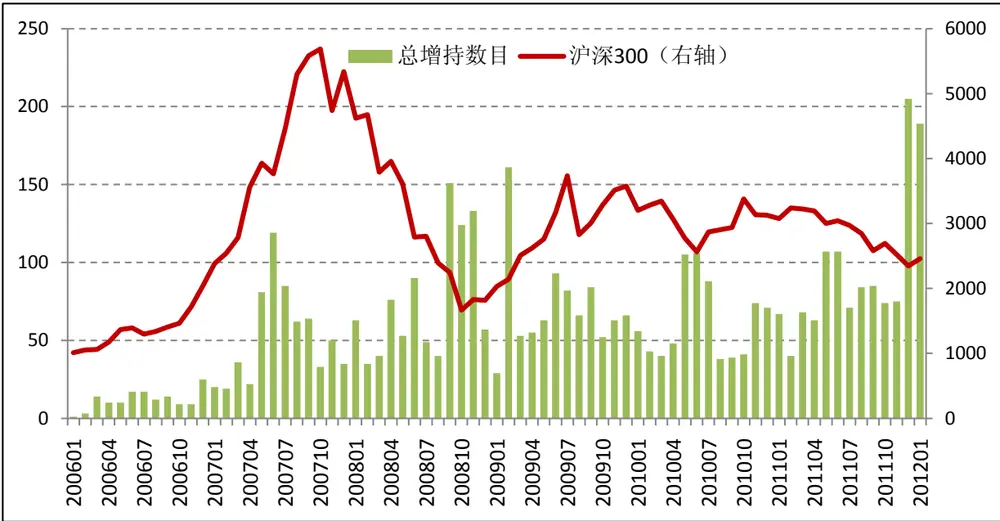
数据来源：广发证券研究发展中心

表 1：增持公告事件时间分布统计

| 市场走势 | 时间区间 |  | 总增持 | 高管增持 | 公司增持 | 个人增持 |
| --- | --- | --- | --- | --- | --- | --- |
| 牛市 | 200601-200710 | 前期 | 116 | 0 | 112 | 4 |
|  |  | 后期 | 566 | 521 | 38 | 7 |
| 熊市 | 200710-200810 | 前期 | 332 | 312 | 18 | 2 |
|  |  | 后期 | 507 | 354 | 143 | 10 |
| 牛市 | 200811-200907 | 前期 | 408 | 334 | 62 | 12 |
|  |  | 后期 | 318 | 289 | 25 | 4 |
| 震荡市 | 200908-201201 | 前期 | 518 | 432 | 76 | 10 |
|  |  | 后期 | 1797 | 1487 | 284 | 26 |
| 全样本 | 200601-201201 |  | 4529 | 3544 | 756 | 74 |

数据来源：广发证券研究发展中心

## （二）近期上市公司高管增持热情高涨，高管增持事件股成为投资热点

从2011年底开始，随着市场走势的下行，公布增持信息的公司明显增多，2011年12月以来（截至2012年1月30日），上市公司共发布高管股东增持公告301个，总增持金额高达9.54亿元，最多的一周达到71个增持公告。近两个月中，制造业、房地产、信息技术、商业贸易、社会服务等行业的高管增持公告数量较高，其中，制造业增持公告数量高达711个，总增持金额达5.82亿元，成为同期公告增持数目及增持金额最高的行业，显示出上市公司高管对于该行业未来业绩的信心。

图 2：高管增持事件数目与沪深 300走势（2011年至今）
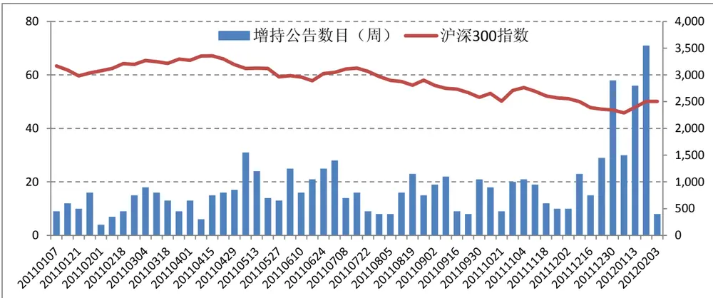
数据来源：广发证券研究发展中心

目前，大量高管增持公告的发布使得高管增持概念成为近期的投资热点。本篇报告基于高管增持公告事件，对高管增持事件的驱动效应进行了较为深入的量化分析研究，实证结果表明高管增持公告事件存在显著的驱动效应，基于该事件的中短期投资策略可获得良好的投资收益。

## 二、高管增持事件驱动效应量化分析

我们以2006年至今的所有高管增持事件为事件点，对发布高管增持公告的股票进行事件驱动效应分析。具体策略设臵如下：在高管增持公告后一日进行买入操作，并分别进行短期及中长期持有（持有期分别为1、2、3、5、10、20、30、40、60日），并以持有期最后一日的股票收盘价卖出，计算相应持有期的累积绝对收益和超额收益，超额收益的比较基准为同期沪深300指数。同时，为了避免停盘、分红派息等事件对实证结果的影响，我们剔除了停盘的数据，并对交易数据进行复权处理。

## （一）高管增持驱动效应显著，短期效应优势明显

表2统计了高管增持事件驱动策略在不同持有期下的平均收益及胜率的情况。实证结果表明：在不同的持有期下，高管增持事件驱动策略均能获得较高的显著收益，胜率均在50%以上，且随着持有期的增长，持有期收益均值及胜率都有所提升。从表2中可以看到，在不考虑交易成本的情况下，持有增持公告事件股票5日平均可获得0.92%的累积超额收益，年化超额收益可达44.16%。

表 2：增持事件驱动策略-收益统计性指标

|  |  | 持有期 |  |  |  |  |  |  |  |  |
| --- | --- | --- | --- | --- | --- | --- | --- | --- | --- | --- |
|  |  | 1 | 2 | 3 | 5 | 10 | 20 | 30 | 40 | 60 |
| 均值 | 绝对收益 | 0.27% | 0.40% | 0.64% | 0.92% | 1.55% | 2.42% | 3.66% | 4.70% | 7.89% |
|  | 超额收益 | 0.30% | 0.50% | 0.62% | 0.80% | 1.55% | 2.46% | 3.41% | 4.33% | 6.28% |
| 胜率 | 绝对收益 | 53.2% | 52.7% | 52.3% | 52.4% | 52.2% | 52.0% | 52.6% | 52.6% | 53.3% |
|  | 超额收益 | 53.2% | 52.9% | 51.7% | 50.9% | 52.1% | 53.6% | 54.3% | 54.3% | 55.5% |

数据来源：广发证券研究发展中心
注：标注为红色表示该持有期的收益在5%水平上显著为正。

我们将高管增持与其他增持主体的策略收益进行了对比，如图3所示。可以发现：高管增持策略的短期效应优势最明显，在较短的持有期（持有1-20日）内，基于高管增持事件策略的绝对收益和超额收益最高，且收益在5%的水平上显著为正，公司股东及个人增持事件策略的绝对收益和超额收益均不显著。而从中长期持有策略（持有30-60日）来看，基于公司股东增持事件和个人增持事件的策略能获得较高的显著绝对收益和超额收益。

从理论上来说，公司高管增持行为比公司股东及个人股东增持行为更有意义：首先，从信息不对称角度来说，公司股东与公司高管会比个人股东掌握更多也更准确的公司信息，因此高管增持行为所包含的信息更值得关注；其次，公司股东增持行为背后的动机可能更为复杂多样，除对公司未来业绩看好这个原因之外，股东的增持行为可能与公司股权转移、定向增发护盘等动机相关。因此，基于以上原因，我们在本篇报告中主要关注公司高管的增持行为。

图 3：增持事件驱动效应绝对收益表现（左）与超额收益表现（右）—按照增持主体分类
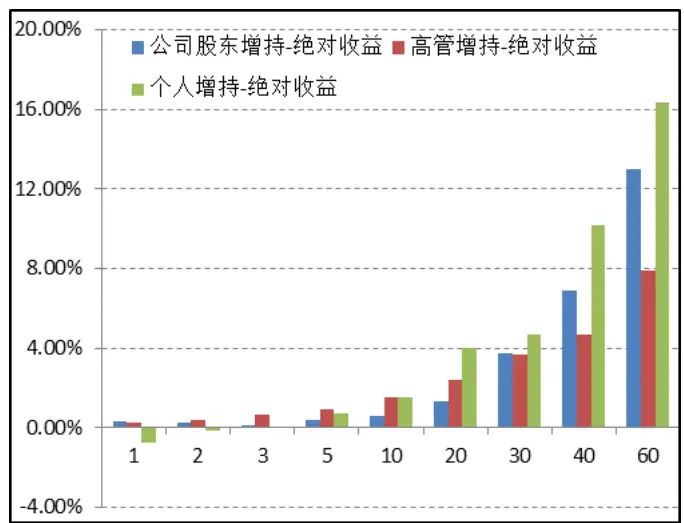
数据来源：广发证券研究发展中心

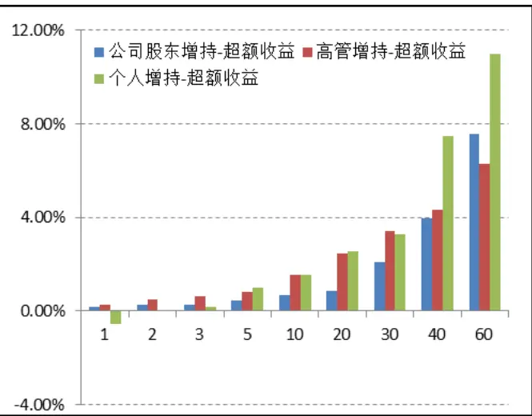

## （二）不同市场走势下的高管增持驱动效应：牛市中绝对收益显著，弱市中超额收益表现优异

在不同的市场走势下，高管增持策略表现存在较大差异：牛市中可获得较高的绝对收益，熊市中可以获得良好的超额收益，而震荡市中也具有相对较好的长期超额收益。

图 4：高管增持事件驱动效应绝对收益表现（左）和超额收益表现（右）—按市场走势分类
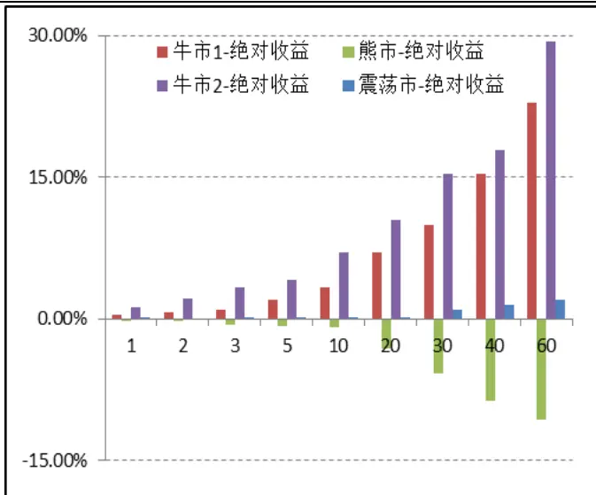

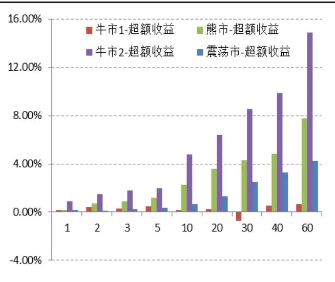
注：牛市 1（20060101-20071031），熊市（20071101-20081031），牛市 2（20081101-20090731），震荡市（20090801-20111231）
数据来源：广发证券研究发展中心

从图4可以看到，在06-07年的牛市行情中，高管增持策略能够获得正的绝对收益，公告日后持有5日平均累积绝对收益高达2%，但与同期沪深300指数相比超额收益较低；而在07-08年的熊市中则出现相反的情况，高管增持策略的绝对收益为负，但超额收益显著为正，5日平均累积超额收益为1.18%；在08-09年的小牛市行情中，高管增持策略的表现令人惊艳，绝对收益及超额收益均表现优异，持有1日、5日、10日可获得0.98%、

2%、4.77%的超额收益，在更长的持有期的超额收益仍非常可观，持有30日的绝对收益及超额收益可达到15.45%、8.55%，年化收益分别为123.6%及68.4%。而在10-11年的震荡市中，相比累积绝对收益来看，高管增持策略的长期超额收益表现较好，持有事件股票60日可平均获得4.23%的超额收益，年化为16.92%。

## （三）增持力度、增持时效与高管增持事件公告日效应

增持公告本身代表着对公司股价的利好信息，而信息对股价的影响程度主要取决于两个方面，即信息的及时性和可靠性。一般来说，公告信息的可靠性越高，其对股价的影响程度越大，同时，公告信息的及时性越高，其对股价的影响也越大。

## 增持力度与高管增持事件公告日效应

相对于一般投资者和公司股东而言，公司高管能够掌握更多及更准确的公司内部信息，而高管的增持力度则能从一定程度上反映出高管所掌握利好信息的准确度和真实度，高管增持力度越大，表明高管对于公司未来业绩越看好，或者高管认为公司股价目前被市场过度低估，因此这类增持行为能够对公司股价形成较强的推动作用。而相反，高管增持力度越小，则增持行为所传递利好信息的准确度和真实度越低，进而无法对股价真正形成持久的影响。

我们将增持比例（高管增持股份占公司流通股比重）作为增持力度指标，将增持比例从高到低分为五组，对不同增持力度下的高管增持事件的公告日效应进行分析，结果如图5所示。

图 5：高管增持事件驱动效应绝对收益表现（左）和超额收益表现（右）—按增持力度分组
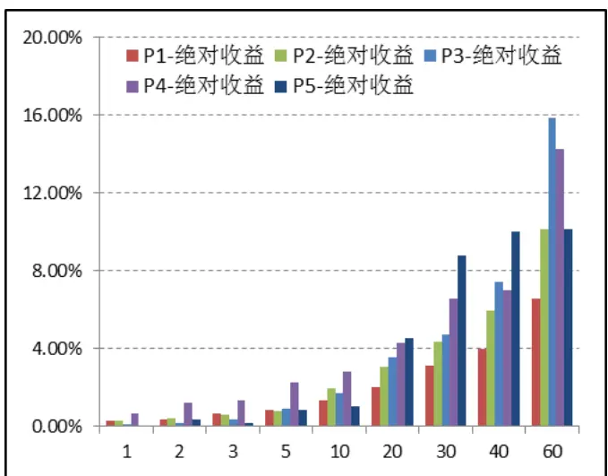

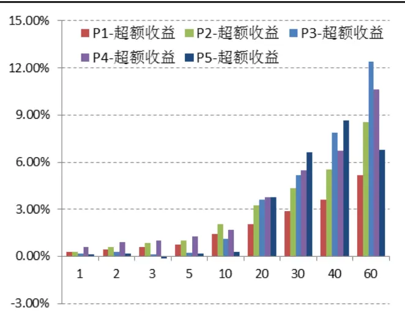

## 注：按照增持比例归档分为五组：P1（0-0.05%），P2（0.05%-0.1%），P3（0.1%-0.5%），P4(0.5%-1%)，P5(>1)

数据来源：广发证券研究发展中心

按照增持比例划分样本组后，增持比例为0.05%至1%的第二组、第三组、第四组的样本股能够获得较好的绝对收益及超额收益，相比较而言，增持比例最低的第一组样本组合公告日效应则表现较差，而对于第五组，该组样本组合表现较差的原因主要在于样本数量较少，且样本在各个年份分布不均，因此影响到该组平均收益的表现。

我们可以看到，从较短的持有期来看，增持比例为第三组的样本组合表现最好，公告日后持有期收益均显著为正，持有1日、2日、5日可获得0.66%、1.18%、2.26%的累计平均绝对收益，若将样本组合收益与沪深300指数收益进行对比，则该样本组合的累计平均超额收益分别达到0.61%、0.93%、1.28%。而从较长的持有期来看，增持比例较高的第四组虽然在较短持有期内出现了负的平均收益，但其在较长持有期内表现出较好的显著收益，持有30日、40日的平均绝对收益达到12.01%、13.81%，超额收益为6.11%、9.05%。

## 增持时效与高管增持事件公告日效应

观察公司增持公告数据可以发现，部分增持公告发布存在一定的滞后性，如烽火通信(600498.SH)在2011年8月4日发布高管增持公告，而实际实施日却为2011年6月2日，增持公告滞后63日。增持公告与实际的增持行为是息息相关的，增持公告对股价的推动作用实际上来源于其背后的真实增持行为，由于信息对股价的影响会随着时间的推移逐渐淡化，因此公告信息越及时，公告对股价的影响越大，假若公告日与实际增持日存在较久的时间差，那么这类增持公告的及时性就较差，其对股价的推动作用较小。

我们将增持公告日与实施日的时间差来衡量增持公告及时性，时间差越大，公告及时性越差。

如表3所示，可以看到，及时性较高的增持公告具有较高的显著超额收益，增持公告滞后超过两周的事件超额收益不显著。值得注意的是，增持公告日滞后超过3个月的样本组虽然整体平均收益明显高于滞后期较小的样本组，但对增持公告数据进行进一步分析可以发现，T5样本组的高收益几乎全部来自于2009年的牛市，而在其它年份，其公告日效应的收益表现基本为负收益，且在统计上不显著（表4）。而实际上09年这部分高管增持公告的实施日均分布在2007年10月-2008年10月，正是市场处于底部的时间，而选择在09年初公布增持公告可能是由于此时市场出现反转，上市公司为了提振投资者信心而集中选择发布公告。

表 3：增持公告及时性与持有期超额收益统计

| 组别 | 持有期 |  |  |  |  |  |  |  |  |
| --- | --- | --- | --- | --- | --- | --- | --- | --- | --- |
|  | 1 | 2 | 3 | 5 | 10 | 20 | 30 | 40 | 60 |
| T1 | 0.60% | 0.99% | 1.29% | 1.84% | 2.64% | 3.15% | 3.24% | 4.85% | 8.79% |
| T2 | 0.18% | 0.28% | 0.32% | 0.53% | 1.12% | 2.12% | 3.10% | 3.89% | 5.39% |
| T3 | 0.25% | 0.28% | 0.76% | 1.14% | 1.91% | 3.03% | 4.08% | 5.24% | 9.84% |
| T4 | 0.16% | 0.83% | 1.32% | 1.08% | 0.92% | 3.81% | 4.30% | 4.95% | 7.82% |
| T5 | 1.11% | 1.90% | 2.40% | 1.77% | 4.33% | 4.10% | 6.36% | 7.41% | 9.60% |

数据来源：广发证券研究发展中心

注：按照公告日与实施日的时间差进行分组，T1(1 日)、T2(2-15 日)、T3(16-30 日)、T4(31-60 日)、T5(大于 60日)。标注为红色表示该持有期的收益在5%水平上显著为正。

表 4：增持公告及时性与持有期超额收益统计（高管增持公告滞后60日以上样本组）

| 年份 | 持有期 |  |  |  |  |  |  |  |  | 样本数 |
| --- | --- | --- | --- | --- | --- | --- | --- | --- | --- | --- |
|  | 1 | 2 | 3 | 5 | 10 | 20 | 30 | 40 | 60 |  |
| 2006 | 2.22% | 1.95% | 0.21% | -2.28% | -2.96% | 10.90% | 14.44% | 20.25% | 24.55% | 6 |
| 2007 | -0.52% | 0.05% | 0.54% | 1.90% | 4.64% | 10.02% | 12.42% | 14.28% | 13.74% | 49 |
| 2008 | 0.41% | 0.16% | 0.58% | 0.71% | -0.76% | -2.28% | -1.92% | -2.80% | -3.77% | 30 |

识别风险，发现价值

| 2009 | 2.28% | 3.72% | 4.61% | 2.97% | 7.72% | 4.86% | 8.03% | 9.12% | 12.85% | 114 |
| --- | --- | --- | --- | --- | --- | --- | --- | --- | --- | --- |
| 2010 | 0.14% | 0.42% | 0.82% | -0.27% | 0.75% | -0.62% | -0.36% | -1.54% | 0.72% | 21 |
| 2011 | 0.22% | 0.29% | -0.52% | -0.34% | -1.85% | -1.99% | -0.59% | 1.73% | 5.63% | 21 |

数据来源：广发证券研究发展中心

注：按照公告日与实施日的时间差进行分组，T1(1 日)、T2(2-15 日)、T3(16-30 日)、T4(31-60 日)、T5(大于 60日)。标注为红色表示该持有期的收益在 5%水平上显著为正。

## （四）公司规模、行业因素与高管增持事件公告日效应

接下来，我们从发布增持公告的公司内部属性（公司规模、行业因素）角度对增持公告日效应进行进一步研究。

首先，我们将按照公司流通市值规模将样本分为三组，小于50亿为小市值组，50-100亿为中市值组，大于100亿为大市值组。可以看到，短期内中市值组能够获得最高的绝对收益和超额收益；而从长期来看，小市值组具有最高的绝对收益和超额收益，且收益显著为正。同时，对收益率序列进行显著性检验发现高市值组的短期持有策略收益并不显著。

图 6：高管增持事件驱动效应绝对收益表现（左）和超额收益表现（右）—按公司规模分类
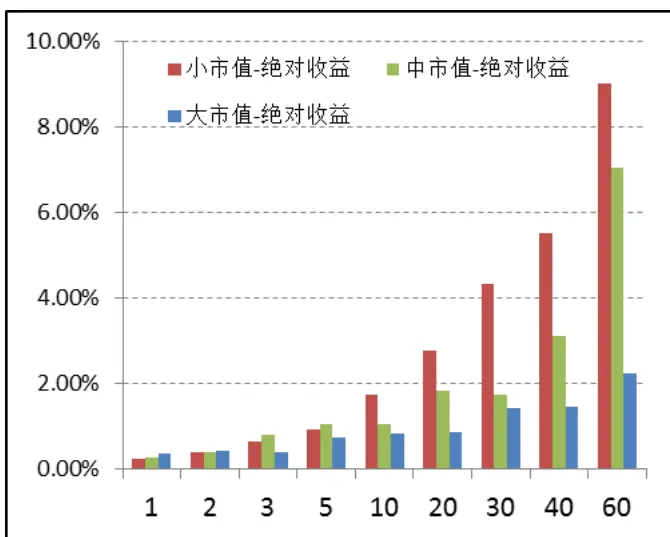

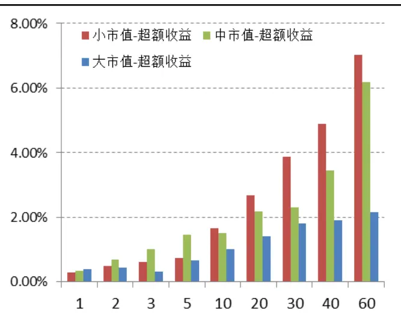
注：按照公司流通市值规模分为三组：小市值（流通市值规模小于 50亿），中市值（50-100亿），大市值（大于 100亿）
数据来源：广发证券研究发展中心

最后，我们将股票按照所属行业进行分类形成股票组合，行业分类标准为证监会行业分类。实证结果表明：

从短期策略来看，L13（综合类）的股票组合表现最好，高管增持公告后持有该股票组合5日可获得约5%的平均绝对收益及4%左右的平均超额收益。

中长期策略来看，L1（农、林、牧、渔）、L2（采掘业）、L5（建筑行业）、L10（房地产）、L13（综合类）等行业具有较高的绝对收益和超额收益。

图 7：高管增持事件驱动效应绝对收益表现—按行业分类
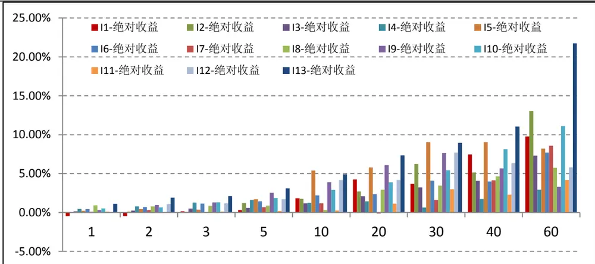
注：行业分类分别为：L1（农、林、牧、渔），L2（采掘业）,L3（制造业）,L4（公用事业）,L5（建筑行业）,L6（交运仓储）,L7（信息技术）,L8（商业贸易）,L9（金融服务）,L10（房地产）,L11（社会服务）,L12（文化传播）,L13（综合类）
数据来源：广发证券研究发展中心

图 8：高管增持事件驱动效应超额收益表现—按行业分类
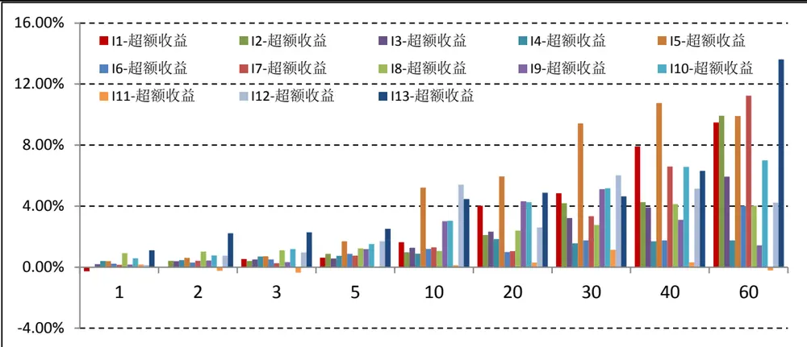
注：行业分类分别为：L1（农、林、牧、渔），L2（采掘业）,L3（制造业）,L4（公用事业）,L5（建筑行业）,L6（交运仓储）,L7（信息技术）,L8（商业贸易）,L9（金融服务）,L10（房地产）,L11（社会服务）,L12（文化传播）,L13（综合类）
数据来源：广发证券研究发展中心

## （五）简要结论

本文对高管增持事件的事件驱动效应进行了量化实证研究，初步研究结果表明，高管增持事件驱动策略均能获得较高的显著收益：

按照市场走势分组：该策略在牛市中能够获得显著的绝对收益，熊市中能够获得显著的超额收益，震荡市中能获得显著长期超额收益。

按照增持力度分组：该策略在增持比例为0%-0.5%的样本组中能够获得较高的绝对

收益和超额收益。

按照增持及时性分组：高管增持公告发布越及时，策略的收益越高。

按照公司规模分组：该策略在中小市值组中的绝对收益及超额收益最高。

按照公司所属行业分组：综合类样本组合的短期持有策略表现最好；L1（农、林、牧、渔）、L5（建筑行业）、L10（房地产）、L13（综合类）等行业的样本组合在中长期策略中具有较高的绝对收益和超额收益。

## 三、高管增持事件驱动策略

## （一）高管增持事件驱动策略设臵

根据前面的实证分析结果，我们设定如下参与高管增持事件的投资策略，并对投资策略的收益进行综合评价。

- 事件点：上市公司高管增持公告

- 买卖规则：

- 买入：在高管增持事件公告日后第一个交易日，以当日均价买入股票，等权重配臵。在总投资期到期前 T 日不进行买入操作，以便在投资期结束将全部股票卖出。

- 卖出：持有T日，以当日收盘价卖出股票。

同时，为了更合理地设臵投资策略，我们对投资策略的仓位设臵和事件股票持有期进行了具体的分析和说明：

## 1）仓位设臵：

为保证最大限度地参与高管增持公告股票，提高投资收益，应当有效地设臵持有期内的仓位和资金。我们以一周5个交易日为周期，对历史样本中的高管增持公告数目统计，结果显示5个交易日平均有14个左右的高管增持公告。在具体的策略中，若对每只事件股票进行等权重配臵资金，则每只股票的可支配资金约为7.14%。

## 2）高管增持公告股票持有期设臵：

由于交易成本的存在，需要对事件股票的持有期进行合理设定。假若交易较为频繁，交易成本可能大于策略收益，则导致策略失败。我们对策略持有期收益进行粗略分析：

表 5：不同持有期的高管增持策略交易成本估算

|  | 持有期 |  |  |  |  |  |  |  |  |
| --- | --- | --- | --- | --- | --- | --- | --- | --- | --- |
|  | 1 | 2 | 3 | 5 | 10 | 20 | 30 | 40 | 60 |
| 交易成本 | 62.40% | 31.20% | 20.80% | 12.48% | 6.24% | 3.12% | 2.08% | 1.56% | 1.04% |

数据来源：广发证券研究发展中心

设单边交易成本为1.3‰，上表显示了参与所有事件的策略总交易成本，可以看到，在事件股票持有期较短时，由于交易较为频繁，导致总交易成本较大，策略的收益将被交易成本所大幅度吞蚀，当持有期收益波动较大时，亏损也将进一步放大。因此，我们建议事件股票的持有期不宜过短。

根据以上策略设臵，若从2012年1月开始进行高管增持事件驱动策略投资，总投资期为1年，事件股票持有期为5日，等权重配臵资金，则在2012年的前5个交易日逐步建仓，每只事件股票的可支配资金为1/14(约7.14%)，第6个交易日开始卖出第1个交易日的股票并进行再次买入操作，如此进行滚动投资，直至2012年的最后5个交易日不进行买入操作，逐步卖出持有满5日的股票，在2012年最后一个交易日达到清仓并计算年收益。

## （二）高管增持事件驱动策略历史回测结果

我们以07年至11年底的数据为策略测试区间，按照上述规则进行滚动投资策略测试，设臵每月月初为策略周期起始时间，持有期为1年，则从07年1月开始共包括49个滚动策略周期。为了检验事件股票持有期对策略的影响，我们对持有期1-60日的滚动策略均进行了测试，统计结果如表7所示。

可以看到，与我们前面的估算分析较为一致的是，持有期小于5日的滚动策略由于交易成本较高导致收益率较低；而持有期为5、10、20、30日的滚动策略平均收益较高；另外，对比持有期为5日和30日的滚动策略平均收益，我们可以发现，虽然5日、30日的滚动策略有相同的平均收益表现，但持有期为30日的滚动策略正收益比例较高，最大回撤较低。分析其原因，我们认为在持仓策略固定的情况下，持有期较短的滚动策略可以获得较高的参与率，但同时其可能面临的风险也越大。因此，建议投资者对高管增持事件进行中短期投资，同时结合具体风险和收益的偏好情况来选择相应的策略持有期。

表8列出了持有期为30日的每个滚动策略周期的收益及评价指标，在共计49个策略周期中有33个周期获得正绝对收益，而43个周期获得正超额收益，其中，大部分绝对收益为负的策略均可获得正的超额收益，即能够跑赢大盘。如07-08年熊市中进入市场的策略虽然绝对收益为负，但仍可获得20%-30%左右的超额收益，而08年底进入市场的策略则最高可获得73.37%的超额收益，对于2011年进入市场的策略则在沪深300指数下跌23.75%的情况下仍可获得8.88%的超额收益（图9）。

表 6：不同策略持有期下的滚动策略收益及风险评价

| 持有期 | 收益率 | 超额收益率 | 参与率 | 最大回撤(超额收益） | 正收益个数/总策略周期个数 | 正超额收益个数/总策略周期个数 |
| --- | --- | --- | --- | --- | --- | --- |
| 1 | 8.65% | 10.01% | 60.94% | -33.16% | 23/49 | 29/49 |
| 2 | 18.80% | 20.16% | 70.22% | -26.46% | 31/49 | 32/49 |
| 3 | 15.67% | 17.03% | 72.49% | -24.25% | 26/49 | 35/49 |
| 5 | 16.67% | 18.03% | 75.90% | -21.25% | 27/49 | 38/49 |
| 10 | 15.75% | 17.11% | 76.72% | -18.80% | 27/49 | 35/49 |
| 20 | 14.61% | 15.96% | 75.57% | -18.23% | 31/49 | 40/49 |
| 30 | 16.67% | 18.03% | 74.06% | -18.23% | 33/49 | 43/49 |
| 40 | 12.26% | 13.62% | 71.84% | -20.04% | 34/49 | 40/49 |
| 60 | 13.52% | 14.88% | 66.25% | -20.20% | 33/49 | 39/49 |

数据来源：广发证券研究发展中心

图 9：2011 年策略净值表现
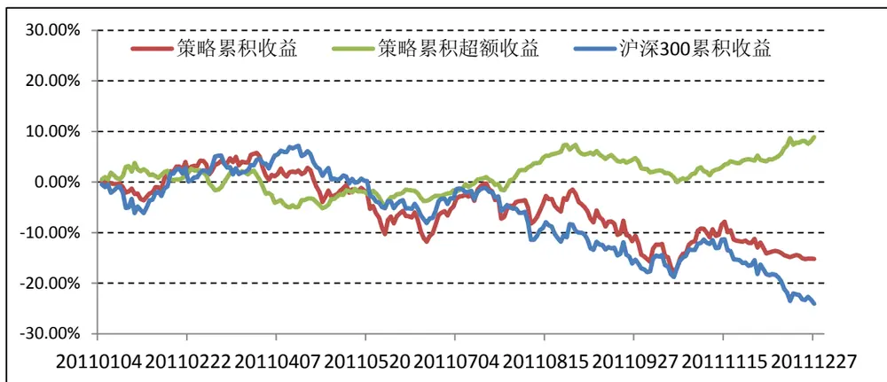
数据来源：广发证券研究发展中心

表 7：滚动策略年化绝对收益及超额收益（基准为沪深300）

| 起始日 | 绝对收益 | 超额收益 | 参与率 | 最大回撤(超额收益） | 起始日 | 绝对收益 | 超额收益 | 参与率 | 最大回撤(超额收益） |
| --- | --- | --- | --- | --- | --- | --- | --- | --- | --- |
| 200701 | 41.27% | -54.22% | 82.43% | -57.18% | 200907 | 14.70% | 29.84% | 77.59% | -9.67% |
| 200702 | 45.81% | -12.85% | 78.58% | -56.37% | 200908 | 13.32% | 37.26% | 75.21% | -10.42% |
| 200703 | 38.56% | -11.32% | 77.39% | -55.55% | 200909 | 24.64% | 27.63% | 82.79% | -10.64% |
| 200704 | 19.59% | 8.70% | 74.96% | -48.92% | 200910 | 14.53% | 23.32% | 77.45% | -8.75% |
| 200705 | -4.40% | 5.53% | 71.64% | -36.93% | 200911 | 9.97% | 13.14% | 75.09% | -12.64% |
| 200706 | -0.02% | 13.17% | 76.55% | -36.74% | 200912 | 12.25% | 23.66% | 69.62% | -10.70% |
| 200707 | 2.24% | 29.17% | 83.36% | -32.29% | 201001 | 15.07% | 30.00% | 72.10% | -10.68% |
| 200708 | -24.69% | 7.64% | 79.25% | -33.75% | 201002 | 11.38% | 17.79% | 72.96% | -11.58% |
| 200709 | -33.20% | 22.63% | 81.12% | -20.62% | 201003 | 6.21% | 12.99% | 72.07% | -11.12% |
| 200710 | -29.77% | 31.29% | 74.71% | -9.14% | 201004 | 9.41% | 15.50% | 70.90% | -10.95% |
| 200711 | -35.91% | 34.95% | 74.58% | -10.62% | 201005 | 16.51% | 13.09% | 76.08% | -11.97% |
| 200712 | -48.01% | 13.01% | 62.04% | -11.14% | 201006 | 10.94% | 4.11% | 73.88% | -12.94% |
| 200801 | -35.52% | 29.13% | 63.33% | -9.97% | 201007 | 9.45% | -6.79% | 80.30% | -13.98% |
| 200802 | -27.66% | 24.65% | 62.03% | -8.13% | 201008 | -1.34% | -2.70% | 75.30% | -13.83% |
| 200803 | -9.35% | 40.93% | 55.57% | -9.49% | 201009 | -1.72% | 0.05% | 74.15% | -13.69% |
| 200804 | 2.96% | 32.02% | 59.19% | -9.51% | 201010 | -6.20% | 6.42% | 71.64% | -10.04% |
| 200805 | 12.50% | 48.55% | 58.48% | -9.47% | 201011 | -14.82% | 6.27% | 71.02% | -8.06% |
| 200806 | 35.77% | 60.94% | 64.60% | -12.19% | 201012 | -13.98% | 1.10% | 69.80% | -9.35% |
| 200807 | 34.94% | 24.63% | 60.03% | -12.27% | 201101 | -15.18% | 8.88% | 74.10% | -8.77% |
| 200808 | 62.33% | 39.61% | 66.05% | -14.20% |  |  |  |  |  |
| 200809 | 70.91% | 43.28% | 70.60% | -15.10% |  |  |  |  |  |
| 200810 | 106.67% | 73.37% | 78.62% | -16.13% |  |  |  |  |  |

识别风险，发现价值

| 200811 | 93.78% | 17.52% | 81.58% | -23.86% |
| --- | --- | --- | --- | --- |
| 200812 | 76.30% | 2.64% | 80.64% | -20.22% |
| 200901 | 70.51% | 0.96% | 78.30% | -25.48% |
| 200902 | 60.67% | -0.73% | 78.87% | -23.88% |
| 200903 | 50.59% | 8.11% | 86.41% | -25.22% |
| 200904 | 43.35% | 17.97% | 87.16% | -16.67% |
| 200905 | 43.29% | 27.29% | 88.38% | -12.06% |
| 200906 | 38.15% | 43.21% | 80.60% | -10.40% |

数据来源：广发证券研究发展中心
注：红色标注的为负收益，最大回撤按照超额收益进行计算，基准为沪深300指数。

## 四、投资建议

建议关注发布高管增持公告的上市公司，并进行中短期（5-30日）滚动投资，样本股可以重点考虑投资如下发布高管增持公告的公司：

a) 中小市值公司

b) 增持比例不低于 0.05%

c) 增持公告滞后时间不超过60 日

d) 综合、地产、农林牧渔等行业

## Table_A 广发金融工程研究小组uthorSummary

| 罗军，首席分析师，华南理工大学理学硕士，2010年进入广发证券发展研究中心。 |
| --- |
| 俞文冰，CFA，首席分析师，上海财经大学统计学硕士，2012年进入广发证券发展研究中心。 |
| 叶涛，CFA，上海交通大学管理科学与工程硕士，2012年进入广发证券发展研究中心。 |
| 安宁宁，资深分析师，暨南大学数量经济学硕士，2011年进入广发证券发展研究中心。 |
| 胡海涛，分析师，华南理工大学理学硕士，2010年进入广发证券发展研究中心。 |
| 夏潇阳，分析师，上海交通大学金融工程硕士，2012年进入广发证券发展研究中心。 |
| 蓝昭钦，分析师，中山大学理学硕士，2010年进入广发证券发展研究中心。 |
| 李明，分析师，伦敦城市大学卡斯商学院计量金融硕士，2010年进入广发证券发展研究中心。 |
| 史庆盛，分析师，华南理工大学金融工程硕士，2011年进入广发证券发展研究中心。 |
| 汪鑫，分析师，中国科学技术大学金融工程硕士，2012年进入广发证券发展研究中心。 |
| 谢琳，分析师，上海交通大学金融学博士研究生，2011年进入广发证券发展研究中心。 |
| 敬请关注广发证券金融工程的官方微博：http://weibo.com/gfquant |

## Table_Report 相关研究报告

|  | 广州市 | 深圳市 | 北京市 | 上海市 |
| --- | --- | --- | --- | --- |
| 地址 | 广州市天河北路183 号 大都会广场5楼 | 深圳市福田区民田路178 号华融大厦9楼 | 8 北京市西城区月坛北街2号 上海市浦东南路528号 |  |
| 邮政编码 | 510075 | 518026 | 月坛大厦18层 100045 | 上海证券大厦北塔17楼 200120 |
| 客服邮箱 | gfyf@gf.com.cn |  |  |  |
| 服务热线 | 020-87555888-8612 |  |  |  |

## 免责声明

le_Disclaimer广发证券股份有限公司具备证券投资咨询业务资格。本报告只发送给广发证券重点客户，不对外公开发布。

本报告所载资料的来源及观点的出处皆被广发证券股份有限公司认为可靠，但广发证券不对其准确性或完整性做出任何保证。报告内容仅供参考，报告中的信息或所表达观点不构成所涉证券买卖的出价或询价。广发证券不对因使用本报告的内容而引致的损失承担任何责任，除非法律法规有明确规定。客户不应以本报告取代其独立判断或仅根据本报告做出决策。

广发证券可发出其它与本报告所载信息不一致及有不同结论的报告。本报告反映研究人员的不同观点、见解及分析方法，并不代表广发证券或其附属机构的立场。报告所载资料、意见及推测仅反映研究人员于发出本报告当日的判断，可随时更改且不予通告。

本报告旨在发送给广发证券的特定客户及其它专业人士。未经广发证券事先书面许可，任何机构或个人不得以任何形式翻版、复制、刊登、转载和引用，否则由此造成的一切不良后果及法律责任由私自翻版、复制、刊登、转载和引用者承担。