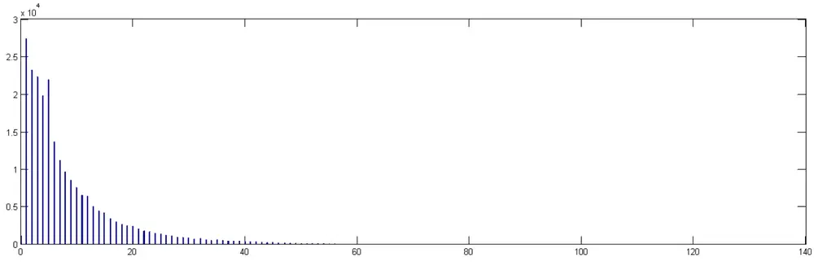
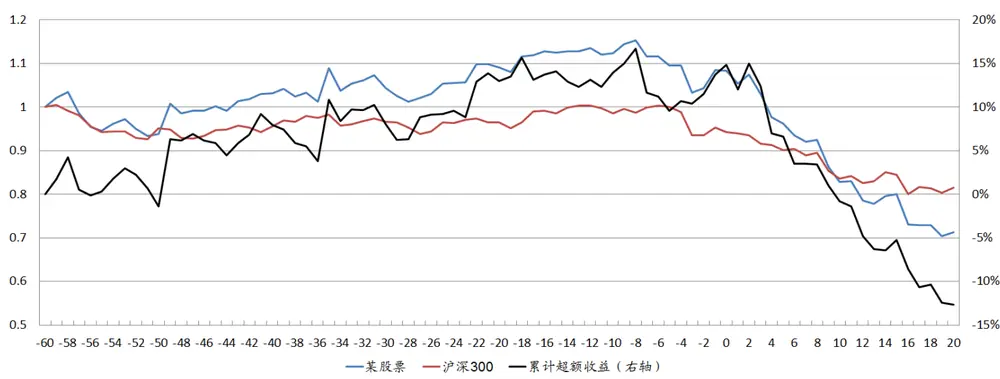
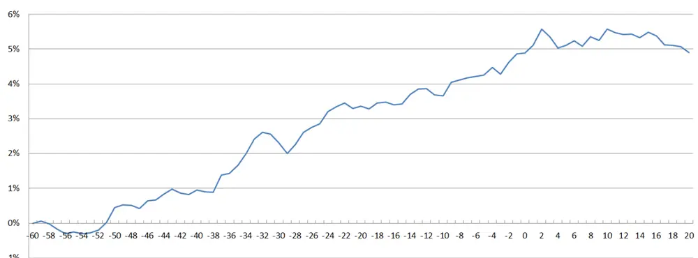
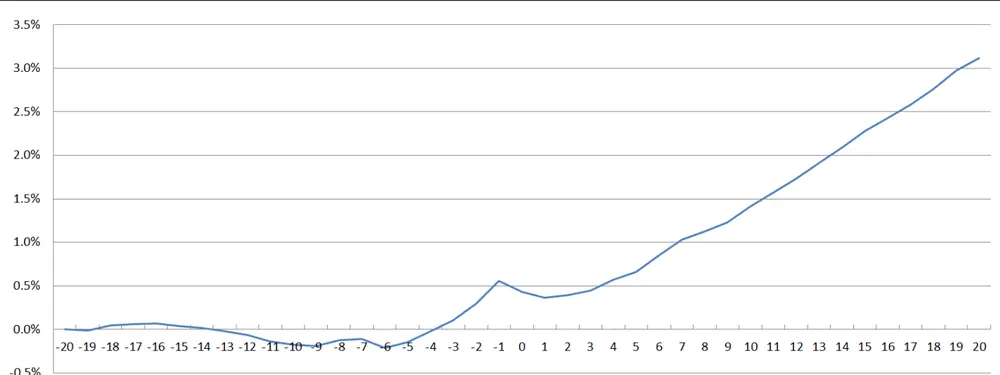
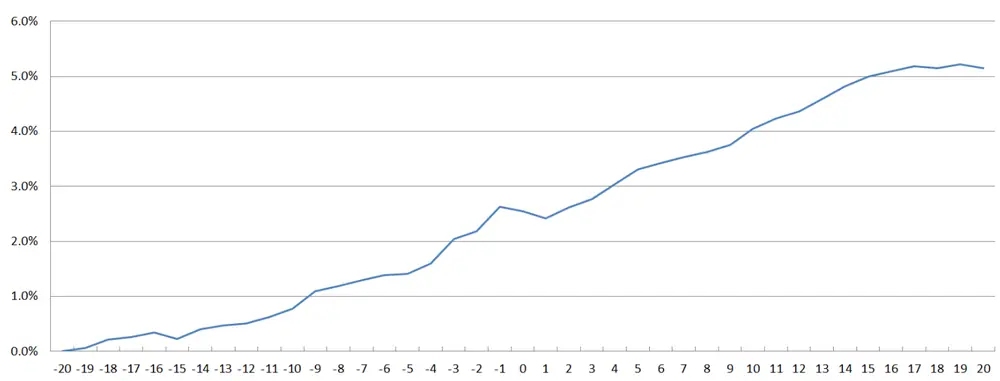
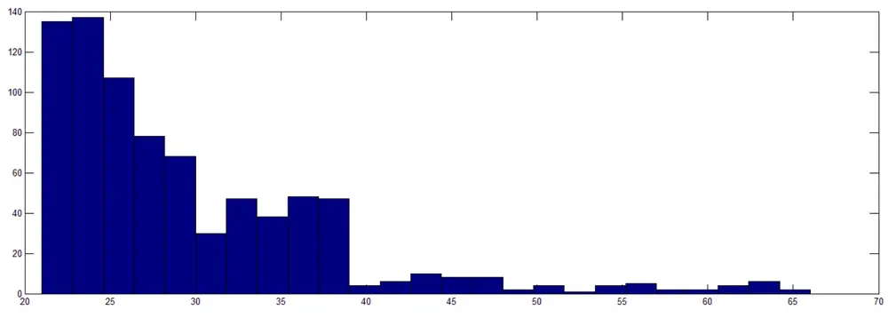
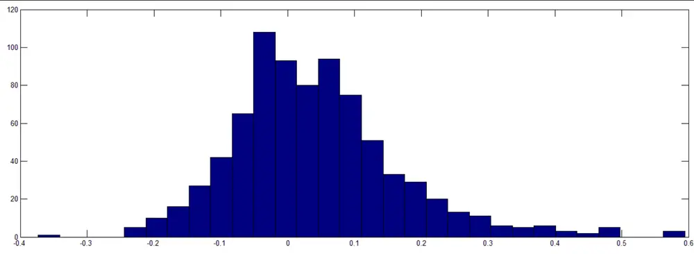
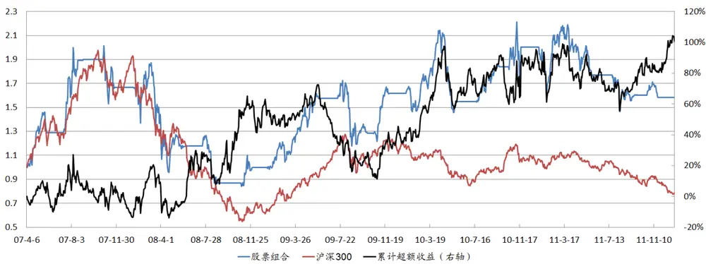
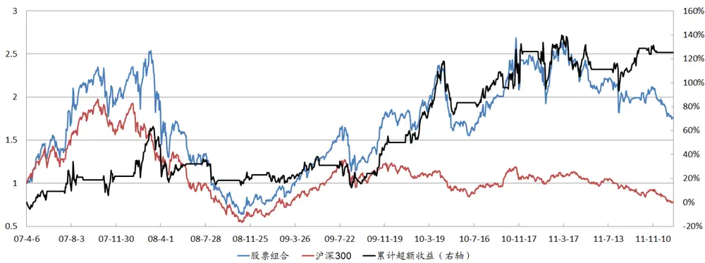

# 此时无声胜有声——长期不出公告股票的投资机会

## ——事件驱动策略量化研究系列专题之二

夏潇阳 分析师

电话：021-60750625

eMail: xxy2@gf.com.cn

执业编号：S0260512030005

## Table_Summary 此时无声胜有声

当一个上市公司频繁发布公告时，该公司的股票很难产生定价偏差，因此也很难产生超额收益；而当一个上市公司很长时间没有发布公告时，信息不对称，使得投资者无法对该公司股票的定价产生一致预期，此时容易产生定价偏差，从而带来超额收益或负超额收益。

我们称相邻的两个公告相差的交易天数为d，其中后一个公告的发布日期为T 日，我们发现，d 越大的股票，越容易在第二个公告日 T日前体现超额收益；而 d越小的股票，越容易在 T日后体现超额收益；d居中的股票，在T 日前和T 日后均能体现超额收益。

## 超额收益的实现

当我们观察到一个股票连续 60个交易日不出公告的时候，即 d>60时，我们买入此股票。而在卖出时点方面，我们将 d比较小和d 比较大的股票区别对待：当d<80 时，也就是买入后 20个交易日内出了公告，我们持有该股票到 T+20 日；当d≥80 时，也就是买入后 20个交易日内没有出公告，我们持有该股票到 T+2日。

从2007年至2011 年，共有803 个案例符合此策略，平均持有天数为29.58个交易日，如果剔除46只S和ST类股票，持有期间平均超额收益为 4.32%，超额收益中位数为 2.72%，超额收益胜率为 59.05%。此外，不同年份的超额收益都比较稳定，胜率均在 55%以上，其中表现较好的年份为2010 年。

## 构建股票组合

和其它的事件驱动选股策略一样，我们对其应用动态资金规划方法来构建股票组合。我们选取的目标函数要求尽量分散投资，以规避风险，并且要求资金的使用效率尽可能高。

当我们观察到一个股票连续55个交易日不出公告的时候，我们就准备买入该股票，共有 1287个案例符合此标准；如果该股票在56-60个交易日之间出公告，我们只能放弃此机会，共有 438 个案例符合此标准。如果该股票连续 60 个交易日不出公告，我们按之前的策略买入，共有 849 个案例符合此标准。

我们设定每只股票的预期买入日为上一个公告后的第 60个交易日，预期卖出日为第90个交易日，也就是说，预期持有日期为 30 个交易日。在买入时点上，如果买入日停牌，那么我们延后买入，如果复牌时间超过预期卖出日，那么我们放弃此机会；在卖出时点上，如果卖出日停牌，那么我们延后卖出，直到复牌。

该股票组合的累计超额收益为 100.75%，年化超额收益为20.04%，年化信息比率为59.91%。

由于该股票组合在一定时间内会空仓等待，我们可在其空仓的时候进行指数化投资，构建指数增强组合，指数增强组合的累计超额收益为125.35%，年化超额收益为20.52%，年化信息比率为75.84%。

## 一、此时无声胜有声

上市公司公告是上市公司公开信息的重要组成部分，而公开信息会很快被市场消化。当一个上市公司频繁发布公告时，该公司的股票很难产生定价偏差，因此也很难产生超额收益；而当一个上市公司很长时间没有发布公告时，信息不对称，使得投资者无法对该公司股票的定价产生一致预期，此时容易产生定价偏差，从而带来超额收益或负超额收益。

我们收集了2007年至今所有上市公司的公告，并计算每个股票所有公告相差的交易天数d，d的分布如图1所示：

图1：公告相差的交易天数d的分布图

数据来源：上海证券交易所、深圳证券交易所、广发证券发展研究中心

从图1可以看出，公告相差的交易天数d主要在20以下，占比为89.68%，d在40以上的比例为2.05%，d在60天以上的比例只有0.37%。因此，上市公司很长时间没有发布公告的情况并不多见。

我们以某股票为例，观察到该股票有一次长达122个交易日没有发布公告，我们称122个交易日后发布公告的那天为T日。我们发现，在T-60到T日之间，该股票已经提前体现了14.81%的超额收益，然而在T日到T+20日之间，该股票大幅跑输沪深300指数，其超额收益为-23.90%，如图2所示。这说明，在第二个公告前，由于该上市公司很长时间没有发布公告，信息不对称使得投资者对该股票产生了美好的预期，并随之产生超额收益。而第二个公告发布后，低于预期的公开信息使得该股票在公告发布后大幅跑输基准。接下来我们验证，这种现象是否普遍存在。

图2：某股票在T-60日到T+20日之间的超额收益

数据来源：Wind资讯、上海证券交易所、深圳证券交易所、广发证券发展研究中心

从2007年至2011年，公告相差的交易天数d的最大值是124，公告相差的交易天数d≥80的案例共有197例，这些股票从T-60日到T+20日之间的平均累计超额收益如图3所示：

图3：d≥80的股票在T-60日到T+20日之间的超额收益

数据来源：Wind资讯、上海证券交易所、深圳证券交易所、广发证券发展研究中心

从图3可以看出，d≥80的股票从T-60日到T日之间基本上能持续实现超额收益，而在T日到T+20日之间基本不存在超额收益，这验证了我们之前观察到的现象。由于市场不完全有效，超额收益能持续到T+2日。

另一方面，公告相差的交易天数d较小的股票，很难提前体现超额收益。我们统计

40≤d<60的股票在T-20日到T+20日之间的平均累计超额收益，如图4所示：

图4：40≤d<60的股票在T-20日到T+20日之间的超额收益

数据来源：Wind资讯、上海证券交易所、深圳证券交易所、广发证券发展研究中心

从图4可以看出，40≤d<60的股票从T-20日到T日之间基本上不存在超额收益，反而由于市场不完全有效，40≤d<60的股票在T日到T+20日之间持续存在超额收益。

接下来，我们统计60≤d<80的股票在T-20日到T+20日之间的平均累计超额收益，如图5所示：

图5：60≤d<80的股票在T-20日到T+20日之间的超额收益

数据来源：Wind资讯、上海证券交易所、深圳证券交易所、广发证券发展研究中心

从图5可以看出，60≤d<80的股票从T-20日到T日之间和从T日到T+20日之间均持

续存在超额收益。

因此，我们得到如下结论：公告相差的交易天数d越大的股票，越容易在第二个公告日T日前体现超额收益；而d越小的股票，越容易在T日后体现超额收益；d居中的股票，在T日前和T日后均能体现超额收益。

## 二、超额收益的实现

由于超额收益会在T日前提前体现，因此，需要提前买入。当我们观察到一个股票连续a个交易日不出公告的时候，我们就买入此股票，即我们要求d>a。根据前面的计算，我们设定a=60。

而在卖出时点方面，我们将d比较小和d比较大的股票区别对待。由于60≤d<80的股票从T-20日到T日之间和从T日到T+20日之间均持续存在超额收益，因此，当d<80时，也就是买入后20个交易日内出了公告，我们持有该股票到T+20日。

另一方面，d≥80的股票从T-60日到T日之间基本上能持续实现超额收益，而在T日到T+20日之间基本不存在超额收益。因此，当d≥80时，也就是买入后20个交易日内没有出公告，我们持有该股票到T日。进一步地，我们可以持有到T+2日。

从2007年至2011年，共有803个案例符合此策略，平均持有天数为29.58个交易日，持有期间平均超额收益为4.15%，超额收益中位数为2.59%，超额收益胜率为58.78%。持有天数和超额收益的分布如图6和图7所示：

图6：持有天数的分布

数据来源：Wind资讯、上海证券交易所、深圳证券交易所、广发证券发展研究中心

图7：超额收益的分布

数据来源：Wind资讯、广发证券发展研究中心

如果剔除46只S和ST类股票，持有期间平均超额收益为4.32%，超额收益中位数为2.72%，超额收益胜率为59.05%。分年超额收益的各项统计值如表1所示：

表1：分年超额收益的各项统计值

| 统计值 | 2007年 | 2008年 | 2009年 | 2010年 | 2011年 |
| --- | --- | --- | --- | --- | --- |
| 平均超额收益 | 7.82% | 2.71% | 4.16% | 5.62% | 3.51% |
| 平均超额收益（非S/ST） | 7.82% | 3.12% | 4.08% | 6.16% | 3.43% |
| 超额收益中位数 | 6.05% | 1.51% | 2.36% | 4.13% | 1.88% |
| 超额收益中位数（非S/ST） | 6.05% | 2.59% | 2.12% | 4.78% | 1.55% |
| 超额收益胜率 | 62.50% | 55.73% | 55.43% | 66.02% | 56.77% |
| 超额收益胜率（非S/ST） | 62.50% | 56.80% | 54.86% | 67.88% | 56.05% |
| 样本数量 | 16 | 131 | 184 | 206 | 266 |
| 样本数量（非S/ST） | 16 | 125 | 175 | 193 | 248 |

数据来源：Wind资讯、广发证券发展研究中心

从表1可以看出，不同年份的超额收益都比较稳定，胜率均在55%以上，其中表现较好的年份为2010年。

接下来我们持有天数的两个参数20和2做敏感性分析，如表2所示。可以看出，超额收益对持有天数不敏感，超额收益最高的持有天数组合为16和2，不过为了避免产生过度优化，我们依然选择20和2作为持有天数的参数。

表2：持有天数的敏感性分析

|  | 0 | 1 | 2 | 3 | 4 | 5 | 6 | 7 | 8 | 9 |
| --- | --- | --- | --- | --- | --- | --- | --- | --- | --- | --- |
| 15 | 4.15% | 4.23% | 4.35% | 4.26% | 4.16% | 4.17% | 4.19% | 4.13% | 4.19% | 4.16% |
| 16 | 4.21% | 4.29% | 4.41% | 4.32% | 4.22% | 4.23% | 4.25% | 4.19% | 4.25% | 4.22% |
| 17 | 4.20% | 4.28% | 4.41% | 4.31% | 4.21% | 4.23% | 4.24% | 4.19% | 4.25% | 4.21% |
| 18 | 4.15% | 4.24% | 4.36% | 4.26% | 4.16% | 4.18% | 4.19% | 4.14% | 4.20% | 4.16% |
| 19 | 4.20% | 4.28% | 4.40% | 4.31% | 4.21% | 4.22% | 4.24% | 4.18% | 4.24% | 4.21% |
| 20 | 4.11% | 4.20% | 4.32% | 4.22% | 4.13% | 4.14% | 4.15% | 4.10% | 4.16% | 4.12% |
| 21 | 4.07% | 4.15% | 4.27% | 4.17% | 4.08% | 4.09% | 4.11% | 4.05% | 4.11% | 4.08% |
| 22 | 4.03% | 4.12% | 4.24% | 4.14% | 4.04% | 4.06% | 4.07% | 4.02% | 4.08% | 4.04% |

数据来源：Wind资讯、广发证券发展研究中心

## 三、构建股票组合

和其它的事件驱动选股策略一样，我们对其应用动态资金规划方法来构建股票组合。我们选取的目标函数要求尽量分散投资，以规避风险，并且要求资金的使用效率尽可能高。

由于动态资金规划方法需要一定的提前预判，我们观察到一个股票连续55个交易日不出公告的时候，我们就准备买入该股票，共有1287个案例符合此标准。

如果该股票在56-60个交易日之间出公告，我们只能放弃此机会，共有438个案例符合此标准。如果该股票连续60个交易日不出公告，我们按之前的策略买入，共有849个案例符合此标准。

我们设定每只股票的预期买入日为上一个公告后的第60个交易日，预期卖出日为第90个交易日，也就是说，预期持有日期为30个交易日。

在买入时点上，如果买入日停牌，那么我们延后买入，如果复牌时间超过预期卖出日，那么我们放弃此机会。

在卖出时点上，如果卖出日停牌，那么我们延后卖出，直到复牌。

应用动态资金规划方法的组合表现如图8所示：

图8：应用动态资金规划方法后的股票组合表现

数据来源：Wind资讯、广发证券发展研究中心

该股票组合的累计超额收益为100.75%，年化超额收益为20.04%，年化信息比率为59.91%。

由于该股票组合在一定时间内会空仓等待，我们可在其空仓的时候进行指数化投资，构建指数增强组合，其表现如图9所示：

图9：指数增强组合的表现

数据来源：Wind资讯、广发证券发展研究中心

指数增强组合的累计超额收益为125.35%，年化超额收益为20.52%，年化信息比率为75.84%。

## Table_A 广发金融工程研究小组uthorSummary

罗军，首席分析师，华南理工大学理学硕士，2010年进入广发证券发展研究中心。

俞文冰，首席分析师，CFA，上海财经大学统计学硕士，2012年进入广发证券发展研究中心。

叶涛，资深分析师，CFA，上海交通大学管理科学与工程硕士，2012年进入广发证券发展研究中心。

安宁宁，资深分析师，暨南大学数量经济学硕士，2011年进入广发证券发展研究中心。

胡海涛，分析师，华南理工大学理学硕士，2010年进入广发证券发展研究中心。

夏潇阳，分析师，上海交通大学金融工程硕士，2012年进入广发证券发展研究中心。

蓝昭钦，研究助理，中山大学理学硕士，2010年进入广发证券发展研究中心。

李明，研究助理，伦敦城市大学卡斯商学院计量金融硕士，2010年进入广发证券发展研究中心。

史庆盛，研究助理，华南理工大学金融工程硕士，2011年进入广发证券发展研究中心。

汪鑫，研究助理，中国科学技术大学金融工程硕士，2012年进入广发证券发展研究中心。

谢琳，研究助理，上海交通大学金融学博士研究生，2011年进入广发证券发展研究中心。

## Table_Report 相关研究报告

高管增持事件驱动策略量化研究：——事件驱动策略量化研究系列专题之一

|  | 广州市 | 深圳市 | 北京市 | 上海市 |
| --- | --- | --- | --- | --- |
| 地址 | 广州市天河北路 183 号 大都会广场5楼 | 深圳市福田区民田路178 | 3 北京市西城区月坛北街2号 上海市浦东南路 528 号 |  |
| 邮政编码 | 510075 | 号华融大厦9楼 518026 | 月坛大厦18层 100045 | 上海证券大厦北塔17楼 200120 |
| 客服邮箱 | gfyf@gf.com.cn |  |  |  |
| 服务热线 | 020-87555888-8612 |  |  |  |

## 免责声明

le_Disclaimer广发证券股份有限公司具备证券投资咨询业务资格。本报告只发送给广发证券重点客户，不对外公开发布。

本报告所载资料的来源及观点的出处皆被广发证券股份有限公司认为可靠，但广发证券不对其准确性或完整性做出任何保证。报告内容仅供参考，报告中的信息或所表达观点不构成所涉证券买卖的出价或询价。广发证券不对因使用本报告的内容而引致的损失承担任何责任，除非法律法规有明确规定。客户不应以本报告取代其独立判断或仅根据本报告做出决策。

广发证券可发出其它与本报告所载信息不一致及有不同结论的报告。本报告反映研究人员的不同观点、见解及分析方法，并不代表广发证券或其附属机构的立场。报告所载资料、意见及推测仅反映研究人员于发出本报告当日的判断，可随时更改且不予通告。

本报告旨在发送给广发证券的特定客户及其它专业人士。未经广发证券事先书面许可，任何机构或个人不得以任何形式翻版、复制、刊登、转载和引用，否则由此造成的一切不良后果及法律责任由私自翻版、复制、刊登、转载和引用者承担。