# 事件驱动的负 Alpha选股策略

## ——事件驱动策略量化研究系列专题之三

夏潇阳 分析师

电话：021-60750625

eMail: xxy2@gf.com.cn

执业编号：S0260512030005

## Table_Summary 从正 Alpha 到负 Alpha

随着融资融券的推出，事件驱动的负 Alpha 策略也逐渐进入投资者的眼球，如果一个股票在考虑融券成本后，依然存在负超额收益，那么就能通过融券实现正收益。

## 高送转股票的负超额收益

近年来，高送转股票的超额收益往往会提前体现，在送转股实施后，高送转股票往往体现负超额收益。高送转股票策略的起始日期可以设定为股权登记日的收盘价，持有日期建议为 3个交易日，高送转的标准，我们设定为送转比例大于等于 0.4。

一般来说，下跌市场更容易产生负超额收益，因此，我们可以对策略做进一步改进。由于该策略的持续时间仅有3 个交易日，因此我们仅考虑股权登记日沪深 300指数的涨跌。2011 年以来沪深300指数下跌时的案例共有18次，其中超额收益小于-1%的共有 12 次，2012年以来的5次高送转股票实施均存在负超额收益。

## 公开增发股票的负超额收益

公开增发的负超额收益首先体现在预案公告后的一段时间。公开增发预案公告策略的起始日期为公告日的开盘价，持有日期建议为8 个交易日。2010年以来的所有案例共有 11次，其中超额收益小于-1%的共有6次，2012年以来的2 次公开增发股票预案公告后均存在负超额收益。

公开增发股票在增发股份上市后一段时间内也存在负超额收益。公开增发上市策略的起始日期为上市前一个交易日的收盘价，持有日期建议为7 个交易日。2010年以来的所有案例共有 10次，其中超额收益小于-1%的共有8次，2012年以来的2 次公开增发股票上市后均存在负超额收益。

## 限售股解禁前的负超额收益

由于投资者担心解禁后，限售股的持有人会在二级市场抛售股票，因而限售股解禁前往往存在负超额收益，在众多限售股类型中，首发原股东限售股份在解禁前一段时间的负超额收益比较明显。

首发原股东限售股份解禁策略的起始日期为解禁前7 个交易日的收盘价，持有日期建议持有到解禁前1个交易日的收盘价。2011 年下半年以来的所有案例共有 11次，其中超额收益小于-1%的共有9次，2012 年以来的3次公开增发股票上市后均存在负超额收益。

## 实际投资效果

最后，我们看一下各个策略的实际投资效果。我们假设股票双向交易成本为0.5%，不考虑杠杆，最终实现收益率的计算公式为- $\cdot(\boldsymbol{\Gamma}_{\mathrm{s}}{-}\boldsymbol{\Gamma}_{\mathrm{i}}{+}\boldsymbol{\mathrm{c}}{+}\boldsymbol{0}.5)/2$ 。我们对未来能看到的所有机会平均投资，时间范围从2011 年至今。

高送转策略共持续了 67个自然日，收益率 11.05%，年化收益 59.37%；公开增发预案策略共持续了 74个自然日，收益率5.54%，年化收益26.97%；公开增发上市策略共持续了60个自然日，收益率6.78%，年化收益40.68%；限售股解禁策略共持续了161个自然日，收益率8.84%，年化收益 19.78%。

我们还可以把不同策略结合起来操作，例如我们将高送转策略和公开增发上市策略结合，结合后的策略共持续了122 个自然日，收益率 16.90%，年化收益 49.87%

## 一、从正Alpha到负Alpha

近几年，事件驱动选股策略越来越受到市场的关注，然而随着融资融券的推出，事件驱动的负Alpha策略也逐渐进入投资者的眼球。那么，负Alpha也能实现正收益么？

假设不考虑杠杆，把资金分成两份，一份资金融券卖出股票，并以1+r 的价格买入，（r 为股票收益率），收益为-r ，此外，假设融券成本为c。另一份资金买入股指期货或沪深300指数ETF等工具进行多头套保，并以1+r的价格卖出（r为沪深300指数收益率），收益为r，最终的收益率为 $-(r_{s}-r_{i}+c)/2$ ，如图1所示。

图1：负Alpha也能实现正收益
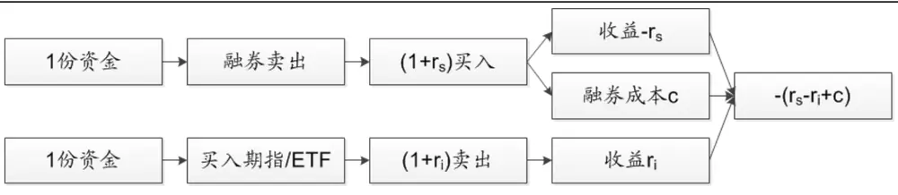
数据来源：广发证券发展研究中心

可以看出，如果一个股票在考虑融券成本后，依然存在负超额收益，即r -r+c<0，那么就能通过融券实现正收益，那么融券成本c对收益的影响有多大呢？

融券费率的计算公式为c=rt/360，其中r为融券利率，我们假设为9.1%，t为融券卖出的天数，用自然日计算。从图2可以看出，融券利率r对融券费率c的影响并不大，但融券卖出的天数对融券费率c影响很大。持有7个自然日和14个自然日的融券费率分别为0.18%和0.35%，但持有30个自然日和60个自然日的融券费率高达0.71%和1.42%。

图2：融券费率的敏感性分析
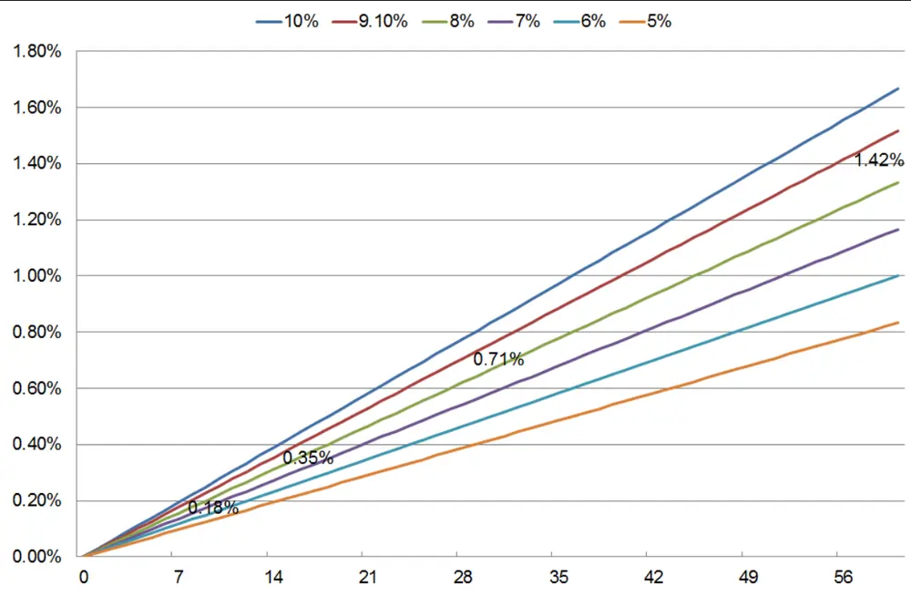
数据来源：广发证券发展研究中心

因此，我们建议在做事件驱动的负Alpha策略时，持续时间不超过10个交易日，此外，负Alpha的股票也必须在融券标的中选取。而负Alpha的事件驱动因子，可以从传统的事件驱动因子中去寻找，比如高送转、增发和解禁等。下文中，我们将逐一分析。

## 二、高送转股票的负超额收益

高送转历来是游资炒作的题材之一，近年来，高送转股票的超额收益往往会提前体现，在送转股实施后，高送转股票往往体现负超额收益。

例如美都控股（600175.SH）每10股转增12股，股权登记日为2010年4月28日。股权登记日收盘价到2010年5月4日收盘价之间的超额收益为-14.1%，6个自然日的融券费率为0.15%，考虑融券费率后的超额收益为-13.95%。如图3所示：

图3：美都控股高送转实施以后的负超额收益
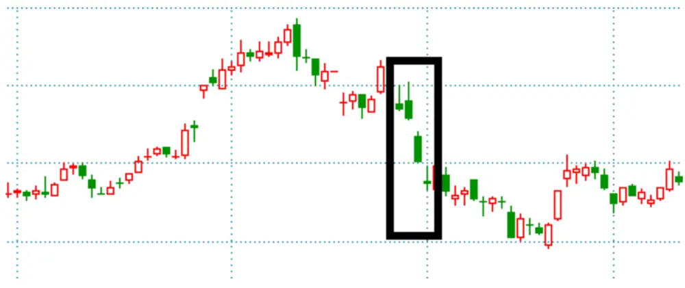
数据来源：Wind资讯、广发证券发展研究中心

由于股权登记日会提前公布，因此高送转股票策略的起始日期可以设定为股权登记日的收盘价，持有日期建议为3个交易日，高送转的标准，我们设定为送转比例大于等于0.4。

剔除停牌和跌停的案例后，2006年至2011年，属于融券标的送转股共有346只，其中送转比例大于等于0.4的股票共217只，送转比例小于0.4的股票共129只，两类股票的超额收益、胜率和t统计量均差异明显，如表1所示：

表1：高送转股票和低送转股票的差异

| 类型 | 超额收益（考虑融券成本） | 胜率 | t统计量 | 样本数 |
| --- | --- | --- | --- | --- |
| 送转比例大于等于0.4 | -1.92% | 67.28% | -4.6292 | 217 |
| 送转比例小于0.4 | 0.15% | 57.36% | 0.2937 | 129 |

数据来源：Wind资讯、广发证券发展研究中心

图4：高送转股票实施后的超额收益分布图
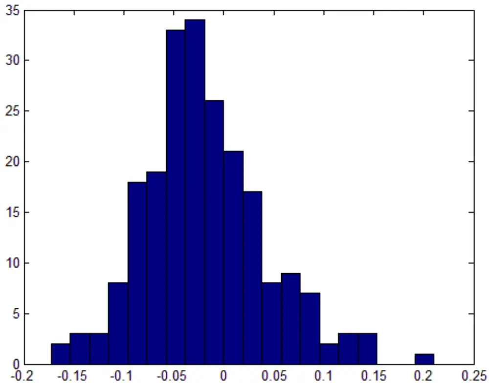
数据来源：Wind资讯、广发证券发展研究中心

表2：高送转股票实施后的分年超额收益

| 年份 | 超额收益（考虑融券成本） | 胜率 | 样本数 |
| --- | --- | --- | --- |
| 2006年 | -1.81% | 71.43% | 14 |
| 2007年 | -1.65% | 67.86% | 28 |
| 2008年 | -3.01% | 69.84% | 63 |
| 2009年 | -2.81% | 78.13% | 32 |
| 2010年 | -0.60% | 56.52% | 46 |
| 2011年 | -1.24% | 65.71% | 35 |
| 2009年-2011年 | -1.42% | 65.49% | 113 |
| 总计 | -1.92% | 67.28% | 217 |

数据来源：Wind资讯、广发证券发展研究中心

可以看出，该策略在2008和2009年表现最好，2010表现略差，2011年该策略依然实现了-1.24%的平均超额收益，胜率为65.71%。

一般来说，下跌市场更容易产生负超额收益，因此，我们可以对策略做进一步改进。由于该策略的持续时间仅有3个交易日，因此我们仅考虑股权登记日沪深300指数的涨跌。

217次高送转案例中，当日沪深300指数下跌的共102次，当日沪深300指数上涨的

共115次，两类股票的超额收益、胜率和t统计量依然存在差异，如表3所示：

表3：沪深300指数下跌和上涨时高送转股票的超额收益差异

| 类型 | 超额收益（考虑融券成本） | 胜率 | t统计量 | 样本数 |
| --- | --- | --- | --- | --- |
| 当日沪深300下跌 | -3.14% | 73.53% | -5.4321 | 102 |
| 当日沪深300上涨 | -0.85% | 61.74% | -1.4786 | 115 |
| 所有高送转 | -1.92% | 67.28% | -4.6292 | 217 |

数据来源：Wind资讯、广发证券发展研究中心

沪深300指数下跌时，高送转股票实施后的超额收益分布图和分年超额收益如图5和表4所示：

图5：沪深300指数下跌时高送转股票实施后的超额收益分布图
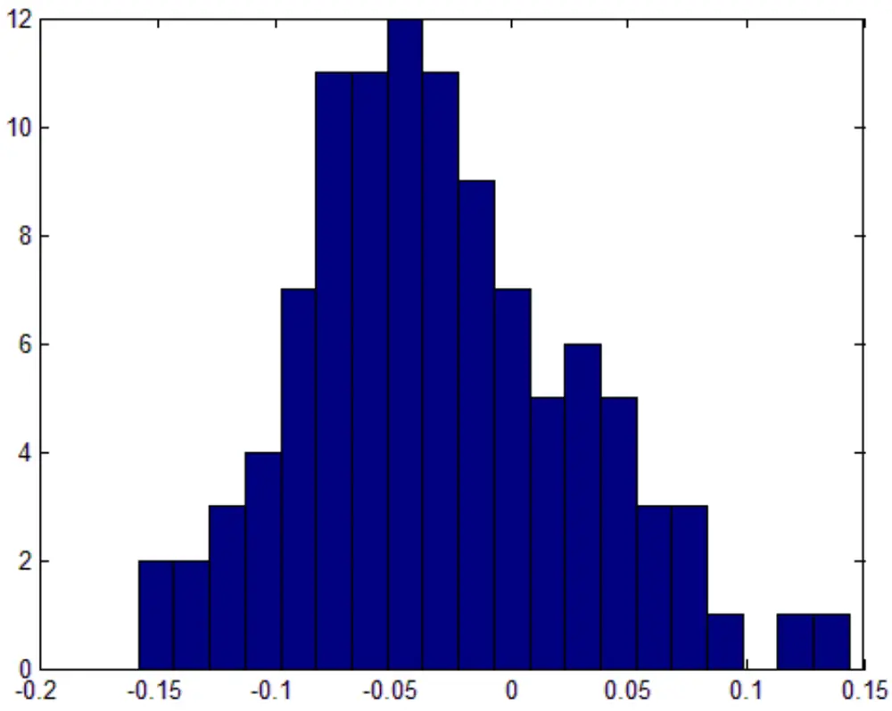
数据来源：Wind资讯、广发证券发展研究中心

表4：沪深300指数下跌时高送转股票实施后的分年超额收益

| 年份 | 超额收益（考虑融券成本） | 胜率 | 样本数 |
| --- | --- | --- | --- |
| 2006年 | -2.55% | 75.00% | 8 |
| 2007年 | -4.42% | 85.71% | 7 |
| 2008年 | -3.67% | 72.22% | 36 |
| 2009年 | -4.08% | 84.62% | 13 |
| 2010年 | -2.34% | 64.00% | 25 |
| 2011年 | -1.92% | 76.92% | 13 |
| 2009年-2011年 | -2.68% | 72.55% | 51 |
| 总计 | -3.14% | 73.53% | 102 |

数据来源：Wind资讯、广发证券发展研究中心

2011年以来沪深300指数下跌时的案例共有18次，其中超额收益小于-1%的共有12次，2012年以来的5次高送转股票实施均存在负超额收益，如表5所示：

表5：2011年以来沪深300指数下跌时的高送转案例

| 股票代码 | 股票名称 | 送转股比例 | 起始日期 | 结束日期 | 超额收益 |
| --- | --- | --- | --- | --- | --- |
| 000425 | 徐工机械 | 1 | 2011-3-15 | 2011-3-18 | -3.84% |
| 600406 | 国电南瑞 | 1 | 2011-3-24 | 2011-3-29 | -3.37% |
| 600256 | 广汇股份 | 0.5 | 2011-3-29 | 2011-4-1 | -5.96% |
| 002081 | 金螳螂 | 0.5 | 2011-3-30 | 2011-4-6 | -10.60% |
| 601166 | 兴业银行 | 0.8 | 2011-5-5 | 2011-5-10 | -2.37% |
| 600111 | 包钢稀土 | 0.5 | 2011-5-11 | 2011-5-16 | -0.98% |
| 002304 | 洋河股份 | 1 | 2011-5-12 | 2011-5-17 | -0.30% |
| 000528 | 柳工 | 0.5 | 2011-5-26 | 2011-5-31 | -3.75% |
| 000933 | 神火股份 | 0.6 | 2011-5-26 | 2011-5-31 | 0.99% |
| 600585 | 海螺水泥 | 0.5 | 2011-6-15 | 2011-6-20 | 5.62% |
| 600252 | 中恒集团 | 1 | 2011-6-22 | 2011-6-27 | 2.78% |
| 000625 | 长安汽车 | 0.8 | 2011-7-6 | 2011-7-11 | -2.95% |
| 601989 | 中国重工 | 0.6 | 2011-10-31 | 2011-11-3 | -0.25% |
| 601717 | 郑煤机 | 1 | 2012-3-12 | 2012-3-15 | -1.38% |
| 000061 | 农产品 | 0.8 | 2012-5-9 | 2012-5-14 | -1.73% |
| 600160 | 巨化股份 | 0.6 | 2012-5-18 | 2012-5-23 | -6.49% |
| 000422 | 湖北宜化 | 0.4327 | 2012-5-30 | 2012-6-4 | -2.95% |
| 600123 | 兰花科创 | 1 | 2012-5-31 | 2012-6-5 | -5.37% |

数据来源：Wind资讯、广发证券发展研究中心

## 三、公开增发股票的负超额收益

## （一）公开增发股票预案公告后的负超额收益

相对来说，公开增发是一个偏利空的事件，公开增发的负超额收益首先体现在预案公告后的一段时间。

例如中海油服（601808.SH）2011年3月23日开盘前（即2011年3月22日晚间）发布公开增发预案公告，公告日开盘价到2011年4月6日收盘价之间的超额收益为-8.09%，14个自然日的融券费率为0.35%，考虑融券费率后的超额收益为-7.74%。如图6所示：

图6：中海油服公开增发预案公告以后的负超额收益
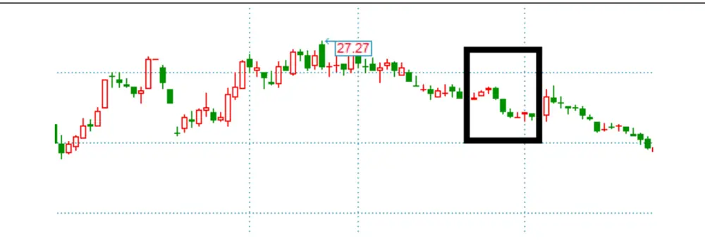
数据来源：Wind资讯、广发证券发展研究中心

公开增发预案公告策略的起始日期为公告日的开盘价，持有日期建议为8个交易日。剔除停牌和跌停的案例后，2006年至2011年，属于融券标的公开增发预案的股票共有51只，平均超额收益-4.43%，胜率80.39%，t统计量-5.1466。

公开增发股票预案公告后的超额收益分布图和分年超额收益如图7和表6所示：

图7：公开增发股票预案公告后的超额收益分布图
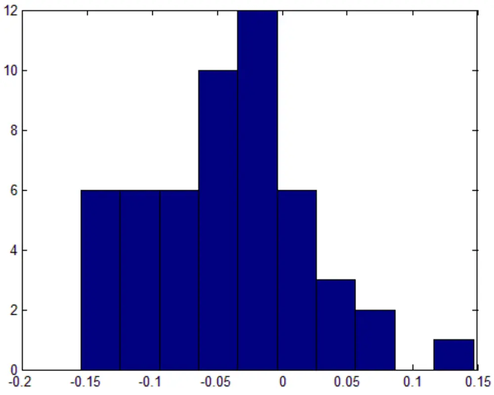
数据来源：Wind资讯、广发证券发展研究中心

表6：公开增发股票预案公告后的分年超额收益

| 年份 | 超额收益（考虑融券成本） | 胜率 | 样本数 |
| --- | --- | --- | --- |
| 2006年 | -6.42% | 100.00% | 2 |
| 2007年 | -5.32% | 80.95% | 21 |
| 2008年 | -4.86% | 81.82% | 11 |
| 2009年 | -4.51% | 87.50% | 8 |
| 2010年 | -0.70% | 75.00% | 4 |
| 2011年 | -1.77% | 60.00% | 5 |
| 2009年-2011年 | -2.81% | 76.47% | 17 |
| 总计 | -4.43% | 80.39% | 51 |

数据来源：Wind资讯、广发证券发展研究中心

2010年以来的所有案例共有11次，其中超额收益小于-1%的共有6次，2012年以来的2次公开增发股票预案公告后均存在负超额收益，如表7所示：

表7：2010年以来的公开增发预案公告案例

| 股票代码 | 股票名称 | 起始日期 | 结束日期 | 超额收益 |
| --- | --- | --- | --- | --- |
| 000625 | 长安汽车 | 2010-2-11 | 2010-3-2 | 4.34% |
| 600089 | 特变电工 | 2010-2-25 | 2010-3-9 | -2.03% |
| 000783 | 长江证券 | 2010-3-15 | 2010-3-25 | -4.47% |
| 600795 | 国电电力 | 2010-7-20 | 2010-7-30 | -0.64% |
| 600418 | 江淮汽车 | 2011-3-18 | 2011-3-30 | 0.88% |
| 601808 | 中海油服 | 2011-3-23 | 2011-4-6 | -7.74% |
| 000709 | 河北钢铁 | 2011-6-14 | 2011-6-27 | 0.79% |
| 600674 | 川投能源 | 2011-6-28 | 2011-7-8 | -0.78% |
| 000651 | 格力电器 | 2011-9-1 | 2011-9-14 | -2.02% |
| 600703 | 三安光电 | 2012-4-18 | 2012-5-2 | -4.67% |
| 000778 | 新兴铸管 | 2012-5-17 | 2012-5-29 | -8.19% |

数据来源：Wind资讯、广发证券发展研究中心

## （二）公开增发股票上市后的负超额收益

除了预案公告日后的一段时间内存在负超额收益外，公开增发股票在增发股份上市后一段时间内也存在负超额收益。

例如川投能源（600674.SH）2012年3月22日公开增发股份上市，上市前一天收盘价到2012年3月30日之间的超额收益为-6.49%，9个自然日的融券费率为0.23%，考虑融券费率后的超额收益为-6.26%。如图8所示：

图8：川投能源公开增发股份上市以后的负超额收益
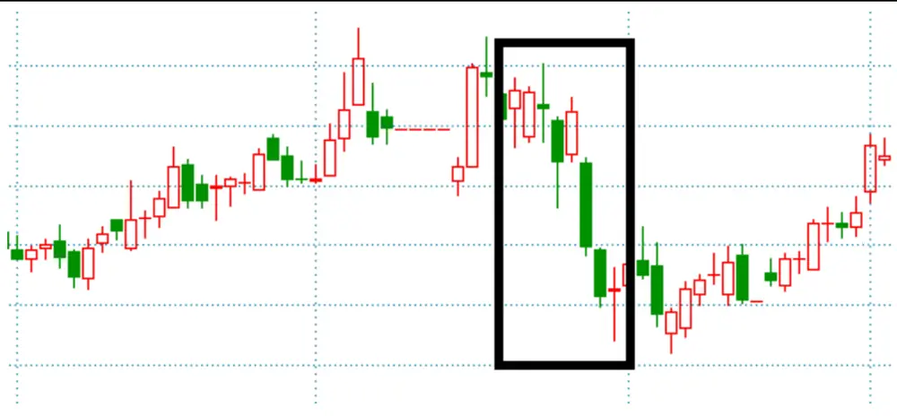
数据来源：Wind资讯、广发证券发展研究中心

公开增发上市策略的起始日期为上市前一个交易日的收盘价，持有日期建议为7个交易日。剔除停牌和跌停的案例后，2006年至2011年，属于融券标的公开增发上市的股票共有35只，平均超额收益-2.64%，胜率77.14%，t统计量-2.8609。

公开增发股票上市后的超额收益分布图和分年超额收益如图9和表8所示，2009年以来，该策略的胜率高达100%。

图9：公开增发股票上市后的超额收益分布图
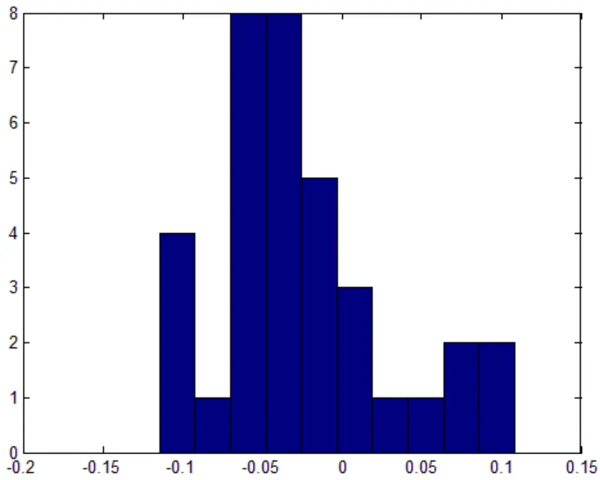
数据来源：Wind资讯、广发证券发展研究中心

表8：公开增发股票上市后的分年超额收益

| 年份 | 超额收益（考虑融券成本） | 胜率 | 样本数 |
| --- | --- | --- | --- |
| 2006年 | 1.06% | 50.00% | 4 |
| 2007年 | -3.61% | 77.78% | 9 |
| 2008年 | -0.19% | 60.00% | 10 |
| 2009年 | -7.24% | 100.00% | 4 |
| 2010年 | -5.03% | 100.00% | 5 |
| 2011年 | -2.77% | 100.00% | 3 |
| 2009年-2011年 | -5.20% | 100.00% | 12 |
| 总计 | -2.64% | 77.14% | 35 |

数据来源：Wind资讯、广发证券发展研究中心

2010年以来的所有案例共有10次，其中超额收益小于-1%的共有8次，2012年以来

的2次公开增发股票上市后均存在负超额收益，如表9所示：

表9：2010年以来的公开增发上市案例

| 股票代码 | 股票名称 | 上市日期 | 起始日期 | 结束日期 | 超额收益 |
| --- | --- | --- | --- | --- | --- |
| 000559 | 万向钱潮 | 2010-4-22 | 2010-4-21 | 2010-4-30 | -6.69% |
| 600089 | 特变电工 | 2010-8-24 | 2010-8-23 | 2010-9-1 | -4.99% |
| 600642 | 申能股份 | 2010-10-29 | 2010-10-28 | 2010-11-8 | -4.38% |
| 601006 | 大秦铁路 | 2010-11-5 | 2010-11-4 | 2010-11-15 | -0.62% |
| 600795 | 国电电力 | 2010-12-29 | 2010-12-28 | 2011-1-7 | -8.46% |
| 000625 | 长安汽车 | 2011-1-28 | 2011-1-27 | 2011-2-14 | -0.44% |
| 000783 | 长江证券 | 2011-3-21 | 2011-3-18 | 2011-3-29 | -2.78% |
| 000709 | 河北钢铁 | 2011-12-2 | 2011-12-1 | 2011-12-12 | -5.10% |
| 000651 | 格力电器 | 2012-2-3 | 2012-2-2 | 2012-2-13 | -1.19% |
| 600674 | 川投能源 | 2012-3-22 | 2012-3-21 | 2012-3-30 | -6.26% |

数据来源：Wind资讯、广发证券发展研究中心

## 四、限售股解禁前的负超额收益

由于投资者担心解禁后，限售股的持有人会在二级市场抛售股票，因而限售股解禁前往往存在负超额收益，在众多限售股类型中，首发原股东限售股份在解禁前一段时间的负超额收益比较明显。

例如兴业证券（601377.SH）2011年10月13日首发原股东限售股份解禁，2011年9月27日到2011年10月12日之间的超额收益为-9.73%，15个自然日的融券费率为0.38%，考虑融券费率后的超额收益为-9.35%。如图10所示：

图10：兴业证券首发原股东限售股份解禁前的负超额收益
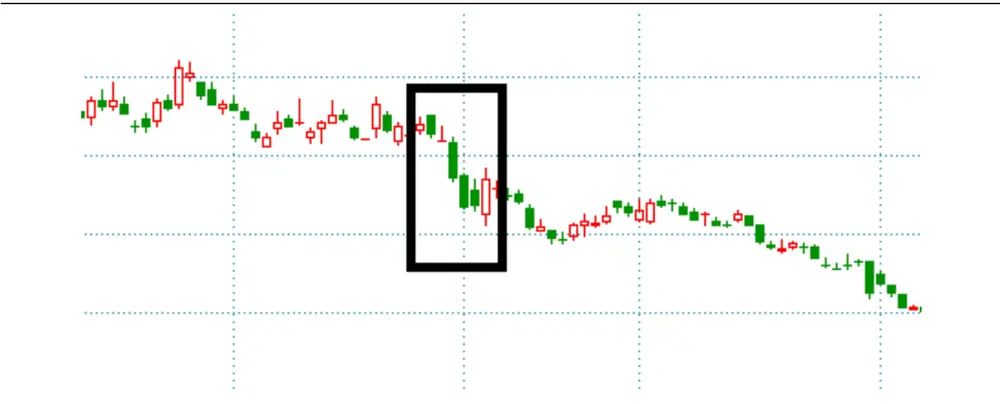
数据来源：Wind资讯、广发证券发展研究中心

首发原股东限售股份解禁策略的起始日期为解禁前7个交易日的收盘价，持有日期建议持有到解禁前1个交易日的收盘价。剔除停牌和跌停的案例后，2006年至2011年，属于首发原股东限售股份解禁的股票共有103只，平均超额收益-1.14%，胜率65.05%，t统计量-2.1601。

首发原股东限售股份解禁前的超额收益分布图和分年超额收益如图11和表10所示。

图11：首发原股东限售股份解禁前的超额收益分布图
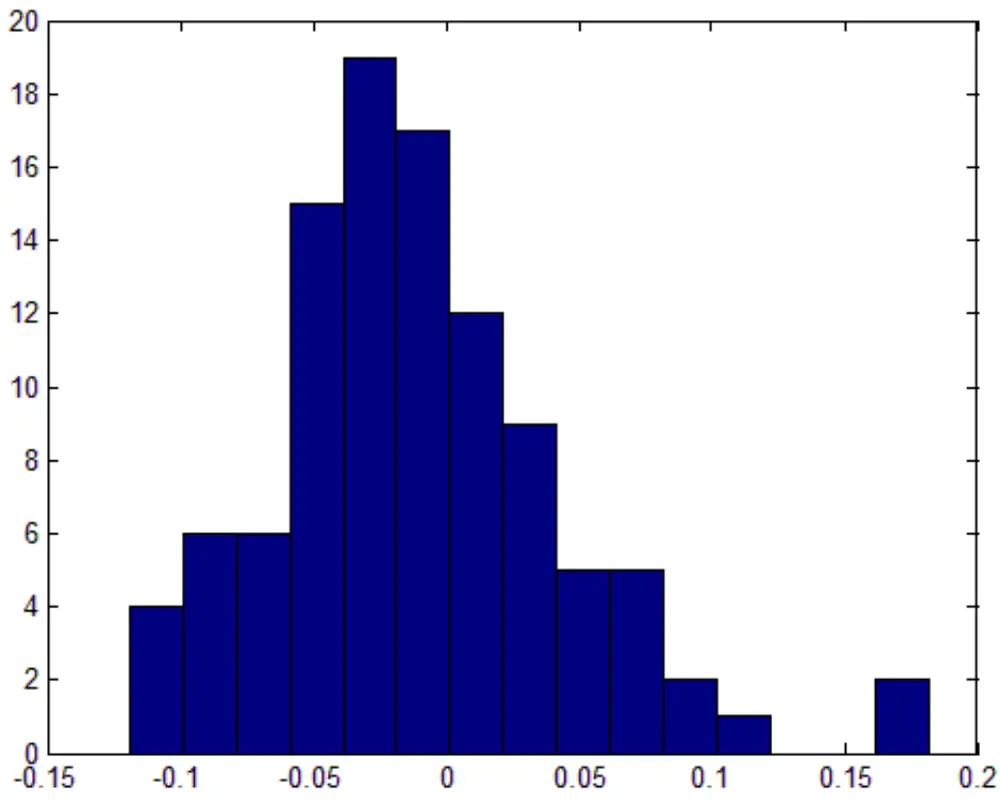
数据来源：Wind资讯、广发证券发展研究中心

表10：首发原股东限售股份解禁前的分年超额收益

| 年份 | 超额收益（考虑融券成本） | 胜率 | 样本数 |
| --- | --- | --- | --- |
| 2007年 | 0.21% | 61.90% | 21 |
| 2008年 | -0.07% | 56.76% | 37 |
| 2009年 | -2.78% | 73.68% | 19 |
| 2010年 | -4.02% | 82.35% | 17 |
| 2011年 | 0.19% | 55.56% | 9 |
| 2009年-2011年 | -2.65% | 73.33% | 45 |
| 总计 | -1.14% | 65.05% | 103 |

数据来源：Wind资讯、广发证券发展研究中心

2011年下半年以来的所有案例共有11次，其中超额收益小于-1%的共有9次，2012年以来的3次公开增发股票上市后均存在负超额收益，如表11所示：

表11：2011年下半年以来的首发原股东限售股份解禁案例

| 股票代码 | 股票名称 | 解禁日期 | 起始日期 | 结束日期 | 超额收益 |
| --- | --- | --- | --- | --- | --- |
| 601717 | 郑煤机 | 2011-8-3 | 2011-7-25 | 2011-8-2 | -1.57% |
| 601818 | 光大银行 | 2011-8-18 | 2011-8-9 | 2011-8-17 | -2.29% |
| 601766 | 中国南车 | 2011-8-18 | 2011-8-9 | 2011-8-17 | -2.38% |
| 601117 | 中国化学 | 2011-9-23 | 2011-9-14 | 2011-9-22 | 0.65% |
| 601018 | 宁波港 | 2011-10-13 | 2011-9-27 | 2011-10-12 | -0.91% |
| 601377 | 兴业证券 | 2011-10-13 | 2011-9-27 | 2011-10-12 | -9.35% |
| 601727 | 上海电气 | 2011-12-5 | 2011-11-24 | 2011-12-2 | -4.08% |
| 601377 | 兴业证券 | 2011-12-13 | 2011-12-2 | 2011-12-12 | -9.01% |
| 601118 | 海南橡胶 | 2012-1-9 | 2011-12-27 | 2012-1-6 | -6.69% |
| 601377 | 兴业证券 | 2012-2-13 | 2012-2-2 | 2012-2-10 | -2.17% |
| 601377 | 兴业证券 | 2012-5-14 | 2012-5-3 | 2012-5-11 | -4.64% |

数据来源：Wind资讯、广发证券发展研究中心

## 五、实际投资效果

最后，我们看一下各个策略的实际投资效果。我们假设股票双向交易成本为0.5%，不考虑杠杆，最终实现收益率的计算公式为-(r -r+c+0.5)/2。我们对未来能看到的所有机会平均投资，时间范围从2011年至今。

高送转策略共持续了67个自然日，收益率11.05%，年化收益59.37%；公开增发预案策略共持续了74个自然日，收益率5.54%，年化收益26.97%；公开增发上市策略共持续了60个自然日，收益率6.78%，年化收益40.68%；限售股解禁策略共持续了161个自然日，收益率8.84%，年化收益19.78%，分别如图12-图15所示：

图12：高送转策略的实际投资效果
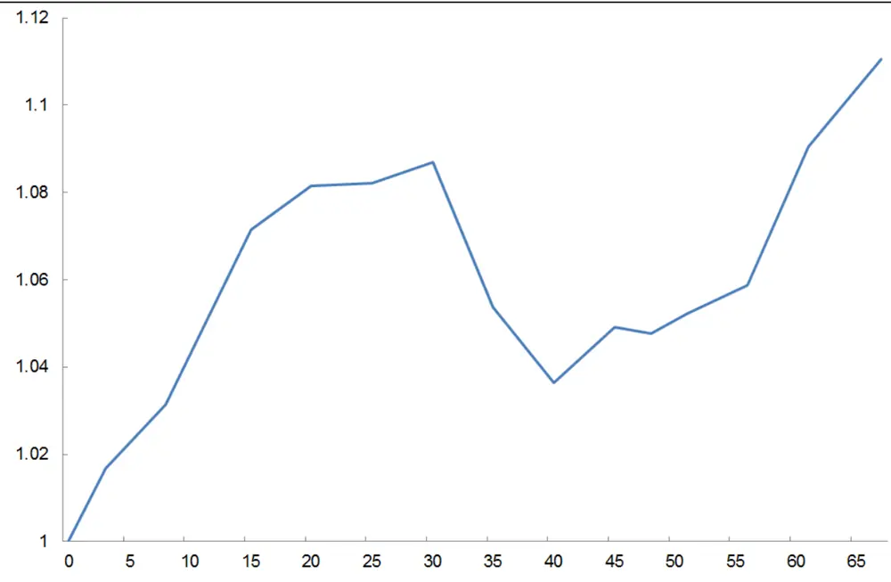
数据来源：Wind资讯、广发证券发展研究中心

图13：公开增发预案策略的实际投资效果
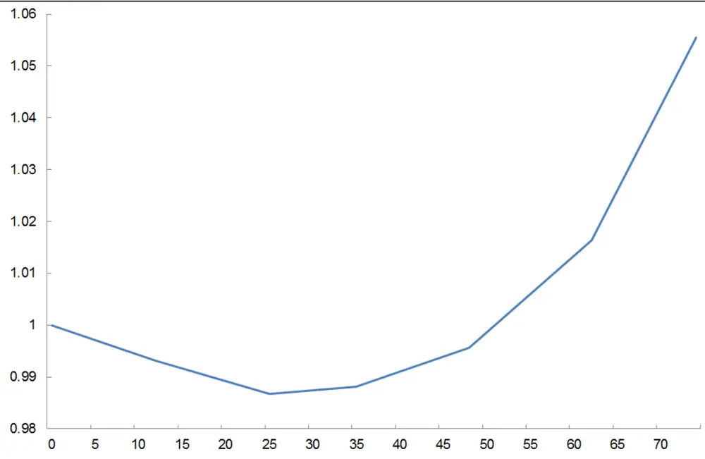
数据来源：Wind资讯、广发证券发展研究中心

图14：公开增发上市策略的实际投资效果
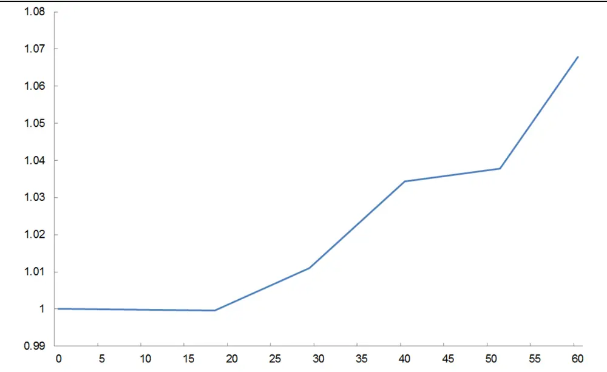
数据来源：Wind资讯、广发证券发展研究中心

图15：限售股解禁策略的实际投资效果
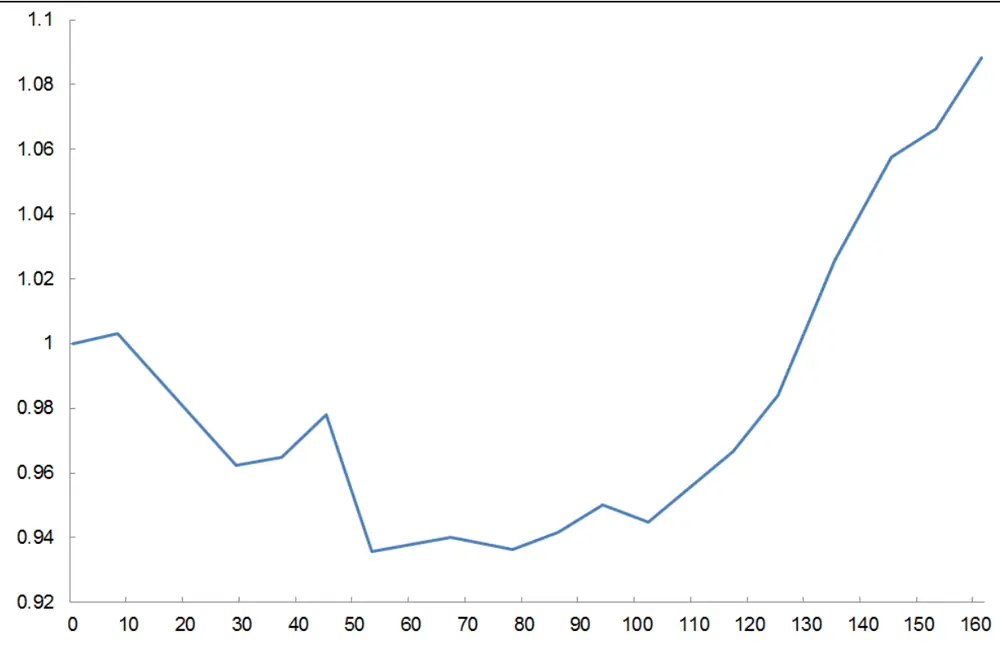
数据来源：Wind资讯、广发证券发展研究中心

我们还可以把不同策略结合起来操作，例如我们将高送转策略和公开增发上市策略结合，结合后的策略共持续了122个自然日，收益率16.90%，年化收益49.87%，如图16所示：

图16：高送转策略和公开增发上市策略结合的实际投资效果
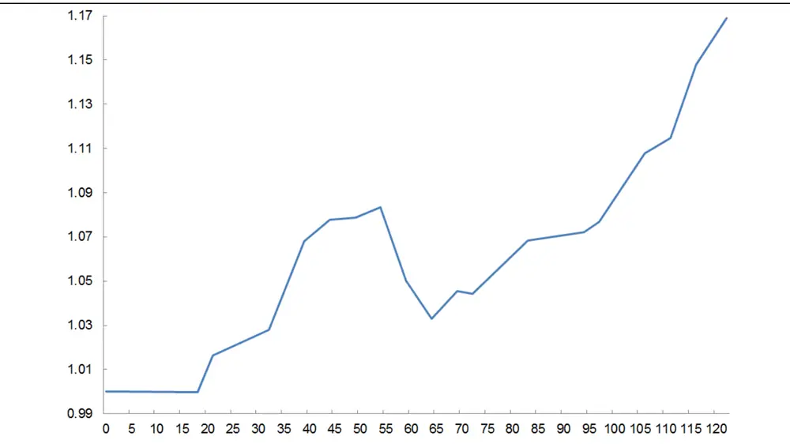
数据来源：Wind资讯、广发证券发展研究中心

## Table_A 广发金融工程研究小组uthorSummary

罗军，首席分析师，华南理工大学理学硕士，2010年进入广发证券发展研究中心。

俞文冰，首席分析师，CFA，上海财经大学统计学硕士，2012年进入广发证券发展研究中心。

叶涛，资深分析师，CFA，上海交通大学管理科学与工程硕士，2012年进入广发证券发展研究中心。

安宁宁，资深分析师，暨南大学数量经济学硕士，2011年进入广发证券发展研究中心。

胡海涛，分析师，华南理工大学理学硕士，2010年进入广发证券发展研究中心。

夏潇阳，分析师，上海交通大学金融工程硕士，2012年进入广发证券发展研究中心。

汪鑫，分析师，中国科学技术大学金融工程硕士，2012年进入广发证券发展研究中心。

李明，分析师，伦敦城市大学卡斯商学院计量金融硕士，2010年进入广发证券发展研究中心。

蓝昭钦，分析师，中山大学理学硕士，2010年进入广发证券发展研究中心。

史庆盛，研究助理，华南理工大学金融工程硕士，2011年进入广发证券发展研究中心。

谢琳，研究助理，上海交通大学金融学博士研究生，2011年进入广发证券发展研究中心。

## Table_Report 相关研究报告

此时无声胜有声——长期不出公告股票的投资机会：——事件驱动策略量化研究系列专题之二夏潇阳2012-03-22

高管增持事件驱动策略量化研究：——事件驱动策略量化研究系列专题之一

|  | 广州市 | 深圳市 | 北京市 | 上海市 |
| --- | --- | --- | --- | --- |
| 地址 | 广州市天河北路183 号 大都会广场5楼 | 深圳市福田区民田路178 | 3 北京市西城区月坛北街2号上海市浦东南路 528号 |  |
| 邮政编码 | 510075 | 号华融大厦9楼 518026 | 月坛大厦18层 100045 | 上海证券大厦北塔17楼 200120 |
| 客服邮箱 | gfyf@gf.com.cn |  |  |  |
| 服务热线 | 020-87555888-8612 |  |  |  |

## 免责声明

le_Disclaimer广发证券股份有限公司具备证券投资咨询业务资格。本报告只发送给广发证券重点客户，不对外公开发布。

本报告所载资料的来源及观点的出处皆被广发证券股份有限公司认为可靠，但广发证券不对其准确性或完整性做出任何保证。报告内容仅供参考，报告中的信息或所表达观点不构成所涉证券买卖的出价或询价。广发证券不对因使用本报告的内容而引致的损失承担任何责任，除非法律法规有明确规定。客户不应以本报告取代其独立判断或仅根据本报告做出决策。

广发证券可发出其它与本报告所载信息不一致及有不同结论的报告。本报告反映研究人员的不同观点、见解及分析方法，并不代表广发证券或其附属机构的立场。报告所载资料、意见及推测仅反映研究人员于发出本报告当日的判断，可随时更改且不予通告。

本报告旨在发送给广发证券的特定客户及其它专业人士。未经广发证券事先书面许可，任何机构或个人不得以任何形式翻版、复制、刊登、转载和引用，否则由此造成的一切不良后果及法律责任由私自翻版、复制、刊登、转载和引用者承担。