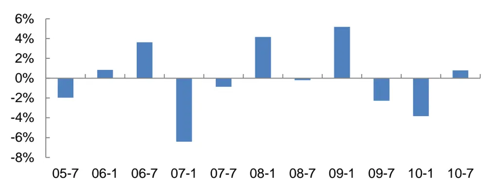
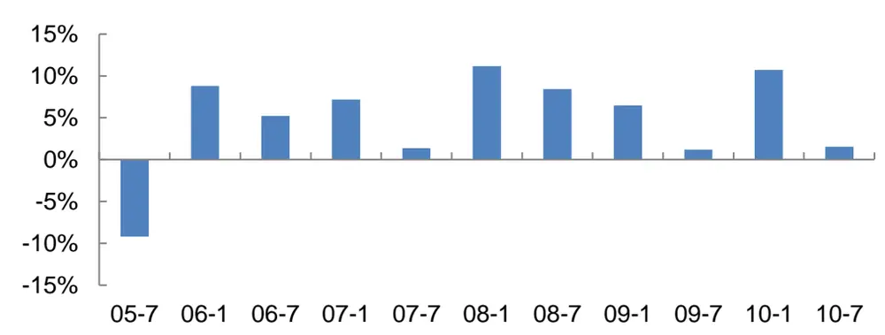
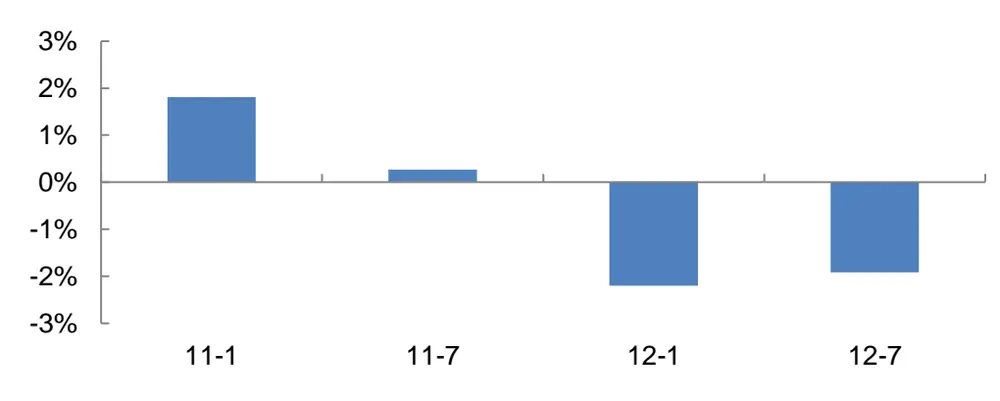
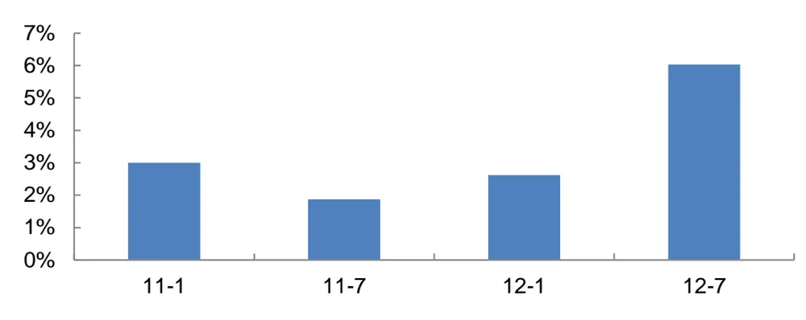
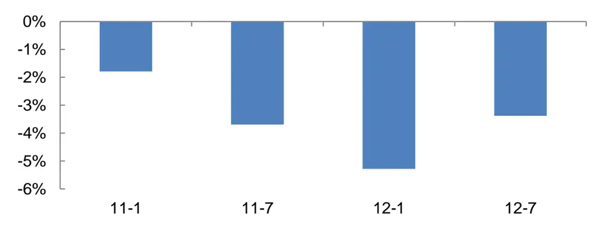

证券研究报告

# 岁末年初的事件驱动投资机会

## 事件驱动策略量化研究系列专题之四

## 报告摘要：

## 岁末年初的事件驱动投资机会

从投资机会的表现来看，岁末年初的事件驱动投资机会主要分为三类：第一类投资机会只在岁末年初出现，如“指数成分股调整效应”和“年报披露时间大幅提前的投资机会”；第二类投资机会在全年有几个时间段机会比较密集，其中岁末年初是一个主要的时间段，如“长期不出公告股票的投资机会”；第三类投资机会在时间上的分布比较均匀，且不同时间段的超额收益相对稳定，差异不大，如“分析师调研带来的投资机会”和“发布更正补充公告股票的投资机会”。

## 只在岁末年初出现的事件驱动投资机会

2011 年以来，调入股票等权组合在调整名单公布日到成分股调整日期间相对沪深 300 指数的平均超额收益为 3.38%，调出股票等权组合在调整名单公布日到成分股调整日期间相对沪深 300 指数的平均超额收益为-3.54%。

从 2007 年到 2012 年，年报披露时间提前 60 天以上的股票共有 135例，平均超额收益为 19.80%，超额收益胜率为 80.74%，超额收益的 t 统计量为 8.9048。

## 岁末年初为主要时间段的事件驱动投资机会

在 2008年到2012 年的年报期间，符合长期不出公告策略的股票共有714 例，平均超额收益为 3.94%，超额收益胜率为 58.12%，超额收益的 t统计量为 8.2369。

## 在时间上的分布比较均匀的事件驱动投资机会

在 2010年到2012 年的上半年期间，符合分析师调研策略的股票共有145 例，平均超额收益为 2.56%，超额收益胜率为 60.64%，超额收益的 t统计量为 5.4306。

在 2010年到2012 年的上半年期间，符合更正补充公告策略的股票共有 218 例，平均超额收益为 2.83%，超额收益胜率为 54.59%，超额收益的 t 统计量为 3.4357。

2011年以来事件驱动策略超额收益

| 策略 | 时间段 | 超额收益 |
| --- | --- | --- |
| 指数成分股调整 | 12月中下旬 | 3.38% |
| 年报大幅提前 | 一季度 | 9.44% |
| 长期不出公告 | 年报期间 | 3.79% |
| 分析师调研 | 上半年 | 2.34% |
| 更正补充公告 | 上半年 | 3.72% |

数据来源：Wind资讯、广发证券发展研究中心

分析师： 夏潇阳 S0260512030005

公021-60750625

xxy2@gf.com.cn

## 相关研究：

此时无声胜有声——长期不2012-03-22出公告股票的投资机会

分析师调研带来的投资机会2012-07-24

## 一、岁末年初的事件驱动投资机会

新年的钟声即将敲响，在辞旧迎新的时刻，有哪些事件驱动投资机会值得关注？在本报告中，我们对岁末年初的事件驱动投资机会进行梳理和总结。

从投资机会的表现来看，岁末年初的事件驱动投资机会主要分为三类：第一类投资机会只在岁末年初出现，如“指数成分股调整效应”和“年报披露时间大幅提前的投资机会”；第二类投资机会在全年有几个时间段机会比较密集，其中岁末年初是一个主要的时间段，如“长期不出公告股票的投资机会”；第三类投资机会在时间上的分布比较均匀，且不同时间段的超额收益相对稳定，差异不大，如“分析师调研带来的投资机会”和“发布更正补充公告股票的投资机会”。

岁末年初的事件驱动投资机会在时间轴上的分布情况如图1所示：

图1：岁末年初的事件驱动投资机会

|  | 指数成分 股调整 | 长期不出公告 |  | → |
| --- | --- | --- | --- | --- |
|  |  | 年报披露时间大幅提前 |  |  |
| 2012-12 2013-01 |  |  | 2013-03 2013-04 分析师调研+发布更正补充公告 | 2013-05 |

数据来源：广发证券发展研究中心

## 二、只在岁末年初出现的事件驱动投资机会

## （一）指数成分股调整效应

第一类投资机会只在岁末年初出现，如“指数成分股调整效应”和“年报披露时间大幅提前的投资机会”。

中证系列指数在每年6月和12月的最后一个交易日进行成分股调整，并在成分股调整日前15个交易日前后公布成分股调整名单。其中沪深300指数的成分股调整效应最为投资者所关注。随着以沪深300指数为标的的指数基金的数量和规模的逐年增加，沪深300指数的成分股调整效应在近几年也发生了一些变化。

2005年到2010年期间，调入股票等权组合在调整名单公布日到成分股调整日期间相对沪深300指数的平均超额收益为-0.09%，调入股票在调整日前不存在明显的超额收益，如图2所示：

图2：2005年到2010年期间调入股票在调整日前的超额收益

数据来源：Wind资讯、广发证券发展研究中心

2005年到2010年期间，调出股票等权组合在成分股调整日开始的20个交易日内相对沪深300指数的平均超额收益为4.81%，调出股票在调整日后存在明显的超额收益，如图3所示。

图3：2005年到2010年期间调出股票在调整日后的超额收益

数据来源：Wind资讯、广发证券发展研究中心

然而2011年以来，沪深300指数的成分股调整效应发生了一些变化。调出股票等权组合在成分股调整日开始的20个交易日内相对沪深300指数的平均超额收益为-0.51%，调出股票在调整日后不存在明显的超额收益，如图4所示：

图4：2011年以来调出股票在调整日后的超额收益

数据来源：Wind资讯、广发证券发展研究中心

此外，2011年以来，调入股票等权组合在调整名单公布日到成分股调整日期间相对沪深300指数的平均超额收益为3.38%，调入股票在调整日前存在明显的超额收益，如图5所示：

图5：2011年以来调入股票在调整日前的超额收益

数据来源：Wind资讯、广发证券发展研究中心

进一步地，2011年以来，调出股票等权组合在调整名单公布日到成分股调整日期间相对沪深300指数的平均超额收益为-3.54%，调出股票在调整日前存在明显的负超额收益，如图6所示：

图6：2011年以来调出股票在调整日前的超额收益

数据来源：Wind资讯、广发证券发展研究中心

## （二）年报披露时间大幅提前的投资机会

年度报告是上市公司信息披露的重要内容之一，上市公司可选择次年1月1日至4月30日之间的合适时间披露年报，交易所会在每年的最后一个交易日收市后公布当年年报的预约披露时间表。

根据相关规定，在定期报告披露前30日内，上市公司的董事、监事、高管人员以及其他内幕信息知情人不得有买卖公司股票等行为。因此，如果上市公司要策划重大事项，会倾向于拉开当年年报的披露时间与当年三季报或者次年一季报的披露时间之间的间隔，留足时间来策划重大事项。

我们认为，如果当年年报披露时间比上一年提前或者滞后60天以上，那么该上市公司策划重大事项的可能性较大。此外，为了避免重复计算，如果该上市公司连续两年的年报披露时间比上一年提前或者滞后60天以上，那么我们只考察第一年的情况。

然而，如果一个上市公司的年报披露时间滞后，除了策划重大事项的可能性，还有可能因为该上市公司需要更多时间来筹划当年年报的披露工作，这类股票不会存在明显的超额收益。因此，我们仅仅关注年报披露时间提前60天以上的股票。我们认为，年报披露时间提前60天以上的股票的最佳持有期为次年一季度，即1月1日到3月31日。详情请见《上市公司年报披露时间蕴含玄机》（长江证券夏潇阳，2012-01-04）。

我们计算发现，从2007年到2012年，年报披露时间提前60天以上的股票共有135例，平均超额收益为19.80%，超额收益胜率为80.74%，超额收益的t统计量为8.9048。

年报披露时间提前60天以上的股票分年超额收益的各项统计值如表1所示：

表1：年报披露时间提前60天以上股票分年超额收益的各项统计值

| 统计值 | 2007年 | 2008年 | 2009年 | 2010年 | 2011年 | 2012年 |
| --- | --- | --- | --- | --- | --- | --- |
| 平均超额收益 | 37.03% | 22.47% | 33.42% | 10.47% | 12.22% | 6.98% |
| 超额收益胜率 | 84.21% | 91.89% | 93.33% | 84.38% | 53.33% | 58.82% |
| 超额收益的t统计量 | 5.1447 | 6.5019 | 3.6530 | 4.3238 | 1.6524 | 1.5076 |
| 样本数量 | 19 | 37 | 15 | 32 | 15 | 17 |

数据来源：Wind资讯、广发证券发展研究中心

## 三、岁末年初为主要时间段的事件驱动投资机会

第二类投资机会在全年有几个时间段机会比较密集，其中岁末年初是一个主要的时间段，如“长期不出公告股票的投资机会”。

在《此时无声胜有声——长期不出公告股票的投资机会》这篇报告中，我们指出，当一个上市公司频繁发布公告时，该公司的股票很难产生定价偏差，因此也很难产生超额收益；而当一个上市公司很长时间没有发布公告时，信息不对称使得投资者对该股票产生了美好的预期，从而带来超额收益。

我们称相邻的两个公告相差的交易天数为d，其中后一个公告的发布日期为T日，我们发现，d越大的股票，越容易在第二个公告日T日前体现超额收益；而d越小的股票，越容易在T日后体现超额收益；d居中的股票，在T日前和T日后均能体现超额收益。

当观察到一个股票连续60个交易日不出公告的时候，即d>60时，买入此股票。而在卖出时点方面，d比较小和d比较大的股票区别对待：当d<80时，也就是买入后20个交易日内出了公告，则持有该股票到T+20日；当d≥80时，也就是买入后20个交易日内没有出公告，则持有该股票到T+2日。如果买入日股票停牌，我们往后推迟至多2个交易日买入。如果停牌超过2个交易日或者买入日股票涨停，我们放弃此机会。

我们计算发现，在2008年到2012年的年报期间，符合长期不出公告策略的股票共有714例，平均超额收益为3.94%，超额收益胜率为58.12%，超额收益的t统计量为8.2369。

年报期间长期不出公告策略分年超额收益的各项统计值如表2所示：

表2：年报期间长期不出公告策略分年超额收益的各项统计值

| 统计值 | 2008年 | 2009年 | 2010年 | 2011年 | 2012年 |
| --- | --- | --- | --- | --- | --- |
| 平均超额收益 | 3.19% | 3.58% | 5.24% | 3.79% | 3.78% |
| 超额收益胜率 | 57.02% | 49.22% | 63.01% | 56.48% | 65.08% |
| 超额收益的t统计量 | 2.4480 | 2.6725 | 4.9627 | 4.3891 | 4.4378 |
| 样本数量 | 121 | 128 | 146 | 193 | 126 |

数据来源：Wind资讯、广发证券发展研究中心

## 四、在时间上的分布比较均匀的事件驱动投资机会

## （一）分析师调研带来的投资机会

第三类投资机会在时间上的分布比较均匀，且不同时间段的超额收益相对稳定，差异不大，如“分析师调研带来的投资机会”和“发布更正补充公告股票的投资机会”。

在《分析师调研带来的投资机会》这篇报告中，我们指出，大型券商发布调研报告后存在明显的超额收益。我们假设在调研报告发布后5个交易日的收盘时买入，持有20个交易日，如果买入日股票停牌，我们往后推迟至多2个交易日买入。如果停牌超过2个交易日或者买入日股票涨停，我们放弃此机会。

我们把调研报告分为三类：单独调研：过去五个交易日内没有别的券商发布过关于该上市公司的调研报告；和大型券商一起调研：过去五个交易日内有大型券商过该上市公司；和中小券商一起调研：过去五个交易日内有券商调研过该上市公司，但没有大型券商调研过。我们选择大型券商的单独调研以及和中小券商一起调研的股票作为该策略的股票池，并根据情况做一定的行业筛选。

我们计算发现，在2010年到2012年的上半年期间，符合分析师调研策略的股票共有145例，平均超额收益为2.56%，超额收益胜率为60.64%，超额收益的t统计量为5.4306。

上半年期间分析师调研策略分年超额收益的各项统计值如表3所示：

表 3：上半年期间分析师调研策略分年超额收益的各项统计值

| 统计值 | 2010年 | 2011年 | 2012年 |
| --- | --- | --- | --- |
| 平均超额收益 | 3.12% | 1.12% | 3.30% |
| 超额收益胜率 | 62.26% | 51.26% | 66.89% |
| 超额收益的t统计量 | 3.0616 | 1.6061 | 4.4321 |
| 样本数量 | 106 | 119 | 151 |

数据来源：Wind资讯、广发证券发展研究中心

## （二）发布更正补充公告股票的投资机会

有时候，上市公司会在公布完财报后，发布关于财报的更正公告或者补充公告，这些公告可能会释放正面的信息，从而产生超额收益。我们发现更正补充公告的发布日期距离财报发布日期在20到60个交易日之间的股票在发布更正补充公告后30个交易日内的超额收益较高。

此外，为了避免超额收益提前体现，我们把更正补充公告发布前30个交易日内超额收益超过30%的股票剔除。

我们计算发现，从2010年以来，符合更正补充公告策略的股票共有288例，平

均超额收益为2.22%，超额收益胜率为53.13%，超额收益的t统计量为3.1525。

更正补充公告策略分年超额收益的各项统计值如表4所示：

表 4：更正补充公告策略分年超额收益的各项统计值

| 统计值 | 2010年 | 2011年 | 2012年 |
| --- | --- | --- | --- |
| 平均超额收益 | 1.64% | 2.21% | 2.63% |
| 超额收益胜率 | 51.85% | 51.69% | 55.08% |
| 超额收益的t统计量 | 1.3231 | 1.6186 | 2.4091 |
| 样本数量 | 81 | 89 | 118 |

数据来源：Wind资讯、广发证券发展研究中心

在2010年到2012年的上半年期间，符合更正补充公告策略的股票共有218例，平均超额收益为2.83%，超额收益胜率为54.59%，超额收益的t统计量为3.4357。

上半年期间更正补充公告策略分年超额收益的各项统计值如表5所示：

表 5：上半年期间更正补充公告策略分年超额收益的各项统计值

| 统计值 | 2010年 | 2011年 | 2012年 |
| --- | --- | --- | --- |
| 平均超额收益 | 0.81% | 3.30% | 4.01% |
| 超额收益胜率 | 47.76% | 57.38% | 57.78% |
| 超额收益的t统计量 | 0.6491 | 1.9318 | 3.0252 |
| 样本数量 | 67 | 61 | 90 |

数据来源：Wind资讯、广发证券发展研究中心

## 五、总结

在本报告中，我们梳理了5种岁末年初的事件驱动投资机会，分别是：指数成分股调整效应、年报披露时间大幅提前的投资机会、长期不出公告股票的投资机会、分析师调研带来的投资机会和发布更正补充公告股票的投资机会。这5种事件驱动投资机会的投资时间段以及2011年以来的平均超额收益如表6所示：

表 6：2011年以来岁末年初的事件驱动投资机会超额收益

| 策略 | 时间段 | 平均超额收益 |
| --- | --- | --- |
| 指数成分股调整 | 12月中下旬 | 3.38% |
| 年报披露时间大幅提前 | 一季度 | 9.44% |
| 长期不出公告 | 年报期间 | 3.79% |
| 分析师调研 | 上半年 | 2.34% |
| 发布更正补充公告 | 上半年 | 3.72% |

数据来源：Wind资讯、广发证券发展研究中心

## Table_Res arch 广发金融工程研究小组

罗军： 首席分析师，华南理工大学理学硕士，2010年进入广发证券发展研究中心。

俞文冰： 首席分析师，CFA，上海财经大学统计学硕士，2012年进入广发证券发展研究中心。

叶 涛： 资深分析师，CFA，上海交通大学管理科学与工程硕士，2012年进入广发证券发展研究中心。

安宁宁： 资深分析师，暨南大学数量经济学硕士，2011年进入广发证券发展研究中心。

胡海涛： 分析师，华南理工大学理学硕士，2010年进入广发证券发展研究中心。

夏潇阳： 分析师，上海交通大学金融工程硕士，2012年进入广发证券发展研究中心。

汪 鑫： 分析师，中国科学技术大学金融工程硕士，2012年进入广发证券发展研究中心。

李 明： 分析师，伦敦城市大学卡斯商学院计量金融硕士，2010年进入广发证券发展研究中心。

蓝昭钦： 分析师，中山大学理学硕士，2010年进入广发证券发展研究中心。

史庆盛： 研究助理，华南理工大学金融工程硕士，2011年进入广发证券发展研究中心。

张 超： 研究助理，中山大学理学硕士，2012年进入广发证券发展研究中心。

## Table_RatingIndustry 广发证券—行业投资评级说明

买入： 预期未来12个月内，股价表现强于大盘10%以上。

持有： 预期未来12个月内，股价相对大盘的变动幅度介于-10%～+10%。

卖出： 预期未来 12 个月内，股价表现弱于大盘 10%以上。

## Table_RatingCompany 广发证券—公司投资评级说明

买入： 预期未来 12 个月内，股价表现强于大盘 15%以上。

谨慎增持： 预期未来12个月内，股价表现强于大盘5%-15%。

持有： 预期未来12个月内，股价相对大盘的变动幅度介于-5%～+5%。

卖出： 预期未来12个月内，股价表现弱于大盘5%以上。

Table_Ad联系我们

|  | 广州市 | 深圳市 | 北京市 | 上海市 |
| --- | --- | --- | --- | --- |
| 地址 | 广州市天河北路183号 大都会广场5楼 | 深圳市福田区金田路4018 号安联大厦 15 楼 A 座 | 北京市西城区月坛北街2号 月坛大厦18层 | 上海市浦东新区富城路99号 震旦大厦18楼 |
|  |  | 03-04 |  |  |
| 邮政编码 客服邮箱 | 510075 | 518026 | 100045 | 200120 |
| 服务热线 | gfyf@gf.com.cn 020-87555888-8612 |  |  |  |

## Table_Disclaimer 免 责声 明

广发证券股份有限公司具备证券投资咨询业务资格。本报告只发送给广发证券重点客户，不对外公开发布。

本报告所载资料的来源及观点的出处皆被广发证券股份有限公司认为可靠，但广发证券不对其准确性或完整性做出任何保证。报告内容仅供参考，报告中的信息或所表达观点不构成所涉证券买卖的出价或询价。广发证券不对因使用本报告的内容而引致的损失承担任何责任，除非法律法规有明确规定。客户不应以本报告取代其独立判断或仅根据本报告做出决策。

广发证券可发出其它与本报告所载信息不一致及有不同结论的报告。本报告反映研究人员的不同观点、见解及分析方法，并不代表广发证券或其附属机构的立场。报告所载资料、意见及推测仅反映研究人员于发出本报告当日的判断，可随时更改且不予通告。

本报告旨在发送给广发证券的特定客户及其它专业人士。未经广发证券事先书面许可，任何机构或个人不得以任何形式翻版、复制、刊登、转载和引用，否则由此造成的一切不良后果及法律责任由私自翻版、复制、刊登、转载和引用者承担。