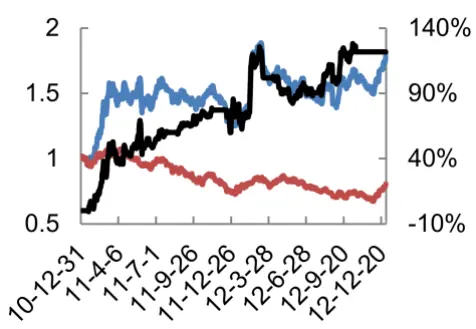
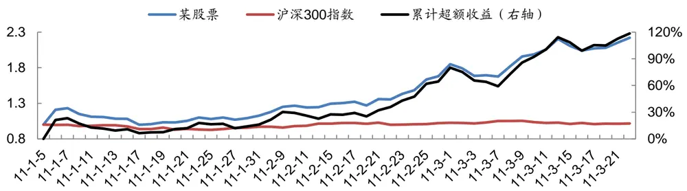
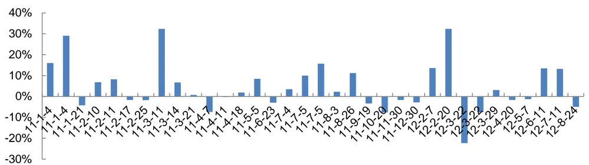
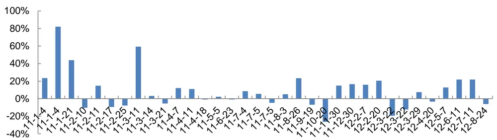
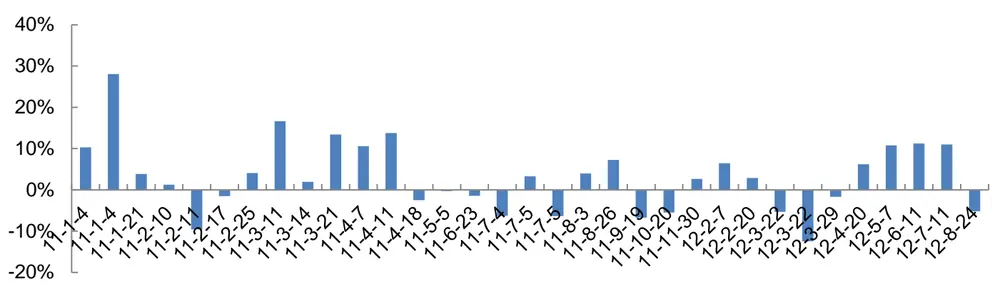
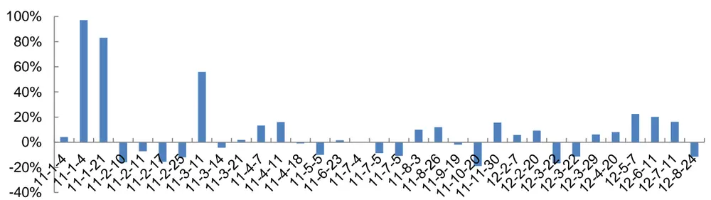
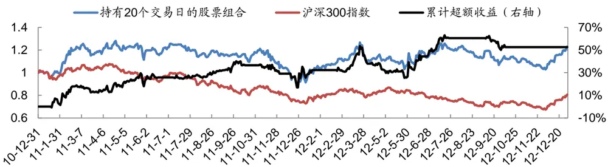
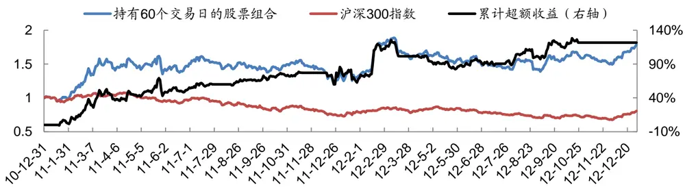

# 分析师首次关注股票的投资机会

## 事件驱动策略量化研究系列专题之五

## 报告摘要：

## 分析师首次关注的股票具有投资价值

我们先把研究报告分为五类：新股报告、调研报告、业绩点评、普通点评和深度报告。其中，业绩点评是指对上市公司定期报告、业绩快报或业绩预告的点评。

“分析师首次关注”的定义如下：

1.该股票上市日期早于N-1年的1 月1 日（不包括N-1 年的1月 1日）

2.对于该股票，有分析师在N 年的1月1 日到N 年的12 月31日之间发布过深度报告，报告日期为T 日

3.对于该股票，没有分析师在 N-1 年的 1 月 1 日到 T-1 日之间发布过除新股报告和业绩点评以外的研究报告

4.T 日以及T 日前一段时间，该股票不存在长期停牌的情况

当四个条件同时符合的时候，我们称该股票在 T 日有“分析师首次关注”。

## 分析师首次关注后的超额收益

我们假设在分析师首次关注后，在下一个交易日开盘时买入，如果买入日股票停牌，我们往后推迟至多 2 个交易日买入。如果停牌超过 2 个交易日或者买入日股票涨停，我们放弃此机会。

持有20 个交易日的平均超额收益为 4.61%，超额收益胜率为 55.88%，超额收益的t统计量为2.3042；持有60个交易日的平均超额收益为9.20%，超额收益胜率为 61.76%，超额收益的 t统计量为1.6841。

## 构建投资组合

在实际投资中，我们很难在深度报告发布后的下一个交易日开盘买入，因此我们假设在深度报告发布后 10 个交易日的收盘时买入，其它假设同前。

和其它的事件驱动选股策略一样，我们对其应用动态资金规划方法来构建股票组合。我们假设交易成本为双向千分之五，当策略完全空仓时候，我们进行指数化投资。

持有 20 个交易日的股票组合的累计超额收益为 52.67%，年化超额收益为 22.79%，年化信息比率为103.10%，超额收益的最大回撤为-17.67%；持有 60 个交易日的股票组合的累计超额收益为121.73%，年化超额收益为43.05%，年化信息比率为 151.18%，超额收益的最大回撤为-19.17%。

## 风险提示

事件驱动选股策略并不适用于所有的市场环境，在极端市场环境下超额收益可能存在较大回撤风险。

图：持有 60个交易日的股票组合

数据来源：Wind、广发证券发展研究中心

分析师： 夏潇阳 S0260512030005

公021-60750625

xxy2@gf.com.cn

## 相关研究：

岁末年初的事件驱动投资机 2012-12-06会

分析师调研带来的投资机会2012-07-24此时无声胜有声——长期不2012-03-22出公告股票的投资机会

## 一、分析师首次关注的股票具有投资价值

在《分析师调研带来的投资机会》这篇报告中，我们发现大型券商的分析师发布调研报告后存在超额收益。那么分析师发布深度报告后是否存在投资机会？什么类型深度报告才具有投资价值？

以某股票为例，该股票上市早于2010年1月1日，且在2010年1月1日至2011年1月3日之间，对于该股票，没有分析师发布除业绩点评以外的研究报告。2011年1月4日，某分析师发布了关于该股票的深度报告，从2011年1月5日开盘到2011年3月22日收盘，该股票累计绝对收益为122.14%，累计超额收益为118.50%，如图1所示：

图1：某股票在分析师首次关注后的表现

数据来源：Wind资讯、广发证券发展研究中心

在给出“分析师首次关注”的定义前，我们先把研究报告分为五类：新股报告、调研报告、业绩点评、普通点评和深度报告。其中，业绩点评是指对上市公司定期报告、业绩快报或业绩预告的点评。

“分析师首次关注”的定义如下：

1. 该股票上市日期早于N-1年的1月1日（不包括N-1年的1月1日）

2. 对于该股票，有分析师在N年的1月1日到N年的12月31日之间发布过深度报告，报告日期为T日

3. 对于该股票，没有分析师在N-1年的1月1日到T-1日之间发布过除新股报告和业绩点评以外的研究报告

4. T日以及T日前一段时间，该股票不存在长期停牌的情况

当四个条件同时符合的时候，我们称该股票在T日有“分析师首次关注”。

## 二、分析师首次关注后的超额收益

首先我们考察分析师首次关注后的短期超额收益，我们假设在分析师首次关注后，在下一个交易日开盘时买入，持有20个交易日。如果买入日股票停牌，我们往后推迟至多2个交易日买入。如果停牌超过2个交易日或者买入日股票涨停，我们放弃此机会。

2011年至今，分析师首次关注股票共有34个，持有20个交易日的平均超额收益为4.61%，超额收益胜率为55.88%，超额收益的t统计量为2.3042。这些股票的超额收益如图2所示：

图2：分析师首次关注后持有20个交易日的超额收益

数据来源：Wind资讯、广发证券发展研究中心

接着我们考察分析师首次关注后的中期超额收益，我们假设在分析师首次关注后，在下一个交易日开盘时买入，持有60个交易日。2011年至今，持有60个交易日的平均超额收益为9.20%，超额收益胜率为61.76%，超额收益的t统计量为2.5182。这些股票的超额收益如图3所示：

图3：分析师首次关注后持有60个交易日的超额收益

数据来源：Wind资讯、广发证券发展研究中心

## 三、构建投资组合

在实际投资中，我们很难在深度报告发布后的下一个交易日开盘买入，因此我们假设在深度报告发布后10个交易日的收盘时买入，其它假设同前。

推迟10个交易日买入时，共有33只股票符合条件，持有20个交易日的平均超额收益为3.17%，超额收益胜率为60.01%，超额收益的t统计量为2.1193。这些股票的超额收益如图4所示：

图4：分析师首次关注后推迟买入持有20个交易日的超额收益

数据来源：Wind资讯、广发证券发展研究中心

持有60个交易日的平均超额收益为7.65%，超额收益胜率为54.55%，超额收益的t统计量为1.6841。这些股票的超额收益如图5所示：

图5：分析师首次关注后推迟买入持有60个交易日的超额收益

数据来源：Wind资讯、广发证券发展研究中心

和其它的事件驱动选股策略一样，我们对其应用动态资金规划方法来构建股票组合。我们选取的目标函数要求尽量分散投资，以规避风险，并且要求资金的使用效率尽可能高。我们假设交易成本为双向千分之五，当策略完全空仓时候，我们进行指数化投资。

识别风险，发现价值

持有20个交易日的股票组合如图6所示：

图6：分析师首次关注后推迟买入持有20个交易日的股票组合

数据来源：Wind资讯、广发证券发展研究中心

持有20个交易日的股票组合的累计超额收益为52.67%，年化超额收益为22.79%，年化信息比率为103.10%，超额收益的最大回撤为-17.67%。

持有60个交易日的股票组合如图7所示：

图7：分析师首次关注后推迟买入持有60个交易日的股票组合

数据来源：Wind资讯、广发证券发展研究中心

持有60个交易日的股票组合的累计超额收益为121.73%，年化超额收益为43.05%，年化信息比率为151.18%，超额收益的最大回撤为-19.17%。

## 风险提示

事件驱动选股策略并不适用于所有的市场环境，在极端市场环境下超额收益可能存在较大回撤风险。

## Table_Res arch 广发金融工程研究小组

罗 军： 首席分析师，华南理工大学理学硕士，2010年进入广发证券发展研究中心。

俞文冰： 首席分析师，CFA，上海财经大学统计学硕士，2012年进入广发证券发展研究中心。

叶 涛： 资深分析师，CFA，上海交通大学管理科学与工程硕士，2012年进入广发证券发展研究中心。

安宁宁： 资深分析师，暨南大学数量经济学硕士，2011年进入广发证券发展研究中心。

胡海涛： 分析师，华南理工大学理学硕士，2010年进入广发证券发展研究中心。

夏潇阳： 分析师，上海交通大学金融工程硕士，2012年进入广发证券发展研究中心。

汪 鑫： 分析师，中国科学技术大学金融工程硕士，2012年进入广发证券发展研究中心。

蓝昭钦： 分析师，中山大学理学硕士，2010年进入广发证券发展研究中心。

史庆盛： 研究助理，华南理工大学金融工程硕士，2011年进入广发证券发展研究中心。

张 超： 研究助理，中山大学理学硕士，2012年进入广发证券发展研究中心。

## Table_RatingIndustry 广发证券—行业投资评级说明

买入： 预期未来12个月内，股价表现强于大盘10%以上。

持有： 预期未来12个月内，股价相对大盘的变动幅度介于-10%～+10%。

卖出： 预期未来12个月内，股价表现弱于大盘10%以上。

## Table_RatingCompany 广发证券—公司投资评级说明

买入： 预期未来12个月内，股价表现强于大盘15%以上。

谨慎增持： 预期未来12个月内，股价表现强于大盘5%-15%。

持有： 预期未来12个月内，股价相对大盘的变动幅度介于-5%～+5%。

卖出： 预期未来12个月内，股价表现弱于大盘5%以上。

## Table_Ad联系我们

|  | 广州市 | 深圳市 | 北京市 | 上海市 |
| --- | --- | --- | --- | --- |
| 地址 | 广州市天河北路183号 大都会广场5楼 | 深圳市福田区金田路4018 号安联大厦 15 楼 A 座 | 北京市西城区月坛北街2号 月坛大厦18层 | 上海市浦东新区富城路99号 震旦大厦 18楼 |
|  |  | 03-04 |  |  |
| 邮政编码 | 510075 | 518026 | 100045 | 200120 |
| 客服邮箱 | gfyf@gf.com.cn |  |  |  |
| 服务热线 | 020-87555888-8612 |  |  |  |

## Table_Disclaimer 免 责声 明

广发证券股份有限公司具备证券投资咨询业务资格。本报告只发送给广发证券重点客户，不对外公开发布。

本报告所载资料的来源及观点的出处皆被广发证券股份有限公司认为可靠，但广发证券不对其准确性或完整性做出任何保证。报告内容仅供参考，报告中的信息或所表达观点不构成所涉证券买卖的出价或询价。广发证券不对因使用本报告的内容而引致的损失承担任何责任，除非法律法规有明确规定。客户不应以本报告取代其独立判断或仅根据本报告做出决策。

广发证券可发出其它与本报告所载信息不一致及有不同结论的报告。本报告反映研究人员的不同观点、见解及分析方法，并不代表广发证券或其附属机构的立场。报告所载资料、意见及推测仅反映研究人员于发出本报告当日的判断，可随时更改且不予通告。

本报告旨在发送给广发证券的特定客户及其它专业人士。未经广发证券事先书面许可，任何机构或个人不得以任何形式翻版、复制、刊登、转载和引用，否则由此造成的一切不良后果及法律责任由私自翻版、复制、刊登、转载和引用者承担。