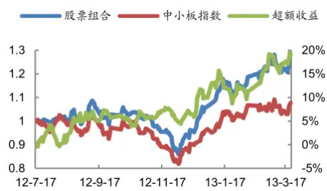
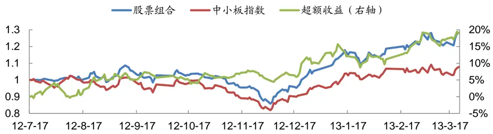
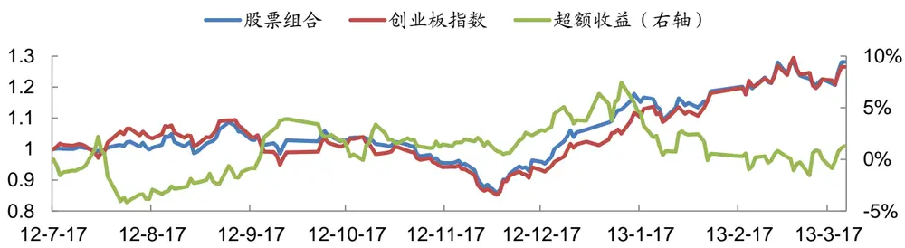

# 在中小板与创业板中挖掘调研机会

## 事件驱动策略量化研究系列专题之六

## 报告摘要：

## 第一时间获取调研信息

我们在“深交所互动易”平台（http://irm.cninfo.com.cn/szse/）的“投资者关系”专栏里收集调研记录，即“投资者关系活动记录表”。

我们发现，在“深交所互动易”平台上能第一时间获取到深圳 A 股的调研信息。此外，深圳A股中 85%以上的调研来自中小板和创业板，因此，我们重点关注中小板和创业板中的调研机会。

## 联合调研产生超额收益

我们对中小板股票和创业板股票分别测算调研发生后的超额收益，基准指数分为别中小板指数（399005）和创业板指数（399006）。

我们发现，调研发生后总体上不存在超额收益。知名分析师调研后存在一定的超额收益，前 3 名和前 5 名调研后的超额收益相差不大。大型基金公司调研后存在一定的超额收益，但不如知名分析师调研后的超额收益高。前 10大基金公司和前20大基金公司调研后的超额收益相差不大。

前N 名和前M大基金公司联合调研后均存在较高的超额收益，其中知名分析师前 5名和前10大基金公司联合调研后的超额收益最高。

## 构建股票组合

最终，我们选取如下策略构建股票组合：当一个中小板或创业板的股票被该行业的知名分析师前5名中的任何一名以及前10大基金公司中的任何一家联合调研后，在下一个交易日开盘时买入，持有 20 个交易日。如果买入日股票停牌，我们往后推迟至多 2 个交易日买入。如果停牌超过 2 个交易日或者买入日股票涨停，我们放弃此机会。此外，我们对 5 个交易日内一个股票的多次调研，我们只保留首次调研。

从 2012年7月17 日至2013年3月22 日，股票组合的累计绝对收益为28.16%，年化绝对收益为38.79%，年化夏普比率为166.96%，绝对收益的最大回撤为-21.02%。股票组合的平均仓位为80.61%。

以中小板指数（399005）为基准时，股票组合的累计超额收益为18.93%，年化超额收益为 25.51%，年化信息比率为 205.03%，超额收益的最大回撤为-6.02%。

以创业板指数（399006）为基准时，股票组合的累计超额收益为1.28%，年化超额收益为 1.49%，年化信息比率为 12.89%，超额收益的最大回撤为-8.37%。

## 风险提示

事件驱动选股策略并不适用于所有的市场环境，在极端市场环境下超额收益可能存在较大回撤风险。

图：股票组合相对中小板指数的表现

数据来源：Wind资讯、广发证券发展研究中心

分析师： 夏潇阳 S0260512030005

公021-60750625

xxy2@gf.com.cn

## 相关研究：

分析师首次关注股票的投资2013-02-18机会

岁末年初的事件驱动投资机 2012-12-06会

分析师调研带来的投资机会2012-07-24

## 一、第一时间获取调研信息

在《分析师调研带来的投资机会》这篇报告中，我们发现大券商的分析师发布调研报告后存在超额收益。然而由于种种原因，调研报告往往在实际调研发生后若一段时间才发布，如何第一时间获取调研信息呢？

我们在“深交所互动易”平台（http://irm.cninfo.com.cn/szse/）的“投资者关系”专栏里收集调研记录，即“投资者关系活动记录表”，“深交所互动易”上的调研信息起始于2012年7月，截止2013年3月22日，共有4411条调研记录。

我们计算每一条调研记录的公告日期和发生日期，并计算公告日期和发生日期之间的交易日天数差。统计显示，交易日天数差的均值为3.1732，中位数为1，超过95%的交易日天数差小于等于5。由此可见，在“深交所互动易”平台上能第一时间获取到深圳A股的调研信息。

我们发现，深圳A股中85%以上的调研来自中小板和创业板，因此，我们重点关注中小板和创业板中的调研机会。

## 二、联合调研产生超额收益

## 2.1 调研发生后总体上不存在超额收益

我们对中小板股票和创业板股票分别测算调研发生后的超额收益，基准指数分为别中小板指数（399005）和创业板指数（399006）。我们假设在看到调研信息后的下一个交易日开盘时买入，持有20个交易日。如果买入日股票停牌，我们往后推迟至多2个交易日买入。如果停牌超过2个交易日或者买入日股票涨停，我们放弃此机会。

从表1可以看出，调研发生后总体上不存在超额收益。

表1：调研发生后的平均超额收益

| 类型 | 绝对收益 | 超额收益 | 绝对收益胜率 | 超额收益胜率 | 绝对收益t值 | 超额收益t值 | 样本数量 |
| --- | --- | --- | --- | --- | --- | --- | --- |
| 中小板总体 | 2.13% | 0.65% | 52.76% | 47.28% | 8.0017 | 3.2148 | 2098 |
| 创业板总体 | 1.57% | 0.05% | 48.55% | 45.23% | 3.5648 | 0.1709 | 964 |

数据来源：Wind资讯、广发证券发展研究中心

## 2.2 知名分析师调研后存在超额收益

首先，我们考察知名分析师调研后是否存在超额收益。我们使用某知名分析师2011和2012年的排名，如果买入日期在2012年12月1日之前，我们使用2011年的排名；如果买入日期在2012年12月1日之后，我们使用2012年的排名。对于未来的调研案例，我们也做类似的处理。

我们关心的问题是：当一个股票被该行业的知名分析师前N名中的任何一名调研后，是否存在超额收益。我们分别考察知名分析师前3名和知名分析师前5名调研后的超额收益。此外，我们对5个交易日内一个股票的多次调研，我们只保留首次调研。

从表2可以看出，知名分析师调研后存在一定的超额收益，前3名和前5名调研后的超额收益相差不大。

表2：知名分析师前N名调研后的平均超额收益

| 类型 | 绝对收益 | 超额收益 | 绝对收益胜率 | 超额收益胜率 | 绝对收益t值 | 超额收益t值 样本数量 |  |
| --- | --- | --- | --- | --- | --- | --- | --- |
| 前3名中小板 | 2.26% | 1.30% | 52.71% | 49.46% | 3.0815 | 2.4362 | 277 |
| 前3名创业板 | 1.43% | 0.72% | 48.15% | 46.91% | 1.3381 | 0.9792 | 162 |
| 前5名中小板 | 2.37% | 0.97% | 53.56% | 48.81% | 3.7653 | 2.0718 | 379 |
| 前5名创业板 | 2.23% | 1.16% | 50.88% | 50.44% | 2.4274 | 1.9275 | 226 |

数据来源：Wind资讯、广发证券发展研究中心

## 2.3 大型基金公司调研后存在超额收益

接下来，我们考察大型基金公司调研后是否存在超额收益，我们按基金公司管理资产的规模进行排序。

我们关心的问题是：当一个股票被前M大基金公司中的任何一家调研后，是否存在超额收益。我们分别考察前10大基金公司和前20大基金公司调研后的超额收益。此外，我们对5个交易日内一个股票的多次调研，我们只保留首次调研。

从表3可以看出，大型基金公司调研后存在一定的超额收益，但不如知名分析师调研后的超额收益高。前10大基金公司和前20大基金公司调研后的超额收益相差不大。

表3：前 M 大基金公司调研后的平均超额收益

| 类型 | 绝对收益 | 超额收益 | 绝对收益胜率 | 超额收益胜率 | 绝对收益t值 | 超额收益t值 | 样本数量 |
| --- | --- | --- | --- | --- | --- | --- | --- |
| 前10大中小板 | 2.20% | 0.98% | 53.03% | 49.35% | 3.9013 | 2.3448 | 462 |
| 前10大创业板 | 0.10% | 0.36% | 45.53% | 47.15% | 0.1178 | 0.6399 | 246 |
| 前20大中小板 | 2.05% | 0.78% | 53.06% | 48.76% | 4.2227 | 2.1615 | 605 |
| 前20大创业板 | 0.42% | 0.43% | 46.67% | 47.58% | 0.5507 | 0.8287 | 330 |

数据来源：Wind资讯、广发证券发展研究中心

## 2.4 联合调研后存在较高的超额收益

既然知名分析师和大型基金公司调研后都存在一定的超额收益，那么知名分析

## 师和大型基金公司联合调研后，是否存在较高的超额收益呢？

我们关心的问题是：当一个股票被该行业的知名分析师前N名中的任何一名以及前M大基金公司中的任何一家联合调研后，是否存在较高的超额收益。我们分别考察知名分析师前3名或知名分析师前5名与前10大基金公司或前20大基金公司联合调研后的超额收益。此外，我们对5个交易日内一个股票的多次调研，我们只保留首次调研。

从表4可以看出，前N名和前M大基金公司联合调研后均存在较高的超额收益，其中{N,M}={5,10}即知名分析师前5名和前10大基金公司联合调研后的超额收益最高。

表4：知名分析师前N名和前M大基金公司联合调研后的平均超额收益

| 类型{N,M} | 绝对收益 | 超额收益 | 绝对收益胜率 | 超额收益胜率 | 绝对收益t值 | 超额收益t值 | 样本数量 |
| --- | --- | --- | --- | --- | --- | --- | --- |
| {3,10}中小版 | 1.68% | 1.27% | 47.22% | 50.93% | 1.3119 | 1.4195 | 108 |
| {3,10}创业板 | 1.28% | 1.29% | 46.48% | 49.30% | 0.7848 | 1.2156 | 71 |
| {3,20}中小版 | 1.81% | 0.90% | 51.05% | 50.35% | 1.6550 | 1.2062 | 143 |
| {3,20}创业板 | 0.88% | 1.19% | 47.87% | 50.00% | 0.5990 | 1.1982 | 94 |
| {5,10}中小版 | 2.19% | 1.38% | 48.95% | 51.75% | 1.9900 | 1.7535 | 143 |
| {5,10}创业板 | 1.22% | 1.09% | 47.87% | 50.00% | 0.8854 | 1.2307 | 94 |
| {5,20}中小版 | 2.27% | 1.03% | 52.94% | 50.80% | 2.4281 | 1.5514 | 187 |
| {5,20}创业板 | 0.92% | 1.03% | 47.97% | 50.41% | 0.7386 | 1.2400 | 123 |

数据来源：Wind资讯、广发证券发展研究中心

## 三、构建股票组合

最终，我们选取如下策略构建股票组合：当一个中小板或创业板的股票被该行业的知名分析师前5名中的任何一名以及前10大基金公司中的任何一家联合调研后，在下一个交易日开盘时买入，持有20个交易日。如果买入日股票停牌，我们往后推迟至多2个交易日买入。如果停牌超过2个交易日或者买入日股票涨停，我们放弃此机会。此外，我们对5个交易日内一个股票的多次调研，我们只保留首次调研。

我们按如下方法构建股票组合：

1. 假设初始资金为1；

2. 当第i天内有Mi个股票需要买入时，我们假设这些股票等权重同时买入，买入时，每只股票的股票数量定义为1/M；

3. 累计可买股票数量为N，在这里我们假设N=10，当有股票买入时，可买数量减少1/M，当有股票卖出时，可买数量增加1/M；

4. 当第i天的可买数量大于等于1时，我们买入当天需要买入的股票，买入时，每只股票的买入数量为剩余资金/Mi/Oj(j=1…Mi)；

5. 交易成本假设为双向0.5%。

识别风险，发现价值

从2012年7月17日至2013年3月22日，股票组合的累计绝对收益为28.16%，年化绝对收益为38.79%，年化夏普比率为166.96%，绝对收益的最大回撤为-21.02%。股票组合的平均仓位为80.61%。

以中小板指数（399005）为基准时，股票组合的累计超额收益为18.93%，年化超额收益为25.51%，年化信息比率为205.03%，超额收益的最大回撤为-6.02%，如图1所示。

图1：股票组合相对中小板指数的表现

数据来源：Wind资讯、广发证券发展研究中心

以创业板指数（399006）为基准时，股票组合的累计超额收益为1.28%，年化超额收益为1.49%，年化信息比率为12.89%，超额收益的最大回撤为-8.37%，如图2所示。

图2：股票组合相对创业板指数的表现

数据来源：Wind资讯、广发证券发展研究中心

## 风险提示

事件驱动选股策略并不适用于所有的市场环境，在极端市场环境下超额收益可能存在较大回撤风险。

## Table_Res arch 广发金融工程研究小组

罗 军： 首席分析师，华南理工大学理学硕士，2010年进入广发证券发展研究中心。

俞文冰： 首席分析师，CFA，上海财经大学统计学硕士，2012年进入广发证券发展研究中心。

叶 涛： 资深分析师，CFA，上海交通大学管理科学与工程硕士，2012年进入广发证券发展研究中心。

安宁宁： 资深分析师，暨南大学数量经济学硕士，2011年进入广发证券发展研究中心。

胡海涛： 分析师，华南理工大学理学硕士，2010年进入广发证券发展研究中心。

夏潇阳： 分析师，上海交通大学金融工程硕士，2012年进入广发证券发展研究中心。

汪 鑫： 分析师，中国科学技术大学金融工程硕士，2012年进入广发证券发展研究中心。

蓝昭钦： 分析师，中山大学理学硕士，2010年进入广发证券发展研究中心。

史庆盛： 研究助理，华南理工大学金融工程硕士，2011年进入广发证券发展研究中心。

张 超： 研究助理，中山大学理学硕士，2012年进入广发证券发展研究中心。

## Table_RatingIndustry 广发证券—行业投资评级说明

买入： 预期未来12个月内，股价表现强于大盘10%以上。

持有： 预期未来12个月内，股价相对大盘的变动幅度介于-10%～+10%。

卖出： 预期未来12个月内，股价表现弱于大盘10%以上。

## Table_RatingCompany 广发证券—公司投资评级说明

买入： 预期未来12个月内，股价表现强于大盘15%以上。

谨慎增持： 预期未来12个月内，股价表现强于大盘5%-15%。

持有： 预期未来12个月内，股价相对大盘的变动幅度介于-5%～+5%。

卖出： 预期未来12个月内，股价表现弱于大盘5%以上。

## Table_Ad联系我们

|  | 广州市 | 深圳市 | 北京市 | 上海市 |
| --- | --- | --- | --- | --- |
| 地址 | 广州市天河北路183号 大都会广场5楼 | 深圳市福田区金田路4018 号安联大厦 15 楼 A 座 | 北京市西城区月坛北街2号 月坛大厦18层 | 上海市浦东新区富城路99号 震旦大厦 18楼 |
|  |  | 03-04 |  |  |
| 邮政编码 | 510075 | 518026 | 100045 | 200120 |
| 客服邮箱 | gfyf@gf.com.cn |  |  |  |
| 服务热线 | 020-87555888-8612 |  |  |  |

## Table_Disclaimer 免 责声 明

广发证券股份有限公司具备证券投资咨询业务资格。本报告只发送给广发证券重点客户，不对外公开发布。

本报告所载资料的来源及观点的出处皆被广发证券股份有限公司认为可靠，但广发证券不对其准确性或完整性做出任何保证。报告内容仅供参考，报告中的信息或所表达观点不构成所涉证券买卖的出价或询价。广发证券不对因使用本报告的内容而引致的损失承担任何责任，除非法律法规有明确规定。客户不应以本报告取代其独立判断或仅根据本报告做出决策。

广发证券可发出其它与本报告所载信息不一致及有不同结论的报告。本报告反映研究人员的不同观点、见解及分析方法，并不代表广发证券或其附属机构的立场。报告所载资料、意见及推测仅反映研究人员于发出本报告当日的判断，可随时更改且不予通告。

本报告旨在发送给广发证券的特定客户及其它专业人士。未经广发证券事先书面许可，任何机构或个人不得以任何形式翻版、复制、刊登、转载和引用，否则由此造成的一切不良后果及法律责任由私自翻版、复制、刊登、转载和引用者承担。