# 在深度报告中挖掘事件驱动投资机会

## 事件驱动策略量化研究系列专题之七

## 报告摘要：

## 深度报告数量在时间上分布均匀

我们把研究报告分为五类：新股报告、调研报告、业绩点评、普通点评和深度报告。深度报告在时间上分布均匀，比普通点评略差，但比调研报告要好，且远好于业绩点评。

## 报告评级对超额收益的影响

优秀与未知评级的深度报告，在深度报告发布后的下一个交易日开盘时买入，持有20 个交易日的超额收益较高。

考虑交易成本后，持有 40 个交易日的平均超额收益普遍高于持有 20个交易日的平均超额收益的 2倍。因此，我们将持仓周期拉长至 40 个交易日。

分析师发布优秀评级或未知评级的深度报告后，推迟5个交易日买入，持有 40 个交易日，使用动态资金规划方法，从2010 年至今，股票组合相对沪深 300 指数的累计超额收益为 62.59%，年化超额收益为 12.65%，年化信息比率为112.26%，超额收益的最大回撤为-15.53%。

## 分析师对超额收益的影响

知名分析师或大型券商分析师发布深度报告后，持有 40个交易日的超额收益较高。

大型券商分析师发布深度报告后，推迟5 个交易日买入，持有40 个交易日，使用动态资金规划方法，从 2010 年至今，股票组合相对沪深 300指数的累计超额收益为 92.98%，年化超额收益为18.02%，年化信息比率为 140.91%，超额收益的最大回撤为-20.52%。

## 报告评级和分析师对超额收益有着共同作用

大型券商的分析师发布优秀评级或未知评级的深度报告后，推迟 5 个交易日买入，持有40个交易日，使用动态资金规划方法，从 2010 年至今，股票组合相对沪深 300 指数的累计超额收益为 97.77%，年化超额收益为18.53%，年化信息比率为 135.93%，超额收益的最大回撤为-20.82%。

## 风险提示

事件驱动选股策略并不适用于所有的市场环境，在极端市场环境下超额收益可能存在较大回撤风险。

图：深度报告股票组合表现
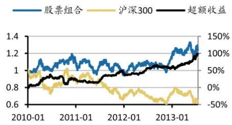
数据来源：Wind资讯、广发证券发展研究中心

分析师： 夏潇阳 S0260512030005

公021-60750625

xxy2@gf.com.cn

## 相关研究：

在中小板与创业板中挖掘调2013-03-26研机会

分析师首次关注股票的投资2013-02-18机会

分析师调研带来的投资机会2013-07-24

## 一、深度报告数量在时间上分布均匀

在《分析师调研带来的投资机会》这篇报告中，我们发现大型券商的分析师发布调研报告后存在超额收益。那么分析师发布深度报告后是否存在投资机会？什么类型的深度报告才具有投资价值？

我们把研究报告分为五类：新股报告、调研报告、业绩点评、普通点评和深度报告。其中，业绩点评是指对上市公司定期报告、业绩快报或业绩预告的点评。

我们统计2010年1月至2013年6月期间每个月不同类型的报告数量，从标准差/均值和最大值/最小值两个指标可以看出，深度报告在时间上分布均匀，比普通点评略差，但比调研报告要好，且远好于业绩点评。如表1和图1所示。

表 1：2010年1月至 2013年 6月期间每个月不同类型的报告数量

| 月份 | 业绩点评 | 调研报告 | 深度报告 普通点评 |
| --- | --- | --- | --- |
| 2012年7月 | 1155 | 210 201 | 852 |
| 2012年8月 | 5662 | 110 136 | 563 |
| 2012年9月 | 521 | 147 282 | 775 |
| 2012年10月 | 4071 | 50 117 | 380 |
| 2012年11月 | 1245 | 188 | 183 1021 |
| 2012年12月 | 66 | 123 308 | 1148 |
| 2013年1月 | 1165 | 167 198 | 992 |
| 2013年2月 | 916 | 100 166 | 551 |
| 2013年3月 | 3795 | 216 208 | 651 |
| 2013年4月 | 5217 | 93 117 | 351 |
| 2013年5月 | 974 | 218 298 | 1075 |
| 2013年6月 | 22 | 104 226 | 795 |
| 均值 | 1812.81 | 104.619 | 174 752.9524 |
| 标准差 | 1874.31 | 53.2779 65.93271 | 244.1811 |
| 标准差/均值 | 1.033926 | 0.509256 0.378924 | 0.324298 |
| 最大值 | 5709 | 225 308 | 1235 |
| 最小值 | 22 | 34 | 78 351 |
| 最大值/最小值 | 259.5 | 6.617647 | 3.948718 3.518519 |

数据来源：Wind资讯、广发证券发展研究中心

图1：2010年1月至2013年6月期间每个月的深度报告数量图
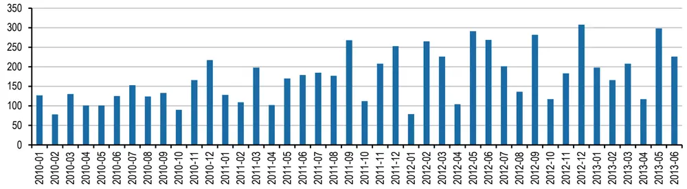
数据来源：Wind资讯、广发证券发展研究中心

## 二、报告评级对超额收益的影响

首先，我们考察报告评级对超额收益的影响，我们将报告评级分为五档，分别是：

- 买入、强烈推荐（或强推、强买）、推荐

- 增持、谨慎推荐

- 持有、中性

- 卖出（或减持）

- 未知（或无投资评级）

我们假设在深度报告发布后的下一个交易日开盘时买入，持有20个交易日。如果买入日股票停牌，我们往后推迟至多2个交易日买入。如果停牌超过2个交易日或者买入日股票涨停，我们放弃此机会。

不同评级的深度报告持有20个交易日的超额收益如表2所示。可以看出，买入类评级的深度报告超额收益最高，“强烈推荐”这四个字更多体现了分析师的乐观，因此强烈推荐评级的深度报告超额收益高于买入评级和推荐评级。增持类评级的深度报告超额收益其次，“谨慎推荐”这四个字更多体现了分析师的谨慎，因此谨慎推荐评级的深度报告超额收益不如增持评级，甚至为负。持有类评级的深度报告超额收益小于0，而卖出类评级的深度报告超额收益明显小于0。此外，未知评级的深度报告超额收益较高。

表 2：不同评级的深度报告持有 20个交易日的超额收益

| 评级 | 股票数量 平均超额收益 |
| --- | --- |
| 买入 | 2690 1.45% |
| 强烈推荐 | 259 2.60% |
| 推荐 | 1519 1.02% |
| 增持 | 1466 1.00% |
| 谨慎推荐 | 126 -0.82% |
| 持有 | 169 -0.82% |
| 中性 | 276 -0.15% |
| 卖出 | 20 -5.81% |
| 未知 | 518 1.48% |

数据来源：Wind资讯、广发证券发展研究中心

那么是否所有类型的研究报告的超额收益都会受到报告评级的影响呢？我们考察报告评级对调研报告的超额收益的影响，不同评级的调研报告持有20个交易日的超额收益如表3所示。可以看出买入、强烈推荐、增持和谨慎推荐评级的调研报告超额收益相差不大。

表 3：不同评级的调研报告持有 20个交易日的超额收益

| 评级 | 股票数量 平均超额收益 |
| --- | --- |
| 买入 | 537 1.56% |
| 强烈推荐 | 130 1.46% |
| 推荐 | 1373 0.87% |
| 增持 | 904 1.82% |
| 谨慎推荐 | 131 1.81% |
| 持有 | 68 -0.09% |
| 中性 | 179 0.21% |
| 未知 | 1005 1.74% |

数据来源：Wind资讯、广发证券发展研究中心

我们将买入、强烈推荐、推荐和增持评级统称为优秀评级，我们选择优秀与未知评级的深度报告，持有20个交易日的分年超额收益和每月超额收益如表4和图2所示。

表 4：优秀与未知评级的深度报告持有 20个交易日的分年超额收益

| 年份 | 股票数量 | 平均超额收益 | 超额收益胜率 | 超额收益t值 |
| --- | --- | --- | --- | --- |
| 2010 | 1362 | 1.10% | 50.81% | 3.427286 |
| 2011 | 1892 | -0.18% | 46.88% | -0.8008 |
| 2012 | 2185 | 1.28% | 52.31% | 6.288977 |
| 2013 | 1085 | 4.99% | 62.12% | 13.71935 |
| 平均 | 6524 | 1.44% | 52.05% | 10.84037 |

数据来源：Wind资讯、广发证券发展研究中心

图2：优秀与未知评级的深度报告持有20个交易日的每月超额收益图
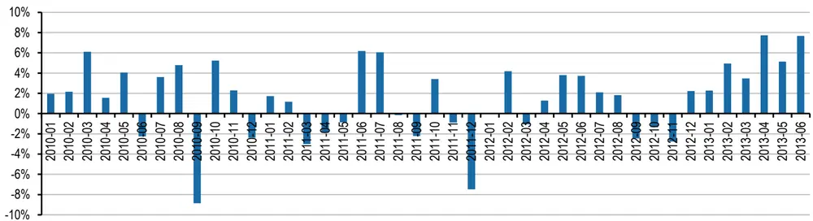
数据来源：Wind资讯、广发证券发展研究中心

接下来，我们考察持有时间对超额收益的影响，不同评级的深度报告持有20个交易日和40个交易日的超额收益如表5所示。可以看出，考虑交易成本后，持有40个交易日的平均超额收益普遍高于持有20个交易日的平均超额收益的2倍。因此，我们将持仓周期拉长至40个交易日。

表 5：不同评级的深度报告持有 20和 40个交易日的超额收益

| 评级 | 20 日 | 40 日 | 40 天/20 天 | 40 天/20 天(考虑成本) |
| --- | --- | --- | --- | --- |
| 买入 | 1.45% | 2.14% | 1.476111163 | 1.726695986 |
| 强烈推荐 | 2.60% | 3.82% | 1.468644215 | 1.58022617 |
| 推荐 | 1.02% | 1.60% | 1.569470828 | 2.117038931 |
| 增持 谨慎推荐 | 1.00% | 1.82% | 1.82262925 | 2.645258501 |
| 持有 | -0.82% -0.82% | -2.52% -0.56% |  |  |
| 中性 | -0.15% | -0.39% |  |  |
| 卖出 | -5.81% | -6.16% |  |  |
| 未知 | 1.48% | 3.16% | 2.135769059 | 2.715243068 |

数据来源：Wind资讯、广发证券发展研究中心

优秀与未知评级的深度报告，持有40个交易日的分年超额收益和每月超额收益

如表6和图3所示。

表 6：优秀与未知评级的深度报告持有 40个交易日的分年超额收益

| 年份 | 股票数量 | 平均超额收益 | 超额收益胜率 | 超额收益t值 |
| --- | --- | --- | --- | --- |
| 2010 | 1362 | 2.49% | 50.44% | 5.926666 |
| 2011 | 1892 | -0.12% | 44.77% | -0.38079 |
| 2012 | 2185 | 1.56% | 50.53% | 5.425767 |
| 2013 | 825 | 9.13% | 66.06% | 14.89961 |
| 平均 | 6264 | 2.25% | 50.81% | 12.06555 |

数据来源：Wind资讯、广发证券发展研究中心

图3：优秀与未知评级的深度报告持有40个交易日的每月超额收益图
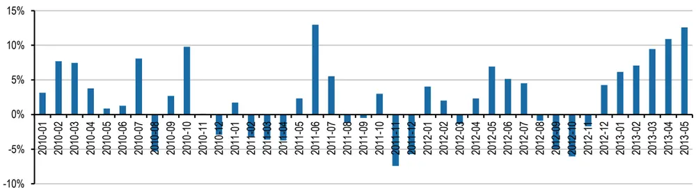
数据来源：Wind资讯、广发证券发展研究中心

和其它的事件驱动选股策略一样，我们对其应用动态资金规划方法来构建股票组合。我们选取的目标函数要求尽量分散投资，以规避风险，并且要求资金的使用效率尽可能高。

我们假设在深度报告发布后5个交易日的收盘时买入，持有40个交易日，这样可以留给动态资金规划方法一定的提前预判时间。

优秀与未知评级的深度报告，推迟5个交易日买入，持有40个交易日的分年超额收益和每月超额收益如表7和图4所示，我们发现推迟买入和不推迟买入的超额收益差别不大。

表 7：优秀与未知评级的深度报告推迟买入持有40个交易日的分年超额收益

| 年份 | 股票数量 | 平均超额收益 | 超额收益胜率 | 超额收益t值 |
| --- | --- | --- | --- | --- |
| 2010 | 1321 | 2.09% | 48.75% | 4.88144 |
| 2011 | 1856 | -0.20% | 45.20% | -0.6492 |
| 2012 | 2182 | 1.05% | 49.45% | 3.815618 |
| 2013 | 852 | 8.92% | 66.43% | 14.87962 |
| 平均 | 6211 | 1.98% | 50.36% | 10.73825 |

数据来源：Wind资讯、广发证券发展研究中心
识别风险，发现价值

图4：优秀与未知评级的深度报告推迟买入持有40个交易日的每月超额收益图
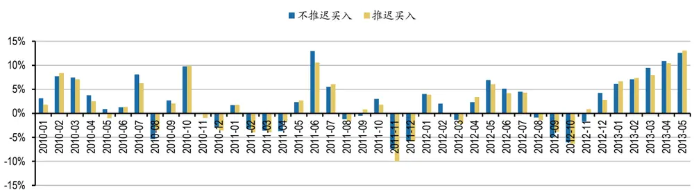
数据来源：Wind资讯、广发证券发展研究中心

使用动态资金规划方法后，从2010年至今，股票组合相对沪深300指数的累计超额收益为62.59%，年化超额收益为12.65%，年化信息比率为112.26%，超额收益的最大回撤为-15.53%。如图5所示。

图5：优秀与未知评级的深度报告持有40个交易日的股票组合表现
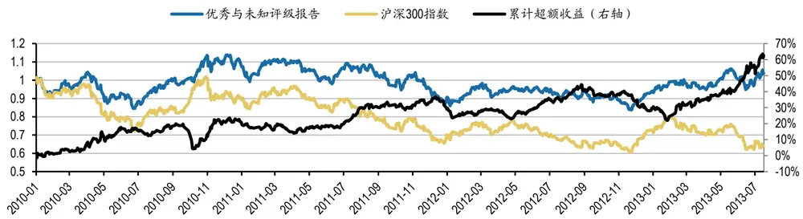
数据来源：Wind资讯、广发证券发展研究中心

## 三、分析师对超额收益的影响

我们首先考察分析师的知名度对超额收益的影响，我们使用某知名分析师排名的结果来衡量分析师的知名度，并在每年的12月1日对排名做调整。不同知名度的分析师发布深度报告后，持有40个交易日的超额收益如表8和表9所示。可以看出，知名分析师前3名发布深度报告后的超额收益较高。

表 8：不同知名度的分析师发布深度报告后 40个交易日的超额收益

| 排名（第） | 股票数量 | 平均超额收益 |
| --- | --- | --- |
| 1 | 232 | 3.02% |
| 2 | 223 | 2.47% |
| 3 | 230 | 2.71% |
| 4 | 167 | 2.17% |
| 5 | 157 | -0.46% |

数据来源：Wind资讯、广发证券发展研究中心

表 9：不同知名度的分析师发布深度报告后 40个交易日的超额收益（续）

| 排名（前） | 股票数量 | 平均超额收益 |
| --- | --- | --- |
| 1 | 232 | 3.02% |
| 2 | 455 | 2.75% |
| 3 | 685 | 2.74% |
| 4 | 852 | 2.63% |
| 5 | 1009 | 2.15% |

数据来源：Wind资讯、广发证券发展研究中心

知名分析师前3名发布深度报告后，持有40个交易日的分年超额收益和每月超额收益如表10和图6所示。

表 10：知名分析师前3名发布深度报告后 40个交易日的分年超额收益

| 年份 | 股票数量 | 平均超额收益 | 超额收益胜率 | 超额收益t值 |
| --- | --- | --- | --- | --- |
| 2010 | 182 | 3.63% | 56.04% | 3.358747 |
| 2011 | 200 | -1.06% | 41.00% | -1.02304 |
| 2012 | 202 | 3.79% | 55.94% | 3.944238 |
| 2013 | 101 | 6.55% | 63.37% | 4.448277 |
| 平均 | 685 | 2.74% | 52.70% | 4.91019 |

数据来源：Wind资讯、广发证券发展研究中心

图6：知名分析师前3名发布深度报告后40个交易日的每月超额收益图
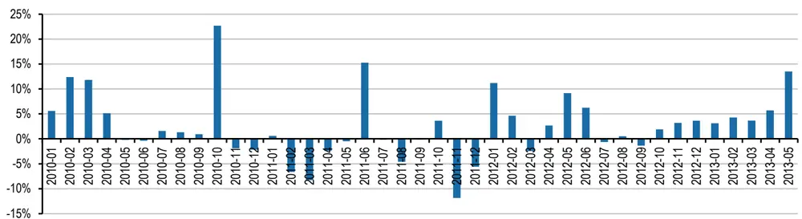
数据来源：Wind资讯、广发证券发展研究中心

知名分析师前3名发布深度报告后，推迟5个交易日买入，持有40个交易日的分年超额收益和每月超额收益如表11和图7所示，我们发现推迟买入和不推迟买入的超额收益差别不大。

表 11：知名分析师前3名发布深度报告后推迟买入的分年超额收益

| 年份 | 股票数量 | 平均超额收益 | 超额收益胜率 | 超额收益t值 |
| --- | --- | --- | --- | --- |
| 2010 | 177 | 2.15% | 50.85% | 1.981885 |
| 2011 | 197 | 0.11% | 38.58% | 0.101975 |
| 2012 | 200 | 2.03% | 50.50% | 2.288359 |
| 2013 | 101 | 6.47% | 55.45% | 3.676508 |
| 平均 | 675 | 2.16% | 47.85% | 3.836913 |

数据来源：Wind资讯、广发证券发展研究中心

图7：知名分析师前3名发布深度报告后推迟买入的每月超额收益图
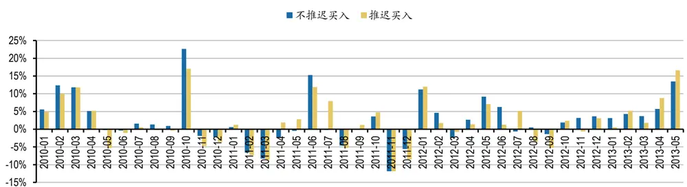
数据来源：Wind资讯、广发证券发展研究中心

使用动态资金规划方法后，从2010年至今，股票组合相对沪深300指数的累计超额收益为69.58%，年化超额收益为14.35%，年化信息比率为112.25%，超额收益的最大回撤为-13.34%。如图8所示。

图8：知名分析师前3名发布深度报告后持有40个交易日的股票组合表现
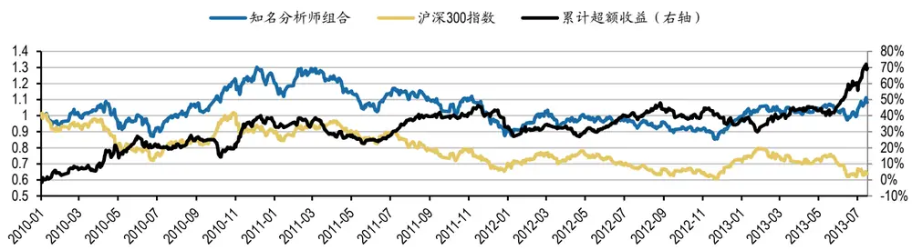
数据来源：Wind资讯、广发证券发展研究中心

接下来，我们考察分析师所在券商的排名对超额收益的影响，我们使用股票交易佣金排名来衡量券商的排名。不同排名券商的分析师发布深度报告后，持有40个交易日的超额收益如表12所示。可以看出，1-5名券商的分析师发布深度报告后的超额收益较高。

表 12：不同排名券商的分析师发布深度报告后 40个交易日的超额收益

| 券商排名 | 股票数量 | 平均超额收益 |
| --- | --- | --- |
| 1-5 | 876 | 3.23% |
| 6-10 | 981 | 1.96% |
| 11-20 | 2307 | 2.27% |
| 21-30 | 1435 | 1.05% |

数据来源：Wind资讯、广发证券发展研究中心

我们把排名1-5名券商称为大型券商，大型券商的分析师发布深度报告后，持有40个交易日的分年超额收益和每月超额收益如表13和图9所示。

表 13：大型券商的分析师发布深度报告后 40个交易日的分年超额收益

| 年份 | 股票数量 | 平均超额收益 | 超额收益胜率 | 超额收益t值 |
| --- | --- | --- | --- | --- |
| 2010 | 167 | 3.80% | 55.69% | 3.133882 |
| 2011 | 252 | 0.10% | 44.44% | 0.119601 |
| 2012 | 328 | 2.32% | 52.13% | 3.235387 |
| 2013 | 129 | 10.92% | 66.67% | 6.583842 |
| 平均 | 876 | 3.23% | 52.74% | 6.31939 |

数据来源：Wind资讯、广发证券发展研究中心

图9：大型券商的分析师发布深度报告后40个交易日的每月超额收益图
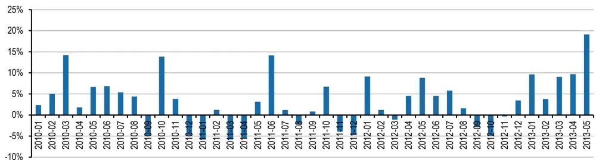
数据来源：Wind资讯、广发证券发展研究中心

大型券商的分析师发布深度报告后，推迟5个交易日买入，持有40个交易日的分年超额收益和每月超额收益如表14和图10所示，我们发现推迟买入和不推迟买入的超额收益差别不大。

表 14：大型券商的分析师发布深度报告后推迟买入的分年超额收益

| 年份 | 股票数量 | 平均超额收益 | 超额收益胜率 | 超额收益t值 |
| --- | --- | --- | --- | --- |
| 2010 | 158 | 2.90% | 50.63% | 2.295245 |
| 2011 | 250 | 0.39% | 45.60% | 0.436929 |
| 2012 | 317 | 1.61% | 51.74% | 2.342345 |
| 2013 | 141 | 8.70% | 63.83% | 5.406352 |
| 平均 | 866 | 2.65% | 51.73% | 5.202747 |

数据来源：Wind资讯、广发证券发展研究中心

图10：大型券商的分析师发布深度报告后推迟买入的每月超额收益图
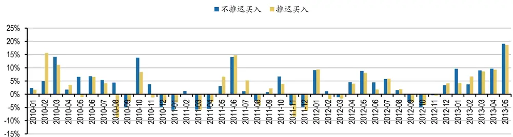
数据来源：Wind资讯、广发证券发展研究中心

使用动态资金规划方法后，从2010年至今，股票组合相对沪深300指数的累计超额收益为92.98%，年化超额收益为18.02%，年化信息比率为140.91%，超额收益的最大回撤为-20.52%。如图11所示。

图11：大型券商的分析师发布深度报告后持有40个交易日的股票组合表现
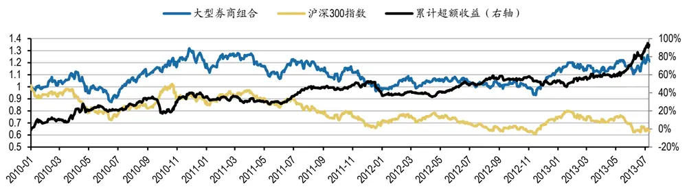
数据来源：Wind资讯、广发证券发展研究中心

此外我们发现，大型券商的分析师发布深度报告后持有40个交易日的股票组合表现略好于知名分析师前3名发布深度报告后持有40个交易日的股票组合表现。

## 四、报告评级和分析师对超额收益有着共同作用

我们首先考察知名分析师发布深度报告的评级对超额收益的影响，不同评级的深度报告持有40个交易日的超额收益如表15所示，买入、强烈推荐、增持和未知评级的知名分析师深度报告超额收益较高。

表 15：优秀与未知评级的知名分析师深度报告的超额收益

| 评级 | 股票数量 | 平均超额收益 |
| --- | --- | --- |
| 买入 | 205 | 2.78% |
| 强烈推荐 | 8 | 3.46% |
| 推荐 | 146 | 1.33% |
| 增持 | 168 | 3.60% |
| 谨慎推荐 | 16 | -3.11% |
| 持有 | 14 | 0.27% |
| 中性 | 13 | 0.07% |
| 未知 | 116 | 4.92% |

数据来源：Wind资讯、广发证券发展研究中心

我们将买入、强烈推荐和增持级统称为优秀评级，我们选择优秀与未知评级的大型券商深度报告，持有40个交易日的分年超额收益和每月超额收益如表16和图12所示。

识别风险，发现价值

表 16：优秀与未知评级的知名分析师深度报告的分年超额收益

| 年份 | 股票数量 | 平均超额收益 | 超额收益胜率 | 超额收益t值 |
| --- | --- | --- | --- | --- |
| 2010 | 131 | 5.11% | 64.12% | 3.95926 |
| 2011 | 149 | -0.70% | 41.61% | -0.53237 |
| 2012 | 151 | 5.23% | 60.93% | 4.676735 |
| 2013 | 66 | 6.34% | 65.15% | 3.654255 |
| 平均 | 497 | 3.57% | 56.54% | 5.29594 |

数据来源：Wind资讯、广发证券发展研究中心

图12：优秀与未知评级的知名分析师深度报告的每月超额收益图
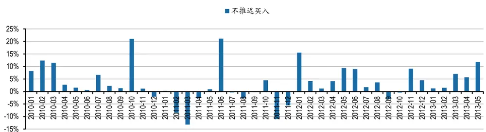
数据来源：Wind资讯、广发证券发展研究中心

大型券商的分析师发布深度报告后，推迟5个交易日买入，持有40个交易日的分年超额收益和每月超额收益如表17和图13所示，我们发现推迟买入和不推迟买入的超额收益差别不大。

表 17：优秀与未知评级的知名分析师深度报告推迟买入的分年超额收益

| 年份 | 股票数量 | 平均超额收益 | 超额收益胜率 | 超额收益t值 |
| --- | --- | --- | --- | --- |
| 2010 | 128 | 2.89% | 53.91% | 2.294728 |
| 2011 | 145 | 0.86% | 39.31% | 0.648434 |
| 2012 | 149 | 2.86% | 54.36% | 2.7283 |
| 2013 | 67 | 5.87% | 59.70% | 3.152153 |
| 平均 | 489 | 2.69% | 50.51% | 4.084446 |

数据来源：Wind资讯、广发证券发展研究中心

图13：优秀与未知评级的知名分析师深度报告推迟买入的每月超额收益图
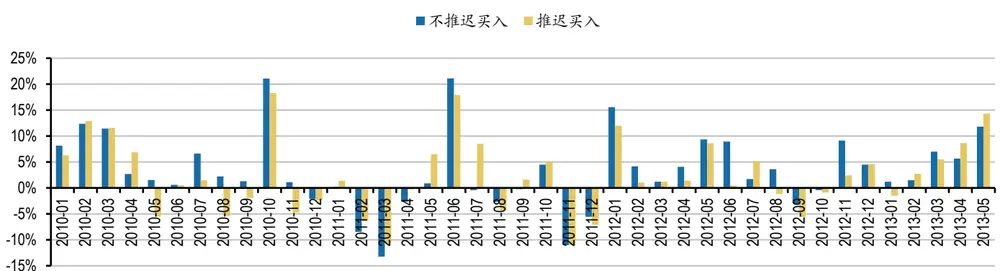
数据来源：Wind资讯、广发证券发展研究中心

使用动态资金规划方法后，从2010年至今，股票组合相对沪深300指数的累计超额收益为75.50%，年化超额收益为15.55%，年化信息比率为115.88%，超额收益的最大回撤为-13.78%。如图14所示。

图14：优秀与未知评级的知名分析师深度报告的股票组合表现
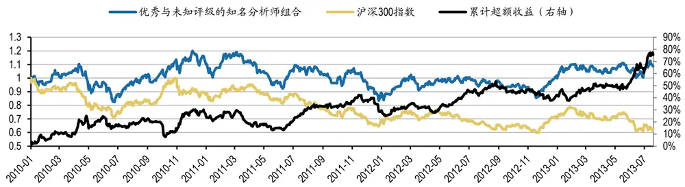
数据来源：Wind资讯、广发证券发展研究中心

接下来，我们考察大型券商的分析师发布深度报告的评级对超额收益的影响，不同评级的深度报告持有40个交易日的超额收益如表18所示，买入、推荐和未知评级的大型券商深度报告超额收益较高。

表 18：不同评级的大型券商深度报告持有 40个交易日的超额收益

| 评级 | 股票数量 平均超额收益 |
| --- | --- |
| 买入 209 | 3.14% |
| 推荐 | 103 4.54% |
| 增持 | 413 2.76% |
| 持有 | 15 -2.67% |
| 中性 | 13 -0.91% |
| 未知 130 | 5.19% |

数据来源：Wind资讯、广发证券发展研究中心

我们将买入和推荐评级统称为优秀评级，我们选择优秀与未知评级的大型券商深度报告，持有40个交易日的分年超额收益和每月超额收益如表19和图15所示。

表 19：优秀与未知评级的大型券商深度报告的分年超额收益

| 年份 | 股票数量 | 平均超额收益 | 超额收益胜率 | 超额收益t值 |
| --- | --- | --- | --- | --- |
| 2010 | 73 | 3.96% | 56.16% | 2.033738 |
| 2011 | 136 | 1.49% | 47.06% | 1.187478 |
| 2012 | 152 | 3.46% | 54.61% | 3.319765 |
| 2013 | 79 | 10.08% | 65.82% | 5.160064 |
| 平均 | 440 | 4.12% | 54.55% | 5.696625 |

数据来源：Wind资讯、广发证券发展研究中心

图15：优秀与未知评级的大型券商深度报告的每月超额收益图
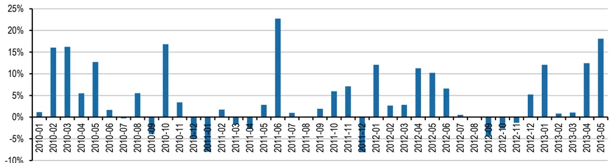
数据来源：Wind资讯、广发证券发展研究中心

大型券商的分析师发布深度报告后，推迟5个交易日买入，持有40个交易日的分年超额收益和每月超额收益如表20和图16所示，我们发现推迟买入和不推迟买入的超额收益差别不大。

表 20：优秀与未知评级的大型券商深度报告推迟买入的分年超额收益

| 年份 | 股票数量 | 平均超额收益 | 超额收益胜率 | 超额收益t值 |
| --- | --- | --- | --- | --- |
| 2010 | 67 | 2.80% | 50.75% | 1.331299 |
| 2011 | 141 | 1.42% | 48.23% | 1.154953 |
| 2012 | 153 | 2.31% | 57.52% | 2.382069 |
| 2013 | 76 | 8.00% | 65.79% | 4.170429 |
| 平均 | 437 | 3.09% | 54.92% | 4.382512 |

数据来源：Wind资讯、广发证券发展研究中心

图16：优秀与未知评级的大型券商深度报告推迟买入的每月超额收益图
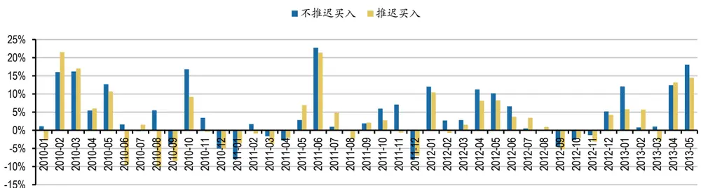
数据来源：Wind资讯、广发证券发展研究中心

使用动态资金规划方法后，从2010年至今，股票组合相对沪深300指数的累计超额收益为97.77%，年化超额收益为18.53%，年化信息比率为135.93%，超额收益的最大回撤为-20.82%。如图17所示。

图17：优秀与未知评级的大型券商深度报告的股票组合表现
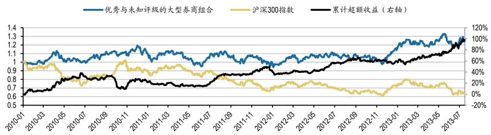
数据来源：Wind资讯、广发证券发展研究中心

此外我们发现，大型券商的分析师发布优秀与未知评级的深度报告后持有40个交易日的股票组合表现略好于知名分析师前3名发布优秀与未知评级的深度报告后持有40个交易日的股票组合表现。

## 五、总结

分析师发布深度报告后是否存在投资机会？什么类型的深度报告才具有投资价值？本报告研究发现，分析师发布深度报告后的40个交易日内存在超额收益，优秀评级和未知评级的深度报告超额收益较高，知名分析师或大型券商的分析师的深度报告超额收益较高，报告评级和分析师对超额收益有着共同作用。

我们将股票交易佣金排名1-5名的券商统称为大型券商，将买入和推荐评级统称为优秀评级，大型券商的分析师发布优秀评级或未知评级的深度报告后，推迟5个交易日买入，持有40个交易日，使用动态资金规划方法，从2010年至今，股票组合相对沪深300指数的累计超额收益为97.77%，年化超额收益为18.53%，年化信息比率为135.93%，超额收益的最大回撤为-20.82%。

## 风险提示

事件驱动选股策略并不适用于所有的市场环境，在极端市场环境下超额收益可能存在较大回撤风险。

## Table_Res arch 广发金融工程研究小组

罗 军： 首席分析师，华南理工大学理学硕士，2010年进入广发证券发展研究中心。

俞文冰： 首席分析师，CFA，上海财经大学统计学硕士，2012年进入广发证券发展研究中心。

叶 涛： 资深分析师，CFA，上海交通大学管理科学与工程硕士，2012年进入广发证券发展研究中心。

安宁宁： 资深分析师，暨南大学数量经济学硕士，2011年进入广发证券发展研究中心。

胡海涛： 分析师，华南理工大学理学硕士，2010年进入广发证券发展研究中心。

夏潇阳： 分析师，上海交通大学金融工程硕士，2012年进入广发证券发展研究中心。

蓝昭钦： 分析师，中山大学理学硕士，2010年进入广发证券发展研究中心。

史庆盛： 分析师，华南理工大学金融工程硕士，2011年进入广发证券发展研究中心。

汪 鑫： 研究助理，中国科学技术大学金融工程硕士，2012年进入广发证券发展研究中心。

张 超： 研究助理，中山大学理学硕士，2012年进入广发证券发展研究中心。

## Table_RatingIndustry 广发证券—行业投资评级说明

买入： 预期未来12个月内，股价表现强于大盘10%以上。

持有： 预期未来12个月内，股价相对大盘的变动幅度介于-10%～+10%。

卖出： 预期未来12个月内，股价表现弱于大盘10%以上。

## Table_RatingCompany 广发证券—公司投资评级说明

买入： 预期未来12个月内，股价表现强于大盘15%以上。

谨慎增持： 预期未来12个月内，股价表现强于大盘5%-15%。

持有： 预期未来12个月内，股价相对大盘的变动幅度介于-5%～+5%。

卖出： 预期未来12个月内，股价表现弱于大盘5%以上。

## Table_Ad联系我们

|  | 广州市 | 深圳市 | 北京市 | 上海市 |
| --- | --- | --- | --- | --- |
| 地址 | 广州市天河北路183号 大都会广场5楼 | 深圳市福田区金田路4018 号安联大厦 15 楼 A 座 | 北京市西城区月坛北街2号 月坛大厦18层 | 上海市浦东新区富城路99号 震旦大厦 18楼 |
|  |  | 03-04 |  |  |
| 邮政编码 | 510075 | 518026 | 100045 | 200120 |
| 客服邮箱 | gfyf@gf.com.cn |  |  |  |
| 服务热线 | 020-87555888-8612 |  |  |  |

## Table_Disclaimer 免 责声 明

广发证券股份有限公司具备证券投资咨询业务资格。本报告只发送给广发证券重点客户，不对外公开发布。

本报告所载资料的来源及观点的出处皆被广发证券股份有限公司认为可靠，但广发证券不对其准确性或完整性做出任何保证。报告内容仅供参考，报告中的信息或所表达观点不构成所涉证券买卖的出价或询价。广发证券不对因使用本报告的内容而引致的损失承担任何责任，除非法律法规有明确规定。客户不应以本报告取代其独立判断或仅根据本报告做出决策。

广发证券可发出其它与本报告所载信息不一致及有不同结论的报告。本报告反映研究人员的不同观点、见解及分析方法，并不代表广发证券或其附属机构的立场。报告所载资料、意见及推测仅反映研究人员于发出本报告当日的判断，可随时更改且不予通告。

本报告旨在发送给广发证券的特定客户及其它专业人士。未经广发证券事先书面许可，任何机构或个人不得以任何形式翻版、复制、刊登、转载和引用，否则由此造成的一切不良后果及法律责任由私自翻版、复制、刊登、转载和引用者承担。