# 多维视角下的一致预期选股策略

# ——事件驱动策略之（十三）

## Table_Sum ary报告摘要 ：

## 向前看？向后看？

一类构建量化投资策略的方法都可以归为统计历史数据的规律的范畴，即试图去寻找大概率的规律，从而战胜市场。而另一个方向则是利用分析师的一致预期数据来构建量化投资策略，与利用历史数据的规律，通过数学模型，如时间序列预测模型、神经网络模型等等来预测未来的数据不一样，分析师的一致预期数据则是基于其对特定行业，特定公司的财务状况、经营管理能力等等一些基本面的长期跟踪与深入调研的基础之上得出的。鉴于此，分析师的观点一般是比较理性的，也具有比较高的参考价值。

## 数据来源及变量选取

鉴于朝阳永续在研究报告收集广度、速度方面的提升，文本挖掘技术的提升、历史数据的更正维护等等方面的工作，本篇报告利用其提供的数据来构建量化策略。另外，我们将变量主要划分为四大类：盈利预测类，估值类，市场关注度、情绪类，机构分歧度类。

## 事件特征

本篇报告选取了八大事件特征：指标值连续创新高（半年）或新低（半年）；指标值创连续上涨或下跌；指标值创处于历史高位（高于半年均值）或历史低位（低于半年均值）；指标值在时间截面上所有个股中处于高位或低位。我们将八大事件特征与四大类指标相结合，来构建我们的选股和行业配置策略。

## 实证结果

回测结果显示，混合指标选股策略在收益回撤比上比单个指标选股有提高。从策略分年度表现来看，从10年到 14年，除了 11年外，策略的超额收益都在 7%以上，最大回撤基本也很小，基本都在4%之内。尤其是 13 年，一年斩获 40%的收益，截止至今年 6 月策略已经获得了近 14%的超额收益。最近两年的优异表现，可能归功于朝阳永续数据库的进一步完善和成熟后数据质量的提高，这也验证了我们之前的想法。

## 核心风险

个股一致预期数据本身存在一定的滞后和片面性，策略的应用存在一定风险。

图 1： 策略历史回测
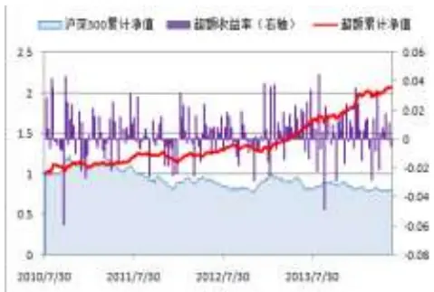

表 1：策略分年度表现

| 时间 收益 | 超额 | 胜率 | 最大 |  |
| --- | --- | --- | --- | --- |
|  |  |  |  | 回撤 |
| 全样本 | 106.9% | 58.29% | 9.94% |  |
| 2010 | 14.26% | 54.55% | 4.12% |  |
| 2011 | 4.68% | 47.06% | 2.77% |  |
| 2012 | 7.02% | 54% | 3.08% |  |
| 2013 | 41.37% | 70.59% | 2.87% |  |
| 2014 | 14.33% | 68% | 1.84% |  |

图2：策略分年度表现

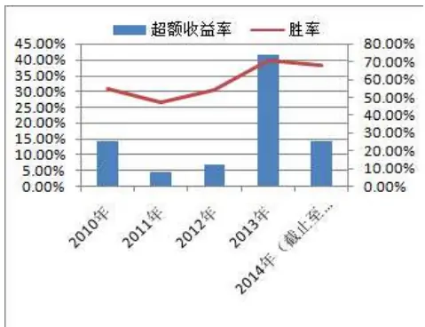

Table_Aut hor 分析师： 史庆盛 S0260513070004

020-87555888-8618

sqs@gf.com.cn

## Table_Report 相关研究：

## 一、前言

一类构建量化投资策略的方法都可以归为统计历史数据的规律的范畴，即试图去寻找大概率的规律，从而战胜市场。而另一个方向则是利用分析师的一致预期数据来构建量化投资策略，与利用历史数据的规律，通过数学模型，如时间序列预测模型、神经网络模型等等来预测未来的数据不一样，分析师的一致预期数据则是基于其对特定行业，特定公司的财务状况、经营管理能力等等一些基本面的长期跟踪与深入调研的基础之上得出的。鉴于此，分析师的观点一般是比较理性的，也具有比较高的参考价值。

2013年，撰写A股报告的国际国内卖方机构数以及达到90 余家，专业研究员数接近 6500人，覆盖A股上市公司 2000余只。十年来，中国专业研究机构和投资机构研究实力整体扩张了近 20倍。在研究报告繁多的这个时代，一份份去通读、精度报告，获取有用信息的可能性和效率都太低了，但是朝阳永续等等这样的数据供应商的快速发展，包括在研究报告收集广度、速度方面的提升，文本挖掘技术的提升、历史数据的更正维护等等方面的工作，使得我们利用一致预期数据来构建量化投资策略变得更加可行。因此，本篇报告将在朝阳永续提供的众多的数据中构造、筛选出一些有用的指标，结合某些事件特征，用于选股和行业配置。

## 二、数据来源

## 2.1 事件驱动的分类

我们将事件动划分为三大类，分别为传统事件驱动、网络文本挖掘事件驱动和一致预期数据事件驱动。其中，传统事件驱动包括高管增持、定增破发，股权激励、业绩超预期及业绩预增等；网络文本挖掘事件驱动包括公告披露、新闻热度变化及股吧情绪异常等；一致预期数据事件驱动包括实际指标偏离预测指标事件、一致预期截面优势、一致预期变化异常。但这种划分并非绝对的，各类事件策略中还是存在交叉的情况。比如业绩超预期事件既属于传统事件驱动又属于一致预期数据事件驱动；公共披露既属于网络文本挖掘事件驱动又属于传统事件驱动。

图 3：事件驱动的分类
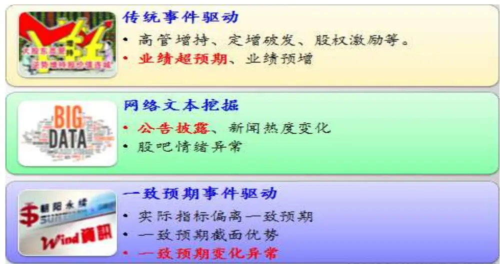
识别风险，发现价值
请务必阅读末页的免责声明

## 2.2 选用一致预期数据的理由

一致预期数据可以用于做常规的一些量化策略，这里我们把他归为事件驱动的范畴，因为按照以往的经验，大多时候我们更加关注的是一致预期数据出现一些异常值时候带来的投资机会。

关于选用一直预期数据的优势我们认为主要有以下三点：

（1）、卖方机构覆盖全面，分析师由于对特定的行业和特定的公司有自己长期的跟踪观察和调研，得出的相关观点一般比较理性，具有较大的参考价值。

（2）、A 股市场上分析师众多，选用一致预期数据作为参考可以节省很多的研究精力。

（3）、选用平均意义下的预期值可以避免单个分析师的极端风险、有效地刻画市场的一致情绪。

## 2.3 获取数据的渠道

关于一致预期数据的获取渠道，主要是有三种方法。

第一种途径简单而粗暴，即手动录入，就是基金公司会要求卖方分析师为其提供研究报告，优点是能第一时间获得最新的分析师看法，但是考虑到13 年全年总共有20万份研究报告这个巨大的样本量，恐怕不是所有基金公司都能够耗费得起这么多的时间和人力去整理获取有关的预期数据的。

第二种途径是通过网络爬虫抓取数据。该方法的优点是时效性高，同时也比较活。但是，它对爬取数据的技术有要求，对访问的网站有限制，并且获得的数据一般都是非结构化的数据，后期需要花费更多的时间来清洗、整理数据，提取有用的信息。这里顺便推介一下我们之前的一些爬取数据的小工具，包括广发金工：A股新闻热度搜索工具》、《广发金工：A 股网络公告抓取工具》及《广发金工：文本关键词批量识别工具》 。

第三种途径就是通过专门的数据库供应商提供。这样的专业机构包括：朝阳永续、wind、大智慧、同花顺等等。该方法的优点是获取的数据已经被标准化了，并且可选的指标也比较齐全；同时，这些数据库一般提供相应的 EXCEL插件和MATLAB 插件，支持函数抓取数据的功能。

图 4： 一直预期数据获取渠道

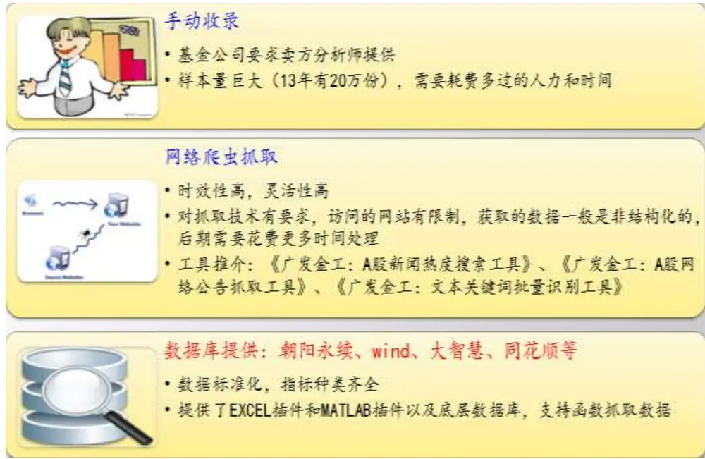
数据来源：广发证券发展研究中心

## 2.4 A 股市场研究情况

仅2013年全年，提供A股报告的机构多达 90家，全年近 20万篇报告，覆盖上市公司 2000余家，任何人都没有通读所有研究报告的精力。

同时我们来看一下上市公司被研究机构覆盖的分布情况以及行业被机构覆盖的平均数目的比较。

图 5： 上市公司在最近 75日内至少被一家研究机构覆盖的分布情况
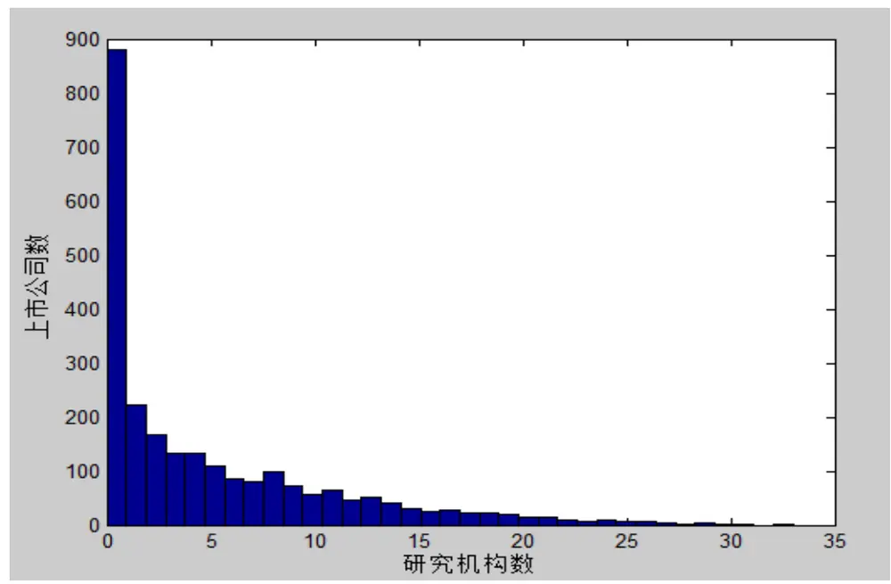
数据来源：广发证券发展研究中心

图 6：行业内个股平均被覆盖的机构数

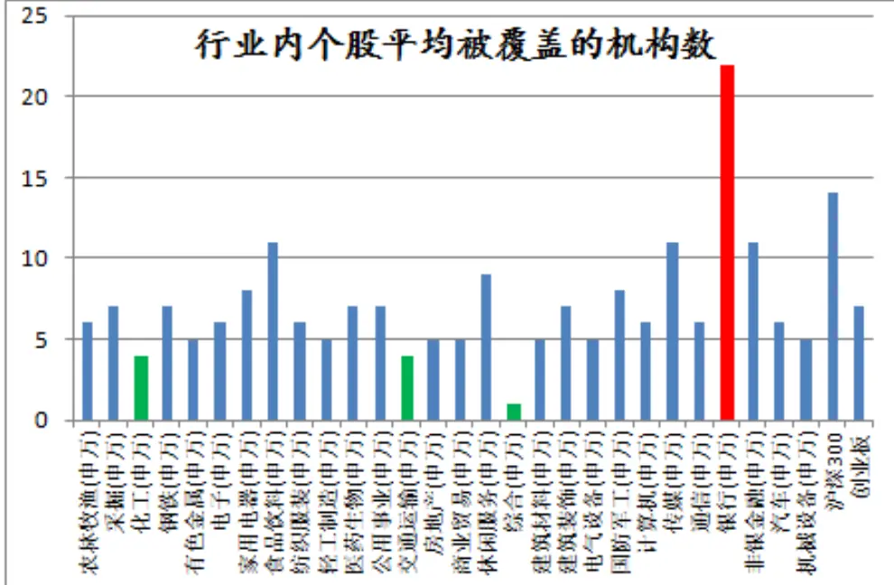
数据来源：广发证券发展研究中心

## 2.5 朝阳永续数据库的优势

一方面是朝阳永续的数据库搭建的时间较长；流程规范；并购了专门做文本挖掘的技术公司，在非结构化数据的处理上得到了很好的支持；指标覆盖面更全。

图 7：朝阳永续一致预期数据处理流程图
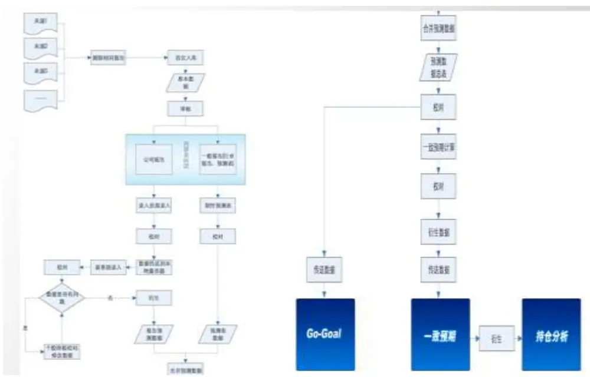
数据来源：朝阳永续、广发证券发展研究中心

另一方面是对于一致预期数据库，都会利用更为成熟的技术去做历史数据维护更正上的工作，从下面两个表中一些重复部分的数据来看，确实会做一些更新维护。从而不同时间点读取的数据存在较大不同，因此对数据库的稳定性有很高要求，越往后的数据越具有可信度。

识别风险，发现价值

表 2: 2011年朝阳永续提供的 A股行业研究分年度统计情况

| 年度 | 2006 | 2007 | 2008 | 2009 | 2010 |
| --- | --- | --- | --- | --- | --- |
| 报告数量 | 12378 | 16315 | 25292 | 32954 | 39281 |
| 股票总数 | 1417 | 1543 | 1620 | 1719 | 2073 |
| 被覆盖的公司数 | 928 | 1058 | 1124 | 1515 | 1847 |
| 卖方数 | 63 | 70 | 74 | 72 | 84 |
| 一般报告 | 1085 | 2434 | 4248 | 7018 | 7679 |
| 深度报告 | 656 | 924 | 904 | 1236 | 1803 |
| 调研报告 | 2154 | 2443 | 2885 | 3990 | 4723 |
| 点评报告 | 6689 | 8781 | 16394 | 19130 | 20667 |
| 新股报告 | 1065 | 1733 | 861 | 1580 | 4392 |

数据来源：朝阳永续、广发证券发展研究中心

表3: 2014年朝阳永续提供的A股行业研究分年度统计情况

| 年度 | 2008年 | 2009年 | 2010年 | 2011年 | 2012年 | 2013年 |
| --- | --- | --- | --- | --- | --- | --- |
| 报告总量 | 90786 | 129871 | 162611 | 187251 | 225151 | 204572 |
| 个股报告数 | 39861 | 64916 | 85432 | 87644 | 103110 | 95607 |
| 覆盖的上市公司家数(A 股) | 1170 | 1572 | 1924 | 2160 | 2205 | 2046 |
| 提供报告机构数 | 232 | 201 | 308 | 252 | 279 | 258 |
| A 股研究机构数 | 83 | 77 | 87 | 95 | 97 | 90 |
| 研究员数 | 4584 | 3843 | 4685 | 4846 | 7294 | 6564 |
| 日均报告数(交易日) | 363 | 519 | 650 | 749 | 900 | 818 |
| 研究员年均报告数 | 19 | 33 | 34 | 38 | 30 | 31 |
| 机构年均报告数 | 391 | 646 | 527 | 743 | 806 | 792 |

数据来源：朝阳永续、广发证券发展研究中心

## 2.6 数据采集频率问题

可能涉及的数据频率有日频率、周频率及月频率。最终我们认为周频率的数据可能更适宜。我们以兴业科技的预期 EPS 数据来说明这个问题。

对于日频率数据，可以看到一致预期数据通常在相邻的连续几天内是没有什么变化的，这是可能是因为一方面，分析师对预测数据的调整不会那么频繁；另一方面，一致预期数据从发布到采集需要一个过程周期，大致一周内。因此，这样看来日频率太短，可操作性较差。

图 8：2013年兴业科技预期EPS一致数据日频数据变化情况
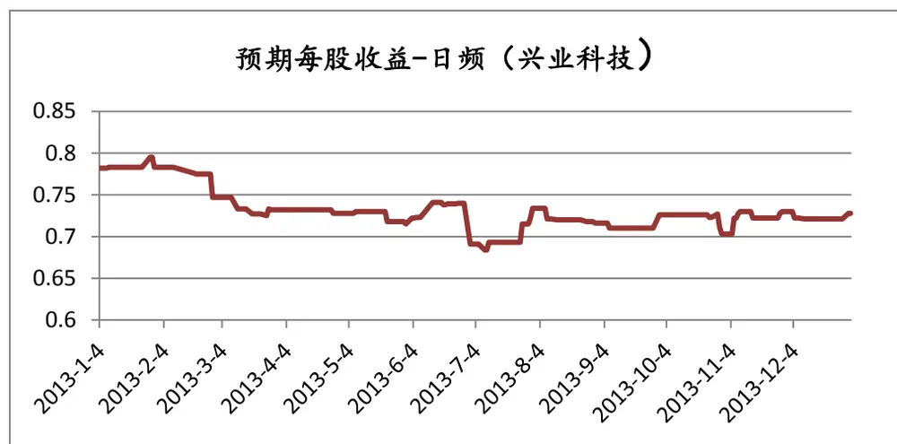
数据来源：广发证券发展研究中心

对于月频率数据，可以看到月频率太长，会有数据滞后，会遗漏了月度之间一些数据变化的信息。

图 9：2013年兴业科技预期EPS一致数据月频数据变化情况
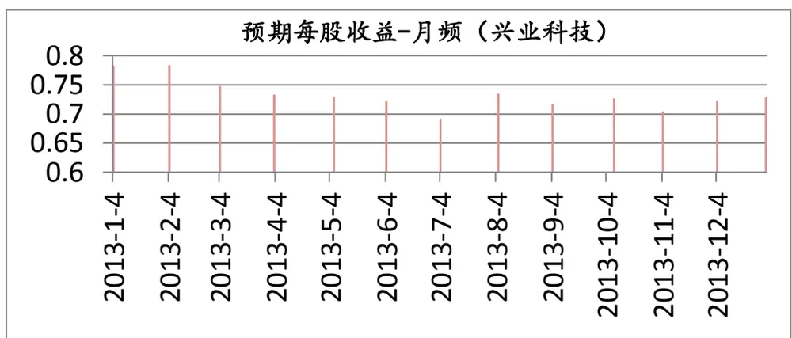
数据来源：广发证券发展研究中心

图 10：2013年兴业科技预期EPS一致数据周频数据变化情况
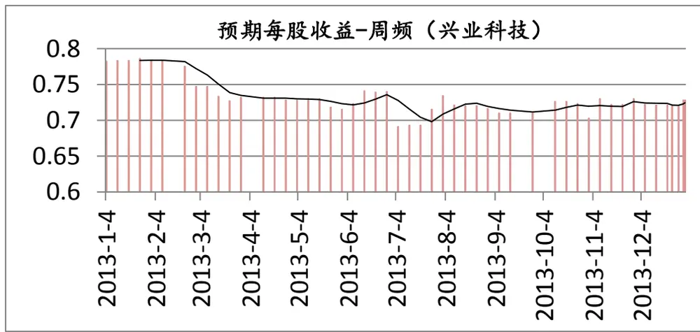
数据来源：广发证券发展研究中心
识别风险，发现价值

对于周频的数据，分析看来，周频率应该是比较合适的，从图 4 的数据变化情况来看，事实上也确实如此。因此本篇报告采用的数据是周频的一致预期数据。

## 三、变量选取

## 3.1 一致预期变量的分类

本篇报告我们主要将一致预期数据分为四大类，即盈利预测类，估值类，市场情绪、关注度类及机构分歧度类。

图 11：一致预期变量分类
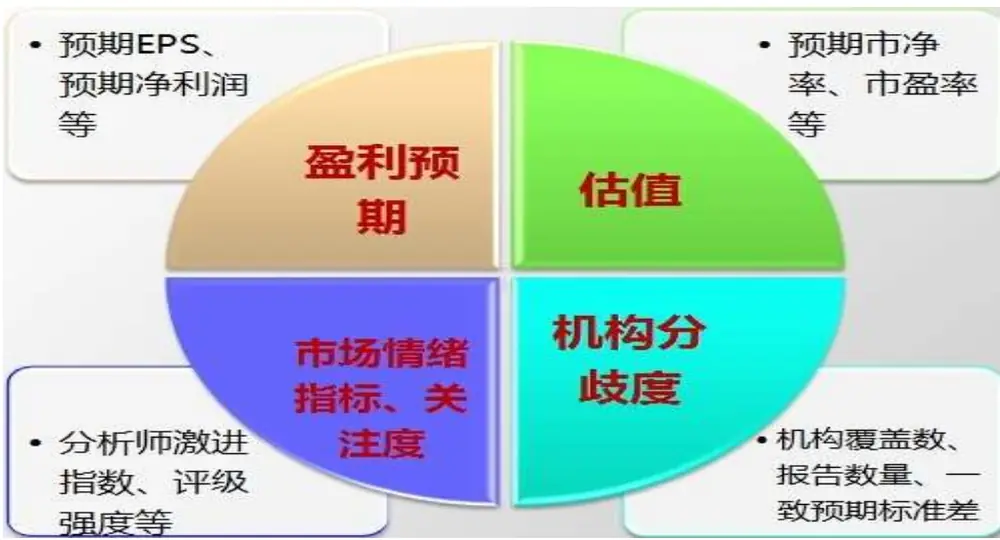
数据来源：广发证券发展研究中心

表 4: 一致预期数据概要

| 主题 | 分类 | 主要内容及指标 |
| --- | --- | --- |
| 情绪及市场关注度 | 个股情绪 | 个股相对报告量、个股机构覆盖数、个股预期标准差、个股预期分歧度、个股市场信心、个股乐观者信心、个股悲观者信心、个股EPS预期偏离度、个股净利润预期偏离度等 |
| 估值预测 | 财务估值 | 预期每股收益、预期收入、复合增长率、预期净利润、预期市盈率、市盈率增长比、预期净利润同比、预期净资产收益率、预期净资产、预期市净率、滚动每股收益、滚动复合增长率、滚动净利润、滚动市盈率、滚动市盈率增长比、滚动净资产、滚动市净率等 |
|  | 统计衍生 | N周预期净利变化率、预期EPS偏离度、预期净利润偏离度等 |
| 研究员 | 研究员预 | 相对报告量、机构覆盖数等 |

识别风险，发现价值

| 测 |  |
| --- | --- |
| 研究员 建议 | 评级强度、目标价、一致评级等 |

数据来源：广发证券发展研究中心

## 3.2 变量分析的角度

一个分析的角度是静态来看，即从同一时间点上不同个股的指标值（做了行业中性化处理）来分析，另一个角度是从个股动态的角度来分析，即从时间序列上来看单支个股指标值有什么变化特征。

如图12所示，思源电气虽然整体上的预期EPS 要比七匹狼低，但在某些时间段上它还是具有连续上涨或者创新高等特征。相应地，七匹狼在整体保持高值的同时，在时间序列上也具有创新低等特征。

图 12：不同个股同一个一致数据的变化比较
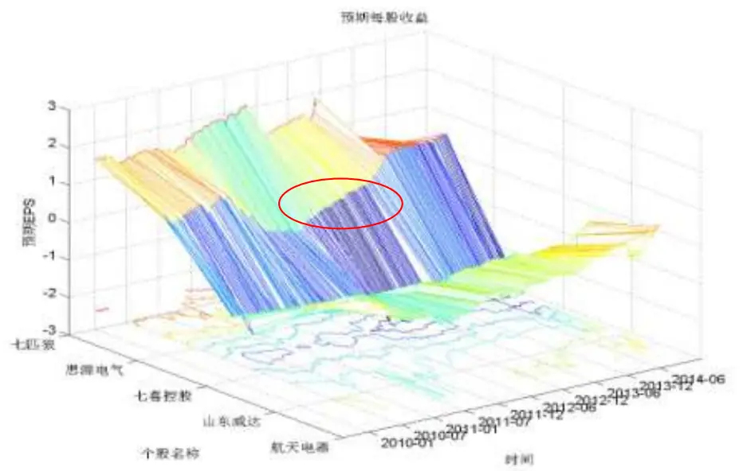
数据来源：广发证券发展研究中心

## 四、策略构建

## 4.1 策略应用范围

我们将指标应用到全市场选股，行业内选股（包括申万一级行业、沪深300及创业板）；

同时也将指标应用于申万一级行业的配置中。

## 4.2 策略的频率及构建期、对冲标的

根据前面的讨论，本报告所构造的策略均为周频度策略。构建期从

2010.01.08-2014.06.20。

在对冲标的选择方面，全市场选股、行业配置策略的对冲标的为沪深 300；而行业内选股策略的对冲标的则为该行业指数。

## 4.3 事件特征的选取

我们总共选取8类事件特征，如下所示：

（1）、 指标值连续创新高（半年）

（2）、 指标值连续创新低（半年）

（3）、 指标值创连续上涨

（4）、 指标值创连续下跌

（5）、 指标值创处于历史高位（高于半年均值）

（6）、 指标值创处于历史低位（高于半年均值）

（7）、 指标值在时间截面上所有个股中处于高位

（8）、 指标值在时间截面上所有个股中处于低位

通过将指标与事件特征相结合，我们来获取股票或行业的买入信号。

## 五、实证结果

## 5.1指标的测试结果——选股应用

我们将指标与选取的8类事件特征相结合，筛选出如下所示的11个有效的选股指标。我们挑选有效指标的依据是：该指标收益回撤比较高、参数稳定性较佳。表5展示的是有效的选股指标。

表 5:有效的选股指标

| 事件特征 | 连续创新高 | 连续创新低 | 连续调高 | 连续调低 | 截面高值 | 截面低值 |
| --- | --- | --- | --- | --- | --- | --- |
| 指标名称 | 复合增长率 | 机构覆盖数（长期） | 预期 EPS | 预期 EPS 偏离度（短期） | 分析师激进指数（长期） | 预期市净率 |
|  | 分析师激进指数（短期） | 目标价调整 | 预期净资产 | 机构覆盖数（短期） |  |  |
|  | 预期净利变化率（长期） |  |  |  |  |  |

数据来源：广发证券发展研究中心

接下来我们将分别展示在全市场选股中筛选出来的11个指标的效果及其在分行业中的表现。

首先展示的是三个业绩预测类指标：复合增长率、长期预期净利变化率及预期EPS。

## 5.1.1 盈利预测类指标——复合增长率

表 6:业绩预测类指标之复合增长率的表现

|  | 指标名称 | 事件特征 | 行业内持股占比 | 持有期 | 事件特征的连续周数 | 累计净值 | 胜率 | 回撤 | 平均买进股票数 |
| --- | --- | --- | --- | --- | --- | --- | --- | --- | --- |
| 全市场 | 复合增长率 | 创新高 | 1.00% | 2 | 4 | 335.51% | 61.86% | 23.80% | 5.01 |
| 沪深300 |  |  | 6.00% | 2 | 4 | 463.19% | 55.97% | 18.16% | 1.55 |
| 创业板 |  |  | 5.00% | 2 | 4 | 175.72% | 54.39% | 28.65% | 0.93 |

数据来源：广发证券发展研究中心

图 13：复合增长率指标的超额累计净值图
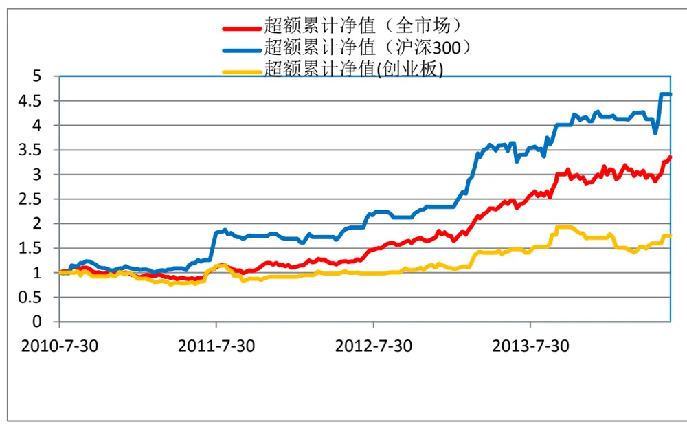
数据来源：广发证券发展研究中心

从图13可以看到，在大盘选股上可能更适合的指标是盈利预测类指标。

## 5.1.2 盈利预测类指标——复合增长率（分行业）

表 7:复合增长率指标适合的行业

| 行业编号 | 累计净值 | 胜率 | 回撤 | 平均买进行业数 |
| --- | --- | --- | --- | --- |
| 计算机(申万) | 435.91% | 58.70% | 17.15% | 1.07 |
| 采掘(申万) | 370.65% | 55.49% | 14.11% | 2.62 |
| 建筑装饰(申万) | 288.48% | 47.57% | 18.73%1 | 0.71 |
| 电气设备(申万) | 250.74% | 52.48% | 17.19% | 0.78 |

识别风险，发现价值

| 国防军工(申万) | 236.79% | 61.00% | 14.16% | 0.79 |
| --- | --- | --- | --- | --- |
| 汽车(申万) | 215.67% | 57.76%6 | 19.25% | 2.32 |
| 机械设备(申万) | 206.30%56.28% | 22 | 6.57% | 9.46 |
| 化工(申万) | 205.29% | 52.63% | 20.32% | 2.44 |
| 电子(申万) | 168.58% | 54.27%2 | 0.88% | 6.51 |
| 农林牧渔(申万) | 168.45% | 54.55%2 | 0.18% | 4.02 |

数据来源：广发证券发展研究中心

图 14：复合增长率指标下计算机行业的超额累计净值图
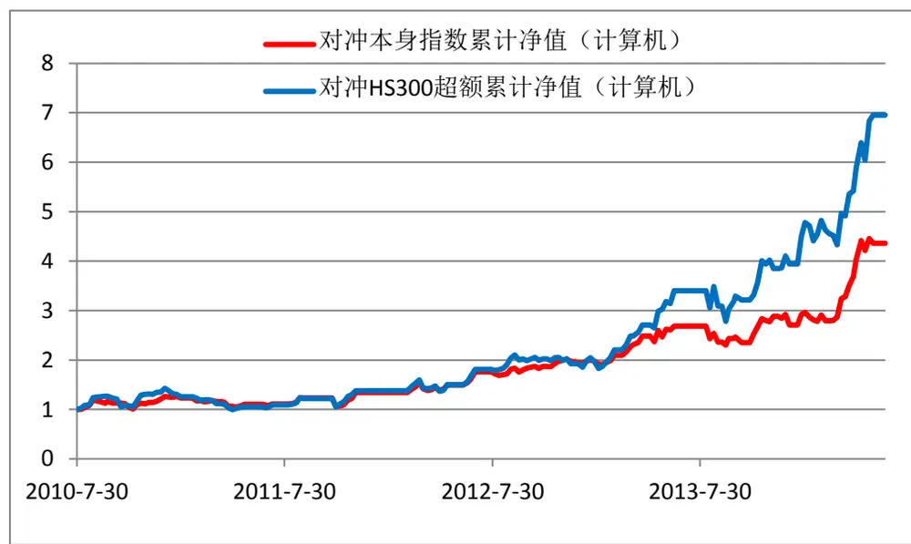
数据来源：广发证券发展研究中心

## 5.1.3 盈利预测类指标——长期预期净利变化率

表 8:业绩预测类指标之长期预期净利变化率的表现

|  | 指标名称 | 事件特征 | 行业内持股持占比 | 有期 | 事件特征的连续周数 | 累计净值 | 胜率 | 回撤 | 平均买进股票数 |
| --- | --- | --- | --- | --- | --- | --- | --- | --- | --- |
| 全市场 | 长期预期净利变化率 | 创新高 | 1.00% | 2 | 4 | 328.22% | 60.30% | 12.14% | 5.01 |
| 沪深300 |  |  | 5.00% | 2 | 4 | 370.79% | 56.40% | 14.10% | 2.19 |
| 创业板 |  |  | 5.00% | 2 | 4 | 175.72% | 54.39% | 28.65% | 0.93 |

数据来源：广发证券发展研究中心

图 15：长期预期净利变化率指标的超额累计净值图
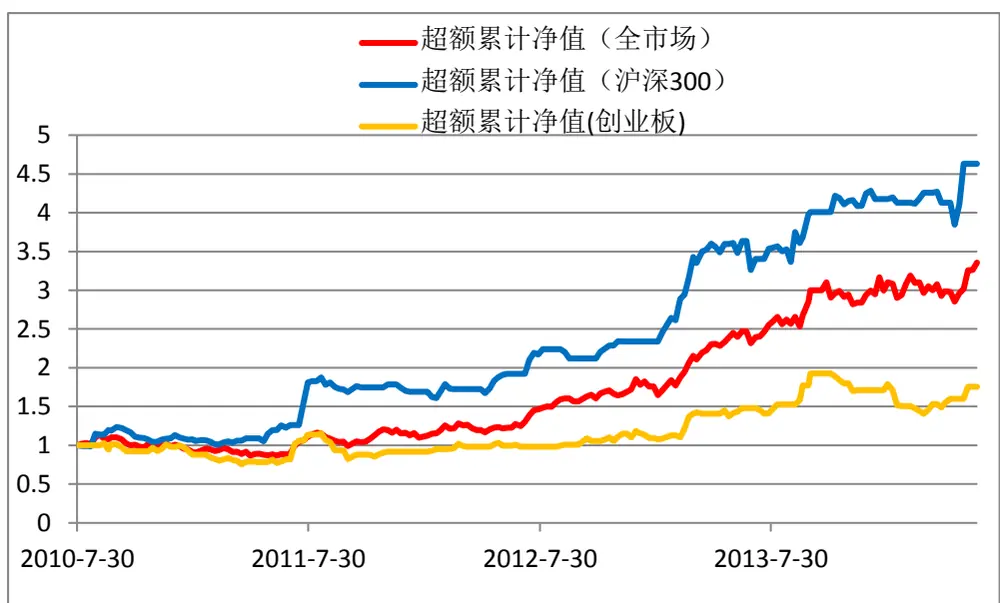
数据来源：广发证券发展研究中心

## 5.1.4 盈利预测类指标——长期预期净利变化率（分行业）

表 9: 长期预期净利变化率指标适合的行业

| 行业编号 | 累计净值 | 胜率 | 回撤 | 平均买进行业数 |
| --- | --- | --- | --- | --- |
| 食品饮料(申万) | 338.43% | 59.57% | 11.72% | 1.49 |
| 计算机(申万) | 296.71% | 59.28% | 18.24% | 2.33 |
| 通信(申万) | 258.23% | 57.53% | 15.66% | 0.48 |
| 公用事业(申万) | 215.30% | 56.14% | 24.22% | 0.88 |
| 化工(申万) | 209.65% | 50.27% | 21.32% | 4.28 |
| 电气设备(申万) | 204.11% | 54.29% | 12.48% | 0.43 |
| 机械设备(申万) | 194.74% | 50.00% | 23.48% | 0.74 |
| 医药生物(申万) | 193.99% | 59.57% | 26.22% | 0.69 |
| 采掘(申万) | 191.52% | 53.42% | 16.72% | 0.47 |
| 建筑装饰(申万) | 187.97% | 58.82% | 14.21% | 0.46 |

数据来源：广发证券发展研究中心

图 16：长期预期净利变化率指标下食品饮料行业的超额累计净值图

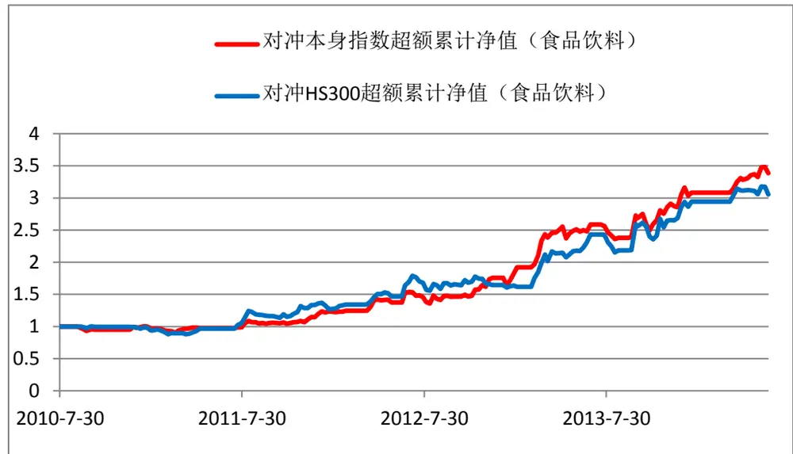
数据来源：广发证券发展研究中心

5.1.5 盈利预测类指标——预期 EPS
表 10:业绩预测类指标之预期 EPS的表现

|  | 指标名称 | 事件特征 | 行业内持股占比 | 持有期 | 事件特的连续周数 | 累计净值 | 胜率 | 回撤 | 平均买进股票数 |
| --- | --- | --- | --- | --- | --- | --- | --- | --- | --- |
| 全市场 | 预期EPS | 上涨 | 1.00% | 3 | 6 | 349.83% | 57.00% | 19.79% | 4.61 |
| 沪深300 |  |  | 5.00% | 3 | 6 | 275.04% | 57.05% | 15.35% | 1.87 |
| 创业板 |  |  | 5.00% | 6 | 6 | 227.15% | 56.48% | 14.62% | 0.71 |

数据来源：广发证券发展研究中心

图 17：预期 EPS指标的超额累计净值图

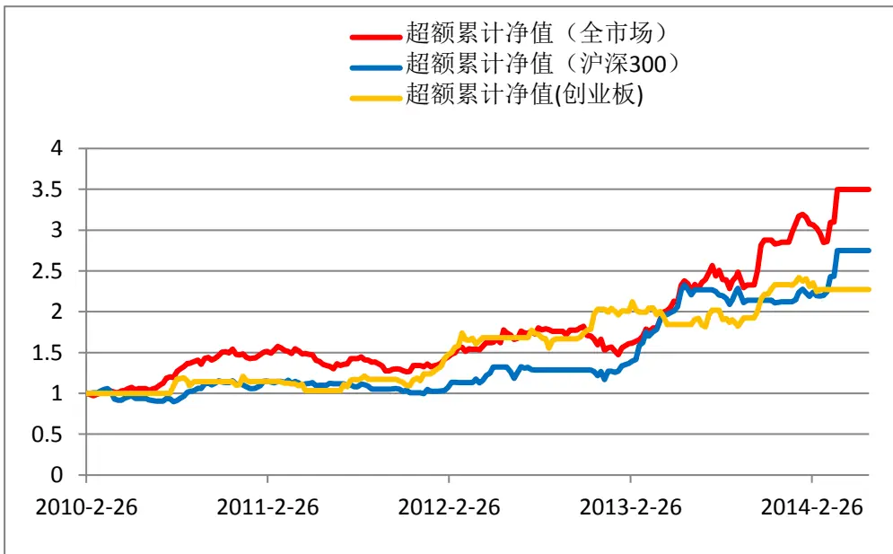
数据来源：广发证券发展研究中心

## 5.1.6 盈利预测类指标——预期EPS（分行业）

表 11:预期 EPS 指标适合的行业

| 行业编号 | 累计凈值 | 胜率 | 回撤 | 平均买进行业数 |
| --- | --- | --- | --- | --- |
| 汽车(申万) | 366.18% | 51.19% | 22.68% | 1.75 |
| 电子(申万) | 308.23% | 55.96% | 29.09% | 2.33 |
| 机械设备(申万) | 307.12% | 57.87% | 19.43% | 4.32 |
| 食品饮料(申万) | 300.75% | 53.08% | 17.91% | 0.96 |
| 传媒(申万) | 268.73% | 55.21% | 18.86% | 0.62 |
| 医药生物(申万) | 256.58% | 59.50% | 26.81% | 0.95 |
| 公用事业(申万) | 230.11% | 54.36% | 15.49% | 2.41 |
| 国防军工(申万) | 207.33% | 49.07% | 16.72% | 0.70 |
| 化工(申万) | 196.24% | 52.15% | 19.92% | 4.72 |
| 建筑装饰(申万) | 187.79% | 54.72% | 10.99% | 0.25 |

数据来源：广发证券发展研究中心

图 18：:预期 EPS指标下汽车行业的超额累计净值图

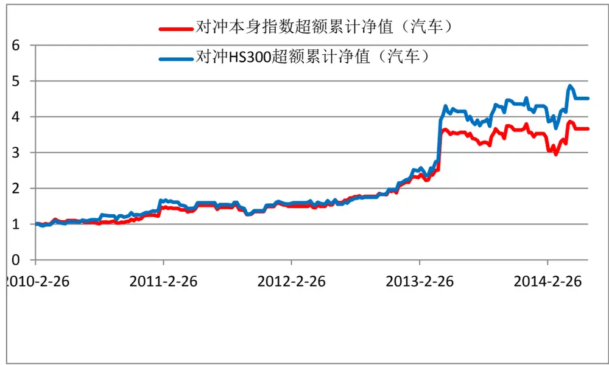
数据来源：广发证券发展研究中心

整体来看，盈利预测类指标更加适用在大股票中适用，而且对非周期行业选股效果更佳。

下面我们展示的是两个估值类指标：预期净资产、 预期市净率 。

## 5.1.7 估值类指标——预期净资产

表 12:估值类指标之预期净资产的表现

|  | 指标名称 | 事件特征 | 行业内持股占比 | 持有期 | 事件特征的连续周数 | 累计净值 | 胜率 | 回撤 | 平均买进股票数 |
| --- | --- | --- | --- | --- | --- | --- | --- | --- | --- |
| 全市场 | 预期净资产 | 上涨 | 1.00% | 4 | 6 | 278.35% | 58.64% | 13.40% | 8.80 |
| 沪深300 |  |  | 5.00% | 4 | 6 | 217.45% | 54.19% | 12.07% | 3.55 |
| 创业板 |  |  |  |  |  |  |  |  |  |
|  |  |  | 5.00% | 4 | 6 | 210.55% | 52.42% | 14.91% | 0.93 |

数据来源：广发证券发展研究中心

图 19：预期净资产指标的超额累计净值图

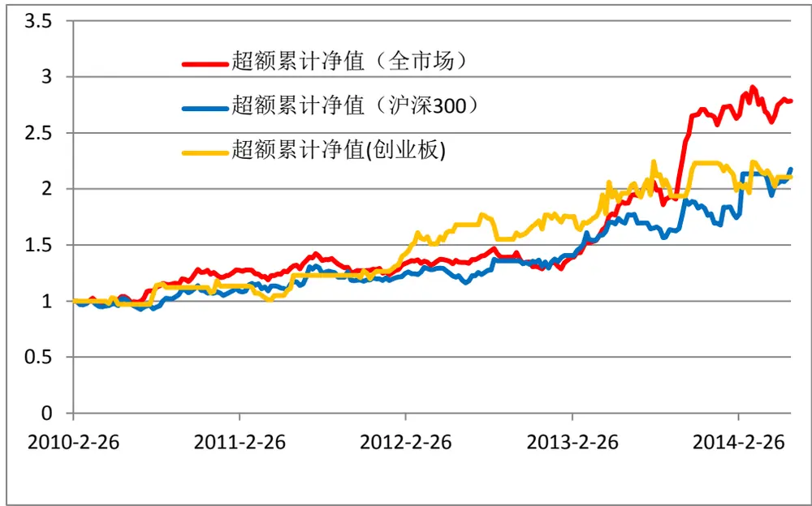
数据来源：广发证券发展研究中心

## 5.1.8 估值类指标——预期净资产（分行业）

表 13:预期净资产指标适合的行业

| 行业编号 | 累计净值 | 胜率 | 回撤 | 平均买进行业数 |
| --- | --- | --- | --- | --- |
| 机械设备(申万) | 427.16% | 53.85% | 22.05% | 2.25 |
| 电子(申万) | 283.52% | 55.39% | 26.99% | 3.33 |
| 食品饮料(申万) | 247.94% | 53.64% | 20.35% | 1.54 |
| 化工(申万) | 221.23% | 55.36% | 16.89% | 0.82 |
| 汽车(申万) | 219.94% | 56.16% | 15.19% | 5.57 |
| 公用事业(申万) | 204.60% | 59.89% | 16.08% | 2.34 |
| 农林牧渔(申万) | 201.32% | 60.54% | 19.33% | 2.13 |
| 通信(申万) | 194.35% | 54.39% | 15.02% | 0.73 |
| 医药生物(申万) | 193.06% | 54.05% | 20.63% | 1.30 |
| 休闲服务(申万) | 186.42% | 50.82% | 20.87% | 1.58 |

数据来源：广发证券发展研究中心

图 20：预期净资产指标下机械设备行业的超额累计净值图

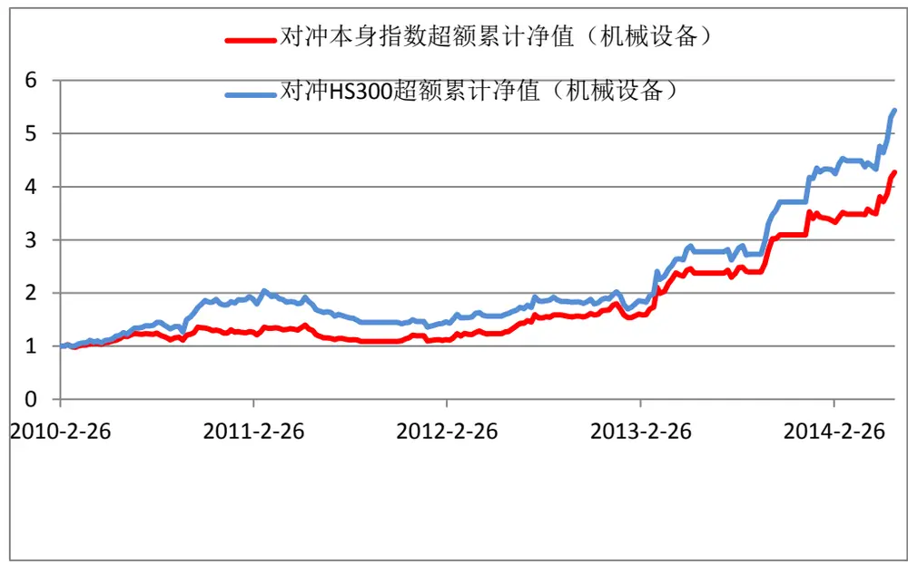
数据来源：广发证券发展研究中心

## 5.1.9 估值类指标——预期市净率

表 14:估值类指标之预期市净率的表现

|  | 指标名称 | 事件特征 | 行业内持股占比 | 持有期 | 累计净值 | 胜率 | 回撤 |
| --- | --- | --- | --- | --- | --- | --- | --- |
| 全市场沪深300 | 预期市净率 | 横截面低值 | 1.00% | 2 | 216.85% | 62.56% | 19.67% |
|  |  |  | 10.00% | 2 | 134.69%6 | 0.35% | 9.42% |
| 创业板 |  |  | 10.00% | 2 | 83.47% | 49.78% | 32.69% |

数据来源：广发证券发展研究中心

图 21：预期市净率指标的超额累计净值图

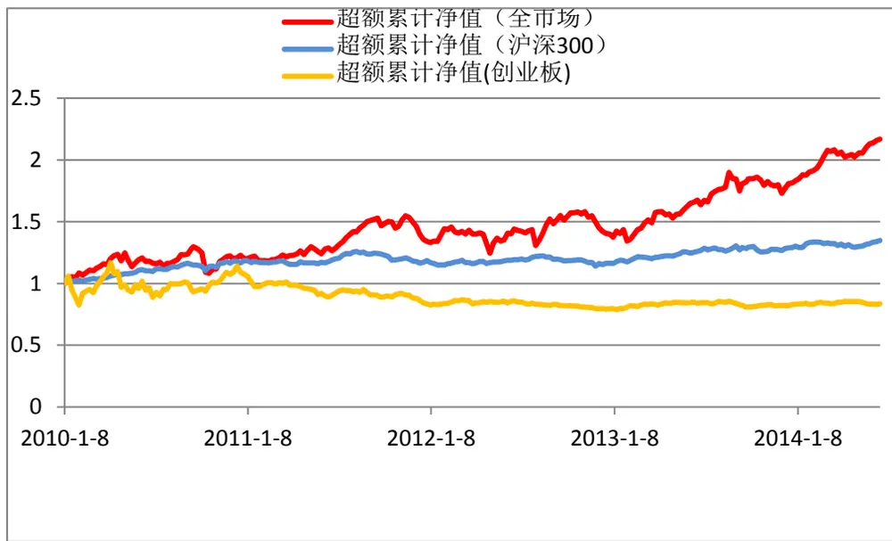
数据来源：广发证券发展研究中心

可以明显看到，创业板小票中，看估值指标效果并不佳。

## 5.1.10 估值类指标——预期市净率（分行业）

表 15:预期市净率指标适合的行业

| 行业编号 | 累计凈值 | 胜率 | 回撤 |
| --- | --- | --- | --- |
| 通信(申万) | 201.88% | 52.86% | 25.96% |
| 建筑装饰(申万) | 200.10% | 52.42% | 29.12% |
| 休闲服务(申万) | 181.86% | 51.98% | 26.13% |
| 传媒(申万) | 171.88% | 51.10% | 49.37% |
| 农林牧渔(申万) | 153.42% | 48.02% | 25.60% |

数据来源：广发证券发展研究中心

图 22：预期市净率业指标下通信行的超额累计净值图

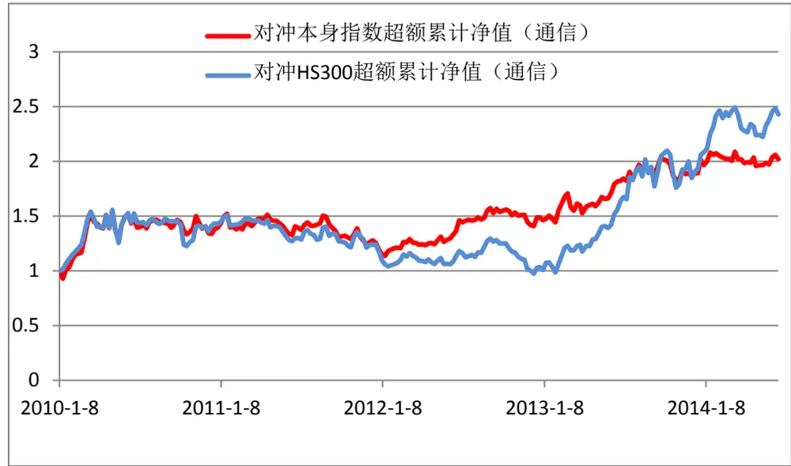
数据来源：广发证券发展研究中心

接着展示的是四个市场关注度、情绪类指标： 分析师激进指数（短期）、分析师激进指数（长期）、 目标价调整、EPS 偏离度（短期）。

## 5.1.11 市场关注度、情绪类指标——分析师激进指数（短期）

表 16:市场关注度、情绪类指标之分析师激进指数（短期）的表现

|  | 指标名称 | 事件特征 | 行业内持股占比 | 持有期 | 事件特征的连续周数 | 累计净值 | 胜率 | 回撤 | 平均买进股票数 |
| --- | --- | --- | --- | --- | --- | --- | --- | --- | --- |
| 全市场 | 分析师激进指数（短期） | 创新高 | 3.00% | 1 | 3 | 329.36% | 52.27% | 14.02% | 0.86 |
|  |  |  | 8.00% | 1 | 3 | 177.03% | 62.07% | 7.13% | 0.16 |
| 沪深 300 |  |  |  |  |  |  |  |  |  |
|  |  |  | 7.00% | 1 | 3 | 156.41% | 63.33% | 11.48% | 0.20 |
| 创业板 |  |  |  |  |  |  |  |  |  |

数据来源：广发证券发展研究中心

图 23：分析师激进指数（短期）指标的超额累计净值图

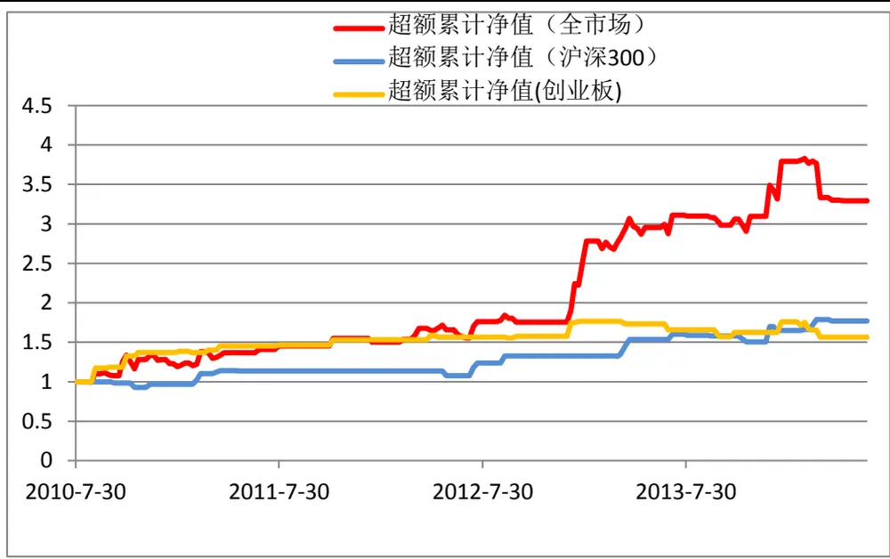
数据来源：广发证券发展研究中心

5.1.12 市场关注度、情绪类指标——分析师激进指数（短期）（分行业）
表 17：分析师激进指数（短期）指标适合的行业

| 行业编号 | 累计净值 | 胜率 | 回撤 | 平均买进行业数 |
| --- | --- | --- | --- | --- |
| 计算机(申万) | 318.59% | 49.38% | 21.19% | 2.20 |
| 电子(申万) | 264.19% | 55.17% | 17.65% | 0.69 |
| 机械设备(申万) | 255.85% | 54.87% | 17.35% | 1.12 |
| 通信(申万) | 254.57% | 51.13% | 20.37% | 1.41 |
| 化工(申万) | 225.50% | 70.00% | 10.06% | 0.14 |
| 有色金属(申万) | 224.23% | 52.53% | 25.56% | 1.96 |
| 电气设备(申万) | 215.67% | 47.03% | 21.69% | 3.02 |
| 家用电器(申万) | 196.79% | 47.53% | 23.18% | 1.92 |
| 国防军工(申万) | 196.62% | 53.13% | 11.85% | 1.01 |
| 非银金融(申万) | 186.81% | 54.72% | 22.84% | 2.04 |

数据来源：广发证券发展研究中心

图 24：分析师激进指数（短期）指标下计算机行业的超额累计净值图

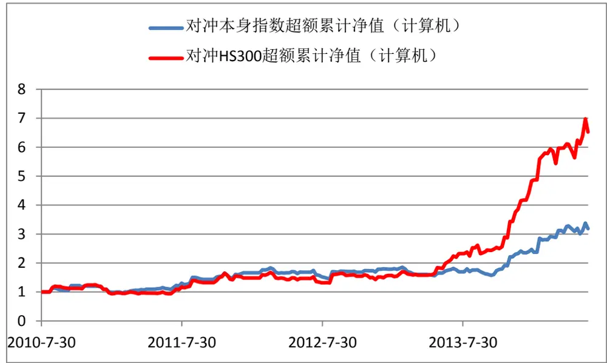
数据来源：广发证券发展研究中心

## 5.1.13 市场关注度、情绪类指标——分析师激进指数（长期）

表 18:市场关注度、情绪类指标之分析师激进指数（长期）的表现

|  | 指标名称 | 事件特征 | 行业内持股占比 | 持有期 | 累计净值 | 胜率 | 回撤 |
| --- | --- | --- | --- | --- | --- | --- | --- |
| 全市场 | 分析师激进指数（长期） | 横截面高值 | 0.50% | 2 | 241.51% | 58.59% | 16.35% |
| 沪深300创业板 |  |  | 5.00% | 2 | 127.18% | 51.98% | 10.23% |
|  |  |  | 8.00% | 6 | 93.25% | 50.22% | 22.25% |

数据来源：广发证券发展研究中心

图 25：分析师激进指标（长期）指标的超额累计净值图

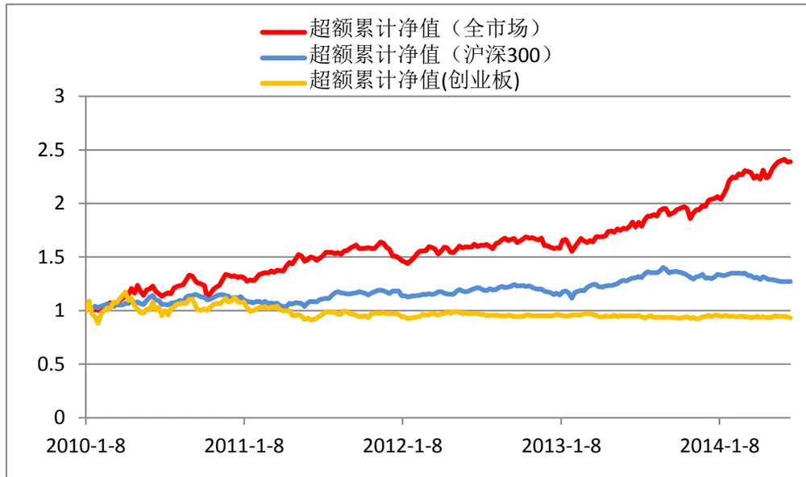
数据来源：广发证券发展研究中心

## 5.1.14 市场关注度、情绪类指标——分析师激进指数（长期）（分行业）

表 19：分析师激进指数（长期）指标适合的行业

| 行业编号 | 累计凈值 | 胜率 | 回撤 |
| --- | --- | --- | --- |
| 采掘（申万） | 154.12% | 54.63% | 27.29% |

数据来源：广发证券发展研究中心

图 26：分析师激进指数（长期）指标下采掘行业的超额累计净值图
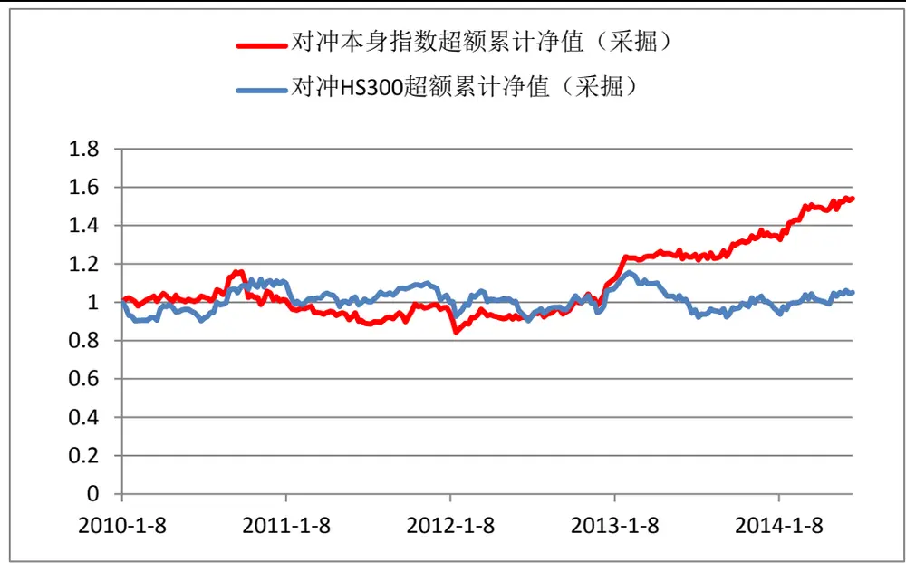
识别风险，发现价值

## 5.1.15 市场关注度、情绪类指标——目标价调整

表 20:市场关注度、情绪类指标之 目标价调整的表现

|  | 指标名称 | 事件特征 | 行业内持股占比 | 持有期 | 事件特征的连续周数 | 累计凈值 | 胜率 | 回撤 | 平均买进股票数 |
| --- | --- | --- | --- | --- | --- | --- | --- | --- | --- |
| 全市场 | 目标价调整 | 创新低 | 2.00% | 5 | 4 | 167.09% | 52.90% | 18.95% | 2.54 |
| 沪深 300 |  |  | 6.00% | 5 | 4 | 190.77% | 54.81% | 19.00% | 0.94 |
| 创业板 |  |  | 6.00% | 5 | 4 | 140.27% | 57.41% | 17.32% | 0.43 |

数据来源：广发证券发展研究中心

图 27：目标价调整指标的超额累计净值图
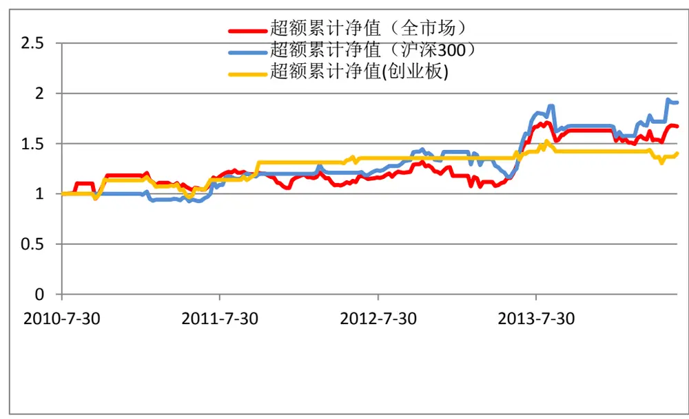
数据来源：广发证券发展研究中心

## 5.1.16 市场关注度、情绪类指标——目标价调整（分行业）

表 21:目标价调整指标适合的行业

| 行业编号 | 累计凈值 | 胜率 | 回撤 | 平均买进行业数 |
| --- | --- | --- | --- | --- |
| 食品饮料(申万) | 222.16% | 61.68% | 13.89% | 0.76 |
| 医药生物(申万) | 210.01% | 56.35% | 14.76% | 3.36 |
| 建筑装饰(申万) | 174.01% | 53.03% | 15.00% | 7.33 |
| 公用事业(申万) | 169.94% | 64.71% | 8.48% | 0.21 |

识别风险，发现价值

| 轻工制造(申万) | 160.45% | 55.74% | 18.04% | 0.32 |
| --- | --- | --- | --- | --- |
| 机械设备(申万) | 159.47% | 48.96% | 13.27% | 0.78 |
| 建筑材料(申万) | 154.00% | 51.67% | 19.36% | 1.10 |
| 电气设备(申万) | 153.04% | 62.96% | 12.42% | 0.70 |
| 电子(申万) | 150.86% | 58.33% | 7.01% | 0.12 |

数据来源：广发证券发展研究中心

图 28：目标价调整指标下食品饮料行业的超额累计净值图
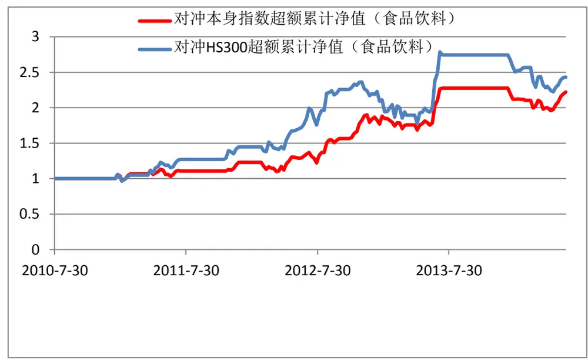
数据来源：广发证券发展研究中心

## 5.1.17 市场关注度、情绪类指标——EPS偏离度（短期）

表 22:市场关注度、情绪类指标之预期 EPS偏离度(短期)的表现

|  | 指标名称 | 事件特征 | 行业内持股占比 | 持有期 | 事件特征的连续周数 | 累计净值 | 胜率 | 回撤 | 平均买进股票数 |
| --- | --- | --- | --- | --- | --- | --- | --- | --- | --- |
| 全市场 | 预期 EPS 偏离度(短期) | 下跌 | 1.00% | 6 | 6 | 321.80% | 53.47% | 17.77% | 0.56 |
| 沪深 |  |  | 5.00% | 6 | 6 | 162.37%6 | 2.50%1 | 7.48% | 0.11 |
| 300 |  |  |  |  |  |  |  |  |  |
| 创业板 |  |  | 8.00% | 2 | 3 | 125.37%5 | 4.79%1 | 9.40% | 6.55 |

数据来源：广发证券发展研究中心

图 29：预期 EPS偏离度(短期)指标的超额累计净值图

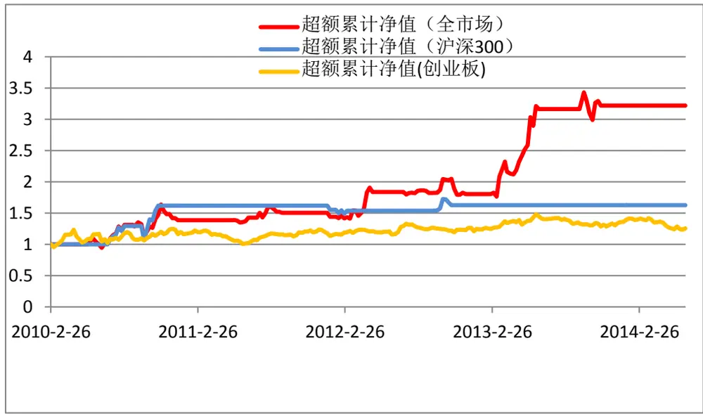
数据来源：广发证券发展研究中心

## 5.1.18 市场关注度、情绪类指标——EPS偏离度（短期）（分行业）

表 23:预期EPS偏离度（短期）指标适合的行业

| 行业编号 | 累计净值 | 胜率 | 回撤 | 平均买进行业数 |
| --- | --- | --- | --- | --- |
| 纺织服装(申万) | 221.59% | 53.95% | 17.01% | 0.42 |
| 农林牧渔(申万) | 203.12% | 50.00% | 29.63% | 0.96 |
| 电子(申万) | 201.18% | 53.60% | 47.97% | 0.91 |
| 医药生物(申万) | 197.76% | 52.29% | 27.14% | 0.68 |
| 通信(申万) | 193.55% | 54.17% | 37.46% | 1.95 |
| 化工(申万) | 190.98% | 49.51% | 28.73% | 3.44 |
| 建筑装饰(申万) | 183.29% | 52.21% | 17.02% | 0.64 |
| 汽车(申万) | 182.65% | 46.53% | 32.29% | 1.06 |
| 商业贸易(申万) | 179.21% | 50.74% | 24.37% | 1.05 |
| 电气设备(申万) | 173.10% | 47.83% | 22.66% | 1.23 |

数据来源：广发证券发展研究中心

图 30：预期 EPS偏离度（短期）下纺织服装行业的超额累计净值图

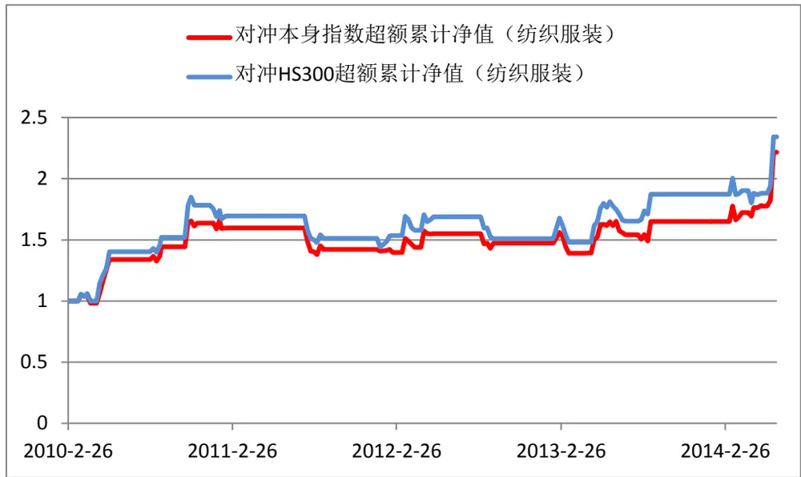
数据来源：广发证券发展研究中心

可以看到市场关注度、情绪类指标比较适合在全市场选股中的应用，并且该类指标倾向于应用在非周期行业中。

最后展示的是两个市场机构分歧度类指标： 机构覆盖数（长期）、机构覆盖数（短期）。

## 5.1.19 市场关注度、情绪类指标——机构覆盖数（长期）

表 24:机构分歧度类指标之机构覆盖数（长期）的表现

|  | 指标名称 | 事件特征 | 行业内持股占比 | 持有期 | 事件特征的连续周数 | 累计净值 | 胜率 | 回撤 | 平均买进股票数 |
| --- | --- | --- | --- | --- | --- | --- | --- | --- | --- |
| 全市场 | 机构覆盖数(长期) | 创新低 | 2.00% | 1 | 3 | 188.82% | 53.80% | 27.22% | 4.90 |
| 沪深 300 |  |  | 9.00% | 6 | 3 | 148.27% | 52.25% | 16.30% | 4.86 |
| 创业板 |  |  | 5.00% | 4 | 4 | 193.85% | 51.67% | 23.98% | 1.31 |

数据来源：广发证券发展研究中心

图 31：机构覆盖数（长期）指标的超额累计净值图

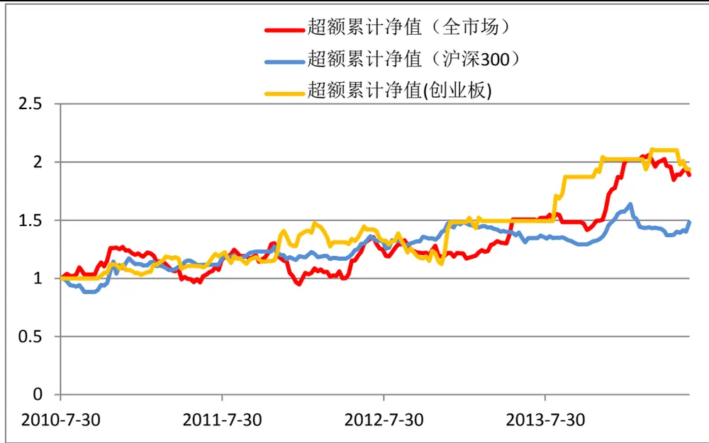
数据来源：广发证券发展研究中心

## 5.1.20 市场关注度、情绪类指标——机构覆盖数（长期）（分行业）

表 25:机构覆盖数（长期）指标适合的行业

| 行业编号 | 累计净值 | 胜率 | 回撤 | 平均买进行业数 |
| --- | --- | --- | --- | --- |
| 公用事业(申万) | 198.84% | 48.15% | 21.72% | 0.55 |
| 建筑装饰(申万) | 198.56% | 54.26% | 18.33% | 4.99 |
| 交通运输(申万) | 194.03% | 48.98% | 12.23% | 2.16 |
| 机械设备(申万) | 183.49% | 55.10% | 37.53% | 2.34 |
| 建筑材料(申万) | 182.97% | 52.03% | 26.25% | 1.24 |
| 休闲服务(申万) | 158.45% | 60.00% | 6.22% | 0.16 |
| 医药生物(申万) | 153.78% | 44.64% | 20.88% | 1.05 |

数据来源：广发证券发展研究中心

图 32：机构覆盖数（长期）指标下公用事业行业的超额累计净值图

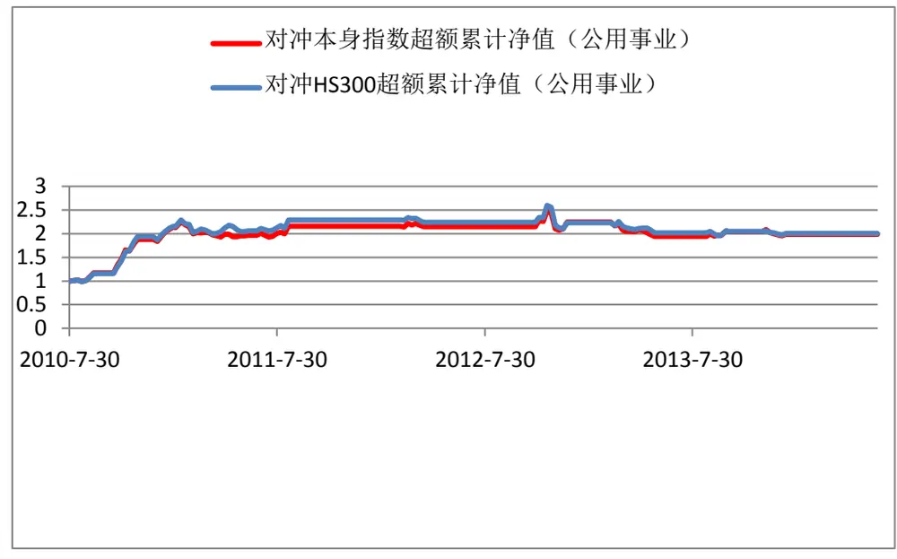
数据来源：广发证券发展研究中心

5.1.21 市场关注度、情绪类指标——机构覆盖数（短期）
表 26:机构分歧度类指标之机构覆盖数（短期）的表现

|  | 指标名称 | 事件特征 | 行业内持股占比 | 持有期 | 事件特征的连续周数 | 累计净值 | 胜率 | 回撤 | 平均买进股票数 |
| --- | --- | --- | --- | --- | --- | --- | --- | --- | --- |
| 全市场 | 机构覆盖数（短期） | 下跌 | 1.00% | 3 | 5 | 230.85% | 47.33% | 32.56% | 1.18 |
| 沪深300 |  |  | 5.00% | 3 | 5 | 160.97%5 | 0.59%1 | 9.00% | 0.64 |
| 创业板 |  |  | 5.00% | 3 | 4 | 174.04%5 | 0.82%2 | 9.29% | 1.00 |

数据来源：广发证券发展研究中心

图 33：机构覆盖数（短期）指标的超额累计净值图

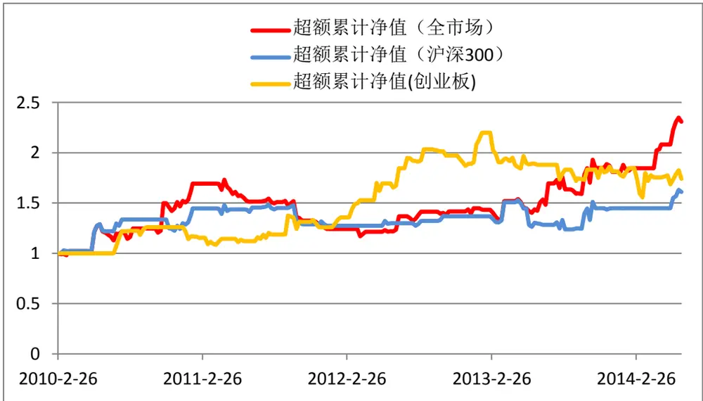
数据来源：广发证券发展研究中心

## 5.1.22 市场关注度、情绪类指标——机构覆盖数（短期）（分行业）

表 27:机构覆盖数(短期)指标适合的行业

| 行业编号 | 累计净值 | 胜率 | 回撤 | 平均买进行业数 |
| --- | --- | --- | --- | --- |
| 化工(申万) | 267.27% | 56.16% | 17.06% | 0.45 |
| 汽车(申万) | 260.97% | 66.67% | 8.98% | 0.50 |
| 食品饮料(申万) | 257.74% | 55.46% | 17.92% | 0.91 |
| 传媒(申万) | 198.80% | 47.76% | 32.71% | 1.43 |
| 建筑装饰(申万) | 190.43% | 51.22% | 19.77% | 0.53 |
| 轻工制造(申万) | 165.55% | 50.70% | 17.83% | 0.48 |
| 非银金融(申万) | 163.31% | 51.43% | 15.15% | 0.69 |
| 机械设备(申万) | 158.46% | 55.56% | 26.04% | 0.50 |

数据来源：广发证券发展研究中心

图 34：机构覆盖数（短期）指标下化工行业的超额累计净值图

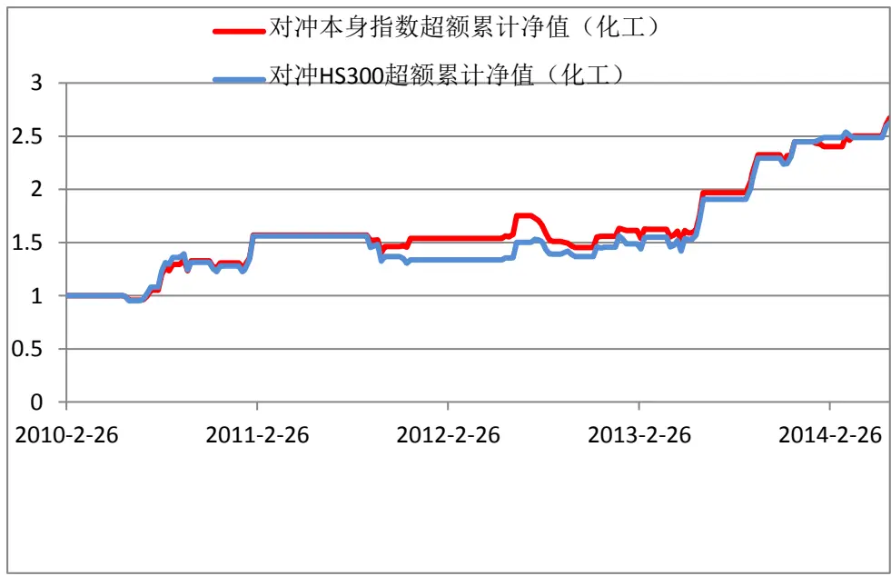
数据来源：广发证券发展研究中心

## 5.3混合指标选股策略

考虑到某些指标选出来的股票数相对于全市场的股票数比较少，我们进一步构建我们的混合指标选股策略，我们混合了上面介绍的四大类指标共10个。

在每个时刻点，通过判断10个指标中任一一个指标是否触发买入信号，是的话就买入相应的股票，按该指标的持有期持有，多个指标触发同一支股票的情况，则按触发指标中最长的那个持有期来作为该股票的持有期。

该策略测试区间为2010.07-2014.06，策略的表现我们将在后面展示。

表 28：混合指标选股表现

|  | 平均持仓 股票数 | 平均换手率 | 累计凈值 | 胜率 | 最大回撤 |
| --- | --- | --- | --- | --- | --- |
| 混合指标选股策略 | 38.60 | 29% | 206.90% | 58.29% | 9.94% |

数据来源：广发证券发展研究中心

图 35：混合指标选股模型的超额累计净值

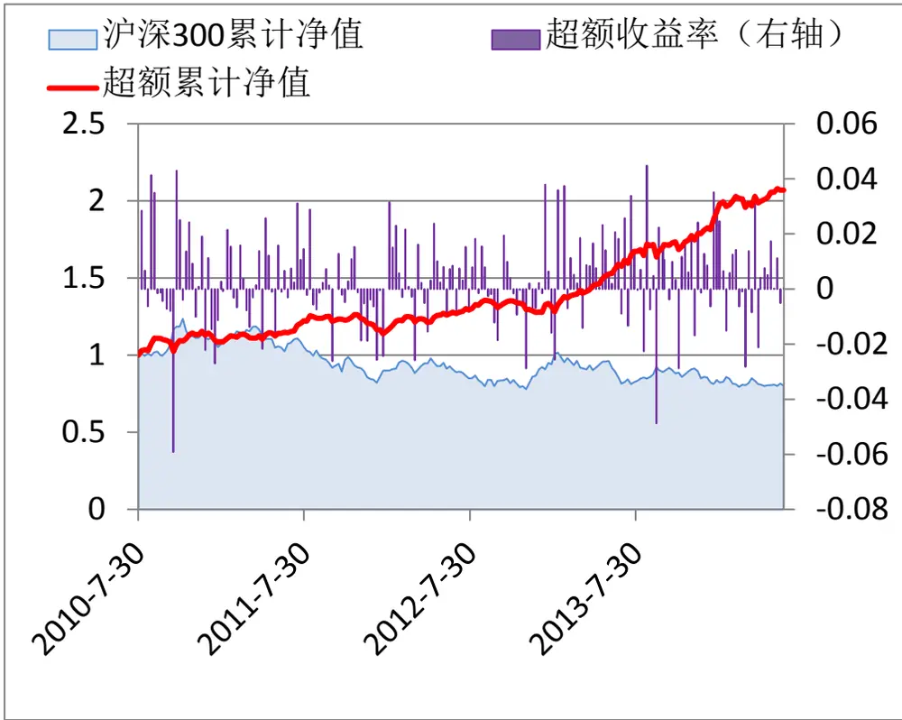
数据来源：广发证券发展研究中心

图 36：混合指标选股模型持仓股票数的变化
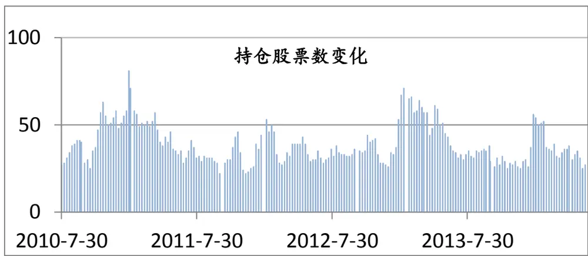
数据来源：广发证券发展研究中心

图 37：混合指标选股模型的回撤情况

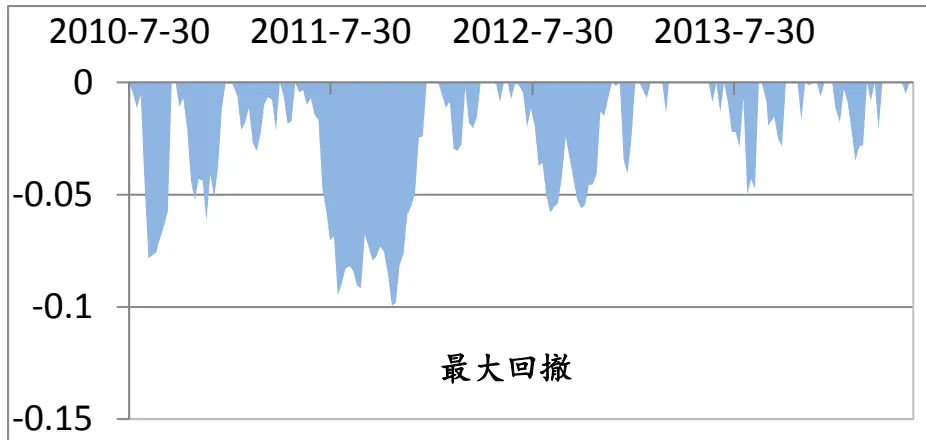
数据来源：广发证券发展研究中心

下面我们再来看一下该策略的分年度表现情况。

表 29:策略分年度表现

| 年度情况 | 超额收益率 | 胜率 | 最大回撤 |
| --- | --- | --- | --- |
| 全样本 | 106.90% | 58.29% | 9.94% |
| 2010年 | 14.26% | 54.55% | 4.12% |
| 2011年 | 4.68% | 47.06% | 2.77% |
| 2012年 | 7.02% | 54.00% | 3.08% |
| 2013年 | 41.37% | 70.59% | 2.87% |
| 2014年（截止至06.20） | 14.33% | 68.00% | 1.84% |

数据来源：广发证券发展研究中心

图 38：策略年度表现
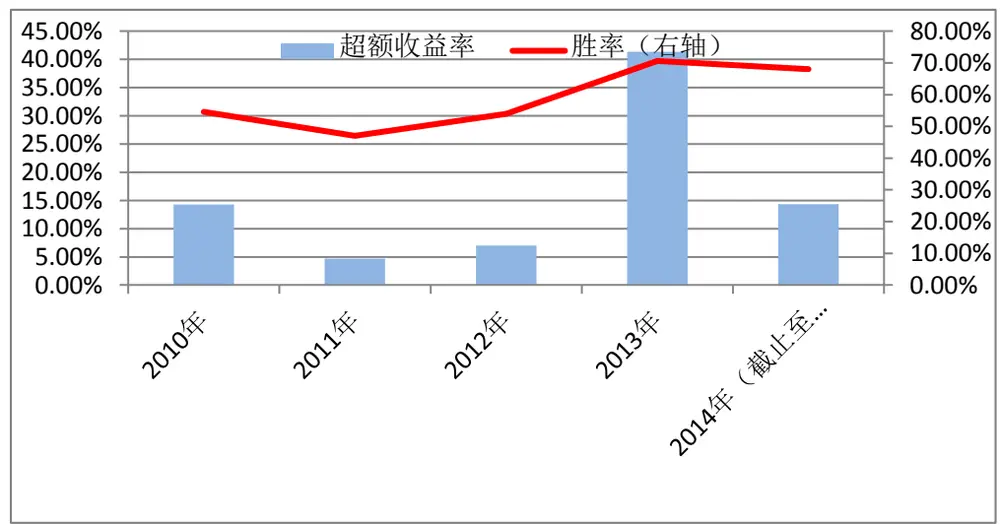
数据来源：广发证券发展研究中心
识别风险，发现价值

回测结果显示，混合指标选股策略在收益回撤比上比单个指标选股有提高。从策略分年度表现来看，从10年到14年，除了11年外，策略的超额收益都在7%以上，最大回撤基本也很小，基本都在4%之内。尤其是13年，一年斩获40%的收益，截止至今年6月策略已经获得了近14%的超额收益。最近两年的优异表现，可能归功于朝阳永续数据库的进一步完善和成熟后数据质量的提高，这也验证了我们之前的想法。

## 5.3指标的测试结果——行业配置的应用

我们将指标与选取的8类事件特征相结合，筛选出如下所示的7个有效的行业配置的指标。我们挑选有效指标的依据是：该指标收益回撤比较高、参数稳定性较佳。表5展示的是有效的行业配置的指标。

表 30:有效的行业配置指标

| 事件特征 | 连续创新高 | 连续创新低 | 连续上涨 | 连续下跌 | 截面高值 | 高位 |
| --- | --- | --- | --- | --- | --- | --- |
| 指标名称 | 预期凈利润 | 预期涨跌幅 | 预期净资产 | 预期 EPS 标准差（长期） | 预期凈利润同比 | 预期 EPS |
|  |  |  |  |  | 评级强度 |  |

数据来源：广发证券发展研究中心

下面这一小节，我们将分别展示在申万一级行业配置中筛选出来的7个指标的效果。

首先展示的是三个业绩预测类指标： 预期净利同比变化率、 预期EPS、 预期净利润

## 5.3.1 业绩预测类指标——预期净利同比变化率

表 30:业绩预测类指标之预期净利同比变化率的表现

| 申万一级行业配置 | 指标名称 | 事件特征持 | 有行业数 | 持有期 | 累计净值 | 胜率 | 回撤 | 平均买进行业数 |
| --- | --- | --- | --- | --- | --- | --- | --- | --- |
|  | 预期净利同比变化率截 | 面高值 | 1 | 1 | 198.22% | 56.39% | 16.37% | 1 |

数据来源：广发证券发展研究中心
识别风险，发现价值

图 39：52周预测净利润变化率指标的超额累计净值图
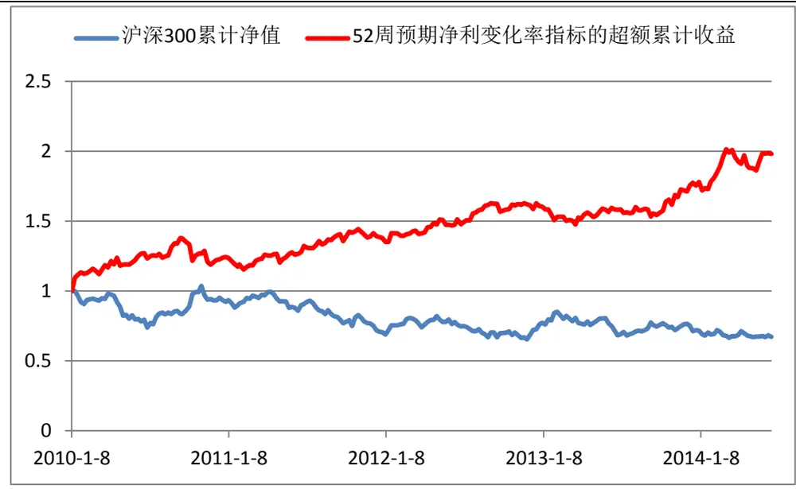
数据来源：广发证券发展研究中心

## 5.3.2 业绩预测类指标——预期EPS

表 32:业绩预测类指标之预期 EPS的表现

| 申万一级行业配置 | 指标名称 | 事件特征 | 持有行业数持 | 有期累 | 计净值 | 胜率 | 回撤 | 平均买进行业数 |
| --- | --- | --- | --- | --- | --- | --- | --- | --- |
|  | 预期EPS | 高位 | 4 | 6 | 183.97% | 61.73% | 7.04% | 4.38 |

数据来源：广发证券发展研究中心

图 40：预期 EPS指标的超额累计净值图
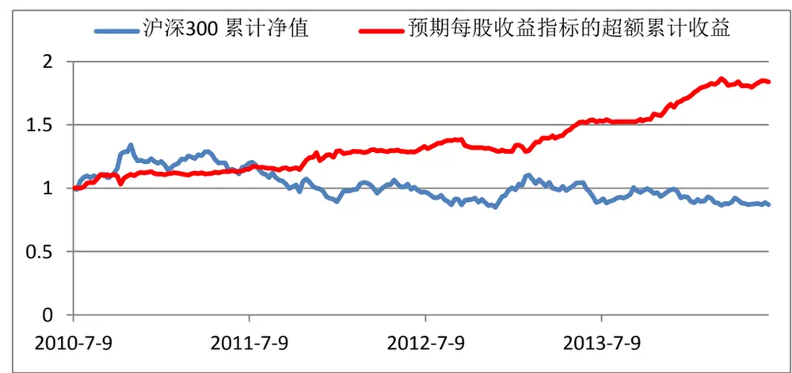
数据来源：广发证券发展研究中心
识别风险，发现价值

## 5.3.3 业绩预测类指标——预期净利润

表 33:业绩预测类指标之预期净利润的表现

| 申万一级行业配置 | 指标名称 | 事件特征 | 持有行业数 | 持有期 | 事件特征的连续周数 | 累计净值 | 胜率 | 回撤 | 平均买进行业数 |
| --- | --- | --- | --- | --- | --- | --- | --- | --- | --- |
|  | 预期净利润 | 创新高 | 8 | 5 | 1 | 185.17% | 63.01% | 9.98% | 5.41 |

数据来源：广发证券发展研究中心

图 41：预期净利润指标的超额累计净值图
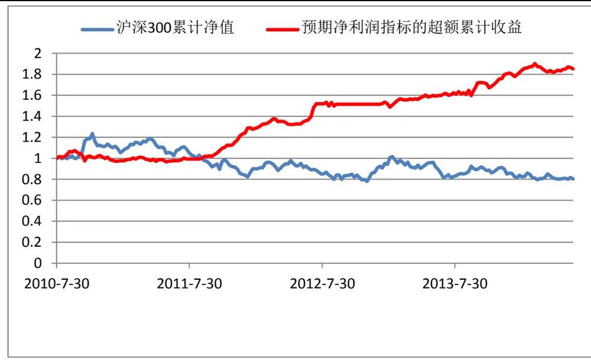
数据来源：广发证券发展研究中心

其次展示的是一个规模指标：预期净资产。

## 5.3.4 规模指标——预期净资产

表 34:规模类指标之预期净资产的表现

| 申万一级行业配置 | 指标名称 | 事件特征 | 持有行业数 | 持有期 | 事件特征的连续周数 | 累计净值 | 胜率 | 回撤 | 平均买进行业数 |
| --- | --- | --- | --- | --- | --- | --- | --- | --- | --- |
|  | 预期净资产 | 上连续涨 | 3 | 3 | 6 | 208.88% | 56.60% | 8.47% | 0.70 |

数据来源：广发证券发展研究中心

图 42：预期净资产指标的超额累计净值图
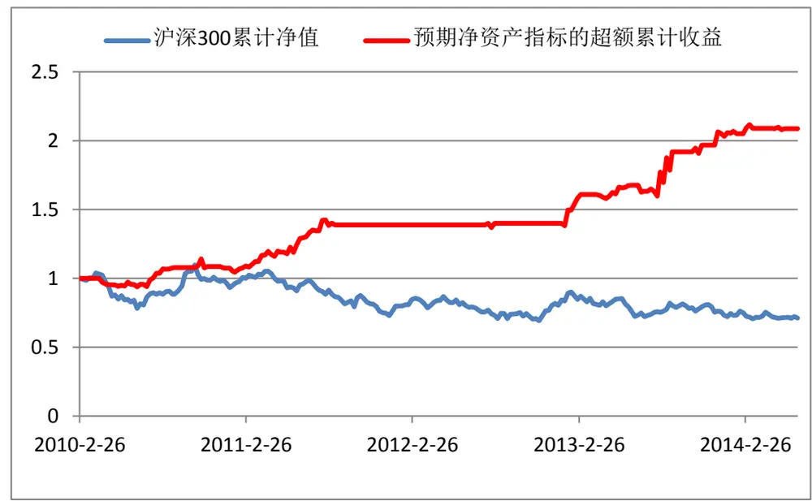
数据来源：广发证券发展研究中心

接下来展示的是两个市场关注度、情绪类指标：预期涨跌幅度 、评级强度5.3.5 市场关注度、情绪类指标——预期涨跌幅

表 35: 市场关注度、情绪类指标之预期涨跌幅的表现

| 申万一级行业配置 | 指标名称 | 事件特征 | 持有行业数 | 持有期 | 事件特征的连续周数 | 累计净值 | 胜率 | 回撤 | 平均买进行业数 |
| --- | --- | --- | --- | --- | --- | --- | --- | --- | --- |
|  | 预期涨跌幅 | 创新低 | 2 | 2 | 1 | 190.47% | 54.33% | 6.67% | 1.39 |

数据来源：广发证券发展研究中心

图 43：预期涨跌幅指标的超额累计净值图

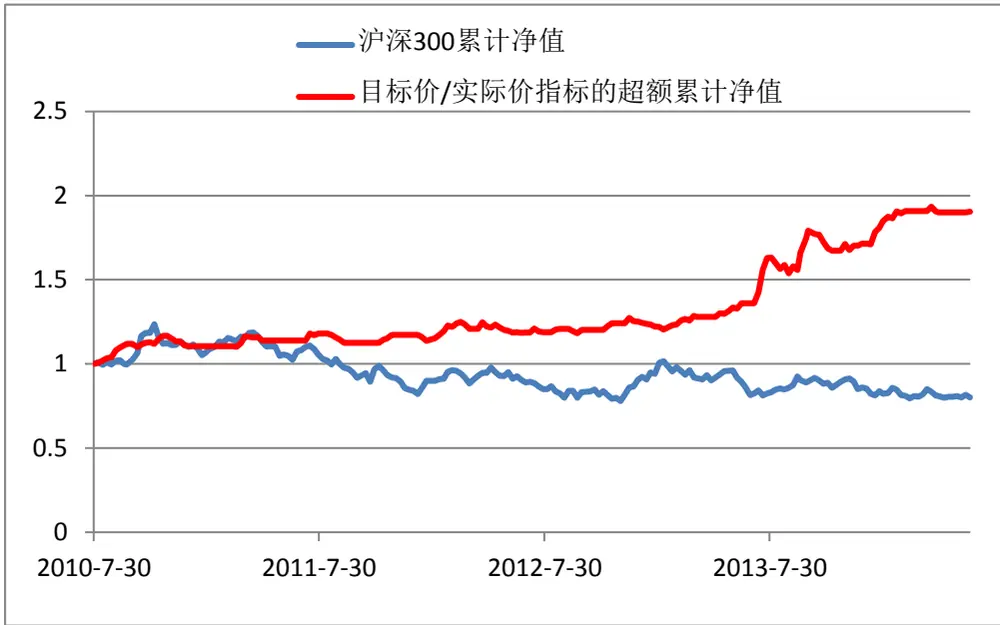
数据来源：广发证券发展研究中心

## 5.3.6 市场关注度、情绪类指标——评级强度

表 36:市场关注度、情绪类指标之评级强度的表现

| 申万一级行业配置 | 指标名称 | 事件特征持 | 有行业数 | 持有期 | 累计净值 | 胜率 | 回撤 | 平均买进行业数 |
| --- | --- | --- | --- | --- | --- | --- | --- | --- |
|  | 评级强度 | 截面高值 | 2 | 1 | 188.44% | 55.95% | 16.01% | 2 |

数据来源：广发证券发展研究中心

图 44：评级强度指标的超额累计净值图
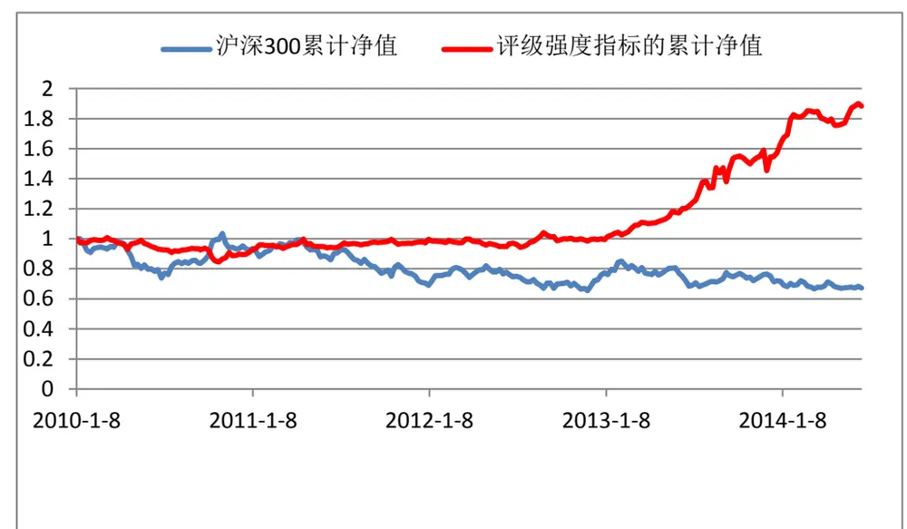
数据来源：广发证券发展研究中心
识别风险，发现价值

可以发现，评级强度这个指标在行业配置方面的应用要比在选股中好很多。
最后展示的是一个机构分歧度类指标：预期EPS标准差（长期）。

5.3.7 机构分歧度类指标——预期EPS标准差（长期）

表 37:机构分歧度类指标之预期EPS标准差（长期）的表现

| 申万一级行业配置 | 指标名称 | 事件特持征 | 有行业数 | 持有期 | 事件特征的连续周数 | 累计净值 | 胜率 | 回撤 | 平均买进行业数 |
| --- | --- | --- | --- | --- | --- | --- | --- | --- | --- |
|  | 预期EPS 标准差(长期) | 下跌 | 1 | 3 | 5 | 266.07% | 63.39% | 9.37% | 1.36 |

数据来源：广发证券发展研究中心

图 45：预期 EPS标准差（长期）的超额累计净值图
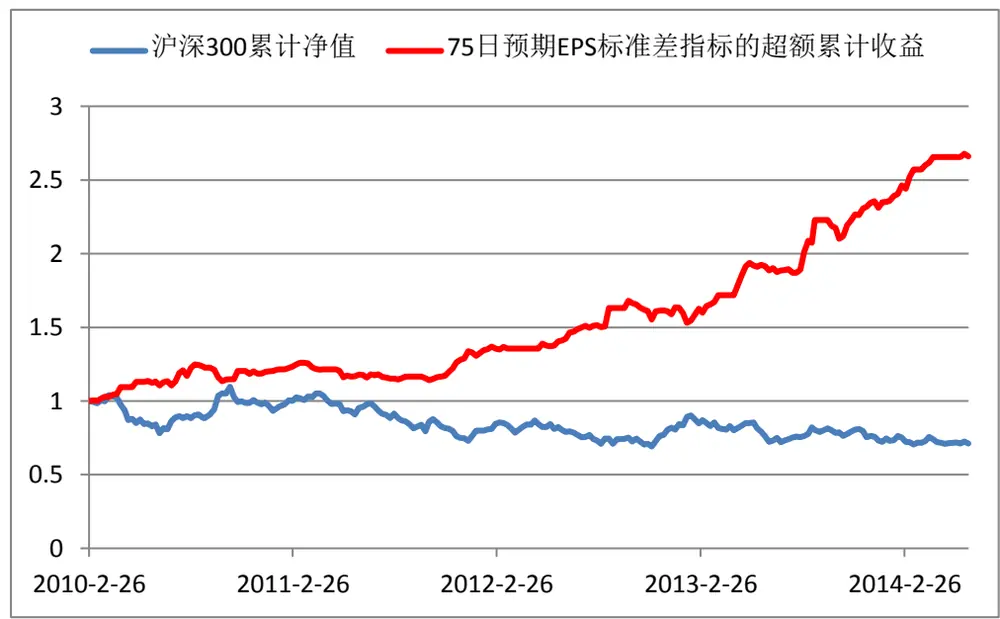
数据来源：广发证券发展研究中心

## 5.4混合指标行业配置策略

同样地，考虑到某些指标选出来的行业数比较少，我们进一步构建我们的混合指标行业配置策略，我们从上面介绍的筛选出的四大类 7个指标中，构造混合指标行业配置策略：

在每个时刻点，通过判断7 个指标中任一一个指标是否触发买入信号，是的话就配置相应的行业，按该指标的持有期持有，多个指标触发同一个行业的情况，则按触发指标中最长的那个持有期来作为该行业的持有期。

策略测试区间为2010.07-2014.06，策略的表现我们将在后面展示。

表 38：混合指标行业配置表现

|  | 平均持仓 行业数 | 平均换手率 累计净值 |  | 胜率 | 最大回撤 |
| --- | --- | --- | --- | --- | --- |
| 混合指标行业配置策略 | 9.19 | 18.85% | 164.03% 58.79% |  | 6.42% |

数据来源：广发证券发展研究中心

图 46：混合指标行业配置模型的超额累计净值
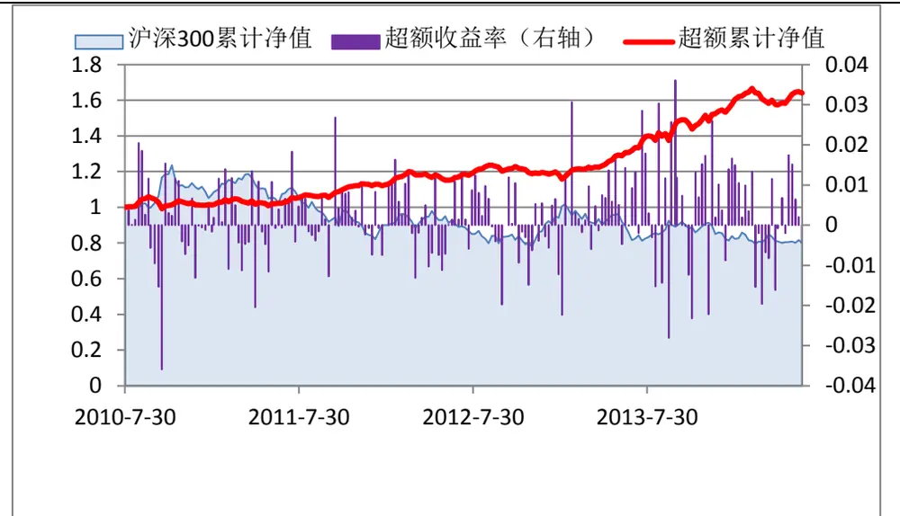
数据来源：广发证券发展研究中心

图 47：混合指标行业配置模型持仓行业数的变化
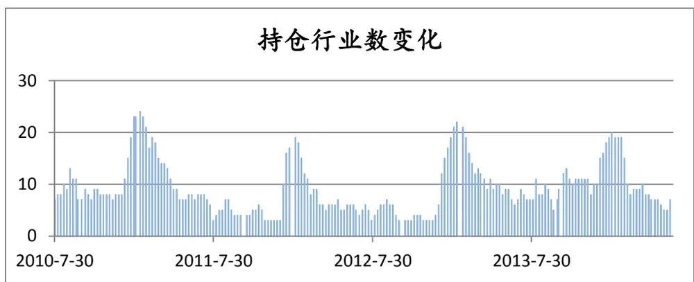
数据来源：广发证券发展研究中心

图 48：混合指标行业配模型的回撤情况

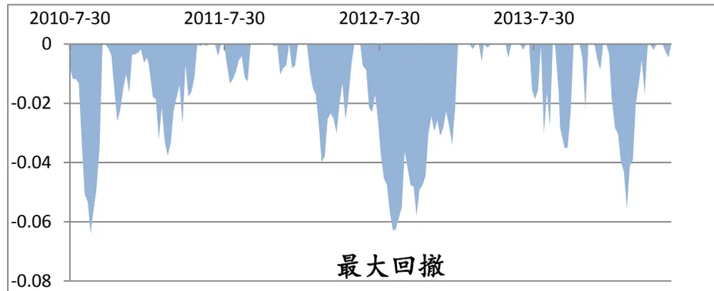
数据来源：广发证券发展研究中心

同样，下面我们来看一下行业配置策略的分年度表现情况。

表 39:策略分年度表现

| 年度情况 超额收益率 胜率 最大回撤 |  |  |  |
| --- | --- | --- | --- |
| 全样本 | 64.03% | 58.79% | 6.42% |
| 2010年 | 1.24% | 59.09% | 3.30% |
| 2011年 | 10.65% | 52.94% | 1.92% |
| 2012年 | 6.39% | 56.00% | 2.07% |
| 2013年 | 29.18% | 66.67% | 1.96% |
| 2014年（截止至06.20） | 6.54% | 60.00% | 2.90% |

数据来源：广发证券发展研究中心

图 49：策略年度表现
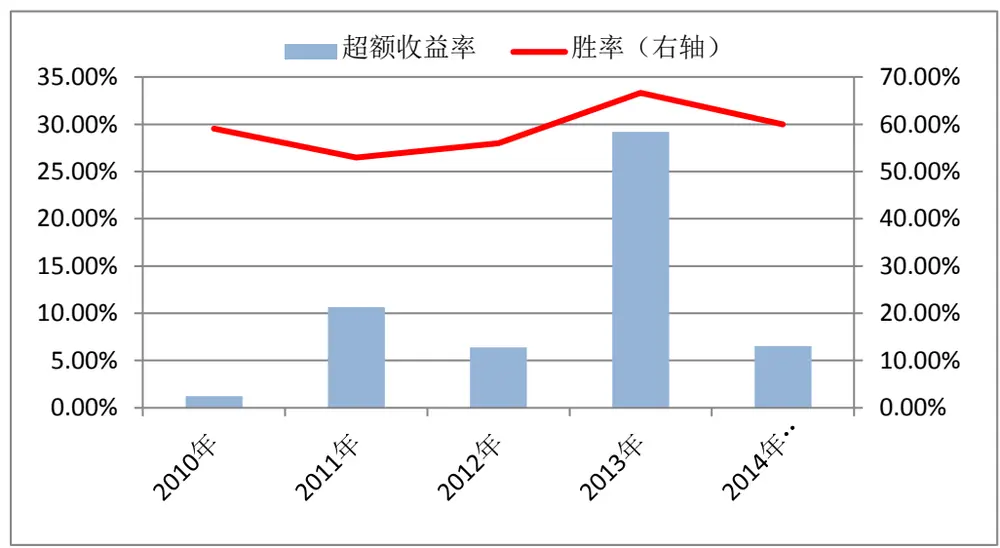
识别风险，发现价值

回测结果显示，混合指标行业配置策略近几年的超额收益都比较稳定，最大回撤基本也很小，基本都在 3%之内。同样是最近两年表现地更好，尤其是 13年，一年斩获近 30%的收益，截止至今年 6 月策略已经获得了近7%的超额收益。

## 六、总结

## 6.1 总结

一直预期数据为量化提供了另一个研究方向，在本篇报告中，我们可以看到某些指标在特定事件下表现得还是很优异的，例如大盘选股时参考盈利预测指标更有优势；且盈利预测类指标对非周期行业可能更有效；市场关注度、情绪类指标比较适合应用在全市场选股中，并且该类指标倾向于应用在非周期行业中。也可以看到哪些指标不适合应用的领域，例如估值类指标在创业板小票的选股应用中效果不佳等等。

另外，回测结果显示，混合指标选股策略在收益回撤比上比单个指标选股有提高。从策略分年度表现来看，从 10 年到 14年，除了11年外，策略的超额收益都在7%以上，最大回撤基本也很小，基本都在 4%之内。尤其是13年，一年斩获40%的收益，截止至今年 6月策略已经获得了近 14%的超额收益。最近两年的优异表现，可能归功于朝阳永续数据库的进一步完善和成熟后数据质量的提高，这也验证了我们之前的想法。

## 风险提示

个股一致预期数据本身存在一定的滞后和片面性，策略的应用存在一定风险。

## Table_RatingIndustry 广发证券—行业投资评级说明

买入： 预期未来 12 个月内，股价表现强于大盘 10%以上。

持有： 预期未来12个月内，股价相对大盘的变动幅度介于-10%～+10%。

卖出： 预期未来12个月内，股价表现弱于大盘10%以上。

## Table_RatingCompany 广发证券—公司投资评级说明

买入： 预期未来12个月内，股价表现强于大盘15%以上。

谨慎增持： 预期未来12个月内，股价表现强于大盘5%-15%。

持有： 预期未来12个月内，股价相对大盘的变动幅度介于-5%～+5%。

卖出： 预期未来12个月内，股价表现弱于大盘5%以上。

## Table_Ad联系我们

|  | 广州市 | 深圳市 | 北京市 | 上海市 |
| --- | --- | --- | --- | --- |
| 地址 | 都会广场5 楼 | 广州市天河北路183号大 深圳市福田区金田路4018 | 北京市西城区月坛北街2号 | 上海市浦东新区富城路99号 |
| 邮政编码 | 510075 | 号安联大厦15楼A座03-04 月坛大厦18层 |  | 震旦大厦18楼 |
| 客服邮箱 |  | 518026 | 100045 | 200120 |
| 服务热线 | gfyf@gf.com.cn 020-87555888-8612 |  |  |  |

## Table_Disclaimer 免 责声 明

广发证券股份有限公司具备证券投资咨询业务资格。本报告只发送给广发证券重点客户，不对外公开发布。

本报告所载资料的来源及观点的出处皆被广发证券股份有限公司认为可靠，但广发证券不对其准确性或完整性做出任何保证。报告内容仅供参考，报告中的信息或所表达观点不构成所涉证券买卖的出价或询价。广发证券不对因使用本报告的内容而引致的损失承担任何责任，除非法律法规有明确规定。客户不应以本报告取代其独立判断或仅根据本报告做出决策。

广发证券可发出其它与本报告所载信息不一致及有不同结论的报告。本报告反映研究人员的不同观点、见解及分析方法，并不代表广发证券或其附属机构的立场。报告所载资料、意见及推测仅反映研究人员于发出本报告当日的判断，可随时更改且不予通告。

本报告旨在发送给广发证券的特定客户及其它专业人士。未经广发证券事先书面许可，任何机构或个人不得以任何形式翻版、复制、刊登、转载和引用，否则由此造成的一切不良后果及法律责任由私自翻版、复制、刊登、转载和引用者承担。