## 上市公司披露信息变更隐含的投资机会

## ——事件驱动策略之（十四）

## 报告摘要：

## 各种概念、主题受关注，信息变更亦成炒作契机

近年来，A股市场上概念、热点的炒作频繁，例如最近的“沪港通”、“国企改革”、“互联网金融”等，相关个股在某一概念、热点背景下，往往在中短期时间内有较好的市场表现。同样地，上市公司特定的信息变更也往往遭到市场的热炒，例如说上市公司更名事件、股权变更事件以及人事变更等信息变更事件，而这种重大的信息变更事件，上市公司往往会发布公告。因此，本专题报告的目的为基于上市公司公告的文本信息，试图采用文本挖掘的方法来研究这种信息变更带来的事件驱动投资机会。

## 信息变更的事件驱动策略构建

基于文本挖掘方法，我们将上市公司的公告文本信息进行分类，主要分为三大类：公司更名、股权变更、人事变更三类信息变更公告。基于分类好后的公告，我们进行策略的构建。

单个信息变更的事件驱动策略构建：分别基于公司更名、股权变更以及人事变更三种信息变更事件，考虑在全样本内，单个事件驱动策略的表现以及考虑市值规模、行业变更、行业估值变化以及机构持股比例变化等因素影响下，三种信息变更事件驱动策略相对沪深300指数、中证800等权指数的表现。

事件驱动综合策略构建：为降低单个信息变更事件策略的回撤以及单个策略收益率的波动率，通过选择单个事件驱动策略在历史回测期内最好的策略合成为综合的策略，考虑综合策略在历史回测期内的表现情况。

## 实证结果

历史回测结果显示，单个信息变更的事件驱动策略中：公司更名事件驱动策略在历史回测期的表现优异，在考虑了市值规模因素影响下，持有期为20个交易日的策略表现最为优异，在整个样本期内相对沪深300指数取得了785.23%的超额收益率，60.44%的胜率，策略分年度表现也较为优异；股权变更事件驱动策略在历史回测期内同样表现优异，在小市值中策略表现更为突出，其中以持有期为120个交易日的策略表现最为优异，在整个样本期内相对沪深300指数取得了685.45%的超额收益率，以及75%的胜率；人事变更事件驱动策略同样表现优异，在整个样本期内，以持有期为90个交易日的策略表现优异，相对沪深300指数取得了230.88%，55.04%的胜率，分年度策略表现也较为优异。事件驱动综合策略中，在考虑三种信息变更事件的综合策略中，策略的表现优异，相对沪深300指数实现了624.62%的超额收益率，65.38%的胜率，策略在分年度上都取得了较高的正的超额收益率。

## 风险提示

本文未对信息变更背后具体的原因及利好利空进行深入分析。

图 1 综合策略历史回测
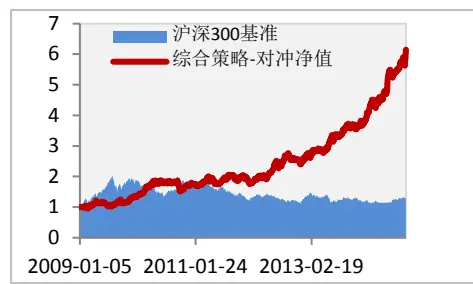

表1 综合策略分年度表现（相对沪深 300）

| 指标 | 超额 收益 | 绝对收益 率 | 胜率 |
| --- | --- | --- | --- |
| 2009 | 57.59% | 140.47% | 80.43% |
| 2010 | 33.62% | 21.10% | 72.00% |
| 2011 | 1.94% | -23.08% | 31.25% |
| 2012 | 45.28% | 52.84% | 55.41% |
| 2013 | 41.42% | 33.77% | 76.47% |
| 2014至今 | 60.47% | 63.08% | 92.00% |

表 2 综合策略整体表现（相对沪深 300）

| 胜率 | 绝对收益率 | 超额收益率 |
| --- | --- | --- |
| 65.38% | 646.89% | 624.62% |

分析师：史庆盛S0260513070004

公020-87555888-8618

sqs@gf.com.cn

## 相关研究：

| 基于网络新闻热度的择时策 | 2014-06-25 |
| --- | --- |
| 略一互联网大数据挖掘系 |  |
| 列专题之（一） |  |
| 公告披露背后隐藏的投资 |  |
| 机会一互联网大数据挖掘系 |  |
| 列专题之（二） |  |
| 倾听股吧之声-互联网大数据2014-06-27 挖掘系列专题之（三） |  |
| 那些年一起追过的财经小编 | 2014-08-22 |
| 策略-互联网大数据挖掘系列 |  |

## 一、前言

近年来，A股市场上概念、热点的炒作频繁，例如最近的“沪港通”、“国企改革”、“互联网金融”等，相关个股在某一概念、热点背景下，往往在中短期时间内有较好的市场表现。同样地，上市公司特定的信息变更也往往遭到市场的热炒，例如说上市公司更名事件、股权变更事件以及人事变更等信息变更事件，而其中较为典型的事件为上市公司更名事件。上市公司更名往往有两大原因，一种是上市公司主营业务发生变更、资产重组、并购或者是控股股东变更导致公司名称变更，另一种情况是上市公司为迎合当前市场的行业热点概念而进行公司名称的变更。例如将公司名称带上“科技”、“云计算”、“互联网”等热点、概念名词。一旦上市公司更名后公司名称与当前的热点、概念相关的话，股价在中短期时间内往往有较好的市场表现。据不完全统计，A股市场公司更名次数最多的个股为浪莎股份(600137.SH)，自其1998年上市以来，一共发生更名12次，平均1.33年更名一次上市公司的名称，紧随其后的是西部资源(600139.SH)一共发生了10次更名事件。可见，这种频繁的公司更名事件也难免会引起市场对上市公司为迎合市场热点炒作的嫌疑。而上市公司的股权变更，也往往会引起市场的一番炒作，例如说上市上市公司的控股股东的变更，往往会在随后一段时间内，股价有上涨的表现，因为上市公司控股股东的变更隐藏着一种潜在的利好，就是控股股东有可能将优质的资产注入上市公司，从而带动股价的上涨。人事变更事件中，例如说高管的变更，新上任的高管往往会对公司的经营体制、经营活动进行改善从而带动业绩的上涨，引起股价的对应上涨。可见，上市公司特定的信息变更事件能够带来投资机会。如何研究上市公司信息变更带来的事件驱动投资机会，是本专题策略研究的出发点。如何第一时间获取到上市公司信息变更带来的事件驱动投资机会，是本专题策略研究的难点。

上市公司发生重大的信息变更，往往会第一时间发布公告，因此，可以从公告的文本信息角度来研究上市公司信息变更带来的事件驱动投资机会。因此，本专题策略从上市公司公告的文本信息角度出发，采用文本挖掘的方法来研究上市公司信息变更带来的事件驱动投资机会。之前，我们也采用文本挖掘的方法对上市公司公告披露背后的投资机会进行了统计分析以及实证，得到了较好的就结果，具体可见《公告披露背后隐藏的投资机会一互联网大数据挖掘系列专题之（二)》专题报告。本专题从另一个角度出发，来研究上市公司的公告带来的事件驱动投资机会。

## 二、文本挖掘框架流程

## 2.1 数据抓取平台组件框架

在之前的互联网大数据挖掘的专题系列报告中，我们搭建了一个完善的数据抓取平台框架。这里我们首先对整个数据抓取的平台框架进行详细地介绍，然后再介绍基于此平台上搭建的此次专题策略的框架流程。

首先，介绍一下我们金融工程小组搭建的完善的数据抓取平台框架。

图 2 数据抓取平台框架组件

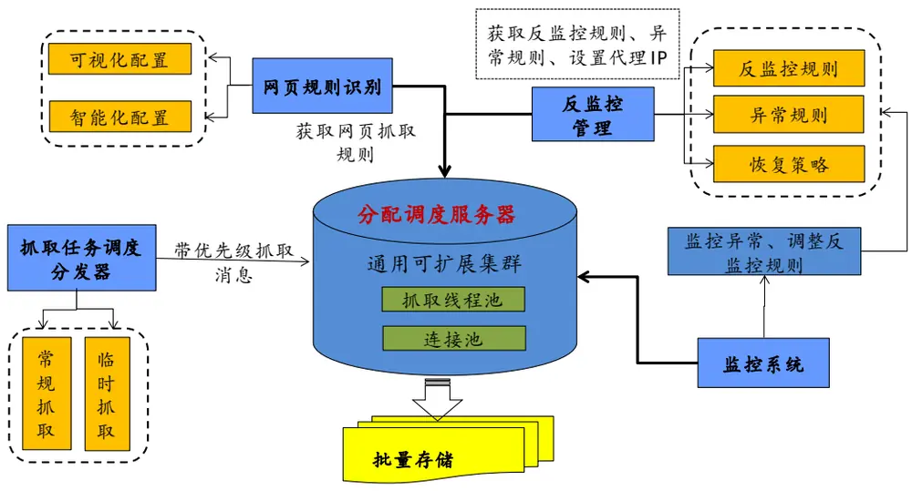
数据来源：广发证券发展研究中心

上图刻画了我们金融工程小组搭建的完善的数据抓取平台组件的整个框架流程。整个抓取平台的平台核心部分是中间的分配调度服务器，辅助搭建的模块有四个，分别为抓取任务调度器、网页规则识别、反监控系统以及监控系统。

分配调度服务器功能为负责将所需数据从互联网上抓取下来，然后以指定形式的格式批量存储下来，这里可以将记录以特定的标题格式以txt的形式存储于本地或者以数据库的形式存储相关的激励。抓取任务调度分发器负责分配抓取的网站的调度，包括一些常规的抓取以及一些临时的抓取(链接失效、断网重新抓取等任务)调度、网页规则识别负责根据抓取任务调度器分配到的网站，调用指定网站的网页内容获取规则。监控系统负责监控网页的异常（例如链接失效、断网、网页加载过慢等情况）、反监控系统负责监控网站的防盗链等问题(例如IP频繁访问造成的IP被禁等问题）。

## 2.2上市公司公告文本信息获取

这里简要介绍一下，本次专题策略公告抓取的流程。

首先，我们需要的信息是上市公司的公告文本信息。获取上市公司重要公告一般有两种途径：一种为通过上市公司的官方网站，一种为通过上市公司信息披露的指定平台，例如上海证券交易所、深圳证券交易所或者巨潮资讯网等指定信息披露平台。通过上市公司官方网站获取公告，需要批量地获取到所有上市公司的官方网站地址，工作量大，效率低，不利于后期公告抓取的维护，而且需要对所有上市公司官方网站需要提取公告文本信息的网页编码进行研究，无疑也是效率非常低的事情；因此通过上海证券交易所、深圳证券交易所以及巨潮资讯网等公告指定的披露平台获取到上市公司的公告的方式就显得较为简单了，因为在这些网站上往往能够查询到所有上市公司历史时间段内的各类重要的公告信息，例如公司更名、上市公司重组公告、交易异常等公告。基于对公告获取平台效率的权衡，本专题获取的上市公司公告文本信息分别来源于深圳证券交易所、上海证券交易所以及巨潮资讯网公告披露平台。

以下以巨潮资讯网的公告栏目为例，简要介绍一下公告爬取的主要过程。1) 首先获取到上市公告公告披露平台网址：

http://www.cninfo.com.cn/search/search.jsp;

2) 从获取到的上市公司公告披露平台上可以看到可以查询到不同上市公司在某一时间段内或者是某日的特定公告类型；

3) 通过2)中的解析后有两种方法可以获取到上市公司公告，一种为通过每次查询后的结果获取到的结果url，然后比较不同url之间的固定参数以及可变参数的关系，找到url之间的规律，另一种为通过模拟鼠标操作以及输入的方法获取到需要查询的信息；

以第一种方法为例，解析查询后获取的网址的规律。

通过对网页编码的解析，我们可以获取到每次查询后的网址的实际网址信息，例如在股票代码输入框中输入000001，时间段查询选择:2014-11-01至2014-12-10后点击确定后可以看到查询后的网址为：

http://www.cninfo.com.cn/search/search.jsp与之前的网址没有发生变化，但是实际的查询网址为：http://www.cninfo.com.cn/search/search.jsp?

orderby=date11&marketType=012002&noticeType=&stockCode=000001&keyword=&startTime=2014-11-01&endTime=2014-12-10&pageNo=1，对不同的股票代码以及查询时间进行比较后，可以找到不同url之间的关系，具体解析如下：固定参数部分：http://www.cninfo.com.cn/search/search.jsp?orderby=date11可变参数部分：marketType、noticeType、stockCode、keyword、startTime、endTime、pageNo等

其中pageNo表示如果查询结果返回的是多页情况，可以通过pageNo的变化获取到不同页面的结果，stockCode表示需要查询信息的股票代码，noticeType表示需要查询的公告类型，keyword为查找包含对应关键字公告的参数，startTime表示查询的开始时间段，endTime表示查询的结束时间段，marketType表示查询的个股所在的市场类型，例如000001在沪市主板，则对应的市场类型的参数为：012002。

这里强调一下，如果需要查询包含特定关键字特定类型的公告，则需要对keyword后的参数进行编码转换，因为url的传递往往是不支持中文的传递的。例如假设keyword参数值设置为“变更”，即查询包含变更字眼的公告，对应的后台编码转换后的参数为“%B1%E4%B8%FC”。

4) 通过3)中对查询网址的规律的查询，我们可以根据url的规律批量获取到个股在历史时间段内的公告，并将公告信息提取出来。

基于上述对公告获取规则的解析，我们可以得到不同个股查询结果后的公告信息。对需要提取的信息的网页编码格式进行解析后，可以获取到不同的个股公告信息。

图 3 巨潮资讯网公告查询栏目

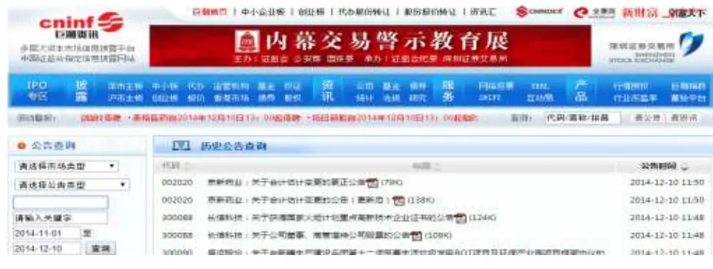
数据来源：广发证券发展研究中心、巨潮资讯网

图4 巨潮资讯网公告信息

| 历史公告查询 |  |  |
| --- | --- | --- |
| 代码 | 标题 | 公告时间 |
| 002020 | 京新药业：关于会计估计变更的更正公告(79K) | 2014-12-1011:50 |
| 002020 | 京新药业：关于会计估计变更的公告（更新后）(138K) | 2014-12-10 11:50 |
| 300088 | 长信科技：关于获得国家火炬计划重点高新技术企业证书的公售(124K) | 2014-12-10 11:48 |
| 300088 | 长信科技：关于公司董事。高管增持公司股票的公告（109K) | 2014-12-10 11:48 |
| 300090 | 盛运股份：关于与新疆生产建设兵团第十二师签署生活垃圾发电BOT项目及环保产业圆项目框架协议的 | 2014-12-10 11:48 |
| 300170 | 公告(193K) 汉得信息：重大事项停牌公告(62K) | 2014-12-10 11:48 |
| 300186 | 大华农：关于取得新普药注册证书的公告(83K) | 2014-12-10 11:48 |
| 300338 | 开元仪翻：关于部分童事辞职的补充更正公告(128K) | 2014-12-10 11:48 |

数据来源：广发证券发展研究中心、巨潮资讯网

图 5 公告抓取信息一览
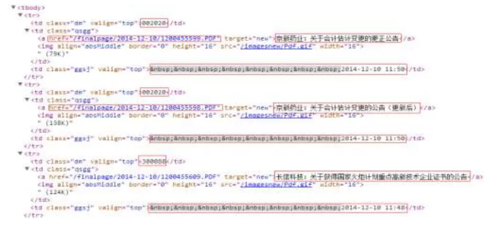
数据来源：广发证券发展研究中心、巨潮资讯网

通过对公告网页源代码解析的方式来获取公告内容，有三种方式可以获取到需要提取的公告信息。

## 1) 字符串匹配查找的方法

通过对特定网站的网页源代码的识别，利用字符串匹配的方式获取到需要提取的文本信息，该方法需要对字符的匹配查找能力有较高的要求，缺点是往往提取出来的文本信息包含一些干扰的文本信息，即信息提取不“纯”。

## 2) 正则表达式匹配方法

这种方法要求使用者对正则表达式的规则使用较熟练，该方法能够迅速地匹配到所需的文本信息，并将所需的文本信息提取出来。

## 3) HTMLDOM结构解析

本质上，网站返回到本地电脑的是一个代码文件，代码文件经过浏览器的重新解析识别后，才会以各种非常规则漂亮的形式显示在我们的视野面前。网站返回的网页源代码其实是一种树状结构的，有根节点、子节点、元素、属性等。而HTMLDOM能够将这种树状结构的网页源代码存储到本地，从而能够方便快捷地利用HTMLDOM的相关语句以及语法对代码进行解析，从而获取到需要的文本信息。这对于大规模获取公告的文本信息，效率上是有非常大的提高的。

## 2.3 基于信息变更的事件驱动策略框架

基于上述的数据抓取平台，我们构建了此次专题策略的整体框架。

图 6 基于信息变更事件驱动策略框架
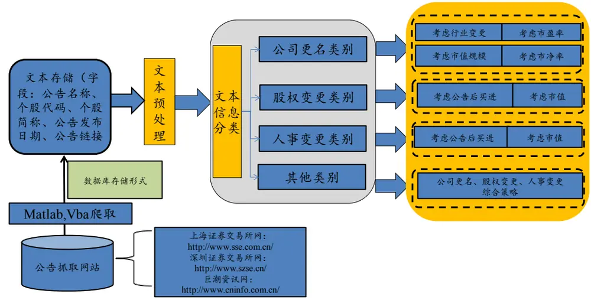
数据来源：广发证券发展研究中心

整个信息变更的事件驱动策略流程分为三大模块，分别为公告抓取、公告分类、策略构建。

公告抓取模块主要是利用 VBA+Matlab编程从上交所、深交所以及巨潮资讯网获取上市公司的历史的公告文本信息，然后将公告的相关信息存储下来。

公告分类模块主要是利用建立好的特定类别的公告词库，利用一些算法将指定类型的公告识别出来并进行标记。

策略构建模块主要是依据特定类别的公告考虑不同因素影响下的事件驱动策略的表现情况。

图 7 上市公司公告文本信息分类步骤

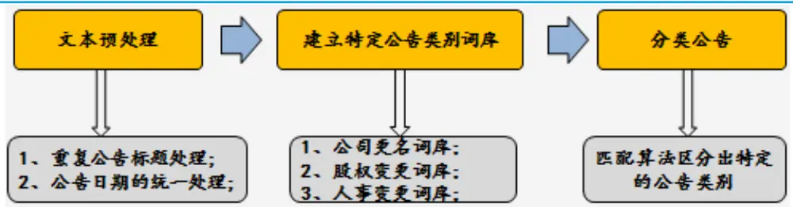
数据来源：广发证券发展研究中心

文本预处理主要是去除掉当天重复的个股公告标题，以及由于重复抓取获取的公告。通过对公告的披露时间进行统一的处理，全部转化为yyyy-mm-dd的日期格式，便于数据的处理后期以及策略构建。建立特定公告类别词库主要是根据公司更名、股权变更、人事变更建立能够区分三种类别的公告的分类词库，其中主要包含针对特定公告类别的关键字，股权变更主要针对的分类范围是股权结构变更，包括大股东变更、控股股东变更、第二大股东变更、股东变更、实际控制人变更等。人事变更主要是针对高管的变更，包括董事、总经理、董事会秘书、董事长、法定代表人变更等。公司更名指的是上市公司更名，包含的关键字主要有公司名称变更、公司更名等。依据建立好的词库再利用一些匹配算法就能够将特定类别的公告区分出来。

## 三、基于上市公司信息变更的事件驱动策略实证

## 3.1 样本数据

由上述的框架可得，本专题策略的数据来源于上交所、深交所以及巨潮资讯这三个上市公司指定的信息披露平台。所需的数据包括上市公司的公告文本信息以及A股市场上所有个股的历史交易数据，包括开盘价、收盘价、成交量、交易状态等数据。样本区间为2009年1月1日至今。策略的历史收益比较基准为沪深300指数、中证800等权指数。

图 8 公告文本信息一览
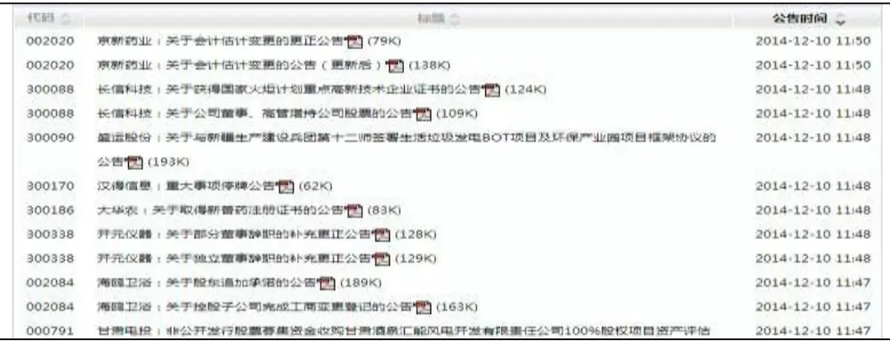
数据来源：广发证券发展研究中心、巨潮资讯网

## 3.2 策略构建原理

## 初始资金：1;

策略原理：在历史回测期间内，若上市公司发布指定类别的公告，则在公告后的第一个交易日以开盘价买进该个股，若个股涨停、跌停或者停牌，则推迟买进，但推迟最多不超过三个交易日，持有一段时间，在持有期末以收盘价卖出该个股，若持有期末个股涨停、跌停或者停牌，则推迟卖出，直至个股卖出；

交易费用：买卖收取千分之二费用。

资金投资权重：等权投资于个股；

## 3.3 事件驱动策略之公司更名

这一节，我们将研究上市公司公司更名事件的事件驱动策略。

首先我们从简单的统计角度看，上市公司更名事件在每年以及每个月度发生事件的情况。从分年度的角度看，每一年度都有稳定的公司更名事件样本发生，这也利于策略的构建，并且从整体的角度看，每一年样本数据也大体均匀。从分月度的样本统计角度看，每个月度都有稳定的公司更名事件发生，而且有较多的事件发生，这也利于策略的构建，3月、6月、7月、12月有较多的上市公司更名事件发生。

图 9 上市公司更名事件分年度统计一览
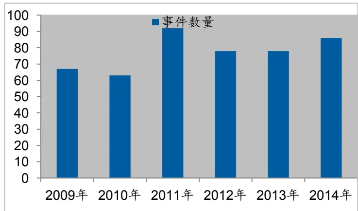
数据来源：广发证券发展研究中心

图 10上市公司更名事件分月度统计一览
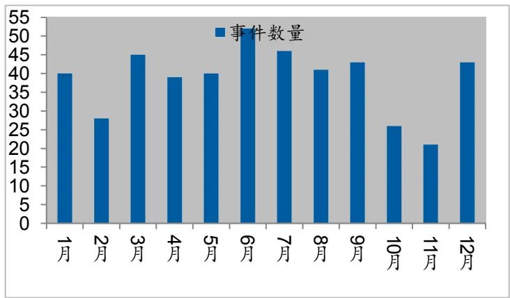
数据来源：广发证券发展研究中心

首先，考察策略相对沪深300基准的表现。

基于历史的上市公司更名事件全样本，不考虑行业变更、估值变化等因素影响下建立量化策略，考察上市公司更名的事件驱动策略表现。

图 11 公司更名事件策略表现(相对沪深300持有期30个交易日)
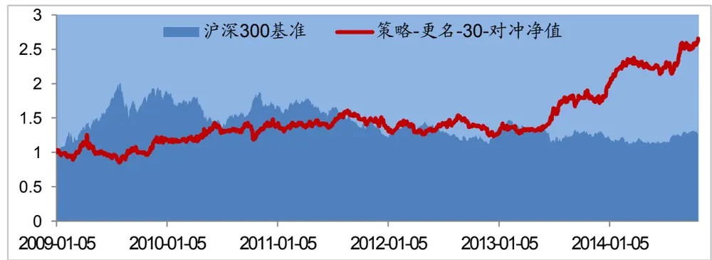
数据来源：广发证券发展研究中心

表 3 公司更名事件策略指标一览(相对沪深300持有期30个交易日)

| 指标 | 超额收益率 | 绝对收益率 | 胜率 |
| --- | --- | --- | --- |
| 全样本 | 244.07% | 267.13% | 56.69% |

识别风险，发现价值

| 2009 | 55.27% | 139.32% | 74.00% |
| --- | --- | --- | --- |
| 2010 | 17.02% | 4.51% | 59.18% |
| 2011 | -2.17% | -27.19% | 51.61% |
| 2012 | -7.93% | -0.37% | 41.82% |
| 2013 | 52.23% | 44.59% | 60.00% |
| 2014 | 37.34% | 39.95% | 55.56% |

数据来源：广发证券发展研究中心

从上述图与表中可以看出，在整个样本下，不考虑行业变更、估值比那话等因素影响下，策略在整个样本下相对沪深300指数实现了244.07%的超额收益率，全样本下胜率为56.69%，接近57%的胜率。且从分年度策略的表现看，策略除了在2011年以及2012年超额收益率为负之外，在其他年度都取得了正的且较高的超额收益率。分年度上看，胜率都保持在较高的胜率水平上。

为了能够更好地分析公司更名事件隐藏的事件驱动投资机会，我们从多个维度的角度对公司更名事件驱动策略进行分析，分别从公司更名伴随行业变更影响、公司更名伴随行业变更，变更前后行业估值的影响、公司更名前机构持股比例变动影响以及考虑不同市值规模影响下的公司更名事件策略的表现。以下考虑策略相对中证800等权指数表现也是基于这四个维度进行分析，就不在赘述。

考虑行业变更因素影响下相对沪深300的公司更名事件驱动策略表现。

图12 公司更名事件伴随行业变更(相对沪深300持有期120个交易日)
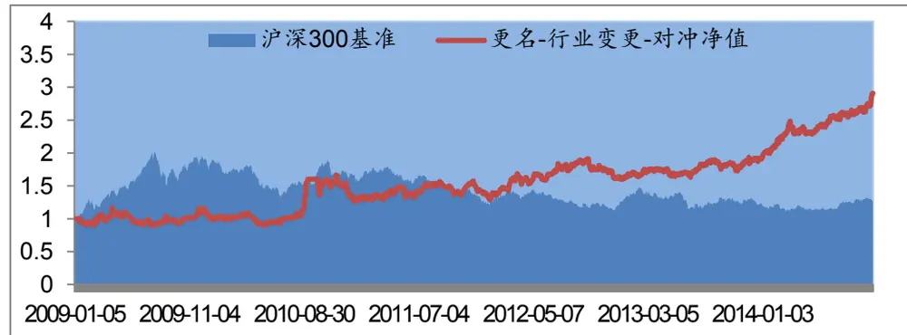
数据来源：广发证券发展研究中心

表 4 公司更名伴随行业变更策略指标一览(相对沪深300持有期120个交易日)

| 指标 | 超额收益率 | 绝对收益率 | 胜率 |
| --- | --- | --- | --- |
| 全样本 | 213.48% | 235.75% | 51.95% |
| 2009 | 3.02% | 85.89% | 83.33% |
| 2010 | 20.62% | 8.11% | 61.22% |
| 2011 | -0.84% | -25.86% | 26.67% |
| 2012 | 24.12% | 31.68% | 30.91% |
| 2013 | 16.39% | 8.74% | 66.67% |

识别风险，发现价值

| 2014 | 54.77% | 57.38% | 85.29% |
| --- | --- | --- | --- |

数据来源：广发证券发展研究中心

从上述图与表可以看出，上市公司更名的同时伴随着行业变更的事件策略在整个样本回测期内，取得了213.48%的超额收益率，整个样本期内的胜率也有51.95%接近52%的胜率。从分年度策略表现的角度看，相对之前的不区分行业变更、估值等因素影响的策略，该策略除了在11年取得了不到1%的负的超额收益率外，在其他年度都取得了较高的正的超额收益率。且从胜率角度看，除了11、12年胜率较低外，在其他年度都取得了较高的胜率。

考虑行业变更以及变更前后行业估值变化因素影响下相对沪深300的公司更名事件驱动策略表现。

图13 公司更名事件伴随估值变化策略表现(相对沪深300持有期120个交易日)
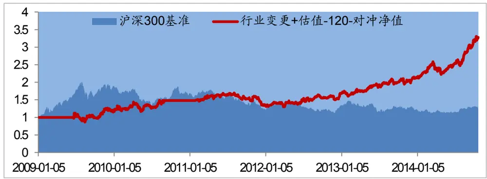
数据来源：广发证券发展研究中心

表 5 公司更名伴随估值变化策略指标一览(相对沪深300持有期120个交易日)

| 指标 | 超额收益率 | 绝对收益率 | 胜率 |
| --- | --- | --- | --- |
| 全样本 | 162.30% | 139.82% | 60.00% |
| 2009 | 16.03% | 31.97% | 100.00% |
| 2010 | 17.43% | 4.92% | 50.00% |
| 2011 | -5.23% | -30.25% | 37.50% |
| 2012 | 25.61% | 33.16% | 60.00% |
| 2013 | 24.87% | 17.22% | 38.10% |
| 2014 | 56.46% | 59.07% | 100.00% |

数据来源：广发证券发展研究中心

从上述图与表中可以看出，公司更名伴随行业变更，同时考虑变更前后行业的估值变化的影响的策略确实能够带来超额收益，如果公司从一个较低估值的行业变更到一个较高估值的行业上，存在着补涨的可能性，从而引起相应个股的股价的上涨。从上述图与表中可以看出，在考虑行业变更同时考虑变更前后行业估值的因素下，在整个回测期内，策略取得了162.30%的超额收益率以及60%的胜率。分年度的角度看，这种策略除了在11年取得了负的超额收益率外，在其他年度都取得了较高的正的超额收益率，分年度来看也取得了较高胜率。

考虑机构持股比例变化因素影响下相对沪深300的公司更名事件驱动策略表现。图14 公司更名伴随机构持股比例增加(相对沪深300持有期120个交易日)

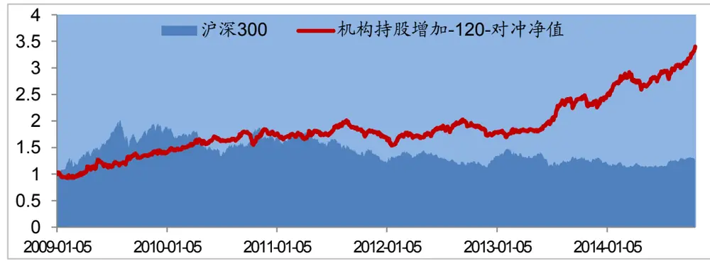
数据来源：广发证券发展研究中心

表6 公司更名伴随机构持股增加策略指标一览(相对沪深300持有期120个交易日)

| 指标 | 超额收益率 | 绝对收益率 | 胜率 |
| --- | --- | --- | --- |
| 全样本 | 299.77% | 326.74% | 60.87% |
| 2009 | 66.10% | 156.00% | 73.08% |
| 2010 | 22.77% | 10.26% | 61.11% |
| 2011 | -1.50% | -26.52% | 32.00% |
| 2012 | 5.43% | 12.98% | 50.00% |
| 2013 | 33.90% | 26.26% | 64.52% |
| 2014 | 41.63% | 44.23% | 89.47% |

数据来源：广发证券发展研究中心

从上述图和表中，考虑上市公司公司更名事件公告前机构持股增加的策略，在历史回测期内，全样本下取得了299.77%的超额收益率，胜率为60.87%，接近61%的胜率。分年度角度看，在历史回测期内，除了在11年取得1.5%的负的超额收益率外，在其他年度都取得了较高的正的超额收益率。

考虑市值规模因素影响下相对沪深300的公司更名事件驱动策略表现。

图 15 公司更名考虑市值规模(相对沪深300持有期20个交易日)
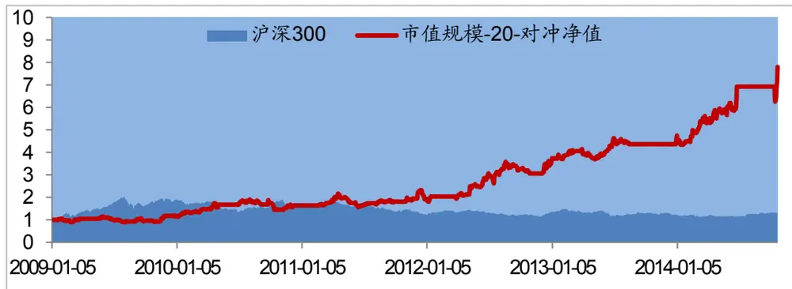
识别风险，发现价值

表 7 公司更名考虑市值规模策略指标一览(相对沪深300持有期20个交易日)

| 指标 | 超额收益率 | 绝对收益率 | 胜率 |
| --- | --- | --- | --- |
| 全样本 | 785.23% | 812.19% | 60.44% |
| 2009 | 29.59% | 119.49% | 60.00% |
| 2010 | 45.35% | 32.84% | 66.67% |
| 2011 | 8.59% | -16.42% | 41.18% |
| 2012 | 91.16% | 98.71% | 68.75% |
| 2013 | 25.70% | 18.05% | 57.89% |
| 2014 | 56.97% | 59.57% | 60.44% |

数据来源：广发证券发展研究中心

从上述图与表中可以看出，考虑上市公司更名公告前一个交易日的流通市值规模，并根据流通市值规模对发生公司更名事件的上市公司进行划分。从历史回测期内，可以看到小市值规模的公司的策略表现更好，取得了785.23%的超额收益率，胜率也有60.44%。分年度角度看，该策略在每年都取得了正的超额收益率，并且每年大体上都取得了较高的胜率。

图 16 公司更名事件策略表现(相对中证800等权指数持有期30个交易日)
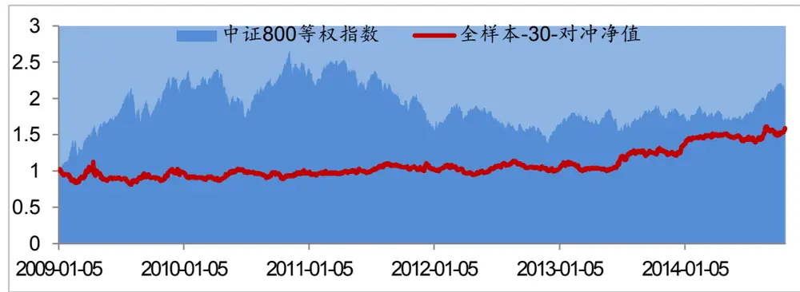
数据来源：广发证券发展研究中心

表8 公司更名事件策略指标一览(相对中证800等权指数持有期30个交易日)

| 指标 | 超额收益率 | 绝对收益率 | 胜率 |
| --- | --- | --- | --- |
| 全样本 | 58.87% | 267.13% | 49.84% |
| 2009 | -1.40% | 139.32% | 36.00% |
| 2010 | -1.30% | 4.51% | 48.98% |
| 2011 | 5.65% | -27.19% | 51.61% |
| 2012 | -0.85% | -0.37% | 49.09% |

识别风险，发现价值

| 2013 | 31.93% | 44.59% | 57.78% |
| --- | --- | --- | --- |
| 2014 | 18.13% | 39.95% | 55.56% |

数据来源：广发证券发展研究中心

从上述图与表中可以看出，在整个样本下，不考虑行业变更、估值等因素影响下，策略在整个样本下相对中证800等权指数实现了58.87%的累计超额收益率，全样本下胜率为49.84%，接近50%的胜率。且从分年度策略的表现看，策略除了在09、10年以及12年超额收益率为负之外，在其他年度都取得了正的且较高的超额收益率。分年度上看，胜率都保持在较高的胜率水平上。

考虑公司更名事件伴随行业变更策略表现，上市公司公司更名如果伴随着行业变更，表明上市公司主营业务很可能发生了变更，很可能进入一个存在更大发展潜力的行业，从而对公司产生重大利好，带动业绩的上涨。

图17 公司更名事件伴随行业变更(相对中证800等权指数持有期120个交易日)
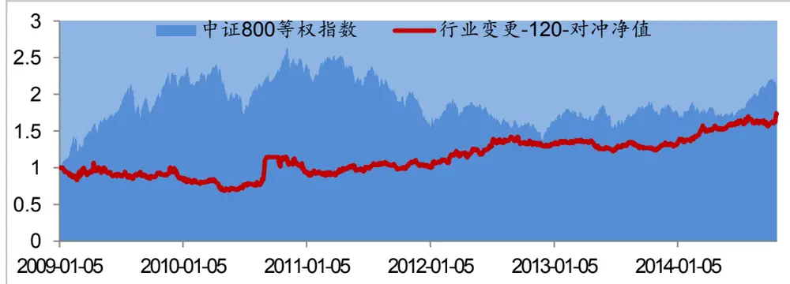
数据来源：广发证券发展研究中心

表9 公司更名伴随行业变更策略指标(相对中证800等权指数持有期120个交易日)

| 指标 | 超额收益率 | 绝对收益率 | 胜率 |
| --- | --- | --- | --- |
| 全样本 | 74.02% | 235.75% | 48.72% |
| 2009 | -14.95% | 85.89% | 11.11% |
| 2010 | 10.14% | 8.11% | 42.86% |
| 2011 | 8.06% | -25.86% | 76.92% |
| 2012 | 30.23% | 31.68% | 66.67% |
| 2013 | -0.30% | 8.74% | 38.71% |
| 2014 | 32.39% | 57.38% | 66.67% |

数据来源：广发证券发展研究中心

从上述图与表可以看出，上市公司发生更名事件的同时伴随着行业变更的事件策略在整个样本回测期内，取得了74.02%的累计超额收益率，整个样本期内的胜率为48.72%。从分年度策略表现的角度看，相对之前的不区分行业变更、估值等因素影响的策略，该策略除了在09年以及13年取得了负的超额收益率外，在其他年度都取得了较高的正的超额收益率。且从胜率角度看，除了09年胜率较低外，在其他年度都取得了较高的胜率。

考虑公司更名事件伴随行业变更，考虑变更前后行业估值变化策略表现，上市公司公司更名如果伴随着行业变更，如果变更前后的行业存在较大的估值差异，例如由一个低估值的行业变更到一个高估值的行业，则存在补涨的可能性，从而带动股价的上涨。

图 18 公司更名伴随估值变化策略(相对中证800等权指数持有期120个交易日)
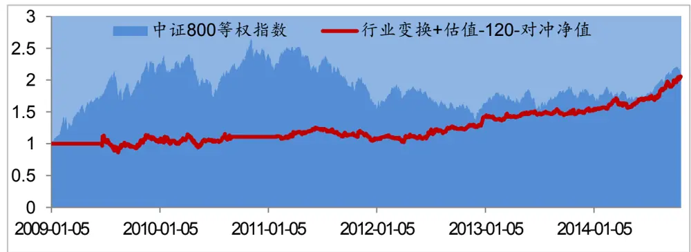
数据来源：广发证券发展研究中心

表10公司更名伴随估值变化策略指标(相对中证800等权指数持有期120个交易日)

| 指标 | 超额收益率 | 绝对收益率 | 胜率 |
| --- | --- | --- | --- |
| 全样本 | 105.84% | 139.82% | 46.51% |
| 2010 | 8.25% | 4.92% | 50.00% |
| 2011 | -2.81% | -30.25% | 75.00% |
| 2012 | 31.80% | 33.16% | 60.00% |
| 2013 | 7.49% | 17.22% | 33.33% |
| 2014 | 34.74% | 59.07% | 60.00% |

数据来源：广发证券发展研究中心

从上述图与表中可以看出，在考虑行业变更同时考虑变更前后行业估值变化的因素下，在整个回测期内，策略取得了105.84%的累计超额收益率以及46.51%的胜率。分年度的角度看，这种策略除了在11年取得了负的超额收益率外，在其他年度都取得了较高的正的超额收益率，分年度来看也取得了较高胜率。

考虑公司更名事件同时公告前机构持股比例的影响。如果公司更名公告前机构的持股比例为增加的情况，则一定程度上说明机构看好相应公司的个股，引起其他投资者的关注，从而带动股价的上涨。

图19公司更名伴随机构持股比例增加(相对中证800等权指数持有期120个交易日)

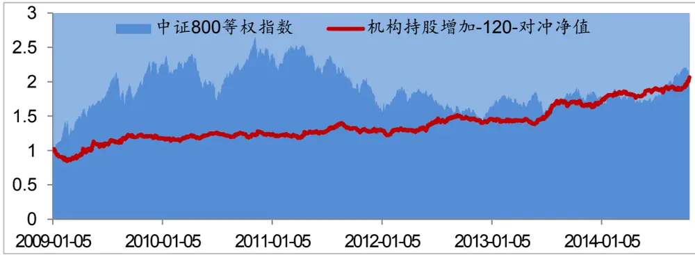
数据来源：广发证券发展研究中心

表11 公司更名伴随机构持股增加指标(相对中证800等权指数持有期120个交易日)

| 指标 | 超额收益率 | 绝对收益率 | 胜率 |
| --- | --- | --- | --- |
| 全样本 | 106.43% | 326.74% | 49.07% |
| 2009 | 17.22% | 156.00% | 46.15% |
| 2010 | 4.37% | 10.26% | 44.44% |
| 2011 | 6.62% | -26.52% | 44.00% |
| 2012 | 12.30% | 12.98% | 45.83% |
| 2013 | 15.56% | 26.26% | 54.84% |
| 2014 | 21.95% | 44.23% | 63.16% |

数据来源：广发证券发展研究中心

从上述图和表中，考虑上市公司公司更名事件公告前机构持股增加的策略，在历史回测期内，全样本下取得了106.43%的累计超额收益率，胜率为49.04%。分年度角度看，在历史回测期内，每个年度都取得了较高的正的超额收益率，且分年度上都取得了较高的胜率。

考虑不同市值规模影响下的公司更名事件策略的表现。考虑上市公司更名公告前一个交易日的流通市值规模，并根据流通市值规模对发生公司更名事件的上市公司进行划分，具体划分档次界限为50亿、100亿、200亿及以上。相同强度的利好消息，对不同市值规模个股的股价影响程度是不一样的，小市值个股可能产生更大幅度的涨幅，而大市值规模的个股涨幅则非常有限。

图 20 公司更名考虑市值规模(相对中证 800 等权指数持有期 20 个交易日)
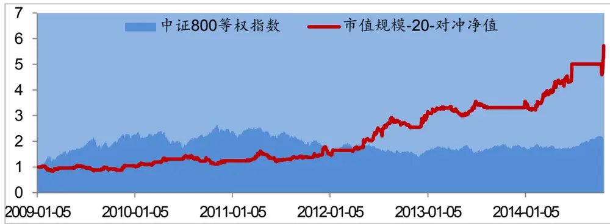
数据来源：广发证券发展研究中心

表 12 公司更名考虑市值规模策略指标(相对中证800 等权指数持有期 20 个交易日)

| 指标 | 超额收益率 | 绝对收益率 | 胜率 |
| --- | --- | --- | --- |
| 全样本 | 472.56% | 812.19% | 61.54% |
| 2009 | 4.97% | 119.49% | 35.00% |
| 2010 | 18.06% | 32.84% | 55.56% |
| 2011 | 22.74% | -16.42% | 70.59% |
| 2012 | 91.69% | 98.71% | 75.00% |
| 2013 | 13.53% | 18.05% | 57.89% |
| 2014 | 72.98% | 59.57% | 61.54% |

数据来源：广发证券发展研究中心

从上述图与表中可以看出，在历史回测期内，小市值规模的公司的策略表现更好，整个样本期内取得了472.56%的累计超额收益率，胜率也有64.84%，接近65%的胜率。分年度角度看，该策略在每年都取得了较高的正的超额收益率，并且每年大体上都取得了较高的胜率。

从上述的统计分析以及策略表现看：基于文本挖掘下的上市公司更名事件驱动策略确实能够带来超额收益综合看，对于公司更名的事件驱动策略，在选择个股建仓时，考虑市值规模较小，并且机构持股增加的，发生行业变更，行业估值前后有较大差异的个股更能产生超额收益；

## 3.4 事件驱动策略之股权变更

这一节，我们将研究上市公司股权变更事件的事件驱动策略。

股权变更主要针对的分类范围是股权结构变更，包括大股东变更、控股股东变更、第二大股东变更、股东变更、实际控制人变更等。例如实际控制人的变更往往隐藏着重大的利好消息，因为实际控制人可能将优质资产注入上市公司，从而改善公司业绩，带动股价的上涨。

首先我们从简单的统计角度看，上市公司股权变更事件在每年以及每个月度发生事件的情况。从分年度的角度看，每一年度都有稳定的公司更名事件样本发生，这也利于策略的构建，并且从整体的角度看，最近几年股权变更呈上升的趋势，这可能与最近几年上市公司较为频繁的资产重组、并购等资本运作活动有关。从分月度的样本统计角度看，每个月度都有稳定的股权变更事件发生，而且有较多的事件发生，这也利于策略的构建，7月、8月、9月、12月有较多的股权变更事件发生。从历史样本上看，股权变更事件每一年都会有事件发生，每个月度都有事件发生。

图 21 上市公司股权变更事件分年度统计一览
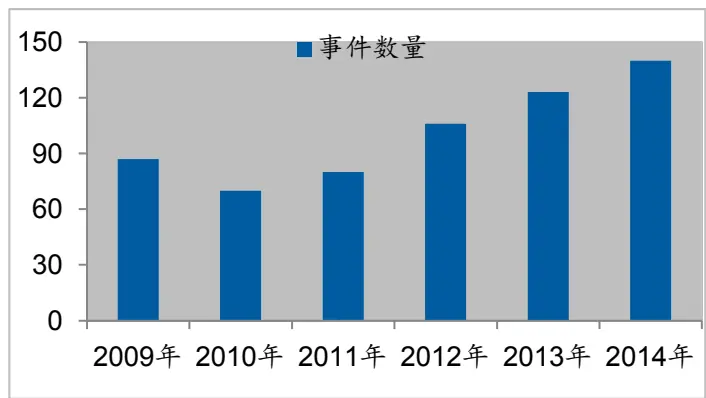
数据来源：广发证券发展研究中心

图 22上市公司股权变更事件分月度统计一览
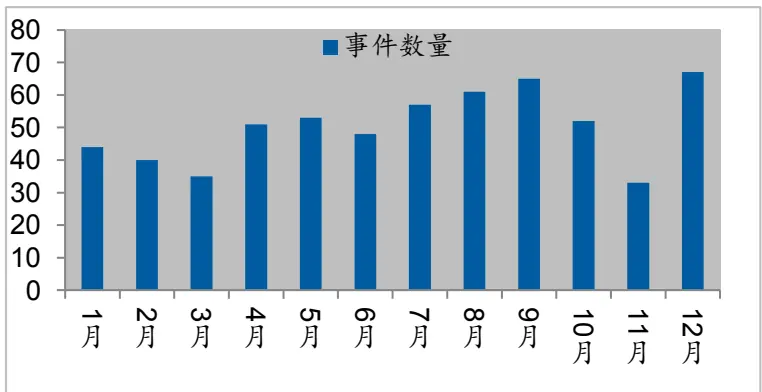
数据来源：广发证券发展研究中心
首先，考察策略相对沪深300基准的表现。

在全样本角度下，不考虑市值规模、个股前期表现等因素影响下，考察策略的表现。

图 23 股权变更策略表现一览(相对沪深 300 持有期 120 个交易日)
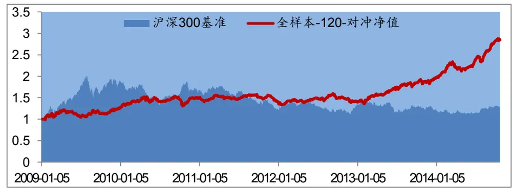
数据来源：广发证券发展研究中心

表 13 股权变更策略表现指标一览(相对沪深 300 持有期 120 个交易日)

| 指标 | 超额收益率 | 绝对收益率 | 胜率 |
| --- | --- | --- | --- |
| 全样本 | 217.61% | 244.57% | 53.01% |
| 2009 | 33.08% | 122.98% | 75.68% |
| 2010 | 17.85% | 5.34% | 43.86% |
| 2011 | -3.92% | -28.93% | 19.40% |
| 2012 | -0.83% | 6.73% | 47.62% |
| 2013 | 36.51% | 28.86% | 58.10% |
| 2014 | 47.50% | 50.10% | 93.55% |

数据来源：广发证券发展研究中心
识别风险，发现价值

从上述图与表可以看出，在不考虑市值规模、个股前期表现等因素影响下，相对沪深300指数，股权变更事件策略在全样本下取得了217.61%的超额收益率，53.01%的胜率。从分年度策略的表现角度看，策略除了在11、12年超额收益率为负的外，在其他年度都取得了较高的正的超额收益率。

考虑上市公司市值规模影响下的策略表现。根据上市公司股权变更公告前一个交易日的流通市值规模，并根据流通市值规模对发生股权变更事件的上市公司进行划分。相同强度的利好消息，对不同市值规模个股的股价影响程度是不一样的，小市值个股可能产生更大幅度的涨幅，而大市值规模的个股涨幅则非常有限。小市值公司往往能够对重大的利好消息产生强烈的反应，带动股价的大幅上涨。

图 24 股权变更考虑市值规模策略表现一览(相对沪深 300 持有期 90 个交易日)
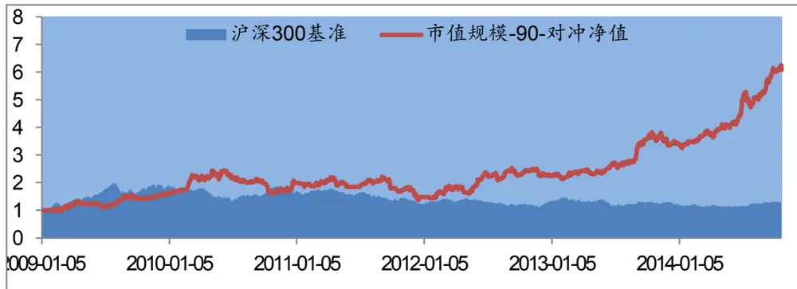
数据来源：广发证券发展研究中心

表 14 股权变更考虑市值规模策略指标一览(相对沪深 300 持有期 90 个交易日)

| 指标 | 超额收益率 | 绝对收益率 | 胜率 |
| --- | --- | --- | --- |
| 全样本 | 685.45% | 701.67% | 75.00% |
| 2009 | 111.84% | 185.67% | 93.33% |
| 2010 | 27.79% | 15.28% | 57.14% |
| 2011 | -17.32% | -42.33% | 0.00% |
| 2012 | 51.36% | 58.91% | 66.67% |
| 2013 | 54.04% | 46.40% | 62.50% |
| 2014 | 78.85% | 81.45% | 100.00% |

数据来源：广发证券发展研究中心

从上述图与表中可以看出，考虑流通市值规模因素影响下的股权变更策略，在小市值规模中的个股表现较为优异，在整个样本期相对沪深300指数取得了685.45%的超额收益率，75%的高胜率。分年度角度看，与之前全样本策略相比，该策略在12年取得了较高的正的超额收益率，在其他年度也取得了较高的正的超额收益率，但11年的超额收益率仍为负的。从分年度胜率的角度看，除了11年的胜率外，在其他年度都取得了较高的胜率。

图 25 股权变更策略表现一览(相对中证 800 等权指数持有期 120 个交易日)
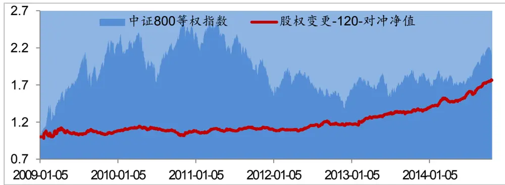
数据来源：广发证券发展研究中心

表 15 股权变更策略指标一览(相对中证 800 等权指数持有期 120 个交易日)

| 指标 | 超额收益率 | 绝对收益率 | 胜率 |
| --- | --- | --- | --- |
| 全样本 | 76.22% | 244.57% | 48.09% |
| 2009 | 8.04% | 122.98% | 45.95% |
| 2010 | -0.24% | 5.34% | 38.60% |
| 2011 | 2.85% | -28.93% | 35.82% |
| 2012 | 6.11% | 6.73% | 50.00% |
| 2013 | 17.95% | 28.86% | 55.24% |
| 2014 | 27.02% | 50.10% | 67.74% |

数据来源：广发证券发展研究中心

从上述图与表可以看出，在不考虑市值规模、个股前期表现等因素影响下，相对中证800等权指数，股权变更事件策略在全样本下取得了76.22%的累计超额收益率，48.09%的胜率。从分年度策略的表现角度看，策略除了在10年超额收益率为负的外，在其他年度都取得了较高的正的超额收益率，且分年度从胜率的角度看，都取得了较高的胜率，2014年至今，该策略已经取得了67.74%的胜率，实现了27.02%的累计超额收益率。

考虑上市公司市值规模影响下的策略表现。

图 26 股权变更考虑市值规模策略表现(相对中证800 等权指数持有期90 个交易日)
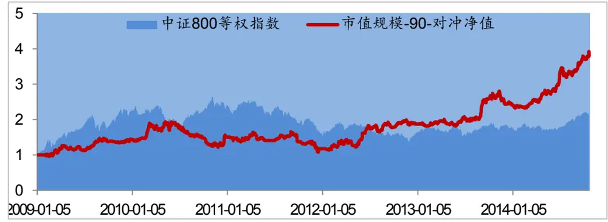
识别风险，发现价值

表 16 股权变更考虑市值规模策略指标(相对中证800 等权指数持有期90 个交易日)

| 指标 | 超额收益率 | 绝对收益率 | 胜率 |
| --- | --- | --- | --- |
| 全样本 | 279.84% | 701.67% | 50.98% |
| 2009 | 45.09% | 185.67% | 60.00% |
| 2010 | 3.51% | 15.28% | 42.86% |
| 2011 | -21.58% | -42.33% | 0.00% |
| 2012 | 58.88% | 58.91% | 60.00% |
| 2013 | 29.42% | 46.40% | 25.00% |
| 2014 | 56.84% | 81.45% | 100.00% |

数据来源：广发证券发展研究中心

从上述图与表中可以看出，考虑流通市值规模因素影响下的股权变更策略，在小市值规模中的个股表现较为优异，相对中证800等权指数取得了279.84%的累计超额收益率，50.98%的胜率。分年度角度看，与之前全样本策略相比。该策略除了在11年取得了负的超额收益率外，在其他年度都取得了比较高的正的超额收益率。从分年度胜率的角度看，除了11年的胜率外，在其他年度都取得了较高的胜率。

从上述的统计分析以及策略的表现上看，基于文本挖掘下的股权变更事件驱动策略确实能够带来超额收益；对于小市值的公司发生股权变更事件，应该更加关注。

## 3.5 事件驱动策略之人事变更

这一节，我们将研究上市公司人事变更事件的事件驱动策略。

人事变更主要是针对高层管理人员的变更，包括董事、总经理、董事会秘书、董事长等变更。新上任的高层管理人员往往会对公司的经营活动以及经营体制进行改善，从而改善以及提高公司的业绩，从而带动个股股价的上涨。

首先我们从简单的统计角度分析，上市公司人事变更事件在每年以及每个月度发生事件的情况。从分年度的角度看，每一年度都有稳定的人事变更事件样本发生，这也利于策略的构建，并且从整体的角度看，最近几年人事变更事件呈上升的趋势，这可能与最近几年上市公司较为频繁高管变动有关。从分月度的样本统计角度看，每个月度都有稳定的人事变更事件发生，而且有较多的事件发生，这也利于策略的构建，8月、9月、12月有较多的股权变更事件发生。从历史样本上看，人事变更事件每一年都会有事件发生，每个月度都有事件发生。

图 27 人事变更事件分年度一览
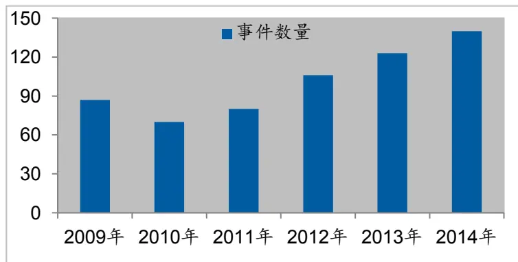
数据来源：广发证券发展研究中心

图 28 人事变更事件分月度一览
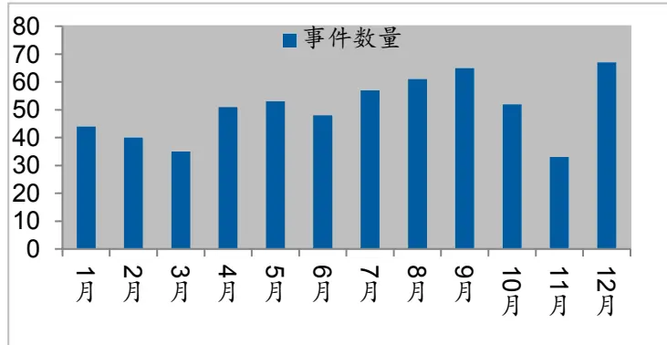
数据来源：广发证券发展研究中心

首先，考察策略相对沪深300基准的表现。

在全样本角度下，在不考虑市值规模、个股前期表现等因素影响下，考察人事变更的事件驱动策略表现。

图 29 人事变更事件驱动策略表现一览(相对沪深 300 持有期 90 个交易日)
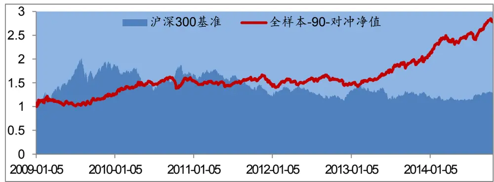
数据来源：广发证券发展研究中心

表 17 人事变更事件策略指标一览(相对沪深 300 持有期 90 个交易日)

| 指标 | 超额收益率 | 绝对收益率 | 胜率 |
| --- | --- | --- | --- |
| 全样本 | 230.88% | 257.51% | 55.04% |
| 2009 | 44.81% | 134.20% | 82.50% |
| 2010 | 22.02% | 9.51% | 48.57% |
| 2011 | -3.12% | -28.13% | 26.21% |
| 2012 | -1.47% | 6.08% | 45.25% |
| 2013 | 39.16% | 31.51% | 59.39% |
| 2014 | 36.43% | 39.03% | 79.71% |

数据来源：广发证券发展研究中心

从上述图与表中可以看出，在不考虑个股市值规模、前期表现等因素的影响下，在历史回测期内，相对沪深300指数实现了230.88%的超额收益率，55.04%的胜率。从分年度策略的表现角度看，除了在11、12年超额收益率为负外，在其他年度都实现了较高的正的超额收益率。从分年度胜率的角度看，策略在每个年度都实现了较高的胜率。

考虑市值规模因素影响下人事变更事件策略表现。计算上市公司人事变更公告前一个交易日的流通市值规模，并根据流通市值规模对发生人事变更事件的个股进行划分。考虑不同市值规模下的人事变更事件策略的表现情况。

图 30 人事变更考虑市值规模策略表现(相对沪深 300 持有期120 个交易日)
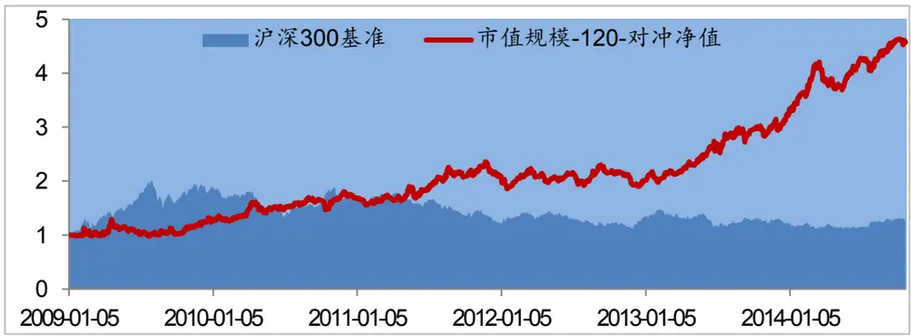
数据来源：广发证券发展研究中心

表 18 人事变更考虑市值规模策略指标一览(相对沪深 300 持有期 120 个交易日)

| 指标 | 超额收益率 | 绝对收益率 | 胜率 |
| --- | --- | --- | --- |
| 全样本 | 400.19% | 426.82% | 65.60% |
| 2009 | 26.85% | 116.24% | 100.00% |
| 2010 | 29.40% | 16.88% | 88.89% |
| 2011 | 19.35% | -5.67% | 25.00% |
| 2012 | -6.44% | 1.11% | 46.51% |
| 2013 | 57.20% | 49.55% | 84.48% |
| 2014 | 43.52% | 46.12% | 100.00% |

数据来源：广发证券发展研究中心

从上述图与表中可以看出，在考虑不同市值规模影响下的人事变更事件驱动策略中，小市值规模的个股策略表现更为优异。跟之前不考虑市值规模、个股前期表现影响的策略相比，该策略在11年实现了正的超额收益率，除了12年外，在其他年度都实现了较高的正的超额收益率。从胜率的角度看，整个历史回测期，样本的胜率为65.60%，接近66%的胜率，分年度上除了12年外，在其他年度都实现了较高的胜率。从超额收益率的角度看，整个历史回测期相对沪深300指数实现了400.19%的超额收益率，14年至今，实现了43.52%的超额收益率，胜率为100%。

首先，在不考虑个股市值规模，前期表现的影响下，考虑人事变更的事件策略表现。

图 31 人事变更事件驱动策略表现(相对中证 800 等权指数持有期 90 个交易日)
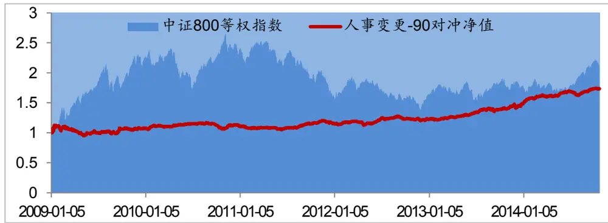
数据来源：广发证券发展研究中心

表 19 人事变更事件驱动策略指标 (相对中证 800 等权指数持有期 90 个交易日)

| 指标 | 超额收益率 | 绝对收益率 | 胜率 |
| --- | --- | --- | --- |
| 全样本 | 73.58% | 257.51% | 49.43% |
| 2009 | 7.01% | 134.20% | 45.00% |
| 2010 | 3.55% | 9.51% | 40.00% |
| 2011 | 4.48% | -28.13% | 42.72% |
| 2012 | 5.56% | 6.08% | 45.81% |
| 2013 | 20.77% | 31.51% | 56.70% |
| 2014 | 17.62% | 39.03% | 51.45% |

数据来源：广发证券发展研究中心

从上述图与表中可以看出，在不考虑个股市值规模、前期表现等因素的影响下，在历史回测期内，相对中证800等权指数实现了73.58%的累计超额收益率，以及49.43%的胜率。从分年度策略的表现角度看，在每个年度都实现了较高的正的超额收益率。从分年度胜率的角度看，策略在每个年度都实现了较高的胜率。

接下来考虑市值规模影响下的人事变更的事件驱动策略表现。

图 32 人事变更考虑市值规模策略(相对中证 800 等权指数持有期 120 个交易日)
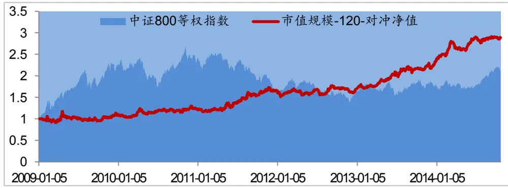
数据来源：广发证券发展研究中心

表 20人事变更考虑市值规模指标(相对中证800 等权指数持有期120 个交易日)

| 指标 | 超额收益率 | 绝对收益率 | 胜率 |
| --- | --- | --- | --- |
| 全样本 | 188.34% | 426.82% | 62.76% |
| 2009 | 8.89% | 116.24% | 72.73% |
| 2010 | 12.04% | 16.88% | 22.22% |
| 2011 | 36.67% | -5.67% | 41.67% |
| 2012 | 1.47% | 1.11% | 41.86% |
| 2013 | 37.74% | 49.55% | 81.03% |
| 2014 | 23.74% | 46.12% | 91.67% |

数据来源：广发证券发展研究中心

从上述图与表中可以看出，在考虑不同市值规模影响下的人事变更事件驱动策略中，小市值规模的个股策略表现更为优异。从胜率的角度看，整个历史回测期，样本的胜率为62.76%，接近63%的胜率，分年度上在每个年度都实现了较高的胜率。从超额收益率的角度看，整个历史回测期相对中证800等权指数实现了188.34%的超额收益率，14年至今，实现了23.74%的超额收益率，胜率为91.67%。

从本小节对人事变更的统计分析以及量化策略的分析中可以看出，基于文本挖掘下的人事变更事件驱动策略确实能够带来超额收益；同时对于小市值的公司发生人事变更事件，应该更加关注。

## 3.5 事件驱动策略之综合策略

为了能够让策略的表现更加稳定，降低策略收益率的波动性以及减小策略的回撤，基于上市公司更名事件、股权变更以及人事变更三种信息变更事件，本专题构建了一个综合的策略。

初始资金：1;

策略原理：选择在历史回测期内三种事件驱动策略在单个事件策略下的最好策略，将三个最好的策略合成综合策略。策略交易原理与单个策略交易原理一致。

交易费用：买卖千分之二的交易费用。

资金划分：资金等权划分于三种事件策略；

首先，考察综合策略相对沪深300基准的表现。

图 33 综合策略表现(相对沪深 300)
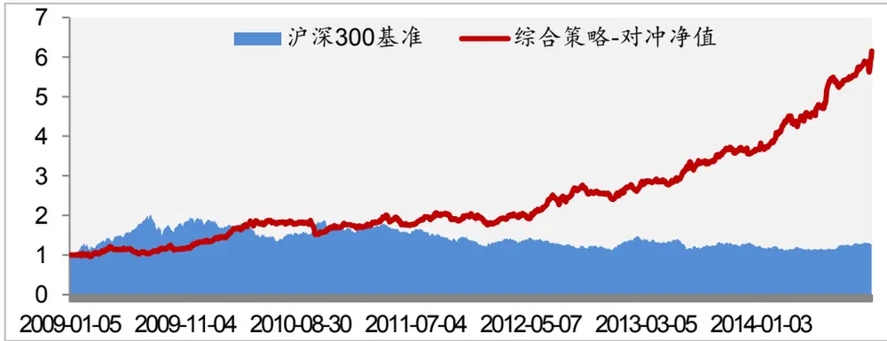
识别风险，发现价值

表 21 综合策略表现指标(相对沪深 300)

| 指标 | 超额收益率 | 绝对收益率 | 胜率 |
| --- | --- | --- | --- |
| 全样本 | 624.62% | 646.89% | 65.38% |
| 2009 | 57.59% | 140.47% | 80.43% |
| 2010 | 33.62% | 21.10% | 72.00% |
| 2011 | 1.94% | -23.08% | 31.25% |
| 2012 | 45.28% | 52.84% | 55.41% |
| 2013 | 41.42% | 33.77% | 76.47% |
| 2014 | 60.47% | 63.08% | 92.00% |

数据来源：广发证券发展研究中心

从上述图与表可以看出，综合策略在历史回测期内取得了较优异的结果。相对沪深300指数，在整个回测期内，实现了624.62%的超额收益率以及65.38%的胜率。从分年度策略的表现上看，每个年度都实现了正的超额收益率，而且每年度都取得了较高的胜率。

接下来，再看看综合策略相对800等权指数的表现。

图 34 综合策略表现(相对中证 800 等权指数)
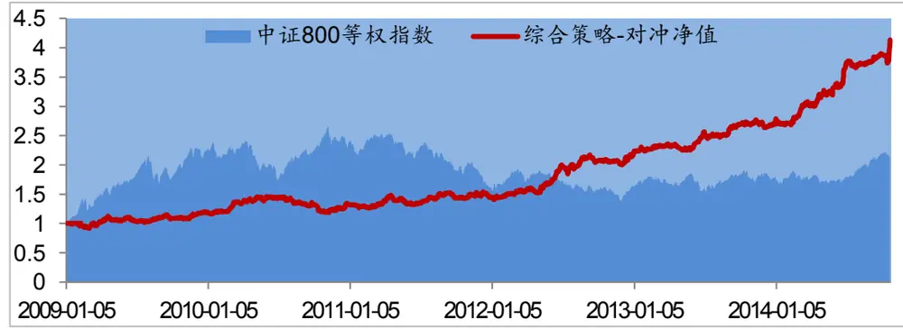
数据来源：广发证券发展研究中心

表 22 综合策略表现指标(相对中证 800 等权指数)

| 指标 | 超额收益率 | 绝对收益率 | 胜率 |
| --- | --- | --- | --- |
| 全样本 | 313.58% | 646.89% | 62.72% |
| 2009 | 19.65% | 140.47% | 56.52% |
| 2010 | 10.35% | 21.10% | 44.00% |
| 2011 | 10.23% | -23.08% | 56.25% |
| 2012 | 48.38% | 52.84% | 52.70% |
| 2013 | 24.44% | 33.77% | 72.94% |

识别风险，发现价值

| 2014 | 53.90% | 63.08% | 96.00% |
| --- | --- | --- | --- |

数据来源：广发证券发展研究中心

从上述图与表可以看出，综合策略在历史回测期内取得了较优异的结果。在整个回测期内，相对中证800等权指数实现了313.58%的超额收益率以及62.72%的胜率。从分年度策略的表现上看，每个年度都实现了正的超额收益率，而且每年度都取得了较高的胜率，2014年至今已经实现了53.09%的超额收益率，胜率为96%。

## 四、总结

## 4.1 总结

基于上市公司的公告文本信息，本专题策略采用文本挖掘的方法研究了上市公司信息变更带来的事件驱动投资机会。通过建立量化投资策略，考虑了公司更名、股权变更、人事变更这三种信息变更的事件驱动投资机会。

通过所构建的量化策略，对三种信息变更的事件驱动投资策略进行了历史回测，实证结果表明，所构建的量化策略在回测期间内，表现优异，主要结论有：

V基于文本挖掘下的上市公司更名事件驱动策略确实能够带来超额收益综合看，对于公司更名的事件驱动策略，在选择个股建仓时，考虑市值规模较小，并且机构持股增加的，发生行业变更，行业估值前后有较大差异的个股更能产生超额收益；

基于文本挖掘下的股权变更事件驱动策略确实能够带来超额收益；对于小市值的公司发生股权变更事件，应该更加关注。

基于文本挖掘下的人事变更事件驱动策略确实能够带来超额收益；同时对于小市值的公司发生人事变更事件，应该更加关注。

通过公司变更、股权变更以及人事变更三种信息变更构建的综合事件驱动策略，在历史回测期内表现优异，分年度都能取得正的超额收益率。

## 4.2 工具推荐

基于上交所、深交所以及巨潮资讯网的网页格式的研究，我们开发出了基于上市公司历史信息变更查询工具以及实时监控上市公司信息变更工具。这两个工具分别能够查询历史的信息变更公告以及实时监控市场上所有A股的特定的信息变更，并给予提示。目前，两个工具已经开发完善，欢迎来电与我们交流，或者发邮件交流。

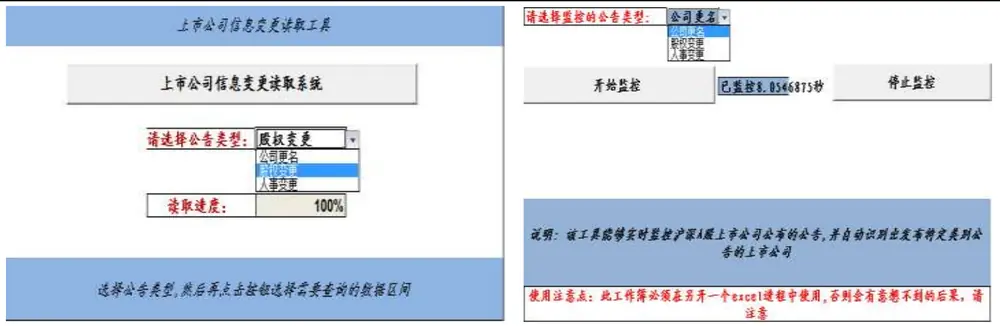
图 35 上市公司历史信息变更查询工具
数据来源：广发证券发展研究中心
图 36 A 股市场信息特定信息变更实施监控工具
数据来源：广发证券发展研究中心

## 风险提示

本模型为采用纯量化方法，所推荐的个股未必具有实质性的利好，其股价表现还受到诸多因素影响，请结合基本面及自身判断进行恰当使用。

## 广发证券—行业投资评级说明

买入：预期未来12个月内，股价表现强于大盘10%以上。

持有：预期未来12个月内，股价相对大盘的变动幅度介于-10%~+10%。

卖出：预期未来12个月内，股价表现弱于大盘10%以上。

## 广发证券—公司投资评级说明

买入：预期未来12个月内，股价表现强于大盘15%以上。

谨慎增持：预期未来12个月内，股价表现强于大盘5%-15%。

持有：预期未来12个月内，股价相对大盘的变动幅度介于-5%~+5%。

卖出：预期未来12个月内，股价表现弱于大盘5%以上。

## 联系我们

|  | 广州市 | 深圳市 | 北京市 | 上海市 |
| --- | --- | --- | --- | --- |
| 地址 | 广州市天河北路183号大 | 深圳市福田区金田路4018 | 北京市西城区月坛北街2号 | 上海市浦东新区富城路99号 |
| 邮政编码 | 都会广场5 楼 | 号安联大厦15楼A座03-04 | 月坛大厦18层 | 震旦大厦18楼 |
| 客服邮箱 | 510075 | 518026 | 100045 | 200120 |
|  | gfyf@gf.com.cn |  |  |  |
| 服务热线 | 020-87555888-8612 |  |  |  |

## 免责声明

广发证券股份有限公司具备证券投资咨询业务资格。本报告只发送给广发证券重点客户，不对外公开发布。

本报告所载资料的来源及观点的出处皆被广发证券股份有限公司认为可靠，但广发证券不对其准确性或完整性做出任何保证，报告内容仅供参考，报告中的信息或所表达观点不构成所涉证券买卖的出价或询价。广发证券不对因使用本报告的内容而引致的损失承担任何责任，除非法律法规有明确规定。客户不应以本报告取代其独立判断或仅根据本报告做出决策。

广发证券可发出其它与本报告所载信息不一致及有不同结论的报告。本报告反映研究人员的不同观点、见解及分析方法，并不代表广发证券或其附属机构的立场。报告所载资料、意见及推测仅反映研究人员于发出本报告当日的判断，可随时更改且不予通告。

本报告旨在发送给广发证券的特定客户及其它专业人士。未经广发证券事先书面许可，任何机构或个人不得以任何形式翻版、复制、刊登、转载和引用，否则由此造成的一切不良后果及法律责任由私自翻版、复制、刊登、转载和引用者承担。