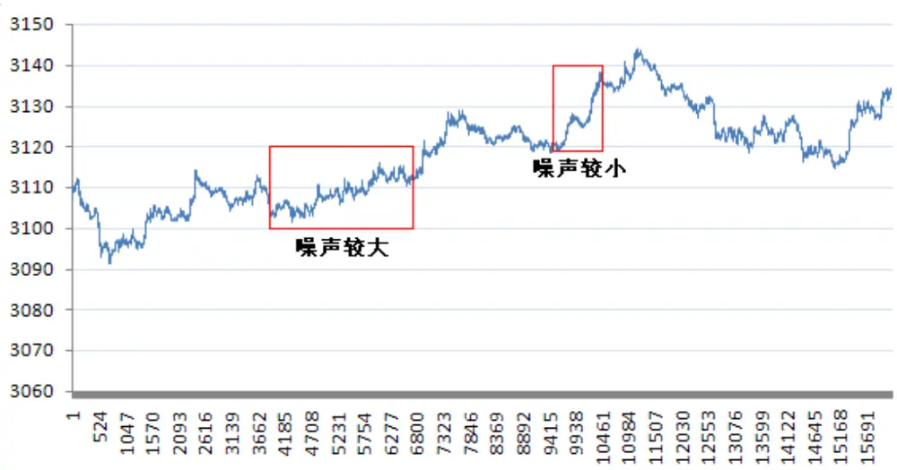
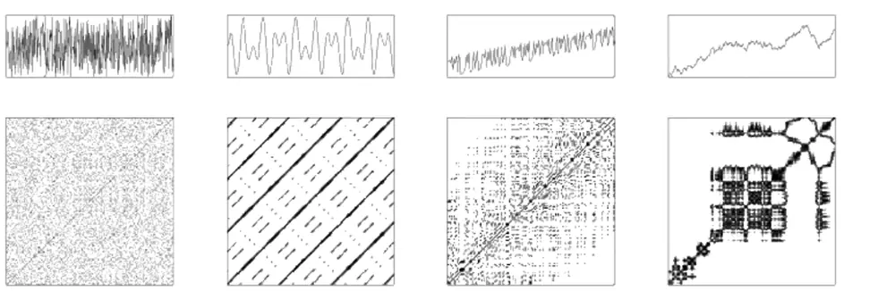
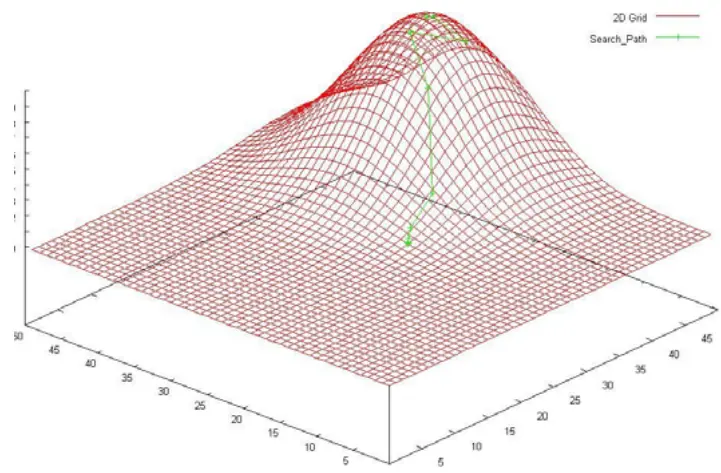
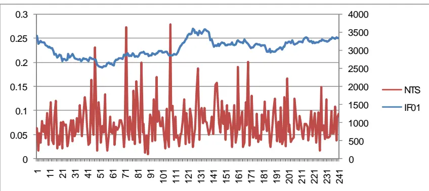
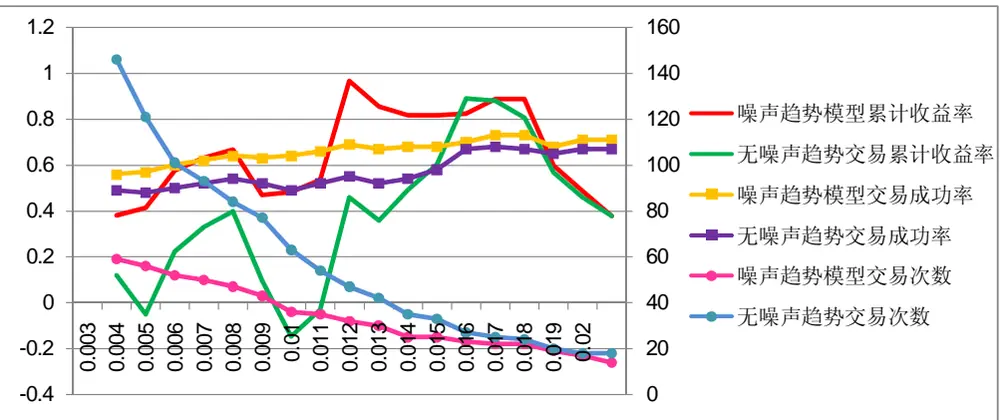

# 基于混沌理论的股指期货噪声趋势交易（NTT）策略

# 股指期货专题系列报告之六

罗军 金融工程 分析师

胡海涛 金融工程 分析师

电话： 020-87555888-655

电话：020-87555888-406

eMail： lj33@gf.com.cn

eMail: hht@gf.com.cn

SAC执业证书编号：S0260511010004

SAC执业证书编号：S0260511020010

## 在一般的趋势交易中加入噪声判据的基本思想

对于股票或股指期货价格的一组时间序列，我们可以将其分为噪声部分和非噪声部分。噪声部分代表了股价的随机游走，显示了市场平衡的特性；非噪声部分代表人为的决定性行为，例如对股指期货价格人为地快速拉升或打压，显示了市场的非平衡特性。换句话说，当噪声较大时，价格的随机性较强；而噪声较小时，则有可能存在较大程度上的人为操作成分。因而在噪声较小时，如果能够有效把握趋势，则有机会从中获得投机性收益。

## 通过混沌相关理论计算非线性时间序列的噪声

混沌是看似随机但却具有确定性的动力学演化现象，对初始条件具有极强的敏感性。混沌理论中，通过对离散的非线性时间序列进行相空间重构，可以恢复动力学系统的吸引子，寻找到动力学演化的内在规律。在重构后的相空间中，我们对带有噪声系统的粗糙熵进行数值计算，并通过非线性拟合得到了噪声序列的标准差。通过该值与原始时间序列标准差的比值，即噪声在时间序列中的占比，对股指期货市场状况做出研判。

## 交易策略原理

在股指期货价格大涨大跌时，价格的噪声应当较小，并且在噪声没有变大的情况下，大涨或大跌将有较大概率延续；在价格随机游走或市场相对平衡时，价格的噪声应当较大，并且在噪声没有减小的情况下将继续随机游走，在盘面上表现出震荡整理的概率较大。我们将依据该原理，构建噪声趋势交易（NTT）模型：由于A股市场上、下午交易时段的间隔较短，我们认为这两个时段的噪声比例将不会发生太大的变化。因此当上午噪声较小，即市场效率较低、人为操作因素较强，并且市场形态呈现单边走势时，我们选择在午后对股指期货进行单向的趋势性建仓，并于收盘前平仓。

## 噪声条件的加入对趋势交易形成显著优化

对于市场是否为单边行情的判定，我们采用了极值法与简单价差法，发现后者具有更好地效果。通过改变上午的价差阈值，发现该阈值在 0.011-0.017 之间时收益率出现了一个较好的平台结构，有利于减小该策略的非系统性风险。通过对股指期货上市一年来的高频数据进行实证模拟，NTT 模型取得了较好的投资效果。通过扫描上述阈值平台结构，可以获得平均 86.6%的年化累积收益率（以 5 倍杠杆计算），成功率平均值达到 70%。经过与无噪声条件的普通趋势交易对比，我们发现经过加入噪声阈值的判定，可以对普通趋势交易进行有效优化，大为改善投资效果。

## 一、交易策略基本思想

对于股票或股指期货价格的一组时间序列，我们可以将其分为噪声部分和非噪声部分。噪声部分代表了股价的随机游走，显示了市场平衡的特性；非噪声部分代表人为的决定性行为，例如对股指期货价格人为地快速拉升或打压，显示了市场的非平衡特性。换句话说，当噪声较大时，价格的随机性较强；而噪声较小时，则有可能存在较大程度上的人为操作成分。因而在噪声较小时，如果能够有效把握趋势，则有机会从中获得投机性收益。

图 1：2011 年 5 月 6 日 IF1105 价格走势图

数据来源：天软科技，广发证券发展研究中心

如图1所示，噪声较大的时间序列数据在走势图上显示出较多的毛刺，而噪声较小的部分则显得较为光滑。下面我们将通过计算噪声在时间序列中的占比来构建股指期货单向趋势交易策略。

## 二、粗糙熵-噪声非线性方程

## （一）混沌（chaos）概述

混沌理论是当今三大非线性科学之一。混沌现象产生于动力学系统当中，对于初始条件有极端的敏感性。与量子理论不同，混沌中貌似无序的随机动力学演化是具有决定性的，即具有决定性的随机性。混沌可以存在于连续或离散的系统当中，后者对应的数学描述即非线性时间序列，例如股指期货的高频价格数据就是这样一种混沌时间序列。混沌时间序列中蕴涵着系统丰富的动力学信息，貌似随机的现象背后隐藏着有序的层次结构，揭示这种有序规律的方法之一是Packard等人提出的重构相空间理论（详见N. H. Packard, J. P. Crutchfield, J. D. Farmer, and R. S.Shaw, Phys. Rev. Lett. 45, 712-716, 1980）。

识别风险，发现价值

最初提出相空间重构是为了试图在高维相空间中恢复混沌吸引子。混沌时间序列任一分量的演化是由与之相互作用着的其他分量所决定的。因此，这些相关分量的信息就隐含在任一分量的发展过程中.这样，也就是说可以从一个分量的数据中提取和恢复出系统整体的规律，这种规律在高维空间中的有序轨迹叫做吸引子。也就是说，由混沌系统在一定空间中产生的轨迹，最终会做一种有规律的运动。Takens证明了考虑一个分量，将它在某些固定时间的延迟点作为新维处理，可以找到一个合适的嵌入维，在这个嵌入维空间里可以把吸引子恢复出来，然后可以在这个空间中预测轨迹未来的走向（详见F. Takens Detecting strange attractors in turbulenceIn: Dynamical Systems and Turbulence. Berlin: Springer-Verlag, 366-381,1981），这个由嵌入维决定的空间就是相空间。

## （二）RP图（Recurrence Plot）

混沌理论的研究过程中，人们通过RP图直观地研究数据的稳定性、周期性、非噪声属性和局部消噪参数优化。

RP图可以用来构建相空间状态（吸引子）的周期性演化。首先考虑一组时间序列 $\left\{x_{i}\right\}$ ，其中i =1，2，3…。重构其中的一个n维相空间 $\vec{y}_{i}=\{x_{i},x_{i+\tau},...,x_{i+(n-1)\tau}\}$ 为内嵌时滞。 根据相空间 $\vec{y}_{i}$ 建立二元函数

$$
P(i,j)=H(\varepsilon-\left\|\vec{y}_{i}-\vec{y}_{j}\right\|)\tag{1}
$$

其中 H(x) 是Heaviside阶跃函数，定义为

$$
H(x)=\left\{\begin{aligned}&0&\quad(x<0),\\&1&\quad(x\geq0).\end{aligned}\right.\tag{2}
$$

... 为最大范数，ε ≥ 0为某参量阈值。P(i, j)的含义是，在N×N的二维空间格点上，如果其两个嵌入向量的最大范数小于某一阈值，则该点值为1，否则为0。我们将这样的空间画成一个N×N的矩阵表，将每个格点等于1的格子涂黑，并依此建立一个N×N的图，即为RP图。

图 2: RP 图（Recurrence Plot）示例

识别风险，发现价值

数据来源：维基百科（Wikipedia）

如图2所示，从左到右依次是白噪声、二维各向异性谐振子、线性趋势混沌数据和自回归数据的序列图和RP图。由此可以看出，RP图可以在一定程度上判断动力学系统的混沌特征。

## （三）关联熵计算

对于（1）式中的二元函数 $P(i,j)$ ，可知在N×N的RP图（n维相空间）中涂黑的点数目为

$$
\begin{aligned}&D^{n}(\varepsilon)=\sum_{i}^{N}\sum_{j\neq i}^{N}H(\varepsilon-\left\|\vec{y}_{i}-\vec{y}_{j}\right\|)\\&=\sum_{i}^{N}\sum_{j\neq i}^{N}H(\varepsilon-\left\|x_{i}-x_{j}\right\|)H(\varepsilon-\left\|x_{i+1}-x_{j+1}\right\|)\cdots H(\varepsilon-\left\|x_{i+(n-1)}-x_{j+(n-1)}\right\|)\\\end{aligned}\tag{3}
$$

关联熵的定义为

$$
K=\lim_{\varepsilon\to0}\lim_{n\to\infty}\ln\frac{D_n(\varepsilon)}{D_{n+1}(\varepsilon)}\approx-\frac{d}{dn}\ln\left[D_n(\varepsilon)\right]
$$

(4)

它是在信息熵的基础上衍生出来的一个物理量，可以用来表征时间序列的有序程度。于是可以得到

$$
D_{n}=D_{2}\exp[-(n-2)K]\tag{5}
$$

利用（5） $式:$ ，我们可以定义n的平均值与关联熵的一个近似关系

$$
<n>=\frac{\sum\limits_{n=2}^{\infty}\left(D_{n}+D_{n+2}-2D_{n+1}\right)n}{\sum\limits_{n=2}^{\infty}\left(D_{n}+D_{n+2}-2D_{n+1}\right)}\approx\frac{\sum\limits_{n=2}^{\infty}ne^{-(n-2)K}}{\sum\limits_{n=2}^{\infty}e^{-(n-2)K}}=\frac{2-e^{-K}}{1-e^{-K}}
$$

(6)

由（6）式即可得到平均嵌入维 $<n>$ 与关联熵K之间的普适关系

$$
K\approx\ln\frac{<n>-1}{<n>-2}
$$

(7)

注意这里关联熵的定义，它与相空间中的时间序列是否含有噪声无关。只要相空间维数远远大于2，方程（5）至（7）便成立。

## （四）噪声环境下的粗糙熵及噪声估计

首先改写（3）式为以下等效形式

$$
D_{n}(\varepsilon)=\sum_{i}^{N}\sum_{j\neq i}^{N}H\left(\sum_{k=0}^{n}H\left(\varepsilon-\left|x_{i+k}-x_{j+k}\right|\right)-n\right)\tag{8}
$$

为了后边计算方便，这里需要把括弧中的Heaviside阶跃函数改写成连续函数的形式，一种作法是令

$$
H(\varepsilon-r)\Rightarrow\rho_{\varepsilon}(r)=\left\{\begin{aligned}(\varepsilon-r)&/r\quad(0\leq r\leq\varepsilon)\\0&\quad(r>\varepsilon)\end{aligned}\right.\tag{9}
$$

为了修正误差，往往在n前加入系数 $\beta$ 进行调整

$$
D_{n}^{\prime}(\varepsilon)=\sum_{i}^{N}\sum_{j\neq i}^{N}H\left(\sum_{k=0}^{n}\frac{\varepsilon-\left|x_{i+k}-x_{j+k}\right|}{\varepsilon}-\beta n\right)\tag{10}
$$

经验上令 $\beta{=}1/\sqrt{\pi}$ 可取得较好的修正效果。将（10）式带入（6）式进行数值计算，可以得到一个在数值上收敛的 $<n>$ 值，进而代入（7）式算出该动力学系统的关联熵K。

接下来，我们假设股指期货价格序列中出现的噪声服从高斯分布，考虑这样一组含有噪声的时间序列，即在无噪 $\begin{aligned}i声\end{aligned}$ 时间序列 $\{x_{i}\}$ 的基础上加入非相关的高斯噪声序列 $\{\eta_{i}\}$ 。方程（10）可以改写为

$$
\begin{aligned}&D_{n}^{\prime}(\varepsilon)=\sum_{i}^{N}\sum_{j\neq i}^{N}H\left(\sum_{k=0}^{n}\frac{\varepsilon-\left|x_{i+k}+\eta_{i+k}-x_{j+k}-\eta_{j+k}\right|}{\varepsilon}-\beta n\right)\\&\cong\sum_{i}^{N}\sum_{j\neq i}^{N}H\left(\sum_{k=0}^{n}\frac{\varepsilon-\left|x_{i+k}-x_{j+k}\right|}{\varepsilon}-n\frac{\sqrt{\alpha^{2}\varepsilon^{2}+2\sigma^{2}}-\alpha\varepsilon}{\varepsilon}-\beta n\right)\\\end{aligned}\tag{11}
$$

其中 $\sigma$ 是加入噪声序列的标准差， $\alpha$ 是依赖于 $x_{i}-x_{j}$ |分布的一个常数。假设$|x_{i}-x_{j}|$ 的标准差 $\sigma_{_{x}}{\approx}\frac{1}{2}\alpha\varepsilon$ 。这里粗略假设 $\mid x_{i}-x_{j}\mid\in(0,\varepsilon)$ 在 $(0,\varepsilon)$ 均匀分布，则 $\alpha=1/\sqrt{3}$ o

通过比较（11）式和（10）式，对于 $D_{{}_{n}}(\varepsilon)$ ，由噪声加入引起的变化为

$$
n\to n\left(1+\sqrt{\pi}\frac{\sqrt{\varepsilon^2/3+2\sigma^2}-\varepsilon/\sqrt{3}}{\varepsilon}\right)\tag{12}
$$

在无噪声的时间序列中，关于关联积分（RP图中的点密度）、嵌入维与关联熵有一个著名的关系式（详见K. Pawelzik and H.G. Schuster, Phys. Rev. A 35, 481,1987）

$$
\lim_{\varepsilon\rightarrow0}\lim_{n\rightarrow\infty}\ln\frac{D_{n}(\varepsilon)}{N^{2}}=D_{2}\ln\varepsilon-n\tau K_{2}(\varepsilon)\tag{13}
$$

$K_{2}$ 是无噪声序列的关联熵，称为光滑熵。将（12）式的变换关系式代入（13）式，可以看出加入噪声后（13）式的第二项变化为

$$
-n\tau K_{2}(\varepsilon)\rightarrow-n\tau K_{2}(\varepsilon)\left(1+\sqrt{\pi}\frac{\sqrt{\varepsilon^{2}/3+2\sigma^{2}}-\varepsilon/\sqrt{3}}{\varepsilon}\right)\tag{14}
$$

另外有人证明了在n 维相空间中， $D_{2}$ 在噪声影响下的变化（详见T. Schreiber, Phys.Rev. E 48, 13, 1993）为

$$
D_{2}\rightarrow D_{2}+(n-r)g\left(\frac{\varepsilon}{2\sigma}\right)\tag{15}
$$

其中

$$
g(z)=\frac{2}{\sqrt{\pi}}\frac{ze^{-z^{2}}}{erf(z)}\tag{16}
$$

erf(z)是误差函数，参数r在后面的计算中会被消掉。将（14）（15）式代回（13），可估算得

$$
\begin{aligned}&D_{n}(\varepsilon)\sim\varepsilon^{\left[D_{2}+(n-r)g(\varepsilon/2\sigma)\right]}\times\\&\exp\left[-n\tau K_{2}(\varepsilon)\left(1+\sqrt{\pi}\frac{\sqrt{\varepsilon^{2}/3+2\sigma^{2}}-\varepsilon/\sqrt{3}}{\varepsilon}\right)\right]\\\end{aligned}
$$

(17)

光滑熵 $K_{2}(\varepsilon)$ 的显式未知，但通常可以用以下函数拟合

$$
K_{2}(\varepsilon)=\kappa+b\ln(1-a\varepsilon)\tag{18}
$$

，b和a都是常数参量，后面可以通过非线性拟合的方式得到。

粗糙化的关联熵，简称粗糙熵，是加入噪声后的关联熵。将（14）（15）式给出噪声环境下的 $D_{{}_{n}}(\varepsilon)$ ，代入关联熵的定义（4）式中，可以得到粗糙熵的一个显式表达式

$$
\begin{aligned}&K_{noisy}(\varepsilon)=-\frac{d}{dn}\ln\left[D_{n}(\varepsilon)\right]\\&=-\frac{1}{\tau}g\left(\frac{\varepsilon}{2\sigma}\right)\ln\varepsilon+K_{2}(\varepsilon)\left(1+\sqrt{\pi}\frac{\sqrt{\varepsilon^{2}/3+2\sigma^{2}}-\varepsilon/\sqrt{3}}{\varepsilon}\right)\\\end{aligned}\tag{19}
$$

再将光滑熵的近似拟合函数（18）代入（19），并引入在非线性拟合中消除奇性的项 $\varepsilon^{p}$ （以利于后边的数值计算），其中 $p\sim1$ ，得到

$$
\begin{aligned}&K_{noisy}(\varepsilon)\varepsilon^{p}=c\varepsilon^{p}g\left(\frac{\varepsilon}{2\sigma}\right)\ln\varepsilon\\&+\left[\kappa+b\ln(1-a\varepsilon)\right]\varepsilon^{p}\left(1+\sqrt{\pi}\frac{\sqrt{\varepsilon^{2}/3+2\sigma^{2}}-\varepsilon/\sqrt{3}}{\varepsilon}\right)\\\end{aligned}
$$

(20)

由此，我们可以将按（7）式得出的粗糙熵 $K_{_{noisy}}\left(\varepsilon\right)$ 看作阈值ε的函数，通过

（20）式进行非线性拟合，并得到参数a，b，c，κ和 $\sigma$ ，其中 $\sigma$ 就是我们希望得到的时间序列中噪声的标准差。

## （五）非线性拟合方法——LM方法

Levenberg-Marquardt非线性拟合方法，简称LM方法，是数值计算中一种最优化爬山迭代算法，如图3所示。为了拟合（20）式并得到股指期货价格序列的噪声 $\sigma_{noisy}$ （即上文中的 $\sigma\mathrm{~})$ ，我们在数值计算中将使用LM方法。

对于非线性函数 $y=f(x)$ 在拟合时，观测值与理论值的差值，即误差项

$\varepsilon=\left|x-{\hat{x}}\right|$ 要求尽量小，使得 $\left\|y-f({\hat{x}})\right\|$ 取得最小值。

首先给定一个 $x_{k}$ ，考虑 f (x) 在 $x_{k}$ 点附近的一阶近似

$$
f(x_{k}+\delta_{k})=f(x_{k})+J_{k}\cdot\delta_{k}\tag{21}
$$

其中 $J_{k}$ 是Jacobi矩阵在 $x_{k}$ 点的值。寻找下一个迭代点 $x_{_{k+1}}=x_{_{k}}+\delta_{_{k}}$ ，使得

$$
\left\|y-f(x_{k+1})\right\|=\min\left\|J_k\cdot\delta_k-\varepsilon_k\right\|\tag{22}
$$

为了满足上式，可求线性方程组 $\boldsymbol{J}_{k}\cdot\boldsymbol{\delta}_{k}=\varepsilon_{k}$ 。其解为

$$
\boldsymbol{\delta}_{k}=(\boldsymbol{J}_{k}^{T}\boldsymbol{J}_{k})^{-1}\boldsymbol{J}_{k}^{T}\boldsymbol{\varepsilon}_{k}
$$

(23)

LM方法即是用 $\overline{{N}}_{k}=\boldsymbol{J}_{k}^{T}\boldsymbol{J}_{k}+\lambda_{k}\boldsymbol{I}$ 代替 $\boldsymbol{N}_{k}=\boldsymbol{J}_{k}^{T}\boldsymbol{J}_{k}$ ，得到

$$
\delta_{_{k}}=(\boldsymbol{J}_{_{k}}^{T}\boldsymbol{J}_{_{k}}+\lambda_{_{k}}\boldsymbol{I})^{-1}\boldsymbol{J}_{_{k}}^{T}\boldsymbol{\varepsilon}_{_{k}}\tag{24}
$$

图 3：LM算法爬山迭代过程

数据来源：广发证券发展研究中心

在该算法中，每一次迭代是寻找—个合适的阻尼因子 $\lambda_{k}$ ，当 $\lambda_{k}$ 很小时，式(23)蜕化为Gauss-Newton法的最优步长计算式， $\lambda_{k}$ 很大时，蜕化为梯度下降法的最优步长计算式。

## 三、基于粗糙熵-噪声模型的趋势交易策略

## （一）基本思想

首先，我们可以计算出某段时间股指期货价格高频时间序列的标准差 $\sigma_{_{data}}$ 以及按照上述方法计算出该时间序列的噪声标准差 $\sigma_{_{noisy}}$ ，其比例

$$
NTS=\frac{\sigma_{nosy}}{\sigma_{data}}\in[0,1]\tag{25}
$$

表征了这组时间序列中噪声所占的比例。换句话说，如果NTS 值较大，说明股指期货价格中噪声比例较大，也反应出其走势的随机性较强，此时市场效率较高，股指期货价格以随机游走为主；而当NTS 值较小时，说明数据的噪声比例较小，这时人为决定性的因素将在很大程度上指导价格的涨跌。例如在有重大消息面影响，或者有主力在操纵股指期货价格时，NTS 值将较小。

## （二）交易策略及实证模拟

从原理上来讲，在股指期货价格大涨大跌时，NTS 值应当较小，并且在NTS没有变大的情况下，大涨或大跌将有较大概率延续；而从统计角度来看，在价格随机游走或市场相对平衡时，NTS 值应当较大，并且在NTS 没有缩小的情况下将继续随机游走，在盘面上表现出震荡整理的概率较大。我们将依据该原理，构建噪声趋势交易（NTT）模型。

1、我们首先使用天软提取股指期货当月连续合约2010年4月16日至2011年4月15日所有交易日的30秒高频数据。通过每天540个数据的时间序列计算每日的NTS ，如图4所示。

图 4：2010.4.16.-2011.4.15.股指期货连续合约走势及相应日 NTS 值

数据来源：广发证券发展研究中心

可以看出，噪声比例大部分处于0-15%的区间。该指标震荡非常剧烈，因此不适用于隔日择时。

2、为什么隔日的噪声变化会如此剧烈呢？这主要是因为每日的交易时间只有4个半小时，而其余的大部分非交易时间要远比交易时间长。在这段非交易时间内，会发生诸多影响期货价格的事件，导致投资者对于次日交易的态度和行为发生变化。

我们认为在一个交易日内，将交易时段按上、下午分为两个部分，由于中间只有1个半小时的休息时间，上、下午盘面的噪声一般来说发生变化较小。因此，如果上午的NTS 值较小，且盘面出现单边走势，则午后有较大概率延续单边走势。因此在遇到这种时机时，我们将在午后开盘时选择顺势做多或做空，并在收盘前平仓。

3、由于上午开盘后一段时间价格震荡较为剧烈，不适宜加入噪声的估计当中，因此在计算上午走势的NTS 时，我们采用10:00至11:30的30秒高频数据。如果符合上面提到的交易条件，则在午后开盘时建仓。而下午3:00之后由于现货收盘，期货价格的行为将与之前有所不同，因此，我们选择在3:00对之前建仓的股指期货合约（如果建仓的话）进行平仓。交易杠杆以5倍计算。

4、数值计算方面，内嵌时滞取最简单的τ =1秒的情况。由于整体样本空间的周期性明显（每个交易日为一个周期），因此进行相空间重构的嵌入维取n =180（每个交易日10:00至11:30有180个30秒数据）。

5、对于上午盘面是否为单边走势，我们首先使用多项式拟合求极值来进行判定。将上午10:00至11:30的高频数据拟合成一个连续函数（多项式拟合）。如果此函数在该时段内导数处处不为零，或所有导数为零处均非极值，则判定该盘面为单边走势。如果拟合阶数太低，则价格走势的定量描述将不够准确；如果拟合的阶数太高，一些盘中出现的交易噪声也会被拟合进来，从而降低对盘面宏观的定量研判。因此，一个合适的拟合阶数对于走势形态的判定至关重要。经过实证检验，4阶多项式拟合可以达到较好的效果。

6、由于NTS 在0.1附近震荡（见图4），我们设定噪声比例的阈值为10%。对于上午行情达到上述单边判定条件的交易日，如果其上午走势的噪声比例NTS 小于10%，我们则按照趋势于午后开盘建仓，并执行上述交易策略。NTS 大于等于

10%的，将不做任何交易。得到结果如下：

表 1：极值判别法噪声趋势交易结果

| 交易时间 | 收益率（计入杠杆） | 累积收益率收益率（计入杠杆） |
| --- | --- | --- |
| 2010-4-19 | 15.43% | 15.43% |
| 2010-6-29 | 12.52% | 29.87% |
| 2010-8-10 | 4.03% | 35.10% |
| 2010-8-24 | -6.54% | 26.27% |
| 2010-9-14 | 0.98% | 27.50% |
| 2010-9-27 | 1.03% | 28.82% |
| 2010-10-15 | 3.10% | 32.81% |
| 2010-11-10 | -3.43% | 28.26% |
| 2011-1-7 | -7.67% | 18.42% |
| 2011-1-17 | 8.24% | 28.18% |
| 2011-2-10 | 5.36% | 35.05% |
| 2011-3-29 | -7.23% | 25.28% |
| 平均值 | 2.15% |  |
| 标准差 | 7.56% | 一 |
| Sharpe Ratio | 0.84 |  |

数据来源：广发证券发展研究中心

在一年241个交易日中，一共交易12次，成功（获取正收益）次数为8次，成功率67%，累积获得收益率25.28%。由于交易次数较少，交易成本略去未计。

6、若不采用噪声条件，即仅仅依据上午的单边行情进行趋势交易，在其他参数不变的情况下，我们得到下述结果：

在一年241个交易日中，一共交易19次，成功（获取正收益）次数为11次，成功率58%，累积获得收益率19.2%。相比之下，上述加入噪声条件的趋势交易策略显然可以获取更高的成功率和收益率。

7、由于历史样本有限，采用上述噪声趋势策略的交易次数较少，为了确保其有效性，我们改用另一种判定上午走势是否为单边行情的简单办法，从而将交易次数“变多”，使结果的统计意义更加明显，并对这两种方法进行比较。

我们将直接取股指期货上午11:30的价格减去10:00的价格，并记该差值的绝对值为dif 。通过给定不同的dif 阈值，在不改变其他参数（数据样本、数据区间、数值计算参数、NTS 阈值）、不计交易成本的情况下，我们得到下述结果：

表 2：差值判别法中不同 dif阈值下 NTT模型与普通趋势交易模型对比

|  | 噪声趋势交易（NTT） |  |  | 取消噪声条件的趋势交易 |  |  |
| --- | --- | --- | --- | --- | --- | --- |
| dif | 交易次数 | 成功率 | 累积收益率（计入杠杆） | 交易次数 | 成功率 | 累积收益率（计入杠杆） |
| 0.003 | 59 | 56% | 38.01% | 146 | 49% | 12.04% |
| 0.004 | 56 | 57% | 41.25% | 121 | 48% | -4.96% |
| 0.005 | 52 | 60% | 57.75% | 101 | 50% | 22.39% |
| 0.006 | 50 | 62% | 63.14% | 93 | 52% | 32.89% |
| 0.007 | 47 | 64% | 66.74% | 84 | 54% | 39.86% |
| 0.008 | 43 | 63% | 47.07% | 77 | 52% | 9.61% |
| 0.009 | 36 | 64% | 48.20% | 63 | 49% | -14.72% |
| 0.01 | 35 | 66% | 53.46% | 54 | 52% | -2.94% |
| 0.011 | 32 | 69% | 96.80% | 47 | 55% | 45.94% |
| 0.012 | 30 | 67% | 85.68% | 42 | 52% | 35.79% |
| 0.013 | 25 | 68% | 81.74% | 35 | 54% | 49.32% |
| 0.014 | 25 | 68% | 81.74% | 33 | 58% | 60.48% |
| 0.015 | 23 | 70% | 82.55% | 27 | 67% | 89.10% |
| 0.016 | 22 | 73% | 88.96% | 25 | 68% | 88.11% |
| 0.017 | 22 | 73% | 88.96% | 24 | 67% | 80.82% |
| 0.018 | 19 | 68% | 59.98% | 20 | 65% | 56.79% |
| 0.019 | 17 | 71% | 48.81% | 18 | 67% | 45.85% |
| 0.02 | 14 | 71% | 37.80% | 18 | 67% | 37.80% |

数据来源：广发证券发展研究中心

图 5：噪声趋势交易模型 NTT与取消噪声条件的趋势交易结果比较

数据来源：广发证券发展研究中心

可以发现，通过差值判别这种简单的判断上午市场形态的方法，不但增加了交易的次数，减小了由于交易过少而产生的非系统性风险，而且取得了比之前通过极值判断市场形态更好的投资效果。从图7中可以明显看出，将dif 设置在0.011-0.017之间，在累积收益率曲线上出现一个平稳的平台结构（图7中红色线条），即当上午10:00至11:30涨跌幅变化超过0.011-0.017中某一个阈值，并且噪声比例NTS 小于10%时，于午后进行趋势交易，可以获得平均86.6%的年化累积收益率，成功率平均值达到70%，样本内（一年）平均交易次数为26次。

同样对比NTT模型与没有加入噪声条件的普通趋势交易（其他参数条件不变），可以发现普通趋势交易也可以获取一定的正收益（图7中绿色线条），并且随着dif阈值的提高，其收益率有逼近于NTT模型收益率的趋势。不过总体看来，普通的趋势交易收益率普遍低于NTT模型的结果，dif 阈值越低，这一问题越明显。此外，

普通的趋势交易在dif 阈值发生变化时波动较大，没有出现稳定的平台结构。这样

一来在操作层面上，投资效果必定严重依赖于dif 阈值的人为选取，增加了交易的非系统性风险。

我们来简单地对比一下这两种交易策略的风险收益情况。令 dif 阈值取为上述收益率平台结构的中值0.014，表3为两种交易策略的结果：

表 3：dif=0.014时，两种模型的实证模拟

| 噪声趋势交易（NTT） |  |  | 无噪声条件的趋势交易 |  |  |
| --- | --- | --- | --- | --- | --- |
| 交易时间 | 收益率 | 累积收益率 | 交易时间 | 收益率 | 累积收益率 |
| 2010-4-19 | 15.43% | 15.43% | 2010-4-19 | 15.43% | 15.43% |
|  | - |  | 2010-5-12 | -7.12% | 7.21% |
| 2010-5-17 | 9.76% | 26.69% | 2010-5-17 | 9.76% | 17.67% |
| 2010-5-20 | 2.22% | 29.51% | 2010-5-20 | 2.22% | 20.29% |
|  |  |  | 2010-5-21 | 4.03% | 25.14% |
|  | - |  | 2010-5-24 | -1.99% | 22.65% |
| 2010-5-27 | 5.66% | 36.84% | 2010-5-27 | 5.66% | 29.59% |
|  |  |  | 2010-6-1 | -2.47% | 26.39% |
| 2010-6-21 | 3.95% | 42.24% | 2010-6-21 | 3.95% | 31.37% |
| 2010-6-29 | 12.52% | 60.04% | 2010-6-29 | 12.52% | 47.82% |
|  |  |  | 2010-7-6 | -2.36% | 44.32% |
| 2010-7-9 | 2.93% | 64.73% | 2010-7-9 | 2.93% | 48.55% |
| 2010-7-28 | 8.48% | 78.69% | 2010-7-28 | 8.48% | 61.14% |
|  | 1 | 1 | 2010-8-2 | -2.34% | 57.36% |
| 2010-8-10 | 4.03% | 85.89% | 2010-8-10 | 4.03% | 63.70% |
|  | ■ |  | 2010-8-16 | 4.06% | 70.35% |
| 2010-8-24 | -6.54% | 73.74% | 2010-8-24 | -6.54% | 59.21% |
| 2010-8-30 | -0.82% | 72.32% | 2010-8-30 | -0.82% | 57.91% |
| 2010-10-8 | -2.05% | 68.78% | 2010-10-8 | -2.05% | 54.67% |
| 2010-10-15 | 3.10% | 74.01% | 2010-10-15 | 3.10% | 59.46% |

识别风险，发现价值

| 2010-10-20 | -5.31% | 64.77% | 2010-10-20 | -5.31% | 51.00% |
| --- | --- | --- | --- | --- | --- |
| 2010-10-25 | 7.07% | 76.43% | 2010-10-25 | 7.07% | 61.68% |
| 2010-10-29 | 0.38% | 77.09% | 2010-10-29 | 0.38% | 62.29% |
| 2010-11-12 | 17.21% | 107.56% | 2010-11-12 | 17.21% | 90.21% |
|  |  |  | 2010-11-19 | -3.65% | 83.28% |
| 2010-11-30 | -10.93% | 84.87% | 2010-11-30 | -10.93% | 63.24% |
| 2010-12-7 | 6.52% | 96.91% | 2010-12-7 | 6.52% | 73.87% |
| 2010-12-20 | -7.24% | 82.66% | 2010-12-20 | -7.24% | 61.29% |
| 2011-1-7 | -7.67% | 68.66% | 2011-1-7 | -7.67% | 48.92% |
| 2011-1-17 | 8.24% | 82.55% | 2011-1-17 | 8.24% | 61.19% |
| 2011-1-21 | -3.39% | 76.35% | 2011-1-21 | -3.39% | 55.72% |
| 2011-1-27 | 0.69% | 77.57% | 2011-1-27 | 0.69% | 56.80% |
| 2011-2-22 | 2.35% | 81.74% | 2011-2-22 | 2.35% | 60.48% |
| 平均值 | 2.66% |  | 平均值 | 1.66% | - |
| 标准差 | 7.22% |  | 标准差 | 6.75% | - |
| 夏普比率 | 2.173 |  | 夏普比率 | 1.477 | 1 |

数据来源：广发证券发展研究中心

假设初始投资资金40万元，下表给出了两种模型的结果对比：

表 4：dif=0.014时，两种模型投资结果比较

|  | 噪声趋势交易（NTT） 无噪声条件的趋势交易 |  |
| --- | --- | --- |
| 初始资金 | 400000 400000 |  |
| 最终权益 | 726960 641920 |  |
| 累积收益率 | 81.74% | 60.48% |
| 总交易次数 | 25 | 33 |
| 平均交易周期 | 9.6个交易日 | 7.3个交易日 |
| 成功率 | 68.0% | 57.6% |
| 总盈利 | 660963 | 652821 |
| 平均盈利率 | 6.50% | 6.24% |
| 最大盈利率 | 17.21% | 17.21% |
| 总亏损 | 334003 | 410919 |
| 平均亏损率 | -5.49% -4.56% |  |
| 最大亏损率 | -10.93% -10.93% |  |
| 夏普比率 | 2.173 1.477 |  |

数据来源：广发证券发展研究中心

可以看出， NTT模型无论从收益或风险的角度，都比没有噪声条件的趋势交易效果好很多。在NTT模型中，按照股指期货上市一年的样本，共交易25次，单次交易收益率均值2.66%，累积收益率达到81.74%，夏普比率为2.173。这些指标基本都优于无噪声条件下单纯使用趋势交易的结果。仔细观察通过噪声条件筛掉的8次交易中，有6次均为负收益，可见经过噪声条件筛选确实能在一定程度上将无效交易进行分离，从而达到对普通趋势交易优化的效果。

## 四、总结

## 我们基于混沌理论构造了粗糙熵-噪声非线性方程，通过

Levenberg-Marquardt非线性拟合得到了股指期货价格高频时间序列的噪声比例。由于A股市场上、下午交易时段的间隔较短，我们认为这两个时段的噪声比例不发生大的变化。因此当上午噪声较小，即市场效率较低、人为操作因素较强，并且市场形态呈现单边走势时，在午后对股指期货进行单向的趋势性建仓，并于收盘前平仓。对于趋势市的判定标准，我们采用了拟合连续函数求极值和简单价差判定两种方法，发现后者效果更佳。通过改变价差阈值，发现该阈值在0.011-0.017之间时收益率出现了一个较好的平台结构，有利于减小该策略的非系统性风险。我们对股指期货上市一年来的高频数据进行了实证模拟，通过扫描上述阈值平台结构，可以获得平均86.6%的年化累积收益率（5倍杠杆），成功率均值70%。经过与无噪声条件的普通趋势交易对比，我们发现加入噪声阈值判定，可以对普通趋势交易进行有效优化，大为改善投资效果。

我们提出的噪声趋势交易（NTT）模型优点在于交易次数相对较少，成功率和收益率较高，操作简便且对操作时间的要求较低（非高频交易）；缺点在于暂时无法应用于高频交易，且由于实证模拟的历史样本数据偏少，实际的投资效果还需要随着股指期货在国内的不断发展逐步确认。

## 广发金融工程研究小组

罗军，分析师，金融工程组组长，华南理工大学理学硕士，2010年新财富最佳分析师评选入围，2009年进入广发证券发展研究中心。

胡海涛，分析师，华南理工大学理学硕士，2010年新财富最佳分析师评选入围（团队），2010年进入广发证券发展研究中心。

蓝昭钦，研究助理，中山大学数学硕士，2010 年新财富最佳分析师评选入围（团队），2010 年进入广发证券发展研究中心。联系方式：lzq3@gf.com.cn，020-87555888-667。

李明，研究助理，伦敦城市大学卡斯商学院计量金融硕士，2010 年新财富最佳分析师评选入围（团队），2010 年进入广发证券发展研究中心。联系方式：lm8@gf.com.cn，020-87555888-687。

| 相关研究报告 |  |  |
| --- | --- | --- |
| 基于伊藤引理的股指期货跨期套利策略 | 蓝昭钦 | 2010-12-02 |
| 沪深300股指期货的期现关系及相互影响研究 | 蓝昭钦 | 2010-06-25 |
| 股指期货在机构投资者中的应用研究：重点关注各类风险中性策略 | 罗军 | 2010-02-02 |

|  | 广州 | 深圳 | 北京 | 上海 |
| --- | --- | --- | --- | --- |
| 地址 | 广州市天河北路183 号 | 深圳市民田路华融大厦 | 北京市月坛北街2号月坛大上海市浦东南路528号 |  |
| 邮政编码 | 大都会广场36楼 | 2501室 | 厦18层1808室 | 证券大厦北塔17楼 |
| 客服邮箱 | 510075 | 518026 | 100045 | 200120 |
| 服务热线 | gfyf@gf.com.cn 020-87555888-612 |  |  |  |

注：广发证券股份有限公司具备证券投资咨询业务资格。本报告只发送给广发证券重点客户，不对外公开发布。

## 免责声明

本报告所载资料的来源及观点的出处皆被广发证券股份有限公司认为可靠，但广发证券不对其准确性或完整性做出任何保证。报告内容仅供参考，报告中的信息或所表达观点不构成所涉证券买卖的出价或询价。广发证券不对因使用本报告的内容而引致的损失承担任何责任，除非法律法规有明确规定。客户不应以本报告取代其独立判断或仅根据本报告做出决策。

广发证券可发出其它与本报告所载信息不一致及有不同结论的报告。本报告反映研究人员的不同观点、见解及分析方法，并不代表广发证券或其附属机构的立场。报告所载资料、意见及推测仅反映研究人员于发出本报告当日的判断，可随时更改且不予通告。

本报告旨在发送给广发证券的特定客户及其它专业人士。未经广发证券事先书面许可，不得更改或以任何方式传送、复印或印刷本报告。