# 一类波动收敛突变模式的趋势跟随策略

# ——2011 年金融工程研讨会专题报告系列之一

罗军Table_Summary 金融工程 分析师

胡海涛 金融工程 分析师

电话： 020-87555888-8655

电话：020-87555888-8406

eMail： lj33@gf.com.cn

eMail: hht@gf.com.cn

SAC执业证书编号：S0260511010004

SAC执业证书编号：S0260511020010

## 价格波动模式分类及其预测方法之辩

股指价格波动模式分类特征有二，趋势和震荡，市场参与者对这种分类观点的认同不以其基本面或技术面分析方法的不同而改变。趋势或震荡的分析判断必须与具体的观察周期级别结合起来，比如日线图上的震荡在5分钟图上可能存在趋势，这也是著名的“缠中说禅”理论的精髓之一。短周期级别的分类预测是趋势性投机者首要考虑的问题，是不可逾越的鸿沟，自上而下的宏观分析方法对短周期级别上的分类预测几乎没有用处，必须借助于对行情数据及其衍生数据——技术指标的分析来预测，而寄希望于借助一种模型或者指标来解决每一个观察周期的预测可能是比较困难的，相比之下，我们更倾向于通过构建走势模式模型库，考察当下价格波动符合模式库中哪一类模式，然后根据此模式既定的预测倾向给出具体的分类预测结果，进而达到对价格波动进行阶段性预测的目的，若当下走势与模式库中所有模式均不匹配，则放弃本次预测，直至出现匹配的情况为止。

## 收敛突变模型

本文是向构建模式库目标迈出的第一步，提出了一种称为“收敛突变”模式的模型，其本质是抓取长期横盘后变盘所带来的价格单边剧烈的趋势性运动，通过价格绝对值的波动率缩小来刻画“收敛”特征，通过价格穿越近期价格波动上（下）包络线的极值来刻画“突变”特征，我们将模型算法封装在基于C++开发的DLL文件中，方便调用及提高运算速度。

为便于评价交易策略优良，我们提出了包括胜率、收益风险比、最大回撤、最大连亏次数、最大连胜次数等指标的策略评价体系，全方位考察策略在各指标上的优略。

以 年 月 日至 年 月 日沪深 指数期货当月合约 分钟数据为基础测试模型，假设杠杆为 1，模型参数为（26, 7, 5），共交易 149次，获胜59次，胜率 39.60%，单次获胜平均收益率为 1.07%，单次失败平均亏损率为-0.28%，收益风险比为 3.87，最大回撤为-3.36%，最大连胜次数为4，最大连亏次数为6。

## 参数的稳健性与优化

模型收益率对参数具有稳健性，三个参数均具有明确意义，设置范围有明确边界，第一个参数为上（下）包络线极值计算回看期数，正整数，其取值在 20至 28之间模型都取得了较高的收益率；第二个参数为低波动率条件中波动率最低值计算的回看期数，正整数，其在5至 8区间中对策略收益率影响不大；第三个参数为“低波动率”条件阀值，正数，波动率历史统计显示均值为9.32，当其小于 10时，对策略收益率影响不大。

另辟思路，以模型交易累计收益率序列对交易次数序列进行一元线性回归，以回归斜率（资金曲线平稳增长的速度）为最大化优化目标，利用遗传算法，得到最优参数为（26，6，9.93），优化后交易结果较优化前收益风险比上升、交易次数下降、最大回撤减小，但在胜率、期末累计收益率、最大连亏次数上表现不及优化前。

## 一、策略主要思想

## （一）股指演绎模式的两种分类特征

潮涨潮落，岁月不息，自然现象是如此股指波动亦是如此。股指价格的波动方式呈两类特征：一是单边趋势；二是无趋势的震荡，这样一个观点对于任何一个市场参与者来说都是感同身受和比较认同的，这种认同不因参与者投资理念或投资分析方法的不同而迥异，看图说话人士、基本面分析人士或是两者结合分析人士一般都不会反对上述股指波动方式分类的说法。

然而经常见到的是大家对当下股指是趋势还是震荡的判断无所适从、观点百家争鸣，这固然是由于市场的不确定性或不可预知性所致，但我们认为大家所关注的周期级别不一致性这一因素仍然是不可忽略的，例如日线级别上的窄幅震荡在5分钟级别上可能存在单边趋势，月K线图上的震荡走势中的一段向上对应的就是日线图上的单边大牛市，因此股指波动特征分类必须与周期级别一起来分析考虑，这一观点也是目前国内有相当影响力的“缠中说禅”理论的精髓之一。

给定了一个观察周期级别，下面的任务就是对股指未来呈现哪种分类特征进行研判，而这种分类研判经常与类别所持续的时间是一并进行的，比如研究员认为下半年上证指数仍然会在2500至3000的狭小空间波动，这一观点同时给出了未来股指运行之特征（震荡）同时给出了类别特征所持续的时间（半年）。在回答股指未来呈现哪种分类特征这一问题时，主流方法是综合研判通胀、利率、货币供给、投资、出口、消费等，综合各方面的考察结果给出最后的结论，但是这种自上而下的方法对股指短周期级别上的分类研判几乎毫无用处，而短周期级别的分类预测对股指期货趋势性投机者来说具有不可替代的重要性，因为只有解决好短周期级别的预测才能够更好的控制资金回撤问题，而资金回撤问题是绝对收益策略必须要考虑的首要问题，一个策略的好坏不仅要看其收益率的大小，更要看回撤的大小（关于如何评价交易策略我们后面再展开讨论）。目前国内很多做绝对收益的资金基本上都存在一个回撤清盘线，若净值跌破该线那么面临着的是资金运作的结束，而一个存在较大回撤的策略对于使用者来说相当于存在一个运气点的问题，若启动策略时点是策略资金曲线向上推动的时期那无疑是再好不过的了，若启动策略时点刚刚好是资金回撤时期，较大的回撤触及了清盘下线就是比较尴尬的事情了。

既然基本面分析对于短周期级别的分类预测不合适的话，我们只能从分析市场数据的角度来考虑这个问题，一种做法是利用某一种数学模型或技术指标来对未来预测分类，每一个观察周期结束后对下一个观察周期进行预测，而另一种做法是每个观察周期结束后将数据代入某一种走势模式定义模型中，若当下的走势符合该模型定义的模式，则将该模式下的对应观点作为对下一个周期的分类预测。上述两种做法我们认为后者更具有可行性，因为给定观察周期级别后，无论当下是趋势还是震荡对应下一个观察周期都有震荡或趋势两种可能，而无时无刻的通过一种模型或和指标来判定未来到底是趋势还是震荡是异常困难的，其结果可能不会太理想。反而通过定义若干种模式模型，观察当下的走势是否符合其中的一种或几种，若符合则按模型定义的模式给出预测，若都不符合，则干脆放弃对下一个周期的预测，直至某一刻出现了已定义的模式为止。

上述理念是我们长期以来对趋势性投机策略研究最重要的心得，基于这种想法我们未来将构建一系列模式定义模型，本报告给出的是叫做一类波动收敛突变模式，我们将详细讨论该模式下的预测交易结果。

## （二）波动收敛突变模式

简单来讲，该模式来源于投机者中流传已久的名言，“突破买入，止损保护”，当然对于期货而言，也可以卖出沽空，“突破”意味着走势特征有可能已经由震荡模式转为趋势模式，此时进场跟随是上上策，“止损保护”意味着为自己的跟随头寸设置保护垫，即使这种震荡转趋势的判断是错误的，是假的，我们也不会损失太大。

图1是沪深300指数期货上市初期（2010.4.16至2010.4.20）的5分钟级别走势图，我们看到的是上市第一日价格长时间在3425至3450这个仅有25个点的波动区间内震荡，随后第二个交易日价格跳空低开下行，走势由震荡转为趋势，本报告将要定义的模式就是类似于这种震荡转趋势的模式，图2是一个震荡转单边上涨的例子。

图3给出了一个信号失败的案例，虽然随后的走势仍然呈现下跌趋势，但是我们仍然认为信号是失败的，主要是由于信号发出后价格的回升触及了策略止损线，而止损线是必须设定且必须严格执行的，任何一次侥幸行为都有可能导致彻底的失败以及被市场驱逐出去，关于具体的头寸跟踪策略我们将在第三节给出。

图 1：股指期货当月合约走势 2010-04-16 至 2010-04-20
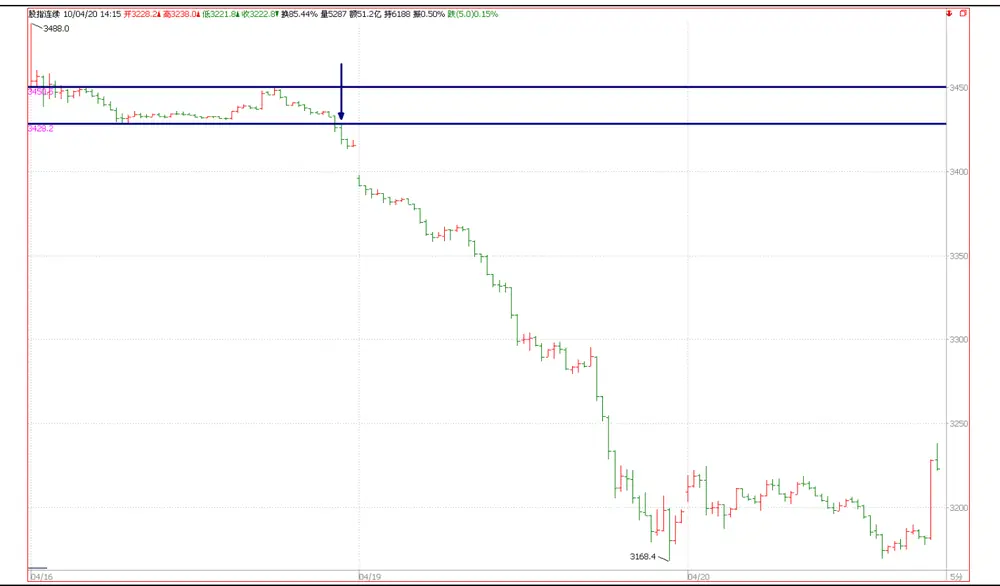
数据来源：广发证券发展研究中心

图 2：股指期货当月合约走势 2010-07-22 至 2010-07-30

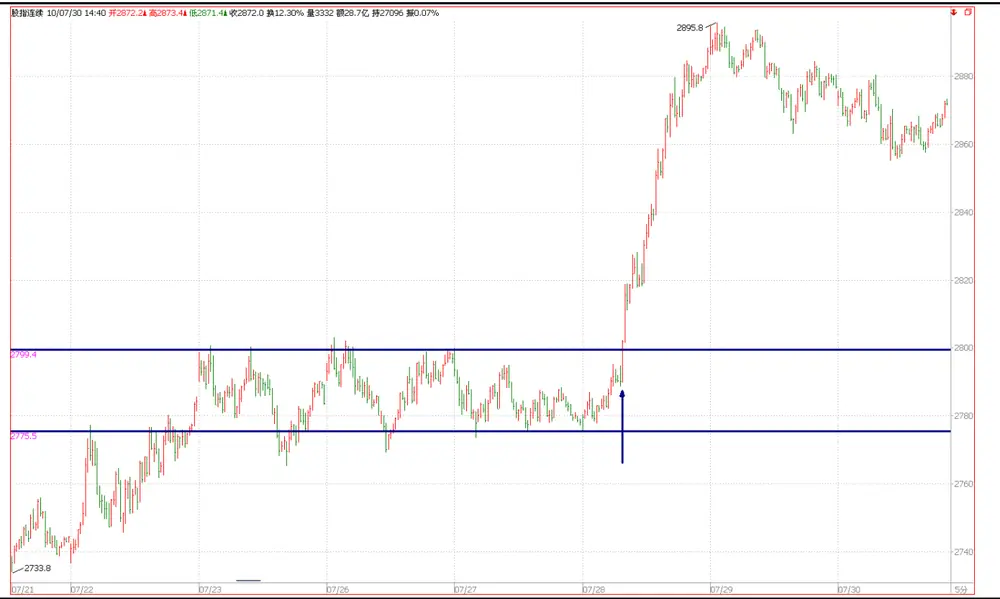
数据来源：广发证券发展研究中心

图 3：股指期货当月合约走势 2011-05-23 至 2011-05-25
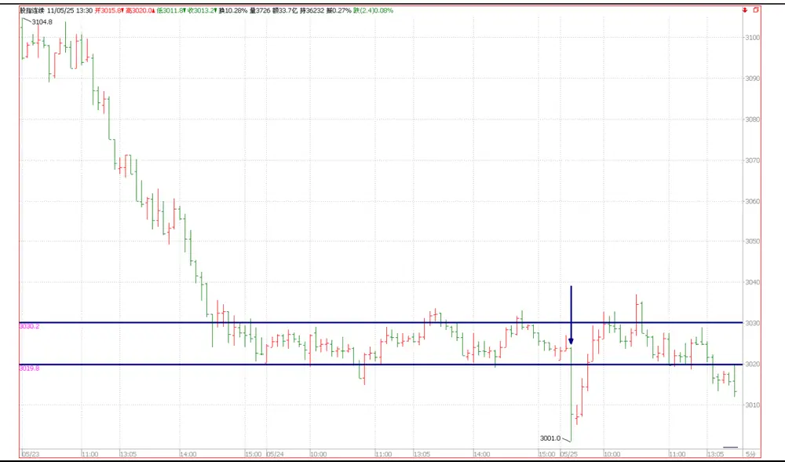
数据来源：广发证券发展研究中心

## 二、收敛突变模型

## （一）模型定义

从直观意义上讲，收敛突变模型定义的是一种长期横盘后选择方向的走势，为保持策略的有效性，我们在此略去模型严格的数学定义，仅对模型思想及参数加以阐述和解释。

如何定义横盘？我们认为比较好的方法是用价格绝对值波动率（标准差）的高低，波动率呈下降趋势时，表明价格波动开始平缓，从图形上来看就是进入横盘走势中，随着价格横向的推进，波动率会越来越小，因此如果波动率进入了一个历史相对低位<α，那么我们认为横盘震荡模式形成。

随后要考虑的是这种横盘走势何时打破？我们不可能也没有必要来通过考察外界因素的变化来达到预测，我们只需要等待价格自己朝着突破方向运行后跟进即可，那么何时才触发买卖信号跟进呢？首先我们用两条均线来包络价格波动区间，区间的宽度大小与波动率呈正比，这样当波动率减小时，区间的宽度也会减小。有了价格波动包络线之后，当价格本身向上超越上包络线最近 $N_{1}$ 期最高值时给出多头信号，当价格本身向

下超越下包络线最近 $N_{1}$ 期最低值时给出空头信号，由于价格超越包络线最近 $N_{1}$ 期最高值或最低值的时点与波动率低于•的时点在大多数情况是不一致的，因此我们将“低波动率”条件放宽到波动率的最近 $N_{2}$ 期最低值低于•。

上述三个参数 $N_{1}$ 、 $N_{2}$ 、•是模型触发买卖信号的决定参数，参数设置的好坏直接影响着模型预测能力的好坏，下面我们分别对三个参数的设定进行详细讨论。

（1）参数 $N_{\imath}$ 为正整数，是计算上（下）包络线最高（最低）值的回顾期数， $N_{1}$ 越大，则最高（最低）值会越大（小），价格超越它们的机会越小，而且当其超越时，价格本身已经单边趋势演进了一段距离；反过来， $N_{1}$ 太小，则价格超越近期极值的机会越大，但会过多触发买卖信号导致太多的假信号。我们认为针对本报告的分析级别——5分钟周期级别， $N_{1}\in[15,30]$ 是比较合适的。

（2）参数 $N_{2}$ 为正整数，是由于波动率进入低区间时点与价格突破包络线极点的时点不一致而不得不放宽条件而设置的参数， $N_{\scriptscriptstyle2}$ 越小，模型条件越严格，为了充分反映横盘特征，我们认为 $N_{\scriptscriptstyle2}$ 不应该超过10。

（3）α为正数，是判定波动率进入低位区间的阀值，α越小则模型越严格，图4是沪深300指数期货2010年4月16日至2011年7月20日5分钟价格序列的波动率序列箱图，其平均值为9.32，最小值为1.33，最大值为56.45。因此我们认为•不应该超过10。

综合上述讨论，我们将（26, 7, 5）作为初始参数设置，下文我们会考察优化后的参数结果及交易结果。

图 4：股指期货当月合约5 分钟价格序列波动率序列箱图
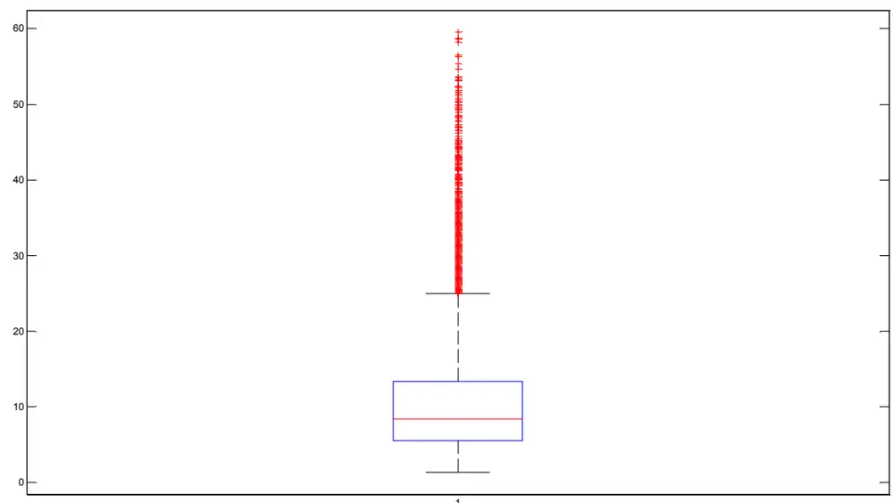
数据来源：广发证券发展研究中心

## （二）基于C++动态链接库的模型封装

为了便于利用模型，我们将模型信号算法封装在基于C++开发的动态链接库DLL文件中，DLL命名为001.DLL，其中001为策略编号。

封装函数的调用方法为：

$$
{\mathrm{S}}{:=}"001@{\mathrm{S}}"(26,7,5);
$$

其中“001”为DLL文件名称，“@S”表示调用DLL文件的名称为“S”的函数，“（26，7，5）”表示为函数S的参数，依次为 $N_{1},\ N_{2},\ \alpha$ ，如前文的讨论，我们将参数暂时设置为（26,7, 5）。

图5给出了沪深300指数期货2010年4月16日至2010年7月29日的走势下封装后的函数给出的信号，其中绿色向下箭头表示空头信号，红色向上箭头表示多头信号。

图 5：模型封装文件的使用图例

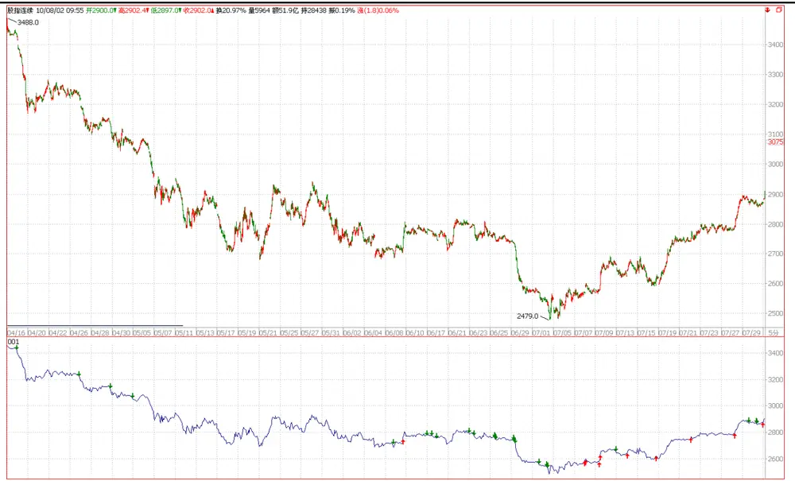
数据来源：广发证券发展研究中心

## 三、收敛突变模型实证分析

## （一）头寸跟踪策略

信号发出后即可进场建立相应方向的头寸，然后的工作就是要动态跟踪期货头寸，这其中包括止损和止盈，在此我们统称为头寸跟踪策略。按我们的理解，一个交易策略应该包括三部分：进场条件、出场条件、资金管理，模型信号仅仅解决了何时进场的问题，常言道：“会买的是徒弟，会卖的才是师傅，会割肉的是师爷”，其中“卖”或者“割肉”的操作都是何时出场的问题，本报告的头寸跟踪策略将讨论如何出场的问题。至于资金管理方面的讨论，我们认为是与策略胜率、止损位设置、收益风险比等密切相关的，本文暂不予讨论。

我们的头寸跟踪策略分为两个部分，一是初始止损位的设定；二是离场价的动态计算跟踪，我们分别来讨论。

（1）初始止损位：设定为信号发生点所在周期的最高价（空头信号）或最低价（多头信号），这主要是基于以下两方面的原因，其一我们的策略是考虑一种价格收敛突变的模式，符合该模式时给出买卖信号，随后的价格波动应该是剧烈的、急速的、大幅度的，因此信号发生后价格就不应该再徘徊不前、扭扭捏捏，而一旦价格继续徘徊不前，在价格上就会表现为触及信号发生点周期内最高值，若是如此则说明收敛突变模式不成立，平仓离场是自然的结局；其二信号发生后是建仓时点，按此方法设置止损位，则建仓成本与止损位离的比较近，平仓离场时的损失会非常小，这对于减小资金回撤至关重要。

（2）离场价位的动态计算，我们借鉴抛物线系统（SAR）模型算法来计算离场价位。

抛物线系统由韦尔斯.怀尔德（Welles Wilder）于1978年提出，怀尔德本人是个奇才，大名鼎鼎的相对强弱指标（RSI）就是由其创立的。怀尔德提出抛物线系统是用来作为一个买卖信号触发模型，在设置了初始拐点进场后，动态计算SAR指标值，价格反向超越SAR时平仓然后再持有反向头寸，SAR也是“STOP AND REVERSE”的缩写。下面给出怀尔德SAR系统算法：

记 $H_{\mathrm{{}}_{i}}$ ， $L_{\phantom{}_{i}}$ 为i时刻的最高价、最低价， $i=1,2,\cdots,n$ ，对于多头头寸来说， $j_{0}$ 为持有 $\mathfrak{F}$ 头头寸开始时刻，给定k时刻 $SAR_{k}$ ，则

$$
SAR_{k+1}=\operatorname*{min}\biggl(\operatorname*{min}_{k-1\leq j\leq k}{\left(L_{j}\right)},SAR_{k}+\biggl(\operatorname*{max}_{j_{0}\leq j\leq k}{\left(H_{j}\right)}-SAR_{k}\biggr)\times AF\biggr)
$$

其中 $AF$ 为加速因子，其初始值默认为0.02，每当价格创开仓以来新高一次， $AF$ 增加 $stepsize=0.02$ ，AF 上限为 $maxaf=0.2$ ，其中stepsize、 maxaf 两个参数可自定义设置。

对于空头头寸来说，类似的

$$
SAR_{k+1}=\operatorname*{max}\left(\operatorname*{max}_{k-1\leq j\leq k}{\left(H_{j}\right)},SAR_{k}-\left(SAR_{k}-\operatorname*{min}_{j_{0}\leq j\leq k}{\left(L_{j}\right)}\right)\times AF\right)
$$

其中加速因子AF 每当价格创新低一次增加stepsize，上限同样为maxaf 。

以多头信号来说，SAR系统实质上是将离场价向进场以来创出的新高价逐步靠拢的过程，靠拢的速度取决于创出新 $\frac{\dot{\pi}}{\vert\nabla\vert}$ 的次数，由加速因子控制，创新 $\frac{\dot{\pi}}{\vert\nabla\pmb{\vert\tau}\vert}$ 的次数越多表面趋势越强，此时离场价由于加速因子的增大而迅速跟进，这样对保护既有浮动盈利非常有利，当价格逐步趋缓或者拐头向下时，由于离场价与最高价相差不大，因此会迫使投机者平仓离场锁定盈利。

另外，观察多头信号SAR计算公式，由两部分组成，一是将上一期SAR值增加开仓以来的极点与上一期SAR差距的加速因子AF倍，这样来更新得到新一期SAR，另一方面要保证新一期SAR小于等于最近两期价格最低值的低者，这样设置的目的是为了容忍价格连续向下运行两个周期，当SAR触及最近两期最低价的低者时，新一期SAR为此低值，只要随后的价格不跌破此低值，那么头寸依然保持，若不采取这样一种容忍方式，新一期SAR将高于最近两期的价格最低值，即使随后的价格波动没有再向下运行，也有可能迫使操作者离场。

图6给出了SAR系统计算实例。

图 6：SAR 模型实例

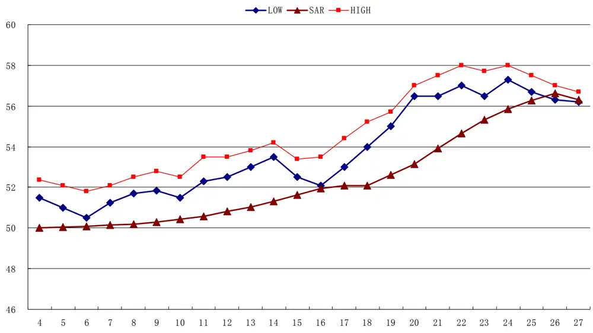
数据来源：广发证券发展研究中心

本文的头寸跟踪策略借鉴SAR系统思想，初始止损价设置为信号发生时点所在周期的最高价（空头信号）或最低价（多头信号）。对随后的离场价计算公式为

$$
SAR_{k+1}=SAR_{k}+\biggl(\operatorname*{max}_{j_{0}\leq j\leq k}\left(H_{j}\right)-SAR_{k}\biggr)\times AF
$$

$$
\ddagger\ddagger\ddagger:\ SAR_{k+1}=SAR_{k}-\biggl(SAR_{k}-\operatorname*{min}_{j_{0}\leq j\leq k}\left(L_{j}\right)\biggr)\times AF
$$

其中各参数的意义与前文一致，不再赘述，此处放弃对SAR与最近两期价格极值的比较是为了更好的保护既有浮动盈利。

图7给出了一个头寸跟踪策略的实际案例，是沪深300指数期货合约2010年4月16日至2010年4月20日的一段5分钟走势图，应用收敛突变模型，给定参数为（26, 7, 5），模型于2010-4-16 15:05发出卖空信号，初始止损价设置为该时点的那个5分钟K线的最高价3428.8，随后应用前文的跟踪策略，于2010-04-20 09:20点的5分钟K线最高价超越了离场价，说明在此5分钟内的某一点触及了我们设置的离场价，自动触发平仓离场操作，本次交易结束。

图 7：头寸跟踪策略实例

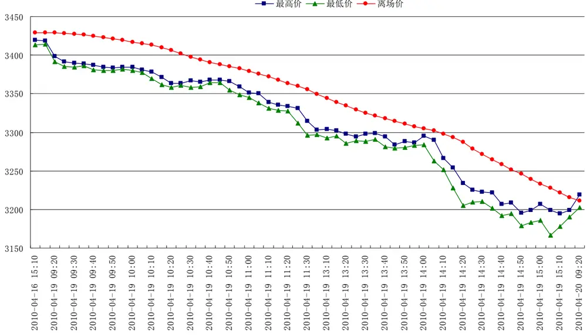
数据来源：广发证券发展研究中心

## （二）实证分析

## （1）数据选取

本文选取沪深300指数期货当月合约5分钟高频数据为策略实证分析数据，时间段为2010年4月16日至2011年7月20日。

## （2）策略评价方法

一个交易策略的好坏应该从多方面来评价，累计收益率仅仅是考察的一个方面，首先阐述我们认为比较重要的策略评价指标，具体考察项目见表1。

胜率，为获胜交易次数占总交易次数的比例，一般地，胜率超过40%的交易策略很少，这主要是因为止损动作的存在，操作中常常是判断对方向，但价格的徘徊震荡触及了止损位被迫离场，即使后来证明是正确的判断也由于止损发生被归为失败的交易，因此胜率不会太高。

收益风险比，为单次获胜收益率平均值与单次失败亏损率比值的绝对值，一般地，一个好的策略收益风险比不应该小于3，也就是说盈利应该不小于亏损的3倍。

最大回撤，为资金回撤的最大幅度，当然最大回撤越小越好，但要保证回撤小，就必须采用更严格的风险控制措施，比如降低杠杠比例，缩小止损位与成本价的距离，这同时也会降低策略的胜率及最终的盈利能力，回撤与盈利是一对矛盾统一体，如何均衡取决于运作资金对最大回撤的要求。

最大连胜次数与最大连亏次数，观察交易策略的这两个指标有益于策略执行人对策略信号胜负节奏的把握，若策略连败次数远超过历史最大连败次数，那么执行人有必要考虑停止策略运行，检查问题原因对策略加以改进。

表 1：交易策略评价体系

| 考察指标 | 说明 |
| --- | --- |
| 累计收益率 | 模拟交易期末累计收益率 |
| 交易总次数 | 总交易次数（自开仓至平仓为一个完整的交易周期） |
| 获胜次数 | 单次交易收益率大于0的次数 |
| 失败次数 | 单次交易收益率小于0的次数 |
| 胜率 | 获胜次数/交易总次数*100% |
| 单次获胜收益率 | 获胜交易的收益率算术平均值 |
| 单次失败亏损率 | 失败交易的收益率算术平均值 |
| 收益风险比 | 单次获胜收益率除以单次失败亏损率的绝对值 |
| 最大回撤 | 模拟交易资金自最高点缩水的最大幅度 |
| 最大连胜次数 | 最大连续收益率大于0的交易次数 |
| 最大连亏次数 | 最大连续收益率小于0的交易次数 |

数据来源：广发证券发展研究中心

## （3）模拟交易假设

信号发生后，下一个5分钟周期为开仓交易时段，我们在此假设三种开仓成交价计算方法：

A 开盘价，即信号发生后立即开仓且立刻成交；

B 成交均价，即信号发生后平均成交，开仓成本为成交金额/成交手数/300；

C 算术均价，即信号发生后平均成交，开仓成本为开盘价、最高价、最低价、收盘价之和除以4；

开仓后动态跟踪持有的头寸，实时跟踪市场价格变化是否触及了离场价，一旦触及立即离场，策略验证上表现为若某一刻所在周期的最高价（最低价）超越了空头头寸（多头头寸）的离场价则终止头寸，由于策略假设盘中实时价格触及离场价后立即平仓，因此平仓成交价设为SAR离场价。

记 $F_{1}$ 为开仓成交价， $F_{2}$ 为平仓成交价，c为单边手续费率（设为万分之零点六），I 为单边冲击成本（设为1个指数点），M 为杠杆倍数（设为1），则单次交易收益率为

$$
\begin{array}{l}{{r_{long}=\left[\frac{{\left({F_{_{2}}-I}\right)\times{{\left({1-c}\right)}-{\left({F_{_{1}}+I}\right)}\times{\left({1+c}\right)}}}}{{{\left({F_{_{1}}+I}\right)}\times{\left({1+c}\right)}}}\right]\times M}}\\{{r_{short}^{*}=\left[\frac{{\left({{F_{1}}-I}\right)\times{\left({1-c}\right)}-{\left({{F_{2}}+I}\right)}\times{\left({1+c}\right)}}}{{{\left({{F_{1}}-I}\right)}\times{\left({1+c}\right)}}}\right]\times M}}\end{array}
$$

## （4）实证结果

对收敛突变模型参数选取（26，7，5），给出假设开仓成交价为开盘价时的交易结果，具体见表2，模拟总共交易149次，胜率39.60%，收益风险比为3.87，最大回撤为-3.36%，最大连胜次数为4次，最大连亏次数6次。

表 2：策略交易结果

| 考察指标 | 结果 | 考察指标 | 结果 |
| --- | --- | --- | --- |
| 累计收益率 | 45.47% | 单次失败亏损率 | -0.28% |
| 交易总次数 | 149 | 收益风险比 | 3.87 |
| 获胜次数 | 59 | 最大回撤 | $-3.$ 36% |
| 失败次数 | 90 | 最大连胜次数 | 4 |
| 胜率 | 39.60% | 最大连亏次数 | 6 |
| 单次获胜收益率 | 1.07% |  |  |

数据来源：广发证券发展研究中心

图 8：模拟交易累计收益率走势图
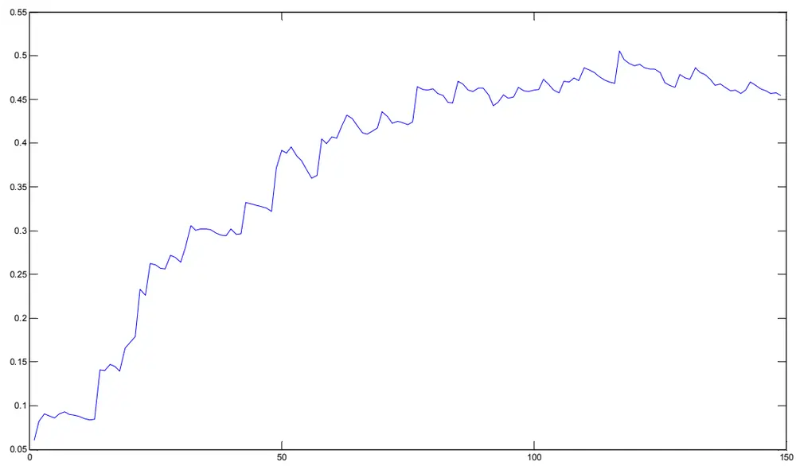
数据来源：广发证券发展研究中心

图 9：模拟交易累计收益率与期货价格走势对比图
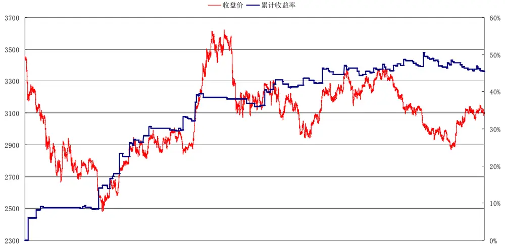
数据来源：广发证券发展研究中心
识别风险，发现价值

图 10：模拟交易的最大回撤
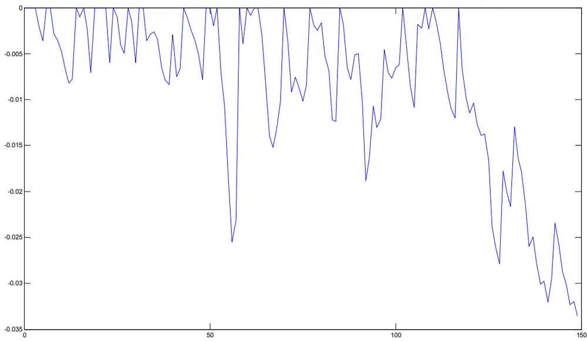
数据来源：广发证券发展研究中心

图 11：模拟交易连败次数与连胜次数
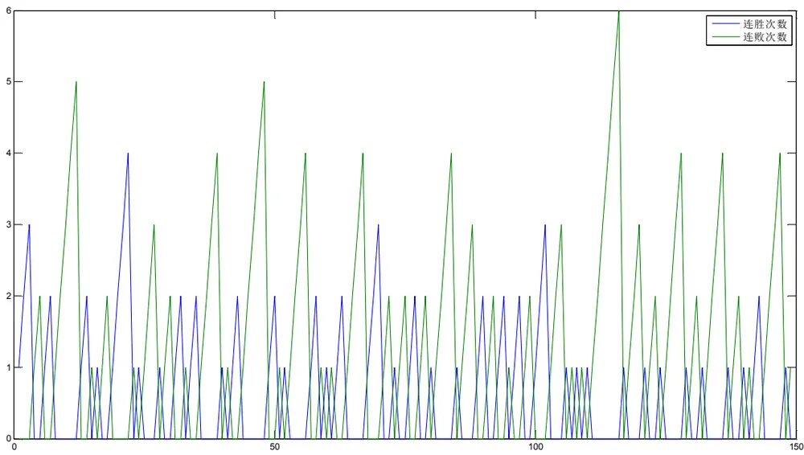
数据来源：广发证券发展研究中心

上述实证分析是以开仓成交价情景A下进行的，我们再来看看情景B、情景C下的实证结果，表3给出了汇总结果，综合各指标来看情景A结果优于情景B、情景C，因此我们建议在资金量不大的情况下信号发生后立即完成建仓动作。

表 3：不同开仓成交价情景下的模拟交易结果

| 考察指标 | 情景A | 情景B | 情景C |
| --- | --- | --- | --- |
| 累计收益率 | 45.47% | 36.24% | 36.91% |
| 交易总次数 | 149 | 149 | 149 |
| 获胜次数 | 59 | 54 | 55 |
| 失败次数 | 90 | 95 | 94 |
| 胜率 | 39.60% | 36.24% | 36.91% |
| 单次获胜收益率 | 1.07% | 1.10% | 1.08% |
| 单次失败亏损率 | -0.28% | -0.27 | -0.28% |
| 收益风险比 | 3.87 | 4 | 3.89% |
| 最大回撤 | -3.36% | -3.57% | -3.70% |
| 最大连胜次数 | 4 | 4 | 4 |
| 最大连亏次数 | 6 | 9 | 9 |

数据来源：广发证券发展研究中心

图 12：三种开仓成交价情景下的模拟交易结果
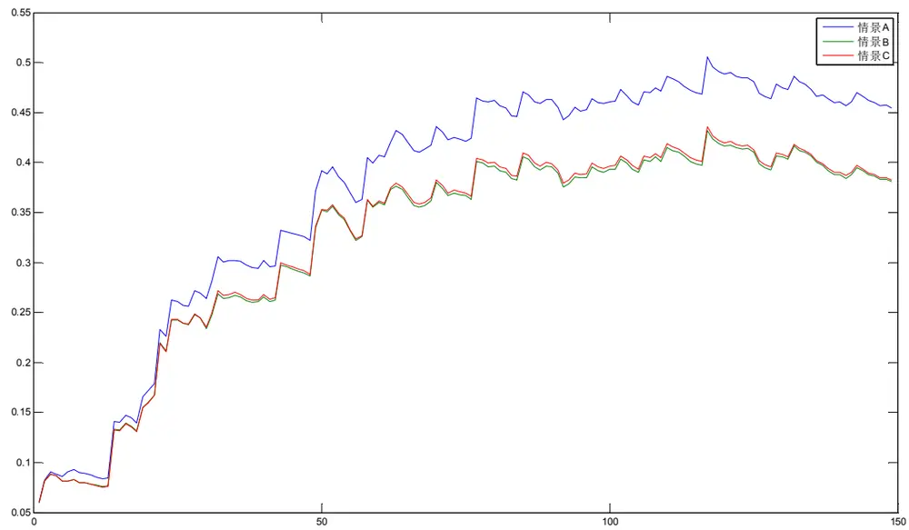
数据来源：广发证券发展研究中心

下面我们讨论策略对参数的稳健性问题，以情景A为基础来分析参数变化对收益率的影响，首先我们考察固定参数 $N_{1}=26$ ，变化参数 $N_{2}$ 及参数•对期末累计收益率的影响，见图13。回顾前文参数 $N_{2}$ 的意义是对最小波动率计算的滞后期数， $N_{2}$ 过小则失去设置该参数的意义，过大则可能导致信号数量的大量增加，从图13来看，其在6~10之间变化时对期末累计收益率的影响不大；参数•是“低波动率”条件的阀值，在1~10

识别风险，发现价值

的范围内变化对累计收益率影响不大。

再者，我们固定参数 $N_{2}=7$ ，参数 $\alpha=5$ ，观察 $N_{1}$ 变化对收益的影响，结果见图

14，参数 $N_{1}$ 的变化对收益率的影响很大，这也是很自然的事情， $N_{1}$ 本身就是价格波动包络线阶段高低点的计算滞后期参数，而价格穿越此高低点是信号触发的依据，从结果来看 $N_{1}$ 在20~28之间变化都取得了较高的收益，收益率均在36%以上， $N_{1}$ 为26时，收益率最高，超过了38%。

图 13：参数 N2 与 alpha对期末累计收益率的影响
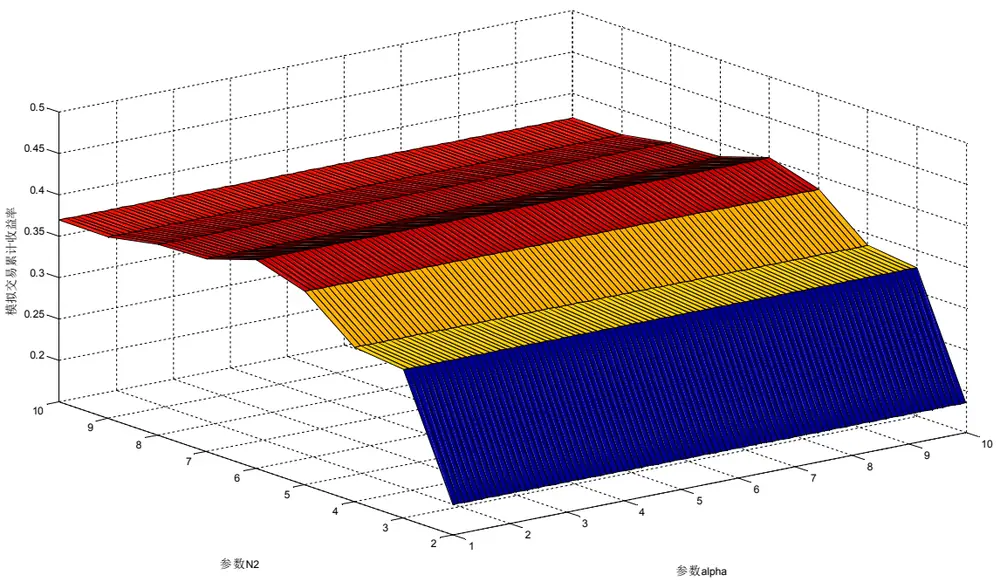
数据来源：广发证券发展研究中心

图 14：参数 N1 对期末累计收益率的影响

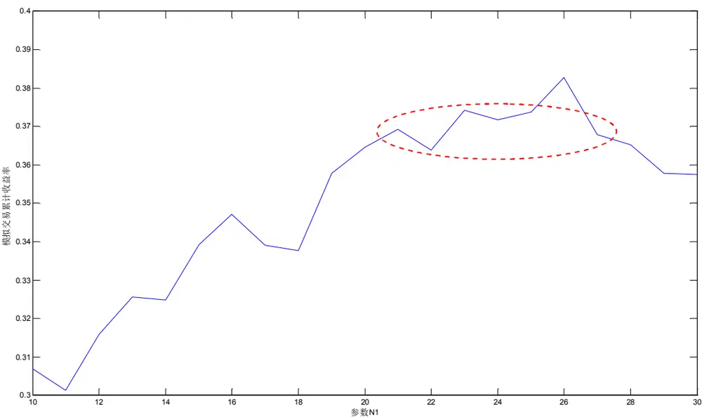
数据来源：广发证券发展研究中心

## 四、最大化资金增长速度的模型优化

## （一）优化目标设置

通过前文对交易策略评价体系的介绍，可以知道最大化模型期末累计收益率是不合适的，我们往往更希望资金平缓增长，希望资金曲线是一条平缓向上倾斜的曲线，向上倾斜的幅度越大，那么资金增长的速度越大，因此将总权益对交易次数进行一元线性回归得到的斜率参数作为最大化目标是比较合适的。

记 $r_{i}$ ，i =1,…,n为 n次交易的收益率序列， $R_{i}=\prod_{j=1}^{i}\left(1+r_{i}\right)$ 为第i次交易后的累计收益率，则根据因变量Y对自变量X的一元线性回归理论，

$$
y=a+bx+\varepsilon
$$

其中斜率参数估计为

$$
{\hat{b}}={\frac{\sum{\Big(}x_{i}-{\overline{{x}}}{\Big)}{\Big(}y_{i}-{\overline{{y}}}{\Big)}}{\sum{\Big(}x_{i}-{\overline{{x}}}{\Big)}^{2}}}
$$

将累计收益率 $R_{i}$ 序列与交易次数序列1, ,• n代入上式得到资金曲线倾斜的幅度估计。

## （二）优化结果

利用遗传算法，设定三个参数的优化取值范围为 $N_{1}\in\left[5,30\right]$ 的整数， $N_{2}\in[5,30]$的整数，• •[1,10]的浮点数，对资金增长曲线与交易次数拟合后的斜率参数进行最大

化优化。关于遗传算法的具体介绍，由于篇幅所限，本文不予详细阐述，有兴趣的读者可参见报告《基于自适应网络模糊推理系统的择时研究》。

遗传算法优化后的模型参数为（26, 6, 9.93），参数优化前后的交易结果对比见表4、图15，从结果来看，优化后的结果在收益风险比上有所提高，交易次数上有所下降，最大回撤减小，在胜率、期末累计收益率、最大连亏次数上表现不及优化前得结果。

表 4：参数优化前后交易结果对比

| 考察指标 | (26,7,5) | (26, 6, 9.93) |
| --- | --- | --- |
| 累计收益率 | 45.47% | 40.18% |
| 交易总次数 | 149 | 142 |
| 获胜次数 | 59 | 53 |
| 失败次数 | 90 | 89 |
| 胜率 | 39.60% | 37.32% |
| 单次获胜收益率 | 1.07% | 1.12% |
| 单次失败亏损率 | -0.28% | -0.28% |
| 收益风险比 | 3.87 | 4.05 |
| 最大回撤 | -3.36% | -3.17% |
| 最大连胜次数 | 4 | 4 |
| 最大连亏次数 | 6 | 8 |

数据来源：广发证券发展研究中心

图 15：参数优化前后交易结果对比
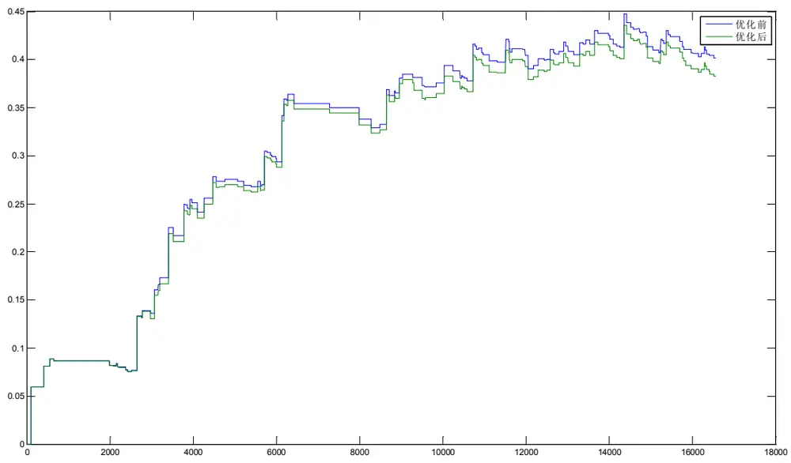
数据来源：广发证券发展研究中心

## 五、总结

## （一）研究意义和创新点

（1）本文独辟蹊径，通过定义一系列价格波动模式，对比当前走势是否与已定义的模式相符，并据此预测特定模式后市场的波动特征，本报告为系列报告的第一篇，定义了一种称为波动收敛突变模式，并据此模式发出的买卖信号开发交易策略。

（2）本报告提出了由16个指标构成的交易策略评价体系，分别考察交易策略的胜率、收益风险比、最大回撤、最大连亏次数、最大连赢次数等多方面特征，从而更全面的把握策略的特征，这些因素也是投机实战中必须考虑的。

（3）为了保持策略的有效性，我们将模型买卖信号触发部分封装在DLL文件中，一方面方便使用者，提高计算速度；另一方面加强策略的保密性。

## （二）模型的不足

本报告提出的模型虽然取得了较好的预测结果，但是仍然存在以下不足之处，比如我们只定义了一类收敛突变模式，股价波动方式有非常多种，不同时刻可能符合不同模式，我们希望通过构建模式库来做更全面的预测，这也是我们后续研究的方向。

## （三）后续研究方向

后续研究方向主要围绕以下几个方面：研究更多种走势模式模型，来刻画不同走势情景下价格波动特征，根据这些模式模型的特征，完成对未来价格震荡或趋势的分类预测；不同市场不同交易品种对模型的适用性可能不同，未来我们将探讨模型对其他市场、其他交易品种的适用性。

## 广发金融工程研究小组

罗军，首席分析师，华南理工大学理学硕士，2010年新财富最佳分析师评选入围，2009年进入广发证券发展研究中心。
胡海涛，分析师，华南理工大学理学硕士，2010年新财富最佳分析师评选入围（团队），2010年进入广发证券发展研究中心。
安宁宁，研究助理，暨南大学经济学硕士，2011年进入广发证券发展研究中心，电话：0755-23948352，eMail：ann@gf.com.cn。
蓝昭钦，研究助理，中山大学数学硕士，2010年新财富最佳分析师评选入围（团队），2010年进入广发证券发展研究中心。
李明，研究助理，伦敦城市大学卡斯商学院计量金融硕士， 年新财富最佳分析师评选入围（团队）， 年进入广发证券发展研究中心。

史庆盛，研究助理，华南理工大学管理学硕士，2011年进入广发证券发展研究中心。

| 相关研究报告 |  |  |
| --- | --- | --- |
| 基于混沌理论的股指期货噪声趋势交易（NTT）策略 | 罗军 | 2011-05-11 |
| 基于伊藤引理的股指期货跨期套利策略 | 蓝昭钦 | 2010-12-02 |
| 沪深300股指期货的期现关系及相互影响研究 | 蓝昭钦 | 2010-06-25 |

|  | 广州 | 深圳 | 北京 | 上海 |
| --- | --- | --- | --- | --- |
| 地址 | 广州市天河北路183 号 大都会广场5楼 | 深圳市民田路华融大厦 北京市月坛北街2号月坛大上海市浦东南路528号 |  |  |
| 邮政编码 | 510075 | 2501室 518026 | 厦18层1808室 100045 | 证券大厦北塔17楼 200120 |
| 客服邮箱 | gfyf@gf.com.cn |  |  |  |
| 服务热线 | 020-87555888-8612 |  |  |  |

注：广发证券股份有限公司具备证券投资咨询业务资格。本报告只发送给广发证券重点客户，不对外公开发布。

## 免责声明

本报告所载资料的来源及观点的出处皆被广发证券股份有限公司认为可靠，但广发证券不对其准确性或完整性做出任何保证。报告内容仅供参考，报告中的信息或所表达观点不构成所涉证券买卖的出价或询价。广发证券不对因使用本报告的内容而引致的损失承担任何责任，除非法律法规有明确规定。客户不应以本报告取代其独立判断或仅根据本报告做出决策。

广发证券可发出其它与本报告所载信息不一致及有不同结论的报告。本报告反映研究人员的不同观点、见解及分析方法，并不代表广发证券或其附属机构的立场。报告所载资料、意见及推测仅反映研究人员于发出本报告当日的判断，可随时更改且不予通告。

本报告旨在发送给广发证券的特定客户及其它专业人士。未经广发证券事先书面许可，不得更改或以任何方式传送、复印或印刷本报告。