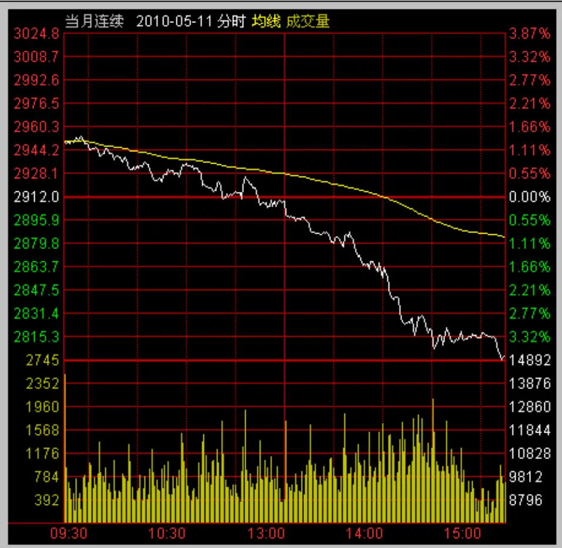
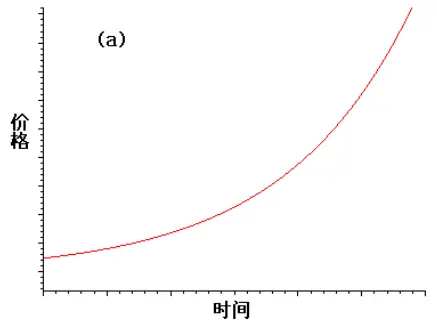
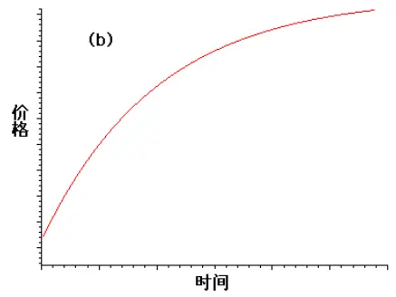
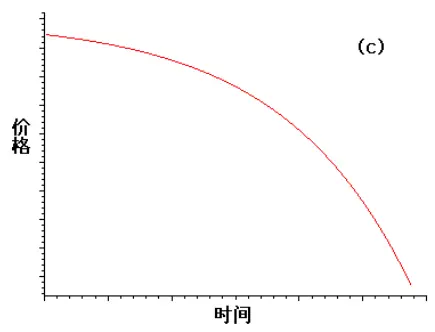
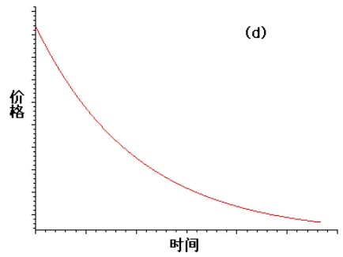
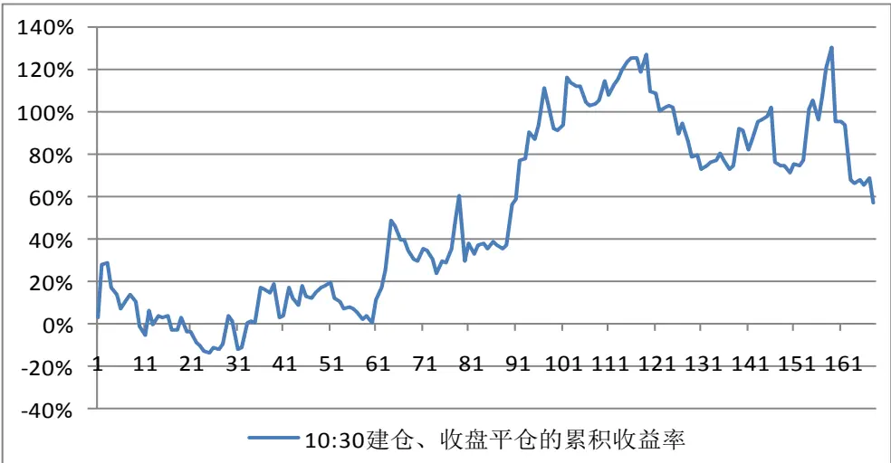
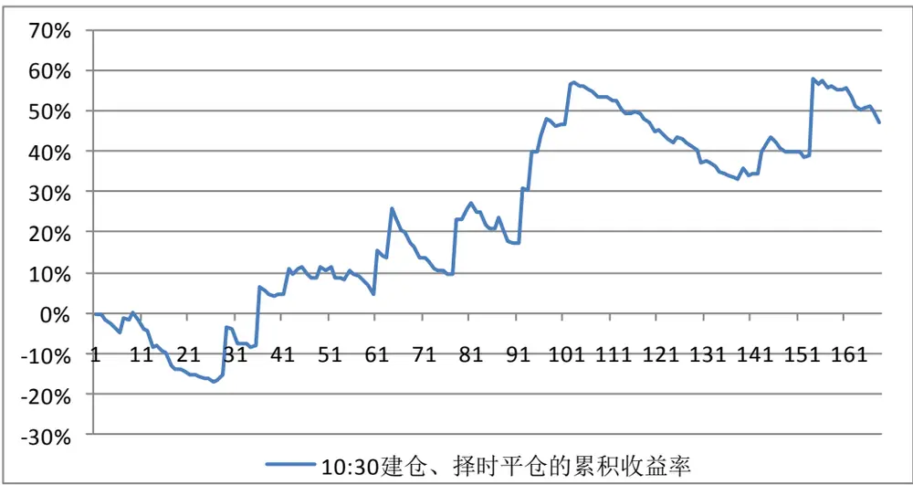
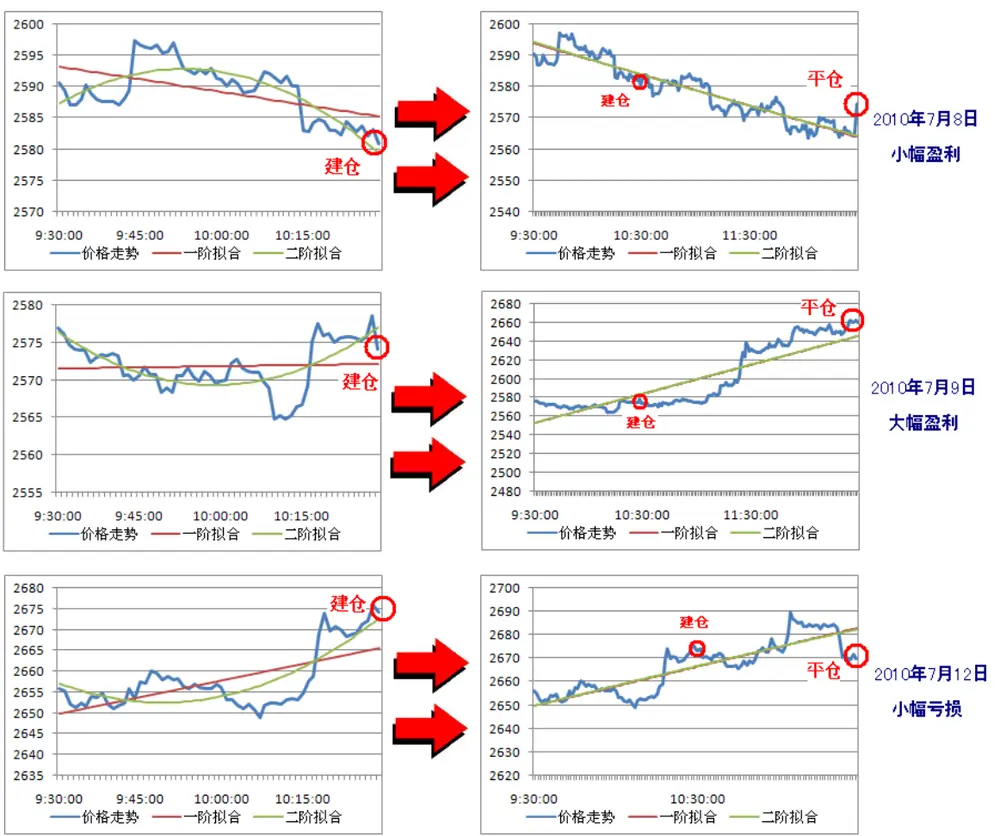
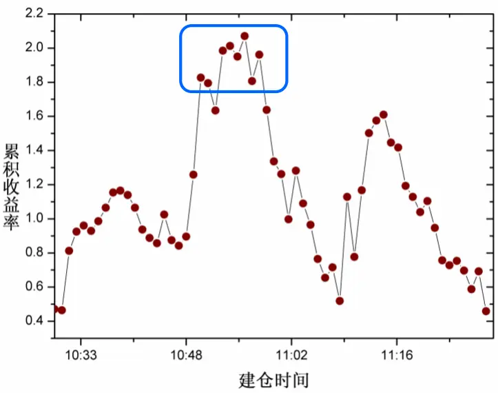
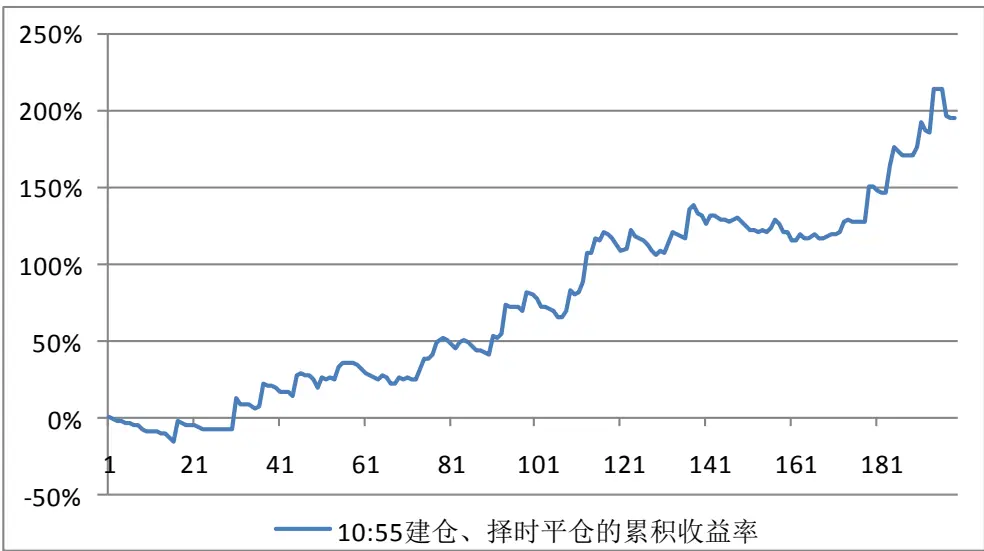

# Table_Title 基于低阶多项式拟合的股指期货趋势交易(LPTT)策略

# 股指期货专题系列报告之八

罗军Table_Summary 金融工程 分析师

胡海涛 金融工程 分析师

电话： 020-87555888-655

电话：020-87555888-406

eMail： lj33@gf.com.cn

eMail: hht@gf.com.cn

SAC执业证书编号：S0260511010004

SAC执业证书编号：S0260511020010

## 趋势交易的适用性

金融市场各类证券产品的价格随时间演化，往往会出现一定的趋势性。追逐趋势、获取价差收益，成为了一种传统而有效的交易策略。传统金融理论认为在高效率市场中，股票、期货等金融产品的价格变化服从马尔科夫随机过程，即具有无记忆特征，也就谈不上价格变动的趋势。但是在市场效率不高的情况下，由于信息流动存在不平衡性，股票或期货的价格变动常常会形成单边趋势，此时若能够顺势交易，则有可能获得有效的趋势价差收益。

## 趋势的四种分类

金融市场中，信息的不平衡特性体现在两个方面：信息的非及时扩散和信息的过度反应。这两种不平衡环境造就了价格的四种趋势：加速上涨与加速下跌（对应信息的非及时扩散），以及减速上涨与减速下跌（对应信息的过度反应）。这四种情况可以通过对离散的价格时间序列进行低阶多项式拟合，观察一次拟合函数的一阶导数f’及二次拟合函数的二阶导数 g’’进行界定。当 $fg>0$ 时，代表加速上涨与加速下跌行为，此时反转风险相对较小，可顺势建仓；当 $fg<0$ 时，代表减速上涨与减速下跌行为，反转风险较大，不进行交易。

## 关于离散数据的多项式拟合（Low-order Polyfit）

通过曲线拟合，可以用连续函数来描述离散数据在空间的大致形态。曲线拟合又称函数逼近，是求近似函数（即拟合函数）的一类数值方法。它不要求近似函数在离散点处与观察函数同值，即不要求近似曲线过已知点，只要求它尽可能反映给定数据点的基本趋势，在某种意义下与观察函数最“逼近”。本报告中将采用最小二乘法求得最佳平方逼近，所选用的近似函数类为低阶多项式，即线性函数和二次函数。

## 应用于日内趋势交易

我们将上述趋势交易策略运用于股指期货日内交易。首先不对建仓和平仓时间做严格的量化控制，从而半定量地观察该交易策略的实证效果。假设在交易日内9:30 至 10:30股指期货趋势形成，顺势建仓，盘终平仓，发现可以获得有效正收益，但最大回撤较大。为了减小波动风险，我们有必要设臵平仓条件，因此我们假设在一次拟合函数的一阶导数f’或二次拟合函数的二阶导数g’’发生反转时（即正负号发生变化时）进行平仓。发现通过该平仓条件，在累积收益率略有降低的同时，最大回撤大幅减小，反映了该平仓条件的有效性。最后我们对开仓时间进行严格量化，通过统计历史数据，得到在 10:55 附近（±5 分钟）建仓可以取得较好的收益效果及稳定性。采用上述建仓及平仓条件，我们对股指期货上市以来 343个交易日（2010年4 月 16 日至2011 年9 月9 日）进行交易回测，考虑 5 倍杠杆的情况下，获得了 195.0%的累积收益率，而最大回撤仅 15.7%，年化收益率达到 159.6%。

## 一、交易策略基本思想

“时止则止，时行则行；动静不失其时，其道光明”——《周易》。

金融市场各类证券产品的价格随时间演化，往往会出现一定的趋势性。追逐趋势、获取价差收益，成为了一种传统而有效的交易策略。正如上述哲理所述，事物随时间而变化，若希望在事物的变化中有所进取，就必须顺时而动，顺势而行。

在国内，趋势交易较多运用于股票市场或期货市场。按照一般的金融学理论，在高效率的金融市场中，价格变动服从马尔科夫随机过程，这种随机过程具有无记忆性特征，也就谈不上价格变动的趋势。但是介于国内金融市场的市场效率相对较低，信息的流动存在不平衡性，股票或期货的价格变动经常会形成如图1这样的单边趋势。此时若能够顺势交易，则有可能获得有效的趋势价差收益。

图 1：2010年5月11日股指期货当月合约出现的单边趋势行情

数据来源：通达信证券信息平台

而这种金融市场的信息不平衡特性体现在两个方面：信息的非及时扩散和信息的过度反应。我们可以通过图2进行更加直观的解释。

图2: 四种价格趋势形态

数据来源：广发证券发展研究中心

通过图2，我们将价格趋势分为四类。

图2（a）和图2（c）分别对应了加速上涨和加速下跌过程，在这类过程中，由于市场信息流动不均匀，总是在价格上涨或下跌了一段时间后，信息才遍及全市场，因此总有投资者在后知后觉之后进入市场并追涨杀跌，从而进一步促进了价格的趋势性和市场的方向性，在走势上即表现为趋势的加速。

图2（b）和图2（d）分别代表了减速上涨和减速下跌过程，这类过程则对应于市场对信息的过度反应。当有“对价格影响较大的信息”突然流入市场后，投资者很难在较短时间内对“信息对价格的影响”做出准确估计，从而常常由于高估信息对价格的影响而出现短暂的价格冲击。随后当投资者发现高估了信息对价格的影响时，往往出现价格波动恢复平衡的情况。这一整个过程在价格的走势中表现为减速上涨或减速下跌。

当价格的局部走势呈现出图2（a）或图2（c）的时候，可以考虑顺势追入，此时对应的反转风险较小，正所谓“势在必行”；而如果是图2（b）或图2（d）的情况，则有可能面临趋势消失，出现“见顶”或者“见底”的情况，因此在这种趋势形态下，不宜追入。

由于国内股票市场暂时无法实现卖空和T+0交易，本报告将采用股指期货作为投资标的，研究基于低阶多项式拟合方法的股指期货趋势交易策略。

## 二、交易策略理论介绍

## （一）概述

趋势，即事物发展的动向，是事物未来发展运动的方向。

在一个价格动力学系统随时间的变化当中，如果其当前的波峰和波谷都相应的高于前一个波峰和波谷，那么就称为上涨趋势；相反，如果其包含的波峰和波谷都低于前一个波峰和波谷，那么就称为下跌趋势。

趋势交易起源于何时已无法考究，或许从证券交易市场诞生的那一天起，证券价格的波动性就赋予了投资者趋势交易的思想。在传统的技术分析当中，已经有很多的方法对价格趋势做出判断，例如均线MA、波浪理论等。但是一套理论能够盈利往往是由于它被少数人所掌握，特别是交易策略，因为交易本身是一种博弈，掌握某种策略的人越多，这种策略的有效性可能就越差。因此，通过传统的技术分析进行趋势交易所能获取的有效收益也越来越低。这就促使交易员或研究者不断研究开发新的趋势交易策略。

本报告将通过数量化的方法建立一套全新的日内趋势交易策略，该交易策略的理论基础是离散数据的多项式拟合（polyfit）。对交易日内某段时间的价格序列 $\{p_{t}\}$ 进行线性拟合（即一阶多项式拟合），得到连续函数 $y_{1}=a_{1}t+b_{1}$ ，我们可以通过其一阶导数（斜率）判断该段时间价格的趋势，当 $\frac{dy_{1}}{dt}>0$ 时，价格为上涨趋势；当 $\frac{dy_{1}}{dt}<0$ 时，为下跌趋势；当 $\frac{dy_{1}}{dt}=0$ 时，无趋势（这种精确的情况在大量价格数据的拟合过程中基本不会出现，一旦出现，我们则不对其趋势进行判定，不做出交易判断）。

通过一阶多项式拟合，我们可以对价格的基本趋势做出判断，但更重要的是我们还要对趋势的变化情况做出界定，即需要研究如图2中由于金融市场的信息不平衡特性所带来的趋势加速或减速的情况。这点可以通过二阶多项式拟合完成。同样是对该段时间的价格序列 $\{p_{t}\}$ 进行二次拟合，拟合的目标函数形式为 $y_{2}=a_{2}t^{2}+b_{2}t+c_{2}$ 。当$\frac{d^{2}\boldsymbol{y}_{2}}{{dt}^{2}}>0$ 时，价格曲线为凹；反之 $\frac{d^{2}y_{2}}{{dt}^{2}}<0$ 时，价格曲线为凸；结合一阶多项式拟合的结果，图2的四种情况分别可以用如下量化结果进行描述：

1、图2（a），加速上涨： $\frac{dy_{1}}{dt}>0\quad 且\quad\frac{d^{2}y_{2}}{dt^{2}}>0$

2、图2（b），减速上涨： $\frac{dy_{1}}{dt}>0\quad 且\quad\frac{d^{2}y_{2}}{dt^{2}}<0$

3、图2（c），加速下跌： $\frac{dy_{1}}{dt}<0\quad 且\quad\frac{d^{2}y_{2}}{dt^{2}}<0$

4、图2（d），减速下跌： $\frac{dy_{1}}{dt}<0\quad\frac{d^{2}y_{2}}{dt^{2}}>0$我们交易策略的基本思路是，在第1种和第3种情况出现时，即时，对股指期货进行顺势建仓，获得趋势性价差收益；关于平仓条件，我们会在后面的实证模拟中详述。

$$
\frac{dy_{1}}{dt}\times\frac{d^{2}y_{2}}{dt^{2}}>0
$$

接下来，简单介绍一下对离散数据进行多项式拟合的数学理论基础。

## （二）离散数据的多项式拟合

通过曲线拟合，可以用连续函数来描述离散数据在空间的大致形态。曲线拟合又称函数逼近，是求近似函数的一类数值方法。它不要求近似函数在离散点处与观察函数同值，即不要求近似曲线过已知点，只要求它尽可能反映给定数据点的基本趋势，在某种意义下与函数最“逼近”。

假设用 $函,$ 数 $y^{*}=f(x)$ 拟合某组一维离散数据，它在离散点 $x_{i}$ 处与观察值 $y_{i之}$ 差

$$
\delta_{i}=y_{i}-y_{i}*=y_{i}-f(x_{i})
$$

称为残差。残差的大小可以作为衡量近似函数好坏的标准。常用的准则有以下三种：

（1）使残差的绝对值之和最小，即

$$
\sum_{i}\mid\delta_{i}\mid=\operatorname*{min}
$$

（2）使残差的最大绝对值最小，即

$$
\max\mid\delta_{i}\mid=\min
$$

（3）使残差的平方和最小，即

$$
\sum_{i}\delta_{i}^{2}=\operatorname*{min}
$$

目前使用较多的是第三条准则，即通过最小二乘法求得最佳平方逼近，本报告也将采用这种方法对股指期货价格时间序列进行多项式拟合。

具体来说，数据拟合的最小二乘问题是：根据给定的数据组 $(x_{i},y_{i})_{(i=1,2,\ldots,n)}$ 选取近似函数形式，即给定函数类H，求函数 $\varphi(x)\in H$ ，使得

$$
\sum_{i=1}^{n}\delta_{i}^{2}=\sum_{i=1}^{n}\left[y_{i}-\varphi(x_{i})\right]^{2}
$$

为最小，即

$$
\sum_{i=1}^{n}\left[y_{i}-\varphi(x_{i})\right]^{2}=\min_{\varphi\in H}\sum_{i=1}^{n}\left[y_{i}-\varphi(x_{i})\right]^{2}
$$

这种求近似函数的方法称作数据拟合的最小二乘法，函数 $\varphi(x)$ 称为这组数据的最小二乘函数。通常取H为一些比较简单函数的集合，本报告则取其为一次多项式（线性函数）和二次多项式的低阶多项式集合。进一步来说，对于给定的数据组 $(x_{i},y_{i})$ $(\mathsf{i}=1,2,\ldots,\mathsf{n})$ ，求一个m次多项式（m<n）

$$
P_{m}(x)=a_{0}+a_{1}x+\cdots+a_{m}x^{m}
$$

使得

$$
\sum_{i=1}^{n}\delta_{i}^{2}=\sum_{i=1}^{n}\left[y_{i}-P_{m}(x_{i})\right]^{2}=F(a_{0},a_{1},\cdots,a_{m})
$$

最小，即选取参数 $a_{i(\mathsf{i}=0,1,\dots,\mathsf{m})}$ ，使得

$$
F(a_{0},a_{1},\cdots,a_{m})=\min_{\varphi\in H}\sum_{i=1}^{n}[y_{i}-\varphi(x_{i})]^{2}
$$

这就是数据的多项式拟合， $P_{m}(x_{i})$ 称为这组数据的最小二乘m次多项式拟合，在我们下面的交易策略中，m=1或2。

对于多项式系数 $\{a_{_{0}},a_{_{1}},\cdots,a_{_{m}}\}$ ，可以通过求解多元函数极值来得到，即求解方程组

$$
\frac{\partial F}{\partial a_{j}}=-2\sum_{i=1}^{n}\left[y_{i}-\sum_{k=0}^{m}a_{k}x_{i}^{k}\right]x_{i}^{j}=0
$$

$$
(\mathsf{j}=0,1,\ldots,\mathsf{m})
$$

即

$$
\left\{\begin{array}{c}na_{0}+a_{1}\sum_{i=1}^{n}x_{i}+a_{2}\sum_{i=1}^{n}x_{i}^{2}+\cdots+a_{m}\sum_{i=1}^{n}x_{i}^{m}=\sum_{i=1}^{n}y_{i}\\a_{0}\sum_{i=1}^{n}x_{i}+a_{1}\sum_{i=1}^{n}x_{i}^{2}+a_{2}\sum_{i=1}^{n}x_{i}^{3}+\cdots+a_{m}\sum_{i=1}^{n}x_{i}^{m+1}=\sum_{i=1}^{n}y_{i}x_{i}\\\cdots\cdots\\a_{0}\sum_{i=1}^{n}x_{i}^{m}+a_{1}\sum_{i=1}^{n}x_{i}^{m+1}+a_{2}\sum_{i=1}^{n}x_{i}^{m+2}+\cdots+a_{m}\sum_{i=1}^{n}x_{i}^{2m}=\sum_{i=1}^{n}y_{i}x_{i}^{m}\end{array}\right.
$$

这是最小二乘拟合多项式的系数 $a_{k(\mathsf{k}=0,1,\dots,\mathsf{m})}$ 应满足的方程组，称为正则方程组。由函数组 $\left[1,x,x^{2},\cdots,x^{m}\right]$ 的线性无关性可以证明，上述方程组存在唯一解，且解所对应的多项式必定是已给定数据 $(x_{i},y_{i})_{(i=0,1,\ldots,n)}$ 的最小二乘m次拟合多项式。

## 三、实证模拟

我们采用上述交易模型对股指期货日内交易进行实证计算。由于交易日内9:15至9:30股指期货独立于现货运行，与9:30后的价格走势相关性较小，因此每日数据从9:30开始计算，经过一段时间，如果市场加速趋势形成，则可顺势建仓。至于何时市场趋势可以确认，我们会在后面进行统计分析。这里为了大致介绍我们的思路和方法，首先假定9:30至10:30价格趋势形成，通过对该段时间的1分钟高频序列进行低阶多项式拟合，

$$
\frac{dy_{1}}{dt}\times\frac{d^{2}y_{2}}{dt^{2}}>0
$$

如果满足上述条件，即出现上述图2中（a）加速上涨或（c）加速下跌的情况时，顺势建仓；平仓条件我们随后讨论，这里也先设臵为持有至盘终，即15:15进行平仓。实证模拟的时间窗口为股指期货上市日2010年4月16日至2011年9月9日，共344个交易日（由于天软数据质量有问题，因此实测343天）。下面是回测结果，其中考虑了5倍杠杆和双边0.02%的交易费用：

表 1：10:30建仓、收盘平仓的交易结果

| 总计交易日 | 343 |
| --- | --- |
| 有交易行为的交易日 | 168 |
| 交易执行率 | 49.0% |
| 正确次数 | 84 |
| 错误次数 | 84 |
| 正确率 | 50.0% |
| 累积收益率 | 56.7% |
| 最大回撤率 | 32.9% |

数据来源：广发证券发展研究中心

图3：10:30建仓、收盘平仓交易模式的累积收益率

数据来源：广发证券发展研究中心

可以看出，在没有设臵平仓条件的情况下，上述策略可以获得一定的正向收益，但最大回撤也达到32.9%，存在较大的投资风险。因此我们有必要考虑设臵平仓条件，从而减小波动与回撤风险。

正如本报告开篇所提到，“时止则止”正是合理择时进行平仓的哲学原理。针对本趋势交易策略，我们需要在趋势停止时进行平仓。而趋势和趋势的变化，在上文提到，

$$
\underline{{dy_{1}}}\quad\underline{{d^{2}y_{2}}}
$$

分别由价格时间序列拟合函数的一阶导数 dt 和二阶导数 $dt^{2}$ 表示。当建仓后一段时

$$
\frac{dy_{1}}{dt}
$$

间，的正负号发生变化时，价格趋势改变（注意此时的拟合时间序列仍需从9:30开dy1

始）。在趋势交易中，该种情况需要进行平仓。另外一种情况是在建仓后 $dt$ 的 $1正$ 负号

$$
\frac{d^{2}y_{2}}{dt^{2}}
$$

还未发生变化时，的正负号已经发生了变化。这种情况对应于上涨或下跌趋势由加速变为减速，此时趋势有结束迹象，应及时平仓出局。

$$
\frac{dy_{1}}{dt}_{或}\frac{d^{2}y_{2}}{dt^{2}}
$$

综上所述，我们将平仓条件设臵为的正负号发生变化。若正负号一直未发生变化，则表明趋势持续，最终将按收价平仓。其他条件不变，重新对上述时间窗口进行模拟回测，得到如表2和图4的结果：

表 2：10:30建仓、择时平仓的交易结果

| 总计交易日 | 343 |
| --- | --- |
| 有交易行为的交易日 | 168 |
| 交易执行率 | 49.0% |
| 正确次数 | 54 |
| 错误次数 | 114 |
| 正确率 | 32.1% |
| 累积收益率 | 47.1% |
| 最大回撤率 | 17.2% |

数据来源：广发证券发展研究中心

$$
\begin{array}{rl}{\underline{{dy_{1}}}}&{{}\underline{{d^{2}y_{2}}}}\end{array}
$$

对比表2和表1，可以看出，在加入 $\propto dt$ 或 $dt^{2}$ 正负号发生变化”的平仓条件后，累积收益率由56.7%减小至47.1%，绝对值减小了9.6%；但同时最大回撤由32.9%减小至17.2%，绝对值减小了15.7%。总体来看，加入上述平仓条件后，在收益率小幅减小的情况下，交易的最大回撤大幅下降，有效起到了控制交易风险的作用。图5显示了几个采用上述策略进行建仓与平仓的实例。经过统计，我们发现如图5中几个实例一样，

$$
d^{2}y_{2}
$$

大多数交易的平仓条件均为 $dt^{2}$ 的正负号发生了变化。

识别风险，发现价值

图4：10:30建仓、择时平仓交易模式的累积收益率

数据来源：广发证券发展研究中心

图5：10:30建仓、择时平仓交易模式的几个实例

数据来源：广发证券发展研究中心

通过上述平仓条件，我们发现该策略可以有效控制价格波动风险，并获取正收益。

然而，对于建仓条件，上述策略中我们仅仅假设9:30至10:30形成趋势，并在10:30建仓。至于在何时建仓更为合理，我们通过上述2010年4月16日至2011年9月9日的股指期货主力合约价格一分钟数据，进行了统计和计算。通过对10:30至11:30建仓进行建仓时间扫描（步长为一分钟），我们得到不同建仓时点所获累积收益率的变化分布情况如图6所示。

图6：不同建仓时点所获得的累积收益率分布

数据来源：广发证券发展研究中心

从图6中可以看出，其实将10:30作为建仓的入场点，并不是一个理想的选择，其所获得的累积收益率在10:30至11:30的入场时点中处于较低水平。而在10:55附近（±5分钟）建仓，累积收益率达到最大值——200%左右，并且累积收益率在10:55附近（±5分钟）出现了一个峰顶的平台结构，这一结构保证了统计参数的稳定性。因此在实际运用中，我们可以尝试在10:55进行时间序列的低阶多项式拟合（拟合区间为9:30至10:55，1分钟高频数据），从而判别价格的趋势和趋势的变化情况，并选择性建仓。

作为本策略的最终方案，我们选取2010年4月16日至2011年9月9日作为回测区间，

$$
\frac{dy_{1}}{dt}\times\frac{d^{2}y_{2}}{dt^{2}}>0
$$

拟合每个交易日9:30至10:55的价格1分钟数据进行拟合，如果出现的情况，则按照10:55的价格顺势建仓。随后每分钟更新一次数据，便进行一次拟合运算，

$$
\underline{{\begin{array}{rl}{dy_{1}}&{d^{2}y_{2}}\end{array}}}
$$

当 dt 或 $dt^{2}$ 的正负号发生变化时，选择平仓；如若该条件一直未被触发，则按照收盘价平仓。实证模拟结果如下：

表 3：10:55建仓、择时平仓的交易结果

| 总计交易日 | 343 |
| --- | --- |
| 有交易行为的交易日 | 199 |
| 交易执行率 | 58.0% |
| 正确次数 | 72 |
| 错误次数 | 127 |
| 正确率 | 36.2% |
| 累积收益率 | 195.0% |
| 最大回撤率 | 15.7% |

数据来源：广发证券发展研究中心

图7：10:55建仓、择时平仓交易模式的累积收益率

数据来源：广发证券发展研究中心

可以看出，无论是从收益还是从风险的角度，10:55建仓的效果都远好于之前10:30建仓的结果。在343个交易日中，本策略获得了195.0%的累积收益率，而最大回撤仅15.7%。如果按一年240个交易日计算，年化收益率达到159.6%。虽然我们看到其判断正确率仅36.2%，但这正是由于平仓条件的加入所致，从而合理、有效地控制了波动风险，大幅减小了交易的最大回撤。

## 四、总结

本报告介绍了基于低阶多项式拟合的股指期货趋势交易策略。通过最小二乘法求最佳平方逼近，可以对股指期货价格时间序列进行一阶和二阶多项式拟合。其中拟合得到的线性函数表征了价格走势的趋势，二次函数则表征了价格趋势的变化情况。当价格的趋势与趋势变化的方向相同时，选择顺势建仓；而经过实证计算，发现加入平仓条件——“趋势或趋势变化的方向发生反转”后，可以有效提高收益风险比。通过对股指期货上市以来343个交易日的统计回测，发现在每个交易日10:55左右判断是否建仓可以取得良好的效果；同时，10:55附近的回测收益稳定性较好，保证了模型在实用中的有效性。上述策略在343个交易日中的最大回撤仅15.7%，年化收益率达到159.6%，其中计入了5倍杠杆和0.02%的双边交易费用。

本模型作为一种全新的趋势交易模型，仍有很多可以改进和完善的地方。例如对建仓和平仓条件做进一步严格量化、对拟合窗口的长度进行研究从而改变交易频率，以及与一些技术分析混合使用等，这些都是我们未来可能进一步研究的方向。

## Table_A 广发金融工程研究小组uthorSummary

罗军，首席分析师，华南理工大学理学硕士，2010年新财富最佳分析师评选入围，2009年进入广发证券发展研究中心。

胡海涛，分析师，华南理工大学理学硕士，2010年新财富最佳分析师评选入围（团队），2010年进入广发证券发展研究中心。

安宁宁，研究助理，暨南大学经济学硕士，2011年进入广发证券发展研究中心。

蓝昭钦，研究助理，中山大学数学硕士，2010年新财富最佳分析师评选入围（团队），2010年进入广发证券发展研究中心。

李明，研究助理，伦敦城市大学卡斯商学院计量金融硕士，2010年新财富最佳分析师评选入围（团队），2010年进入广发证券发展研究中心。

史庆盛，研究助理，华南理工大学管理学硕士，2011年进入广发证券发展研究中心。

## 相关研究报告

一类波动收敛突变模式的趋势跟随策略

基于混沌理论的股指期货噪声趋势交易（NTT）策略

罗军2011-08-15

罗军2011-05-11

|  | 广州市 | 深圳市 | 北京市 | 上海市 |
| --- | --- | --- | --- | --- |
| 地址 | 广州市天河北路 183 号 | 深圳市福田区民田路178 | 北京市西城区月坛北街2号上海市浦东南路528号 |  |
| 邮政编码 | 大都会广场5楼 510075 | 号华融大厦9楼 518026 | 月坛大厦18层 100045 | 上海证券大厦北塔17楼 |
| 客服邮箱 | gfyf@gf.com.cn |  |  | 200120 |
| 服务热线 | 020-87555888-8612 |  |  |  |

## 免责声明

le_Disclaimer广发证券股份有限公司具备证券投资咨询业务资格。本报告只发送给广发证券重点客户，不对外公开发布。

本报告所载资料的来源及观点的出处皆被广发证券股份有限公司认为可靠，但广发证券不对其准确性或完整性做出任何保证。报告内容仅供参考，报告中的信息或所表达观点不构成所涉证券买卖的出价或询价。广发证券不对因使用本报告的内容而引致的损失承担任何责任，除非法律法规有明确规定。客户不应以本报告取代其独立判断或仅根据本报告做出决策。

广发证券可发出其它与本报告所载信息不一致及有不同结论的报告。本报告反映研究人员的不同观点、见解及分析方法，并不代表广发证券或其附属机构的立场。报告所载资料、意见及推测仅反映研究人员于发出本报告当日的判断，可随时更改且不予通告。

本报告旨在发送给广发证券的特定客户及其它专业人士。未经广发证券事先书面许可，任何机构或个人不得以任何形式翻版、复制、刊登、转载和引用，否则由此造成的一切不良后果及法律责任由私自翻版、复制、刊登、转载和引用者承担。