# 基于日内波动极值的股指期货趋势跟随系统

# ——另类交易策略研究之四

罗军 首席分析师

电话：020-87555888-8655

eMail：lj33@gf.com.cn

执业编号：S0260511010004

## 收益源自市场波动

市场的大幅波动是策略收益和亏损的源动力，任何时候投机人都对市场的大幅波动表现出浓厚的兴趣，无论这种波动是向上的还是向下的，因为投机人只有溶于波动的市场中才有机会博取高额收益，平静无奇的市场只能是一潭死水，若市场波动很小，更极端一点，在一条近乎直线走势的市场中，无论何种策略、无论采用何种模型，都是无法赚钱的，神仙亦乏术。

市场大的波动集中发生在少数交易日中，自2005-01-04至2011-10-31共计1657个交易日中，沪深300指数涨幅超过5%的交易日数总共仅有17个，占比1.03%，跌幅超过-5%的交易日数总共有28个，占比1.69%，正确的时点做正确事情才是亘古不变的真理。

## 如何抓住波动：日内波动极值策略

首先我们来定义日内价格波动极值，选取某一信号观察频率周期（如 5分钟 K线），日内某个时点的波动极值就是自当日开盘以来截至当前时点，市场创出的最高值或者最低值，前者称为日内波动极高值，后者称为日内波动极低值，当价格向上穿越日内波动极高值时发出买入信号，当价格向下穿越极低值时发出卖出信号。

开仓后如何来跟踪持有的头寸以及何时平仓离场的问题，我们采用前期报告《一类波动收敛突变模式的趋势跟随策略》中采用的头寸跟踪策略。

实证分析中，选取沪深 300指数期货当月合约 5分钟数据，时间段为 2010年 4月 16日至 2011年 12月 09日，单边冲击成本 0.4个指数点，手续费单边万分之一，杠杆倍数为 1，总共 403个历史交易日中，完成了 488个完整交易，获胜次数（收益率大于 0）为 140次，胜率为 28.69%，单次获胜平均收益率为 1.13%，单次失败平均亏损率为-0.33%，赔率为 3.44，期末累计收益率为52.07%，最大回撤为-6.19%。

## 日内波动极值策略收益之参数稳健性

日内波动极值策略有两个参数，分别是信号截断阀值、偏移参数，实证分析中默认为 15、2，改变参数来观察期末收益率的变化，偏移参数在 2至 6之间时，策略收益率最高，且收益率随着截断阀值的提升有很大的提高，策略实证分析之默认参数并非最优参数。

## 收敛突变模型实证更新及双策略收益稳定性

收敛突变模型最新实证结果收益率为 40.50%（自 2010-04-16 至 2011-12-09），今年以来收益率为 3.32%，资金曲线保持持续增长。

依据信息熵最大化原则，我们不带偏好的等比例分配资金至收敛突变、日内波动极值两个策略上，双策略、收敛突变、日内波动极值三个策略的模拟交易夏普比率分别为 2.93、2.65、2.85，日内波动极值策略收益更为稳定。

## 一、日内波动极值策略思想

## （一）收益的源动力:波动

对于趋势交易者而言，市场的大幅波动是其收益和亏损的源动力，无论何时何地，投机人都对市场的大幅波动表现出浓厚的兴趣，无论这种波动是向上的还是向下的，因为投机人只有溶于波动的市场中才有机会博取高额收益，平静无奇的市场只能是一潭死水。没有波动市场，交易量将持续下降，投机人交易兴趣将逐步丧失，这种局面是任何人都不想见到的。

可以想象的是，如果市场波动很小，更极端一点，在一条近乎直线走势的市场中，无论何种策略、无论采用何种模型，都是无法赚钱的，神仙亦乏术。

收益源自波动，而波动往往分散在少数不同的时间点，市场大的波段走势依靠少数交易日完成，在剩余的交易日中，市场往往表现出横盘震荡的特征，观沪深300指数自2005年以来的涨跌波动不难发现这一特点。

从图2可以看出，自2005-01-04至2011-10-31共计1657个交易日中，沪深300指数涨幅超过5%的交易日数总共仅有17个，占比1.03%，跌幅超过-5%的交易日数总共有28个，占比1.69%。

综上所述，策略收益来源于波动，而波动发生在非常少数的交易日中，正确的时点做正确事情才是亘古不变的真理。

图1：沪深300指数走势与波动特征
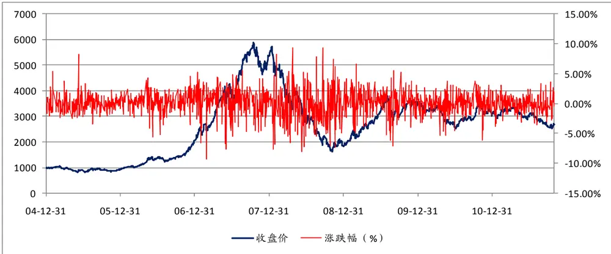
数据来源：Wind资讯、广发证券发展研究中心

图2：沪深300指数波动分布

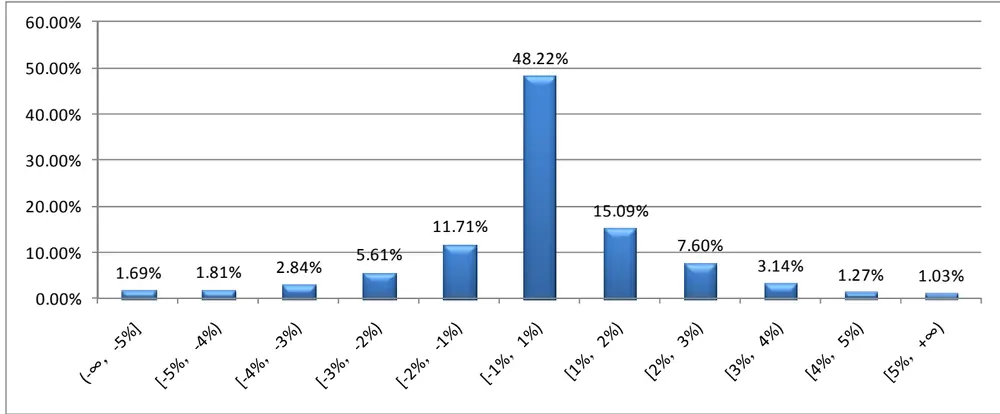
数据来源：Wind资讯、广发证券发展研究中心

## （二）抓取波动:日内极值策略

既然策略收益源自市场波动，那么如何抓住波动博取收益呢？我们的回答是利用基于日内波动极值的趋势跟随策略来跟随波动。根据我们长期看盘的经验和体会，随着市场的单边趋势运行，价格波动极值会逐步被突破，而这种突破又是上下两个方向均可的，如果价格向上突破极值点，那么我们认为随后的价格波动继续向上的可能是偏大的，同理如果价格向下突破极值点，那么我们认为随后的价格波动继续向下的可能会偏大，从而形成趋势跟随策略。

那么，如何来定义和计算价格波动极值呢？我认为可以基于日内的价格运行计算，具体来讲，日内某个时点的极值就是自当日开盘以来截止至当前时点，市场创出的最高值或者最低值，前者称为日内极高值，后者称为日内极低值。

我们来看几个实际的走势图，图3是沪深300指数期货当月合约在2010年4月19日的5分钟走势图，我们发现随着价格的不断下跌，日内极值低（图中红色线）被不断突破，卖空信号不断出现（图中标记蓝色向下箭头的位置）。

图3：沪深300指数期货当月合约2010年04月19日5分钟走势

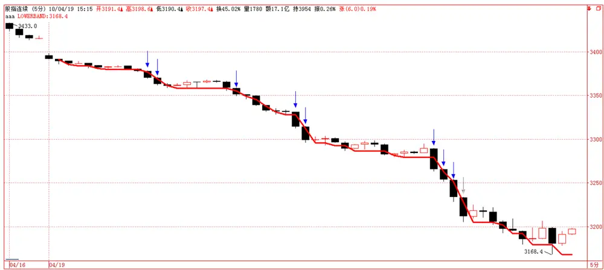
数据来源：广发证券发展研究中心

图4是当月合约在2011年10月11日的5分钟走势图，当日市场大幅高开近3%，随后一路下行，不断创出日内新低，日内极低值（图中红色线）不断被向下突破，卖空信号不断发出（图中标记蓝色向下箭头的位置）。

图4：沪深300指数期货当月合约2011年10月11日5分钟走势
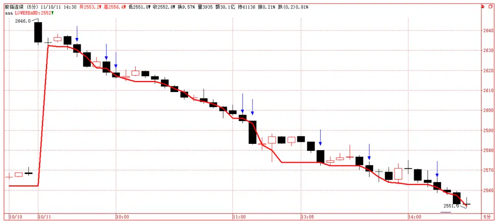
数据来源：广发证券发展研究中心

图5是当月合约在2010年9月30日至2010年10月8日两个交易日的5分钟走势图，两个交易日市场都是单边上行，大幅拉升，我们注意到日内极高值（图中黑色线）不断被向上突破，买入信号不断发出（图中标记红色向上箭头的位置）。

图5：沪深300指数期货当月合约2010.9.30、2010.10.8之5分钟走势

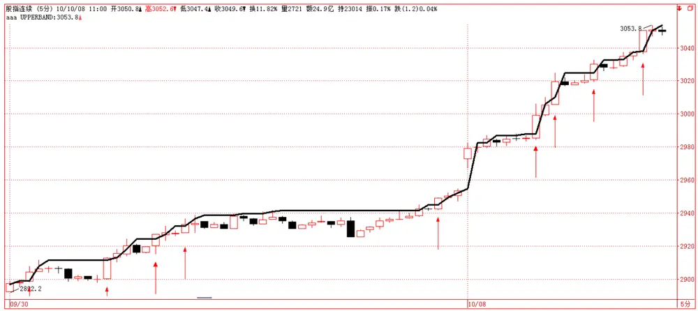
数据来源：广发证券发展研究中心

图6是最近刚刚发生的案例，是股指期货当月合约在2011年11月2日的5分钟走势图，当日市场受希腊公投事件的影响大幅低开，不少投资者多翻空，但是市场仅仅做了一个低开动作，午后开始拉升，全天收于最高点，我们注意到日内极高值（图中黑色线）不断被向上突破，买入信号不断发出（图中标记红色向上箭头的位置）。

图6：沪深300指数期货当月合约2011年11月02日5分钟走势
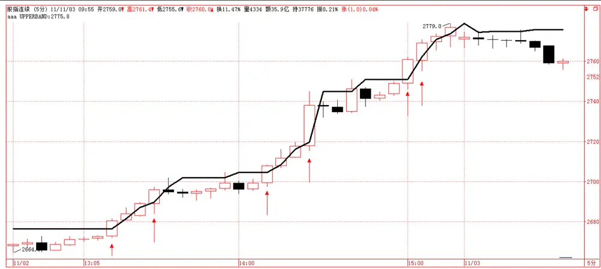
数据来源：广发证券发展研究中心

从以上四个案例不难发现，日内波动极值策略确实能够抓住市场的大幅波动，随着波动的开始和延续，日内波动极值被不断向上突破或者向下突破，买入信号或者卖空信号不断发出，此时进场跟随市场波动是上上策，也就是在正确的时点做出了正确的事情。

## 二、日内波动极值策略模型

## （一）模型的数学定义与信号触发

记 $c_{1},c_{2},\cdots,c_{n}$ 为股指期货日内某一频率下 K线的收盘价序列， $h_{1},h_{2},\cdots,h_{n}$ 为股指期货日内某一频率下 K线的最高价序列， $l_{1},l_{2},\cdots,l_{n}$ 为股指期货日内某一频率下 K线的最低价序列， $sL$ 为日内波动极值偏移周期数，定义

$$
vH_{i}=\max_{1\leq j\leq\max(i-sL,1)}\left(h_{j}\right),\quad i=1,2,\cdots,n.
$$

$$
vL_{i}=\min_{1\leq j\leq\max(i-sL,1)}\left(l_{j}\right),\quad i=1,2,\cdots,n
$$

其中 $\nu H_{i}$ 、 $\nu L_{i}$ 为第i根 K线处的日内波动极高值和日内波动极低值。

由于我们的买卖信号都是价格向上或向下穿越日内波动极值而触发的，当i值太小的时候， $\nu H_{i}$ $\nu L_{i}$ 缺乏稳定性，且某种程度上丧失了价格波动极值的本质，因此我们截去i小于某一个阀值的信号计算，从直观意义上理解，即为在日内交易中开盘后某一段时间内不触发信号，当开盘交易数据量达到一定程度后开始进行日内极值波动趋势跟随策略。

记cL为截断阀值，则买卖信号按如下规则触发：

$$
S_{i}=\begin{cases}1,&if\quad c_{i}\geq\nu H_{i}\quad and\quad i\geq cL+1\\-1,&if\quad c_{i}\leq\nu L_{i}\quad and\quad i\geq cL+1\\0,&else\end{cases}
$$

其中， $S_{i}$ 表示i时刻的信号，1表示买入信号，-1表示卖出信号，0表示无信号。

上述模型触发之信号会连续同号，比如连续触发买入信号或者连续触发卖出信号，我们对首个信号采取开仓操作，然后依据我们的头寸跟踪策略跟踪头寸，直到平仓离场为止，平仓之后再根据最新的买卖信号进行相应方向的开仓操作。

下面我们来讨论模型参数，上述日内波动极值策略具有两个参数：一是信号截断阀值cL；二是sL为计算日内波动极值点的数据量偏移参数，我们分别来讨论。

（1）信号截断参数cL，如前文所述，我们截掉股指期货交易日开盘后若干个数据不进行信号的触发计算，因为在此时间区间内，波动极值由于数据量不够而缺乏稳定性，因此需要放弃这段时间内的信号，我们在此设置参数值为 15，如果我们选择 5分钟频率来进行趋势跟随，那么截掉15个数据意味着开盘后前75分钟内我们不交易。

（2）偏移参数 $sL$ ，该参数用于计算日内波动极值，按照一般的逻辑思维，截止到当前时点的日内波动极值应该是自开盘以来至当前时刻为止的市场极值点，但是在此定义下的买卖信号将很难发出，因为这意味着要求当前时刻收盘价大于等于（触发买入信号）或者小于等于该极值（触发卖出信号），满足这样的条件是非常困难的，也是非常不必要的，为此我们对该极值进行若干周期的偏移，相当于将上述极值向右偏移sL个位置,在此我们将该参数设置为 2。

## （二）日内波动极值策略历史信号

我们利用金字塔软件开发了上述日内波动极值策略的信号指标，如图7所示，图中绿色向下箭头指示卖出信号，红色向上箭头指示买入信号。同时我们给出了最近两次市场大幅波动时模型信号情况，分别是2011年10月11日（如图8）、2011年11月02日（如图9）。

图7：沪深300指数期货当月合约历史5分钟走势及模型信号
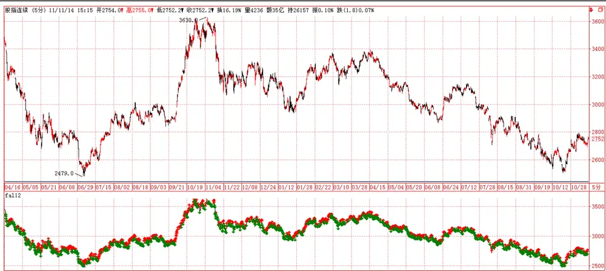
数据来源：广发证券发展研究中心

图8：沪深300指数期货当月合约2011年10月11日5分钟走势及模型信号
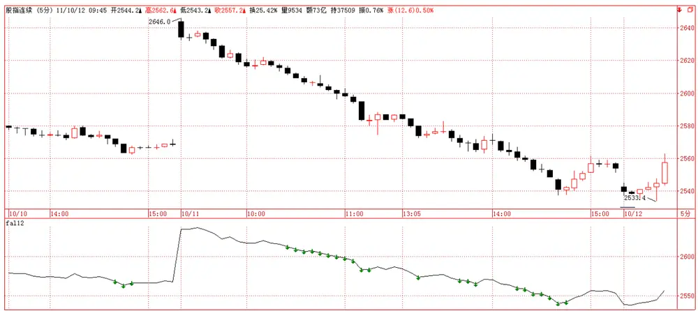
数据来源：广发证券发展研究中心

图9：沪深300指数期货当月合约2011年11月02日5分钟走势及模型信号

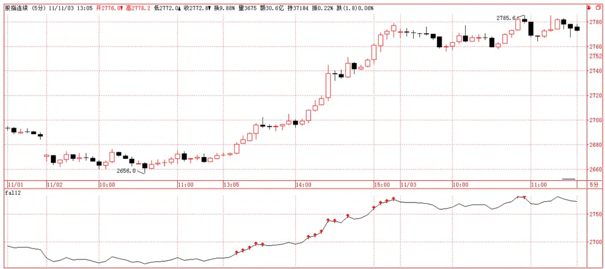
数据来源：广发证券发展研究中心

## 三、日内波动极值策略实证分析

上述模型仅仅回答了何时开仓的问题，至于开仓之后如何跟踪头寸并平仓离场未有作答，在进行实证分析之前，我们首先回答这个问题。

## （一）头寸跟踪策略

在我们2011-08-10的报告《一类波动收敛突变模式的趋势跟随策略》中，业已详细
介绍了投机策略的头寸跟踪方法，主要是借鉴了抛物线系统（SAR）的原理，给定初始
离场价之后由SAR迭代公式动态更新，直至平仓离场，此头寸跟踪策略是我们认为目前
为止最佳的投机头寸跟踪方法，可以广而用之，因此我们在本策略中仍然采用该方法。此处我们仅对该头寸跟踪策略进行结论性介绍，详细细节可参阅前期报告

头寸跟踪策略分为两个部分，一是初始止损位的设定；二是离场价的动态计算跟踪。

（1）初始离场价：设定为信号发生点所在周期的最高价（空头信号）或最低价（多头信号），如此严格离场价设定可以很好的控制策略回撤问题，若单次止损幅度非常大的话，连续若干次失败的信号将导致策略回撤非常大。

（2）离场价位的动态计算：

记 $h_{i}$ ， $l_{i}$ 为i时刻的最高价、最低价， $i=1,2,\cdots,n,\quad j_{0}$ 为开仓时点，给定k时刻的离场价 $\nu C_{k}$ ，则

$$
\nu C_{k+1}=\nu C_{k}+\left(\max_{j_{0}\leq j\leq k}\left(h_{j}\right)-\nu C_{k}\right)\times AF
$$

$$
\nu C_{k+1}=\nu C_{k}-\left(\nu C_{k}-\min_{j_{0}\leq j\leq k}\left(L_{j}\right)\right)\times AF
$$

其中AF 为加速因子，加速因子初始值为0，每当市场创出自开仓以来新高或者新低一次，加速因子增加0.01，且加速因子最大值为0.1。

## （二）实证分析

## （1）数据选取

本文选取沪深300指数期货当月合约5分钟高频数据为策略实证分析数据，时间段为2010年4月16日至2011年12月09日。

## （2）策略评价方法

策略评价指标我们选取如表1，这里需要说明的是，经验来看，趋势投机策略在严格止损的机制下胜率一般很难超过40%，但赔率一般要大于3，这意味着一次操作，它的潜在盈利与潜在亏损的倍数值要超过3，赔率低于3的策略不尽如人意。

表1：交易策略评价体系

| 考察指标 | 说明 |
| --- | --- |
| 累计收益率 | 模拟交易期末累计收益率 |
| 交易总次数 | 总交易次数（自开仓至平仓为一个完整的交易周期） |
| 获胜次数 | 单次交易收益率大于0的次数 |
| 失败次数 | 单次交易收益率小于0的次数 |
| 胜率 | 获胜次数/交易总次数×100% |
| 单次获胜收益率 | 获胜交易的收益率算术平均值 |
| 单次失败亏损率 | 失败交易的收益率算术平均值 |
| 赔率 | 单次获胜平均收益率除以单次失败平均亏损率的绝对值 |
| 最大回撤 | 模拟交易资金自最高点缩水的最大幅度 |
| 最大连胜次数 | 最大连续收益率大于0的交易次数 |
| 最大连亏次数 | 最大连续收益率小于0的交易次数 |

数据来源：广发证券发展研究中心

## （3）模拟交易情景

记 $F_{1}$ 为开仓成交价， $F_{2}$ 为平仓成交价，c为单边手续费率，I 为单边冲击成本，M为杠杆倍数，则单次交易收益率为

$$
r_{long}=\left[\frac{(F_2-I)\times(1-c)-(F_1+I)\times(1+c)}{(F_1+I)\times(1+c)}\right]\times M
$$

$$
r_{short}=\left[\frac{(F_1-I)\times(1-c)-(F_2+I)\times(1+c)}{(F_1-I)\times(1+c)}\right]\times M
$$

此处模拟交易相关设定为：

手续 费：万分之一；

冲击成本：0.4个指数点；

杠杆倍数：1；

开仓价格: OpenPrice1，信号发生后第 1根 K线开盘价；

OpenPrice2， 信号发生后第 1 根 K 线的（成交金额÷成交手数÷300）；

OpenPrice3，信号发生后第 1根K线的（最高价+最低价+开盘价+收盘价）÷4；

平仓价格: ClosePrice1, 离场价被触及时的离场价；

ClosePrice2, 离场价被触及后第 1 根 K 线的开盘价；

ClosePrice3, 离场价被触及后第 1根 K线的（成交金额÷成交手数÷300）；

ClosePrice4, 离场价被触及后第 1根 K线（最高价+最低价+开盘价+收盘价）÷4；

根据上述开仓、平仓成交价假设设计如下几种不同组合的模拟交易情景,如表 2。

表 2：开平仓成交价假设情景

| 情景代号 | 开仓成交价格 | 平仓成交价格 |
| --- | --- | --- |
| 情景A | OpenPrice1 | ClosePrice1 |
| 情景B | OpenPricel | ClosePrice2 |
| 情景C | OpenPrice2 | ClosePrice3 |
| 情景D | OpenPrice3 | ClosePrice4 |

数据来源：广发证券发展研究中心

## （4）实证结果

在给定了偏移参数sL为2，信号截断参数cL为15的假设下，进行模拟交易，模拟交易情景为A，实证结果如下表3，在总共403个交易日中，总共完成了488个完整交易，其中获胜次数（收益率大于0）为140次，胜率为28.69%，单次获胜平均收益率为1.13%，单次失败平均亏损率为-0.33%，赔率为3.44，期末累计收益率为52.07%。

持仓周期方面，从图14来看，持仓周期在0.1天（27分钟）以内的交易次数为231次，占比为43.5%，持仓周期在0.5天（135分钟）以内的交易次数为457次，占比为86%，持仓周期超过1天的交易次数有7次，占比为1.3%。

表3：日内波动极值之趋势跟随策略情景A交易结果

| 考察指标 | 结果 | 考察指标 | 结果 |
| --- | --- | --- | --- |
| 累计收益率 | 52.07% | 单次失败平均亏损率 | -0.33% |
| 交易总次数 | 488 | 赔率 | 3.44 |
| 获胜次数 | 140 | 最大回撤 | -6.19% |
| 失败次数 | 348 | 最大连胜次数 | 7 |
| 胜率 | 28.69% | 最大连亏次数 | 14 |
| 单次获胜平均收益率 | 1.13% |  |  |

数据来源：广发证券发展研究中心

图10：日内波动极值之趋势跟随策略情景A交易资金曲线

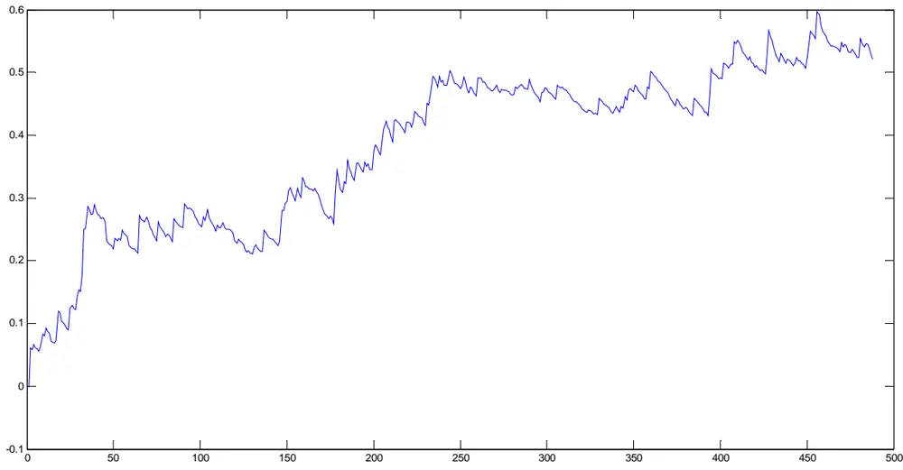
数据来源：广发证券发展研究中心

图11：日内波动极值之趋势跟随策略情景A交易资金曲线
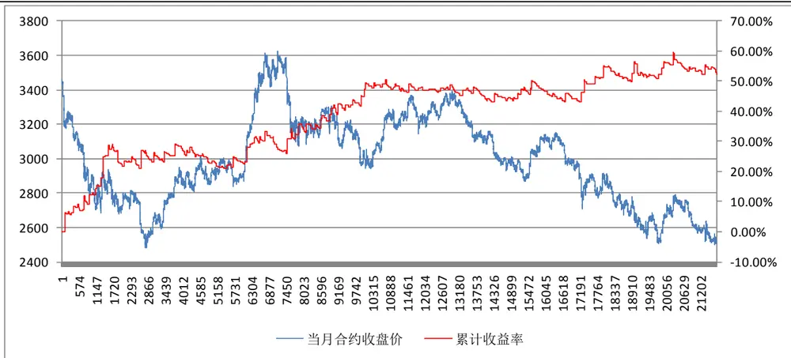
数据来源：广发证券发展研究中心

图12：日内波动极值之趋势跟随策略情景A最大回撤曲线

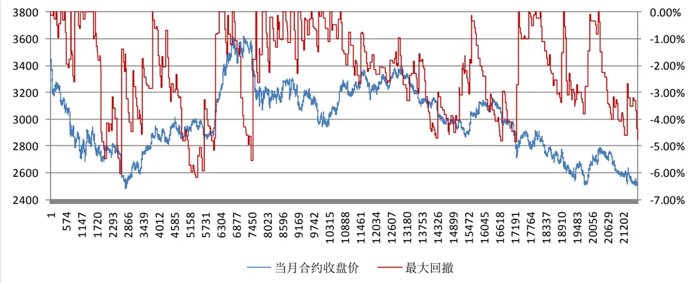
数据来源：广发证券发展研究中心

图13：日内波动极值之趋势跟随策略情景A连胜次数与连败次数
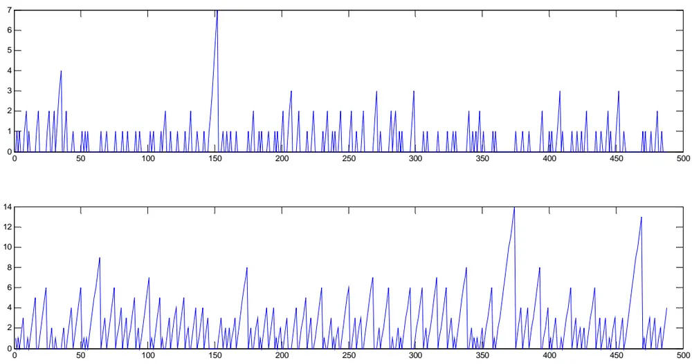
数据来源：广发证券发展研究中心

图14：日内波动极值之趋势跟随策略情景A交易持仓天数分布

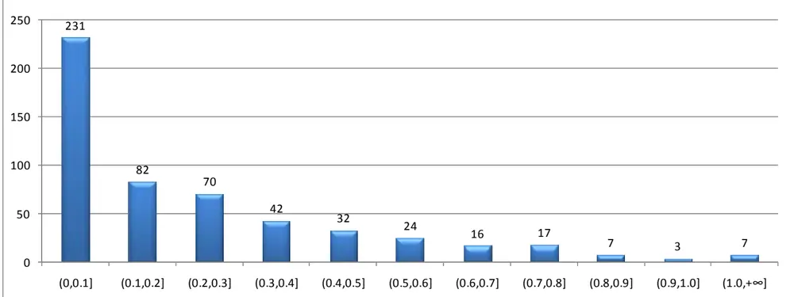

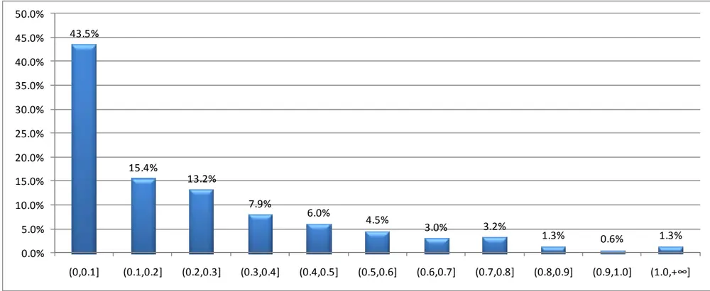
数据来源：广发证券发展研究中心

## （4）不同模拟交易情景下的交易结果

上述的模拟交易结果是在情景A的环境下完成的，对交易通道、交易速度等要求较高，市场容量有限，因此我们进一步讨论在更为宽松的环境下的交易结果。

表4：日内波动极值之趋势跟随策略不同情景下的交易结果对比

| 考察指标 | 情景 A | 情景B | 情景 C | 情景D |
| --- | --- | --- | --- | --- |
| 累计收益率 | 52.07% | 37.18% | 26.43% | 29.10% |
| 交易总次数 | 488 | 485 | 485 | 485 |
| 获胜次数 | 140 | 146 | 152 | 148 |
| 失败次数 | 348 | 339 | 333 | 337 |
| 胜率 | 28.69% | 30.10% | 31.34% | 30.5% |
| 单次获胜平均收益率 | 1.13% | 1.08% | 0.98% | 1.01% |
| 单次失败平均亏损率 | -0.33% | -0.36% | -0.37% | -0.36% |
| 赔率 | 3.44 | 2.96 | 2.64 | 2.79 |

识别风险，发现价值

| 最大回撤 | -6.19% | -10.54% | -9.22% | -9.18% |
| --- | --- | --- | --- | --- |
| 最大连胜次数 | 7 | 8 | 3 | 3 |
| 最大连亏次数 | 14 | 20 | 14 | 14 |

数据来源：广发证券发展研究中心

图15：日内波动极值之趋势跟随策略不同情景下的交易结果对比
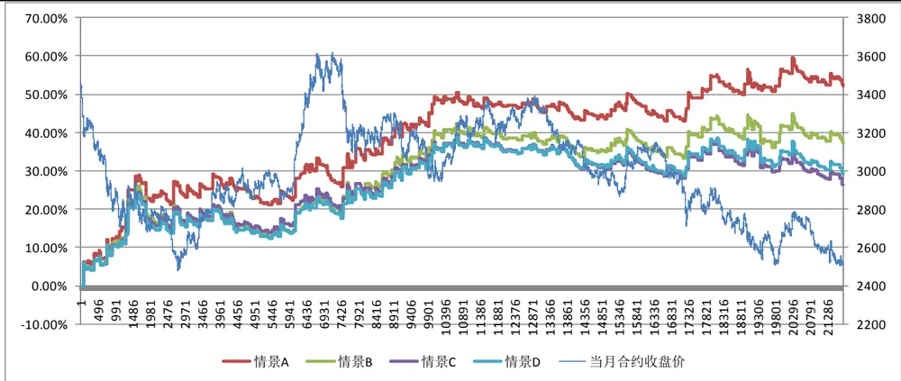
数据来源：广发证券发展研究中心

## （5）策略收益参数稳定性

日内波动极值策略有两个参数，分别是信号截断参数cL、偏移参数sL，上述实证分析参数分别设置为15、2，下面改变参数来观察期末收益率的变化,从下图来看，偏移参数在2至6之间时，策略收益率最高，且收益率随着截断阀值的提升有很大的提高，策略实证分析之默认参数并非最优参数。

图16：日内波动极值之趋势跟随策略参数稳定性

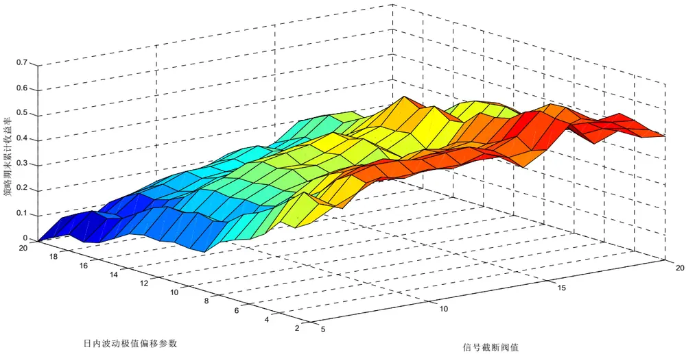
数据来源：广发证券发展研究中心

## 四、组合拳之双策略分析

## （一）收敛突变模型策略实证更新

前期我们的报告《一类波动收敛突变模式的趋势跟随策略》推出后获得了一定的认同，机构投资者对该策略表现了非常浓厚的兴趣，并对未来策略的表现比较关心，这也是我们非常关注和需要持续跟踪的，这里我们首先跟踪更新收敛突变模型的实证分析，有关该策略的详细内容可参阅前期报告。

图17：收敛突变模型策略不同情景下的交易结果对比更新

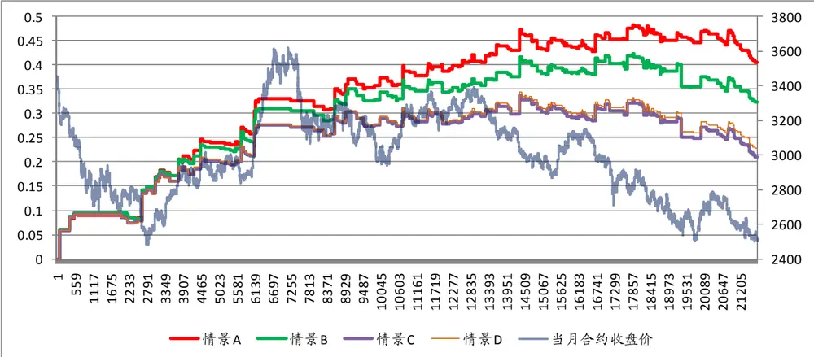
数据来源：广发证券发展研究中心

图18：收敛突变模型策略不同情景下自2011年初以来的交易结果
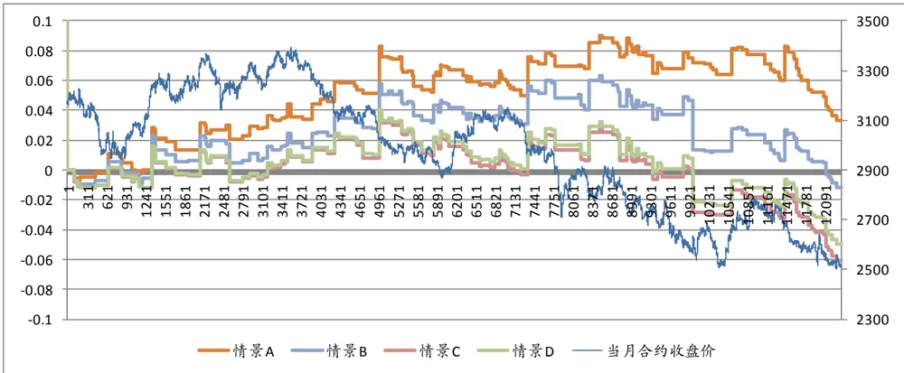
数据来源：广发证券发展研究中心

## （二）收敛突变、日内波动极值双策略效果

我们认为一个再好的交易策略，也存在特定的生命周期，资金管理人需要不断开发新的交易策略，以保持资金的稳定增长，同时单策略下的收益波动较大，稳定性较差，这也是非常正常的，因为不可能找到一个非常完美的策略，能够适应任何市场的任何环境，因此我们需要构建多策略组合，来保持资金的持续稳定增长。

下面我们讨论收敛突变模型、日内波动极值模型双策略下的资金收益曲线，在策略资金分配上，我们采取等分法，两个策略分配相同比例的资金进行投机交易，采取等分法的原因是我们对两个策略的未来表现孰优孰劣无法预知，根据信息熵的最大化原则，我们不带偏好的等分资金。

图19是双策略在不同模拟交易情景下的资金曲线，图20是单、双策略在情景A下的交易结果，同时由表5的结果来看，双策略在资金增长的稳定性方面要优一些，日内波动极值策略、收敛突变模型策略及双策略下夏普比率分别为2.93、2.65、2.85，日内波动极值策略夏普比率比较高。

图19：双策略不同模拟交易环境下历史收益率曲线
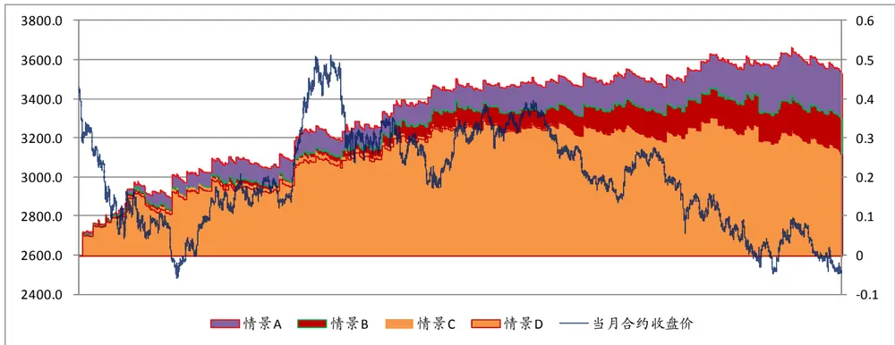
数据来源：广发证券发展研究中心

图20：情景A模拟交易环境下的单、双策略下历史收益率曲线
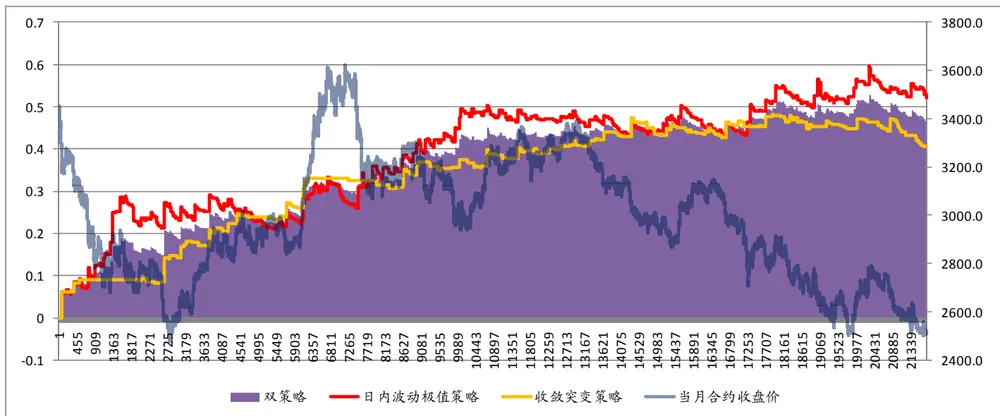
数据来源：广发证券发展研究中心

表 5：情景 A模拟交易环境下的单策略与双策略收益风险对比

|  | 均值 | 标准差 | 夏普比率 |
| --- | --- | --- | --- |
| 日内波动极值策略 | 38.56% | 13.15% | 2.93 |
| 收敛突变策略 | 33.70% | 12.74% | 2.65 |
| 双策略 | 36.13% | 12.68% | 2.85 |

数据来源：广发证券发展研究中心

## 五、总结

（1）市场的大幅波动是策略收益和亏损的源动力，任何时候投机人都对市场的大幅波动表现出浓厚的兴趣，无论这种波动是向上的还是向下的，因为投机人只有溶于波动的市场中才有机会博取高额收益，平静无奇的市场只能是一潭死水，若市场波动很小，更极端一点，在一条近乎直线走势的市场中，无论何种策略、无论采用何种模型，都是无法赚钱的，神仙亦乏术。

（2）如何抓住波动：日内波动极值策略首先我们来定义日内价格波动极值，选取某一信号观察频率周期（如5分钟K线），日内某个时点的波动极值就是自当日开盘以来截至当前时点，市场创出的最高值或者最低值，前者称为日内波动极高值，后者称为日内波动极低值，当价格向上穿越日内波动极高值时发出买入信号，当价格向下穿越极低值时发出卖出信号。

（3）日内波动极值策略有两个参数，分别是信号截断阀值、偏移参数，实证分析中默认为10、2，改变参数来观察期末收益率的变化，偏移参数在2至6之间时，策略收益率最高，且收益率随着截断阀值的提升有很大的提高，策略实证分析之默认参数并非最优参数。

（4）收敛突变模型最新实证结果收益率为40.50%（自2010-04-16至2011-12-09），今年以来收益率为3.32%，资金曲线保持持续增长。

依据信息熵最大化原则，我们不带偏好的等比例分配资金至收敛突变、日内波动极值两个策略上，双策略、收敛突变、日内波动极值三个策略的模拟交易夏普比率分别为2.93、2.65、2.85，日内波动极值策略的收益更为稳定。

## 广发金融工程研究小组

罗军，首席分析师，金融工程组组长，华南理工大学理学硕士，2010、2011 年新财富最佳分析师评选入围，2009 年进入广发证券发展研究中心。

胡海涛，分析师，华南理工大学理学硕士，2010、2011年新财富最佳分析师评选入围（团队），2010年进入广发证券发展研究中心。安宁宁，研究助理，暨南大学数量经济学硕士，2011 年新财富最佳分析师评选入围（团队），2011 年进入广发证券发展研究中心，电话：0755-23948352，eMail：ann@gf.com.cn。

蓝昭钦，研究助理，中山大学数学硕士，2010、2011年新财富最佳分析师评选入围（团队），2010年进入广发证券发展研究中心。李明，研究助理，伦敦城市大学卡斯商学院计量金融硕士，2010、2011 年新财富最佳分析师评选入围（团队），2010 年进入广发证券发展研究中心。

史庆盛，研究助理，华南理工大学金融工程硕士，2011年新财富最佳分析师评选入围（团队），2011年进入广发证券发展研究中心。
谢琳，研究助理，上海交通大学金融学博士，2011年新财富最佳分析师评选入围（团队），2011年进入广发证券发展研究中心。

| 相关研究报告 |  |  |
| --- | --- | --- |
| 掀开资金管理的神秘面纱：既有策略下财富增长之最优路径 | 安宁宁 | 2011-10-25 |
| 基于自适应网络模糊推理系统的择时研究：拨开云雾见月明 | 安宁宁 | 2011-09-06 |
| 一类波动收敛突变模式的趋势跟随策略 | 安宁宁 | 2011-08-10 |

|  | 广州市 | 深圳市 | 北京市 | 上海市 |
| --- | --- | --- | --- | --- |
| 地址 | 广州市天河北路183号 大都会广场5楼 | 深圳市福田区民田路178 | 北京市西城区月坛北街2号上海市浦东南路528号 |  |
| 邮政编码 | 510075 | 号华融大厦9楼 518026 | 月坛大厦18层 100045 | 上海证券大厦北塔17楼 200120 |
| 客服邮箱 | gfyf@gf.com.cn |  |  |  |
| 服务热线 | 020-87555888-8612 |  |  |  |

## 免责声明

广发证券股份有限公司具备证券投资咨询业务资格。本报告只发送给广发证券重点客户，不对外公开发布。

本报告所载资料的来源及观点的出处皆被广发证券股份有限公司认为可靠，但广发证券不对其准确性或完整性做出任何保证。报告内容仅供参考，报告中的信息或所表达观点不构成所涉证券买卖的出价或询价。广发证券不对因使用本报告的内容而引致的损失承担任何责任，除非法律法规有明确规定。客户不应以本报告取代其独立判断或仅根据本报告做出决策。

广发证券可发出其它与本报告所载信息不一致及有不同结论的报告。本报告反映研究人员的不同观点、见解及分析方法，并不代表广发证券或其附属机构的立场。报告所载资料、意见及推测仅反映研究人员于发出本报告当日的判断，可随时更改且不予通告。

本报告旨在发送给广发证券的特定客户及其它专业人士。未经广发证券事先书面许可，任何机构或个人不得以任何形式翻版、复制、刊登、转载和引用，否则由此造成的一切不良后果及法律责任由私自翻版、复制、刊登、转载和引用者承担。