# 基于缠中说禅之分型通道趋势交易系统

# ——另类交易策略研究之五

安宁宁 资深分析师

电话：0755-23948352

eMail：ann@gf.com.cn

执业编号：S0260512020003

## 何谓缠中说禅

缠中说禅其人自2006年2月1日于新浪开博撰写财经、时事、文学、音乐以及股票投资方面的文章，受到了业内人士的广泛关注，博客访问量超过了八千万次，受关注程度可见一斑，其股票投资经验因而必存可借鉴之处。缠中说禅之股票投资方法论包含在其发表的108篇《教你炒股票》系列博文中，理论框架包括分型、笔、线段、中枢、走势类型、中枢的延伸与扩展、中枢震荡、走势必完美、三类买卖点、背驰与盘整背驰等等，内容丰富，于本文仅就其分型理论进行研讨并形成一套完整的趋势交易系统。

## 缠论之分型顶底及其市场意义

连续三根 K线，中间者之高点为三者之最高点，中间者低点亦为三者之最高点即为顶分型形态；反之，连续三根K线，中间者之高点为三者之最低点，中间者低点亦为三者之最低点即为底分型形态。顶分型中间者之高点与底分型中间者之低点有着极为重要的市场意义，因为顶底分型形态的形成必然存在着市场买方分力与卖方分力的三次较量，经过一而再、再而三、三而竭的过程才最终形成。

## 分型通道趋势交易模型

利用分型顶底形态的高低点构建趋势通道，首先定义 vH、vL，其 T时刻的取值分别为最近一个已形成的顶分型的高点、最近一个已形成的底分型的低点，然后再取以 nL为样本窗口宽度的滚动最高值和滚动最低值为通道的上轨和下轨，并且当市场收盘价向上穿越上轨时发出开仓买多信号，当市场价格向下穿越下轨时发出开仓卖空信号，至于何时平仓方面，仍然采用我们前期发布的收敛突变、日内波动极值策略中的平仓策略。

## 实证效果

我们分别在股指期货、PTA、沪铜、橡胶四个品种上进行了实证分析，策略效果较为接近，1倍杠杆下，四个品种的累计收益率分别为 48.17%、65.91%、80.82%、68.80%，折合年化收益率分别为 26.05%、21.93%、26.55%、22.60%；回撤方面，股指期货为-7.33%，后三个商品期货品种的最大回撤均在 10%以上；胜率上，基本在 20%左右，属于趋势策略中胜率不高的策略，且股指期货的胜率相对稍高；而赔率方面，四个品种下的实证赔率均在 5倍左右，属于趋势策略中赔率较高的策略，且股指期货的赔率相对较低。最后，鉴于策略在股指期货上的回撤较小因素，我们建议在不增加冲击成本的条件下，尽量将策略资金配置到股指期货品种上。

## 一、缠中说禅及其分型理论

## （一）缠中说禅

首先需要解释的是，“缠中说禅”是一个网名，作者于2006年2月1日在新浪开立博客，撰写财经、时事、文学、音乐以及股票投资方面的文章，并及时分享其股票投资实战操作中的判断、体会与心得，赢得了越来越多的人的关注。

根据对作者过往博文的追述整理，我们确实可以看到其人在整个2006、2007年的大牛市中坚定不移的看多并做多，在530时点上义无反顾的看多，并大量换仓中字头股票，在6100点之前的数周内发出赶顶的判断并在上证指数达到6124的当日发表博文《6100点终破，无憾矣！》，在次日发表博文《确实存在全面泡沫化的潜在风险》提示股票之泡沫风险。正是这些博文言论吸引了大量的业余及专业投资者对其博文的深入研究交流，并形成了以其网名为命名的民间研究论坛，其影响力可见一斑，同时需要指出的是，作者之所以受到广泛关注不仅与其2007年牛市顶部的准确判断有关，更与其丰富的实战操作经验有关，据坊间传闻，作者或与当年亿安科技股票操作者有某种联系。

鉴于缠中说禅的广泛影响力，我们认为其股票投资经验必有可学习借鉴之处，因此追述整理博文并将我们的点点学习体会形成策略来与大家分享。缠中说禅其人关于股票投资方法论方面的文章总共108篇，称为《教你炒股票》系列，这部分博文也是读者最为关注的，网络上大量原文及学习笔记的转载足令其影响力可见一斑。

虽然缠中说禅关于股票投资方法论方面的文章仅有108篇，但其关于市场的及时点评以及时政经济方面的博文则数量庞大，再加上其对网友提问方面的解答则更是不计其数，我们整理其所有关于财经、股票等方面的博文、评论及答疑，形成了1499页的文档，读者可来信索取。

缠中说禅之理论框架包括分型、笔、线段、中枢、走势类型等部分，当然还包括中枢的延伸与扩展、中枢震荡、走势必完美、三类买卖点、背驰与盘整背驰等等理论部分，缠中说禅之理论内容丰富，逻辑完美，我们在这里并非对其理论进行逐个综述，而是对其中的某个点进行学习整理并延伸形成一套独立的交易系统，具体来讲就是对其理论的分型部分进行研讨。

## （二）缠论之分型理论

缠中说禅之分型形态包括分型顶和分型底，形态如图1所示，三根连续的K线，第2根K线的高点是三根K线高点的最高者，低点亦是三根K线低点的最高者，那么这三根K线的组成形态即为顶分型；三根连续的K线，第2根K线的低点是三根K线低点的最低者，高点亦是三根K线高点的最低者，那么这三根K线的组成形态称为底分型。

图1：缠中说禅之分型顶分型底
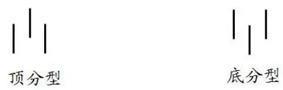

数据来源：广发证券发展研究中心

上述关于分型形态的描述是比较简单直观的，但是其背后的市场投资者的心理过程却是较为复杂的，是经过一系列的买卖行为反应的投资心理的变动路径，正如缠中说禅本人所讲到的，走势反映的是人的贪嗔痴疑慢，如果能通过走势当下的呈现，观照其中参与者之心理呈现，那么就可以说看穿了市场参与者的内心，投资者的内心变化不是虚无缥缈的，最终必然在市场走势中留下痕迹，这也就是市场走势本身，那些具有自相似的结构正好就是窥测市场心理的科学仪器。

对于顶分型而言，其之所以成立或者称为出现必然是卖方的分力战胜了买方的分力，这里分力的意义在于将市场买卖之合力拆分为卖方分力与买方分力而言的，对应在过程上买方有三次的努力，而卖方的分力也有三次的阻击。连续三根K线组成的顶分型，第1根K线的高点出现在被卖方分力阻击后，出现回落，这个回落要么出现在第一根K线的上影线部分或者第二根K线的下影线部分；而第二根K线，出现了一个比第一根K线高点更高的高点，那么这个高点的出现一定是在更高频级别上出现了买方分力的后力不济，或者称为买方分力的顶背驰，从而出现了回落；最后在第三根K线的位置上，买方会再次发起反击，但这次的攻击是被卖方分力完全打败，从而不能形成更高的高点。对于底分型的形态，其背后的市场分力的斗争与决断过程类似，由此可见，一个市场分型结构的出现，都是经过一个一而再、再而三的反复买方、卖方相互较量的过程的，三而竭之时就形成了最后的分型形态。

如图2所示，是沪深300指数期货当月合约在2012年2月16日至2012年2月17日的5分钟K线图上的分型顶、分型底，其中绿色哭脸比较的是分型顶，红色笑脸标记的分型底，由于分型形态的形成过程反应了市场买方分力与卖方分力相互博弈的心理路径，其过程或痕迹必然反应在这样一组形态上，因而分型顶底的高点和低点必然具有极为重要的市场意义，因此相对于其它市场行情数据应该更应该受到我们的重视，或许基于这些关键顶底点，能够构架出一套有效的量化交易系统或策略。

图2：沪深300指数期货5分钟K线图上的分型顶、分型底
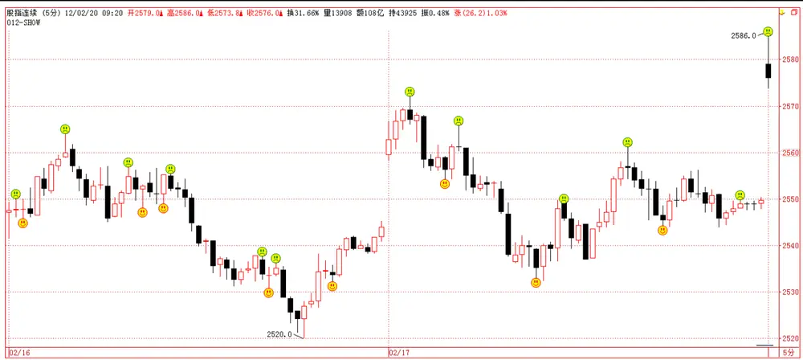
数据来源：广发证券发展研究中心

图3：沪深300指数期货当月合约震荡行情中的日线分型顶底
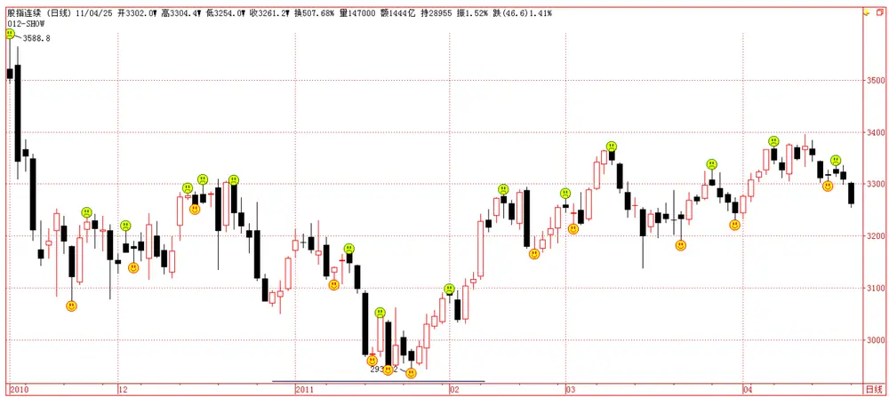
数据来源：广发证券发展研究中心

## 二、分型通道之趋势交易模型

## （一）模型的数学定义与信号触发

记 $c_{1},c_{2},\cdots,c_{n}$ 为某一品种日内某一频率下 K线的收盘价序列， $h_{1},h_{2},\cdots,h_{n}$ 为某一品种日内某一频率下 K线的最高价序列， $l_{1},l_{2},\cdots,l_{n}$ 为日内某一频率下 K线的最低价序列，nL为分型通道计算窗口长度，定义

$$
\nu f_{i}=1,\quad 当\quad h_{i}>h_{i+1},\quad h_{i}>h_{i-1},\quad l_{i}>l_{i+1},\quad l_{i}>l_{i-1},\quad i=1,2,\cdots,n
$$

$$
yf_{i}=-1,\quad 当h_{i}<h_{i+1},\quad h_{i}<h_{i-1},\quad l_{i}<l_{i+1},\quad l_{i}<l_{i-1},\quad i=1,2,\cdots,n
$$

其中 $\nu f_{i}$ 为第i根K线处的分型顶底标记，为1时代表分型顶，为-1时代表分型底。

如前节所述，分型顶与分型底是市场卖方分力与买方分力相互较量后的结果，双方心理路程反应在形态走势上，分型顶的最高点与分型底的最低点具有极为重要的市场意义，我们通过这些更具市场意义的数据点来构架走势通道。

$$
vH_{i}=\left\{\begin{aligned}vH_{i-1},\quad&\text{ if }\quad vf_{i-2}\neq1\\h_{i-2},\quad&\text{ if }\quad vf_{i-2}=1\end{aligned}\right.,i=1,2,\cdots,n.
$$

$$
vL_{i}=\left\{\begin{aligned}&vL_{i-1},&\text{ if }\quad vf_{i-2}\neq-1\\&l_{i-2},&\text{ if }\quad vf_{i-2}=-1\end{aligned},\quad i=1,2,\cdots,n\right.
$$

其中 $\nu H_{i}$ 、 $\nu L_{i}$ 为分型形态高低点的连续变量，直观意义上来看，当前时刻的 $\nu H_{i}$ 为最近一个顶分型的高点价格，直到出现新的顶分型为止，其后的取值又变为新的顶分型的高点价格，如此一致延续下去。当前时刻的 $\nu L_{i}$ 为最近一个底分型的低点价格，直到出现新的底分型为止，其后的取值又变为新的底分型的低点价格，如此一致延续下去。

给定了这两个变量之后，我们可以进一步定义分型通道了，

$$
vU_{i}=\max_{i-nL+1\leq j\leq i}\left(vH_{j}\right),\quad i=1,2,\cdots,n.
$$

$$
vB_{i}=\min_{i-nL+1\leq j\leq i}\left(vL_{j}\right),\quad i=1,2,\cdots,n
$$

其中， $\nu U_{i}$ $\nu B_{i}$ 分别为分型通道的上通道和下通道，且nL为分型通道计算窗口长度，是我们策略的第一个参数，也是唯一的一个参数，同时将策略默认值设置为 15。

给定了分型通道之后，即可根据如下的规则来触发买卖信号：

$$
S_{_i}=\left\{\begin{aligned}&1,&&\textit{ i f }c_{_i}\geq\nu U_{_i}\\&-1,&&\textit{ i f }c_{_i}\leq\nu B_{_i}\\&0,&&\textit{ e l s e }\end{aligned}\right.
$$

其中， $S_{i}$ 表示i时刻的信号，1表示买入信号，-1表示卖出信号，0表示无信号。上述模型触发之信号会连续同号，比如连续触发买入信号或者连续触发卖出信号，我们对首个信号采取开仓操作，然后依据我们的头寸跟踪策略跟踪头寸，直到平仓离场为止，平仓之后再根据最新的买卖信号进行相应方向的开仓操作。

## （二）分型通道趋势策略历史信号

我们利用金字塔软件开发了上述分型通道趋势策略的信号指标，如图4所示，图中绿色向下箭头指示卖出信号，红色向上箭头指示买入信号。

图4： $浐$ 深300指数期货当月合约历史15分钟走势及策略信号

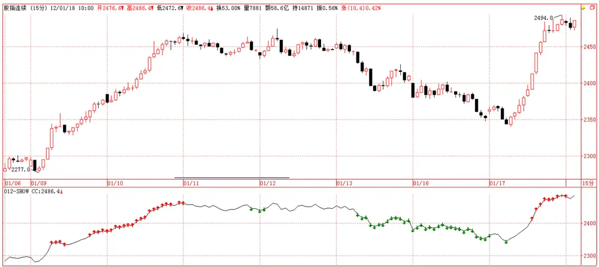
数据来源：广发证券发展研究中心

图5：PTA期货主力合约15分钟走势及策略信号
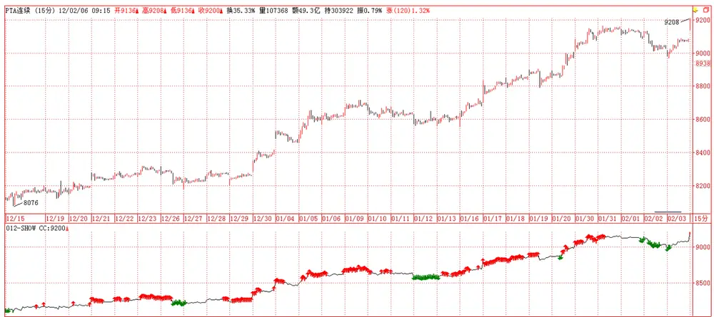
数据来源：广发证券发展研究中心

图6：沪铜主力合约30分钟走势及策略信号

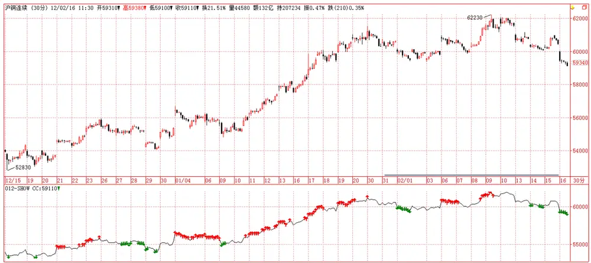
数据来源：广发证券发展研究中心

图7：橡胶主力合约30分钟走势及策略信号
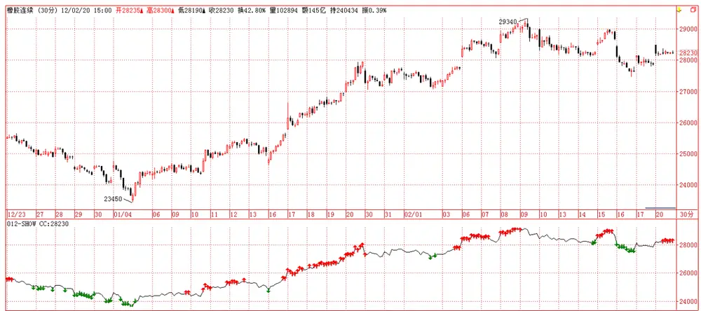
数据来源：广发证券发展研究中心

## 三、分型通道趋势策略实证分析

上述模型仅仅回答了何时开仓的问题，至于开仓之后如何跟踪头寸并平仓离场未有作答，在进行实证分析之前，我们首先回答这个问题。

## （一）头寸跟踪策略

在我们2011-08-10的报告《一类波动收敛突变模式的趋势跟随策略》中，业已详细介绍了投机策略的头寸跟踪方法，主要是借鉴了抛物线系统（SAR）的原理，给定初始离场价之后由SAR迭代公式动态更新，直至平仓离场，此头寸跟踪策略是我们认为目前为止最佳的投机头寸跟踪方法，可以广而用之，因此我们在本策略中仍然采用该方法。此处我们仅对该头寸跟踪策略进行结论性介绍，详细细节可参阅前期报告。

头寸跟踪策略分为两个部分，一是初始止损位的设定；二是离场价的动态计算跟踪。

（1）初始离场价：设定为信号发生点所在周期的最高价（空头信号）或最低价（多头信号），如此严格离场价设定可以很好的控制策略回撤问题，若单次止损幅度非常大的话，连续若干次失败的信号将导致策略回撤非常大。

## （2）离场价位的动态计算：

记 $h_{i}$ ， $l_{i}$ 为i时刻的最高价、最低价， $i=1,2,\cdots,n,\quad j_{0}$ 为开仓时点，给定k时刻的离场价 $\nu C_{k}$ ，则

$$
\nu C_{k+1}=\nu C_{k}+\left(\max_{j_{0}\leq j\leq k}\left(h_{j}\right)-\nu C_{k}\right)\times AF
$$

$$
\nu C_{k+1}=\nu C_{k}-\left(\nu C_{k}-\min_{j_{0}\leq j\leq k}\left(L_{j}\right)\right)\times AF
$$

其中AF 为加速因子，加速因子初始值为0，每当市场创出自开仓以来新高或者新低一次，加速因子增加0.01，且加速因子最大值为0.1。

## （二）实证说明

## （1）数据选取

本文将选取沪深300指数期货、PTA、沪铜、橡胶几个品种进行实证分析，实证周期频率也会综合测试不同情况。

表1：策略实证标的信息汇总

| 股指 | PTA | $户.$ 铜 |  | 橡胶 |
| --- | --- | --- | --- | --- |
| 合约代码 | IF | TA | CU | RU |
| 上市日期 | 2010-04-16 | 2006-12-18 | 1993-03-01 | 1993-11-01 |
| 交易单位 | 300 | 5吨/手 | 5吨/手 | 10吨/手 |
| 涨跌停板 | 10% | 4% | 3% | 3% |
| 最小报价单位 | 0.2 | 2元 | 10元 | 5元 |
| 交易时间 | 上午 9:15-11:30 下午 1:00-3:15 |  | 上午9:00-11:30下午1:30-3:00 |  |
| 交割月份 | 当月、下月、随后两个季月 | 1-12月 | 1-12月 | 1-12月 |
| 最低保证金 | 15% | 6% | 5% | 5% |
| 手续费 | 万分之零点五 | 4元 | 不高于万分之二 | 不高于万分之二 |

数据来源：广发证券发展研究中心

## （2）策略评价方法

策略评价指标我们选取如表2，这里需要说明的是，经验来看，趋势投机策略在严格止损的机制下胜率一般很难超过40%，但赔率一般要大于3，这意味着一次操作，它的潜在盈利与潜在亏损的倍数值要超过3，赔率低于3的策略不尽如人意。

表2：交易策略评价体系

| 考察指标 | 说明 |
| --- | --- |
| 累计收益率 | 模拟交易期末累计收益率 |
| 交易总次数 | 总交易次数（自开仓至平仓为一个完整的交易周期） |
| 获胜次数 | 单次交易收益率大于0的次数 |
| 失败次数 | 单次交易收益率小于0的次数 |
| 胜率 | 获胜次数/交易总次数×100% |
| 单次获胜收益率 | 获胜交易的收益率算术平均值 |
| 单次失败亏损率 | 失败交易的收益率算术平均值 |
| 赔率 | 单次获胜平均收益率除以单次失败平均亏损率的绝对值 |
| 最大回撤 | 模拟交易资金自最高点缩水的最大幅度 |
| 最大连胜次数 | 最大连续收益率大于0的交易次数 |
| 最大连亏次数 | 最大连续收益率小于0的交易次数 |

数据来源：广发证券发展研究中心

## （3）模拟交易情景

记 $F_{1}$ 为开仓成交价， $F_{2}$ 为平仓成交价，c为单边手续费率，I 为单边冲击成本，M为杠杆倍数，则单次交易收益率为

$$
r_{long}=\left[\frac{(F_2-I)\times(1-c)-(F_1+I)\times(1+c)}{(F_1+I)\times(1+c)}\right]\times M
$$

$$
r_{short}=\left[\frac{\left(F_1-I\right)\times(1-c)-(F_2+I)\times(1+c)}{(F_1-I)\times(1+c)}\right]\times M
$$

此处模拟交易相关设定为：

手续 费：万分之零点八；

冲击成本：1或 2个最小报价变动单位；

杠杆倍数：1；

开仓价格: 信号发生后第 1根 K线开盘价；

平仓价格: 离场价被触及时的离场价。

## （三）股指期货实证分析

沪深300指数期货实证周期为15分钟K线，时间段为2010-04-16至2012-02-20，默认参数nL为15，冲击成本为0.4个指数点。我们看到策略总共交易了479次，其中106次获胜，373次失败，胜率为22.13%，期末累计收益率为48.17%，赔率为4.73，最大回撤为-7.33%。

表3：沪深300指数期货策略实证结果

| 考察指标 | 结果 | 考察指标 | 结果 |
| --- | --- | --- | --- |
| 累计收益率 | 48.17% | 单次失败平均亏损率 | -0.33% |
| 交易总次数 | 479 | 赔率 | 4.73 |
| 获胜次数 | 106 | 最大回撤 | -7.33% |
| 失败次数 | 373 | 最大连胜次数 | 3 |
| 胜率 | 22.13% | 最大连亏次数 | 20 |
| 单次获胜平均收益率 | 1.54% |  |  |

数据来源：广发证券发展研究中心

图8：沪深300指数期货策略实证之资金曲线
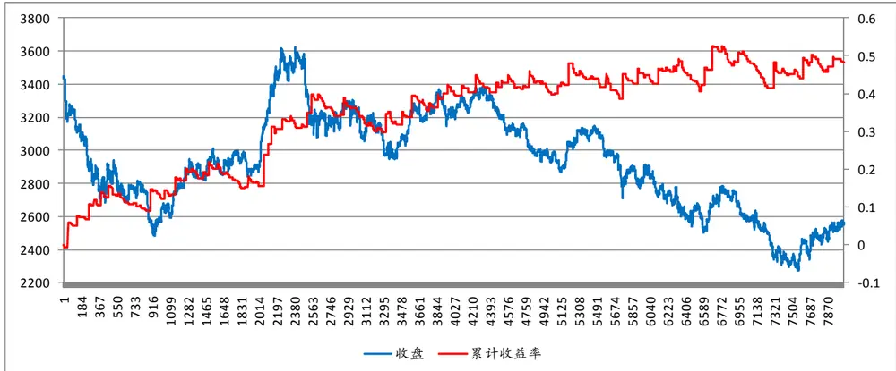
数据来源：广发证券发展研究中心

图9：沪深300指数期货策略实证之最大回撤曲线
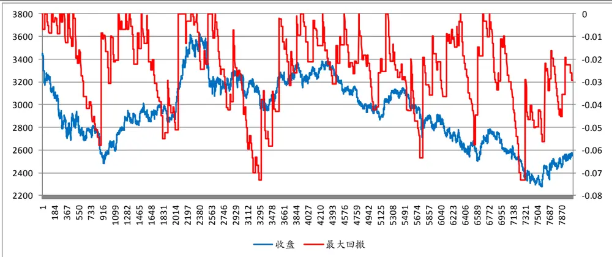
数据来源：广发证券发展研究中心

图10：沪深300指数期货策略实证之连胜次数与连败次数

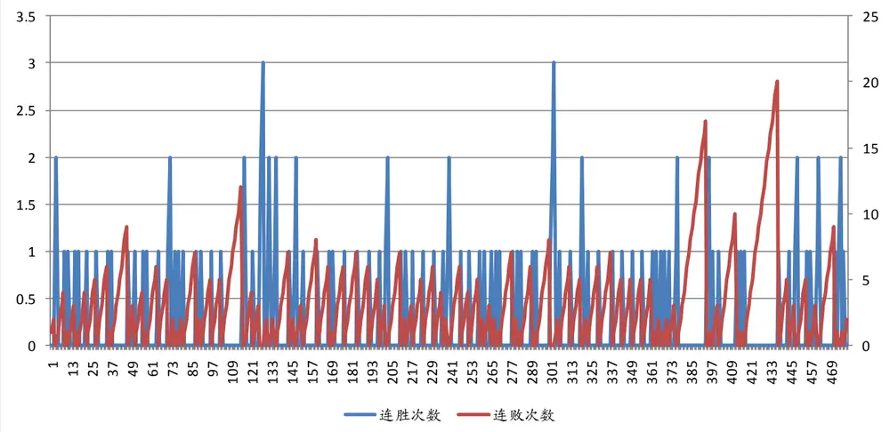
数据来源：广发证券发展研究中心

策略有一个参数，nL，为计算分型通道的数据窗口宽度，默认值为15，我们最后通过改变该策略参数来观察期末收益率的变化，进而检验策略参数的稳健性， 我们可以看到尽管策略在15处达到期末收益率的峰值，但是，在6至20的大范围内策略仍然能够保持40%左右的收益率，因此综合来看，策略对参数是不太依赖的，或者说策略具有参数稳健性。

图11：沪深300指数期货策略实证之参数稳健性分析
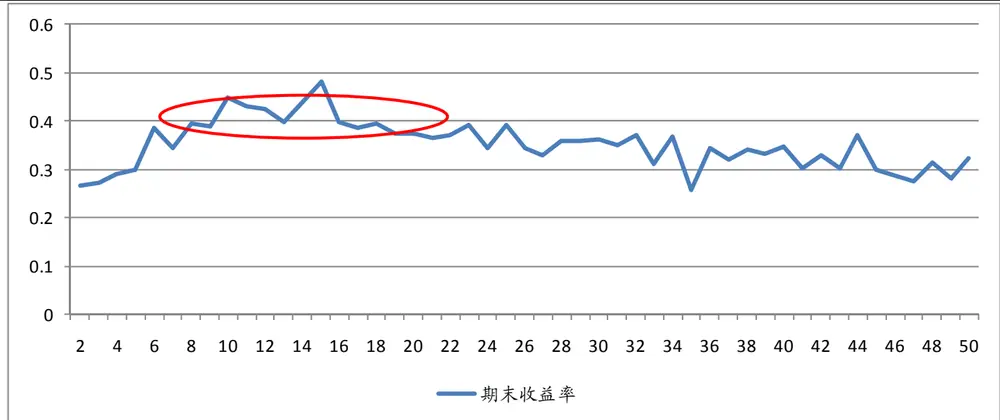
数据来源：广发证券发展研究中心

## （四）PTA期货实证分析

PTA期货实证周期为15分钟K线，时间段为2009-02-18至2012-02-20，默认参数 nL 为

15，冲击成本为2元。我们看到策略总共交易了664次，其中135次获胜，529次失败，胜率为20.33%，期末累计收益率为65.91%，赔率为5.05，最大回撤为-12.98%。

表4：PTA期货策略实证结果

| 考察指标 | 结果 | 考察指标 | 结果 |
| --- | --- | --- | --- |
| 累计收益率 | 65.91% | 单次失败平均亏损率 | -0.37% |
| 交易总次数 | 664 | 赔率 | 5.05 |
| 获胜次数 | 135 | 最大回撤 | -12.98% |
| 失败次数 | 529 | 最大连胜次数 | 4 |
| 胜率 | 20.33% | 最大连亏次数 | 20 |
| 单次获胜平均收益率 | 1.87% |  |  |

数据来源：广发证券发展研究中心

图12：PTA期货策略实证之资金曲线
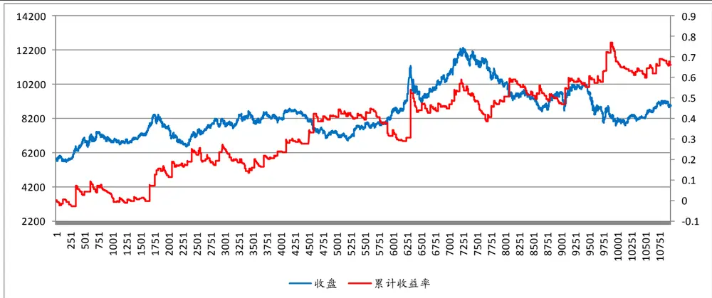
数据来源：广发证券发展研究中心

图13：PTA期货策略实证之最大回撤曲线

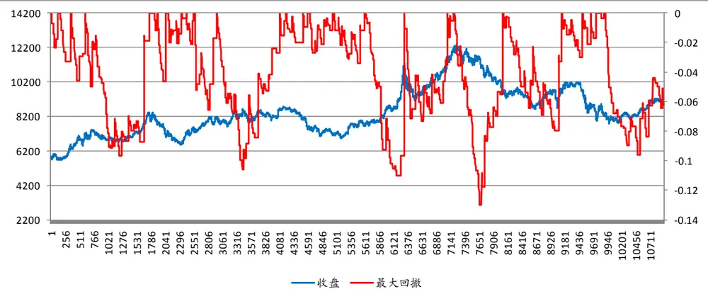
数据来源：广发证券发展研究中心

图14：PTA期货策略实证之连胜次数与连败次数
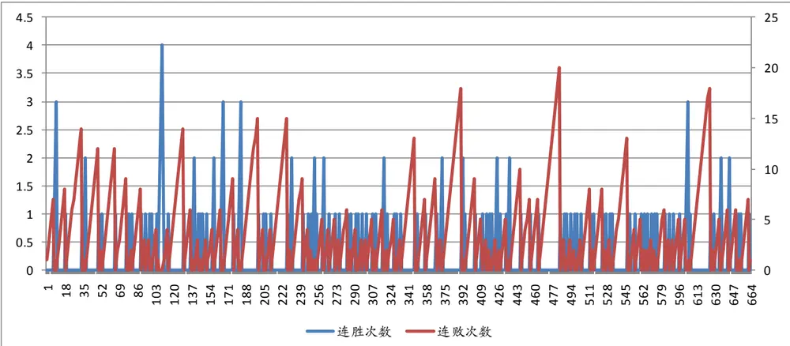
数据来源：广发证券发展研究中心

策略有一个参数，nL，为计算分型通道的数据窗口宽度，默认值为15，我们最后通过改变该策略参数来观察期末收益率的变化，进而检验策略参数的稳健性， 我们可以看到策略在15处并非是收益率最优的结果，在更多得位置上收益率超过了70%，因此综合来看，策略对参数是不太依赖的，或者说策略具有参数稳健性。

图15：PTA期货策略实证之参数稳健性分析

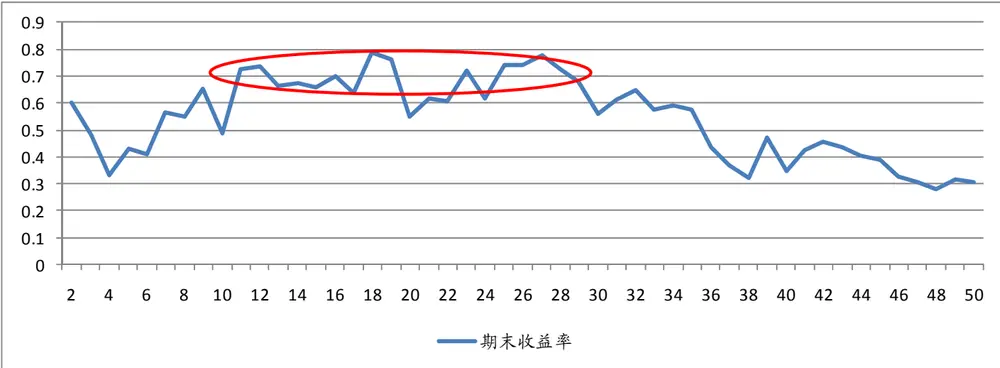
数据来源：广发证券发展研究中心

## （五）沪铜期货实证分析

沪铜期货实证周期为30分钟K线，时间段为2009-02-04至2012-02-20，默认参数 nL为15，冲击成本为10元。我们看到策略总共交易了404次，其中77次获胜，327次失败，胜率为19.06%，期末累计收益率为80.82%，赔率为6.28，最大回撤为-17.45%。

表5：沪铜期货策略实证结果

| 考察指标 | 结果 | 考察指标 | 结果 |
| --- | --- | --- | --- |
| 累计收益率 | 80.82% | 单次失败平均亏损率 | -0.41% |
| 交易总次数 | 404 | 赔率 | 6.28 |
| 获胜次数 | 77 | 最大回撤 | -17.45% |
| 失败次数 | 327 | 最大连胜次数 | 3 |
| 胜率 | 19.06% | 最大连亏次数 | 27 |
| 单次获胜平均收益率 | 2.59% |  |  |

数据来源：广发证券发展研究中心

图16：沪铜期货策略实证之资金曲线

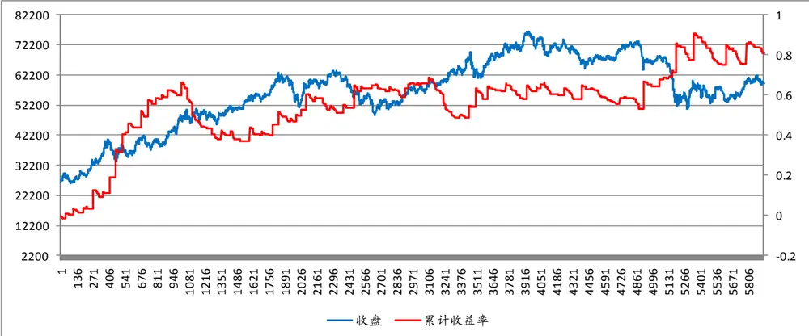
数据来源：广发证券发展研究中心

图17：沪铜期货策略实证之最大回撤曲线
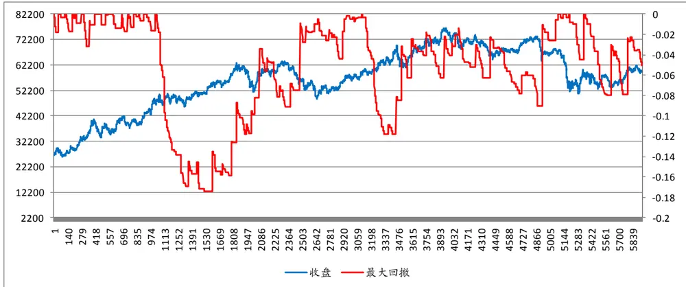
数据来源：广发证券发展研究中心

图18：沪铜期货策略实证之连胜次数与连败次数

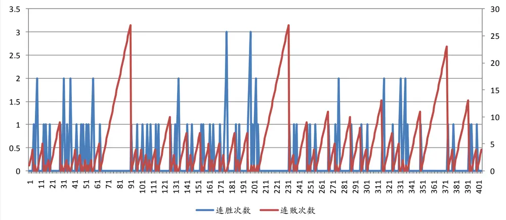
数据来源：广发证券发展研究中心

策略有一个参数，nL，为计算分型通道的数据窗口宽度，默认值为15，我们最后通过改变该策略参数来观察期末收益率的变化，进而检验策略参数的稳健性， 我们可以看到策略在15处达到了策略的最佳效果，因此策略对参数依赖性比较强，不够稳健，但是我们也看到，参数在13至18之间仍然取得了40%以上的收益率，综合来讲，策略的参数稳健性有待进一步改进，效果不是十分理想。

图19：沪铜期货策略实证之参数稳健性分析
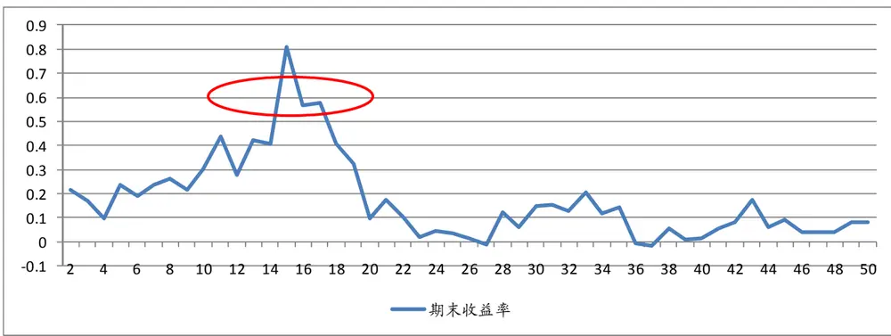
数据来源：广发证券发展研究中心

## （六）橡胶期货实证分析

橡胶期货实证周期为30分钟K线，时间段为2009-02-04至2012-02-20，默认参数 nL为15，冲击成本为1元。我们看到策略总共交易了490次，其中92次获胜，398次失败，胜率为18.78%，期末累计收益率为68.8%，赔率为5.81，最大回撤为-15.07%。

表6：橡胶期货策略实证结果

| 考察指标 | 结果 | 考察指标 | 结果 |
| --- | --- | --- | --- |
| 累计收益率 | 68.8% | 单次失败平均亏损率 | -0.44% |
| 交易总次数 | 490 | 赔率 | 5.81 |
| 获胜次数 | 92 | 最大回撤 | -15.07% |
| 失败次数 | 398 | 最大连胜次数 | 3 |
| 胜率 | 18.78% | 最大连亏次数 | 21 |
| 单次获胜平均收益率 | 2.56% |  |  |

数据来源：广发证券发展研究中心

图20：橡胶期货策略实证之资金曲线
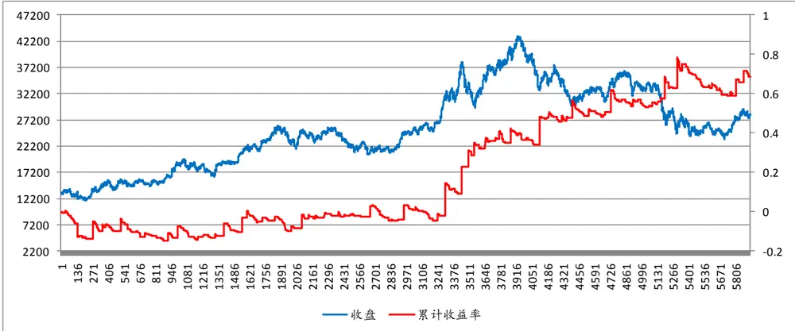
数据来源：广发证券发展研究中心

图21：橡胶期货策略实证之最大回撤曲线
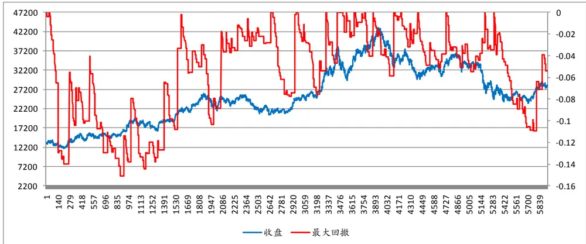
数据来源：广发证券发展研究中心

图22：橡胶期货策略实证之连胜次数与连败次数
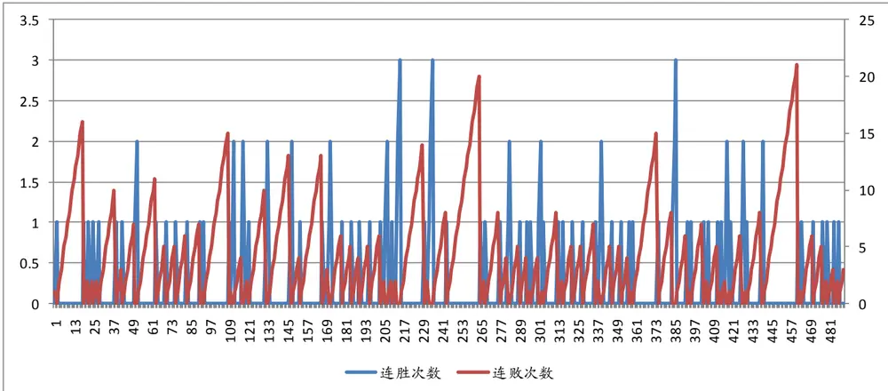
数据来源：广发证券发展研究中心

策略有一个参数，nL，为计算分型通道的数据窗口宽度，默认值为15，我们最后通过改变该策略是来观察期末收益率的变化，进而检验策略参数的稳健性， 我们可以看到策略在15处并非策略的最佳收益，我们看到在6至20的广泛参数可选区间内，策略收益率都达到了70%以上，综合来讲，策略的参数是十分稳健的。

图23：橡胶期货策略实证之参数稳健性分析
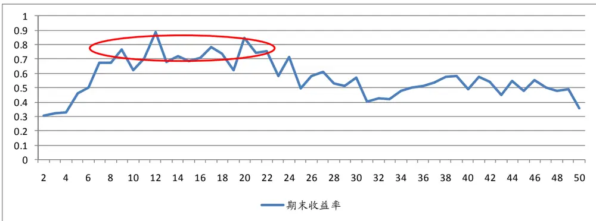
数据来源：广发证券发展研究中心

## （七）实证结果汇总

下表汇总了分型通道趋势策略在股指期货、PTA、沪铜及橡胶期货四个品种上的实证结果，从中可以看到，策略效果较为接近，四个品种的年化收益率均在20%以上，且品种间的收益差距非常之小，从最大回撤角度来看的话，股指期货的最大回撤为7%多一些，而其他三个商品期货品种的实证最大回撤均在10%以上，因此策略在股指期货上的表现较佳，从胜率和赔率角度来看，胜率基本在20%左右，属于趋势策略中实证胜率不高的策略，且股指期货的胜率相对稍高，而赔率方面，四个品种下的实证赔率均在5倍左右，属于趋势策略中赔率较高的策略，且股指期货的实证赔率相对较低，综合两个指标来看，策略在这四个品种上的表现相当。最后，鉴于策略在股指期货上的回撤较小因素，我们建议在不增加冲击成本的条件下，尽量将策略资金配置到股指期货品种上。

表7：策略实证结果汇总

| 指标 | 股指 | PTA | 沪铜 | 橡胶 |
| --- | --- | --- | --- | --- |
| 交易周期 | 15分钟 | 15 分钟 | 30分钟 | 30 分钟 |
| 实证开始 | 2010-04-16 | 2009-02-18 | 2009-02-04 | 2009-02-04 |
| 结束日期 | 2012-02-20 | 2012-02-20 | 2012-02-20 | 2012-02-20 |
| 累计收益率 | 48.17% | 65.91% | 80.82% | 68.80% |
| 年化收益率 | 26.05% | 21.93% | 26.55% | 22.60% |
| 交易总次数 | 479 | 664 | 404 | 490 |
| 获胜次数 | 106 | 135 | 77 | 92 |
| 失败次数 | 373 | 529 | 327 | 398 |
| 胜率 | 22.13% | 20.33% | 19.06% | 18.78% |
| 单次获胜平均收益率 | 1.54% | 1.87% | 2.59% | 2.56% |
| 单次失败平均亏损率 | -0.33% | -0.37% | -0.41% | -0.44% |
| 赔率 | 4.73 | 5.05 | 6.28 | 5.81 |
| 最大回撤 | -7.33% | -12.98% | -17.45% | -15.07% |
| 最大连胜次数 | 3 | 4 | 3 | 3 |
| 最大连亏次数 | 20 | 20 | 27 | 21 |

数据来源：广发证券发展研究中心

## 四、总结

（1）缠中说禅其人自2006年2月1日于新浪开博以来受到了业内人士广泛关注，博客访问量超过了八千万次，受关注程度可见一斑，其股票投资经验亦必然存可借鉴之处。缠中说禅之股票投资方法论包含在其发表的108篇《教你炒股票》系列博文中，理论框架包括分型、笔、线段、中枢、走势类型、中枢的延伸与扩展、中枢震荡、走势必完美、三类买卖点、背驰与盘整背驰等等，内容丰富，于本文仅就其分型理论进行研讨并形成一套完成的趋势交易系统。

（2）连续三根K线，中间者之高点为三者之最高点，中间者低点亦为三者之最高点即为顶分型形态；反之，连续三根K线，中间者之高点为三者之最低点，中间者低点亦为三者之最低点即为底分型形态。顶分型中间者之高点与底分型中间者之点有着极为重要的市场意义，因为顶底分型形态的形成必然存在市场买方分力与卖方分力的三次较量，经过一而再、再而三、三而竭的过程才最终形成。

（3）利用分型顶底形态的高点构建通道，首先定义 $\nu H_{i}$ 、 $\nu L_{t}$ ，当前时刻的取值分

别为最近一个已形成的顶分型的高点、最近一个已形成的底分型的低点，然后在对 $\nu H_{i}$

$\nu L_{i}$ 进行取以nL为样本窗口宽度的滚动最高值和滚动最低值为通道的上轨和下轨，并且

当市场收盘价向上穿越上轨时发出开仓买多信号，当市场价格向下穿越下轨时开仓卖空信号，至于何时平仓方面，仍然采用我们前期发布的收敛突变、日内波动极值策略中的平仓策略。

（4）我们分别在股指期货、PTA、沪铜、橡胶四个品种上进行了实证分析，策略效果较为接近，四个品种的年化收益率均在20%以上；回撤方面，股指期货为-7.33%，三个商品期货品种的最大回撤均在10%以上；胜率上，胜率基本在20%左右，属于趋势策略中实证胜率不高的策略，且股指期货的胜率相对稍高；而赔率方面，四个品种下的实证赔率均在5倍左右，属于趋势策略中赔率较高的策略，且股指期货的实证赔率相对较低。最后，鉴于策略在股指期货上的回撤较小因素，我们建议在不增加冲击成本的条件下，尽量将策略资金配置到股指期货品种上。

## 广发金融工程研究小组

罗军，首席分析师，华南理工大学理学硕士，2010年进入广发证券发展研究中心。

俞文冰，CFA，首席分析师，上海财经大学统计学硕士，2012年进入广发证券发展研究中心。

叶涛，CFA ，资深分析师，上海交通大学管理科学与工程硕士，2012年进入广发证券发展研究中心。

安宁宁，资深分析师，暨南大学数量经济学硕士，2011年进入广发证券发展研究中心。

胡海涛，分析师， 华南理工大学理学硕士， 2010年进入广发证券发展研究中心。

夏潇阳， 分析师， 上海交通大学金融工程硕士， 2012年进入广发证券发展研究中心。

蓝昭钦，分析师， 中山大学理学硕士， 2010年进入广发证券发展研究中心。

李明，分析师，伦敦城市大学卡斯商学院计量金融硕士，2010年进入广发证券发展研究中心。

史庆盛，分析师， 华南理工大学金融工程硕士， 2011年进入广发证券发展研究中心。

汪鑫，分析师， 中国科学技术大学金融工程硕士， 2012年进入广发证券发展研究中心。

谢琳，分析师，上海交通大学金融学博士研究生，2011年进入广发证券发展研究中心。

金融工程组微博地址：http://weibo.com/gfquant

## 相关研究报告

| 基于日内波动极值的股指期货趋势跟随系统 | 安宁宁 | 2011-12-09 |
| --- | --- | --- |
| 掀开资金管理的神秘面纱：既有策略下财富增长之最优路径 | 安宁宁 | 2011-10-25 |
| 一类波动收敛突变模式的趋势跟随策略 | 安宁宁 | 2011-08-10 |

|  | 广州市 | 深圳市 | 北京市 | 上海市 |
| --- | --- | --- | --- | --- |
| 地址 | 广州市天河北路183号 大都会广场5楼 | 深圳市福田区民田路178 号华融大厦9楼 | 北京市西城区月坛北街2号上海市浦东南路528号 |  |
| 邮政编码 | 510075 | 518026 | 月坛大厦18层 100045 | 上海证券大厦北塔17楼 200120 |
| 客服邮箱 | gfyf@gf.com.cn |  |  |  |
| 服务热线 | 020-87555888-8612 |  |  |  |

## 免责声明

广发证券股份有限公司具备证券投资咨询业务资格。本报告只发送给广发证券重点客户，不对外公开发布。

本报告所载资料的来源及观点的出处皆被广发证券股份有限公司认为可靠，但广发证券不对其准确性或完整性做出任何保证。报告内容仅供参考，报告中的信息或所表达观点不构成所涉证券买卖的出价或询价。广发证券不对因使用本报告的内容而引致的损失承担任何责任，除非法律法规有明确规定。客户不应以本报告取代其独立判断或仅根据本报告做出决策。

广发证券可发出其它与本报告所载信息不一致及有不同结论的报告。本报告反映研究人员的不同观点、见解及分析方法，并不代表广发证券或其附属机构的立场。报告所载资料、意见及推测仅反映研究人员于发出本报告当日的判断，可随时更改且不予通告。

本报告旨在发送给广发证券的特定客户及其它专业人士。未经广发证券事先书面许可，任何机构或个人不得以任何形式翻版、复制、刊登、转载和引用，否则由此造成的一切不良后果及法律责任由私自翻版、复制、刊登、转载和引用者承担。