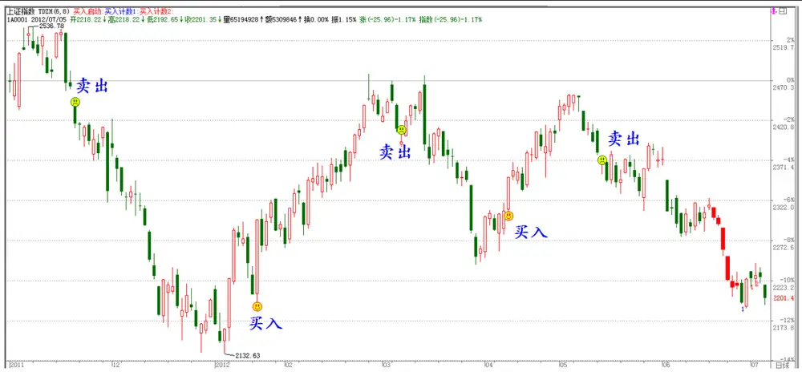
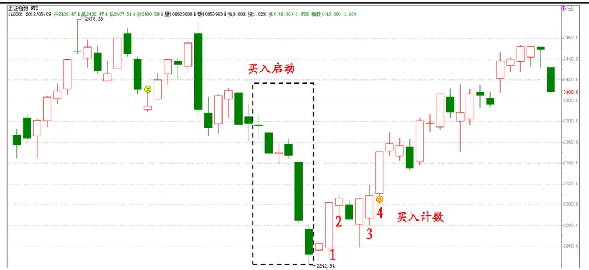
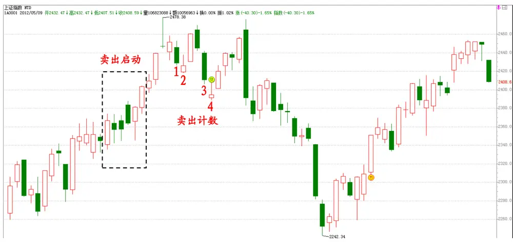
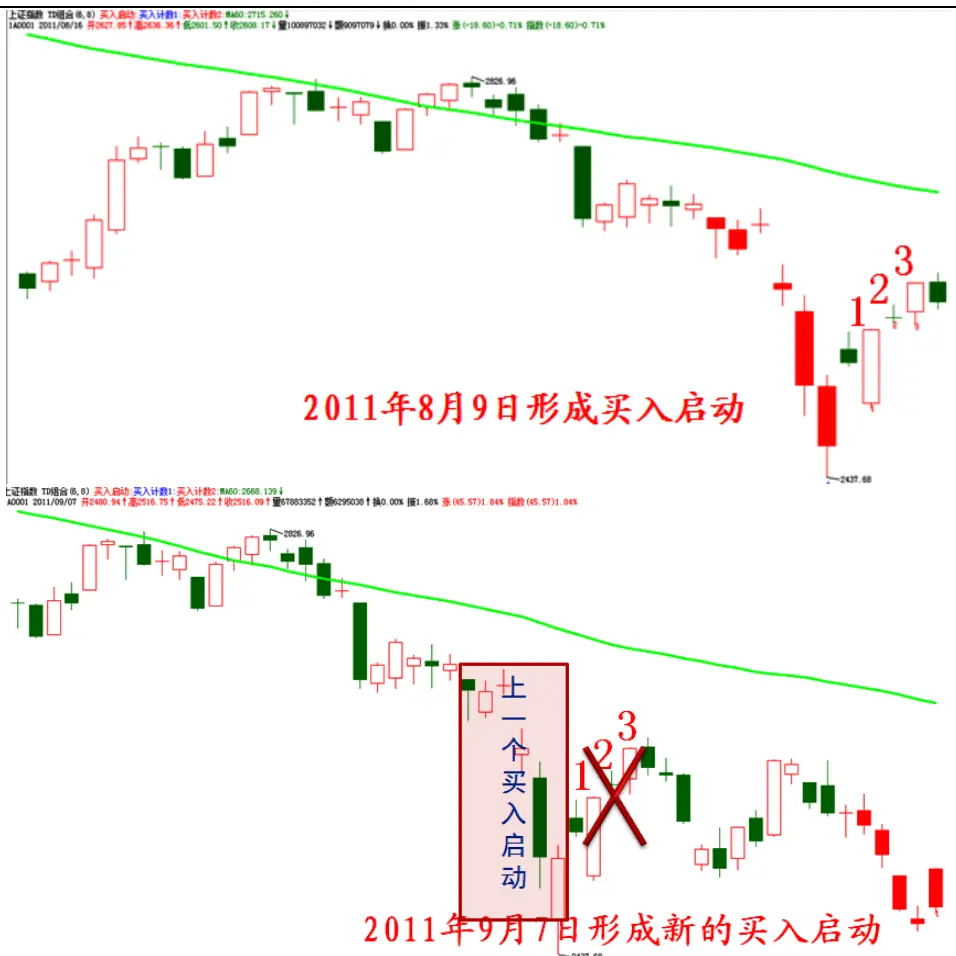
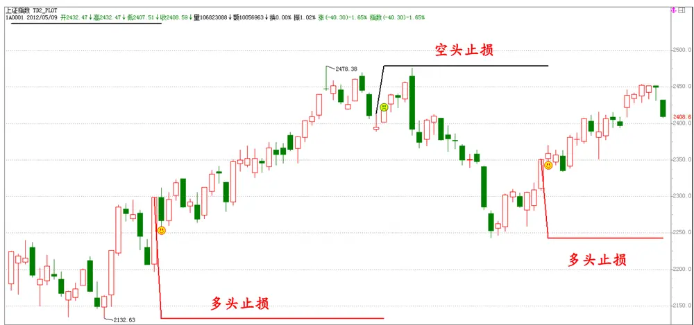
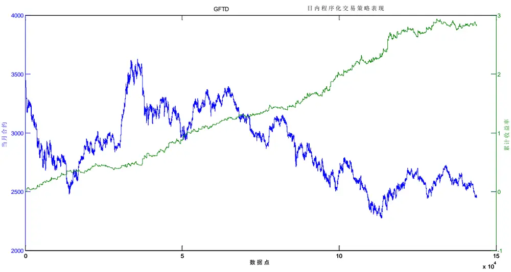
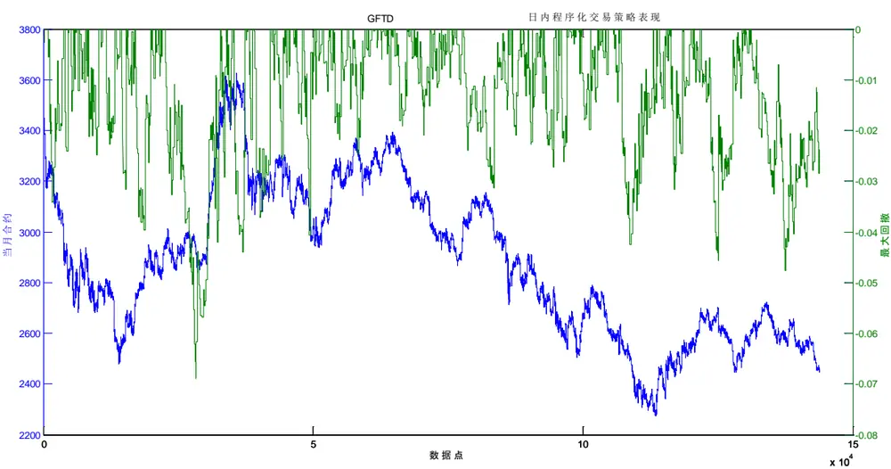
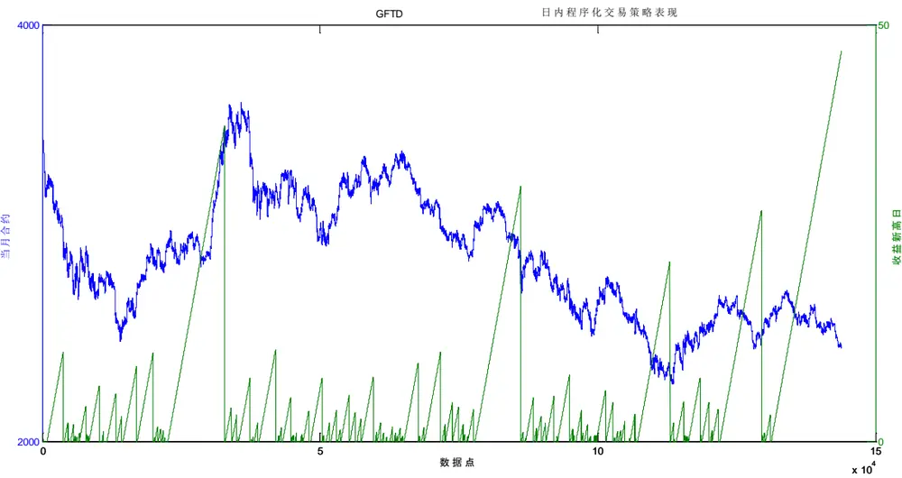
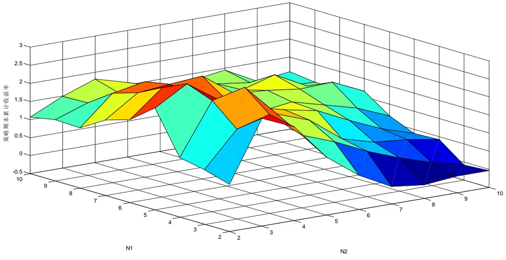
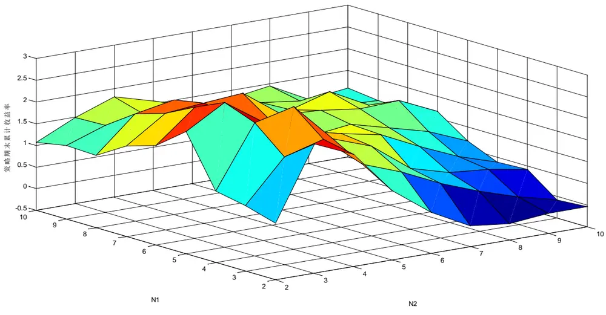

# 基于 GFTD的期指日内程序化交易策略

——另类交易策略系列之六

安宁宁 资深分析师

电话：0755-23948352

eMail：ann@gf.com.cn

执业编号：S0260512020003

## 神奇 TD用于程序化趋势交易策略

自2010年7月15日推出GFTD择时模型以来，受到了市场的广泛关注，在接近2年的样本外期间内，GFTD展现了其神奇的一面，特别是自2011年四季度以来，模型五次信号全部正确，把握了每一个市场波段，彰显了在趋势判断方面的能力。但从全样本来看，模型胜率并非百分之百，因此模型回撤不可避免，而只有将策略模型应用于在更低周期级别（比如1分钟）上才能够控制回撤，鉴于此我们将GFTD应用于股指期货当月合约1分钟周期上，进行日内程序化趋势交易。

## GFTD模型及其止损机制

买入信号的发出需2 个条件：买入启动完成及买入计数达到一定值，何谓买入启动，即连续 $n_{2}$ 个K线，每个K线比 $T_{-n_{1}}$ 根K线的收盘价低，买入启动完成后进入计数阶段，在任意K 线位置上同时满足A 收盘价大于或等于之前第 2根K线最高价；B 最高价大于之前第1根K 线的最高价；C 收盘价大于之前第1个计数的收盘价，三个条件则计数加1，当买入计数为 $n_{3}$ 时发出买入信号，买入信号发出之前若形成新的买入启动则重新开始计数，卖出信号类似之。可见模型有三个参数，分别为 n1、n2、n3。

止损方面，若为买入信号，则止损点为买入信号形成过程中市场形成的最低点，若为卖出信号，则止损点为卖出信号形成过程中市场形成的最高点。

## GFTD日内趋势策略参数

利用股指期货当月合约自2010-4-16至2011-12-31的 1分钟高频数据，以累计收益率最大、累计收益率除以最大回撤倍数最大化为目标，每个目标函数最优化下取10组参数，计数参数均值并四舍五入，收益最大下的参数均值为5、3、6，收益回撤倍数最大化下参数均值为5、3、6，综合来看，我们设定模型参数为5、3、6。

## 实证结果

考虑单边0.4 个指数点，单边万分之零点五的苛刻费用成本下，截止到2012-07-06 的实证结果为：

策略在全样本、2010、2011、2012 年的收益率分别为 284.06%、85.46%、76.69%、17.21%，最大回撤分别为-6.88%、-6.88%、-4.24%、-4.77%。

策略在多头信号方面，全样本、2010、2011、2012 年的收益率分别为 55.99%、26.17%、14.14%、8.32%，最大回撤分别为-6.13%、-6.13%、-4.82%、-3.94%。

策略在空头信号方面，全样本、2010、2011、2012 年的收益率分别为 146.21%、46.99%、54.80%、8.21%，最大回撤分别为-5.78%、-5.78%、-1.97%、-3.50%。

## 一、GFTD模型回顾

## （一）GFTD模型择时效果

GFTD是广发TD的简称，我们在2010年7月15日发表了题为《基于修正TD指标的指数择时研究》的择时报告，系统性的研究了国外著名择时分析体系TD，并针对A股走势特征对其进行改进，形成我们的GFTD模型，旨在对大盘指数进行中期择时。模型推出以来，以其惊人的准确率吸引了大批买方卖方朋友，下图是模型自去年四季度以来的信号情况。

从择时效果来看，对波段的把握能力惊人的准确，因此有必要对该模型进一步推广其应用范围，本文旨在将GFTD用在更短周期级别上，这样做的目的一方面可以大量增加交易信号，大样本测试模型的有效性，另一方面，只有在更短周期级别上来进行择时交易，才能够控制回撤在可接受的范围之内。

图1：GFTD择时模型上证指数自11年四季度以来的信号

数据来源：广发证券发展研究中心

## （二）GFTD模型机制

记 $c_{1},c_{2},\cdots,c_{n}$ 为某一股票日K 线的收盘价序列， $h_{1},h_{2},\cdots,h_{n}$ 为 K线的最高价序列， $l_{1},l_{2},\cdots,l_{n}$ 为K线的最低价序列， $n_{1}$ 为模型买入启动或卖出启动形态形成时的价格比较滞后期数， $n_{2}$ 为模型买入启动或卖出启动形态形成的价格关系单向连续个数，$n_{3}$ 为模型计数阶段的最终信号发出所需的计数值。

$$
ud_{i}=\left\{\begin{array}{ll}{1,\ }&{if\ c_{i}>c_{i-n_{1}}}\\{-1,}&{if\ c_{i}<c_{i-n_{1}}}\\{0,}&{else}\end{array}\right.
$$

其中， $ud_{i}$ 为第i根K线的价格关系比较结果，当收盘价大于 $T-n_{\scriptscriptstyle1}$ 日收盘价时取值为 1，小于 $T-n_{\scriptscriptstyle1}$ 日收盘价时取值为-1，否则为0。

模型信号计算步骤：

（1） 计算 $ud_{i},i=1,2,\cdots,n.$

（2） 对 $ud_{i}$ 进行累加计算，且当其值与上一个值不等时，停止本次累加。

（3） 当 $ud_{i}$ 的累加计算结果为 $n_{2}$ 时为一个卖出启动的形成，当计算结果为 $-n_{2}$ 时为一个买入启动的形成。

（4） 于买入启动形成的随后1根 K 线位置开始买入计数，在某一个K线上同时满足如下三个条件时买入计数累加1，当计数累加至 $n_{3}$ 发出买入信号。A. 收盘价大于或等于之前第2根K线最高价；B. 最高价大于之前第1根 K线的最高价；C. 收盘价大于之前第1个计数的收盘价。

（5） 于卖出启动形成的随后1根K 线位置开始卖出计数，在某一个K线上同时满足如下三个条件时卖出计数累加 1，当计数累加至 $n_{3}$ 发出卖出信号。A. 收盘价小于或等于之前第2根 K线最低价；B. 最低价小于之前第1根K线的最低价；C. 收盘价小于之前第1个计数的收盘价。

（6） 当形成一组新的买入启动时，取消上一组未最终形成买入信号的买入计数。

（7） 当形成一组新的卖出启动时，取消上一组未最终形成卖出信号的卖出计数。

图2：GFTD模型买入信号发出实例

数据来源：广发证券发展研究中心

图3：GFTD模型卖出信号发出实例

数据来源：广发证券发展研究中心

图4：GFTD模型计数取消机制实例

数据来源：广发证券发展研究中心

## （三）GFTD模型策略止损方式

这里首先想提出的一点是，任何一种趋势策略或者择时模型，在洞察其原理之后都可以人为的设计出一组K线走势，使得该策略失效。因而任何时候都有可能出现这种现象，市场走势的多变性，使得策略失效，从而带来灾难性损失，因此一个好的策略必须辅以止损，无论是固定幅度止损还是动态幅度止损。

另外，我们注意到，GFTD模型经常在发出信号之后，市场短期数根K线之内出现与信号反向运行的情况，这是因为买入计数或者卖出计数的条件使得，在计数达到规定的数量之时，市场往往在该单边趋势上运行了比较长的时间和幅度，因此在次日或随后几日出现反向运行的现象也十分自然，结合GFTD模型的这一特点，我们认为采用动态幅度止损方式更为合适。

具体来讲，每次买入或沽空时，止损点位为产生该信号的相应计数的形成周期内的市场最高点或者最低点，若当前是买入信号，买入计数过程中的市场最低点为止损点，若当前是卖出信号，卖出计数的形成过程中的市场最高点为止损点，在市场未触及止损点之前，一直持有头寸，直到出现反向信号或者被迫止损为止。

下图实例清晰的展示了动态幅度止损方式。

图5：GFTD动态幅度止损策略实例

数据来源：广发证券发展研究中心

## 二、GFTD日内程序化交易策略实证分析

## （一）实证说明

（1）数据选取，本实证选取股指期货当月合约自2010年4月16日至2012年7月6日的1分钟K线。

## （2）策略评价方法

策略评价指标我们选取如下表，这里需要说明的是，经验来看，趋势投机策略在严

格止损的机制下胜率一般很难超过40%，但赔率一般要大于3，这意味着一次操作，它的潜在盈利与潜在亏损的倍数值要超过3，赔率低于3的策略不尽如人意。

表1：交易策略评价体系

| 考察指标 | 说明 |
| --- | --- |
| 累计收益率 | 模拟交易期末累计收益率 |
| 交易总次数 | 总交易次数（自开仓至平仓为一个完整的交易周期） |
| 获胜次数 | 单次交易收益率大于0的次数 |
| 失败次数 | 单次交易收益率小于0的次数 |
| 胜率 | 获胜次数/交易总次数×100% |
| 单次获胜收益率 | 获胜交易的收益率算术平均值 |
| 单次失败亏损率 | 失败交易的收益率算术平均值 |
| 赔率 | 单次获胜平均收益率除以单次失败平均亏损率的绝对值 |
| 最大回撤 | 模拟交易资金自最高点缩水的最大幅度 |
| 最大连胜次数 | 最大连续收益率大于0的交易次数 |
| 最大连亏次数 | 最大连续收益率小于0的交易次数 |

数据来源：广发证券发展研究中心

## （3）模拟交易情景

记 $F_{1}$ 为开仓成交价， $F_{2}$ 为平仓成交价，c为单边手续费率，I 为单边冲击成本，M为杠杆倍数，则单次交易收益率为

$$
r_{long}=\left[\frac{\big(F_{2}-I\big)\times\big(1-c\big)-\big(F_{1}+I\big)\times\big(1+c\big)}{\big(F_{1}+I\big)\times\big(1+c\big)}\right]\times M
$$

$$
r_{short}=\left[\frac{\big(F_{\scriptscriptstyle1}-I\big)\times\big(1-c\big)-\big(F_{\scriptscriptstyle2}+I\big)\times\big(1+c\big)}{\big(F_{\scriptscriptstyle1}-I\big)\times\big(1+c\big)}\right]\times M
$$

此处模拟交易相关设定为：

手续 费：万分之零点五；

冲击成本：0.4个指数点；

杠杆倍数：1；

开仓价格: 信号发生后第1根 K线开盘价；

平仓价格: 反向信号发生后随后第1根 K线的开盘价或者止损价。

## （4）日内平仓机制

为了规避持仓隔夜风险，策略设置收盘强制平仓机制，在交易日15点时强制平掉所有头寸

## （二）模型参数优化

在2010年中期发布模型时，GFTD模型参数定为4、6、4，该参数是针对上证指数日线数据进行优化选择的结果，股指期货合约日内1分钟高频数据走势及微观差异性使得该参数并为适用，因此有必要对参数进行进一步优化。

一般来讲，模型优化参数目标函数有多种，其中在程序化趋势交易策略研发中最为常见的是累计收益率最大、累计收益率除以最大回撤倍数最大化，我们将对参数空间遍历寻优，寻找上述两个目标函数最优的参数结果，综合上述结果确定最后的模型参数。

优化参数的历史数据选择为2010年4月16日至2011年12月31日期间内的当月合约1分钟高频数据。

下面两个表分别给出收益最大、收益回撤倍数最大化两个目标下的参数结果，从目标函数最优的前十个参数来看，收益最大目标下的最优参数平均值为5.2、3.2、5.8，四舍五入后为5、3、6。收益回撤倍数最大化目标下参数的均值为5.4、3、6，四舍五入后为5、3、6，综合来看，确定参数为5、3、6。

表 2：收益最大目标下的优化结果

| $N_{1}$ | $N_{2}$ | $N_{3}$ | 累计收益率 |
| --- | --- | --- | --- |
| 2 | 3 | 6 | 235.16% |
| 6 | 3 | 6 | 234.25% |
| 5 | 3 | 6 | 227.68% |
| 4 | 4 | 6 | 223.55% |
| 4 | 3 | 6 | 214.64% |
| 6 | 2 | 5 | 208.98% |
| 3 | 4 | 6 | 202.48% |
| 7 | 5 | 6 | 201.22% |
| 8 | 2 | 5 | 198.80% |
| 7 | 3 | 6 | 197.08% |
| 5.2 | 3.2 | 5.8 | 平均值 |

数据来源：广发证券发展研究中心

表 3：收益回撤倍数最大目标下的优化结果

| $N_{1}$ | $N_{2}$ | $N_{3}$ | 收益回撤倍数 |
| --- | --- | --- | --- |
| 2 | 3 | 6 | 41.7 |
| 6 | 2 | 5 | 36.1 |
| 5 | 2 | 6 | 34.5 |
| 5 | 3 | 6 | 33.1 |
| 8 | 4 | 6 | 32.7 |
| 4 | 3 | 6 | 32.6 |
| 6 | 2 | 6 | 30.9 |
| 6 | 3 | 6 | 30.7 |
| 4 | 4 | 6 | 30.5 |
| 8 | 4 | 7 | 29.7 |
| 5.4 | 3 | 6 | 平均值 |

数据来源：广发证券发展研究中心

## （三）实证结果

考虑单边0.4个指数点，单边万分之零点五的苛刻费用成本下，实证结果为：

策略在全样本、2010、2011、2012年的收益率分别为284.06%、85.46%、76.69%、17.21%，最大回撤分别为-6.88%、-6.88%、-4.24%、-4.77%。

策略在多头信号方面，全样本、2010、2011、2012年的收益率分别为55.99%、26.17%、14.14%、8.32%，最大回撤分别为-6.13%、-6.13%、-4.82%、-3.94%。

策略在空头信号方面，全样本、2010、2011、2012年的收益率分别为146.21%、46.99%、54.80%、8.21%，最大回撤分别为-5.78%、-5.78%、-1.97%、-3.50%。

图6：GFTD日内程序化交易策略表现

数据来源：广发证券发展研究中心

图7：GFTD日内程序化交易策略表现

识别风险，发现价值

数据来源：广发证券发展研究中心

图8：GFTD日内程序化交易策略表现

数据来源：广发证券发展研究中心

表 4：GFTD日内程序化交易策略表现

| 评价指标 | 全样本 | 2010 | 2011 | 2012 |
| --- | --- | --- | --- | --- |
| 累计收益率 | 284.06% | 85.46% | 76.69% | 17.21% |
| 年化收益率 | 132.99% | 122.78% | 78.57% | 37.08% |
| 交易次数 | 1443 | 467 | 625 | 351 |
| 获胜次数 | 588 | 189 | 268 | 131 |
| 失败次数 | 855 | 278 | 357 | 220 |
| 胜率 | 40.75% | 40.47% | 42.88% | 37.32% |
| 单次均收益率 | 0.10% | 0.14% | 0.09% | 0.05% |
| 单次获胜均收益率 | 0.68% | 0.87% | 0.61% | 0.55% |
| 单次失败均收益率 | -0.31% | -0.36% | -0.30% | -0.25% |
| 赔率 | 2.22 | 2.41 | 2.07 | 2.17 |
| 最大回撤 | -6.88% | -6.88% | -4.24% | -4.77% |
| 收益新高最大需日 | 47 | 38 | 31 | 47 |
| 收益新高最大需日中位数 | 3 | 2 | 2 | ∞ |
| 最大连胜次数 | 5 | 5 | 5 | 4 |
| 最大连败次数 | 12 | 12 | 10 | 8 |

数据来源：广发证券发展研究中心

表 5：GFTD 日内程序化交易策略多头信号表现

| 评价指标 | 全样本 | 2010 | 2011 | 2012 |
| --- | --- | --- | --- | --- |
| 累计收益率 | 55.99% | 26.17% | 14.14% | 8.32% |
| 年化收益率 | 26.21% | 37.61% | 14.48% | 17.93% |
| 交易次数 | 674 | 222 | 283 | 169 |
| 获胜次数 | 248 | 86 | 108 | 54 |
| 失败次数 | 426 | 136 | 175 | 115 |
| 胜率 | 36.80% | 38.74% | 38.16% | 31.95% |
| 单次均收益率 | 0.07% | 0.11% | 0.05% | 0.05% |
| 单次获胜均收益率 | 0.70% | 0.82% | 0.61% | 0.69% |
| 单次失败均收益率 | -0.30% | -0.34% | -0.30% | -0.25% |
| 赔率 | 2.34 | 2.39 | 2.05 | 2.75 |
| 最大回撤 | -6.13% | -6.13% | -4.82% | -3.94% |
| 收益新高最大需日 | 47 | 35 | 46 | 47 |
| 收益新高最大需日中位数 | 8 | 4 | 11 | 11 |
| 最大连胜次数 | ∞ | 6 | 8 | 4 |
| 最大连败次数 | 9 | 9 | 8 | 9 |

数据来源：广发证券发展研究中心

表 6：GFTD日内程序化交易策略空头信号表现

| 评价指标 | 全样本 | 2010 | 2011 | 2012 |
| --- | --- | --- | --- | --- |
| 累计收益率 | 146.21% | 46.99% | 54.80% | 8.21% |
| 年化收益率 | 68.45% | 67.51% | 56.15% | 17.68% |
| 交易次数 | 770 | 245 | 342 | 183 |
| 获胜次数 | 340 | 103 | 160 | 77 |
| 失败次数 | 430 | 142 | 182 | 106 |
| 胜率 | 44.16% | 42.04% | 46.78% | 42.08% |
| 单次均收益率 | 0.12% | 0.16% | 0.13% | 0.04% |
| 单次获胜均收益率 | 0.67% | 0.90% | 0.61% | 0.46% |
| 单次失败均收益率 | -0.31% | -0.38% | -0.29% | -0.26% |
| 赔率 | 2.13 | 2.41 | 2.08 | 1.78 |
| 最大回撤 | -5.78% | -5.78% | -1.97% | -3.50% |
| 收益新高最大需日 | 48 | 48 | 25 | 43 |
| 收益新高最大需日中位数 | 4 | 5 | 2 | 8 |
| 最大连胜次数 | 6 | 6 | 5 | 4 |
| 最大连败次数 | 9 | 9 | 6 | 9 |

数据来源：广发证券发展研究中心

## （四）参数稳定性

策略总共三个参数，由第二小节的分析可以看到，第3个参数N3在两个优化目标下，

最好的参数组合中均为6不变，这说明策略本身第三个参数为6的适应用性最强，因此在本节的测试中，我们选择固定N3，改变前两个参数来看期末收益率的变动情况，以此来测试参数的稳定性。

固定N3分别为5、6、7三种情况下的结果见如下三个图。

图9：N3=5时不同参数下策略期末收益率

数据来源：广发证券发展研究中心

图10：N3=6时不同参数下策略期末收益率

数据来源：广发证券发展研究中心

图11：N3=7时不同参数下策略期末收益率

数据来源：广发证券发展研究中心

## 三、总结

（1）自2010年7月15日推出GFTD择时模型以来，受到了市场的广泛关注，在接近2年的样本外期间内，GFTD展现了其神奇的一面，特别是自2011年四季度以来，模型五次信号全部正确，把握了每一个市场波段，彰显了在趋势判断方面的能力。但从全样本来看，模型胜率并非百分之百，因此模型回撤不可避免，而只有将策略模型应用于在更低周期级别（比如1分钟）上才能够控制回撤，鉴于此我们将GFTD应用于股指期货当月合约1分钟周期上，进行日内程序化趋势交易。

（2）买入信号的发出需2个条件：买入启动完成及买入计数达到一定值，何谓买入启动，即连续n2个K线，每个K线比T-n1根K线的收盘价低，买入启动完成后进入计数阶段，在任意K线位置上同时满足A收盘价大于或等于之前第2根K线最高价；B最高价大于之前第1根K线的最高价；C收盘价大于之前第1个计数的收盘价，三个条件则计数加1，当买入计数为n3时发出买入信号，买入信号发出之前若形成新的买入启动则重新开始计数，卖出信号类似之。可见模型有三个参数，分别为n1、n2、n3。

止损方面，若为买入信号，则止损点为买入信号形成过程中市场形成的最低点，若为卖出信号，则止损点为卖出信号形成过程中市场形成的最高点。

（3）利用股指期货当月合约自2010-4-16至2011-12-31的1分钟高频数据，以累计收益率最大、累计收益率除以最大回撤倍数最大化为目标，每个目标函数最优化下取10组参数，计数参数均值并四舍五入，收益最大下的参数均值为5、3、6，收益回撤倍数最大化下参数均值为5、3、6，综合来看，我们设定模型参数为5、3、6。

（4）考虑单边0.4个指数点，单边万分之零点五的苛刻费用成本下，实证结果为：策略在全样本、2010、2011、2012年的收益率分别为284.06%、85.46%、76.69%、17.21%，最大回撤分别为-6.88%、-6.88%、-4.24%、-4.77%。

策略在多头信号方面，全样本、2010、2011、2012年的收益率分别为55.99%、26.17%、14.14%、8.32%，最大回撤分别为-6.13%、-6.13%、-4.82%、-3.94%。

策略在空头信号方面，全样本、2010、2011、2012年的收益率分别为146.21%、46.99%、54.80%、8.21%，最大回撤分别为-5.78%、-5.78%、-1.97%、-3.50%。

## 广发金融工程研究小组

罗军，首席分析师，华南理工大学理学硕士，2010年进入广发证券发展研究中心。

俞文冰，CFA，首席分析师，上海财经大学统计学硕士，2012年进入广发证券发展研究中心。

叶涛，CFA ，资深分析师，上海交通大学管理科学与工程硕士，2012年进入广发证券发展研究中心。

安宁宁，资深分析师，暨南大学数量经济学硕士，2011年进入广发证券发展研究中心。

胡海涛，分析师， 华南理工大学理学硕士， 2010年进入广发证券发展研究中心。

夏潇阳， 分析师， 上海交通大学金融工程硕士， 2012年进入广发证券发展研究中心。

蓝昭钦，分析师， 中山大学理学硕士， 2010年进入广发证券发展研究中心。

李明，分析师，伦敦城市大学卡斯商学院计量金融硕士，2010年进入广发证券发展研究中心。

史庆盛，分析师， 华南理工大学金融工程硕士， 2011年进入广发证券发展研究中心。

汪鑫，分析师， 中国科学技术大学金融工程硕士， 2012年进入广发证券发展研究中心。

张超，分析师，中山大学理学硕士，2012年进入广发证券发展研究中心。

## 金融工程组微博地址：http://weibo.com/gfquant

| 相关研究报告 |  |  |
| --- | --- | --- |
| 基于缠中说禅之分型通道趋势交易系统 | 安宁宁 | 2012-03-14 |
| 基于日内波动极值的股指期货趋势跟随系统 | 安宁宁 | 2011-12-09 |
| 一类波动收敛突变模式的趋势跟随策略 | 安宁宁 | 2011-08-10 |

|  | 广州市 | 深圳市 | 北京市 | 上海市 |
| --- | --- | --- | --- | --- |
| 地址 | 广州市天河北路183号 大都会广场5楼 | 深圳市福田区民田路178 号华融大厦9楼 | 北京市西城区月坛北街2号上海市浦东南路528号 |  |
| 邮政编码 | 510075 | 518026 | 月坛大厦18层 100045 | 上海证券大厦北塔17楼 200120 |
| 客服邮箱 | gfyf@gf.com.cn |  |  |  |
| 服务热线 | 020-87555888-8612 |  |  |  |

## 免责声明

广发证券股份有限公司具备证券投资咨询业务资格。本报告只发送给广发证券重点客户，不对外公开发布。

本报告所载资料的来源及观点的出处皆被广发证券股份有限公司认为可靠，但广发证券不对其准确性或完整性做出任何保证。报告内容仅供参考，报告中的信息或所表达观点不构成所涉证券买卖的出价或询价。广发证券不对因使用本报告的内容而引致的损失承担任何责任，除非法律法规有明确规定。客户不应以本报告取代其独立判断或仅根据本报告做出决策。

广发证券可发出其它与本报告所载信息不一致及有不同结论的报告。本报告反映研究人员的不同观点、见解及分析方法，并不代表广发证券或其附属机构的立场。报告所载资料、意见及推测仅反映研究人员于发出本报告当日的判断，可随时更改且不予通告。

本报告旨在发送给广发证券的特定客户及其它专业人士。未经广发证券事先书面许可，任何机构或个人不得以任何形式翻版、复制、刊登、转载和引用，否则由此造成的一切不良后果及法律责任由私自翻版、复制、刊登、转载和引用者承担。