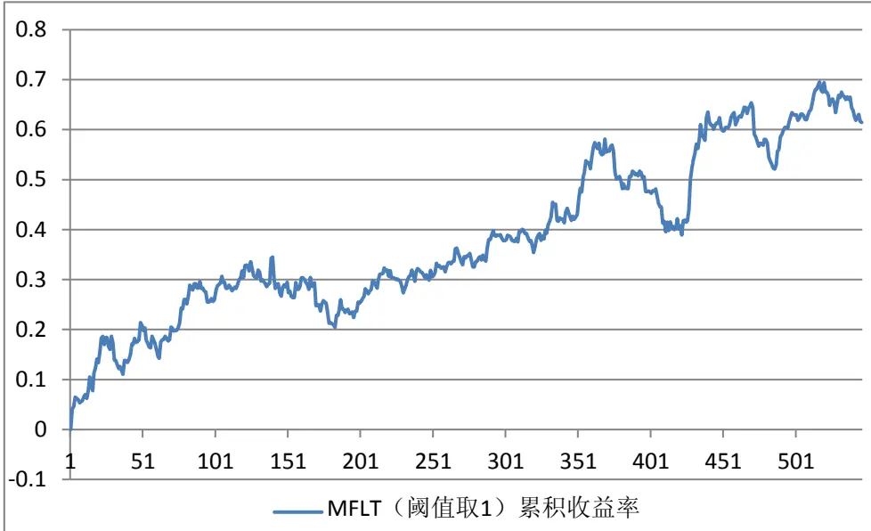
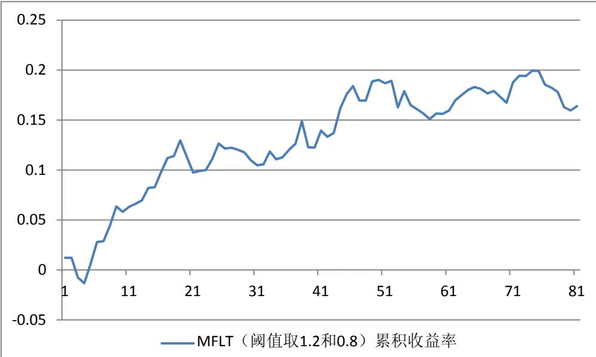
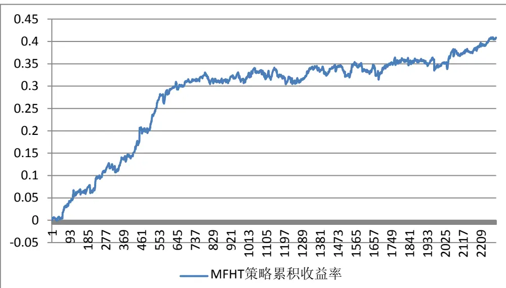

# Table_Title在标度不变性破缺下洞察资金流向——MFT 交易策略

## 16676——另类交易策略研究之七

安宁宁Table_Author 资深分析师

电话：0755-23948352

eMail：ann@gf.com.cn

执业编号：S0260512020003

## Table_Summary 基于相对资金流向的股指期货交易策略（MFT）

本篇报告将介绍两类基于资金流向的股指期货交易策略：低频趋势交易策略（MFLT）与高频反转交易策略（MFHT），其中资金流向由现货市场指数成分股的主动成交额决定。

## 沪深 300指数与沪深 300 股指期货互不领先

通过市场价格的高频数据，我们研究了沪深 300指数和沪深 300股指期货之间的领先性，使用的统计方法为Granger因果关系检验。根据检验结果，我们得到在 1分钟频率下沪深 300指数与沪深 300 股指期货互不领先的结论。由此，我们可以使用现货市场的资金流向数据预测期货市场。

## 相对资金流向指标

通过高频交易数据，我们定义了基于买、卖盘的资金流向，即交易者主动买入股票时，其成交金额记为流入资金；主动卖出股票时，其成交金额记为流出资金。相对资金流向指标则定义为主买资金与主卖资金的比值，当该指标大于1时，说明资金流入大于资金流出；相反，当该指标小于1时，说明资金流入小于资金流出。

## 资金流向低频趋势交易策略（MFLT）

相对资金流向指标在半个交易日频率下可以作为趋势指标构建交易策略。当某个交易日上午沪深 300现货市场的相对资金流向大于 时，我们认为该交易日市场情绪可能以看多为主，因此在午后进行趋势性做多建仓，并在尾盘平仓；同理，若上午沪深300现货市场的相对资金流向小于1 时，我们认为该交易日市场情绪可能以看空为主，因此在午后进行趋势性做空建仓，并在尾盘平仓。考虑万分之二的双边交易成本，在未设臵杠杆的情况下，该交易策略在股指期货上市以来的 546个交易日中获得61.46%的累积收益率（年化23.87%），最大回撤-12.15%，属于收益与风险均相对较高的低频交易策略。

## 资金流向高频反转交易策略（MFHT）

相反，相对资金流向指标在1分钟频率下可以作为反转指标构建交易策略。当相对资金流向大于（或小于）某一个大于（小于）1 的阈值参数时，我们采用下一分钟股指期货的收盘价开空（多）仓（预留一分钟行情数据接收、计算、下单及交易数据传送的时间），并在相对资金流向大小回到 1时平仓。考虑万分之二的双边交易成本，在未设臵杠杆的情况下，通过回测股指期货上市以来的 546 个交易日，我们获得 40.87%的累积收益率（年化16.55%），最大回撤仅-2.92%，平均持仓时间6.5分钟，属于收益与风险相对较低的交易策略。

## 由趋势到反转——标度不变性的破缺

相对资金流向指标，在不同交易频率尺度之下，分别展现出的趋势与反转特征，这可能与物理学中的标度不变性破缺有关。其本质在于，在价格动力学演化过程中，临界点处的关联长度有限，而这一结果的产生源自于市场效率较高，价格变量呈现出短程有序，长程无序的特征。这便是相对资金流向指标在从低频转换至高频的过程中，由趋势特征转变为反转特征的内在机制。

## 一、交易策略基本思想

期货市场与其对应的现货市场是相关性很高的两个市场。在一定程度上，可以通过一个市场的情况去预测另外一个市场。与此同时，资金流向已成为近年来预测股票市场的重要指标之一，但是资金流向在期货市场并没有严格和准确的定义。因此，我们可以通过沪深300指数（即现货市场）的资金流向情况判断沪深300股指期货（即期货市场）的变动，并按照预测结果对股指期货进行单向投机交易，从而实现盈利。

## 二、沪深300指数与期指的因果关系

期货市场与现货市场的同步性一直以来是学术界讨论的热点问题之一。在某些国家的市场中，期货与现货存在一定的异步性，即虽然两者存在较强的相关性，但由于其中某个市场具有一定的领先性或滞后性，则无法通过一个市场去同步预测另外一个市场，特别是在交易频率提高的情况下，该问题更加明显。因此在构建相关交易策略之前，有必要对沪深 300 指数和沪深 300 股指期货价格时间序列之间的因果关系进行研究，判断两者是否具有同步性。

所谓因果关系是指变量之间的依赖性，作为结果的变量是由作为原因的变量所决定的，原因变量的变化引起结果变量的变化。如果沪深 300 指数和沪深 300 股指期货价格其中一个是另外一个的成因，则表明两者不具有同步性，在交易频率较高的情况下则无法通过其中一个序列的有关信息去预测另外一个序列。

这里我们采用 Granger 因果关系检验的方法判定两组时间序列 $\{x_{i}\}$ 和 $\{y_{i}\}$ 的关系。Granger 因果检验假定了有关y 和x 每一变量的预测信息全部包含在这些变量的时间序列之中。检验要求估计以下的回归模型：

$$
y_{t}=\sum_{i=1}^{q}\alpha_{i}x_{t-i}+\sum_{j=1}^{q}\beta_{j}y_{t-j}+u_{1t}\tag{1}
$$

$$
x_{t}=\sum_{i=1}^{s}\lambda_{i}x_{t-i}+\sum_{j=1}^{s}\delta_{j}y_{t-j}+u_{2t}\tag{2}
$$

其中白噪声 $u_{1t}$ 和 $u_{2t}$ 假定为不相关的。

方程（1）假定当前 y 与 y 的过去值以及x的过去值有关，而方程（2）对x 也假定了类似的行为。

对式（1）而言，其零假设 $H_{0}:\alpha_{1}=\alpha_{2}=\cdots=\alpha_{_q}=0$

对式（2）而言，其零假设 $H_{0}:\delta_{1}=\delta_{2}=\dots=\delta_{s}=0$

由此，可以将因果检验的结果分为以下四类：

（I）x是引起y 变化的原因，即存在x到y 的单向因果性。若式（1）中滞后的x的系数估计值在统计上整体地显著不为零，同时式（2）中滞后的y 的系数估计值在统计上整体显著为零，则称x是引起y 变化的原因。

（II）y 是引起x变化的原因，即存在y 到x的单向因果性。若式（2）中滞后的y 的系数估计值在统计上整体地显著不为零，同时式（1）中滞后的x的系数估计值在统计上整体显著为零，则称 y 是引起x变化的原因。

（III）x和y 互为因果关系，即存在x到y 的因果性，同时也存在y 到x的因果性。若式（1）中滞后的x 的系数估计值在统计上整体显著不为零，同时式（2）中滞后的 y 的系数估计值在统计上整体显著不为零，则称x和y 存在反馈关系，或者双向因果性。

（IV）x和y 是独立的，或x和y 之间不存在因果性。若式（1）中滞后的x的系数估计值在统计上整体显著为零，同时式（2）中滞后的y 的系数估计值在统计上整体显著为零，则称x与y 之间不存在因果性。

值得注意的是，Granger因果关系检验中，滞后长度q或s 的选择是任意的，并且因果检验的结果对滞后长度q或s 的选择有时是很敏感的，即不同的滞后期，有时会对因果性的判断造成影响。因此一般而言，在进行 Granger 因果关系检验时，通常需要对不同的滞后长度分别进行试验。

从根本上来说，如果变量x是变量y 的原因，则x的变化应先于y 的变化。因此，在做 y 对其自身过去值的回归时，如果把x的过去值包括进来能显著地改进对y 的预测，我们就可以说x是 y 的原因。类似的，可以定义y 是x的原因。

具体来看，为了检验x是引起y 的原因，Granger因果关系检验步骤如下：

（I）将当前的y 对所有的滞后项做回归，即 $y_{t}$ 对 $y_{t-1},~y_{t-2},~\ldots,~y_{t-q}$ 及其他变量的回归，但在这一回归中没有把x 的滞后项包括进来。这是一个受约束的回归。从它可以得到受约束的残差平方和 $RSS_{R}$

（II）做含有x 滞后项的回归，即在前面的回归式中加入x 的滞后项。这是一个无约束的回归，由此回归得到无约束的残差平方和 $RSS_{U}$

（III）零假设是 $\begin{array}{r}{{\cal H}_{0}:\alpha_{1}=\alpha_{2}=\cdots=\alpha_{_q}=0}\end{array}$ ，即x的滞后项不属于此回归。

（IV）为了检验此假设，我们用F 检验，即

$$
F=\frac{\left(RSS_{_R}-RSS_{_U}\right)/q}{RSS_{_U}/\left(n-k\right)}\tag{3}
$$

它遵循自由度为 q和(n−k)的F分布。在这里n是样本容量；q 为x滞后项的个数，即约束回归方程中待估参数的个数，k是无约束回归中待估参数的个数。

（V）如果在选定的显著性水平 上计算的F 值超过临界 $F_{_{\alpha}}$ 值，则拒绝零假设，这样x的滞后项就属于此回归，表明x是引起y 变化的原因。

（VI）同样，为了检验 y 是否是引起x 变化的原因，可将变量 y 与x 相互替换，并重复（I）至（V）的步骤。

根据上述原理，我们使用 Eviews对沪深300指数与沪深300 股指期货的高频价格数据进行了因果检验，其中沪深 300 指数取每日的 1 分钟数据，股指期货对应于现货取连续合约每日 9:30 至 15:00 的 1 分钟数据，检验时间为股指期货上市的 2010 年 4月 16 日至 2012 年 7 月 4 日，共 546 个交易日。通过选择不同的滞后长度（分别令Lags=2,3,4,5），试验结果如表 1 所示。

表 1：沪深300 指数与股指期货连续合约因果关系检验结果

| Null Hypothesis: | Lags | F-Statistic | Prob. |
| --- | --- | --- | --- |
| IF01 does not Granger Cause HS300 |  | 641.385 | 4.00E-271 |
| HS300 does not Granger Cause IF01 |  | 10.1699 | 4.00E-05 |
| IF01 does not Granger Cause HS300 | 3 | 457.992 | 3.00E-288 |
| HS300 does not Granger Cause IF01 |  | 7.51117 | 5.00E-05 |
| IF01 does not Granger Cause HS300 | 4 | 355.332 | 2.00E-296 |
| HS300 does not Granger Cause IF01 |  | 7.51981 | 5.00E-06 |
| IF01 does not Granger Cause HS300 | 5 | 285.366 | 2.00E-296 |
| HS300 does not Granger Cause IF01 |  | 5.80167 | 2.00E-05 |

数据来源：广发证券发展研究中心

从表1中可以看出，在1分钟频率下，沪深300指数与股指期货互不具有因果关系，同时也可以说明，指数市场与现货市场互不具有领先性。但与此同时，经过计算，上述两组时间序列的相关系数达到0.9983，具有非常高的相关性。因此，我们有机会通过其中一个市场的情况，去预测另外一个市场，从而实现相关的交易策略。

## 三、基于主动买卖盘的相对资金流向指标

传统的资金流向定义认为，价格上涨时的成交金额为流入资金，价格下跌时的成交金额为流出资金，而价格未产生变化的成交则不计入资金流向。如果价格不变，是否真的就不产生资金流的偏向呢？根据我们前期的报告《基于高频数据的市场情绪择时研究》，价格的起伏只是资金流向所体现的一部分结果，但并不能完全涵盖资金流向。在股价涨跌以外，还有部分信息能够体现资金流的实际情况。

因此，通过高频交易数据，我们定义了基于买、卖盘的资金流向，即交易者主动买入股票时，其成交金额记为流入资金；主动卖出股票时，其成交金额记为流出资金。这样定义资金流向的内在逻辑在于，当市场出现利好消息时，此时投资者认为股价倾向于上涨，愿意通过“抢筹”的方式以相对较低的价格主动买入股票并等待上涨，而不是通过挂单等待其他人主动卖出（因为投资者本人认为这个时候很少会有人主动卖出即将上涨的股票；而如果此时不主动买入，股价将涨至更高）；同理，当市场出现利空时，投资者认为股价倾向于下跌，愿意尽早以相对较高的价格将手中股票卖出，此时他会选择主动卖出，而不是挂单在高位并等待股价下跌。当大多数投资者具有同样的上涨或下跌预期时，股价将被大量主动成交推高或压低，从而形成股票价格的变化。

基于上述个股的资金流向概念，我们可以对指数的资金流向 $MF_{I}$ 做出定义。例如对于沪深300指数，我们可以通过单位时间内其所有的成分股的主动买卖盘之和，定义该段时间指数的资金流向，即

$$
MF_{\scriptscriptstyle I}=\sum_{i}Buy_{i}-\sum_{j}Sell_{j}\tag{4}
$$

其中 $\sum_{i}Buy_{i}$ 为主动买入金额， $\sum_{j}Sell_{j}$ 为主动卖出金额。进一步，为了考虑主动买、卖盘的相对强弱，不妨定义相对资金流向指标

$$
RMF_{\mathrm{}_{I}}=\frac{\sum_{i}Buy_{i}}{\sum_{j}Sell_{j}}\tag{5}
$$

当 $RMF_{I}>1$ 时，买盘资金大于卖盘资金，总体为资金流入；当 $RMF_{I}<1$ 时，卖盘资金大于买盘资金，总体为资金流出。

由于之前的检验结果表明沪深300指数与股指期货之间不存在因果关系，结合沪深300股指期货的特点，我们可以判断两个市场具有同步性。因此基于现货市场的相对资金流向 $RMF_{I}$ 这一指标，我们将可以构建资金流向股指期货 T+0 交易策略（Money FlowTrading，简称 MFT）。

## 四、基于资金流向的低频交易（MFLT）策略

首先，我们尝试运用现货市场的相对资金流向指标 $RMF_{I}$ ，构建日内股指期货T+0低频交易策略（Money Flow Low-frequency Trading，简称MFLT）。之前我们已有一些关于日内低频交易策略的报告，如《基于混沌理论的股指期货噪声趋势交易（NTT）策略》《在对称中寻找非对称——半天趋势交易(HDTT)策略》等，它们都在半个交易日频率的基础之上进行策略构建。这里我们将继续沿用这一思路，即当某个交易日上午沪深300现货市场的资金流入大于资金流出时，我们认为该交易日市场情绪可能以看多为主，因此在午后进行趋势性做多建仓，并在尾盘平仓；同理，若上午沪深300现货市场的资金流入小于资金流出时，我们认为该交易日市场情绪可能以看空为主，因此在午后进行趋势性做空建仓，并在尾盘平仓。

具体来看，我们从2010年4月16日股指期货上市开始进行回测，交易策略为通过每天上午9:30-11:30沪深300指数成分股的交易情况，计算相对资金流向 $RMF_{I}$ ，午后按

13:00的开盘价对股指期货连续合约进行建仓，按照 $RMF_{I}$ 阈值取1的建仓策略为

$$
\left\{\begin{array}{ll}{RMF_{I}>1}&{\mathcal{H}\triangle\mathfrak{H}\measuredangle\mathfrak{Z}}\\{RMF_{I}<1}&{\mathcal{H}\triangle\mathfrak{H}\measuredangle\mathfrak{Z}}\end{array}\right.\tag{6}
$$

由于现货市场15:00收盘，对应的，我们选择在15:00按股指期货的实时价格进行平仓。

整个回测区间为2010年4月16日至2012年7月4日，共546个交易日。取0.02%的股指期货双边交易费率，在不考虑杠杆的情况下，回测结果如图1和表2所示。

图 1：MFLT策略（阈值取1）累积收益率

数据来源：广发证券发展研究中心

表2：MFLT策略（阈值取1）回测结果

| 总计交易日 | 546 |
| --- | --- |
| 盈利次数 | 278 |
| 亏损次数 | 268 |
| 平均盈利率 | 0.76% |
| 平均亏损率 | -0.60% |
| 成功率 | 50.92% |
| 累积收益率 | 61.46% |
| 最大回撤率 | -12.15% |
| 年化收益率 | 23.87% |

数据来源：广发证券发展研究中心

从回测结果可以看出，采取相对资金流向指标RMF 可以对股指期货连续合约进行

趋势性低频交易，并取得正收益。在546个交易日中，共获得61.46%的累积收益率。在该段回测区间内，有50.92%的交易日取得正收益，虽然超过50%，但偏性并不显著。在这样的情况下，MFLT策略仍可以获得23.87%的年化收益率（按一年244个交易日计算），这主要归功于平均盈利率显著大于平均亏损率的绝对值。

但是在该趋势交易策略中，较大的问题是最大回撤相对较大。在546个交易日中，最大回撤率为-12.15%，两次较大的回撤分别出现在2010年12月和2011年10月附近。为了规避这类较大的回撤，我们可以对相对资金流向 $RMF_{I}$ 开仓阈值进行调整，即只有当资金显著流入或显著流出时，我们才对股指期货连续合约进行开仓。例如，当

$RMF_{I}>1.2$ 时，我们认为资金显著流入；或 $RMF_{\scriptscriptstyle I}<0.8$ 时，资金显著流出。在满足上述阈值条件时，我们才顺势建仓，即

$$
\left\{\begin{array}{ll}{RMF_{I}>1.2}&{\mathcal{F}\triangleleft16/\mathcal{Z}}\\{RMF_{I}<0.8}&{\mathcal{F}\triangleleft16/\mathcal{Z}\overset{\left.\right.}{\Sigma}}\end{array}\right.\tag{7}
$$

平仓策略与之前相同，即开仓后按照当日15:00股指期货连续合约的实时价格进行平仓。同样对2010年4月16日至2012年7月4日进行策略回测，取0.02%的股指期货双边交易费率，在不考虑杠杆的情况下，回测结果如图2和表3所示。

图 2：MFLT策略（阈值取1.2和0.8）累积收益率

数据来源：广发证券发展研究中心

表3：MFLT策略（阈值取1）回测结果

| 总计交易日 | 546 |
| --- | --- |
| 交易次数 | 81 |
| 盈利次数 | 47 |
| 亏损次数 | 34 |
| 平均盈利率 | 0.81% |
| 平均亏损率 | -0.66% |
| 成功率 | 58.02% |
| 累积收益率 | 16.38% |
| 最大回撤率 | -3.32% |
| 年化收益率 | 7.01% |

数据来源：广发证券发展研究中心

比较（7）式与（6）式的开仓策略，在（7）式建立阈值显著性条件后，546个交易日中仅交易 81 次，交易次数大为减少。与此同时，判断成功率的大幅提升——在81 次交易中，盈利 47 次，成功率为 58.02%，最大回撤率也减小到了-3.32%。但是相比 16.38%的累积收益率，这样的最大回撤情况仍然难以令人满意，因此，对于 MFLT策略，我们仍然推荐采用（6）式中 $RMF_{I}$ 阈值取1 的建仓条件。在该建仓条件下的低频交易策略的风险相对较大，但总体收益情况仍较为可观。对于低风险交易策略，我们更为推荐的是下面的 MFHT策略。

## 五、基于资金流向的高频交易（MFHT）策略

通过上述MFLT策略，我们发现在半个交易日频率下交易沪深300股指期货，相对资金流向 $RMF_{I}$ 可以作为一个趋势指标使用。我们很自然地想到：该交易策略、该趋势指标在高频交易下是否仍然适用？

通过实证检验，我们发现答案是否定的。相反，相对资金流向 $RMF_{I}$ 可以作为一个反转指标在高频交易中使用，并在收益和风险方面具有良好的表现。

接下来我们就来看一下资金流向高频反转交易（Money Flow High-frequencyTrading，简称MFHT）的情况。同MFLT策略一样，我们从2010年4月16日股指期货上市开始进行回测，至2012年7月4日截止，共546个交易日。具体交易策略为通过沪深300指数成分股的高频数据，可以计算出沪深300指数每分钟的相对资金流向 $RMF_{I}$ 。由于之前利用Granger因果关系检验得到过沪深300股指期货与沪深300指数互不领先的结论，因此我们可以通过现货市场的高频 $RMF_{I}$ 对期货市场进行短期预测。

在实证中，我们发现在高频尺度下，市场相对资金流向 $RMF_{I}$ 总在一定范围内波动。当 $RMF_{I}$ 较高时，即短期内有相对较多的资金流入时，指数短线反转向下调整概率较大；而当 $RMF_{I}$ 较低时，即短期内有相对较多的资金流出时，指数短线反转向上回复概率较大。

根据上述想法，我们可以对1分钟高频 $RMF_{I}$ 设定两个边界阈值 $\alpha_{1}$ 、 $\alpha_{2}$ 。当$RMF_{I}>\alpha_{1}$ 时（ $(\alpha_{1}>1)$ ），我们采用下一分钟股指期货的收盘价开空仓（预留一分钟行情数据接收、计算、下单及交易数据传送的时间）；当市场资金流向恢复平衡，即$RMF_{I}=1$ 时，我们采用下一分钟股指期货的收盘价进行平仓。同理，当 $RMF_{I}<\alpha_{2}$ 时$(\ \alpha_{2}<1$ ），我们采用下一分钟股指期货的收盘价开多仓；当市场资金流恢复 $RMF_{I}=1$ 时，采用下一分钟股指期货的收盘价进行平仓。在整个策略的运用中，若保持对称性，可以取 $\alpha_{2}=1/\alpha_{1}$ 。同样，由于现货市场15:00收盘，当14:59仍有期货头寸持仓时，我们需要在15:00按股指期货的实时价格进行平仓。

按照上述高频交易策略，取0.02%的股指期货双边交易费率，在不考虑杠杆的情况

识别风险，发现价值

下，回测结果如图3和表4所示。

图 3：MFHT策略累积收益率

数据来源：广发证券发展研究中心

表4：MFHT策略回测结果

| 总计交易日 | 546 |
| --- | --- |
| 交易次数 | 2288 |
| 平均每日交易次数 | 4.2 |
| 平均持仓时间 | 6.5 分钟 |
| 盈利次数 | 1439 |
| 亏损次数 | 849 |
| 平均盈利率 | 0.111% |
| 平均亏损率 | -0.147% |
| 成功率 | 62.89% |
| 累积收益率 | 40.87% |
| 最大回撤率 | -2.92% |
| 年化收益率 | 16.55% |

数据来源：广发证券发展研究中心

从上述回测数据可以看出，MFHT策略属于相对低收益低风险的交易策略，其年化收益率约为16.55%，两年来的最大回撤率仅-2.92%，无论从收益还是风险的角度都要优于之前图2和表3中调整过的低风险MFLT策略。MFHT策略平均持仓时间仅6.5分钟，持仓风险相对较小，因此未设臵止损条件。也就是说，MFHT策略能够具有上述较好的风险与收益情况，主要源于其预测成功率较高（约62.89%）。

接下来，我们有必要在实证的基础之上，思考一下相对资金流向RMF 指标从趋势

到反转的内在逻辑。同一个指标，在不同交易频率尺度之下，展现出不同的交易特征。
这种现象乍然看来是令人费解的。然而细细思索，其背后具有一定的科学依据。

在自然界，如果一种物理规律对于某个变量x而言，当x变换到不同尺度时，该物理规律都不发生变化，则称该物理规律对于变量x具有标度不变性。标度变换在数学上就是所谓的自相似变换，标度不变性相当于分形结构在不同尺度下具有相同的分形特征。然而，物理规律呈现出标度不变性的充要条件是关联长度在临界点处趋于无穷。关联长度趋于无穷，意味着在变量x所处空间的某个点和无穷远处的某个点具有关联性。

若将期货价格波动看作价格空间中的一维动力学系统，在不同时间（频率）尺度下进行交易，如果长期来看累积收益率都可以稳定保持正向或负向，则可以视作收益情况对时间变量满足标度不变性。但是在实证检测中，我们发现这种时间尺度下的标度不变性发生了破缺，即基于某一相对资金流向 $RMF_{I}$ 阈值的累积收益率在不同标度下发生了反转，这种破缺和市场的有效性具有紧密联系。在完全有效市场中，价格（收益率）的变化不具有时间记忆性，也就是说，某一时刻的价格变动 $\Delta P_{t1}$ 与另一时刻的 $\Delta P_{t2}$ 不具有

关联性。而实际的市场是非完全有效的，因此这种价格变动的关联往往呈现出短程有序、长程无序的特征，即在短时间内价格变动具有一定的关联性，而随着时间的延长，这种关联性逐步消失。这就导致当前收益率与无穷远时点处的收益率不具有关联性，从而使任意时点的关联长度都不可能趋于无穷，并由此出现标度不变性破缺。换句话说，针对某个指标，不同时间尺度下收益率的特征有可能出现不同情况，这便是相对资金流向$RMF_{I}$ 指标在从低频转换至高频的过程中，由趋势特征可能转变为反转特征的内在机制。

## 六、总结

本篇研究报告从资金流向的角度出发，构建了沪深 300 股指期货低频和高频两类交易策略。由于期货市场的资金流向指标较难准确定义，我们考虑通过现货市场的资金流向情况预测期货市场。首先，我们通过 Granger 因果关系检验得到沪深 300 期、现货市场互不领先的结论。在此结论的基础之上，我们通过沪深 300 指数成分股的主动买卖盘情况，定义了相对资金流向 $RMF_{I}$ ，并期望通过该指标对期货市场进行预测。接下来我们研究了基于 $RMF_{I}$ 的低频和高频交易策略。在低频策略 MFLT中，我们发现每个交易日上午的 $RMF_{I}$ 可以作为趋势指标对下午期指的涨跌作出预判，由于该交易策略的平均盈利率显著大于平均亏损率的绝对值，因此在回测中其年化收益率可以达到 23.87%，但同时也具有相对较大的回撤；而在高频策略 MFHT 中，通过采用 1 分钟数据计算 $RMF_{I}$ ，我们发现该指标在偏离平衡位臵时可以作为反转指标对股指期货之后短期的涨跌情况做出判断，其判断成功率约为 62.89%，由此我们得到了 16.55%的年化收益率，而在两年时间的回测中，其最大回撤率仅-2.92%，因此 MFHT策略是一种相对风险较低的高频交易策略。

| 罗军，首席分析师，华南理工大学理学硕士，2010年进入广发证券发展研究中心。 |
| --- |
| 俞文冰，首席分析师，CFA，上海财经大学统计学硕士，2012年进入广发证券发展研究中心。 |
| 叶涛，资深分析师，CFA，上海交通大学管理科学与工程硕士，2012年进入广发证券发展研究中心。 |
| 安宁宁，资深分析师，暨南大学数量经济学硕士，2011年进入广发证券发展研究中心。 |
| 胡海涛，分析师，华南理工大学理学硕士，2010年进入广发证券发展研究中心。 |
| 夏潇阳，分析师，上海交通大学金融工程硕士，2012年进入广发证券发展研究中心。 |
| 汪鑫，分析师，中国科学技术大学金融工程硕士，2012年进入广发证券发展研究中心。 |
| 李明，分析师，伦敦城市大学卡斯商学院计量金融硕士，2010年进入广发证券发展研究中心。 |
| 蓝昭钦，分析师，中山大学理学硕士，2010年进入广发证券发展研究中心。 |
| 史庆盛，分析师，华南理工大学金融工程硕士，2011年进入广发证券发展研究中心。 |
| 张超，分析师，中山大学理学硕士，2012年进入广发证券发展研究中心。 |

## Table_A 广发金融工程研究小组uthorSummary

## Table_Report 相关研究报告

基于混沌理论的股指期货噪声趋势交易（NTT）策略

基于低阶多项式拟合的股指期货趋势交易(LPTT)策略

|  | 广州市 | 深圳市 | 北京市 | 上海市 |
| --- | --- | --- | --- | --- |
| 地址 | 广州市天河北路 183 号 大都会广场5楼 | 深圳市福田区民田路178 | 北京市西城区月坛北街2号 | 号上海市浦东南路 528号 |
| 邮政编码 | 510075 | 号华融大厦9楼 518026 | 月坛大厦18层 100045 | 上海证券大厦北塔17楼 200120 |
| 客服邮箱 | gfyf@gf.com.cn |  |  |  |
| 服务热线 | 020-87555888-8612 |  |  |  |

## 免责声明

le_Disclaimer广发证券股份有限公司具备证券投资咨询业务资格。本报告只发送给广发证券重点客户，不对外公开发布。

本报告所载资料的来源及观点的出处皆被广发证券股份有限公司认为可靠，但广发证券不对其准确性或完整性做出任何保证。报告内容仅供参考，报告中的信息或所表达观点不构成所涉证券买卖的出价或询价。广发证券不对因使用本报告的内容而引致的损失承担任何责任，除非法律法规有明确规定。客户不应以本报告取代其独立判断或仅根据本报告做出决策。

广发证券可发出其它与本报告所载信息不一致及有不同结论的报告。本报告反映研究人员的不同观点、见解及分析方法，并不代表广发证券或其附属机构的立场。报告所载资料、意见及推测仅反映研究人员于发出本报告当日的判断，可随时更改且不予通告。

本报告旨在发送给广发证券的特定客户及其它专业人士。未经广发证券事先书面许可，任何机构或个人不得以任何形式翻版、复制、刊登、转载和引用，否则由此造成的一切不良后果及法律责任由私自翻版、复制、刊登、转载和引用者承担。